52414 - lab 1
================
Polke Matan and Lourie Yonatan
23/5/2021

### 1.

Read the data, make the date column as datetype, make an ID column.

``` r
df <- read.csv("owid-covid-data.csv")
df$date <- as.Date(df$date)
df$ID <- seq.int(nrow(df))
class(df$date)
```

    ## [1] "Date"

### 2.

First of all, ive created a function that will omit NA data only from
the desired variables. Then, i made a function that will: run the
aggregate function for every country to find the maximum total cases per
million, and sorted it by the total cases value. Ive extracted the top 5
countries. Then i did the same procedure to find the minimum date of
each one of the countries. At the end, ive joined both of the
dataframes, and filtered only the top 5 countries that i found. at the
end i will loop over all the desired vars and deploy the function for
each one of them.

``` r
OmitCertainCols <- function(data, desiredCols) {
  completeVec <- complete.cases(data[, desiredCols])
  return(data[completeVec, ])
}


  ex2 <- function(var) {
    df <- OmitCertainCols(df,c("location", "date", var))
    top_counry_df <- aggregate(df[var], by=list(df$location), max)
    top_counry_df <- na.omit(top_counry_df)
  top_counry_df <- top_counry_df[order(-top_counry_df[, var]),]
  colnames(top_counry_df) <- c("location", var)
  
  top_countries <- top_counry_df[order(-top_counry_df[, var]),]$location[1:5]
  last_date <- aggregate(df$date, by=list(df$location), max)
  colnames(last_date) <- c("location", "last_date")
  
  total_cases_ans <- subset(left_join(top_counry_df, last_date, by="location"), location %in% top_countries)
  
  return(total_cases_ans)
    
}
lst <- c("total_cases_per_million", "total_deaths_per_million", "total_vaccinations_per_hundred" )
for (par in lst) {
  print(ex2(par))
}
```

    ##     location total_cases_per_million  last_date
    ## 1    Andorra                172341.9 2021-05-04
    ## 2 Montenegro                155737.8 2021-05-04
    ## 3    Czechia                152847.0 2021-05-04
    ## 4 San Marino                149301.7 2021-05-04
    ## 5   Slovenia                116779.7 2021-05-04
    ##                 location total_deaths_per_million  last_date
    ## 1                Hungary                 2903.104 2021-05-04
    ## 2                Czechia                 2747.320 2021-05-04
    ## 3 Bosnia and Herzegovina                 2655.743 2021-05-04
    ## 4             San Marino                 2651.895 2021-05-04
    ## 5             Montenegro                 2413.774 2021-05-04
    ##               location total_vaccinations_per_hundred  last_date
    ## 1            Gibraltar                         211.08 2021-05-01
    ## 2           Seychelles                         129.88 2021-05-03
    ## 3     Falkland Islands                         126.53 2021-04-14
    ## 4               Israel                         121.03 2021-05-04
    ## 5 United Arab Emirates                         108.99 2021-05-04

We can see the three tables with the desired values.

### 3.

#### a.

The function arguments are dataframe and string(name of a column in the
dataframe). In the first few rows, the function is cleaning missing
values, filtering values that are less from zero. The if and else
statement are just to make the function more flexible. Ive figure out
from the data that for every continent the ISO\_code is starting with
OWID, so i filtered by that. Then its just a simple ggplot function. \*I
added a function that calculate the difference between min and max date
in months.

``` r
months_diff <- function(end_date, start_date) {
    ed <- as.POSIXlt(end_date)
    sd <- as.POSIXlt(start_date)
    12 * (ed$year - sd$year) + (ed$mon - sd$mon)
}


ex3a <-  function(df,col){
  df1 <- filter(df, df[col]>0)
  if (any(names(df1) == "continent")) {
    df1 <- OmitCertainCols(df1,c("date", col, "continent"))

    
  }
  else {
    df1 <- OmitCertainCols(df1,c("date", col, "location"))
  }
  
  
  if (any(names(df1) == "iso_code")) {
    df1 <- df1[grepl("^OWID", df1$iso_code) & df1$location %in% c("Africa", "Asia","Europe","North America","South America", "Oceania"),]  
 
  }
  
  
months <- round(months_diff(max(df1$date),min(df1$date))/10)+1


ggplot(df1,aes_string(y=col,col="location"))+ geom_line(aes(x=as.Date(date)), size=0.8,alpha=0.99)+ylab(gsub("_"," ",col))+xlab("date")+ scale_x_date(date_labels = "%m-%Y", date_breaks = paste0(months, " month")) +ggtitle(paste0(col, " per continent")) +scale_color_brewer(palette ="Dark2")
}
```

#### b.

``` r
ex3a(df, "new_cases")
```

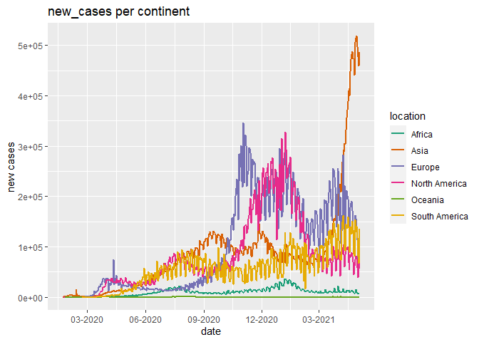<!-- -->
From the graph above, we can see the first peak in Asia at March 2020,
then a peak in Europe. We can also see clearly the dramatic rise in Asia
which probably refer to India in the last month. because the graph is
not in logarithmic scale, the newest cases looks much higher than what
happened year ago and its really hard to see the real pattern.

In the column new\_cases\_smoothed we have negative values that will be
NA after the log transformation, so I added a constant to the whole
dataset. There is alot of way to deal with negative data in a log
transformation, but i find this way most straightforward and clean.

``` r
log_transofrmer <- function(df, col, new_col) {
  df <- subset(df, df[col]>0)
  min_val <- min(na.omit(df[col]))
  df[col] <- df[col] + abs(min_val)
  df[new_col] <- log(df[col])
  return(df)
}

dfex3a <- df
dfex3a <- log_transofrmer(df, "new_cases_smoothed", "new_cases_smoothed_log")
ex3a(dfex3a, "new_cases_smoothed_log")
```

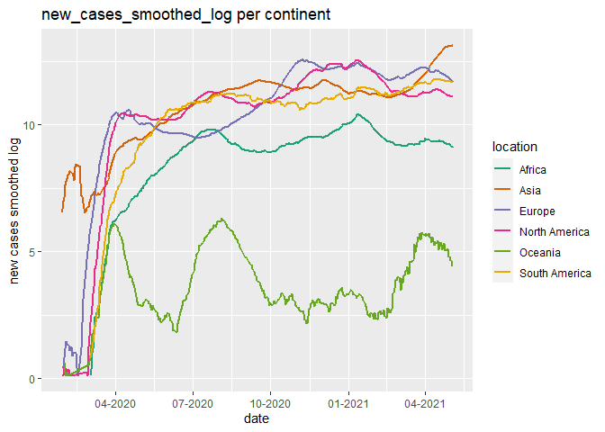<!-- -->

Its easy to see that is much more easier to interpret the smooth log
plot of new cases. The data is smooth by 7 days - which means that we
will see less “steps” in the data. When we care about relative change -
is better to use the logarithmic scale, and when we care about
**absolute** change we will use the original linear data. In our case we
want to see the patrtren of the new cases so its smarter to use the
logarithmic scale.

``` r
dfex3b <- df
dfex3b <- log_transofrmer(df, "new_deaths_smoothed", "new_deaths_smoothed_log")

ex3a(dfex3b, "new_deaths_smoothed_log")
```

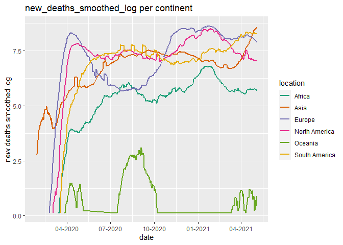<!-- -->

``` r
dfex3b <- df
dfex3b <- log_transofrmer(df, "new_vaccinations_smoothed", "new_vaccinations_smoothed_log")

ex3a(dfex3b, "new_vaccinations_smoothed_log")
```

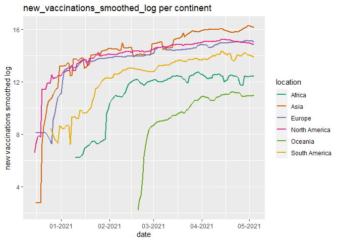<!-- -->
The pattern of new deaths looks pretty correlate with Eurpoe and North
America. We can see clearly the “Waves” at each continent. and we can
also see how that in all continent (Except from Asia), the numbers are
going down.

In the new vaccination graph we can see the same pattern - sharp rise
when in the begining, and then convergence to a more moderate line.

### 4

The function is subsetting a certain continent data, and then applying a
sum function by date for every date. The output is a dataframe with
columns: date, InputColumn, continent. \#\#\#\# a.

``` r
ex4a  <-  function(df,col){
  df <- OmitCertainCols(df,c("location"))
  # df <- subset(df, continent != "")
  continents=c("Africa", "Asia","Europe","North America","South America", "Oceania")
  ContinentData=data.frame()
  tmp.data=data.frame()
  
  for(c in c(continents)){
    ConDate <- df %>% filter(continent == c |location==c)
    ConDate <- ConDate[c("date", col)]
    ConDate[is.na(ConDate)] <-  0
    
    colnames(ConDate) <- c("date", "x")
    agg1 <- aggregate(ConDate$x, by=list(ConDate$date), sum)
    
    agg1$continent=c
    ContinentData=rbind(ContinentData,agg1)
  }
  colnames(ContinentData)=c("date", col,"continent")
  return(ContinentData)
}
```

#### b.

``` r
ex4b_df <- ex4a(df, "new_tests_smoothed")
ex4b_df$location <- ex4b_df$continent  


dfex4b <- log_transofrmer(ex4b_df,"new_tests_smoothed", "new_tests_smoothed_log")

ex3a(dfex4b, "new_tests_smoothed_log")
```

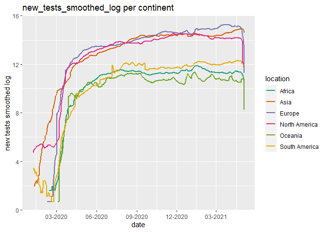<!-- -->

### 5

I made tow tables for each one of the variables, then joined them
together and ploted the scatterplot + the abline of the regression.
\#\#\#\# a.

``` r
df_ <- OmitCertainCols(df, c("total_cases_per_million", "total_deaths_per_million"))
ex5Model <- lm(total_deaths_per_million ~total_cases_per_million, data=df)
MaxCasesPerMillion <- aggregate(total_cases_per_million~location , df, FUN = max)
MaxDeathsPerMillion <- aggregate(total_deaths_per_million~location , df, FUN = max)
ex5_df <- full_join(MaxCasesPerMillion, MaxDeathsPerMillion, by="location")
ggplot(ex5_df, aes(x=total_cases_per_million, y=total_deaths_per_million)) + geom_point() +  stat_smooth(method = "lm", col = "red")
```

    ## `geom_smooth()` using formula 'y ~ x'

    ## Warning: Removed 8 rows containing non-finite values (stat_smooth).

    ## Warning: Removed 8 rows containing missing values (geom_point).

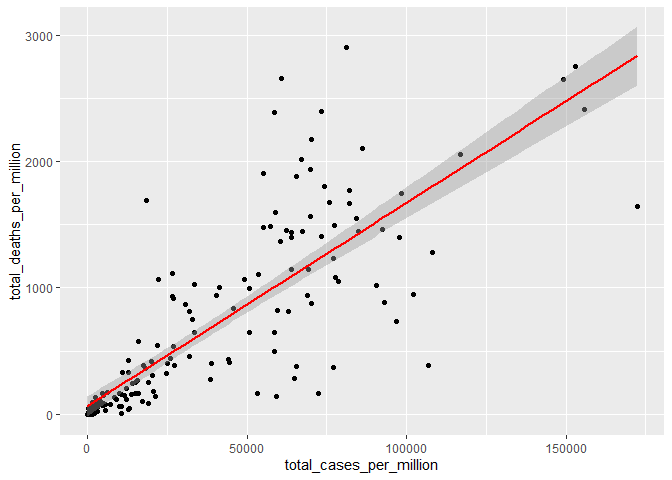<!-- -->

The slope is 0.0165399 which mean that for every case only a fraction of
0.0165399 will be dead. For example, for every 10,000 people who got
corona, only 165.3986717 will die.

#### b.

``` r
df_ex5 <- OmitCertainCols(df, c("new_cases","new_deaths", "date", "location" ))
ex5b_df_case <- df_ex5 %>%
  group_by(location) %>%
  top_n(n=1,wt= new_cases)


ex5b_df_case <- ex5b_df_case[!duplicated(ex5b_df_case[ , c("location","new_cases")]),]
date_cases <- ex5b_df_case[c("location", "date")]

ex5b_df_death <- df_ex5 %>%
  group_by(location) %>%
  top_n(n=1, wt=new_deaths)

ex5b_df_death <- ex5b_df_death[!duplicated(ex5b_df_death[ , c("location","new_deaths")]),]
date_deaths <- ex5b_df_death[c("location", "date")]

ex5b_df <- full_join(date_cases, date_deaths,by="location")
names(ex5b_df) <- c("location", "date_cases", "date_deaths")


ggplot(ex5b_df, aes(x=date_cases, y=date_deaths)) + geom_point() +  stat_smooth(method = "lm", col = "red")
```

    ## `geom_smooth()` using formula 'y ~ x'

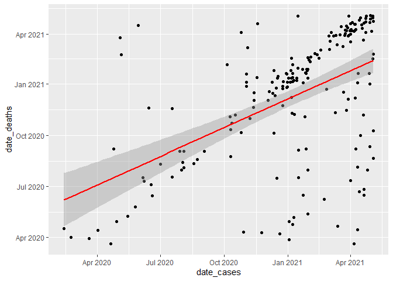<!-- -->

``` r
ex5b_df$date_cases <- as.numeric(ex5b_df$date_cases)
ex5b_df$date_deaths <- as.numeric(ex5b_df$date_deaths)
ex5bModel <- lm(date_cases~date_deaths, data=ex5b_df)
summary(ex5bModel)
```

    ## 
    ## Call:
    ## lm(formula = date_cases ~ date_deaths, data = ex5b_df)
    ## 
    ## Residuals:
    ##      Min       1Q   Median       3Q      Max 
    ## -294.734  -41.087    4.744   47.378  209.130 
    ## 
    ## Coefficients:
    ##              Estimate Std. Error t value Pr(>|t|)    
    ## (Intercept) 1.022e+04  1.052e+03   9.711  < 2e-16 ***
    ## date_deaths 4.522e-01  5.657e-02   7.994 1.26e-13 ***
    ## ---
    ## Signif. codes:  0 '***' 0.001 '**' 0.01 '*' 0.05 '.' 0.1 ' ' 1
    ## 
    ## Residual standard error: 91.5 on 189 degrees of freedom
    ## Multiple R-squared:  0.2527, Adjusted R-squared:  0.2487 
    ## F-statistic: 63.91 on 1 and 189 DF,  p-value: 1.263e-13

The slope is 0.4522053. is not that close to one because probably there
is not that high correlation between the tow variables. BUT, its really
make sense that after a few weeks from the date with maximum new cases,
it will be the date with the maximum dates. I think that is the reason
that we dont have better correlation. The intercept is not that
informative here.

### 6

In this question I filterd the relvenat columns to new df for each
column (“new\_cases”,‘new\_deaths’,‘new\_vaccinations’). Then I summed
each relevant column, by month, and combined to a df called “monthly”

``` r
df6 <- OmitCertainCols(df,c("continent"))
q6 <-df6[c("date","new_cases",'new_deaths','new_vaccinations')]
q6[is.na(q6)]<-0
q6$monyear <- strftime(q6$date, "%Y-%m") 
q6a <- aggregate(new_cases ~ monyear, q6, FUN = sum)
q6b <- aggregate(new_deaths ~ monyear, q6, FUN = sum)
q6c <- aggregate(new_vaccinations ~ monyear, q6, FUN = sum)
monthly <- cbind(q6a,q6b[2],q6c[2])
monthly
```

    ##    monyear new_cases new_deaths new_vaccinations
    ## 1  2020-01     28123        588                0
    ## 2  2020-02    228945       8212                0
    ## 3  2020-03   2765642     152788                0
    ## 4  2020-04   7803901     655044                0
    ## 5  2020-05   8896085     434770                0
    ## 6  2020-06  12926406     406209                0
    ## 7  2020-07  21614052     504986                0
    ## 8  2020-08  24188347     530623                0
    ## 9  2020-09  26507695     499563                0
    ## 10 2020-10  39859348     572083                0
    ## 11 2020-11  57032304     917358                0
    ## 12 2020-12  61902278    1163276         18424121
    ## 13 2021-01  62490830    1333589        251437430
    ## 14 2021-02  36304061     967062        446573190
    ## 15 2021-03  48459136     919228       1018522371
    ## 16 2021-04  71490434    1164567       1638632822
    ## 17 2021-05   9181766     147474        164575093

``` r
ggplot(monthly,aes(x=monyear,y=new_cases))+geom_bar(stat = "identity") + ggtitle("Global new cases per month") +
scale_y_continuous(labels = scales::unit_format(unit = "M", scale = 1e-6)) +
  theme(axis.text.x= element_text(angle = 90, vjust = 0.5, hjust=1))
```

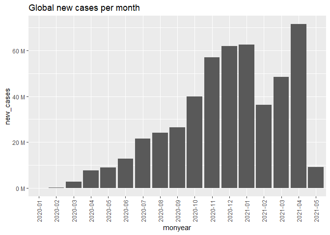<!-- -->

``` r
ggplot(monthly,aes(x=monyear,y=new_deaths))+geom_bar(stat = "identity") + ggtitle("Global new deaths per month") +
scale_y_continuous(labels = scales::unit_format(unit = "M", scale = 1e-6)) +
  theme(axis.text.x= element_text(angle = 90, vjust = 0.5, hjust=1))
```

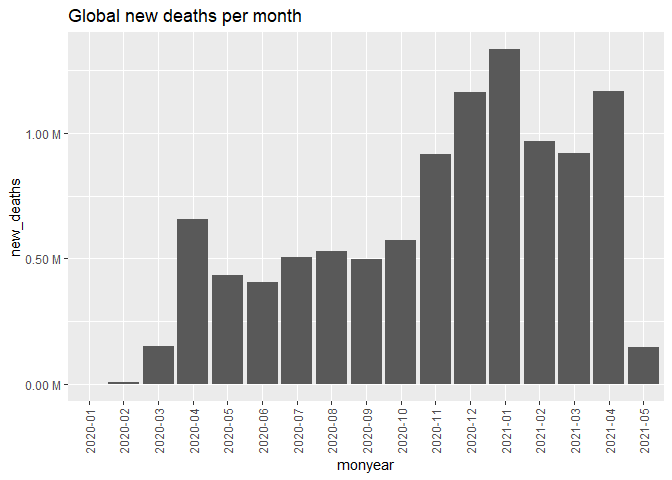<!-- -->

``` r
ggplot(monthly,aes(x=monyear,y=new_vaccinations))+geom_bar(stat = "identity") + ggtitle("Global new vaccinations per month") +
scale_y_continuous(labels = scales:: unit_format(unit = "M", scale = 1e-6)) +
  theme(axis.text.x= element_text(angle = 90, vjust = 0.5, hjust=1))
```

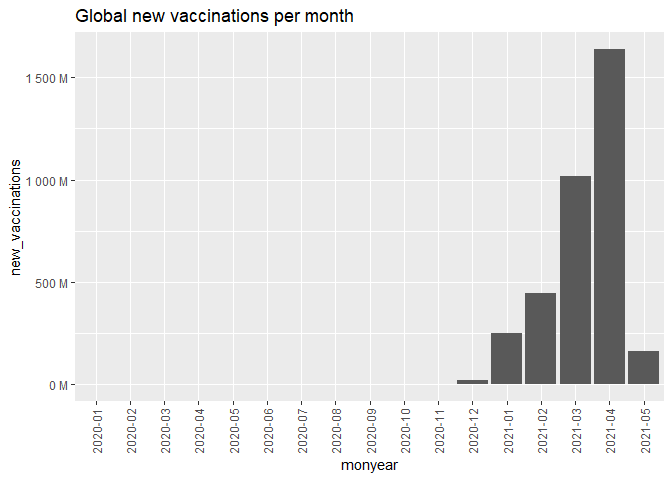<!-- -->

we can see the barplots showing us by months the info
(“new\_cases”,‘new\_deaths’,‘new\_vaccinations’) in the df monthly, in
millions.

### 7:

I add to the data frame the column deathrate, which is the number
created form the number of deaths divided divided by the number of cases
the country had so far. then I made a histgram shows the up to date
death rate, and listed the 3 countries with the highest death rate.

``` r
df <- OmitCertainCols(df,c("total_cases","date","location","total_deaths"))
df['death_rate'] <- df["total_deaths"]/df["total_cases"]
q7 <- df %>% filter(date == "2021-05-04")
qplot(q7$death_rate,geom = "histogram",bins=50, main = "current global death rate by country",xlab = "Death Rate",ylab = "Number of countries")
```

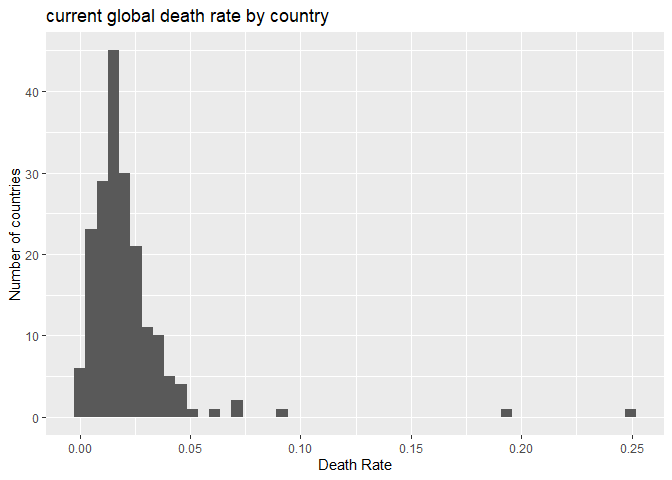<!-- -->

``` r
q7 <- q7[,c("location","date","death_rate")]
q7 %>% top_n(3, death_rate)
```

    ##   location       date death_rate
    ## 1   Mexico 2021-05-04  0.0925386
    ## 2  Vanuatu 2021-05-04  0.2500000
    ## 3    Yemen 2021-05-04  0.1940532

we can see that almost all of the death rates are under 5%. we can see a
table of the 3 countries with the highest death rate.

### 8:

I’ve added to df a new column thats shows the percent of fully
vaccinated people out of all vaccinated people. Then, I filtered the
result of the two dose fraction along time of USA,UK and Israel.

``` r
df['two_dose_fraction'] <- df["people_fully_vaccinated"]/df["people_vaccinated"]
q8 <-df[c("date","location","two_dose_fraction")]
q8 <- q8 %>% filter(location == "Israel"|location == "United Kingdom"|location == "United States" )
q8 <- q8 %>% na.omit()
ggplot(q8,aes_string(y='two_dose_fraction', col="location"))+ ggtitle("Two dose vaccination % by country and date") + geom_line(aes(x=as.Date(date))) + xlim(as.Date("2020-11-01"), as.Date("2021-05-04"))
```

<!-- -->

we can see that Israel and USA have a similar stratagey,just Israel
began first.we can see the strategy is to fully vaccine each person
which is vaccined, because the line is going up. The UK line is going
down from mid January, which shows us that there are taking a big gap
bewtween the two vaccines for every person.

### 9

#### a.

In this function I will create a vector length of 121.from -60 to 60.
each number is represnting the days gap between two columns we receive.
we will run over all the days inside our range of dates the are the gap
of dates. crate two vectors and check the correlation between them.

``` r
ex9a <- function(df,loc,col1,col2){
  vector_ans <- c()
  q9 <- subset(df,location == loc)
  q9 <- q9[,c(all_of(col1),all_of(col2),"date", "location")]
  start_date <- min(q9$date)
  fin_date <- max(q9$date)
  for (i in seq(60,0,-1)){
    dxt <-  seq(start_date+i , fin_date,by="days")
    dyt <-  seq(start_date , fin_date-i,by="days")
    vecx <- q9 %>% filter(date %in% dxt) %>% select(all_of(col1))
    vecy <- q9 %>% filter(date %in% dyt) %>% select(all_of(col2))
    vector_ans <- c(vector_ans,cor(vecx,vecy,use="complete.obs"))
    }
  for (i in c(1:60)){
    dxt <-  seq(start_date , fin_date-i,by="days")
    dyt <-  seq(start_date+i , fin_date,by="days")
    vecx <- q9 %>% filter(date %in% dxt) %>% select(all_of(col1))
    vecy <- q9 %>% filter(date %in% dyt) %>% select(all_of(col2))
    vector_ans <- c(vector_ans,cor(vecx,vecy,use="complete.obs"))
  }

  return(vector_ans)
}
```

#### b.

use function from 9a at 9b for Canada, new cases and new deaths

``` r
Canada_cor <- ex9a(df,"Canada","new_cases","new_deaths")
Days_gap <- seq(-60,60,1)
data_9 <- data.frame(cbind(Days_gap,Canada_cor))
ggplot(data_9,aes(x=Days_gap,y=Canada_cor)) + geom_point()+ ggtitle("Candas cor between new deaths and cases") 
```

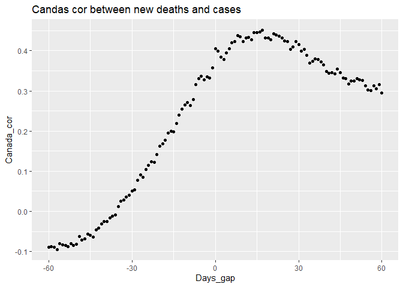<!-- -->
we can see on the plot that the highest correlation between new cases
and death is with +15 days gap. the distribution is close to normal with
a left tail.

### 10

Ive gather the data separately and joined it all by location (put a note
that there is alot of nulls with the vaccinations per hundred, i assumed
that those countries have vaccinated yet). Then i plotted the result
with ggplot and made israel an UK in red.

``` r
dfex10 <- OmitCertainCols(df, c("date", "new_cases_smoothed"))
dfex10 <- subset(dfex10, continent!="")
current_newCases <- subset(dfex10, date=="2021-04-23")[,c("location", "new_cases_smoothed", "population")]
maximal_newCases <- aggregate(new_cases_smoothed~location, dfex10, FUN=max)
total_Vacc <- subset(dfex10, date=="2021-04-01")[,c("location", "total_vaccinations_per_hundred", "population")]


ratioMaker <- full_join(current_newCases, maximal_newCases, by="location")

ratio <- ratioMaker$new_cases_smoothed.x/ratioMaker$new_cases_smoothed.y
ratioMaker$ratio <- ratio


results_table <- full_join(ratioMaker[,c("location", "ratio")],total_Vacc, by="location" )
results_table[,c("ratio")] <-  log(results_table[,c("ratio")])

ggplot(data=results_table, aes(x=total_vaccinations_per_hundred, y=ratio, label=location)) + geom_point()+ geom_point(data=results_table[results_table$location %in% c("Israel","United Kingdom"),],color="red") +geom_text(aes(label=ifelse(location %in% c("Israel","United Kingdom"),as.character(location),'')),hjust=0.4,vjust=-1)+ ggtitle("Vaccination effect on new cases") 
```

    ## Warning: Removed 96 rows containing missing values (geom_point).

    ## Warning: Removed 96 rows containing missing values (geom_text).

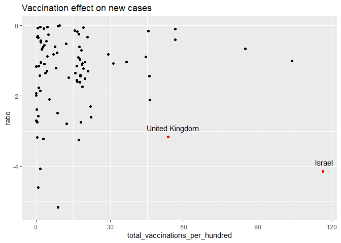<!-- -->

We can see that IL and UK did a lot of vaccination and the ratio of
$\\frac{Current(New\\\_cases)}{Max(new\\\_cases)}$ is pretty low. which
means that the vaccinations have a good impact on the ratio of new
cases. If we will look at the countries with the same number of
vaccinations it seems like there is worst ratio of new cases. I plotted
the data again but now with the size of the population:

``` r
lab_counties <- c("Israel","United Kingdom")
biggest <- top_n(results_table, 3, wt=population)$location
mostVacc <- top_n(results_table, 3, wt=total_vaccinations_per_hundred)$location
GoodRatio <- top_n(na.omit(results_table), 5, wt=-ratio)$location


ggplot(data=results_table, aes(x=total_vaccinations_per_hundred, y=ratio, label=location,size=population)) + geom_point()+


geom_point(data=results_table[results_table$location %in% biggest,],color="blue") +geom_text(aes(label=ifelse(location %in% biggest,as.character(location),'')),hjust=0.4,vjust=-1, size=4)+ 
  
geom_point(data=results_table[results_table$location %in% mostVacc,],color="green") +geom_text(aes(label=ifelse(location %in% mostVacc,as.character(location),'')),hjust=0.4,vjust=-1, size=4)+ 
  
geom_point(data=results_table[results_table$location %in% GoodRatio,],color="purple") +geom_text(aes(label=ifelse(location %in% GoodRatio,as.character(location),'')),hjust=0.4,vjust=-1, size=4)+ 
  
geom_point(data=results_table[results_table$location %in% lab_counties,],color="red") +geom_text(aes(label=ifelse(location %in% lab_counties,as.character(location),'')),hjust=0.4,vjust=-1, size=4)+ 
 guides(color = guide_legend(override.aes = list(linetype = c(1, 0) ) ) )+
theme_bw() +theme(legend.position="none")+

  ggtitle("Vaccination effect on new cases") 
```

    ## Warning: Removed 96 rows containing missing values (geom_point).

    ## Warning: Removed 96 rows containing missing values (geom_text).

    ## Warning: Removed 96 rows containing missing values (geom_text).

    ## Warning: Removed 96 rows containing missing values (geom_text).

    ## Warning: Removed 96 rows containing missing values (geom_text).

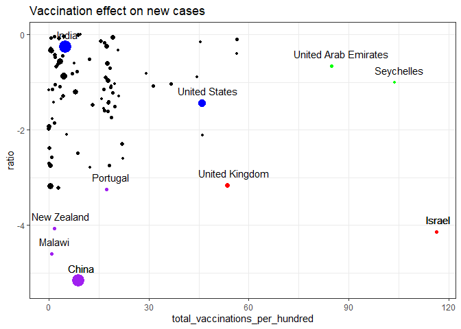<!-- -->

Blue - biggest countries, Purple - best ratio, Green - Most vaccinated.
We can see the great difference in the raio between China and India
(which have almost the same size, same vaccination). I think that the
problem with this comparison is that we need also take in consideration
the velocity of the vaccination (in Israel the vaccination operation
ended in a \~month).
