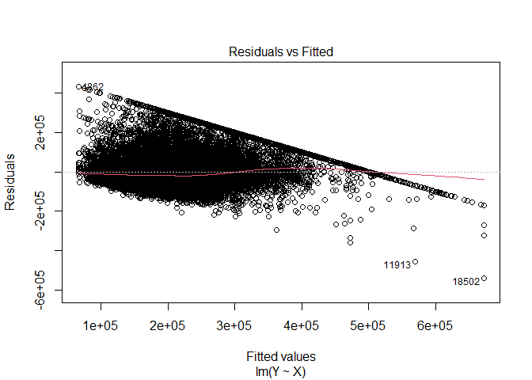
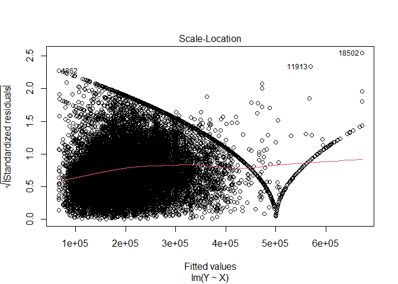
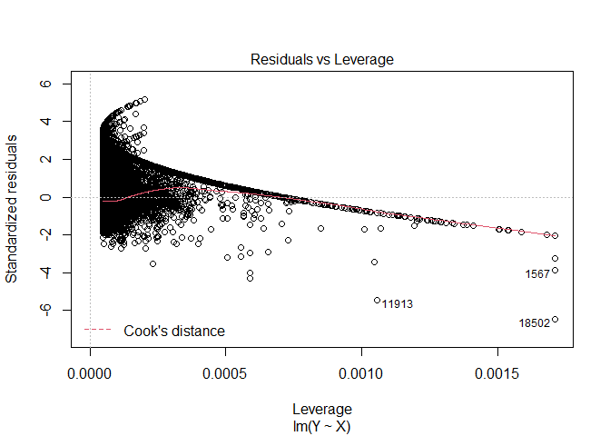
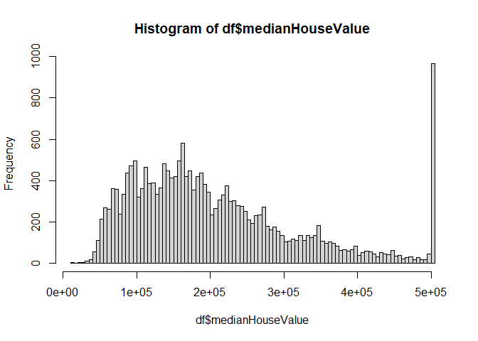
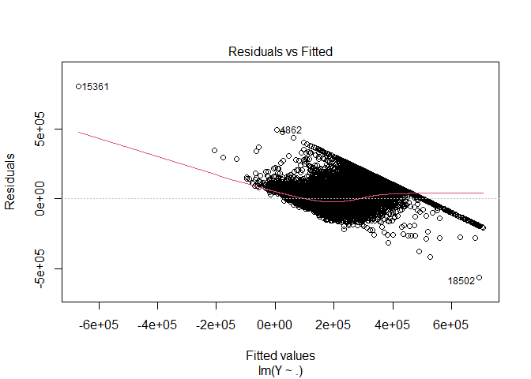
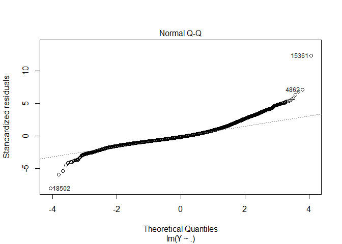
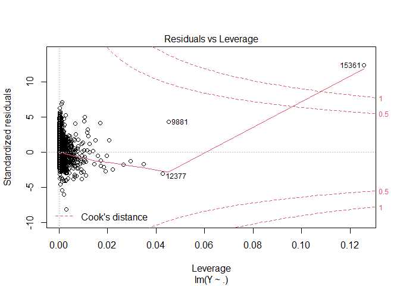
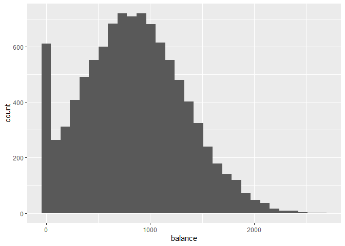
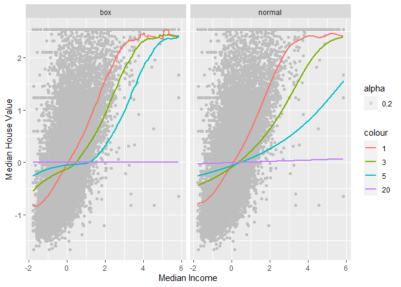

lab1
================
Yonatan-Lourie
4/15/2021

``` r
library(magrittr)
library(haven)
library(Hmisc)
library(tidyverse)
library(ggplot2)
library(magrittr)
library(dplyr)
library(stargazer)
library(plyr)
```

## Lab \#1 – Regression Analysis

### 1

``` r
set.seed(42)
df <-  read.csv("CAhousing.csv")
```

### 2

``` r
#a
dim(df)
```

    ## [1] 20640     9

``` r
#b
summary(df)
```

    ##    longitude         latitude     housingMedianAge   totalRooms   
    ##  Min.   :-124.3   Min.   :32.54   Min.   : 1.00    Min.   :    2  
    ##  1st Qu.:-121.8   1st Qu.:33.93   1st Qu.:18.00    1st Qu.: 1448  
    ##  Median :-118.5   Median :34.26   Median :29.00    Median : 2127  
    ##  Mean   :-119.6   Mean   :35.63   Mean   :28.64    Mean   : 2636  
    ##  3rd Qu.:-118.0   3rd Qu.:37.71   3rd Qu.:37.00    3rd Qu.: 3148  
    ##  Max.   :-114.3   Max.   :41.95   Max.   :52.00    Max.   :39320  
    ##  totalBedrooms      population      households      medianIncome    
    ##  Min.   :   1.0   Min.   :    3   Min.   :   1.0   Min.   : 0.4999  
    ##  1st Qu.: 295.0   1st Qu.:  787   1st Qu.: 280.0   1st Qu.: 2.5634  
    ##  Median : 435.0   Median : 1166   Median : 409.0   Median : 3.5348  
    ##  Mean   : 537.9   Mean   : 1425   Mean   : 499.5   Mean   : 3.8707  
    ##  3rd Qu.: 647.0   3rd Qu.: 1725   3rd Qu.: 605.0   3rd Qu.: 4.7432  
    ##  Max.   :6445.0   Max.   :35682   Max.   :6082.0   Max.   :15.0001  
    ##  medianHouseValue
    ##  Min.   : 14999  
    ##  1st Qu.:119600  
    ##  Median :179700  
    ##  Mean   :206856  
    ##  3rd Qu.:264725  
    ##  Max.   :500001

``` r
#d
#correlation matrix
data.frame(round(cor(df),2))
```

    ##                  longitude latitude housingMedianAge totalRooms totalBedrooms
    ## longitude             1.00    -0.92            -0.11       0.04          0.07
    ## latitude             -0.92     1.00             0.01      -0.04         -0.07
    ## housingMedianAge     -0.11     0.01             1.00      -0.36         -0.32
    ## totalRooms            0.04    -0.04            -0.36       1.00          0.93
    ## totalBedrooms         0.07    -0.07            -0.32       0.93          1.00
    ## population            0.10    -0.11            -0.30       0.86          0.88
    ## households            0.06    -0.07            -0.30       0.92          0.98
    ## medianIncome         -0.02    -0.08            -0.12       0.20         -0.01
    ## medianHouseValue     -0.05    -0.14             0.11       0.13          0.05
    ##                  population households medianIncome medianHouseValue
    ## longitude              0.10       0.06        -0.02            -0.05
    ## latitude              -0.11      -0.07        -0.08            -0.14
    ## housingMedianAge      -0.30      -0.30        -0.12             0.11
    ## totalRooms             0.86       0.92         0.20             0.13
    ## totalBedrooms          0.88       0.98        -0.01             0.05
    ## population             1.00       0.91         0.00            -0.02
    ## households             0.91       1.00         0.01             0.07
    ## medianIncome           0.00       0.01         1.00             0.69
    ## medianHouseValue      -0.02       0.07         0.69             1.00

``` r
#checking the connections
z=as.data.frame(as.table(round(cor(df),2)))  
z=na.omit(z)  
z=z[order(-abs(z$Freq)),]  
subset(z, z$Freq!=1)
```

    ##                Var1             Var2  Freq
    ## 43       households    totalBedrooms  0.98
    ## 59    totalBedrooms       households  0.98
    ## 32    totalBedrooms       totalRooms  0.93
    ## 40       totalRooms    totalBedrooms  0.93
    ## 2          latitude        longitude -0.92
    ## 10        longitude         latitude -0.92
    ## 34       households       totalRooms  0.92
    ## 58       totalRooms       households  0.92
    ## 52       households       population  0.91
    ## 60       population       households  0.91
    ## 42       population    totalBedrooms  0.88
    ## 50    totalBedrooms       population  0.88
    ## 33       population       totalRooms  0.86
    ## 49       totalRooms       population  0.86
    ## 72 medianHouseValue     medianIncome  0.69
    ## 80     medianIncome medianHouseValue  0.69
    ## 22       totalRooms housingMedianAge -0.36
    ## 30 housingMedianAge       totalRooms -0.36
    ## 23    totalBedrooms housingMedianAge -0.32
    ## 39 housingMedianAge    totalBedrooms -0.32
    ## 24       population housingMedianAge -0.30
    ## 25       households housingMedianAge -0.30
    ## 48 housingMedianAge       population -0.30
    ## 57 housingMedianAge       households -0.30
    ## 35     medianIncome       totalRooms  0.20
    ## 67       totalRooms     medianIncome  0.20
    ## 18 medianHouseValue         latitude -0.14
    ## 74         latitude medianHouseValue -0.14
    ## 36 medianHouseValue       totalRooms  0.13
    ## 76       totalRooms medianHouseValue  0.13
    ## 26     medianIncome housingMedianAge -0.12
    ## 66 housingMedianAge     medianIncome -0.12
    ## 3  housingMedianAge        longitude -0.11
    ## 15       population         latitude -0.11
    ## 19        longitude housingMedianAge -0.11
    ## 27 medianHouseValue housingMedianAge  0.11
    ## 47         latitude       population -0.11
    ## 75 housingMedianAge medianHouseValue  0.11
    ## 6        population        longitude  0.10
    ## 46        longitude       population  0.10
    ## 17     medianIncome         latitude -0.08
    ## 65         latitude     medianIncome -0.08
    ## 5     totalBedrooms        longitude  0.07
    ## 14    totalBedrooms         latitude -0.07
    ## 16       households         latitude -0.07
    ## 37        longitude    totalBedrooms  0.07
    ## 38         latitude    totalBedrooms -0.07
    ## 56         latitude       households -0.07
    ## 63 medianHouseValue       households  0.07
    ## 79       households medianHouseValue  0.07
    ## 7        households        longitude  0.06
    ## 55        longitude       households  0.06
    ## 9  medianHouseValue        longitude -0.05
    ## 45 medianHouseValue    totalBedrooms  0.05
    ## 73        longitude medianHouseValue -0.05
    ## 77    totalBedrooms medianHouseValue  0.05
    ## 4        totalRooms        longitude  0.04
    ## 13       totalRooms         latitude -0.04
    ## 28        longitude       totalRooms  0.04
    ## 29         latitude       totalRooms -0.04
    ## 8      medianIncome        longitude -0.02
    ## 54 medianHouseValue       population -0.02
    ## 64        longitude     medianIncome -0.02
    ## 78       population medianHouseValue -0.02
    ## 12 housingMedianAge         latitude  0.01
    ## 20         latitude housingMedianAge  0.01
    ## 44     medianIncome    totalBedrooms -0.01
    ## 62     medianIncome       households  0.01
    ## 68    totalBedrooms     medianIncome -0.01
    ## 70       households     medianIncome  0.01
    ## 53     medianIncome       population  0.00
    ## 69       population     medianIncome  0.00

We can see in the table above the highest correlations.

### 3

We can see by the plot that we have some correlation between the
variables. (when x increasing, y also as well)

``` r
#a

ggplot(df, aes(medianIncome, medianHouseValue)) + geom_point()
```

<!-- -->

``` r
#b
Y <- df$medianHouseValu
X <- df$medianIncome
reg.model <- lm(Y~X)
#c
summary(reg.model)
```

    ## 
    ## Call:
    ## lm(formula = Y ~ X)
    ## 
    ## Residuals:
    ##     Min      1Q  Median      3Q     Max 
    ## -540697  -55950  -16979   36978  434023 
    ## 
    ## Coefficients:
    ##             Estimate Std. Error t value Pr(>|t|)    
    ## (Intercept)  45085.6     1322.9   34.08   <2e-16 ***
    ## X            41793.8      306.8  136.22   <2e-16 ***
    ## ---
    ## Signif. codes:  0 '***' 0.001 '**' 0.01 '*' 0.05 '.' 0.1 ' ' 1
    ## 
    ## Residual standard error: 83740 on 20638 degrees of freedom
    ## Multiple R-squared:  0.4734, Adjusted R-squared:  0.4734 
    ## F-statistic: 1.856e+04 on 1 and 20638 DF,  p-value: < 2.2e-16

The regression coefficients are 4.5085577^{4}, 4.1793849^{4}

We can see the the *R*<sup>2</sup> value is 0.4734 which is saying how
much we can describe the error.

``` r
#d
plot(reg.model)
```

<!-- --><!-- --><!-- --><!-- -->

``` r
#e
beta_0 <- reg.model$coefficients[1]
beta_1 <- reg.model$coefficients[2]
predictions <- beta_0 +beta_1*X

#predict(reg.model, df)
```

``` r
#f
df %>%
  ggplot(aes(x=medianIncome,y=medianHouseValue)) +
  geom_point(alpha=0.5) +
  labs(x= "Median income", y="Median house value")+
  geom_smooth(method=lm) + ylim(0,500000)
```

    ## `geom_smooth()` using formula 'y ~ x'

<!-- -->

Its seems like a good fit but with very big variance.

### 4

``` r
#1
hist(df$medianHouseValue, breaks = 100)
```

<!-- -->

It looks like there is alot of houses with the same price (500,000),
which is a bit strange - because houses can be priced for alot of
reasons but 992 with the same price its an anomaly .

``` r
#2
reg.model.all <- lm(Y~.,df[, c(1:length(df)-1)] )
summary(reg.model.all)
```

    ## 
    ## Call:
    ## lm(formula = Y ~ ., data = df[, c(1:length(df) - 1)])
    ## 
    ## Residuals:
    ##     Min      1Q  Median      3Q     Max 
    ## -563013  -43592  -11327   30307  803996 
    ## 
    ## Coefficients:
    ##                    Estimate Std. Error t value Pr(>|t|)    
    ## (Intercept)      -3.594e+06  6.254e+04 -57.468  < 2e-16 ***
    ## longitude        -4.282e+04  7.130e+02 -60.061  < 2e-16 ***
    ## latitude         -4.258e+04  6.733e+02 -63.240  < 2e-16 ***
    ## housingMedianAge  1.156e+03  4.317e+01  26.787  < 2e-16 ***
    ## totalRooms       -8.182e+00  7.881e-01 -10.381  < 2e-16 ***
    ## totalBedrooms     1.134e+02  6.902e+00  16.432  < 2e-16 ***
    ## population       -3.854e+01  1.079e+00 -35.716  < 2e-16 ***
    ## households        4.831e+01  7.515e+00   6.429 1.32e-10 ***
    ## medianIncome      4.025e+04  3.351e+02 120.123  < 2e-16 ***
    ## ---
    ## Signif. codes:  0 '***' 0.001 '**' 0.01 '*' 0.05 '.' 0.1 ' ' 1
    ## 
    ## Residual standard error: 69530 on 20631 degrees of freedom
    ## Multiple R-squared:  0.6371, Adjusted R-squared:  0.637 
    ## F-statistic:  4528 on 8 and 20631 DF,  p-value: < 2.2e-16

``` r
#3
Y.corr <- data.frame(round(cor(df),2))
Y.corr[order(Y.corr$medianHouseValue),][9]
```

    ##                  medianHouseValue
    ## latitude                    -0.14
    ## longitude                   -0.05
    ## population                  -0.02
    ## totalBedrooms                0.05
    ## households                   0.07
    ## housingMedianAge             0.11
    ## totalRooms                   0.13
    ## medianIncome                 0.69
    ## medianHouseValue             1.00

its looks like we can omit the latitude, longitude, population,
totalbedrooms (just from the corr).

But when we’ll look at the coefficients impact - we will observe that
the longitude, latitude, housingMedianAge and medianIncome have the most
impact on Y variable.

``` r
plot(reg.model.all)
```

<!-- --><!-- --><!-- --><!-- -->

## Lab \#2 – KNN Analysis

### 1

``` r
library(ISLR)
library(class)
```

### 2

``` r
dat <- Default
```

### 3

``` r
#a
dim(dat)
```

    ## [1] 10000     4

``` r
#b
summary(dat)
```

    ##  default    student       balance           income     
    ##  No :9667   No :7056   Min.   :   0.0   Min.   :  772  
    ##  Yes: 333   Yes:2944   1st Qu.: 481.7   1st Qu.:21340  
    ##                        Median : 823.6   Median :34553  
    ##                        Mean   : 835.4   Mean   :33517  
    ##                        3rd Qu.:1166.3   3rd Qu.:43808  
    ##                        Max.   :2654.3   Max.   :73554

Its looks like there is alot of students with 0 balance which looks like
an anomalie:

``` r
ggplot(dat, aes(x=balance)) + geom_histogram()
```

    ## `stat_bin()` using `bins = 30`. Pick better value with `binwidth`.

<!-- -->

``` r
#c
help(Default)
```

    ## starting httpd help server ... done

``` r
#d
sd(dat$balance)
```

    ## [1] 483.715

``` r
sd(dat$income)
```

    ## [1] 13336.64

We can obviously see that the variables arent standardized (if the
variables were standardized we would expect a standard deviation of a
smaller number)

### 4

``` r
#a
data <- dat[c("balance", "income", "default")]

#b
data$balance <- scale(data$balance)
data$income <- scale(data$income)

#c
sample <- sample.int(n = nrow(data), size = floor(.7*nrow(data)), replace = F)
train <- data[sample, ]
test  <- data[-sample, ]

X_train <- train[c("balance", "income")]
X_test <- test[c("balance", "income")]

Y_train <- train$default
Y_test <- test$default


accuracy <- function(x){sum(diag(x)/(sum(rowSums(x)))) * 100}


#d+e
for (k in c(1,5,20,70)) {
  knn.model <- knn(train = X_train, test = X_test, cl = Y_train, k = k)
  tab <- table(knn.model, Y_test)
  accuracy_ <- accuracy(tab)
  print(paste0("accurcy for k = ", k, "is: ", accuracy_ ))
  print(paste0("frequency table for k = ", k))
  print(tab)
  
  print(paste0("porportion table for k = ", k))
  print(round(prop.table(tab,2),3))
  print("---------------------------------")
}
```

    ## [1] "accurcy for k = 1is: 95.6"
    ## [1] "frequency table for k = 1"
    ##          Y_test
    ## knn.model   No  Yes
    ##       No  2838   75
    ##       Yes   57   30
    ## [1] "porportion table for k = 1"
    ##          Y_test
    ## knn.model    No   Yes
    ##       No  0.980 0.714
    ##       Yes 0.020 0.286
    ## [1] "---------------------------------"
    ## [1] "accurcy for k = 5is: 97"
    ## [1] "frequency table for k = 5"
    ##          Y_test
    ## knn.model   No  Yes
    ##       No  2876   71
    ##       Yes   19   34
    ## [1] "porportion table for k = 5"
    ##          Y_test
    ## knn.model    No   Yes
    ##       No  0.993 0.676
    ##       Yes 0.007 0.324
    ## [1] "---------------------------------"
    ## [1] "accurcy for k = 20is: 97.1"
    ## [1] "frequency table for k = 20"
    ##          Y_test
    ## knn.model   No  Yes
    ##       No  2886   78
    ##       Yes    9   27
    ## [1] "porportion table for k = 20"
    ##          Y_test
    ## knn.model    No   Yes
    ##       No  0.997 0.743
    ##       Yes 0.003 0.257
    ## [1] "---------------------------------"
    ## [1] "accurcy for k = 70is: 97.0333333333333"
    ## [1] "frequency table for k = 70"
    ##          Y_test
    ## knn.model   No  Yes
    ##       No  2892   86
    ##       Yes    3   19
    ## [1] "porportion table for k = 70"
    ##          Y_test
    ## knn.model    No   Yes
    ##       No  0.999 0.819
    ##       Yes 0.001 0.181
    ## [1] "---------------------------------"

### 5

``` r
freqY_train <- table(Y_train)
propY_train <- prop.table(table(Y_train))
propY <- prop.table(table(data$default))
print("frequency of the default variable in the training set:")
```

    ## [1] "frequency of the default variable in the training set:"

``` r
print(freqY_train)
```

    ## Y_train
    ##   No  Yes 
    ## 6772  228

``` r
writeLines("\n")
```

``` r
print("proportion of the default variable in the training set:")
```

    ## [1] "proportion of the default variable in the training set:"

``` r
print(propY_train)
```

    ## Y_train
    ##         No        Yes 
    ## 0.96742857 0.03257143

``` r
writeLines("\n")
```

``` r
print("proportion of the default variable in the whole dataset:")
```

    ## [1] "proportion of the default variable in the whole dataset:"

``` r
print(propY)
```

    ## 
    ##     No    Yes 
    ## 0.9667 0.0333

``` r
writeLines("\n")
```

We can see in the data that the proportion of the whole dataset is
pretty similar to the train dataset.

I think that a Naive Bayes classifier will work pretty good here, and
for any more data that we will append to the dataset, we will get more
accurate results.

## Lab \#3 – Kernel Regression

### 1 Split CAhousing.csv into random train (80%) and test (20%) sets.

``` r
library(dplyr)
df <-read.csv("CAhousing.csv")
df<-data.frame(scale(df[c("medianHouseValue","medianIncome")]))
train <- sample_frac(df, 0.8)
sid<-as.numeric(rownames(train)) # because rownames() returns character
test<-df[-sid,]
```

### Use the “ksmooth” function from the stats library in order to predict the median house value from CAhousing.csv, using only the best predictor variable.

``` r
X_train <- train$medianIncome
Y_train <- train$medianHouseValue

X_test <- test$medianIncome
Y_test <- test$medianHouseValue

KsmoothDataframe <- function(kernel, X_train, Y_train, Y_test, h) {
  pred1 <- ksmooth(X_train, Y_train, kernel= kernel, bandwidth = h)
  train_MSE <- mean((Y_train - pred1$y)^2)
  test_MSE <- mean((Y_test - pred1$y)^2)
  pred_data<- data.frame(kernel=kernel,h=h, x_pred=pred1$x,y_pred=pred1$y)
  test_data <- data.frame(kernel=kernel, h=h, train_MSE=train_MSE, test_MSE=test_MSE)
  ans <- list(pred_data, test_data)
  return(ans)
}

prediction_data <- data.frame(kernel = NA, h = NA, x_pred=NA,y_pred=NA)
testing_data <- data.frame(kernel = NA, h = NA, train_MSE = NA, test_MSE = NA)


for (h in c(1,3,5,20)) {
  for (k in c("box", "normal")) {
    processed_data <- KsmoothDataframe(k, X_train, Y_train, Y_test, h)
    pred_data1 <- processed_data[1]
    test_data <- processed_data[2]
    prediction_data <- rbind(data.frame(prediction_data), data.frame(pred_data1))
    testing_data <- rbind(data.frame(testing_data), data.frame(test_data))
  }
  # print(h)
} 
```

Recall that that the box kernel is: $K(u)=\\frac{1}{2}$ and the Gaussian
kernel is: $$ P(x) = e<sup>{</sup>u{2}}

$$

### MSE summary

``` r
testing_data <- na.omit(testing_data)
testing_data$train_MSE <- testing_data$train_MSE
testing_data$test_MSE <-testing_data$test_MSE
print(testing_data <- testing_data[order(testing_data$test_MSE),])
```

    ##   kernel  h train_MSE test_MSE
    ## 8    box 20 0.9931666 1.122447
    ## 9 normal 20 0.9943757 1.123754
    ## 7 normal  5 1.4153602 1.527070
    ## 6    box  5 2.5346537 2.564323
    ## 5 normal  3 2.6755464 2.694643
    ## 4    box  3 3.2860928 3.247357
    ## 3 normal  1 3.8394928 3.773130
    ## 2    box  1 3.9196740 3.854556

We can see that when the h is higher - the MSE is lower. The type of the
kernel is better with the Gaussian (Except from when the h is large).

``` r
prediction_data <- prediction_data%>%filter(h %in% testing_data$h )
prediction_data$X <- X_train
prediction_data$Y <- Y_train
#plot the data, and the diffrent h impact per every kernel.
ggplot(prediction_data,aes(x=X ,y=Y,col="data"))+
  geom_point(aes(alpha= 0.2, ), colour = 'Gray')+
  geom_line(aes(x=x_pred,y=y_pred,col=as.factor(h)),size= 1)+
  facet_grid(~kernel)+ #making plot for every kernel
  xlab("Median Income")+ylab("Median House Value")+
  guides(fill=guide_legend(title="h-val"))
```

<!-- -->

The main diffrence between the kernels is that the normal kernel is
smoother the the box kernel (mainly when we have less data) and it stems
from the kernel function of each on of them. In both kernels when the
value of h is rising, the regression line is getting closer to the
average of the Y axis.

We know that when the h is getting bigger, the variance will be bigger
and the bias will get smaller (the variance - bias tradeoff). So the
decreasing of the bias is making the regression line closer to the Y
axis.

We can see that in the right top corner in the box plot, we have over
fitting (due to low h and high variance of the data) but when the h is
getting bigger it seems that the overfitting is diminished.

We also can observed that we have an edge solution - when the h is very
big, the MSE is getting smaller.
