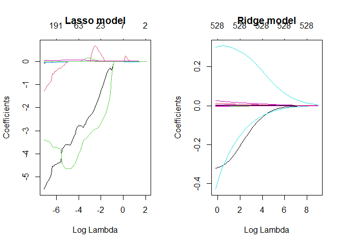
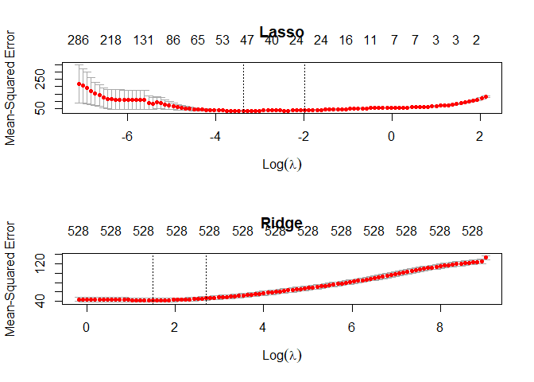
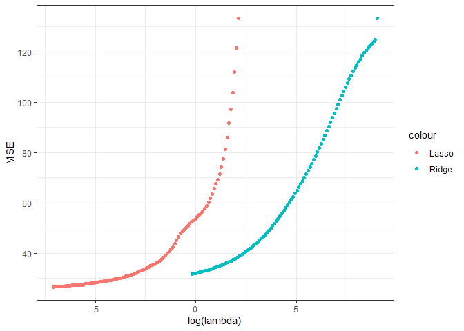
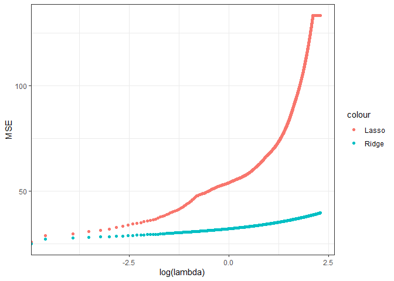
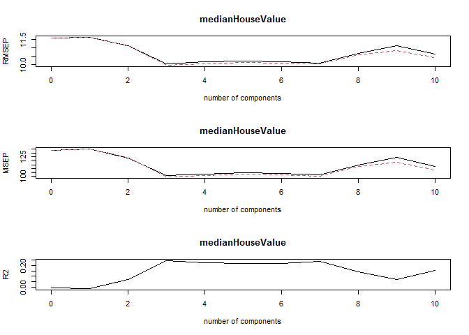
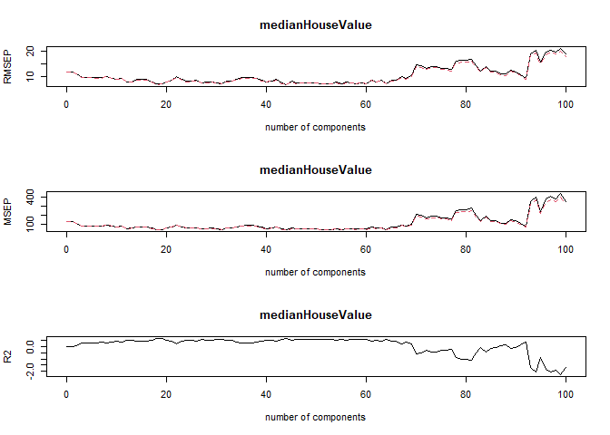

LAB2
================
Yonatan-Lourie, Nethnel Shapiro
4/25/2021

``` r
setwd(dirname(rstudioapi::getActiveDocumentContext()$path))

knitr::opts_chunk$set(warning=FALSE)
```

``` r
library(magrittr)
library(haven)
library(Hmisc)
library(tidyverse)
library(ggplot2)
library(magrittr)
library(dplyr)
library(stargazer)
library(plyr)
library(ri)
library(glmnet)
library(plotmo)
```

## Excersice 1

### 1-5.

``` r
load("CA_samp.Rdata")
df <- data.frame(CA_samp)
set.seed(150)
```

``` r
cat(paste(c("The size of the data is: ", dim(df))), collapse="")
```

    ## The size of the data is:  1000 529

We can see that the database has many variables. If we will use all of
them, it might cause the model to ‘overfit’ the data. This will give us
a good result for this set of data - but arguably it will work for a
different one. If we will omit variables that have smaller impact on *Y*
we can reduce our variance and improve the performance of the model.

### 6-7.

Subset your data into train and test

``` r
sample <- sample.int(n = nrow(df), size = floor(.8*nrow(df)), replace = F)
train <- df[sample, ]
test  <- df[-sample, ]

X_train <- train[, -which(names(train) == "medianHouseValue")]
X_test <- test[, -which(names(train) == "medianHouseValue")]

Y_train <- train[, which(names(train) == "medianHouseValue")]
Y_test <- test[, which(names(train) == "medianHouseValue")]
```

### 8.

#### a

Recall that *α* = 0 means the regression is Ridge typed and *α* = 1
means the regression is Lasso typed.

``` r
fit.lasso <- glmnet(X_train, Y_train, family="gaussian", alpha=1, standardize = TRUE)
fit.ridge <- glmnet(X_train, Y_train, family="gaussian", alpha=0, standardize = TRUE)
```

``` r
class(fit.lasso)
```

    ## [1] "elnet"  "glmnet"

``` r
class(fit.ridge)
```

    ## [1] "elnet"  "glmnet"

#### b

Find which lambdas were used in the evaluation of each model

``` r
lambdas.lasso <- fit.lasso$lambda
lambdas.ridge <- fit.ridge$lambda


df.lasso <- fit.lasso$df
df.ridge <- fit.ridge$df

diff <- length(lambdas.ridge)-length(lambdas.lasso)
LassoRidgeData <- data.frame(LambdasLasso = c(lambdas.lasso, rep(NA,diff)), LambdasRidge = lambdas.ridge, coeffLasso = c(df.lasso,rep(NA,diff)), coeffRidge = df.ridge)

LassoRidgeData
```

    ##     LambdasLasso LambdasRidge coeffLasso coeffRidge
    ## 1   8.2882234739 8288.2234739          0        528
    ## 2   7.5519205445 7551.9205445          2        528
    ## 3   6.8810287379 6881.0287379          2        528
    ## 4   6.2697371102 6269.7371102          2        528
    ## 5   5.7127509460 5712.7509460          2        528
    ## 6   5.2052458974 5205.2458974          3        528
    ## 7   4.7428261985 4742.8261985          3        528
    ## 8   4.3214865912 4321.4865912          3        528
    ## 9   3.9375776333 3937.5776333          3        528
    ## 10  3.5877740891 3587.7740891          3        528
    ## 11  3.2690461276 3269.0461276          3        528
    ## 12  2.9786330798 2978.6330798          3        528
    ## 13  2.7140195267 2714.0195267          3        528
    ## 14  2.4729135123 2472.9135123          4        528
    ## 15  2.2532266917 2253.2266917          4        528
    ## 16  2.0530562427 2053.0562427          4        528
    ## 17  1.8706683847 1870.6683847          7        528
    ## 18  1.7044833614 1704.4833614          7        528
    ## 19  1.5530617574 1553.0617574          7        528
    ## 20  1.4150920314 1415.0920314          6        528
    ## 21  1.2893791556 1289.3791556          6        528
    ## 22  1.1748342652 1174.8342652          7        528
    ## 23  1.0704652272 1070.4652272          7        528
    ## 24  0.9753680468  975.3680468          7        528
    ## 25  0.8887190378  888.7190378          8        528
    ## 26  0.8097676880  809.7676880          8        528
    ## 27  0.7378301585  737.8301585         10        528
    ## 28  0.6722833608  672.2833608         11        528
    ## 29  0.6125595600  612.5595600         11        528
    ## 30  0.5581414570  558.1414570          9        528
    ## 31  0.5085577083  508.5577083         10        528
    ## 32  0.4633788432  463.3788432         14        528
    ## 33  0.4222135439  422.2135439         18        528
    ## 34  0.3847052564  384.7052564         17        528
    ## 35  0.3505291017  350.5291017         16        528
    ## 36  0.3193890624  319.3890624         18        528
    ## 37  0.2910154184  291.0154184         19        528
    ## 38  0.2651624108  265.1624108         20        528
    ## 39  0.2416061130  241.6061130         21        528
    ## 40  0.2201424919  220.1424919         22        528
    ## 41  0.2005856396  200.5856396         24        528
    ## 42  0.1827661643  182.7661643         24        528
    ## 43  0.1665297220  166.5297220         22        528
    ## 44  0.1517356805  151.7356805         21        528
    ## 45  0.1382559008  138.2559008         21        528
    ## 46  0.1259736277  125.9736277         23        528
    ## 47  0.1147824778  114.7824778         24        528
    ## 48  0.1045855188  104.5855188         27        528
    ## 49  0.0952944296   95.2944296         29        528
    ## 50  0.0868287351   86.8287351         32        528
    ## 51  0.0791151096   79.1151096         34        528
    ## 52  0.0720867413   72.0867413         35        528
    ## 53  0.0656827539   65.6827539         40        528
    ## 54  0.0598476791   59.8476791         45        528
    ## 55  0.0545309762   54.5309762         50        528
    ## 56  0.0496865946   49.6865946         49        528
    ## 57  0.0452725745   45.2725745         49        528
    ## 58  0.0412506837   41.2506837         49        528
    ## 59  0.0375860867   37.5860867         47        528
    ## 60  0.0342470423   34.2470423         48        528
    ## 61  0.0312046295   31.2046295         53        528
    ## 62  0.0284324962   28.4324962         52        528
    ## 63  0.0259066316   25.9066316         51        528
    ## 64  0.0236051579   23.6051579         54        528
    ## 65  0.0215081407   21.5081407         53        528
    ## 66  0.0195974168   19.5974168         60        528
    ## 67  0.0178564363   17.8564363         63        528
    ## 68  0.0162701197   16.2701197         60        528
    ## 69  0.0148247271   14.8247271         62        528
    ## 70  0.0135077392   13.5077392         62        528
    ## 71  0.0123077489   12.3077489         65        528
    ## 72  0.0112143624   11.2143624         64        528
    ## 73  0.0102181093   10.2181093         68        528
    ## 74  0.0093103607    9.3103607         73        528
    ## 75  0.0084832539    8.4832539         74        528
    ## 76  0.0077296250    7.7296250         83        528
    ## 77  0.0070429464    7.0429464         86        528
    ## 78  0.0064172705    6.4172705         93        528
    ## 79  0.0058471779    5.8471779        104        528
    ## 80  0.0053277307    5.3277307        109        528
    ## 81  0.0048544298    4.8544298        115        528
    ## 82  0.0044231756    4.4231756        122        528
    ## 83  0.0040302329    4.0302329        138        528
    ## 84  0.0036721981    3.6721981        131        528
    ## 85  0.0033459701    3.3459701        137        528
    ## 86  0.0030487234    3.0487234        151        528
    ## 87  0.0027778832    2.7778832        166        528
    ## 88  0.0025311037    2.5311037        177        528
    ## 89  0.0023062474    2.3062474        191        528
    ## 90  0.0021013668    2.1013668        196        528
    ## 91  0.0019146871    1.9146871        208        528
    ## 92  0.0017445916    1.7445916        218        528
    ## 93  0.0015896069    1.5896069        226        528
    ## 94  0.0014483906    1.4483906        230        528
    ## 95  0.0013197196    1.3197196        229        528
    ## 96  0.0012024793    1.2024793        238        528
    ## 97  0.0010956544    1.0956544        247        528
    ## 98  0.0009983195    0.9983195        264        528
    ## 99  0.0009096315    0.9096315        284        528
    ## 100 0.0008288224    0.8288224        286        528

``` r
print("Lasso coef summary:")
```

    ## [1] "Lasso coef summary:"

``` r
summary(df.lasso)
```

    ##    Min. 1st Qu.  Median    Mean 3rd Qu.    Max. 
    ##    0.00    8.00   33.00   63.66   76.25  286.00

``` r
print('')
```

    ## [1] ""

``` r
print("__________________________________________")
```

    ## [1] "__________________________________________"

``` r
print("Ridge coef summary:")
```

    ## [1] "Ridge coef summary:"

``` r
summary(df.ridge)
```

    ##    Min. 1st Qu.  Median    Mean 3rd Qu.    Max. 
    ##     528     528     528     528     528     528

#### c

Check how many non-zero coefficients were computed for each lambda.

``` r
diff <- length(lambdas.ridge)-length(lambdas.lasso)
LassoRidgeData <- data.frame(LambdasLasso = c(lambdas.lasso, rep(NA,diff)), LambdasRidge = lambdas.ridge, coeffLasso = c(df.lasso,rep(NA,diff)), coeffRidge = df.ridge)

LassoRidgeData
```

    ##     LambdasLasso LambdasRidge coeffLasso coeffRidge
    ## 1   8.2882234739 8288.2234739          0        528
    ## 2   7.5519205445 7551.9205445          2        528
    ## 3   6.8810287379 6881.0287379          2        528
    ## 4   6.2697371102 6269.7371102          2        528
    ## 5   5.7127509460 5712.7509460          2        528
    ## 6   5.2052458974 5205.2458974          3        528
    ## 7   4.7428261985 4742.8261985          3        528
    ## 8   4.3214865912 4321.4865912          3        528
    ## 9   3.9375776333 3937.5776333          3        528
    ## 10  3.5877740891 3587.7740891          3        528
    ## 11  3.2690461276 3269.0461276          3        528
    ## 12  2.9786330798 2978.6330798          3        528
    ## 13  2.7140195267 2714.0195267          3        528
    ## 14  2.4729135123 2472.9135123          4        528
    ## 15  2.2532266917 2253.2266917          4        528
    ## 16  2.0530562427 2053.0562427          4        528
    ## 17  1.8706683847 1870.6683847          7        528
    ## 18  1.7044833614 1704.4833614          7        528
    ## 19  1.5530617574 1553.0617574          7        528
    ## 20  1.4150920314 1415.0920314          6        528
    ## 21  1.2893791556 1289.3791556          6        528
    ## 22  1.1748342652 1174.8342652          7        528
    ## 23  1.0704652272 1070.4652272          7        528
    ## 24  0.9753680468  975.3680468          7        528
    ## 25  0.8887190378  888.7190378          8        528
    ## 26  0.8097676880  809.7676880          8        528
    ## 27  0.7378301585  737.8301585         10        528
    ## 28  0.6722833608  672.2833608         11        528
    ## 29  0.6125595600  612.5595600         11        528
    ## 30  0.5581414570  558.1414570          9        528
    ## 31  0.5085577083  508.5577083         10        528
    ## 32  0.4633788432  463.3788432         14        528
    ## 33  0.4222135439  422.2135439         18        528
    ## 34  0.3847052564  384.7052564         17        528
    ## 35  0.3505291017  350.5291017         16        528
    ## 36  0.3193890624  319.3890624         18        528
    ## 37  0.2910154184  291.0154184         19        528
    ## 38  0.2651624108  265.1624108         20        528
    ## 39  0.2416061130  241.6061130         21        528
    ## 40  0.2201424919  220.1424919         22        528
    ## 41  0.2005856396  200.5856396         24        528
    ## 42  0.1827661643  182.7661643         24        528
    ## 43  0.1665297220  166.5297220         22        528
    ## 44  0.1517356805  151.7356805         21        528
    ## 45  0.1382559008  138.2559008         21        528
    ## 46  0.1259736277  125.9736277         23        528
    ## 47  0.1147824778  114.7824778         24        528
    ## 48  0.1045855188  104.5855188         27        528
    ## 49  0.0952944296   95.2944296         29        528
    ## 50  0.0868287351   86.8287351         32        528
    ## 51  0.0791151096   79.1151096         34        528
    ## 52  0.0720867413   72.0867413         35        528
    ## 53  0.0656827539   65.6827539         40        528
    ## 54  0.0598476791   59.8476791         45        528
    ## 55  0.0545309762   54.5309762         50        528
    ## 56  0.0496865946   49.6865946         49        528
    ## 57  0.0452725745   45.2725745         49        528
    ## 58  0.0412506837   41.2506837         49        528
    ## 59  0.0375860867   37.5860867         47        528
    ## 60  0.0342470423   34.2470423         48        528
    ## 61  0.0312046295   31.2046295         53        528
    ## 62  0.0284324962   28.4324962         52        528
    ## 63  0.0259066316   25.9066316         51        528
    ## 64  0.0236051579   23.6051579         54        528
    ## 65  0.0215081407   21.5081407         53        528
    ## 66  0.0195974168   19.5974168         60        528
    ## 67  0.0178564363   17.8564363         63        528
    ## 68  0.0162701197   16.2701197         60        528
    ## 69  0.0148247271   14.8247271         62        528
    ## 70  0.0135077392   13.5077392         62        528
    ## 71  0.0123077489   12.3077489         65        528
    ## 72  0.0112143624   11.2143624         64        528
    ## 73  0.0102181093   10.2181093         68        528
    ## 74  0.0093103607    9.3103607         73        528
    ## 75  0.0084832539    8.4832539         74        528
    ## 76  0.0077296250    7.7296250         83        528
    ## 77  0.0070429464    7.0429464         86        528
    ## 78  0.0064172705    6.4172705         93        528
    ## 79  0.0058471779    5.8471779        104        528
    ## 80  0.0053277307    5.3277307        109        528
    ## 81  0.0048544298    4.8544298        115        528
    ## 82  0.0044231756    4.4231756        122        528
    ## 83  0.0040302329    4.0302329        138        528
    ## 84  0.0036721981    3.6721981        131        528
    ## 85  0.0033459701    3.3459701        137        528
    ## 86  0.0030487234    3.0487234        151        528
    ## 87  0.0027778832    2.7778832        166        528
    ## 88  0.0025311037    2.5311037        177        528
    ## 89  0.0023062474    2.3062474        191        528
    ## 90  0.0021013668    2.1013668        196        528
    ## 91  0.0019146871    1.9146871        208        528
    ## 92  0.0017445916    1.7445916        218        528
    ## 93  0.0015896069    1.5896069        226        528
    ## 94  0.0014483906    1.4483906        230        528
    ## 95  0.0013197196    1.3197196        229        528
    ## 96  0.0012024793    1.2024793        238        528
    ## 97  0.0010956544    1.0956544        247        528
    ## 98  0.0009983195    0.9983195        264        528
    ## 99  0.0009096315    0.9096315        284        528
    ## 100 0.0008288224    0.8288224        286        528

``` r
count(df.lasso!=0)
```

    ##       x freq
    ## 1 FALSE    1
    ## 2  TRUE   99

``` r
count(df.ridge!=0)
```

    ##      x freq
    ## 1 TRUE  100

We can see at the dataframe above, that for every lambda of the Ridge
model we have 528 non-zero coefficients. On the other hand, the Lasso
model is much more flexible and the coefficients vary much more.

#### d

plot the coefficients as a function of lambda

``` r
par(mfrow=c(1,2))
plot(fit.lasso, xvar="lambda", main="Lasso model")
plot(fit.ridge, xvar="lambda", main="Ridge model")
```

<!-- -->
In the top X-axis we can see the number of non-zero coefficients, bottom
X-axis stands for *l**o**g*(*λ*), each line is representing another
variable from X, and the Y axis is indicate about the value of each
coefficient.

### 9.

#### a

Run cv.glmnet() for cross-validation and choose the number of folds for
the CV

``` r
#Ridge
fit10.ridge <- cv.glmnet(as.matrix(X_train), as.matrix(Y_train), type.measure="mse", alpha=0,family="gaussian", nfolds=10)

#Lasso
fit10.lasso <- cv.glmnet(as.matrix(X_train), as.matrix(Y_train), type.measure="mse", alpha=1,family="gaussian", nfolds=10)
```

#### b

Extract the lambda that minimizes the cross-validation error

``` r
print(paste0("The lambda that minimizes the cross-validation error is (for ridge):", fit10.ridge$lambda.min))
```

    ## [1] "The lambda that minimizes the cross-validation error is (for ridge):4.42317561519045"

``` r
print(paste0("The lambda that minimizes the cross-validation error is (for lasso):", fit10.lasso$lambda.min))
```

    ## [1] "The lambda that minimizes the cross-validation error is (for lasso):0.0342470423443462"

#### c

Plot both models

``` r
par(mfrow=c(2,1))
plot(fit10.lasso, main="Lasso")
plot(fit10.ridge, main="Ridge")
```

<!-- -->

This plots the cross-validation curve (red dotted line) along with upper
and lower standard deviation curves along the *l**o**g*(*λ*) sequence
(error bars). The vertical dotted line indicate the min lambda that we
calculated before (there are 2 one for lambda.min and one for
lambda.1se).

### d

Predict the median house value of the test set using the lambda that
minimizes the cross-validation error

``` r
Y.hat.lasso <- predict(fit10.lasso, as.matrix(X_test), s=fit10.lasso$lambda.min)
Y.hat.ridge <- predict(fit10.ridge, as.matrix(X_test), s=fit10.ridge$lambda.min)
```

### e

Calculate test MSE

``` r
MSE.lasso <- mean((Y.hat.lasso - Y_test)^2)
MSE.ridge <- mean((Y.hat.ridge - Y_test)^2)


print(paste("The MSE of model Lasso is:", round(MSE.lasso,3) , " and MSE of model Ridge is:", round(MSE.ridge,3)))
```

    ## [1] "The MSE of model Lasso is: 40.355  and MSE of model Ridge is: 45.692"

We can see that the MSE of Ridge model is bigger:

``` r
MSE.ridge>MSE.lasso
```

    ## [1] TRUE

Lets check the *R*<sup>2</sup> as well:

``` r
#R2 for lasso regression
SSE = sum((Y_test -Y.hat.lasso)^2)
SST = sum( (Y_test-mean(df$medianHouseValue))^2)
R2_lasso = 1 - SSE/SST


#R2 for ridge regression
SSE = sum((Y_test -Y.hat.ridge)^2)
SST = sum( (Y_test-mean(df$medianHouseValue))^2)
R2_ridge = 1 - SSE/SST


print(paste("The R^2 of model Lasso is:", round(R2_lasso,3) , " and R^2 of model Ridge is:", round(R2_ridge,3)))
```

    ## [1] "The R^2 of model Lasso is: 0.713  and R^2 of model Ridge is: 0.676"

We can see that the R^2 of Ridge model is smaller:

``` r
R2_ridge>R2_lasso
```

    ## [1] FALSE

Which means that the MSE of the lasso model is smaller, and the lasso
*R*<sup>2</sup> is better. Recall that the coefficients with the lasso
method can go to zero, when with the ridge method they are fixed. This
results in different bias-variance for the model trade-off. For this
data, we will prefer to use the Lasso method.

### 10.

Run Ridge and LASSO without using cross-validation and find the lambda
that minimizes the error on the training set

``` r
MSE_checker <- function(model, X_train, Y_train){
  results <- data.frame(lambda =NA, MSE=NA)
  for (lambda in model$lambda) {
    pred <- predict(model, as.matrix(X_train), s=lambda)
    MSE <- mean((pred - Y_train)^2)
    results <- rbind(results, c(lambda, MSE))
  }
  results <- na.omit(results)
  return(arrange(results, by=MSE))
}

lasso.lambdas <- MSE_checker(fit.lasso, X_train, Y_train)
ridge.lambdas <- MSE_checker(fit.ridge, X_train, Y_train)

lasso.lambdas
```

    ##           lambda       MSE
    ## 1   0.0008288224  26.69179
    ## 2   0.0009096315  26.74102
    ## 3   0.0009983195  26.78951
    ## 4   0.0010956544  26.85456
    ## 5   0.0012024793  26.87192
    ## 6   0.0013197196  26.91207
    ## 7   0.0014483906  26.95431
    ## 8   0.0015896069  27.01262
    ## 9   0.0017445916  27.23745
    ## 10  0.0019146871  27.23974
    ## 11  0.0021013668  27.31848
    ## 12  0.0023062474  27.32010
    ## 13  0.0025311037  27.34116
    ## 14  0.0027778832  27.40179
    ## 15  0.0030487234  27.41176
    ## 16  0.0033459701  27.43032
    ## 17  0.0036721981  27.45035
    ## 18  0.0040302329  27.84380
    ## 19  0.0044231756  27.91420
    ## 20  0.0048544298  28.01858
    ## 21  0.0053277307  28.14440
    ## 22  0.0058471779  28.25061
    ## 23  0.0064172705  28.32478
    ## 24  0.0070429464  28.42296
    ## 25  0.0077296250  28.53487
    ## 26  0.0084832539  28.64156
    ## 27  0.0093103607  28.77624
    ## 28  0.0102181093  28.89162
    ## 29  0.0112143624  28.97363
    ## 30  0.0123077489  29.11187
    ## 31  0.0135077392  29.17180
    ## 32  0.0148247271  29.37941
    ## 33  0.0162701197  29.51559
    ## 34  0.0178564363  29.71851
    ## 35  0.0195974168  29.86340
    ## 36  0.0215081407  29.99359
    ## 37  0.0236051579  30.15743
    ## 38  0.0259066316  30.36219
    ## 39  0.0284324962  30.55494
    ## 40  0.0312046295  30.84456
    ## 41  0.0342470423  30.96120
    ## 42  0.0375860867  31.23827
    ## 43  0.0412506837  31.43478
    ## 44  0.0452725745  31.76612
    ## 45  0.0496865946  31.99175
    ## 46  0.0545309762  32.32868
    ## 47  0.0598476791  32.72355
    ## 48  0.0656827539  33.08235
    ## 49  0.0720867413  33.41736
    ## 50  0.0791151096  33.77735
    ## 51  0.0868287351  34.13092
    ## 52  0.0952944296  34.50629
    ## 53  0.1045855188  34.90863
    ## 54  0.1147824778  35.23970
    ## 55  0.1259736277  35.61731
    ## 56  0.1382559008  36.02504
    ## 57  0.1517356805  36.46113
    ## 58  0.1665297220  36.98638
    ## 59  0.1827661643  37.70137
    ## 60  0.2005856396  38.35463
    ## 61  0.2201424919  39.17880
    ## 62  0.2416061130  39.93725
    ## 63  0.2651624108  40.66584
    ## 64  0.2910154184  41.50863
    ## 65  0.3193890624  42.51981
    ## 66  0.3505291017  43.76907
    ## 67  0.3847052564  45.09594
    ## 68  0.4222135439  46.67066
    ## 69  0.4633788432  47.94105
    ## 70  0.5085577083  48.59936
    ## 71  0.5581414570  49.23070
    ## 72  0.6125595600  50.04535
    ## 73  0.6722833608  50.99466
    ## 74  0.7378301585  51.80688
    ## 75  0.8097676880  52.52007
    ## 76  0.8887190378  53.03035
    ## 77  0.9753680468  53.70804
    ## 78  1.0704652272  54.52469
    ## 79  1.1748342652  55.27816
    ## 80  1.2893791556  55.96307
    ## 81  1.4150920314  56.74138
    ## 82  1.5530617574  57.68867
    ## 83  1.7044833614  58.87668
    ## 84  1.8706683847  60.31247
    ## 85  2.0530562427  61.86883
    ## 86  2.2532266917  63.58879
    ## 87  2.4729135123  65.66236
    ## 88  2.7140195267  67.48465
    ## 89  2.9786330798  69.32450
    ## 90  3.2690461276  71.54066
    ## 91  3.5877740891  74.21008
    ## 92  3.9375776333  77.42547
    ## 93  4.3214865912  81.29850
    ## 94  4.7428261985  85.96368
    ## 95  5.2052458974  91.58072
    ## 96  5.7127509460  97.17977
    ## 97  6.2697371102 103.85721
    ## 98  6.8810287379 111.90077
    ## 99  7.5519205445 121.58998
    ## 100 8.2882234739 133.25093

``` r
ridge.lambdas
```

    ##           lambda       MSE
    ## 1      0.8288224  31.76225
    ## 2      0.9096315  31.92247
    ## 3      0.9983195  32.09522
    ## 4      1.0956544  32.26829
    ## 5      1.2024793  32.45582
    ## 6      1.3197196  32.64329
    ## 7      1.4483906  32.84729
    ## 8      1.5896069  33.04883
    ## 9      1.7445916  33.26007
    ## 10     1.9146871  33.48244
    ## 11     2.1013668  33.72378
    ## 12     2.3062474  33.95508
    ## 13     2.5311037  34.21883
    ## 14     2.7778832  34.48289
    ## 15     3.0487234  34.75951
    ## 16     3.3459701  35.04920
    ## 17     3.6721981  35.35226
    ## 18     4.0302329  35.66888
    ## 19     4.4231756  36.00815
    ## 20     4.8544298  36.35200
    ## 21     5.3277307  36.71210
    ## 22     5.8471779  37.08395
    ## 23     6.4172705  37.47863
    ## 24     7.0429464  37.89057
    ## 25     7.7296250  38.32065
    ## 26     8.4832539  38.77179
    ## 27     9.3103607  39.23843
    ## 28    10.2181093  39.72958
    ## 29    11.2143624  40.23680
    ## 30    12.3077489  40.76990
    ## 31    13.5077392  41.32230
    ## 32    14.8247271  41.89924
    ## 33    16.2701197  42.50009
    ## 34    17.8564363  43.12613
    ## 35    19.5974168  43.77832
    ## 36    21.5081407  44.45618
    ## 37    23.6051579  45.15814
    ## 38    25.9066316  45.88450
    ## 39    28.4324962  46.64239
    ## 40    31.2046295  47.42939
    ## 41    34.2470423  48.24492
    ## 42    37.5860867  49.08917
    ## 43    41.2506837  49.96223
    ## 44    45.2725745  50.86402
    ## 45    49.6865946  51.79429
    ## 46    54.5309762  52.75265
    ## 47    59.8476791  53.73858
    ## 48    65.6827539  54.75144
    ## 49    72.0867413  55.79051
    ## 50    79.1151096  56.85508
    ## 51    86.8287351  57.94445
    ## 52    95.2944296  59.05799
    ## 53   104.5855188  60.19520
    ## 54   114.7824778  61.35561
    ## 55   125.9736277  62.53884
    ## 56   138.2559008  63.74455
    ## 57   151.7356805  64.97247
    ## 58   166.5297220  66.22259
    ## 59   182.7661643  67.49533
    ## 60   200.5856396  68.79171
    ## 61   220.1424919  70.11333
    ## 62   241.6061130  71.46228
    ## 63   265.1624108  72.84092
    ## 64   291.0154184  74.25165
    ## 65   319.3890624  75.69664
    ## 66   350.5291017  77.17768
    ## 67   384.7052564  78.69605
    ## 68   422.2135439  80.25219
    ## 69   463.3788432  81.84589
    ## 70   508.5577083  83.47618
    ## 71   558.1414570  85.15292
    ## 72   612.5595600  86.84675
    ## 73   672.2833608  88.56778
    ## 74   737.8301585  90.31141
    ## 75   809.7676880  92.07225
    ## 76   888.7190378  93.84416
    ## 77   975.3680468  95.62048
    ## 78  1070.4652272  97.39412
    ## 79  1174.8342652  99.15784
    ## 80  1289.3791556 100.90434
    ## 81  1415.0920314 102.62649
    ## 82  1553.0617574 104.31748
    ## 83  1704.4833614 105.97098
    ## 84  1870.6683847 107.58119
    ## 85  2053.0562427 109.15217
    ## 86  2253.2266917 110.65990
    ## 87  2472.9135123 112.11130
    ## 88  2714.0195267 113.50349
    ## 89  2978.6330798 114.83433
    ## 90  3269.0461276 116.10237
    ## 91  3587.7740891 117.30685
    ## 92  3937.5776333 118.44761
    ## 93  4321.4865912 119.52503
    ## 94  4742.8261985 120.53999
    ## 95  5205.2458974 121.49377
    ## 96  5712.7509460 122.38803
    ## 97  6269.7371102 123.22467
    ## 98  6881.0287379 124.00586
    ## 99  7551.9205445 124.73317
    ## 100 8288.2234739 133.25093

``` r
print(paste("The lamda for the lowest MSE in the Lasso model is: ",(round(lasso.lambdas[lasso.lambdas$MSE==min(lasso.lambdas$MSE),c(1)],5))))
```

    ## [1] "The lamda for the lowest MSE in the Lasso model is:  0.00083"

``` r
print(paste("The lamda for the lowest MSE in the Ridge model is: ",(round(ridge.lambdas[ridge.lambdas$MSE==min(ridge.lambdas$MSE),c(1)],5))))
```

    ## [1] "The lamda for the lowest MSE in the Ridge model is:  0.82882"

``` r
ggplot()+geom_point(data=lasso.lambdas,aes(x=log(lambda),y=MSE,col="Lasso")) +geom_point(data=ridge.lambdas,aes(x=log(lambda),y=MSE,col="Ridge")) +theme_bw()
```

<!-- -->
We can see that the smallest lambda has also the smallest MSE. This is
because the smallest lambda has the smallest penality - thus leaving the
most variables. When we have a lot of variables we get a situation of
overfitting. This is why the MSE is so low (low bias, high variance).
The main reason is because we doing our testing for our training data
and not for the testing data (which casue to the “overfitting”).

### 11

Repeat 1 but now give the glmnet function a grid of lambdas that
includes 0

``` r
fit.lasso11 <- glmnet(X_train, Y_train, family="gaussian", alpha=1, standardize = TRUE, lambda =  seq(0,10,length=1000))

fit.ridge11 <- glmnet(X_train, Y_train, family="gaussian", alpha=0, standardize = TRUE, lambda =  seq(0,10,length=1000))

lasso.lambdas11 <- MSE_checker(fit.lasso11, X_train, Y_train)
ridge.lambdas11 <- MSE_checker(fit.ridge11, X_train, Y_train)
lasso.lambdas11
```

    ##           lambda       MSE
    ## 1     0.00000000  25.68615
    ## 2     0.01001001  28.82277
    ## 3     0.02002002  29.81874
    ## 4     0.03003003  30.70063
    ## 5     0.04004004  31.35479
    ## 6     0.05005005  32.02234
    ## 7     0.06006006  32.63144
    ## 8     0.07007007  33.30398
    ## 9     0.08008008  33.84590
    ## 10    0.09009009  34.28397
    ## 11    0.10010010  34.71091
    ## 12    0.11011011  35.08250
    ## 13    0.12012012  35.41106
    ## 14    0.13013013  35.75478
    ## 15    0.14014014  36.08478
    ## 16    0.15015015  36.40845
    ## 17    0.16016016  36.76293
    ## 18    0.17017017  37.13752
    ## 19    0.18018018  37.62156
    ## 20    0.19019019  38.00753
    ## 21    0.20020020  38.34759
    ## 22    0.21021021  38.78244
    ## 23    0.22022022  39.20701
    ## 24    0.23023023  39.56005
    ## 25    0.24024024  39.90431
    ## 26    0.25025025  40.20487
    ## 27    0.26026026  40.50789
    ## 28    0.27027027  40.83177
    ## 29    0.28028028  41.14104
    ## 30    0.29029029  41.48790
    ## 31    0.30030030  41.86378
    ## 32    0.31031031  42.23314
    ## 33    0.32032032  42.59489
    ## 34    0.33033033  42.94686
    ## 35    0.34034034  43.33226
    ## 36    0.35035035  43.73418
    ## 37    0.36036036  44.16241
    ## 38    0.37037037  44.55122
    ## 39    0.38038038  44.96774
    ## 40    0.39039039  45.35351
    ## 41    0.40040040  45.73726
    ## 42    0.41041041  46.15938
    ## 43    0.42042042  46.59227
    ## 44    0.43043043  47.00658
    ## 45    0.44044044  47.40263
    ## 46    0.45045045  47.68779
    ## 47    0.46046046  47.87711
    ## 48    0.47047047  48.07801
    ## 49    0.48048048  48.22954
    ## 50    0.49049049  48.35940
    ## 51    0.50050050  48.49199
    ## 52    0.51051051  48.62566
    ## 53    0.52052052  48.74663
    ## 54    0.53053053  48.85534
    ## 55    0.54054054  48.98380
    ## 56    0.55055055  49.12327
    ## 57    0.56056056  49.26521
    ## 58    0.57057057  49.40979
    ## 59    0.58058058  49.55670
    ## 60    0.59059059  49.70608
    ## 61    0.60060060  49.86239
    ## 62    0.61061061  50.00729
    ## 63    0.62062062  50.17464
    ## 64    0.63063063  50.34401
    ## 65    0.64064064  50.52918
    ## 66    0.65065065  50.68996
    ## 67    0.66066066  50.84928
    ## 68    0.67067067  50.97259
    ## 69    0.68068068  51.09638
    ## 70    0.69069069  51.21608
    ## 71    0.70070070  51.33791
    ## 72    0.71071071  51.48183
    ## 73    0.72072072  51.64617
    ## 74    0.73073073  51.75081
    ## 75    0.74074074  51.85668
    ## 76    0.75075075  51.96378
    ## 77    0.76076076  52.07206
    ## 78    0.77077077  52.18470
    ## 79    0.78078078  52.28129
    ## 80    0.79079079  52.38213
    ## 81    0.80080080  52.45458
    ## 82    0.81081081  52.52765
    ## 83    0.82082082  52.60181
    ## 84    0.83083083  52.67684
    ## 85    0.84084084  52.75273
    ## 86    0.85085085  52.82956
    ## 87    0.86086086  52.89416
    ## 88    0.87087087  52.94978
    ## 89    0.88088088  53.00586
    ## 90    0.89089089  53.06229
    ## 91    0.90090090  53.11857
    ## 92    0.91091091  53.18883
    ## 93    0.92092092  53.26937
    ## 94    0.93093093  53.35048
    ## 95    0.94094094  53.43289
    ## 96    0.95095095  53.51636
    ## 97    0.96096096  53.59426
    ## 98    0.97097097  53.67316
    ## 99    0.98098098  53.75285
    ## 100   0.99099099  53.83330
    ## 101   1.00100100  53.91453
    ## 102   1.01101101  53.99678
    ## 103   1.02102102  54.07957
    ## 104   1.03103103  54.16339
    ## 105   1.04104104  54.24772
    ## 106   1.05105105  54.33307
    ## 107   1.06106106  54.41921
    ## 108   1.07107107  54.50612
    ## 109   1.08108108  54.59391
    ## 110   1.09109109  54.66593
    ## 111   1.10110110  54.73416
    ## 112   1.11111111  54.80287
    ## 113   1.12112112  54.87214
    ## 114   1.13113113  54.94132
    ## 115   1.14114114  55.01085
    ## 116   1.15115115  55.08094
    ## 117   1.16116116  55.15159
    ## 118   1.17117117  55.22280
    ## 119   1.18118118  55.29474
    ## 120   1.19119119  55.36723
    ## 121   1.20120120  55.44004
    ## 122   1.21121121  55.51230
    ## 123   1.22122122  55.58711
    ## 124   1.23123123  55.64340
    ## 125   1.24124124  55.70014
    ## 126   1.25125125  55.75734
    ## 127   1.26126126  55.81499
    ## 128   1.27127127  55.87311
    ## 129   1.28128128  55.93168
    ## 130   1.29129129  55.99071
    ## 131   1.30130130  56.05020
    ## 132   1.31131131  56.11015
    ## 133   1.32132132  56.17055
    ## 134   1.33133133  56.23141
    ## 135   1.34134134  56.29273
    ## 136   1.35135135  56.35450
    ## 137   1.36136136  56.41673
    ## 138   1.37137137  56.47942
    ## 139   1.38138138  56.54256
    ## 140   1.39139139  56.60615
    ## 141   1.40140140  56.67020
    ## 142   1.41141141  56.73471
    ## 143   1.42142142  56.79966
    ## 144   1.43143143  56.86505
    ## 145   1.44144144  56.93086
    ## 146   1.45145145  56.99712
    ## 147   1.46146146  57.06382
    ## 148   1.47147147  57.13097
    ## 149   1.48148148  57.19854
    ## 150   1.49149149  57.26649
    ## 151   1.50150150  57.33444
    ## 152   1.51151151  57.40073
    ## 153   1.52152152  57.47287
    ## 154   1.53153153  57.54595
    ## 155   1.54154154  57.61705
    ## 156   1.55155155  57.69654
    ## 157   1.56156156  57.76972
    ## 158   1.57157157  57.84562
    ## 159   1.58158158  57.92257
    ## 160   1.59159159  57.99850
    ## 161   1.60160160  58.07237
    ## 162   1.61161161  58.15491
    ## 163   1.62162162  58.23088
    ## 164   1.63163163  58.30963
    ## 165   1.64164164  58.38894
    ## 166   1.65165165  58.46932
    ## 167   1.66166166  58.54863
    ## 168   1.67167167  58.62580
    ## 169   1.68168168  58.71188
    ## 170   1.69169169  58.79112
    ## 171   1.70170170  58.87363
    ## 172   1.71171171  58.95269
    ## 173   1.72172172  59.04085
    ## 174   1.73173173  59.12237
    ## 175   1.74174174  59.20282
    ## 176   1.75175175  59.29252
    ## 177   1.76176176  59.37545
    ## 178   1.77177177  59.45728
    ## 179   1.78178178  59.54848
    ## 180   1.79179179  59.63241
    ## 181   1.80180180  59.71934
    ## 182   1.81181181  59.80676
    ## 183   1.82182182  59.89467
    ## 184   1.83183183  59.98344
    ## 185   1.84184184  60.06868
    ## 186   1.85185185  60.16391
    ## 187   1.86186186  60.24947
    ## 188   1.87187187  60.34261
    ## 189   1.88188188  60.43383
    ## 190   1.89189189  60.52544
    ## 191   1.90190190  60.61304
    ## 192   1.91191191  60.70613
    ## 193   1.92192192  60.79959
    ## 194   1.93193193  60.88749
    ## 195   1.94194194  60.97522
    ## 196   1.95195195  61.06276
    ## 197   1.96196196  61.14953
    ## 198   1.97197197  61.23215
    ## 199   1.98198198  61.30892
    ## 200   1.99199199  61.39071
    ## 201   2.00200200  61.46826
    ## 202   2.01201201  61.55087
    ## 203   2.02202202  61.62920
    ## 204   2.03203203  61.71262
    ## 205   2.04204204  61.79172
    ## 206   2.05205205  61.87597
    ## 207   2.06206206  61.95585
    ## 208   2.07207207  62.04092
    ## 209   2.08208208  62.12157
    ## 210   2.09209209  62.20745
    ## 211   2.10210210  62.28888
    ## 212   2.11211211  62.37559
    ## 213   2.12212212  62.45778
    ## 214   2.13213213  62.54531
    ## 215   2.14214214  62.62828
    ## 216   2.15215215  62.71663
    ## 217   2.16216216  62.80038
    ## 218   2.17217217  62.88955
    ## 219   2.18218218  62.97407
    ## 220   2.19219219  63.06406
    ## 221   2.20220220  63.14935
    ## 222   2.21221221  63.24016
    ## 223   2.22222222  63.32623
    ## 224   2.23223223  63.41786
    ## 225   2.24224224  63.50470
    ## 226   2.25225225  63.59715
    ## 227   2.26226226  63.68476
    ## 228   2.27227227  63.77803
    ## 229   2.28228228  63.86642
    ## 230   2.29229229  63.96051
    ## 231   2.30230230  64.04967
    ## 232   2.31231231  64.14458
    ## 233   2.32232232  64.23452
    ## 234   2.33233233  64.33025
    ## 235   2.34234234  64.42096
    ## 236   2.35235235  64.51750
    ## 237   2.36236236  64.60899
    ## 238   2.37237237  64.70635
    ## 239   2.38238238  64.79862
    ## 240   2.39239239  64.89680
    ## 241   2.40240240  64.98983
    ## 242   2.41241241  65.08884
    ## 243   2.42242242  65.18264
    ## 244   2.43243243  65.28247
    ## 245   2.44244244  65.37705
    ## 246   2.45245245  65.47769
    ## 247   2.46246246  65.57304
    ## 248   2.47247247  65.67450
    ## 249   2.48248248  65.77063
    ## 250   2.49249249  65.87291
    ## 251   2.50250250  65.96983
    ## 252   2.51251251  66.07296
    ## 253   2.52252252  66.17075
    ## 254   2.53253253  66.27525
    ## 255   2.54254254  66.36558
    ## 256   2.55255255  66.44490
    ## 257   2.56256256  66.50744
    ## 258   2.57257257  66.57022
    ## 259   2.58258258  66.63325
    ## 260   2.59259259  66.69652
    ## 261   2.60260260  66.76003
    ## 262   2.61261261  66.82379
    ## 263   2.62262262  66.88780
    ## 264   2.63263263  66.95205
    ## 265   2.64264264  67.01654
    ## 266   2.65265265  67.08128
    ## 267   2.66266266  67.14627
    ## 268   2.67267267  67.21150
    ## 269   2.68268268  67.27697
    ## 270   2.69269269  67.34269
    ## 271   2.70270270  67.40866
    ## 272   2.71271271  67.47487
    ## 273   2.72272272  67.54132
    ## 274   2.73273273  67.60802
    ## 275   2.74274274  67.67496
    ## 276   2.75275275  67.74215
    ## 277   2.76276276  67.80958
    ## 278   2.77277277  67.87726
    ## 279   2.78278278  67.94518
    ## 280   2.79279279  68.01335
    ## 281   2.80280280  68.08176
    ## 282   2.81281281  68.15042
    ## 283   2.82282282  68.21932
    ## 284   2.83283283  68.28847
    ## 285   2.84284284  68.35786
    ## 286   2.85285285  68.42749
    ## 287   2.86286286  68.49737
    ## 288   2.87287287  68.56750
    ## 289   2.88288288  68.63787
    ## 290   2.89289289  68.70848
    ## 291   2.90290290  68.77934
    ## 292   2.91291291  68.85045
    ## 293   2.92292292  68.92180
    ## 294   2.93293293  68.99339
    ## 295   2.94294294  69.06523
    ## 296   2.95295295  69.13732
    ## 297   2.96296296  69.20965
    ## 298   2.97297297  69.28222
    ## 299   2.98298298  69.35504
    ## 300   2.99299299  69.42810
    ## 301   3.00300300  69.50141
    ## 302   3.01301301  69.57496
    ## 303   3.02302302  69.64876
    ## 304   3.03303303  69.72280
    ## 305   3.04304304  69.79709
    ## 306   3.05305305  69.87162
    ## 307   3.06306306  69.94640
    ## 308   3.07307307  70.02142
    ## 309   3.08308308  70.09669
    ## 310   3.09309309  70.17220
    ## 311   3.10310310  70.24795
    ## 312   3.11311311  70.32395
    ## 313   3.12312312  70.40020
    ## 314   3.13313313  70.47669
    ## 315   3.14314314  70.55343
    ## 316   3.15315315  70.63041
    ## 317   3.16316316  70.70763
    ## 318   3.17317317  70.78510
    ## 319   3.18318318  70.86281
    ## 320   3.19319319  70.94077
    ## 321   3.20320320  71.01898
    ## 322   3.21321321  71.09743
    ## 323   3.22322322  71.17612
    ## 324   3.23323323  71.25506
    ## 325   3.24324324  71.33424
    ## 326   3.25325325  71.41367
    ## 327   3.26326326  71.49334
    ## 328   3.27327327  71.57326
    ## 329   3.28328328  71.65342
    ## 330   3.29329329  71.73383
    ## 331   3.30330330  71.81448
    ## 332   3.31331331  71.89538
    ## 333   3.32332332  71.97652
    ## 334   3.33333333  72.05791
    ## 335   3.34334334  72.13954
    ## 336   3.35335335  72.22141
    ## 337   3.36336336  72.30354
    ## 338   3.37337337  72.38590
    ## 339   3.38338338  72.46851
    ## 340   3.39339339  72.55137
    ## 341   3.40340340  72.63447
    ## 342   3.41341341  72.71781
    ## 343   3.42342342  72.80140
    ## 344   3.43343343  72.88524
    ## 345   3.44344344  72.96932
    ## 346   3.45345345  73.05364
    ## 347   3.46346346  73.13821
    ## 348   3.47347347  73.22302
    ## 349   3.48348348  73.30808
    ## 350   3.49349349  73.39338
    ## 351   3.50350350  73.47893
    ## 352   3.51351351  73.56472
    ## 353   3.52352352  73.65076
    ## 354   3.53353353  73.73704
    ## 355   3.54354354  73.82357
    ## 356   3.55355355  73.91034
    ## 357   3.56356356  73.99736
    ## 358   3.57357357  74.08462
    ## 359   3.58358358  74.17213
    ## 360   3.59359359  74.25988
    ## 361   3.60360360  74.34788
    ## 362   3.61361361  74.43612
    ## 363   3.62362362  74.52460
    ## 364   3.63363363  74.61333
    ## 365   3.64364364  74.70231
    ## 366   3.65365365  74.79153
    ## 367   3.66366366  74.88099
    ## 368   3.67367367  74.97070
    ## 369   3.68368368  75.06066
    ## 370   3.69369369  75.15086
    ## 371   3.70370370  75.24130
    ## 372   3.71371371  75.33199
    ## 373   3.72372372  75.42292
    ## 374   3.73373373  75.51410
    ## 375   3.74374374  75.60552
    ## 376   3.75375375  75.69719
    ## 377   3.76376376  75.78911
    ## 378   3.77377377  75.88126
    ## 379   3.78378378  75.97367
    ## 380   3.79379379  76.06631
    ## 381   3.80380380  76.15920
    ## 382   3.81381381  76.25234
    ## 383   3.82382382  76.34572
    ## 384   3.83383383  76.43935
    ## 385   3.84384384  76.53322
    ## 386   3.85385385  76.62734
    ## 387   3.86386386  76.72170
    ## 388   3.87387387  76.81630
    ## 389   3.88388388  76.91115
    ## 390   3.89389389  77.00625
    ## 391   3.90390390  77.10159
    ## 392   3.91391391  77.19717
    ## 393   3.92392392  77.29300
    ## 394   3.93393393  77.38908
    ## 395   3.94394394  77.48540
    ## 396   3.95395395  77.58196
    ## 397   3.96396396  77.67877
    ## 398   3.97397397  77.77582
    ## 399   3.98398398  77.87312
    ## 400   3.99399399  77.97066
    ## 401   4.00400400  78.06845
    ## 402   4.01401401  78.16648
    ## 403   4.02402402  78.26476
    ## 404   4.03403403  78.36328
    ## 405   4.04404404  78.46205
    ## 406   4.05405405  78.56106
    ## 407   4.06406406  78.66032
    ## 408   4.07407407  78.75982
    ## 409   4.08408408  78.85957
    ## 410   4.09409409  78.95956
    ## 411   4.10410410  79.05979
    ## 412   4.11411411  79.16028
    ## 413   4.12412412  79.26100
    ## 414   4.13413413  79.36197
    ## 415   4.14414414  79.46319
    ## 416   4.15415415  79.56465
    ## 417   4.16416416  79.66635
    ## 418   4.17417417  79.76830
    ## 419   4.18418418  79.87049
    ## 420   4.19419419  79.97293
    ## 421   4.20420420  80.07562
    ## 422   4.21421421  80.17855
    ## 423   4.22422422  80.28172
    ## 424   4.23423423  80.38514
    ## 425   4.24424424  80.48880
    ## 426   4.25425425  80.59271
    ## 427   4.26426426  80.69686
    ## 428   4.27427427  80.80126
    ## 429   4.28428428  80.90590
    ## 430   4.29429429  81.01079
    ## 431   4.30430430  81.11592
    ## 432   4.31431431  81.22130
    ## 433   4.32432432  81.32692
    ## 434   4.33433433  81.43278
    ## 435   4.34434434  81.53890
    ## 436   4.35435435  81.64525
    ## 437   4.36436436  81.75185
    ## 438   4.37437437  81.85870
    ## 439   4.38438438  81.96579
    ## 440   4.39439439  82.07312
    ## 441   4.40440440  82.18070
    ## 442   4.41441441  82.28853
    ## 443   4.42442442  82.39660
    ## 444   4.43443443  82.50491
    ## 445   4.44444444  82.61347
    ## 446   4.45445445  82.72227
    ## 447   4.46446446  82.83132
    ## 448   4.47447447  82.94061
    ## 449   4.48448448  83.05015
    ## 450   4.49449449  83.15994
    ## 451   4.50450450  83.26996
    ## 452   4.51451451  83.38024
    ## 453   4.52452452  83.49075
    ## 454   4.53453453  83.60151
    ## 455   4.54454454  83.71252
    ## 456   4.55455455  83.82377
    ## 457   4.56456456  83.93527
    ## 458   4.57457457  84.04701
    ## 459   4.58458458  84.15900
    ## 460   4.59459459  84.27123
    ## 461   4.60460460  84.38370
    ## 462   4.61461461  84.49642
    ## 463   4.62462462  84.60939
    ## 464   4.63463463  84.72260
    ## 465   4.64464464  84.83605
    ## 466   4.65465465  84.94975
    ## 467   4.66466466  85.06370
    ## 468   4.67467467  85.17789
    ## 469   4.68468468  85.29232
    ## 470   4.69469469  85.40700
    ## 471   4.70470470  85.52192
    ## 472   4.71471471  85.63709
    ## 473   4.72472472  85.75250
    ## 474   4.73473473  85.86816
    ## 475   4.74474474  85.98406
    ## 476   4.75475475  86.10021
    ## 477   4.76476476  86.21660
    ## 478   4.77477477  86.33324
    ## 479   4.78478478  86.45012
    ## 480   4.79479479  86.56725
    ## 481   4.80480480  86.68462
    ## 482   4.81481481  86.80224
    ## 483   4.82482482  86.92010
    ## 484   4.83483483  87.03820
    ## 485   4.84484484  87.15656
    ## 486   4.85485485  87.27515
    ## 487   4.86486486  87.39399
    ## 488   4.87487487  87.51308
    ## 489   4.88488488  87.63241
    ## 490   4.89489489  87.75198
    ## 491   4.90490490  87.87180
    ## 492   4.91491491  87.99186
    ## 493   4.92492492  88.11217
    ## 494   4.93493493  88.23273
    ## 495   4.94494494  88.35352
    ## 496   4.95495495  88.47457
    ## 497   4.96496496  88.59586
    ## 498   4.97497497  88.71739
    ## 499   4.98498498  88.83917
    ## 500   4.99499499  88.96119
    ## 501   5.00500501  89.08346
    ## 502   5.01501502  89.20597
    ## 503   5.02502503  89.32873
    ## 504   5.03503504  89.45173
    ## 505   5.04504505  89.57497
    ## 506   5.05505506  89.69846
    ## 507   5.06506507  89.82220
    ## 508   5.07507508  89.94618
    ## 509   5.08508509  90.07041
    ## 510   5.09509510  90.19488
    ## 511   5.10510511  90.31959
    ## 512   5.11511512  90.44455
    ## 513   5.12512513  90.56976
    ## 514   5.13513514  90.69521
    ## 515   5.14514515  90.82090
    ## 516   5.15515516  90.94684
    ## 517   5.16516517  91.07302
    ## 518   5.17517518  91.19945
    ## 519   5.18518519  91.32613
    ## 520   5.19519520  91.45304
    ## 521   5.20520521  91.58020
    ## 522   5.21521522  91.70747
    ## 523   5.22522523  91.83309
    ## 524   5.23523524  91.95015
    ## 525   5.24524525  92.05510
    ## 526   5.25525526  92.16024
    ## 527   5.26526527  92.26559
    ## 528   5.27527528  92.37114
    ## 529   5.28528529  92.47689
    ## 530   5.29529530  92.58284
    ## 531   5.30530531  92.68899
    ## 532   5.31531532  92.79535
    ## 533   5.32532533  92.90190
    ## 534   5.33533534  93.00865
    ## 535   5.34534535  93.11560
    ## 536   5.35535536  93.22276
    ## 537   5.36536537  93.33011
    ## 538   5.37537538  93.43767
    ## 539   5.38538539  93.54542
    ## 540   5.39539540  93.65338
    ## 541   5.40540541  93.76154
    ## 542   5.41541542  93.86989
    ## 543   5.42542543  93.97845
    ## 544   5.43543544  94.08721
    ## 545   5.44544545  94.19617
    ## 546   5.45545546  94.30533
    ## 547   5.46546547  94.41469
    ## 548   5.47547548  94.52425
    ## 549   5.48548549  94.63401
    ## 550   5.49549550  94.74398
    ## 551   5.50550551  94.85414
    ## 552   5.51551552  94.96450
    ## 553   5.52552553  95.07507
    ## 554   5.53553554  95.18583
    ## 555   5.54554555  95.29680
    ## 556   5.55555556  95.40796
    ## 557   5.56556557  95.51933
    ## 558   5.57557558  95.63090
    ## 559   5.58558559  95.74266
    ## 560   5.59559560  95.85463
    ## 561   5.60560561  95.96680
    ## 562   5.61561562  96.07917
    ## 563   5.62562563  96.19174
    ## 564   5.63563564  96.30451
    ## 565   5.64564565  96.41748
    ## 566   5.65565566  96.53066
    ## 567   5.66566567  96.64403
    ## 568   5.67567568  96.75760
    ## 569   5.68568569  96.87138
    ## 570   5.69569570  96.98535
    ## 571   5.70570571  97.09953
    ## 572   5.71571572  97.21390
    ## 573   5.72572573  97.32848
    ## 574   5.73573574  97.44326
    ## 575   5.74574575  97.55823
    ## 576   5.75575576  97.67341
    ## 577   5.76576577  97.78879
    ## 578   5.77577578  97.90437
    ## 579   5.78578579  98.02015
    ## 580   5.79579580  98.13613
    ## 581   5.80580581  98.25231
    ## 582   5.81581582  98.36869
    ## 583   5.82582583  98.48528
    ## 584   5.83583584  98.60206
    ## 585   5.84584585  98.71905
    ## 586   5.85585586  98.83623
    ## 587   5.86586587  98.95362
    ## 588   5.87587588  99.07120
    ## 589   5.88588589  99.18899
    ## 590   5.89589590  99.30697
    ## 591   5.90590591  99.42516
    ## 592   5.91591592  99.54355
    ## 593   5.92592593  99.66214
    ## 594   5.93593594  99.78093
    ## 595   5.94594595  99.89992
    ## 596   5.95595596 100.01911
    ## 597   5.96596597 100.13850
    ## 598   5.97597598 100.25810
    ## 599   5.98598599 100.37789
    ## 600   5.99599600 100.49788
    ## 601   6.00600601 100.61808
    ## 602   6.01601602 100.73847
    ## 603   6.02602603 100.85907
    ## 604   6.03603604 100.97986
    ## 605   6.04604605 101.10086
    ## 606   6.05605606 101.22206
    ## 607   6.06606607 101.34346
    ## 608   6.07607608 101.46506
    ## 609   6.08608609 101.58686
    ## 610   6.09609610 101.70886
    ## 611   6.10610611 101.83106
    ## 612   6.11611612 101.95346
    ## 613   6.12612613 102.07606
    ## 614   6.13613614 102.19886
    ## 615   6.14614615 102.32187
    ## 616   6.15615616 102.44507
    ## 617   6.16616617 102.56848
    ## 618   6.17617618 102.69208
    ## 619   6.18618619 102.81589
    ## 620   6.19619620 102.93990
    ## 621   6.20620621 103.06410
    ## 622   6.21621622 103.18851
    ## 623   6.22622623 103.31312
    ## 624   6.23623624 103.43793
    ## 625   6.24624625 103.56294
    ## 626   6.25625626 103.68815
    ## 627   6.26626627 103.81356
    ## 628   6.27627628 103.93918
    ## 629   6.28628629 104.06499
    ## 630   6.29629630 104.19100
    ## 631   6.30630631 104.31722
    ## 632   6.31631632 104.44363
    ## 633   6.32632633 104.57025
    ## 634   6.33633634 104.69706
    ## 635   6.34634635 104.82408
    ## 636   6.35635636 104.95130
    ## 637   6.36636637 105.07872
    ## 638   6.37637638 105.20634
    ## 639   6.38638639 105.33416
    ## 640   6.39639640 105.46218
    ## 641   6.40640641 105.59040
    ## 642   6.41641642 105.71882
    ## 643   6.42642643 105.84745
    ## 644   6.43643644 105.97627
    ## 645   6.44644645 106.10529
    ## 646   6.45645646 106.23452
    ## 647   6.46646647 106.36394
    ## 648   6.47647648 106.49357
    ## 649   6.48648649 106.62340
    ## 650   6.49649650 106.75343
    ## 651   6.50650651 106.88365
    ## 652   6.51651652 107.01408
    ## 653   6.52652653 107.14471
    ## 654   6.53653654 107.27554
    ## 655   6.54654655 107.40658
    ## 656   6.55655656 107.53781
    ## 657   6.56656657 107.66924
    ## 658   6.57657658 107.80087
    ## 659   6.58658659 107.93271
    ## 660   6.59659660 108.06474
    ## 661   6.60660661 108.19698
    ## 662   6.61661662 108.32942
    ## 663   6.62662663 108.46205
    ## 664   6.63663664 108.59489
    ## 665   6.64664665 108.72793
    ## 666   6.65665666 108.86117
    ## 667   6.66666667 108.99461
    ## 668   6.67667668 109.12825
    ## 669   6.68668669 109.26209
    ## 670   6.69669670 109.39614
    ## 671   6.70670671 109.53038
    ## 672   6.71671672 109.66482
    ## 673   6.72672673 109.79947
    ## 674   6.73673674 109.93431
    ## 675   6.74674675 110.06936
    ## 676   6.75675676 110.20461
    ## 677   6.76676677 110.34005
    ## 678   6.77677678 110.47570
    ## 679   6.78678679 110.61155
    ## 680   6.79679680 110.74760
    ## 681   6.80680681 110.88385
    ## 682   6.81681682 111.02031
    ## 683   6.82682683 111.15696
    ## 684   6.83683684 111.29381
    ## 685   6.84684685 111.43086
    ## 686   6.85685686 111.56812
    ## 687   6.86686687 111.70558
    ## 688   6.87687688 111.84323
    ## 689   6.88688689 111.98109
    ## 690   6.89689690 112.11915
    ## 691   6.90690691 112.25741
    ## 692   6.91691692 112.39586
    ## 693   6.92692693 112.53452
    ## 694   6.93693694 112.67339
    ## 695   6.94694695 112.81245
    ## 696   6.95695696 112.95171
    ## 697   6.96696697 113.09117
    ## 698   6.97697698 113.23084
    ## 699   6.98698699 113.37070
    ## 700   6.99699700 113.51077
    ## 701   7.00700701 113.65104
    ## 702   7.01701702 113.79150
    ## 703   7.02702703 113.93217
    ## 704   7.03703704 114.07304
    ## 705   7.04704705 114.21411
    ## 706   7.05705706 114.35538
    ## 707   7.06706707 114.49685
    ## 708   7.07707708 114.63852
    ## 709   7.08708709 114.78040
    ## 710   7.09709710 114.92247
    ## 711   7.10710711 115.06475
    ## 712   7.11711712 115.20722
    ## 713   7.12712713 115.34990
    ## 714   7.13713714 115.49278
    ## 715   7.14714715 115.63585
    ## 716   7.15715716 115.77913
    ## 717   7.16716717 115.92261
    ## 718   7.17717718 116.06629
    ## 719   7.18718719 116.21018
    ## 720   7.19719720 116.35426
    ## 721   7.20720721 116.49854
    ## 722   7.21721722 116.64303
    ## 723   7.22722723 116.78771
    ## 724   7.23723724 116.93260
    ## 725   7.24724725 117.07768
    ## 726   7.25725726 117.22297
    ## 727   7.26726727 117.36846
    ## 728   7.27727728 117.51415
    ## 729   7.28728729 117.66004
    ## 730   7.29729730 117.80613
    ## 731   7.30730731 117.95242
    ## 732   7.31731732 118.09891
    ## 733   7.32732733 118.24561
    ## 734   7.33733734 118.39250
    ## 735   7.34734735 118.53960
    ## 736   7.35735736 118.68689
    ## 737   7.36736737 118.83439
    ## 738   7.37737738 118.98198
    ## 739   7.38738739 119.12978
    ## 740   7.39739740 119.27777
    ## 741   7.40740741 119.42597
    ## 742   7.41741742 119.57437
    ## 743   7.42742743 119.72296
    ## 744   7.43743744 119.87176
    ## 745   7.44744745 120.02076
    ## 746   7.45745746 120.16996
    ## 747   7.46746747 120.31936
    ## 748   7.47747748 120.46896
    ## 749   7.48748749 120.61876
    ## 750   7.49749750 120.76875
    ## 751   7.50750751 120.91896
    ## 752   7.51751752 121.06936
    ## 753   7.52752753 121.21996
    ## 754   7.53753754 121.37076
    ## 755   7.54754755 121.52176
    ## 756   7.55755756 121.67296
    ## 757   7.56756757 121.82437
    ## 758   7.57757758 121.97597
    ## 759   7.58758759 122.12777
    ## 760   7.59759760 122.27978
    ## 761   7.60760761 122.43198
    ## 762   7.61761762 122.58438
    ## 763   7.62762763 122.73699
    ## 764   7.63763764 122.88979
    ## 765   7.64764765 123.04280
    ## 766   7.65765766 123.19601
    ## 767   7.66766767 123.34941
    ## 768   7.67767768 123.50302
    ## 769   7.68768769 123.65683
    ## 770   7.69769770 123.81084
    ## 771   7.70770771 123.96504
    ## 772   7.71771772 124.11945
    ## 773   7.72772773 124.27406
    ## 774   7.73773774 124.42887
    ## 775   7.74774775 124.58388
    ## 776   7.75775776 124.73909
    ## 777   7.76776777 124.89450
    ## 778   7.77777778 125.05011
    ## 779   7.78778779 125.20592
    ## 780   7.79779780 125.36194
    ## 781   7.80780781 125.51815
    ## 782   7.81781782 125.67456
    ## 783   7.82782783 125.83117
    ## 784   7.83783784 125.98799
    ## 785   7.84784785 126.14500
    ## 786   7.85785786 126.30222
    ## 787   7.86786787 126.45963
    ## 788   7.87787788 126.61725
    ## 789   7.88788789 126.77506
    ## 790   7.89789790 126.93308
    ## 791   7.90790791 127.09129
    ## 792   7.91791792 127.24971
    ## 793   7.92792793 127.40833
    ## 794   7.93793794 127.56714
    ## 795   7.94794795 127.72616
    ## 796   7.95795796 127.88538
    ## 797   7.96796797 128.04480
    ## 798   7.97797798 128.20442
    ## 799   7.98798799 128.36424
    ## 800   7.99799800 128.52426
    ## 801   8.00800801 128.68448
    ## 802   8.01801802 128.84490
    ## 803   8.02802803 129.00552
    ## 804   8.03803804 129.16634
    ## 805   8.04804805 129.32736
    ## 806   8.05805806 129.48859
    ## 807   8.06806807 129.65001
    ## 808   8.07807808 129.81163
    ## 809   8.08808809 129.97346
    ## 810   8.09809810 130.13548
    ## 811   8.10810811 130.29770
    ## 812   8.11811812 130.46013
    ## 813   8.12812813 130.62275
    ## 814   8.13813814 130.78558
    ## 815   8.14814815 130.94860
    ## 816   8.15815816 131.11183
    ## 817   8.16816817 131.27526
    ## 818   8.17817818 131.43888
    ## 819   8.18818819 131.60271
    ## 820   8.19819820 131.76674
    ## 821   8.20820821 131.93097
    ## 822   8.21821822 132.09540
    ## 823   8.22822823 132.26003
    ## 824   8.23823824 132.42486
    ## 825   8.24824825 132.58989
    ## 826   8.25825826 132.75512
    ## 827   8.26826827 132.92055
    ## 828   8.27827828 133.08618
    ## 829  10.00000000 133.25093
    ## 830   9.98998999 133.25093
    ## 831   9.97997998 133.25093
    ## 832   9.96996997 133.25093
    ## 833   9.95995996 133.25093
    ## 834   9.94994995 133.25093
    ## 835   9.93993994 133.25093
    ## 836   9.92992993 133.25093
    ## 837   9.91991992 133.25093
    ## 838   9.90990991 133.25093
    ## 839   9.89989990 133.25093
    ## 840   9.88988989 133.25093
    ## 841   9.87987988 133.25093
    ## 842   9.86986987 133.25093
    ## 843   9.85985986 133.25093
    ## 844   9.84984985 133.25093
    ## 845   9.83983984 133.25093
    ## 846   9.82982983 133.25093
    ## 847   9.81981982 133.25093
    ## 848   9.80980981 133.25093
    ## 849   9.79979980 133.25093
    ## 850   9.78978979 133.25093
    ## 851   9.77977978 133.25093
    ## 852   9.76976977 133.25093
    ## 853   9.75975976 133.25093
    ## 854   9.74974975 133.25093
    ## 855   9.73973974 133.25093
    ## 856   9.72972973 133.25093
    ## 857   9.71971972 133.25093
    ## 858   9.70970971 133.25093
    ## 859   9.69969970 133.25093
    ## 860   9.68968969 133.25093
    ## 861   9.67967968 133.25093
    ## 862   9.66966967 133.25093
    ## 863   9.65965966 133.25093
    ## 864   9.64964965 133.25093
    ## 865   9.63963964 133.25093
    ## 866   9.62962963 133.25093
    ## 867   9.61961962 133.25093
    ## 868   9.60960961 133.25093
    ## 869   9.59959960 133.25093
    ## 870   9.58958959 133.25093
    ## 871   9.57957958 133.25093
    ## 872   9.56956957 133.25093
    ## 873   9.55955956 133.25093
    ## 874   9.54954955 133.25093
    ## 875   9.53953954 133.25093
    ## 876   9.52952953 133.25093
    ## 877   9.51951952 133.25093
    ## 878   9.50950951 133.25093
    ## 879   9.49949950 133.25093
    ## 880   9.48948949 133.25093
    ## 881   9.47947948 133.25093
    ## 882   9.46946947 133.25093
    ## 883   9.45945946 133.25093
    ## 884   9.44944945 133.25093
    ## 885   9.43943944 133.25093
    ## 886   9.42942943 133.25093
    ## 887   9.41941942 133.25093
    ## 888   9.40940941 133.25093
    ## 889   9.39939940 133.25093
    ## 890   9.38938939 133.25093
    ## 891   9.37937938 133.25093
    ## 892   9.36936937 133.25093
    ## 893   9.35935936 133.25093
    ## 894   9.34934935 133.25093
    ## 895   9.33933934 133.25093
    ## 896   9.32932933 133.25093
    ## 897   9.31931932 133.25093
    ## 898   9.30930931 133.25093
    ## 899   9.29929930 133.25093
    ## 900   9.28928929 133.25093
    ## 901   9.27927928 133.25093
    ## 902   9.26926927 133.25093
    ## 903   9.25925926 133.25093
    ## 904   9.24924925 133.25093
    ## 905   9.23923924 133.25093
    ## 906   9.22922923 133.25093
    ## 907   9.21921922 133.25093
    ## 908   9.20920921 133.25093
    ## 909   9.19919920 133.25093
    ## 910   9.18918919 133.25093
    ## 911   9.17917918 133.25093
    ## 912   9.16916917 133.25093
    ## 913   9.15915916 133.25093
    ## 914   9.14914915 133.25093
    ## 915   9.13913914 133.25093
    ## 916   9.12912913 133.25093
    ## 917   9.11911912 133.25093
    ## 918   9.10910911 133.25093
    ## 919   9.09909910 133.25093
    ## 920   9.08908909 133.25093
    ## 921   9.07907908 133.25093
    ## 922   9.06906907 133.25093
    ## 923   9.05905906 133.25093
    ## 924   9.04904905 133.25093
    ## 925   9.03903904 133.25093
    ## 926   9.02902903 133.25093
    ## 927   9.01901902 133.25093
    ## 928   9.00900901 133.25093
    ## 929   8.99899900 133.25093
    ## 930   8.98898899 133.25093
    ## 931   8.97897898 133.25093
    ## 932   8.96896897 133.25093
    ## 933   8.95895896 133.25093
    ## 934   8.94894895 133.25093
    ## 935   8.93893894 133.25093
    ## 936   8.92892893 133.25093
    ## 937   8.91891892 133.25093
    ## 938   8.90890891 133.25093
    ## 939   8.89889890 133.25093
    ## 940   8.88888889 133.25093
    ## 941   8.87887888 133.25093
    ## 942   8.86886887 133.25093
    ## 943   8.85885886 133.25093
    ## 944   8.84884885 133.25093
    ## 945   8.83883884 133.25093
    ## 946   8.82882883 133.25093
    ## 947   8.81881882 133.25093
    ## 948   8.80880881 133.25093
    ## 949   8.79879880 133.25093
    ## 950   8.78878879 133.25093
    ## 951   8.77877878 133.25093
    ## 952   8.76876877 133.25093
    ## 953   8.75875876 133.25093
    ## 954   8.74874875 133.25093
    ## 955   8.73873874 133.25093
    ## 956   8.72872873 133.25093
    ## 957   8.71871872 133.25093
    ## 958   8.70870871 133.25093
    ## 959   8.69869870 133.25093
    ## 960   8.68868869 133.25093
    ## 961   8.67867868 133.25093
    ## 962   8.66866867 133.25093
    ## 963   8.65865866 133.25093
    ## 964   8.64864865 133.25093
    ## 965   8.63863864 133.25093
    ## 966   8.62862863 133.25093
    ## 967   8.61861862 133.25093
    ## 968   8.60860861 133.25093
    ## 969   8.59859860 133.25093
    ## 970   8.58858859 133.25093
    ## 971   8.57857858 133.25093
    ## 972   8.56856857 133.25093
    ## 973   8.55855856 133.25093
    ## 974   8.54854855 133.25093
    ## 975   8.53853854 133.25093
    ## 976   8.52852853 133.25093
    ## 977   8.51851852 133.25093
    ## 978   8.50850851 133.25093
    ## 979   8.49849850 133.25093
    ## 980   8.48848849 133.25093
    ## 981   8.47847848 133.25093
    ## 982   8.46846847 133.25093
    ## 983   8.45845846 133.25093
    ## 984   8.44844845 133.25093
    ## 985   8.43843844 133.25093
    ## 986   8.42842843 133.25093
    ## 987   8.41841842 133.25093
    ## 988   8.40840841 133.25093
    ## 989   8.39839840 133.25093
    ## 990   8.38838839 133.25093
    ## 991   8.37837838 133.25093
    ## 992   8.36836837 133.25093
    ## 993   8.35835836 133.25093
    ## 994   8.34834835 133.25093
    ## 995   8.33833834 133.25093
    ## 996   8.32832833 133.25093
    ## 997   8.31831832 133.25093
    ## 998   8.30830831 133.25093
    ## 999   8.29829830 133.25093
    ## 1000  8.28828829 133.25093

``` r
ridge.lambdas11
```

    ##           lambda      MSE
    ## 1     0.00000000 25.10077
    ## 2     0.01001001 27.29653
    ## 3     0.02002002 27.66000
    ## 4     0.03003003 27.92752
    ## 5     0.04004004 28.16407
    ## 6     0.05005005 28.31925
    ## 7     0.06006006 28.55153
    ## 8     0.07007007 28.62862
    ## 9     0.08008008 28.82668
    ## 10    0.09009009 28.86175
    ## 11    0.10010010 29.05182
    ## 12    0.11011011 29.14521
    ## 13    0.12012012 29.15655
    ## 14    0.13013013 29.31630
    ## 15    0.14014014 29.40841
    ## 16    0.15015015 29.48147
    ## 17    0.16016016 29.52698
    ## 18    0.17017017 29.53531
    ## 19    0.18018018 29.68009
    ## 20    0.19019019 29.74172
    ## 21    0.20020020 29.79958
    ## 22    0.21021021 29.85889
    ## 23    0.22022022 29.91495
    ## 24    0.23023023 29.96683
    ## 25    0.24024024 30.01996
    ## 26    0.25025025 30.06865
    ## 27    0.26026026 30.11855
    ## 28    0.27027027 30.16343
    ## 29    0.28028028 30.20888
    ## 30    0.29029029 30.25574
    ## 31    0.30030030 30.29721
    ## 32    0.31031031 30.33925
    ## 33    0.32032032 30.38264
    ## 34    0.33033033 30.41986
    ## 35    0.34034034 30.45712
    ## 36    0.35035035 30.49467
    ## 37    0.36036036 30.53292
    ## 38    0.37037037 30.57265
    ## 39    0.38038038 30.60547
    ## 40    0.39039039 30.63813
    ## 41    0.40040040 30.67075
    ## 42    0.41041041 30.70343
    ## 43    0.42042042 30.73640
    ## 44    0.43043043 30.76999
    ## 45    0.44044044 30.80479
    ## 46    0.45045045 30.83134
    ## 47    0.46046046 30.86685
    ## 48    0.47047047 30.89458
    ## 49    0.48048048 30.92206
    ## 50    0.49049049 30.94931
    ## 51    0.50050050 30.97634
    ## 52    0.51051051 31.00318
    ## 53    0.52052052 31.02984
    ## 54    0.53053053 31.05635
    ## 55    0.54054054 31.08274
    ## 56    0.55055055 31.10906
    ## 57    0.56056056 31.13535
    ## 58    0.57057057 31.16171
    ## 59    0.58058058 31.18825
    ## 60    0.59059059 31.21516
    ## 61    0.60060060 31.24275
    ## 62    0.61061061 31.27163
    ## 63    0.62062062 31.29113
    ## 64    0.63063063 31.31986
    ## 65    0.64064064 31.33934
    ## 66    0.65065065 31.36818
    ## 67    0.66066066 31.38790
    ## 68    0.67067067 31.41746
    ## 69    0.68068068 31.43814
    ## 70    0.69069069 31.45803
    ## 71    0.70070070 31.48826
    ## 72    0.71071071 31.50985
    ## 73    0.72072072 31.53129
    ## 74    0.73073073 31.55259
    ## 75    0.74074074 31.57374
    ## 76    0.75075075 31.59476
    ## 77    0.76076076 31.61564
    ## 78    0.77077077 31.63638
    ## 79    0.78078078 31.65700
    ## 80    0.79079079 31.67748
    ## 81    0.80080080 31.69783
    ## 82    0.81081081 31.71806
    ## 83    0.82082082 31.73817
    ## 84    0.83083083 31.75815
    ## 85    0.84084084 31.77802
    ## 86    0.85085085 31.79776
    ## 87    0.86086086 31.81740
    ## 88    0.87087087 31.83691
    ## 89    0.88088088 31.85632
    ## 90    0.89089089 31.87561
    ## 91    0.90090090 31.89480
    ## 92    0.91091091 31.91388
    ## 93    0.92092092 31.93285
    ## 94    0.93093093 31.95172
    ## 95    0.94094094 31.97049
    ## 96    0.95095095 31.98916
    ## 97    0.96096096 32.00772
    ## 98    0.97097097 32.02619
    ## 99    0.98098098 32.04457
    ## 100   0.99099099 32.06285
    ## 101   1.00100100 32.08103
    ## 102   1.01101101 32.09912
    ## 103   1.02102102 32.11712
    ## 104   1.03103103 32.13504
    ## 105   1.04104104 32.15286
    ## 106   1.05105105 32.17060
    ## 107   1.06106106 32.18824
    ## 108   1.07107107 32.20581
    ## 109   1.08108108 32.22329
    ## 110   1.09109109 32.24069
    ## 111   1.10110110 32.25801
    ## 112   1.11111111 32.27524
    ## 113   1.12112112 32.29240
    ## 114   1.13113113 32.30948
    ## 115   1.14114114 32.32648
    ## 116   1.15115115 32.34340
    ## 117   1.16116116 32.36025
    ## 118   1.17117117 32.37703
    ## 119   1.18118118 32.39373
    ## 120   1.19119119 32.41036
    ## 121   1.20120120 32.42691
    ## 122   1.21121121 32.44340
    ## 123   1.22122122 32.45982
    ## 124   1.23123123 32.47616
    ## 125   1.24124124 32.49244
    ## 126   1.25125125 32.50865
    ## 127   1.26126126 32.52480
    ## 128   1.27127127 32.54087
    ## 129   1.28128128 32.55689
    ## 130   1.29129129 32.57284
    ## 131   1.30130130 32.58872
    ## 132   1.31131131 32.60454
    ## 133   1.32132132 32.62030
    ## 134   1.33133133 32.63600
    ## 135   1.34134134 32.65164
    ## 136   1.35135135 32.66722
    ## 137   1.36136136 32.68274
    ## 138   1.37137137 32.69820
    ## 139   1.38138138 32.71360
    ## 140   1.39139139 32.72894
    ## 141   1.40140140 32.74423
    ## 142   1.41141141 32.75946
    ## 143   1.42142142 32.77464
    ## 144   1.43143143 32.78976
    ## 145   1.44144144 32.80482
    ## 146   1.45145145 32.81983
    ## 147   1.46146146 32.83479
    ## 148   1.47147147 32.84970
    ## 149   1.48148148 32.86455
    ## 150   1.49149149 32.87935
    ## 151   1.50150150 32.89410
    ## 152   1.51151151 32.90880
    ## 153   1.52152152 32.92345
    ## 154   1.53153153 32.93805
    ## 155   1.54154154 32.95260
    ## 156   1.55155155 32.96710
    ## 157   1.56156156 32.98155
    ## 158   1.57157157 32.99596
    ## 159   1.58158158 33.01032
    ## 160   1.59159159 33.02463
    ## 161   1.60160160 33.03889
    ## 162   1.61161161 33.05311
    ## 163   1.62162162 33.06729
    ## 164   1.63163163 33.08141
    ## 165   1.64164164 33.09550
    ## 166   1.65165165 33.10954
    ## 167   1.66166166 33.12353
    ## 168   1.67167167 33.13749
    ## 169   1.68168168 33.15139
    ## 170   1.69169169 33.16526
    ## 171   1.70170170 33.17908
    ## 172   1.71171171 33.19287
    ## 173   1.72172172 33.20661
    ## 174   1.73173173 33.22031
    ## 175   1.74174174 33.23396
    ## 176   1.75175175 33.24758
    ## 177   1.76176176 33.26116
    ## 178   1.77177177 33.27470
    ## 179   1.78178178 33.28820
    ## 180   1.79179179 33.30166
    ## 181   1.80180180 33.31508
    ## 182   1.81181181 33.32846
    ## 183   1.82182182 33.34180
    ## 184   1.83183183 33.35511
    ## 185   1.84184184 33.36838
    ## 186   1.85185185 33.38161
    ## 187   1.86186186 33.39480
    ## 188   1.87187187 33.40796
    ## 189   1.88188188 33.42108
    ## 190   1.89189189 33.43417
    ## 191   1.90190190 33.44722
    ## 192   1.91191191 33.46023
    ## 193   1.92192192 33.47321
    ## 194   1.93193193 33.48616
    ## 195   1.94194194 33.49907
    ## 196   1.95195195 33.51194
    ## 197   1.96196196 33.52479
    ## 198   1.97197197 33.53759
    ## 199   1.98198198 33.55037
    ## 200   1.99199199 33.56311
    ## 201   2.00200200 33.57582
    ## 202   2.01201201 33.58849
    ## 203   2.02202202 33.60113
    ## 204   2.03203203 33.61374
    ## 205   2.04204204 33.62632
    ## 206   2.05205205 33.63887
    ## 207   2.06206206 33.65138
    ## 208   2.07207207 33.66386
    ## 209   2.08208208 33.67631
    ## 210   2.09209209 33.68874
    ## 211   2.10210210 33.70113
    ## 212   2.11211211 33.71348
    ## 213   2.12212212 33.72581
    ## 214   2.13213213 33.73811
    ## 215   2.14214214 33.75038
    ## 216   2.15215215 33.76262
    ## 217   2.16216216 33.77483
    ## 218   2.17217217 33.78701
    ## 219   2.18218218 33.79916
    ## 220   2.19219219 33.81128
    ## 221   2.20220220 33.82338
    ## 222   2.21221221 33.83544
    ## 223   2.22222222 33.84748
    ## 224   2.23223223 33.85949
    ## 225   2.24224224 33.87147
    ## 226   2.25225225 33.88342
    ## 227   2.26226226 33.89534
    ## 228   2.27227227 33.90724
    ## 229   2.28228228 33.91911
    ## 230   2.29229229 33.93095
    ## 231   2.30230230 33.94277
    ## 232   2.31231231 33.95456
    ## 233   2.32232232 33.96632
    ## 234   2.33233233 33.97806
    ## 235   2.34234234 33.98977
    ## 236   2.35235235 34.00145
    ## 237   2.36236236 34.01311
    ## 238   2.37237237 34.02474
    ## 239   2.38238238 34.03635
    ## 240   2.39239239 34.04793
    ## 241   2.40240240 34.05948
    ## 242   2.41241241 34.07101
    ## 243   2.42242242 34.08251
    ## 244   2.43243243 34.09399
    ## 245   2.44244244 34.10545
    ## 246   2.45245245 34.11688
    ## 247   2.46246246 34.12828
    ## 248   2.47247247 34.13966
    ## 249   2.48248248 34.15102
    ## 250   2.49249249 34.16235
    ## 251   2.50250250 34.17366
    ## 252   2.51251251 34.18495
    ## 253   2.52252252 34.19621
    ## 254   2.53253253 34.20744
    ## 255   2.54254254 34.21866
    ## 256   2.55255255 34.22985
    ## 257   2.56256256 34.24101
    ## 258   2.57257257 34.25216
    ## 259   2.58258258 34.26328
    ## 260   2.59259259 34.27437
    ## 261   2.60260260 34.28545
    ## 262   2.61261261 34.29650
    ## 263   2.62262262 34.30753
    ## 264   2.63263263 34.31853
    ## 265   2.64264264 34.32952
    ## 266   2.65265265 34.34048
    ## 267   2.66266266 34.35142
    ## 268   2.67267267 34.36233
    ## 269   2.68268268 34.37323
    ## 270   2.69269269 34.38410
    ## 271   2.70270270 34.39495
    ## 272   2.71271271 34.40578
    ## 273   2.72272272 34.41659
    ## 274   2.73273273 34.42738
    ## 275   2.74274274 34.43814
    ## 276   2.75275275 34.44889
    ## 277   2.76276276 34.45961
    ## 278   2.77277277 34.47031
    ## 279   2.78278278 34.48099
    ## 280   2.79279279 34.49165
    ## 281   2.80280280 34.50229
    ## 282   2.81281281 34.51291
    ## 283   2.82282282 34.52350
    ## 284   2.83283283 34.53408
    ## 285   2.84284284 34.54463
    ## 286   2.85285285 34.55517
    ## 287   2.86286286 34.56568
    ## 288   2.87287287 34.57618
    ## 289   2.88288288 34.58665
    ## 290   2.89289289 34.59710
    ## 291   2.90290290 34.60754
    ## 292   2.91291291 34.61795
    ## 293   2.92292292 34.62835
    ## 294   2.93293293 34.63872
    ## 295   2.94294294 34.64907
    ## 296   2.95295295 34.65941
    ## 297   2.96296296 34.66972
    ## 298   2.97297297 34.68002
    ## 299   2.98298298 34.69029
    ## 300   2.99299299 34.70055
    ## 301   3.00300300 34.71078
    ## 302   3.01301301 34.72100
    ## 303   3.02302302 34.73120
    ## 304   3.03303303 34.74138
    ## 305   3.04304304 34.75154
    ## 306   3.05305305 34.76168
    ## 307   3.06306306 34.77180
    ## 308   3.07307307 34.78190
    ## 309   3.08308308 34.79198
    ## 310   3.09309309 34.80205
    ## 311   3.10310310 34.81209
    ## 312   3.11311311 34.82212
    ## 313   3.12312312 34.83213
    ## 314   3.13313313 34.84212
    ## 315   3.14314314 34.85209
    ## 316   3.15315315 34.86204
    ## 317   3.16316316 34.87198
    ## 318   3.17317317 34.88189
    ## 319   3.18318318 34.89179
    ## 320   3.19319319 34.90167
    ## 321   3.20320320 34.91153
    ## 322   3.21321321 34.92137
    ## 323   3.22322322 34.93120
    ## 324   3.23323323 34.94101
    ## 325   3.24324324 34.95080
    ## 326   3.25325325 34.96057
    ## 327   3.26326326 34.97032
    ## 328   3.27327327 34.98005
    ## 329   3.28328328 34.98977
    ## 330   3.29329329 34.99947
    ## 331   3.30330330 35.00916
    ## 332   3.31331331 35.01882
    ## 333   3.32332332 35.02847
    ## 334   3.33333333 35.03810
    ## 335   3.34334334 35.04771
    ## 336   3.35335335 35.05731
    ## 337   3.36336336 35.06688
    ## 338   3.37337337 35.07644
    ## 339   3.38338338 35.08599
    ## 340   3.39339339 35.09551
    ## 341   3.40340340 35.10502
    ## 342   3.41341341 35.11452
    ## 343   3.42342342 35.12399
    ## 344   3.43343343 35.13345
    ## 345   3.44344344 35.14289
    ## 346   3.45345345 35.15232
    ## 347   3.46346346 35.16173
    ## 348   3.47347347 35.17112
    ## 349   3.48348348 35.18050
    ## 350   3.49349349 35.18986
    ## 351   3.50350350 35.19920
    ## 352   3.51351351 35.20853
    ## 353   3.52352352 35.21784
    ## 354   3.53353353 35.22713
    ## 355   3.54354354 35.23641
    ## 356   3.55355355 35.24567
    ## 357   3.56356356 35.25492
    ## 358   3.57357357 35.26415
    ## 359   3.58358358 35.27336
    ## 360   3.59359359 35.28256
    ## 361   3.60360360 35.29175
    ## 362   3.61361361 35.30091
    ## 363   3.62362362 35.31007
    ## 364   3.63363363 35.31920
    ## 365   3.64364364 35.32833
    ## 366   3.65365365 35.33743
    ## 367   3.66366366 35.34653
    ## 368   3.67367367 35.35560
    ## 369   3.68368368 35.36466
    ## 370   3.69369369 35.37371
    ## 371   3.70370370 35.38274
    ## 372   3.71371371 35.39176
    ## 373   3.72372372 35.40077
    ## 374   3.73373373 35.40975
    ## 375   3.74374374 35.41873
    ## 376   3.75375375 35.42769
    ## 377   3.76376376 35.43663
    ## 378   3.77377377 35.44557
    ## 379   3.78378378 35.45449
    ## 380   3.79379379 35.46339
    ## 381   3.80380380 35.47228
    ## 382   3.81381381 35.48116
    ## 383   3.82382382 35.49002
    ## 384   3.83383383 35.49887
    ## 385   3.84384384 35.50771
    ## 386   3.85385385 35.51653
    ## 387   3.86386386 35.52534
    ## 388   3.87387387 35.53414
    ## 389   3.88388388 35.54292
    ## 390   3.89389389 35.55170
    ## 391   3.90390390 35.56045
    ## 392   3.91391391 35.56920
    ## 393   3.92392392 35.57794
    ## 394   3.93393393 35.58666
    ## 395   3.94394394 35.59537
    ## 396   3.95395395 35.60407
    ## 397   3.96396396 35.61275
    ## 398   3.97397397 35.62143
    ## 399   3.98398398 35.63009
    ## 400   3.99399399 35.63874
    ## 401   4.00400400 35.64738
    ## 402   4.01401401 35.65601
    ## 403   4.02402402 35.66462
    ## 404   4.03403403 35.67323
    ## 405   4.04404404 35.68183
    ## 406   4.05405405 35.69041
    ## 407   4.06406406 35.69898
    ## 408   4.07407407 35.70755
    ## 409   4.08408408 35.71610
    ## 410   4.09409409 35.72464
    ## 411   4.10410410 35.73317
    ## 412   4.11411411 35.74170
    ## 413   4.12412412 35.75021
    ## 414   4.13413413 35.75871
    ## 415   4.14414414 35.76720
    ## 416   4.15415415 35.77569
    ## 417   4.16416416 35.78416
    ## 418   4.17417417 35.79263
    ## 419   4.18418418 35.80108
    ## 420   4.19419419 35.80953
    ## 421   4.20420420 35.81796
    ## 422   4.21421421 35.82639
    ## 423   4.22422422 35.83481
    ## 424   4.23423423 35.84322
    ## 425   4.24424424 35.85163
    ## 426   4.25425425 35.86002
    ## 427   4.26426426 35.86841
    ## 428   4.27427427 35.87678
    ## 429   4.28428428 35.88515
    ## 430   4.29429429 35.89351
    ## 431   4.30430430 35.90187
    ## 432   4.31431431 35.91021
    ## 433   4.32432432 35.91855
    ## 434   4.33433433 35.92688
    ## 435   4.34434434 35.93521
    ## 436   4.35435435 35.94352
    ## 437   4.36436436 35.95183
    ## 438   4.37437437 35.96013
    ## 439   4.38438438 35.96843
    ## 440   4.39439439 35.97672
    ## 441   4.40440440 35.98500
    ## 442   4.41441441 35.99327
    ## 443   4.42442442 36.00154
    ## 444   4.43443443 36.00980
    ## 445   4.44444444 36.01805
    ## 446   4.45445445 36.02630
    ## 447   4.46446446 36.03454
    ## 448   4.47447447 36.04278
    ## 449   4.48448448 36.05100
    ## 450   4.49449449 36.05923
    ## 451   4.50450450 36.06744
    ## 452   4.51451451 36.07565
    ## 453   4.52452452 36.08385
    ## 454   4.53453453 36.09205
    ## 455   4.54454454 36.10024
    ## 456   4.55455455 36.10843
    ## 457   4.56456456 36.11661
    ## 458   4.57457457 36.12478
    ## 459   4.58458458 36.13295
    ## 460   4.59459459 36.14111
    ## 461   4.60460460 36.14927
    ## 462   4.61461461 36.15742
    ## 463   4.62462462 36.16556
    ## 464   4.63463463 36.17370
    ## 465   4.64464464 36.18183
    ## 466   4.65465465 36.18996
    ## 467   4.66466466 36.19808
    ## 468   4.67467467 36.20620
    ## 469   4.68468468 36.21431
    ## 470   4.69469469 36.22241
    ## 471   4.70470470 36.23051
    ## 472   4.71471471 36.23861
    ## 473   4.72472472 36.24669
    ## 474   4.73473473 36.25478
    ## 475   4.74474474 36.26285
    ## 476   4.75475475 36.27093
    ## 477   4.76476476 36.27899
    ## 478   4.77477477 36.28705
    ## 479   4.78478478 36.29511
    ## 480   4.79479479 36.30316
    ## 481   4.80480480 36.31120
    ## 482   4.81481481 36.31924
    ## 483   4.82482482 36.32727
    ## 484   4.83483483 36.33530
    ## 485   4.84484484 36.34332
    ## 486   4.85485485 36.35134
    ## 487   4.86486486 36.35935
    ## 488   4.87487487 36.36735
    ## 489   4.88488488 36.37535
    ## 490   4.89489489 36.38334
    ## 491   4.90490490 36.39133
    ## 492   4.91491491 36.39931
    ## 493   4.92492492 36.40729
    ## 494   4.93493493 36.41526
    ## 495   4.94494494 36.42322
    ## 496   4.95495495 36.43118
    ## 497   4.96496496 36.43913
    ## 498   4.97497497 36.44708
    ## 499   4.98498498 36.45502
    ## 500   4.99499499 36.46296
    ## 501   5.00500501 36.47088
    ## 502   5.01501502 36.47881
    ## 503   5.02502503 36.48672
    ## 504   5.03503504 36.49463
    ## 505   5.04504505 36.50253
    ## 506   5.05505506 36.51043
    ## 507   5.06506507 36.51832
    ## 508   5.07507508 36.52620
    ## 509   5.08508509 36.53408
    ## 510   5.09509510 36.54195
    ## 511   5.10510511 36.54981
    ## 512   5.11511512 36.55767
    ## 513   5.12512513 36.56551
    ## 514   5.13513514 36.57335
    ## 515   5.14514515 36.58119
    ## 516   5.15515516 36.58901
    ## 517   5.16516517 36.59683
    ## 518   5.17517518 36.60464
    ## 519   5.18518519 36.61244
    ## 520   5.19519520 36.62023
    ## 521   5.20520521 36.62801
    ## 522   5.21521522 36.63579
    ## 523   5.22522523 36.64355
    ## 524   5.23523524 36.65131
    ## 525   5.24524525 36.65905
    ## 526   5.25525526 36.66679
    ## 527   5.26526527 36.67452
    ## 528   5.27527528 36.68223
    ## 529   5.28528529 36.68994
    ## 530   5.29529530 36.69764
    ## 531   5.30530531 36.70532
    ## 532   5.31531532 36.71299
    ## 533   5.32532533 36.72066
    ## 534   5.33533534 36.72831
    ## 535   5.34534535 36.73595
    ## 536   5.35535536 36.74357
    ## 537   5.36536537 36.75118
    ## 538   5.37537538 36.75879
    ## 539   5.38538539 36.76637
    ## 540   5.39539540 36.77395
    ## 541   5.40540541 36.78151
    ## 542   5.41541542 36.78905
    ## 543   5.42542543 36.79659
    ## 544   5.43543544 36.80411
    ## 545   5.44544545 36.81161
    ## 546   5.45545546 36.81910
    ## 547   5.46546547 36.82657
    ## 548   5.47547548 36.83403
    ## 549   5.48548549 36.84147
    ## 550   5.49549550 36.84890
    ## 551   5.50550551 36.85631
    ## 552   5.51551552 36.86371
    ## 553   5.52552553 36.87108
    ## 554   5.53553554 36.87845
    ## 555   5.54554555 36.88579
    ## 556   5.55555556 36.89312
    ## 557   5.56556557 36.90043
    ## 558   5.57557558 36.90773
    ## 559   5.58558559 36.91500
    ## 560   5.59559560 36.92226
    ## 561   5.60560561 36.92951
    ## 562   5.61561562 36.93673
    ## 563   5.62562563 36.94394
    ## 564   5.63563564 36.95114
    ## 565   5.64564565 36.95831
    ## 566   5.65565566 36.96547
    ## 567   5.66566567 36.97261
    ## 568   5.67567568 36.97974
    ## 569   5.68568569 36.98685
    ## 570   5.69569570 36.99394
    ## 571   5.70570571 37.00102
    ## 572   5.71571572 37.00808
    ## 573   5.72572573 37.01512
    ## 574   5.73573574 37.02215
    ## 575   5.74574575 37.02916
    ## 576   5.75575576 37.03616
    ## 577   5.76576577 37.04315
    ## 578   5.77577578 37.05012
    ## 579   5.78578579 37.05708
    ## 580   5.79579580 37.06402
    ## 581   5.80580581 37.07096
    ## 582   5.81581582 37.07788
    ## 583   5.82582583 37.08478
    ## 584   5.83583584 37.09168
    ## 585   5.84584585 37.09856
    ## 586   5.85585586 37.10544
    ## 587   5.86586587 37.11230
    ## 588   5.87587588 37.11916
    ## 589   5.88588589 37.12600
    ## 590   5.89589590 37.13284
    ## 591   5.90590591 37.13967
    ## 592   5.91591592 37.14650
    ## 593   5.92592593 37.15331
    ## 594   5.93593594 37.16012
    ## 595   5.94594595 37.16692
    ## 596   5.95595596 37.17372
    ## 597   5.96596597 37.18052
    ## 598   5.97597598 37.18731
    ## 599   5.98598599 37.19409
    ## 600   5.99599600 37.20088
    ## 601   6.00600601 37.20766
    ## 602   6.01601602 37.21443
    ## 603   6.02602603 37.22121
    ## 604   6.03603604 37.22798
    ## 605   6.04604605 37.23476
    ## 606   6.05605606 37.24153
    ## 607   6.06606607 37.24831
    ## 608   6.07607608 37.25508
    ## 609   6.08608609 37.26186
    ## 610   6.09609610 37.26863
    ## 611   6.10610611 37.27541
    ## 612   6.11611612 37.28219
    ## 613   6.12612613 37.28897
    ## 614   6.13613614 37.29575
    ## 615   6.14614615 37.30254
    ## 616   6.15615616 37.30932
    ## 617   6.16616617 37.31611
    ## 618   6.17617618 37.32291
    ## 619   6.18618619 37.32970
    ## 620   6.19619620 37.33650
    ## 621   6.20620621 37.34330
    ## 622   6.21621622 37.35011
    ## 623   6.22622623 37.35692
    ## 624   6.23623624 37.36373
    ## 625   6.24624625 37.37054
    ## 626   6.25625626 37.37736
    ## 627   6.26626627 37.38418
    ## 628   6.27627628 37.39100
    ## 629   6.28628629 37.39783
    ## 630   6.29629630 37.40466
    ## 631   6.30630631 37.41149
    ## 632   6.31631632 37.41832
    ## 633   6.32632633 37.42516
    ## 634   6.33633634 37.43200
    ## 635   6.34634635 37.43884
    ## 636   6.35635636 37.44568
    ## 637   6.36636637 37.45252
    ## 638   6.37637638 37.45936
    ## 639   6.38638639 37.46621
    ## 640   6.39639640 37.47305
    ## 641   6.40640641 37.47990
    ## 642   6.41641642 37.48674
    ## 643   6.42642643 37.49359
    ## 644   6.43643644 37.50043
    ## 645   6.44644645 37.50728
    ## 646   6.45645646 37.51412
    ## 647   6.46646647 37.52096
    ## 648   6.47647648 37.52780
    ## 649   6.48648649 37.53463
    ## 650   6.49649650 37.54147
    ## 651   6.50650651 37.54830
    ## 652   6.51651652 37.55513
    ## 653   6.52652653 37.56196
    ## 654   6.53653654 37.56878
    ## 655   6.54654655 37.57560
    ## 656   6.55655656 37.58242
    ## 657   6.56656657 37.58923
    ## 658   6.57657658 37.59604
    ## 659   6.58658659 37.60285
    ## 660   6.59659660 37.60965
    ## 661   6.60660661 37.61645
    ## 662   6.61661662 37.62324
    ## 663   6.62662663 37.63003
    ## 664   6.63663664 37.63682
    ## 665   6.64664665 37.64360
    ## 666   6.65665666 37.65038
    ## 667   6.66666667 37.65715
    ## 668   6.67667668 37.66392
    ## 669   6.68668669 37.67069
    ## 670   6.69669670 37.67745
    ## 671   6.70670671 37.68422
    ## 672   6.71671672 37.69097
    ## 673   6.72672673 37.69773
    ## 674   6.73673674 37.70448
    ## 675   6.74674675 37.71123
    ## 676   6.75675676 37.71797
    ## 677   6.76676677 37.72472
    ## 678   6.77677678 37.73146
    ## 679   6.78678679 37.73820
    ## 680   6.79679680 37.74494
    ## 681   6.80680681 37.75167
    ## 682   6.81681682 37.75841
    ## 683   6.82682683 37.76514
    ## 684   6.83683684 37.77188
    ## 685   6.84684685 37.77861
    ## 686   6.85685686 37.78534
    ## 687   6.86686687 37.79207
    ## 688   6.87687688 37.79880
    ## 689   6.88688689 37.80552
    ## 690   6.89689690 37.81225
    ## 691   6.90690691 37.81897
    ## 692   6.91691692 37.82569
    ## 693   6.92692693 37.83241
    ## 694   6.93693694 37.83913
    ## 695   6.94694695 37.84585
    ## 696   6.95695696 37.85256
    ## 697   6.96696697 37.85927
    ## 698   6.97697698 37.86597
    ## 699   6.98698699 37.87267
    ## 700   6.99699700 37.87937
    ## 701   7.00700701 37.88606
    ## 702   7.01701702 37.89275
    ## 703   7.02702703 37.89943
    ## 704   7.03703704 37.90610
    ## 705   7.04704705 37.91276
    ## 706   7.05705706 37.91942
    ## 707   7.06706707 37.92606
    ## 708   7.07707708 37.93270
    ## 709   7.08708709 37.93933
    ## 710   7.09709710 37.94594
    ## 711   7.10710711 37.95255
    ## 712   7.11711712 37.95914
    ## 713   7.12712713 37.96572
    ## 714   7.13713714 37.97228
    ## 715   7.14714715 37.97883
    ## 716   7.15715716 37.98537
    ## 717   7.16716717 37.99189
    ## 718   7.17717718 37.99839
    ## 719   7.18718719 38.00488
    ## 720   7.19719720 38.01135
    ## 721   7.20720721 38.01781
    ## 722   7.21721722 38.02424
    ## 723   7.22722723 38.03066
    ## 724   7.23723724 38.03706
    ## 725   7.24724725 38.04344
    ## 726   7.25725726 38.04981
    ## 727   7.26726727 38.05615
    ## 728   7.27727728 38.06248
    ## 729   7.28728729 38.06878
    ## 730   7.29729730 38.07507
    ## 731   7.30730731 38.08134
    ## 732   7.31731732 38.08759
    ## 733   7.32732733 38.09382
    ## 734   7.33733734 38.10004
    ## 735   7.34734735 38.10623
    ## 736   7.35735736 38.11241
    ## 737   7.36736737 38.11857
    ## 738   7.37737738 38.12472
    ## 739   7.38738739 38.13085
    ## 740   7.39739740 38.13696
    ## 741   7.40740741 38.14305
    ## 742   7.41741742 38.14913
    ## 743   7.42742743 38.15520
    ## 744   7.43743744 38.16125
    ## 745   7.44744745 38.16729
    ## 746   7.45745746 38.17332
    ## 747   7.46746747 38.17934
    ## 748   7.47747748 38.18534
    ## 749   7.48748749 38.19133
    ## 750   7.49749750 38.19731
    ## 751   7.50750751 38.20329
    ## 752   7.51751752 38.20925
    ## 753   7.52752753 38.21521
    ## 754   7.53753754 38.22116
    ## 755   7.54754755 38.22710
    ## 756   7.55755756 38.23303
    ## 757   7.56756757 38.23896
    ## 758   7.57757758 38.24489
    ## 759   7.58758759 38.25081
    ## 760   7.59759760 38.25672
    ## 761   7.60760761 38.26263
    ## 762   7.61761762 38.26854
    ## 763   7.62762763 38.27444
    ## 764   7.63763764 38.28034
    ## 765   7.64764765 38.28624
    ## 766   7.65765766 38.29214
    ## 767   7.66766767 38.29803
    ## 768   7.67767768 38.30391
    ## 769   7.68768769 38.30980
    ## 770   7.69769770 38.31568
    ## 771   7.70770771 38.32155
    ## 772   7.71771772 38.32742
    ## 773   7.72772773 38.33329
    ## 774   7.73773774 38.33915
    ## 775   7.74774775 38.34501
    ## 776   7.75775776 38.35086
    ## 777   7.76776777 38.35671
    ## 778   7.77777778 38.36255
    ## 779   7.78778779 38.36839
    ## 780   7.79779780 38.37422
    ## 781   7.80780781 38.38005
    ## 782   7.81781782 38.38588
    ## 783   7.82782783 38.39170
    ## 784   7.83783784 38.39752
    ## 785   7.84784785 38.40334
    ## 786   7.85785786 38.40916
    ## 787   7.86786787 38.41497
    ## 788   7.87787788 38.42079
    ## 789   7.88788789 38.42661
    ## 790   7.89789790 38.43243
    ## 791   7.90790791 38.43825
    ## 792   7.91791792 38.44408
    ## 793   7.92792793 38.44992
    ## 794   7.93793794 38.45576
    ## 795   7.94794795 38.46160
    ## 796   7.95795796 38.46746
    ## 797   7.96796797 38.47332
    ## 798   7.97797798 38.47920
    ## 799   7.98798799 38.48508
    ## 800   7.99799800 38.49098
    ## 801   8.00800801 38.49690
    ## 802   8.01801802 38.50282
    ## 803   8.02802803 38.50877
    ## 804   8.03803804 38.51473
    ## 805   8.04804805 38.52071
    ## 806   8.05805806 38.52671
    ## 807   8.06806807 38.53273
    ## 808   8.07807808 38.53878
    ## 809   8.08808809 38.54485
    ## 810   8.09809810 38.55095
    ## 811   8.10810811 38.55709
    ## 812   8.11811812 38.56325
    ## 813   8.12812813 38.56945
    ## 814   8.13813814 38.57569
    ## 815   8.14814815 38.58196
    ## 816   8.15815816 38.58827
    ## 817   8.16816817 38.59462
    ## 818   8.17817818 38.60100
    ## 819   8.18818819 38.60742
    ## 820   8.19819820 38.61388
    ## 821   8.20820821 38.62038
    ## 822   8.21821822 38.62690
    ## 823   8.22822823 38.63345
    ## 824   8.23823824 38.64003
    ## 825   8.24824825 38.64663
    ## 826   8.25825826 38.65325
    ## 827   8.26826827 38.65987
    ## 828   8.27827828 38.66650
    ## 829   8.28828829 38.67313
    ## 830   8.29829830 38.67975
    ## 831   8.30830831 38.68637
    ## 832   8.31831832 38.69296
    ## 833   8.32832833 38.69954
    ## 834   8.33833834 38.70609
    ## 835   8.34834835 38.71261
    ## 836   8.35835836 38.71910
    ## 837   8.36836837 38.72555
    ## 838   8.37837838 38.73198
    ## 839   8.38838839 38.73836
    ## 840   8.39839840 38.74472
    ## 841   8.40840841 38.75104
    ## 842   8.41841842 38.75732
    ## 843   8.42842843 38.76358
    ## 844   8.43843844 38.76980
    ## 845   8.44844845 38.77600
    ## 846   8.45845846 38.78217
    ## 847   8.46846847 38.78831
    ## 848   8.47847848 38.79442
    ## 849   8.48848849 38.80051
    ## 850   8.49849850 38.80656
    ## 851   8.50850851 38.81259
    ## 852   8.51851852 38.81857
    ## 853   8.52852853 38.82452
    ## 854   8.53853854 38.83042
    ## 855   8.54854855 38.83628
    ## 856   8.55855856 38.84208
    ## 857   8.56856857 38.84782
    ## 858   8.57857858 38.85350
    ## 859   8.58858859 38.85911
    ## 860   8.59859860 38.86466
    ## 861   8.60860861 38.87014
    ## 862   8.61861862 38.87556
    ## 863   8.62862863 38.88091
    ## 864   8.63863864 38.88621
    ## 865   8.64864865 38.89146
    ## 866   8.65865866 38.89667
    ## 867   8.66866867 38.90185
    ## 868   8.67867868 38.90701
    ## 869   8.68868869 38.91216
    ## 870   8.69869870 38.91731
    ## 871   8.70870871 38.92248
    ## 872   8.71871872 38.92768
    ## 873   8.72872873 38.93292
    ## 874   8.73873874 38.93819
    ## 875   8.74874875 38.94352
    ## 876   8.75875876 38.94889
    ## 877   8.76876877 38.95431
    ## 878   8.77877878 38.95978
    ## 879   8.78878879 38.96529
    ## 880   8.79879880 38.97082
    ## 881   8.80880881 38.97637
    ## 882   8.81881882 38.98192
    ## 883   8.82882883 38.98747
    ## 884   8.83883884 38.99299
    ## 885   8.84884885 38.99848
    ## 886   8.85885886 39.00392
    ## 887   8.86886887 39.00932
    ## 888   8.87887888 39.01466
    ## 889   8.88888889 39.01994
    ## 890   8.89889890 39.02518
    ## 891   8.90890891 39.03037
    ## 892   8.91891892 39.03553
    ## 893   8.92892893 39.04067
    ## 894   8.93893894 39.04582
    ## 895   8.94894895 39.05100
    ## 896   8.95895896 39.05621
    ## 897   8.96896897 39.06149
    ## 898   8.97897898 39.06686
    ## 899   8.98898899 39.07231
    ## 900   8.99899900 39.07788
    ## 901   9.00900901 39.08355
    ## 902   9.01901902 39.08933
    ## 903   9.02902903 39.09520
    ## 904   9.03903904 39.10115
    ## 905   9.04904905 39.10716
    ## 906   9.05905906 39.11320
    ## 907   9.06906907 39.11924
    ## 908   9.07907908 39.12524
    ## 909   9.08908909 39.13117
    ## 910   9.09909910 39.13699
    ## 911   9.10910911 39.14267
    ## 912   9.11911912 39.14820
    ## 913   9.12912913 39.15355
    ## 914   9.13913914 39.15872
    ## 915   9.14914915 39.16371
    ## 916   9.15915916 39.16854
    ## 917   9.16916917 39.17323
    ## 918   9.17917918 39.17781
    ## 919   9.18918919 39.18234
    ## 920   9.19919920 39.18687
    ## 921   9.20920921 39.19144
    ## 922   9.21921922 39.19612
    ## 923   9.22922923 39.20095
    ## 924   9.23923924 39.20598
    ## 925   9.24924925 39.21125
    ## 926   9.25925926 39.21678
    ## 927   9.26926927 39.22258
    ## 928   9.27927928 39.22864
    ## 929   9.28928929 39.23494
    ## 930   9.29929930 39.24145
    ## 931   9.30930931 39.24810
    ## 932   9.31931932 39.25483
    ## 933   9.32932933 39.26158
    ## 934   9.33933934 39.26826
    ## 935   9.34934935 39.27480
    ## 936   9.35935936 39.28114
    ## 937   9.36936937 39.28722
    ## 938   9.37937938 39.29299
    ## 939   9.38938939 39.29845
    ## 940   9.39939940 39.30358
    ## 941   9.40940941 39.30843
    ## 942   9.41941942 39.31303
    ## 943   9.42942943 39.31746
    ## 944   9.43943944 39.32180
    ## 945   9.44944945 39.32617
    ## 946   9.45945946 39.33068
    ## 947   9.46946947 39.33542
    ## 948   9.47947948 39.34051
    ## 949   9.48948949 39.34603
    ## 950   9.49949950 39.35204
    ## 951   9.50950951 39.35858
    ## 952   9.51951952 39.36564
    ## 953   9.52952953 39.37317
    ## 954   9.53953954 39.38112
    ## 955   9.54954955 39.38937
    ## 956   9.55955956 39.39777
    ## 957   9.56956957 39.40618
    ## 958   9.57957958 39.41442
    ## 959   9.58958959 39.42232
    ## 960   9.59959960 39.42972
    ## 961   9.60960961 39.43647
    ## 962   9.61961962 39.44247
    ## 963   9.62962963 39.44765
    ## 964   9.63963964 39.45199
    ## 965   9.64964965 39.45552
    ## 966   9.65965966 39.45835
    ## 967   9.66966967 39.46061
    ## 968   9.67967968 39.46250
    ## 969   9.68968969 39.46425
    ## 970   9.69969970 39.46611
    ## 971   9.70970971 39.46835
    ## 972   9.71971972 39.47120
    ## 973   9.72972973 39.47490
    ## 974   9.73973974 39.47959
    ## 975   9.74974975 39.48539
    ## 976   9.75975976 39.49231
    ## 977   9.76976977 39.50029
    ## 978   9.77977978 39.50919
    ## 979   9.78978979 39.51878
    ## 980   9.79979980 39.52880
    ## 981   9.80980981 39.53893
    ## 982   9.81981982 39.54882
    ## 983   9.82982983 39.55815
    ## 984   9.83983984 39.56661
    ## 985   9.84984985 39.57394
    ## 986   9.85985986 39.57998
    ## 987   9.86986987 39.58464
    ## 988   9.87987988 39.58793
    ## 989   9.88988989 39.58998
    ## 990   9.89989990 39.59104
    ## 991   9.90990991 39.59144
    ## 992   9.91991992 39.59160
    ## 993   9.92992993 39.59198
    ## 994   9.93993994 39.59310
    ## 995   9.94994995 39.59541
    ## 996   9.95995996 39.59933
    ## 997   9.96996997 39.60517
    ## 998   9.97997998 39.61311
    ## 999   9.98998999 39.62317
    ## 1000 10.00000000 39.63479

``` r
ggplot()+geom_point(data=lasso.lambdas11,aes(x=log(lambda),y=MSE,col="Lasso")) +geom_point(data=ridge.lambdas11,aes(x=log(lambda),y=MSE,col="Ridge")) +theme_bw()
```

<!-- -->

We can see that *λ* = 0 is the smallest MSE. That is because when the
*λ* is smaller, the penalty is smaller as well and thus we get many
variables =&gt; overfitting. On the opposite side, for very big lambdas
we will get underfitting. The results we got repeated themselves as Q10.

## PCR Analysis

### 1-2.

``` r
library(pls)
```

### 3.

#### a-b

Fit a PCR model

``` r
pcr.mod <- pcr(medianHouseValue~.,data=train,  scale=TRUE, ncomp=10, validation="CV")
summary(pcr.mod)
```

    ## Data:    X dimension: 800 528 
    ##  Y dimension: 800 1
    ## Fit method: svdpc
    ## Number of components considered: 10
    ## 
    ## VALIDATION: RMSEP
    ## Cross-validated using 10 random segments.
    ##        (Intercept)  1 comps  2 comps  3 comps  4 comps  5 comps  6 comps
    ## CV           11.56    11.61    11.13   10.056    10.16    10.24    10.20
    ## adjCV        11.56    11.61    11.14    9.964    10.07    10.14    10.11
    ##        7 comps  8 comps  9 comps  10 comps
    ## CV       10.11    10.69    11.14     10.61
    ## adjCV    10.04    10.60    10.85     10.43
    ## 
    ## TRAINING: % variance explained
    ##                   1 comps  2 comps  3 comps  4 comps  5 comps  6 comps  7 comps
    ## X                  51.539    62.48    72.25    80.46    87.13    89.79    92.36
    ## medianHouseValue    0.346    12.74    39.46    39.80    40.56    40.94    41.23
    ##                   8 comps  9 comps  10 comps
    ## X                   94.20    95.41     96.29
    ## medianHouseValue    42.14    55.04     55.65

We can see that the number of components with the lowest
cross-validation error is 10 components. We can explain 96.65% of the
variance for 10 components.

#### c

Plot the cross-validation error as a function of the number of
components

``` r
par(mfrow=c(3,1))
validationplot(pcr.mod, val.type = "RMSEP")
validationplot(pcr.mod, val.type = "MSEP")
validationplot(pcr.mod, val.type = "R2")
```

<!-- -->

As we can see, the best MSE is for 10 components, BUT it is also the
worst *R*<sup>2</sup>. If we follow the plot - we can see the tradeoff
between the MSE and the *R*<sup>2</sup>: when the MSE drops, the R^2
becomes bigger and vice versa.

#### d

Use the number of components found in b. to predict the median house
value

``` r
ans <- data.frame(ncomp=NA, MSE=NA)
for (i in c(1:10)){
  pred <- predict(pcr.mod, newdata = data.frame(X_test), ncomp=i)
  MSE <- mean((as.vector(pred)-Y_test)^2)
  ans <- rbind(ans, c(i,MSE))
}
arrange(ans, ncomp,decreasing=TRUE)
```

    ##    ncomp       MSE
    ## 1     10  73.09162
    ## 2      9  71.77510
    ## 3      8  89.77862
    ## 4      7  92.07857
    ## 5      6  92.37279
    ## 6      5  94.72136
    ## 7      4  96.09079
    ## 8      3  98.17558
    ## 9      2 128.34620
    ## 10     1 140.21561
    ## 11    NA        NA

### 4.

``` r
pcr.mod100 <- pcr(medianHouseValue~.,data=train,  scale=TRUE, ncomp=100, validation="CV")
summary(pcr.mod100)
```

    ## Data:    X dimension: 800 528 
    ##  Y dimension: 800 1
    ## Fit method: svdpc
    ## Number of components considered: 100
    ## 
    ## VALIDATION: RMSEP
    ## Cross-validated using 10 random segments.
    ##        (Intercept)  1 comps  2 comps  3 comps  4 comps  5 comps  6 comps
    ## CV           11.56    11.55    10.93    9.400    9.408    9.397    9.363
    ## adjCV        11.56    11.55    10.91    9.343    9.378    9.364    9.331
    ##        7 comps  8 comps  9 comps  10 comps  11 comps  12 comps  13 comps
    ## CV       9.337    9.807    9.190     8.729     8.976     7.683     7.815
    ## adjCV    9.306    9.864    9.008     8.644     9.013     7.633     7.766
    ##        14 comps  15 comps  16 comps  17 comps  18 comps  19 comps  20 comps
    ## CV        8.640     8.656     8.714     7.873     6.855     6.874     7.875
    ## adjCV     8.526     8.551     8.579     7.711     6.801     6.826     7.767
    ##        21 comps  22 comps  23 comps  24 comps  25 comps  26 comps  27 comps
    ## CV        8.604     9.953     8.799     8.008     8.134     8.284     7.506
    ## adjCV     8.430     9.685     8.543     7.824     7.947     8.112     7.377
    ##        28 comps  29 comps  30 comps  31 comps  32 comps  33 comps  34 comps
    ## CV        7.666     7.877     7.398     7.031     8.079     8.228     8.856
    ## adjCV     7.514     7.694     7.263     6.943     7.889     8.023     8.611
    ##        35 comps  36 comps  37 comps  38 comps  39 comps  40 comps  41 comps
    ## CV        9.393     9.653     9.547     9.316     8.485     7.716     8.141
    ## adjCV     9.118     9.329     9.235     9.022     8.255     7.543     7.937
    ##        42 comps  43 comps  44 comps  45 comps  46 comps  47 comps  48 comps
    ## CV        8.680     7.192     6.635     7.914     7.278     7.519     7.365
    ## adjCV     8.436     7.063     6.549     7.734     7.145     7.360     7.202
    ##        49 comps  50 comps  51 comps  52 comps  53 comps  54 comps  55 comps
    ## CV        7.401     7.467     7.017     6.992     6.998     7.685     7.007
    ## adjCV     7.239     7.295     6.888     6.866     6.874     7.517     6.887
    ##        56 comps  57 comps  58 comps  59 comps  60 comps  61 comps  62 comps
    ## CV        7.656     7.415     7.161     7.502     7.104     8.585     7.791
    ## adjCV     7.486     7.258     7.029     7.343     6.970     8.341     7.590
    ##        63 comps  64 comps  65 comps  66 comps  67 comps  68 comps  69 comps
    ## CV        8.329     7.087     8.442     8.477     9.983     9.222    10.205
    ## adjCV     8.092     6.960     8.196     8.225     9.634     8.935     9.831
    ##        70 comps  71 comps  72 comps  73 comps  74 comps  75 comps  76 comps
    ## CV        14.50     14.15     13.22     13.88      13.9     13.17     13.18
    ## adjCV     13.86     13.53     12.66     13.28      13.3     12.62     12.62
    ##        77 comps  78 comps  79 comps  80 comps  81 comps  82 comps  83 comps
    ## CV        12.69     15.93     16.35     16.35     16.71     14.33     12.00
    ## adjCV     12.16     15.21     15.60     15.61     15.94     13.70     11.52
    ##        84 comps  85 comps  86 comps  87 comps  88 comps  89 comps  90 comps
    ## CV        13.98     12.12     12.01     10.92     10.77     12.39     11.82
    ## adjCV     13.38     11.63     11.52     10.50     10.37     11.89     11.35
    ##        91 comps  92 comps  93 comps  94 comps  95 comps  96 comps  97 comps
    ## CV        10.72     9.142     18.85     20.09     15.68     19.41     20.21
    ## adjCV     10.32     8.853     17.96     19.13     14.97     18.49     19.25
    ##        98 comps  99 comps  100 comps
    ## CV        19.64     20.96      18.80
    ## adjCV     18.71     19.96      17.92
    ## 
    ## TRAINING: % variance explained
    ##                   1 comps  2 comps  3 comps  4 comps  5 comps  6 comps  7 comps
    ## X                  51.539    62.48    72.25    80.46    87.13    89.79    92.36
    ## medianHouseValue    0.346    12.74    39.46    39.80    40.56    40.94    41.23
    ##                   8 comps  9 comps  10 comps  11 comps  12 comps  13 comps
    ## X                   94.20    95.41     96.29     97.01     97.64     98.06
    ## medianHouseValue    42.14    55.04     55.65     55.68     62.53     62.66
    ##                   14 comps  15 comps  16 comps  17 comps  18 comps  19 comps
    ## X                    98.44     98.67     98.88     99.06     99.22     99.34
    ## medianHouseValue     62.96     64.02     67.24     69.97     70.07     70.21
    ##                   20 comps  21 comps  22 comps  23 comps  24 comps  25 comps
    ## X                    99.44     99.51     99.57     99.62     99.67     99.71
    ## medianHouseValue     70.30     70.69     70.99     73.42     73.68     73.72
    ##                   26 comps  27 comps  28 comps  29 comps  30 comps  31 comps
    ## X                    99.75     99.78     99.80     99.83     99.85     99.87
    ## medianHouseValue     73.73     74.20     74.57     74.90     74.90     74.94
    ##                   32 comps  33 comps  34 comps  35 comps  36 comps  37 comps
    ## X                    99.88     99.89     99.91     99.92     99.93     99.93
    ## medianHouseValue     75.33     75.52     75.59     75.71     76.31     76.33
    ##                   38 comps  39 comps  40 comps  41 comps  42 comps  43 comps
    ## X                    99.94     99.95     99.96     99.96     99.96     99.97
    ## medianHouseValue     76.34     76.35     76.42     76.46     76.63     76.74
    ##                   44 comps  45 comps  46 comps  47 comps  48 comps  49 comps
    ## X                    99.97     99.97     99.98     99.98     99.98     99.98
    ## medianHouseValue     76.96     76.99     77.19     77.41     77.72     77.79
    ##                   50 comps  51 comps  52 comps  53 comps  54 comps  55 comps
    ## X                    99.98     99.98     99.99     99.99     99.99     99.99
    ## medianHouseValue     77.88     77.88     77.89     77.93     77.93     78.08
    ##                   56 comps  57 comps  58 comps  59 comps  60 comps  61 comps
    ## X                    99.99     99.99     99.99     99.99     99.99     99.99
    ## medianHouseValue     78.08     78.20     78.21     78.27     78.37     78.49
    ##                   62 comps  63 comps  64 comps  65 comps  66 comps  67 comps
    ## X                    99.99     99.99    100.00    100.00    100.00    100.00
    ## medianHouseValue     78.76     78.80     78.82     79.03     79.14     79.14
    ##                   68 comps  69 comps  70 comps  71 comps  72 comps  73 comps
    ## X                   100.00     100.0    100.00    100.00    100.00    100.00
    ## medianHouseValue     79.16      79.5     79.52     79.57     79.62     79.64
    ##                   74 comps  75 comps  76 comps  77 comps  78 comps  79 comps
    ## X                   100.00    100.00    100.00    100.00    100.00    100.00
    ## medianHouseValue     79.65     79.69     79.86     79.87     79.87     79.87
    ##                   80 comps  81 comps  82 comps  83 comps  84 comps  85 comps
    ## X                   100.00    100.00    100.00    100.00    100.00    100.00
    ## medianHouseValue     79.88     79.95     79.98     79.98     79.98     80.03
    ##                   86 comps  87 comps  88 comps  89 comps  90 comps  91 comps
    ## X                   100.00    100.00    100.00    100.00    100.00    100.00
    ## medianHouseValue     80.08     80.08     80.08     80.11     80.16     80.16
    ##                   92 comps  93 comps  94 comps  95 comps  96 comps  97 comps
    ## X                   100.00     100.0    100.00    100.00    100.00    100.00
    ## medianHouseValue     80.18      80.4     80.41     80.56     80.57     80.57
    ##                   98 comps  99 comps  100 comps
    ## X                   100.00    100.00      100.0
    ## medianHouseValue     80.61     80.63       80.7

``` r
par(mfrow=c(3,1))
validationplot(pcr.mod100, val.type = "RMSEP")
validationplot(pcr.mod100, val.type = "MSEP")
validationplot(pcr.mod100, val.type = "R2")
```

<!-- -->

``` r
ans <- data.frame(ncomp=NA, MSE=NA)
for (i in c(1:100)){
  pred <- predict(pcr.mod100, newdata = data.frame(X_test), ncomp=i)
  MSE <- mean((as.vector(pred)-Y_test)^2)
  ans <- rbind(ans, c(i,MSE))
}
arrange(ans, MSE,decreasing=FALSE)
```

    ##     ncomp       MSE
    ## 1      97  37.37919
    ## 2      96  37.38189
    ## 3      95  37.42921
    ## 4      98  37.91951
    ## 5      99  38.22583
    ## 6      93  38.33608
    ## 7      94  38.55654
    ## 8      60  40.21390
    ## 9      69  40.69508
    ## 10     61  40.77359
    ## 11     56  40.78349
    ## 12     55  40.81526
    ## 13     62  40.95556
    ## 14     58  41.08084
    ## 15     57  41.13751
    ## 16     63  41.15672
    ## 17     33  41.21320
    ## 18     59  41.29297
    ## 19     28  41.35223
    ## 20     92  41.45709
    ## 21     84  41.46487
    ## 22     64  41.47082
    ## 23     80  41.54455
    ## 24     81  41.55762
    ## 25    100  41.59288
    ## 26     79  41.62612
    ## 27     70  41.63344
    ## 28     32  41.65292
    ## 29     78  41.69026
    ## 30     76  41.70524
    ## 31     65  41.73553
    ## 32     68  41.73695
    ## 33     87  41.77943
    ## 34     86  41.78064
    ## 35     88  41.79070
    ## 36     89  41.84025
    ## 37     82  41.84166
    ## 38     77  41.84869
    ## 39     83  41.86142
    ## 40     30  41.91580
    ## 41     29  41.92314
    ## 42     67  42.00188
    ## 43     66  42.03101
    ## 44     34  42.16079
    ## 45     31  42.25703
    ## 46     54  42.28472
    ## 47     45  42.31454
    ## 48     53  42.36197
    ## 49     90  42.44192
    ## 50     24  42.53744
    ## 51     27  42.57865
    ## 52     44  42.63459
    ## 53     46  42.63724
    ## 54     35  42.64455
    ## 55     91  42.68905
    ## 56     25  42.78604
    ## 57     52  42.78844
    ## 58     26  42.79534
    ## 59     85  42.82947
    ## 60     71  42.94138
    ## 61     23  42.99861
    ## 62     42  43.08627
    ## 63     41  43.09932
    ## 64     40  43.21803
    ## 65     51  43.27903
    ## 66     50  43.36921
    ## 67     43  43.45172
    ## 68     39  43.59506
    ## 69     47  43.60812
    ## 70     38  43.64097
    ## 71     37  43.68769
    ## 72     36  43.78584
    ## 73     49  43.84214
    ## 74     48  44.20822
    ## 75     22  44.63534
    ## 76     19  44.89936
    ## 77     73  45.26176
    ## 78     21  45.51611
    ## 79     20  45.58223
    ## 80     18  45.60442
    ## 81     75  45.65145
    ## 82     17  45.83306
    ## 83     72  45.84011
    ## 84     74  46.12105
    ## 85     16  51.62187
    ## 86     15  57.83030
    ## 87     12  60.91244
    ## 88     14  61.06925
    ## 89     13  61.93138
    ## 90      9  71.77510
    ## 91     11  73.04576
    ## 92     10  73.09162
    ## 93      8  89.77862
    ## 94      7  92.07857
    ## 95      6  92.37279
    ## 96      5  94.72136
    ## 97      4  96.09079
    ## 98      3  98.17558
    ## 99      2 128.34620
    ## 100     1 140.21561
    ## 101    NA        NA

## Elastic net

### 1-2.

``` r
mean_train <- sapply(train, mean)
mean_test <- sapply(test, mean)
data.frame(mean_train=mean_train, mean_test=mean_test)
```

    ##                                          mean_train     mean_test
    ## longitude.1                           -1.195324e+02 -1.194413e+02
    ## longitude.2                            1.429201e+04  1.427019e+04
    ## longitude.3                           -1.709321e+06 -1.705400e+06
    ## longitude.4                            2.044921e+08  2.038660e+08
    ## latitude.1                             3.559259e+01  3.551520e+01
    ## latitude.2                             1.271395e+03  1.266036e+03
    ## latitude.3                             4.558255e+04  4.530477e+04
    ## latitude.4                             1.640372e+06  1.627608e+06
    ## housingMedianAge.1                     2.823750e+01  2.932500e+01
    ## housingMedianAge.2                     9.551325e+02  1.013545e+03
    ## housingMedianAge.3                     3.613385e+04  3.907871e+04
    ## housingMedianAge.4                     1.474097e+06  1.625351e+06
    ## totalRooms.1                           2.683267e+03  2.531110e+03
    ## totalRooms.2                           1.270825e+07  9.259635e+06
    ## totalRooms.3                           1.167971e+11  4.674026e+10
    ## totalRooms.4                           1.789726e+15  2.975741e+14
    ## totalBedrooms.1                        5.387850e+02  5.159700e+02
    ## totalBedrooms.2                        4.718734e+05  3.875009e+05
    ## totalBedrooms.3                        6.926584e+08  4.042212e+08
    ## totalBedrooms.4                        1.565947e+12  5.324473e+11
    ## population.1                           1.436632e+03  1.382640e+03
    ## population.2                           3.334235e+06  2.690320e+06
    ## population.3                           1.311644e+10  6.997040e+09
    ## population.4                           8.123361e+13  2.256987e+13
    ## households.1                           4.986463e+02  4.874950e+02
    ## households.2                           3.954099e+05  3.403105e+05
    ## households.3                           5.213269e+08  3.229477e+08
    ## households.4                           1.071666e+12  3.803939e+11
    ## medianIncome.1                         3.919434e+00  3.878569e+00
    ## medianIncome.2                         1.913363e+01  1.882175e+01
    ## medianIncome.3                         1.165127e+02  1.168646e+02
    ## medianIncome.4                         8.769709e+02  9.322576e+02
    ## longitude.1.longitude.2               -1.709321e+06 -1.705400e+06
    ## longitude.1.longitude.3                2.044921e+08  2.038660e+08
    ## longitude.1.longitude.4               -2.447107e+10 -2.437736e+10
    ## longitude.1.latitude.1                -4.258418e+03 -4.246068e+03
    ## longitude.1.latitude.2                -1.522576e+05 -1.515123e+05
    ## longitude.1.latitude.3                -5.464014e+06 -5.427310e+06
    ## longitude.1.latitude.4                -1.968215e+08 -1.951804e+08
    ## longitude.1.housingMedianAge.1        -3.376568e+03 -3.508217e+03
    ## longitude.1.housingMedianAge.2        -1.142839e+05 -1.214383e+05
    ## longitude.1.housingMedianAge.3        -4.327162e+06 -4.688912e+06
    ## longitude.1.housingMedianAge.4        -1.766956e+08 -1.952680e+08
    ## longitude.1.totalRooms.1              -3.201362e+05 -3.020404e+05
    ## longitude.1.totalRooms.2              -1.509912e+09 -1.104228e+09
    ## longitude.1.totalRooms.3              -1.380405e+13 -5.573192e+12
    ## longitude.1.totalRooms.4              -2.107649e+17 -3.549467e+16
    ## longitude.1.totalBedrooms.1           -6.428626e+04 -6.155573e+04
    ## longitude.1.totalBedrooms.2           -5.611516e+07 -4.617342e+07
    ## longitude.1.totalBedrooms.3           -8.200297e+10 -4.812074e+10
    ## longitude.1.totalBedrooms.4           -1.846879e+14 -6.334553e+13
    ## longitude.1.population.1              -1.713366e+05 -1.648069e+05
    ## longitude.1.population.2              -3.963510e+08 -3.202892e+08
    ## longitude.1.population.3              -1.552783e+12 -8.329362e+11
    ## longitude.1.population.4              -9.584245e+15 -2.689043e+15
    ## longitude.1.households.1              -5.951456e+04 -5.814703e+04
    ## longitude.1.households.2              -4.706212e+07 -4.054300e+07
    ## longitude.1.households.3              -6.179552e+10 -3.844516e+10
    ## longitude.1.households.4              -1.265392e+14 -4.526864e+13
    ## longitude.1.medianIncome.1            -4.685188e+02 -4.630003e+02
    ## longitude.1.medianIncome.2            -2.288027e+03 -2.246263e+03
    ## longitude.1.medianIncome.3            -1.394184e+04 -1.394783e+04
    ## longitude.1.medianIncome.4            -1.050138e+05 -1.112721e+05
    ## longitude.2.longitude.3               -2.447107e+10 -2.437736e+10
    ## longitude.2.longitude.4                2.929227e+12  2.915764e+12
    ## longitude.2.latitude.1                 5.096367e+05  5.077888e+05
    ## longitude.2.latitude.2                 1.823906e+07  1.813744e+07
    ## longitude.2.latitude.3                 6.551643e+08  6.503591e+08
    ## longitude.2.latitude.4                 2.362262e+10  2.341271e+10
    ## longitude.2.housingMedianAge.1         4.038730e+05  4.198141e+05
    ## longitude.2.housingMedianAge.2         1.367816e+07  1.455431e+07
    ## longitude.2.housingMedianAge.3         5.183405e+08  5.627653e+08
    ## longitude.2.housingMedianAge.4         2.118607e+10  2.346593e+10
    ## longitude.2.totalRooms.1               3.820597e+07  3.605273e+07
    ## longitude.2.totalRooms.2               1.794471e+11  1.317154e+11
    ## longitude.2.totalRooms.3               1.631798e+15  6.646978e+14
    ## longitude.2.totalRooms.4               2.482323e+19  4.234822e+18
    ## longitude.2.totalBedrooms.1            7.672663e+06  7.345640e+06
    ## longitude.2.totalBedrooms.2            6.675117e+09  5.503236e+09
    ## longitude.2.totalBedrooms.3            9.710565e+12  5.729799e+12
    ## longitude.2.totalBedrooms.4            2.178573e+16  7.537672e+15
    ## longitude.2.population.1               2.043958e+07  1.964959e+07
    ## longitude.2.population.2               4.712715e+10  3.814021e+10
    ## longitude.2.population.3               1.838613e+14  9.917632e+13
    ## longitude.2.population.4               1.130929e+18  3.204554e+17
    ## longitude.2.households.1               7.105203e+06  6.937468e+06
    ## longitude.2.households.2               5.602930e+09  4.831282e+09
    ## longitude.2.households.3               7.326685e+12  4.577691e+12
    ## longitude.2.households.4               1.494396e+16  5.388255e+15
    ## longitude.2.medianIncome.1             5.602106e+04  5.528501e+04
    ## longitude.2.medianIncome.2             2.736814e+05  2.681466e+05
    ## longitude.2.medianIncome.3             1.668736e+06  1.665075e+06
    ## longitude.2.medianIncome.4             1.257845e+07  1.328408e+07
    ## longitude.3.longitude.4               -3.507334e+14 -3.488534e+14
    ## longitude.3.latitude.1                -6.100944e+07 -6.074403e+07
    ## longitude.3.latitude.2                -2.185500e+09 -2.171855e+09
    ## longitude.3.latitude.3                -7.858035e+10 -7.795614e+10
    ## longitude.3.latitude.4                -2.836013e+12 -2.809292e+12
    ## longitude.3.housingMedianAge.1        -4.832087e+07 -5.025167e+07
    ## longitude.3.housingMedianAge.2        -1.637538e+09 -1.744822e+09
    ## longitude.3.housingMedianAge.3        -6.210844e+10 -6.756256e+10
    ## longitude.3.housingMedianAge.4        -2.540977e+12 -2.820765e+12
    ## longitude.3.totalRooms.1              -4.560936e+09 -4.304587e+09
    ## longitude.3.totalRooms.2              -2.133251e+13 -1.571551e+13
    ## longitude.3.totalRooms.3              -1.929363e+17 -7.929634e+16
    ## longitude.3.totalRooms.4              -2.923934e+21 -5.053733e+20
    ## longitude.3.totalBedrooms.1           -9.160099e+08 -8.768172e+08
    ## longitude.3.totalBedrooms.2           -7.942603e+11 -6.560731e+11
    ## longitude.3.totalBedrooms.3           -1.150180e+15 -6.824044e+14
    ## longitude.3.totalBedrooms.4           -2.570276e+18 -8.971020e+17
    ## longitude.3.population.1              -2.439001e+09 -2.343390e+09
    ## longitude.3.population.2              -5.604943e+12 -4.542839e+12
    ## longitude.3.population.3              -2.177492e+16 -1.181148e+16
    ## longitude.3.population.4              -1.334656e+20 -3.819793e+19
    ## longitude.3.households.1              -8.485023e+08 -8.279263e+08
    ## longitude.3.households.2              -6.672367e+11 -5.758593e+11
    ## longitude.3.households.3              -8.688873e+14 -5.451903e+14
    ## longitude.3.households.4              -1.765155e+18 -6.414856e+17
    ## longitude.3.medianIncome.1            -6.700339e+06 -6.603145e+06
    ## longitude.3.medianIncome.2            -3.274540e+07 -3.201814e+07
    ## longitude.3.medianIncome.3            -1.997909e+08 -1.988227e+08
    ## longitude.3.medianIncome.4            -1.507047e+09 -1.586253e+09
    ## longitude.4.latitude.1                 7.305631e+09  7.268573e+09
    ## longitude.4.latitude.2                 2.619535e+11  2.601434e+11
    ## longitude.4.latitude.3                 9.427638e+12  9.347087e+12
    ## longitude.4.latitude.4                 3.405753e+14  3.371878e+14
    ## longitude.4.housingMedianAge.1         5.782902e+09  6.016828e+09
    ## longitude.4.housingMedianAge.2         1.960999e+11  2.092352e+11
    ## longitude.4.housingMedianAge.3         7.444063e+12  8.113509e+12
    ## longitude.4.housingMedianAge.4         3.048437e+14  3.391710e+14
    ## longitude.4.totalRooms.1               5.446330e+11  5.140984e+11
    ## longitude.4.totalRooms.2               2.536701e+15  1.875581e+15
    ## longitude.4.totalRooms.3               2.281659e+19  9.462189e+18
    ## longitude.4.totalRooms.4               3.444512e+23  6.032474e+22
    ## longitude.4.totalBedrooms.1            1.093909e+11  1.046907e+11
    ## longitude.4.totalBedrooms.2            9.453518e+13  7.823404e+13
    ## longitude.4.totalBedrooms.3            1.362684e+17  8.129073e+16
    ## longitude.4.totalBedrooms.4            3.032936e+20  1.067901e+20
    ## longitude.4.population.1               2.911193e+11  2.795438e+11
    ## longitude.4.population.2               6.667781e+14  5.412236e+14
    ## longitude.4.population.3               2.579352e+18  1.407027e+18
    ## longitude.4.population.4               1.575293e+22  4.554237e+21
    ## longitude.4.households.1               1.013570e+11  9.883275e+10
    ## longitude.4.households.2               7.948166e+13  6.865610e+13
    ## longitude.4.households.3               1.030686e+17  6.494532e+16
    ## longitude.4.households.4               2.085348e+20  7.638623e+19
    ## longitude.4.medianIncome.1             8.016114e+08  7.888832e+08
    ## longitude.4.medianIncome.2             3.919013e+09  3.824133e+09
    ## longitude.4.medianIncome.3             2.392681e+10  2.374672e+10
    ## longitude.4.medianIncome.4             1.806119e+11  1.894566e+11
    ## latitude.1.latitude.2                  4.558255e+04  4.530477e+04
    ## latitude.1.latitude.3                  1.640372e+06  1.627608e+06
    ## latitude.1.latitude.4                  5.925602e+07  5.870799e+07
    ## latitude.1.housingMedianAge.1          1.004066e+03  1.044589e+03
    ## latitude.1.housingMedianAge.2          3.397516e+04  3.622409e+04
    ## latitude.1.housingMedianAge.3          1.287293e+06  1.401361e+06
    ## latitude.1.housingMedianAge.4          5.263004e+07  5.846702e+07
    ## latitude.1.totalRooms.1                9.494677e+04  8.951393e+04
    ## latitude.1.totalRooms.2                4.437346e+08  3.264974e+08
    ## latitude.1.totalRooms.3                4.006161e+12  1.646754e+12
    ## latitude.1.totalRooms.4                6.064164e+16  1.049324e+16
    ## latitude.1.totalBedrooms.1             1.906721e+04  1.822518e+04
    ## latitude.1.totalBedrooms.2             1.652616e+07  1.361293e+07
    ## latitude.1.totalBedrooms.3             2.390505e+10  1.413820e+10
    ## latitude.1.totalBedrooms.4             5.334048e+13  1.856327e+13
    ## latitude.1.population.1                5.072356e+04  4.870439e+04
    ## latitude.1.population.2                1.164149e+08  9.435334e+07
    ## latitude.1.population.3                4.516264e+11  2.453794e+11
    ## latitude.1.population.4                2.765139e+15  7.940595e+14
    ## latitude.1.households.1                1.764992e+04  1.720803e+04
    ## latitude.1.households.2                1.386177e+07  1.194972e+07
    ## latitude.1.households.3                1.801403e+10  1.129949e+10
    ## latitude.1.households.4                3.652111e+13  1.328304e+13
    ## latitude.1.medianIncome.1              1.390723e+02  1.372190e+02
    ## latitude.1.medianIncome.2              6.777919e+02  6.639858e+02
    ## latitude.1.medianIncome.3              4.126254e+03  4.116490e+03
    ## latitude.1.medianIncome.4              3.107367e+04  3.280825e+04
    ## latitude.2.latitude.3                  5.925602e+07  5.870799e+07
    ## latitude.2.latitude.4                  2.148728e+09  2.126238e+09
    ## latitude.2.housingMedianAge.1          3.582408e+04  3.734410e+04
    ## latitude.2.housingMedianAge.2          1.212512e+06  1.299150e+06
    ## latitude.2.housingMedianAge.3          4.600929e+07  5.042037e+07
    ## latitude.2.housingMedianAge.4          1.885116e+09  2.109901e+09
    ## latitude.2.totalRooms.1                3.371509e+06  3.176749e+06
    ## latitude.2.totalRooms.2                1.554209e+10  1.154821e+10
    ## latitude.2.totalRooms.3                1.377016e+14  5.818224e+13
    ## latitude.2.totalRooms.4                2.057049e+18  3.710162e+17
    ## latitude.2.totalBedrooms.1             6.771587e+05  6.459671e+05
    ## latitude.2.totalBedrooms.2             5.806528e+08  4.796279e+08
    ## latitude.2.totalBedrooms.3             8.270959e+11  4.957175e+11
    ## latitude.2.totalBedrooms.4             1.819937e+15  6.485542e+14
    ## latitude.2.population.1                1.796917e+06  1.721333e+06
    ## latitude.2.population.2                4.076294e+09  3.318631e+09
    ## latitude.2.population.3                1.558311e+13  8.627957e+12
    ## latitude.2.population.4                9.424679e+16  2.800947e+16
    ## latitude.2.households.1                6.269124e+05  6.094974e+05
    ## latitude.2.households.2                4.875121e+08  4.208372e+08
    ## latitude.2.households.3                6.241007e+11  3.963515e+11
    ## latitude.2.households.4                1.246877e+15  4.648851e+14
    ## latitude.2.medianIncome.1              4.951009e+03  4.871338e+03
    ## latitude.2.medianIncome.2              2.408315e+04  2.349706e+04
    ## latitude.2.medianIncome.3              1.465399e+05  1.454087e+05
    ## latitude.2.medianIncome.4              1.103917e+06  1.157512e+06
    ## latitude.3.latitude.4                  7.821561e+10  7.732326e+10
    ## latitude.3.housingMedianAge.1          1.282624e+06  1.340002e+06
    ## latitude.3.housingMedianAge.2          4.341764e+07  4.675770e+07
    ## latitude.3.housingMedianAge.3          1.649834e+09  1.820206e+09
    ## latitude.3.housingMedianAge.4          6.774137e+10  7.638397e+10
    ## latitude.3.totalRooms.1                1.201562e+08  1.131470e+08
    ## latitude.3.totalRooms.2                5.461545e+11  4.097784e+11
    ## latitude.3.totalRooms.3                4.743897e+15  2.061662e+15
    ## latitude.3.totalRooms.4                6.986367e+19  1.315464e+19
    ## latitude.3.totalBedrooms.1             2.413660e+07  2.297733e+07
    ## latitude.3.totalBedrooms.2             2.047046e+10  1.695078e+10
    ## latitude.3.totalBedrooms.3             2.869417e+13  1.742576e+13
    ## latitude.3.totalBedrooms.4             6.220666e+16  2.270909e+16
    ## latitude.3.population.1                6.387817e+07  6.104655e+07
    ## latitude.3.population.2                1.431627e+11  1.170754e+11
    ## latitude.3.population.3                5.388903e+14  3.042074e+14
    ## latitude.3.population.4                3.216816e+18  9.906494e+17
    ## latitude.3.households.1                2.234766e+07  2.166463e+07
    ## latitude.3.households.2                1.720323e+10  1.486627e+10
    ## latitude.3.households.3                2.168272e+13  1.393956e+13
    ## latitude.3.households.4                4.265420e+16  1.630893e+16
    ## latitude.3.medianIncome.1              1.768538e+05  1.735489e+05
    ## latitude.3.medianIncome.2              8.583655e+05  8.341968e+05
    ## latitude.3.medianIncome.3              5.219026e+06  5.151243e+06
    ## latitude.3.medianIncome.4              3.932126e+07  4.094474e+07
    ## latitude.4.housingMedianAge.1          4.608526e+07  4.826438e+07
    ## latitude.4.housingMedianAge.2          1.559996e+09  1.688875e+09
    ## latitude.4.housingMedianAge.3          5.935761e+10  6.593247e+10
    ## latitude.4.housingMedianAge.4          2.442239e+12  2.774130e+12
    ## latitude.4.totalRooms.1                4.298220e+09  4.045018e+09
    ## latitude.4.totalRooms.2                1.925794e+13  1.458908e+13
    ## latitude.4.totalRooms.3                1.638296e+17  7.327335e+16
    ## latitude.4.totalRooms.4                2.375959e+21  4.677327e+20
    ## latitude.4.totalBedrooms.1             8.635521e+08  8.203383e+08
    ## latitude.4.totalBedrooms.2             7.242192e+11  6.009835e+11
    ## latitude.4.totalBedrooms.3             9.983447e+14  6.142103e+14
    ## latitude.4.totalBedrooms.4             2.130411e+18  7.970071e+17
    ## latitude.4.population.1                2.278920e+09  2.172776e+09
    ## latitude.4.population.2                5.043855e+12  4.143160e+12
    ## latitude.4.population.3                1.868015e+16  1.075638e+16
    ## latitude.4.population.4                1.099615e+20  3.513419e+19
    ## latitude.4.households.1                7.995757e+08  7.729017e+08
    ## latitude.4.households.2                6.091856e+11  5.268372e+11
    ## latitude.4.households.3                7.555452e+14  4.916026e+14
    ## latitude.4.households.4                1.462265e+18  5.735657e+17
    ## latitude.4.medianIncome.1              6.339101e+06  6.205500e+06
    ## latitude.4.medianIncome.2              3.068963e+07  2.971413e+07
    ## latitude.4.medianIncome.3              1.864094e+08  1.830316e+08
    ## latitude.4.medianIncome.4              1.404338e+09  1.452218e+09
    ## housingMedianAge.1.housingMedianAge.2  3.613385e+04  3.907871e+04
    ## housingMedianAge.1.housingMedianAge.3  1.474097e+06  1.625351e+06
    ## housingMedianAge.1.housingMedianAge.4  6.343679e+07  7.132964e+07
    ## housingMedianAge.1.totalRooms.1        6.523255e+04  6.587088e+04
    ## housingMedianAge.1.totalRooms.2        2.337933e+08  2.071548e+08
    ## housingMedianAge.1.totalRooms.3        1.473305e+12  9.083261e+11
    ## housingMedianAge.1.totalRooms.4        1.680732e+16  5.249375e+15
    ## housingMedianAge.1.totalBedrooms.1     1.350122e+04  1.366433e+04
    ## housingMedianAge.1.totalBedrooms.2     9.689601e+06  8.990533e+06
    ## housingMedianAge.1.totalBedrooms.3     1.080733e+10  8.305381e+09
    ## housingMedianAge.1.totalBedrooms.4     1.842646e+13  1.005914e+13
    ## housingMedianAge.1.population.1        3.607938e+04  3.649939e+04
    ## housingMedianAge.1.population.2        6.835564e+07  6.269219e+07
    ## housingMedianAge.1.population.3        2.031472e+11  1.449442e+11
    ## housingMedianAge.1.population.4        9.801598e+14  4.268712e+14
    ## housingMedianAge.1.households.1        1.263144e+04  1.292274e+04
    ## housingMedianAge.1.households.2        8.311825e+06  7.937833e+06
    ## housingMedianAge.1.households.3        8.356330e+09  6.703077e+09
    ## housingMedianAge.1.households.4        1.282506e+13  7.284879e+12
    ## housingMedianAge.1.medianIncome.1      1.073151e+02  1.099926e+02
    ## housingMedianAge.1.medianIncome.2      5.131228e+02  5.160839e+02
    ## housingMedianAge.1.medianIncome.3      3.106723e+03  3.121978e+03
    ## housingMedianAge.1.medianIncome.4      2.365083e+04  2.479404e+04
    ## housingMedianAge.2.housingMedianAge.3  6.343679e+07  7.132964e+07
    ## housingMedianAge.2.housingMedianAge.4  2.839011e+09  3.254115e+09
    ## housingMedianAge.2.totalRooms.1        2.021300e+06  2.073271e+06
    ## housingMedianAge.2.totalRooms.2        6.155904e+09  5.699729e+09
    ## housingMedianAge.2.totalRooms.3        2.931799e+13  2.144921e+13
    ## housingMedianAge.2.totalRooms.4        2.395958e+17  1.090665e+17
    ## housingMedianAge.2.totalBedrooms.1     4.255728e+05  4.346624e+05
    ## housingMedianAge.2.totalBedrooms.2     2.734169e+08  2.530468e+08
    ## housingMedianAge.2.totalBedrooms.3     2.592233e+11  2.042056e+11
    ## housingMedianAge.2.totalBedrooms.4     3.604530e+14  2.214624e+14
    ## housingMedianAge.2.population.1        1.127045e+06  1.153789e+06
    ## housingMedianAge.2.population.2        1.878864e+09  1.770237e+09
    ## housingMedianAge.2.population.3        4.591335e+12  3.639102e+12
    ## housingMedianAge.2.population.4        1.755070e+16  9.703247e+15
    ## housingMedianAge.2.households.1        4.004297e+05  4.112318e+05
    ## housingMedianAge.2.households.2        2.380124e+08  2.242248e+08
    ## housingMedianAge.2.households.3        2.058319e+11  1.660593e+11
    ## housingMedianAge.2.households.4        2.609396e+14  1.620375e+14
    ## housingMedianAge.2.medianIncome.1      3.582726e+03  3.719559e+03
    ## housingMedianAge.2.medianIncome.2      1.712174e+04  1.708995e+04
    ## housingMedianAge.2.medianIncome.3      1.055729e+05  1.017568e+05
    ## housingMedianAge.2.medianIncome.4      8.337212e+05  8.063913e+05
    ## housingMedianAge.3.housingMedianAge.4  1.308491e+11  1.527453e+11
    ## housingMedianAge.3.totalRooms.1        7.254581e+07  7.462519e+07
    ## housingMedianAge.3.totalRooms.2        2.005256e+11  1.838971e+11
    ## housingMedianAge.3.totalRooms.3        8.010762e+14  5.964685e+14
    ## housingMedianAge.3.totalRooms.4        5.037591e+18  2.600176e+18
    ## housingMedianAge.3.totalBedrooms.1     1.542699e+07  1.573527e+07
    ## housingMedianAge.3.totalBedrooms.2     9.289843e+09  8.246938e+09
    ## housingMedianAge.3.totalBedrooms.3     8.040983e+12  5.799967e+12
    ## housingMedianAge.3.totalBedrooms.4     1.000659e+16  5.505137e+15
    ## housingMedianAge.3.population.1        4.024928e+07  4.132195e+07
    ## housingMedianAge.3.population.2        6.135022e+10  5.727945e+10
    ## housingMedianAge.3.population.3        1.305895e+14  1.046719e+14
    ## housingMedianAge.3.population.4        4.108219e+17  2.496995e+17
    ## housingMedianAge.3.households.1        1.455838e+07  1.488736e+07
    ## housingMedianAge.3.households.2        8.155340e+09  7.331611e+09
    ## housingMedianAge.3.households.3        6.495996e+12  4.755286e+12
    ## housingMedianAge.3.households.4        7.454233e+15  4.075053e+15
    ## housingMedianAge.3.medianIncome.1      1.350063e+05  1.413846e+05
    ## housingMedianAge.3.medianIncome.2      6.513467e+05  6.401019e+05
    ## housingMedianAge.3.medianIncome.3      4.129340e+06  3.747909e+06
    ## housingMedianAge.3.medianIncome.4      3.400302e+07  2.927470e+07
    ## housingMedianAge.4.totalRooms.1        2.868517e+09  2.960948e+09
    ## housingMedianAge.4.totalRooms.2        7.464606e+12  6.735043e+12
    ## housingMedianAge.4.totalRooms.3        2.666295e+16  1.929398e+16
    ## housingMedianAge.4.totalRooms.4        1.405099e+20  7.180946e+19
    ## housingMedianAge.4.totalBedrooms.1     6.137035e+08  6.260606e+08
    ## housingMedianAge.4.totalBedrooms.2     3.555364e+11  3.024131e+11
    ## housingMedianAge.4.totalBedrooms.3     2.914759e+14  1.881216e+14
    ## housingMedianAge.4.totalBedrooms.4     3.415640e+17  1.549356e+17
    ## housingMedianAge.4.population.1        1.573793e+09  1.622143e+09
    ## housingMedianAge.4.population.2        2.245116e+12  2.063615e+12
    ## housingMedianAge.4.population.3        4.316048e+15  3.379503e+15
    ## housingMedianAge.4.population.4        1.163324e+19  7.180446e+18
    ## housingMedianAge.4.households.1        5.799568e+08  5.921429e+08
    ## housingMedianAge.4.households.2        3.136452e+11  2.695982e+11
    ## housingMedianAge.4.households.3        2.381805e+14  1.555595e+14
    ## housingMedianAge.4.households.4        2.593328e+17  1.162607e+17
    ## housingMedianAge.4.medianIncome.1      5.513248e+06  5.825997e+06
    ## housingMedianAge.4.medianIncome.2      2.698081e+07  2.607259e+07
    ## housingMedianAge.4.medianIncome.3      1.762901e+08  1.496443e+08
    ## housingMedianAge.4.medianIncome.4      1.509376e+09  1.137436e+09
    ## totalRooms.1.totalRooms.2              1.167971e+11  4.674026e+10
    ## totalRooms.1.totalRooms.3              1.789726e+15  2.975741e+14
    ## totalRooms.1.totalRooms.4              3.560942e+19  2.184463e+18
    ## totalRooms.1.totalBedrooms.1           2.391073e+06  1.854159e+06
    ## totalRooms.1.totalBedrooms.2           3.683738e+09  1.898774e+09
    ## totalRooms.1.totalBedrooms.3           8.776624e+12  2.474898e+12
    ## totalRooms.1.totalBedrooms.4           2.694901e+16  3.749574e+15
    ## totalRooms.1.population.1              6.160235e+06  4.811155e+06
    ## totalRooms.1.population.2              2.499284e+10  1.238218e+10
    ## totalRooms.1.population.3              1.611713e+14  3.981595e+13
    ## totalRooms.1.population.4              1.343951e+18  1.477107e+17
    ## totalRooms.1.households.1              2.171469e+06  1.744083e+06
    ## totalRooms.1.households.2              3.011133e+09  1.648154e+09
    ## totalRooms.1.households.3              6.505785e+12  1.946349e+12
    ## totalRooms.1.households.4              1.824401e+16  2.631896e+15
    ## totalRooms.1.medianIncome.1            1.139310e+04  1.031422e+04
    ## totalRooms.1.medianIncome.2            5.773824e+04  4.944046e+04
    ## totalRooms.1.medianIncome.3            3.451576e+05  2.794490e+05
    ## totalRooms.1.medianIncome.4            2.409101e+06  1.857453e+06
    ## totalRooms.2.totalRooms.3              3.560942e+19  2.184463e+18
    ## totalRooms.2.totalRooms.4              7.971309e+23  1.741871e+22
    ## totalRooms.2.totalBedrooms.1           2.040284e+10  9.251323e+09
    ## totalRooms.2.totalBedrooms.2           5.061896e+13  1.185885e+13
    ## totalRooms.2.totalBedrooms.3           1.596072e+17  1.776282e+16
    ## totalRooms.2.totalBedrooms.4           5.666656e+20  2.931807e+19
    ## totalRooms.2.population.1              5.213717e+10  2.335943e+10
    ## totalRooms.2.population.2              3.426437e+14  7.401282e+13
    ## totalRooms.2.population.3              2.881015e+18  2.716565e+17
    ## totalRooms.2.population.4              2.707219e+22  1.090414e+21
    ## totalRooms.2.households.1              1.829139e+10  8.654066e+09
    ## totalRooms.2.households.2              4.097929e+13  1.018544e+13
    ## totalRooms.2.households.3              1.172133e+17  1.378220e+16
    ## totalRooms.2.households.4              3.780367e+20  2.024627e+19
    ## totalRooms.2.medianIncome.1            5.936631e+07  3.973207e+07
    ## totalRooms.2.medianIncome.2            3.149098e+08  1.936824e+08
    ## totalRooms.2.medianIncome.3            1.865068e+09  1.077143e+09
    ## totalRooms.2.medianIncome.4            1.223429e+10  6.819080e+09
    ## totalRooms.3.totalRooms.4              1.888305e+28  1.458996e+26
    ## totalRooms.3.totalBedrooms.1           2.984337e+14  5.853232e+13
    ## totalRooms.3.totalBedrooms.2           9.583970e+17  8.622424e+16
    ## totalRooms.3.totalBedrooms.3           3.437246e+21  1.404067e+20
    ## totalRooms.3.totalBedrooms.4           1.303414e+25  2.446743e+23
    ## totalRooms.3.population.1              7.656331e+14  1.446272e+14
    ## totalRooms.3.population.2              6.430497e+18  5.201197e+17
    ## totalRooms.3.population.3              6.012763e+22  2.055043e+21
    ## totalRooms.3.population.4              5.911529e+26  8.610705e+24
    ## totalRooms.3.households.1              2.665925e+14  5.446920e+13
    ## totalRooms.3.households.2              7.709476e+17  7.339776e+16
    ## totalRooms.3.households.3              2.492844e+21  1.076384e+20
    ## totalRooms.3.households.4              8.534285e+24  1.663972e+23
    ## totalRooms.3.medianIncome.1            5.866504e+11  2.087404e+11
    ## totalRooms.3.medianIncome.2            3.162111e+12  1.030207e+12
    ## totalRooms.3.medianIncome.3            1.811724e+13  5.653392e+12
    ## totalRooms.3.medianIncome.4            1.101804e+14  3.456957e+13
    ## totalRooms.4.totalBedrooms.1           5.816855e+18  4.287438e+17
    ## totalRooms.4.totalBedrooms.2           2.099843e+22  6.860801e+20
    ## totalRooms.4.totalBedrooms.3           7.990208e+25  1.177276e+24
    ## totalRooms.4.totalBedrooms.4           3.128118e+29  2.127802e+27
    ## totalRooms.4.population.1              1.487622e+19  1.039915e+18
    ## totalRooms.4.population.2              1.380429e+23  4.009756e+21
    ## totalRooms.4.population.3              1.345535e+27  1.648925e+25
    ## totalRooms.4.population.4              1.346247e+31  7.075153e+28
    ## totalRooms.4.households.1              5.182801e+18  3.972380e+17
    ## totalRooms.4.households.2              1.674168e+22  5.795010e+20
    ## totalRooms.4.households.3              5.707621e+25  8.926130e+23
    ## totalRooms.4.households.4              2.007184e+29  1.426573e+27
    ## totalRooms.4.medianIncome.1            9.231333e+15  1.368638e+15
    ## totalRooms.4.medianIncome.2            4.930065e+16  6.814167e+15
    ## totalRooms.4.medianIncome.3            2.718429e+17  3.689415e+16
    ## totalRooms.4.medianIncome.4            1.549790e+18  2.178678e+17
    ## totalBedrooms.1.totalBedrooms.2        6.926584e+08  4.042212e+08
    ## totalBedrooms.1.totalBedrooms.3        1.565947e+12  5.324473e+11
    ## totalBedrooms.1.totalBedrooms.4        4.633789e+15  8.117242e+14
    ## totalBedrooms.1.population.1           1.203131e+06  9.831192e+05
    ## totalBedrooms.1.population.2           4.603007e+09  2.506517e+09
    ## totalBedrooms.1.population.3           2.812575e+13  7.921014e+12
    ## totalBedrooms.1.population.4           2.275852e+17  2.883640e+16
    ## totalBedrooms.1.households.1           4.281079e+05  3.623808e+05
    ## totalBedrooms.1.households.2           5.660087e+08  3.467942e+08
    ## totalBedrooms.1.households.3           1.162992e+12  4.116797e+11
    ## totalBedrooms.1.households.4           3.156546e+15  5.575485e+14
    ## totalBedrooms.1.medianIncome.1         2.121469e+03  1.973597e+03
    ## totalBedrooms.1.medianIncome.2         9.988523e+03  8.819039e+03
    ## totalBedrooms.1.medianIncome.3         5.569064e+04  4.632573e+04
    ## totalBedrooms.1.medianIncome.4         3.648394e+05  2.878494e+05
    ## totalBedrooms.2.totalBedrooms.3        4.633789e+15  8.117242e+14
    ## totalBedrooms.2.totalBedrooms.4        1.585685e+19  1.359280e+18
    ## totalBedrooms.2.population.1           1.724701e+09  9.635278e+08
    ## totalBedrooms.2.population.2           1.023732e+13  2.957052e+12
    ## totalBedrooms.2.population.3           8.158869e+16  1.045751e+16
    ## totalBedrooms.2.population.4           7.502458e+20  4.056523e+19
    ## totalBedrooms.2.households.1           6.207362e+08  3.737195e+08
    ## totalBedrooms.2.households.2           1.270737e+12  4.470089e+11
    ## totalBedrooms.2.households.3           3.435954e+15  6.094425e+14
    ## totalBedrooms.2.households.4           1.078262e+19  9.002445e+17
    ## totalBedrooms.2.medianIncome.1         1.936321e+06  1.516515e+06
    ## totalBedrooms.2.medianIncome.2         9.206819e+06  6.649980e+06
    ## totalBedrooms.2.medianIncome.3         4.969411e+07  3.275227e+07
    ## totalBedrooms.2.medianIncome.4         3.003058e+08  1.819547e+08
    ## totalBedrooms.3.totalBedrooms.4        5.861698e+22  2.432099e+21
    ## totalBedrooms.3.population.1           3.903650e+12  1.193514e+12
    ## totalBedrooms.3.population.2           3.029971e+16  4.051858e+15
    ## totalBedrooms.3.population.3           2.748484e+20  1.514501e+19
    ## totalBedrooms.3.population.4           2.680177e+24  6.051885e+22
    ## totalBedrooms.3.households.1           1.400914e+12  4.870146e+11
    ## totalBedrooms.3.households.2           3.763822e+15  6.683316e+14
    ## totalBedrooms.3.households.3           1.175801e+19  9.932403e+17
    ## totalBedrooms.3.households.4           3.977601e+22  1.556770e+21
    ## totalBedrooms.3.medianIncome.1         3.042990e+09  1.656401e+09
    ## totalBedrooms.3.medianIncome.2         1.486206e+10  7.403151e+09
    ## totalBedrooms.3.medianIncome.3         7.891499e+10  3.597414e+10
    ## totalBedrooms.3.medianIncome.4         4.500667e+11  1.897413e+11
    ## totalBedrooms.4.population.1           1.163895e+16  1.714999e+15
    ## totalBedrooms.4.population.2           1.035001e+20  6.092241e+18
    ## totalBedrooms.4.population.3           9.983387e+23  2.328349e+22
    ## totalBedrooms.4.population.4           1.001377e+28  9.400245e+25
    ## totalBedrooms.4.households.1           4.154561e+15  7.353239e+14
    ## totalBedrooms.4.households.2           1.289754e+19  1.099294e+18
    ## totalBedrooms.4.households.3           4.343264e+22  1.732893e+21
    ## totalBedrooms.4.households.4           1.530262e+26  2.839153e+24
    ## totalBedrooms.4.medianIncome.1         7.294787e+12  2.304261e+12
    ## totalBedrooms.4.medianIncome.2         3.628563e+13  1.071674e+13
    ## totalBedrooms.4.medianIncome.3         1.896958e+14  5.315202e+13
    ## totalBedrooms.4.medianIncome.4         1.035043e+15  2.789982e+14
    ## population.1.population.2              1.311644e+10  6.997040e+09
    ## population.1.population.3              8.123361e+13  2.256987e+13
    ## population.1.population.4              6.605834e+17  8.370619e+16
    ## population.1.households.1              1.116243e+06  9.286189e+05
    ## population.1.households.2              1.459976e+09  8.462159e+08
    ## population.1.households.3              3.016420e+12  9.610244e+11
    ## population.1.households.4              8.260689e+15  1.250875e+15
    ## population.1.medianIncome.1            5.658663e+03  5.300689e+03
    ## population.1.medianIncome.2            2.678384e+04  2.382979e+04
    ## population.1.medianIncome.3            1.506570e+05  1.260026e+05
    ## population.1.medianIncome.4            9.989301e+05  7.830535e+05
    ## population.2.population.3              6.605834e+17  8.370619e+16
    ## population.2.population.4              6.145510e+21  3.379058e+20
    ## population.2.households.1              4.269212e+09  2.365410e+09
    ## population.2.households.2              8.744142e+12  2.603864e+12
    ## population.2.households.3              2.387477e+16  3.298496e+15
    ## population.2.households.4              7.532637e+19  4.541222e+18
    ## population.2.medianIncome.1            1.372425e+07  1.048732e+07
    ## population.2.medianIncome.2            6.573094e+07  4.623464e+07
    ## population.2.medianIncome.3            3.573895e+08  2.315977e+08
    ## population.2.medianIncome.4            2.174850e+09  1.323862e+09
    ## population.3.population.4              6.104157e+25  1.435638e+24
    ## population.3.households.1              2.615552e+13  7.477923e+12
    ## population.3.households.2              7.044432e+16  9.251431e+15
    ## population.3.households.3              2.202495e+20  1.247320e+19
    ## population.3.households.4              7.418374e+23  1.771446e+22
    ## population.3.medianIncome.1            5.831038e+10  2.810681e+10
    ## population.3.medianIncome.2            2.886250e+11  1.237593e+11
    ## population.3.medianIncome.3            1.546544e+12  5.990566e+11
    ## population.3.medianIncome.4            8.846197e+12  3.209264e+12
    ## population.4.households.1              2.126936e+17  2.725908e+16
    ## population.4.households.2              6.547124e+20  3.607060e+19
    ## population.4.households.3              2.179968e+24  5.037428e+22
    ## population.4.households.4              7.578744e+27  7.280077e+25
    ## population.4.medianIncome.1            3.862812e+14  9.376971e+13
    ## population.4.medianIncome.2            1.961627e+15  4.173304e+14
    ## population.4.medianIncome.3            1.042017e+16  1.989527e+15
    ## population.4.medianIncome.4            5.735489e+16  1.019656e+16
    ## households.1.households.2              5.213269e+08  3.229477e+08
    ## households.1.households.3              1.071666e+12  3.803939e+11
    ## households.1.households.4              2.915901e+15  5.117070e+14
    ## households.1.medianIncome.1            1.975202e+03  1.875413e+03
    ## households.1.medianIncome.2            9.347980e+03  8.422677e+03
    ## households.1.medianIncome.3            5.236525e+04  4.438129e+04
    ## households.1.medianIncome.4            3.447240e+05  2.751811e+05
    ## households.2.households.3              2.915901e+15  5.117070e+14
    ## households.2.households.4              9.209591e+18  7.465710e+17
    ## households.2.medianIncome.1            1.638303e+06  1.337386e+06
    ## households.2.medianIncome.2            7.837863e+06  5.900356e+06
    ## households.2.medianIncome.3            4.245173e+07  2.936325e+07
    ## households.2.medianIncome.4            2.572239e+08  1.656599e+08
    ## households.3.households.4              3.146483e+22  1.149380e+21
    ## households.3.medianIncome.1            2.318437e+09  1.317094e+09
    ## households.3.medianIncome.2            1.139579e+10  5.868203e+09
    ## households.3.medianIncome.3            6.063878e+10  2.858286e+10
    ## households.3.medianIncome.4            3.457642e+11  1.525254e+11
    ## households.4.medianIncome.1            5.042173e+12  1.619940e+12
    ## households.4.medianIncome.2            2.517757e+13  7.419748e+12
    ## households.4.medianIncome.3            1.316529e+14  3.640777e+13
    ## households.4.medianIncome.4            7.170304e+14  1.906271e+14
    ## medianIncome.1.medianIncome.2          1.165127e+02  1.168646e+02
    ## medianIncome.1.medianIncome.3          8.769709e+02  9.322576e+02
    ## medianIncome.1.medianIncome.4          7.907557e+03  9.217266e+03
    ## medianIncome.2.medianIncome.3          7.907557e+03  9.217266e+03
    ## medianIncome.2.medianIncome.4          8.171608e+04  1.061818e+05
    ## medianIncome.3.medianIncome.4          9.286200e+05  1.346320e+06
    ## medianHouseValue                       2.083949e+01  2.089600e+01

We can see that the values for the variables are very similar. Which
means that the model works pretty well in predicting the data.

### 3.

Train an Elastic Net model

``` r
min_vals <- c()
MSES <- c()
for (a in seq(0,1,0.1)) {
  fit.elnet <- glmnet(X_train, Y_train, family="gaussian", alpha=a, standardize = TRUE)
  elnet.cv <- cv.glmnet(as.matrix(X_train), as.matrix(Y_train), type.measure="mse", alpha=a,family="gaussian", nfolds=5)
  min_val <-  min(elnet.cv$cvm)
  pred_elastic <- predict(elnet.cv, s=elnet.cv$lambda.min,newx=as.matrix(X_test))
  MSE.elastic <- mean((Y_test-pred_elastic)^2)
  
  min_vals <- c(min_vals, min_val) 
  MSES <- c(MSES, MSE.elastic)
}

elastic_results <- data.frame(Alpha=seq(0,1,0.1), CrossValidationMSE = min_vals, TestMSE = MSES)
```

Run over 10 different values of 𝛼and present in a table

``` r
elastic_results
```

    ##    Alpha CrossValidationMSE  TestMSE
    ## 1    0.0           43.88082 44.26862
    ## 2    0.1           38.50233 43.42375
    ## 3    0.2           39.00598 42.03176
    ## 4    0.3           37.84775 40.51165
    ## 5    0.4           37.78397 40.13732
    ## 6    0.5           35.93067 39.96770
    ## 7    0.6           38.57292 42.88190
    ## 8    0.7           36.78335 40.13675
    ## 9    0.8           37.50060 40.31892
    ## 10   0.9           39.83646 42.48902
    ## 11   1.0           36.74606 41.01038
