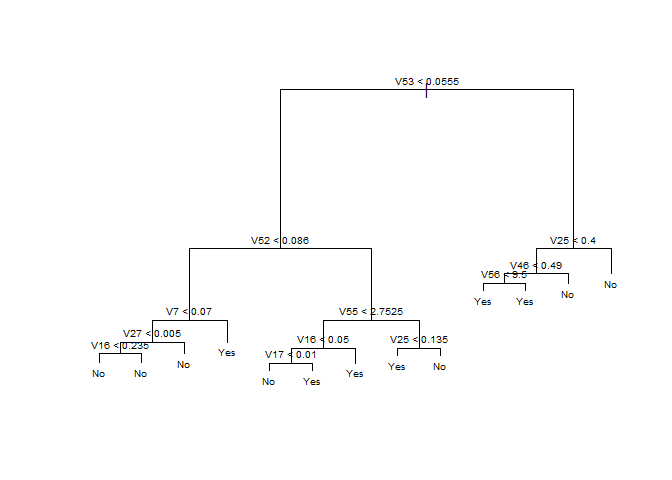
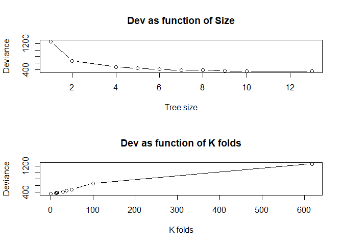
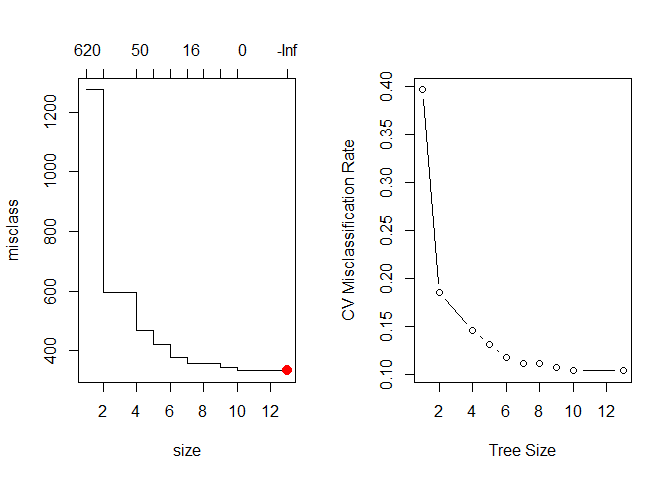
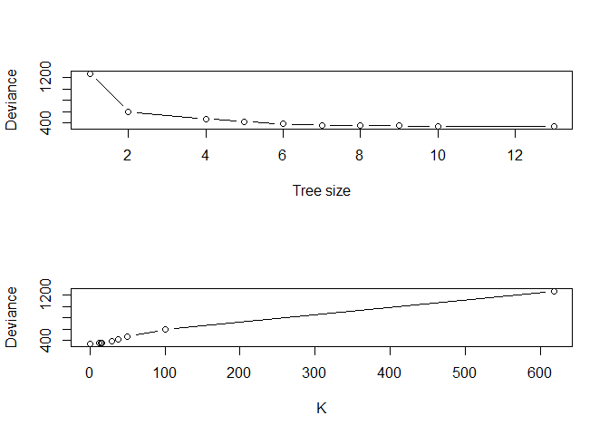
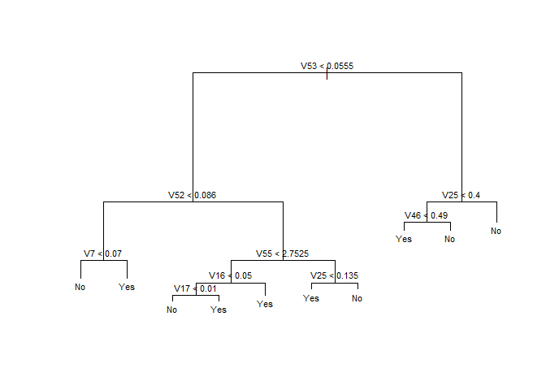
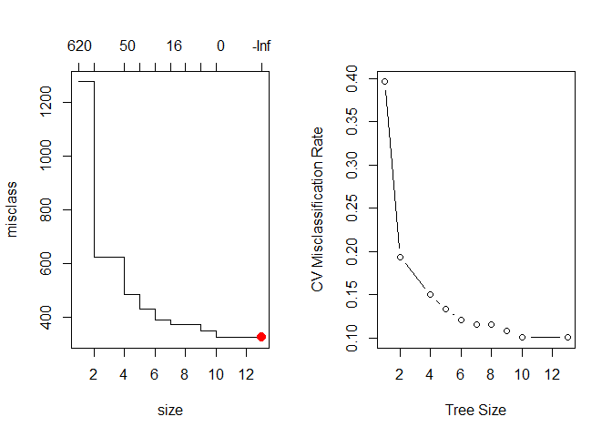
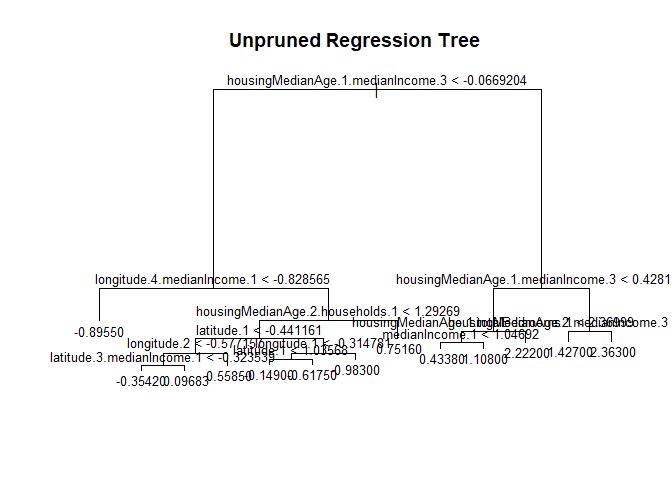
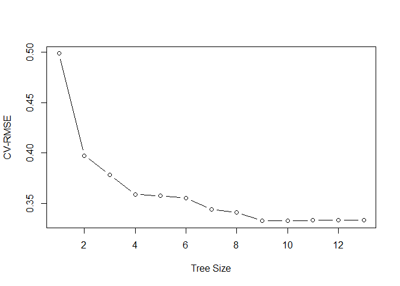
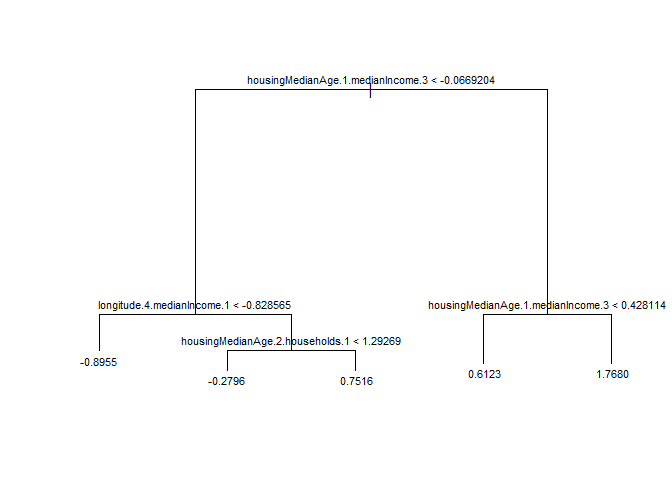
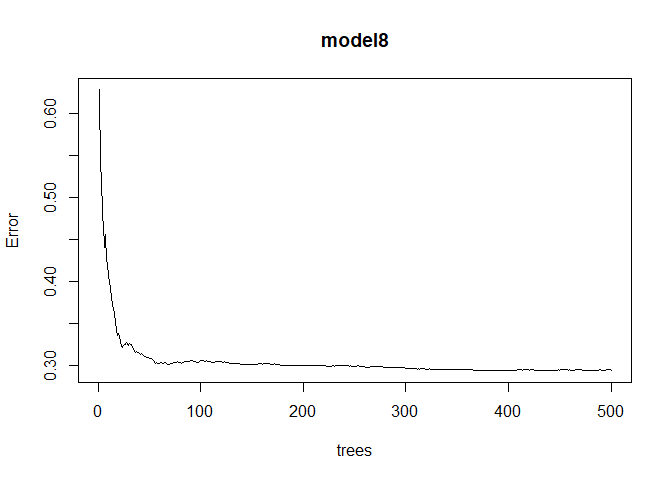

lab3
================
YonatanLourie-NatiShapiro
6/9/2021

# Lab 3

``` r
library(tidyverse)
library(sandwich)
library(lmtest)
library(tree)
set.seed(42)
```

## Classification

### 1.

Load the Spam data from the file spam.data using the read.table function

``` r
dat <- read.table("spam.data")
# dat <- read.table("C:/Users/USER/Desktop/Study/Machine Learning/Lab 3/spam.data")
dat$V58 = as.factor(ifelse(dat$V58 == 1 , "Yes", "No"))
head(dat)
```

    ##     V1   V2   V3 V4   V5   V6   V7   V8   V9  V10  V11  V12  V13  V14  V15  V16
    ## 1 0.00 0.64 0.64  0 0.32 0.00 0.00 0.00 0.00 0.00 0.00 0.64 0.00 0.00 0.00 0.32
    ## 2 0.21 0.28 0.50  0 0.14 0.28 0.21 0.07 0.00 0.94 0.21 0.79 0.65 0.21 0.14 0.14
    ## 3 0.06 0.00 0.71  0 1.23 0.19 0.19 0.12 0.64 0.25 0.38 0.45 0.12 0.00 1.75 0.06
    ## 4 0.00 0.00 0.00  0 0.63 0.00 0.31 0.63 0.31 0.63 0.31 0.31 0.31 0.00 0.00 0.31
    ## 5 0.00 0.00 0.00  0 0.63 0.00 0.31 0.63 0.31 0.63 0.31 0.31 0.31 0.00 0.00 0.31
    ## 6 0.00 0.00 0.00  0 1.85 0.00 0.00 1.85 0.00 0.00 0.00 0.00 0.00 0.00 0.00 0.00
    ##    V17  V18  V19  V20  V21 V22  V23  V24 V25 V26 V27 V28 V29 V30 V31 V32 V33
    ## 1 0.00 1.29 1.93 0.00 0.96   0 0.00 0.00   0   0   0   0   0   0   0   0   0
    ## 2 0.07 0.28 3.47 0.00 1.59   0 0.43 0.43   0   0   0   0   0   0   0   0   0
    ## 3 0.06 1.03 1.36 0.32 0.51   0 1.16 0.06   0   0   0   0   0   0   0   0   0
    ## 4 0.00 0.00 3.18 0.00 0.31   0 0.00 0.00   0   0   0   0   0   0   0   0   0
    ## 5 0.00 0.00 3.18 0.00 0.31   0 0.00 0.00   0   0   0   0   0   0   0   0   0
    ## 6 0.00 0.00 0.00 0.00 0.00   0 0.00 0.00   0   0   0   0   0   0   0   0   0
    ##   V34 V35 V36  V37 V38 V39  V40 V41 V42  V43 V44  V45  V46 V47 V48  V49   V50
    ## 1   0   0   0 0.00   0   0 0.00   0   0 0.00   0 0.00 0.00   0   0 0.00 0.000
    ## 2   0   0   0 0.07   0   0 0.00   0   0 0.00   0 0.00 0.00   0   0 0.00 0.132
    ## 3   0   0   0 0.00   0   0 0.06   0   0 0.12   0 0.06 0.06   0   0 0.01 0.143
    ## 4   0   0   0 0.00   0   0 0.00   0   0 0.00   0 0.00 0.00   0   0 0.00 0.137
    ## 5   0   0   0 0.00   0   0 0.00   0   0 0.00   0 0.00 0.00   0   0 0.00 0.135
    ## 6   0   0   0 0.00   0   0 0.00   0   0 0.00   0 0.00 0.00   0   0 0.00 0.223
    ##   V51   V52   V53   V54   V55 V56  V57 V58
    ## 1   0 0.778 0.000 0.000 3.756  61  278 Yes
    ## 2   0 0.372 0.180 0.048 5.114 101 1028 Yes
    ## 3   0 0.276 0.184 0.010 9.821 485 2259 Yes
    ## 4   0 0.137 0.000 0.000 3.537  40  191 Yes
    ## 5   0 0.135 0.000 0.000 3.537  40  191 Yes
    ## 6   0 0.000 0.000 0.000 3.000  15   54 Yes

We changed the dependent variable of “Yes” and “No” to be a factor for
the classification. We can also see that their are 57 explanatory
variables.

### 2.

Learn your data:

``` r
dim(dat)
```

    ## [1] 4601   58

``` r
str(dat)
```

    ## 'data.frame':    4601 obs. of  58 variables:
    ##  $ V1 : num  0 0.21 0.06 0 0 0 0 0 0.15 0.06 ...
    ##  $ V2 : num  0.64 0.28 0 0 0 0 0 0 0 0.12 ...
    ##  $ V3 : num  0.64 0.5 0.71 0 0 0 0 0 0.46 0.77 ...
    ##  $ V4 : num  0 0 0 0 0 0 0 0 0 0 ...
    ##  $ V5 : num  0.32 0.14 1.23 0.63 0.63 1.85 1.92 1.88 0.61 0.19 ...
    ##  $ V6 : num  0 0.28 0.19 0 0 0 0 0 0 0.32 ...
    ##  $ V7 : num  0 0.21 0.19 0.31 0.31 0 0 0 0.3 0.38 ...
    ##  $ V8 : num  0 0.07 0.12 0.63 0.63 1.85 0 1.88 0 0 ...
    ##  $ V9 : num  0 0 0.64 0.31 0.31 0 0 0 0.92 0.06 ...
    ##  $ V10: num  0 0.94 0.25 0.63 0.63 0 0.64 0 0.76 0 ...
    ##  $ V11: num  0 0.21 0.38 0.31 0.31 0 0.96 0 0.76 0 ...
    ##  $ V12: num  0.64 0.79 0.45 0.31 0.31 0 1.28 0 0.92 0.64 ...
    ##  $ V13: num  0 0.65 0.12 0.31 0.31 0 0 0 0 0.25 ...
    ##  $ V14: num  0 0.21 0 0 0 0 0 0 0 0 ...
    ##  $ V15: num  0 0.14 1.75 0 0 0 0 0 0 0.12 ...
    ##  $ V16: num  0.32 0.14 0.06 0.31 0.31 0 0.96 0 0 0 ...
    ##  $ V17: num  0 0.07 0.06 0 0 0 0 0 0 0 ...
    ##  $ V18: num  1.29 0.28 1.03 0 0 0 0.32 0 0.15 0.12 ...
    ##  $ V19: num  1.93 3.47 1.36 3.18 3.18 0 3.85 0 1.23 1.67 ...
    ##  $ V20: num  0 0 0.32 0 0 0 0 0 3.53 0.06 ...
    ##  $ V21: num  0.96 1.59 0.51 0.31 0.31 0 0.64 0 2 0.71 ...
    ##  $ V22: num  0 0 0 0 0 0 0 0 0 0 ...
    ##  $ V23: num  0 0.43 1.16 0 0 0 0 0 0 0.19 ...
    ##  $ V24: num  0 0.43 0.06 0 0 0 0 0 0.15 0 ...
    ##  $ V25: num  0 0 0 0 0 0 0 0 0 0 ...
    ##  $ V26: num  0 0 0 0 0 0 0 0 0 0 ...
    ##  $ V27: num  0 0 0 0 0 0 0 0 0 0 ...
    ##  $ V28: num  0 0 0 0 0 0 0 0 0 0 ...
    ##  $ V29: num  0 0 0 0 0 0 0 0 0 0 ...
    ##  $ V30: num  0 0 0 0 0 0 0 0 0 0 ...
    ##  $ V31: num  0 0 0 0 0 0 0 0 0 0 ...
    ##  $ V32: num  0 0 0 0 0 0 0 0 0 0 ...
    ##  $ V33: num  0 0 0 0 0 0 0 0 0.15 0 ...
    ##  $ V34: num  0 0 0 0 0 0 0 0 0 0 ...
    ##  $ V35: num  0 0 0 0 0 0 0 0 0 0 ...
    ##  $ V36: num  0 0 0 0 0 0 0 0 0 0 ...
    ##  $ V37: num  0 0.07 0 0 0 0 0 0 0 0 ...
    ##  $ V38: num  0 0 0 0 0 0 0 0 0 0 ...
    ##  $ V39: num  0 0 0 0 0 0 0 0 0 0 ...
    ##  $ V40: num  0 0 0.06 0 0 0 0 0 0 0 ...
    ##  $ V41: num  0 0 0 0 0 0 0 0 0 0 ...
    ##  $ V42: num  0 0 0 0 0 0 0 0 0 0 ...
    ##  $ V43: num  0 0 0.12 0 0 0 0 0 0.3 0 ...
    ##  $ V44: num  0 0 0 0 0 0 0 0 0 0.06 ...
    ##  $ V45: num  0 0 0.06 0 0 0 0 0 0 0 ...
    ##  $ V46: num  0 0 0.06 0 0 0 0 0 0 0 ...
    ##  $ V47: num  0 0 0 0 0 0 0 0 0 0 ...
    ##  $ V48: num  0 0 0 0 0 0 0 0 0 0 ...
    ##  $ V49: num  0 0 0.01 0 0 0 0 0 0 0.04 ...
    ##  $ V50: num  0 0.132 0.143 0.137 0.135 0.223 0.054 0.206 0.271 0.03 ...
    ##  $ V51: num  0 0 0 0 0 0 0 0 0 0 ...
    ##  $ V52: num  0.778 0.372 0.276 0.137 0.135 0 0.164 0 0.181 0.244 ...
    ##  $ V53: num  0 0.18 0.184 0 0 0 0.054 0 0.203 0.081 ...
    ##  $ V54: num  0 0.048 0.01 0 0 0 0 0 0.022 0 ...
    ##  $ V55: num  3.76 5.11 9.82 3.54 3.54 ...
    ##  $ V56: int  61 101 485 40 40 15 4 11 445 43 ...
    ##  $ V57: int  278 1028 2259 191 191 54 112 49 1257 749 ...
    ##  $ V58: Factor w/ 2 levels "No","Yes": 2 2 2 2 2 2 2 2 2 2 ...

``` r
# summary(dat)
```

We can observed that we have only numeric data. We can also tell that we
don’t have negative values (with the summary function).

### 3.

Split the data into train and test sets

``` r
sample <- sample.int(n = nrow(dat), size = floor(.7*nrow(dat)), replace = F)
train <- dat[sample, ]
test  <- dat[-sample, ]

X_train <- train[,c(1:57)]
X_test <- test[,c(1:57)]

Y_train <- train[,c(58)]
Y_test <- test[,c(58)]
```

### 5. Tree

#### a.

Load the tree library

``` r
library(tree)
```

#### b.

Fit a tree model using the tree function

``` r
tree.model <- tree(V58 ~., data=train)
```

#### c.

Print summary of the tree model and examine the results

``` r
summary(tree.model)
```

    ## 
    ## Classification tree:
    ## tree(formula = V58 ~ ., data = train)
    ## Variables actually used in tree construction:
    ##  [1] "V53" "V52" "V7"  "V27" "V16" "V55" "V17" "V25" "V46" "V56"
    ## Number of terminal nodes:  13 
    ## Residual mean deviance:  0.5271 = 1691 / 3207 
    ## Misclassification error rate: 0.09161 = 295 / 3220

We used the tree model for our classification problem. Our goal for this
algorithm is to minimize some form of error criterion. To achieve this,
the algorithm computes in each step the RSS for each predictor, and
chooses the lowest one to be the root.  
The algorithm worked recursively and partitioned the variables. We can
see that in the end result we are left with 10 decision nodes and 13
terminal nodes. Our misclassification error rate is: 0.09161

#### d.

Plot the model using plot(model) and text(model, pretty=0), what can you
say about the results?

``` r
plot(tree.model)
text(tree.model,pretty=0,cex=0.6)
```

<!-- --> Based on above
tree plot, ‘V53’ is the most important factor in determining whether or
not something will be classefied as “spam”. As the tree suggests, the
left value corresponds to the statement being true. for example: if V53
&lt; 0.0555 then we turn left. otherwise, the statement is false and we
turn right. The number of terminal nodes (13) are the bottom leafs
indicating ‘yes’ or ‘no’. Since this is a classification tree, the
output is a classification whether or not something should be classified
as ‘yes’ or a ‘no’. The is as oppose to a regression tree where we would
try and predict a numeric value.

#### e.

Use the model for prediction on the test set

``` r
predictionTreeTest <- predict(tree.model, X_test, type = "class")
summary(predictionTreeTest)
```

    ##  No Yes 
    ## 875 506

This shows how many classifiers are yes and not. Its dosent show how we
performed, we need to check the confusion matrix.

#### f.

Evaluate the fit by printing the accuracy and the confusion matrix
(recall that a confusion matrix is the prediction vs the truth)

``` r
table(predictionTreeTest, actual = Y_test)
```

    ##                   actual
    ## predictionTreeTest  No Yes
    ##                No  795  80
    ##                Yes  48 458

``` r
accuracy <- mean(predictionTreeTest == Y_test)
accuracy
```

    ## [1] 0.9073135

Recall that the main diagonal is for the true fit of the model {(TRUE,
TRUE), (FALSE, FALSE)} and what else is our false positive and true
negative results. This means we were correct 795+458 (=1253) times and
wrong 80+48 (=128) times. The accuracy is the proportion is: 0.9073135

#### g.

Recall that we prune the tree in order to avoid overfitting. The tree
size is a tuning parameter and defines the complexity of the tree, thus
it is determined by cross-validation. Run cross-validation to identify
how to prune the tree.

``` r
tree.model.cv = cv.tree(tree.model, FUN=prune.misclass)
```

#### h.

Examine the output of the cv function

``` r
tree.model.cv
```

    ## $size
    ##  [1] 13 10  9  8  7  6  5  4  2  1
    ## 
    ## $dev
    ##  [1]  342  342  357  377  379  404  439  476  666 1275
    ## 
    ## $k
    ##  [1] -Inf    0   12   15   16   29   38   50  101  618
    ## 
    ## $method
    ## [1] "misclass"
    ## 
    ## attr(,"class")
    ## [1] "prune"         "tree.sequence"

Lets examine the output: Dev stand for - Deviance which is the
cross-validation error rate. Therefor we want it to be the lowest value
possible. We can see looking at the results - that the best deviance for
out tree is sized 13-10 (no changes of dev between these sizes).

K stands for - the number of folds for the cross-validation We also want
this to be small since it takes alot of computing power to cv a tree.

#### i-j.

Plot the deviance as a function of the size and the k.

``` r
par(mfrow = c(2, 1))
plot(tree.model.cv$size,tree.model.cv$dev, type="b", xlab="Tree size", ylab="Deviance", main="Dev as function of Size")
plot(tree.model.cv$k,tree.model.cv$dev, type="b", xlab="K folds", ylab="Deviance", main="Dev as function of K folds")
```

<!-- -->

We can see that as the size of tree increases, the dev decreases. This
makes sense since as the tree gets more complex - it can do a better job
predicting the outcome (hence reducing the dev). Also, as the tree size
grows and dev drops - the number of k folds required to perform the cv
increases. This way - we understand that there is a trade-off between
the size and complexity of tree to the computing power required. as
trees get more complex, we might not be able to use cv to determine
pruning.

#### k. Prune the tree using the value you found in k.

``` r
tree.model.cv.prune <- prune.misclass(tree.model, best=10)
```

#### l. Repeat d.-f. with the pruned tree (tree.model.cv.prune)

``` r
plot(tree.model.cv.prune)
text(tree.model.cv.prune , pretty =0, cex=0.7)
```

<!-- -->

``` r
summary(tree.model.cv.prune)
```

    ## 
    ## Classification tree:
    ## snip.tree(tree = tree.model, nodes = c(8L, 12L))
    ## Variables actually used in tree construction:
    ## [1] "V53" "V52" "V7"  "V55" "V16" "V17" "V25" "V46"
    ## Number of terminal nodes:  10 
    ## Residual mean deviance:  0.5872 = 1885 / 3210 
    ## Misclassification error rate: 0.09161 = 295 / 3220

We can see now that the terminal number of nodes is 10 as we wanted.

``` r
predictionCVTreeTest <- predict(tree.model.cv.prune, X_test, type = "class")
summary(predictionCVTreeTest)
```

    ##  No Yes 
    ## 875 506

``` r
table(predictionCVTreeTest, actual = Y_test)
```

    ##                     actual
    ## predictionCVTreeTest  No Yes
    ##                  No  795  80
    ##                  Yes  48 458

``` r
accuracy <- mean(predictionCVTreeTest == Y_test)
accuracy
```

    ## [1] 0.9073135

We can see by the accuracy table that the results we got as same as
before. This indicates that the model has already chosen the best model
by itself, but we were able to double check that using cross-validation.

####################################################### 

#### g. TODO (not sure)

Recall that we prune the tree in order to avoid overfitting. Run
cross-validation to identify how to prune the tree.

``` r
tree.model.cv = cv.tree(tree.model, FUN=prune.misclass)
tree.model.cv
```

    ## $size
    ##  [1] 13 10  9  8  7  6  5  4  2  1
    ## 
    ## $dev
    ##  [1]  333  333  345  358  357  377  420  469  595 1275
    ## 
    ## $k
    ##  [1] -Inf    0   12   15   16   29   38   50  101  618
    ## 
    ## $method
    ## [1] "misclass"
    ## 
    ## attr(,"class")
    ## [1] "prune"         "tree.sequence"

``` r
# index of tree with minimum error
min_idx = which.min(tree.model.cv$dev)

# number of terminal nodes in that tree
tree.model.cv$size[min_idx]
```

    ## [1] 13

``` r
par(mfrow = c(1, 2))

plot(tree.model.cv)
tree.model.cv$size[min_idx]
```

    ## [1] 13

``` r
points(tree.model.cv$size[min_idx] , tree.model.cv$dev[min_idx], col = "red", cex = 2, pch = 20)
plot(tree.model.cv$size, tree.model.cv$dev / nrow(train), type = "b",
     xlab = "Tree Size", ylab = "CV Misclassification Rate")
points(tree.model.cv$size[min_idx] , tree.model.cv$dev[min_idx], col = "red", cex = 2, pch = 20)
```

<!-- --> So the number
of the treminal nodel with the minimum deviance is 10-13

#### h. TODO (not sure)

Examine the output of the cv function (print the output from g). What is
size? What is k?

``` r
tree.model.cv
```

    ## $size
    ##  [1] 13 10  9  8  7  6  5  4  2  1
    ## 
    ## $dev
    ##  [1]  333  333  345  358  357  377  420  469  595 1275
    ## 
    ## $k
    ##  [1] -Inf    0   12   15   16   29   38   50  101  618
    ## 
    ## $method
    ## [1] "misclass"
    ## 
    ## attr(,"class")
    ## [1] "prune"         "tree.sequence"

So the best size is 13 and 10 (we will prefer 10), and the maximum k is
618, We can see that when the k is getting bigger, the deviance is
getting bigger as well. The tuning parameter k controls a trade-off
between the subtree’s complexity and its fit to the training data. When
k = 0, then the subtree T will simply equal T, because then it just
measures the training error. However, as l increases, there is a price
to pay for having a tree with many terminal nodes, and so the quantity
will tend to be minimized for a smaller subtree. *(The k for size=13 is
-inf what the does it mean)*.

#### i

dev reports the deviance, which is a measure of how good the fit is.
Lower deviance means a better fit. Plot the deviance as a function of
the size and the k.

``` r
par(mfrow = c(2,1))
plot(tree.model.cv$size, tree.model.cv$dev, type="b", xlab="Tree size", ylab="Deviance")
plot(tree.model.cv$k, tree.model.cv$dev, type="b", xlab="K", ylab="Deviance")
```

<!-- --> As we
mentioned above, the best tree size is 10 or 13 (we will prefer 10) with
lowest deviance, and the worst k is above \~600.

#### j.

Find the tree size that minimizes the corss-validation error:

We already found it in g. The best tree size is 10.

#### k.

Prune the tree using the value you found in k. by running
prune.misclass(tree\_mod, best = best\_size)

``` r
tree.model.cv.prune <- prune.misclass(tree.model, best=10)
plot(tree.model.cv.prune)
text(tree.model.cv.prune , pretty =0, cex=0.7)
```

<!-- -->

#### l. TODO (not sure)

Repeat d.-f. with the pruned tree

``` r
predictionTreeTest <- predict(tree.model.cv.prune, X_test, type = "class")
summary(predictionTreeTest)
```

    ##  No Yes 
    ## 875 506

``` r
table(predictionTreeTest, actual = Y_test)
```

    ##                   actual
    ## predictionTreeTest  No Yes
    ##                No  795  80
    ##                Yes  48 458

``` r
accuracy <- mean(predictionTreeTest == Y_test)
accuracy
```

    ## [1] 0.9073135

``` r
tree.model.cv = cv.tree(tree.model, FUN=prune.misclass)
# index of tree with minimum error
min_idx = which.min(tree.model.cv$dev)

# number of terminal nodes in that tree
tree.model.cv$size[min_idx]
```

    ## [1] 13

``` r
par(mfrow = c(1, 2))

plot(tree.model.cv)
tree.model.cv$size[min_idx]
```

    ## [1] 13

``` r
points(tree.model.cv$size[min_idx] , tree.model.cv$dev[min_idx], col = "red", cex = 2, pch = 20)
plot(tree.model.cv$size, tree.model.cv$dev / nrow(train), type = "b",
     xlab = "Tree Size", ylab = "CV Misclassification Rate")
points(tree.model.cv$size[min_idx] , tree.model.cv$dev[min_idx], col = "red", cex = 2, pch = 20)
```

<!-- -->

``` r
tree.model.cv
```

    ## $size
    ##  [1] 13 10  9  8  7  6  5  4  2  1
    ## 
    ## $dev
    ##  [1]  323  323  348  370  370  390  428  482  623 1275
    ## 
    ## $k
    ##  [1] -Inf    0   12   15   16   29   38   50  101  618
    ## 
    ## $method
    ## [1] "misclass"
    ## 
    ## attr(,"class")
    ## [1] "prune"         "tree.sequence"

``` r
par(mfrow = c(2,1))
plot(tree.model.cv$size, tree.model.cv$dev, type="b", xlab="Tree size", ylab="Deviance")
plot(tree.model.cv$k, tree.model.cv$dev, type="b", xlab="K", ylab="Deviance")
```

<!-- --> We got the
same values which means that it is the best tree model.

### 6 Random Forest

#### a.

Load randomForset package

``` r
library(randomForest)
```

#### b.

Fit a random forest model using the randomForest function

``` r
model6 <- randomForest(V58~., data=train)
model6
```

    ## 
    ## Call:
    ##  randomForest(formula = V58 ~ ., data = train) 
    ##                Type of random forest: classification
    ##                      Number of trees: 500
    ## No. of variables tried at each split: 7
    ## 
    ##         OOB estimate of  error rate: 5.16%
    ## Confusion matrix:
    ##       No  Yes class.error
    ## No  1885   60  0.03084833
    ## Yes  106 1169  0.08313725

#### c.

Use the model for prediction on the test set and evaluate the fit by its
accuracy and the confusion matrix.

``` r
RandomForestP <- predict(model6, newdata = X_test) #predict on the test set

#check accuracy of predictions
table(predicted = RandomForestP, actual = Y_test) 
```

    ##          actual
    ## predicted  No Yes
    ##       No  819  31
    ##       Yes  24 507

``` r
mean(RandomForestP==Y_test)
```

    ## [1] 0.9601738

So our accuracy is 0.9601738.

### 7. Regression trees

#### a-b

Read California Housing data set stored in a CSV file

``` r
load("CA_samp.Rdata")
df <- data.frame(CA_samp)
sample <- sample.int(n = nrow(df), size = floor(.8*nrow(df)), replace = F)


train_CA <- df[sample, ]
test_CA  <- df[-sample, ]
train_CA <- data.frame(scale(train_CA))
test_CA  <- data.frame(scale(test_CA))

X_train <- train_CA[, -which(names(train_CA) == "medianHouseValue")]
X_test <- test_CA[, -which(names(test_CA) == "medianHouseValue")]

Y_train <- train_CA[, which(names(train_CA) == "medianHouseValue")]
Y_test <- test_CA[, which(names(test_CA) == "medianHouseValue")]
```

#### c.

Everything that was done for the classification setting can be repeated
in the regression setting in exactly the same way! Fit a regression tree
to the data

``` r
CA.tree.model <- tree(medianHouseValue~., data=train_CA)
summary(CA.tree.model)
```

    ## 
    ## Regression tree:
    ## tree(formula = medianHouseValue ~ ., data = train_CA)
    ## Variables actually used in tree construction:
    ##  [1] "housingMedianAge.1.medianIncome.3"  "longitude.4.medianIncome.1"        
    ##  [3] "housingMedianAge.2.households.1"    "latitude.1"                        
    ##  [5] "longitude.2"                        "latitude.3.medianIncome.1"         
    ##  [7] "longitude.1"                        "housingMedianAge.1.totalBedrooms.1"
    ##  [9] "medianIncome.1"                     "housingMedianAge.2.medianIncome.3" 
    ## Number of terminal nodes:  13 
    ## Residual mean deviance:  0.3122 = 245.7 / 787 
    ## Distribution of residuals:
    ##     Min.  1st Qu.   Median     Mean  3rd Qu.     Max. 
    ## -1.80400 -0.34970 -0.07922  0.00000  0.24440  2.91500

We left with 10 variables, and 11 terminal nodes

``` r
plot(CA.tree.model) 
text(CA.tree.model, pretty=0, cex=0.8)
title(main = "Unpruned Regression Tree")
```

<!-- -->

#### d. TODO

Use the model for prediction on the test set and evaluate the fit using
the root mean squared error (RMSE)

``` r
CA_predictions <- predict(CA.tree.model, newdata = X_test)
sqrt(mean(CA_predictions-Y_test)^2)
```

    ## [1] 0.01365314

The RMSE is 0.0136531

## TODO

from here: if we want to do CV

But we want to check if we can make it better with cross validation as
we did in the last tree model:

``` r
CA.tree.model.cv <- cv.tree(CA.tree.model)
plot(CA.tree.model.cv$size, sqrt(CA.tree.model.cv$dev / nrow(train)), type = "b",
     xlab = "Tree Size", ylab = "CV-RMSE")
```

<!-- -->

``` r
(CA.tree.model.cv)
```

    ## $size
    ##  [1] 13 12 11 10  9  8  7  6  5  4  3  2  1
    ## 
    ## $dev
    ##  [1] 357.4952 357.7354 357.5764 356.3819 356.4616 374.7675 380.7734 406.8882
    ##  [9] 411.9586 415.1293 460.9872 508.9374 800.7919
    ## 
    ## $k
    ##  [1]       -Inf   8.120889   8.500718   8.631919   8.747546  15.023100
    ##  [7]  16.206162  18.144963  22.946894  26.939977  49.240616  65.791295
    ## [13] 305.000387
    ## 
    ## $method
    ## [1] "deviance"
    ## 
    ## attr(,"class")
    ## [1] "prune"         "tree.sequence"

We can see that we have the lowest deviance with tree with the size of
9.

``` r
forest.model.prune <- prune.tree(CA.tree.model, best=5)
plot(forest.model.prune)
text(forest.model.prune , pretty =0, cex=0.7)
```

<!-- -->

``` r
forest.model.prune <- prune.tree(CA.tree.model, best=5)
CA_predictions.cv <- predict(forest.model.prune, newdata = X_test)
sqrt(mean(CA_predictions.cv-Y_test)^2)
```

    ## [1] 0.02454727

``` r
sqrt(mean(CA_predictions-Y_test)^2)
```

    ## [1] 0.01365314

We can see that we got higher RMSE which is not that good, but, when we
think about the tra

### 8. Random Forest

#### a.

Fit a random forest model in exactly the same way, but set
importance=TRUE

``` r
model8 <- randomForest(medianHouseValue~., data=train_CA, importance=TRUE)
model8
```

    ## 
    ## Call:
    ##  randomForest(formula = medianHouseValue ~ ., data = train_CA,      importance = TRUE) 
    ##                Type of random forest: regression
    ##                      Number of trees: 500
    ## No. of variables tried at each split: 176
    ## 
    ##           Mean of squared residuals: 0.2947841
    ##                     % Var explained: 70.48

``` r
plot(model8)
```

<!-- -->

#### b.

Use the model for prediction on the test set and evaluate the fit using
the root mean squared error (RMSE)

``` r
RandomForest8 <- predict(model8, newdata = X_test) #predict on the test set

#check accuracy of predictions
table(predicted = RandomForest8, actual = Y_test) 
```

    ##                       actual
    ## predicted              -1.54852121440121 -1.4994041664941 -1.45198080989413
    ##   -0.899136893340378                   1                0                 0
    ##   -0.822941868145356                   0                0                 0
    ##   -0.775856936334096                   0                0                 0
    ##   -0.756259767624829                   0                0                 0
    ##   -0.745837040984818                   0                0                 1
    ##   -0.735491356425849                   0                0                 0
    ##   -0.731893737894646                   0                0                 0
    ##   -0.728590940436825                   0                0                 0
    ##   -0.728123186347959                   0                0                 0
    ##   -0.698941150352247                   0                0                 0
    ##   -0.697602127760614                   0                0                 0
    ##   -0.678204576457282                   0                0                 0
    ##   -0.67218098055144                    0                0                 0
    ##   -0.657306568485629                   0                0                 0
    ##   -0.631601542163827                   0                0                 0
    ##   -0.623613540458165                   0                0                 0
    ##   -0.605105212688352                   0                0                 0
    ##   -0.598385318829526                   0                0                 0
    ##   -0.58736828708498                    0                0                 0
    ##   -0.585065468591069                   0                0                 0
    ##   -0.561538097570388                   0                1                 0
    ##   -0.558413462597199                   0                0                 0
    ##   -0.547965431878502                   0                0                 0
    ##   -0.522226149095981                   0                0                 0
    ##   -0.503919430044162                   0                0                 0
    ##   -0.501010102328807                   0                0                 0
    ##   -0.498505431583454                   0                0                 0
    ##   -0.492634240238899                   0                0                 0
    ##   -0.453615755926121                   0                0                 0
    ##   -0.44856541790483                    0                0                 0
    ##   -0.433572749116176                   0                0                 0
    ##   -0.431007280230832                   0                0                 0
    ##   -0.426643119224385                   0                0                 0
    ##   -0.419362047165648                   0                0                 0
    ##   -0.41354708720336                    0                0                 0
    ##   -0.412423672891925                   0                0                 0
    ##   -0.407516340138567                   0                0                 0
    ##   -0.405149712414345                   0                0                 0
    ##   -0.40489403638178                    0                0                 0
    ##   -0.38810672280728                    0                0                 0
    ##   -0.377327223708903                   0                0                 0
    ##   -0.330135940580456                   0                0                 0
    ##   -0.326297182623592                   0                0                 0
    ##   -0.293041602203929                   0                0                 0
    ##   -0.291435022440754                   0                0                 0
    ##   -0.28889577283453                    0                0                 0
    ##   -0.277998017591089                   0                0                 0
    ##   -0.274067984857534                   0                0                 0
    ##   -0.269377932474057                   0                0                 0
    ##   -0.255874202059363                   0                0                 0
    ##   -0.251653308343195                   0                0                 0
    ##   -0.24998511375075                    0                0                 0
    ##   -0.241196483842543                   0                0                 0
    ##   -0.23569718280798                    0                0                 0
    ##   -0.232682054686811                   0                0                 0
    ##   -0.231460859817817                   0                0                 0
    ##   -0.219054243257619                   0                0                 0
    ##   -0.213739857777564                   0                0                 0
    ##   -0.207653681864218                   0                0                 0
    ##   -0.195962172821496                   0                0                 0
    ##   -0.181407316218595                   0                0                 0
    ##   -0.172040393457903                   0                0                 0
    ##   -0.160245182788142                   0                0                 0
    ##   -0.151026131919915                   0                0                 0
    ##   -0.150579195174273                   0                0                 0
    ##   -0.13982519371023                    0                0                 0
    ##   -0.138201259227699                   0                0                 0
    ##   -0.131729182175483                   0                0                 0
    ##   -0.12782853350033                    0                0                 0
    ##   -0.121331871125323                   0                0                 0
    ##   -0.117667119406674                   0                0                 0
    ##   -0.108334719462381                   0                0                 0
    ##   -0.10508979889872                    0                0                 0
    ##   -0.104568292962099                   0                0                 0
    ##   -0.0990542868983297                  0                0                 0
    ##   -0.0922924466417994                  0                0                 0
    ##   -0.0900177933834902                  0                0                 0
    ##   -0.0801768045976017                  0                0                 0
    ##   -0.0667347921455585                  0                0                 0
    ##   -0.05218640145684                    0                0                 0
    ##   -0.0497767567121833                  0                0                 0
    ##   -0.0463467625717177                  0                0                 0
    ##   -0.0388575260363182                  0                0                 0
    ##   -0.0293333687787122                  0                0                 0
    ##   -0.0114276513840474                  0                0                 0
    ##   -0.00995751390790829                 0                0                 0
    ##   -0.00956517343264542                 0                0                 0
    ##   0.000924100238976651                 0                0                 0
    ##   0.00831182925949017                  0                0                 0
    ##   0.0126117858354375                   0                0                 0
    ##   0.0140705286617192                   0                0                 0
    ##   0.0310224847144287                   0                0                 0
    ##   0.0344672535063572                   0                0                 0
    ##   0.0393460714683929                   0                0                 0
    ##   0.0535892266343371                   0                0                 0
    ##   0.0540428875609515                   0                0                 0
    ##   0.0749202812783665                   0                0                 0
    ##   0.0772377008014356                   0                0                 0
    ##   0.0788615373505866                   0                0                 0
    ##   0.0904547212799338                   0                0                 0
    ##   0.0980731094100177                   0                0                 0
    ##   0.105459576274376                    0                0                 0
    ##   0.105848168125636                    0                0                 0
    ##   0.119834405036203                    0                0                 0
    ##   0.121479015017444                    0                0                 0
    ##   0.129979676299969                    0                0                 0
    ##   0.170627496453399                    0                0                 0
    ##   0.181324788423836                    0                0                 0
    ##   0.186530175785447                    0                0                 0
    ##   0.18693423359961                     0                0                 0
    ##   0.196890796773733                    0                0                 0
    ##   0.200349760994627                    0                0                 0
    ##   0.212676278738998                    0                0                 0
    ##   0.218198664895637                    0                0                 0
    ##   0.219223962382685                    0                0                 0
    ##   0.219789471317986                    0                0                 0
    ##   0.225397091292892                    0                0                 0
    ##   0.225417463458125                    0                0                 0
    ##   0.227099769412829                    0                0                 0
    ##   0.232238129320377                    0                0                 0
    ##   0.236031489522342                    0                0                 0
    ##   0.252333670599721                    0                0                 0
    ##   0.255412505106709                    0                0                 0
    ##   0.257165962695211                    0                0                 0
    ##   0.264219497379194                    0                0                 0
    ##   0.264233607874786                    0                0                 0
    ##   0.279843824045683                    0                0                 0
    ##   0.282054972851604                    0                0                 0
    ##   0.289125346299141                    0                0                 0
    ##   0.291564479391138                    0                0                 0
    ##   0.293114788483139                    0                0                 0
    ##   0.306826165974251                    0                0                 0
    ##   0.311211012590524                    0                0                 0
    ##   0.311662133604819                    0                0                 0
    ##   0.312796366810283                    0                0                 0
    ##   0.315152674551825                    0                0                 0
    ##   0.333804316411938                    0                0                 0
    ##   0.344751348034343                    0                0                 0
    ##   0.38953499564131                     0                0                 0
    ##   0.405530493861894                    0                0                 0
    ##   0.416263407293698                    0                0                 0
    ##   0.435507952857681                    0                0                 0
    ##   0.438154981181769                    0                0                 0
    ##   0.444598454175954                    0                0                 0
    ##   0.452657041004035                    0                0                 0
    ##   0.454716740026901                    0                0                 0
    ##   0.463235203228992                    0                0                 0
    ##   0.466972494404323                    0                0                 0
    ##   0.469667094951009                    0                0                 0
    ##   0.477854289973516                    0                0                 0
    ##   0.487458964936038                    0                0                 0
    ##   0.491549331945756                    0                0                 0
    ##   0.54336519075991                     0                0                 0
    ##   0.565233332570185                    0                0                 0
    ##   0.596221835846247                    0                0                 0
    ##   0.604106277191605                    0                0                 0
    ##   0.633256554172232                    0                0                 0
    ##   0.65845777883249                     0                0                 0
    ##   0.747653702003345                    0                0                 0
    ##   0.760290019428213                    0                0                 0
    ##   0.776170978061055                    0                0                 0
    ##   0.788079563518005                    0                0                 0
    ##   0.802805881535689                    0                0                 0
    ##   0.807801479419865                    0                0                 0
    ##   0.816657445893392                    0                0                 0
    ##   0.840588685505923                    0                0                 0
    ##   0.849651192322011                    0                0                 0
    ##   0.926207136977369                    0                0                 0
    ##   0.936540997886273                    0                0                 0
    ##   0.948083821236143                    0                0                 0
    ##   0.951564248178345                    0                0                 0
    ##   0.95724544905487                     0                0                 0
    ##   0.966227786277316                    0                0                 0
    ##   1.00805030287765                     0                0                 0
    ##   1.01396036770734                     0                0                 0
    ##   1.02155212633589                     0                0                 0
    ##   1.03141084221909                     0                0                 0
    ##   1.06176765092841                     0                0                 0
    ##   1.09513155519953                     0                0                 0
    ##   1.13173625989902                     0                0                 0
    ##   1.13680510039577                     0                0                 0
    ##   1.13851405434091                     0                0                 0
    ##   1.20574568621137                     0                0                 0
    ##   1.22196918894026                     0                0                 0
    ##   1.22331683978044                     0                0                 0
    ##   1.23347675714005                     0                0                 0
    ##   1.24786092163965                     0                0                 0
    ##   1.30797895215315                     0                0                 0
    ##   1.32862857247347                     0                0                 0
    ##   1.47608535654228                     0                0                 0
    ##   1.50635693634445                     0                0                 0
    ##   1.71717909093601                     0                0                 0
    ##   1.78321343523772                     0                0                 0
    ##   1.81346965769926                     0                0                 0
    ##   1.86617943824917                     0                0                 0
    ##   2.28851220464823                     0                0                 0
    ##   2.29150441375851                     0                0                 0
    ##   2.40036413615917                     0                0                 0
    ##   2.41000717962881                     0                0                 0
    ##   2.41858244043566                     0                0                 0
    ##                       actual
    ## predicted              -1.43165651420843 -1.42911597724771 -1.38677369456917
    ##   -0.899136893340378                   0                 0                 0
    ##   -0.822941868145356                   0                 0                 1
    ##   -0.775856936334096                   0                 0                 0
    ##   -0.756259767624829                   0                 1                 0
    ##   -0.745837040984818                   0                 0                 0
    ##   -0.735491356425849                   1                 0                 0
    ##   -0.731893737894646                   0                 0                 0
    ##   -0.728590940436825                   0                 0                 0
    ##   -0.728123186347959                   0                 0                 0
    ##   -0.698941150352247                   0                 0                 0
    ##   -0.697602127760614                   0                 0                 0
    ##   -0.678204576457282                   0                 0                 0
    ##   -0.67218098055144                    0                 0                 0
    ##   -0.657306568485629                   0                 0                 0
    ##   -0.631601542163827                   0                 0                 0
    ##   -0.623613540458165                   0                 0                 0
    ##   -0.605105212688352                   0                 0                 0
    ##   -0.598385318829526                   0                 0                 0
    ##   -0.58736828708498                    0                 0                 0
    ##   -0.585065468591069                   0                 0                 0
    ##   -0.561538097570388                   0                 0                 0
    ##   -0.558413462597199                   0                 0                 0
    ##   -0.547965431878502                   0                 0                 0
    ##   -0.522226149095981                   0                 0                 0
    ##   -0.503919430044162                   0                 0                 0
    ##   -0.501010102328807                   0                 0                 0
    ##   -0.498505431583454                   0                 0                 0
    ##   -0.492634240238899                   0                 0                 0
    ##   -0.453615755926121                   0                 0                 0
    ##   -0.44856541790483                    0                 0                 0
    ##   -0.433572749116176                   0                 0                 0
    ##   -0.431007280230832                   0                 0                 0
    ##   -0.426643119224385                   0                 0                 0
    ##   -0.419362047165648                   0                 0                 0
    ##   -0.41354708720336                    0                 0                 0
    ##   -0.412423672891925                   0                 0                 0
    ##   -0.407516340138567                   0                 0                 0
    ##   -0.405149712414345                   0                 0                 0
    ##   -0.40489403638178                    0                 0                 0
    ##   -0.38810672280728                    0                 0                 0
    ##   -0.377327223708903                   0                 0                 0
    ##   -0.330135940580456                   0                 0                 0
    ##   -0.326297182623592                   0                 0                 0
    ##   -0.293041602203929                   0                 0                 0
    ##   -0.291435022440754                   0                 0                 0
    ##   -0.28889577283453                    0                 0                 0
    ##   -0.277998017591089                   0                 0                 0
    ##   -0.274067984857534                   0                 0                 0
    ##   -0.269377932474057                   0                 0                 0
    ##   -0.255874202059363                   0                 0                 0
    ##   -0.251653308343195                   0                 0                 0
    ##   -0.24998511375075                    0                 0                 0
    ##   -0.241196483842543                   0                 0                 0
    ##   -0.23569718280798                    0                 0                 0
    ##   -0.232682054686811                   0                 0                 0
    ##   -0.231460859817817                   0                 0                 0
    ##   -0.219054243257619                   0                 0                 0
    ##   -0.213739857777564                   0                 0                 0
    ##   -0.207653681864218                   0                 0                 0
    ##   -0.195962172821496                   0                 0                 0
    ##   -0.181407316218595                   0                 0                 0
    ##   -0.172040393457903                   0                 0                 0
    ##   -0.160245182788142                   0                 0                 0
    ##   -0.151026131919915                   0                 0                 0
    ##   -0.150579195174273                   0                 0                 0
    ##   -0.13982519371023                    0                 0                 0
    ##   -0.138201259227699                   0                 0                 0
    ##   -0.131729182175483                   0                 0                 0
    ##   -0.12782853350033                    0                 0                 0
    ##   -0.121331871125323                   0                 0                 0
    ##   -0.117667119406674                   0                 0                 0
    ##   -0.108334719462381                   0                 0                 0
    ##   -0.10508979889872                    0                 0                 0
    ##   -0.104568292962099                   0                 0                 0
    ##   -0.0990542868983297                  0                 0                 0
    ##   -0.0922924466417994                  0                 0                 0
    ##   -0.0900177933834902                  0                 0                 0
    ##   -0.0801768045976017                  0                 0                 0
    ##   -0.0667347921455585                  0                 0                 0
    ##   -0.05218640145684                    0                 0                 0
    ##   -0.0497767567121833                  0                 0                 0
    ##   -0.0463467625717177                  0                 0                 0
    ##   -0.0388575260363182                  0                 0                 0
    ##   -0.0293333687787122                  0                 0                 0
    ##   -0.0114276513840474                  0                 0                 0
    ##   -0.00995751390790829                 0                 0                 0
    ##   -0.00956517343264542                 0                 0                 0
    ##   0.000924100238976651                 0                 0                 0
    ##   0.00831182925949017                  0                 0                 0
    ##   0.0126117858354375                   0                 0                 0
    ##   0.0140705286617192                   0                 0                 0
    ##   0.0310224847144287                   0                 0                 0
    ##   0.0344672535063572                   0                 0                 0
    ##   0.0393460714683929                   0                 0                 0
    ##   0.0535892266343371                   0                 0                 0
    ##   0.0540428875609515                   0                 0                 0
    ##   0.0749202812783665                   0                 0                 0
    ##   0.0772377008014356                   0                 0                 0
    ##   0.0788615373505866                   0                 0                 0
    ##   0.0904547212799338                   0                 0                 0
    ##   0.0980731094100177                   0                 0                 0
    ##   0.105459576274376                    0                 0                 0
    ##   0.105848168125636                    0                 0                 0
    ##   0.119834405036203                    0                 0                 0
    ##   0.121479015017444                    0                 0                 0
    ##   0.129979676299969                    0                 0                 0
    ##   0.170627496453399                    0                 0                 0
    ##   0.181324788423836                    0                 0                 0
    ##   0.186530175785447                    0                 0                 0
    ##   0.18693423359961                     0                 0                 0
    ##   0.196890796773733                    0                 0                 0
    ##   0.200349760994627                    0                 0                 0
    ##   0.212676278738998                    0                 0                 0
    ##   0.218198664895637                    0                 0                 0
    ##   0.219223962382685                    0                 0                 0
    ##   0.219789471317986                    0                 0                 0
    ##   0.225397091292892                    0                 0                 0
    ##   0.225417463458125                    0                 0                 0
    ##   0.227099769412829                    0                 0                 0
    ##   0.232238129320377                    0                 0                 0
    ##   0.236031489522342                    0                 0                 0
    ##   0.252333670599721                    0                 0                 0
    ##   0.255412505106709                    0                 0                 0
    ##   0.257165962695211                    0                 0                 0
    ##   0.264219497379194                    0                 0                 0
    ##   0.264233607874786                    0                 0                 0
    ##   0.279843824045683                    0                 0                 0
    ##   0.282054972851604                    0                 0                 0
    ##   0.289125346299141                    0                 0                 0
    ##   0.291564479391138                    0                 0                 0
    ##   0.293114788483139                    0                 0                 0
    ##   0.306826165974251                    0                 0                 0
    ##   0.311211012590524                    0                 0                 0
    ##   0.311662133604819                    0                 0                 0
    ##   0.312796366810283                    0                 0                 0
    ##   0.315152674551825                    0                 0                 0
    ##   0.333804316411938                    0                 0                 0
    ##   0.344751348034343                    0                 0                 0
    ##   0.38953499564131                     0                 0                 0
    ##   0.405530493861894                    0                 0                 0
    ##   0.416263407293698                    0                 0                 0
    ##   0.435507952857681                    0                 0                 0
    ##   0.438154981181769                    0                 0                 0
    ##   0.444598454175954                    0                 0                 0
    ##   0.452657041004035                    0                 0                 0
    ##   0.454716740026901                    0                 0                 0
    ##   0.463235203228992                    0                 0                 0
    ##   0.466972494404323                    0                 0                 0
    ##   0.469667094951009                    0                 0                 0
    ##   0.477854289973516                    0                 0                 0
    ##   0.487458964936038                    0                 0                 0
    ##   0.491549331945756                    0                 0                 0
    ##   0.54336519075991                     0                 0                 0
    ##   0.565233332570185                    0                 0                 0
    ##   0.596221835846247                    0                 0                 0
    ##   0.604106277191605                    0                 0                 0
    ##   0.633256554172232                    0                 0                 0
    ##   0.65845777883249                     0                 0                 0
    ##   0.747653702003345                    0                 0                 0
    ##   0.760290019428213                    0                 0                 0
    ##   0.776170978061055                    0                 0                 0
    ##   0.788079563518005                    0                 0                 0
    ##   0.802805881535689                    0                 0                 0
    ##   0.807801479419865                    0                 0                 0
    ##   0.816657445893392                    0                 0                 0
    ##   0.840588685505923                    0                 0                 0
    ##   0.849651192322011                    0                 0                 0
    ##   0.926207136977369                    0                 0                 0
    ##   0.936540997886273                    0                 0                 0
    ##   0.948083821236143                    0                 0                 0
    ##   0.951564248178345                    0                 0                 0
    ##   0.95724544905487                     0                 0                 0
    ##   0.966227786277316                    0                 0                 0
    ##   1.00805030287765                     0                 0                 0
    ##   1.01396036770734                     0                 0                 0
    ##   1.02155212633589                     0                 0                 0
    ##   1.03141084221909                     0                 0                 0
    ##   1.06176765092841                     0                 0                 0
    ##   1.09513155519953                     0                 0                 0
    ##   1.13173625989902                     0                 0                 0
    ##   1.13680510039577                     0                 0                 0
    ##   1.13851405434091                     0                 0                 0
    ##   1.20574568621137                     0                 0                 0
    ##   1.22196918894026                     0                 0                 0
    ##   1.22331683978044                     0                 0                 0
    ##   1.23347675714005                     0                 0                 0
    ##   1.24786092163965                     0                 0                 0
    ##   1.30797895215315                     0                 0                 0
    ##   1.32862857247347                     0                 0                 0
    ##   1.47608535654228                     0                 0                 0
    ##   1.50635693634445                     0                 0                 0
    ##   1.71717909093601                     0                 0                 0
    ##   1.78321343523772                     0                 0                 0
    ##   1.81346965769926                     0                 0                 0
    ##   1.86617943824917                     0                 0                 0
    ##   2.28851220464823                     0                 0                 0
    ##   2.29150441375851                     0                 0                 0
    ##   2.40036413615917                     0                 0                 0
    ##   2.41000717962881                     0                 0                 0
    ##   2.41858244043566                     0                 0                 0
    ##                       actual
    ## predicted              -1.30886389444065 -1.30547651182636 -1.30039543790494
    ##   -0.899136893340378                   0                 0                 0
    ##   -0.822941868145356                   0                 0                 0
    ##   -0.775856936334096                   0                 0                 0
    ##   -0.756259767624829                   0                 0                 0
    ##   -0.745837040984818                   0                 0                 0
    ##   -0.735491356425849                   0                 0                 0
    ##   -0.731893737894646                   0                 0                 0
    ##   -0.728590940436825                   0                 0                 0
    ##   -0.728123186347959                   0                 0                 0
    ##   -0.698941150352247                   0                 0                 0
    ##   -0.697602127760614                   0                 0                 0
    ##   -0.678204576457282                   0                 0                 1
    ##   -0.67218098055144                    0                 0                 0
    ##   -0.657306568485629                   0                 0                 0
    ##   -0.631601542163827                   0                 0                 0
    ##   -0.623613540458165                   0                 0                 0
    ##   -0.605105212688352                   0                 0                 0
    ##   -0.598385318829526                   0                 1                 0
    ##   -0.58736828708498                    0                 0                 0
    ##   -0.585065468591069                   0                 0                 0
    ##   -0.561538097570388                   0                 0                 0
    ##   -0.558413462597199                   0                 0                 0
    ##   -0.547965431878502                   0                 0                 0
    ##   -0.522226149095981                   1                 0                 0
    ##   -0.503919430044162                   0                 0                 0
    ##   -0.501010102328807                   0                 0                 0
    ##   -0.498505431583454                   0                 0                 0
    ##   -0.492634240238899                   0                 0                 0
    ##   -0.453615755926121                   0                 0                 0
    ##   -0.44856541790483                    0                 0                 0
    ##   -0.433572749116176                   0                 0                 0
    ##   -0.431007280230832                   0                 0                 0
    ##   -0.426643119224385                   0                 0                 0
    ##   -0.419362047165648                   0                 0                 0
    ##   -0.41354708720336                    0                 0                 0
    ##   -0.412423672891925                   0                 0                 0
    ##   -0.407516340138567                   0                 0                 0
    ##   -0.405149712414345                   0                 0                 0
    ##   -0.40489403638178                    0                 0                 0
    ##   -0.38810672280728                    0                 0                 0
    ##   -0.377327223708903                   0                 0                 0
    ##   -0.330135940580456                   0                 0                 0
    ##   -0.326297182623592                   0                 0                 0
    ##   -0.293041602203929                   0                 0                 0
    ##   -0.291435022440754                   0                 0                 0
    ##   -0.28889577283453                    0                 0                 0
    ##   -0.277998017591089                   0                 0                 0
    ##   -0.274067984857534                   0                 0                 0
    ##   -0.269377932474057                   0                 0                 0
    ##   -0.255874202059363                   0                 0                 0
    ##   -0.251653308343195                   0                 0                 0
    ##   -0.24998511375075                    0                 0                 0
    ##   -0.241196483842543                   0                 0                 0
    ##   -0.23569718280798                    0                 0                 0
    ##   -0.232682054686811                   0                 0                 0
    ##   -0.231460859817817                   0                 0                 0
    ##   -0.219054243257619                   0                 0                 0
    ##   -0.213739857777564                   0                 0                 0
    ##   -0.207653681864218                   0                 0                 0
    ##   -0.195962172821496                   0                 0                 0
    ##   -0.181407316218595                   0                 0                 0
    ##   -0.172040393457903                   0                 0                 0
    ##   -0.160245182788142                   0                 0                 0
    ##   -0.151026131919915                   0                 0                 0
    ##   -0.150579195174273                   0                 0                 0
    ##   -0.13982519371023                    0                 0                 0
    ##   -0.138201259227699                   0                 0                 0
    ##   -0.131729182175483                   0                 0                 0
    ##   -0.12782853350033                    0                 0                 0
    ##   -0.121331871125323                   0                 0                 0
    ##   -0.117667119406674                   0                 0                 0
    ##   -0.108334719462381                   0                 0                 0
    ##   -0.10508979889872                    0                 0                 0
    ##   -0.104568292962099                   0                 0                 0
    ##   -0.0990542868983297                  0                 0                 0
    ##   -0.0922924466417994                  0                 0                 0
    ##   -0.0900177933834902                  0                 0                 0
    ##   -0.0801768045976017                  0                 0                 0
    ##   -0.0667347921455585                  0                 0                 0
    ##   -0.05218640145684                    0                 0                 0
    ##   -0.0497767567121833                  0                 0                 0
    ##   -0.0463467625717177                  0                 0                 0
    ##   -0.0388575260363182                  0                 0                 0
    ##   -0.0293333687787122                  0                 0                 0
    ##   -0.0114276513840474                  0                 0                 0
    ##   -0.00995751390790829                 0                 0                 0
    ##   -0.00956517343264542                 0                 0                 0
    ##   0.000924100238976651                 0                 0                 0
    ##   0.00831182925949017                  0                 0                 0
    ##   0.0126117858354375                   0                 0                 0
    ##   0.0140705286617192                   0                 0                 0
    ##   0.0310224847144287                   0                 0                 0
    ##   0.0344672535063572                   0                 0                 0
    ##   0.0393460714683929                   0                 0                 0
    ##   0.0535892266343371                   0                 0                 0
    ##   0.0540428875609515                   0                 0                 0
    ##   0.0749202812783665                   0                 0                 0
    ##   0.0772377008014356                   0                 0                 0
    ##   0.0788615373505866                   0                 0                 0
    ##   0.0904547212799338                   0                 0                 0
    ##   0.0980731094100177                   0                 0                 0
    ##   0.105459576274376                    0                 0                 0
    ##   0.105848168125636                    0                 0                 0
    ##   0.119834405036203                    0                 0                 0
    ##   0.121479015017444                    0                 0                 0
    ##   0.129979676299969                    0                 0                 0
    ##   0.170627496453399                    0                 0                 0
    ##   0.181324788423836                    0                 0                 0
    ##   0.186530175785447                    0                 0                 0
    ##   0.18693423359961                     0                 0                 0
    ##   0.196890796773733                    0                 0                 0
    ##   0.200349760994627                    0                 0                 0
    ##   0.212676278738998                    0                 0                 0
    ##   0.218198664895637                    0                 0                 0
    ##   0.219223962382685                    0                 0                 0
    ##   0.219789471317986                    0                 0                 0
    ##   0.225397091292892                    0                 0                 0
    ##   0.225417463458125                    0                 0                 0
    ##   0.227099769412829                    0                 0                 0
    ##   0.232238129320377                    0                 0                 0
    ##   0.236031489522342                    0                 0                 0
    ##   0.252333670599721                    0                 0                 0
    ##   0.255412505106709                    0                 0                 0
    ##   0.257165962695211                    0                 0                 0
    ##   0.264219497379194                    0                 0                 0
    ##   0.264233607874786                    0                 0                 0
    ##   0.279843824045683                    0                 0                 0
    ##   0.282054972851604                    0                 0                 0
    ##   0.289125346299141                    0                 0                 0
    ##   0.291564479391138                    0                 0                 0
    ##   0.293114788483139                    0                 0                 0
    ##   0.306826165974251                    0                 0                 0
    ##   0.311211012590524                    0                 0                 0
    ##   0.311662133604819                    0                 0                 0
    ##   0.312796366810283                    0                 0                 0
    ##   0.315152674551825                    0                 0                 0
    ##   0.333804316411938                    0                 0                 0
    ##   0.344751348034343                    0                 0                 0
    ##   0.38953499564131                     0                 0                 0
    ##   0.405530493861894                    0                 0                 0
    ##   0.416263407293698                    0                 0                 0
    ##   0.435507952857681                    0                 0                 0
    ##   0.438154981181769                    0                 0                 0
    ##   0.444598454175954                    0                 0                 0
    ##   0.452657041004035                    0                 0                 0
    ##   0.454716740026901                    0                 0                 0
    ##   0.463235203228992                    0                 0                 0
    ##   0.466972494404323                    0                 0                 0
    ##   0.469667094951009                    0                 0                 0
    ##   0.477854289973516                    0                 0                 0
    ##   0.487458964936038                    0                 0                 0
    ##   0.491549331945756                    0                 0                 0
    ##   0.54336519075991                     0                 0                 0
    ##   0.565233332570185                    0                 0                 0
    ##   0.596221835846247                    0                 0                 0
    ##   0.604106277191605                    0                 0                 0
    ##   0.633256554172232                    0                 0                 0
    ##   0.65845777883249                     0                 0                 0
    ##   0.747653702003345                    0                 0                 0
    ##   0.760290019428213                    0                 0                 0
    ##   0.776170978061055                    0                 0                 0
    ##   0.788079563518005                    0                 0                 0
    ##   0.802805881535689                    0                 0                 0
    ##   0.807801479419865                    0                 0                 0
    ##   0.816657445893392                    0                 0                 0
    ##   0.840588685505923                    0                 0                 0
    ##   0.849651192322011                    0                 0                 0
    ##   0.926207136977369                    0                 0                 0
    ##   0.936540997886273                    0                 0                 0
    ##   0.948083821236143                    0                 0                 0
    ##   0.951564248178345                    0                 0                 0
    ##   0.95724544905487                     0                 0                 0
    ##   0.966227786277316                    0                 0                 0
    ##   1.00805030287765                     0                 0                 0
    ##   1.01396036770734                     0                 0                 0
    ##   1.02155212633589                     0                 0                 0
    ##   1.03141084221909                     0                 0                 0
    ##   1.06176765092841                     0                 0                 0
    ##   1.09513155519953                     0                 0                 0
    ##   1.13173625989902                     0                 0                 0
    ##   1.13680510039577                     0                 0                 0
    ##   1.13851405434091                     0                 0                 0
    ##   1.20574568621137                     0                 0                 0
    ##   1.22196918894026                     0                 0                 0
    ##   1.22331683978044                     0                 0                 0
    ##   1.23347675714005                     0                 0                 0
    ##   1.24786092163965                     0                 0                 0
    ##   1.30797895215315                     0                 0                 0
    ##   1.32862857247347                     0                 0                 0
    ##   1.47608535654228                     0                 0                 0
    ##   1.50635693634445                     0                 0                 0
    ##   1.71717909093601                     0                 0                 0
    ##   1.78321343523772                     0                 0                 0
    ##   1.81346965769926                     0                 0                 0
    ##   1.86617943824917                     0                 0                 0
    ##   2.28851220464823                     0                 0                 0
    ##   2.29150441375851                     0                 0                 0
    ##   2.40036413615917                     0                 0                 0
    ##   2.41000717962881                     0                 0                 0
    ##   2.41858244043566                     0                 0                 0
    ##                       actual
    ## predicted              -1.28176483352638 -1.2665216117621 -1.25043154434426
    ##   -0.899136893340378                   0                0                 0
    ##   -0.822941868145356                   0                0                 0
    ##   -0.775856936334096                   1                0                 0
    ##   -0.756259767624829                   0                0                 0
    ##   -0.745837040984818                   0                0                 0
    ##   -0.735491356425849                   0                0                 0
    ##   -0.731893737894646                   0                0                 0
    ##   -0.728590940436825                   0                0                 0
    ##   -0.728123186347959                   0                0                 0
    ##   -0.698941150352247                   0                0                 0
    ##   -0.697602127760614                   0                0                 0
    ##   -0.678204576457282                   0                0                 0
    ##   -0.67218098055144                    0                0                 0
    ##   -0.657306568485629                   0                0                 0
    ##   -0.631601542163827                   0                0                 0
    ##   -0.623613540458165                   0                0                 0
    ##   -0.605105212688352                   0                0                 0
    ##   -0.598385318829526                   0                0                 0
    ##   -0.58736828708498                    0                0                 1
    ##   -0.585065468591069                   0                0                 0
    ##   -0.561538097570388                   0                0                 0
    ##   -0.558413462597199                   0                0                 0
    ##   -0.547965431878502                   0                0                 0
    ##   -0.522226149095981                   0                0                 0
    ##   -0.503919430044162                   0                0                 0
    ##   -0.501010102328807                   0                0                 0
    ##   -0.498505431583454                   0                0                 0
    ##   -0.492634240238899                   0                0                 0
    ##   -0.453615755926121                   0                0                 0
    ##   -0.44856541790483                    0                0                 0
    ##   -0.433572749116176                   0                0                 0
    ##   -0.431007280230832                   0                0                 0
    ##   -0.426643119224385                   0                0                 0
    ##   -0.419362047165648                   0                0                 0
    ##   -0.41354708720336                    0                0                 0
    ##   -0.412423672891925                   0                0                 0
    ##   -0.407516340138567                   0                0                 0
    ##   -0.405149712414345                   0                0                 0
    ##   -0.40489403638178                    0                0                 0
    ##   -0.38810672280728                    0                0                 0
    ##   -0.377327223708903                   0                0                 0
    ##   -0.330135940580456                   0                0                 0
    ##   -0.326297182623592                   0                0                 0
    ##   -0.293041602203929                   0                0                 0
    ##   -0.291435022440754                   0                0                 0
    ##   -0.28889577283453                    0                0                 0
    ##   -0.277998017591089                   0                0                 0
    ##   -0.274067984857534                   0                0                 0
    ##   -0.269377932474057                   0                0                 0
    ##   -0.255874202059363                   0                0                 0
    ##   -0.251653308343195                   0                0                 0
    ##   -0.24998511375075                    0                0                 0
    ##   -0.241196483842543                   0                0                 0
    ##   -0.23569718280798                    0                0                 0
    ##   -0.232682054686811                   0                1                 0
    ##   -0.231460859817817                   0                0                 0
    ##   -0.219054243257619                   0                0                 0
    ##   -0.213739857777564                   0                0                 0
    ##   -0.207653681864218                   0                0                 0
    ##   -0.195962172821496                   0                0                 0
    ##   -0.181407316218595                   0                0                 0
    ##   -0.172040393457903                   0                0                 0
    ##   -0.160245182788142                   0                0                 0
    ##   -0.151026131919915                   0                0                 0
    ##   -0.150579195174273                   0                0                 0
    ##   -0.13982519371023                    0                0                 0
    ##   -0.138201259227699                   0                0                 0
    ##   -0.131729182175483                   0                0                 0
    ##   -0.12782853350033                    0                0                 0
    ##   -0.121331871125323                   0                0                 0
    ##   -0.117667119406674                   0                0                 0
    ##   -0.108334719462381                   0                0                 0
    ##   -0.10508979889872                    0                0                 0
    ##   -0.104568292962099                   0                0                 0
    ##   -0.0990542868983297                  0                0                 0
    ##   -0.0922924466417994                  0                0                 0
    ##   -0.0900177933834902                  0                0                 0
    ##   -0.0801768045976017                  0                0                 0
    ##   -0.0667347921455585                  0                0                 0
    ##   -0.05218640145684                    0                0                 0
    ##   -0.0497767567121833                  0                0                 0
    ##   -0.0463467625717177                  0                0                 0
    ##   -0.0388575260363182                  0                0                 0
    ##   -0.0293333687787122                  0                0                 0
    ##   -0.0114276513840474                  0                0                 0
    ##   -0.00995751390790829                 0                0                 0
    ##   -0.00956517343264542                 0                0                 0
    ##   0.000924100238976651                 0                0                 0
    ##   0.00831182925949017                  0                0                 0
    ##   0.0126117858354375                   0                0                 0
    ##   0.0140705286617192                   0                0                 0
    ##   0.0310224847144287                   0                0                 0
    ##   0.0344672535063572                   0                0                 0
    ##   0.0393460714683929                   0                0                 0
    ##   0.0535892266343371                   0                0                 0
    ##   0.0540428875609515                   0                0                 0
    ##   0.0749202812783665                   0                0                 0
    ##   0.0772377008014356                   0                0                 0
    ##   0.0788615373505866                   0                0                 0
    ##   0.0904547212799338                   0                0                 0
    ##   0.0980731094100177                   0                0                 0
    ##   0.105459576274376                    0                0                 0
    ##   0.105848168125636                    0                0                 0
    ##   0.119834405036203                    0                0                 0
    ##   0.121479015017444                    0                0                 0
    ##   0.129979676299969                    0                0                 0
    ##   0.170627496453399                    0                0                 0
    ##   0.181324788423836                    0                0                 0
    ##   0.186530175785447                    0                0                 0
    ##   0.18693423359961                     0                0                 0
    ##   0.196890796773733                    0                0                 0
    ##   0.200349760994627                    0                0                 0
    ##   0.212676278738998                    0                0                 0
    ##   0.218198664895637                    0                0                 0
    ##   0.219223962382685                    0                0                 0
    ##   0.219789471317986                    0                0                 0
    ##   0.225397091292892                    0                0                 0
    ##   0.225417463458125                    0                0                 0
    ##   0.227099769412829                    0                0                 0
    ##   0.232238129320377                    0                0                 0
    ##   0.236031489522342                    0                0                 0
    ##   0.252333670599721                    0                0                 0
    ##   0.255412505106709                    0                0                 0
    ##   0.257165962695211                    0                0                 0
    ##   0.264219497379194                    0                0                 0
    ##   0.264233607874786                    0                0                 0
    ##   0.279843824045683                    0                0                 0
    ##   0.282054972851604                    0                0                 0
    ##   0.289125346299141                    0                0                 0
    ##   0.291564479391138                    0                0                 0
    ##   0.293114788483139                    0                0                 0
    ##   0.306826165974251                    0                0                 0
    ##   0.311211012590524                    0                0                 0
    ##   0.311662133604819                    0                0                 0
    ##   0.312796366810283                    0                0                 0
    ##   0.315152674551825                    0                0                 0
    ##   0.333804316411938                    0                0                 0
    ##   0.344751348034343                    0                0                 0
    ##   0.38953499564131                     0                0                 0
    ##   0.405530493861894                    0                0                 0
    ##   0.416263407293698                    0                0                 0
    ##   0.435507952857681                    0                0                 0
    ##   0.438154981181769                    0                0                 0
    ##   0.444598454175954                    0                0                 0
    ##   0.452657041004035                    0                0                 0
    ##   0.454716740026901                    0                0                 0
    ##   0.463235203228992                    0                0                 0
    ##   0.466972494404323                    0                0                 0
    ##   0.469667094951009                    0                0                 0
    ##   0.477854289973516                    0                0                 0
    ##   0.487458964936038                    0                0                 0
    ##   0.491549331945756                    0                0                 0
    ##   0.54336519075991                     0                0                 0
    ##   0.565233332570185                    0                0                 0
    ##   0.596221835846247                    0                0                 0
    ##   0.604106277191605                    0                0                 0
    ##   0.633256554172232                    0                0                 0
    ##   0.65845777883249                     0                0                 0
    ##   0.747653702003345                    0                0                 0
    ##   0.760290019428213                    0                0                 0
    ##   0.776170978061055                    0                0                 0
    ##   0.788079563518005                    0                0                 0
    ##   0.802805881535689                    0                0                 0
    ##   0.807801479419865                    0                0                 0
    ##   0.816657445893392                    0                0                 0
    ##   0.840588685505923                    0                0                 0
    ##   0.849651192322011                    0                0                 0
    ##   0.926207136977369                    0                0                 0
    ##   0.936540997886273                    0                0                 0
    ##   0.948083821236143                    0                0                 0
    ##   0.951564248178345                    0                0                 0
    ##   0.95724544905487                     0                0                 0
    ##   0.966227786277316                    0                0                 0
    ##   1.00805030287765                     0                0                 0
    ##   1.01396036770734                     0                0                 0
    ##   1.02155212633589                     0                0                 0
    ##   1.03141084221909                     0                0                 0
    ##   1.06176765092841                     0                0                 0
    ##   1.09513155519953                     0                0                 0
    ##   1.13173625989902                     0                0                 0
    ##   1.13680510039577                     0                0                 0
    ##   1.13851405434091                     0                0                 0
    ##   1.20574568621137                     0                0                 0
    ##   1.22196918894026                     0                0                 0
    ##   1.22331683978044                     0                0                 0
    ##   1.23347675714005                     0                0                 0
    ##   1.24786092163965                     0                0                 0
    ##   1.30797895215315                     0                0                 0
    ##   1.32862857247347                     0                0                 0
    ##   1.47608535654228                     0                0                 0
    ##   1.50635693634445                     0                0                 0
    ##   1.71717909093601                     0                0                 0
    ##   1.78321343523772                     0                0                 0
    ##   1.81346965769926                     0                0                 0
    ##   1.86617943824917                     0                0                 0
    ##   2.28851220464823                     0                0                 0
    ##   2.29150441375851                     0                0                 0
    ##   2.40036413615917                     0                0                 0
    ##   2.41000717962881                     0                0                 0
    ##   2.41858244043566                     0                0                 0
    ##                       actual
    ## predicted              -1.2258730203907 -1.21486402689428 -1.21147664428
    ##   -0.899136893340378                  0                 0              0
    ##   -0.822941868145356                  0                 0              0
    ##   -0.775856936334096                  0                 0              0
    ##   -0.756259767624829                  0                 0              0
    ##   -0.745837040984818                  0                 0              0
    ##   -0.735491356425849                  0                 0              0
    ##   -0.731893737894646                  0                 0              1
    ##   -0.728590940436825                  0                 0              0
    ##   -0.728123186347959                  1                 0              0
    ##   -0.698941150352247                  0                 0              0
    ##   -0.697602127760614                  0                 0              0
    ##   -0.678204576457282                  0                 0              0
    ##   -0.67218098055144                   0                 0              0
    ##   -0.657306568485629                  0                 0              0
    ##   -0.631601542163827                  0                 0              0
    ##   -0.623613540458165                  0                 0              0
    ##   -0.605105212688352                  0                 0              0
    ##   -0.598385318829526                  0                 0              0
    ##   -0.58736828708498                   0                 0              0
    ##   -0.585065468591069                  0                 0              0
    ##   -0.561538097570388                  0                 0              0
    ##   -0.558413462597199                  0                 0              0
    ##   -0.547965431878502                  0                 0              0
    ##   -0.522226149095981                  0                 0              0
    ##   -0.503919430044162                  0                 0              0
    ##   -0.501010102328807                  0                 0              0
    ##   -0.498505431583454                  0                 0              0
    ##   -0.492634240238899                  0                 0              0
    ##   -0.453615755926121                  0                 0              0
    ##   -0.44856541790483                   0                 0              0
    ##   -0.433572749116176                  0                 0              0
    ##   -0.431007280230832                  0                 0              0
    ##   -0.426643119224385                  0                 0              0
    ##   -0.419362047165648                  0                 0              0
    ##   -0.41354708720336                   0                 0              0
    ##   -0.412423672891925                  0                 0              0
    ##   -0.407516340138567                  0                 0              0
    ##   -0.405149712414345                  0                 0              0
    ##   -0.40489403638178                   0                 0              0
    ##   -0.38810672280728                   0                 0              0
    ##   -0.377327223708903                  0                 1              0
    ##   -0.330135940580456                  0                 0              0
    ##   -0.326297182623592                  0                 0              0
    ##   -0.293041602203929                  0                 0              0
    ##   -0.291435022440754                  0                 0              0
    ##   -0.28889577283453                   0                 0              0
    ##   -0.277998017591089                  0                 0              0
    ##   -0.274067984857534                  0                 0              0
    ##   -0.269377932474057                  0                 0              0
    ##   -0.255874202059363                  0                 0              0
    ##   -0.251653308343195                  0                 0              0
    ##   -0.24998511375075                   0                 0              0
    ##   -0.241196483842543                  0                 0              0
    ##   -0.23569718280798                   0                 0              0
    ##   -0.232682054686811                  0                 0              0
    ##   -0.231460859817817                  0                 0              0
    ##   -0.219054243257619                  0                 0              0
    ##   -0.213739857777564                  0                 0              0
    ##   -0.207653681864218                  0                 0              0
    ##   -0.195962172821496                  0                 0              0
    ##   -0.181407316218595                  0                 0              0
    ##   -0.172040393457903                  0                 0              0
    ##   -0.160245182788142                  0                 0              0
    ##   -0.151026131919915                  0                 0              0
    ##   -0.150579195174273                  0                 0              0
    ##   -0.13982519371023                   0                 0              0
    ##   -0.138201259227699                  0                 0              0
    ##   -0.131729182175483                  0                 0              0
    ##   -0.12782853350033                   0                 0              0
    ##   -0.121331871125323                  0                 0              0
    ##   -0.117667119406674                  0                 0              0
    ##   -0.108334719462381                  0                 0              0
    ##   -0.10508979889872                   0                 0              0
    ##   -0.104568292962099                  0                 0              0
    ##   -0.0990542868983297                 0                 0              0
    ##   -0.0922924466417994                 0                 0              0
    ##   -0.0900177933834902                 0                 0              0
    ##   -0.0801768045976017                 0                 0              0
    ##   -0.0667347921455585                 0                 0              0
    ##   -0.05218640145684                   0                 0              0
    ##   -0.0497767567121833                 0                 0              0
    ##   -0.0463467625717177                 0                 0              0
    ##   -0.0388575260363182                 0                 0              0
    ##   -0.0293333687787122                 0                 0              0
    ##   -0.0114276513840474                 0                 0              0
    ##   -0.00995751390790829                0                 0              0
    ##   -0.00956517343264542                0                 0              0
    ##   0.000924100238976651                0                 0              0
    ##   0.00831182925949017                 0                 0              0
    ##   0.0126117858354375                  0                 0              0
    ##   0.0140705286617192                  0                 0              0
    ##   0.0310224847144287                  0                 0              0
    ##   0.0344672535063572                  0                 0              0
    ##   0.0393460714683929                  0                 0              0
    ##   0.0535892266343371                  0                 0              0
    ##   0.0540428875609515                  0                 0              0
    ##   0.0749202812783665                  0                 0              0
    ##   0.0772377008014356                  0                 0              0
    ##   0.0788615373505866                  0                 0              0
    ##   0.0904547212799338                  0                 0              0
    ##   0.0980731094100177                  0                 0              0
    ##   0.105459576274376                   0                 0              0
    ##   0.105848168125636                   0                 0              0
    ##   0.119834405036203                   0                 0              0
    ##   0.121479015017444                   0                 0              0
    ##   0.129979676299969                   0                 0              0
    ##   0.170627496453399                   0                 0              0
    ##   0.181324788423836                   0                 0              0
    ##   0.186530175785447                   0                 0              0
    ##   0.18693423359961                    0                 0              0
    ##   0.196890796773733                   0                 0              0
    ##   0.200349760994627                   0                 0              0
    ##   0.212676278738998                   0                 0              0
    ##   0.218198664895637                   0                 0              0
    ##   0.219223962382685                   0                 0              0
    ##   0.219789471317986                   0                 0              0
    ##   0.225397091292892                   0                 0              0
    ##   0.225417463458125                   0                 0              0
    ##   0.227099769412829                   0                 0              0
    ##   0.232238129320377                   0                 0              0
    ##   0.236031489522342                   0                 0              0
    ##   0.252333670599721                   0                 0              0
    ##   0.255412505106709                   0                 0              0
    ##   0.257165962695211                   0                 0              0
    ##   0.264219497379194                   0                 0              0
    ##   0.264233607874786                   0                 0              0
    ##   0.279843824045683                   0                 0              0
    ##   0.282054972851604                   0                 0              0
    ##   0.289125346299141                   0                 0              0
    ##   0.291564479391138                   0                 0              0
    ##   0.293114788483139                   0                 0              0
    ##   0.306826165974251                   0                 0              0
    ##   0.311211012590524                   0                 0              0
    ##   0.311662133604819                   0                 0              0
    ##   0.312796366810283                   0                 0              0
    ##   0.315152674551825                   0                 0              0
    ##   0.333804316411938                   0                 0              0
    ##   0.344751348034343                   0                 0              0
    ##   0.38953499564131                    0                 0              0
    ##   0.405530493861894                   0                 0              0
    ##   0.416263407293698                   0                 0              0
    ##   0.435507952857681                   0                 0              0
    ##   0.438154981181769                   0                 0              0
    ##   0.444598454175954                   0                 0              0
    ##   0.452657041004035                   0                 0              0
    ##   0.454716740026901                   0                 0              0
    ##   0.463235203228992                   0                 0              0
    ##   0.466972494404323                   0                 0              0
    ##   0.469667094951009                   0                 0              0
    ##   0.477854289973516                   0                 0              0
    ##   0.487458964936038                   0                 0              0
    ##   0.491549331945756                   0                 0              0
    ##   0.54336519075991                    0                 0              0
    ##   0.565233332570185                   0                 0              0
    ##   0.596221835846247                   0                 0              0
    ##   0.604106277191605                   0                 0              0
    ##   0.633256554172232                   0                 0              0
    ##   0.65845777883249                    0                 0              0
    ##   0.747653702003345                   0                 0              0
    ##   0.760290019428213                   0                 0              0
    ##   0.776170978061055                   0                 0              0
    ##   0.788079563518005                   0                 0              0
    ##   0.802805881535689                   0                 0              0
    ##   0.807801479419865                   0                 0              0
    ##   0.816657445893392                   0                 0              0
    ##   0.840588685505923                   0                 0              0
    ##   0.849651192322011                   0                 0              0
    ##   0.926207136977369                   0                 0              0
    ##   0.936540997886273                   0                 0              0
    ##   0.948083821236143                   0                 0              0
    ##   0.951564248178345                   0                 0              0
    ##   0.95724544905487                    0                 0              0
    ##   0.966227786277316                   0                 0              0
    ##   1.00805030287765                    0                 0              0
    ##   1.01396036770734                    0                 0              0
    ##   1.02155212633589                    0                 0              0
    ##   1.03141084221909                    0                 0              0
    ##   1.06176765092841                    0                 0              0
    ##   1.09513155519953                    0                 0              0
    ##   1.13173625989902                    0                 0              0
    ##   1.13680510039577                    0                 0              0
    ##   1.13851405434091                    0                 0              0
    ##   1.20574568621137                    0                 0              0
    ##   1.22196918894026                    0                 0              0
    ##   1.22331683978044                    0                 0              0
    ##   1.23347675714005                    0                 0              0
    ##   1.24786092163965                    0                 0              0
    ##   1.30797895215315                    0                 0              0
    ##   1.32862857247347                    0                 0              0
    ##   1.47608535654228                    0                 0              0
    ##   1.50635693634445                    0                 0              0
    ##   1.71717909093601                    0                 0              0
    ##   1.78321343523772                    0                 0              0
    ##   1.81346965769926                    0                 0              0
    ##   1.86617943824917                    0                 0              0
    ##   2.28851220464823                    0                 0              0
    ##   2.29150441375851                    0                 0              0
    ##   2.40036413615917                    0                 0              0
    ##   2.41000717962881                    0                 0              0
    ##   2.41858244043566                    0                 0              0
    ##                       actual
    ## predicted              -1.20893610731928 -1.16998120725502 -1.16066590506574
    ##   -0.899136893340378                   0                 0                 0
    ##   -0.822941868145356                   0                 0                 0
    ##   -0.775856936334096                   0                 0                 0
    ##   -0.756259767624829                   0                 0                 0
    ##   -0.745837040984818                   0                 0                 0
    ##   -0.735491356425849                   0                 0                 0
    ##   -0.731893737894646                   0                 0                 0
    ##   -0.728590940436825                   0                 0                 0
    ##   -0.728123186347959                   0                 0                 0
    ##   -0.698941150352247                   1                 0                 0
    ##   -0.697602127760614                   0                 1                 0
    ##   -0.678204576457282                   0                 0                 0
    ##   -0.67218098055144                    0                 0                 0
    ##   -0.657306568485629                   0                 0                 0
    ##   -0.631601542163827                   0                 0                 1
    ##   -0.623613540458165                   0                 0                 0
    ##   -0.605105212688352                   0                 0                 0
    ##   -0.598385318829526                   0                 0                 0
    ##   -0.58736828708498                    0                 0                 0
    ##   -0.585065468591069                   0                 0                 0
    ##   -0.561538097570388                   0                 0                 0
    ##   -0.558413462597199                   0                 0                 0
    ##   -0.547965431878502                   0                 0                 0
    ##   -0.522226149095981                   0                 0                 0
    ##   -0.503919430044162                   0                 0                 0
    ##   -0.501010102328807                   0                 0                 0
    ##   -0.498505431583454                   0                 0                 0
    ##   -0.492634240238899                   0                 0                 0
    ##   -0.453615755926121                   0                 0                 0
    ##   -0.44856541790483                    0                 0                 0
    ##   -0.433572749116176                   0                 0                 0
    ##   -0.431007280230832                   0                 0                 0
    ##   -0.426643119224385                   0                 0                 0
    ##   -0.419362047165648                   0                 0                 0
    ##   -0.41354708720336                    0                 0                 0
    ##   -0.412423672891925                   0                 0                 0
    ##   -0.407516340138567                   0                 0                 0
    ##   -0.405149712414345                   0                 0                 0
    ##   -0.40489403638178                    0                 0                 0
    ##   -0.38810672280728                    0                 0                 0
    ##   -0.377327223708903                   0                 0                 0
    ##   -0.330135940580456                   0                 0                 0
    ##   -0.326297182623592                   0                 0                 0
    ##   -0.293041602203929                   0                 0                 0
    ##   -0.291435022440754                   0                 0                 0
    ##   -0.28889577283453                    0                 0                 0
    ##   -0.277998017591089                   0                 0                 0
    ##   -0.274067984857534                   0                 0                 0
    ##   -0.269377932474057                   0                 0                 0
    ##   -0.255874202059363                   0                 0                 0
    ##   -0.251653308343195                   0                 0                 0
    ##   -0.24998511375075                    0                 0                 0
    ##   -0.241196483842543                   0                 0                 0
    ##   -0.23569718280798                    0                 0                 0
    ##   -0.232682054686811                   0                 0                 0
    ##   -0.231460859817817                   0                 0                 0
    ##   -0.219054243257619                   0                 0                 0
    ##   -0.213739857777564                   0                 0                 0
    ##   -0.207653681864218                   0                 0                 0
    ##   -0.195962172821496                   0                 0                 0
    ##   -0.181407316218595                   0                 0                 0
    ##   -0.172040393457903                   0                 0                 0
    ##   -0.160245182788142                   0                 0                 0
    ##   -0.151026131919915                   0                 0                 0
    ##   -0.150579195174273                   0                 0                 0
    ##   -0.13982519371023                    0                 0                 0
    ##   -0.138201259227699                   0                 0                 0
    ##   -0.131729182175483                   0                 0                 0
    ##   -0.12782853350033                    0                 0                 0
    ##   -0.121331871125323                   0                 0                 0
    ##   -0.117667119406674                   0                 0                 0
    ##   -0.108334719462381                   0                 0                 0
    ##   -0.10508979889872                    0                 0                 0
    ##   -0.104568292962099                   0                 0                 0
    ##   -0.0990542868983297                  0                 0                 0
    ##   -0.0922924466417994                  0                 0                 0
    ##   -0.0900177933834902                  0                 0                 0
    ##   -0.0801768045976017                  0                 0                 0
    ##   -0.0667347921455585                  0                 0                 0
    ##   -0.05218640145684                    0                 0                 0
    ##   -0.0497767567121833                  0                 0                 0
    ##   -0.0463467625717177                  0                 0                 0
    ##   -0.0388575260363182                  0                 0                 0
    ##   -0.0293333687787122                  0                 0                 0
    ##   -0.0114276513840474                  0                 0                 0
    ##   -0.00995751390790829                 0                 0                 0
    ##   -0.00956517343264542                 0                 0                 0
    ##   0.000924100238976651                 0                 0                 0
    ##   0.00831182925949017                  0                 0                 0
    ##   0.0126117858354375                   0                 0                 0
    ##   0.0140705286617192                   0                 0                 0
    ##   0.0310224847144287                   0                 0                 0
    ##   0.0344672535063572                   0                 0                 0
    ##   0.0393460714683929                   0                 0                 0
    ##   0.0535892266343371                   0                 0                 0
    ##   0.0540428875609515                   0                 0                 0
    ##   0.0749202812783665                   0                 0                 0
    ##   0.0772377008014356                   0                 0                 0
    ##   0.0788615373505866                   0                 0                 0
    ##   0.0904547212799338                   0                 0                 0
    ##   0.0980731094100177                   0                 0                 0
    ##   0.105459576274376                    0                 0                 0
    ##   0.105848168125636                    0                 0                 0
    ##   0.119834405036203                    0                 0                 0
    ##   0.121479015017444                    0                 0                 0
    ##   0.129979676299969                    0                 0                 0
    ##   0.170627496453399                    0                 0                 0
    ##   0.181324788423836                    0                 0                 0
    ##   0.186530175785447                    0                 0                 0
    ##   0.18693423359961                     0                 0                 0
    ##   0.196890796773733                    0                 0                 0
    ##   0.200349760994627                    0                 0                 0
    ##   0.212676278738998                    0                 0                 0
    ##   0.218198664895637                    0                 0                 0
    ##   0.219223962382685                    0                 0                 0
    ##   0.219789471317986                    0                 0                 0
    ##   0.225397091292892                    0                 0                 0
    ##   0.225417463458125                    0                 0                 0
    ##   0.227099769412829                    0                 0                 0
    ##   0.232238129320377                    0                 0                 0
    ##   0.236031489522342                    0                 0                 0
    ##   0.252333670599721                    0                 0                 0
    ##   0.255412505106709                    0                 0                 0
    ##   0.257165962695211                    0                 0                 0
    ##   0.264219497379194                    0                 0                 0
    ##   0.264233607874786                    0                 0                 0
    ##   0.279843824045683                    0                 0                 0
    ##   0.282054972851604                    0                 0                 0
    ##   0.289125346299141                    0                 0                 0
    ##   0.291564479391138                    0                 0                 0
    ##   0.293114788483139                    0                 0                 0
    ##   0.306826165974251                    0                 0                 0
    ##   0.311211012590524                    0                 0                 0
    ##   0.311662133604819                    0                 0                 0
    ##   0.312796366810283                    0                 0                 0
    ##   0.315152674551825                    0                 0                 0
    ##   0.333804316411938                    0                 0                 0
    ##   0.344751348034343                    0                 0                 0
    ##   0.38953499564131                     0                 0                 0
    ##   0.405530493861894                    0                 0                 0
    ##   0.416263407293698                    0                 0                 0
    ##   0.435507952857681                    0                 0                 0
    ##   0.438154981181769                    0                 0                 0
    ##   0.444598454175954                    0                 0                 0
    ##   0.452657041004035                    0                 0                 0
    ##   0.454716740026901                    0                 0                 0
    ##   0.463235203228992                    0                 0                 0
    ##   0.466972494404323                    0                 0                 0
    ##   0.469667094951009                    0                 0                 0
    ##   0.477854289973516                    0                 0                 0
    ##   0.487458964936038                    0                 0                 0
    ##   0.491549331945756                    0                 0                 0
    ##   0.54336519075991                     0                 0                 0
    ##   0.565233332570185                    0                 0                 0
    ##   0.596221835846247                    0                 0                 0
    ##   0.604106277191605                    0                 0                 0
    ##   0.633256554172232                    0                 0                 0
    ##   0.65845777883249                     0                 0                 0
    ##   0.747653702003345                    0                 0                 0
    ##   0.760290019428213                    0                 0                 0
    ##   0.776170978061055                    0                 0                 0
    ##   0.788079563518005                    0                 0                 0
    ##   0.802805881535689                    0                 0                 0
    ##   0.807801479419865                    0                 0                 0
    ##   0.816657445893392                    0                 0                 0
    ##   0.840588685505923                    0                 0                 0
    ##   0.849651192322011                    0                 0                 0
    ##   0.926207136977369                    0                 0                 0
    ##   0.936540997886273                    0                 0                 0
    ##   0.948083821236143                    0                 0                 0
    ##   0.951564248178345                    0                 0                 0
    ##   0.95724544905487                     0                 0                 0
    ##   0.966227786277316                    0                 0                 0
    ##   1.00805030287765                     0                 0                 0
    ##   1.01396036770734                     0                 0                 0
    ##   1.02155212633589                     0                 0                 0
    ##   1.03141084221909                     0                 0                 0
    ##   1.06176765092841                     0                 0                 0
    ##   1.09513155519953                     0                 0                 0
    ##   1.13173625989902                     0                 0                 0
    ##   1.13680510039577                     0                 0                 0
    ##   1.13851405434091                     0                 0                 0
    ##   1.20574568621137                     0                 0                 0
    ##   1.22196918894026                     0                 0                 0
    ##   1.22331683978044                     0                 0                 0
    ##   1.23347675714005                     0                 0                 0
    ##   1.24786092163965                     0                 0                 0
    ##   1.30797895215315                     0                 0                 0
    ##   1.32862857247347                     0                 0                 0
    ##   1.47608535654228                     0                 0                 0
    ##   1.50635693634445                     0                 0                 0
    ##   1.71717909093601                     0                 0                 0
    ##   1.78321343523772                     0                 0                 0
    ##   1.81346965769926                     0                 0                 0
    ##   1.86617943824917                     0                 0                 0
    ##   2.28851220464823                     0                 0                 0
    ##   2.29150441375851                     0                 0                 0
    ##   2.40036413615917                     0                 0                 0
    ##   2.41000717962881                     0                 0                 0
    ##   2.41858244043566                     0                 0                 0
    ##                       actual
    ## predicted              -1.13017946153719 -1.12509838761577 -1.11747677673363
    ##   -0.899136893340378                   0                 0                 0
    ##   -0.822941868145356                   0                 0                 0
    ##   -0.775856936334096                   0                 0                 0
    ##   -0.756259767624829                   0                 0                 0
    ##   -0.745837040984818                   0                 0                 0
    ##   -0.735491356425849                   0                 0                 0
    ##   -0.731893737894646                   0                 0                 0
    ##   -0.728590940436825                   0                 0                 0
    ##   -0.728123186347959                   0                 0                 0
    ##   -0.698941150352247                   0                 0                 0
    ##   -0.697602127760614                   0                 0                 0
    ##   -0.678204576457282                   0                 0                 0
    ##   -0.67218098055144                    0                 0                 0
    ##   -0.657306568485629                   1                 0                 0
    ##   -0.631601542163827                   0                 0                 0
    ##   -0.623613540458165                   0                 0                 0
    ##   -0.605105212688352                   0                 0                 0
    ##   -0.598385318829526                   0                 0                 0
    ##   -0.58736828708498                    0                 0                 0
    ##   -0.585065468591069                   0                 0                 0
    ##   -0.561538097570388                   0                 0                 0
    ##   -0.558413462597199                   0                 0                 0
    ##   -0.547965431878502                   0                 0                 0
    ##   -0.522226149095981                   0                 0                 0
    ##   -0.503919430044162                   0                 0                 0
    ##   -0.501010102328807                   0                 0                 0
    ##   -0.498505431583454                   0                 0                 0
    ##   -0.492634240238899                   0                 0                 0
    ##   -0.453615755926121                   0                 0                 0
    ##   -0.44856541790483                    0                 0                 0
    ##   -0.433572749116176                   0                 0                 1
    ##   -0.431007280230832                   0                 0                 0
    ##   -0.426643119224385                   0                 0                 0
    ##   -0.419362047165648                   0                 0                 0
    ##   -0.41354708720336                    0                 0                 0
    ##   -0.412423672891925                   0                 0                 0
    ##   -0.407516340138567                   0                 0                 0
    ##   -0.405149712414345                   0                 0                 0
    ##   -0.40489403638178                    0                 0                 0
    ##   -0.38810672280728                    0                 0                 0
    ##   -0.377327223708903                   0                 0                 0
    ##   -0.330135940580456                   0                 0                 0
    ##   -0.326297182623592                   0                 0                 0
    ##   -0.293041602203929                   0                 0                 0
    ##   -0.291435022440754                   0                 0                 0
    ##   -0.28889577283453                    0                 0                 0
    ##   -0.277998017591089                   0                 0                 0
    ##   -0.274067984857534                   0                 0                 0
    ##   -0.269377932474057                   0                 0                 0
    ##   -0.255874202059363                   0                 0                 0
    ##   -0.251653308343195                   0                 0                 0
    ##   -0.24998511375075                    0                 0                 0
    ##   -0.241196483842543                   0                 0                 0
    ##   -0.23569718280798                    0                 0                 0
    ##   -0.232682054686811                   0                 0                 0
    ##   -0.231460859817817                   0                 0                 0
    ##   -0.219054243257619                   0                 0                 0
    ##   -0.213739857777564                   0                 0                 0
    ##   -0.207653681864218                   0                 0                 0
    ##   -0.195962172821496                   0                 0                 0
    ##   -0.181407316218595                   0                 0                 0
    ##   -0.172040393457903                   0                 0                 0
    ##   -0.160245182788142                   0                 0                 0
    ##   -0.151026131919915                   0                 0                 0
    ##   -0.150579195174273                   0                 0                 0
    ##   -0.13982519371023                    0                 0                 0
    ##   -0.138201259227699                   0                 0                 0
    ##   -0.131729182175483                   0                 0                 0
    ##   -0.12782853350033                    0                 0                 0
    ##   -0.121331871125323                   0                 0                 0
    ##   -0.117667119406674                   0                 0                 0
    ##   -0.108334719462381                   0                 0                 0
    ##   -0.10508979889872                    0                 0                 0
    ##   -0.104568292962099                   0                 0                 0
    ##   -0.0990542868983297                  0                 0                 0
    ##   -0.0922924466417994                  0                 0                 0
    ##   -0.0900177933834902                  0                 0                 0
    ##   -0.0801768045976017                  0                 0                 0
    ##   -0.0667347921455585                  0                 0                 0
    ##   -0.05218640145684                    0                 0                 0
    ##   -0.0497767567121833                  0                 0                 0
    ##   -0.0463467625717177                  0                 0                 0
    ##   -0.0388575260363182                  0                 0                 0
    ##   -0.0293333687787122                  0                 0                 0
    ##   -0.0114276513840474                  0                 0                 0
    ##   -0.00995751390790829                 0                 0                 0
    ##   -0.00956517343264542                 0                 0                 0
    ##   0.000924100238976651                 0                 0                 0
    ##   0.00831182925949017                  0                 0                 0
    ##   0.0126117858354375                   0                 0                 0
    ##   0.0140705286617192                   0                 0                 0
    ##   0.0310224847144287                   0                 0                 0
    ##   0.0344672535063572                   0                 0                 0
    ##   0.0393460714683929                   0                 0                 0
    ##   0.0535892266343371                   0                 0                 0
    ##   0.0540428875609515                   0                 0                 0
    ##   0.0749202812783665                   0                 0                 0
    ##   0.0772377008014356                   0                 0                 0
    ##   0.0788615373505866                   0                 0                 0
    ##   0.0904547212799338                   0                 0                 0
    ##   0.0980731094100177                   0                 0                 0
    ##   0.105459576274376                    0                 0                 0
    ##   0.105848168125636                    0                 0                 0
    ##   0.119834405036203                    0                 0                 0
    ##   0.121479015017444                    0                 0                 0
    ##   0.129979676299969                    0                 0                 0
    ##   0.170627496453399                    0                 0                 0
    ##   0.181324788423836                    0                 0                 0
    ##   0.186530175785447                    0                 0                 0
    ##   0.18693423359961                     0                 0                 0
    ##   0.196890796773733                    0                 0                 0
    ##   0.200349760994627                    0                 0                 0
    ##   0.212676278738998                    0                 0                 0
    ##   0.218198664895637                    0                 0                 0
    ##   0.219223962382685                    0                 0                 0
    ##   0.219789471317986                    0                 0                 0
    ##   0.225397091292892                    0                 0                 0
    ##   0.225417463458125                    0                 0                 0
    ##   0.227099769412829                    0                 0                 0
    ##   0.232238129320377                    0                 0                 0
    ##   0.236031489522342                    0                 0                 0
    ##   0.252333670599721                    0                 0                 0
    ##   0.255412505106709                    0                 0                 0
    ##   0.257165962695211                    0                 0                 0
    ##   0.264219497379194                    0                 0                 0
    ##   0.264233607874786                    0                 1                 0
    ##   0.279843824045683                    0                 0                 0
    ##   0.282054972851604                    0                 0                 0
    ##   0.289125346299141                    0                 0                 0
    ##   0.291564479391138                    0                 0                 0
    ##   0.293114788483139                    0                 0                 0
    ##   0.306826165974251                    0                 0                 0
    ##   0.311211012590524                    0                 0                 0
    ##   0.311662133604819                    0                 0                 0
    ##   0.312796366810283                    0                 0                 0
    ##   0.315152674551825                    0                 0                 0
    ##   0.333804316411938                    0                 0                 0
    ##   0.344751348034343                    0                 0                 0
    ##   0.38953499564131                     0                 0                 0
    ##   0.405530493861894                    0                 0                 0
    ##   0.416263407293698                    0                 0                 0
    ##   0.435507952857681                    0                 0                 0
    ##   0.438154981181769                    0                 0                 0
    ##   0.444598454175954                    0                 0                 0
    ##   0.452657041004035                    0                 0                 0
    ##   0.454716740026901                    0                 0                 0
    ##   0.463235203228992                    0                 0                 0
    ##   0.466972494404323                    0                 0                 0
    ##   0.469667094951009                    0                 0                 0
    ##   0.477854289973516                    0                 0                 0
    ##   0.487458964936038                    0                 0                 0
    ##   0.491549331945756                    0                 0                 0
    ##   0.54336519075991                     0                 0                 0
    ##   0.565233332570185                    0                 0                 0
    ##   0.596221835846247                    0                 0                 0
    ##   0.604106277191605                    0                 0                 0
    ##   0.633256554172232                    0                 0                 0
    ##   0.65845777883249                     0                 0                 0
    ##   0.747653702003345                    0                 0                 0
    ##   0.760290019428213                    0                 0                 0
    ##   0.776170978061055                    0                 0                 0
    ##   0.788079563518005                    0                 0                 0
    ##   0.802805881535689                    0                 0                 0
    ##   0.807801479419865                    0                 0                 0
    ##   0.816657445893392                    0                 0                 0
    ##   0.840588685505923                    0                 0                 0
    ##   0.849651192322011                    0                 0                 0
    ##   0.926207136977369                    0                 0                 0
    ##   0.936540997886273                    0                 0                 0
    ##   0.948083821236143                    0                 0                 0
    ##   0.951564248178345                    0                 0                 0
    ##   0.95724544905487                     0                 0                 0
    ##   0.966227786277316                    0                 0                 0
    ##   1.00805030287765                     0                 0                 0
    ##   1.01396036770734                     0                 0                 0
    ##   1.02155212633589                     0                 0                 0
    ##   1.03141084221909                     0                 0                 0
    ##   1.06176765092841                     0                 0                 0
    ##   1.09513155519953                     0                 0                 0
    ##   1.13173625989902                     0                 0                 0
    ##   1.13680510039577                     0                 0                 0
    ##   1.13851405434091                     0                 0                 0
    ##   1.20574568621137                     0                 0                 0
    ##   1.22196918894026                     0                 0                 0
    ##   1.22331683978044                     0                 0                 0
    ##   1.23347675714005                     0                 0                 0
    ##   1.24786092163965                     0                 0                 0
    ##   1.30797895215315                     0                 0                 0
    ##   1.32862857247347                     0                 0                 0
    ##   1.47608535654228                     0                 0                 0
    ##   1.50635693634445                     0                 0                 0
    ##   1.71717909093601                     0                 0                 0
    ##   1.78321343523772                     0                 0                 0
    ##   1.81346965769926                     0                 0                 0
    ##   1.86617943824917                     0                 0                 0
    ##   2.28851220464823                     0                 0                 0
    ##   2.29150441375851                     0                 0                 0
    ##   2.40036413615917                     0                 0                 0
    ##   2.41000717962881                     0                 0                 0
    ##   2.41858244043566                     0                 0                 0
    ##                       actual
    ## predicted              -1.11070201150506 -1.0979993267015 -1.07090026578723
    ##   -0.899136893340378                   0                0                 0
    ##   -0.822941868145356                   0                0                 0
    ##   -0.775856936334096                   0                0                 0
    ##   -0.756259767624829                   0                0                 0
    ##   -0.745837040984818                   0                0                 0
    ##   -0.735491356425849                   0                0                 0
    ##   -0.731893737894646                   0                0                 0
    ##   -0.728590940436825                   0                0                 0
    ##   -0.728123186347959                   0                0                 0
    ##   -0.698941150352247                   0                0                 0
    ##   -0.697602127760614                   0                0                 0
    ##   -0.678204576457282                   0                0                 0
    ##   -0.67218098055144                    0                0                 0
    ##   -0.657306568485629                   0                0                 0
    ##   -0.631601542163827                   0                0                 0
    ##   -0.623613540458165                   0                0                 0
    ##   -0.605105212688352                   0                0                 0
    ##   -0.598385318829526                   0                0                 0
    ##   -0.58736828708498                    0                0                 0
    ##   -0.585065468591069                   0                0                 0
    ##   -0.561538097570388                   0                0                 0
    ##   -0.558413462597199                   0                0                 0
    ##   -0.547965431878502                   0                0                 0
    ##   -0.522226149095981                   0                0                 0
    ##   -0.503919430044162                   0                0                 0
    ##   -0.501010102328807                   0                0                 0
    ##   -0.498505431583454                   0                0                 1
    ##   -0.492634240238899                   0                0                 0
    ##   -0.453615755926121                   0                0                 0
    ##   -0.44856541790483                    0                0                 0
    ##   -0.433572749116176                   0                0                 0
    ##   -0.431007280230832                   0                0                 0
    ##   -0.426643119224385                   0                0                 0
    ##   -0.419362047165648                   0                0                 0
    ##   -0.41354708720336                    0                0                 0
    ##   -0.412423672891925                   0                0                 0
    ##   -0.407516340138567                   0                0                 0
    ##   -0.405149712414345                   0                0                 0
    ##   -0.40489403638178                    0                1                 0
    ##   -0.38810672280728                    0                0                 0
    ##   -0.377327223708903                   0                0                 0
    ##   -0.330135940580456                   0                0                 0
    ##   -0.326297182623592                   0                0                 0
    ##   -0.293041602203929                   0                0                 0
    ##   -0.291435022440754                   0                0                 0
    ##   -0.28889577283453                    0                0                 0
    ##   -0.277998017591089                   0                0                 0
    ##   -0.274067984857534                   1                0                 0
    ##   -0.269377932474057                   0                0                 0
    ##   -0.255874202059363                   0                0                 0
    ##   -0.251653308343195                   0                0                 0
    ##   -0.24998511375075                    0                0                 0
    ##   -0.241196483842543                   0                0                 0
    ##   -0.23569718280798                    0                0                 0
    ##   -0.232682054686811                   0                0                 0
    ##   -0.231460859817817                   0                0                 0
    ##   -0.219054243257619                   0                0                 0
    ##   -0.213739857777564                   0                0                 0
    ##   -0.207653681864218                   0                0                 0
    ##   -0.195962172821496                   0                0                 0
    ##   -0.181407316218595                   0                0                 0
    ##   -0.172040393457903                   0                0                 0
    ##   -0.160245182788142                   0                0                 0
    ##   -0.151026131919915                   0                0                 0
    ##   -0.150579195174273                   0                0                 0
    ##   -0.13982519371023                    0                0                 0
    ##   -0.138201259227699                   0                0                 0
    ##   -0.131729182175483                   0                0                 0
    ##   -0.12782853350033                    0                0                 0
    ##   -0.121331871125323                   0                0                 0
    ##   -0.117667119406674                   0                0                 0
    ##   -0.108334719462381                   0                0                 0
    ##   -0.10508979889872                    0                0                 0
    ##   -0.104568292962099                   0                0                 0
    ##   -0.0990542868983297                  0                0                 0
    ##   -0.0922924466417994                  0                0                 0
    ##   -0.0900177933834902                  0                0                 0
    ##   -0.0801768045976017                  0                0                 0
    ##   -0.0667347921455585                  0                0                 0
    ##   -0.05218640145684                    0                0                 0
    ##   -0.0497767567121833                  0                0                 0
    ##   -0.0463467625717177                  0                0                 0
    ##   -0.0388575260363182                  0                0                 0
    ##   -0.0293333687787122                  0                0                 0
    ##   -0.0114276513840474                  0                0                 0
    ##   -0.00995751390790829                 0                0                 0
    ##   -0.00956517343264542                 0                0                 0
    ##   0.000924100238976651                 0                0                 0
    ##   0.00831182925949017                  0                0                 0
    ##   0.0126117858354375                   0                0                 0
    ##   0.0140705286617192                   0                0                 0
    ##   0.0310224847144287                   0                0                 0
    ##   0.0344672535063572                   0                0                 0
    ##   0.0393460714683929                   0                0                 0
    ##   0.0535892266343371                   0                0                 0
    ##   0.0540428875609515                   0                0                 0
    ##   0.0749202812783665                   0                0                 0
    ##   0.0772377008014356                   0                0                 0
    ##   0.0788615373505866                   0                0                 0
    ##   0.0904547212799338                   0                0                 0
    ##   0.0980731094100177                   0                0                 0
    ##   0.105459576274376                    0                0                 0
    ##   0.105848168125636                    0                0                 0
    ##   0.119834405036203                    0                0                 0
    ##   0.121479015017444                    0                0                 0
    ##   0.129979676299969                    0                0                 0
    ##   0.170627496453399                    0                0                 0
    ##   0.181324788423836                    0                0                 0
    ##   0.186530175785447                    0                0                 0
    ##   0.18693423359961                     0                0                 0
    ##   0.196890796773733                    0                0                 0
    ##   0.200349760994627                    0                0                 0
    ##   0.212676278738998                    0                0                 0
    ##   0.218198664895637                    0                0                 0
    ##   0.219223962382685                    0                0                 0
    ##   0.219789471317986                    0                0                 0
    ##   0.225397091292892                    0                0                 0
    ##   0.225417463458125                    0                0                 0
    ##   0.227099769412829                    0                0                 0
    ##   0.232238129320377                    0                0                 0
    ##   0.236031489522342                    0                0                 0
    ##   0.252333670599721                    0                0                 0
    ##   0.255412505106709                    0                0                 0
    ##   0.257165962695211                    0                0                 0
    ##   0.264219497379194                    0                0                 0
    ##   0.264233607874786                    0                0                 0
    ##   0.279843824045683                    0                0                 0
    ##   0.282054972851604                    0                0                 0
    ##   0.289125346299141                    0                0                 0
    ##   0.291564479391138                    0                0                 0
    ##   0.293114788483139                    0                0                 0
    ##   0.306826165974251                    0                0                 0
    ##   0.311211012590524                    0                0                 0
    ##   0.311662133604819                    0                0                 0
    ##   0.312796366810283                    0                0                 0
    ##   0.315152674551825                    0                0                 0
    ##   0.333804316411938                    0                0                 0
    ##   0.344751348034343                    0                0                 0
    ##   0.38953499564131                     0                0                 0
    ##   0.405530493861894                    0                0                 0
    ##   0.416263407293698                    0                0                 0
    ##   0.435507952857681                    0                0                 0
    ##   0.438154981181769                    0                0                 0
    ##   0.444598454175954                    0                0                 0
    ##   0.452657041004035                    0                0                 0
    ##   0.454716740026901                    0                0                 0
    ##   0.463235203228992                    0                0                 0
    ##   0.466972494404323                    0                0                 0
    ##   0.469667094951009                    0                0                 0
    ##   0.477854289973516                    0                0                 0
    ##   0.487458964936038                    0                0                 0
    ##   0.491549331945756                    0                0                 0
    ##   0.54336519075991                     0                0                 0
    ##   0.565233332570185                    0                0                 0
    ##   0.596221835846247                    0                0                 0
    ##   0.604106277191605                    0                0                 0
    ##   0.633256554172232                    0                0                 0
    ##   0.65845777883249                     0                0                 0
    ##   0.747653702003345                    0                0                 0
    ##   0.760290019428213                    0                0                 0
    ##   0.776170978061055                    0                0                 0
    ##   0.788079563518005                    0                0                 0
    ##   0.802805881535689                    0                0                 0
    ##   0.807801479419865                    0                0                 0
    ##   0.816657445893392                    0                0                 0
    ##   0.840588685505923                    0                0                 0
    ##   0.849651192322011                    0                0                 0
    ##   0.926207136977369                    0                0                 0
    ##   0.936540997886273                    0                0                 0
    ##   0.948083821236143                    0                0                 0
    ##   0.951564248178345                    0                0                 0
    ##   0.95724544905487                     0                0                 0
    ##   0.966227786277316                    0                0                 0
    ##   1.00805030287765                     0                0                 0
    ##   1.01396036770734                     0                0                 0
    ##   1.02155212633589                     0                0                 0
    ##   1.03141084221909                     0                0                 0
    ##   1.06176765092841                     0                0                 0
    ##   1.09513155519953                     0                0                 0
    ##   1.13173625989902                     0                0                 0
    ##   1.13680510039577                     0                0                 0
    ##   1.13851405434091                     0                0                 0
    ##   1.20574568621137                     0                0                 0
    ##   1.22196918894026                     0                0                 0
    ##   1.22331683978044                     0                0                 0
    ##   1.23347675714005                     0                0                 0
    ##   1.24786092163965                     0                0                 0
    ##   1.30797895215315                     0                0                 0
    ##   1.32862857247347                     0                0                 0
    ##   1.47608535654228                     0                0                 0
    ##   1.50635693634445                     0                0                 0
    ##   1.71717909093601                     0                0                 0
    ##   1.78321343523772                     0                0                 0
    ##   1.81346965769926                     0                0                 0
    ##   1.86617943824917                     0                0                 0
    ##   2.28851220464823                     0                0                 0
    ##   2.29150441375851                     0                0                 0
    ##   2.40036413615917                     0                0                 0
    ##   2.41000717962881                     0                0                 0
    ##   2.41858244043566                     0                0                 0
    ##                       actual
    ## predicted              -1.05396335271581 -1.04295435921939 -1.01924268091941
    ##   -0.899136893340378                   0                 0                 0
    ##   -0.822941868145356                   0                 0                 0
    ##   -0.775856936334096                   0                 0                 0
    ##   -0.756259767624829                   0                 0                 0
    ##   -0.745837040984818                   0                 0                 0
    ##   -0.735491356425849                   0                 0                 0
    ##   -0.731893737894646                   0                 0                 0
    ##   -0.728590940436825                   0                 0                 0
    ##   -0.728123186347959                   0                 0                 0
    ##   -0.698941150352247                   0                 0                 0
    ##   -0.697602127760614                   0                 0                 0
    ##   -0.678204576457282                   0                 0                 0
    ##   -0.67218098055144                    0                 0                 0
    ##   -0.657306568485629                   0                 0                 0
    ##   -0.631601542163827                   0                 0                 0
    ##   -0.623613540458165                   0                 0                 0
    ##   -0.605105212688352                   0                 0                 0
    ##   -0.598385318829526                   0                 0                 0
    ##   -0.58736828708498                    0                 0                 0
    ##   -0.585065468591069                   0                 0                 0
    ##   -0.561538097570388                   0                 0                 0
    ##   -0.558413462597199                   0                 0                 0
    ##   -0.547965431878502                   0                 0                 0
    ##   -0.522226149095981                   0                 0                 0
    ##   -0.503919430044162                   0                 0                 0
    ##   -0.501010102328807                   0                 0                 0
    ##   -0.498505431583454                   0                 0                 0
    ##   -0.492634240238899                   0                 0                 0
    ##   -0.453615755926121                   0                 0                 0
    ##   -0.44856541790483                    0                 0                 0
    ##   -0.433572749116176                   0                 0                 0
    ##   -0.431007280230832                   0                 0                 0
    ##   -0.426643119224385                   0                 0                 0
    ##   -0.419362047165648                   0                 0                 0
    ##   -0.41354708720336                    0                 0                 0
    ##   -0.412423672891925                   0                 0                 0
    ##   -0.407516340138567                   0                 0                 0
    ##   -0.405149712414345                   0                 0                 1
    ##   -0.40489403638178                    0                 0                 0
    ##   -0.38810672280728                    0                 0                 0
    ##   -0.377327223708903                   0                 0                 0
    ##   -0.330135940580456                   0                 0                 0
    ##   -0.326297182623592                   0                 0                 0
    ##   -0.293041602203929                   0                 0                 0
    ##   -0.291435022440754                   0                 0                 0
    ##   -0.28889577283453                    0                 0                 0
    ##   -0.277998017591089                   0                 1                 0
    ##   -0.274067984857534                   0                 0                 0
    ##   -0.269377932474057                   0                 0                 0
    ##   -0.255874202059363                   0                 0                 0
    ##   -0.251653308343195                   0                 0                 0
    ##   -0.24998511375075                    0                 0                 0
    ##   -0.241196483842543                   0                 0                 0
    ##   -0.23569718280798                    0                 0                 0
    ##   -0.232682054686811                   0                 0                 0
    ##   -0.231460859817817                   0                 0                 0
    ##   -0.219054243257619                   0                 0                 0
    ##   -0.213739857777564                   1                 0                 0
    ##   -0.207653681864218                   0                 0                 0
    ##   -0.195962172821496                   0                 0                 0
    ##   -0.181407316218595                   0                 0                 0
    ##   -0.172040393457903                   0                 0                 0
    ##   -0.160245182788142                   0                 0                 0
    ##   -0.151026131919915                   0                 0                 0
    ##   -0.150579195174273                   0                 0                 0
    ##   -0.13982519371023                    0                 0                 0
    ##   -0.138201259227699                   0                 0                 0
    ##   -0.131729182175483                   0                 0                 0
    ##   -0.12782853350033                    0                 0                 0
    ##   -0.121331871125323                   0                 0                 0
    ##   -0.117667119406674                   0                 0                 0
    ##   -0.108334719462381                   0                 0                 0
    ##   -0.10508979889872                    0                 0                 0
    ##   -0.104568292962099                   0                 0                 0
    ##   -0.0990542868983297                  0                 0                 0
    ##   -0.0922924466417994                  0                 0                 0
    ##   -0.0900177933834902                  0                 0                 0
    ##   -0.0801768045976017                  0                 0                 0
    ##   -0.0667347921455585                  0                 0                 0
    ##   -0.05218640145684                    0                 0                 0
    ##   -0.0497767567121833                  0                 0                 0
    ##   -0.0463467625717177                  0                 0                 0
    ##   -0.0388575260363182                  0                 0                 0
    ##   -0.0293333687787122                  0                 0                 0
    ##   -0.0114276513840474                  0                 0                 0
    ##   -0.00995751390790829                 0                 0                 0
    ##   -0.00956517343264542                 0                 0                 0
    ##   0.000924100238976651                 0                 0                 0
    ##   0.00831182925949017                  0                 0                 0
    ##   0.0126117858354375                   0                 0                 0
    ##   0.0140705286617192                   0                 0                 0
    ##   0.0310224847144287                   0                 0                 0
    ##   0.0344672535063572                   0                 0                 0
    ##   0.0393460714683929                   0                 0                 0
    ##   0.0535892266343371                   0                 0                 0
    ##   0.0540428875609515                   0                 0                 0
    ##   0.0749202812783665                   0                 0                 0
    ##   0.0772377008014356                   0                 0                 0
    ##   0.0788615373505866                   0                 0                 0
    ##   0.0904547212799338                   0                 0                 0
    ##   0.0980731094100177                   0                 0                 0
    ##   0.105459576274376                    0                 0                 0
    ##   0.105848168125636                    0                 0                 0
    ##   0.119834405036203                    0                 0                 0
    ##   0.121479015017444                    0                 0                 0
    ##   0.129979676299969                    0                 0                 0
    ##   0.170627496453399                    0                 0                 0
    ##   0.181324788423836                    0                 0                 0
    ##   0.186530175785447                    0                 0                 0
    ##   0.18693423359961                     0                 0                 0
    ##   0.196890796773733                    0                 0                 0
    ##   0.200349760994627                    0                 0                 0
    ##   0.212676278738998                    0                 0                 0
    ##   0.218198664895637                    0                 0                 0
    ##   0.219223962382685                    0                 0                 0
    ##   0.219789471317986                    0                 0                 0
    ##   0.225397091292892                    0                 0                 0
    ##   0.225417463458125                    0                 0                 0
    ##   0.227099769412829                    0                 0                 0
    ##   0.232238129320377                    0                 0                 0
    ##   0.236031489522342                    0                 0                 0
    ##   0.252333670599721                    0                 0                 0
    ##   0.255412505106709                    0                 0                 0
    ##   0.257165962695211                    0                 0                 0
    ##   0.264219497379194                    0                 0                 0
    ##   0.264233607874786                    0                 0                 0
    ##   0.279843824045683                    0                 0                 0
    ##   0.282054972851604                    0                 0                 0
    ##   0.289125346299141                    0                 0                 0
    ##   0.291564479391138                    0                 0                 0
    ##   0.293114788483139                    0                 0                 0
    ##   0.306826165974251                    0                 0                 0
    ##   0.311211012590524                    0                 0                 0
    ##   0.311662133604819                    0                 0                 0
    ##   0.312796366810283                    0                 0                 0
    ##   0.315152674551825                    0                 0                 0
    ##   0.333804316411938                    0                 0                 0
    ##   0.344751348034343                    0                 0                 0
    ##   0.38953499564131                     0                 0                 0
    ##   0.405530493861894                    0                 0                 0
    ##   0.416263407293698                    0                 0                 0
    ##   0.435507952857681                    0                 0                 0
    ##   0.438154981181769                    0                 0                 0
    ##   0.444598454175954                    0                 0                 0
    ##   0.452657041004035                    0                 0                 0
    ##   0.454716740026901                    0                 0                 0
    ##   0.463235203228992                    0                 0                 0
    ##   0.466972494404323                    0                 0                 0
    ##   0.469667094951009                    0                 0                 0
    ##   0.477854289973516                    0                 0                 0
    ##   0.487458964936038                    0                 0                 0
    ##   0.491549331945756                    0                 0                 0
    ##   0.54336519075991                     0                 0                 0
    ##   0.565233332570185                    0                 0                 0
    ##   0.596221835846247                    0                 0                 0
    ##   0.604106277191605                    0                 0                 0
    ##   0.633256554172232                    0                 0                 0
    ##   0.65845777883249                     0                 0                 0
    ##   0.747653702003345                    0                 0                 0
    ##   0.760290019428213                    0                 0                 0
    ##   0.776170978061055                    0                 0                 0
    ##   0.788079563518005                    0                 0                 0
    ##   0.802805881535689                    0                 0                 0
    ##   0.807801479419865                    0                 0                 0
    ##   0.816657445893392                    0                 0                 0
    ##   0.840588685505923                    0                 0                 0
    ##   0.849651192322011                    0                 0                 0
    ##   0.926207136977369                    0                 0                 0
    ##   0.936540997886273                    0                 0                 0
    ##   0.948083821236143                    0                 0                 0
    ##   0.951564248178345                    0                 0                 0
    ##   0.95724544905487                     0                 0                 0
    ##   0.966227786277316                    0                 0                 0
    ##   1.00805030287765                     0                 0                 0
    ##   1.01396036770734                     0                 0                 0
    ##   1.02155212633589                     0                 0                 0
    ##   1.03141084221909                     0                 0                 0
    ##   1.06176765092841                     0                 0                 0
    ##   1.09513155519953                     0                 0                 0
    ##   1.13173625989902                     0                 0                 0
    ##   1.13680510039577                     0                 0                 0
    ##   1.13851405434091                     0                 0                 0
    ##   1.20574568621137                     0                 0                 0
    ##   1.22196918894026                     0                 0                 0
    ##   1.22331683978044                     0                 0                 0
    ##   1.23347675714005                     0                 0                 0
    ##   1.24786092163965                     0                 0                 0
    ##   1.30797895215315                     0                 0                 0
    ##   1.32862857247347                     0                 0                 0
    ##   1.47608535654228                     0                 0                 0
    ##   1.50635693634445                     0                 0                 0
    ##   1.71717909093601                     0                 0                 0
    ##   1.78321343523772                     0                 0                 0
    ##   1.81346965769926                     0                 0                 0
    ##   1.86617943824917                     0                 0                 0
    ##   2.28851220464823                     0                 0                 0
    ##   2.29150441375851                     0                 0                 0
    ##   2.40036413615917                     0                 0                 0
    ##   2.41000717962881                     0                 0                 0
    ##   2.41858244043566                     0                 0                 0
    ##                       actual
    ## predicted              -0.971819324319436 -0.969278787358723 -0.966738250398011
    ##   -0.899136893340378                    0                  0                  0
    ##   -0.822941868145356                    0                  0                  0
    ##   -0.775856936334096                    0                  0                  0
    ##   -0.756259767624829                    0                  0                  0
    ##   -0.745837040984818                    0                  0                  0
    ##   -0.735491356425849                    0                  0                  0
    ##   -0.731893737894646                    0                  0                  0
    ##   -0.728590940436825                    0                  0                  0
    ##   -0.728123186347959                    0                  0                  0
    ##   -0.698941150352247                    0                  0                  0
    ##   -0.697602127760614                    0                  0                  0
    ##   -0.678204576457282                    0                  0                  0
    ##   -0.67218098055144                     0                  0                  0
    ##   -0.657306568485629                    0                  0                  0
    ##   -0.631601542163827                    0                  0                  0
    ##   -0.623613540458165                    0                  0                  0
    ##   -0.605105212688352                    0                  0                  0
    ##   -0.598385318829526                    0                  0                  0
    ##   -0.58736828708498                     0                  0                  0
    ##   -0.585065468591069                    0                  0                  0
    ##   -0.561538097570388                    0                  0                  0
    ##   -0.558413462597199                    0                  0                  0
    ##   -0.547965431878502                    0                  0                  0
    ##   -0.522226149095981                    0                  0                  0
    ##   -0.503919430044162                    0                  0                  0
    ##   -0.501010102328807                    0                  0                  0
    ##   -0.498505431583454                    0                  0                  0
    ##   -0.492634240238899                    0                  0                  0
    ##   -0.453615755926121                    0                  0                  0
    ##   -0.44856541790483                     0                  1                  0
    ##   -0.433572749116176                    0                  0                  0
    ##   -0.431007280230832                    0                  0                  0
    ##   -0.426643119224385                    0                  0                  0
    ##   -0.419362047165648                    0                  0                  0
    ##   -0.41354708720336                     0                  0                  0
    ##   -0.412423672891925                    0                  0                  0
    ##   -0.407516340138567                    0                  0                  0
    ##   -0.405149712414345                    0                  0                  0
    ##   -0.40489403638178                     0                  0                  0
    ##   -0.38810672280728                     0                  0                  0
    ##   -0.377327223708903                    0                  0                  0
    ##   -0.330135940580456                    1                  0                  0
    ##   -0.326297182623592                    0                  0                  0
    ##   -0.293041602203929                    0                  0                  0
    ##   -0.291435022440754                    0                  0                  0
    ##   -0.28889577283453                     0                  0                  1
    ##   -0.277998017591089                    0                  0                  0
    ##   -0.274067984857534                    0                  0                  0
    ##   -0.269377932474057                    0                  0                  0
    ##   -0.255874202059363                    0                  0                  0
    ##   -0.251653308343195                    0                  0                  0
    ##   -0.24998511375075                     0                  0                  0
    ##   -0.241196483842543                    0                  0                  0
    ##   -0.23569718280798                     0                  0                  0
    ##   -0.232682054686811                    0                  0                  0
    ##   -0.231460859817817                    0                  0                  0
    ##   -0.219054243257619                    0                  0                  0
    ##   -0.213739857777564                    0                  0                  0
    ##   -0.207653681864218                    0                  0                  0
    ##   -0.195962172821496                    0                  0                  0
    ##   -0.181407316218595                    0                  0                  0
    ##   -0.172040393457903                    0                  0                  0
    ##   -0.160245182788142                    0                  0                  0
    ##   -0.151026131919915                    0                  0                  0
    ##   -0.150579195174273                    0                  0                  0
    ##   -0.13982519371023                     0                  0                  0
    ##   -0.138201259227699                    0                  0                  0
    ##   -0.131729182175483                    0                  0                  0
    ##   -0.12782853350033                     0                  0                  0
    ##   -0.121331871125323                    0                  0                  0
    ##   -0.117667119406674                    0                  0                  0
    ##   -0.108334719462381                    0                  0                  0
    ##   -0.10508979889872                     0                  0                  0
    ##   -0.104568292962099                    0                  0                  0
    ##   -0.0990542868983297                   0                  0                  0
    ##   -0.0922924466417994                   0                  0                  0
    ##   -0.0900177933834902                   0                  0                  0
    ##   -0.0801768045976017                   0                  0                  0
    ##   -0.0667347921455585                   0                  0                  0
    ##   -0.05218640145684                     0                  0                  0
    ##   -0.0497767567121833                   0                  0                  0
    ##   -0.0463467625717177                   0                  0                  0
    ##   -0.0388575260363182                   0                  0                  0
    ##   -0.0293333687787122                   0                  0                  0
    ##   -0.0114276513840474                   0                  0                  0
    ##   -0.00995751390790829                  0                  0                  0
    ##   -0.00956517343264542                  0                  0                  0
    ##   0.000924100238976651                  0                  0                  0
    ##   0.00831182925949017                   0                  0                  0
    ##   0.0126117858354375                    0                  0                  0
    ##   0.0140705286617192                    0                  0                  0
    ##   0.0310224847144287                    0                  0                  0
    ##   0.0344672535063572                    0                  0                  0
    ##   0.0393460714683929                    0                  0                  0
    ##   0.0535892266343371                    0                  0                  0
    ##   0.0540428875609515                    0                  0                  0
    ##   0.0749202812783665                    0                  0                  0
    ##   0.0772377008014356                    0                  0                  0
    ##   0.0788615373505866                    0                  0                  0
    ##   0.0904547212799338                    0                  0                  0
    ##   0.0980731094100177                    0                  0                  0
    ##   0.105459576274376                     0                  0                  0
    ##   0.105848168125636                     0                  0                  0
    ##   0.119834405036203                     0                  0                  0
    ##   0.121479015017444                     0                  0                  0
    ##   0.129979676299969                     0                  0                  0
    ##   0.170627496453399                     0                  0                  0
    ##   0.181324788423836                     0                  0                  0
    ##   0.186530175785447                     0                  0                  0
    ##   0.18693423359961                      0                  0                  0
    ##   0.196890796773733                     0                  0                  0
    ##   0.200349760994627                     0                  0                  0
    ##   0.212676278738998                     0                  0                  0
    ##   0.218198664895637                     0                  0                  0
    ##   0.219223962382685                     0                  0                  0
    ##   0.219789471317986                     0                  0                  0
    ##   0.225397091292892                     0                  0                  0
    ##   0.225417463458125                     0                  0                  0
    ##   0.227099769412829                     0                  0                  0
    ##   0.232238129320377                     0                  0                  0
    ##   0.236031489522342                     0                  0                  0
    ##   0.252333670599721                     0                  0                  0
    ##   0.255412505106709                     0                  0                  0
    ##   0.257165962695211                     0                  0                  0
    ##   0.264219497379194                     0                  0                  0
    ##   0.264233607874786                     0                  0                  0
    ##   0.279843824045683                     0                  0                  0
    ##   0.282054972851604                     0                  0                  0
    ##   0.289125346299141                     0                  0                  0
    ##   0.291564479391138                     0                  0                  0
    ##   0.293114788483139                     0                  0                  0
    ##   0.306826165974251                     0                  0                  0
    ##   0.311211012590524                     0                  0                  0
    ##   0.311662133604819                     0                  0                  0
    ##   0.312796366810283                     0                  0                  0
    ##   0.315152674551825                     0                  0                  0
    ##   0.333804316411938                     0                  0                  0
    ##   0.344751348034343                     0                  0                  0
    ##   0.38953499564131                      0                  0                  0
    ##   0.405530493861894                     0                  0                  0
    ##   0.416263407293698                     0                  0                  0
    ##   0.435507952857681                     0                  0                  0
    ##   0.438154981181769                     0                  0                  0
    ##   0.444598454175954                     0                  0                  0
    ##   0.452657041004035                     0                  0                  0
    ##   0.454716740026901                     0                  0                  0
    ##   0.463235203228992                     0                  0                  0
    ##   0.466972494404323                     0                  0                  0
    ##   0.469667094951009                     0                  0                  0
    ##   0.477854289973516                     0                  0                  0
    ##   0.487458964936038                     0                  0                  0
    ##   0.491549331945756                     0                  0                  0
    ##   0.54336519075991                      0                  0                  0
    ##   0.565233332570185                     0                  0                  0
    ##   0.596221835846247                     0                  0                  0
    ##   0.604106277191605                     0                  0                  0
    ##   0.633256554172232                     0                  0                  0
    ##   0.65845777883249                      0                  0                  0
    ##   0.747653702003345                     0                  0                  0
    ##   0.760290019428213                     0                  0                  0
    ##   0.776170978061055                     0                  0                  0
    ##   0.788079563518005                     0                  0                  0
    ##   0.802805881535689                     0                  0                  0
    ##   0.807801479419865                     0                  0                  0
    ##   0.816657445893392                     0                  0                  0
    ##   0.840588685505923                     0                  0                  0
    ##   0.849651192322011                     0                  0                  0
    ##   0.926207136977369                     0                  0                  0
    ##   0.936540997886273                     0                  0                  0
    ##   0.948083821236143                     0                  0                  0
    ##   0.951564248178345                     0                  0                  0
    ##   0.95724544905487                      0                  0                  0
    ##   0.966227786277316                     0                  0                  0
    ##   1.00805030287765                      0                  0                  0
    ##   1.01396036770734                      0                  0                  0
    ##   1.02155212633589                      0                  0                  0
    ##   1.03141084221909                      0                  0                  0
    ##   1.06176765092841                      0                  0                  0
    ##   1.09513155519953                      0                  0                  0
    ##   1.13173625989902                      0                  0                  0
    ##   1.13680510039577                      0                  0                  0
    ##   1.13851405434091                      0                  0                  0
    ##   1.20574568621137                      0                  0                  0
    ##   1.22196918894026                      0                  0                  0
    ##   1.22331683978044                      0                  0                  0
    ##   1.23347675714005                      0                  0                  0
    ##   1.24786092163965                      0                  0                  0
    ##   1.30797895215315                      0                  0                  0
    ##   1.32862857247347                      0                  0                  0
    ##   1.47608535654228                      0                  0                  0
    ##   1.50635693634445                      0                  0                  0
    ##   1.71717909093601                      0                  0                  0
    ##   1.78321343523772                      0                  0                  0
    ##   1.81346965769926                      0                  0                  0
    ##   1.86617943824917                      0                  0                  0
    ##   2.28851220464823                      0                  0                  0
    ##   2.29150441375851                      0                  0                  0
    ##   2.40036413615917                      0                  0                  0
    ##   2.41000717962881                      0                  0                  0
    ##   2.41858244043566                      0                  0                  0
    ##                       actual
    ## predicted              -0.959963485169443 -0.937098652523029 -0.934558115562317
    ##   -0.899136893340378                    0                  0                  0
    ##   -0.822941868145356                    0                  0                  0
    ##   -0.775856936334096                    0                  0                  0
    ##   -0.756259767624829                    0                  0                  0
    ##   -0.745837040984818                    0                  0                  0
    ##   -0.735491356425849                    0                  0                  0
    ##   -0.731893737894646                    0                  0                  0
    ##   -0.728590940436825                    0                  0                  0
    ##   -0.728123186347959                    0                  0                  0
    ##   -0.698941150352247                    0                  0                  0
    ##   -0.697602127760614                    0                  0                  0
    ##   -0.678204576457282                    0                  0                  0
    ##   -0.67218098055144                     0                  0                  0
    ##   -0.657306568485629                    0                  0                  0
    ##   -0.631601542163827                    0                  0                  0
    ##   -0.623613540458165                    1                  0                  0
    ##   -0.605105212688352                    0                  0                  0
    ##   -0.598385318829526                    0                  0                  0
    ##   -0.58736828708498                     0                  0                  0
    ##   -0.585065468591069                    0                  0                  0
    ##   -0.561538097570388                    0                  0                  0
    ##   -0.558413462597199                    0                  0                  0
    ##   -0.547965431878502                    0                  0                  0
    ##   -0.522226149095981                    0                  0                  0
    ##   -0.503919430044162                    0                  0                  0
    ##   -0.501010102328807                    0                  0                  0
    ##   -0.498505431583454                    0                  0                  0
    ##   -0.492634240238899                    0                  0                  0
    ##   -0.453615755926121                    0                  0                  0
    ##   -0.44856541790483                     0                  0                  0
    ##   -0.433572749116176                    0                  0                  0
    ##   -0.431007280230832                    0                  0                  0
    ##   -0.426643119224385                    0                  0                  0
    ##   -0.419362047165648                    0                  1                  0
    ##   -0.41354708720336                     0                  0                  0
    ##   -0.412423672891925                    0                  0                  0
    ##   -0.407516340138567                    0                  0                  0
    ##   -0.405149712414345                    0                  0                  0
    ##   -0.40489403638178                     0                  0                  0
    ##   -0.38810672280728                     0                  0                  0
    ##   -0.377327223708903                    0                  0                  0
    ##   -0.330135940580456                    0                  0                  0
    ##   -0.326297182623592                    0                  0                  0
    ##   -0.293041602203929                    0                  0                  0
    ##   -0.291435022440754                    0                  0                  0
    ##   -0.28889577283453                     0                  0                  0
    ##   -0.277998017591089                    0                  0                  0
    ##   -0.274067984857534                    0                  0                  0
    ##   -0.269377932474057                    0                  0                  0
    ##   -0.255874202059363                    0                  0                  0
    ##   -0.251653308343195                    0                  0                  0
    ##   -0.24998511375075                     0                  0                  0
    ##   -0.241196483842543                    0                  0                  0
    ##   -0.23569718280798                     0                  0                  0
    ##   -0.232682054686811                    0                  0                  0
    ##   -0.231460859817817                    0                  0                  0
    ##   -0.219054243257619                    0                  0                  1
    ##   -0.213739857777564                    0                  0                  0
    ##   -0.207653681864218                    0                  0                  0
    ##   -0.195962172821496                    0                  0                  0
    ##   -0.181407316218595                    0                  0                  0
    ##   -0.172040393457903                    0                  0                  0
    ##   -0.160245182788142                    0                  0                  0
    ##   -0.151026131919915                    0                  0                  0
    ##   -0.150579195174273                    0                  0                  0
    ##   -0.13982519371023                     0                  0                  0
    ##   -0.138201259227699                    0                  0                  0
    ##   -0.131729182175483                    0                  0                  0
    ##   -0.12782853350033                     0                  0                  0
    ##   -0.121331871125323                    0                  0                  0
    ##   -0.117667119406674                    0                  0                  0
    ##   -0.108334719462381                    0                  0                  0
    ##   -0.10508979889872                     0                  0                  0
    ##   -0.104568292962099                    0                  0                  0
    ##   -0.0990542868983297                   0                  0                  0
    ##   -0.0922924466417994                   0                  0                  0
    ##   -0.0900177933834902                   0                  0                  0
    ##   -0.0801768045976017                   0                  0                  0
    ##   -0.0667347921455585                   0                  0                  0
    ##   -0.05218640145684                     0                  0                  0
    ##   -0.0497767567121833                   0                  0                  0
    ##   -0.0463467625717177                   0                  0                  0
    ##   -0.0388575260363182                   0                  0                  0
    ##   -0.0293333687787122                   0                  0                  0
    ##   -0.0114276513840474                   0                  0                  0
    ##   -0.00995751390790829                  0                  0                  0
    ##   -0.00956517343264542                  0                  0                  0
    ##   0.000924100238976651                  0                  0                  0
    ##   0.00831182925949017                   0                  0                  0
    ##   0.0126117858354375                    0                  0                  0
    ##   0.0140705286617192                    0                  0                  0
    ##   0.0310224847144287                    0                  0                  0
    ##   0.0344672535063572                    0                  0                  0
    ##   0.0393460714683929                    0                  0                  0
    ##   0.0535892266343371                    0                  0                  0
    ##   0.0540428875609515                    0                  0                  0
    ##   0.0749202812783665                    0                  0                  0
    ##   0.0772377008014356                    0                  0                  0
    ##   0.0788615373505866                    0                  0                  0
    ##   0.0904547212799338                    0                  0                  0
    ##   0.0980731094100177                    0                  0                  0
    ##   0.105459576274376                     0                  0                  0
    ##   0.105848168125636                     0                  0                  0
    ##   0.119834405036203                     0                  0                  0
    ##   0.121479015017444                     0                  0                  0
    ##   0.129979676299969                     0                  0                  0
    ##   0.170627496453399                     0                  0                  0
    ##   0.181324788423836                     0                  0                  0
    ##   0.186530175785447                     0                  0                  0
    ##   0.18693423359961                      0                  0                  0
    ##   0.196890796773733                     0                  0                  0
    ##   0.200349760994627                     0                  0                  0
    ##   0.212676278738998                     0                  0                  0
    ##   0.218198664895637                     0                  0                  0
    ##   0.219223962382685                     0                  0                  0
    ##   0.219789471317986                     0                  0                  0
    ##   0.225397091292892                     0                  0                  0
    ##   0.225417463458125                     0                  0                  0
    ##   0.227099769412829                     0                  0                  0
    ##   0.232238129320377                     0                  0                  0
    ##   0.236031489522342                     0                  0                  0
    ##   0.252333670599721                     0                  0                  0
    ##   0.255412505106709                     0                  0                  0
    ##   0.257165962695211                     0                  0                  0
    ##   0.264219497379194                     0                  0                  0
    ##   0.264233607874786                     0                  0                  0
    ##   0.279843824045683                     0                  0                  0
    ##   0.282054972851604                     0                  0                  0
    ##   0.289125346299141                     0                  0                  0
    ##   0.291564479391138                     0                  0                  0
    ##   0.293114788483139                     0                  0                  0
    ##   0.306826165974251                     0                  0                  0
    ##   0.311211012590524                     0                  0                  0
    ##   0.311662133604819                     0                  0                  0
    ##   0.312796366810283                     0                  0                  0
    ##   0.315152674551825                     0                  0                  0
    ##   0.333804316411938                     0                  0                  0
    ##   0.344751348034343                     0                  0                  0
    ##   0.38953499564131                      0                  0                  0
    ##   0.405530493861894                     0                  0                  0
    ##   0.416263407293698                     0                  0                  0
    ##   0.435507952857681                     0                  0                  0
    ##   0.438154981181769                     0                  0                  0
    ##   0.444598454175954                     0                  0                  0
    ##   0.452657041004035                     0                  0                  0
    ##   0.454716740026901                     0                  0                  0
    ##   0.463235203228992                     0                  0                  0
    ##   0.466972494404323                     0                  0                  0
    ##   0.469667094951009                     0                  0                  0
    ##   0.477854289973516                     0                  0                  0
    ##   0.487458964936038                     0                  0                  0
    ##   0.491549331945756                     0                  0                  0
    ##   0.54336519075991                      0                  0                  0
    ##   0.565233332570185                     0                  0                  0
    ##   0.596221835846247                     0                  0                  0
    ##   0.604106277191605                     0                  0                  0
    ##   0.633256554172232                     0                  0                  0
    ##   0.65845777883249                      0                  0                  0
    ##   0.747653702003345                     0                  0                  0
    ##   0.760290019428213                     0                  0                  0
    ##   0.776170978061055                     0                  0                  0
    ##   0.788079563518005                     0                  0                  0
    ##   0.802805881535689                     0                  0                  0
    ##   0.807801479419865                     0                  0                  0
    ##   0.816657445893392                     0                  0                  0
    ##   0.840588685505923                     0                  0                  0
    ##   0.849651192322011                     0                  0                  0
    ##   0.926207136977369                     0                  0                  0
    ##   0.936540997886273                     0                  0                  0
    ##   0.948083821236143                     0                  0                  0
    ##   0.951564248178345                     0                  0                  0
    ##   0.95724544905487                      0                  0                  0
    ##   0.966227786277316                     0                  0                  0
    ##   1.00805030287765                      0                  0                  0
    ##   1.01396036770734                      0                  0                  0
    ##   1.02155212633589                      0                  0                  0
    ##   1.03141084221909                      0                  0                  0
    ##   1.06176765092841                      0                  0                  0
    ##   1.09513155519953                      0                  0                  0
    ##   1.13173625989902                      0                  0                  0
    ##   1.13680510039577                      0                  0                  0
    ##   1.13851405434091                      0                  0                  0
    ##   1.20574568621137                      0                  0                  0
    ##   1.22196918894026                      0                  0                  0
    ##   1.22331683978044                      0                  0                  0
    ##   1.23347675714005                      0                  0                  0
    ##   1.24786092163965                      0                  0                  0
    ##   1.30797895215315                      0                  0                  0
    ##   1.32862857247347                      0                  0                  0
    ##   1.47608535654228                      0                  0                  0
    ##   1.50635693634445                      0                  0                  0
    ##   1.71717909093601                      0                  0                  0
    ##   1.78321343523772                      0                  0                  0
    ##   1.81346965769926                      0                  0                  0
    ##   1.86617943824917                      0                  0                  0
    ##   2.28851220464823                      0                  0                  0
    ##   2.29150441375851                      0                  0                  0
    ##   2.40036413615917                      0                  0                  0
    ##   2.41000717962881                      0                  0                  0
    ##   2.41858244043566                      0                  0                  0
    ##                       actual
    ## predicted              -0.895603215498056 -0.882053685040922 -0.879513148080209
    ##   -0.899136893340378                    0                  0                  0
    ##   -0.822941868145356                    0                  0                  0
    ##   -0.775856936334096                    0                  0                  0
    ##   -0.756259767624829                    0                  0                  0
    ##   -0.745837040984818                    0                  0                  0
    ##   -0.735491356425849                    0                  0                  0
    ##   -0.731893737894646                    0                  0                  0
    ##   -0.728590940436825                    0                  0                  0
    ##   -0.728123186347959                    0                  0                  0
    ##   -0.698941150352247                    0                  0                  0
    ##   -0.697602127760614                    0                  0                  0
    ##   -0.678204576457282                    0                  0                  0
    ##   -0.67218098055144                     1                  0                  0
    ##   -0.657306568485629                    0                  0                  0
    ##   -0.631601542163827                    0                  0                  0
    ##   -0.623613540458165                    0                  0                  0
    ##   -0.605105212688352                    0                  0                  0
    ##   -0.598385318829526                    0                  0                  0
    ##   -0.58736828708498                     0                  0                  0
    ##   -0.585065468591069                    0                  0                  0
    ##   -0.561538097570388                    0                  0                  0
    ##   -0.558413462597199                    0                  0                  0
    ##   -0.547965431878502                    0                  0                  0
    ##   -0.522226149095981                    0                  0                  0
    ##   -0.503919430044162                    0                  0                  0
    ##   -0.501010102328807                    0                  0                  0
    ##   -0.498505431583454                    0                  0                  0
    ##   -0.492634240238899                    0                  0                  0
    ##   -0.453615755926121                    0                  0                  0
    ##   -0.44856541790483                     0                  0                  0
    ##   -0.433572749116176                    0                  0                  0
    ##   -0.431007280230832                    0                  0                  0
    ##   -0.426643119224385                    0                  0                  0
    ##   -0.419362047165648                    0                  0                  0
    ##   -0.41354708720336                     0                  0                  1
    ##   -0.412423672891925                    0                  0                  0
    ##   -0.407516340138567                    0                  0                  0
    ##   -0.405149712414345                    0                  0                  0
    ##   -0.40489403638178                     0                  0                  0
    ##   -0.38810672280728                     0                  0                  0
    ##   -0.377327223708903                    0                  0                  0
    ##   -0.330135940580456                    0                  0                  0
    ##   -0.326297182623592                    0                  0                  0
    ##   -0.293041602203929                    0                  0                  0
    ##   -0.291435022440754                    0                  0                  0
    ##   -0.28889577283453                     0                  0                  0
    ##   -0.277998017591089                    0                  0                  0
    ##   -0.274067984857534                    0                  0                  0
    ##   -0.269377932474057                    0                  0                  0
    ##   -0.255874202059363                    0                  0                  0
    ##   -0.251653308343195                    0                  0                  0
    ##   -0.24998511375075                     0                  0                  0
    ##   -0.241196483842543                    0                  0                  0
    ##   -0.23569718280798                     0                  0                  0
    ##   -0.232682054686811                    0                  0                  0
    ##   -0.231460859817817                    0                  0                  0
    ##   -0.219054243257619                    0                  0                  0
    ##   -0.213739857777564                    0                  0                  0
    ##   -0.207653681864218                    0                  0                  0
    ##   -0.195962172821496                    0                  0                  0
    ##   -0.181407316218595                    0                  0                  0
    ##   -0.172040393457903                    0                  0                  0
    ##   -0.160245182788142                    0                  0                  0
    ##   -0.151026131919915                    0                  0                  0
    ##   -0.150579195174273                    0                  0                  0
    ##   -0.13982519371023                     0                  0                  0
    ##   -0.138201259227699                    0                  0                  0
    ##   -0.131729182175483                    0                  0                  0
    ##   -0.12782853350033                     0                  0                  0
    ##   -0.121331871125323                    0                  0                  0
    ##   -0.117667119406674                    0                  0                  0
    ##   -0.108334719462381                    0                  0                  0
    ##   -0.10508979889872                     0                  0                  0
    ##   -0.104568292962099                    0                  0                  0
    ##   -0.0990542868983297                   0                  0                  0
    ##   -0.0922924466417994                   0                  0                  0
    ##   -0.0900177933834902                   0                  1                  0
    ##   -0.0801768045976017                   0                  0                  0
    ##   -0.0667347921455585                   0                  0                  0
    ##   -0.05218640145684                     0                  0                  0
    ##   -0.0497767567121833                   0                  0                  0
    ##   -0.0463467625717177                   0                  0                  0
    ##   -0.0388575260363182                   0                  0                  0
    ##   -0.0293333687787122                   0                  0                  0
    ##   -0.0114276513840474                   0                  0                  0
    ##   -0.00995751390790829                  0                  0                  0
    ##   -0.00956517343264542                  0                  0                  0
    ##   0.000924100238976651                  0                  0                  0
    ##   0.00831182925949017                   0                  0                  0
    ##   0.0126117858354375                    0                  0                  0
    ##   0.0140705286617192                    0                  0                  0
    ##   0.0310224847144287                    0                  0                  0
    ##   0.0344672535063572                    0                  0                  0
    ##   0.0393460714683929                    0                  0                  0
    ##   0.0535892266343371                    0                  0                  0
    ##   0.0540428875609515                    0                  0                  0
    ##   0.0749202812783665                    0                  0                  0
    ##   0.0772377008014356                    0                  0                  0
    ##   0.0788615373505866                    0                  0                  0
    ##   0.0904547212799338                    0                  0                  0
    ##   0.0980731094100177                    0                  0                  0
    ##   0.105459576274376                     0                  0                  0
    ##   0.105848168125636                     0                  0                  0
    ##   0.119834405036203                     0                  0                  0
    ##   0.121479015017444                     0                  0                  0
    ##   0.129979676299969                     0                  0                  0
    ##   0.170627496453399                     0                  0                  0
    ##   0.181324788423836                     0                  0                  0
    ##   0.186530175785447                     0                  0                  0
    ##   0.18693423359961                      0                  0                  0
    ##   0.196890796773733                     0                  0                  0
    ##   0.200349760994627                     0                  0                  0
    ##   0.212676278738998                     0                  0                  0
    ##   0.218198664895637                     0                  0                  0
    ##   0.219223962382685                     0                  0                  0
    ##   0.219789471317986                     0                  0                  0
    ##   0.225397091292892                     0                  0                  0
    ##   0.225417463458125                     0                  0                  0
    ##   0.227099769412829                     0                  0                  0
    ##   0.232238129320377                     0                  0                  0
    ##   0.236031489522342                     0                  0                  0
    ##   0.252333670599721                     0                  0                  0
    ##   0.255412505106709                     0                  0                  0
    ##   0.257165962695211                     0                  0                  0
    ##   0.264219497379194                     0                  0                  0
    ##   0.264233607874786                     0                  0                  0
    ##   0.279843824045683                     0                  0                  0
    ##   0.282054972851604                     0                  0                  0
    ##   0.289125346299141                     0                  0                  0
    ##   0.291564479391138                     0                  0                  0
    ##   0.293114788483139                     0                  0                  0
    ##   0.306826165974251                     0                  0                  0
    ##   0.311211012590524                     0                  0                  0
    ##   0.311662133604819                     0                  0                  0
    ##   0.312796366810283                     0                  0                  0
    ##   0.315152674551825                     0                  0                  0
    ##   0.333804316411938                     0                  0                  0
    ##   0.344751348034343                     0                  0                  0
    ##   0.38953499564131                      0                  0                  0
    ##   0.405530493861894                     0                  0                  0
    ##   0.416263407293698                     0                  0                  0
    ##   0.435507952857681                     0                  0                  0
    ##   0.438154981181769                     0                  0                  0
    ##   0.444598454175954                     0                  0                  0
    ##   0.452657041004035                     0                  0                  0
    ##   0.454716740026901                     0                  0                  0
    ##   0.463235203228992                     0                  0                  0
    ##   0.466972494404323                     0                  0                  0
    ##   0.469667094951009                     0                  0                  0
    ##   0.477854289973516                     0                  0                  0
    ##   0.487458964936038                     0                  0                  0
    ##   0.491549331945756                     0                  0                  0
    ##   0.54336519075991                      0                  0                  0
    ##   0.565233332570185                     0                  0                  0
    ##   0.596221835846247                     0                  0                  0
    ##   0.604106277191605                     0                  0                  0
    ##   0.633256554172232                     0                  0                  0
    ##   0.65845777883249                      0                  0                  0
    ##   0.747653702003345                     0                  0                  0
    ##   0.760290019428213                     0                  0                  0
    ##   0.776170978061055                     0                  0                  0
    ##   0.788079563518005                     0                  0                  0
    ##   0.802805881535689                     0                  0                  0
    ##   0.807801479419865                     0                  0                  0
    ##   0.816657445893392                     0                  0                  0
    ##   0.840588685505923                     0                  0                  0
    ##   0.849651192322011                     0                  0                  0
    ##   0.926207136977369                     0                  0                  0
    ##   0.936540997886273                     0                  0                  0
    ##   0.948083821236143                     0                  0                  0
    ##   0.951564248178345                     0                  0                  0
    ##   0.95724544905487                      0                  0                  0
    ##   0.966227786277316                     0                  0                  0
    ##   1.00805030287765                      0                  0                  0
    ##   1.01396036770734                      0                  0                  0
    ##   1.02155212633589                      0                  0                  0
    ##   1.03141084221909                      0                  0                  0
    ##   1.06176765092841                      0                  0                  0
    ##   1.09513155519953                      0                  0                  0
    ##   1.13173625989902                      0                  0                  0
    ##   1.13680510039577                      0                  0                  0
    ##   1.13851405434091                      0                  0                  0
    ##   1.20574568621137                      0                  0                  0
    ##   1.22196918894026                      0                  0                  0
    ##   1.22331683978044                      0                  0                  0
    ##   1.23347675714005                      0                  0                  0
    ##   1.24786092163965                      0                  0                  0
    ##   1.30797895215315                      0                  0                  0
    ##   1.32862857247347                      0                  0                  0
    ##   1.47608535654228                      0                  0                  0
    ##   1.50635693634445                      0                  0                  0
    ##   1.71717909093601                      0                  0                  0
    ##   1.78321343523772                      0                  0                  0
    ##   1.81346965769926                      0                  0                  0
    ##   1.86617943824917                      0                  0                  0
    ##   2.28851220464823                      0                  0                  0
    ##   2.29150441375851                      0                  0                  0
    ##   2.40036413615917                      0                  0                  0
    ##   2.41000717962881                      0                  0                  0
    ##   2.41858244043566                      0                  0                  0
    ##                       actual
    ## predicted              -0.871891537198071 -0.855801469780224 -0.811765495794538
    ##   -0.899136893340378                    0                  0                  0
    ##   -0.822941868145356                    0                  0                  0
    ##   -0.775856936334096                    0                  0                  0
    ##   -0.756259767624829                    0                  0                  0
    ##   -0.745837040984818                    0                  0                  0
    ##   -0.735491356425849                    0                  0                  0
    ##   -0.731893737894646                    0                  0                  0
    ##   -0.728590940436825                    0                  0                  0
    ##   -0.728123186347959                    0                  0                  0
    ##   -0.698941150352247                    0                  0                  0
    ##   -0.697602127760614                    0                  0                  0
    ##   -0.678204576457282                    0                  0                  0
    ##   -0.67218098055144                     0                  0                  0
    ##   -0.657306568485629                    0                  0                  0
    ##   -0.631601542163827                    0                  0                  0
    ##   -0.623613540458165                    0                  0                  0
    ##   -0.605105212688352                    0                  0                  0
    ##   -0.598385318829526                    0                  0                  0
    ##   -0.58736828708498                     0                  0                  0
    ##   -0.585065468591069                    0                  0                  0
    ##   -0.561538097570388                    0                  0                  0
    ##   -0.558413462597199                    0                  0                  0
    ##   -0.547965431878502                    0                  0                  0
    ##   -0.522226149095981                    0                  0                  0
    ##   -0.503919430044162                    0                  0                  0
    ##   -0.501010102328807                    0                  0                  0
    ##   -0.498505431583454                    0                  0                  0
    ##   -0.492634240238899                    0                  0                  0
    ##   -0.453615755926121                    0                  0                  0
    ##   -0.44856541790483                     0                  0                  0
    ##   -0.433572749116176                    0                  0                  0
    ##   -0.431007280230832                    0                  0                  0
    ##   -0.426643119224385                    0                  0                  0
    ##   -0.419362047165648                    0                  0                  0
    ##   -0.41354708720336                     0                  0                  0
    ##   -0.412423672891925                    1                  0                  0
    ##   -0.407516340138567                    0                  0                  0
    ##   -0.405149712414345                    0                  0                  0
    ##   -0.40489403638178                     0                  0                  0
    ##   -0.38810672280728                     0                  0                  0
    ##   -0.377327223708903                    0                  0                  0
    ##   -0.330135940580456                    0                  0                  0
    ##   -0.326297182623592                    0                  0                  0
    ##   -0.293041602203929                    0                  0                  0
    ##   -0.291435022440754                    0                  0                  0
    ##   -0.28889577283453                     0                  0                  0
    ##   -0.277998017591089                    0                  0                  0
    ##   -0.274067984857534                    0                  0                  0
    ##   -0.269377932474057                    0                  0                  0
    ##   -0.255874202059363                    0                  0                  0
    ##   -0.251653308343195                    0                  0                  0
    ##   -0.24998511375075                     0                  0                  1
    ##   -0.241196483842543                    0                  0                  0
    ##   -0.23569718280798                     0                  0                  0
    ##   -0.232682054686811                    0                  0                  0
    ##   -0.231460859817817                    0                  0                  0
    ##   -0.219054243257619                    0                  0                  0
    ##   -0.213739857777564                    0                  0                  0
    ##   -0.207653681864218                    0                  0                  0
    ##   -0.195962172821496                    0                  0                  0
    ##   -0.181407316218595                    0                  0                  0
    ##   -0.172040393457903                    0                  0                  0
    ##   -0.160245182788142                    0                  0                  0
    ##   -0.151026131919915                    0                  0                  0
    ##   -0.150579195174273                    0                  0                  0
    ##   -0.13982519371023                     0                  0                  0
    ##   -0.138201259227699                    0                  0                  0
    ##   -0.131729182175483                    0                  0                  0
    ##   -0.12782853350033                     0                  0                  0
    ##   -0.121331871125323                    0                  0                  0
    ##   -0.117667119406674                    0                  0                  0
    ##   -0.108334719462381                    0                  0                  0
    ##   -0.10508979889872                     0                  0                  0
    ##   -0.104568292962099                    0                  0                  0
    ##   -0.0990542868983297                   0                  0                  0
    ##   -0.0922924466417994                   0                  0                  0
    ##   -0.0900177933834902                   0                  0                  0
    ##   -0.0801768045976017                   0                  0                  0
    ##   -0.0667347921455585                   0                  0                  0
    ##   -0.05218640145684                     0                  0                  0
    ##   -0.0497767567121833                   0                  0                  0
    ##   -0.0463467625717177                   0                  0                  0
    ##   -0.0388575260363182                   0                  0                  0
    ##   -0.0293333687787122                   0                  0                  0
    ##   -0.0114276513840474                   0                  1                  0
    ##   -0.00995751390790829                  0                  0                  0
    ##   -0.00956517343264542                  0                  0                  0
    ##   0.000924100238976651                  0                  0                  0
    ##   0.00831182925949017                   0                  0                  0
    ##   0.0126117858354375                    0                  0                  0
    ##   0.0140705286617192                    0                  0                  0
    ##   0.0310224847144287                    0                  0                  0
    ##   0.0344672535063572                    0                  0                  0
    ##   0.0393460714683929                    0                  0                  0
    ##   0.0535892266343371                    0                  0                  0
    ##   0.0540428875609515                    0                  0                  0
    ##   0.0749202812783665                    0                  0                  0
    ##   0.0772377008014356                    0                  0                  0
    ##   0.0788615373505866                    0                  0                  0
    ##   0.0904547212799338                    0                  0                  0
    ##   0.0980731094100177                    0                  0                  0
    ##   0.105459576274376                     0                  0                  0
    ##   0.105848168125636                     0                  0                  0
    ##   0.119834405036203                     0                  0                  0
    ##   0.121479015017444                     0                  0                  0
    ##   0.129979676299969                     0                  0                  0
    ##   0.170627496453399                     0                  0                  0
    ##   0.181324788423836                     0                  0                  0
    ##   0.186530175785447                     0                  0                  0
    ##   0.18693423359961                      0                  0                  0
    ##   0.196890796773733                     0                  0                  0
    ##   0.200349760994627                     0                  0                  0
    ##   0.212676278738998                     0                  0                  0
    ##   0.218198664895637                     0                  0                  0
    ##   0.219223962382685                     0                  0                  0
    ##   0.219789471317986                     0                  0                  0
    ##   0.225397091292892                     0                  0                  0
    ##   0.225417463458125                     0                  0                  0
    ##   0.227099769412829                     0                  0                  0
    ##   0.232238129320377                     0                  0                  0
    ##   0.236031489522342                     0                  0                  0
    ##   0.252333670599721                     0                  0                  0
    ##   0.255412505106709                     0                  0                  0
    ##   0.257165962695211                     0                  0                  0
    ##   0.264219497379194                     0                  0                  0
    ##   0.264233607874786                     0                  0                  0
    ##   0.279843824045683                     0                  0                  0
    ##   0.282054972851604                     0                  0                  0
    ##   0.289125346299141                     0                  0                  0
    ##   0.291564479391138                     0                  0                  0
    ##   0.293114788483139                     0                  0                  0
    ##   0.306826165974251                     0                  0                  0
    ##   0.311211012590524                     0                  0                  0
    ##   0.311662133604819                     0                  0                  0
    ##   0.312796366810283                     0                  0                  0
    ##   0.315152674551825                     0                  0                  0
    ##   0.333804316411938                     0                  0                  0
    ##   0.344751348034343                     0                  0                  0
    ##   0.38953499564131                      0                  0                  0
    ##   0.405530493861894                     0                  0                  0
    ##   0.416263407293698                     0                  0                  0
    ##   0.435507952857681                     0                  0                  0
    ##   0.438154981181769                     0                  0                  0
    ##   0.444598454175954                     0                  0                  0
    ##   0.452657041004035                     0                  0                  0
    ##   0.454716740026901                     0                  0                  0
    ##   0.463235203228992                     0                  0                  0
    ##   0.466972494404323                     0                  0                  0
    ##   0.469667094951009                     0                  0                  0
    ##   0.477854289973516                     0                  0                  0
    ##   0.487458964936038                     0                  0                  0
    ##   0.491549331945756                     0                  0                  0
    ##   0.54336519075991                      0                  0                  0
    ##   0.565233332570185                     0                  0                  0
    ##   0.596221835846247                     0                  0                  0
    ##   0.604106277191605                     0                  0                  0
    ##   0.633256554172232                     0                  0                  0
    ##   0.65845777883249                      0                  0                  0
    ##   0.747653702003345                     0                  0                  0
    ##   0.760290019428213                     0                  0                  0
    ##   0.776170978061055                     0                  0                  0
    ##   0.788079563518005                     0                  0                  0
    ##   0.802805881535689                     0                  0                  0
    ##   0.807801479419865                     0                  0                  0
    ##   0.816657445893392                     0                  0                  0
    ##   0.840588685505923                     0                  0                  0
    ##   0.849651192322011                     0                  0                  0
    ##   0.926207136977369                     0                  0                  0
    ##   0.936540997886273                     0                  0                  0
    ##   0.948083821236143                     0                  0                  0
    ##   0.951564248178345                     0                  0                  0
    ##   0.95724544905487                      0                  0                  0
    ##   0.966227786277316                     0                  0                  0
    ##   1.00805030287765                      0                  0                  0
    ##   1.01396036770734                      0                  0                  0
    ##   1.02155212633589                      0                  0                  0
    ##   1.03141084221909                      0                  0                  0
    ##   1.06176765092841                      0                  0                  0
    ##   1.09513155519953                      0                  0                  0
    ##   1.13173625989902                      0                  0                  0
    ##   1.13680510039577                      0                  0                  0
    ##   1.13851405434091                      0                  0                  0
    ##   1.20574568621137                      0                  0                  0
    ##   1.22196918894026                      0                  0                  0
    ##   1.22331683978044                      0                  0                  0
    ##   1.23347675714005                      0                  0                  0
    ##   1.24786092163965                      0                  0                  0
    ##   1.30797895215315                      0                  0                  0
    ##   1.32862857247347                      0                  0                  0
    ##   1.47608535654228                      0                  0                  0
    ##   1.50635693634445                      0                  0                  0
    ##   1.71717909093601                      0                  0                  0
    ##   1.78321343523772                      0                  0                  0
    ##   1.81346965769926                      0                  0                  0
    ##   1.86617943824917                      0                  0                  0
    ##   2.28851220464823                      0                  0                  0
    ##   2.29150441375851                      0                  0                  0
    ##   2.40036413615917                      0                  0                  0
    ##   2.41000717962881                      0                  0                  0
    ##   2.41858244043566                      0                  0                  0
    ##                       actual
    ## predicted              -0.804990730565971 -0.799062810990975 -0.789747508801695
    ##   -0.899136893340378                    0                  0                  0
    ##   -0.822941868145356                    0                  0                  0
    ##   -0.775856936334096                    0                  0                  0
    ##   -0.756259767624829                    0                  0                  0
    ##   -0.745837040984818                    0                  0                  0
    ##   -0.735491356425849                    0                  0                  0
    ##   -0.731893737894646                    0                  0                  0
    ##   -0.728590940436825                    0                  0                  0
    ##   -0.728123186347959                    0                  0                  0
    ##   -0.698941150352247                    0                  0                  0
    ##   -0.697602127760614                    0                  0                  0
    ##   -0.678204576457282                    0                  0                  0
    ##   -0.67218098055144                     0                  0                  0
    ##   -0.657306568485629                    0                  0                  0
    ##   -0.631601542163827                    0                  0                  0
    ##   -0.623613540458165                    0                  0                  0
    ##   -0.605105212688352                    0                  0                  0
    ##   -0.598385318829526                    0                  0                  0
    ##   -0.58736828708498                     0                  0                  0
    ##   -0.585065468591069                    0                  0                  0
    ##   -0.561538097570388                    0                  0                  0
    ##   -0.558413462597199                    0                  0                  0
    ##   -0.547965431878502                    0                  0                  1
    ##   -0.522226149095981                    0                  0                  0
    ##   -0.503919430044162                    0                  0                  0
    ##   -0.501010102328807                    0                  0                  0
    ##   -0.498505431583454                    0                  0                  0
    ##   -0.492634240238899                    0                  0                  0
    ##   -0.453615755926121                    0                  0                  0
    ##   -0.44856541790483                     0                  0                  0
    ##   -0.433572749116176                    0                  0                  0
    ##   -0.431007280230832                    0                  0                  0
    ##   -0.426643119224385                    0                  0                  0
    ##   -0.419362047165648                    0                  0                  0
    ##   -0.41354708720336                     0                  0                  0
    ##   -0.412423672891925                    0                  0                  0
    ##   -0.407516340138567                    0                  0                  0
    ##   -0.405149712414345                    0                  0                  0
    ##   -0.40489403638178                     0                  0                  0
    ##   -0.38810672280728                     0                  0                  0
    ##   -0.377327223708903                    0                  0                  0
    ##   -0.330135940580456                    0                  0                  0
    ##   -0.326297182623592                    0                  0                  0
    ##   -0.293041602203929                    0                  0                  0
    ##   -0.291435022440754                    0                  0                  0
    ##   -0.28889577283453                     0                  0                  0
    ##   -0.277998017591089                    0                  0                  0
    ##   -0.274067984857534                    0                  0                  0
    ##   -0.269377932474057                    0                  0                  0
    ##   -0.255874202059363                    0                  0                  0
    ##   -0.251653308343195                    0                  0                  0
    ##   -0.24998511375075                     0                  0                  0
    ##   -0.241196483842543                    0                  0                  0
    ##   -0.23569718280798                     0                  0                  0
    ##   -0.232682054686811                    0                  0                  0
    ##   -0.231460859817817                    0                  0                  0
    ##   -0.219054243257619                    0                  0                  0
    ##   -0.213739857777564                    0                  0                  0
    ##   -0.207653681864218                    0                  0                  0
    ##   -0.195962172821496                    0                  0                  0
    ##   -0.181407316218595                    0                  0                  0
    ##   -0.172040393457903                    0                  0                  0
    ##   -0.160245182788142                    0                  0                  0
    ##   -0.151026131919915                    0                  0                  0
    ##   -0.150579195174273                    0                  0                  0
    ##   -0.13982519371023                     0                  0                  0
    ##   -0.138201259227699                    0                  0                  0
    ##   -0.131729182175483                    0                  0                  0
    ##   -0.12782853350033                     0                  0                  0
    ##   -0.121331871125323                    0                  0                  0
    ##   -0.117667119406674                    0                  0                  0
    ##   -0.108334719462381                    0                  0                  0
    ##   -0.10508979889872                     0                  0                  0
    ##   -0.104568292962099                    0                  0                  0
    ##   -0.0990542868983297                   0                  0                  0
    ##   -0.0922924466417994                   0                  0                  0
    ##   -0.0900177933834902                   0                  0                  0
    ##   -0.0801768045976017                   0                  0                  0
    ##   -0.0667347921455585                   0                  0                  0
    ##   -0.05218640145684                     0                  0                  0
    ##   -0.0497767567121833                   0                  0                  0
    ##   -0.0463467625717177                   0                  0                  0
    ##   -0.0388575260363182                   0                  0                  0
    ##   -0.0293333687787122                   0                  0                  0
    ##   -0.0114276513840474                   0                  0                  0
    ##   -0.00995751390790829                  0                  0                  0
    ##   -0.00956517343264542                  0                  0                  0
    ##   0.000924100238976651                  0                  0                  0
    ##   0.00831182925949017                   0                  0                  0
    ##   0.0126117858354375                    0                  1                  0
    ##   0.0140705286617192                    0                  0                  0
    ##   0.0310224847144287                    0                  0                  0
    ##   0.0344672535063572                    0                  0                  0
    ##   0.0393460714683929                    0                  0                  0
    ##   0.0535892266343371                    0                  0                  0
    ##   0.0540428875609515                    0                  0                  0
    ##   0.0749202812783665                    0                  0                  0
    ##   0.0772377008014356                    0                  0                  0
    ##   0.0788615373505866                    1                  0                  0
    ##   0.0904547212799338                    0                  0                  0
    ##   0.0980731094100177                    0                  0                  0
    ##   0.105459576274376                     0                  0                  0
    ##   0.105848168125636                     0                  0                  0
    ##   0.119834405036203                     0                  0                  0
    ##   0.121479015017444                     0                  0                  0
    ##   0.129979676299969                     0                  0                  0
    ##   0.170627496453399                     0                  0                  0
    ##   0.181324788423836                     0                  0                  0
    ##   0.186530175785447                     0                  0                  0
    ##   0.18693423359961                      0                  0                  0
    ##   0.196890796773733                     0                  0                  0
    ##   0.200349760994627                     0                  0                  0
    ##   0.212676278738998                     0                  0                  0
    ##   0.218198664895637                     0                  0                  0
    ##   0.219223962382685                     0                  0                  0
    ##   0.219789471317986                     0                  0                  0
    ##   0.225397091292892                     0                  0                  0
    ##   0.225417463458125                     0                  0                  0
    ##   0.227099769412829                     0                  0                  0
    ##   0.232238129320377                     0                  0                  0
    ##   0.236031489522342                     0                  0                  0
    ##   0.252333670599721                     0                  0                  0
    ##   0.255412505106709                     0                  0                  0
    ##   0.257165962695211                     0                  0                  0
    ##   0.264219497379194                     0                  0                  0
    ##   0.264233607874786                     0                  0                  0
    ##   0.279843824045683                     0                  0                  0
    ##   0.282054972851604                     0                  0                  0
    ##   0.289125346299141                     0                  0                  0
    ##   0.291564479391138                     0                  0                  0
    ##   0.293114788483139                     0                  0                  0
    ##   0.306826165974251                     0                  0                  0
    ##   0.311211012590524                     0                  0                  0
    ##   0.311662133604819                     0                  0                  0
    ##   0.312796366810283                     0                  0                  0
    ##   0.315152674551825                     0                  0                  0
    ##   0.333804316411938                     0                  0                  0
    ##   0.344751348034343                     0                  0                  0
    ##   0.38953499564131                      0                  0                  0
    ##   0.405530493861894                     0                  0                  0
    ##   0.416263407293698                     0                  0                  0
    ##   0.435507952857681                     0                  0                  0
    ##   0.438154981181769                     0                  0                  0
    ##   0.444598454175954                     0                  0                  0
    ##   0.452657041004035                     0                  0                  0
    ##   0.454716740026901                     0                  0                  0
    ##   0.463235203228992                     0                  0                  0
    ##   0.466972494404323                     0                  0                  0
    ##   0.469667094951009                     0                  0                  0
    ##   0.477854289973516                     0                  0                  0
    ##   0.487458964936038                     0                  0                  0
    ##   0.491549331945756                     0                  0                  0
    ##   0.54336519075991                      0                  0                  0
    ##   0.565233332570185                     0                  0                  0
    ##   0.596221835846247                     0                  0                  0
    ##   0.604106277191605                     0                  0                  0
    ##   0.633256554172232                     0                  0                  0
    ##   0.65845777883249                      0                  0                  0
    ##   0.747653702003345                     0                  0                  0
    ##   0.760290019428213                     0                  0                  0
    ##   0.776170978061055                     0                  0                  0
    ##   0.788079563518005                     0                  0                  0
    ##   0.802805881535689                     0                  0                  0
    ##   0.807801479419865                     0                  0                  0
    ##   0.816657445893392                     0                  0                  0
    ##   0.840588685505923                     0                  0                  0
    ##   0.849651192322011                     0                  0                  0
    ##   0.926207136977369                     0                  0                  0
    ##   0.936540997886273                     0                  0                  0
    ##   0.948083821236143                     0                  0                  0
    ##   0.951564248178345                     0                  0                  0
    ##   0.95724544905487                      0                  0                  0
    ##   0.966227786277316                     0                  0                  0
    ##   1.00805030287765                      0                  0                  0
    ##   1.01396036770734                      0                  0                  0
    ##   1.02155212633589                      0                  0                  0
    ##   1.03141084221909                      0                  0                  0
    ##   1.06176765092841                      0                  0                  0
    ##   1.09513155519953                      0                  0                  0
    ##   1.13173625989902                      0                  0                  0
    ##   1.13680510039577                      0                  0                  0
    ##   1.13851405434091                      0                  0                  0
    ##   1.20574568621137                      0                  0                  0
    ##   1.22196918894026                      0                  0                  0
    ##   1.22331683978044                      0                  0                  0
    ##   1.23347675714005                      0                  0                  0
    ##   1.24786092163965                      0                  0                  0
    ##   1.30797895215315                      0                  0                  0
    ##   1.32862857247347                      0                  0                  0
    ##   1.47608535654228                      0                  0                  0
    ##   1.50635693634445                      0                  0                  0
    ##   1.71717909093601                      0                  0                  0
    ##   1.78321343523772                      0                  0                  0
    ##   1.81346965769926                      0                  0                  0
    ##   1.86617943824917                      0                  0                  0
    ##   2.28851220464823                      0                  0                  0
    ##   2.29150441375851                      0                  0                  0
    ##   2.40036413615917                      0                  0                  0
    ##   2.41000717962881                      0                  0                  0
    ##   2.41858244043566                      0                  0                  0
    ##                       actual
    ## predicted              -0.771963750076707 -0.767729521808852 -0.762648447887427
    ##   -0.899136893340378                    0                  0                  0
    ##   -0.822941868145356                    0                  0                  0
    ##   -0.775856936334096                    0                  0                  0
    ##   -0.756259767624829                    0                  0                  0
    ##   -0.745837040984818                    0                  0                  0
    ##   -0.735491356425849                    0                  0                  0
    ##   -0.731893737894646                    0                  0                  0
    ##   -0.728590940436825                    0                  0                  0
    ##   -0.728123186347959                    0                  0                  0
    ##   -0.698941150352247                    0                  0                  0
    ##   -0.697602127760614                    0                  0                  0
    ##   -0.678204576457282                    0                  0                  0
    ##   -0.67218098055144                     0                  0                  0
    ##   -0.657306568485629                    0                  0                  0
    ##   -0.631601542163827                    0                  0                  0
    ##   -0.623613540458165                    0                  0                  0
    ##   -0.605105212688352                    0                  0                  0
    ##   -0.598385318829526                    0                  0                  0
    ##   -0.58736828708498                     0                  0                  0
    ##   -0.585065468591069                    0                  0                  0
    ##   -0.561538097570388                    0                  0                  0
    ##   -0.558413462597199                    0                  0                  0
    ##   -0.547965431878502                    0                  0                  0
    ##   -0.522226149095981                    0                  0                  0
    ##   -0.503919430044162                    0                  0                  0
    ##   -0.501010102328807                    0                  0                  0
    ##   -0.498505431583454                    0                  0                  0
    ##   -0.492634240238899                    0                  0                  0
    ##   -0.453615755926121                    0                  1                  0
    ##   -0.44856541790483                     0                  0                  0
    ##   -0.433572749116176                    0                  0                  0
    ##   -0.431007280230832                    1                  0                  0
    ##   -0.426643119224385                    0                  0                  0
    ##   -0.419362047165648                    0                  0                  0
    ##   -0.41354708720336                     0                  0                  0
    ##   -0.412423672891925                    0                  0                  0
    ##   -0.407516340138567                    0                  0                  0
    ##   -0.405149712414345                    0                  0                  0
    ##   -0.40489403638178                     0                  0                  0
    ##   -0.38810672280728                     0                  0                  0
    ##   -0.377327223708903                    0                  0                  0
    ##   -0.330135940580456                    0                  0                  0
    ##   -0.326297182623592                    0                  0                  0
    ##   -0.293041602203929                    0                  0                  0
    ##   -0.291435022440754                    0                  0                  0
    ##   -0.28889577283453                     0                  0                  0
    ##   -0.277998017591089                    0                  0                  0
    ##   -0.274067984857534                    0                  0                  0
    ##   -0.269377932474057                    0                  0                  0
    ##   -0.255874202059363                    0                  0                  0
    ##   -0.251653308343195                    0                  0                  0
    ##   -0.24998511375075                     0                  0                  0
    ##   -0.241196483842543                    0                  0                  0
    ##   -0.23569718280798                     0                  0                  0
    ##   -0.232682054686811                    0                  0                  0
    ##   -0.231460859817817                    0                  0                  0
    ##   -0.219054243257619                    0                  0                  0
    ##   -0.213739857777564                    0                  0                  0
    ##   -0.207653681864218                    0                  0                  0
    ##   -0.195962172821496                    0                  0                  0
    ##   -0.181407316218595                    0                  0                  0
    ##   -0.172040393457903                    0                  0                  0
    ##   -0.160245182788142                    0                  0                  0
    ##   -0.151026131919915                    0                  0                  0
    ##   -0.150579195174273                    0                  0                  0
    ##   -0.13982519371023                     0                  0                  0
    ##   -0.138201259227699                    0                  0                  0
    ##   -0.131729182175483                    0                  0                  0
    ##   -0.12782853350033                     0                  0                  0
    ##   -0.121331871125323                    0                  0                  0
    ##   -0.117667119406674                    0                  0                  0
    ##   -0.108334719462381                    0                  0                  0
    ##   -0.10508979889872                     0                  0                  0
    ##   -0.104568292962099                    0                  0                  0
    ##   -0.0990542868983297                   0                  0                  0
    ##   -0.0922924466417994                   0                  0                  0
    ##   -0.0900177933834902                   0                  0                  0
    ##   -0.0801768045976017                   0                  0                  0
    ##   -0.0667347921455585                   0                  0                  0
    ##   -0.05218640145684                     0                  0                  0
    ##   -0.0497767567121833                   0                  0                  0
    ##   -0.0463467625717177                   0                  0                  0
    ##   -0.0388575260363182                   0                  0                  0
    ##   -0.0293333687787122                   0                  0                  0
    ##   -0.0114276513840474                   0                  0                  0
    ##   -0.00995751390790829                  0                  0                  0
    ##   -0.00956517343264542                  0                  0                  1
    ##   0.000924100238976651                  0                  0                  0
    ##   0.00831182925949017                   0                  0                  0
    ##   0.0126117858354375                    0                  0                  0
    ##   0.0140705286617192                    0                  0                  0
    ##   0.0310224847144287                    0                  0                  0
    ##   0.0344672535063572                    0                  0                  0
    ##   0.0393460714683929                    0                  0                  0
    ##   0.0535892266343371                    0                  0                  0
    ##   0.0540428875609515                    0                  0                  0
    ##   0.0749202812783665                    0                  0                  0
    ##   0.0772377008014356                    0                  0                  0
    ##   0.0788615373505866                    0                  0                  0
    ##   0.0904547212799338                    0                  0                  0
    ##   0.0980731094100177                    0                  0                  0
    ##   0.105459576274376                     0                  0                  0
    ##   0.105848168125636                     0                  0                  0
    ##   0.119834405036203                     0                  0                  0
    ##   0.121479015017444                     0                  0                  0
    ##   0.129979676299969                     0                  0                  0
    ##   0.170627496453399                     0                  0                  0
    ##   0.181324788423836                     0                  0                  0
    ##   0.186530175785447                     0                  0                  0
    ##   0.18693423359961                      0                  0                  0
    ##   0.196890796773733                     0                  0                  0
    ##   0.200349760994627                     0                  0                  0
    ##   0.212676278738998                     0                  0                  0
    ##   0.218198664895637                     0                  0                  0
    ##   0.219223962382685                     0                  0                  0
    ##   0.219789471317986                     0                  0                  0
    ##   0.225397091292892                     0                  0                  0
    ##   0.225417463458125                     0                  0                  0
    ##   0.227099769412829                     0                  0                  0
    ##   0.232238129320377                     0                  0                  0
    ##   0.236031489522342                     0                  0                  0
    ##   0.252333670599721                     0                  0                  0
    ##   0.255412505106709                     0                  0                  0
    ##   0.257165962695211                     0                  0                  0
    ##   0.264219497379194                     0                  0                  0
    ##   0.264233607874786                     0                  0                  0
    ##   0.279843824045683                     0                  0                  0
    ##   0.282054972851604                     0                  0                  0
    ##   0.289125346299141                     0                  0                  0
    ##   0.291564479391138                     0                  0                  0
    ##   0.293114788483139                     0                  0                  0
    ##   0.306826165974251                     0                  0                  0
    ##   0.311211012590524                     0                  0                  0
    ##   0.311662133604819                     0                  0                  0
    ##   0.312796366810283                     0                  0                  0
    ##   0.315152674551825                     0                  0                  0
    ##   0.333804316411938                     0                  0                  0
    ##   0.344751348034343                     0                  0                  0
    ##   0.38953499564131                      0                  0                  0
    ##   0.405530493861894                     0                  0                  0
    ##   0.416263407293698                     0                  0                  0
    ##   0.435507952857681                     0                  0                  0
    ##   0.438154981181769                     0                  0                  0
    ##   0.444598454175954                     0                  0                  0
    ##   0.452657041004035                     0                  0                  0
    ##   0.454716740026901                     0                  0                  0
    ##   0.463235203228992                     0                  0                  0
    ##   0.466972494404323                     0                  0                  0
    ##   0.469667094951009                     0                  0                  0
    ##   0.477854289973516                     0                  0                  0
    ##   0.487458964936038                     0                  0                  0
    ##   0.491549331945756                     0                  0                  0
    ##   0.54336519075991                      0                  0                  0
    ##   0.565233332570185                     0                  0                  0
    ##   0.596221835846247                     0                  0                  0
    ##   0.604106277191605                     0                  0                  0
    ##   0.633256554172232                     0                  0                  0
    ##   0.65845777883249                      0                  0                  0
    ##   0.747653702003345                     0                  0                  0
    ##   0.760290019428213                     0                  0                  0
    ##   0.776170978061055                     0                  0                  0
    ##   0.788079563518005                     0                  0                  0
    ##   0.802805881535689                     0                  0                  0
    ##   0.807801479419865                     0                  0                  0
    ##   0.816657445893392                     0                  0                  0
    ##   0.840588685505923                     0                  0                  0
    ##   0.849651192322011                     0                  0                  0
    ##   0.926207136977369                     0                  0                  0
    ##   0.936540997886273                     0                  0                  0
    ##   0.948083821236143                     0                  0                  0
    ##   0.951564248178345                     0                  0                  0
    ##   0.95724544905487                      0                  0                  0
    ##   0.966227786277316                     0                  0                  0
    ##   1.00805030287765                      0                  0                  0
    ##   1.01396036770734                      0                  0                  0
    ##   1.02155212633589                      0                  0                  0
    ##   1.03141084221909                      0                  0                  0
    ##   1.06176765092841                      0                  0                  0
    ##   1.09513155519953                      0                  0                  0
    ##   1.13173625989902                      0                  0                  0
    ##   1.13680510039577                      0                  0                  0
    ##   1.13851405434091                      0                  0                  0
    ##   1.20574568621137                      0                  0                  0
    ##   1.22196918894026                      0                  0                  0
    ##   1.22331683978044                      0                  0                  0
    ##   1.23347675714005                      0                  0                  0
    ##   1.24786092163965                      0                  0                  0
    ##   1.30797895215315                      0                  0                  0
    ##   1.32862857247347                      0                  0                  0
    ##   1.47608535654228                      0                  0                  0
    ##   1.50635693634445                      0                  0                  0
    ##   1.71717909093601                      0                  0                  0
    ##   1.78321343523772                      0                  0                  0
    ##   1.81346965769926                      0                  0                  0
    ##   1.86617943824917                      0                  0                  0
    ##   2.28851220464823                      0                  0                  0
    ##   2.29150441375851                      0                  0                  0
    ##   2.40036413615917                      0                  0                  0
    ##   2.41000717962881                      0                  0                  0
    ##   2.41858244043566                      0                  0                  0
    ##                       actual
    ## predicted              -0.759261065273144 -0.753333145698147 -0.749945763083864
    ##   -0.899136893340378                    0                  0                  0
    ##   -0.822941868145356                    0                  0                  0
    ##   -0.775856936334096                    0                  0                  0
    ##   -0.756259767624829                    0                  0                  0
    ##   -0.745837040984818                    0                  0                  0
    ##   -0.735491356425849                    0                  0                  0
    ##   -0.731893737894646                    0                  0                  0
    ##   -0.728590940436825                    0                  0                  0
    ##   -0.728123186347959                    0                  0                  0
    ##   -0.698941150352247                    0                  0                  0
    ##   -0.697602127760614                    0                  0                  0
    ##   -0.678204576457282                    0                  0                  0
    ##   -0.67218098055144                     0                  0                  0
    ##   -0.657306568485629                    0                  0                  0
    ##   -0.631601542163827                    0                  0                  0
    ##   -0.623613540458165                    0                  0                  0
    ##   -0.605105212688352                    0                  0                  0
    ##   -0.598385318829526                    0                  0                  0
    ##   -0.58736828708498                     0                  0                  0
    ##   -0.585065468591069                    0                  0                  0
    ##   -0.561538097570388                    0                  0                  0
    ##   -0.558413462597199                    0                  0                  0
    ##   -0.547965431878502                    0                  0                  0
    ##   -0.522226149095981                    0                  0                  0
    ##   -0.503919430044162                    0                  0                  0
    ##   -0.501010102328807                    0                  0                  0
    ##   -0.498505431583454                    0                  0                  0
    ##   -0.492634240238899                    0                  0                  0
    ##   -0.453615755926121                    0                  0                  0
    ##   -0.44856541790483                     0                  0                  0
    ##   -0.433572749116176                    0                  0                  0
    ##   -0.431007280230832                    0                  0                  0
    ##   -0.426643119224385                    0                  0                  0
    ##   -0.419362047165648                    0                  0                  0
    ##   -0.41354708720336                     0                  0                  0
    ##   -0.412423672891925                    0                  0                  0
    ##   -0.407516340138567                    0                  0                  0
    ##   -0.405149712414345                    0                  0                  0
    ##   -0.40489403638178                     0                  0                  0
    ##   -0.38810672280728                     0                  0                  0
    ##   -0.377327223708903                    0                  0                  0
    ##   -0.330135940580456                    0                  0                  0
    ##   -0.326297182623592                    0                  0                  0
    ##   -0.293041602203929                    0                  0                  0
    ##   -0.291435022440754                    0                  0                  0
    ##   -0.28889577283453                     0                  0                  0
    ##   -0.277998017591089                    0                  0                  0
    ##   -0.274067984857534                    0                  0                  0
    ##   -0.269377932474057                    0                  0                  0
    ##   -0.255874202059363                    0                  0                  0
    ##   -0.251653308343195                    0                  0                  0
    ##   -0.24998511375075                     0                  0                  0
    ##   -0.241196483842543                    0                  0                  0
    ##   -0.23569718280798                     0                  0                  0
    ##   -0.232682054686811                    0                  0                  0
    ##   -0.231460859817817                    0                  0                  0
    ##   -0.219054243257619                    0                  0                  0
    ##   -0.213739857777564                    0                  0                  0
    ##   -0.207653681864218                    0                  0                  0
    ##   -0.195962172821496                    0                  0                  0
    ##   -0.181407316218595                    0                  0                  0
    ##   -0.172040393457903                    0                  0                  0
    ##   -0.160245182788142                    0                  0                  0
    ##   -0.151026131919915                    0                  0                  0
    ##   -0.150579195174273                    0                  0                  0
    ##   -0.13982519371023                     0                  0                  0
    ##   -0.138201259227699                    0                  0                  0
    ##   -0.131729182175483                    0                  0                  0
    ##   -0.12782853350033                     0                  0                  0
    ##   -0.121331871125323                    0                  0                  0
    ##   -0.117667119406674                    0                  0                  0
    ##   -0.108334719462381                    0                  0                  0
    ##   -0.10508979889872                     0                  0                  0
    ##   -0.104568292962099                    0                  0                  1
    ##   -0.0990542868983297                   0                  0                  0
    ##   -0.0922924466417994                   0                  0                  0
    ##   -0.0900177933834902                   0                  0                  0
    ##   -0.0801768045976017                   0                  0                  0
    ##   -0.0667347921455585                   0                  0                  0
    ##   -0.05218640145684                     1                  0                  0
    ##   -0.0497767567121833                   0                  0                  0
    ##   -0.0463467625717177                   0                  0                  0
    ##   -0.0388575260363182                   0                  0                  0
    ##   -0.0293333687787122                   0                  0                  0
    ##   -0.0114276513840474                   0                  0                  0
    ##   -0.00995751390790829                  0                  0                  0
    ##   -0.00956517343264542                  0                  0                  0
    ##   0.000924100238976651                  0                  0                  0
    ##   0.00831182925949017                   0                  0                  0
    ##   0.0126117858354375                    0                  0                  0
    ##   0.0140705286617192                    0                  0                  0
    ##   0.0310224847144287                    0                  0                  0
    ##   0.0344672535063572                    0                  0                  0
    ##   0.0393460714683929                    0                  0                  0
    ##   0.0535892266343371                    0                  0                  0
    ##   0.0540428875609515                    0                  0                  0
    ##   0.0749202812783665                    0                  0                  0
    ##   0.0772377008014356                    0                  0                  0
    ##   0.0788615373505866                    0                  0                  0
    ##   0.0904547212799338                    0                  0                  0
    ##   0.0980731094100177                    0                  0                  0
    ##   0.105459576274376                     0                  1                  0
    ##   0.105848168125636                     0                  0                  0
    ##   0.119834405036203                     0                  0                  0
    ##   0.121479015017444                     0                  0                  0
    ##   0.129979676299969                     0                  0                  0
    ##   0.170627496453399                     0                  0                  0
    ##   0.181324788423836                     0                  0                  0
    ##   0.186530175785447                     0                  0                  0
    ##   0.18693423359961                      0                  0                  0
    ##   0.196890796773733                     0                  0                  0
    ##   0.200349760994627                     0                  0                  0
    ##   0.212676278738998                     0                  0                  0
    ##   0.218198664895637                     0                  0                  0
    ##   0.219223962382685                     0                  0                  0
    ##   0.219789471317986                     0                  0                  0
    ##   0.225397091292892                     0                  0                  0
    ##   0.225417463458125                     0                  0                  0
    ##   0.227099769412829                     0                  0                  0
    ##   0.232238129320377                     0                  0                  0
    ##   0.236031489522342                     0                  0                  0
    ##   0.252333670599721                     0                  0                  0
    ##   0.255412505106709                     0                  0                  0
    ##   0.257165962695211                     0                  0                  0
    ##   0.264219497379194                     0                  0                  0
    ##   0.264233607874786                     0                  0                  0
    ##   0.279843824045683                     0                  0                  0
    ##   0.282054972851604                     0                  0                  0
    ##   0.289125346299141                     0                  0                  0
    ##   0.291564479391138                     0                  0                  0
    ##   0.293114788483139                     0                  0                  0
    ##   0.306826165974251                     0                  0                  0
    ##   0.311211012590524                     0                  0                  0
    ##   0.311662133604819                     0                  0                  0
    ##   0.312796366810283                     0                  0                  0
    ##   0.315152674551825                     0                  0                  0
    ##   0.333804316411938                     0                  0                  0
    ##   0.344751348034343                     0                  0                  0
    ##   0.38953499564131                      0                  0                  0
    ##   0.405530493861894                     0                  0                  0
    ##   0.416263407293698                     0                  0                  0
    ##   0.435507952857681                     0                  0                  0
    ##   0.438154981181769                     0                  0                  0
    ##   0.444598454175954                     0                  0                  0
    ##   0.452657041004035                     0                  0                  0
    ##   0.454716740026901                     0                  0                  0
    ##   0.463235203228992                     0                  0                  0
    ##   0.466972494404323                     0                  0                  0
    ##   0.469667094951009                     0                  0                  0
    ##   0.477854289973516                     0                  0                  0
    ##   0.487458964936038                     0                  0                  0
    ##   0.491549331945756                     0                  0                  0
    ##   0.54336519075991                      0                  0                  0
    ##   0.565233332570185                     0                  0                  0
    ##   0.596221835846247                     0                  0                  0
    ##   0.604106277191605                     0                  0                  0
    ##   0.633256554172232                     0                  0                  0
    ##   0.65845777883249                      0                  0                  0
    ##   0.747653702003345                     0                  0                  0
    ##   0.760290019428213                     0                  0                  0
    ##   0.776170978061055                     0                  0                  0
    ##   0.788079563518005                     0                  0                  0
    ##   0.802805881535689                     0                  0                  0
    ##   0.807801479419865                     0                  0                  0
    ##   0.816657445893392                     0                  0                  0
    ##   0.840588685505923                     0                  0                  0
    ##   0.849651192322011                     0                  0                  0
    ##   0.926207136977369                     0                  0                  0
    ##   0.936540997886273                     0                  0                  0
    ##   0.948083821236143                     0                  0                  0
    ##   0.951564248178345                     0                  0                  0
    ##   0.95724544905487                      0                  0                  0
    ##   0.966227786277316                     0                  0                  0
    ##   1.00805030287765                      0                  0                  0
    ##   1.01396036770734                      0                  0                  0
    ##   1.02155212633589                      0                  0                  0
    ##   1.03141084221909                      0                  0                  0
    ##   1.06176765092841                      0                  0                  0
    ##   1.09513155519953                      0                  0                  0
    ##   1.13173625989902                      0                  0                  0
    ##   1.13680510039577                      0                  0                  0
    ##   1.13851405434091                      0                  0                  0
    ##   1.20574568621137                      0                  0                  0
    ##   1.22196918894026                      0                  0                  0
    ##   1.22331683978044                      0                  0                  0
    ##   1.23347675714005                      0                  0                  0
    ##   1.24786092163965                      0                  0                  0
    ##   1.30797895215315                      0                  0                  0
    ##   1.32862857247347                      0                  0                  0
    ##   1.47608535654228                      0                  0                  0
    ##   1.50635693634445                      0                  0                  0
    ##   1.71717909093601                      0                  0                  0
    ##   1.78321343523772                      0                  0                  0
    ##   1.81346965769926                      0                  0                  0
    ##   1.86617943824917                      0                  0                  0
    ##   2.28851220464823                      0                  0                  0
    ##   2.29150441375851                      0                  0                  0
    ##   2.40036413615917                      0                  0                  0
    ##   2.41000717962881                      0                  0                  0
    ##   2.41858244043566                      0                  0                  0
    ##                       actual
    ## predicted              -0.743170997855297 -0.742324152201726 -0.7372430782803
    ##   -0.899136893340378                    0                  0                0
    ##   -0.822941868145356                    0                  0                0
    ##   -0.775856936334096                    0                  0                0
    ##   -0.756259767624829                    0                  0                0
    ##   -0.745837040984818                    0                  0                0
    ##   -0.735491356425849                    0                  0                0
    ##   -0.731893737894646                    0                  0                0
    ##   -0.728590940436825                    0                  0                0
    ##   -0.728123186347959                    0                  0                0
    ##   -0.698941150352247                    0                  0                0
    ##   -0.697602127760614                    0                  0                0
    ##   -0.678204576457282                    0                  0                0
    ##   -0.67218098055144                     0                  0                0
    ##   -0.657306568485629                    0                  0                0
    ##   -0.631601542163827                    0                  0                0
    ##   -0.623613540458165                    0                  0                0
    ##   -0.605105212688352                    0                  0                0
    ##   -0.598385318829526                    0                  0                0
    ##   -0.58736828708498                     0                  0                0
    ##   -0.585065468591069                    0                  0                0
    ##   -0.561538097570388                    0                  0                0
    ##   -0.558413462597199                    0                  0                0
    ##   -0.547965431878502                    0                  0                0
    ##   -0.522226149095981                    0                  0                0
    ##   -0.503919430044162                    0                  0                0
    ##   -0.501010102328807                    0                  0                0
    ##   -0.498505431583454                    0                  0                0
    ##   -0.492634240238899                    0                  0                0
    ##   -0.453615755926121                    0                  0                0
    ##   -0.44856541790483                     0                  0                0
    ##   -0.433572749116176                    0                  0                0
    ##   -0.431007280230832                    0                  0                0
    ##   -0.426643119224385                    0                  0                0
    ##   -0.419362047165648                    0                  0                0
    ##   -0.41354708720336                     0                  0                0
    ##   -0.412423672891925                    0                  0                0
    ##   -0.407516340138567                    0                  0                0
    ##   -0.405149712414345                    0                  0                0
    ##   -0.40489403638178                     0                  0                0
    ##   -0.38810672280728                     0                  0                0
    ##   -0.377327223708903                    0                  0                0
    ##   -0.330135940580456                    0                  0                0
    ##   -0.326297182623592                    0                  0                0
    ##   -0.293041602203929                    0                  0                0
    ##   -0.291435022440754                    0                  0                0
    ##   -0.28889577283453                     0                  0                0
    ##   -0.277998017591089                    0                  0                0
    ##   -0.274067984857534                    0                  0                0
    ##   -0.269377932474057                    0                  0                0
    ##   -0.255874202059363                    0                  0                0
    ##   -0.251653308343195                    0                  0                0
    ##   -0.24998511375075                     0                  0                0
    ##   -0.241196483842543                    0                  1                0
    ##   -0.23569718280798                     0                  0                0
    ##   -0.232682054686811                    0                  0                0
    ##   -0.231460859817817                    0                  0                0
    ##   -0.219054243257619                    0                  0                0
    ##   -0.213739857777564                    0                  0                0
    ##   -0.207653681864218                    0                  0                0
    ##   -0.195962172821496                    0                  0                0
    ##   -0.181407316218595                    0                  0                0
    ##   -0.172040393457903                    0                  0                0
    ##   -0.160245182788142                    0                  0                0
    ##   -0.151026131919915                    0                  0                0
    ##   -0.150579195174273                    0                  0                0
    ##   -0.13982519371023                     0                  0                0
    ##   -0.138201259227699                    0                  0                0
    ##   -0.131729182175483                    0                  0                0
    ##   -0.12782853350033                     0                  0                0
    ##   -0.121331871125323                    0                  0                0
    ##   -0.117667119406674                    0                  0                1
    ##   -0.108334719462381                    0                  0                0
    ##   -0.10508979889872                     0                  0                0
    ##   -0.104568292962099                    0                  0                0
    ##   -0.0990542868983297                   0                  0                0
    ##   -0.0922924466417994                   0                  0                0
    ##   -0.0900177933834902                   0                  0                0
    ##   -0.0801768045976017                   0                  0                0
    ##   -0.0667347921455585                   0                  0                0
    ##   -0.05218640145684                     0                  0                0
    ##   -0.0497767567121833                   0                  0                0
    ##   -0.0463467625717177                   0                  0                0
    ##   -0.0388575260363182                   0                  0                0
    ##   -0.0293333687787122                   0                  0                0
    ##   -0.0114276513840474                   0                  0                0
    ##   -0.00995751390790829                  0                  0                0
    ##   -0.00956517343264542                  0                  0                0
    ##   0.000924100238976651                  0                  0                0
    ##   0.00831182925949017                   0                  0                0
    ##   0.0126117858354375                    0                  0                0
    ##   0.0140705286617192                    0                  0                0
    ##   0.0310224847144287                    0                  0                0
    ##   0.0344672535063572                    0                  0                0
    ##   0.0393460714683929                    0                  0                0
    ##   0.0535892266343371                    0                  0                0
    ##   0.0540428875609515                    0                  0                0
    ##   0.0749202812783665                    0                  0                0
    ##   0.0772377008014356                    0                  0                0
    ##   0.0788615373505866                    0                  0                0
    ##   0.0904547212799338                    0                  0                0
    ##   0.0980731094100177                    0                  0                0
    ##   0.105459576274376                     0                  0                0
    ##   0.105848168125636                     0                  0                0
    ##   0.119834405036203                     0                  0                0
    ##   0.121479015017444                     0                  0                0
    ##   0.129979676299969                     0                  0                0
    ##   0.170627496453399                     0                  0                0
    ##   0.181324788423836                     0                  0                0
    ##   0.186530175785447                     0                  0                0
    ##   0.18693423359961                      1                  0                0
    ##   0.196890796773733                     0                  0                0
    ##   0.200349760994627                     0                  0                0
    ##   0.212676278738998                     0                  0                0
    ##   0.218198664895637                     0                  0                0
    ##   0.219223962382685                     0                  0                0
    ##   0.219789471317986                     0                  0                0
    ##   0.225397091292892                     0                  0                0
    ##   0.225417463458125                     0                  0                0
    ##   0.227099769412829                     0                  0                0
    ##   0.232238129320377                     0                  0                0
    ##   0.236031489522342                     0                  0                1
    ##   0.252333670599721                     0                  0                0
    ##   0.255412505106709                     0                  0                0
    ##   0.257165962695211                     0                  0                0
    ##   0.264219497379194                     0                  0                0
    ##   0.264233607874786                     0                  0                0
    ##   0.279843824045683                     0                  0                0
    ##   0.282054972851604                     0                  0                0
    ##   0.289125346299141                     0                  0                0
    ##   0.291564479391138                     0                  0                0
    ##   0.293114788483139                     0                  0                0
    ##   0.306826165974251                     0                  0                0
    ##   0.311211012590524                     0                  0                0
    ##   0.311662133604819                     0                  0                0
    ##   0.312796366810283                     0                  0                0
    ##   0.315152674551825                     0                  0                0
    ##   0.333804316411938                     0                  0                0
    ##   0.344751348034343                     0                  0                0
    ##   0.38953499564131                      0                  0                0
    ##   0.405530493861894                     0                  0                0
    ##   0.416263407293698                     0                  0                0
    ##   0.435507952857681                     0                  0                0
    ##   0.438154981181769                     0                  0                0
    ##   0.444598454175954                     0                  0                0
    ##   0.452657041004035                     0                  0                0
    ##   0.454716740026901                     0                  0                0
    ##   0.463235203228992                     0                  0                0
    ##   0.466972494404323                     0                  0                0
    ##   0.469667094951009                     0                  0                0
    ##   0.477854289973516                     0                  0                0
    ##   0.487458964936038                     0                  0                0
    ##   0.491549331945756                     0                  0                0
    ##   0.54336519075991                      0                  0                0
    ##   0.565233332570185                     0                  0                0
    ##   0.596221835846247                     0                  0                0
    ##   0.604106277191605                     0                  0                0
    ##   0.633256554172232                     0                  0                0
    ##   0.65845777883249                      0                  0                0
    ##   0.747653702003345                     0                  0                0
    ##   0.760290019428213                     0                  0                0
    ##   0.776170978061055                     0                  0                0
    ##   0.788079563518005                     0                  0                0
    ##   0.802805881535689                     0                  0                0
    ##   0.807801479419865                     0                  0                0
    ##   0.816657445893392                     0                  0                0
    ##   0.840588685505923                     0                  0                0
    ##   0.849651192322011                     0                  0                0
    ##   0.926207136977369                     0                  0                0
    ##   0.936540997886273                     0                  0                0
    ##   0.948083821236143                     0                  0                0
    ##   0.951564248178345                     0                  0                0
    ##   0.95724544905487                      0                  0                0
    ##   0.966227786277316                     0                  0                0
    ##   1.00805030287765                      0                  0                0
    ##   1.01396036770734                      0                  0                0
    ##   1.02155212633589                      0                  0                0
    ##   1.03141084221909                      0                  0                0
    ##   1.06176765092841                      0                  0                0
    ##   1.09513155519953                      0                  0                0
    ##   1.13173625989902                      0                  0                0
    ##   1.13680510039577                      0                  0                0
    ##   1.13851405434091                      0                  0                0
    ##   1.20574568621137                      0                  0                0
    ##   1.22196918894026                      0                  0                0
    ##   1.22331683978044                      0                  0                0
    ##   1.23347675714005                      0                  0                0
    ##   1.24786092163965                      0                  0                0
    ##   1.30797895215315                      0                  0                0
    ##   1.32862857247347                      0                  0                0
    ##   1.47608535654228                      0                  0                0
    ##   1.50635693634445                      0                  0                0
    ##   1.71717909093601                      0                  0                0
    ##   1.78321343523772                      0                  0                0
    ##   1.81346965769926                      0                  0                0
    ##   1.86617943824917                      0                  0                0
    ##   2.28851220464823                      0                  0                0
    ##   2.29150441375851                      0                  0                0
    ##   2.40036413615917                      0                  0                0
    ##   2.41000717962881                      0                  0                0
    ##   2.41858244043566                      0                  0                0
    ##                       actual
    ## predicted              -0.710990863019603 -0.699135023869611 -0.694053949948185
    ##   -0.899136893340378                    0                  0                  0
    ##   -0.822941868145356                    0                  0                  0
    ##   -0.775856936334096                    0                  0                  0
    ##   -0.756259767624829                    0                  0                  0
    ##   -0.745837040984818                    0                  0                  0
    ##   -0.735491356425849                    0                  0                  0
    ##   -0.731893737894646                    0                  0                  0
    ##   -0.728590940436825                    0                  0                  0
    ##   -0.728123186347959                    0                  0                  0
    ##   -0.698941150352247                    0                  0                  0
    ##   -0.697602127760614                    0                  0                  0
    ##   -0.678204576457282                    0                  0                  0
    ##   -0.67218098055144                     0                  0                  0
    ##   -0.657306568485629                    0                  0                  0
    ##   -0.631601542163827                    0                  0                  0
    ##   -0.623613540458165                    0                  0                  0
    ##   -0.605105212688352                    0                  0                  0
    ##   -0.598385318829526                    0                  0                  0
    ##   -0.58736828708498                     0                  0                  0
    ##   -0.585065468591069                    0                  0                  0
    ##   -0.561538097570388                    0                  0                  0
    ##   -0.558413462597199                    0                  0                  0
    ##   -0.547965431878502                    0                  0                  0
    ##   -0.522226149095981                    0                  0                  0
    ##   -0.503919430044162                    0                  0                  0
    ##   -0.501010102328807                    0                  0                  0
    ##   -0.498505431583454                    0                  0                  0
    ##   -0.492634240238899                    0                  0                  0
    ##   -0.453615755926121                    0                  0                  0
    ##   -0.44856541790483                     0                  0                  0
    ##   -0.433572749116176                    0                  0                  0
    ##   -0.431007280230832                    0                  0                  0
    ##   -0.426643119224385                    0                  0                  0
    ##   -0.419362047165648                    0                  0                  0
    ##   -0.41354708720336                     0                  0                  0
    ##   -0.412423672891925                    0                  0                  0
    ##   -0.407516340138567                    0                  0                  0
    ##   -0.405149712414345                    0                  0                  0
    ##   -0.40489403638178                     0                  0                  0
    ##   -0.38810672280728                     0                  0                  0
    ##   -0.377327223708903                    0                  0                  0
    ##   -0.330135940580456                    0                  0                  0
    ##   -0.326297182623592                    0                  0                  0
    ##   -0.293041602203929                    0                  0                  0
    ##   -0.291435022440754                    0                  0                  0
    ##   -0.28889577283453                     0                  0                  0
    ##   -0.277998017591089                    0                  0                  0
    ##   -0.274067984857534                    0                  0                  0
    ##   -0.269377932474057                    0                  0                  0
    ##   -0.255874202059363                    0                  0                  0
    ##   -0.251653308343195                    0                  0                  0
    ##   -0.24998511375075                     0                  0                  0
    ##   -0.241196483842543                    0                  0                  0
    ##   -0.23569718280798                     0                  0                  0
    ##   -0.232682054686811                    0                  0                  0
    ##   -0.231460859817817                    0                  0                  0
    ##   -0.219054243257619                    0                  0                  0
    ##   -0.213739857777564                    0                  0                  0
    ##   -0.207653681864218                    0                  0                  0
    ##   -0.195962172821496                    0                  0                  0
    ##   -0.181407316218595                    0                  0                  0
    ##   -0.172040393457903                    0                  0                  0
    ##   -0.160245182788142                    0                  0                  0
    ##   -0.151026131919915                    0                  0                  0
    ##   -0.150579195174273                    0                  1                  0
    ##   -0.13982519371023                     0                  0                  0
    ##   -0.138201259227699                    0                  0                  0
    ##   -0.131729182175483                    0                  0                  0
    ##   -0.12782853350033                     0                  0                  0
    ##   -0.121331871125323                    0                  0                  0
    ##   -0.117667119406674                    0                  0                  0
    ##   -0.108334719462381                    0                  0                  0
    ##   -0.10508979889872                     0                  0                  1
    ##   -0.104568292962099                    0                  0                  0
    ##   -0.0990542868983297                   0                  0                  0
    ##   -0.0922924466417994                   1                  0                  0
    ##   -0.0900177933834902                   0                  0                  0
    ##   -0.0801768045976017                   0                  0                  0
    ##   -0.0667347921455585                   0                  0                  0
    ##   -0.05218640145684                     0                  0                  0
    ##   -0.0497767567121833                   0                  0                  0
    ##   -0.0463467625717177                   0                  0                  0
    ##   -0.0388575260363182                   0                  0                  0
    ##   -0.0293333687787122                   0                  0                  0
    ##   -0.0114276513840474                   0                  0                  0
    ##   -0.00995751390790829                  0                  0                  0
    ##   -0.00956517343264542                  0                  0                  0
    ##   0.000924100238976651                  0                  0                  0
    ##   0.00831182925949017                   0                  0                  0
    ##   0.0126117858354375                    0                  0                  0
    ##   0.0140705286617192                    0                  0                  0
    ##   0.0310224847144287                    0                  0                  0
    ##   0.0344672535063572                    0                  0                  0
    ##   0.0393460714683929                    0                  0                  0
    ##   0.0535892266343371                    0                  0                  0
    ##   0.0540428875609515                    0                  0                  0
    ##   0.0749202812783665                    0                  0                  0
    ##   0.0772377008014356                    0                  0                  0
    ##   0.0788615373505866                    0                  0                  0
    ##   0.0904547212799338                    0                  0                  0
    ##   0.0980731094100177                    0                  0                  0
    ##   0.105459576274376                     0                  0                  0
    ##   0.105848168125636                     0                  0                  0
    ##   0.119834405036203                     0                  0                  0
    ##   0.121479015017444                     0                  0                  0
    ##   0.129979676299969                     0                  0                  0
    ##   0.170627496453399                     0                  0                  0
    ##   0.181324788423836                     0                  0                  0
    ##   0.186530175785447                     0                  0                  0
    ##   0.18693423359961                      0                  0                  0
    ##   0.196890796773733                     0                  0                  0
    ##   0.200349760994627                     0                  0                  0
    ##   0.212676278738998                     0                  0                  0
    ##   0.218198664895637                     0                  0                  0
    ##   0.219223962382685                     0                  0                  0
    ##   0.219789471317986                     0                  0                  0
    ##   0.225397091292892                     0                  0                  0
    ##   0.225417463458125                     0                  0                  0
    ##   0.227099769412829                     0                  0                  0
    ##   0.232238129320377                     0                  0                  0
    ##   0.236031489522342                     0                  0                  0
    ##   0.252333670599721                     0                  0                  0
    ##   0.255412505106709                     0                  0                  0
    ##   0.257165962695211                     0                  0                  0
    ##   0.264219497379194                     0                  0                  0
    ##   0.264233607874786                     0                  0                  0
    ##   0.279843824045683                     0                  0                  0
    ##   0.282054972851604                     0                  0                  0
    ##   0.289125346299141                     0                  0                  0
    ##   0.291564479391138                     0                  0                  0
    ##   0.293114788483139                     0                  0                  0
    ##   0.306826165974251                     0                  0                  0
    ##   0.311211012590524                     0                  0                  0
    ##   0.311662133604819                     0                  0                  0
    ##   0.312796366810283                     0                  0                  0
    ##   0.315152674551825                     0                  0                  0
    ##   0.333804316411938                     0                  0                  0
    ##   0.344751348034343                     0                  0                  0
    ##   0.38953499564131                      0                  0                  0
    ##   0.405530493861894                     0                  0                  0
    ##   0.416263407293698                     0                  0                  0
    ##   0.435507952857681                     0                  0                  0
    ##   0.438154981181769                     0                  0                  0
    ##   0.444598454175954                     0                  0                  0
    ##   0.452657041004035                     0                  0                  0
    ##   0.454716740026901                     0                  0                  0
    ##   0.463235203228992                     0                  0                  0
    ##   0.466972494404323                     0                  0                  0
    ##   0.469667094951009                     0                  0                  0
    ##   0.477854289973516                     0                  0                  0
    ##   0.487458964936038                     0                  0                  0
    ##   0.491549331945756                     0                  0                  0
    ##   0.54336519075991                      0                  0                  0
    ##   0.565233332570185                     0                  0                  0
    ##   0.596221835846247                     0                  0                  0
    ##   0.604106277191605                     0                  0                  0
    ##   0.633256554172232                     0                  0                  0
    ##   0.65845777883249                      0                  0                  0
    ##   0.747653702003345                     0                  0                  0
    ##   0.760290019428213                     0                  0                  0
    ##   0.776170978061055                     0                  0                  0
    ##   0.788079563518005                     0                  0                  0
    ##   0.802805881535689                     0                  0                  0
    ##   0.807801479419865                     0                  0                  0
    ##   0.816657445893392                     0                  0                  0
    ##   0.840588685505923                     0                  0                  0
    ##   0.849651192322011                     0                  0                  0
    ##   0.926207136977369                     0                  0                  0
    ##   0.936540997886273                     0                  0                  0
    ##   0.948083821236143                     0                  0                  0
    ##   0.951564248178345                     0                  0                  0
    ##   0.95724544905487                      0                  0                  0
    ##   0.966227786277316                     0                  0                  0
    ##   1.00805030287765                      0                  0                  0
    ##   1.01396036770734                      0                  0                  0
    ##   1.02155212633589                      0                  0                  0
    ##   1.03141084221909                      0                  0                  0
    ##   1.06176765092841                      0                  0                  0
    ##   1.09513155519953                      0                  0                  0
    ##   1.13173625989902                      0                  0                  0
    ##   1.13680510039577                      0                  0                  0
    ##   1.13851405434091                      0                  0                  0
    ##   1.20574568621137                      0                  0                  0
    ##   1.22196918894026                      0                  0                  0
    ##   1.22331683978044                      0                  0                  0
    ##   1.23347675714005                      0                  0                  0
    ##   1.24786092163965                      0                  0                  0
    ##   1.30797895215315                      0                  0                  0
    ##   1.32862857247347                      0                  0                  0
    ##   1.47608535654228                      0                  0                  0
    ##   1.50635693634445                      0                  0                  0
    ##   1.71717909093601                      0                  0                  0
    ##   1.78321343523772                      0                  0                  0
    ##   1.81346965769926                      0                  0                  0
    ##   1.86617943824917                      0                  0                  0
    ##   2.28851220464823                      0                  0                  0
    ##   2.29150441375851                      0                  0                  0
    ##   2.40036413615917                      0                  0                  0
    ##   2.41000717962881                      0                  0                  0
    ##   2.41858244043566                      0                  0                  0
    ##                       actual
    ## predicted              -0.686432339066047 -0.677117036876767 -0.66949542599463
    ##   -0.899136893340378                    0                  0                 0
    ##   -0.822941868145356                    0                  0                 0
    ##   -0.775856936334096                    0                  0                 0
    ##   -0.756259767624829                    0                  0                 0
    ##   -0.745837040984818                    0                  0                 0
    ##   -0.735491356425849                    0                  0                 0
    ##   -0.731893737894646                    0                  0                 0
    ##   -0.728590940436825                    0                  0                 0
    ##   -0.728123186347959                    0                  0                 0
    ##   -0.698941150352247                    0                  0                 0
    ##   -0.697602127760614                    0                  0                 0
    ##   -0.678204576457282                    0                  0                 0
    ##   -0.67218098055144                     0                  0                 0
    ##   -0.657306568485629                    0                  0                 0
    ##   -0.631601542163827                    0                  0                 0
    ##   -0.623613540458165                    0                  0                 0
    ##   -0.605105212688352                    0                  0                 0
    ##   -0.598385318829526                    0                  0                 0
    ##   -0.58736828708498                     0                  0                 0
    ##   -0.585065468591069                    0                  0                 0
    ##   -0.561538097570388                    0                  0                 0
    ##   -0.558413462597199                    0                  0                 0
    ##   -0.547965431878502                    0                  0                 0
    ##   -0.522226149095981                    0                  0                 0
    ##   -0.503919430044162                    0                  0                 0
    ##   -0.501010102328807                    0                  0                 0
    ##   -0.498505431583454                    0                  0                 0
    ##   -0.492634240238899                    0                  0                 0
    ##   -0.453615755926121                    0                  0                 0
    ##   -0.44856541790483                     0                  0                 0
    ##   -0.433572749116176                    0                  0                 0
    ##   -0.431007280230832                    0                  0                 0
    ##   -0.426643119224385                    0                  0                 0
    ##   -0.419362047165648                    0                  0                 0
    ##   -0.41354708720336                     0                  0                 0
    ##   -0.412423672891925                    0                  0                 0
    ##   -0.407516340138567                    0                  0                 0
    ##   -0.405149712414345                    0                  0                 0
    ##   -0.40489403638178                     0                  0                 0
    ##   -0.38810672280728                     0                  0                 1
    ##   -0.377327223708903                    0                  0                 0
    ##   -0.330135940580456                    0                  0                 0
    ##   -0.326297182623592                    0                  0                 0
    ##   -0.293041602203929                    0                  0                 0
    ##   -0.291435022440754                    0                  0                 0
    ##   -0.28889577283453                     0                  0                 0
    ##   -0.277998017591089                    0                  0                 0
    ##   -0.274067984857534                    0                  0                 0
    ##   -0.269377932474057                    0                  0                 0
    ##   -0.255874202059363                    0                  0                 0
    ##   -0.251653308343195                    0                  1                 0
    ##   -0.24998511375075                     0                  0                 0
    ##   -0.241196483842543                    0                  0                 0
    ##   -0.23569718280798                     0                  0                 0
    ##   -0.232682054686811                    0                  0                 0
    ##   -0.231460859817817                    0                  0                 0
    ##   -0.219054243257619                    0                  0                 0
    ##   -0.213739857777564                    0                  0                 0
    ##   -0.207653681864218                    0                  0                 0
    ##   -0.195962172821496                    0                  0                 0
    ##   -0.181407316218595                    0                  0                 0
    ##   -0.172040393457903                    0                  0                 0
    ##   -0.160245182788142                    0                  0                 0
    ##   -0.151026131919915                    0                  0                 0
    ##   -0.150579195174273                    0                  0                 0
    ##   -0.13982519371023                     0                  0                 0
    ##   -0.138201259227699                    0                  0                 0
    ##   -0.131729182175483                    0                  0                 0
    ##   -0.12782853350033                     0                  0                 0
    ##   -0.121331871125323                    0                  0                 0
    ##   -0.117667119406674                    0                  0                 0
    ##   -0.108334719462381                    0                  0                 0
    ##   -0.10508979889872                     0                  0                 0
    ##   -0.104568292962099                    0                  0                 0
    ##   -0.0990542868983297                   0                  0                 0
    ##   -0.0922924466417994                   0                  0                 0
    ##   -0.0900177933834902                   0                  0                 0
    ##   -0.0801768045976017                   0                  0                 0
    ##   -0.0667347921455585                   0                  0                 0
    ##   -0.05218640145684                     0                  0                 0
    ##   -0.0497767567121833                   0                  0                 0
    ##   -0.0463467625717177                   0                  0                 0
    ##   -0.0388575260363182                   0                  0                 0
    ##   -0.0293333687787122                   0                  0                 0
    ##   -0.0114276513840474                   0                  0                 0
    ##   -0.00995751390790829                  0                  0                 0
    ##   -0.00956517343264542                  0                  0                 0
    ##   0.000924100238976651                  0                  0                 0
    ##   0.00831182925949017                   0                  0                 0
    ##   0.0126117858354375                    0                  0                 0
    ##   0.0140705286617192                    1                  0                 0
    ##   0.0310224847144287                    0                  0                 0
    ##   0.0344672535063572                    0                  0                 0
    ##   0.0393460714683929                    0                  0                 0
    ##   0.0535892266343371                    0                  0                 0
    ##   0.0540428875609515                    0                  0                 0
    ##   0.0749202812783665                    0                  0                 0
    ##   0.0772377008014356                    0                  0                 0
    ##   0.0788615373505866                    0                  0                 0
    ##   0.0904547212799338                    0                  0                 0
    ##   0.0980731094100177                    0                  0                 0
    ##   0.105459576274376                     0                  0                 0
    ##   0.105848168125636                     0                  0                 0
    ##   0.119834405036203                     0                  0                 0
    ##   0.121479015017444                     0                  0                 0
    ##   0.129979676299969                     0                  0                 0
    ##   0.170627496453399                     0                  0                 0
    ##   0.181324788423836                     0                  0                 0
    ##   0.186530175785447                     0                  0                 0
    ##   0.18693423359961                      0                  0                 0
    ##   0.196890796773733                     0                  0                 0
    ##   0.200349760994627                     0                  0                 0
    ##   0.212676278738998                     0                  0                 0
    ##   0.218198664895637                     0                  0                 0
    ##   0.219223962382685                     0                  0                 0
    ##   0.219789471317986                     0                  0                 0
    ##   0.225397091292892                     0                  0                 0
    ##   0.225417463458125                     0                  0                 0
    ##   0.227099769412829                     0                  0                 0
    ##   0.232238129320377                     0                  0                 0
    ##   0.236031489522342                     0                  0                 0
    ##   0.252333670599721                     0                  0                 0
    ##   0.255412505106709                     0                  0                 0
    ##   0.257165962695211                     0                  0                 0
    ##   0.264219497379194                     0                  0                 0
    ##   0.264233607874786                     0                  0                 0
    ##   0.279843824045683                     0                  0                 0
    ##   0.282054972851604                     0                  0                 0
    ##   0.289125346299141                     0                  0                 0
    ##   0.291564479391138                     0                  0                 0
    ##   0.293114788483139                     0                  0                 0
    ##   0.306826165974251                     0                  0                 0
    ##   0.311211012590524                     0                  0                 0
    ##   0.311662133604819                     0                  0                 0
    ##   0.312796366810283                     0                  0                 0
    ##   0.315152674551825                     0                  0                 0
    ##   0.333804316411938                     0                  0                 0
    ##   0.344751348034343                     0                  0                 0
    ##   0.38953499564131                      0                  0                 0
    ##   0.405530493861894                     0                  0                 0
    ##   0.416263407293698                     0                  0                 0
    ##   0.435507952857681                     0                  0                 0
    ##   0.438154981181769                     0                  0                 0
    ##   0.444598454175954                     0                  0                 0
    ##   0.452657041004035                     0                  0                 0
    ##   0.454716740026901                     0                  0                 0
    ##   0.463235203228992                     0                  0                 0
    ##   0.466972494404323                     0                  0                 0
    ##   0.469667094951009                     0                  0                 0
    ##   0.477854289973516                     0                  0                 0
    ##   0.487458964936038                     0                  0                 0
    ##   0.491549331945756                     0                  0                 0
    ##   0.54336519075991                      0                  0                 0
    ##   0.565233332570185                     0                  0                 0
    ##   0.596221835846247                     0                  0                 0
    ##   0.604106277191605                     0                  0                 0
    ##   0.633256554172232                     0                  0                 0
    ##   0.65845777883249                      0                  0                 0
    ##   0.747653702003345                     0                  0                 0
    ##   0.760290019428213                     0                  0                 0
    ##   0.776170978061055                     0                  0                 0
    ##   0.788079563518005                     0                  0                 0
    ##   0.802805881535689                     0                  0                 0
    ##   0.807801479419865                     0                  0                 0
    ##   0.816657445893392                     0                  0                 0
    ##   0.840588685505923                     0                  0                 0
    ##   0.849651192322011                     0                  0                 0
    ##   0.926207136977369                     0                  0                 0
    ##   0.936540997886273                     0                  0                 0
    ##   0.948083821236143                     0                  0                 0
    ##   0.951564248178345                     0                  0                 0
    ##   0.95724544905487                      0                  0                 0
    ##   0.966227786277316                     0                  0                 0
    ##   1.00805030287765                      0                  0                 0
    ##   1.01396036770734                      0                  0                 0
    ##   1.02155212633589                      0                  0                 0
    ##   1.03141084221909                      0                  0                 0
    ##   1.06176765092841                      0                  0                 0
    ##   1.09513155519953                      0                  0                 0
    ##   1.13173625989902                      0                  0                 0
    ##   1.13680510039577                      0                  0                 0
    ##   1.13851405434091                      0                  0                 0
    ##   1.20574568621137                      0                  0                 0
    ##   1.22196918894026                      0                  0                 0
    ##   1.22331683978044                      0                  0                 0
    ##   1.23347675714005                      0                  0                 0
    ##   1.24786092163965                      0                  0                 0
    ##   1.30797895215315                      0                  0                 0
    ##   1.32862857247347                      0                  0                 0
    ##   1.47608535654228                      0                  0                 0
    ##   1.50635693634445                      0                  0                 0
    ##   1.71717909093601                      0                  0                 0
    ##   1.78321343523772                      0                  0                 0
    ##   1.81346965769926                      0                  0                 0
    ##   1.86617943824917                      0                  0                 0
    ##   2.28851220464823                      0                  0                 0
    ##   2.29150441375851                      0                  0                 0
    ##   2.40036413615917                      0                  0                 0
    ##   2.41000717962881                      0                  0                 0
    ##   2.41858244043566                      0                  0                 0
    ##                       actual
    ## predicted              -0.666954889033917 -0.665261197726775 -0.605135156323242
    ##   -0.899136893340378                    0                  0                  0
    ##   -0.822941868145356                    0                  0                  0
    ##   -0.775856936334096                    0                  0                  0
    ##   -0.756259767624829                    0                  0                  0
    ##   -0.745837040984818                    0                  0                  0
    ##   -0.735491356425849                    0                  0                  0
    ##   -0.731893737894646                    0                  0                  0
    ##   -0.728590940436825                    0                  0                  0
    ##   -0.728123186347959                    0                  0                  0
    ##   -0.698941150352247                    0                  0                  0
    ##   -0.697602127760614                    0                  0                  0
    ##   -0.678204576457282                    0                  0                  0
    ##   -0.67218098055144                     0                  0                  0
    ##   -0.657306568485629                    0                  0                  0
    ##   -0.631601542163827                    0                  0                  0
    ##   -0.623613540458165                    0                  0                  0
    ##   -0.605105212688352                    0                  0                  0
    ##   -0.598385318829526                    0                  0                  0
    ##   -0.58736828708498                     0                  0                  0
    ##   -0.585065468591069                    0                  0                  0
    ##   -0.561538097570388                    0                  0                  0
    ##   -0.558413462597199                    0                  0                  0
    ##   -0.547965431878502                    0                  0                  0
    ##   -0.522226149095981                    0                  0                  0
    ##   -0.503919430044162                    0                  0                  0
    ##   -0.501010102328807                    0                  0                  0
    ##   -0.498505431583454                    0                  0                  0
    ##   -0.492634240238899                    0                  0                  0
    ##   -0.453615755926121                    0                  0                  0
    ##   -0.44856541790483                     0                  0                  0
    ##   -0.433572749116176                    0                  0                  0
    ##   -0.431007280230832                    0                  0                  0
    ##   -0.426643119224385                    0                  0                  0
    ##   -0.419362047165648                    0                  0                  0
    ##   -0.41354708720336                     0                  0                  0
    ##   -0.412423672891925                    0                  0                  0
    ##   -0.407516340138567                    0                  0                  0
    ##   -0.405149712414345                    0                  0                  0
    ##   -0.40489403638178                     0                  0                  0
    ##   -0.38810672280728                     0                  0                  0
    ##   -0.377327223708903                    0                  0                  0
    ##   -0.330135940580456                    0                  0                  0
    ##   -0.326297182623592                    0                  0                  0
    ##   -0.293041602203929                    0                  0                  0
    ##   -0.291435022440754                    0                  0                  0
    ##   -0.28889577283453                     0                  0                  0
    ##   -0.277998017591089                    0                  0                  0
    ##   -0.274067984857534                    0                  0                  0
    ##   -0.269377932474057                    0                  0                  0
    ##   -0.255874202059363                    0                  1                  0
    ##   -0.251653308343195                    0                  0                  0
    ##   -0.24998511375075                     0                  0                  0
    ##   -0.241196483842543                    0                  0                  0
    ##   -0.23569718280798                     0                  0                  0
    ##   -0.232682054686811                    0                  0                  0
    ##   -0.231460859817817                    0                  1                  0
    ##   -0.219054243257619                    0                  0                  0
    ##   -0.213739857777564                    0                  0                  0
    ##   -0.207653681864218                    0                  0                  0
    ##   -0.195962172821496                    0                  0                  0
    ##   -0.181407316218595                    0                  0                  0
    ##   -0.172040393457903                    0                  0                  0
    ##   -0.160245182788142                    0                  0                  0
    ##   -0.151026131919915                    0                  0                  0
    ##   -0.150579195174273                    0                  0                  0
    ##   -0.13982519371023                     0                  0                  0
    ##   -0.138201259227699                    0                  0                  0
    ##   -0.131729182175483                    0                  0                  1
    ##   -0.12782853350033                     0                  0                  0
    ##   -0.121331871125323                    0                  0                  0
    ##   -0.117667119406674                    0                  0                  0
    ##   -0.108334719462381                    0                  0                  0
    ##   -0.10508979889872                     0                  0                  0
    ##   -0.104568292962099                    0                  0                  0
    ##   -0.0990542868983297                   0                  0                  0
    ##   -0.0922924466417994                   0                  0                  0
    ##   -0.0900177933834902                   0                  0                  0
    ##   -0.0801768045976017                   0                  0                  0
    ##   -0.0667347921455585                   0                  0                  0
    ##   -0.05218640145684                     0                  0                  0
    ##   -0.0497767567121833                   0                  0                  0
    ##   -0.0463467625717177                   0                  0                  0
    ##   -0.0388575260363182                   0                  0                  0
    ##   -0.0293333687787122                   0                  0                  0
    ##   -0.0114276513840474                   0                  0                  0
    ##   -0.00995751390790829                  0                  0                  0
    ##   -0.00956517343264542                  0                  0                  0
    ##   0.000924100238976651                  0                  0                  0
    ##   0.00831182925949017                   1                  0                  0
    ##   0.0126117858354375                    0                  0                  0
    ##   0.0140705286617192                    0                  0                  0
    ##   0.0310224847144287                    0                  0                  0
    ##   0.0344672535063572                    0                  0                  0
    ##   0.0393460714683929                    0                  0                  0
    ##   0.0535892266343371                    0                  0                  0
    ##   0.0540428875609515                    0                  0                  0
    ##   0.0749202812783665                    0                  0                  0
    ##   0.0772377008014356                    0                  0                  0
    ##   0.0788615373505866                    0                  0                  0
    ##   0.0904547212799338                    0                  0                  0
    ##   0.0980731094100177                    0                  0                  0
    ##   0.105459576274376                     0                  0                  0
    ##   0.105848168125636                     0                  0                  0
    ##   0.119834405036203                     0                  0                  0
    ##   0.121479015017444                     0                  0                  0
    ##   0.129979676299969                     0                  0                  0
    ##   0.170627496453399                     0                  0                  0
    ##   0.181324788423836                     0                  0                  0
    ##   0.186530175785447                     0                  0                  0
    ##   0.18693423359961                      0                  0                  0
    ##   0.196890796773733                     0                  0                  0
    ##   0.200349760994627                     0                  0                  0
    ##   0.212676278738998                     0                  0                  0
    ##   0.218198664895637                     0                  0                  0
    ##   0.219223962382685                     0                  0                  0
    ##   0.219789471317986                     0                  0                  0
    ##   0.225397091292892                     0                  0                  0
    ##   0.225417463458125                     0                  0                  0
    ##   0.227099769412829                     0                  0                  0
    ##   0.232238129320377                     0                  0                  0
    ##   0.236031489522342                     0                  0                  0
    ##   0.252333670599721                     0                  0                  0
    ##   0.255412505106709                     0                  0                  0
    ##   0.257165962695211                     0                  0                  0
    ##   0.264219497379194                     0                  0                  0
    ##   0.264233607874786                     0                  0                  0
    ##   0.279843824045683                     0                  0                  0
    ##   0.282054972851604                     0                  0                  0
    ##   0.289125346299141                     0                  0                  0
    ##   0.291564479391138                     0                  0                  0
    ##   0.293114788483139                     0                  0                  0
    ##   0.306826165974251                     0                  0                  0
    ##   0.311211012590524                     0                  0                  0
    ##   0.311662133604819                     0                  0                  0
    ##   0.312796366810283                     0                  0                  0
    ##   0.315152674551825                     0                  0                  0
    ##   0.333804316411938                     0                  0                  0
    ##   0.344751348034343                     0                  0                  0
    ##   0.38953499564131                      0                  0                  0
    ##   0.405530493861894                     0                  0                  0
    ##   0.416263407293698                     0                  0                  0
    ##   0.435507952857681                     0                  0                  0
    ##   0.438154981181769                     0                  0                  0
    ##   0.444598454175954                     0                  0                  0
    ##   0.452657041004035                     0                  0                  0
    ##   0.454716740026901                     0                  0                  0
    ##   0.463235203228992                     0                  0                  0
    ##   0.466972494404323                     0                  0                  0
    ##   0.469667094951009                     0                  0                  0
    ##   0.477854289973516                     0                  0                  0
    ##   0.487458964936038                     0                  0                  0
    ##   0.491549331945756                     0                  0                  0
    ##   0.54336519075991                      0                  0                  0
    ##   0.565233332570185                     0                  0                  0
    ##   0.596221835846247                     0                  0                  0
    ##   0.604106277191605                     0                  0                  0
    ##   0.633256554172232                     0                  0                  0
    ##   0.65845777883249                      0                  0                  0
    ##   0.747653702003345                     0                  0                  0
    ##   0.760290019428213                     0                  0                  0
    ##   0.776170978061055                     0                  0                  0
    ##   0.788079563518005                     0                  0                  0
    ##   0.802805881535689                     0                  0                  0
    ##   0.807801479419865                     0                  0                  0
    ##   0.816657445893392                     0                  0                  0
    ##   0.840588685505923                     0                  0                  0
    ##   0.849651192322011                     0                  0                  0
    ##   0.926207136977369                     0                  0                  0
    ##   0.936540997886273                     0                  0                  0
    ##   0.948083821236143                     0                  0                  0
    ##   0.951564248178345                     0                  0                  0
    ##   0.95724544905487                      0                  0                  0
    ##   0.966227786277316                     0                  0                  0
    ##   1.00805030287765                      0                  0                  0
    ##   1.01396036770734                      0                  0                  0
    ##   1.02155212633589                      0                  0                  0
    ##   1.03141084221909                      0                  0                  0
    ##   1.06176765092841                      0                  0                  0
    ##   1.09513155519953                      0                  0                  0
    ##   1.13173625989902                      0                  0                  0
    ##   1.13680510039577                      0                  0                  0
    ##   1.13851405434091                      0                  0                  0
    ##   1.20574568621137                      0                  0                  0
    ##   1.22196918894026                      0                  0                  0
    ##   1.22331683978044                      0                  0                  0
    ##   1.23347675714005                      0                  0                  0
    ##   1.24786092163965                      0                  0                  0
    ##   1.30797895215315                      0                  0                  0
    ##   1.32862857247347                      0                  0                  0
    ##   1.47608535654228                      0                  0                  0
    ##   1.50635693634445                      0                  0                  0
    ##   1.71717909093601                      0                  0                  0
    ##   1.78321343523772                      0                  0                  0
    ##   1.81346965769926                      0                  0                  0
    ##   1.86617943824917                      0                  0                  0
    ##   2.28851220464823                      0                  0                  0
    ##   2.29150441375851                      0                  0                  0
    ##   2.40036413615917                      0                  0                  0
    ##   2.41000717962881                      0                  0                  0
    ##   2.41858244043566                      0                  0                  0
    ##                       actual
    ## predicted              -0.576342404101832 -0.57380186714112 -0.568720793219694
    ##   -0.899136893340378                    0                 0                  0
    ##   -0.822941868145356                    0                 0                  0
    ##   -0.775856936334096                    0                 0                  0
    ##   -0.756259767624829                    0                 0                  0
    ##   -0.745837040984818                    0                 0                  0
    ##   -0.735491356425849                    0                 0                  0
    ##   -0.731893737894646                    0                 0                  0
    ##   -0.728590940436825                    0                 0                  0
    ##   -0.728123186347959                    0                 0                  0
    ##   -0.698941150352247                    0                 0                  0
    ##   -0.697602127760614                    0                 0                  0
    ##   -0.678204576457282                    0                 0                  0
    ##   -0.67218098055144                     0                 0                  0
    ##   -0.657306568485629                    0                 0                  0
    ##   -0.631601542163827                    0                 0                  0
    ##   -0.623613540458165                    0                 0                  0
    ##   -0.605105212688352                    0                 0                  0
    ##   -0.598385318829526                    0                 0                  0
    ##   -0.58736828708498                     0                 0                  0
    ##   -0.585065468591069                    0                 0                  0
    ##   -0.561538097570388                    0                 0                  0
    ##   -0.558413462597199                    0                 0                  0
    ##   -0.547965431878502                    0                 0                  0
    ##   -0.522226149095981                    0                 0                  0
    ##   -0.503919430044162                    0                 0                  0
    ##   -0.501010102328807                    0                 0                  0
    ##   -0.498505431583454                    0                 0                  0
    ##   -0.492634240238899                    0                 0                  0
    ##   -0.453615755926121                    0                 0                  0
    ##   -0.44856541790483                     0                 0                  0
    ##   -0.433572749116176                    0                 0                  0
    ##   -0.431007280230832                    0                 0                  0
    ##   -0.426643119224385                    0                 0                  0
    ##   -0.419362047165648                    0                 0                  0
    ##   -0.41354708720336                     0                 0                  0
    ##   -0.412423672891925                    0                 0                  0
    ##   -0.407516340138567                    0                 0                  0
    ##   -0.405149712414345                    0                 0                  0
    ##   -0.40489403638178                     0                 0                  0
    ##   -0.38810672280728                     0                 0                  0
    ##   -0.377327223708903                    0                 0                  0
    ##   -0.330135940580456                    0                 0                  0
    ##   -0.326297182623592                    0                 0                  0
    ##   -0.293041602203929                    0                 0                  0
    ##   -0.291435022440754                    0                 0                  0
    ##   -0.28889577283453                     0                 0                  0
    ##   -0.277998017591089                    0                 0                  0
    ##   -0.274067984857534                    0                 0                  0
    ##   -0.269377932474057                    1                 0                  0
    ##   -0.255874202059363                    0                 0                  0
    ##   -0.251653308343195                    0                 0                  0
    ##   -0.24998511375075                     0                 0                  0
    ##   -0.241196483842543                    0                 0                  0
    ##   -0.23569718280798                     0                 0                  0
    ##   -0.232682054686811                    0                 0                  0
    ##   -0.231460859817817                    0                 0                  0
    ##   -0.219054243257619                    0                 0                  0
    ##   -0.213739857777564                    0                 0                  0
    ##   -0.207653681864218                    0                 0                  0
    ##   -0.195962172821496                    0                 1                  0
    ##   -0.181407316218595                    0                 0                  0
    ##   -0.172040393457903                    0                 0                  0
    ##   -0.160245182788142                    0                 0                  0
    ##   -0.151026131919915                    0                 0                  0
    ##   -0.150579195174273                    0                 0                  0
    ##   -0.13982519371023                     0                 0                  0
    ##   -0.138201259227699                    0                 0                  0
    ##   -0.131729182175483                    0                 0                  0
    ##   -0.12782853350033                     0                 0                  0
    ##   -0.121331871125323                    0                 0                  0
    ##   -0.117667119406674                    0                 0                  0
    ##   -0.108334719462381                    0                 0                  0
    ##   -0.10508979889872                     0                 0                  0
    ##   -0.104568292962099                    0                 0                  0
    ##   -0.0990542868983297                   0                 0                  0
    ##   -0.0922924466417994                   0                 0                  0
    ##   -0.0900177933834902                   0                 0                  0
    ##   -0.0801768045976017                   0                 0                  0
    ##   -0.0667347921455585                   0                 0                  0
    ##   -0.05218640145684                     0                 0                  0
    ##   -0.0497767567121833                   0                 0                  0
    ##   -0.0463467625717177                   0                 0                  0
    ##   -0.0388575260363182                   0                 0                  0
    ##   -0.0293333687787122                   0                 0                  0
    ##   -0.0114276513840474                   0                 0                  0
    ##   -0.00995751390790829                  0                 0                  0
    ##   -0.00956517343264542                  0                 0                  0
    ##   0.000924100238976651                  0                 0                  0
    ##   0.00831182925949017                   0                 0                  0
    ##   0.0126117858354375                    0                 0                  0
    ##   0.0140705286617192                    0                 0                  0
    ##   0.0310224847144287                    0                 0                  0
    ##   0.0344672535063572                    0                 0                  0
    ##   0.0393460714683929                    0                 0                  0
    ##   0.0535892266343371                    0                 0                  0
    ##   0.0540428875609515                    0                 0                  0
    ##   0.0749202812783665                    0                 0                  0
    ##   0.0772377008014356                    0                 0                  0
    ##   0.0788615373505866                    0                 0                  0
    ##   0.0904547212799338                    0                 0                  0
    ##   0.0980731094100177                    0                 0                  0
    ##   0.105459576274376                     0                 0                  0
    ##   0.105848168125636                     0                 0                  0
    ##   0.119834405036203                     0                 0                  0
    ##   0.121479015017444                     0                 0                  0
    ##   0.129979676299969                     0                 0                  0
    ##   0.170627496453399                     0                 0                  0
    ##   0.181324788423836                     0                 0                  0
    ##   0.186530175785447                     0                 0                  0
    ##   0.18693423359961                      0                 0                  0
    ##   0.196890796773733                     0                 0                  0
    ##   0.200349760994627                     0                 0                  0
    ##   0.212676278738998                     0                 0                  0
    ##   0.218198664895637                     0                 0                  0
    ##   0.219223962382685                     0                 0                  0
    ##   0.219789471317986                     0                 0                  0
    ##   0.225397091292892                     0                 0                  0
    ##   0.225417463458125                     0                 0                  1
    ##   0.227099769412829                     0                 0                  0
    ##   0.232238129320377                     0                 0                  0
    ##   0.236031489522342                     0                 0                  0
    ##   0.252333670599721                     0                 0                  0
    ##   0.255412505106709                     0                 0                  0
    ##   0.257165962695211                     0                 0                  0
    ##   0.264219497379194                     0                 0                  0
    ##   0.264233607874786                     0                 0                  0
    ##   0.279843824045683                     0                 0                  0
    ##   0.282054972851604                     0                 0                  0
    ##   0.289125346299141                     0                 0                  0
    ##   0.291564479391138                     0                 0                  0
    ##   0.293114788483139                     0                 0                  0
    ##   0.306826165974251                     0                 0                  0
    ##   0.311211012590524                     0                 0                  0
    ##   0.311662133604819                     0                 0                  0
    ##   0.312796366810283                     0                 0                  0
    ##   0.315152674551825                     0                 0                  0
    ##   0.333804316411938                     0                 0                  0
    ##   0.344751348034343                     0                 0                  0
    ##   0.38953499564131                      0                 0                  0
    ##   0.405530493861894                     0                 0                  0
    ##   0.416263407293698                     0                 0                  0
    ##   0.435507952857681                     0                 0                  0
    ##   0.438154981181769                     0                 0                  0
    ##   0.444598454175954                     0                 0                  0
    ##   0.452657041004035                     0                 0                  0
    ##   0.454716740026901                     0                 0                  0
    ##   0.463235203228992                     0                 0                  0
    ##   0.466972494404323                     0                 0                  0
    ##   0.469667094951009                     0                 0                  0
    ##   0.477854289973516                     0                 0                  0
    ##   0.487458964936038                     0                 0                  0
    ##   0.491549331945756                     0                 0                  0
    ##   0.54336519075991                      0                 0                  0
    ##   0.565233332570185                     0                 0                  0
    ##   0.596221835846247                     0                 0                  0
    ##   0.604106277191605                     0                 0                  0
    ##   0.633256554172232                     0                 0                  0
    ##   0.65845777883249                      0                 0                  0
    ##   0.747653702003345                     0                 0                  0
    ##   0.760290019428213                     0                 0                  0
    ##   0.776170978061055                     0                 0                  0
    ##   0.788079563518005                     0                 0                  0
    ##   0.802805881535689                     0                 0                  0
    ##   0.807801479419865                     0                 0                  0
    ##   0.816657445893392                     0                 0                  0
    ##   0.840588685505923                     0                 0                  0
    ##   0.849651192322011                     0                 0                  0
    ##   0.926207136977369                     0                 0                  0
    ##   0.936540997886273                     0                 0                  0
    ##   0.948083821236143                     0                 0                  0
    ##   0.951564248178345                     0                 0                  0
    ##   0.95724544905487                      0                 0                  0
    ##   0.966227786277316                     0                 0                  0
    ##   1.00805030287765                      0                 0                  0
    ##   1.01396036770734                      0                 0                  0
    ##   1.02155212633589                      0                 0                  0
    ##   1.03141084221909                      0                 0                  0
    ##   1.06176765092841                      0                 0                  0
    ##   1.09513155519953                      0                 0                  0
    ##   1.13173625989902                      0                 0                  0
    ##   1.13680510039577                      0                 0                  0
    ##   1.13851405434091                      0                 0                  0
    ##   1.20574568621137                      0                 0                  0
    ##   1.22196918894026                      0                 0                  0
    ##   1.22331683978044                      0                 0                  0
    ##   1.23347675714005                      0                 0                  0
    ##   1.24786092163965                      0                 0                  0
    ##   1.30797895215315                      0                 0                  0
    ##   1.32862857247347                      0                 0                  0
    ##   1.47608535654228                      0                 0                  0
    ##   1.50635693634445                      0                 0                  0
    ##   1.71717909093601                      0                 0                  0
    ##   1.78321343523772                      0                 0                  0
    ##   1.81346965769926                      0                 0                  0
    ##   1.86617943824917                      0                 0                  0
    ##   2.28851220464823                      0                 0                  0
    ##   2.29150441375851                      0                 0                  0
    ##   2.40036413615917                      0                 0                  0
    ##   2.41000717962881                      0                 0                  0
    ##   2.41858244043566                      0                 0                  0
    ##                       actual
    ## predicted              -0.546702806226851 -0.544162269266138 -0.53569381273043
    ##   -0.899136893340378                    0                  0                 0
    ##   -0.822941868145356                    0                  0                 0
    ##   -0.775856936334096                    0                  0                 0
    ##   -0.756259767624829                    0                  0                 0
    ##   -0.745837040984818                    0                  0                 0
    ##   -0.735491356425849                    0                  0                 0
    ##   -0.731893737894646                    0                  0                 0
    ##   -0.728590940436825                    0                  0                 0
    ##   -0.728123186347959                    0                  0                 0
    ##   -0.698941150352247                    0                  0                 0
    ##   -0.697602127760614                    0                  0                 0
    ##   -0.678204576457282                    0                  0                 0
    ##   -0.67218098055144                     0                  0                 0
    ##   -0.657306568485629                    0                  0                 0
    ##   -0.631601542163827                    0                  0                 0
    ##   -0.623613540458165                    0                  0                 0
    ##   -0.605105212688352                    0                  0                 0
    ##   -0.598385318829526                    0                  0                 0
    ##   -0.58736828708498                     0                  0                 0
    ##   -0.585065468591069                    0                  0                 0
    ##   -0.561538097570388                    0                  0                 0
    ##   -0.558413462597199                    0                  0                 0
    ##   -0.547965431878502                    0                  0                 0
    ##   -0.522226149095981                    0                  0                 0
    ##   -0.503919430044162                    0                  0                 0
    ##   -0.501010102328807                    0                  0                 0
    ##   -0.498505431583454                    0                  0                 0
    ##   -0.492634240238899                    0                  0                 0
    ##   -0.453615755926121                    0                  0                 0
    ##   -0.44856541790483                     0                  0                 0
    ##   -0.433572749116176                    0                  0                 0
    ##   -0.431007280230832                    0                  0                 0
    ##   -0.426643119224385                    0                  0                 0
    ##   -0.419362047165648                    0                  0                 0
    ##   -0.41354708720336                     0                  0                 0
    ##   -0.412423672891925                    0                  0                 0
    ##   -0.407516340138567                    0                  0                 0
    ##   -0.405149712414345                    0                  0                 0
    ##   -0.40489403638178                     0                  0                 0
    ##   -0.38810672280728                     0                  0                 0
    ##   -0.377327223708903                    0                  0                 0
    ##   -0.330135940580456                    0                  0                 0
    ##   -0.326297182623592                    0                  0                 0
    ##   -0.293041602203929                    0                  0                 0
    ##   -0.291435022440754                    0                  0                 0
    ##   -0.28889577283453                     0                  0                 0
    ##   -0.277998017591089                    0                  0                 0
    ##   -0.274067984857534                    0                  0                 0
    ##   -0.269377932474057                    0                  0                 0
    ##   -0.255874202059363                    0                  0                 0
    ##   -0.251653308343195                    0                  0                 0
    ##   -0.24998511375075                     0                  0                 0
    ##   -0.241196483842543                    0                  0                 0
    ##   -0.23569718280798                     0                  0                 0
    ##   -0.232682054686811                    0                  0                 0
    ##   -0.231460859817817                    0                  0                 0
    ##   -0.219054243257619                    0                  0                 0
    ##   -0.213739857777564                    0                  0                 0
    ##   -0.207653681864218                    0                  0                 0
    ##   -0.195962172821496                    0                  0                 0
    ##   -0.181407316218595                    0                  0                 0
    ##   -0.172040393457903                    0                  0                 0
    ##   -0.160245182788142                    0                  0                 0
    ##   -0.151026131919915                    0                  0                 0
    ##   -0.150579195174273                    0                  0                 0
    ##   -0.13982519371023                     0                  0                 0
    ##   -0.138201259227699                    0                  0                 0
    ##   -0.131729182175483                    0                  0                 0
    ##   -0.12782853350033                     0                  0                 0
    ##   -0.121331871125323                    0                  0                 0
    ##   -0.117667119406674                    0                  0                 0
    ##   -0.108334719462381                    0                  0                 0
    ##   -0.10508979889872                     0                  0                 0
    ##   -0.104568292962099                    0                  0                 0
    ##   -0.0990542868983297                   0                  0                 0
    ##   -0.0922924466417994                   0                  0                 0
    ##   -0.0900177933834902                   0                  0                 0
    ##   -0.0801768045976017                   0                  0                 0
    ##   -0.0667347921455585                   0                  0                 0
    ##   -0.05218640145684                     0                  0                 0
    ##   -0.0497767567121833                   0                  0                 0
    ##   -0.0463467625717177                   0                  0                 0
    ##   -0.0388575260363182                   0                  1                 0
    ##   -0.0293333687787122                   0                  0                 0
    ##   -0.0114276513840474                   0                  0                 0
    ##   -0.00995751390790829                  0                  0                 0
    ##   -0.00956517343264542                  0                  0                 0
    ##   0.000924100238976651                  0                  0                 0
    ##   0.00831182925949017                   0                  0                 0
    ##   0.0126117858354375                    0                  0                 0
    ##   0.0140705286617192                    0                  0                 0
    ##   0.0310224847144287                    0                  0                 0
    ##   0.0344672535063572                    0                  0                 0
    ##   0.0393460714683929                    0                  0                 0
    ##   0.0535892266343371                    0                  0                 0
    ##   0.0540428875609515                    0                  0                 0
    ##   0.0749202812783665                    0                  0                 0
    ##   0.0772377008014356                    0                  0                 0
    ##   0.0788615373505866                    0                  0                 0
    ##   0.0904547212799338                    0                  0                 0
    ##   0.0980731094100177                    0                  0                 0
    ##   0.105459576274376                     0                  0                 0
    ##   0.105848168125636                     0                  0                 0
    ##   0.119834405036203                     0                  0                 0
    ##   0.121479015017444                     0                  0                 0
    ##   0.129979676299969                     0                  0                 0
    ##   0.170627496453399                     0                  0                 0
    ##   0.181324788423836                     0                  0                 0
    ##   0.186530175785447                     0                  0                 0
    ##   0.18693423359961                      0                  0                 0
    ##   0.196890796773733                     0                  0                 0
    ##   0.200349760994627                     0                  0                 0
    ##   0.212676278738998                     0                  0                 0
    ##   0.218198664895637                     0                  0                 0
    ##   0.219223962382685                     0                  0                 0
    ##   0.219789471317986                     0                  0                 0
    ##   0.225397091292892                     0                  0                 0
    ##   0.225417463458125                     0                  0                 0
    ##   0.227099769412829                     0                  0                 0
    ##   0.232238129320377                     0                  0                 0
    ##   0.236031489522342                     0                  0                 0
    ##   0.252333670599721                     0                  0                 0
    ##   0.255412505106709                     0                  0                 1
    ##   0.257165962695211                     1                  0                 0
    ##   0.264219497379194                     0                  0                 0
    ##   0.264233607874786                     0                  0                 0
    ##   0.279843824045683                     0                  0                 0
    ##   0.282054972851604                     0                  0                 0
    ##   0.289125346299141                     0                  0                 0
    ##   0.291564479391138                     0                  0                 0
    ##   0.293114788483139                     0                  0                 0
    ##   0.306826165974251                     0                  0                 0
    ##   0.311211012590524                     0                  0                 0
    ##   0.311662133604819                     0                  0                 0
    ##   0.312796366810283                     0                  0                 0
    ##   0.315152674551825                     0                  0                 0
    ##   0.333804316411938                     0                  0                 0
    ##   0.344751348034343                     0                  0                 0
    ##   0.38953499564131                      0                  0                 0
    ##   0.405530493861894                     0                  0                 0
    ##   0.416263407293698                     0                  0                 0
    ##   0.435507952857681                     0                  0                 0
    ##   0.438154981181769                     0                  0                 0
    ##   0.444598454175954                     0                  0                 0
    ##   0.452657041004035                     0                  0                 0
    ##   0.454716740026901                     0                  0                 0
    ##   0.463235203228992                     0                  0                 0
    ##   0.466972494404323                     0                  0                 0
    ##   0.469667094951009                     0                  0                 0
    ##   0.477854289973516                     0                  0                 0
    ##   0.487458964936038                     0                  0                 0
    ##   0.491549331945756                     0                  0                 0
    ##   0.54336519075991                      0                  0                 0
    ##   0.565233332570185                     0                  0                 0
    ##   0.596221835846247                     0                  0                 0
    ##   0.604106277191605                     0                  0                 0
    ##   0.633256554172232                     0                  0                 0
    ##   0.65845777883249                      0                  0                 0
    ##   0.747653702003345                     0                  0                 0
    ##   0.760290019428213                     0                  0                 0
    ##   0.776170978061055                     0                  0                 0
    ##   0.788079563518005                     0                  0                 0
    ##   0.802805881535689                     0                  0                 0
    ##   0.807801479419865                     0                  0                 0
    ##   0.816657445893392                     0                  0                 0
    ##   0.840588685505923                     0                  0                 0
    ##   0.849651192322011                     0                  0                 0
    ##   0.926207136977369                     0                  0                 0
    ##   0.936540997886273                     0                  0                 0
    ##   0.948083821236143                     0                  0                 0
    ##   0.951564248178345                     0                  0                 0
    ##   0.95724544905487                      0                  0                 0
    ##   0.966227786277316                     0                  0                 0
    ##   1.00805030287765                      0                  0                 0
    ##   1.01396036770734                      0                  0                 0
    ##   1.02155212633589                      0                  0                 0
    ##   1.03141084221909                      0                  0                 0
    ##   1.06176765092841                      0                  0                 0
    ##   1.09513155519953                      0                  0                 0
    ##   1.13173625989902                      0                  0                 0
    ##   1.13680510039577                      0                  0                 0
    ##   1.13851405434091                      0                  0                 0
    ##   1.20574568621137                      0                  0                 0
    ##   1.22196918894026                      0                  0                 0
    ##   1.22331683978044                      0                  0                 0
    ##   1.23347675714005                      0                  0                 0
    ##   1.24786092163965                      0                  0                 0
    ##   1.30797895215315                      0                  0                 0
    ##   1.32862857247347                      0                  0                 0
    ##   1.47608535654228                      0                  0                 0
    ##   1.50635693634445                      0                  0                 0
    ##   1.71717909093601                      0                  0                 0
    ##   1.78321343523772                      0                  0                 0
    ##   1.81346965769926                      0                  0                 0
    ##   1.86617943824917                      0                  0                 0
    ##   2.28851220464823                      0                  0                 0
    ##   2.29150441375851                      0                  0                 0
    ##   2.40036413615917                      0                  0                 0
    ##   2.41000717962881                      0                  0                 0
    ##   2.41858244043566                      0                  0                 0
    ##                       actual
    ## predicted              -0.531459584462575 -0.525531664887579 -0.511982134430445
    ##   -0.899136893340378                    0                  0                  0
    ##   -0.822941868145356                    0                  0                  0
    ##   -0.775856936334096                    0                  0                  0
    ##   -0.756259767624829                    0                  0                  0
    ##   -0.745837040984818                    0                  0                  0
    ##   -0.735491356425849                    0                  0                  0
    ##   -0.731893737894646                    0                  0                  0
    ##   -0.728590940436825                    0                  0                  0
    ##   -0.728123186347959                    0                  0                  0
    ##   -0.698941150352247                    0                  0                  0
    ##   -0.697602127760614                    0                  0                  0
    ##   -0.678204576457282                    0                  0                  0
    ##   -0.67218098055144                     0                  0                  0
    ##   -0.657306568485629                    0                  0                  0
    ##   -0.631601542163827                    0                  0                  0
    ##   -0.623613540458165                    0                  0                  0
    ##   -0.605105212688352                    1                  0                  0
    ##   -0.598385318829526                    0                  0                  0
    ##   -0.58736828708498                     0                  0                  0
    ##   -0.585065468591069                    0                  0                  0
    ##   -0.561538097570388                    0                  0                  0
    ##   -0.558413462597199                    0                  0                  0
    ##   -0.547965431878502                    0                  0                  0
    ##   -0.522226149095981                    0                  0                  0
    ##   -0.503919430044162                    0                  0                  0
    ##   -0.501010102328807                    0                  0                  0
    ##   -0.498505431583454                    0                  0                  0
    ##   -0.492634240238899                    0                  0                  0
    ##   -0.453615755926121                    0                  0                  0
    ##   -0.44856541790483                     0                  0                  0
    ##   -0.433572749116176                    0                  0                  0
    ##   -0.431007280230832                    0                  0                  0
    ##   -0.426643119224385                    0                  0                  0
    ##   -0.419362047165648                    0                  0                  0
    ##   -0.41354708720336                     0                  0                  0
    ##   -0.412423672891925                    0                  0                  0
    ##   -0.407516340138567                    0                  0                  0
    ##   -0.405149712414345                    0                  0                  0
    ##   -0.40489403638178                     0                  0                  0
    ##   -0.38810672280728                     0                  0                  0
    ##   -0.377327223708903                    0                  0                  0
    ##   -0.330135940580456                    0                  0                  0
    ##   -0.326297182623592                    0                  0                  0
    ##   -0.293041602203929                    0                  0                  0
    ##   -0.291435022440754                    0                  0                  0
    ##   -0.28889577283453                     0                  0                  0
    ##   -0.277998017591089                    0                  0                  0
    ##   -0.274067984857534                    0                  0                  0
    ##   -0.269377932474057                    0                  0                  0
    ##   -0.255874202059363                    0                  0                  0
    ##   -0.251653308343195                    0                  0                  0
    ##   -0.24998511375075                     0                  0                  0
    ##   -0.241196483842543                    0                  0                  0
    ##   -0.23569718280798                     0                  0                  1
    ##   -0.232682054686811                    0                  0                  0
    ##   -0.231460859817817                    0                  0                  0
    ##   -0.219054243257619                    0                  0                  0
    ##   -0.213739857777564                    0                  0                  0
    ##   -0.207653681864218                    0                  0                  0
    ##   -0.195962172821496                    0                  0                  0
    ##   -0.181407316218595                    0                  0                  0
    ##   -0.172040393457903                    0                  0                  0
    ##   -0.160245182788142                    0                  0                  1
    ##   -0.151026131919915                    0                  0                  0
    ##   -0.150579195174273                    0                  0                  0
    ##   -0.13982519371023                     0                  0                  0
    ##   -0.138201259227699                    0                  0                  0
    ##   -0.131729182175483                    0                  0                  0
    ##   -0.12782853350033                     0                  0                  0
    ##   -0.121331871125323                    0                  1                  0
    ##   -0.117667119406674                    0                  0                  0
    ##   -0.108334719462381                    0                  0                  0
    ##   -0.10508979889872                     0                  0                  0
    ##   -0.104568292962099                    0                  0                  0
    ##   -0.0990542868983297                   0                  0                  0
    ##   -0.0922924466417994                   0                  0                  0
    ##   -0.0900177933834902                   0                  0                  0
    ##   -0.0801768045976017                   0                  0                  0
    ##   -0.0667347921455585                   0                  0                  0
    ##   -0.05218640145684                     0                  0                  0
    ##   -0.0497767567121833                   0                  0                  0
    ##   -0.0463467625717177                   0                  0                  0
    ##   -0.0388575260363182                   0                  0                  0
    ##   -0.0293333687787122                   0                  0                  0
    ##   -0.0114276513840474                   0                  0                  0
    ##   -0.00995751390790829                  0                  0                  0
    ##   -0.00956517343264542                  0                  0                  0
    ##   0.000924100238976651                  0                  0                  0
    ##   0.00831182925949017                   0                  0                  0
    ##   0.0126117858354375                    0                  0                  0
    ##   0.0140705286617192                    0                  0                  0
    ##   0.0310224847144287                    0                  0                  0
    ##   0.0344672535063572                    0                  0                  0
    ##   0.0393460714683929                    0                  0                  0
    ##   0.0535892266343371                    0                  0                  0
    ##   0.0540428875609515                    0                  0                  0
    ##   0.0749202812783665                    0                  0                  0
    ##   0.0772377008014356                    0                  0                  0
    ##   0.0788615373505866                    0                  0                  0
    ##   0.0904547212799338                    0                  0                  0
    ##   0.0980731094100177                    0                  0                  0
    ##   0.105459576274376                     0                  0                  0
    ##   0.105848168125636                     0                  0                  0
    ##   0.119834405036203                     0                  0                  0
    ##   0.121479015017444                     0                  0                  0
    ##   0.129979676299969                     0                  0                  0
    ##   0.170627496453399                     0                  0                  0
    ##   0.181324788423836                     0                  0                  0
    ##   0.186530175785447                     0                  0                  0
    ##   0.18693423359961                      0                  0                  0
    ##   0.196890796773733                     0                  0                  0
    ##   0.200349760994627                     0                  0                  0
    ##   0.212676278738998                     0                  0                  0
    ##   0.218198664895637                     0                  0                  0
    ##   0.219223962382685                     0                  0                  0
    ##   0.219789471317986                     0                  0                  0
    ##   0.225397091292892                     1                  0                  0
    ##   0.225417463458125                     0                  0                  0
    ##   0.227099769412829                     0                  0                  0
    ##   0.232238129320377                     0                  0                  0
    ##   0.236031489522342                     0                  0                  0
    ##   0.252333670599721                     0                  0                  0
    ##   0.255412505106709                     0                  0                  0
    ##   0.257165962695211                     0                  0                  0
    ##   0.264219497379194                     0                  0                  0
    ##   0.264233607874786                     0                  0                  0
    ##   0.279843824045683                     0                  0                  0
    ##   0.282054972851604                     0                  0                  0
    ##   0.289125346299141                     0                  0                  0
    ##   0.291564479391138                     0                  0                  0
    ##   0.293114788483139                     0                  0                  0
    ##   0.306826165974251                     0                  0                  0
    ##   0.311211012590524                     0                  0                  0
    ##   0.311662133604819                     0                  0                  0
    ##   0.312796366810283                     0                  0                  0
    ##   0.315152674551825                     0                  0                  0
    ##   0.333804316411938                     0                  0                  0
    ##   0.344751348034343                     0                  0                  0
    ##   0.38953499564131                      0                  0                  0
    ##   0.405530493861894                     0                  0                  0
    ##   0.416263407293698                     0                  0                  0
    ##   0.435507952857681                     0                  0                  0
    ##   0.438154981181769                     0                  0                  0
    ##   0.444598454175954                     0                  0                  0
    ##   0.452657041004035                     0                  0                  0
    ##   0.454716740026901                     0                  0                  0
    ##   0.463235203228992                     0                  0                  0
    ##   0.466972494404323                     0                  0                  0
    ##   0.469667094951009                     0                  0                  0
    ##   0.477854289973516                     0                  0                  0
    ##   0.487458964936038                     0                  0                  0
    ##   0.491549331945756                     0                  0                  0
    ##   0.54336519075991                      0                  0                  0
    ##   0.565233332570185                     0                  0                  0
    ##   0.596221835846247                     0                  0                  0
    ##   0.604106277191605                     0                  0                  0
    ##   0.633256554172232                     0                  0                  0
    ##   0.65845777883249                      0                  0                  0
    ##   0.747653702003345                     0                  0                  0
    ##   0.760290019428213                     0                  0                  0
    ##   0.776170978061055                     0                  0                  0
    ##   0.788079563518005                     0                  0                  0
    ##   0.802805881535689                     0                  0                  0
    ##   0.807801479419865                     0                  0                  0
    ##   0.816657445893392                     0                  0                  0
    ##   0.840588685505923                     0                  0                  0
    ##   0.849651192322011                     0                  0                  0
    ##   0.926207136977369                     0                  0                  0
    ##   0.936540997886273                     0                  0                  0
    ##   0.948083821236143                     0                  0                  0
    ##   0.951564248178345                     0                  0                  0
    ##   0.95724544905487                      0                  0                  0
    ##   0.966227786277316                     0                  0                  0
    ##   1.00805030287765                      0                  0                  0
    ##   1.01396036770734                      0                  0                  0
    ##   1.02155212633589                      0                  0                  0
    ##   1.03141084221909                      0                  0                  0
    ##   1.06176765092841                      0                  0                  0
    ##   1.09513155519953                      0                  0                  0
    ##   1.13173625989902                      0                  0                  0
    ##   1.13680510039577                      0                  0                  0
    ##   1.13851405434091                      0                  0                  0
    ##   1.20574568621137                      0                  0                  0
    ##   1.22196918894026                      0                  0                  0
    ##   1.22331683978044                      0                  0                  0
    ##   1.23347675714005                      0                  0                  0
    ##   1.24786092163965                      0                  0                  0
    ##   1.30797895215315                      0                  0                  0
    ##   1.32862857247347                      0                  0                  0
    ##   1.47608535654228                      0                  0                  0
    ##   1.50635693634445                      0                  0                  0
    ##   1.71717909093601                      0                  0                  0
    ##   1.78321343523772                      0                  0                  0
    ##   1.81346965769926                      0                  0                  0
    ##   1.86617943824917                      0                  0                  0
    ##   2.28851220464823                      0                  0                  0
    ##   2.29150441375851                      0                  0                  0
    ##   2.40036413615917                      0                  0                  0
    ##   2.41000717962881                      0                  0                  0
    ##   2.41858244043566                      0                  0                  0
    ##                       actual
    ## predicted              -0.511135288776874 -0.502666832241165 -0.500973140934023
    ##   -0.899136893340378                    0                  0                  0
    ##   -0.822941868145356                    0                  0                  0
    ##   -0.775856936334096                    0                  0                  0
    ##   -0.756259767624829                    0                  0                  0
    ##   -0.745837040984818                    0                  0                  0
    ##   -0.735491356425849                    0                  0                  0
    ##   -0.731893737894646                    0                  0                  0
    ##   -0.728590940436825                    0                  0                  0
    ##   -0.728123186347959                    0                  0                  0
    ##   -0.698941150352247                    0                  0                  0
    ##   -0.697602127760614                    0                  0                  0
    ##   -0.678204576457282                    0                  0                  0
    ##   -0.67218098055144                     0                  0                  0
    ##   -0.657306568485629                    0                  0                  0
    ##   -0.631601542163827                    0                  0                  0
    ##   -0.623613540458165                    0                  0                  0
    ##   -0.605105212688352                    0                  0                  0
    ##   -0.598385318829526                    0                  0                  0
    ##   -0.58736828708498                     0                  0                  0
    ##   -0.585065468591069                    0                  0                  0
    ##   -0.561538097570388                    0                  0                  0
    ##   -0.558413462597199                    0                  0                  0
    ##   -0.547965431878502                    0                  0                  0
    ##   -0.522226149095981                    0                  0                  0
    ##   -0.503919430044162                    1                  0                  0
    ##   -0.501010102328807                    0                  0                  1
    ##   -0.498505431583454                    0                  0                  0
    ##   -0.492634240238899                    0                  0                  0
    ##   -0.453615755926121                    0                  0                  0
    ##   -0.44856541790483                     0                  0                  0
    ##   -0.433572749116176                    0                  0                  0
    ##   -0.431007280230832                    0                  0                  0
    ##   -0.426643119224385                    0                  0                  0
    ##   -0.419362047165648                    0                  0                  0
    ##   -0.41354708720336                     0                  0                  0
    ##   -0.412423672891925                    0                  0                  0
    ##   -0.407516340138567                    0                  0                  0
    ##   -0.405149712414345                    0                  0                  0
    ##   -0.40489403638178                     0                  0                  0
    ##   -0.38810672280728                     0                  0                  0
    ##   -0.377327223708903                    0                  0                  0
    ##   -0.330135940580456                    0                  0                  0
    ##   -0.326297182623592                    0                  0                  0
    ##   -0.293041602203929                    0                  0                  0
    ##   -0.291435022440754                    0                  0                  0
    ##   -0.28889577283453                     0                  0                  0
    ##   -0.277998017591089                    0                  0                  0
    ##   -0.274067984857534                    0                  0                  0
    ##   -0.269377932474057                    0                  0                  0
    ##   -0.255874202059363                    0                  0                  0
    ##   -0.251653308343195                    0                  0                  0
    ##   -0.24998511375075                     0                  0                  0
    ##   -0.241196483842543                    0                  0                  0
    ##   -0.23569718280798                     0                  0                  0
    ##   -0.232682054686811                    0                  0                  0
    ##   -0.231460859817817                    0                  0                  0
    ##   -0.219054243257619                    0                  0                  0
    ##   -0.213739857777564                    0                  0                  0
    ##   -0.207653681864218                    0                  0                  0
    ##   -0.195962172821496                    0                  0                  0
    ##   -0.181407316218595                    0                  0                  0
    ##   -0.172040393457903                    0                  0                  0
    ##   -0.160245182788142                    0                  0                  0
    ##   -0.151026131919915                    0                  0                  0
    ##   -0.150579195174273                    0                  0                  0
    ##   -0.13982519371023                     0                  0                  0
    ##   -0.138201259227699                    0                  0                  0
    ##   -0.131729182175483                    0                  0                  0
    ##   -0.12782853350033                     0                  0                  0
    ##   -0.121331871125323                    0                  0                  0
    ##   -0.117667119406674                    0                  0                  0
    ##   -0.108334719462381                    0                  0                  0
    ##   -0.10508979889872                     0                  0                  0
    ##   -0.104568292962099                    0                  0                  0
    ##   -0.0990542868983297                   0                  0                  0
    ##   -0.0922924466417994                   0                  0                  0
    ##   -0.0900177933834902                   0                  0                  0
    ##   -0.0801768045976017                   0                  1                  0
    ##   -0.0667347921455585                   0                  0                  0
    ##   -0.05218640145684                     0                  0                  0
    ##   -0.0497767567121833                   0                  0                  0
    ##   -0.0463467625717177                   0                  0                  0
    ##   -0.0388575260363182                   0                  0                  0
    ##   -0.0293333687787122                   0                  0                  0
    ##   -0.0114276513840474                   0                  0                  0
    ##   -0.00995751390790829                  0                  0                  0
    ##   -0.00956517343264542                  0                  0                  0
    ##   0.000924100238976651                  0                  0                  0
    ##   0.00831182925949017                   0                  0                  0
    ##   0.0126117858354375                    0                  0                  0
    ##   0.0140705286617192                    0                  0                  0
    ##   0.0310224847144287                    0                  0                  0
    ##   0.0344672535063572                    0                  0                  0
    ##   0.0393460714683929                    0                  0                  0
    ##   0.0535892266343371                    0                  0                  0
    ##   0.0540428875609515                    0                  0                  0
    ##   0.0749202812783665                    0                  0                  0
    ##   0.0772377008014356                    0                  0                  0
    ##   0.0788615373505866                    0                  0                  0
    ##   0.0904547212799338                    0                  0                  0
    ##   0.0980731094100177                    0                  0                  0
    ##   0.105459576274376                     0                  0                  0
    ##   0.105848168125636                     0                  0                  0
    ##   0.119834405036203                     0                  0                  0
    ##   0.121479015017444                     0                  0                  0
    ##   0.129979676299969                     0                  0                  0
    ##   0.170627496453399                     0                  0                  0
    ##   0.181324788423836                     0                  0                  0
    ##   0.186530175785447                     0                  0                  0
    ##   0.18693423359961                      0                  0                  0
    ##   0.196890796773733                     0                  0                  0
    ##   0.200349760994627                     0                  0                  0
    ##   0.212676278738998                     0                  0                  0
    ##   0.218198664895637                     0                  0                  0
    ##   0.219223962382685                     0                  0                  0
    ##   0.219789471317986                     0                  0                  0
    ##   0.225397091292892                     0                  0                  0
    ##   0.225417463458125                     0                  0                  0
    ##   0.227099769412829                     0                  0                  0
    ##   0.232238129320377                     0                  0                  0
    ##   0.236031489522342                     0                  0                  0
    ##   0.252333670599721                     0                  0                  0
    ##   0.255412505106709                     0                  0                  0
    ##   0.257165962695211                     0                  0                  0
    ##   0.264219497379194                     0                  0                  0
    ##   0.264233607874786                     0                  0                  0
    ##   0.279843824045683                     0                  0                  0
    ##   0.282054972851604                     0                  0                  1
    ##   0.289125346299141                     0                  0                  0
    ##   0.291564479391138                     0                  0                  0
    ##   0.293114788483139                     0                  0                  0
    ##   0.306826165974251                     0                  0                  0
    ##   0.311211012590524                     0                  0                  0
    ##   0.311662133604819                     0                  0                  0
    ##   0.312796366810283                     0                  0                  0
    ##   0.315152674551825                     0                  0                  0
    ##   0.333804316411938                     0                  0                  0
    ##   0.344751348034343                     0                  0                  0
    ##   0.38953499564131                      0                  0                  0
    ##   0.405530493861894                     0                  0                  0
    ##   0.416263407293698                     0                  0                  0
    ##   0.435507952857681                     0                  0                  0
    ##   0.438154981181769                     0                  0                  0
    ##   0.444598454175954                     0                  0                  0
    ##   0.452657041004035                     0                  0                  0
    ##   0.454716740026901                     0                  0                  0
    ##   0.463235203228992                     0                  0                  0
    ##   0.466972494404323                     0                  0                  0
    ##   0.469667094951009                     0                  0                  0
    ##   0.477854289973516                     0                  0                  0
    ##   0.487458964936038                     0                  0                  0
    ##   0.491549331945756                     0                  0                  0
    ##   0.54336519075991                      0                  0                  0
    ##   0.565233332570185                     0                  0                  0
    ##   0.596221835846247                     0                  0                  0
    ##   0.604106277191605                     0                  0                  0
    ##   0.633256554172232                     0                  0                  0
    ##   0.65845777883249                      0                  0                  0
    ##   0.747653702003345                     0                  0                  0
    ##   0.760290019428213                     0                  0                  0
    ##   0.776170978061055                     0                  0                  0
    ##   0.788079563518005                     0                  0                  0
    ##   0.802805881535689                     0                  0                  0
    ##   0.807801479419865                     0                  0                  0
    ##   0.816657445893392                     0                  0                  0
    ##   0.840588685505923                     0                  0                  0
    ##   0.849651192322011                     0                  0                  0
    ##   0.926207136977369                     0                  0                  0
    ##   0.936540997886273                     0                  0                  0
    ##   0.948083821236143                     0                  0                  0
    ##   0.951564248178345                     0                  0                  0
    ##   0.95724544905487                      0                  0                  0
    ##   0.966227786277316                     0                  0                  0
    ##   1.00805030287765                      0                  0                  0
    ##   1.01396036770734                      0                  0                  0
    ##   1.02155212633589                      0                  0                  0
    ##   1.03141084221909                      0                  0                  0
    ##   1.06176765092841                      0                  0                  0
    ##   1.09513155519953                      0                  0                  0
    ##   1.13173625989902                      0                  0                  0
    ##   1.13680510039577                      0                  0                  0
    ##   1.13851405434091                      0                  0                  0
    ##   1.20574568621137                      0                  0                  0
    ##   1.22196918894026                      0                  0                  0
    ##   1.22331683978044                      0                  0                  0
    ##   1.23347675714005                      0                  0                  0
    ##   1.24786092163965                      0                  0                  0
    ##   1.30797895215315                      0                  0                  0
    ##   1.32862857247347                      0                  0                  0
    ##   1.47608535654228                      0                  0                  0
    ##   1.50635693634445                      0                  0                  0
    ##   1.71717909093601                      0                  0                  0
    ##   1.78321343523772                      0                  0                  0
    ##   1.81346965769926                      0                  0                  0
    ##   1.86617943824917                      0                  0                  0
    ##   2.28851220464823                      0                  0                  0
    ##   2.29150441375851                      0                  0                  0
    ##   2.40036413615917                      0                  0                  0
    ##   2.41000717962881                      0                  0                  0
    ##   2.41858244043566                      0                  0                  0
    ##                       actual
    ## predicted              -0.499279449626882 -0.491657838744744 -0.466252469137617
    ##   -0.899136893340378                    0                  0                  0
    ##   -0.822941868145356                    0                  0                  0
    ##   -0.775856936334096                    0                  0                  0
    ##   -0.756259767624829                    0                  0                  0
    ##   -0.745837040984818                    0                  0                  0
    ##   -0.735491356425849                    0                  0                  0
    ##   -0.731893737894646                    0                  0                  0
    ##   -0.728590940436825                    0                  0                  0
    ##   -0.728123186347959                    0                  0                  0
    ##   -0.698941150352247                    0                  0                  0
    ##   -0.697602127760614                    0                  0                  0
    ##   -0.678204576457282                    0                  0                  0
    ##   -0.67218098055144                     0                  0                  0
    ##   -0.657306568485629                    0                  0                  0
    ##   -0.631601542163827                    0                  0                  0
    ##   -0.623613540458165                    0                  0                  0
    ##   -0.605105212688352                    0                  0                  0
    ##   -0.598385318829526                    0                  0                  0
    ##   -0.58736828708498                     0                  0                  0
    ##   -0.585065468591069                    0                  0                  0
    ##   -0.561538097570388                    0                  0                  0
    ##   -0.558413462597199                    0                  0                  0
    ##   -0.547965431878502                    0                  0                  0
    ##   -0.522226149095981                    0                  0                  0
    ##   -0.503919430044162                    0                  0                  0
    ##   -0.501010102328807                    0                  0                  0
    ##   -0.498505431583454                    0                  0                  0
    ##   -0.492634240238899                    0                  0                  0
    ##   -0.453615755926121                    0                  0                  0
    ##   -0.44856541790483                     0                  0                  0
    ##   -0.433572749116176                    0                  0                  0
    ##   -0.431007280230832                    0                  0                  0
    ##   -0.426643119224385                    0                  0                  0
    ##   -0.419362047165648                    0                  0                  0
    ##   -0.41354708720336                     0                  0                  0
    ##   -0.412423672891925                    0                  0                  0
    ##   -0.407516340138567                    0                  0                  0
    ##   -0.405149712414345                    0                  0                  0
    ##   -0.40489403638178                     0                  0                  0
    ##   -0.38810672280728                     0                  0                  0
    ##   -0.377327223708903                    0                  0                  0
    ##   -0.330135940580456                    0                  0                  0
    ##   -0.326297182623592                    0                  0                  0
    ##   -0.293041602203929                    0                  0                  0
    ##   -0.291435022440754                    0                  0                  0
    ##   -0.28889577283453                     0                  0                  0
    ##   -0.277998017591089                    0                  0                  0
    ##   -0.274067984857534                    0                  0                  0
    ##   -0.269377932474057                    0                  0                  0
    ##   -0.255874202059363                    0                  0                  0
    ##   -0.251653308343195                    0                  0                  0
    ##   -0.24998511375075                     0                  0                  0
    ##   -0.241196483842543                    0                  0                  0
    ##   -0.23569718280798                     0                  0                  0
    ##   -0.232682054686811                    0                  0                  0
    ##   -0.231460859817817                    0                  0                  0
    ##   -0.219054243257619                    0                  0                  0
    ##   -0.213739857777564                    0                  0                  0
    ##   -0.207653681864218                    0                  0                  0
    ##   -0.195962172821496                    0                  0                  0
    ##   -0.181407316218595                    0                  0                  0
    ##   -0.172040393457903                    0                  0                  0
    ##   -0.160245182788142                    0                  0                  0
    ##   -0.151026131919915                    0                  0                  0
    ##   -0.150579195174273                    0                  0                  0
    ##   -0.13982519371023                     0                  0                  0
    ##   -0.138201259227699                    0                  0                  0
    ##   -0.131729182175483                    0                  0                  0
    ##   -0.12782853350033                     0                  0                  0
    ##   -0.121331871125323                    0                  0                  0
    ##   -0.117667119406674                    0                  0                  0
    ##   -0.108334719462381                    0                  0                  0
    ##   -0.10508979889872                     0                  0                  0
    ##   -0.104568292962099                    0                  0                  0
    ##   -0.0990542868983297                   0                  0                  0
    ##   -0.0922924466417994                   0                  0                  0
    ##   -0.0900177933834902                   0                  0                  0
    ##   -0.0801768045976017                   0                  0                  0
    ##   -0.0667347921455585                   0                  0                  0
    ##   -0.05218640145684                     0                  0                  0
    ##   -0.0497767567121833                   0                  0                  0
    ##   -0.0463467625717177                   0                  0                  0
    ##   -0.0388575260363182                   0                  0                  0
    ##   -0.0293333687787122                   0                  0                  0
    ##   -0.0114276513840474                   0                  0                  0
    ##   -0.00995751390790829                  0                  0                  0
    ##   -0.00956517343264542                  0                  0                  0
    ##   0.000924100238976651                  0                  0                  0
    ##   0.00831182925949017                   0                  0                  0
    ##   0.0126117858354375                    0                  0                  0
    ##   0.0140705286617192                    0                  0                  0
    ##   0.0310224847144287                    0                  0                  0
    ##   0.0344672535063572                    0                  0                  0
    ##   0.0393460714683929                    0                  0                  1
    ##   0.0535892266343371                    0                  0                  0
    ##   0.0540428875609515                    0                  0                  0
    ##   0.0749202812783665                    0                  0                  0
    ##   0.0772377008014356                    0                  0                  0
    ##   0.0788615373505866                    0                  0                  0
    ##   0.0904547212799338                    0                  1                  0
    ##   0.0980731094100177                    0                  0                  0
    ##   0.105459576274376                     0                  0                  0
    ##   0.105848168125636                     0                  0                  0
    ##   0.119834405036203                     0                  0                  0
    ##   0.121479015017444                     0                  0                  0
    ##   0.129979676299969                     0                  0                  0
    ##   0.170627496453399                     0                  0                  0
    ##   0.181324788423836                     0                  0                  0
    ##   0.186530175785447                     0                  0                  0
    ##   0.18693423359961                      0                  0                  0
    ##   0.196890796773733                     0                  0                  0
    ##   0.200349760994627                     0                  0                  0
    ##   0.212676278738998                     0                  0                  0
    ##   0.218198664895637                     0                  0                  0
    ##   0.219223962382685                     0                  0                  0
    ##   0.219789471317986                     0                  0                  0
    ##   0.225397091292892                     0                  0                  0
    ##   0.225417463458125                     0                  0                  0
    ##   0.227099769412829                     1                  0                  0
    ##   0.232238129320377                     0                  0                  0
    ##   0.236031489522342                     0                  0                  0
    ##   0.252333670599721                     0                  0                  0
    ##   0.255412505106709                     0                  0                  0
    ##   0.257165962695211                     0                  0                  0
    ##   0.264219497379194                     0                  0                  0
    ##   0.264233607874786                     0                  0                  0
    ##   0.279843824045683                     0                  0                  0
    ##   0.282054972851604                     0                  0                  0
    ##   0.289125346299141                     0                  0                  0
    ##   0.291564479391138                     0                  0                  0
    ##   0.293114788483139                     0                  0                  0
    ##   0.306826165974251                     0                  0                  0
    ##   0.311211012590524                     0                  0                  0
    ##   0.311662133604819                     0                  0                  0
    ##   0.312796366810283                     0                  0                  0
    ##   0.315152674551825                     0                  0                  0
    ##   0.333804316411938                     0                  0                  0
    ##   0.344751348034343                     0                  0                  0
    ##   0.38953499564131                      0                  0                  0
    ##   0.405530493861894                     0                  0                  0
    ##   0.416263407293698                     0                  0                  0
    ##   0.435507952857681                     0                  0                  0
    ##   0.438154981181769                     0                  0                  0
    ##   0.444598454175954                     0                  0                  0
    ##   0.452657041004035                     0                  0                  0
    ##   0.454716740026901                     0                  0                  0
    ##   0.463235203228992                     0                  0                  0
    ##   0.466972494404323                     0                  0                  0
    ##   0.469667094951009                     0                  0                  0
    ##   0.477854289973516                     0                  0                  0
    ##   0.487458964936038                     0                  0                  0
    ##   0.491549331945756                     0                  0                  0
    ##   0.54336519075991                      0                  0                  0
    ##   0.565233332570185                     0                  0                  0
    ##   0.596221835846247                     0                  0                  0
    ##   0.604106277191605                     0                  0                  0
    ##   0.633256554172232                     0                  0                  0
    ##   0.65845777883249                      0                  0                  0
    ##   0.747653702003345                     0                  0                  0
    ##   0.760290019428213                     0                  0                  0
    ##   0.776170978061055                     0                  0                  0
    ##   0.788079563518005                     0                  0                  0
    ##   0.802805881535689                     0                  0                  0
    ##   0.807801479419865                     0                  0                  0
    ##   0.816657445893392                     0                  0                  0
    ##   0.840588685505923                     0                  0                  0
    ##   0.849651192322011                     0                  0                  0
    ##   0.926207136977369                     0                  0                  0
    ##   0.936540997886273                     0                  0                  0
    ##   0.948083821236143                     0                  0                  0
    ##   0.951564248178345                     0                  0                  0
    ##   0.95724544905487                      0                  0                  0
    ##   0.966227786277316                     0                  0                  0
    ##   1.00805030287765                      0                  0                  0
    ##   1.01396036770734                      0                  0                  0
    ##   1.02155212633589                      0                  0                  0
    ##   1.03141084221909                      0                  0                  0
    ##   1.06176765092841                      0                  0                  0
    ##   1.09513155519953                      0                  0                  0
    ##   1.13173625989902                      0                  0                  0
    ##   1.13680510039577                      0                  0                  0
    ##   1.13851405434091                      0                  0                  0
    ##   1.20574568621137                      0                  0                  0
    ##   1.22196918894026                      0                  0                  0
    ##   1.22331683978044                      0                  0                  0
    ##   1.23347675714005                      0                  0                  0
    ##   1.24786092163965                      0                  0                  0
    ##   1.30797895215315                      0                  0                  0
    ##   1.32862857247347                      0                  0                  0
    ##   1.47608535654228                      0                  0                  0
    ##   1.50635693634445                      0                  0                  0
    ##   1.71717909093601                      0                  0                  0
    ##   1.78321343523772                      0                  0                  0
    ##   1.81346965769926                      0                  0                  0
    ##   1.86617943824917                      0                  0                  0
    ##   2.28851220464823                      0                  0                  0
    ##   2.29150441375851                      0                  0                  0
    ##   2.40036413615917                      0                  0                  0
    ##   2.41000717962881                      0                  0                  0
    ##   2.41858244043566                      0                  0                  0
    ##                       actual
    ## predicted              -0.462865086523334 -0.441693945184062 -0.433225488648353
    ##   -0.899136893340378                    0                  0                  0
    ##   -0.822941868145356                    0                  0                  0
    ##   -0.775856936334096                    0                  0                  0
    ##   -0.756259767624829                    0                  0                  0
    ##   -0.745837040984818                    0                  0                  0
    ##   -0.735491356425849                    0                  0                  0
    ##   -0.731893737894646                    0                  0                  0
    ##   -0.728590940436825                    0                  0                  0
    ##   -0.728123186347959                    0                  0                  0
    ##   -0.698941150352247                    0                  0                  0
    ##   -0.697602127760614                    0                  0                  0
    ##   -0.678204576457282                    0                  0                  0
    ##   -0.67218098055144                     0                  0                  0
    ##   -0.657306568485629                    0                  0                  0
    ##   -0.631601542163827                    0                  0                  0
    ##   -0.623613540458165                    0                  0                  0
    ##   -0.605105212688352                    0                  0                  0
    ##   -0.598385318829526                    0                  0                  0
    ##   -0.58736828708498                     0                  0                  0
    ##   -0.585065468591069                    0                  0                  0
    ##   -0.561538097570388                    0                  0                  0
    ##   -0.558413462597199                    0                  0                  0
    ##   -0.547965431878502                    0                  0                  0
    ##   -0.522226149095981                    0                  0                  0
    ##   -0.503919430044162                    0                  0                  0
    ##   -0.501010102328807                    0                  0                  0
    ##   -0.498505431583454                    0                  0                  0
    ##   -0.492634240238899                    0                  0                  0
    ##   -0.453615755926121                    0                  0                  0
    ##   -0.44856541790483                     0                  0                  0
    ##   -0.433572749116176                    0                  0                  0
    ##   -0.431007280230832                    0                  0                  0
    ##   -0.426643119224385                    0                  0                  0
    ##   -0.419362047165648                    0                  0                  0
    ##   -0.41354708720336                     0                  0                  0
    ##   -0.412423672891925                    0                  0                  0
    ##   -0.407516340138567                    0                  0                  0
    ##   -0.405149712414345                    0                  0                  0
    ##   -0.40489403638178                     0                  0                  0
    ##   -0.38810672280728                     0                  0                  0
    ##   -0.377327223708903                    0                  0                  0
    ##   -0.330135940580456                    0                  0                  0
    ##   -0.326297182623592                    0                  0                  0
    ##   -0.293041602203929                    0                  0                  0
    ##   -0.291435022440754                    0                  0                  0
    ##   -0.28889577283453                     0                  0                  0
    ##   -0.277998017591089                    0                  0                  0
    ##   -0.274067984857534                    0                  0                  0
    ##   -0.269377932474057                    0                  0                  0
    ##   -0.255874202059363                    0                  0                  0
    ##   -0.251653308343195                    0                  0                  0
    ##   -0.24998511375075                     0                  0                  0
    ##   -0.241196483842543                    0                  0                  0
    ##   -0.23569718280798                     0                  0                  0
    ##   -0.232682054686811                    0                  0                  0
    ##   -0.231460859817817                    0                  0                  0
    ##   -0.219054243257619                    0                  0                  0
    ##   -0.213739857777564                    0                  0                  0
    ##   -0.207653681864218                    0                  0                  0
    ##   -0.195962172821496                    0                  0                  0
    ##   -0.181407316218595                    0                  0                  0
    ##   -0.172040393457903                    0                  0                  0
    ##   -0.160245182788142                    0                  0                  0
    ##   -0.151026131919915                    0                  0                  0
    ##   -0.150579195174273                    0                  0                  0
    ##   -0.13982519371023                     0                  0                  0
    ##   -0.138201259227699                    0                  0                  0
    ##   -0.131729182175483                    0                  0                  0
    ##   -0.12782853350033                     0                  0                  0
    ##   -0.121331871125323                    0                  0                  0
    ##   -0.117667119406674                    0                  0                  0
    ##   -0.108334719462381                    0                  0                  0
    ##   -0.10508979889872                     0                  0                  0
    ##   -0.104568292962099                    0                  0                  0
    ##   -0.0990542868983297                   0                  0                  0
    ##   -0.0922924466417994                   0                  0                  0
    ##   -0.0900177933834902                   0                  0                  0
    ##   -0.0801768045976017                   0                  0                  0
    ##   -0.0667347921455585                   0                  0                  0
    ##   -0.05218640145684                     0                  0                  0
    ##   -0.0497767567121833                   0                  0                  0
    ##   -0.0463467625717177                   0                  0                  0
    ##   -0.0388575260363182                   0                  0                  0
    ##   -0.0293333687787122                   0                  0                  0
    ##   -0.0114276513840474                   0                  0                  0
    ##   -0.00995751390790829                  0                  0                  0
    ##   -0.00956517343264542                  0                  0                  0
    ##   0.000924100238976651                  0                  0                  0
    ##   0.00831182925949017                   0                  0                  0
    ##   0.0126117858354375                    0                  0                  0
    ##   0.0140705286617192                    0                  0                  0
    ##   0.0310224847144287                    0                  0                  0
    ##   0.0344672535063572                    0                  0                  0
    ##   0.0393460714683929                    0                  0                  0
    ##   0.0535892266343371                    0                  0                  0
    ##   0.0540428875609515                    0                  0                  0
    ##   0.0749202812783665                    0                  0                  0
    ##   0.0772377008014356                    0                  0                  0
    ##   0.0788615373505866                    0                  0                  0
    ##   0.0904547212799338                    0                  0                  0
    ##   0.0980731094100177                    0                  0                  0
    ##   0.105459576274376                     0                  0                  0
    ##   0.105848168125636                     0                  0                  0
    ##   0.119834405036203                     0                  0                  0
    ##   0.121479015017444                     0                  0                  0
    ##   0.129979676299969                     0                  0                  0
    ##   0.170627496453399                     0                  1                  0
    ##   0.181324788423836                     0                  0                  0
    ##   0.186530175785447                     0                  0                  0
    ##   0.18693423359961                      0                  0                  0
    ##   0.196890796773733                     0                  0                  0
    ##   0.200349760994627                     0                  0                  0
    ##   0.212676278738998                     1                  0                  0
    ##   0.218198664895637                     0                  0                  0
    ##   0.219223962382685                     0                  0                  0
    ##   0.219789471317986                     0                  0                  0
    ##   0.225397091292892                     0                  0                  0
    ##   0.225417463458125                     0                  0                  0
    ##   0.227099769412829                     0                  0                  0
    ##   0.232238129320377                     0                  0                  0
    ##   0.236031489522342                     0                  0                  0
    ##   0.252333670599721                     0                  0                  0
    ##   0.255412505106709                     0                  0                  0
    ##   0.257165962695211                     0                  0                  0
    ##   0.264219497379194                     0                  0                  0
    ##   0.264233607874786                     0                  0                  0
    ##   0.279843824045683                     0                  0                  0
    ##   0.282054972851604                     0                  0                  0
    ##   0.289125346299141                     0                  0                  0
    ##   0.291564479391138                     0                  0                  0
    ##   0.293114788483139                     0                  0                  0
    ##   0.306826165974251                     0                  0                  0
    ##   0.311211012590524                     0                  0                  0
    ##   0.311662133604819                     0                  0                  0
    ##   0.312796366810283                     0                  0                  0
    ##   0.315152674551825                     0                  0                  0
    ##   0.333804316411938                     0                  0                  0
    ##   0.344751348034343                     0                  0                  0
    ##   0.38953499564131                      0                  0                  0
    ##   0.405530493861894                     0                  0                  0
    ##   0.416263407293698                     0                  0                  0
    ##   0.435507952857681                     0                  0                  0
    ##   0.438154981181769                     0                  0                  0
    ##   0.444598454175954                     0                  0                  1
    ##   0.452657041004035                     0                  0                  0
    ##   0.454716740026901                     0                  0                  0
    ##   0.463235203228992                     0                  0                  0
    ##   0.466972494404323                     0                  0                  0
    ##   0.469667094951009                     0                  0                  0
    ##   0.477854289973516                     0                  0                  0
    ##   0.487458964936038                     0                  0                  0
    ##   0.491549331945756                     0                  0                  0
    ##   0.54336519075991                      0                  0                  0
    ##   0.565233332570185                     0                  0                  0
    ##   0.596221835846247                     0                  0                  0
    ##   0.604106277191605                     0                  0                  0
    ##   0.633256554172232                     0                  0                  0
    ##   0.65845777883249                      0                  0                  0
    ##   0.747653702003345                     0                  0                  0
    ##   0.760290019428213                     0                  0                  0
    ##   0.776170978061055                     0                  0                  0
    ##   0.788079563518005                     0                  0                  0
    ##   0.802805881535689                     0                  0                  0
    ##   0.807801479419865                     0                  0                  0
    ##   0.816657445893392                     0                  0                  0
    ##   0.840588685505923                     0                  0                  0
    ##   0.849651192322011                     0                  0                  0
    ##   0.926207136977369                     0                  0                  0
    ##   0.936540997886273                     0                  0                  0
    ##   0.948083821236143                     0                  0                  0
    ##   0.951564248178345                     0                  0                  0
    ##   0.95724544905487                      0                  0                  0
    ##   0.966227786277316                     0                  0                  0
    ##   1.00805030287765                      0                  0                  0
    ##   1.01396036770734                      0                  0                  0
    ##   1.02155212633589                      0                  0                  0
    ##   1.03141084221909                      0                  0                  0
    ##   1.06176765092841                      0                  0                  0
    ##   1.09513155519953                      0                  0                  0
    ##   1.13173625989902                      0                  0                  0
    ##   1.13680510039577                      0                  0                  0
    ##   1.13851405434091                      0                  0                  0
    ##   1.20574568621137                      0                  0                  0
    ##   1.22196918894026                      0                  0                  0
    ##   1.22331683978044                      0                  0                  0
    ##   1.23347675714005                      0                  0                  0
    ##   1.24786092163965                      0                  0                  0
    ##   1.30797895215315                      0                  0                  0
    ##   1.32862857247347                      0                  0                  0
    ##   1.47608535654228                      0                  0                  0
    ##   1.50635693634445                      0                  0                  0
    ##   1.71717909093601                      0                  0                  0
    ##   1.78321343523772                      0                  0                  0
    ##   1.81346965769926                      0                  0                  0
    ##   1.86617943824917                      0                  0                  0
    ##   2.28851220464823                      0                  0                  0
    ##   2.29150441375851                      0                  0                  0
    ##   2.40036413615917                      0                  0                  0
    ##   2.41000717962881                      0                  0                  0
    ##   2.41858244043566                      0                  0                  0
    ##                       actual
    ## predicted              -0.427297569073356 -0.423910186459073 -0.405279582080513
    ##   -0.899136893340378                    0                  0                  0
    ##   -0.822941868145356                    0                  0                  0
    ##   -0.775856936334096                    0                  0                  0
    ##   -0.756259767624829                    0                  0                  0
    ##   -0.745837040984818                    0                  0                  0
    ##   -0.735491356425849                    0                  0                  0
    ##   -0.731893737894646                    0                  0                  0
    ##   -0.728590940436825                    0                  0                  0
    ##   -0.728123186347959                    0                  0                  0
    ##   -0.698941150352247                    0                  0                  0
    ##   -0.697602127760614                    0                  0                  0
    ##   -0.678204576457282                    0                  0                  0
    ##   -0.67218098055144                     0                  0                  0
    ##   -0.657306568485629                    0                  0                  0
    ##   -0.631601542163827                    0                  0                  0
    ##   -0.623613540458165                    0                  0                  0
    ##   -0.605105212688352                    0                  0                  0
    ##   -0.598385318829526                    0                  0                  0
    ##   -0.58736828708498                     0                  0                  0
    ##   -0.585065468591069                    0                  0                  0
    ##   -0.561538097570388                    0                  0                  0
    ##   -0.558413462597199                    0                  1                  0
    ##   -0.547965431878502                    0                  0                  0
    ##   -0.522226149095981                    0                  0                  0
    ##   -0.503919430044162                    0                  0                  0
    ##   -0.501010102328807                    0                  0                  0
    ##   -0.498505431583454                    0                  0                  0
    ##   -0.492634240238899                    0                  0                  0
    ##   -0.453615755926121                    0                  0                  0
    ##   -0.44856541790483                     0                  0                  0
    ##   -0.433572749116176                    0                  0                  0
    ##   -0.431007280230832                    0                  0                  0
    ##   -0.426643119224385                    0                  0                  0
    ##   -0.419362047165648                    0                  0                  0
    ##   -0.41354708720336                     0                  0                  0
    ##   -0.412423672891925                    0                  0                  0
    ##   -0.407516340138567                    0                  0                  1
    ##   -0.405149712414345                    0                  0                  0
    ##   -0.40489403638178                     0                  0                  0
    ##   -0.38810672280728                     0                  0                  0
    ##   -0.377327223708903                    0                  0                  0
    ##   -0.330135940580456                    0                  0                  0
    ##   -0.326297182623592                    0                  0                  0
    ##   -0.293041602203929                    0                  0                  0
    ##   -0.291435022440754                    0                  0                  0
    ##   -0.28889577283453                     0                  0                  0
    ##   -0.277998017591089                    0                  0                  0
    ##   -0.274067984857534                    0                  0                  0
    ##   -0.269377932474057                    0                  0                  0
    ##   -0.255874202059363                    0                  0                  0
    ##   -0.251653308343195                    0                  0                  0
    ##   -0.24998511375075                     0                  0                  0
    ##   -0.241196483842543                    0                  0                  0
    ##   -0.23569718280798                     0                  0                  0
    ##   -0.232682054686811                    0                  0                  0
    ##   -0.231460859817817                    0                  0                  0
    ##   -0.219054243257619                    0                  0                  0
    ##   -0.213739857777564                    0                  0                  0
    ##   -0.207653681864218                    0                  0                  0
    ##   -0.195962172821496                    0                  0                  0
    ##   -0.181407316218595                    0                  0                  0
    ##   -0.172040393457903                    0                  0                  0
    ##   -0.160245182788142                    0                  0                  0
    ##   -0.151026131919915                    0                  0                  0
    ##   -0.150579195174273                    0                  0                  0
    ##   -0.13982519371023                     0                  0                  0
    ##   -0.138201259227699                    0                  0                  0
    ##   -0.131729182175483                    0                  0                  0
    ##   -0.12782853350033                     0                  0                  0
    ##   -0.121331871125323                    0                  0                  0
    ##   -0.117667119406674                    0                  0                  0
    ##   -0.108334719462381                    0                  0                  0
    ##   -0.10508979889872                     0                  0                  0
    ##   -0.104568292962099                    0                  0                  0
    ##   -0.0990542868983297                   0                  0                  0
    ##   -0.0922924466417994                   0                  0                  0
    ##   -0.0900177933834902                   0                  0                  0
    ##   -0.0801768045976017                   0                  0                  0
    ##   -0.0667347921455585                   0                  0                  0
    ##   -0.05218640145684                     0                  0                  0
    ##   -0.0497767567121833                   0                  0                  0
    ##   -0.0463467625717177                   0                  0                  0
    ##   -0.0388575260363182                   0                  0                  0
    ##   -0.0293333687787122                   0                  0                  0
    ##   -0.0114276513840474                   0                  0                  0
    ##   -0.00995751390790829                  0                  0                  0
    ##   -0.00956517343264542                  0                  0                  0
    ##   0.000924100238976651                  0                  0                  0
    ##   0.00831182925949017                   0                  0                  0
    ##   0.0126117858354375                    0                  0                  0
    ##   0.0140705286617192                    0                  0                  0
    ##   0.0310224847144287                    0                  0                  0
    ##   0.0344672535063572                    0                  0                  0
    ##   0.0393460714683929                    0                  0                  0
    ##   0.0535892266343371                    0                  0                  0
    ##   0.0540428875609515                    0                  0                  0
    ##   0.0749202812783665                    0                  0                  0
    ##   0.0772377008014356                    0                  0                  0
    ##   0.0788615373505866                    0                  0                  0
    ##   0.0904547212799338                    0                  0                  0
    ##   0.0980731094100177                    0                  0                  0
    ##   0.105459576274376                     0                  0                  0
    ##   0.105848168125636                     0                  0                  0
    ##   0.119834405036203                     0                  0                  0
    ##   0.121479015017444                     0                  0                  0
    ##   0.129979676299969                     0                  0                  0
    ##   0.170627496453399                     0                  0                  0
    ##   0.181324788423836                     0                  0                  0
    ##   0.186530175785447                     0                  0                  0
    ##   0.18693423359961                      0                  0                  0
    ##   0.196890796773733                     0                  0                  0
    ##   0.200349760994627                     0                  0                  0
    ##   0.212676278738998                     0                  0                  0
    ##   0.218198664895637                     0                  0                  0
    ##   0.219223962382685                     0                  0                  0
    ##   0.219789471317986                     0                  0                  0
    ##   0.225397091292892                     0                  0                  0
    ##   0.225417463458125                     0                  0                  0
    ##   0.227099769412829                     0                  0                  0
    ##   0.232238129320377                     0                  0                  0
    ##   0.236031489522342                     0                  0                  0
    ##   0.252333670599721                     0                  0                  0
    ##   0.255412505106709                     0                  0                  0
    ##   0.257165962695211                     0                  0                  0
    ##   0.264219497379194                     1                  0                  0
    ##   0.264233607874786                     0                  0                  0
    ##   0.279843824045683                     0                  0                  0
    ##   0.282054972851604                     0                  0                  0
    ##   0.289125346299141                     0                  0                  0
    ##   0.291564479391138                     0                  0                  0
    ##   0.293114788483139                     0                  0                  0
    ##   0.306826165974251                     0                  0                  0
    ##   0.311211012590524                     0                  0                  0
    ##   0.311662133604819                     0                  0                  0
    ##   0.312796366810283                     0                  0                  0
    ##   0.315152674551825                     0                  0                  0
    ##   0.333804316411938                     0                  0                  0
    ##   0.344751348034343                     0                  0                  0
    ##   0.38953499564131                      0                  0                  0
    ##   0.405530493861894                     0                  0                  0
    ##   0.416263407293698                     0                  0                  0
    ##   0.435507952857681                     0                  0                  0
    ##   0.438154981181769                     0                  0                  0
    ##   0.444598454175954                     0                  0                  0
    ##   0.452657041004035                     0                  0                  0
    ##   0.454716740026901                     0                  0                  0
    ##   0.463235203228992                     0                  0                  0
    ##   0.466972494404323                     0                  0                  0
    ##   0.469667094951009                     0                  0                  0
    ##   0.477854289973516                     0                  0                  0
    ##   0.487458964936038                     0                  0                  0
    ##   0.491549331945756                     0                  0                  0
    ##   0.54336519075991                      0                  0                  0
    ##   0.565233332570185                     0                  0                  0
    ##   0.596221835846247                     0                  0                  0
    ##   0.604106277191605                     0                  0                  0
    ##   0.633256554172232                     0                  0                  0
    ##   0.65845777883249                      0                  0                  0
    ##   0.747653702003345                     0                  0                  0
    ##   0.760290019428213                     0                  0                  0
    ##   0.776170978061055                     0                  0                  0
    ##   0.788079563518005                     0                  0                  0
    ##   0.802805881535689                     0                  0                  0
    ##   0.807801479419865                     0                  0                  0
    ##   0.816657445893392                     0                  0                  0
    ##   0.840588685505923                     0                  0                  0
    ##   0.849651192322011                     0                  0                  0
    ##   0.926207136977369                     0                  0                  0
    ##   0.936540997886273                     0                  0                  0
    ##   0.948083821236143                     0                  0                  0
    ##   0.951564248178345                     0                  0                  0
    ##   0.95724544905487                      0                  0                  0
    ##   0.966227786277316                     0                  0                  0
    ##   1.00805030287765                      0                  0                  0
    ##   1.01396036770734                      0                  0                  0
    ##   1.02155212633589                      0                  0                  0
    ##   1.03141084221909                      0                  0                  0
    ##   1.06176765092841                      0                  0                  0
    ##   1.09513155519953                      0                  0                  0
    ##   1.13173625989902                      0                  0                  0
    ##   1.13680510039577                      0                  0                  0
    ##   1.13851405434091                      0                  0                  0
    ##   1.20574568621137                      0                  0                  0
    ##   1.22196918894026                      0                  0                  0
    ##   1.22331683978044                      0                  0                  0
    ##   1.23347675714005                      0                  0                  0
    ##   1.24786092163965                      0                  0                  0
    ##   1.30797895215315                      0                  0                  0
    ##   1.32862857247347                      0                  0                  0
    ##   1.47608535654228                      0                  0                  0
    ##   1.50635693634445                      0                  0                  0
    ##   1.71717909093601                      0                  0                  0
    ##   1.78321343523772                      0                  0                  0
    ##   1.81346965769926                      0                  0                  0
    ##   1.86617943824917                      0                  0                  0
    ##   2.28851220464823                      0                  0                  0
    ##   2.29150441375851                      0                  0                  0
    ##   2.40036413615917                      0                  0                  0
    ##   2.41000717962881                      0                  0                  0
    ##   2.41858244043566                      0                  0                  0
    ##                       actual
    ## predicted              -0.384108440741241 -0.379874212473387 -0.366324682016253
    ##   -0.899136893340378                    0                  0                  0
    ##   -0.822941868145356                    0                  0                  0
    ##   -0.775856936334096                    0                  0                  0
    ##   -0.756259767624829                    0                  0                  0
    ##   -0.745837040984818                    0                  0                  0
    ##   -0.735491356425849                    0                  0                  0
    ##   -0.731893737894646                    0                  0                  0
    ##   -0.728590940436825                    0                  0                  0
    ##   -0.728123186347959                    0                  0                  0
    ##   -0.698941150352247                    0                  0                  0
    ##   -0.697602127760614                    0                  0                  0
    ##   -0.678204576457282                    0                  0                  0
    ##   -0.67218098055144                     0                  0                  0
    ##   -0.657306568485629                    0                  0                  0
    ##   -0.631601542163827                    0                  0                  0
    ##   -0.623613540458165                    0                  0                  0
    ##   -0.605105212688352                    0                  0                  0
    ##   -0.598385318829526                    0                  0                  0
    ##   -0.58736828708498                     0                  0                  0
    ##   -0.585065468591069                    0                  0                  1
    ##   -0.561538097570388                    0                  0                  0
    ##   -0.558413462597199                    0                  0                  0
    ##   -0.547965431878502                    0                  0                  0
    ##   -0.522226149095981                    0                  0                  0
    ##   -0.503919430044162                    0                  0                  0
    ##   -0.501010102328807                    0                  0                  0
    ##   -0.498505431583454                    0                  0                  0
    ##   -0.492634240238899                    0                  0                  0
    ##   -0.453615755926121                    0                  0                  0
    ##   -0.44856541790483                     0                  0                  0
    ##   -0.433572749116176                    0                  0                  0
    ##   -0.431007280230832                    0                  0                  0
    ##   -0.426643119224385                    0                  0                  0
    ##   -0.419362047165648                    0                  0                  0
    ##   -0.41354708720336                     0                  0                  0
    ##   -0.412423672891925                    0                  0                  0
    ##   -0.407516340138567                    0                  0                  0
    ##   -0.405149712414345                    0                  0                  0
    ##   -0.40489403638178                     0                  0                  0
    ##   -0.38810672280728                     0                  0                  0
    ##   -0.377327223708903                    0                  0                  0
    ##   -0.330135940580456                    0                  0                  0
    ##   -0.326297182623592                    0                  0                  0
    ##   -0.293041602203929                    0                  0                  0
    ##   -0.291435022440754                    0                  1                  0
    ##   -0.28889577283453                     0                  0                  0
    ##   -0.277998017591089                    0                  0                  0
    ##   -0.274067984857534                    0                  0                  0
    ##   -0.269377932474057                    0                  0                  0
    ##   -0.255874202059363                    0                  0                  0
    ##   -0.251653308343195                    0                  0                  0
    ##   -0.24998511375075                     0                  0                  0
    ##   -0.241196483842543                    0                  0                  0
    ##   -0.23569718280798                     0                  0                  0
    ##   -0.232682054686811                    0                  0                  0
    ##   -0.231460859817817                    0                  0                  0
    ##   -0.219054243257619                    0                  0                  0
    ##   -0.213739857777564                    0                  0                  0
    ##   -0.207653681864218                    0                  0                  0
    ##   -0.195962172821496                    0                  0                  0
    ##   -0.181407316218595                    0                  0                  0
    ##   -0.172040393457903                    1                  0                  0
    ##   -0.160245182788142                    0                  0                  0
    ##   -0.151026131919915                    0                  0                  0
    ##   -0.150579195174273                    0                  0                  0
    ##   -0.13982519371023                     0                  0                  0
    ##   -0.138201259227699                    0                  0                  0
    ##   -0.131729182175483                    0                  0                  0
    ##   -0.12782853350033                     0                  0                  0
    ##   -0.121331871125323                    0                  0                  0
    ##   -0.117667119406674                    0                  0                  0
    ##   -0.108334719462381                    0                  0                  0
    ##   -0.10508979889872                     0                  0                  0
    ##   -0.104568292962099                    0                  0                  0
    ##   -0.0990542868983297                   0                  0                  0
    ##   -0.0922924466417994                   0                  0                  0
    ##   -0.0900177933834902                   0                  0                  0
    ##   -0.0801768045976017                   0                  0                  0
    ##   -0.0667347921455585                   0                  0                  0
    ##   -0.05218640145684                     0                  0                  0
    ##   -0.0497767567121833                   0                  0                  0
    ##   -0.0463467625717177                   0                  0                  0
    ##   -0.0388575260363182                   0                  0                  0
    ##   -0.0293333687787122                   0                  0                  0
    ##   -0.0114276513840474                   0                  0                  0
    ##   -0.00995751390790829                  0                  0                  0
    ##   -0.00956517343264542                  0                  0                  0
    ##   0.000924100238976651                  0                  0                  0
    ##   0.00831182925949017                   0                  0                  0
    ##   0.0126117858354375                    0                  0                  0
    ##   0.0140705286617192                    0                  0                  0
    ##   0.0310224847144287                    0                  0                  0
    ##   0.0344672535063572                    0                  0                  0
    ##   0.0393460714683929                    0                  0                  0
    ##   0.0535892266343371                    0                  0                  0
    ##   0.0540428875609515                    0                  0                  0
    ##   0.0749202812783665                    0                  0                  0
    ##   0.0772377008014356                    0                  0                  0
    ##   0.0788615373505866                    0                  0                  0
    ##   0.0904547212799338                    0                  0                  0
    ##   0.0980731094100177                    0                  0                  0
    ##   0.105459576274376                     0                  0                  0
    ##   0.105848168125636                     0                  0                  0
    ##   0.119834405036203                     0                  0                  0
    ##   0.121479015017444                     0                  0                  0
    ##   0.129979676299969                     0                  1                  0
    ##   0.170627496453399                     0                  0                  0
    ##   0.181324788423836                     0                  0                  0
    ##   0.186530175785447                     0                  0                  0
    ##   0.18693423359961                      0                  0                  0
    ##   0.196890796773733                     0                  0                  0
    ##   0.200349760994627                     0                  0                  0
    ##   0.212676278738998                     0                  0                  0
    ##   0.218198664895637                     0                  0                  0
    ##   0.219223962382685                     0                  0                  0
    ##   0.219789471317986                     0                  0                  0
    ##   0.225397091292892                     0                  0                  0
    ##   0.225417463458125                     0                  0                  0
    ##   0.227099769412829                     0                  0                  0
    ##   0.232238129320377                     0                  0                  0
    ##   0.236031489522342                     0                  0                  0
    ##   0.252333670599721                     0                  0                  0
    ##   0.255412505106709                     0                  0                  0
    ##   0.257165962695211                     0                  0                  0
    ##   0.264219497379194                     0                  0                  0
    ##   0.264233607874786                     0                  0                  0
    ##   0.279843824045683                     0                  0                  0
    ##   0.282054972851604                     0                  0                  0
    ##   0.289125346299141                     0                  0                  0
    ##   0.291564479391138                     0                  0                  0
    ##   0.293114788483139                     0                  0                  0
    ##   0.306826165974251                     0                  0                  0
    ##   0.311211012590524                     0                  0                  0
    ##   0.311662133604819                     0                  0                  0
    ##   0.312796366810283                     0                  0                  0
    ##   0.315152674551825                     0                  0                  0
    ##   0.333804316411938                     0                  0                  0
    ##   0.344751348034343                     0                  0                  0
    ##   0.38953499564131                      0                  0                  0
    ##   0.405530493861894                     0                  0                  0
    ##   0.416263407293698                     0                  0                  0
    ##   0.435507952857681                     0                  0                  0
    ##   0.438154981181769                     0                  0                  0
    ##   0.444598454175954                     0                  0                  0
    ##   0.452657041004035                     0                  0                  0
    ##   0.454716740026901                     0                  0                  0
    ##   0.463235203228992                     0                  0                  0
    ##   0.466972494404323                     0                  0                  0
    ##   0.469667094951009                     0                  0                  0
    ##   0.477854289973516                     0                  0                  0
    ##   0.487458964936038                     0                  0                  0
    ##   0.491549331945756                     0                  0                  0
    ##   0.54336519075991                      0                  0                  0
    ##   0.565233332570185                     0                  0                  0
    ##   0.596221835846247                     0                  0                  0
    ##   0.604106277191605                     0                  0                  0
    ##   0.633256554172232                     0                  0                  0
    ##   0.65845777883249                      0                  0                  0
    ##   0.747653702003345                     0                  0                  0
    ##   0.760290019428213                     0                  0                  0
    ##   0.776170978061055                     0                  0                  0
    ##   0.788079563518005                     0                  0                  0
    ##   0.802805881535689                     0                  0                  0
    ##   0.807801479419865                     0                  0                  0
    ##   0.816657445893392                     0                  0                  0
    ##   0.840588685505923                     0                  0                  0
    ##   0.849651192322011                     0                  0                  0
    ##   0.926207136977369                     0                  0                  0
    ##   0.936540997886273                     0                  0                  0
    ##   0.948083821236143                     0                  0                  0
    ##   0.951564248178345                     0                  0                  0
    ##   0.95724544905487                      0                  0                  0
    ##   0.966227786277316                     0                  0                  0
    ##   1.00805030287765                      0                  0                  0
    ##   1.01396036770734                      0                  0                  0
    ##   1.02155212633589                      0                  0                  0
    ##   1.03141084221909                      0                  0                  0
    ##   1.06176765092841                      0                  0                  0
    ##   1.09513155519953                      0                  0                  0
    ##   1.13173625989902                      0                  0                  0
    ##   1.13680510039577                      0                  0                  0
    ##   1.13851405434091                      0                  0                  0
    ##   1.20574568621137                      0                  0                  0
    ##   1.22196918894026                      0                  0                  0
    ##   1.22331683978044                      0                  0                  0
    ##   1.23347675714005                      0                  0                  0
    ##   1.24786092163965                      0                  0                  0
    ##   1.30797895215315                      0                  0                  0
    ##   1.32862857247347                      0                  0                  0
    ##   1.47608535654228                      0                  0                  0
    ##   1.50635693634445                      0                  0                  0
    ##   1.71717909093601                      0                  0                  0
    ##   1.78321343523772                      0                  0                  0
    ##   1.81346965769926                      0                  0                  0
    ##   1.86617943824917                      0                  0                  0
    ##   2.28851220464823                      0                  0                  0
    ##   2.29150441375851                      0                  0                  0
    ##   2.40036413615917                      0                  0                  0
    ##   2.41000717962881                      0                  0                  0
    ##   2.41858244043566                      0                  0                  0
    ##                       actual
    ## predicted              -0.359549916787685 -0.350234614598406 -0.348540923291264
    ##   -0.899136893340378                    0                  0                  0
    ##   -0.822941868145356                    0                  0                  0
    ##   -0.775856936334096                    0                  0                  0
    ##   -0.756259767624829                    0                  0                  0
    ##   -0.745837040984818                    0                  0                  0
    ##   -0.735491356425849                    0                  0                  0
    ##   -0.731893737894646                    0                  0                  0
    ##   -0.728590940436825                    0                  0                  0
    ##   -0.728123186347959                    0                  0                  0
    ##   -0.698941150352247                    0                  0                  0
    ##   -0.697602127760614                    0                  0                  0
    ##   -0.678204576457282                    0                  0                  0
    ##   -0.67218098055144                     0                  0                  0
    ##   -0.657306568485629                    0                  0                  0
    ##   -0.631601542163827                    0                  0                  0
    ##   -0.623613540458165                    0                  0                  0
    ##   -0.605105212688352                    0                  0                  0
    ##   -0.598385318829526                    0                  0                  0
    ##   -0.58736828708498                     0                  0                  0
    ##   -0.585065468591069                    0                  0                  0
    ##   -0.561538097570388                    0                  0                  0
    ##   -0.558413462597199                    0                  0                  0
    ##   -0.547965431878502                    0                  0                  0
    ##   -0.522226149095981                    0                  0                  0
    ##   -0.503919430044162                    0                  0                  0
    ##   -0.501010102328807                    0                  0                  0
    ##   -0.498505431583454                    0                  0                  0
    ##   -0.492634240238899                    0                  0                  0
    ##   -0.453615755926121                    0                  0                  0
    ##   -0.44856541790483                     0                  0                  0
    ##   -0.433572749116176                    0                  0                  0
    ##   -0.431007280230832                    0                  0                  0
    ##   -0.426643119224385                    0                  0                  0
    ##   -0.419362047165648                    0                  0                  0
    ##   -0.41354708720336                     0                  0                  0
    ##   -0.412423672891925                    0                  0                  0
    ##   -0.407516340138567                    0                  0                  0
    ##   -0.405149712414345                    0                  0                  0
    ##   -0.40489403638178                     0                  0                  0
    ##   -0.38810672280728                     0                  0                  0
    ##   -0.377327223708903                    0                  0                  0
    ##   -0.330135940580456                    0                  0                  0
    ##   -0.326297182623592                    0                  0                  0
    ##   -0.293041602203929                    0                  0                  0
    ##   -0.291435022440754                    0                  0                  0
    ##   -0.28889577283453                     0                  0                  0
    ##   -0.277998017591089                    0                  0                  0
    ##   -0.274067984857534                    0                  0                  0
    ##   -0.269377932474057                    0                  0                  0
    ##   -0.255874202059363                    0                  0                  0
    ##   -0.251653308343195                    0                  0                  0
    ##   -0.24998511375075                     0                  0                  0
    ##   -0.241196483842543                    0                  0                  0
    ##   -0.23569718280798                     0                  0                  0
    ##   -0.232682054686811                    0                  0                  0
    ##   -0.231460859817817                    0                  0                  0
    ##   -0.219054243257619                    0                  0                  0
    ##   -0.213739857777564                    0                  0                  0
    ##   -0.207653681864218                    0                  1                  0
    ##   -0.195962172821496                    0                  0                  0
    ##   -0.181407316218595                    0                  0                  0
    ##   -0.172040393457903                    0                  0                  0
    ##   -0.160245182788142                    0                  0                  0
    ##   -0.151026131919915                    0                  0                  1
    ##   -0.150579195174273                    0                  0                  0
    ##   -0.13982519371023                     0                  0                  0
    ##   -0.138201259227699                    0                  0                  0
    ##   -0.131729182175483                    0                  0                  0
    ##   -0.12782853350033                     0                  0                  0
    ##   -0.121331871125323                    0                  0                  0
    ##   -0.117667119406674                    0                  0                  0
    ##   -0.108334719462381                    0                  0                  0
    ##   -0.10508979889872                     0                  0                  0
    ##   -0.104568292962099                    0                  0                  0
    ##   -0.0990542868983297                   0                  0                  0
    ##   -0.0922924466417994                   0                  0                  0
    ##   -0.0900177933834902                   0                  0                  0
    ##   -0.0801768045976017                   0                  0                  0
    ##   -0.0667347921455585                   0                  0                  0
    ##   -0.05218640145684                     0                  0                  0
    ##   -0.0497767567121833                   0                  0                  0
    ##   -0.0463467625717177                   0                  0                  0
    ##   -0.0388575260363182                   0                  0                  0
    ##   -0.0293333687787122                   0                  0                  0
    ##   -0.0114276513840474                   0                  0                  0
    ##   -0.00995751390790829                  0                  0                  0
    ##   -0.00956517343264542                  0                  0                  0
    ##   0.000924100238976651                  0                  0                  0
    ##   0.00831182925949017                   0                  0                  0
    ##   0.0126117858354375                    0                  0                  0
    ##   0.0140705286617192                    0                  0                  0
    ##   0.0310224847144287                    0                  0                  0
    ##   0.0344672535063572                    0                  0                  0
    ##   0.0393460714683929                    0                  0                  0
    ##   0.0535892266343371                    0                  0                  0
    ##   0.0540428875609515                    0                  0                  0
    ##   0.0749202812783665                    0                  0                  0
    ##   0.0772377008014356                    0                  0                  0
    ##   0.0788615373505866                    0                  0                  0
    ##   0.0904547212799338                    0                  0                  0
    ##   0.0980731094100177                    0                  0                  0
    ##   0.105459576274376                     0                  0                  0
    ##   0.105848168125636                     0                  0                  0
    ##   0.119834405036203                     1                  0                  0
    ##   0.121479015017444                     0                  0                  0
    ##   0.129979676299969                     0                  0                  0
    ##   0.170627496453399                     0                  0                  0
    ##   0.181324788423836                     0                  0                  0
    ##   0.186530175785447                     0                  0                  0
    ##   0.18693423359961                      0                  0                  0
    ##   0.196890796773733                     0                  0                  0
    ##   0.200349760994627                     0                  0                  0
    ##   0.212676278738998                     0                  0                  0
    ##   0.218198664895637                     0                  0                  0
    ##   0.219223962382685                     0                  0                  0
    ##   0.219789471317986                     0                  0                  0
    ##   0.225397091292892                     0                  0                  0
    ##   0.225417463458125                     0                  0                  0
    ##   0.227099769412829                     0                  0                  0
    ##   0.232238129320377                     0                  0                  0
    ##   0.236031489522342                     0                  0                  0
    ##   0.252333670599721                     0                  0                  0
    ##   0.255412505106709                     0                  0                  0
    ##   0.257165962695211                     0                  0                  0
    ##   0.264219497379194                     0                  0                  0
    ##   0.264233607874786                     0                  0                  0
    ##   0.279843824045683                     0                  0                  0
    ##   0.282054972851604                     0                  0                  0
    ##   0.289125346299141                     0                  0                  0
    ##   0.291564479391138                     0                  0                  0
    ##   0.293114788483139                     0                  0                  0
    ##   0.306826165974251                     0                  0                  0
    ##   0.311211012590524                     0                  0                  0
    ##   0.311662133604819                     0                  0                  0
    ##   0.312796366810283                     0                  0                  0
    ##   0.315152674551825                     0                  0                  0
    ##   0.333804316411938                     0                  0                  0
    ##   0.344751348034343                     0                  0                  0
    ##   0.38953499564131                      0                  0                  0
    ##   0.405530493861894                     0                  0                  0
    ##   0.416263407293698                     0                  0                  0
    ##   0.435507952857681                     0                  0                  0
    ##   0.438154981181769                     0                  0                  0
    ##   0.444598454175954                     0                  0                  0
    ##   0.452657041004035                     0                  0                  1
    ##   0.454716740026901                     0                  0                  0
    ##   0.463235203228992                     0                  0                  0
    ##   0.466972494404323                     0                  0                  0
    ##   0.469667094951009                     0                  0                  0
    ##   0.477854289973516                     0                  0                  0
    ##   0.487458964936038                     0                  0                  0
    ##   0.491549331945756                     0                  0                  0
    ##   0.54336519075991                      0                  0                  0
    ##   0.565233332570185                     0                  0                  0
    ##   0.596221835846247                     0                  0                  0
    ##   0.604106277191605                     0                  0                  0
    ##   0.633256554172232                     0                  0                  0
    ##   0.65845777883249                      0                  0                  0
    ##   0.747653702003345                     0                  0                  0
    ##   0.760290019428213                     0                  0                  0
    ##   0.776170978061055                     0                  0                  0
    ##   0.788079563518005                     0                  0                  0
    ##   0.802805881535689                     0                  0                  0
    ##   0.807801479419865                     0                  0                  0
    ##   0.816657445893392                     0                  0                  0
    ##   0.840588685505923                     0                  0                  0
    ##   0.849651192322011                     0                  0                  0
    ##   0.926207136977369                     0                  0                  0
    ##   0.936540997886273                     0                  0                  0
    ##   0.948083821236143                     0                  0                  0
    ##   0.951564248178345                     0                  0                  0
    ##   0.95724544905487                      0                  0                  0
    ##   0.966227786277316                     0                  0                  0
    ##   1.00805030287765                      0                  0                  0
    ##   1.01396036770734                      0                  0                  0
    ##   1.02155212633589                      0                  0                  0
    ##   1.03141084221909                      0                  0                  0
    ##   1.06176765092841                      0                  0                  0
    ##   1.09513155519953                      0                  0                  0
    ##   1.13173625989902                      0                  0                  0
    ##   1.13680510039577                      0                  0                  0
    ##   1.13851405434091                      0                  0                  0
    ##   1.20574568621137                      0                  0                  0
    ##   1.22196918894026                      0                  0                  0
    ##   1.22331683978044                      0                  0                  0
    ##   1.23347675714005                      0                  0                  0
    ##   1.24786092163965                      0                  0                  0
    ##   1.30797895215315                      0                  0                  0
    ##   1.32862857247347                      0                  0                  0
    ##   1.47608535654228                      0                  0                  0
    ##   1.50635693634445                      0                  0                  0
    ##   1.71717909093601                      0                  0                  0
    ##   1.78321343523772                      0                  0                  0
    ##   1.81346965769926                      0                  0                  0
    ##   1.86617943824917                      0                  0                  0
    ##   2.28851220464823                      0                  0                  0
    ##   2.29150441375851                      0                  0                  0
    ##   2.40036413615917                      0                  0                  0
    ##   2.41000717962881                      0                  0                  0
    ##   2.41858244043566                      0                  0                  0
    ##                       actual
    ## predicted              -0.346847231984122 -0.34430669502341 -0.33499139283413
    ##   -0.899136893340378                    0                 0                 0
    ##   -0.822941868145356                    0                 0                 0
    ##   -0.775856936334096                    0                 0                 0
    ##   -0.756259767624829                    0                 0                 0
    ##   -0.745837040984818                    0                 0                 0
    ##   -0.735491356425849                    0                 0                 0
    ##   -0.731893737894646                    0                 0                 0
    ##   -0.728590940436825                    0                 0                 0
    ##   -0.728123186347959                    0                 0                 0
    ##   -0.698941150352247                    0                 0                 0
    ##   -0.697602127760614                    0                 0                 0
    ##   -0.678204576457282                    0                 0                 0
    ##   -0.67218098055144                     0                 0                 0
    ##   -0.657306568485629                    0                 0                 0
    ##   -0.631601542163827                    0                 0                 0
    ##   -0.623613540458165                    0                 0                 0
    ##   -0.605105212688352                    0                 0                 0
    ##   -0.598385318829526                    0                 0                 0
    ##   -0.58736828708498                     0                 0                 0
    ##   -0.585065468591069                    0                 0                 0
    ##   -0.561538097570388                    0                 0                 0
    ##   -0.558413462597199                    0                 0                 0
    ##   -0.547965431878502                    0                 0                 0
    ##   -0.522226149095981                    0                 0                 0
    ##   -0.503919430044162                    0                 0                 0
    ##   -0.501010102328807                    0                 0                 0
    ##   -0.498505431583454                    0                 0                 0
    ##   -0.492634240238899                    0                 0                 0
    ##   -0.453615755926121                    0                 0                 0
    ##   -0.44856541790483                     0                 0                 0
    ##   -0.433572749116176                    0                 0                 0
    ##   -0.431007280230832                    0                 0                 0
    ##   -0.426643119224385                    0                 1                 0
    ##   -0.419362047165648                    0                 0                 0
    ##   -0.41354708720336                     0                 0                 0
    ##   -0.412423672891925                    0                 0                 0
    ##   -0.407516340138567                    0                 0                 0
    ##   -0.405149712414345                    0                 0                 0
    ##   -0.40489403638178                     0                 0                 0
    ##   -0.38810672280728                     0                 0                 0
    ##   -0.377327223708903                    0                 0                 0
    ##   -0.330135940580456                    0                 0                 0
    ##   -0.326297182623592                    0                 0                 0
    ##   -0.293041602203929                    0                 0                 0
    ##   -0.291435022440754                    0                 0                 0
    ##   -0.28889577283453                     0                 0                 0
    ##   -0.277998017591089                    0                 0                 0
    ##   -0.274067984857534                    0                 0                 0
    ##   -0.269377932474057                    0                 0                 0
    ##   -0.255874202059363                    0                 0                 0
    ##   -0.251653308343195                    0                 0                 0
    ##   -0.24998511375075                     0                 0                 0
    ##   -0.241196483842543                    0                 0                 0
    ##   -0.23569718280798                     0                 0                 0
    ##   -0.232682054686811                    0                 0                 0
    ##   -0.231460859817817                    0                 0                 0
    ##   -0.219054243257619                    0                 0                 0
    ##   -0.213739857777564                    0                 0                 0
    ##   -0.207653681864218                    0                 0                 0
    ##   -0.195962172821496                    0                 0                 0
    ##   -0.181407316218595                    0                 0                 0
    ##   -0.172040393457903                    0                 0                 0
    ##   -0.160245182788142                    0                 0                 0
    ##   -0.151026131919915                    0                 0                 0
    ##   -0.150579195174273                    0                 0                 0
    ##   -0.13982519371023                     0                 0                 0
    ##   -0.138201259227699                    0                 0                 0
    ##   -0.131729182175483                    0                 0                 0
    ##   -0.12782853350033                     0                 0                 0
    ##   -0.121331871125323                    0                 0                 0
    ##   -0.117667119406674                    0                 0                 0
    ##   -0.108334719462381                    0                 0                 0
    ##   -0.10508979889872                     0                 0                 0
    ##   -0.104568292962099                    0                 0                 0
    ##   -0.0990542868983297                   0                 0                 0
    ##   -0.0922924466417994                   0                 0                 0
    ##   -0.0900177933834902                   0                 0                 0
    ##   -0.0801768045976017                   0                 0                 0
    ##   -0.0667347921455585                   0                 0                 0
    ##   -0.05218640145684                     0                 0                 0
    ##   -0.0497767567121833                   0                 0                 0
    ##   -0.0463467625717177                   0                 0                 0
    ##   -0.0388575260363182                   0                 0                 0
    ##   -0.0293333687787122                   0                 0                 0
    ##   -0.0114276513840474                   0                 0                 0
    ##   -0.00995751390790829                  1                 0                 0
    ##   -0.00956517343264542                  0                 0                 0
    ##   0.000924100238976651                  0                 0                 0
    ##   0.00831182925949017                   0                 0                 0
    ##   0.0126117858354375                    0                 0                 0
    ##   0.0140705286617192                    0                 0                 0
    ##   0.0310224847144287                    0                 0                 0
    ##   0.0344672535063572                    0                 0                 0
    ##   0.0393460714683929                    0                 0                 0
    ##   0.0535892266343371                    0                 0                 0
    ##   0.0540428875609515                    0                 0                 0
    ##   0.0749202812783665                    0                 0                 0
    ##   0.0772377008014356                    0                 0                 0
    ##   0.0788615373505866                    0                 0                 0
    ##   0.0904547212799338                    0                 0                 0
    ##   0.0980731094100177                    0                 0                 0
    ##   0.105459576274376                     0                 0                 0
    ##   0.105848168125636                     0                 0                 0
    ##   0.119834405036203                     0                 0                 0
    ##   0.121479015017444                     0                 0                 1
    ##   0.129979676299969                     0                 0                 0
    ##   0.170627496453399                     0                 0                 0
    ##   0.181324788423836                     0                 0                 0
    ##   0.186530175785447                     0                 0                 0
    ##   0.18693423359961                      0                 0                 0
    ##   0.196890796773733                     0                 0                 0
    ##   0.200349760994627                     0                 0                 0
    ##   0.212676278738998                     0                 0                 0
    ##   0.218198664895637                     0                 0                 0
    ##   0.219223962382685                     0                 0                 0
    ##   0.219789471317986                     0                 0                 0
    ##   0.225397091292892                     0                 0                 0
    ##   0.225417463458125                     0                 0                 0
    ##   0.227099769412829                     0                 0                 0
    ##   0.232238129320377                     0                 0                 0
    ##   0.236031489522342                     0                 0                 0
    ##   0.252333670599721                     0                 0                 0
    ##   0.255412505106709                     0                 0                 0
    ##   0.257165962695211                     0                 0                 0
    ##   0.264219497379194                     0                 0                 0
    ##   0.264233607874786                     0                 0                 0
    ##   0.279843824045683                     0                 0                 0
    ##   0.282054972851604                     0                 0                 0
    ##   0.289125346299141                     0                 0                 0
    ##   0.291564479391138                     0                 0                 0
    ##   0.293114788483139                     0                 0                 0
    ##   0.306826165974251                     0                 0                 0
    ##   0.311211012590524                     0                 0                 0
    ##   0.311662133604819                     0                 0                 0
    ##   0.312796366810283                     0                 0                 0
    ##   0.315152674551825                     0                 0                 0
    ##   0.333804316411938                     0                 0                 0
    ##   0.344751348034343                     0                 0                 0
    ##   0.38953499564131                      0                 0                 0
    ##   0.405530493861894                     0                 0                 0
    ##   0.416263407293698                     0                 0                 0
    ##   0.435507952857681                     0                 0                 0
    ##   0.438154981181769                     0                 0                 0
    ##   0.444598454175954                     0                 0                 0
    ##   0.452657041004035                     0                 0                 0
    ##   0.454716740026901                     0                 0                 0
    ##   0.463235203228992                     0                 0                 0
    ##   0.466972494404323                     0                 0                 0
    ##   0.469667094951009                     0                 0                 0
    ##   0.477854289973516                     0                 0                 0
    ##   0.487458964936038                     0                 0                 0
    ##   0.491549331945756                     0                 0                 0
    ##   0.54336519075991                      0                 0                 0
    ##   0.565233332570185                     0                 0                 0
    ##   0.596221835846247                     0                 0                 0
    ##   0.604106277191605                     0                 0                 0
    ##   0.633256554172232                     0                 0                 0
    ##   0.65845777883249                      0                 0                 0
    ##   0.747653702003345                     0                 0                 0
    ##   0.760290019428213                     0                 0                 0
    ##   0.776170978061055                     0                 0                 0
    ##   0.788079563518005                     0                 0                 0
    ##   0.802805881535689                     0                 0                 0
    ##   0.807801479419865                     0                 0                 0
    ##   0.816657445893392                     0                 0                 0
    ##   0.840588685505923                     0                 0                 0
    ##   0.849651192322011                     0                 0                 0
    ##   0.926207136977369                     0                 0                 0
    ##   0.936540997886273                     0                 0                 0
    ##   0.948083821236143                     0                 0                 0
    ##   0.951564248178345                     0                 0                 0
    ##   0.95724544905487                      0                 0                 0
    ##   0.966227786277316                     0                 0                 0
    ##   1.00805030287765                      0                 0                 0
    ##   1.01396036770734                      0                 0                 0
    ##   1.02155212633589                      0                 0                 0
    ##   1.03141084221909                      0                 0                 0
    ##   1.06176765092841                      0                 0                 0
    ##   1.09513155519953                      0                 0                 0
    ##   1.13173625989902                      0                 0                 0
    ##   1.13680510039577                      0                 0                 0
    ##   1.13851405434091                      0                 0                 0
    ##   1.20574568621137                      0                 0                 0
    ##   1.22196918894026                      0                 0                 0
    ##   1.22331683978044                      0                 0                 0
    ##   1.23347675714005                      0                 0                 0
    ##   1.24786092163965                      0                 0                 0
    ##   1.30797895215315                      0                 0                 0
    ##   1.32862857247347                      0                 0                 0
    ##   1.47608535654228                      0                 0                 0
    ##   1.50635693634445                      0                 0                 0
    ##   1.71717909093601                      0                 0                 0
    ##   1.78321343523772                      0                 0                 0
    ##   1.81346965769926                      0                 0                 0
    ##   1.86617943824917                      0                 0                 0
    ##   2.28851220464823                      0                 0                 0
    ##   2.29150441375851                      0                 0                 0
    ##   2.40036413615917                      0                 0                 0
    ##   2.41000717962881                      0                 0                 0
    ##   2.41858244043566                      0                 0                 0
    ##                       actual
    ## predicted              -0.332450855873417 -0.311279714534145 -0.288414881887731
    ##   -0.899136893340378                    0                  0                  0
    ##   -0.822941868145356                    0                  0                  0
    ##   -0.775856936334096                    0                  0                  0
    ##   -0.756259767624829                    0                  0                  0
    ##   -0.745837040984818                    0                  0                  0
    ##   -0.735491356425849                    0                  0                  0
    ##   -0.731893737894646                    0                  0                  0
    ##   -0.728590940436825                    0                  0                  0
    ##   -0.728123186347959                    0                  0                  0
    ##   -0.698941150352247                    0                  0                  0
    ##   -0.697602127760614                    0                  0                  0
    ##   -0.678204576457282                    0                  0                  0
    ##   -0.67218098055144                     0                  0                  0
    ##   -0.657306568485629                    0                  0                  0
    ##   -0.631601542163827                    0                  0                  0
    ##   -0.623613540458165                    0                  0                  0
    ##   -0.605105212688352                    0                  0                  0
    ##   -0.598385318829526                    0                  0                  0
    ##   -0.58736828708498                     0                  0                  0
    ##   -0.585065468591069                    0                  0                  0
    ##   -0.561538097570388                    0                  0                  0
    ##   -0.558413462597199                    0                  0                  0
    ##   -0.547965431878502                    0                  0                  0
    ##   -0.522226149095981                    0                  0                  0
    ##   -0.503919430044162                    0                  0                  0
    ##   -0.501010102328807                    0                  0                  0
    ##   -0.498505431583454                    0                  0                  0
    ##   -0.492634240238899                    0                  0                  0
    ##   -0.453615755926121                    0                  0                  0
    ##   -0.44856541790483                     0                  0                  0
    ##   -0.433572749116176                    0                  0                  0
    ##   -0.431007280230832                    0                  0                  0
    ##   -0.426643119224385                    0                  0                  0
    ##   -0.419362047165648                    0                  0                  0
    ##   -0.41354708720336                     0                  0                  0
    ##   -0.412423672891925                    0                  0                  0
    ##   -0.407516340138567                    0                  0                  0
    ##   -0.405149712414345                    0                  0                  0
    ##   -0.40489403638178                     0                  0                  0
    ##   -0.38810672280728                     0                  0                  0
    ##   -0.377327223708903                    0                  0                  0
    ##   -0.330135940580456                    0                  0                  0
    ##   -0.326297182623592                    0                  0                  0
    ##   -0.293041602203929                    0                  0                  0
    ##   -0.291435022440754                    0                  0                  0
    ##   -0.28889577283453                     0                  0                  0
    ##   -0.277998017591089                    0                  0                  0
    ##   -0.274067984857534                    0                  0                  0
    ##   -0.269377932474057                    0                  0                  0
    ##   -0.255874202059363                    0                  0                  0
    ##   -0.251653308343195                    0                  0                  0
    ##   -0.24998511375075                     0                  0                  0
    ##   -0.241196483842543                    0                  0                  0
    ##   -0.23569718280798                     0                  0                  0
    ##   -0.232682054686811                    0                  0                  0
    ##   -0.231460859817817                    0                  0                  0
    ##   -0.219054243257619                    0                  0                  0
    ##   -0.213739857777564                    0                  0                  0
    ##   -0.207653681864218                    0                  0                  0
    ##   -0.195962172821496                    0                  0                  0
    ##   -0.181407316218595                    0                  0                  0
    ##   -0.172040393457903                    0                  0                  0
    ##   -0.160245182788142                    0                  0                  0
    ##   -0.151026131919915                    0                  0                  0
    ##   -0.150579195174273                    0                  0                  0
    ##   -0.13982519371023                     0                  0                  0
    ##   -0.138201259227699                    0                  0                  0
    ##   -0.131729182175483                    0                  0                  0
    ##   -0.12782853350033                     0                  0                  0
    ##   -0.121331871125323                    0                  0                  0
    ##   -0.117667119406674                    0                  0                  0
    ##   -0.108334719462381                    0                  0                  0
    ##   -0.10508979889872                     0                  0                  0
    ##   -0.104568292962099                    0                  0                  0
    ##   -0.0990542868983297                   0                  1                  0
    ##   -0.0922924466417994                   0                  0                  0
    ##   -0.0900177933834902                   0                  0                  0
    ##   -0.0801768045976017                   0                  0                  0
    ##   -0.0667347921455585                   1                  0                  0
    ##   -0.05218640145684                     0                  0                  0
    ##   -0.0497767567121833                   0                  0                  0
    ##   -0.0463467625717177                   0                  0                  0
    ##   -0.0388575260363182                   0                  0                  0
    ##   -0.0293333687787122                   0                  0                  0
    ##   -0.0114276513840474                   0                  0                  0
    ##   -0.00995751390790829                  0                  0                  0
    ##   -0.00956517343264542                  0                  0                  0
    ##   0.000924100238976651                  0                  0                  0
    ##   0.00831182925949017                   0                  0                  0
    ##   0.0126117858354375                    0                  0                  0
    ##   0.0140705286617192                    0                  0                  0
    ##   0.0310224847144287                    0                  0                  1
    ##   0.0344672535063572                    0                  0                  0
    ##   0.0393460714683929                    0                  0                  0
    ##   0.0535892266343371                    0                  0                  0
    ##   0.0540428875609515                    0                  0                  0
    ##   0.0749202812783665                    0                  0                  0
    ##   0.0772377008014356                    0                  0                  0
    ##   0.0788615373505866                    0                  0                  0
    ##   0.0904547212799338                    0                  0                  0
    ##   0.0980731094100177                    0                  0                  0
    ##   0.105459576274376                     0                  0                  0
    ##   0.105848168125636                     0                  0                  0
    ##   0.119834405036203                     0                  0                  0
    ##   0.121479015017444                     0                  0                  0
    ##   0.129979676299969                     0                  0                  0
    ##   0.170627496453399                     0                  0                  0
    ##   0.181324788423836                     0                  0                  0
    ##   0.186530175785447                     0                  0                  0
    ##   0.18693423359961                      0                  0                  0
    ##   0.196890796773733                     0                  0                  0
    ##   0.200349760994627                     0                  0                  0
    ##   0.212676278738998                     0                  0                  0
    ##   0.218198664895637                     0                  0                  0
    ##   0.219223962382685                     0                  0                  0
    ##   0.219789471317986                     0                  0                  0
    ##   0.225397091292892                     0                  0                  0
    ##   0.225417463458125                     0                  0                  0
    ##   0.227099769412829                     0                  0                  0
    ##   0.232238129320377                     0                  0                  0
    ##   0.236031489522342                     0                  0                  0
    ##   0.252333670599721                     0                  0                  0
    ##   0.255412505106709                     0                  0                  0
    ##   0.257165962695211                     0                  0                  0
    ##   0.264219497379194                     0                  0                  0
    ##   0.264233607874786                     0                  0                  0
    ##   0.279843824045683                     0                  0                  0
    ##   0.282054972851604                     0                  0                  0
    ##   0.289125346299141                     0                  0                  0
    ##   0.291564479391138                     0                  0                  0
    ##   0.293114788483139                     0                  0                  0
    ##   0.306826165974251                     0                  0                  0
    ##   0.311211012590524                     0                  0                  0
    ##   0.311662133604819                     0                  0                  0
    ##   0.312796366810283                     0                  0                  0
    ##   0.315152674551825                     0                  0                  0
    ##   0.333804316411938                     0                  0                  0
    ##   0.344751348034343                     0                  0                  0
    ##   0.38953499564131                      0                  0                  0
    ##   0.405530493861894                     0                  0                  0
    ##   0.416263407293698                     0                  0                  0
    ##   0.435507952857681                     0                  0                  0
    ##   0.438154981181769                     0                  0                  0
    ##   0.444598454175954                     0                  0                  0
    ##   0.452657041004035                     0                  0                  0
    ##   0.454716740026901                     0                  0                  0
    ##   0.463235203228992                     0                  0                  0
    ##   0.466972494404323                     0                  0                  0
    ##   0.469667094951009                     0                  0                  0
    ##   0.477854289973516                     0                  0                  0
    ##   0.487458964936038                     0                  0                  0
    ##   0.491549331945756                     0                  0                  0
    ##   0.54336519075991                      0                  0                  0
    ##   0.565233332570185                     0                  0                  0
    ##   0.596221835846247                     0                  0                  0
    ##   0.604106277191605                     0                  0                  0
    ##   0.633256554172232                     0                  0                  0
    ##   0.65845777883249                      0                  0                  0
    ##   0.747653702003345                     0                  0                  0
    ##   0.760290019428213                     0                  0                  0
    ##   0.776170978061055                     0                  0                  0
    ##   0.788079563518005                     0                  0                  0
    ##   0.802805881535689                     0                  0                  0
    ##   0.807801479419865                     0                  0                  0
    ##   0.816657445893392                     0                  0                  0
    ##   0.840588685505923                     0                  0                  0
    ##   0.849651192322011                     0                  0                  0
    ##   0.926207136977369                     0                  0                  0
    ##   0.936540997886273                     0                  0                  0
    ##   0.948083821236143                     0                  0                  0
    ##   0.951564248178345                     0                  0                  0
    ##   0.95724544905487                      0                  0                  0
    ##   0.966227786277316                     0                  0                  0
    ##   1.00805030287765                      0                  0                  0
    ##   1.01396036770734                      0                  0                  0
    ##   1.02155212633589                      0                  0                  0
    ##   1.03141084221909                      0                  0                  0
    ##   1.06176765092841                      0                  0                  0
    ##   1.09513155519953                      0                  0                  0
    ##   1.13173625989902                      0                  0                  0
    ##   1.13680510039577                      0                  0                  0
    ##   1.13851405434091                      0                  0                  0
    ##   1.20574568621137                      0                  0                  0
    ##   1.22196918894026                      0                  0                  0
    ##   1.22331683978044                      0                  0                  0
    ##   1.23347675714005                      0                  0                  0
    ##   1.24786092163965                      0                  0                  0
    ##   1.30797895215315                      0                  0                  0
    ##   1.32862857247347                      0                  0                  0
    ##   1.47608535654228                      0                  0                  0
    ##   1.50635693634445                      0                  0                  0
    ##   1.71717909093601                      0                  0                  0
    ##   1.78321343523772                      0                  0                  0
    ##   1.81346965769926                      0                  0                  0
    ##   1.86617943824917                      0                  0                  0
    ##   2.28851220464823                      0                  0                  0
    ##   2.29150441375851                      0                  0                  0
    ##   2.40036413615917                      0                  0                  0
    ##   2.41000717962881                      0                  0                  0
    ##   2.41858244043566                      0                  0                  0
    ##                       actual
    ## predicted              -0.283333807966306 -0.259622129666321 -0.256234747052037
    ##   -0.899136893340378                    0                  0                  0
    ##   -0.822941868145356                    0                  0                  0
    ##   -0.775856936334096                    0                  0                  0
    ##   -0.756259767624829                    0                  0                  0
    ##   -0.745837040984818                    0                  0                  0
    ##   -0.735491356425849                    0                  0                  0
    ##   -0.731893737894646                    0                  0                  0
    ##   -0.728590940436825                    0                  0                  0
    ##   -0.728123186347959                    0                  0                  0
    ##   -0.698941150352247                    0                  0                  0
    ##   -0.697602127760614                    0                  0                  0
    ##   -0.678204576457282                    0                  0                  0
    ##   -0.67218098055144                     0                  0                  0
    ##   -0.657306568485629                    0                  0                  0
    ##   -0.631601542163827                    0                  0                  0
    ##   -0.623613540458165                    0                  0                  0
    ##   -0.605105212688352                    0                  0                  0
    ##   -0.598385318829526                    0                  0                  0
    ##   -0.58736828708498                     0                  0                  0
    ##   -0.585065468591069                    0                  0                  0
    ##   -0.561538097570388                    0                  0                  0
    ##   -0.558413462597199                    0                  0                  0
    ##   -0.547965431878502                    0                  0                  0
    ##   -0.522226149095981                    0                  0                  0
    ##   -0.503919430044162                    0                  0                  0
    ##   -0.501010102328807                    0                  0                  0
    ##   -0.498505431583454                    0                  0                  0
    ##   -0.492634240238899                    0                  0                  0
    ##   -0.453615755926121                    0                  0                  0
    ##   -0.44856541790483                     0                  0                  0
    ##   -0.433572749116176                    0                  0                  0
    ##   -0.431007280230832                    0                  0                  0
    ##   -0.426643119224385                    0                  0                  0
    ##   -0.419362047165648                    0                  0                  0
    ##   -0.41354708720336                     0                  0                  0
    ##   -0.412423672891925                    0                  0                  0
    ##   -0.407516340138567                    0                  0                  0
    ##   -0.405149712414345                    0                  0                  0
    ##   -0.40489403638178                     0                  0                  0
    ##   -0.38810672280728                     0                  0                  0
    ##   -0.377327223708903                    0                  0                  0
    ##   -0.330135940580456                    0                  0                  0
    ##   -0.326297182623592                    0                  0                  0
    ##   -0.293041602203929                    0                  0                  1
    ##   -0.291435022440754                    0                  0                  0
    ##   -0.28889577283453                     0                  0                  0
    ##   -0.277998017591089                    0                  0                  0
    ##   -0.274067984857534                    0                  0                  0
    ##   -0.269377932474057                    0                  0                  0
    ##   -0.255874202059363                    0                  0                  0
    ##   -0.251653308343195                    0                  0                  0
    ##   -0.24998511375075                     0                  0                  0
    ##   -0.241196483842543                    0                  0                  0
    ##   -0.23569718280798                     0                  0                  0
    ##   -0.232682054686811                    0                  0                  0
    ##   -0.231460859817817                    0                  0                  0
    ##   -0.219054243257619                    0                  0                  0
    ##   -0.213739857777564                    0                  0                  0
    ##   -0.207653681864218                    0                  0                  0
    ##   -0.195962172821496                    0                  0                  0
    ##   -0.181407316218595                    0                  0                  0
    ##   -0.172040393457903                    0                  0                  0
    ##   -0.160245182788142                    0                  0                  0
    ##   -0.151026131919915                    0                  0                  0
    ##   -0.150579195174273                    0                  0                  0
    ##   -0.13982519371023                     0                  0                  0
    ##   -0.138201259227699                    1                  0                  0
    ##   -0.131729182175483                    0                  0                  0
    ##   -0.12782853350033                     0                  0                  0
    ##   -0.121331871125323                    0                  0                  0
    ##   -0.117667119406674                    0                  0                  0
    ##   -0.108334719462381                    0                  0                  0
    ##   -0.10508979889872                     0                  0                  0
    ##   -0.104568292962099                    0                  0                  0
    ##   -0.0990542868983297                   0                  0                  0
    ##   -0.0922924466417994                   0                  0                  0
    ##   -0.0900177933834902                   0                  0                  0
    ##   -0.0801768045976017                   0                  0                  0
    ##   -0.0667347921455585                   0                  0                  0
    ##   -0.05218640145684                     0                  0                  0
    ##   -0.0497767567121833                   0                  1                  0
    ##   -0.0463467625717177                   0                  0                  0
    ##   -0.0388575260363182                   0                  0                  0
    ##   -0.0293333687787122                   0                  0                  0
    ##   -0.0114276513840474                   0                  0                  0
    ##   -0.00995751390790829                  0                  0                  0
    ##   -0.00956517343264542                  0                  0                  0
    ##   0.000924100238976651                  0                  0                  0
    ##   0.00831182925949017                   0                  0                  0
    ##   0.0126117858354375                    0                  0                  0
    ##   0.0140705286617192                    0                  0                  0
    ##   0.0310224847144287                    0                  0                  0
    ##   0.0344672535063572                    0                  0                  0
    ##   0.0393460714683929                    0                  0                  0
    ##   0.0535892266343371                    0                  0                  0
    ##   0.0540428875609515                    0                  0                  0
    ##   0.0749202812783665                    0                  0                  0
    ##   0.0772377008014356                    0                  0                  0
    ##   0.0788615373505866                    0                  0                  0
    ##   0.0904547212799338                    0                  0                  0
    ##   0.0980731094100177                    0                  0                  0
    ##   0.105459576274376                     0                  0                  0
    ##   0.105848168125636                     0                  0                  0
    ##   0.119834405036203                     0                  0                  0
    ##   0.121479015017444                     0                  0                  0
    ##   0.129979676299969                     0                  0                  0
    ##   0.170627496453399                     0                  0                  0
    ##   0.181324788423836                     0                  0                  0
    ##   0.186530175785447                     0                  0                  0
    ##   0.18693423359961                      0                  0                  0
    ##   0.196890796773733                     0                  0                  0
    ##   0.200349760994627                     0                  0                  0
    ##   0.212676278738998                     0                  0                  0
    ##   0.218198664895637                     0                  0                  0
    ##   0.219223962382685                     0                  0                  0
    ##   0.219789471317986                     0                  0                  0
    ##   0.225397091292892                     0                  0                  0
    ##   0.225417463458125                     0                  0                  0
    ##   0.227099769412829                     0                  0                  0
    ##   0.232238129320377                     0                  0                  0
    ##   0.236031489522342                     0                  0                  0
    ##   0.252333670599721                     0                  0                  0
    ##   0.255412505106709                     0                  0                  0
    ##   0.257165962695211                     0                  0                  0
    ##   0.264219497379194                     0                  0                  0
    ##   0.264233607874786                     0                  0                  0
    ##   0.279843824045683                     0                  0                  0
    ##   0.282054972851604                     0                  0                  0
    ##   0.289125346299141                     0                  0                  0
    ##   0.291564479391138                     0                  0                  0
    ##   0.293114788483139                     0                  0                  0
    ##   0.306826165974251                     0                  0                  0
    ##   0.311211012590524                     0                  0                  0
    ##   0.311662133604819                     0                  0                  0
    ##   0.312796366810283                     0                  0                  0
    ##   0.315152674551825                     0                  0                  0
    ##   0.333804316411938                     0                  0                  0
    ##   0.344751348034343                     0                  0                  0
    ##   0.38953499564131                      0                  0                  0
    ##   0.405530493861894                     0                  0                  0
    ##   0.416263407293698                     0                  0                  0
    ##   0.435507952857681                     0                  0                  0
    ##   0.438154981181769                     0                  0                  0
    ##   0.444598454175954                     0                  0                  0
    ##   0.452657041004035                     0                  0                  0
    ##   0.454716740026901                     0                  0                  0
    ##   0.463235203228992                     0                  0                  0
    ##   0.466972494404323                     0                  0                  0
    ##   0.469667094951009                     0                  0                  0
    ##   0.477854289973516                     0                  0                  0
    ##   0.487458964936038                     0                  0                  0
    ##   0.491549331945756                     0                  0                  0
    ##   0.54336519075991                      1                  0                  0
    ##   0.565233332570185                     0                  0                  0
    ##   0.596221835846247                     0                  0                  0
    ##   0.604106277191605                     0                  0                  0
    ##   0.633256554172232                     0                  0                  0
    ##   0.65845777883249                      0                  0                  0
    ##   0.747653702003345                     0                  0                  0
    ##   0.760290019428213                     0                  0                  0
    ##   0.776170978061055                     0                  0                  0
    ##   0.788079563518005                     0                  0                  0
    ##   0.802805881535689                     0                  0                  0
    ##   0.807801479419865                     0                  0                  0
    ##   0.816657445893392                     0                  0                  0
    ##   0.840588685505923                     0                  0                  0
    ##   0.849651192322011                     0                  0                  0
    ##   0.926207136977369                     0                  0                  0
    ##   0.936540997886273                     0                  0                  0
    ##   0.948083821236143                     0                  0                  0
    ##   0.951564248178345                     0                  0                  0
    ##   0.95724544905487                      0                  0                  0
    ##   0.966227786277316                     0                  0                  0
    ##   1.00805030287765                      0                  0                  0
    ##   1.01396036770734                      0                  0                  0
    ##   1.02155212633589                      0                  0                  0
    ##   1.03141084221909                      0                  0                  0
    ##   1.06176765092841                      0                  0                  0
    ##   1.09513155519953                      0                  0                  0
    ##   1.13173625989902                      0                  0                  0
    ##   1.13680510039577                      0                  0                  0
    ##   1.13851405434091                      0                  0                  0
    ##   1.20574568621137                      0                  0                  0
    ##   1.22196918894026                      0                  0                  0
    ##   1.22331683978044                      0                  0                  0
    ##   1.23347675714005                      0                  0                  0
    ##   1.24786092163965                      0                  0                  0
    ##   1.30797895215315                      0                  0                  0
    ##   1.32862857247347                      0                  0                  0
    ##   1.47608535654228                      0                  0                  0
    ##   1.50635693634445                      0                  0                  0
    ##   1.71717909093601                      0                  0                  0
    ##   1.78321343523772                      0                  0                  0
    ##   1.81346965769926                      0                  0                  0
    ##   1.86617943824917                      0                  0                  0
    ##   2.28851220464823                      0                  0                  0
    ##   2.29150441375851                      0                  0                  0
    ##   2.40036413615917                      0                  0                  0
    ##   2.41000717962881                      0                  0                  0
    ##   2.41858244043566                      0                  0                  0
    ##                       actual
    ## predicted              -0.179171792577087 -0.167315953427094 -0.149532194702106
    ##   -0.899136893340378                    0                  0                  0
    ##   -0.822941868145356                    0                  0                  0
    ##   -0.775856936334096                    0                  0                  0
    ##   -0.756259767624829                    0                  0                  0
    ##   -0.745837040984818                    0                  0                  0
    ##   -0.735491356425849                    0                  0                  0
    ##   -0.731893737894646                    0                  0                  0
    ##   -0.728590940436825                    0                  0                  0
    ##   -0.728123186347959                    0                  0                  0
    ##   -0.698941150352247                    0                  0                  0
    ##   -0.697602127760614                    0                  0                  0
    ##   -0.678204576457282                    0                  0                  0
    ##   -0.67218098055144                     0                  0                  0
    ##   -0.657306568485629                    0                  0                  0
    ##   -0.631601542163827                    0                  0                  0
    ##   -0.623613540458165                    0                  0                  0
    ##   -0.605105212688352                    0                  0                  0
    ##   -0.598385318829526                    0                  0                  0
    ##   -0.58736828708498                     0                  0                  0
    ##   -0.585065468591069                    0                  0                  0
    ##   -0.561538097570388                    0                  0                  0
    ##   -0.558413462597199                    0                  0                  0
    ##   -0.547965431878502                    0                  0                  0
    ##   -0.522226149095981                    0                  0                  0
    ##   -0.503919430044162                    0                  0                  0
    ##   -0.501010102328807                    0                  0                  0
    ##   -0.498505431583454                    0                  0                  0
    ##   -0.492634240238899                    0                  0                  0
    ##   -0.453615755926121                    0                  0                  0
    ##   -0.44856541790483                     0                  0                  0
    ##   -0.433572749116176                    0                  0                  0
    ##   -0.431007280230832                    0                  0                  0
    ##   -0.426643119224385                    0                  0                  0
    ##   -0.419362047165648                    0                  0                  0
    ##   -0.41354708720336                     0                  0                  0
    ##   -0.412423672891925                    0                  0                  0
    ##   -0.407516340138567                    0                  0                  0
    ##   -0.405149712414345                    0                  0                  0
    ##   -0.40489403638178                     0                  0                  0
    ##   -0.38810672280728                     0                  0                  0
    ##   -0.377327223708903                    0                  0                  0
    ##   -0.330135940580456                    0                  0                  0
    ##   -0.326297182623592                    0                  0                  0
    ##   -0.293041602203929                    0                  0                  0
    ##   -0.291435022440754                    0                  0                  0
    ##   -0.28889577283453                     0                  0                  0
    ##   -0.277998017591089                    0                  0                  0
    ##   -0.274067984857534                    0                  0                  0
    ##   -0.269377932474057                    0                  0                  0
    ##   -0.255874202059363                    0                  0                  0
    ##   -0.251653308343195                    0                  0                  0
    ##   -0.24998511375075                     0                  0                  0
    ##   -0.241196483842543                    0                  0                  0
    ##   -0.23569718280798                     0                  0                  0
    ##   -0.232682054686811                    0                  0                  0
    ##   -0.231460859817817                    0                  0                  0
    ##   -0.219054243257619                    0                  0                  0
    ##   -0.213739857777564                    0                  0                  0
    ##   -0.207653681864218                    0                  0                  0
    ##   -0.195962172821496                    0                  0                  0
    ##   -0.181407316218595                    0                  0                  0
    ##   -0.172040393457903                    0                  0                  0
    ##   -0.160245182788142                    0                  0                  0
    ##   -0.151026131919915                    0                  0                  0
    ##   -0.150579195174273                    0                  0                  0
    ##   -0.13982519371023                     0                  0                  0
    ##   -0.138201259227699                    0                  0                  0
    ##   -0.131729182175483                    0                  0                  0
    ##   -0.12782853350033                     0                  0                  0
    ##   -0.121331871125323                    0                  0                  0
    ##   -0.117667119406674                    0                  0                  0
    ##   -0.108334719462381                    0                  0                  0
    ##   -0.10508979889872                     0                  0                  0
    ##   -0.104568292962099                    0                  0                  0
    ##   -0.0990542868983297                   0                  0                  0
    ##   -0.0922924466417994                   0                  0                  0
    ##   -0.0900177933834902                   0                  0                  0
    ##   -0.0801768045976017                   0                  0                  0
    ##   -0.0667347921455585                   0                  0                  0
    ##   -0.05218640145684                     0                  0                  0
    ##   -0.0497767567121833                   0                  0                  0
    ##   -0.0463467625717177                   0                  0                  0
    ##   -0.0388575260363182                   0                  0                  0
    ##   -0.0293333687787122                   0                  0                  0
    ##   -0.0114276513840474                   0                  0                  0
    ##   -0.00995751390790829                  0                  0                  0
    ##   -0.00956517343264542                  0                  0                  0
    ##   0.000924100238976651                  0                  0                  0
    ##   0.00831182925949017                   0                  0                  0
    ##   0.0126117858354375                    0                  0                  0
    ##   0.0140705286617192                    0                  0                  0
    ##   0.0310224847144287                    0                  0                  0
    ##   0.0344672535063572                    0                  0                  0
    ##   0.0393460714683929                    0                  0                  0
    ##   0.0535892266343371                    0                  0                  0
    ##   0.0540428875609515                    0                  0                  1
    ##   0.0749202812783665                    1                  0                  0
    ##   0.0772377008014356                    0                  0                  0
    ##   0.0788615373505866                    0                  0                  0
    ##   0.0904547212799338                    0                  0                  0
    ##   0.0980731094100177                    0                  0                  0
    ##   0.105459576274376                     0                  0                  0
    ##   0.105848168125636                     0                  0                  0
    ##   0.119834405036203                     0                  0                  0
    ##   0.121479015017444                     0                  0                  0
    ##   0.129979676299969                     0                  0                  0
    ##   0.170627496453399                     0                  0                  0
    ##   0.181324788423836                     0                  0                  0
    ##   0.186530175785447                     0                  0                  0
    ##   0.18693423359961                      0                  0                  0
    ##   0.196890796773733                     0                  0                  0
    ##   0.200349760994627                     0                  0                  0
    ##   0.212676278738998                     0                  0                  0
    ##   0.218198664895637                     0                  0                  0
    ##   0.219223962382685                     0                  0                  0
    ##   0.219789471317986                     0                  0                  0
    ##   0.225397091292892                     0                  0                  0
    ##   0.225417463458125                     0                  0                  0
    ##   0.227099769412829                     0                  0                  0
    ##   0.232238129320377                     0                  0                  0
    ##   0.236031489522342                     0                  0                  0
    ##   0.252333670599721                     0                  0                  0
    ##   0.255412505106709                     0                  0                  0
    ##   0.257165962695211                     0                  0                  0
    ##   0.264219497379194                     0                  0                  0
    ##   0.264233607874786                     0                  0                  0
    ##   0.279843824045683                     0                  0                  0
    ##   0.282054972851604                     0                  0                  0
    ##   0.289125346299141                     0                  0                  0
    ##   0.291564479391138                     0                  0                  0
    ##   0.293114788483139                     0                  0                  0
    ##   0.306826165974251                     0                  0                  0
    ##   0.311211012590524                     0                  0                  0
    ##   0.311662133604819                     0                  0                  0
    ##   0.312796366810283                     0                  0                  0
    ##   0.315152674551825                     0                  0                  0
    ##   0.333804316411938                     0                  0                  0
    ##   0.344751348034343                     0                  0                  0
    ##   0.38953499564131                      0                  1                  0
    ##   0.405530493861894                     0                  0                  0
    ##   0.416263407293698                     0                  0                  0
    ##   0.435507952857681                     0                  0                  0
    ##   0.438154981181769                     0                  0                  0
    ##   0.444598454175954                     0                  0                  0
    ##   0.452657041004035                     0                  0                  0
    ##   0.454716740026901                     0                  0                  0
    ##   0.463235203228992                     0                  0                  0
    ##   0.466972494404323                     0                  0                  0
    ##   0.469667094951009                     0                  0                  0
    ##   0.477854289973516                     0                  0                  0
    ##   0.487458964936038                     0                  0                  0
    ##   0.491549331945756                     0                  0                  0
    ##   0.54336519075991                      0                  0                  0
    ##   0.565233332570185                     0                  0                  0
    ##   0.596221835846247                     0                  0                  0
    ##   0.604106277191605                     0                  0                  0
    ##   0.633256554172232                     0                  0                  0
    ##   0.65845777883249                      0                  0                  0
    ##   0.747653702003345                     0                  0                  0
    ##   0.760290019428213                     0                  0                  0
    ##   0.776170978061055                     0                  0                  0
    ##   0.788079563518005                     0                  0                  0
    ##   0.802805881535689                     0                  0                  0
    ##   0.807801479419865                     0                  0                  0
    ##   0.816657445893392                     0                  0                  0
    ##   0.840588685505923                     0                  0                  0
    ##   0.849651192322011                     0                  0                  0
    ##   0.926207136977369                     0                  0                  0
    ##   0.936540997886273                     0                  0                  0
    ##   0.948083821236143                     0                  0                  0
    ##   0.951564248178345                     0                  0                  0
    ##   0.95724544905487                      0                  0                  0
    ##   0.966227786277316                     0                  0                  0
    ##   1.00805030287765                      0                  0                  0
    ##   1.01396036770734                      0                  0                  0
    ##   1.02155212633589                      0                  0                  0
    ##   1.03141084221909                      0                  0                  0
    ##   1.06176765092841                      0                  0                  0
    ##   1.09513155519953                      0                  0                  0
    ##   1.13173625989902                      0                  0                  0
    ##   1.13680510039577                      0                  0                  0
    ##   1.13851405434091                      0                  0                  0
    ##   1.20574568621137                      0                  0                  0
    ##   1.22196918894026                      0                  0                  0
    ##   1.22331683978044                      0                  0                  0
    ##   1.23347675714005                      0                  0                  0
    ##   1.24786092163965                      0                  0                  0
    ##   1.30797895215315                      0                  0                  0
    ##   1.32862857247347                      0                  0                  0
    ##   1.47608535654228                      0                  0                  0
    ##   1.50635693634445                      0                  0                  0
    ##   1.71717909093601                      0                  0                  0
    ##   1.78321343523772                      0                  0                  0
    ##   1.81346965769926                      0                  0                  0
    ##   1.86617943824917                      0                  0                  0
    ##   2.28851220464823                      0                  0                  0
    ##   2.29150441375851                      0                  0                  0
    ##   2.40036413615917                      0                  0                  0
    ##   2.41000717962881                      0                  0                  0
    ##   2.41858244043566                      0                  0                  0
    ##                       actual
    ## predicted              -0.0978746098342818 -0.0936403815664273
    ##   -0.899136893340378                     0                   0
    ##   -0.822941868145356                     0                   0
    ##   -0.775856936334096                     0                   0
    ##   -0.756259767624829                     0                   0
    ##   -0.745837040984818                     0                   0
    ##   -0.735491356425849                     0                   0
    ##   -0.731893737894646                     0                   0
    ##   -0.728590940436825                     0                   0
    ##   -0.728123186347959                     0                   0
    ##   -0.698941150352247                     0                   0
    ##   -0.697602127760614                     0                   0
    ##   -0.678204576457282                     0                   0
    ##   -0.67218098055144                      0                   0
    ##   -0.657306568485629                     0                   0
    ##   -0.631601542163827                     0                   0
    ##   -0.623613540458165                     0                   0
    ##   -0.605105212688352                     0                   0
    ##   -0.598385318829526                     0                   0
    ##   -0.58736828708498                      0                   0
    ##   -0.585065468591069                     0                   0
    ##   -0.561538097570388                     0                   0
    ##   -0.558413462597199                     0                   0
    ##   -0.547965431878502                     0                   0
    ##   -0.522226149095981                     0                   0
    ##   -0.503919430044162                     0                   0
    ##   -0.501010102328807                     0                   0
    ##   -0.498505431583454                     0                   0
    ##   -0.492634240238899                     0                   0
    ##   -0.453615755926121                     0                   0
    ##   -0.44856541790483                      0                   0
    ##   -0.433572749116176                     0                   0
    ##   -0.431007280230832                     0                   0
    ##   -0.426643119224385                     0                   0
    ##   -0.419362047165648                     0                   0
    ##   -0.41354708720336                      0                   0
    ##   -0.412423672891925                     0                   0
    ##   -0.407516340138567                     0                   0
    ##   -0.405149712414345                     0                   0
    ##   -0.40489403638178                      0                   0
    ##   -0.38810672280728                      0                   0
    ##   -0.377327223708903                     0                   0
    ##   -0.330135940580456                     0                   0
    ##   -0.326297182623592                     1                   0
    ##   -0.293041602203929                     0                   0
    ##   -0.291435022440754                     0                   0
    ##   -0.28889577283453                      0                   0
    ##   -0.277998017591089                     0                   0
    ##   -0.274067984857534                     0                   0
    ##   -0.269377932474057                     0                   0
    ##   -0.255874202059363                     0                   0
    ##   -0.251653308343195                     0                   0
    ##   -0.24998511375075                      0                   0
    ##   -0.241196483842543                     0                   0
    ##   -0.23569718280798                      0                   0
    ##   -0.232682054686811                     0                   0
    ##   -0.231460859817817                     0                   0
    ##   -0.219054243257619                     0                   0
    ##   -0.213739857777564                     0                   0
    ##   -0.207653681864218                     0                   0
    ##   -0.195962172821496                     0                   0
    ##   -0.181407316218595                     0                   0
    ##   -0.172040393457903                     0                   0
    ##   -0.160245182788142                     0                   0
    ##   -0.151026131919915                     0                   0
    ##   -0.150579195174273                     0                   0
    ##   -0.13982519371023                      0                   0
    ##   -0.138201259227699                     0                   0
    ##   -0.131729182175483                     0                   0
    ##   -0.12782853350033                      0                   0
    ##   -0.121331871125323                     0                   0
    ##   -0.117667119406674                     0                   0
    ##   -0.108334719462381                     0                   0
    ##   -0.10508979889872                      0                   0
    ##   -0.104568292962099                     0                   0
    ##   -0.0990542868983297                    0                   0
    ##   -0.0922924466417994                    0                   0
    ##   -0.0900177933834902                    0                   0
    ##   -0.0801768045976017                    0                   0
    ##   -0.0667347921455585                    0                   0
    ##   -0.05218640145684                      0                   0
    ##   -0.0497767567121833                    0                   0
    ##   -0.0463467625717177                    0                   0
    ##   -0.0388575260363182                    0                   0
    ##   -0.0293333687787122                    0                   0
    ##   -0.0114276513840474                    0                   0
    ##   -0.00995751390790829                   0                   0
    ##   -0.00956517343264542                   0                   0
    ##   0.000924100238976651                   0                   0
    ##   0.00831182925949017                    0                   0
    ##   0.0126117858354375                     0                   0
    ##   0.0140705286617192                     0                   0
    ##   0.0310224847144287                     0                   0
    ##   0.0344672535063572                     0                   0
    ##   0.0393460714683929                     0                   0
    ##   0.0535892266343371                     0                   0
    ##   0.0540428875609515                     0                   0
    ##   0.0749202812783665                     0                   0
    ##   0.0772377008014356                     0                   0
    ##   0.0788615373505866                     0                   0
    ##   0.0904547212799338                     0                   0
    ##   0.0980731094100177                     0                   0
    ##   0.105459576274376                      0                   0
    ##   0.105848168125636                      0                   0
    ##   0.119834405036203                      0                   0
    ##   0.121479015017444                      0                   0
    ##   0.129979676299969                      0                   0
    ##   0.170627496453399                      0                   0
    ##   0.181324788423836                      0                   0
    ##   0.186530175785447                      0                   0
    ##   0.18693423359961                       0                   0
    ##   0.196890796773733                      0                   0
    ##   0.200349760994627                      0                   0
    ##   0.212676278738998                      0                   0
    ##   0.218198664895637                      0                   1
    ##   0.219223962382685                      0                   0
    ##   0.219789471317986                      0                   0
    ##   0.225397091292892                      0                   0
    ##   0.225417463458125                      0                   0
    ##   0.227099769412829                      0                   0
    ##   0.232238129320377                      0                   0
    ##   0.236031489522342                      0                   0
    ##   0.252333670599721                      0                   0
    ##   0.255412505106709                      0                   0
    ##   0.257165962695211                      0                   0
    ##   0.264219497379194                      0                   0
    ##   0.264233607874786                      0                   0
    ##   0.279843824045683                      0                   0
    ##   0.282054972851604                      0                   0
    ##   0.289125346299141                      0                   0
    ##   0.291564479391138                      0                   0
    ##   0.293114788483139                      0                   0
    ##   0.306826165974251                      0                   0
    ##   0.311211012590524                      0                   0
    ##   0.311662133604819                      0                   0
    ##   0.312796366810283                      0                   0
    ##   0.315152674551825                      0                   0
    ##   0.333804316411938                      0                   0
    ##   0.344751348034343                      0                   0
    ##   0.38953499564131                       0                   0
    ##   0.405530493861894                      0                   0
    ##   0.416263407293698                      0                   0
    ##   0.435507952857681                      0                   0
    ##   0.438154981181769                      0                   0
    ##   0.444598454175954                      0                   0
    ##   0.452657041004035                      0                   0
    ##   0.454716740026901                      0                   0
    ##   0.463235203228992                      0                   0
    ##   0.466972494404323                      0                   0
    ##   0.469667094951009                      0                   0
    ##   0.477854289973516                      0                   0
    ##   0.487458964936038                      0                   0
    ##   0.491549331945756                      0                   0
    ##   0.54336519075991                       0                   0
    ##   0.565233332570185                      0                   0
    ##   0.596221835846247                      0                   0
    ##   0.604106277191605                      0                   0
    ##   0.633256554172232                      0                   0
    ##   0.65845777883249                       0                   0
    ##   0.747653702003345                      0                   0
    ##   0.760290019428213                      0                   0
    ##   0.776170978061055                      0                   0
    ##   0.788079563518005                      0                   0
    ##   0.802805881535689                      0                   0
    ##   0.807801479419865                      0                   0
    ##   0.816657445893392                      0                   0
    ##   0.840588685505923                      0                   0
    ##   0.849651192322011                      0                   0
    ##   0.926207136977369                      0                   0
    ##   0.936540997886273                      0                   0
    ##   0.948083821236143                      0                   0
    ##   0.951564248178345                      0                   0
    ##   0.95724544905487                       0                   0
    ##   0.966227786277316                      0                   0
    ##   1.00805030287765                       0                   0
    ##   1.01396036770734                       0                   0
    ##   1.02155212633589                       0                   0
    ##   1.03141084221909                       0                   0
    ##   1.06176765092841                       0                   0
    ##   1.09513155519953                       0                   0
    ##   1.13173625989902                       0                   0
    ##   1.13680510039577                       0                   0
    ##   1.13851405434091                       0                   0
    ##   1.20574568621137                       0                   0
    ##   1.22196918894026                       0                   0
    ##   1.22331683978044                       0                   0
    ##   1.23347675714005                       0                   0
    ##   1.24786092163965                       0                   0
    ##   1.30797895215315                       0                   0
    ##   1.32862857247347                       0                   0
    ##   1.47608535654228                       0                   0
    ##   1.50635693634445                       0                   0
    ##   1.71717909093601                       0                   0
    ##   1.78321343523772                       0                   0
    ##   1.81346965769926                       0                   0
    ##   1.86617943824917                       0                   0
    ##   2.28851220464823                       0                   0
    ##   2.29150441375851                       0                   0
    ##   2.40036413615917                       0                   0
    ##   2.41000717962881                       0                   0
    ##   2.41858244043566                       0                   0
    ##                       actual
    ## predicted              -0.0877124619914311 -0.0648476293450172
    ##   -0.899136893340378                     0                   0
    ##   -0.822941868145356                     0                   0
    ##   -0.775856936334096                     0                   0
    ##   -0.756259767624829                     0                   0
    ##   -0.745837040984818                     0                   0
    ##   -0.735491356425849                     0                   0
    ##   -0.731893737894646                     0                   0
    ##   -0.728590940436825                     0                   0
    ##   -0.728123186347959                     0                   0
    ##   -0.698941150352247                     0                   0
    ##   -0.697602127760614                     0                   0
    ##   -0.678204576457282                     0                   0
    ##   -0.67218098055144                      0                   0
    ##   -0.657306568485629                     0                   0
    ##   -0.631601542163827                     0                   0
    ##   -0.623613540458165                     0                   0
    ##   -0.605105212688352                     0                   0
    ##   -0.598385318829526                     0                   0
    ##   -0.58736828708498                      0                   0
    ##   -0.585065468591069                     0                   0
    ##   -0.561538097570388                     0                   0
    ##   -0.558413462597199                     0                   0
    ##   -0.547965431878502                     0                   0
    ##   -0.522226149095981                     0                   0
    ##   -0.503919430044162                     0                   0
    ##   -0.501010102328807                     0                   0
    ##   -0.498505431583454                     0                   0
    ##   -0.492634240238899                     0                   0
    ##   -0.453615755926121                     0                   0
    ##   -0.44856541790483                      0                   0
    ##   -0.433572749116176                     0                   0
    ##   -0.431007280230832                     0                   0
    ##   -0.426643119224385                     0                   0
    ##   -0.419362047165648                     0                   0
    ##   -0.41354708720336                      0                   0
    ##   -0.412423672891925                     0                   0
    ##   -0.407516340138567                     0                   0
    ##   -0.405149712414345                     0                   0
    ##   -0.40489403638178                      0                   0
    ##   -0.38810672280728                      0                   0
    ##   -0.377327223708903                     0                   0
    ##   -0.330135940580456                     0                   0
    ##   -0.326297182623592                     0                   0
    ##   -0.293041602203929                     0                   0
    ##   -0.291435022440754                     0                   0
    ##   -0.28889577283453                      0                   0
    ##   -0.277998017591089                     0                   0
    ##   -0.274067984857534                     0                   0
    ##   -0.269377932474057                     0                   0
    ##   -0.255874202059363                     0                   0
    ##   -0.251653308343195                     0                   0
    ##   -0.24998511375075                      0                   0
    ##   -0.241196483842543                     0                   0
    ##   -0.23569718280798                      0                   0
    ##   -0.232682054686811                     0                   0
    ##   -0.231460859817817                     0                   0
    ##   -0.219054243257619                     0                   0
    ##   -0.213739857777564                     0                   0
    ##   -0.207653681864218                     0                   0
    ##   -0.195962172821496                     0                   0
    ##   -0.181407316218595                     0                   0
    ##   -0.172040393457903                     0                   0
    ##   -0.160245182788142                     0                   0
    ##   -0.151026131919915                     0                   0
    ##   -0.150579195174273                     0                   0
    ##   -0.13982519371023                      0                   0
    ##   -0.138201259227699                     0                   0
    ##   -0.131729182175483                     0                   0
    ##   -0.12782853350033                      0                   0
    ##   -0.121331871125323                     0                   0
    ##   -0.117667119406674                     0                   0
    ##   -0.108334719462381                     0                   0
    ##   -0.10508979889872                      0                   0
    ##   -0.104568292962099                     0                   0
    ##   -0.0990542868983297                    0                   0
    ##   -0.0922924466417994                    0                   0
    ##   -0.0900177933834902                    0                   0
    ##   -0.0801768045976017                    0                   0
    ##   -0.0667347921455585                    0                   0
    ##   -0.05218640145684                      0                   0
    ##   -0.0497767567121833                    0                   0
    ##   -0.0463467625717177                    0                   0
    ##   -0.0388575260363182                    0                   0
    ##   -0.0293333687787122                    0                   0
    ##   -0.0114276513840474                    0                   0
    ##   -0.00995751390790829                   0                   0
    ##   -0.00956517343264542                   0                   0
    ##   0.000924100238976651                   0                   0
    ##   0.00831182925949017                    0                   0
    ##   0.0126117858354375                     0                   0
    ##   0.0140705286617192                     0                   0
    ##   0.0310224847144287                     0                   0
    ##   0.0344672535063572                     0                   0
    ##   0.0393460714683929                     0                   0
    ##   0.0535892266343371                     0                   0
    ##   0.0540428875609515                     0                   0
    ##   0.0749202812783665                     0                   0
    ##   0.0772377008014356                     0                   0
    ##   0.0788615373505866                     0                   0
    ##   0.0904547212799338                     0                   0
    ##   0.0980731094100177                     0                   0
    ##   0.105459576274376                      0                   0
    ##   0.105848168125636                      0                   0
    ##   0.119834405036203                      0                   0
    ##   0.121479015017444                      0                   0
    ##   0.129979676299969                      0                   0
    ##   0.170627496453399                      0                   0
    ##   0.181324788423836                      0                   0
    ##   0.186530175785447                      0                   1
    ##   0.18693423359961                       0                   0
    ##   0.196890796773733                      0                   0
    ##   0.200349760994627                      0                   0
    ##   0.212676278738998                      0                   0
    ##   0.218198664895637                      0                   0
    ##   0.219223962382685                      0                   0
    ##   0.219789471317986                      0                   0
    ##   0.225397091292892                      0                   0
    ##   0.225417463458125                      0                   0
    ##   0.227099769412829                      0                   0
    ##   0.232238129320377                      0                   0
    ##   0.236031489522342                      0                   0
    ##   0.252333670599721                      0                   0
    ##   0.255412505106709                      0                   0
    ##   0.257165962695211                      0                   0
    ##   0.264219497379194                      0                   0
    ##   0.264233607874786                      0                   0
    ##   0.279843824045683                      0                   0
    ##   0.282054972851604                      0                   0
    ##   0.289125346299141                      0                   0
    ##   0.291564479391138                      0                   0
    ##   0.293114788483139                      0                   0
    ##   0.306826165974251                      0                   0
    ##   0.311211012590524                      0                   0
    ##   0.311662133604819                      0                   0
    ##   0.312796366810283                      0                   0
    ##   0.315152674551825                      0                   0
    ##   0.333804316411938                      0                   0
    ##   0.344751348034343                      0                   0
    ##   0.38953499564131                       0                   0
    ##   0.405530493861894                      0                   0
    ##   0.416263407293698                      0                   0
    ##   0.435507952857681                      0                   0
    ##   0.438154981181769                      0                   0
    ##   0.444598454175954                      0                   0
    ##   0.452657041004035                      0                   0
    ##   0.454716740026901                      0                   0
    ##   0.463235203228992                      0                   0
    ##   0.466972494404323                      0                   0
    ##   0.469667094951009                      0                   0
    ##   0.477854289973516                      0                   0
    ##   0.487458964936038                      0                   0
    ##   0.491549331945756                      0                   0
    ##   0.54336519075991                       0                   0
    ##   0.565233332570185                      0                   0
    ##   0.596221835846247                      1                   0
    ##   0.604106277191605                      0                   0
    ##   0.633256554172232                      0                   0
    ##   0.65845777883249                       0                   0
    ##   0.747653702003345                      0                   0
    ##   0.760290019428213                      0                   0
    ##   0.776170978061055                      0                   0
    ##   0.788079563518005                      0                   0
    ##   0.802805881535689                      0                   0
    ##   0.807801479419865                      0                   0
    ##   0.816657445893392                      0                   0
    ##   0.840588685505923                      0                   0
    ##   0.849651192322011                      0                   0
    ##   0.926207136977369                      0                   0
    ##   0.936540997886273                      0                   0
    ##   0.948083821236143                      0                   0
    ##   0.951564248178345                      0                   0
    ##   0.95724544905487                       0                   0
    ##   0.966227786277316                      0                   0
    ##   1.00805030287765                       0                   0
    ##   1.01396036770734                       0                   0
    ##   1.02155212633589                       0                   0
    ##   1.03141084221909                       0                   0
    ##   1.06176765092841                       0                   0
    ##   1.09513155519953                       0                   0
    ##   1.13173625989902                       0                   0
    ##   1.13680510039577                       0                   0
    ##   1.13851405434091                       0                   0
    ##   1.20574568621137                       0                   0
    ##   1.22196918894026                       0                   0
    ##   1.22331683978044                       0                   0
    ##   1.23347675714005                       0                   0
    ##   1.24786092163965                       0                   0
    ##   1.30797895215315                       0                   0
    ##   1.32862857247347                       0                   0
    ##   1.47608535654228                       0                   0
    ##   1.50635693634445                       0                   0
    ##   1.71717909093601                       0                   0
    ##   1.78321343523772                       0                   0
    ##   1.81346965769926                       0                   0
    ##   1.86617943824917                       0                   0
    ##   2.28851220464823                       0                   0
    ##   2.29150441375851                       0                   0
    ##   2.40036413615917                       0                   0
    ##   2.41000717962881                       0                   0
    ##   2.41858244043566                       0                   0
    ##                       actual
    ## predicted              -0.058919709770021 -0.0470638706200289
    ##   -0.899136893340378                    0                   0
    ##   -0.822941868145356                    0                   0
    ##   -0.775856936334096                    0                   0
    ##   -0.756259767624829                    0                   0
    ##   -0.745837040984818                    0                   0
    ##   -0.735491356425849                    0                   0
    ##   -0.731893737894646                    0                   0
    ##   -0.728590940436825                    0                   0
    ##   -0.728123186347959                    0                   0
    ##   -0.698941150352247                    0                   0
    ##   -0.697602127760614                    0                   0
    ##   -0.678204576457282                    0                   0
    ##   -0.67218098055144                     0                   0
    ##   -0.657306568485629                    0                   0
    ##   -0.631601542163827                    0                   0
    ##   -0.623613540458165                    0                   0
    ##   -0.605105212688352                    0                   0
    ##   -0.598385318829526                    0                   0
    ##   -0.58736828708498                     0                   0
    ##   -0.585065468591069                    0                   0
    ##   -0.561538097570388                    0                   0
    ##   -0.558413462597199                    0                   0
    ##   -0.547965431878502                    0                   0
    ##   -0.522226149095981                    0                   0
    ##   -0.503919430044162                    0                   0
    ##   -0.501010102328807                    0                   0
    ##   -0.498505431583454                    0                   0
    ##   -0.492634240238899                    0                   0
    ##   -0.453615755926121                    0                   0
    ##   -0.44856541790483                     0                   0
    ##   -0.433572749116176                    0                   0
    ##   -0.431007280230832                    0                   0
    ##   -0.426643119224385                    0                   0
    ##   -0.419362047165648                    0                   0
    ##   -0.41354708720336                     0                   0
    ##   -0.412423672891925                    0                   0
    ##   -0.407516340138567                    0                   0
    ##   -0.405149712414345                    0                   0
    ##   -0.40489403638178                     0                   0
    ##   -0.38810672280728                     0                   0
    ##   -0.377327223708903                    0                   0
    ##   -0.330135940580456                    0                   0
    ##   -0.326297182623592                    0                   0
    ##   -0.293041602203929                    0                   0
    ##   -0.291435022440754                    0                   0
    ##   -0.28889577283453                     0                   0
    ##   -0.277998017591089                    0                   0
    ##   -0.274067984857534                    0                   0
    ##   -0.269377932474057                    0                   0
    ##   -0.255874202059363                    0                   0
    ##   -0.251653308343195                    0                   0
    ##   -0.24998511375075                     0                   0
    ##   -0.241196483842543                    0                   0
    ##   -0.23569718280798                     0                   0
    ##   -0.232682054686811                    0                   0
    ##   -0.231460859817817                    0                   0
    ##   -0.219054243257619                    0                   0
    ##   -0.213739857777564                    0                   0
    ##   -0.207653681864218                    0                   0
    ##   -0.195962172821496                    0                   0
    ##   -0.181407316218595                    0                   0
    ##   -0.172040393457903                    0                   0
    ##   -0.160245182788142                    0                   0
    ##   -0.151026131919915                    0                   0
    ##   -0.150579195174273                    0                   0
    ##   -0.13982519371023                     0                   0
    ##   -0.138201259227699                    0                   0
    ##   -0.131729182175483                    0                   0
    ##   -0.12782853350033                     0                   1
    ##   -0.121331871125323                    0                   0
    ##   -0.117667119406674                    0                   0
    ##   -0.108334719462381                    0                   0
    ##   -0.10508979889872                     0                   0
    ##   -0.104568292962099                    0                   0
    ##   -0.0990542868983297                   0                   0
    ##   -0.0922924466417994                   0                   0
    ##   -0.0900177933834902                   0                   0
    ##   -0.0801768045976017                   0                   0
    ##   -0.0667347921455585                   0                   0
    ##   -0.05218640145684                     0                   0
    ##   -0.0497767567121833                   0                   0
    ##   -0.0463467625717177                   0                   0
    ##   -0.0388575260363182                   0                   0
    ##   -0.0293333687787122                   0                   0
    ##   -0.0114276513840474                   0                   0
    ##   -0.00995751390790829                  0                   0
    ##   -0.00956517343264542                  0                   0
    ##   0.000924100238976651                  0                   0
    ##   0.00831182925949017                   0                   0
    ##   0.0126117858354375                    0                   0
    ##   0.0140705286617192                    0                   0
    ##   0.0310224847144287                    0                   0
    ##   0.0344672535063572                    0                   0
    ##   0.0393460714683929                    0                   0
    ##   0.0535892266343371                    0                   0
    ##   0.0540428875609515                    0                   0
    ##   0.0749202812783665                    0                   0
    ##   0.0772377008014356                    0                   0
    ##   0.0788615373505866                    0                   0
    ##   0.0904547212799338                    0                   0
    ##   0.0980731094100177                    0                   0
    ##   0.105459576274376                     0                   0
    ##   0.105848168125636                     0                   0
    ##   0.119834405036203                     0                   0
    ##   0.121479015017444                     0                   0
    ##   0.129979676299969                     0                   0
    ##   0.170627496453399                     0                   0
    ##   0.181324788423836                     0                   0
    ##   0.186530175785447                     0                   0
    ##   0.18693423359961                      0                   0
    ##   0.196890796773733                     0                   0
    ##   0.200349760994627                     0                   0
    ##   0.212676278738998                     0                   0
    ##   0.218198664895637                     0                   0
    ##   0.219223962382685                     0                   0
    ##   0.219789471317986                     0                   0
    ##   0.225397091292892                     0                   0
    ##   0.225417463458125                     0                   0
    ##   0.227099769412829                     0                   0
    ##   0.232238129320377                     0                   0
    ##   0.236031489522342                     0                   0
    ##   0.252333670599721                     0                   0
    ##   0.255412505106709                     0                   0
    ##   0.257165962695211                     0                   0
    ##   0.264219497379194                     0                   0
    ##   0.264233607874786                     0                   0
    ##   0.279843824045683                     0                   0
    ##   0.282054972851604                     0                   0
    ##   0.289125346299141                     0                   0
    ##   0.291564479391138                     0                   0
    ##   0.293114788483139                     0                   0
    ##   0.306826165974251                     0                   0
    ##   0.311211012590524                     0                   0
    ##   0.311662133604819                     0                   0
    ##   0.312796366810283                     0                   0
    ##   0.315152674551825                     0                   0
    ##   0.333804316411938                     0                   0
    ##   0.344751348034343                     0                   0
    ##   0.38953499564131                      0                   0
    ##   0.405530493861894                     0                   0
    ##   0.416263407293698                     0                   0
    ##   0.435507952857681                     1                   0
    ##   0.438154981181769                     0                   0
    ##   0.444598454175954                     0                   0
    ##   0.452657041004035                     0                   0
    ##   0.454716740026901                     0                   0
    ##   0.463235203228992                     0                   0
    ##   0.466972494404323                     0                   0
    ##   0.469667094951009                     0                   0
    ##   0.477854289973516                     0                   0
    ##   0.487458964936038                     0                   0
    ##   0.491549331945756                     0                   0
    ##   0.54336519075991                      0                   0
    ##   0.565233332570185                     0                   0
    ##   0.596221835846247                     0                   0
    ##   0.604106277191605                     0                   0
    ##   0.633256554172232                     0                   0
    ##   0.65845777883249                      0                   0
    ##   0.747653702003345                     0                   0
    ##   0.760290019428213                     0                   0
    ##   0.776170978061055                     0                   0
    ##   0.788079563518005                     0                   0
    ##   0.802805881535689                     0                   0
    ##   0.807801479419865                     0                   0
    ##   0.816657445893392                     0                   0
    ##   0.840588685505923                     0                   0
    ##   0.849651192322011                     0                   0
    ##   0.926207136977369                     0                   0
    ##   0.936540997886273                     0                   0
    ##   0.948083821236143                     0                   0
    ##   0.951564248178345                     0                   0
    ##   0.95724544905487                      0                   0
    ##   0.966227786277316                     0                   0
    ##   1.00805030287765                      0                   0
    ##   1.01396036770734                      0                   0
    ##   1.02155212633589                      0                   0
    ##   1.03141084221909                      0                   0
    ##   1.06176765092841                      0                   0
    ##   1.09513155519953                      0                   0
    ##   1.13173625989902                      0                   0
    ##   1.13680510039577                      0                   0
    ##   1.13851405434091                      0                   0
    ##   1.20574568621137                      0                   0
    ##   1.22196918894026                      0                   0
    ##   1.22331683978044                      0                   0
    ##   1.23347675714005                      0                   0
    ##   1.24786092163965                      0                   0
    ##   1.30797895215315                      0                   0
    ##   1.32862857247347                      0                   0
    ##   1.47608535654228                      0                   0
    ##   1.50635693634445                      0                   0
    ##   1.71717909093601                      0                   0
    ##   1.78321343523772                      0                   0
    ##   1.81346965769926                      0                   0
    ##   1.86617943824917                      0                   0
    ##   2.28851220464823                      0                   0
    ##   2.29150441375851                      0                   0
    ##   2.40036413615917                      0                   0
    ##   2.41000717962881                      0                   0
    ##   2.41858244043566                      0                   0
    ##                       actual
    ## predicted              -0.0428296423521744 -0.0301269575486109
    ##   -0.899136893340378                     0                   0
    ##   -0.822941868145356                     0                   0
    ##   -0.775856936334096                     0                   0
    ##   -0.756259767624829                     0                   0
    ##   -0.745837040984818                     0                   0
    ##   -0.735491356425849                     0                   0
    ##   -0.731893737894646                     0                   0
    ##   -0.728590940436825                     0                   0
    ##   -0.728123186347959                     0                   0
    ##   -0.698941150352247                     0                   0
    ##   -0.697602127760614                     0                   0
    ##   -0.678204576457282                     0                   0
    ##   -0.67218098055144                      0                   0
    ##   -0.657306568485629                     0                   0
    ##   -0.631601542163827                     0                   0
    ##   -0.623613540458165                     0                   0
    ##   -0.605105212688352                     0                   0
    ##   -0.598385318829526                     0                   0
    ##   -0.58736828708498                      0                   0
    ##   -0.585065468591069                     0                   0
    ##   -0.561538097570388                     0                   0
    ##   -0.558413462597199                     0                   0
    ##   -0.547965431878502                     0                   0
    ##   -0.522226149095981                     0                   0
    ##   -0.503919430044162                     0                   0
    ##   -0.501010102328807                     0                   0
    ##   -0.498505431583454                     0                   0
    ##   -0.492634240238899                     0                   0
    ##   -0.453615755926121                     0                   0
    ##   -0.44856541790483                      0                   0
    ##   -0.433572749116176                     0                   0
    ##   -0.431007280230832                     0                   0
    ##   -0.426643119224385                     0                   0
    ##   -0.419362047165648                     0                   0
    ##   -0.41354708720336                      0                   0
    ##   -0.412423672891925                     0                   0
    ##   -0.407516340138567                     0                   0
    ##   -0.405149712414345                     0                   0
    ##   -0.40489403638178                      0                   0
    ##   -0.38810672280728                      0                   0
    ##   -0.377327223708903                     0                   0
    ##   -0.330135940580456                     0                   0
    ##   -0.326297182623592                     0                   0
    ##   -0.293041602203929                     0                   0
    ##   -0.291435022440754                     0                   0
    ##   -0.28889577283453                      0                   0
    ##   -0.277998017591089                     0                   0
    ##   -0.274067984857534                     0                   0
    ##   -0.269377932474057                     0                   0
    ##   -0.255874202059363                     0                   0
    ##   -0.251653308343195                     0                   0
    ##   -0.24998511375075                      0                   0
    ##   -0.241196483842543                     0                   0
    ##   -0.23569718280798                      0                   0
    ##   -0.232682054686811                     0                   0
    ##   -0.231460859817817                     0                   0
    ##   -0.219054243257619                     0                   0
    ##   -0.213739857777564                     0                   0
    ##   -0.207653681864218                     0                   0
    ##   -0.195962172821496                     0                   0
    ##   -0.181407316218595                     0                   0
    ##   -0.172040393457903                     0                   0
    ##   -0.160245182788142                     0                   0
    ##   -0.151026131919915                     0                   0
    ##   -0.150579195174273                     0                   0
    ##   -0.13982519371023                      0                   0
    ##   -0.138201259227699                     0                   0
    ##   -0.131729182175483                     0                   0
    ##   -0.12782853350033                      0                   0
    ##   -0.121331871125323                     0                   0
    ##   -0.117667119406674                     0                   0
    ##   -0.108334719462381                     0                   0
    ##   -0.10508979889872                      0                   0
    ##   -0.104568292962099                     0                   0
    ##   -0.0990542868983297                    0                   0
    ##   -0.0922924466417994                    0                   0
    ##   -0.0900177933834902                    0                   0
    ##   -0.0801768045976017                    0                   0
    ##   -0.0667347921455585                    0                   0
    ##   -0.05218640145684                      0                   0
    ##   -0.0497767567121833                    0                   0
    ##   -0.0463467625717177                    0                   0
    ##   -0.0388575260363182                    0                   0
    ##   -0.0293333687787122                    0                   0
    ##   -0.0114276513840474                    0                   0
    ##   -0.00995751390790829                   0                   0
    ##   -0.00956517343264542                   0                   0
    ##   0.000924100238976651                   0                   0
    ##   0.00831182925949017                    0                   0
    ##   0.0126117858354375                     0                   0
    ##   0.0140705286617192                     0                   0
    ##   0.0310224847144287                     0                   0
    ##   0.0344672535063572                     0                   0
    ##   0.0393460714683929                     0                   0
    ##   0.0535892266343371                     0                   0
    ##   0.0540428875609515                     0                   0
    ##   0.0749202812783665                     0                   0
    ##   0.0772377008014356                     0                   0
    ##   0.0788615373505866                     0                   0
    ##   0.0904547212799338                     0                   0
    ##   0.0980731094100177                     0                   0
    ##   0.105459576274376                      0                   0
    ##   0.105848168125636                      0                   0
    ##   0.119834405036203                      0                   0
    ##   0.121479015017444                      0                   0
    ##   0.129979676299969                      0                   0
    ##   0.170627496453399                      0                   0
    ##   0.181324788423836                      0                   0
    ##   0.186530175785447                      0                   0
    ##   0.18693423359961                       0                   0
    ##   0.196890796773733                      0                   0
    ##   0.200349760994627                      0                   0
    ##   0.212676278738998                      0                   0
    ##   0.218198664895637                      0                   0
    ##   0.219223962382685                      0                   0
    ##   0.219789471317986                      0                   0
    ##   0.225397091292892                      0                   0
    ##   0.225417463458125                      0                   0
    ##   0.227099769412829                      0                   0
    ##   0.232238129320377                      0                   0
    ##   0.236031489522342                      0                   0
    ##   0.252333670599721                      0                   0
    ##   0.255412505106709                      0                   0
    ##   0.257165962695211                      0                   0
    ##   0.264219497379194                      0                   0
    ##   0.264233607874786                      0                   0
    ##   0.279843824045683                      0                   0
    ##   0.282054972851604                      0                   0
    ##   0.289125346299141                      0                   0
    ##   0.291564479391138                      0                   1
    ##   0.293114788483139                      0                   0
    ##   0.306826165974251                      0                   0
    ##   0.311211012590524                      0                   0
    ##   0.311662133604819                      0                   0
    ##   0.312796366810283                      0                   0
    ##   0.315152674551825                      0                   0
    ##   0.333804316411938                      0                   0
    ##   0.344751348034343                      0                   0
    ##   0.38953499564131                       0                   0
    ##   0.405530493861894                      0                   0
    ##   0.416263407293698                      0                   0
    ##   0.435507952857681                      0                   0
    ##   0.438154981181769                      0                   0
    ##   0.444598454175954                      0                   0
    ##   0.452657041004035                      0                   0
    ##   0.454716740026901                      0                   0
    ##   0.463235203228992                      0                   0
    ##   0.466972494404323                      0                   0
    ##   0.469667094951009                      0                   0
    ##   0.477854289973516                      0                   0
    ##   0.487458964936038                      0                   0
    ##   0.491549331945756                      1                   0
    ##   0.54336519075991                       0                   0
    ##   0.565233332570185                      0                   0
    ##   0.596221835846247                      0                   0
    ##   0.604106277191605                      0                   0
    ##   0.633256554172232                      0                   0
    ##   0.65845777883249                       0                   0
    ##   0.747653702003345                      0                   0
    ##   0.760290019428213                      0                   0
    ##   0.776170978061055                      0                   0
    ##   0.788079563518005                      0                   0
    ##   0.802805881535689                      0                   0
    ##   0.807801479419865                      0                   0
    ##   0.816657445893392                      0                   0
    ##   0.840588685505923                      0                   0
    ##   0.849651192322011                      0                   0
    ##   0.926207136977369                      0                   0
    ##   0.936540997886273                      0                   0
    ##   0.948083821236143                      0                   0
    ##   0.951564248178345                      0                   0
    ##   0.95724544905487                       0                   0
    ##   0.966227786277316                      0                   0
    ##   1.00805030287765                       0                   0
    ##   1.01396036770734                       0                   0
    ##   1.02155212633589                       0                   0
    ##   1.03141084221909                       0                   0
    ##   1.06176765092841                       0                   0
    ##   1.09513155519953                       0                   0
    ##   1.13173625989902                       0                   0
    ##   1.13680510039577                       0                   0
    ##   1.13851405434091                       0                   0
    ##   1.20574568621137                       0                   0
    ##   1.22196918894026                       0                   0
    ##   1.22331683978044                       0                   0
    ##   1.23347675714005                       0                   0
    ##   1.24786092163965                       0                   0
    ##   1.30797895215315                       0                   0
    ##   1.32862857247347                       0                   0
    ##   1.47608535654228                       0                   0
    ##   1.50635693634445                       0                   0
    ##   1.71717909093601                       0                   0
    ##   1.78321343523772                       0                   0
    ##   1.81346965769926                       0                   0
    ##   1.86617943824917                       0                   0
    ##   2.28851220464823                       0                   0
    ##   2.29150441375851                       0                   0
    ##   2.40036413615917                       0                   0
    ##   2.41000717962881                       0                   0
    ##   2.41858244043566                       0                   0
    ##                       actual
    ## predicted              -0.0258927292807567 -0.022505346666473
    ##   -0.899136893340378                     0                  0
    ##   -0.822941868145356                     0                  0
    ##   -0.775856936334096                     0                  0
    ##   -0.756259767624829                     0                  0
    ##   -0.745837040984818                     0                  0
    ##   -0.735491356425849                     0                  0
    ##   -0.731893737894646                     0                  0
    ##   -0.728590940436825                     1                  0
    ##   -0.728123186347959                     0                  0
    ##   -0.698941150352247                     0                  0
    ##   -0.697602127760614                     0                  0
    ##   -0.678204576457282                     0                  0
    ##   -0.67218098055144                      0                  0
    ##   -0.657306568485629                     0                  0
    ##   -0.631601542163827                     0                  0
    ##   -0.623613540458165                     0                  0
    ##   -0.605105212688352                     0                  0
    ##   -0.598385318829526                     0                  0
    ##   -0.58736828708498                      0                  0
    ##   -0.585065468591069                     0                  0
    ##   -0.561538097570388                     0                  0
    ##   -0.558413462597199                     0                  0
    ##   -0.547965431878502                     0                  0
    ##   -0.522226149095981                     0                  0
    ##   -0.503919430044162                     0                  0
    ##   -0.501010102328807                     0                  0
    ##   -0.498505431583454                     0                  0
    ##   -0.492634240238899                     0                  0
    ##   -0.453615755926121                     0                  0
    ##   -0.44856541790483                      0                  0
    ##   -0.433572749116176                     0                  0
    ##   -0.431007280230832                     0                  0
    ##   -0.426643119224385                     0                  0
    ##   -0.419362047165648                     0                  0
    ##   -0.41354708720336                      0                  0
    ##   -0.412423672891925                     0                  0
    ##   -0.407516340138567                     0                  0
    ##   -0.405149712414345                     0                  0
    ##   -0.40489403638178                      0                  0
    ##   -0.38810672280728                      0                  0
    ##   -0.377327223708903                     0                  0
    ##   -0.330135940580456                     0                  0
    ##   -0.326297182623592                     0                  0
    ##   -0.293041602203929                     0                  0
    ##   -0.291435022440754                     0                  0
    ##   -0.28889577283453                      0                  0
    ##   -0.277998017591089                     0                  0
    ##   -0.274067984857534                     0                  0
    ##   -0.269377932474057                     0                  0
    ##   -0.255874202059363                     0                  0
    ##   -0.251653308343195                     0                  0
    ##   -0.24998511375075                      0                  0
    ##   -0.241196483842543                     0                  0
    ##   -0.23569718280798                      0                  0
    ##   -0.232682054686811                     0                  0
    ##   -0.231460859817817                     0                  0
    ##   -0.219054243257619                     0                  0
    ##   -0.213739857777564                     0                  0
    ##   -0.207653681864218                     0                  0
    ##   -0.195962172821496                     0                  0
    ##   -0.181407316218595                     0                  0
    ##   -0.172040393457903                     0                  0
    ##   -0.160245182788142                     0                  0
    ##   -0.151026131919915                     0                  0
    ##   -0.150579195174273                     0                  0
    ##   -0.13982519371023                      0                  0
    ##   -0.138201259227699                     0                  0
    ##   -0.131729182175483                     0                  0
    ##   -0.12782853350033                      0                  0
    ##   -0.121331871125323                     0                  0
    ##   -0.117667119406674                     0                  0
    ##   -0.108334719462381                     0                  0
    ##   -0.10508979889872                      0                  0
    ##   -0.104568292962099                     0                  0
    ##   -0.0990542868983297                    0                  0
    ##   -0.0922924466417994                    0                  0
    ##   -0.0900177933834902                    0                  0
    ##   -0.0801768045976017                    0                  0
    ##   -0.0667347921455585                    0                  0
    ##   -0.05218640145684                      0                  0
    ##   -0.0497767567121833                    0                  0
    ##   -0.0463467625717177                    0                  0
    ##   -0.0388575260363182                    0                  0
    ##   -0.0293333687787122                    0                  0
    ##   -0.0114276513840474                    0                  0
    ##   -0.00995751390790829                   0                  0
    ##   -0.00956517343264542                   0                  0
    ##   0.000924100238976651                   0                  0
    ##   0.00831182925949017                    0                  0
    ##   0.0126117858354375                     0                  0
    ##   0.0140705286617192                     0                  0
    ##   0.0310224847144287                     0                  0
    ##   0.0344672535063572                     0                  0
    ##   0.0393460714683929                     0                  0
    ##   0.0535892266343371                     0                  0
    ##   0.0540428875609515                     0                  0
    ##   0.0749202812783665                     0                  0
    ##   0.0772377008014356                     0                  0
    ##   0.0788615373505866                     0                  0
    ##   0.0904547212799338                     0                  0
    ##   0.0980731094100177                     0                  0
    ##   0.105459576274376                      0                  0
    ##   0.105848168125636                      0                  0
    ##   0.119834405036203                      0                  0
    ##   0.121479015017444                      0                  0
    ##   0.129979676299969                      0                  0
    ##   0.170627496453399                      0                  0
    ##   0.181324788423836                      0                  0
    ##   0.186530175785447                      0                  0
    ##   0.18693423359961                       0                  0
    ##   0.196890796773733                      0                  0
    ##   0.200349760994627                      0                  0
    ##   0.212676278738998                      0                  0
    ##   0.218198664895637                      0                  0
    ##   0.219223962382685                      0                  0
    ##   0.219789471317986                      0                  0
    ##   0.225397091292892                      0                  0
    ##   0.225417463458125                      0                  0
    ##   0.227099769412829                      0                  0
    ##   0.232238129320377                      0                  0
    ##   0.236031489522342                      0                  0
    ##   0.252333670599721                      0                  0
    ##   0.255412505106709                      0                  0
    ##   0.257165962695211                      0                  0
    ##   0.264219497379194                      0                  0
    ##   0.264233607874786                      0                  0
    ##   0.279843824045683                      0                  0
    ##   0.282054972851604                      0                  0
    ##   0.289125346299141                      0                  0
    ##   0.291564479391138                      0                  0
    ##   0.293114788483139                      0                  0
    ##   0.306826165974251                      0                  0
    ##   0.311211012590524                      0                  0
    ##   0.311662133604819                      0                  0
    ##   0.312796366810283                      0                  0
    ##   0.315152674551825                      0                  0
    ##   0.333804316411938                      0                  0
    ##   0.344751348034343                      0                  0
    ##   0.38953499564131                       0                  0
    ##   0.405530493861894                      0                  0
    ##   0.416263407293698                      0                  0
    ##   0.435507952857681                      0                  0
    ##   0.438154981181769                      0                  0
    ##   0.444598454175954                      0                  0
    ##   0.452657041004035                      0                  0
    ##   0.454716740026901                      0                  1
    ##   0.463235203228992                      0                  0
    ##   0.466972494404323                      0                  0
    ##   0.469667094951009                      0                  0
    ##   0.477854289973516                      0                  0
    ##   0.487458964936038                      0                  0
    ##   0.491549331945756                      0                  0
    ##   0.54336519075991                       0                  0
    ##   0.565233332570185                      0                  0
    ##   0.596221835846247                      0                  0
    ##   0.604106277191605                      0                  0
    ##   0.633256554172232                      0                  0
    ##   0.65845777883249                       0                  0
    ##   0.747653702003345                      0                  0
    ##   0.760290019428213                      0                  0
    ##   0.776170978061055                      0                  0
    ##   0.788079563518005                      0                  0
    ##   0.802805881535689                      0                  0
    ##   0.807801479419865                      0                  0
    ##   0.816657445893392                      0                  0
    ##   0.840588685505923                      0                  0
    ##   0.849651192322011                      0                  0
    ##   0.926207136977369                      0                  0
    ##   0.936540997886273                      0                  0
    ##   0.948083821236143                      0                  0
    ##   0.951564248178345                      0                  0
    ##   0.95724544905487                       0                  0
    ##   0.966227786277316                      0                  0
    ##   1.00805030287765                       0                  0
    ##   1.01396036770734                       0                  0
    ##   1.02155212633589                       0                  0
    ##   1.03141084221909                       0                  0
    ##   1.06176765092841                       0                  0
    ##   1.09513155519953                       0                  0
    ##   1.13173625989902                       0                  0
    ##   1.13680510039577                       0                  0
    ##   1.13851405434091                       0                  0
    ##   1.20574568621137                       0                  0
    ##   1.22196918894026                       0                  0
    ##   1.22331683978044                       0                  0
    ##   1.23347675714005                       0                  0
    ##   1.24786092163965                       0                  0
    ##   1.30797895215315                       0                  0
    ##   1.32862857247347                       0                  0
    ##   1.47608535654228                       0                  0
    ##   1.50635693634445                       0                  0
    ##   1.71717909093601                       0                  0
    ##   1.78321343523772                       0                  0
    ##   1.81346965769926                       0                  0
    ##   1.86617943824917                       0                  0
    ##   2.28851220464823                       0                  0
    ##   2.29150441375851                       0                  0
    ##   2.40036413615917                       0                  0
    ##   2.41000717962881                       0                  0
    ##   2.41858244043566                       0                  0
    ##                       actual
    ## predicted              -0.014883735784335 0.0147558620906458 0.0215306273192131
    ##   -0.899136893340378                    0                  0                  0
    ##   -0.822941868145356                    0                  0                  0
    ##   -0.775856936334096                    0                  0                  0
    ##   -0.756259767624829                    0                  0                  0
    ##   -0.745837040984818                    0                  0                  0
    ##   -0.735491356425849                    0                  0                  0
    ##   -0.731893737894646                    0                  0                  0
    ##   -0.728590940436825                    0                  0                  0
    ##   -0.728123186347959                    0                  0                  0
    ##   -0.698941150352247                    0                  0                  0
    ##   -0.697602127760614                    0                  0                  0
    ##   -0.678204576457282                    0                  0                  0
    ##   -0.67218098055144                     0                  0                  0
    ##   -0.657306568485629                    0                  0                  0
    ##   -0.631601542163827                    0                  0                  0
    ##   -0.623613540458165                    0                  0                  0
    ##   -0.605105212688352                    0                  0                  0
    ##   -0.598385318829526                    0                  0                  0
    ##   -0.58736828708498                     0                  0                  0
    ##   -0.585065468591069                    0                  0                  0
    ##   -0.561538097570388                    0                  0                  0
    ##   -0.558413462597199                    0                  0                  0
    ##   -0.547965431878502                    0                  0                  0
    ##   -0.522226149095981                    0                  0                  0
    ##   -0.503919430044162                    0                  0                  0
    ##   -0.501010102328807                    0                  0                  0
    ##   -0.498505431583454                    0                  0                  0
    ##   -0.492634240238899                    0                  0                  0
    ##   -0.453615755926121                    0                  0                  0
    ##   -0.44856541790483                     0                  0                  0
    ##   -0.433572749116176                    0                  0                  0
    ##   -0.431007280230832                    0                  0                  0
    ##   -0.426643119224385                    0                  0                  0
    ##   -0.419362047165648                    0                  0                  0
    ##   -0.41354708720336                     0                  0                  0
    ##   -0.412423672891925                    0                  0                  0
    ##   -0.407516340138567                    0                  0                  0
    ##   -0.405149712414345                    0                  0                  0
    ##   -0.40489403638178                     0                  0                  0
    ##   -0.38810672280728                     0                  0                  0
    ##   -0.377327223708903                    0                  0                  0
    ##   -0.330135940580456                    0                  0                  0
    ##   -0.326297182623592                    0                  0                  0
    ##   -0.293041602203929                    0                  0                  0
    ##   -0.291435022440754                    0                  0                  0
    ##   -0.28889577283453                     0                  0                  0
    ##   -0.277998017591089                    0                  0                  0
    ##   -0.274067984857534                    0                  0                  0
    ##   -0.269377932474057                    0                  0                  0
    ##   -0.255874202059363                    0                  0                  0
    ##   -0.251653308343195                    0                  0                  0
    ##   -0.24998511375075                     0                  0                  0
    ##   -0.241196483842543                    0                  0                  0
    ##   -0.23569718280798                     0                  0                  0
    ##   -0.232682054686811                    0                  0                  0
    ##   -0.231460859817817                    0                  0                  0
    ##   -0.219054243257619                    0                  0                  0
    ##   -0.213739857777564                    0                  0                  0
    ##   -0.207653681864218                    0                  0                  0
    ##   -0.195962172821496                    0                  0                  0
    ##   -0.181407316218595                    0                  0                  0
    ##   -0.172040393457903                    0                  0                  0
    ##   -0.160245182788142                    0                  0                  0
    ##   -0.151026131919915                    0                  0                  0
    ##   -0.150579195174273                    0                  0                  0
    ##   -0.13982519371023                     0                  1                  0
    ##   -0.138201259227699                    0                  0                  0
    ##   -0.131729182175483                    0                  0                  0
    ##   -0.12782853350033                     0                  0                  0
    ##   -0.121331871125323                    0                  0                  0
    ##   -0.117667119406674                    0                  0                  0
    ##   -0.108334719462381                    1                  0                  0
    ##   -0.10508979889872                     0                  0                  0
    ##   -0.104568292962099                    0                  0                  0
    ##   -0.0990542868983297                   0                  0                  0
    ##   -0.0922924466417994                   0                  0                  0
    ##   -0.0900177933834902                   0                  0                  0
    ##   -0.0801768045976017                   0                  0                  0
    ##   -0.0667347921455585                   0                  0                  0
    ##   -0.05218640145684                     0                  0                  0
    ##   -0.0497767567121833                   0                  0                  0
    ##   -0.0463467625717177                   0                  0                  0
    ##   -0.0388575260363182                   0                  0                  0
    ##   -0.0293333687787122                   0                  0                  0
    ##   -0.0114276513840474                   0                  0                  0
    ##   -0.00995751390790829                  0                  0                  0
    ##   -0.00956517343264542                  0                  0                  0
    ##   0.000924100238976651                  0                  0                  0
    ##   0.00831182925949017                   0                  0                  0
    ##   0.0126117858354375                    0                  0                  0
    ##   0.0140705286617192                    0                  0                  0
    ##   0.0310224847144287                    0                  0                  0
    ##   0.0344672535063572                    0                  0                  0
    ##   0.0393460714683929                    0                  0                  0
    ##   0.0535892266343371                    0                  0                  0
    ##   0.0540428875609515                    0                  0                  0
    ##   0.0749202812783665                    0                  0                  0
    ##   0.0772377008014356                    0                  0                  0
    ##   0.0788615373505866                    0                  0                  0
    ##   0.0904547212799338                    0                  0                  0
    ##   0.0980731094100177                    0                  0                  0
    ##   0.105459576274376                     0                  0                  0
    ##   0.105848168125636                     0                  0                  0
    ##   0.119834405036203                     0                  0                  0
    ##   0.121479015017444                     0                  0                  0
    ##   0.129979676299969                     0                  0                  0
    ##   0.170627496453399                     0                  0                  0
    ##   0.181324788423836                     0                  0                  0
    ##   0.186530175785447                     0                  0                  0
    ##   0.18693423359961                      0                  0                  0
    ##   0.196890796773733                     0                  0                  0
    ##   0.200349760994627                     0                  0                  0
    ##   0.212676278738998                     0                  0                  0
    ##   0.218198664895637                     0                  0                  0
    ##   0.219223962382685                     0                  0                  0
    ##   0.219789471317986                     0                  0                  0
    ##   0.225397091292892                     0                  0                  0
    ##   0.225417463458125                     0                  0                  0
    ##   0.227099769412829                     0                  0                  0
    ##   0.232238129320377                     0                  0                  0
    ##   0.236031489522342                     0                  0                  0
    ##   0.252333670599721                     0                  0                  0
    ##   0.255412505106709                     0                  0                  0
    ##   0.257165962695211                     0                  0                  0
    ##   0.264219497379194                     0                  0                  0
    ##   0.264233607874786                     0                  0                  0
    ##   0.279843824045683                     0                  0                  0
    ##   0.282054972851604                     0                  0                  0
    ##   0.289125346299141                     0                  0                  0
    ##   0.291564479391138                     0                  0                  0
    ##   0.293114788483139                     0                  0                  0
    ##   0.306826165974251                     0                  0                  1
    ##   0.311211012590524                     0                  0                  0
    ##   0.311662133604819                     0                  0                  0
    ##   0.312796366810283                     0                  0                  0
    ##   0.315152674551825                     0                  0                  0
    ##   0.333804316411938                     0                  0                  0
    ##   0.344751348034343                     0                  0                  0
    ##   0.38953499564131                      0                  0                  0
    ##   0.405530493861894                     0                  0                  0
    ##   0.416263407293698                     0                  0                  0
    ##   0.435507952857681                     0                  0                  0
    ##   0.438154981181769                     0                  0                  0
    ##   0.444598454175954                     0                  0                  0
    ##   0.452657041004035                     0                  0                  0
    ##   0.454716740026901                     0                  0                  0
    ##   0.463235203228992                     0                  0                  0
    ##   0.466972494404323                     0                  0                  0
    ##   0.469667094951009                     0                  0                  0
    ##   0.477854289973516                     0                  0                  0
    ##   0.487458964936038                     0                  0                  0
    ##   0.491549331945756                     0                  0                  0
    ##   0.54336519075991                      0                  0                  0
    ##   0.565233332570185                     0                  0                  0
    ##   0.596221835846247                     0                  0                  0
    ##   0.604106277191605                     0                  0                  0
    ##   0.633256554172232                     0                  0                  0
    ##   0.65845777883249                      0                  0                  0
    ##   0.747653702003345                     0                  0                  0
    ##   0.760290019428213                     0                  0                  0
    ##   0.776170978061055                     0                  0                  0
    ##   0.788079563518005                     0                  0                  0
    ##   0.802805881535689                     0                  0                  0
    ##   0.807801479419865                     0                  0                  0
    ##   0.816657445893392                     0                  0                  0
    ##   0.840588685505923                     0                  0                  0
    ##   0.849651192322011                     0                  0                  0
    ##   0.926207136977369                     0                  0                  0
    ##   0.936540997886273                     0                  0                  0
    ##   0.948083821236143                     0                  0                  0
    ##   0.951564248178345                     0                  0                  0
    ##   0.95724544905487                      0                  0                  0
    ##   0.966227786277316                     0                  0                  0
    ##   1.00805030287765                      0                  0                  0
    ##   1.01396036770734                      0                  0                  0
    ##   1.02155212633589                      0                  0                  0
    ##   1.03141084221909                      0                  0                  0
    ##   1.06176765092841                      0                  0                  0
    ##   1.09513155519953                      0                  0                  0
    ##   1.13173625989902                      0                  0                  0
    ##   1.13680510039577                      0                  0                  0
    ##   1.13851405434091                      0                  0                  0
    ##   1.20574568621137                      0                  0                  0
    ##   1.22196918894026                      0                  0                  0
    ##   1.22331683978044                      0                  0                  0
    ##   1.23347675714005                      0                  0                  0
    ##   1.24786092163965                      0                  0                  0
    ##   1.30797895215315                      0                  0                  0
    ##   1.32862857247347                      0                  0                  0
    ##   1.47608535654228                      0                  0                  0
    ##   1.50635693634445                      0                  0                  0
    ##   1.71717909093601                      0                  0                  0
    ##   1.78321343523772                      0                  0                  0
    ##   1.81346965769926                      0                  0                  0
    ##   1.86617943824917                      0                  0                  0
    ##   2.28851220464823                      0                  0                  0
    ##   2.29150441375851                      0                  0                  0
    ##   2.40036413615917                      0                  0                  0
    ##   2.41000717962881                      0                  0                  0
    ##   2.41858244043566                      0                  0                  0
    ##                       actual
    ## predicted              0.036773849083489 0.0672602926120408 0.080809823069175
    ##   -0.899136893340378                   0                  0                 0
    ##   -0.822941868145356                   0                  0                 0
    ##   -0.775856936334096                   0                  0                 0
    ##   -0.756259767624829                   0                  0                 0
    ##   -0.745837040984818                   0                  0                 0
    ##   -0.735491356425849                   0                  0                 0
    ##   -0.731893737894646                   0                  0                 0
    ##   -0.728590940436825                   0                  0                 0
    ##   -0.728123186347959                   0                  0                 0
    ##   -0.698941150352247                   0                  0                 0
    ##   -0.697602127760614                   0                  0                 0
    ##   -0.678204576457282                   0                  0                 0
    ##   -0.67218098055144                    0                  0                 0
    ##   -0.657306568485629                   0                  0                 0
    ##   -0.631601542163827                   0                  0                 0
    ##   -0.623613540458165                   0                  0                 0
    ##   -0.605105212688352                   0                  0                 0
    ##   -0.598385318829526                   0                  0                 0
    ##   -0.58736828708498                    0                  0                 0
    ##   -0.585065468591069                   0                  0                 0
    ##   -0.561538097570388                   0                  0                 0
    ##   -0.558413462597199                   0                  0                 0
    ##   -0.547965431878502                   0                  0                 0
    ##   -0.522226149095981                   0                  0                 0
    ##   -0.503919430044162                   0                  0                 0
    ##   -0.501010102328807                   0                  0                 0
    ##   -0.498505431583454                   0                  0                 0
    ##   -0.492634240238899                   0                  0                 0
    ##   -0.453615755926121                   0                  0                 0
    ##   -0.44856541790483                    0                  0                 0
    ##   -0.433572749116176                   0                  0                 0
    ##   -0.431007280230832                   0                  0                 0
    ##   -0.426643119224385                   0                  0                 0
    ##   -0.419362047165648                   0                  0                 0
    ##   -0.41354708720336                    0                  0                 0
    ##   -0.412423672891925                   0                  0                 0
    ##   -0.407516340138567                   0                  0                 0
    ##   -0.405149712414345                   0                  0                 0
    ##   -0.40489403638178                    0                  0                 0
    ##   -0.38810672280728                    0                  0                 0
    ##   -0.377327223708903                   0                  0                 0
    ##   -0.330135940580456                   0                  0                 0
    ##   -0.326297182623592                   0                  0                 0
    ##   -0.293041602203929                   0                  0                 0
    ##   -0.291435022440754                   0                  0                 0
    ##   -0.28889577283453                    0                  0                 0
    ##   -0.277998017591089                   0                  0                 0
    ##   -0.274067984857534                   0                  0                 0
    ##   -0.269377932474057                   0                  0                 0
    ##   -0.255874202059363                   0                  0                 0
    ##   -0.251653308343195                   0                  0                 0
    ##   -0.24998511375075                    0                  0                 0
    ##   -0.241196483842543                   0                  0                 0
    ##   -0.23569718280798                    0                  0                 0
    ##   -0.232682054686811                   0                  0                 0
    ##   -0.231460859817817                   0                  0                 0
    ##   -0.219054243257619                   0                  0                 0
    ##   -0.213739857777564                   0                  0                 0
    ##   -0.207653681864218                   0                  0                 0
    ##   -0.195962172821496                   0                  0                 0
    ##   -0.181407316218595                   0                  0                 0
    ##   -0.172040393457903                   0                  0                 0
    ##   -0.160245182788142                   0                  0                 0
    ##   -0.151026131919915                   0                  0                 0
    ##   -0.150579195174273                   0                  0                 0
    ##   -0.13982519371023                    0                  0                 0
    ##   -0.138201259227699                   0                  0                 0
    ##   -0.131729182175483                   0                  0                 0
    ##   -0.12782853350033                    0                  0                 0
    ##   -0.121331871125323                   0                  0                 0
    ##   -0.117667119406674                   0                  0                 0
    ##   -0.108334719462381                   0                  0                 0
    ##   -0.10508979889872                    0                  0                 0
    ##   -0.104568292962099                   0                  0                 0
    ##   -0.0990542868983297                  0                  0                 0
    ##   -0.0922924466417994                  0                  0                 0
    ##   -0.0900177933834902                  0                  0                 0
    ##   -0.0801768045976017                  0                  0                 0
    ##   -0.0667347921455585                  0                  0                 0
    ##   -0.05218640145684                    0                  0                 0
    ##   -0.0497767567121833                  0                  0                 0
    ##   -0.0463467625717177                  0                  0                 0
    ##   -0.0388575260363182                  0                  0                 0
    ##   -0.0293333687787122                  0                  0                 0
    ##   -0.0114276513840474                  0                  0                 0
    ##   -0.00995751390790829                 0                  0                 0
    ##   -0.00956517343264542                 0                  0                 0
    ##   0.000924100238976651                 0                  0                 0
    ##   0.00831182925949017                  0                  0                 0
    ##   0.0126117858354375                   0                  0                 0
    ##   0.0140705286617192                   0                  0                 0
    ##   0.0310224847144287                   0                  0                 0
    ##   0.0344672535063572                   0                  0                 0
    ##   0.0393460714683929                   0                  0                 0
    ##   0.0535892266343371                   0                  0                 0
    ##   0.0540428875609515                   0                  0                 0
    ##   0.0749202812783665                   0                  0                 0
    ##   0.0772377008014356                   1                  0                 0
    ##   0.0788615373505866                   0                  0                 0
    ##   0.0904547212799338                   0                  0                 0
    ##   0.0980731094100177                   0                  0                 0
    ##   0.105459576274376                    0                  0                 0
    ##   0.105848168125636                    0                  0                 0
    ##   0.119834405036203                    0                  0                 0
    ##   0.121479015017444                    0                  0                 0
    ##   0.129979676299969                    0                  0                 0
    ##   0.170627496453399                    0                  0                 0
    ##   0.181324788423836                    0                  0                 0
    ##   0.186530175785447                    0                  0                 0
    ##   0.18693423359961                     0                  0                 0
    ##   0.196890796773733                    0                  0                 0
    ##   0.200349760994627                    0                  0                 0
    ##   0.212676278738998                    0                  0                 0
    ##   0.218198664895637                    0                  0                 0
    ##   0.219223962382685                    0                  0                 0
    ##   0.219789471317986                    0                  0                 0
    ##   0.225397091292892                    0                  0                 0
    ##   0.225417463458125                    0                  0                 0
    ##   0.227099769412829                    0                  0                 0
    ##   0.232238129320377                    0                  0                 0
    ##   0.236031489522342                    0                  0                 0
    ##   0.252333670599721                    0                  0                 0
    ##   0.255412505106709                    0                  0                 0
    ##   0.257165962695211                    0                  0                 0
    ##   0.264219497379194                    0                  0                 0
    ##   0.264233607874786                    0                  0                 0
    ##   0.279843824045683                    0                  0                 0
    ##   0.282054972851604                    0                  0                 0
    ##   0.289125346299141                    0                  0                 0
    ##   0.291564479391138                    0                  0                 0
    ##   0.293114788483139                    0                  0                 0
    ##   0.306826165974251                    0                  0                 0
    ##   0.311211012590524                    0                  0                 0
    ##   0.311662133604819                    0                  0                 0
    ##   0.312796366810283                    0                  0                 0
    ##   0.315152674551825                    0                  0                 0
    ##   0.333804316411938                    0                  0                 0
    ##   0.344751348034343                    0                  0                 0
    ##   0.38953499564131                     0                  0                 0
    ##   0.405530493861894                    0                  0                 0
    ##   0.416263407293698                    0                  0                 1
    ##   0.435507952857681                    0                  0                 0
    ##   0.438154981181769                    0                  0                 0
    ##   0.444598454175954                    0                  0                 0
    ##   0.452657041004035                    0                  0                 0
    ##   0.454716740026901                    0                  0                 0
    ##   0.463235203228992                    0                  0                 0
    ##   0.466972494404323                    0                  0                 0
    ##   0.469667094951009                    0                  0                 0
    ##   0.477854289973516                    0                  0                 0
    ##   0.487458964936038                    0                  0                 0
    ##   0.491549331945756                    0                  0                 0
    ##   0.54336519075991                     0                  0                 0
    ##   0.565233332570185                    0                  0                 0
    ##   0.596221835846247                    0                  0                 0
    ##   0.604106277191605                    0                  0                 0
    ##   0.633256554172232                    0                  0                 0
    ##   0.65845777883249                     0                  0                 0
    ##   0.747653702003345                    0                  0                 0
    ##   0.760290019428213                    0                  0                 0
    ##   0.776170978061055                    0                  0                 0
    ##   0.788079563518005                    0                  0                 0
    ##   0.802805881535689                    0                  0                 0
    ##   0.807801479419865                    0                  0                 0
    ##   0.816657445893392                    0                  0                 0
    ##   0.840588685505923                    0                  0                 0
    ##   0.849651192322011                    0                  0                 0
    ##   0.926207136977369                    0                  0                 0
    ##   0.936540997886273                    0                  0                 0
    ##   0.948083821236143                    0                  0                 0
    ##   0.951564248178345                    0                  0                 0
    ##   0.95724544905487                     0                  0                 0
    ##   0.966227786277316                    0                  0                 0
    ##   1.00805030287765                     0                  0                 0
    ##   1.01396036770734                     0                  0                 0
    ##   1.02155212633589                     0                  1                 0
    ##   1.03141084221909                     0                  0                 0
    ##   1.06176765092841                     0                  0                 0
    ##   1.09513155519953                     0                  0                 0
    ##   1.13173625989902                     0                  0                 0
    ##   1.13680510039577                     0                  0                 0
    ##   1.13851405434091                     0                  0                 0
    ##   1.20574568621137                     0                  0                 0
    ##   1.22196918894026                     0                  0                 0
    ##   1.22331683978044                     0                  0                 0
    ##   1.23347675714005                     0                  0                 0
    ##   1.24786092163965                     0                  0                 0
    ##   1.30797895215315                     0                  0                 0
    ##   1.32862857247347                     0                  0                 0
    ##   1.47608535654228                     0                  0                 0
    ##   1.50635693634445                     0                  0                 0
    ##   1.71717909093601                     0                  0                 0
    ##   1.78321343523772                     0                  0                 0
    ##   1.81346965769926                     0                  0                 0
    ##   1.86617943824917                     0                  0                 0
    ##   2.28851220464823                     0                  0                 0
    ##   2.29150441375851                     0                  0                 0
    ##   2.40036413615917                     0                  0                 0
    ##   2.41000717962881                     0                  0                 0
    ##   2.41858244043566                     0                  0                 0
    ##                       actual
    ## predicted              0.0935125078727382 0.0977467361405926 0.109602575290585
    ##   -0.899136893340378                    0                  0                 0
    ##   -0.822941868145356                    0                  0                 0
    ##   -0.775856936334096                    0                  0                 0
    ##   -0.756259767624829                    0                  0                 0
    ##   -0.745837040984818                    0                  0                 0
    ##   -0.735491356425849                    0                  0                 0
    ##   -0.731893737894646                    0                  0                 0
    ##   -0.728590940436825                    0                  0                 0
    ##   -0.728123186347959                    0                  0                 0
    ##   -0.698941150352247                    0                  0                 0
    ##   -0.697602127760614                    0                  0                 0
    ##   -0.678204576457282                    0                  0                 0
    ##   -0.67218098055144                     0                  0                 0
    ##   -0.657306568485629                    0                  0                 0
    ##   -0.631601542163827                    0                  0                 0
    ##   -0.623613540458165                    0                  0                 0
    ##   -0.605105212688352                    0                  0                 0
    ##   -0.598385318829526                    0                  0                 0
    ##   -0.58736828708498                     0                  0                 0
    ##   -0.585065468591069                    0                  0                 0
    ##   -0.561538097570388                    0                  0                 0
    ##   -0.558413462597199                    0                  0                 0
    ##   -0.547965431878502                    0                  0                 0
    ##   -0.522226149095981                    0                  0                 0
    ##   -0.503919430044162                    0                  0                 0
    ##   -0.501010102328807                    0                  0                 0
    ##   -0.498505431583454                    0                  0                 0
    ##   -0.492634240238899                    0                  0                 0
    ##   -0.453615755926121                    0                  0                 0
    ##   -0.44856541790483                     0                  0                 0
    ##   -0.433572749116176                    0                  0                 0
    ##   -0.431007280230832                    0                  0                 0
    ##   -0.426643119224385                    0                  0                 0
    ##   -0.419362047165648                    0                  0                 0
    ##   -0.41354708720336                     0                  0                 0
    ##   -0.412423672891925                    0                  0                 0
    ##   -0.407516340138567                    0                  0                 0
    ##   -0.405149712414345                    0                  0                 0
    ##   -0.40489403638178                     0                  0                 0
    ##   -0.38810672280728                     0                  0                 0
    ##   -0.377327223708903                    0                  0                 0
    ##   -0.330135940580456                    0                  0                 0
    ##   -0.326297182623592                    0                  0                 0
    ##   -0.293041602203929                    0                  0                 0
    ##   -0.291435022440754                    0                  0                 0
    ##   -0.28889577283453                     0                  0                 0
    ##   -0.277998017591089                    0                  0                 0
    ##   -0.274067984857534                    0                  0                 0
    ##   -0.269377932474057                    0                  0                 0
    ##   -0.255874202059363                    0                  0                 0
    ##   -0.251653308343195                    0                  0                 0
    ##   -0.24998511375075                     0                  0                 0
    ##   -0.241196483842543                    0                  0                 0
    ##   -0.23569718280798                     0                  0                 0
    ##   -0.232682054686811                    0                  0                 0
    ##   -0.231460859817817                    0                  0                 0
    ##   -0.219054243257619                    0                  0                 0
    ##   -0.213739857777564                    0                  0                 0
    ##   -0.207653681864218                    0                  0                 0
    ##   -0.195962172821496                    0                  0                 0
    ##   -0.181407316218595                    0                  0                 0
    ##   -0.172040393457903                    0                  0                 0
    ##   -0.160245182788142                    0                  0                 0
    ##   -0.151026131919915                    0                  0                 0
    ##   -0.150579195174273                    0                  0                 0
    ##   -0.13982519371023                     0                  0                 0
    ##   -0.138201259227699                    0                  0                 0
    ##   -0.131729182175483                    0                  0                 0
    ##   -0.12782853350033                     0                  0                 0
    ##   -0.121331871125323                    0                  0                 0
    ##   -0.117667119406674                    0                  0                 0
    ##   -0.108334719462381                    0                  0                 0
    ##   -0.10508979889872                     0                  0                 0
    ##   -0.104568292962099                    0                  0                 0
    ##   -0.0990542868983297                   0                  0                 0
    ##   -0.0922924466417994                   0                  0                 0
    ##   -0.0900177933834902                   0                  0                 0
    ##   -0.0801768045976017                   0                  0                 0
    ##   -0.0667347921455585                   0                  0                 0
    ##   -0.05218640145684                     0                  0                 0
    ##   -0.0497767567121833                   0                  0                 0
    ##   -0.0463467625717177                   0                  0                 0
    ##   -0.0388575260363182                   0                  0                 0
    ##   -0.0293333687787122                   0                  0                 0
    ##   -0.0114276513840474                   0                  0                 0
    ##   -0.00995751390790829                  0                  0                 0
    ##   -0.00956517343264542                  0                  0                 0
    ##   0.000924100238976651                  0                  0                 0
    ##   0.00831182925949017                   0                  0                 0
    ##   0.0126117858354375                    0                  0                 0
    ##   0.0140705286617192                    0                  0                 0
    ##   0.0310224847144287                    0                  0                 0
    ##   0.0344672535063572                    0                  1                 0
    ##   0.0393460714683929                    0                  0                 0
    ##   0.0535892266343371                    0                  0                 0
    ##   0.0540428875609515                    0                  0                 0
    ##   0.0749202812783665                    0                  0                 0
    ##   0.0772377008014356                    0                  0                 0
    ##   0.0788615373505866                    0                  0                 0
    ##   0.0904547212799338                    0                  0                 0
    ##   0.0980731094100177                    0                  0                 0
    ##   0.105459576274376                     0                  0                 0
    ##   0.105848168125636                     0                  0                 0
    ##   0.119834405036203                     0                  0                 0
    ##   0.121479015017444                     0                  0                 0
    ##   0.129979676299969                     0                  0                 0
    ##   0.170627496453399                     0                  0                 0
    ##   0.181324788423836                     0                  0                 0
    ##   0.186530175785447                     0                  0                 0
    ##   0.18693423359961                      0                  0                 0
    ##   0.196890796773733                     0                  0                 0
    ##   0.200349760994627                     0                  0                 1
    ##   0.212676278738998                     0                  0                 0
    ##   0.218198664895637                     0                  0                 0
    ##   0.219223962382685                     0                  0                 0
    ##   0.219789471317986                     0                  0                 0
    ##   0.225397091292892                     0                  0                 0
    ##   0.225417463458125                     0                  0                 0
    ##   0.227099769412829                     0                  0                 0
    ##   0.232238129320377                     0                  0                 0
    ##   0.236031489522342                     0                  0                 0
    ##   0.252333670599721                     0                  0                 0
    ##   0.255412505106709                     0                  0                 0
    ##   0.257165962695211                     0                  0                 0
    ##   0.264219497379194                     0                  0                 0
    ##   0.264233607874786                     0                  0                 0
    ##   0.279843824045683                     0                  0                 0
    ##   0.282054972851604                     0                  0                 0
    ##   0.289125346299141                     0                  0                 0
    ##   0.291564479391138                     0                  0                 0
    ##   0.293114788483139                     0                  0                 0
    ##   0.306826165974251                     0                  0                 0
    ##   0.311211012590524                     0                  0                 0
    ##   0.311662133604819                     0                  0                 0
    ##   0.312796366810283                     0                  0                 0
    ##   0.315152674551825                     0                  0                 0
    ##   0.333804316411938                     0                  0                 0
    ##   0.344751348034343                     0                  0                 0
    ##   0.38953499564131                      0                  0                 0
    ##   0.405530493861894                     0                  0                 0
    ##   0.416263407293698                     0                  0                 0
    ##   0.435507952857681                     0                  0                 0
    ##   0.438154981181769                     0                  0                 0
    ##   0.444598454175954                     0                  0                 0
    ##   0.452657041004035                     0                  0                 0
    ##   0.454716740026901                     0                  0                 0
    ##   0.463235203228992                     0                  0                 0
    ##   0.466972494404323                     0                  0                 0
    ##   0.469667094951009                     0                  0                 0
    ##   0.477854289973516                     0                  0                 0
    ##   0.487458964936038                     1                  0                 0
    ##   0.491549331945756                     0                  0                 0
    ##   0.54336519075991                      0                  0                 0
    ##   0.565233332570185                     0                  0                 0
    ##   0.596221835846247                     0                  0                 0
    ##   0.604106277191605                     0                  0                 0
    ##   0.633256554172232                     0                  0                 0
    ##   0.65845777883249                      0                  0                 0
    ##   0.747653702003345                     0                  0                 0
    ##   0.760290019428213                     0                  0                 0
    ##   0.776170978061055                     0                  0                 0
    ##   0.788079563518005                     0                  0                 0
    ##   0.802805881535689                     0                  0                 0
    ##   0.807801479419865                     0                  0                 0
    ##   0.816657445893392                     0                  0                 0
    ##   0.840588685505923                     0                  0                 0
    ##   0.849651192322011                     0                  0                 0
    ##   0.926207136977369                     0                  0                 0
    ##   0.936540997886273                     0                  0                 0
    ##   0.948083821236143                     0                  0                 0
    ##   0.951564248178345                     0                  0                 0
    ##   0.95724544905487                      0                  0                 0
    ##   0.966227786277316                     0                  0                 0
    ##   1.00805030287765                      0                  0                 0
    ##   1.01396036770734                      0                  0                 0
    ##   1.02155212633589                      0                  0                 0
    ##   1.03141084221909                      0                  0                 0
    ##   1.06176765092841                      0                  0                 0
    ##   1.09513155519953                      0                  0                 0
    ##   1.13173625989902                      0                  0                 0
    ##   1.13680510039577                      0                  0                 0
    ##   1.13851405434091                      0                  0                 0
    ##   1.20574568621137                      0                  0                 0
    ##   1.22196918894026                      0                  0                 0
    ##   1.22331683978044                      0                  0                 0
    ##   1.23347675714005                      0                  0                 0
    ##   1.24786092163965                      0                  0                 0
    ##   1.30797895215315                      0                  0                 0
    ##   1.32862857247347                      0                  0                 0
    ##   1.47608535654228                      0                  0                 0
    ##   1.50635693634445                      0                  0                 0
    ##   1.71717909093601                      0                  0                 0
    ##   1.78321343523772                      0                  0                 0
    ##   1.81346965769926                      0                  0                 0
    ##   1.86617943824917                      0                  0                 0
    ##   2.28851220464823                      0                  0                 0
    ##   2.29150441375851                      0                  0                 0
    ##   2.40036413615917                      0                  0                 0
    ##   2.41000717962881                      0                  0                 0
    ##   2.41858244043566                      0                  0                 0
    ##                       actual
    ## predicted              0.12399895140129 0.130773716629857 0.144323247086991
    ##   -0.899136893340378                  0                 0                 0
    ##   -0.822941868145356                  0                 0                 0
    ##   -0.775856936334096                  0                 0                 0
    ##   -0.756259767624829                  0                 0                 0
    ##   -0.745837040984818                  0                 0                 0
    ##   -0.735491356425849                  0                 0                 0
    ##   -0.731893737894646                  0                 0                 0
    ##   -0.728590940436825                  0                 0                 0
    ##   -0.728123186347959                  0                 0                 0
    ##   -0.698941150352247                  0                 0                 0
    ##   -0.697602127760614                  0                 0                 0
    ##   -0.678204576457282                  0                 0                 0
    ##   -0.67218098055144                   0                 0                 0
    ##   -0.657306568485629                  0                 0                 0
    ##   -0.631601542163827                  0                 0                 0
    ##   -0.623613540458165                  0                 0                 0
    ##   -0.605105212688352                  0                 0                 0
    ##   -0.598385318829526                  0                 0                 0
    ##   -0.58736828708498                   0                 0                 0
    ##   -0.585065468591069                  0                 0                 0
    ##   -0.561538097570388                  0                 0                 0
    ##   -0.558413462597199                  0                 0                 0
    ##   -0.547965431878502                  0                 0                 0
    ##   -0.522226149095981                  0                 0                 0
    ##   -0.503919430044162                  0                 0                 0
    ##   -0.501010102328807                  0                 0                 0
    ##   -0.498505431583454                  0                 0                 0
    ##   -0.492634240238899                  0                 0                 0
    ##   -0.453615755926121                  0                 0                 0
    ##   -0.44856541790483                   0                 0                 0
    ##   -0.433572749116176                  0                 0                 0
    ##   -0.431007280230832                  0                 0                 0
    ##   -0.426643119224385                  0                 0                 0
    ##   -0.419362047165648                  0                 0                 0
    ##   -0.41354708720336                   0                 0                 0
    ##   -0.412423672891925                  0                 0                 0
    ##   -0.407516340138567                  0                 0                 0
    ##   -0.405149712414345                  0                 0                 0
    ##   -0.40489403638178                   0                 0                 0
    ##   -0.38810672280728                   0                 0                 0
    ##   -0.377327223708903                  0                 0                 0
    ##   -0.330135940580456                  0                 0                 0
    ##   -0.326297182623592                  0                 0                 0
    ##   -0.293041602203929                  0                 0                 0
    ##   -0.291435022440754                  0                 0                 0
    ##   -0.28889577283453                   0                 0                 0
    ##   -0.277998017591089                  0                 0                 0
    ##   -0.274067984857534                  0                 0                 0
    ##   -0.269377932474057                  0                 0                 0
    ##   -0.255874202059363                  0                 0                 0
    ##   -0.251653308343195                  0                 0                 0
    ##   -0.24998511375075                   0                 0                 0
    ##   -0.241196483842543                  0                 0                 0
    ##   -0.23569718280798                   0                 0                 0
    ##   -0.232682054686811                  0                 0                 0
    ##   -0.231460859817817                  0                 0                 0
    ##   -0.219054243257619                  0                 0                 0
    ##   -0.213739857777564                  0                 0                 0
    ##   -0.207653681864218                  0                 0                 0
    ##   -0.195962172821496                  0                 0                 0
    ##   -0.181407316218595                  0                 0                 0
    ##   -0.172040393457903                  0                 0                 0
    ##   -0.160245182788142                  0                 0                 0
    ##   -0.151026131919915                  0                 0                 0
    ##   -0.150579195174273                  0                 0                 0
    ##   -0.13982519371023                   0                 0                 0
    ##   -0.138201259227699                  0                 0                 0
    ##   -0.131729182175483                  0                 0                 0
    ##   -0.12782853350033                   0                 0                 0
    ##   -0.121331871125323                  0                 0                 0
    ##   -0.117667119406674                  0                 0                 0
    ##   -0.108334719462381                  0                 0                 0
    ##   -0.10508979889872                   0                 0                 0
    ##   -0.104568292962099                  0                 0                 0
    ##   -0.0990542868983297                 0                 0                 0
    ##   -0.0922924466417994                 0                 0                 0
    ##   -0.0900177933834902                 0                 0                 0
    ##   -0.0801768045976017                 0                 0                 0
    ##   -0.0667347921455585                 0                 0                 0
    ##   -0.05218640145684                   0                 0                 0
    ##   -0.0497767567121833                 0                 0                 0
    ##   -0.0463467625717177                 0                 0                 0
    ##   -0.0388575260363182                 0                 0                 0
    ##   -0.0293333687787122                 0                 0                 1
    ##   -0.0114276513840474                 0                 0                 0
    ##   -0.00995751390790829                0                 0                 0
    ##   -0.00956517343264542                0                 0                 0
    ##   0.000924100238976651                0                 0                 0
    ##   0.00831182925949017                 0                 0                 0
    ##   0.0126117858354375                  0                 0                 0
    ##   0.0140705286617192                  0                 0                 0
    ##   0.0310224847144287                  0                 0                 0
    ##   0.0344672535063572                  0                 0                 0
    ##   0.0393460714683929                  0                 0                 0
    ##   0.0535892266343371                  0                 0                 0
    ##   0.0540428875609515                  0                 0                 0
    ##   0.0749202812783665                  0                 0                 0
    ##   0.0772377008014356                  0                 0                 0
    ##   0.0788615373505866                  0                 0                 0
    ##   0.0904547212799338                  0                 0                 0
    ##   0.0980731094100177                  1                 0                 0
    ##   0.105459576274376                   0                 0                 0
    ##   0.105848168125636                   0                 0                 0
    ##   0.119834405036203                   0                 0                 0
    ##   0.121479015017444                   0                 0                 0
    ##   0.129979676299969                   0                 0                 0
    ##   0.170627496453399                   0                 0                 0
    ##   0.181324788423836                   0                 0                 0
    ##   0.186530175785447                   0                 0                 0
    ##   0.18693423359961                    0                 0                 0
    ##   0.196890796773733                   0                 0                 0
    ##   0.200349760994627                   0                 0                 0
    ##   0.212676278738998                   0                 0                 0
    ##   0.218198664895637                   0                 0                 0
    ##   0.219223962382685                   0                 0                 0
    ##   0.219789471317986                   0                 0                 0
    ##   0.225397091292892                   0                 0                 0
    ##   0.225417463458125                   0                 0                 0
    ##   0.227099769412829                   0                 0                 0
    ##   0.232238129320377                   0                 0                 0
    ##   0.236031489522342                   0                 0                 0
    ##   0.252333670599721                   0                 0                 0
    ##   0.255412505106709                   0                 0                 0
    ##   0.257165962695211                   0                 0                 0
    ##   0.264219497379194                   0                 0                 0
    ##   0.264233607874786                   0                 0                 0
    ##   0.279843824045683                   0                 0                 0
    ##   0.282054972851604                   0                 0                 0
    ##   0.289125346299141                   0                 0                 0
    ##   0.291564479391138                   0                 0                 0
    ##   0.293114788483139                   0                 0                 0
    ##   0.306826165974251                   0                 0                 0
    ##   0.311211012590524                   0                 0                 0
    ##   0.311662133604819                   0                 0                 0
    ##   0.312796366810283                   0                 0                 0
    ##   0.315152674551825                   0                 0                 0
    ##   0.333804316411938                   0                 0                 0
    ##   0.344751348034343                   0                 0                 0
    ##   0.38953499564131                    0                 0                 0
    ##   0.405530493861894                   0                 0                 0
    ##   0.416263407293698                   0                 0                 0
    ##   0.435507952857681                   0                 0                 0
    ##   0.438154981181769                   0                 0                 0
    ##   0.444598454175954                   0                 0                 0
    ##   0.452657041004035                   0                 0                 0
    ##   0.454716740026901                   0                 0                 0
    ##   0.463235203228992                   0                 0                 0
    ##   0.466972494404323                   0                 0                 0
    ##   0.469667094951009                   0                 0                 0
    ##   0.477854289973516                   0                 0                 0
    ##   0.487458964936038                   0                 0                 0
    ##   0.491549331945756                   0                 0                 0
    ##   0.54336519075991                    0                 0                 0
    ##   0.565233332570185                   0                 0                 0
    ##   0.596221835846247                   0                 0                 0
    ##   0.604106277191605                   0                 0                 0
    ##   0.633256554172232                   0                 0                 0
    ##   0.65845777883249                    0                 0                 0
    ##   0.747653702003345                   0                 0                 0
    ##   0.760290019428213                   0                 0                 0
    ##   0.776170978061055                   0                 1                 0
    ##   0.788079563518005                   0                 0                 0
    ##   0.802805881535689                   0                 0                 0
    ##   0.807801479419865                   0                 0                 0
    ##   0.816657445893392                   0                 0                 0
    ##   0.840588685505923                   0                 0                 0
    ##   0.849651192322011                   0                 0                 0
    ##   0.926207136977369                   0                 0                 0
    ##   0.936540997886273                   0                 0                 0
    ##   0.948083821236143                   0                 0                 0
    ##   0.951564248178345                   0                 0                 0
    ##   0.95724544905487                    0                 0                 0
    ##   0.966227786277316                   0                 0                 0
    ##   1.00805030287765                    0                 0                 0
    ##   1.01396036770734                    0                 0                 0
    ##   1.02155212633589                    0                 0                 0
    ##   1.03141084221909                    0                 0                 0
    ##   1.06176765092841                    0                 0                 0
    ##   1.09513155519953                    0                 0                 0
    ##   1.13173625989902                    0                 0                 0
    ##   1.13680510039577                    0                 0                 0
    ##   1.13851405434091                    0                 0                 0
    ##   1.20574568621137                    0                 0                 0
    ##   1.22196918894026                    0                 0                 0
    ##   1.22331683978044                    0                 0                 0
    ##   1.23347675714005                    0                 0                 0
    ##   1.24786092163965                    0                 0                 0
    ##   1.30797895215315                    0                 0                 0
    ##   1.32862857247347                    0                 0                 0
    ##   1.47608535654228                    0                 0                 0
    ##   1.50635693634445                    0                 0                 0
    ##   1.71717909093601                    0                 0                 0
    ##   1.78321343523772                    0                 0                 0
    ##   1.81346965769926                    0                 0                 0
    ##   1.86617943824917                    0                 0                 0
    ##   2.28851220464823                    0                 0                 0
    ##   2.29150441375851                    0                 0                 0
    ##   2.40036413615917                    0                 0                 0
    ##   2.41000717962881                    0                 0                 0
    ##   2.41858244043566                    0                 0                 0
    ##                       actual
    ## predicted              0.145170092740562 0.168881771040547 0.170575462347689
    ##   -0.899136893340378                   0                 0                 0
    ##   -0.822941868145356                   0                 0                 0
    ##   -0.775856936334096                   0                 0                 0
    ##   -0.756259767624829                   0                 0                 0
    ##   -0.745837040984818                   0                 0                 0
    ##   -0.735491356425849                   0                 0                 0
    ##   -0.731893737894646                   0                 0                 0
    ##   -0.728590940436825                   0                 0                 0
    ##   -0.728123186347959                   0                 0                 0
    ##   -0.698941150352247                   0                 0                 0
    ##   -0.697602127760614                   0                 0                 0
    ##   -0.678204576457282                   0                 0                 0
    ##   -0.67218098055144                    0                 0                 0
    ##   -0.657306568485629                   0                 0                 0
    ##   -0.631601542163827                   0                 0                 0
    ##   -0.623613540458165                   0                 0                 0
    ##   -0.605105212688352                   0                 0                 0
    ##   -0.598385318829526                   0                 0                 0
    ##   -0.58736828708498                    0                 0                 0
    ##   -0.585065468591069                   0                 0                 0
    ##   -0.561538097570388                   0                 0                 0
    ##   -0.558413462597199                   0                 0                 0
    ##   -0.547965431878502                   0                 0                 0
    ##   -0.522226149095981                   0                 0                 0
    ##   -0.503919430044162                   0                 0                 0
    ##   -0.501010102328807                   0                 0                 0
    ##   -0.498505431583454                   0                 0                 0
    ##   -0.492634240238899                   0                 0                 0
    ##   -0.453615755926121                   0                 0                 0
    ##   -0.44856541790483                    0                 0                 0
    ##   -0.433572749116176                   0                 0                 0
    ##   -0.431007280230832                   0                 0                 0
    ##   -0.426643119224385                   0                 0                 0
    ##   -0.419362047165648                   0                 0                 0
    ##   -0.41354708720336                    0                 0                 0
    ##   -0.412423672891925                   0                 0                 0
    ##   -0.407516340138567                   0                 0                 0
    ##   -0.405149712414345                   0                 0                 0
    ##   -0.40489403638178                    0                 0                 0
    ##   -0.38810672280728                    0                 0                 0
    ##   -0.377327223708903                   0                 0                 0
    ##   -0.330135940580456                   0                 0                 0
    ##   -0.326297182623592                   0                 0                 0
    ##   -0.293041602203929                   0                 0                 0
    ##   -0.291435022440754                   0                 0                 0
    ##   -0.28889577283453                    0                 0                 0
    ##   -0.277998017591089                   0                 0                 0
    ##   -0.274067984857534                   0                 0                 0
    ##   -0.269377932474057                   0                 0                 0
    ##   -0.255874202059363                   0                 0                 0
    ##   -0.251653308343195                   0                 0                 0
    ##   -0.24998511375075                    0                 0                 0
    ##   -0.241196483842543                   0                 0                 0
    ##   -0.23569718280798                    0                 0                 0
    ##   -0.232682054686811                   0                 0                 0
    ##   -0.231460859817817                   0                 0                 0
    ##   -0.219054243257619                   0                 0                 0
    ##   -0.213739857777564                   0                 0                 0
    ##   -0.207653681864218                   0                 0                 0
    ##   -0.195962172821496                   0                 0                 0
    ##   -0.181407316218595                   0                 0                 0
    ##   -0.172040393457903                   0                 0                 0
    ##   -0.160245182788142                   0                 0                 0
    ##   -0.151026131919915                   0                 0                 0
    ##   -0.150579195174273                   0                 0                 0
    ##   -0.13982519371023                    0                 0                 0
    ##   -0.138201259227699                   0                 0                 0
    ##   -0.131729182175483                   0                 0                 0
    ##   -0.12782853350033                    0                 0                 0
    ##   -0.121331871125323                   0                 0                 0
    ##   -0.117667119406674                   0                 0                 0
    ##   -0.108334719462381                   0                 0                 0
    ##   -0.10508979889872                    0                 0                 0
    ##   -0.104568292962099                   0                 0                 0
    ##   -0.0990542868983297                  0                 0                 0
    ##   -0.0922924466417994                  0                 0                 0
    ##   -0.0900177933834902                  0                 0                 0
    ##   -0.0801768045976017                  0                 0                 0
    ##   -0.0667347921455585                  0                 0                 0
    ##   -0.05218640145684                    0                 0                 0
    ##   -0.0497767567121833                  0                 0                 0
    ##   -0.0463467625717177                  0                 0                 0
    ##   -0.0388575260363182                  0                 0                 0
    ##   -0.0293333687787122                  0                 0                 0
    ##   -0.0114276513840474                  0                 0                 0
    ##   -0.00995751390790829                 0                 0                 0
    ##   -0.00956517343264542                 0                 0                 0
    ##   0.000924100238976651                 0                 0                 0
    ##   0.00831182925949017                  0                 0                 0
    ##   0.0126117858354375                   0                 0                 0
    ##   0.0140705286617192                   0                 0                 0
    ##   0.0310224847144287                   0                 0                 0
    ##   0.0344672535063572                   0                 0                 0
    ##   0.0393460714683929                   0                 0                 0
    ##   0.0535892266343371                   0                 0                 0
    ##   0.0540428875609515                   0                 0                 0
    ##   0.0749202812783665                   0                 0                 0
    ##   0.0772377008014356                   0                 0                 0
    ##   0.0788615373505866                   0                 0                 0
    ##   0.0904547212799338                   0                 0                 0
    ##   0.0980731094100177                   0                 0                 0
    ##   0.105459576274376                    0                 0                 0
    ##   0.105848168125636                    0                 0                 0
    ##   0.119834405036203                    0                 0                 0
    ##   0.121479015017444                    0                 0                 0
    ##   0.129979676299969                    0                 0                 0
    ##   0.170627496453399                    0                 0                 0
    ##   0.181324788423836                    0                 1                 0
    ##   0.186530175785447                    0                 0                 0
    ##   0.18693423359961                     0                 0                 0
    ##   0.196890796773733                    0                 0                 0
    ##   0.200349760994627                    0                 0                 0
    ##   0.212676278738998                    0                 0                 0
    ##   0.218198664895637                    0                 0                 0
    ##   0.219223962382685                    0                 0                 0
    ##   0.219789471317986                    0                 0                 0
    ##   0.225397091292892                    0                 0                 0
    ##   0.225417463458125                    0                 0                 0
    ##   0.227099769412829                    0                 0                 0
    ##   0.232238129320377                    0                 0                 0
    ##   0.236031489522342                    0                 0                 0
    ##   0.252333670599721                    0                 0                 0
    ##   0.255412505106709                    0                 0                 0
    ##   0.257165962695211                    0                 0                 0
    ##   0.264219497379194                    0                 0                 0
    ##   0.264233607874786                    0                 0                 0
    ##   0.279843824045683                    0                 0                 0
    ##   0.282054972851604                    0                 0                 0
    ##   0.289125346299141                    0                 0                 0
    ##   0.291564479391138                    0                 0                 0
    ##   0.293114788483139                    0                 0                 0
    ##   0.306826165974251                    0                 0                 0
    ##   0.311211012590524                    0                 0                 0
    ##   0.311662133604819                    1                 0                 0
    ##   0.312796366810283                    0                 0                 1
    ##   0.315152674551825                    0                 0                 0
    ##   0.333804316411938                    0                 0                 0
    ##   0.344751348034343                    0                 0                 0
    ##   0.38953499564131                     0                 0                 0
    ##   0.405530493861894                    0                 0                 0
    ##   0.416263407293698                    0                 0                 0
    ##   0.435507952857681                    0                 0                 0
    ##   0.438154981181769                    0                 0                 0
    ##   0.444598454175954                    0                 0                 0
    ##   0.452657041004035                    0                 0                 0
    ##   0.454716740026901                    0                 0                 0
    ##   0.463235203228992                    0                 0                 0
    ##   0.466972494404323                    0                 0                 0
    ##   0.469667094951009                    0                 0                 0
    ##   0.477854289973516                    0                 0                 0
    ##   0.487458964936038                    0                 0                 0
    ##   0.491549331945756                    0                 0                 0
    ##   0.54336519075991                     0                 0                 0
    ##   0.565233332570185                    0                 0                 0
    ##   0.596221835846247                    0                 0                 0
    ##   0.604106277191605                    0                 0                 0
    ##   0.633256554172232                    0                 0                 0
    ##   0.65845777883249                     0                 0                 0
    ##   0.747653702003345                    0                 0                 0
    ##   0.760290019428213                    0                 0                 0
    ##   0.776170978061055                    0                 0                 0
    ##   0.788079563518005                    0                 0                 0
    ##   0.802805881535689                    0                 0                 0
    ##   0.807801479419865                    0                 0                 0
    ##   0.816657445893392                    0                 0                 0
    ##   0.840588685505923                    0                 0                 0
    ##   0.849651192322011                    0                 0                 0
    ##   0.926207136977369                    0                 0                 0
    ##   0.936540997886273                    0                 0                 0
    ##   0.948083821236143                    0                 0                 0
    ##   0.951564248178345                    0                 0                 0
    ##   0.95724544905487                     0                 0                 0
    ##   0.966227786277316                    0                 0                 0
    ##   1.00805030287765                     0                 0                 0
    ##   1.01396036770734                     0                 0                 0
    ##   1.02155212633589                     0                 0                 0
    ##   1.03141084221909                     0                 0                 0
    ##   1.06176765092841                     0                 0                 0
    ##   1.09513155519953                     0                 0                 0
    ##   1.13173625989902                     0                 0                 0
    ##   1.13680510039577                     0                 0                 0
    ##   1.13851405434091                     0                 0                 0
    ##   1.20574568621137                     0                 0                 0
    ##   1.22196918894026                     0                 0                 0
    ##   1.22331683978044                     0                 0                 0
    ##   1.23347675714005                     0                 0                 0
    ##   1.24786092163965                     0                 0                 0
    ##   1.30797895215315                     0                 0                 0
    ##   1.32862857247347                     0                 0                 0
    ##   1.47608535654228                     0                 0                 0
    ##   1.50635693634445                     0                 0                 0
    ##   1.71717909093601                     0                 0                 0
    ##   1.78321343523772                     0                 0                 0
    ##   1.81346965769926                     0                 0                 0
    ##   1.86617943824917                     0                 0                 0
    ##   2.28851220464823                     0                 0                 0
    ##   2.29150441375851                     0                 0                 0
    ##   2.40036413615917                     0                 0                 0
    ##   2.41000717962881                     0                 0                 0
    ##   2.41858244043566                     0                 0                 0
    ##                       actual
    ## predicted              0.174809690615543 0.215458281986946 0.241710497247643
    ##   -0.899136893340378                   0                 0                 0
    ##   -0.822941868145356                   0                 0                 0
    ##   -0.775856936334096                   0                 0                 0
    ##   -0.756259767624829                   0                 0                 0
    ##   -0.745837040984818                   0                 0                 0
    ##   -0.735491356425849                   0                 0                 0
    ##   -0.731893737894646                   0                 0                 0
    ##   -0.728590940436825                   0                 0                 0
    ##   -0.728123186347959                   0                 0                 0
    ##   -0.698941150352247                   0                 0                 0
    ##   -0.697602127760614                   0                 0                 0
    ##   -0.678204576457282                   0                 0                 0
    ##   -0.67218098055144                    0                 0                 0
    ##   -0.657306568485629                   0                 0                 0
    ##   -0.631601542163827                   0                 0                 0
    ##   -0.623613540458165                   0                 0                 0
    ##   -0.605105212688352                   0                 0                 0
    ##   -0.598385318829526                   0                 0                 0
    ##   -0.58736828708498                    0                 0                 0
    ##   -0.585065468591069                   0                 0                 0
    ##   -0.561538097570388                   0                 0                 0
    ##   -0.558413462597199                   0                 0                 0
    ##   -0.547965431878502                   0                 0                 0
    ##   -0.522226149095981                   0                 0                 0
    ##   -0.503919430044162                   0                 0                 0
    ##   -0.501010102328807                   0                 0                 0
    ##   -0.498505431583454                   0                 0                 0
    ##   -0.492634240238899                   0                 0                 0
    ##   -0.453615755926121                   0                 0                 0
    ##   -0.44856541790483                    0                 0                 0
    ##   -0.433572749116176                   0                 0                 0
    ##   -0.431007280230832                   0                 0                 0
    ##   -0.426643119224385                   0                 0                 0
    ##   -0.419362047165648                   0                 0                 0
    ##   -0.41354708720336                    0                 0                 0
    ##   -0.412423672891925                   0                 0                 0
    ##   -0.407516340138567                   0                 0                 0
    ##   -0.405149712414345                   0                 0                 0
    ##   -0.40489403638178                    0                 0                 0
    ##   -0.38810672280728                    0                 0                 0
    ##   -0.377327223708903                   0                 0                 0
    ##   -0.330135940580456                   0                 0                 0
    ##   -0.326297182623592                   0                 0                 0
    ##   -0.293041602203929                   0                 0                 0
    ##   -0.291435022440754                   0                 0                 0
    ##   -0.28889577283453                    0                 0                 0
    ##   -0.277998017591089                   0                 0                 0
    ##   -0.274067984857534                   0                 0                 0
    ##   -0.269377932474057                   0                 0                 0
    ##   -0.255874202059363                   0                 0                 0
    ##   -0.251653308343195                   0                 0                 0
    ##   -0.24998511375075                    0                 0                 0
    ##   -0.241196483842543                   0                 0                 0
    ##   -0.23569718280798                    0                 0                 0
    ##   -0.232682054686811                   0                 0                 0
    ##   -0.231460859817817                   0                 0                 0
    ##   -0.219054243257619                   0                 0                 0
    ##   -0.213739857777564                   0                 0                 0
    ##   -0.207653681864218                   0                 0                 0
    ##   -0.195962172821496                   0                 0                 0
    ##   -0.181407316218595                   0                 0                 0
    ##   -0.172040393457903                   0                 0                 0
    ##   -0.160245182788142                   0                 0                 0
    ##   -0.151026131919915                   0                 0                 0
    ##   -0.150579195174273                   0                 0                 0
    ##   -0.13982519371023                    0                 0                 0
    ##   -0.138201259227699                   0                 0                 0
    ##   -0.131729182175483                   0                 0                 0
    ##   -0.12782853350033                    0                 0                 0
    ##   -0.121331871125323                   0                 0                 0
    ##   -0.117667119406674                   0                 0                 0
    ##   -0.108334719462381                   0                 0                 0
    ##   -0.10508979889872                    0                 0                 0
    ##   -0.104568292962099                   0                 0                 0
    ##   -0.0990542868983297                  0                 0                 0
    ##   -0.0922924466417994                  0                 0                 0
    ##   -0.0900177933834902                  0                 0                 0
    ##   -0.0801768045976017                  0                 0                 0
    ##   -0.0667347921455585                  0                 0                 0
    ##   -0.05218640145684                    0                 0                 0
    ##   -0.0497767567121833                  0                 0                 0
    ##   -0.0463467625717177                  0                 0                 0
    ##   -0.0388575260363182                  0                 0                 0
    ##   -0.0293333687787122                  0                 0                 0
    ##   -0.0114276513840474                  0                 0                 0
    ##   -0.00995751390790829                 0                 0                 0
    ##   -0.00956517343264542                 0                 0                 0
    ##   0.000924100238976651                 0                 0                 0
    ##   0.00831182925949017                  0                 0                 0
    ##   0.0126117858354375                   0                 0                 0
    ##   0.0140705286617192                   0                 0                 0
    ##   0.0310224847144287                   0                 0                 0
    ##   0.0344672535063572                   0                 0                 0
    ##   0.0393460714683929                   0                 0                 0
    ##   0.0535892266343371                   0                 0                 0
    ##   0.0540428875609515                   0                 0                 0
    ##   0.0749202812783665                   0                 0                 0
    ##   0.0772377008014356                   0                 0                 0
    ##   0.0788615373505866                   0                 0                 0
    ##   0.0904547212799338                   0                 0                 0
    ##   0.0980731094100177                   0                 0                 0
    ##   0.105459576274376                    0                 0                 0
    ##   0.105848168125636                    0                 0                 0
    ##   0.119834405036203                    0                 0                 0
    ##   0.121479015017444                    0                 0                 0
    ##   0.129979676299969                    0                 0                 0
    ##   0.170627496453399                    0                 0                 0
    ##   0.181324788423836                    0                 0                 0
    ##   0.186530175785447                    0                 0                 0
    ##   0.18693423359961                     0                 0                 0
    ##   0.196890796773733                    0                 0                 0
    ##   0.200349760994627                    0                 0                 0
    ##   0.212676278738998                    0                 0                 0
    ##   0.218198664895637                    0                 0                 0
    ##   0.219223962382685                    0                 0                 0
    ##   0.219789471317986                    0                 1                 0
    ##   0.225397091292892                    0                 0                 0
    ##   0.225417463458125                    0                 0                 0
    ##   0.227099769412829                    0                 0                 0
    ##   0.232238129320377                    0                 0                 0
    ##   0.236031489522342                    0                 0                 0
    ##   0.252333670599721                    0                 0                 0
    ##   0.255412505106709                    0                 0                 0
    ##   0.257165962695211                    0                 0                 0
    ##   0.264219497379194                    0                 0                 0
    ##   0.264233607874786                    0                 0                 0
    ##   0.279843824045683                    0                 0                 0
    ##   0.282054972851604                    0                 0                 0
    ##   0.289125346299141                    0                 0                 0
    ##   0.291564479391138                    0                 0                 0
    ##   0.293114788483139                    0                 0                 0
    ##   0.306826165974251                    0                 0                 0
    ##   0.311211012590524                    0                 0                 0
    ##   0.311662133604819                    0                 0                 0
    ##   0.312796366810283                    0                 0                 0
    ##   0.315152674551825                    0                 0                 0
    ##   0.333804316411938                    0                 0                 0
    ##   0.344751348034343                    0                 0                 0
    ##   0.38953499564131                     0                 0                 0
    ##   0.405530493861894                    0                 0                 0
    ##   0.416263407293698                    0                 0                 0
    ##   0.435507952857681                    0                 0                 0
    ##   0.438154981181769                    0                 0                 0
    ##   0.444598454175954                    0                 0                 0
    ##   0.452657041004035                    0                 0                 0
    ##   0.454716740026901                    0                 0                 0
    ##   0.463235203228992                    0                 0                 0
    ##   0.466972494404323                    0                 0                 0
    ##   0.469667094951009                    0                 0                 0
    ##   0.477854289973516                    0                 0                 0
    ##   0.487458964936038                    0                 0                 0
    ##   0.491549331945756                    0                 0                 0
    ##   0.54336519075991                     0                 0                 0
    ##   0.565233332570185                    0                 0                 0
    ##   0.596221835846247                    0                 0                 0
    ##   0.604106277191605                    0                 0                 0
    ##   0.633256554172232                    0                 0                 0
    ##   0.65845777883249                     0                 0                 0
    ##   0.747653702003345                    0                 0                 0
    ##   0.760290019428213                    0                 0                 1
    ##   0.776170978061055                    0                 0                 0
    ##   0.788079563518005                    0                 0                 0
    ##   0.802805881535689                    0                 0                 0
    ##   0.807801479419865                    0                 0                 0
    ##   0.816657445893392                    0                 0                 0
    ##   0.840588685505923                    0                 0                 0
    ##   0.849651192322011                    0                 0                 0
    ##   0.926207136977369                    0                 0                 0
    ##   0.936540997886273                    0                 0                 0
    ##   0.948083821236143                    0                 0                 0
    ##   0.951564248178345                    1                 0                 0
    ##   0.95724544905487                     0                 0                 0
    ##   0.966227786277316                    0                 0                 0
    ##   1.00805030287765                     0                 0                 0
    ##   1.01396036770734                     0                 0                 0
    ##   1.02155212633589                     0                 0                 0
    ##   1.03141084221909                     0                 0                 0
    ##   1.06176765092841                     0                 0                 0
    ##   1.09513155519953                     0                 0                 0
    ##   1.13173625989902                     0                 0                 0
    ##   1.13680510039577                     0                 0                 0
    ##   1.13851405434091                     0                 0                 0
    ##   1.20574568621137                     0                 0                 0
    ##   1.22196918894026                     0                 0                 0
    ##   1.22331683978044                     0                 0                 0
    ##   1.23347675714005                     0                 0                 0
    ##   1.24786092163965                     0                 0                 0
    ##   1.30797895215315                     0                 0                 0
    ##   1.32862857247347                     0                 0                 0
    ##   1.47608535654228                     0                 0                 0
    ##   1.50635693634445                     0                 0                 0
    ##   1.71717909093601                     0                 0                 0
    ##   1.78321343523772                     0                 0                 0
    ##   1.81346965769926                     0                 0                 0
    ##   1.86617943824917                     0                 0                 0
    ##   2.28851220464823                     0                 0                 0
    ##   2.29150441375851                     0                 0                 0
    ##   2.40036413615917                     0                 0                 0
    ##   2.41000717962881                     0                 0                 0
    ##   2.41858244043566                     0                 0                 0
    ##                       actual
    ## predicted              0.258647410319061 0.260341101626203 0.300989692997605
    ##   -0.899136893340378                   0                 0                 0
    ##   -0.822941868145356                   0                 0                 0
    ##   -0.775856936334096                   0                 0                 0
    ##   -0.756259767624829                   0                 0                 0
    ##   -0.745837040984818                   0                 0                 0
    ##   -0.735491356425849                   0                 0                 0
    ##   -0.731893737894646                   0                 0                 0
    ##   -0.728590940436825                   0                 0                 0
    ##   -0.728123186347959                   0                 0                 0
    ##   -0.698941150352247                   0                 0                 0
    ##   -0.697602127760614                   0                 0                 0
    ##   -0.678204576457282                   0                 0                 0
    ##   -0.67218098055144                    0                 0                 0
    ##   -0.657306568485629                   0                 0                 0
    ##   -0.631601542163827                   0                 0                 0
    ##   -0.623613540458165                   0                 0                 0
    ##   -0.605105212688352                   0                 0                 0
    ##   -0.598385318829526                   0                 0                 0
    ##   -0.58736828708498                    0                 0                 0
    ##   -0.585065468591069                   0                 0                 0
    ##   -0.561538097570388                   0                 0                 0
    ##   -0.558413462597199                   0                 0                 0
    ##   -0.547965431878502                   0                 0                 0
    ##   -0.522226149095981                   0                 0                 0
    ##   -0.503919430044162                   0                 0                 0
    ##   -0.501010102328807                   0                 0                 0
    ##   -0.498505431583454                   0                 0                 0
    ##   -0.492634240238899                   0                 0                 0
    ##   -0.453615755926121                   0                 0                 0
    ##   -0.44856541790483                    0                 0                 0
    ##   -0.433572749116176                   0                 0                 0
    ##   -0.431007280230832                   0                 0                 0
    ##   -0.426643119224385                   0                 0                 0
    ##   -0.419362047165648                   0                 0                 0
    ##   -0.41354708720336                    0                 0                 0
    ##   -0.412423672891925                   0                 0                 0
    ##   -0.407516340138567                   0                 0                 0
    ##   -0.405149712414345                   0                 0                 0
    ##   -0.40489403638178                    0                 0                 0
    ##   -0.38810672280728                    0                 0                 0
    ##   -0.377327223708903                   0                 0                 0
    ##   -0.330135940580456                   0                 0                 0
    ##   -0.326297182623592                   0                 0                 0
    ##   -0.293041602203929                   0                 0                 0
    ##   -0.291435022440754                   0                 0                 0
    ##   -0.28889577283453                    0                 0                 0
    ##   -0.277998017591089                   0                 0                 0
    ##   -0.274067984857534                   0                 0                 0
    ##   -0.269377932474057                   0                 0                 0
    ##   -0.255874202059363                   0                 0                 0
    ##   -0.251653308343195                   0                 0                 0
    ##   -0.24998511375075                    0                 0                 0
    ##   -0.241196483842543                   0                 0                 0
    ##   -0.23569718280798                    0                 0                 0
    ##   -0.232682054686811                   0                 0                 0
    ##   -0.231460859817817                   0                 0                 0
    ##   -0.219054243257619                   0                 0                 0
    ##   -0.213739857777564                   0                 0                 0
    ##   -0.207653681864218                   0                 0                 0
    ##   -0.195962172821496                   0                 0                 0
    ##   -0.181407316218595                   0                 0                 0
    ##   -0.172040393457903                   0                 0                 0
    ##   -0.160245182788142                   0                 0                 0
    ##   -0.151026131919915                   0                 0                 0
    ##   -0.150579195174273                   0                 0                 0
    ##   -0.13982519371023                    0                 0                 0
    ##   -0.138201259227699                   0                 0                 0
    ##   -0.131729182175483                   0                 0                 0
    ##   -0.12782853350033                    0                 0                 0
    ##   -0.121331871125323                   0                 0                 0
    ##   -0.117667119406674                   0                 0                 0
    ##   -0.108334719462381                   0                 0                 0
    ##   -0.10508979889872                    0                 0                 0
    ##   -0.104568292962099                   0                 0                 0
    ##   -0.0990542868983297                  0                 0                 0
    ##   -0.0922924466417994                  0                 0                 0
    ##   -0.0900177933834902                  0                 0                 0
    ##   -0.0801768045976017                  0                 0                 0
    ##   -0.0667347921455585                  0                 0                 0
    ##   -0.05218640145684                    0                 0                 0
    ##   -0.0497767567121833                  0                 0                 0
    ##   -0.0463467625717177                  0                 0                 1
    ##   -0.0388575260363182                  0                 0                 0
    ##   -0.0293333687787122                  0                 0                 0
    ##   -0.0114276513840474                  0                 0                 0
    ##   -0.00995751390790829                 0                 0                 0
    ##   -0.00956517343264542                 0                 0                 0
    ##   0.000924100238976651                 0                 0                 0
    ##   0.00831182925949017                  0                 0                 0
    ##   0.0126117858354375                   0                 0                 0
    ##   0.0140705286617192                   0                 0                 0
    ##   0.0310224847144287                   0                 0                 0
    ##   0.0344672535063572                   0                 0                 0
    ##   0.0393460714683929                   0                 0                 0
    ##   0.0535892266343371                   0                 0                 0
    ##   0.0540428875609515                   0                 0                 0
    ##   0.0749202812783665                   0                 0                 0
    ##   0.0772377008014356                   0                 0                 0
    ##   0.0788615373505866                   0                 0                 0
    ##   0.0904547212799338                   0                 0                 0
    ##   0.0980731094100177                   0                 0                 0
    ##   0.105459576274376                    0                 0                 0
    ##   0.105848168125636                    0                 0                 0
    ##   0.119834405036203                    0                 0                 0
    ##   0.121479015017444                    0                 0                 0
    ##   0.129979676299969                    0                 0                 0
    ##   0.170627496453399                    0                 0                 0
    ##   0.181324788423836                    0                 0                 0
    ##   0.186530175785447                    0                 0                 0
    ##   0.18693423359961                     0                 0                 0
    ##   0.196890796773733                    0                 0                 0
    ##   0.200349760994627                    0                 0                 0
    ##   0.212676278738998                    0                 0                 0
    ##   0.218198664895637                    0                 0                 0
    ##   0.219223962382685                    0                 0                 0
    ##   0.219789471317986                    0                 0                 0
    ##   0.225397091292892                    0                 0                 0
    ##   0.225417463458125                    0                 0                 0
    ##   0.227099769412829                    0                 0                 0
    ##   0.232238129320377                    0                 0                 0
    ##   0.236031489522342                    0                 0                 0
    ##   0.252333670599721                    0                 0                 0
    ##   0.255412505106709                    0                 0                 0
    ##   0.257165962695211                    0                 0                 0
    ##   0.264219497379194                    0                 0                 0
    ##   0.264233607874786                    0                 0                 0
    ##   0.279843824045683                    0                 0                 0
    ##   0.282054972851604                    0                 0                 0
    ##   0.289125346299141                    0                 0                 0
    ##   0.291564479391138                    0                 0                 0
    ##   0.293114788483139                    0                 0                 0
    ##   0.306826165974251                    0                 0                 0
    ##   0.311211012590524                    0                 0                 0
    ##   0.311662133604819                    0                 0                 0
    ##   0.312796366810283                    0                 0                 0
    ##   0.315152674551825                    0                 0                 0
    ##   0.333804316411938                    0                 0                 0
    ##   0.344751348034343                    0                 0                 0
    ##   0.38953499564131                     0                 0                 0
    ##   0.405530493861894                    0                 0                 0
    ##   0.416263407293698                    0                 0                 0
    ##   0.435507952857681                    0                 0                 0
    ##   0.438154981181769                    0                 0                 0
    ##   0.444598454175954                    0                 0                 0
    ##   0.452657041004035                    0                 0                 0
    ##   0.454716740026901                    0                 0                 0
    ##   0.463235203228992                    0                 0                 0
    ##   0.466972494404323                    0                 0                 0
    ##   0.469667094951009                    0                 0                 0
    ##   0.477854289973516                    0                 0                 0
    ##   0.487458964936038                    0                 0                 0
    ##   0.491549331945756                    0                 0                 0
    ##   0.54336519075991                     0                 0                 0
    ##   0.565233332570185                    0                 0                 0
    ##   0.596221835846247                    0                 0                 0
    ##   0.604106277191605                    0                 0                 0
    ##   0.633256554172232                    0                 0                 0
    ##   0.65845777883249                     0                 0                 0
    ##   0.747653702003345                    0                 0                 0
    ##   0.760290019428213                    0                 0                 0
    ##   0.776170978061055                    0                 0                 0
    ##   0.788079563518005                    0                 0                 0
    ##   0.802805881535689                    0                 0                 0
    ##   0.807801479419865                    0                 0                 0
    ##   0.816657445893392                    0                 0                 0
    ##   0.840588685505923                    0                 0                 0
    ##   0.849651192322011                    0                 0                 0
    ##   0.926207136977369                    1                 0                 0
    ##   0.936540997886273                    0                 0                 0
    ##   0.948083821236143                    0                 0                 0
    ##   0.951564248178345                    0                 0                 0
    ##   0.95724544905487                     0                 0                 0
    ##   0.966227786277316                    0                 0                 0
    ##   1.00805030287765                     0                 0                 0
    ##   1.01396036770734                     0                 0                 0
    ##   1.02155212633589                     0                 0                 0
    ##   1.03141084221909                     0                 0                 0
    ##   1.06176765092841                     0                 0                 0
    ##   1.09513155519953                     0                 0                 0
    ##   1.13173625989902                     0                 0                 0
    ##   1.13680510039577                     0                 0                 0
    ##   1.13851405434091                     0                 0                 0
    ##   1.20574568621137                     0                 0                 0
    ##   1.22196918894026                     0                 0                 0
    ##   1.22331683978044                     0                 0                 0
    ##   1.23347675714005                     0                 1                 0
    ##   1.24786092163965                     0                 0                 0
    ##   1.30797895215315                     0                 0                 0
    ##   1.32862857247347                     0                 0                 0
    ##   1.47608535654228                     0                 0                 0
    ##   1.50635693634445                     0                 0                 0
    ##   1.71717909093601                     0                 0                 0
    ##   1.78321343523772                     0                 0                 0
    ##   1.81346965769926                     0                 0                 0
    ##   1.86617943824917                     0                 0                 0
    ##   2.28851220464823                     0                 0                 0
    ##   2.29150441375851                     0                 0                 0
    ##   2.40036413615917                     0                 0                 0
    ##   2.41000717962881                     0                 0                 0
    ##   2.41858244043566                     0                 0                 0
    ##                       actual
    ## predicted              0.317079760415452 0.34417882132972 0.348413049597575
    ##   -0.899136893340378                   0                0                 0
    ##   -0.822941868145356                   0                0                 0
    ##   -0.775856936334096                   0                0                 0
    ##   -0.756259767624829                   0                0                 0
    ##   -0.745837040984818                   0                0                 0
    ##   -0.735491356425849                   0                0                 0
    ##   -0.731893737894646                   0                0                 0
    ##   -0.728590940436825                   0                0                 0
    ##   -0.728123186347959                   0                0                 0
    ##   -0.698941150352247                   0                0                 0
    ##   -0.697602127760614                   0                0                 0
    ##   -0.678204576457282                   0                0                 0
    ##   -0.67218098055144                    0                0                 0
    ##   -0.657306568485629                   0                0                 0
    ##   -0.631601542163827                   0                0                 0
    ##   -0.623613540458165                   0                0                 0
    ##   -0.605105212688352                   0                0                 0
    ##   -0.598385318829526                   0                0                 0
    ##   -0.58736828708498                    0                0                 0
    ##   -0.585065468591069                   0                0                 0
    ##   -0.561538097570388                   0                0                 0
    ##   -0.558413462597199                   0                0                 0
    ##   -0.547965431878502                   0                0                 0
    ##   -0.522226149095981                   0                0                 0
    ##   -0.503919430044162                   0                0                 0
    ##   -0.501010102328807                   0                0                 0
    ##   -0.498505431583454                   0                0                 0
    ##   -0.492634240238899                   0                0                 0
    ##   -0.453615755926121                   0                0                 0
    ##   -0.44856541790483                    0                0                 0
    ##   -0.433572749116176                   0                0                 0
    ##   -0.431007280230832                   0                0                 0
    ##   -0.426643119224385                   0                0                 0
    ##   -0.419362047165648                   0                0                 0
    ##   -0.41354708720336                    0                0                 0
    ##   -0.412423672891925                   0                0                 0
    ##   -0.407516340138567                   0                0                 0
    ##   -0.405149712414345                   0                0                 0
    ##   -0.40489403638178                    0                0                 0
    ##   -0.38810672280728                    0                0                 0
    ##   -0.377327223708903                   0                0                 0
    ##   -0.330135940580456                   0                0                 0
    ##   -0.326297182623592                   0                0                 0
    ##   -0.293041602203929                   0                0                 0
    ##   -0.291435022440754                   0                0                 0
    ##   -0.28889577283453                    0                0                 0
    ##   -0.277998017591089                   0                0                 0
    ##   -0.274067984857534                   0                0                 0
    ##   -0.269377932474057                   0                0                 0
    ##   -0.255874202059363                   0                0                 0
    ##   -0.251653308343195                   0                0                 0
    ##   -0.24998511375075                    0                0                 0
    ##   -0.241196483842543                   0                0                 0
    ##   -0.23569718280798                    0                0                 0
    ##   -0.232682054686811                   0                0                 0
    ##   -0.231460859817817                   0                0                 0
    ##   -0.219054243257619                   0                0                 0
    ##   -0.213739857777564                   0                0                 0
    ##   -0.207653681864218                   0                0                 0
    ##   -0.195962172821496                   0                0                 0
    ##   -0.181407316218595                   0                0                 0
    ##   -0.172040393457903                   0                0                 0
    ##   -0.160245182788142                   0                0                 0
    ##   -0.151026131919915                   0                0                 0
    ##   -0.150579195174273                   0                0                 0
    ##   -0.13982519371023                    0                0                 0
    ##   -0.138201259227699                   0                0                 0
    ##   -0.131729182175483                   0                0                 0
    ##   -0.12782853350033                    0                0                 0
    ##   -0.121331871125323                   0                0                 0
    ##   -0.117667119406674                   0                0                 0
    ##   -0.108334719462381                   0                0                 0
    ##   -0.10508979889872                    0                0                 0
    ##   -0.104568292962099                   0                0                 0
    ##   -0.0990542868983297                  0                0                 0
    ##   -0.0922924466417994                  0                0                 0
    ##   -0.0900177933834902                  0                0                 0
    ##   -0.0801768045976017                  0                0                 0
    ##   -0.0667347921455585                  0                0                 0
    ##   -0.05218640145684                    0                0                 0
    ##   -0.0497767567121833                  0                0                 0
    ##   -0.0463467625717177                  0                0                 0
    ##   -0.0388575260363182                  0                0                 0
    ##   -0.0293333687787122                  0                0                 0
    ##   -0.0114276513840474                  0                0                 0
    ##   -0.00995751390790829                 0                0                 0
    ##   -0.00956517343264542                 0                0                 0
    ##   0.000924100238976651                 0                0                 0
    ##   0.00831182925949017                  0                0                 0
    ##   0.0126117858354375                   0                0                 0
    ##   0.0140705286617192                   0                0                 0
    ##   0.0310224847144287                   0                0                 0
    ##   0.0344672535063572                   0                0                 0
    ##   0.0393460714683929                   0                0                 0
    ##   0.0535892266343371                   0                0                 0
    ##   0.0540428875609515                   0                0                 0
    ##   0.0749202812783665                   0                0                 0
    ##   0.0772377008014356                   0                0                 0
    ##   0.0788615373505866                   0                0                 0
    ##   0.0904547212799338                   0                0                 0
    ##   0.0980731094100177                   0                0                 0
    ##   0.105459576274376                    0                0                 0
    ##   0.105848168125636                    0                0                 0
    ##   0.119834405036203                    0                0                 0
    ##   0.121479015017444                    0                0                 0
    ##   0.129979676299969                    0                0                 0
    ##   0.170627496453399                    0                0                 0
    ##   0.181324788423836                    0                0                 0
    ##   0.186530175785447                    0                0                 0
    ##   0.18693423359961                     0                0                 0
    ##   0.196890796773733                    1                0                 0
    ##   0.200349760994627                    0                0                 0
    ##   0.212676278738998                    0                0                 0
    ##   0.218198664895637                    0                0                 0
    ##   0.219223962382685                    0                0                 0
    ##   0.219789471317986                    0                0                 0
    ##   0.225397091292892                    0                0                 0
    ##   0.225417463458125                    0                0                 0
    ##   0.227099769412829                    0                0                 0
    ##   0.232238129320377                    0                0                 0
    ##   0.236031489522342                    0                0                 0
    ##   0.252333670599721                    0                0                 0
    ##   0.255412505106709                    0                0                 0
    ##   0.257165962695211                    0                0                 0
    ##   0.264219497379194                    0                0                 0
    ##   0.264233607874786                    0                0                 0
    ##   0.279843824045683                    0                0                 0
    ##   0.282054972851604                    0                0                 0
    ##   0.289125346299141                    0                0                 0
    ##   0.291564479391138                    0                0                 0
    ##   0.293114788483139                    0                0                 0
    ##   0.306826165974251                    0                0                 0
    ##   0.311211012590524                    0                0                 0
    ##   0.311662133604819                    0                0                 0
    ##   0.312796366810283                    0                0                 0
    ##   0.315152674551825                    0                0                 0
    ##   0.333804316411938                    0                1                 0
    ##   0.344751348034343                    0                0                 0
    ##   0.38953499564131                     0                0                 0
    ##   0.405530493861894                    0                0                 0
    ##   0.416263407293698                    0                0                 0
    ##   0.435507952857681                    0                0                 0
    ##   0.438154981181769                    0                0                 1
    ##   0.444598454175954                    0                0                 0
    ##   0.452657041004035                    0                0                 0
    ##   0.454716740026901                    0                0                 0
    ##   0.463235203228992                    0                0                 0
    ##   0.466972494404323                    0                0                 0
    ##   0.469667094951009                    0                0                 0
    ##   0.477854289973516                    0                0                 0
    ##   0.487458964936038                    0                0                 0
    ##   0.491549331945756                    0                0                 0
    ##   0.54336519075991                     0                0                 0
    ##   0.565233332570185                    0                0                 0
    ##   0.596221835846247                    0                0                 0
    ##   0.604106277191605                    0                0                 0
    ##   0.633256554172232                    0                0                 0
    ##   0.65845777883249                     0                0                 0
    ##   0.747653702003345                    0                0                 0
    ##   0.760290019428213                    0                0                 0
    ##   0.776170978061055                    0                0                 0
    ##   0.788079563518005                    0                0                 0
    ##   0.802805881535689                    0                0                 0
    ##   0.807801479419865                    0                0                 0
    ##   0.816657445893392                    0                0                 0
    ##   0.840588685505923                    0                0                 0
    ##   0.849651192322011                    0                0                 0
    ##   0.926207136977369                    0                0                 0
    ##   0.936540997886273                    0                0                 0
    ##   0.948083821236143                    0                0                 0
    ##   0.951564248178345                    0                0                 0
    ##   0.95724544905487                     0                0                 0
    ##   0.966227786277316                    0                0                 0
    ##   1.00805030287765                     0                0                 0
    ##   1.01396036770734                     0                0                 0
    ##   1.02155212633589                     0                0                 0
    ##   1.03141084221909                     0                0                 0
    ##   1.06176765092841                     0                0                 0
    ##   1.09513155519953                     0                0                 0
    ##   1.13173625989902                     0                0                 0
    ##   1.13680510039577                     0                0                 0
    ##   1.13851405434091                     0                0                 0
    ##   1.20574568621137                     0                0                 0
    ##   1.22196918894026                     0                0                 0
    ##   1.22331683978044                     0                0                 0
    ##   1.23347675714005                     0                0                 0
    ##   1.24786092163965                     0                0                 0
    ##   1.30797895215315                     0                0                 0
    ##   1.32862857247347                     0                0                 0
    ##   1.47608535654228                     0                0                 0
    ##   1.50635693634445                     0                0                 0
    ##   1.71717909093601                     0                0                 0
    ##   1.78321343523772                     0                0                 0
    ##   1.81346965769926                     0                0                 0
    ##   1.86617943824917                     0                0                 0
    ##   2.28851220464823                     0                0                 0
    ##   2.29150441375851                     0                0                 0
    ##   2.40036413615917                     0                0                 0
    ##   2.41000717962881                     0                0                 0
    ##   2.41858244043566                     0                0                 0
    ##                       actual
    ## predicted              0.353494123519 0.356881506133284 0.363656271361851
    ##   -0.899136893340378                0                 0                 0
    ##   -0.822941868145356                0                 0                 0
    ##   -0.775856936334096                0                 0                 0
    ##   -0.756259767624829                0                 0                 0
    ##   -0.745837040984818                0                 0                 0
    ##   -0.735491356425849                0                 0                 0
    ##   -0.731893737894646                0                 0                 0
    ##   -0.728590940436825                0                 0                 0
    ##   -0.728123186347959                0                 0                 0
    ##   -0.698941150352247                0                 0                 0
    ##   -0.697602127760614                0                 0                 0
    ##   -0.678204576457282                0                 0                 0
    ##   -0.67218098055144                 0                 0                 0
    ##   -0.657306568485629                0                 0                 0
    ##   -0.631601542163827                0                 0                 0
    ##   -0.623613540458165                0                 0                 0
    ##   -0.605105212688352                0                 0                 0
    ##   -0.598385318829526                0                 0                 0
    ##   -0.58736828708498                 0                 0                 0
    ##   -0.585065468591069                0                 0                 0
    ##   -0.561538097570388                0                 0                 0
    ##   -0.558413462597199                0                 0                 0
    ##   -0.547965431878502                0                 0                 0
    ##   -0.522226149095981                0                 0                 0
    ##   -0.503919430044162                0                 0                 0
    ##   -0.501010102328807                0                 0                 0
    ##   -0.498505431583454                0                 0                 0
    ##   -0.492634240238899                0                 0                 0
    ##   -0.453615755926121                0                 0                 0
    ##   -0.44856541790483                 0                 0                 0
    ##   -0.433572749116176                0                 0                 0
    ##   -0.431007280230832                0                 0                 0
    ##   -0.426643119224385                0                 0                 0
    ##   -0.419362047165648                0                 0                 0
    ##   -0.41354708720336                 0                 0                 0
    ##   -0.412423672891925                0                 0                 0
    ##   -0.407516340138567                0                 0                 0
    ##   -0.405149712414345                0                 0                 0
    ##   -0.40489403638178                 0                 0                 0
    ##   -0.38810672280728                 0                 0                 0
    ##   -0.377327223708903                0                 0                 0
    ##   -0.330135940580456                0                 0                 0
    ##   -0.326297182623592                0                 0                 0
    ##   -0.293041602203929                0                 0                 0
    ##   -0.291435022440754                0                 0                 0
    ##   -0.28889577283453                 0                 0                 0
    ##   -0.277998017591089                0                 0                 0
    ##   -0.274067984857534                0                 0                 0
    ##   -0.269377932474057                0                 0                 0
    ##   -0.255874202059363                0                 0                 0
    ##   -0.251653308343195                0                 0                 0
    ##   -0.24998511375075                 0                 0                 0
    ##   -0.241196483842543                0                 0                 0
    ##   -0.23569718280798                 0                 0                 0
    ##   -0.232682054686811                0                 0                 0
    ##   -0.231460859817817                0                 0                 0
    ##   -0.219054243257619                0                 0                 0
    ##   -0.213739857777564                0                 0                 0
    ##   -0.207653681864218                0                 0                 0
    ##   -0.195962172821496                0                 0                 0
    ##   -0.181407316218595                0                 0                 0
    ##   -0.172040393457903                0                 0                 0
    ##   -0.160245182788142                0                 0                 0
    ##   -0.151026131919915                0                 0                 0
    ##   -0.150579195174273                0                 0                 0
    ##   -0.13982519371023                 0                 0                 0
    ##   -0.138201259227699                0                 0                 0
    ##   -0.131729182175483                0                 0                 0
    ##   -0.12782853350033                 0                 0                 0
    ##   -0.121331871125323                0                 0                 0
    ##   -0.117667119406674                0                 0                 0
    ##   -0.108334719462381                0                 0                 0
    ##   -0.10508979889872                 0                 0                 0
    ##   -0.104568292962099                0                 0                 0
    ##   -0.0990542868983297               0                 0                 0
    ##   -0.0922924466417994               0                 0                 0
    ##   -0.0900177933834902               0                 0                 0
    ##   -0.0801768045976017               0                 0                 0
    ##   -0.0667347921455585               0                 0                 0
    ##   -0.05218640145684                 0                 0                 0
    ##   -0.0497767567121833               0                 0                 0
    ##   -0.0463467625717177               0                 0                 0
    ##   -0.0388575260363182               0                 0                 0
    ##   -0.0293333687787122               0                 0                 0
    ##   -0.0114276513840474               0                 0                 0
    ##   -0.00995751390790829              0                 0                 0
    ##   -0.00956517343264542              0                 0                 0
    ##   0.000924100238976651              1                 0                 0
    ##   0.00831182925949017               0                 0                 0
    ##   0.0126117858354375                0                 0                 0
    ##   0.0140705286617192                0                 0                 0
    ##   0.0310224847144287                0                 0                 0
    ##   0.0344672535063572                0                 0                 0
    ##   0.0393460714683929                0                 0                 0
    ##   0.0535892266343371                0                 0                 0
    ##   0.0540428875609515                0                 0                 0
    ##   0.0749202812783665                0                 0                 0
    ##   0.0772377008014356                0                 0                 0
    ##   0.0788615373505866                0                 0                 0
    ##   0.0904547212799338                0                 0                 0
    ##   0.0980731094100177                0                 0                 0
    ##   0.105459576274376                 0                 0                 0
    ##   0.105848168125636                 0                 0                 0
    ##   0.119834405036203                 0                 0                 0
    ##   0.121479015017444                 0                 0                 0
    ##   0.129979676299969                 0                 0                 0
    ##   0.170627496453399                 0                 0                 0
    ##   0.181324788423836                 0                 0                 0
    ##   0.186530175785447                 0                 0                 0
    ##   0.18693423359961                  0                 0                 0
    ##   0.196890796773733                 0                 0                 0
    ##   0.200349760994627                 0                 0                 0
    ##   0.212676278738998                 0                 0                 0
    ##   0.218198664895637                 0                 0                 0
    ##   0.219223962382685                 0                 0                 0
    ##   0.219789471317986                 0                 0                 0
    ##   0.225397091292892                 0                 0                 0
    ##   0.225417463458125                 0                 0                 0
    ##   0.227099769412829                 0                 0                 0
    ##   0.232238129320377                 0                 0                 0
    ##   0.236031489522342                 0                 0                 0
    ##   0.252333670599721                 0                 0                 0
    ##   0.255412505106709                 0                 0                 0
    ##   0.257165962695211                 0                 0                 0
    ##   0.264219497379194                 0                 0                 0
    ##   0.264233607874786                 0                 0                 0
    ##   0.279843824045683                 0                 0                 0
    ##   0.282054972851604                 0                 0                 0
    ##   0.289125346299141                 0                 0                 1
    ##   0.291564479391138                 0                 0                 0
    ##   0.293114788483139                 0                 0                 0
    ##   0.306826165974251                 0                 0                 0
    ##   0.311211012590524                 0                 0                 0
    ##   0.311662133604819                 0                 0                 0
    ##   0.312796366810283                 0                 0                 0
    ##   0.315152674551825                 0                 0                 0
    ##   0.333804316411938                 0                 0                 0
    ##   0.344751348034343                 0                 0                 0
    ##   0.38953499564131                  0                 0                 0
    ##   0.405530493861894                 0                 0                 0
    ##   0.416263407293698                 0                 0                 0
    ##   0.435507952857681                 0                 0                 0
    ##   0.438154981181769                 0                 0                 0
    ##   0.444598454175954                 0                 0                 0
    ##   0.452657041004035                 0                 0                 0
    ##   0.454716740026901                 0                 0                 0
    ##   0.463235203228992                 0                 0                 0
    ##   0.466972494404323                 0                 0                 0
    ##   0.469667094951009                 0                 1                 0
    ##   0.477854289973516                 0                 0                 0
    ##   0.487458964936038                 0                 0                 0
    ##   0.491549331945756                 0                 0                 0
    ##   0.54336519075991                  0                 0                 0
    ##   0.565233332570185                 0                 0                 0
    ##   0.596221835846247                 0                 0                 0
    ##   0.604106277191605                 0                 0                 0
    ##   0.633256554172232                 0                 0                 0
    ##   0.65845777883249                  0                 0                 0
    ##   0.747653702003345                 0                 0                 0
    ##   0.760290019428213                 0                 0                 0
    ##   0.776170978061055                 0                 0                 0
    ##   0.788079563518005                 0                 0                 0
    ##   0.802805881535689                 0                 0                 0
    ##   0.807801479419865                 0                 0                 0
    ##   0.816657445893392                 0                 0                 0
    ##   0.840588685505923                 0                 0                 0
    ##   0.849651192322011                 0                 0                 0
    ##   0.926207136977369                 0                 0                 0
    ##   0.936540997886273                 0                 0                 0
    ##   0.948083821236143                 0                 0                 0
    ##   0.951564248178345                 0                 0                 0
    ##   0.95724544905487                  0                 0                 0
    ##   0.966227786277316                 0                 0                 0
    ##   1.00805030287765                  0                 0                 0
    ##   1.01396036770734                  0                 0                 0
    ##   1.02155212633589                  0                 0                 0
    ##   1.03141084221909                  0                 0                 0
    ##   1.06176765092841                  0                 0                 0
    ##   1.09513155519953                  0                 0                 0
    ##   1.13173625989902                  0                 0                 0
    ##   1.13680510039577                  0                 0                 0
    ##   1.13851405434091                  0                 0                 0
    ##   1.20574568621137                  0                 0                 0
    ##   1.22196918894026                  0                 0                 0
    ##   1.22331683978044                  0                 0                 0
    ##   1.23347675714005                  0                 0                 0
    ##   1.24786092163965                  0                 0                 0
    ##   1.30797895215315                  0                 0                 0
    ##   1.32862857247347                  0                 0                 0
    ##   1.47608535654228                  0                 0                 0
    ##   1.50635693634445                  0                 0                 0
    ##   1.71717909093601                  0                 0                 0
    ##   1.78321343523772                  0                 0                 0
    ##   1.81346965769926                  0                 0                 0
    ##   1.86617943824917                  0                 0                 0
    ##   2.28851220464823                  0                 0                 0
    ##   2.29150441375851                  0                 0                 0
    ##   2.40036413615917                  0                 0                 0
    ##   2.41000717962881                  0                 0                 0
    ##   2.41858244043566                  0                 0                 0
    ##                       actual
    ## predicted              0.364503117015422 0.369584190936847 0.390755332276119
    ##   -0.899136893340378                   0                 0                 0
    ##   -0.822941868145356                   0                 0                 0
    ##   -0.775856936334096                   0                 0                 0
    ##   -0.756259767624829                   0                 0                 0
    ##   -0.745837040984818                   0                 0                 0
    ##   -0.735491356425849                   0                 0                 0
    ##   -0.731893737894646                   0                 0                 0
    ##   -0.728590940436825                   0                 0                 0
    ##   -0.728123186347959                   0                 0                 0
    ##   -0.698941150352247                   0                 0                 0
    ##   -0.697602127760614                   0                 0                 0
    ##   -0.678204576457282                   0                 0                 0
    ##   -0.67218098055144                    0                 0                 0
    ##   -0.657306568485629                   0                 0                 0
    ##   -0.631601542163827                   0                 0                 0
    ##   -0.623613540458165                   0                 0                 0
    ##   -0.605105212688352                   0                 0                 0
    ##   -0.598385318829526                   0                 0                 0
    ##   -0.58736828708498                    0                 0                 0
    ##   -0.585065468591069                   0                 0                 0
    ##   -0.561538097570388                   0                 0                 0
    ##   -0.558413462597199                   0                 0                 0
    ##   -0.547965431878502                   0                 0                 0
    ##   -0.522226149095981                   0                 0                 0
    ##   -0.503919430044162                   0                 0                 0
    ##   -0.501010102328807                   0                 0                 0
    ##   -0.498505431583454                   0                 0                 0
    ##   -0.492634240238899                   0                 0                 0
    ##   -0.453615755926121                   0                 0                 0
    ##   -0.44856541790483                    0                 0                 0
    ##   -0.433572749116176                   0                 0                 0
    ##   -0.431007280230832                   0                 0                 0
    ##   -0.426643119224385                   0                 0                 0
    ##   -0.419362047165648                   0                 0                 0
    ##   -0.41354708720336                    0                 0                 0
    ##   -0.412423672891925                   0                 0                 0
    ##   -0.407516340138567                   0                 0                 0
    ##   -0.405149712414345                   0                 0                 0
    ##   -0.40489403638178                    0                 0                 0
    ##   -0.38810672280728                    0                 0                 0
    ##   -0.377327223708903                   0                 0                 0
    ##   -0.330135940580456                   0                 0                 0
    ##   -0.326297182623592                   0                 0                 0
    ##   -0.293041602203929                   0                 0                 0
    ##   -0.291435022440754                   0                 0                 0
    ##   -0.28889577283453                    0                 0                 0
    ##   -0.277998017591089                   0                 0                 0
    ##   -0.274067984857534                   0                 0                 0
    ##   -0.269377932474057                   0                 0                 0
    ##   -0.255874202059363                   0                 0                 0
    ##   -0.251653308343195                   0                 0                 0
    ##   -0.24998511375075                    0                 0                 0
    ##   -0.241196483842543                   0                 0                 0
    ##   -0.23569718280798                    0                 0                 0
    ##   -0.232682054686811                   0                 0                 0
    ##   -0.231460859817817                   0                 0                 0
    ##   -0.219054243257619                   0                 0                 0
    ##   -0.213739857777564                   0                 0                 0
    ##   -0.207653681864218                   0                 0                 0
    ##   -0.195962172821496                   0                 0                 0
    ##   -0.181407316218595                   0                 0                 0
    ##   -0.172040393457903                   0                 0                 0
    ##   -0.160245182788142                   0                 0                 0
    ##   -0.151026131919915                   0                 0                 0
    ##   -0.150579195174273                   0                 0                 0
    ##   -0.13982519371023                    0                 0                 0
    ##   -0.138201259227699                   0                 0                 0
    ##   -0.131729182175483                   0                 0                 0
    ##   -0.12782853350033                    0                 0                 0
    ##   -0.121331871125323                   0                 0                 0
    ##   -0.117667119406674                   0                 0                 0
    ##   -0.108334719462381                   0                 0                 0
    ##   -0.10508979889872                    0                 0                 0
    ##   -0.104568292962099                   0                 0                 0
    ##   -0.0990542868983297                  0                 0                 0
    ##   -0.0922924466417994                  0                 0                 0
    ##   -0.0900177933834902                  0                 0                 0
    ##   -0.0801768045976017                  0                 0                 0
    ##   -0.0667347921455585                  0                 0                 0
    ##   -0.05218640145684                    0                 0                 0
    ##   -0.0497767567121833                  0                 0                 0
    ##   -0.0463467625717177                  0                 0                 0
    ##   -0.0388575260363182                  0                 0                 0
    ##   -0.0293333687787122                  0                 0                 0
    ##   -0.0114276513840474                  0                 0                 0
    ##   -0.00995751390790829                 0                 0                 0
    ##   -0.00956517343264542                 0                 0                 0
    ##   0.000924100238976651                 0                 0                 0
    ##   0.00831182925949017                  0                 0                 0
    ##   0.0126117858354375                   0                 0                 0
    ##   0.0140705286617192                   0                 0                 0
    ##   0.0310224847144287                   0                 0                 0
    ##   0.0344672535063572                   0                 0                 0
    ##   0.0393460714683929                   0                 0                 0
    ##   0.0535892266343371                   0                 0                 0
    ##   0.0540428875609515                   0                 0                 0
    ##   0.0749202812783665                   0                 0                 0
    ##   0.0772377008014356                   0                 0                 0
    ##   0.0788615373505866                   0                 0                 0
    ##   0.0904547212799338                   0                 0                 0
    ##   0.0980731094100177                   0                 0                 0
    ##   0.105459576274376                    0                 0                 0
    ##   0.105848168125636                    0                 0                 0
    ##   0.119834405036203                    0                 0                 0
    ##   0.121479015017444                    0                 0                 0
    ##   0.129979676299969                    0                 0                 0
    ##   0.170627496453399                    0                 0                 0
    ##   0.181324788423836                    0                 0                 0
    ##   0.186530175785447                    0                 0                 0
    ##   0.18693423359961                     0                 0                 0
    ##   0.196890796773733                    0                 0                 0
    ##   0.200349760994627                    0                 0                 0
    ##   0.212676278738998                    0                 0                 0
    ##   0.218198664895637                    0                 0                 0
    ##   0.219223962382685                    0                 0                 0
    ##   0.219789471317986                    0                 0                 0
    ##   0.225397091292892                    0                 0                 0
    ##   0.225417463458125                    0                 0                 0
    ##   0.227099769412829                    0                 0                 0
    ##   0.232238129320377                    0                 0                 0
    ##   0.236031489522342                    0                 0                 0
    ##   0.252333670599721                    0                 0                 0
    ##   0.255412505106709                    0                 0                 0
    ##   0.257165962695211                    0                 0                 0
    ##   0.264219497379194                    0                 0                 0
    ##   0.264233607874786                    0                 0                 0
    ##   0.279843824045683                    0                 0                 0
    ##   0.282054972851604                    0                 0                 0
    ##   0.289125346299141                    0                 0                 0
    ##   0.291564479391138                    0                 0                 0
    ##   0.293114788483139                    0                 0                 0
    ##   0.306826165974251                    0                 0                 0
    ##   0.311211012590524                    0                 0                 0
    ##   0.311662133604819                    0                 0                 0
    ##   0.312796366810283                    0                 0                 0
    ##   0.315152674551825                    0                 0                 0
    ##   0.333804316411938                    0                 0                 0
    ##   0.344751348034343                    0                 0                 0
    ##   0.38953499564131                     0                 0                 0
    ##   0.405530493861894                    0                 0                 1
    ##   0.416263407293698                    0                 0                 0
    ##   0.435507952857681                    0                 0                 0
    ##   0.438154981181769                    0                 0                 0
    ##   0.444598454175954                    0                 0                 0
    ##   0.452657041004035                    0                 0                 0
    ##   0.454716740026901                    0                 0                 0
    ##   0.463235203228992                    0                 0                 0
    ##   0.466972494404323                    0                 0                 0
    ##   0.469667094951009                    0                 0                 0
    ##   0.477854289973516                    0                 0                 0
    ##   0.487458964936038                    0                 0                 0
    ##   0.491549331945756                    0                 0                 0
    ##   0.54336519075991                     0                 0                 0
    ##   0.565233332570185                    0                 0                 0
    ##   0.596221835846247                    0                 0                 0
    ##   0.604106277191605                    0                 0                 0
    ##   0.633256554172232                    0                 0                 0
    ##   0.65845777883249                     0                 0                 0
    ##   0.747653702003345                    0                 0                 0
    ##   0.760290019428213                    0                 0                 0
    ##   0.776170978061055                    0                 0                 0
    ##   0.788079563518005                    0                 0                 0
    ##   0.802805881535689                    0                 0                 0
    ##   0.807801479419865                    0                 0                 0
    ##   0.816657445893392                    0                 0                 0
    ##   0.840588685505923                    0                 0                 0
    ##   0.849651192322011                    0                 0                 0
    ##   0.926207136977369                    0                 0                 0
    ##   0.936540997886273                    0                 0                 0
    ##   0.948083821236143                    0                 1                 0
    ##   0.951564248178345                    0                 0                 0
    ##   0.95724544905487                     0                 0                 0
    ##   0.966227786277316                    0                 0                 0
    ##   1.00805030287765                     0                 0                 0
    ##   1.01396036770734                     0                 0                 0
    ##   1.02155212633589                     0                 0                 0
    ##   1.03141084221909                     0                 0                 0
    ##   1.06176765092841                     0                 0                 0
    ##   1.09513155519953                     0                 0                 0
    ##   1.13173625989902                     0                 0                 0
    ##   1.13680510039577                     0                 0                 0
    ##   1.13851405434091                     0                 0                 0
    ##   1.20574568621137                     1                 0                 0
    ##   1.22196918894026                     0                 0                 0
    ##   1.22331683978044                     0                 0                 0
    ##   1.23347675714005                     0                 0                 0
    ##   1.24786092163965                     0                 0                 0
    ##   1.30797895215315                     0                 0                 0
    ##   1.32862857247347                     0                 0                 0
    ##   1.47608535654228                     0                 0                 0
    ##   1.50635693634445                     0                 0                 0
    ##   1.71717909093601                     0                 0                 0
    ##   1.78321343523772                     0                 0                 0
    ##   1.81346965769926                     0                 0                 0
    ##   1.86617943824917                     0                 0                 0
    ##   2.28851220464823                     0                 0                 0
    ##   2.29150441375851                     0                 0                 0
    ##   2.40036413615917                     0                 0                 0
    ##   2.41000717962881                     0                 0                 0
    ##   2.41858244043566                     0                 0                 0
    ##                       actual
    ## predicted              0.39160217792969 0.41107962796182 0.46866513240464
    ##   -0.899136893340378                  0                0                0
    ##   -0.822941868145356                  0                0                0
    ##   -0.775856936334096                  0                0                0
    ##   -0.756259767624829                  0                0                0
    ##   -0.745837040984818                  0                0                0
    ##   -0.735491356425849                  0                0                0
    ##   -0.731893737894646                  0                0                0
    ##   -0.728590940436825                  0                0                0
    ##   -0.728123186347959                  0                0                0
    ##   -0.698941150352247                  0                0                0
    ##   -0.697602127760614                  0                0                0
    ##   -0.678204576457282                  0                0                0
    ##   -0.67218098055144                   0                0                0
    ##   -0.657306568485629                  0                0                0
    ##   -0.631601542163827                  0                0                0
    ##   -0.623613540458165                  0                0                0
    ##   -0.605105212688352                  0                0                0
    ##   -0.598385318829526                  0                0                0
    ##   -0.58736828708498                   0                0                0
    ##   -0.585065468591069                  0                0                0
    ##   -0.561538097570388                  0                0                0
    ##   -0.558413462597199                  0                0                0
    ##   -0.547965431878502                  0                0                0
    ##   -0.522226149095981                  0                0                0
    ##   -0.503919430044162                  0                0                0
    ##   -0.501010102328807                  0                0                0
    ##   -0.498505431583454                  0                0                0
    ##   -0.492634240238899                  0                0                0
    ##   -0.453615755926121                  0                0                0
    ##   -0.44856541790483                   0                0                0
    ##   -0.433572749116176                  0                0                0
    ##   -0.431007280230832                  0                0                0
    ##   -0.426643119224385                  0                0                0
    ##   -0.419362047165648                  0                0                0
    ##   -0.41354708720336                   0                0                0
    ##   -0.412423672891925                  0                0                0
    ##   -0.407516340138567                  0                0                0
    ##   -0.405149712414345                  0                0                0
    ##   -0.40489403638178                   0                0                0
    ##   -0.38810672280728                   0                0                0
    ##   -0.377327223708903                  0                0                0
    ##   -0.330135940580456                  0                0                0
    ##   -0.326297182623592                  0                0                0
    ##   -0.293041602203929                  0                0                0
    ##   -0.291435022440754                  0                0                0
    ##   -0.28889577283453                   0                0                0
    ##   -0.277998017591089                  0                0                0
    ##   -0.274067984857534                  0                0                0
    ##   -0.269377932474057                  0                0                0
    ##   -0.255874202059363                  0                0                0
    ##   -0.251653308343195                  0                0                0
    ##   -0.24998511375075                   0                0                0
    ##   -0.241196483842543                  0                0                0
    ##   -0.23569718280798                   0                0                0
    ##   -0.232682054686811                  0                0                0
    ##   -0.231460859817817                  0                0                0
    ##   -0.219054243257619                  0                0                0
    ##   -0.213739857777564                  0                0                0
    ##   -0.207653681864218                  0                0                0
    ##   -0.195962172821496                  0                0                0
    ##   -0.181407316218595                  0                0                0
    ##   -0.172040393457903                  0                0                0
    ##   -0.160245182788142                  0                0                0
    ##   -0.151026131919915                  0                0                0
    ##   -0.150579195174273                  0                0                0
    ##   -0.13982519371023                   0                0                0
    ##   -0.138201259227699                  0                0                0
    ##   -0.131729182175483                  0                0                0
    ##   -0.12782853350033                   0                0                0
    ##   -0.121331871125323                  0                0                0
    ##   -0.117667119406674                  0                0                0
    ##   -0.108334719462381                  0                0                0
    ##   -0.10508979889872                   0                0                0
    ##   -0.104568292962099                  0                0                0
    ##   -0.0990542868983297                 0                0                0
    ##   -0.0922924466417994                 0                0                0
    ##   -0.0900177933834902                 0                0                0
    ##   -0.0801768045976017                 0                0                0
    ##   -0.0667347921455585                 0                0                0
    ##   -0.05218640145684                   0                0                0
    ##   -0.0497767567121833                 0                0                0
    ##   -0.0463467625717177                 0                0                0
    ##   -0.0388575260363182                 0                0                0
    ##   -0.0293333687787122                 0                0                0
    ##   -0.0114276513840474                 0                0                0
    ##   -0.00995751390790829                0                0                0
    ##   -0.00956517343264542                0                0                0
    ##   0.000924100238976651                0                0                0
    ##   0.00831182925949017                 0                0                0
    ##   0.0126117858354375                  0                0                0
    ##   0.0140705286617192                  0                0                0
    ##   0.0310224847144287                  0                0                0
    ##   0.0344672535063572                  0                0                0
    ##   0.0393460714683929                  0                0                0
    ##   0.0535892266343371                  0                1                0
    ##   0.0540428875609515                  0                0                0
    ##   0.0749202812783665                  0                0                0
    ##   0.0772377008014356                  0                0                0
    ##   0.0788615373505866                  0                0                0
    ##   0.0904547212799338                  0                0                0
    ##   0.0980731094100177                  0                0                0
    ##   0.105459576274376                   0                0                0
    ##   0.105848168125636                   0                0                0
    ##   0.119834405036203                   0                0                0
    ##   0.121479015017444                   0                0                0
    ##   0.129979676299969                   0                0                0
    ##   0.170627496453399                   0                0                0
    ##   0.181324788423836                   0                0                0
    ##   0.186530175785447                   0                0                0
    ##   0.18693423359961                    0                0                0
    ##   0.196890796773733                   0                0                0
    ##   0.200349760994627                   0                0                0
    ##   0.212676278738998                   0                0                0
    ##   0.218198664895637                   0                0                0
    ##   0.219223962382685                   0                0                0
    ##   0.219789471317986                   0                0                0
    ##   0.225397091292892                   0                0                0
    ##   0.225417463458125                   0                0                0
    ##   0.227099769412829                   0                0                0
    ##   0.232238129320377                   0                0                0
    ##   0.236031489522342                   0                0                0
    ##   0.252333670599721                   1                0                0
    ##   0.255412505106709                   0                0                0
    ##   0.257165962695211                   0                0                0
    ##   0.264219497379194                   0                0                0
    ##   0.264233607874786                   0                0                0
    ##   0.279843824045683                   0                0                0
    ##   0.282054972851604                   0                0                0
    ##   0.289125346299141                   0                0                0
    ##   0.291564479391138                   0                0                0
    ##   0.293114788483139                   0                0                0
    ##   0.306826165974251                   0                0                0
    ##   0.311211012590524                   0                0                0
    ##   0.311662133604819                   0                0                0
    ##   0.312796366810283                   0                0                0
    ##   0.315152674551825                   0                0                0
    ##   0.333804316411938                   0                0                0
    ##   0.344751348034343                   0                0                1
    ##   0.38953499564131                    0                0                0
    ##   0.405530493861894                   0                0                0
    ##   0.416263407293698                   0                0                0
    ##   0.435507952857681                   0                0                0
    ##   0.438154981181769                   0                0                0
    ##   0.444598454175954                   0                0                0
    ##   0.452657041004035                   0                0                0
    ##   0.454716740026901                   0                0                0
    ##   0.463235203228992                   0                0                0
    ##   0.466972494404323                   0                0                0
    ##   0.469667094951009                   0                0                0
    ##   0.477854289973516                   0                0                0
    ##   0.487458964936038                   0                0                0
    ##   0.491549331945756                   0                0                0
    ##   0.54336519075991                    0                0                0
    ##   0.565233332570185                   0                0                0
    ##   0.596221835846247                   0                0                0
    ##   0.604106277191605                   0                0                0
    ##   0.633256554172232                   0                0                0
    ##   0.65845777883249                    0                0                0
    ##   0.747653702003345                   0                0                0
    ##   0.760290019428213                   0                0                0
    ##   0.776170978061055                   0                0                0
    ##   0.788079563518005                   0                0                0
    ##   0.802805881535689                   0                0                0
    ##   0.807801479419865                   0                0                0
    ##   0.816657445893392                   0                0                0
    ##   0.840588685505923                   0                0                0
    ##   0.849651192322011                   0                0                0
    ##   0.926207136977369                   0                0                0
    ##   0.936540997886273                   0                0                0
    ##   0.948083821236143                   0                0                0
    ##   0.951564248178345                   0                0                0
    ##   0.95724544905487                    0                0                0
    ##   0.966227786277316                   0                0                0
    ##   1.00805030287765                    0                0                0
    ##   1.01396036770734                    0                0                0
    ##   1.02155212633589                    0                0                0
    ##   1.03141084221909                    0                0                0
    ##   1.06176765092841                    0                0                0
    ##   1.09513155519953                    0                0                0
    ##   1.13173625989902                    0                0                0
    ##   1.13680510039577                    0                0                0
    ##   1.13851405434091                    0                0                0
    ##   1.20574568621137                    0                0                0
    ##   1.22196918894026                    0                0                0
    ##   1.22331683978044                    0                0                0
    ##   1.23347675714005                    0                0                0
    ##   1.24786092163965                    0                0                0
    ##   1.30797895215315                    0                0                0
    ##   1.32862857247347                    0                0                0
    ##   1.47608535654228                    0                0                0
    ##   1.50635693634445                    0                0                0
    ##   1.71717909093601                    0                0                0
    ##   1.78321343523772                    0                0                0
    ##   1.81346965769926                    0                0                0
    ##   1.86617943824917                    0                0                0
    ##   2.28851220464823                    0                0                0
    ##   2.29150441375851                    0                0                0
    ##   2.40036413615917                    0                0                0
    ##   2.41000717962881                    0                0                0
    ##   2.41858244043566                    0                0                0
    ##                       actual
    ## predicted              0.508466878122472 0.533025402076028 0.537259630343882
    ##   -0.899136893340378                   0                 0                 0
    ##   -0.822941868145356                   0                 0                 0
    ##   -0.775856936334096                   0                 0                 0
    ##   -0.756259767624829                   0                 0                 0
    ##   -0.745837040984818                   0                 0                 0
    ##   -0.735491356425849                   0                 0                 0
    ##   -0.731893737894646                   0                 0                 0
    ##   -0.728590940436825                   0                 0                 0
    ##   -0.728123186347959                   0                 0                 0
    ##   -0.698941150352247                   0                 0                 0
    ##   -0.697602127760614                   0                 0                 0
    ##   -0.678204576457282                   0                 0                 0
    ##   -0.67218098055144                    0                 0                 0
    ##   -0.657306568485629                   0                 0                 0
    ##   -0.631601542163827                   0                 0                 0
    ##   -0.623613540458165                   0                 0                 0
    ##   -0.605105212688352                   0                 0                 0
    ##   -0.598385318829526                   0                 0                 0
    ##   -0.58736828708498                    0                 0                 0
    ##   -0.585065468591069                   0                 0                 0
    ##   -0.561538097570388                   0                 0                 0
    ##   -0.558413462597199                   0                 0                 0
    ##   -0.547965431878502                   0                 0                 0
    ##   -0.522226149095981                   0                 0                 0
    ##   -0.503919430044162                   0                 0                 0
    ##   -0.501010102328807                   0                 0                 0
    ##   -0.498505431583454                   0                 0                 0
    ##   -0.492634240238899                   0                 1                 0
    ##   -0.453615755926121                   0                 0                 0
    ##   -0.44856541790483                    0                 0                 0
    ##   -0.433572749116176                   0                 0                 0
    ##   -0.431007280230832                   0                 0                 0
    ##   -0.426643119224385                   0                 0                 0
    ##   -0.419362047165648                   0                 0                 0
    ##   -0.41354708720336                    0                 0                 0
    ##   -0.412423672891925                   0                 0                 0
    ##   -0.407516340138567                   0                 0                 0
    ##   -0.405149712414345                   0                 0                 0
    ##   -0.40489403638178                    0                 0                 0
    ##   -0.38810672280728                    0                 0                 0
    ##   -0.377327223708903                   0                 0                 0
    ##   -0.330135940580456                   0                 0                 0
    ##   -0.326297182623592                   0                 0                 0
    ##   -0.293041602203929                   0                 0                 0
    ##   -0.291435022440754                   0                 0                 0
    ##   -0.28889577283453                    0                 0                 0
    ##   -0.277998017591089                   0                 0                 0
    ##   -0.274067984857534                   0                 0                 0
    ##   -0.269377932474057                   0                 0                 0
    ##   -0.255874202059363                   0                 0                 0
    ##   -0.251653308343195                   0                 0                 0
    ##   -0.24998511375075                    0                 0                 0
    ##   -0.241196483842543                   0                 0                 0
    ##   -0.23569718280798                    0                 0                 0
    ##   -0.232682054686811                   0                 0                 0
    ##   -0.231460859817817                   0                 0                 0
    ##   -0.219054243257619                   0                 0                 0
    ##   -0.213739857777564                   0                 0                 0
    ##   -0.207653681864218                   0                 0                 0
    ##   -0.195962172821496                   0                 0                 0
    ##   -0.181407316218595                   0                 0                 0
    ##   -0.172040393457903                   0                 0                 0
    ##   -0.160245182788142                   0                 0                 0
    ##   -0.151026131919915                   0                 0                 0
    ##   -0.150579195174273                   0                 0                 0
    ##   -0.13982519371023                    0                 0                 0
    ##   -0.138201259227699                   0                 0                 0
    ##   -0.131729182175483                   0                 0                 0
    ##   -0.12782853350033                    0                 0                 0
    ##   -0.121331871125323                   0                 0                 0
    ##   -0.117667119406674                   0                 0                 0
    ##   -0.108334719462381                   0                 0                 0
    ##   -0.10508979889872                    0                 0                 0
    ##   -0.104568292962099                   0                 0                 0
    ##   -0.0990542868983297                  0                 0                 0
    ##   -0.0922924466417994                  0                 0                 0
    ##   -0.0900177933834902                  0                 0                 0
    ##   -0.0801768045976017                  0                 0                 0
    ##   -0.0667347921455585                  0                 0                 0
    ##   -0.05218640145684                    0                 0                 0
    ##   -0.0497767567121833                  0                 0                 0
    ##   -0.0463467625717177                  0                 0                 0
    ##   -0.0388575260363182                  0                 0                 0
    ##   -0.0293333687787122                  0                 0                 0
    ##   -0.0114276513840474                  0                 0                 0
    ##   -0.00995751390790829                 0                 0                 0
    ##   -0.00956517343264542                 0                 0                 0
    ##   0.000924100238976651                 0                 0                 0
    ##   0.00831182925949017                  0                 0                 0
    ##   0.0126117858354375                   0                 0                 0
    ##   0.0140705286617192                   0                 0                 0
    ##   0.0310224847144287                   0                 0                 0
    ##   0.0344672535063572                   0                 0                 0
    ##   0.0393460714683929                   0                 0                 0
    ##   0.0535892266343371                   0                 0                 0
    ##   0.0540428875609515                   0                 0                 0
    ##   0.0749202812783665                   0                 0                 0
    ##   0.0772377008014356                   0                 0                 0
    ##   0.0788615373505866                   0                 0                 0
    ##   0.0904547212799338                   0                 0                 0
    ##   0.0980731094100177                   0                 0                 0
    ##   0.105459576274376                    0                 0                 0
    ##   0.105848168125636                    0                 0                 0
    ##   0.119834405036203                    0                 0                 0
    ##   0.121479015017444                    0                 0                 0
    ##   0.129979676299969                    0                 0                 0
    ##   0.170627496453399                    0                 0                 0
    ##   0.181324788423836                    0                 0                 0
    ##   0.186530175785447                    0                 0                 0
    ##   0.18693423359961                     0                 0                 0
    ##   0.196890796773733                    0                 0                 0
    ##   0.200349760994627                    0                 0                 0
    ##   0.212676278738998                    0                 0                 0
    ##   0.218198664895637                    0                 0                 0
    ##   0.219223962382685                    1                 0                 0
    ##   0.219789471317986                    0                 0                 0
    ##   0.225397091292892                    0                 0                 0
    ##   0.225417463458125                    0                 0                 0
    ##   0.227099769412829                    0                 0                 0
    ##   0.232238129320377                    0                 0                 0
    ##   0.236031489522342                    0                 0                 0
    ##   0.252333670599721                    0                 0                 0
    ##   0.255412505106709                    0                 0                 0
    ##   0.257165962695211                    0                 0                 0
    ##   0.264219497379194                    0                 0                 0
    ##   0.264233607874786                    0                 0                 0
    ##   0.279843824045683                    0                 0                 0
    ##   0.282054972851604                    0                 0                 0
    ##   0.289125346299141                    0                 0                 0
    ##   0.291564479391138                    0                 0                 0
    ##   0.293114788483139                    0                 0                 0
    ##   0.306826165974251                    0                 0                 0
    ##   0.311211012590524                    0                 0                 0
    ##   0.311662133604819                    0                 0                 0
    ##   0.312796366810283                    0                 0                 0
    ##   0.315152674551825                    0                 0                 0
    ##   0.333804316411938                    0                 0                 0
    ##   0.344751348034343                    0                 0                 0
    ##   0.38953499564131                     0                 0                 0
    ##   0.405530493861894                    0                 0                 0
    ##   0.416263407293698                    0                 0                 0
    ##   0.435507952857681                    0                 0                 0
    ##   0.438154981181769                    0                 0                 0
    ##   0.444598454175954                    0                 0                 0
    ##   0.452657041004035                    0                 0                 0
    ##   0.454716740026901                    0                 0                 0
    ##   0.463235203228992                    0                 0                 0
    ##   0.466972494404323                    0                 0                 0
    ##   0.469667094951009                    0                 0                 0
    ##   0.477854289973516                    0                 0                 0
    ##   0.487458964936038                    0                 0                 0
    ##   0.491549331945756                    0                 0                 0
    ##   0.54336519075991                     0                 0                 0
    ##   0.565233332570185                    0                 0                 1
    ##   0.596221835846247                    0                 0                 0
    ##   0.604106277191605                    0                 0                 0
    ##   0.633256554172232                    0                 0                 0
    ##   0.65845777883249                     0                 0                 0
    ##   0.747653702003345                    0                 0                 0
    ##   0.760290019428213                    0                 0                 0
    ##   0.776170978061055                    0                 0                 0
    ##   0.788079563518005                    0                 0                 0
    ##   0.802805881535689                    0                 0                 0
    ##   0.807801479419865                    0                 0                 0
    ##   0.816657445893392                    0                 0                 0
    ##   0.840588685505923                    0                 0                 0
    ##   0.849651192322011                    0                 0                 0
    ##   0.926207136977369                    0                 0                 0
    ##   0.936540997886273                    0                 0                 0
    ##   0.948083821236143                    0                 0                 0
    ##   0.951564248178345                    0                 0                 0
    ##   0.95724544905487                     0                 0                 0
    ##   0.966227786277316                    0                 0                 0
    ##   1.00805030287765                     0                 0                 0
    ##   1.01396036770734                     0                 0                 0
    ##   1.02155212633589                     0                 0                 0
    ##   1.03141084221909                     0                 0                 0
    ##   1.06176765092841                     0                 1                 0
    ##   1.09513155519953                     0                 0                 0
    ##   1.13173625989902                     0                 0                 0
    ##   1.13680510039577                     0                 0                 0
    ##   1.13851405434091                     0                 0                 0
    ##   1.20574568621137                     0                 0                 0
    ##   1.22196918894026                     0                 0                 0
    ##   1.22331683978044                     0                 0                 0
    ##   1.23347675714005                     0                 0                 0
    ##   1.24786092163965                     0                 0                 0
    ##   1.30797895215315                     0                 0                 0
    ##   1.32862857247347                     0                 0                 0
    ##   1.47608535654228                     0                 0                 0
    ##   1.50635693634445                     0                 0                 0
    ##   1.71717909093601                     0                 0                 0
    ##   1.78321343523772                     0                 0                 0
    ##   1.81346965769926                     0                 0                 0
    ##   1.86617943824917                     0                 0                 0
    ##   2.28851220464823                     0                 0                 0
    ##   2.29150441375851                     0                 0                 0
    ##   2.40036413615917                     0                 0                 0
    ##   2.41000717962881                     0                 0                 0
    ##   2.41858244043566                     0                 0                 0
    ##                       actual
    ## predicted              0.543187549918879 0.70747560671163 0.723565674129477
    ##   -0.899136893340378                   0                0                 0
    ##   -0.822941868145356                   0                0                 0
    ##   -0.775856936334096                   0                0                 0
    ##   -0.756259767624829                   0                0                 0
    ##   -0.745837040984818                   0                0                 0
    ##   -0.735491356425849                   0                0                 0
    ##   -0.731893737894646                   0                0                 0
    ##   -0.728590940436825                   0                0                 0
    ##   -0.728123186347959                   0                0                 0
    ##   -0.698941150352247                   0                0                 0
    ##   -0.697602127760614                   0                0                 0
    ##   -0.678204576457282                   0                0                 0
    ##   -0.67218098055144                    0                0                 0
    ##   -0.657306568485629                   0                0                 0
    ##   -0.631601542163827                   0                0                 0
    ##   -0.623613540458165                   0                0                 0
    ##   -0.605105212688352                   0                0                 0
    ##   -0.598385318829526                   0                0                 0
    ##   -0.58736828708498                    0                0                 0
    ##   -0.585065468591069                   0                0                 0
    ##   -0.561538097570388                   0                0                 0
    ##   -0.558413462597199                   0                0                 0
    ##   -0.547965431878502                   0                0                 0
    ##   -0.522226149095981                   0                0                 0
    ##   -0.503919430044162                   0                0                 0
    ##   -0.501010102328807                   0                0                 0
    ##   -0.498505431583454                   0                0                 0
    ##   -0.492634240238899                   0                0                 0
    ##   -0.453615755926121                   0                0                 0
    ##   -0.44856541790483                    0                0                 0
    ##   -0.433572749116176                   0                0                 0
    ##   -0.431007280230832                   0                0                 0
    ##   -0.426643119224385                   0                0                 0
    ##   -0.419362047165648                   0                0                 0
    ##   -0.41354708720336                    0                0                 0
    ##   -0.412423672891925                   0                0                 0
    ##   -0.407516340138567                   0                0                 0
    ##   -0.405149712414345                   0                0                 0
    ##   -0.40489403638178                    0                0                 0
    ##   -0.38810672280728                    0                0                 0
    ##   -0.377327223708903                   0                0                 0
    ##   -0.330135940580456                   0                0                 0
    ##   -0.326297182623592                   0                0                 0
    ##   -0.293041602203929                   0                0                 0
    ##   -0.291435022440754                   0                0                 0
    ##   -0.28889577283453                    0                0                 0
    ##   -0.277998017591089                   0                0                 0
    ##   -0.274067984857534                   0                0                 0
    ##   -0.269377932474057                   0                0                 0
    ##   -0.255874202059363                   0                0                 0
    ##   -0.251653308343195                   0                0                 0
    ##   -0.24998511375075                    0                0                 0
    ##   -0.241196483842543                   0                0                 0
    ##   -0.23569718280798                    0                0                 0
    ##   -0.232682054686811                   0                0                 0
    ##   -0.231460859817817                   0                0                 0
    ##   -0.219054243257619                   0                0                 0
    ##   -0.213739857777564                   0                0                 0
    ##   -0.207653681864218                   0                0                 0
    ##   -0.195962172821496                   0                0                 0
    ##   -0.181407316218595                   0                0                 1
    ##   -0.172040393457903                   0                0                 0
    ##   -0.160245182788142                   0                0                 0
    ##   -0.151026131919915                   0                0                 0
    ##   -0.150579195174273                   0                0                 0
    ##   -0.13982519371023                    0                0                 0
    ##   -0.138201259227699                   0                0                 0
    ##   -0.131729182175483                   0                0                 0
    ##   -0.12782853350033                    0                0                 0
    ##   -0.121331871125323                   0                0                 0
    ##   -0.117667119406674                   0                0                 0
    ##   -0.108334719462381                   0                0                 0
    ##   -0.10508979889872                    0                0                 0
    ##   -0.104568292962099                   0                0                 0
    ##   -0.0990542868983297                  0                0                 0
    ##   -0.0922924466417994                  0                0                 0
    ##   -0.0900177933834902                  0                0                 0
    ##   -0.0801768045976017                  0                0                 0
    ##   -0.0667347921455585                  0                0                 0
    ##   -0.05218640145684                    0                0                 0
    ##   -0.0497767567121833                  0                0                 0
    ##   -0.0463467625717177                  0                0                 0
    ##   -0.0388575260363182                  0                0                 0
    ##   -0.0293333687787122                  0                0                 0
    ##   -0.0114276513840474                  0                0                 0
    ##   -0.00995751390790829                 0                0                 0
    ##   -0.00956517343264542                 0                0                 0
    ##   0.000924100238976651                 0                0                 0
    ##   0.00831182925949017                  0                0                 0
    ##   0.0126117858354375                   0                0                 0
    ##   0.0140705286617192                   0                0                 0
    ##   0.0310224847144287                   0                0                 0
    ##   0.0344672535063572                   0                0                 0
    ##   0.0393460714683929                   0                0                 0
    ##   0.0535892266343371                   0                0                 0
    ##   0.0540428875609515                   0                0                 0
    ##   0.0749202812783665                   0                0                 0
    ##   0.0772377008014356                   0                0                 0
    ##   0.0788615373505866                   0                0                 0
    ##   0.0904547212799338                   0                0                 0
    ##   0.0980731094100177                   0                0                 0
    ##   0.105459576274376                    0                0                 0
    ##   0.105848168125636                    0                0                 0
    ##   0.119834405036203                    0                0                 0
    ##   0.121479015017444                    0                0                 0
    ##   0.129979676299969                    0                0                 0
    ##   0.170627496453399                    0                0                 0
    ##   0.181324788423836                    0                0                 0
    ##   0.186530175785447                    0                0                 0
    ##   0.18693423359961                     0                0                 0
    ##   0.196890796773733                    0                0                 0
    ##   0.200349760994627                    0                0                 0
    ##   0.212676278738998                    0                0                 0
    ##   0.218198664895637                    0                0                 0
    ##   0.219223962382685                    0                0                 0
    ##   0.219789471317986                    0                0                 0
    ##   0.225397091292892                    0                0                 0
    ##   0.225417463458125                    0                0                 0
    ##   0.227099769412829                    0                0                 0
    ##   0.232238129320377                    0                0                 0
    ##   0.236031489522342                    0                0                 0
    ##   0.252333670599721                    0                0                 0
    ##   0.255412505106709                    0                0                 0
    ##   0.257165962695211                    0                0                 0
    ##   0.264219497379194                    0                0                 0
    ##   0.264233607874786                    0                0                 0
    ##   0.279843824045683                    0                0                 0
    ##   0.282054972851604                    0                0                 0
    ##   0.289125346299141                    0                0                 0
    ##   0.291564479391138                    0                0                 0
    ##   0.293114788483139                    0                0                 0
    ##   0.306826165974251                    0                0                 0
    ##   0.311211012590524                    0                0                 0
    ##   0.311662133604819                    0                0                 0
    ##   0.312796366810283                    0                0                 0
    ##   0.315152674551825                    0                0                 0
    ##   0.333804316411938                    0                0                 0
    ##   0.344751348034343                    0                0                 0
    ##   0.38953499564131                     0                0                 0
    ##   0.405530493861894                    0                0                 0
    ##   0.416263407293698                    0                0                 0
    ##   0.435507952857681                    0                0                 0
    ##   0.438154981181769                    0                0                 0
    ##   0.444598454175954                    0                0                 0
    ##   0.452657041004035                    0                0                 0
    ##   0.454716740026901                    0                0                 0
    ##   0.463235203228992                    0                0                 0
    ##   0.466972494404323                    0                0                 0
    ##   0.469667094951009                    0                0                 0
    ##   0.477854289973516                    0                0                 0
    ##   0.487458964936038                    0                0                 0
    ##   0.491549331945756                    0                0                 0
    ##   0.54336519075991                     0                0                 0
    ##   0.565233332570185                    0                0                 0
    ##   0.596221835846247                    0                0                 0
    ##   0.604106277191605                    0                0                 0
    ##   0.633256554172232                    0                0                 0
    ##   0.65845777883249                     0                0                 0
    ##   0.747653702003345                    0                0                 0
    ##   0.760290019428213                    0                0                 0
    ##   0.776170978061055                    0                0                 0
    ##   0.788079563518005                    0                0                 0
    ##   0.802805881535689                    0                0                 0
    ##   0.807801479419865                    0                1                 0
    ##   0.816657445893392                    0                0                 0
    ##   0.840588685505923                    0                0                 0
    ##   0.849651192322011                    0                0                 0
    ##   0.926207136977369                    0                0                 0
    ##   0.936540997886273                    0                0                 0
    ##   0.948083821236143                    0                0                 0
    ##   0.951564248178345                    0                0                 0
    ##   0.95724544905487                     0                0                 0
    ##   0.966227786277316                    0                0                 0
    ##   1.00805030287765                     0                0                 0
    ##   1.01396036770734                     0                0                 0
    ##   1.02155212633589                     0                0                 0
    ##   1.03141084221909                     0                0                 0
    ##   1.06176765092841                     0                0                 0
    ##   1.09513155519953                     0                0                 0
    ##   1.13173625989902                     0                0                 0
    ##   1.13680510039577                     1                0                 0
    ##   1.13851405434091                     0                0                 0
    ##   1.20574568621137                     0                0                 0
    ##   1.22196918894026                     0                0                 0
    ##   1.22331683978044                     0                0                 0
    ##   1.23347675714005                     0                0                 0
    ##   1.24786092163965                     0                0                 0
    ##   1.30797895215315                     0                0                 0
    ##   1.32862857247347                     0                0                 0
    ##   1.47608535654228                     0                0                 0
    ##   1.50635693634445                     0                0                 0
    ##   1.71717909093601                     0                0                 0
    ##   1.78321343523772                     0                0                 0
    ##   1.81346965769926                     0                0                 0
    ##   1.86617943824917                     0                0                 0
    ##   2.28851220464823                     0                0                 0
    ##   2.29150441375851                     0                0                 0
    ##   2.40036413615917                     0                0                 0
    ##   2.41000717962881                     0                0                 0
    ##   2.41858244043566                     0                0                 0
    ##                       actual
    ## predicted              0.749817889390174 0.76506111115445 0.793853863375861
    ##   -0.899136893340378                   0                0                 0
    ##   -0.822941868145356                   0                0                 0
    ##   -0.775856936334096                   0                0                 0
    ##   -0.756259767624829                   0                0                 0
    ##   -0.745837040984818                   0                0                 0
    ##   -0.735491356425849                   0                0                 0
    ##   -0.731893737894646                   0                0                 0
    ##   -0.728590940436825                   0                0                 0
    ##   -0.728123186347959                   0                0                 0
    ##   -0.698941150352247                   0                0                 0
    ##   -0.697602127760614                   0                0                 0
    ##   -0.678204576457282                   0                0                 0
    ##   -0.67218098055144                    0                0                 0
    ##   -0.657306568485629                   0                0                 0
    ##   -0.631601542163827                   0                0                 0
    ##   -0.623613540458165                   0                0                 0
    ##   -0.605105212688352                   0                0                 0
    ##   -0.598385318829526                   0                0                 0
    ##   -0.58736828708498                    0                0                 0
    ##   -0.585065468591069                   0                0                 0
    ##   -0.561538097570388                   0                0                 0
    ##   -0.558413462597199                   0                0                 0
    ##   -0.547965431878502                   0                0                 0
    ##   -0.522226149095981                   0                0                 0
    ##   -0.503919430044162                   0                0                 0
    ##   -0.501010102328807                   0                0                 0
    ##   -0.498505431583454                   0                0                 0
    ##   -0.492634240238899                   0                0                 0
    ##   -0.453615755926121                   0                0                 0
    ##   -0.44856541790483                    0                0                 0
    ##   -0.433572749116176                   0                0                 0
    ##   -0.431007280230832                   0                0                 0
    ##   -0.426643119224385                   0                0                 0
    ##   -0.419362047165648                   0                0                 0
    ##   -0.41354708720336                    0                0                 0
    ##   -0.412423672891925                   0                0                 0
    ##   -0.407516340138567                   0                0                 0
    ##   -0.405149712414345                   0                0                 0
    ##   -0.40489403638178                    0                0                 0
    ##   -0.38810672280728                    0                0                 0
    ##   -0.377327223708903                   0                0                 0
    ##   -0.330135940580456                   0                0                 0
    ##   -0.326297182623592                   0                0                 0
    ##   -0.293041602203929                   0                0                 0
    ##   -0.291435022440754                   0                0                 0
    ##   -0.28889577283453                    0                0                 0
    ##   -0.277998017591089                   0                0                 0
    ##   -0.274067984857534                   0                0                 0
    ##   -0.269377932474057                   0                0                 0
    ##   -0.255874202059363                   0                0                 0
    ##   -0.251653308343195                   0                0                 0
    ##   -0.24998511375075                    0                0                 0
    ##   -0.241196483842543                   0                0                 0
    ##   -0.23569718280798                    0                0                 0
    ##   -0.232682054686811                   0                0                 0
    ##   -0.231460859817817                   0                0                 0
    ##   -0.219054243257619                   0                0                 0
    ##   -0.213739857777564                   0                0                 0
    ##   -0.207653681864218                   0                0                 0
    ##   -0.195962172821496                   0                0                 0
    ##   -0.181407316218595                   0                0                 0
    ##   -0.172040393457903                   0                0                 0
    ##   -0.160245182788142                   0                0                 0
    ##   -0.151026131919915                   0                0                 0
    ##   -0.150579195174273                   0                0                 0
    ##   -0.13982519371023                    0                0                 0
    ##   -0.138201259227699                   0                0                 0
    ##   -0.131729182175483                   0                0                 0
    ##   -0.12782853350033                    0                0                 0
    ##   -0.121331871125323                   0                0                 0
    ##   -0.117667119406674                   0                0                 0
    ##   -0.108334719462381                   0                0                 0
    ##   -0.10508979889872                    0                0                 0
    ##   -0.104568292962099                   0                0                 0
    ##   -0.0990542868983297                  0                0                 0
    ##   -0.0922924466417994                  0                0                 0
    ##   -0.0900177933834902                  0                0                 0
    ##   -0.0801768045976017                  0                0                 0
    ##   -0.0667347921455585                  0                0                 0
    ##   -0.05218640145684                    0                0                 0
    ##   -0.0497767567121833                  0                0                 0
    ##   -0.0463467625717177                  0                0                 0
    ##   -0.0388575260363182                  0                0                 0
    ##   -0.0293333687787122                  0                0                 0
    ##   -0.0114276513840474                  0                0                 0
    ##   -0.00995751390790829                 0                0                 0
    ##   -0.00956517343264542                 0                0                 0
    ##   0.000924100238976651                 0                0                 0
    ##   0.00831182925949017                  0                0                 0
    ##   0.0126117858354375                   0                0                 0
    ##   0.0140705286617192                   0                0                 0
    ##   0.0310224847144287                   0                0                 0
    ##   0.0344672535063572                   0                0                 0
    ##   0.0393460714683929                   0                0                 0
    ##   0.0535892266343371                   0                0                 0
    ##   0.0540428875609515                   0                0                 0
    ##   0.0749202812783665                   0                0                 0
    ##   0.0772377008014356                   0                0                 0
    ##   0.0788615373505866                   0                0                 0
    ##   0.0904547212799338                   0                0                 0
    ##   0.0980731094100177                   0                0                 0
    ##   0.105459576274376                    0                0                 0
    ##   0.105848168125636                    0                0                 0
    ##   0.119834405036203                    0                0                 0
    ##   0.121479015017444                    0                0                 0
    ##   0.129979676299969                    0                0                 0
    ##   0.170627496453399                    0                0                 0
    ##   0.181324788423836                    0                0                 0
    ##   0.186530175785447                    0                0                 0
    ##   0.18693423359961                     0                0                 0
    ##   0.196890796773733                    0                0                 0
    ##   0.200349760994627                    0                0                 0
    ##   0.212676278738998                    0                0                 0
    ##   0.218198664895637                    0                0                 0
    ##   0.219223962382685                    0                0                 0
    ##   0.219789471317986                    0                0                 0
    ##   0.225397091292892                    0                0                 0
    ##   0.225417463458125                    0                0                 0
    ##   0.227099769412829                    0                0                 0
    ##   0.232238129320377                    0                0                 0
    ##   0.236031489522342                    0                0                 0
    ##   0.252333670599721                    0                0                 0
    ##   0.255412505106709                    0                0                 0
    ##   0.257165962695211                    0                0                 0
    ##   0.264219497379194                    0                0                 0
    ##   0.264233607874786                    0                0                 0
    ##   0.279843824045683                    0                0                 0
    ##   0.282054972851604                    0                0                 0
    ##   0.289125346299141                    0                0                 0
    ##   0.291564479391138                    0                0                 0
    ##   0.293114788483139                    0                0                 0
    ##   0.306826165974251                    0                0                 0
    ##   0.311211012590524                    0                0                 0
    ##   0.311662133604819                    0                0                 0
    ##   0.312796366810283                    0                0                 0
    ##   0.315152674551825                    0                0                 0
    ##   0.333804316411938                    0                0                 0
    ##   0.344751348034343                    0                0                 0
    ##   0.38953499564131                     0                0                 0
    ##   0.405530493861894                    0                0                 0
    ##   0.416263407293698                    0                0                 0
    ##   0.435507952857681                    0                0                 0
    ##   0.438154981181769                    0                0                 0
    ##   0.444598454175954                    0                0                 0
    ##   0.452657041004035                    0                0                 0
    ##   0.454716740026901                    0                0                 0
    ##   0.463235203228992                    0                0                 0
    ##   0.466972494404323                    0                0                 0
    ##   0.469667094951009                    0                0                 0
    ##   0.477854289973516                    0                0                 0
    ##   0.487458964936038                    0                0                 0
    ##   0.491549331945756                    0                0                 0
    ##   0.54336519075991                     0                0                 0
    ##   0.565233332570185                    0                0                 0
    ##   0.596221835846247                    0                0                 0
    ##   0.604106277191605                    0                0                 0
    ##   0.633256554172232                    0                0                 0
    ##   0.65845777883249                     0                0                 0
    ##   0.747653702003345                    0                0                 0
    ##   0.760290019428213                    0                0                 0
    ##   0.776170978061055                    0                0                 0
    ##   0.788079563518005                    1                0                 0
    ##   0.802805881535689                    0                1                 0
    ##   0.807801479419865                    0                0                 0
    ##   0.816657445893392                    0                0                 0
    ##   0.840588685505923                    0                0                 0
    ##   0.849651192322011                    0                0                 0
    ##   0.926207136977369                    0                0                 0
    ##   0.936540997886273                    0                0                 0
    ##   0.948083821236143                    0                0                 0
    ##   0.951564248178345                    0                0                 0
    ##   0.95724544905487                     0                0                 0
    ##   0.966227786277316                    0                0                 1
    ##   1.00805030287765                     0                0                 0
    ##   1.01396036770734                     0                0                 0
    ##   1.02155212633589                     0                0                 0
    ##   1.03141084221909                     0                0                 0
    ##   1.06176765092841                     0                0                 0
    ##   1.09513155519953                     0                0                 0
    ##   1.13173625989902                     0                0                 0
    ##   1.13680510039577                     0                0                 0
    ##   1.13851405434091                     0                0                 0
    ##   1.20574568621137                     0                0                 0
    ##   1.22196918894026                     0                0                 0
    ##   1.22331683978044                     0                0                 0
    ##   1.23347675714005                     0                0                 0
    ##   1.24786092163965                     0                0                 0
    ##   1.30797895215315                     0                0                 0
    ##   1.32862857247347                     0                0                 0
    ##   1.47608535654228                     0                0                 0
    ##   1.50635693634445                     0                0                 0
    ##   1.71717909093601                     0                0                 0
    ##   1.78321343523772                     0                0                 0
    ##   1.81346965769926                     0                0                 0
    ##   1.86617943824917                     0                0                 0
    ##   2.28851220464823                     0                0                 0
    ##   2.29150441375851                     0                0                 0
    ##   2.40036413615917                     0                0                 0
    ##   2.41000717962881                     0                0                 0
    ##   2.41858244043566                     0                0                 0
    ##                       actual
    ## predicted              0.804862856872282 0.906484335300788 0.914952791836497
    ##   -0.899136893340378                   0                 0                 0
    ##   -0.822941868145356                   0                 0                 0
    ##   -0.775856936334096                   0                 0                 0
    ##   -0.756259767624829                   0                 0                 0
    ##   -0.745837040984818                   0                 0                 0
    ##   -0.735491356425849                   0                 0                 0
    ##   -0.731893737894646                   0                 0                 0
    ##   -0.728590940436825                   0                 0                 0
    ##   -0.728123186347959                   0                 0                 0
    ##   -0.698941150352247                   0                 0                 0
    ##   -0.697602127760614                   0                 0                 0
    ##   -0.678204576457282                   0                 0                 0
    ##   -0.67218098055144                    0                 0                 0
    ##   -0.657306568485629                   0                 0                 0
    ##   -0.631601542163827                   0                 0                 0
    ##   -0.623613540458165                   0                 0                 0
    ##   -0.605105212688352                   0                 0                 0
    ##   -0.598385318829526                   0                 0                 0
    ##   -0.58736828708498                    0                 0                 0
    ##   -0.585065468591069                   0                 0                 0
    ##   -0.561538097570388                   0                 0                 0
    ##   -0.558413462597199                   0                 0                 0
    ##   -0.547965431878502                   0                 0                 0
    ##   -0.522226149095981                   0                 0                 0
    ##   -0.503919430044162                   0                 0                 0
    ##   -0.501010102328807                   0                 0                 0
    ##   -0.498505431583454                   0                 0                 0
    ##   -0.492634240238899                   0                 0                 0
    ##   -0.453615755926121                   0                 0                 0
    ##   -0.44856541790483                    0                 0                 0
    ##   -0.433572749116176                   0                 0                 0
    ##   -0.431007280230832                   0                 0                 0
    ##   -0.426643119224385                   0                 0                 0
    ##   -0.419362047165648                   0                 0                 0
    ##   -0.41354708720336                    0                 0                 0
    ##   -0.412423672891925                   0                 0                 0
    ##   -0.407516340138567                   0                 0                 0
    ##   -0.405149712414345                   0                 0                 0
    ##   -0.40489403638178                    0                 0                 0
    ##   -0.38810672280728                    0                 0                 0
    ##   -0.377327223708903                   0                 0                 0
    ##   -0.330135940580456                   0                 0                 0
    ##   -0.326297182623592                   0                 0                 0
    ##   -0.293041602203929                   0                 0                 0
    ##   -0.291435022440754                   0                 0                 0
    ##   -0.28889577283453                    0                 0                 0
    ##   -0.277998017591089                   0                 0                 0
    ##   -0.274067984857534                   0                 0                 0
    ##   -0.269377932474057                   0                 0                 0
    ##   -0.255874202059363                   0                 0                 0
    ##   -0.251653308343195                   0                 0                 0
    ##   -0.24998511375075                    0                 0                 0
    ##   -0.241196483842543                   0                 0                 0
    ##   -0.23569718280798                    0                 0                 0
    ##   -0.232682054686811                   0                 0                 0
    ##   -0.231460859817817                   0                 0                 0
    ##   -0.219054243257619                   0                 0                 0
    ##   -0.213739857777564                   0                 0                 0
    ##   -0.207653681864218                   0                 0                 0
    ##   -0.195962172821496                   0                 0                 0
    ##   -0.181407316218595                   0                 0                 0
    ##   -0.172040393457903                   0                 0                 0
    ##   -0.160245182788142                   0                 0                 0
    ##   -0.151026131919915                   0                 0                 0
    ##   -0.150579195174273                   0                 0                 0
    ##   -0.13982519371023                    0                 0                 0
    ##   -0.138201259227699                   0                 0                 0
    ##   -0.131729182175483                   0                 0                 0
    ##   -0.12782853350033                    0                 0                 0
    ##   -0.121331871125323                   0                 0                 0
    ##   -0.117667119406674                   0                 0                 0
    ##   -0.108334719462381                   0                 0                 0
    ##   -0.10508979889872                    0                 0                 0
    ##   -0.104568292962099                   0                 0                 0
    ##   -0.0990542868983297                  0                 0                 0
    ##   -0.0922924466417994                  0                 0                 0
    ##   -0.0900177933834902                  0                 0                 0
    ##   -0.0801768045976017                  0                 0                 0
    ##   -0.0667347921455585                  0                 0                 0
    ##   -0.05218640145684                    0                 0                 0
    ##   -0.0497767567121833                  0                 0                 0
    ##   -0.0463467625717177                  0                 0                 0
    ##   -0.0388575260363182                  0                 0                 0
    ##   -0.0293333687787122                  0                 0                 0
    ##   -0.0114276513840474                  0                 0                 0
    ##   -0.00995751390790829                 0                 0                 0
    ##   -0.00956517343264542                 0                 0                 0
    ##   0.000924100238976651                 0                 0                 0
    ##   0.00831182925949017                  0                 0                 0
    ##   0.0126117858354375                   0                 0                 0
    ##   0.0140705286617192                   0                 0                 0
    ##   0.0310224847144287                   0                 0                 0
    ##   0.0344672535063572                   0                 0                 0
    ##   0.0393460714683929                   0                 0                 0
    ##   0.0535892266343371                   0                 0                 0
    ##   0.0540428875609515                   0                 0                 0
    ##   0.0749202812783665                   0                 0                 0
    ##   0.0772377008014356                   0                 0                 0
    ##   0.0788615373505866                   0                 0                 0
    ##   0.0904547212799338                   0                 0                 0
    ##   0.0980731094100177                   0                 0                 0
    ##   0.105459576274376                    0                 0                 0
    ##   0.105848168125636                    0                 1                 0
    ##   0.119834405036203                    0                 0                 0
    ##   0.121479015017444                    0                 0                 0
    ##   0.129979676299969                    0                 0                 0
    ##   0.170627496453399                    0                 0                 0
    ##   0.181324788423836                    0                 0                 0
    ##   0.186530175785447                    0                 0                 0
    ##   0.18693423359961                     0                 0                 0
    ##   0.196890796773733                    0                 0                 0
    ##   0.200349760994627                    0                 0                 0
    ##   0.212676278738998                    0                 0                 0
    ##   0.218198664895637                    0                 0                 0
    ##   0.219223962382685                    0                 0                 0
    ##   0.219789471317986                    0                 0                 0
    ##   0.225397091292892                    0                 0                 0
    ##   0.225417463458125                    0                 0                 0
    ##   0.227099769412829                    0                 0                 0
    ##   0.232238129320377                    0                 0                 0
    ##   0.236031489522342                    0                 0                 0
    ##   0.252333670599721                    0                 0                 0
    ##   0.255412505106709                    0                 0                 0
    ##   0.257165962695211                    0                 0                 0
    ##   0.264219497379194                    0                 0                 0
    ##   0.264233607874786                    0                 0                 0
    ##   0.279843824045683                    0                 0                 0
    ##   0.282054972851604                    0                 0                 0
    ##   0.289125346299141                    0                 0                 0
    ##   0.291564479391138                    0                 0                 0
    ##   0.293114788483139                    0                 0                 0
    ##   0.306826165974251                    0                 0                 0
    ##   0.311211012590524                    0                 0                 0
    ##   0.311662133604819                    0                 0                 0
    ##   0.312796366810283                    0                 0                 0
    ##   0.315152674551825                    0                 0                 0
    ##   0.333804316411938                    0                 0                 0
    ##   0.344751348034343                    0                 0                 0
    ##   0.38953499564131                     0                 0                 0
    ##   0.405530493861894                    0                 0                 0
    ##   0.416263407293698                    0                 0                 0
    ##   0.435507952857681                    0                 0                 0
    ##   0.438154981181769                    0                 0                 0
    ##   0.444598454175954                    0                 0                 0
    ##   0.452657041004035                    0                 0                 0
    ##   0.454716740026901                    0                 0                 0
    ##   0.463235203228992                    0                 0                 0
    ##   0.466972494404323                    0                 0                 0
    ##   0.469667094951009                    0                 0                 0
    ##   0.477854289973516                    0                 0                 0
    ##   0.487458964936038                    0                 0                 0
    ##   0.491549331945756                    0                 0                 0
    ##   0.54336519075991                     0                 0                 0
    ##   0.565233332570185                    0                 0                 0
    ##   0.596221835846247                    0                 0                 0
    ##   0.604106277191605                    0                 0                 0
    ##   0.633256554172232                    0                 0                 0
    ##   0.65845777883249                     0                 0                 0
    ##   0.747653702003345                    0                 0                 0
    ##   0.760290019428213                    0                 0                 0
    ##   0.776170978061055                    0                 0                 0
    ##   0.788079563518005                    0                 0                 0
    ##   0.802805881535689                    0                 0                 0
    ##   0.807801479419865                    0                 0                 0
    ##   0.816657445893392                    0                 0                 0
    ##   0.840588685505923                    0                 0                 0
    ##   0.849651192322011                    0                 0                 0
    ##   0.926207136977369                    0                 0                 0
    ##   0.936540997886273                    0                 0                 0
    ##   0.948083821236143                    0                 0                 0
    ##   0.951564248178345                    0                 0                 0
    ##   0.95724544905487                     0                 0                 0
    ##   0.966227786277316                    0                 0                 0
    ##   1.00805030287765                     0                 0                 0
    ##   1.01396036770734                     1                 0                 0
    ##   1.02155212633589                     0                 0                 0
    ##   1.03141084221909                     0                 0                 0
    ##   1.06176765092841                     0                 0                 0
    ##   1.09513155519953                     0                 0                 1
    ##   1.13173625989902                     0                 0                 0
    ##   1.13680510039577                     0                 0                 0
    ##   1.13851405434091                     0                 0                 0
    ##   1.20574568621137                     0                 0                 0
    ##   1.22196918894026                     0                 0                 0
    ##   1.22331683978044                     0                 0                 0
    ##   1.23347675714005                     0                 0                 0
    ##   1.24786092163965                     0                 0                 0
    ##   1.30797895215315                     0                 0                 0
    ##   1.32862857247347                     0                 0                 0
    ##   1.47608535654228                     0                 0                 0
    ##   1.50635693634445                     0                 0                 0
    ##   1.71717909093601                     0                 0                 0
    ##   1.78321343523772                     0                 0                 0
    ##   1.81346965769926                     0                 0                 0
    ##   1.86617943824917                     0                 0                 0
    ##   2.28851220464823                     0                 0                 0
    ##   2.29150441375851                     0                 0                 0
    ##   2.40036413615917                     0                 0                 0
    ##   2.41000717962881                     0                 0                 0
    ##   2.41858244043566                     0                 0                 0
    ##                       actual
    ## predicted              1.0021778941543 1.01826796157215 1.06399762686497
    ##   -0.899136893340378                 0                0                0
    ##   -0.822941868145356                 0                0                0
    ##   -0.775856936334096                 0                0                0
    ##   -0.756259767624829                 0                0                0
    ##   -0.745837040984818                 0                0                0
    ##   -0.735491356425849                 0                0                0
    ##   -0.731893737894646                 0                0                0
    ##   -0.728590940436825                 0                0                0
    ##   -0.728123186347959                 0                0                0
    ##   -0.698941150352247                 0                0                0
    ##   -0.697602127760614                 0                0                0
    ##   -0.678204576457282                 0                0                0
    ##   -0.67218098055144                  0                0                0
    ##   -0.657306568485629                 0                0                0
    ##   -0.631601542163827                 0                0                0
    ##   -0.623613540458165                 0                0                0
    ##   -0.605105212688352                 0                0                0
    ##   -0.598385318829526                 0                0                0
    ##   -0.58736828708498                  0                0                0
    ##   -0.585065468591069                 0                0                0
    ##   -0.561538097570388                 0                0                0
    ##   -0.558413462597199                 0                0                0
    ##   -0.547965431878502                 0                0                0
    ##   -0.522226149095981                 0                0                0
    ##   -0.503919430044162                 0                0                0
    ##   -0.501010102328807                 0                0                0
    ##   -0.498505431583454                 0                0                0
    ##   -0.492634240238899                 0                0                0
    ##   -0.453615755926121                 0                0                0
    ##   -0.44856541790483                  0                0                0
    ##   -0.433572749116176                 0                0                0
    ##   -0.431007280230832                 0                0                0
    ##   -0.426643119224385                 0                0                0
    ##   -0.419362047165648                 0                0                0
    ##   -0.41354708720336                  0                0                0
    ##   -0.412423672891925                 0                0                0
    ##   -0.407516340138567                 0                0                0
    ##   -0.405149712414345                 0                0                0
    ##   -0.40489403638178                  0                0                0
    ##   -0.38810672280728                  0                0                0
    ##   -0.377327223708903                 0                0                0
    ##   -0.330135940580456                 0                0                0
    ##   -0.326297182623592                 0                0                0
    ##   -0.293041602203929                 0                0                0
    ##   -0.291435022440754                 0                0                0
    ##   -0.28889577283453                  0                0                0
    ##   -0.277998017591089                 0                0                0
    ##   -0.274067984857534                 0                0                0
    ##   -0.269377932474057                 0                0                0
    ##   -0.255874202059363                 0                0                0
    ##   -0.251653308343195                 0                0                0
    ##   -0.24998511375075                  0                0                0
    ##   -0.241196483842543                 0                0                0
    ##   -0.23569718280798                  0                0                0
    ##   -0.232682054686811                 0                0                0
    ##   -0.231460859817817                 0                0                0
    ##   -0.219054243257619                 0                0                0
    ##   -0.213739857777564                 0                0                0
    ##   -0.207653681864218                 0                0                0
    ##   -0.195962172821496                 0                0                0
    ##   -0.181407316218595                 0                0                0
    ##   -0.172040393457903                 0                0                0
    ##   -0.160245182788142                 0                0                0
    ##   -0.151026131919915                 0                0                0
    ##   -0.150579195174273                 0                0                0
    ##   -0.13982519371023                  0                0                0
    ##   -0.138201259227699                 0                0                0
    ##   -0.131729182175483                 0                0                0
    ##   -0.12782853350033                  0                0                0
    ##   -0.121331871125323                 0                0                0
    ##   -0.117667119406674                 0                0                0
    ##   -0.108334719462381                 0                0                0
    ##   -0.10508979889872                  0                0                0
    ##   -0.104568292962099                 0                0                0
    ##   -0.0990542868983297                0                0                0
    ##   -0.0922924466417994                0                0                0
    ##   -0.0900177933834902                0                0                0
    ##   -0.0801768045976017                0                0                0
    ##   -0.0667347921455585                0                0                0
    ##   -0.05218640145684                  0                0                0
    ##   -0.0497767567121833                0                0                0
    ##   -0.0463467625717177                0                0                0
    ##   -0.0388575260363182                0                0                0
    ##   -0.0293333687787122                0                0                0
    ##   -0.0114276513840474                0                0                0
    ##   -0.00995751390790829               0                0                0
    ##   -0.00956517343264542               0                0                0
    ##   0.000924100238976651               0                0                0
    ##   0.00831182925949017                0                0                0
    ##   0.0126117858354375                 0                0                0
    ##   0.0140705286617192                 0                0                0
    ##   0.0310224847144287                 0                0                0
    ##   0.0344672535063572                 0                0                0
    ##   0.0393460714683929                 0                0                0
    ##   0.0535892266343371                 0                0                0
    ##   0.0540428875609515                 0                0                0
    ##   0.0749202812783665                 0                0                0
    ##   0.0772377008014356                 0                0                0
    ##   0.0788615373505866                 0                0                0
    ##   0.0904547212799338                 0                0                0
    ##   0.0980731094100177                 0                0                0
    ##   0.105459576274376                  0                0                0
    ##   0.105848168125636                  0                0                0
    ##   0.119834405036203                  0                0                0
    ##   0.121479015017444                  0                0                0
    ##   0.129979676299969                  0                0                0
    ##   0.170627496453399                  0                0                0
    ##   0.181324788423836                  0                0                0
    ##   0.186530175785447                  0                0                0
    ##   0.18693423359961                   0                0                0
    ##   0.196890796773733                  0                0                0
    ##   0.200349760994627                  0                0                0
    ##   0.212676278738998                  0                0                0
    ##   0.218198664895637                  0                0                0
    ##   0.219223962382685                  0                0                0
    ##   0.219789471317986                  0                0                0
    ##   0.225397091292892                  0                0                0
    ##   0.225417463458125                  0                0                0
    ##   0.227099769412829                  0                0                0
    ##   0.232238129320377                  0                0                0
    ##   0.236031489522342                  0                0                0
    ##   0.252333670599721                  0                0                0
    ##   0.255412505106709                  0                0                0
    ##   0.257165962695211                  0                0                0
    ##   0.264219497379194                  0                0                0
    ##   0.264233607874786                  0                0                0
    ##   0.279843824045683                  0                0                0
    ##   0.282054972851604                  0                0                0
    ##   0.289125346299141                  0                0                0
    ##   0.291564479391138                  0                0                0
    ##   0.293114788483139                  0                0                0
    ##   0.306826165974251                  0                0                0
    ##   0.311211012590524                  0                0                0
    ##   0.311662133604819                  0                0                0
    ##   0.312796366810283                  0                0                0
    ##   0.315152674551825                  0                0                0
    ##   0.333804316411938                  0                0                0
    ##   0.344751348034343                  0                0                0
    ##   0.38953499564131                   0                0                0
    ##   0.405530493861894                  0                0                0
    ##   0.416263407293698                  0                0                0
    ##   0.435507952857681                  0                0                0
    ##   0.438154981181769                  0                0                0
    ##   0.444598454175954                  0                0                0
    ##   0.452657041004035                  0                0                0
    ##   0.454716740026901                  0                0                0
    ##   0.463235203228992                  0                0                0
    ##   0.466972494404323                  0                0                0
    ##   0.469667094951009                  0                0                0
    ##   0.477854289973516                  0                0                0
    ##   0.487458964936038                  0                0                0
    ##   0.491549331945756                  0                0                0
    ##   0.54336519075991                   0                0                0
    ##   0.565233332570185                  0                0                0
    ##   0.596221835846247                  0                0                0
    ##   0.604106277191605                  0                0                0
    ##   0.633256554172232                  0                1                0
    ##   0.65845777883249                   0                0                0
    ##   0.747653702003345                  0                0                0
    ##   0.760290019428213                  0                0                0
    ##   0.776170978061055                  0                0                0
    ##   0.788079563518005                  0                0                0
    ##   0.802805881535689                  0                0                0
    ##   0.807801479419865                  0                0                0
    ##   0.816657445893392                  0                0                0
    ##   0.840588685505923                  1                0                0
    ##   0.849651192322011                  0                0                0
    ##   0.926207136977369                  0                0                0
    ##   0.936540997886273                  0                0                0
    ##   0.948083821236143                  0                0                0
    ##   0.951564248178345                  0                0                0
    ##   0.95724544905487                   0                0                1
    ##   0.966227786277316                  0                0                0
    ##   1.00805030287765                   0                0                0
    ##   1.01396036770734                   0                0                0
    ##   1.02155212633589                   0                0                0
    ##   1.03141084221909                   0                0                0
    ##   1.06176765092841                   0                0                0
    ##   1.09513155519953                   0                0                0
    ##   1.13173625989902                   0                0                0
    ##   1.13680510039577                   0                0                0
    ##   1.13851405434091                   0                0                0
    ##   1.20574568621137                   0                0                0
    ##   1.22196918894026                   0                0                0
    ##   1.22331683978044                   0                0                0
    ##   1.23347675714005                   0                0                0
    ##   1.24786092163965                   0                0                0
    ##   1.30797895215315                   0                0                0
    ##   1.32862857247347                   0                0                0
    ##   1.47608535654228                   0                0                0
    ##   1.50635693634445                   0                0                0
    ##   1.71717909093601                   0                0                0
    ##   1.78321343523772                   0                0                0
    ##   1.81346965769926                   0                0                0
    ##   1.86617943824917                   0                0                0
    ##   2.28851220464823                   0                0                0
    ##   2.29150441375851                   0                0                0
    ##   2.40036413615917                   0                0                0
    ##   2.41000717962881                   0                0                0
    ##   2.41858244043566                   0                0                0
    ##                       actual
    ## predicted              1.08093453993639 1.14360111830064 1.16138487702562
    ##   -0.899136893340378                  0                0                0
    ##   -0.822941868145356                  0                0                0
    ##   -0.775856936334096                  0                0                0
    ##   -0.756259767624829                  0                0                0
    ##   -0.745837040984818                  0                0                0
    ##   -0.735491356425849                  0                0                0
    ##   -0.731893737894646                  0                0                0
    ##   -0.728590940436825                  0                0                0
    ##   -0.728123186347959                  0                0                0
    ##   -0.698941150352247                  0                0                0
    ##   -0.697602127760614                  0                0                0
    ##   -0.678204576457282                  0                0                0
    ##   -0.67218098055144                   0                0                0
    ##   -0.657306568485629                  0                0                0
    ##   -0.631601542163827                  0                0                0
    ##   -0.623613540458165                  0                0                0
    ##   -0.605105212688352                  0                0                0
    ##   -0.598385318829526                  0                0                0
    ##   -0.58736828708498                   0                0                0
    ##   -0.585065468591069                  0                0                0
    ##   -0.561538097570388                  0                0                0
    ##   -0.558413462597199                  0                0                0
    ##   -0.547965431878502                  0                0                0
    ##   -0.522226149095981                  0                0                0
    ##   -0.503919430044162                  0                0                0
    ##   -0.501010102328807                  0                0                0
    ##   -0.498505431583454                  0                0                0
    ##   -0.492634240238899                  0                0                0
    ##   -0.453615755926121                  0                0                0
    ##   -0.44856541790483                   0                0                0
    ##   -0.433572749116176                  0                0                0
    ##   -0.431007280230832                  0                0                0
    ##   -0.426643119224385                  0                0                0
    ##   -0.419362047165648                  0                0                0
    ##   -0.41354708720336                   0                0                0
    ##   -0.412423672891925                  0                0                0
    ##   -0.407516340138567                  0                0                0
    ##   -0.405149712414345                  0                0                0
    ##   -0.40489403638178                   0                0                0
    ##   -0.38810672280728                   0                0                0
    ##   -0.377327223708903                  0                0                0
    ##   -0.330135940580456                  0                0                0
    ##   -0.326297182623592                  0                0                0
    ##   -0.293041602203929                  0                0                0
    ##   -0.291435022440754                  0                0                0
    ##   -0.28889577283453                   0                0                0
    ##   -0.277998017591089                  0                0                0
    ##   -0.274067984857534                  0                0                0
    ##   -0.269377932474057                  0                0                0
    ##   -0.255874202059363                  0                0                0
    ##   -0.251653308343195                  0                0                0
    ##   -0.24998511375075                   0                0                0
    ##   -0.241196483842543                  0                0                0
    ##   -0.23569718280798                   0                0                0
    ##   -0.232682054686811                  0                0                0
    ##   -0.231460859817817                  0                0                0
    ##   -0.219054243257619                  0                0                0
    ##   -0.213739857777564                  0                0                0
    ##   -0.207653681864218                  0                0                0
    ##   -0.195962172821496                  0                0                0
    ##   -0.181407316218595                  0                0                0
    ##   -0.172040393457903                  0                0                0
    ##   -0.160245182788142                  0                0                0
    ##   -0.151026131919915                  0                0                0
    ##   -0.150579195174273                  0                0                0
    ##   -0.13982519371023                   0                0                0
    ##   -0.138201259227699                  0                0                0
    ##   -0.131729182175483                  0                0                0
    ##   -0.12782853350033                   0                0                0
    ##   -0.121331871125323                  0                0                0
    ##   -0.117667119406674                  0                0                0
    ##   -0.108334719462381                  0                0                0
    ##   -0.10508979889872                   0                0                0
    ##   -0.104568292962099                  0                0                0
    ##   -0.0990542868983297                 0                0                0
    ##   -0.0922924466417994                 0                0                0
    ##   -0.0900177933834902                 0                0                0
    ##   -0.0801768045976017                 0                0                0
    ##   -0.0667347921455585                 0                0                0
    ##   -0.05218640145684                   0                0                0
    ##   -0.0497767567121833                 0                0                0
    ##   -0.0463467625717177                 0                0                0
    ##   -0.0388575260363182                 0                0                0
    ##   -0.0293333687787122                 0                0                0
    ##   -0.0114276513840474                 0                0                0
    ##   -0.00995751390790829                0                0                0
    ##   -0.00956517343264542                0                0                0
    ##   0.000924100238976651                0                0                0
    ##   0.00831182925949017                 0                0                0
    ##   0.0126117858354375                  0                0                0
    ##   0.0140705286617192                  0                0                0
    ##   0.0310224847144287                  0                0                0
    ##   0.0344672535063572                  0                0                0
    ##   0.0393460714683929                  0                0                0
    ##   0.0535892266343371                  0                0                0
    ##   0.0540428875609515                  0                0                0
    ##   0.0749202812783665                  0                0                0
    ##   0.0772377008014356                  0                0                0
    ##   0.0788615373505866                  0                0                0
    ##   0.0904547212799338                  0                0                0
    ##   0.0980731094100177                  0                0                0
    ##   0.105459576274376                   0                0                0
    ##   0.105848168125636                   0                0                0
    ##   0.119834405036203                   0                0                0
    ##   0.121479015017444                   0                0                0
    ##   0.129979676299969                   0                0                0
    ##   0.170627496453399                   0                0                0
    ##   0.181324788423836                   0                0                0
    ##   0.186530175785447                   0                0                0
    ##   0.18693423359961                    0                0                0
    ##   0.196890796773733                   0                0                0
    ##   0.200349760994627                   0                0                0
    ##   0.212676278738998                   0                0                0
    ##   0.218198664895637                   0                0                0
    ##   0.219223962382685                   0                0                0
    ##   0.219789471317986                   0                0                0
    ##   0.225397091292892                   0                0                0
    ##   0.225417463458125                   0                0                0
    ##   0.227099769412829                   0                0                0
    ##   0.232238129320377                   0                0                0
    ##   0.236031489522342                   0                0                0
    ##   0.252333670599721                   0                0                0
    ##   0.255412505106709                   0                0                0
    ##   0.257165962695211                   0                0                0
    ##   0.264219497379194                   0                0                0
    ##   0.264233607874786                   0                0                0
    ##   0.279843824045683                   0                0                0
    ##   0.282054972851604                   0                0                0
    ##   0.289125346299141                   0                0                0
    ##   0.291564479391138                   0                0                0
    ##   0.293114788483139                   0                0                0
    ##   0.306826165974251                   0                0                0
    ##   0.311211012590524                   0                0                0
    ##   0.311662133604819                   0                0                0
    ##   0.312796366810283                   0                0                0
    ##   0.315152674551825                   0                0                0
    ##   0.333804316411938                   0                0                0
    ##   0.344751348034343                   0                0                0
    ##   0.38953499564131                    0                0                0
    ##   0.405530493861894                   0                0                0
    ##   0.416263407293698                   0                0                0
    ##   0.435507952857681                   0                0                0
    ##   0.438154981181769                   0                0                0
    ##   0.444598454175954                   0                0                0
    ##   0.452657041004035                   0                0                0
    ##   0.454716740026901                   0                0                0
    ##   0.463235203228992                   0                0                0
    ##   0.466972494404323                   0                0                0
    ##   0.469667094951009                   0                0                0
    ##   0.477854289973516                   0                0                1
    ##   0.487458964936038                   0                0                0
    ##   0.491549331945756                   0                0                0
    ##   0.54336519075991                    0                0                0
    ##   0.565233332570185                   0                0                0
    ##   0.596221835846247                   0                0                0
    ##   0.604106277191605                   0                0                0
    ##   0.633256554172232                   0                0                0
    ##   0.65845777883249                    0                0                0
    ##   0.747653702003345                   0                0                0
    ##   0.760290019428213                   0                0                0
    ##   0.776170978061055                   0                0                0
    ##   0.788079563518005                   0                0                0
    ##   0.802805881535689                   0                0                0
    ##   0.807801479419865                   0                0                0
    ##   0.816657445893392                   0                0                0
    ##   0.840588685505923                   0                0                0
    ##   0.849651192322011                   0                0                0
    ##   0.926207136977369                   0                0                0
    ##   0.936540997886273                   1                0                0
    ##   0.948083821236143                   0                0                0
    ##   0.951564248178345                   0                0                0
    ##   0.95724544905487                    0                0                0
    ##   0.966227786277316                   0                0                0
    ##   1.00805030287765                    0                0                0
    ##   1.01396036770734                    0                0                0
    ##   1.02155212633589                    0                0                0
    ##   1.03141084221909                    0                0                0
    ##   1.06176765092841                    0                0                0
    ##   1.09513155519953                    0                0                0
    ##   1.13173625989902                    0                0                0
    ##   1.13680510039577                    0                0                0
    ##   1.13851405434091                    0                0                0
    ##   1.20574568621137                    0                0                0
    ##   1.22196918894026                    0                0                0
    ##   1.22331683978044                    0                0                0
    ##   1.23347675714005                    0                0                0
    ##   1.24786092163965                    0                1                0
    ##   1.30797895215315                    0                0                0
    ##   1.32862857247347                    0                0                0
    ##   1.47608535654228                    0                0                0
    ##   1.50635693634445                    0                0                0
    ##   1.71717909093601                    0                0                0
    ##   1.78321343523772                    0                0                0
    ##   1.81346965769926                    0                0                0
    ##   1.86617943824917                    0                0                0
    ##   2.28851220464823                    0                0                0
    ##   2.29150441375851                    0                0                0
    ##   2.40036413615917                    0                0                0
    ##   2.41000717962881                    0                0                0
    ##   2.41858244043566                    0                0                0
    ##                       actual
    ## predicted              1.18848393793989 1.22659199235058 1.27401534895055
    ##   -0.899136893340378                  0                0                0
    ##   -0.822941868145356                  0                0                0
    ##   -0.775856936334096                  0                0                0
    ##   -0.756259767624829                  0                0                0
    ##   -0.745837040984818                  0                0                0
    ##   -0.735491356425849                  0                0                0
    ##   -0.731893737894646                  0                0                0
    ##   -0.728590940436825                  0                0                0
    ##   -0.728123186347959                  0                0                0
    ##   -0.698941150352247                  0                0                0
    ##   -0.697602127760614                  0                0                0
    ##   -0.678204576457282                  0                0                0
    ##   -0.67218098055144                   0                0                0
    ##   -0.657306568485629                  0                0                0
    ##   -0.631601542163827                  0                0                0
    ##   -0.623613540458165                  0                0                0
    ##   -0.605105212688352                  0                0                0
    ##   -0.598385318829526                  0                0                0
    ##   -0.58736828708498                   0                0                0
    ##   -0.585065468591069                  0                0                0
    ##   -0.561538097570388                  0                0                0
    ##   -0.558413462597199                  0                0                0
    ##   -0.547965431878502                  0                0                0
    ##   -0.522226149095981                  0                0                0
    ##   -0.503919430044162                  0                0                0
    ##   -0.501010102328807                  0                0                0
    ##   -0.498505431583454                  0                0                0
    ##   -0.492634240238899                  0                0                0
    ##   -0.453615755926121                  0                0                0
    ##   -0.44856541790483                   0                0                0
    ##   -0.433572749116176                  0                0                0
    ##   -0.431007280230832                  0                0                0
    ##   -0.426643119224385                  0                0                0
    ##   -0.419362047165648                  0                0                0
    ##   -0.41354708720336                   0                0                0
    ##   -0.412423672891925                  0                0                0
    ##   -0.407516340138567                  0                0                0
    ##   -0.405149712414345                  0                0                0
    ##   -0.40489403638178                   0                0                0
    ##   -0.38810672280728                   0                0                0
    ##   -0.377327223708903                  0                0                0
    ##   -0.330135940580456                  0                0                0
    ##   -0.326297182623592                  0                0                0
    ##   -0.293041602203929                  0                0                0
    ##   -0.291435022440754                  0                0                0
    ##   -0.28889577283453                   0                0                0
    ##   -0.277998017591089                  0                0                0
    ##   -0.274067984857534                  0                0                0
    ##   -0.269377932474057                  0                0                0
    ##   -0.255874202059363                  0                0                0
    ##   -0.251653308343195                  0                0                0
    ##   -0.24998511375075                   0                0                0
    ##   -0.241196483842543                  0                0                0
    ##   -0.23569718280798                   0                0                0
    ##   -0.232682054686811                  0                0                0
    ##   -0.231460859817817                  0                0                0
    ##   -0.219054243257619                  0                0                0
    ##   -0.213739857777564                  0                0                0
    ##   -0.207653681864218                  0                0                0
    ##   -0.195962172821496                  0                0                0
    ##   -0.181407316218595                  0                0                0
    ##   -0.172040393457903                  0                0                0
    ##   -0.160245182788142                  0                0                0
    ##   -0.151026131919915                  0                0                0
    ##   -0.150579195174273                  0                0                0
    ##   -0.13982519371023                   0                0                0
    ##   -0.138201259227699                  0                0                0
    ##   -0.131729182175483                  0                0                0
    ##   -0.12782853350033                   0                0                0
    ##   -0.121331871125323                  0                0                0
    ##   -0.117667119406674                  0                0                0
    ##   -0.108334719462381                  0                0                0
    ##   -0.10508979889872                   0                0                0
    ##   -0.104568292962099                  0                0                0
    ##   -0.0990542868983297                 0                0                0
    ##   -0.0922924466417994                 0                0                0
    ##   -0.0900177933834902                 0                0                0
    ##   -0.0801768045976017                 0                0                0
    ##   -0.0667347921455585                 0                0                0
    ##   -0.05218640145684                   0                0                0
    ##   -0.0497767567121833                 0                0                0
    ##   -0.0463467625717177                 0                0                0
    ##   -0.0388575260363182                 0                0                0
    ##   -0.0293333687787122                 0                0                0
    ##   -0.0114276513840474                 0                0                0
    ##   -0.00995751390790829                0                0                0
    ##   -0.00956517343264542                0                0                0
    ##   0.000924100238976651                0                0                0
    ##   0.00831182925949017                 0                0                0
    ##   0.0126117858354375                  0                0                0
    ##   0.0140705286617192                  0                0                0
    ##   0.0310224847144287                  0                0                0
    ##   0.0344672535063572                  0                0                0
    ##   0.0393460714683929                  0                0                0
    ##   0.0535892266343371                  0                0                0
    ##   0.0540428875609515                  0                0                0
    ##   0.0749202812783665                  0                0                0
    ##   0.0772377008014356                  0                0                0
    ##   0.0788615373505866                  0                0                0
    ##   0.0904547212799338                  0                0                0
    ##   0.0980731094100177                  0                0                0
    ##   0.105459576274376                   0                0                0
    ##   0.105848168125636                   0                0                0
    ##   0.119834405036203                   0                0                0
    ##   0.121479015017444                   0                0                0
    ##   0.129979676299969                   0                0                0
    ##   0.170627496453399                   0                0                0
    ##   0.181324788423836                   0                0                0
    ##   0.186530175785447                   0                0                0
    ##   0.18693423359961                    0                0                0
    ##   0.196890796773733                   0                0                0
    ##   0.200349760994627                   0                0                0
    ##   0.212676278738998                   0                0                0
    ##   0.218198664895637                   0                0                0
    ##   0.219223962382685                   0                0                0
    ##   0.219789471317986                   0                0                0
    ##   0.225397091292892                   0                0                0
    ##   0.225417463458125                   0                0                0
    ##   0.227099769412829                   0                0                0
    ##   0.232238129320377                   0                0                0
    ##   0.236031489522342                   0                0                0
    ##   0.252333670599721                   0                0                0
    ##   0.255412505106709                   0                0                0
    ##   0.257165962695211                   0                0                0
    ##   0.264219497379194                   0                0                0
    ##   0.264233607874786                   0                0                0
    ##   0.279843824045683                   0                1                0
    ##   0.282054972851604                   0                0                0
    ##   0.289125346299141                   0                0                0
    ##   0.291564479391138                   0                0                0
    ##   0.293114788483139                   0                0                0
    ##   0.306826165974251                   0                0                0
    ##   0.311211012590524                   0                0                0
    ##   0.311662133604819                   0                0                0
    ##   0.312796366810283                   0                0                0
    ##   0.315152674551825                   0                0                0
    ##   0.333804316411938                   0                0                0
    ##   0.344751348034343                   0                0                0
    ##   0.38953499564131                    0                0                0
    ##   0.405530493861894                   0                0                0
    ##   0.416263407293698                   0                0                0
    ##   0.435507952857681                   0                0                0
    ##   0.438154981181769                   0                0                0
    ##   0.444598454175954                   0                0                0
    ##   0.452657041004035                   0                0                0
    ##   0.454716740026901                   0                0                0
    ##   0.463235203228992                   0                0                0
    ##   0.466972494404323                   0                0                0
    ##   0.469667094951009                   0                0                0
    ##   0.477854289973516                   0                0                0
    ##   0.487458964936038                   0                0                0
    ##   0.491549331945756                   0                0                0
    ##   0.54336519075991                    0                0                0
    ##   0.565233332570185                   0                0                0
    ##   0.596221835846247                   0                0                0
    ##   0.604106277191605                   0                0                0
    ##   0.633256554172232                   0                0                0
    ##   0.65845777883249                    0                0                1
    ##   0.747653702003345                   0                0                0
    ##   0.760290019428213                   0                0                0
    ##   0.776170978061055                   0                0                0
    ##   0.788079563518005                   0                0                0
    ##   0.802805881535689                   0                0                0
    ##   0.807801479419865                   0                0                0
    ##   0.816657445893392                   0                0                0
    ##   0.840588685505923                   0                0                0
    ##   0.849651192322011                   0                0                0
    ##   0.926207136977369                   0                0                0
    ##   0.936540997886273                   0                0                0
    ##   0.948083821236143                   0                0                0
    ##   0.951564248178345                   0                0                0
    ##   0.95724544905487                    0                0                0
    ##   0.966227786277316                   0                0                0
    ##   1.00805030287765                    1                0                0
    ##   1.01396036770734                    0                0                0
    ##   1.02155212633589                    0                0                0
    ##   1.03141084221909                    0                0                0
    ##   1.06176765092841                    0                0                0
    ##   1.09513155519953                    0                0                0
    ##   1.13173625989902                    0                0                0
    ##   1.13680510039577                    0                0                0
    ##   1.13851405434091                    0                0                0
    ##   1.20574568621137                    0                0                0
    ##   1.22196918894026                    0                0                0
    ##   1.22331683978044                    0                0                0
    ##   1.23347675714005                    0                0                0
    ##   1.24786092163965                    0                0                0
    ##   1.30797895215315                    0                0                0
    ##   1.32862857247347                    0                0                0
    ##   1.47608535654228                    0                0                0
    ##   1.50635693634445                    0                0                0
    ##   1.71717909093601                    0                0                0
    ##   1.78321343523772                    0                0                0
    ##   1.81346965769926                    0                0                0
    ##   1.86617943824917                    0                0                0
    ##   2.28851220464823                    0                0                0
    ##   2.29150441375851                    0                0                0
    ##   2.40036413615917                    0                0                0
    ##   2.41000717962881                    0                0                0
    ##   2.41858244043566                    0                0                0
    ##                       actual
    ## predicted              1.28248380548626 1.33160085339337 1.37987105564691
    ##   -0.899136893340378                  0                0                0
    ##   -0.822941868145356                  0                0                0
    ##   -0.775856936334096                  0                0                0
    ##   -0.756259767624829                  0                0                0
    ##   -0.745837040984818                  0                0                0
    ##   -0.735491356425849                  0                0                0
    ##   -0.731893737894646                  0                0                0
    ##   -0.728590940436825                  0                0                0
    ##   -0.728123186347959                  0                0                0
    ##   -0.698941150352247                  0                0                0
    ##   -0.697602127760614                  0                0                0
    ##   -0.678204576457282                  0                0                0
    ##   -0.67218098055144                   0                0                0
    ##   -0.657306568485629                  0                0                0
    ##   -0.631601542163827                  0                0                0
    ##   -0.623613540458165                  0                0                0
    ##   -0.605105212688352                  0                0                0
    ##   -0.598385318829526                  0                0                0
    ##   -0.58736828708498                   0                0                0
    ##   -0.585065468591069                  0                0                0
    ##   -0.561538097570388                  0                0                0
    ##   -0.558413462597199                  0                0                0
    ##   -0.547965431878502                  0                0                0
    ##   -0.522226149095981                  0                0                0
    ##   -0.503919430044162                  0                0                0
    ##   -0.501010102328807                  0                0                0
    ##   -0.498505431583454                  0                0                0
    ##   -0.492634240238899                  0                0                0
    ##   -0.453615755926121                  0                0                0
    ##   -0.44856541790483                   0                0                0
    ##   -0.433572749116176                  0                0                0
    ##   -0.431007280230832                  0                0                0
    ##   -0.426643119224385                  0                0                0
    ##   -0.419362047165648                  0                0                0
    ##   -0.41354708720336                   0                0                0
    ##   -0.412423672891925                  0                0                0
    ##   -0.407516340138567                  0                0                0
    ##   -0.405149712414345                  0                0                0
    ##   -0.40489403638178                   0                0                0
    ##   -0.38810672280728                   0                0                0
    ##   -0.377327223708903                  0                0                0
    ##   -0.330135940580456                  0                0                0
    ##   -0.326297182623592                  0                0                0
    ##   -0.293041602203929                  0                0                0
    ##   -0.291435022440754                  0                0                0
    ##   -0.28889577283453                   0                0                0
    ##   -0.277998017591089                  0                0                0
    ##   -0.274067984857534                  0                0                0
    ##   -0.269377932474057                  0                0                0
    ##   -0.255874202059363                  0                0                0
    ##   -0.251653308343195                  0                0                0
    ##   -0.24998511375075                   0                0                0
    ##   -0.241196483842543                  0                0                0
    ##   -0.23569718280798                   0                0                0
    ##   -0.232682054686811                  0                0                0
    ##   -0.231460859817817                  0                0                0
    ##   -0.219054243257619                  0                0                0
    ##   -0.213739857777564                  0                0                0
    ##   -0.207653681864218                  0                0                0
    ##   -0.195962172821496                  0                0                0
    ##   -0.181407316218595                  0                0                0
    ##   -0.172040393457903                  0                0                0
    ##   -0.160245182788142                  0                0                0
    ##   -0.151026131919915                  0                0                0
    ##   -0.150579195174273                  0                0                0
    ##   -0.13982519371023                   0                0                0
    ##   -0.138201259227699                  0                0                0
    ##   -0.131729182175483                  0                0                0
    ##   -0.12782853350033                   0                0                0
    ##   -0.121331871125323                  0                0                0
    ##   -0.117667119406674                  0                0                0
    ##   -0.108334719462381                  0                0                0
    ##   -0.10508979889872                   0                0                0
    ##   -0.104568292962099                  0                0                0
    ##   -0.0990542868983297                 0                0                0
    ##   -0.0922924466417994                 0                0                0
    ##   -0.0900177933834902                 0                0                0
    ##   -0.0801768045976017                 0                0                0
    ##   -0.0667347921455585                 0                0                0
    ##   -0.05218640145684                   0                0                0
    ##   -0.0497767567121833                 0                0                0
    ##   -0.0463467625717177                 0                0                0
    ##   -0.0388575260363182                 0                0                0
    ##   -0.0293333687787122                 0                0                0
    ##   -0.0114276513840474                 0                0                0
    ##   -0.00995751390790829                0                0                0
    ##   -0.00956517343264542                0                0                0
    ##   0.000924100238976651                0                0                0
    ##   0.00831182925949017                 0                0                0
    ##   0.0126117858354375                  0                0                0
    ##   0.0140705286617192                  0                0                0
    ##   0.0310224847144287                  0                0                0
    ##   0.0344672535063572                  0                0                0
    ##   0.0393460714683929                  0                0                0
    ##   0.0535892266343371                  0                0                0
    ##   0.0540428875609515                  0                0                0
    ##   0.0749202812783665                  0                0                0
    ##   0.0772377008014356                  0                0                0
    ##   0.0788615373505866                  0                0                0
    ##   0.0904547212799338                  0                0                0
    ##   0.0980731094100177                  0                0                0
    ##   0.105459576274376                   0                0                0
    ##   0.105848168125636                   0                0                0
    ##   0.119834405036203                   0                0                0
    ##   0.121479015017444                   0                0                0
    ##   0.129979676299969                   0                0                0
    ##   0.170627496453399                   0                0                0
    ##   0.181324788423836                   0                0                0
    ##   0.186530175785447                   0                0                0
    ##   0.18693423359961                    0                0                0
    ##   0.196890796773733                   0                0                0
    ##   0.200349760994627                   0                0                0
    ##   0.212676278738998                   0                0                0
    ##   0.218198664895637                   0                0                0
    ##   0.219223962382685                   0                0                0
    ##   0.219789471317986                   0                0                0
    ##   0.225397091292892                   0                0                0
    ##   0.225417463458125                   0                0                0
    ##   0.227099769412829                   0                0                0
    ##   0.232238129320377                   0                0                0
    ##   0.236031489522342                   0                0                0
    ##   0.252333670599721                   0                0                0
    ##   0.255412505106709                   0                0                0
    ##   0.257165962695211                   0                0                0
    ##   0.264219497379194                   0                0                0
    ##   0.264233607874786                   0                0                0
    ##   0.279843824045683                   0                0                0
    ##   0.282054972851604                   0                0                0
    ##   0.289125346299141                   0                0                0
    ##   0.291564479391138                   0                0                0
    ##   0.293114788483139                   0                0                1
    ##   0.306826165974251                   0                0                0
    ##   0.311211012590524                   0                0                0
    ##   0.311662133604819                   0                0                0
    ##   0.312796366810283                   0                0                0
    ##   0.315152674551825                   0                0                0
    ##   0.333804316411938                   0                0                0
    ##   0.344751348034343                   0                0                0
    ##   0.38953499564131                    0                0                0
    ##   0.405530493861894                   0                0                0
    ##   0.416263407293698                   0                0                0
    ##   0.435507952857681                   0                0                0
    ##   0.438154981181769                   0                0                0
    ##   0.444598454175954                   0                0                0
    ##   0.452657041004035                   0                0                0
    ##   0.454716740026901                   0                0                0
    ##   0.463235203228992                   0                0                0
    ##   0.466972494404323                   0                0                0
    ##   0.469667094951009                   0                0                0
    ##   0.477854289973516                   0                0                0
    ##   0.487458964936038                   0                0                0
    ##   0.491549331945756                   0                0                0
    ##   0.54336519075991                    0                0                0
    ##   0.565233332570185                   0                0                0
    ##   0.596221835846247                   0                0                0
    ##   0.604106277191605                   0                0                0
    ##   0.633256554172232                   0                0                0
    ##   0.65845777883249                    0                0                0
    ##   0.747653702003345                   0                0                0
    ##   0.760290019428213                   0                0                0
    ##   0.776170978061055                   0                0                0
    ##   0.788079563518005                   0                0                0
    ##   0.802805881535689                   0                0                0
    ##   0.807801479419865                   0                0                0
    ##   0.816657445893392                   0                0                0
    ##   0.840588685505923                   0                0                0
    ##   0.849651192322011                   0                0                0
    ##   0.926207136977369                   0                0                0
    ##   0.936540997886273                   0                0                0
    ##   0.948083821236143                   0                0                0
    ##   0.951564248178345                   0                0                0
    ##   0.95724544905487                    0                0                0
    ##   0.966227786277316                   0                0                0
    ##   1.00805030287765                    0                0                0
    ##   1.01396036770734                    0                0                0
    ##   1.02155212633589                    0                0                0
    ##   1.03141084221909                    0                0                0
    ##   1.06176765092841                    0                0                0
    ##   1.09513155519953                    0                0                0
    ##   1.13173625989902                    0                0                0
    ##   1.13680510039577                    0                0                0
    ##   1.13851405434091                    0                0                0
    ##   1.20574568621137                    0                0                0
    ##   1.22196918894026                    0                0                0
    ##   1.22331683978044                    1                0                0
    ##   1.23347675714005                    0                0                0
    ##   1.24786092163965                    0                0                0
    ##   1.30797895215315                    0                0                0
    ##   1.32862857247347                    0                0                0
    ##   1.47608535654228                    0                0                0
    ##   1.50635693634445                    0                0                0
    ##   1.71717909093601                    0                0                0
    ##   1.78321343523772                    0                0                0
    ##   1.81346965769926                    0                0                0
    ##   1.86617943824917                    0                1                0
    ##   2.28851220464823                    0                0                0
    ##   2.29150441375851                    0                0                0
    ##   2.40036413615917                    0                0                0
    ##   2.41000717962881                    0                0                0
    ##   2.41858244043566                    0                0                0
    ##                       actual
    ## predicted              1.38241159260763 1.44592501662544 1.56787079073965
    ##   -0.899136893340378                  0                0                0
    ##   -0.822941868145356                  0                0                0
    ##   -0.775856936334096                  0                0                0
    ##   -0.756259767624829                  0                0                0
    ##   -0.745837040984818                  0                0                0
    ##   -0.735491356425849                  0                0                0
    ##   -0.731893737894646                  0                0                0
    ##   -0.728590940436825                  0                0                0
    ##   -0.728123186347959                  0                0                0
    ##   -0.698941150352247                  0                0                0
    ##   -0.697602127760614                  0                0                0
    ##   -0.678204576457282                  0                0                0
    ##   -0.67218098055144                   0                0                0
    ##   -0.657306568485629                  0                0                0
    ##   -0.631601542163827                  0                0                0
    ##   -0.623613540458165                  0                0                0
    ##   -0.605105212688352                  0                0                0
    ##   -0.598385318829526                  0                0                0
    ##   -0.58736828708498                   0                0                0
    ##   -0.585065468591069                  0                0                0
    ##   -0.561538097570388                  0                0                0
    ##   -0.558413462597199                  0                0                0
    ##   -0.547965431878502                  0                0                0
    ##   -0.522226149095981                  0                0                0
    ##   -0.503919430044162                  0                0                0
    ##   -0.501010102328807                  0                0                0
    ##   -0.498505431583454                  0                0                0
    ##   -0.492634240238899                  0                0                0
    ##   -0.453615755926121                  0                0                0
    ##   -0.44856541790483                   0                0                0
    ##   -0.433572749116176                  0                0                0
    ##   -0.431007280230832                  0                0                0
    ##   -0.426643119224385                  0                0                0
    ##   -0.419362047165648                  0                0                0
    ##   -0.41354708720336                   0                0                0
    ##   -0.412423672891925                  0                0                0
    ##   -0.407516340138567                  0                0                0
    ##   -0.405149712414345                  0                0                0
    ##   -0.40489403638178                   0                0                0
    ##   -0.38810672280728                   0                0                0
    ##   -0.377327223708903                  0                0                0
    ##   -0.330135940580456                  0                0                0
    ##   -0.326297182623592                  0                0                0
    ##   -0.293041602203929                  0                0                0
    ##   -0.291435022440754                  0                0                0
    ##   -0.28889577283453                   0                0                0
    ##   -0.277998017591089                  0                0                0
    ##   -0.274067984857534                  0                0                0
    ##   -0.269377932474057                  0                0                0
    ##   -0.255874202059363                  0                0                0
    ##   -0.251653308343195                  0                0                0
    ##   -0.24998511375075                   0                0                0
    ##   -0.241196483842543                  0                0                0
    ##   -0.23569718280798                   0                0                0
    ##   -0.232682054686811                  0                0                0
    ##   -0.231460859817817                  0                0                0
    ##   -0.219054243257619                  0                0                0
    ##   -0.213739857777564                  0                0                0
    ##   -0.207653681864218                  0                0                0
    ##   -0.195962172821496                  0                0                0
    ##   -0.181407316218595                  0                0                0
    ##   -0.172040393457903                  0                0                0
    ##   -0.160245182788142                  0                0                0
    ##   -0.151026131919915                  0                0                0
    ##   -0.150579195174273                  0                0                0
    ##   -0.13982519371023                   0                0                0
    ##   -0.138201259227699                  0                0                0
    ##   -0.131729182175483                  0                0                0
    ##   -0.12782853350033                   0                0                0
    ##   -0.121331871125323                  0                0                0
    ##   -0.117667119406674                  0                0                0
    ##   -0.108334719462381                  0                0                0
    ##   -0.10508979889872                   0                0                0
    ##   -0.104568292962099                  0                0                0
    ##   -0.0990542868983297                 0                0                0
    ##   -0.0922924466417994                 0                0                0
    ##   -0.0900177933834902                 0                0                0
    ##   -0.0801768045976017                 0                0                0
    ##   -0.0667347921455585                 0                0                0
    ##   -0.05218640145684                   0                0                0
    ##   -0.0497767567121833                 0                0                0
    ##   -0.0463467625717177                 0                0                0
    ##   -0.0388575260363182                 0                0                0
    ##   -0.0293333687787122                 0                0                0
    ##   -0.0114276513840474                 0                0                0
    ##   -0.00995751390790829                0                0                0
    ##   -0.00956517343264542                0                0                0
    ##   0.000924100238976651                0                0                0
    ##   0.00831182925949017                 0                0                0
    ##   0.0126117858354375                  0                0                0
    ##   0.0140705286617192                  0                0                0
    ##   0.0310224847144287                  0                0                0
    ##   0.0344672535063572                  0                0                0
    ##   0.0393460714683929                  0                0                0
    ##   0.0535892266343371                  0                0                0
    ##   0.0540428875609515                  0                0                0
    ##   0.0749202812783665                  0                0                0
    ##   0.0772377008014356                  0                0                0
    ##   0.0788615373505866                  0                0                0
    ##   0.0904547212799338                  0                0                0
    ##   0.0980731094100177                  0                0                0
    ##   0.105459576274376                   0                0                0
    ##   0.105848168125636                   0                0                0
    ##   0.119834405036203                   0                0                0
    ##   0.121479015017444                   0                0                0
    ##   0.129979676299969                   0                0                0
    ##   0.170627496453399                   0                0                0
    ##   0.181324788423836                   0                0                0
    ##   0.186530175785447                   0                0                0
    ##   0.18693423359961                    0                0                0
    ##   0.196890796773733                   0                0                0
    ##   0.200349760994627                   0                0                0
    ##   0.212676278738998                   0                0                0
    ##   0.218198664895637                   0                0                0
    ##   0.219223962382685                   0                0                0
    ##   0.219789471317986                   0                0                0
    ##   0.225397091292892                   0                0                0
    ##   0.225417463458125                   0                0                0
    ##   0.227099769412829                   0                0                0
    ##   0.232238129320377                   0                0                0
    ##   0.236031489522342                   0                0                0
    ##   0.252333670599721                   0                0                0
    ##   0.255412505106709                   0                0                0
    ##   0.257165962695211                   0                0                0
    ##   0.264219497379194                   0                0                0
    ##   0.264233607874786                   0                0                0
    ##   0.279843824045683                   0                0                0
    ##   0.282054972851604                   0                0                0
    ##   0.289125346299141                   0                0                0
    ##   0.291564479391138                   0                0                0
    ##   0.293114788483139                   0                0                0
    ##   0.306826165974251                   0                0                0
    ##   0.311211012590524                   0                0                1
    ##   0.311662133604819                   0                0                0
    ##   0.312796366810283                   0                0                0
    ##   0.315152674551825                   0                0                0
    ##   0.333804316411938                   0                0                0
    ##   0.344751348034343                   0                0                0
    ##   0.38953499564131                    0                0                0
    ##   0.405530493861894                   0                0                0
    ##   0.416263407293698                   0                0                0
    ##   0.435507952857681                   0                0                0
    ##   0.438154981181769                   0                0                0
    ##   0.444598454175954                   0                0                0
    ##   0.452657041004035                   0                0                0
    ##   0.454716740026901                   0                0                0
    ##   0.463235203228992                   0                0                0
    ##   0.466972494404323                   0                0                0
    ##   0.469667094951009                   0                0                0
    ##   0.477854289973516                   0                0                0
    ##   0.487458964936038                   0                0                0
    ##   0.491549331945756                   0                0                0
    ##   0.54336519075991                    0                0                0
    ##   0.565233332570185                   0                0                0
    ##   0.596221835846247                   0                0                0
    ##   0.604106277191605                   0                0                0
    ##   0.633256554172232                   0                0                0
    ##   0.65845777883249                    0                0                0
    ##   0.747653702003345                   0                0                0
    ##   0.760290019428213                   0                0                0
    ##   0.776170978061055                   0                0                0
    ##   0.788079563518005                   0                0                0
    ##   0.802805881535689                   0                0                0
    ##   0.807801479419865                   0                0                0
    ##   0.816657445893392                   0                0                0
    ##   0.840588685505923                   0                0                0
    ##   0.849651192322011                   1                0                0
    ##   0.926207136977369                   0                0                0
    ##   0.936540997886273                   0                0                0
    ##   0.948083821236143                   0                0                0
    ##   0.951564248178345                   0                0                0
    ##   0.95724544905487                    0                0                0
    ##   0.966227786277316                   0                0                0
    ##   1.00805030287765                    0                0                0
    ##   1.01396036770734                    0                0                0
    ##   1.02155212633589                    0                0                0
    ##   1.03141084221909                    0                0                0
    ##   1.06176765092841                    0                0                0
    ##   1.09513155519953                    0                0                0
    ##   1.13173625989902                    0                0                0
    ##   1.13680510039577                    0                0                0
    ##   1.13851405434091                    0                1                0
    ##   1.20574568621137                    0                0                0
    ##   1.22196918894026                    0                0                0
    ##   1.22331683978044                    0                0                0
    ##   1.23347675714005                    0                0                0
    ##   1.24786092163965                    0                0                0
    ##   1.30797895215315                    0                0                0
    ##   1.32862857247347                    0                0                0
    ##   1.47608535654228                    0                0                0
    ##   1.50635693634445                    0                0                0
    ##   1.71717909093601                    0                0                0
    ##   1.78321343523772                    0                0                0
    ##   1.81346965769926                    0                0                0
    ##   1.86617943824917                    0                0                0
    ##   2.28851220464823                    0                0                0
    ##   2.29150441375851                    0                0                0
    ##   2.40036413615917                    0                0                0
    ##   2.41000717962881                    0                0                0
    ##   2.41858244043566                    0                0                0
    ##                       actual
    ## predicted              1.56871763639322 1.57464555596822 1.59327616034678
    ##   -0.899136893340378                  0                0                0
    ##   -0.822941868145356                  0                0                0
    ##   -0.775856936334096                  0                0                0
    ##   -0.756259767624829                  0                0                0
    ##   -0.745837040984818                  0                0                0
    ##   -0.735491356425849                  0                0                0
    ##   -0.731893737894646                  0                0                0
    ##   -0.728590940436825                  0                0                0
    ##   -0.728123186347959                  0                0                0
    ##   -0.698941150352247                  0                0                0
    ##   -0.697602127760614                  0                0                0
    ##   -0.678204576457282                  0                0                0
    ##   -0.67218098055144                   0                0                0
    ##   -0.657306568485629                  0                0                0
    ##   -0.631601542163827                  0                0                0
    ##   -0.623613540458165                  0                0                0
    ##   -0.605105212688352                  0                0                0
    ##   -0.598385318829526                  0                0                0
    ##   -0.58736828708498                   0                0                0
    ##   -0.585065468591069                  0                0                0
    ##   -0.561538097570388                  0                0                0
    ##   -0.558413462597199                  0                0                0
    ##   -0.547965431878502                  0                0                0
    ##   -0.522226149095981                  0                0                0
    ##   -0.503919430044162                  0                0                0
    ##   -0.501010102328807                  0                0                0
    ##   -0.498505431583454                  0                0                0
    ##   -0.492634240238899                  0                0                0
    ##   -0.453615755926121                  0                0                0
    ##   -0.44856541790483                   0                0                0
    ##   -0.433572749116176                  0                0                0
    ##   -0.431007280230832                  0                0                0
    ##   -0.426643119224385                  0                0                0
    ##   -0.419362047165648                  0                0                0
    ##   -0.41354708720336                   0                0                0
    ##   -0.412423672891925                  0                0                0
    ##   -0.407516340138567                  0                0                0
    ##   -0.405149712414345                  0                0                0
    ##   -0.40489403638178                   0                0                0
    ##   -0.38810672280728                   0                0                0
    ##   -0.377327223708903                  0                0                0
    ##   -0.330135940580456                  0                0                0
    ##   -0.326297182623592                  0                0                0
    ##   -0.293041602203929                  0                0                0
    ##   -0.291435022440754                  0                0                0
    ##   -0.28889577283453                   0                0                0
    ##   -0.277998017591089                  0                0                0
    ##   -0.274067984857534                  0                0                0
    ##   -0.269377932474057                  0                0                0
    ##   -0.255874202059363                  0                0                0
    ##   -0.251653308343195                  0                0                0
    ##   -0.24998511375075                   0                0                0
    ##   -0.241196483842543                  0                0                0
    ##   -0.23569718280798                   0                0                0
    ##   -0.232682054686811                  0                0                0
    ##   -0.231460859817817                  0                0                0
    ##   -0.219054243257619                  0                0                0
    ##   -0.213739857777564                  0                0                0
    ##   -0.207653681864218                  0                0                0
    ##   -0.195962172821496                  0                0                0
    ##   -0.181407316218595                  0                0                0
    ##   -0.172040393457903                  0                0                0
    ##   -0.160245182788142                  0                0                0
    ##   -0.151026131919915                  0                0                0
    ##   -0.150579195174273                  0                0                0
    ##   -0.13982519371023                   0                0                0
    ##   -0.138201259227699                  0                0                0
    ##   -0.131729182175483                  0                0                0
    ##   -0.12782853350033                   0                0                0
    ##   -0.121331871125323                  0                0                0
    ##   -0.117667119406674                  0                0                0
    ##   -0.108334719462381                  0                0                0
    ##   -0.10508979889872                   0                0                0
    ##   -0.104568292962099                  0                0                0
    ##   -0.0990542868983297                 0                0                0
    ##   -0.0922924466417994                 0                0                0
    ##   -0.0900177933834902                 0                0                0
    ##   -0.0801768045976017                 0                0                0
    ##   -0.0667347921455585                 0                0                0
    ##   -0.05218640145684                   0                0                0
    ##   -0.0497767567121833                 0                0                0
    ##   -0.0463467625717177                 0                0                0
    ##   -0.0388575260363182                 0                0                0
    ##   -0.0293333687787122                 0                0                0
    ##   -0.0114276513840474                 0                0                0
    ##   -0.00995751390790829                0                0                0
    ##   -0.00956517343264542                0                0                0
    ##   0.000924100238976651                0                0                0
    ##   0.00831182925949017                 0                0                0
    ##   0.0126117858354375                  0                0                0
    ##   0.0140705286617192                  0                0                0
    ##   0.0310224847144287                  0                0                0
    ##   0.0344672535063572                  0                0                0
    ##   0.0393460714683929                  0                0                0
    ##   0.0535892266343371                  0                0                0
    ##   0.0540428875609515                  0                0                0
    ##   0.0749202812783665                  0                0                0
    ##   0.0772377008014356                  0                0                0
    ##   0.0788615373505866                  0                0                0
    ##   0.0904547212799338                  0                0                0
    ##   0.0980731094100177                  0                0                0
    ##   0.105459576274376                   0                0                0
    ##   0.105848168125636                   0                0                0
    ##   0.119834405036203                   0                0                0
    ##   0.121479015017444                   0                0                0
    ##   0.129979676299969                   0                0                0
    ##   0.170627496453399                   0                0                0
    ##   0.181324788423836                   0                0                0
    ##   0.186530175785447                   0                0                0
    ##   0.18693423359961                    0                0                0
    ##   0.196890796773733                   0                0                0
    ##   0.200349760994627                   0                0                0
    ##   0.212676278738998                   0                0                0
    ##   0.218198664895637                   0                0                0
    ##   0.219223962382685                   0                0                0
    ##   0.219789471317986                   0                0                0
    ##   0.225397091292892                   0                0                0
    ##   0.225417463458125                   0                0                0
    ##   0.227099769412829                   0                0                0
    ##   0.232238129320377                   1                0                0
    ##   0.236031489522342                   0                0                0
    ##   0.252333670599721                   0                0                0
    ##   0.255412505106709                   0                0                0
    ##   0.257165962695211                   0                0                0
    ##   0.264219497379194                   0                0                0
    ##   0.264233607874786                   0                0                0
    ##   0.279843824045683                   0                0                0
    ##   0.282054972851604                   0                0                0
    ##   0.289125346299141                   0                0                0
    ##   0.291564479391138                   0                0                0
    ##   0.293114788483139                   0                0                0
    ##   0.306826165974251                   0                0                0
    ##   0.311211012590524                   0                0                0
    ##   0.311662133604819                   0                0                0
    ##   0.312796366810283                   0                0                0
    ##   0.315152674551825                   0                0                0
    ##   0.333804316411938                   0                0                0
    ##   0.344751348034343                   0                0                0
    ##   0.38953499564131                    0                0                0
    ##   0.405530493861894                   0                0                0
    ##   0.416263407293698                   0                0                0
    ##   0.435507952857681                   0                0                0
    ##   0.438154981181769                   0                0                0
    ##   0.444598454175954                   0                0                0
    ##   0.452657041004035                   0                0                0
    ##   0.454716740026901                   0                0                0
    ##   0.463235203228992                   0                0                0
    ##   0.466972494404323                   0                0                0
    ##   0.469667094951009                   0                0                0
    ##   0.477854289973516                   0                0                0
    ##   0.487458964936038                   0                0                0
    ##   0.491549331945756                   0                0                0
    ##   0.54336519075991                    0                0                0
    ##   0.565233332570185                   0                0                0
    ##   0.596221835846247                   0                0                0
    ##   0.604106277191605                   0                0                0
    ##   0.633256554172232                   0                0                0
    ##   0.65845777883249                    0                0                0
    ##   0.747653702003345                   0                1                0
    ##   0.760290019428213                   0                0                0
    ##   0.776170978061055                   0                0                0
    ##   0.788079563518005                   0                0                0
    ##   0.802805881535689                   0                0                0
    ##   0.807801479419865                   0                0                0
    ##   0.816657445893392                   0                0                0
    ##   0.840588685505923                   0                0                0
    ##   0.849651192322011                   0                0                0
    ##   0.926207136977369                   0                0                0
    ##   0.936540997886273                   0                0                0
    ##   0.948083821236143                   0                0                0
    ##   0.951564248178345                   0                0                0
    ##   0.95724544905487                    0                0                0
    ##   0.966227786277316                   0                0                0
    ##   1.00805030287765                    0                0                0
    ##   1.01396036770734                    0                0                0
    ##   1.02155212633589                    0                0                0
    ##   1.03141084221909                    0                0                0
    ##   1.06176765092841                    0                0                0
    ##   1.09513155519953                    0                0                0
    ##   1.13173625989902                    0                0                1
    ##   1.13680510039577                    0                0                0
    ##   1.13851405434091                    0                0                0
    ##   1.20574568621137                    0                0                0
    ##   1.22196918894026                    0                0                0
    ##   1.22331683978044                    0                0                0
    ##   1.23347675714005                    0                0                0
    ##   1.24786092163965                    0                0                0
    ##   1.30797895215315                    0                0                0
    ##   1.32862857247347                    0                0                0
    ##   1.47608535654228                    0                0                0
    ##   1.50635693634445                    0                0                0
    ##   1.71717909093601                    0                0                0
    ##   1.78321343523772                    0                0                0
    ##   1.81346965769926                    0                0                0
    ##   1.86617943824917                    0                0                0
    ##   2.28851220464823                    0                0                0
    ##   2.29150441375851                    0                0                0
    ##   2.40036413615917                    0                0                0
    ##   2.41000717962881                    0                0                0
    ##   2.41858244043566                    0                0                0
    ##                       actual
    ## predicted              1.62714998648961 1.74232099537525 1.79143804328236
    ##   -0.899136893340378                  0                0                0
    ##   -0.822941868145356                  0                0                0
    ##   -0.775856936334096                  0                0                0
    ##   -0.756259767624829                  0                0                0
    ##   -0.745837040984818                  0                0                0
    ##   -0.735491356425849                  0                0                0
    ##   -0.731893737894646                  0                0                0
    ##   -0.728590940436825                  0                0                0
    ##   -0.728123186347959                  0                0                0
    ##   -0.698941150352247                  0                0                0
    ##   -0.697602127760614                  0                0                0
    ##   -0.678204576457282                  0                0                0
    ##   -0.67218098055144                   0                0                0
    ##   -0.657306568485629                  0                0                0
    ##   -0.631601542163827                  0                0                0
    ##   -0.623613540458165                  0                0                0
    ##   -0.605105212688352                  0                0                0
    ##   -0.598385318829526                  0                0                0
    ##   -0.58736828708498                   0                0                0
    ##   -0.585065468591069                  0                0                0
    ##   -0.561538097570388                  0                0                0
    ##   -0.558413462597199                  0                0                0
    ##   -0.547965431878502                  0                0                0
    ##   -0.522226149095981                  0                0                0
    ##   -0.503919430044162                  0                0                0
    ##   -0.501010102328807                  0                0                0
    ##   -0.498505431583454                  0                0                0
    ##   -0.492634240238899                  0                0                0
    ##   -0.453615755926121                  0                0                0
    ##   -0.44856541790483                   0                0                0
    ##   -0.433572749116176                  0                0                0
    ##   -0.431007280230832                  0                0                0
    ##   -0.426643119224385                  0                0                0
    ##   -0.419362047165648                  0                0                0
    ##   -0.41354708720336                   0                0                0
    ##   -0.412423672891925                  0                0                0
    ##   -0.407516340138567                  0                0                0
    ##   -0.405149712414345                  0                0                0
    ##   -0.40489403638178                   0                0                0
    ##   -0.38810672280728                   0                0                0
    ##   -0.377327223708903                  0                0                0
    ##   -0.330135940580456                  0                0                0
    ##   -0.326297182623592                  0                0                0
    ##   -0.293041602203929                  0                0                0
    ##   -0.291435022440754                  0                0                0
    ##   -0.28889577283453                   0                0                0
    ##   -0.277998017591089                  0                0                0
    ##   -0.274067984857534                  0                0                0
    ##   -0.269377932474057                  0                0                0
    ##   -0.255874202059363                  0                0                0
    ##   -0.251653308343195                  0                0                0
    ##   -0.24998511375075                   0                0                0
    ##   -0.241196483842543                  0                0                0
    ##   -0.23569718280798                   0                0                0
    ##   -0.232682054686811                  0                0                0
    ##   -0.231460859817817                  0                0                0
    ##   -0.219054243257619                  0                0                0
    ##   -0.213739857777564                  0                0                0
    ##   -0.207653681864218                  0                0                0
    ##   -0.195962172821496                  0                0                0
    ##   -0.181407316218595                  0                0                0
    ##   -0.172040393457903                  0                0                0
    ##   -0.160245182788142                  0                0                0
    ##   -0.151026131919915                  0                0                0
    ##   -0.150579195174273                  0                0                0
    ##   -0.13982519371023                   0                0                0
    ##   -0.138201259227699                  0                0                0
    ##   -0.131729182175483                  0                0                0
    ##   -0.12782853350033                   0                0                0
    ##   -0.121331871125323                  0                0                0
    ##   -0.117667119406674                  0                0                0
    ##   -0.108334719462381                  0                0                0
    ##   -0.10508979889872                   0                0                0
    ##   -0.104568292962099                  0                0                0
    ##   -0.0990542868983297                 0                0                0
    ##   -0.0922924466417994                 0                0                0
    ##   -0.0900177933834902                 0                0                0
    ##   -0.0801768045976017                 0                0                0
    ##   -0.0667347921455585                 0                0                0
    ##   -0.05218640145684                   0                0                0
    ##   -0.0497767567121833                 0                0                0
    ##   -0.0463467625717177                 0                0                0
    ##   -0.0388575260363182                 0                0                0
    ##   -0.0293333687787122                 0                0                0
    ##   -0.0114276513840474                 0                0                0
    ##   -0.00995751390790829                0                0                0
    ##   -0.00956517343264542                0                0                0
    ##   0.000924100238976651                0                0                0
    ##   0.00831182925949017                 0                0                0
    ##   0.0126117858354375                  0                0                0
    ##   0.0140705286617192                  0                0                0
    ##   0.0310224847144287                  0                0                0
    ##   0.0344672535063572                  0                0                0
    ##   0.0393460714683929                  0                0                0
    ##   0.0535892266343371                  0                0                0
    ##   0.0540428875609515                  0                0                0
    ##   0.0749202812783665                  0                0                0
    ##   0.0772377008014356                  0                0                0
    ##   0.0788615373505866                  0                0                0
    ##   0.0904547212799338                  0                0                0
    ##   0.0980731094100177                  0                0                0
    ##   0.105459576274376                   0                0                0
    ##   0.105848168125636                   0                0                0
    ##   0.119834405036203                   0                0                0
    ##   0.121479015017444                   0                0                0
    ##   0.129979676299969                   0                0                0
    ##   0.170627496453399                   0                0                0
    ##   0.181324788423836                   0                0                0
    ##   0.186530175785447                   0                0                0
    ##   0.18693423359961                    0                0                0
    ##   0.196890796773733                   0                0                0
    ##   0.200349760994627                   0                0                0
    ##   0.212676278738998                   0                0                0
    ##   0.218198664895637                   0                0                0
    ##   0.219223962382685                   0                0                0
    ##   0.219789471317986                   0                0                0
    ##   0.225397091292892                   0                0                0
    ##   0.225417463458125                   0                0                0
    ##   0.227099769412829                   0                0                0
    ##   0.232238129320377                   0                0                0
    ##   0.236031489522342                   0                0                0
    ##   0.252333670599721                   0                0                0
    ##   0.255412505106709                   0                0                0
    ##   0.257165962695211                   0                0                0
    ##   0.264219497379194                   0                0                0
    ##   0.264233607874786                   0                0                0
    ##   0.279843824045683                   0                0                0
    ##   0.282054972851604                   0                0                0
    ##   0.289125346299141                   0                0                0
    ##   0.291564479391138                   0                0                0
    ##   0.293114788483139                   0                0                0
    ##   0.306826165974251                   0                0                0
    ##   0.311211012590524                   0                0                0
    ##   0.311662133604819                   0                0                0
    ##   0.312796366810283                   0                0                0
    ##   0.315152674551825                   0                0                1
    ##   0.333804316411938                   0                0                0
    ##   0.344751348034343                   0                0                0
    ##   0.38953499564131                    0                0                0
    ##   0.405530493861894                   0                0                0
    ##   0.416263407293698                   0                0                0
    ##   0.435507952857681                   0                0                0
    ##   0.438154981181769                   0                0                0
    ##   0.444598454175954                   0                0                0
    ##   0.452657041004035                   0                0                0
    ##   0.454716740026901                   0                0                0
    ##   0.463235203228992                   0                0                0
    ##   0.466972494404323                   0                1                0
    ##   0.469667094951009                   0                0                0
    ##   0.477854289973516                   0                0                0
    ##   0.487458964936038                   0                0                0
    ##   0.491549331945756                   0                0                0
    ##   0.54336519075991                    0                0                0
    ##   0.565233332570185                   0                0                0
    ##   0.596221835846247                   0                0                0
    ##   0.604106277191605                   0                0                0
    ##   0.633256554172232                   0                0                0
    ##   0.65845777883249                    0                0                0
    ##   0.747653702003345                   0                0                0
    ##   0.760290019428213                   0                0                0
    ##   0.776170978061055                   0                0                0
    ##   0.788079563518005                   0                0                0
    ##   0.802805881535689                   0                0                0
    ##   0.807801479419865                   0                0                0
    ##   0.816657445893392                   0                0                0
    ##   0.840588685505923                   0                0                0
    ##   0.849651192322011                   0                0                0
    ##   0.926207136977369                   0                0                0
    ##   0.936540997886273                   0                0                0
    ##   0.948083821236143                   0                0                0
    ##   0.951564248178345                   0                0                0
    ##   0.95724544905487                    0                0                0
    ##   0.966227786277316                   0                0                0
    ##   1.00805030287765                    0                0                0
    ##   1.01396036770734                    0                0                0
    ##   1.02155212633589                    0                0                0
    ##   1.03141084221909                    0                0                0
    ##   1.06176765092841                    0                0                0
    ##   1.09513155519953                    0                0                0
    ##   1.13173625989902                    0                0                0
    ##   1.13680510039577                    0                0                0
    ##   1.13851405434091                    0                0                0
    ##   1.20574568621137                    0                0                0
    ##   1.22196918894026                    0                0                0
    ##   1.22331683978044                    0                0                0
    ##   1.23347675714005                    0                0                0
    ##   1.24786092163965                    0                0                0
    ##   1.30797895215315                    0                0                0
    ##   1.32862857247347                    0                0                0
    ##   1.47608535654228                    0                0                0
    ##   1.50635693634445                    0                0                0
    ##   1.71717909093601                    0                0                0
    ##   1.78321343523772                    0                0                0
    ##   1.81346965769926                    0                0                0
    ##   1.86617943824917                    0                0                0
    ##   2.28851220464823                    0                0                0
    ##   2.29150441375851                    0                0                0
    ##   2.40036413615917                    0                0                0
    ##   2.41000717962881                    0                0                0
    ##   2.41858244043566                    1                0                0
    ##                       actual
    ## predicted              1.82277133246449 1.90914958912872 1.98197831533581
    ##   -0.899136893340378                  0                0                0
    ##   -0.822941868145356                  0                0                0
    ##   -0.775856936334096                  0                0                0
    ##   -0.756259767624829                  0                0                0
    ##   -0.745837040984818                  0                0                0
    ##   -0.735491356425849                  0                0                0
    ##   -0.731893737894646                  0                0                0
    ##   -0.728590940436825                  0                0                0
    ##   -0.728123186347959                  0                0                0
    ##   -0.698941150352247                  0                0                0
    ##   -0.697602127760614                  0                0                0
    ##   -0.678204576457282                  0                0                0
    ##   -0.67218098055144                   0                0                0
    ##   -0.657306568485629                  0                0                0
    ##   -0.631601542163827                  0                0                0
    ##   -0.623613540458165                  0                0                0
    ##   -0.605105212688352                  0                0                0
    ##   -0.598385318829526                  0                0                0
    ##   -0.58736828708498                   0                0                0
    ##   -0.585065468591069                  0                0                0
    ##   -0.561538097570388                  0                0                0
    ##   -0.558413462597199                  0                0                0
    ##   -0.547965431878502                  0                0                0
    ##   -0.522226149095981                  0                0                0
    ##   -0.503919430044162                  0                0                0
    ##   -0.501010102328807                  0                0                0
    ##   -0.498505431583454                  0                0                0
    ##   -0.492634240238899                  0                0                0
    ##   -0.453615755926121                  0                0                0
    ##   -0.44856541790483                   0                0                0
    ##   -0.433572749116176                  0                0                0
    ##   -0.431007280230832                  0                0                0
    ##   -0.426643119224385                  0                0                0
    ##   -0.419362047165648                  0                0                0
    ##   -0.41354708720336                   0                0                0
    ##   -0.412423672891925                  0                0                0
    ##   -0.407516340138567                  0                0                0
    ##   -0.405149712414345                  0                0                0
    ##   -0.40489403638178                   0                0                0
    ##   -0.38810672280728                   0                0                0
    ##   -0.377327223708903                  0                0                0
    ##   -0.330135940580456                  0                0                0
    ##   -0.326297182623592                  0                0                0
    ##   -0.293041602203929                  0                0                0
    ##   -0.291435022440754                  0                0                0
    ##   -0.28889577283453                   0                0                0
    ##   -0.277998017591089                  0                0                0
    ##   -0.274067984857534                  0                0                0
    ##   -0.269377932474057                  0                0                0
    ##   -0.255874202059363                  0                0                0
    ##   -0.251653308343195                  0                0                0
    ##   -0.24998511375075                   0                0                0
    ##   -0.241196483842543                  0                0                0
    ##   -0.23569718280798                   0                0                0
    ##   -0.232682054686811                  0                0                0
    ##   -0.231460859817817                  0                0                0
    ##   -0.219054243257619                  0                0                0
    ##   -0.213739857777564                  0                0                0
    ##   -0.207653681864218                  0                0                0
    ##   -0.195962172821496                  0                0                0
    ##   -0.181407316218595                  0                0                0
    ##   -0.172040393457903                  0                0                0
    ##   -0.160245182788142                  0                0                0
    ##   -0.151026131919915                  0                0                0
    ##   -0.150579195174273                  0                0                0
    ##   -0.13982519371023                   0                0                0
    ##   -0.138201259227699                  0                0                0
    ##   -0.131729182175483                  0                0                0
    ##   -0.12782853350033                   0                0                0
    ##   -0.121331871125323                  0                0                0
    ##   -0.117667119406674                  0                0                0
    ##   -0.108334719462381                  0                0                0
    ##   -0.10508979889872                   0                0                0
    ##   -0.104568292962099                  0                0                0
    ##   -0.0990542868983297                 0                0                0
    ##   -0.0922924466417994                 0                0                0
    ##   -0.0900177933834902                 0                0                0
    ##   -0.0801768045976017                 0                0                0
    ##   -0.0667347921455585                 0                0                0
    ##   -0.05218640145684                   0                0                0
    ##   -0.0497767567121833                 0                0                0
    ##   -0.0463467625717177                 0                0                0
    ##   -0.0388575260363182                 0                0                0
    ##   -0.0293333687787122                 0                0                0
    ##   -0.0114276513840474                 0                0                0
    ##   -0.00995751390790829                0                0                0
    ##   -0.00956517343264542                0                0                0
    ##   0.000924100238976651                0                0                0
    ##   0.00831182925949017                 0                0                0
    ##   0.0126117858354375                  0                0                0
    ##   0.0140705286617192                  0                0                0
    ##   0.0310224847144287                  0                0                0
    ##   0.0344672535063572                  0                0                0
    ##   0.0393460714683929                  0                0                0
    ##   0.0535892266343371                  0                0                0
    ##   0.0540428875609515                  0                0                0
    ##   0.0749202812783665                  0                0                0
    ##   0.0772377008014356                  0                0                0
    ##   0.0788615373505866                  0                0                0
    ##   0.0904547212799338                  0                0                0
    ##   0.0980731094100177                  0                0                0
    ##   0.105459576274376                   0                0                0
    ##   0.105848168125636                   0                0                0
    ##   0.119834405036203                   0                0                0
    ##   0.121479015017444                   0                0                0
    ##   0.129979676299969                   0                0                0
    ##   0.170627496453399                   0                0                0
    ##   0.181324788423836                   0                0                0
    ##   0.186530175785447                   0                0                0
    ##   0.18693423359961                    0                0                0
    ##   0.196890796773733                   0                0                0
    ##   0.200349760994627                   0                0                0
    ##   0.212676278738998                   0                0                0
    ##   0.218198664895637                   0                0                0
    ##   0.219223962382685                   0                0                0
    ##   0.219789471317986                   0                0                0
    ##   0.225397091292892                   0                0                0
    ##   0.225417463458125                   0                0                0
    ##   0.227099769412829                   0                0                0
    ##   0.232238129320377                   0                0                0
    ##   0.236031489522342                   0                0                0
    ##   0.252333670599721                   0                0                0
    ##   0.255412505106709                   0                0                0
    ##   0.257165962695211                   0                0                0
    ##   0.264219497379194                   0                0                0
    ##   0.264233607874786                   0                0                0
    ##   0.279843824045683                   0                0                0
    ##   0.282054972851604                   0                0                0
    ##   0.289125346299141                   0                0                0
    ##   0.291564479391138                   0                0                0
    ##   0.293114788483139                   0                0                0
    ##   0.306826165974251                   0                0                0
    ##   0.311211012590524                   0                0                0
    ##   0.311662133604819                   0                0                0
    ##   0.312796366810283                   0                0                0
    ##   0.315152674551825                   0                0                0
    ##   0.333804316411938                   0                0                0
    ##   0.344751348034343                   0                0                0
    ##   0.38953499564131                    0                0                0
    ##   0.405530493861894                   0                0                0
    ##   0.416263407293698                   0                0                0
    ##   0.435507952857681                   0                0                0
    ##   0.438154981181769                   0                0                0
    ##   0.444598454175954                   0                0                0
    ##   0.452657041004035                   0                0                0
    ##   0.454716740026901                   0                0                0
    ##   0.463235203228992                   0                0                0
    ##   0.466972494404323                   0                0                0
    ##   0.469667094951009                   0                0                0
    ##   0.477854289973516                   0                0                0
    ##   0.487458964936038                   0                0                0
    ##   0.491549331945756                   0                0                0
    ##   0.54336519075991                    0                0                0
    ##   0.565233332570185                   0                0                0
    ##   0.596221835846247                   0                0                0
    ##   0.604106277191605                   0                0                1
    ##   0.633256554172232                   0                0                0
    ##   0.65845777883249                    0                0                0
    ##   0.747653702003345                   0                0                0
    ##   0.760290019428213                   0                0                0
    ##   0.776170978061055                   0                0                0
    ##   0.788079563518005                   0                0                0
    ##   0.802805881535689                   0                0                0
    ##   0.807801479419865                   0                0                0
    ##   0.816657445893392                   0                1                0
    ##   0.840588685505923                   0                0                0
    ##   0.849651192322011                   0                0                0
    ##   0.926207136977369                   0                0                0
    ##   0.936540997886273                   0                0                0
    ##   0.948083821236143                   0                0                0
    ##   0.951564248178345                   0                0                0
    ##   0.95724544905487                    0                0                0
    ##   0.966227786277316                   0                0                0
    ##   1.00805030287765                    0                0                0
    ##   1.01396036770734                    0                0                0
    ##   1.02155212633589                    0                0                0
    ##   1.03141084221909                    0                0                0
    ##   1.06176765092841                    0                0                0
    ##   1.09513155519953                    0                0                0
    ##   1.13173625989902                    0                0                0
    ##   1.13680510039577                    0                0                0
    ##   1.13851405434091                    0                0                0
    ##   1.20574568621137                    0                0                0
    ##   1.22196918894026                    0                0                0
    ##   1.22331683978044                    0                0                0
    ##   1.23347675714005                    0                0                0
    ##   1.24786092163965                    0                0                0
    ##   1.30797895215315                    0                0                0
    ##   1.32862857247347                    0                0                0
    ##   1.47608535654228                    1                0                0
    ##   1.50635693634445                    0                0                0
    ##   1.71717909093601                    0                0                0
    ##   1.78321343523772                    0                0                0
    ##   1.81346965769926                    0                0                0
    ##   1.86617943824917                    0                0                0
    ##   2.28851220464823                    0                0                0
    ##   2.29150441375851                    0                0                0
    ##   2.40036413615917                    0                0                0
    ##   2.41000717962881                    0                0                0
    ##   2.41858244043566                    0                0                0
    ##                       actual
    ## predicted              1.99044677187152 2.25466261578564 2.3325808843707
    ##   -0.899136893340378                  0                0               0
    ##   -0.822941868145356                  0                0               0
    ##   -0.775856936334096                  0                0               0
    ##   -0.756259767624829                  0                0               0
    ##   -0.745837040984818                  0                0               0
    ##   -0.735491356425849                  0                0               0
    ##   -0.731893737894646                  0                0               0
    ##   -0.728590940436825                  0                0               0
    ##   -0.728123186347959                  0                0               0
    ##   -0.698941150352247                  0                0               0
    ##   -0.697602127760614                  0                0               0
    ##   -0.678204576457282                  0                0               0
    ##   -0.67218098055144                   0                0               0
    ##   -0.657306568485629                  0                0               0
    ##   -0.631601542163827                  0                0               0
    ##   -0.623613540458165                  0                0               0
    ##   -0.605105212688352                  0                0               0
    ##   -0.598385318829526                  0                0               0
    ##   -0.58736828708498                   0                0               0
    ##   -0.585065468591069                  0                0               0
    ##   -0.561538097570388                  0                0               0
    ##   -0.558413462597199                  0                0               0
    ##   -0.547965431878502                  0                0               0
    ##   -0.522226149095981                  0                0               0
    ##   -0.503919430044162                  0                0               0
    ##   -0.501010102328807                  0                0               0
    ##   -0.498505431583454                  0                0               0
    ##   -0.492634240238899                  0                0               0
    ##   -0.453615755926121                  0                0               0
    ##   -0.44856541790483                   0                0               0
    ##   -0.433572749116176                  0                0               0
    ##   -0.431007280230832                  0                0               0
    ##   -0.426643119224385                  0                0               0
    ##   -0.419362047165648                  0                0               0
    ##   -0.41354708720336                   0                0               0
    ##   -0.412423672891925                  0                0               0
    ##   -0.407516340138567                  0                0               0
    ##   -0.405149712414345                  0                0               0
    ##   -0.40489403638178                   0                0               0
    ##   -0.38810672280728                   0                0               0
    ##   -0.377327223708903                  0                0               0
    ##   -0.330135940580456                  0                0               0
    ##   -0.326297182623592                  0                0               0
    ##   -0.293041602203929                  0                0               0
    ##   -0.291435022440754                  0                0               0
    ##   -0.28889577283453                   0                0               0
    ##   -0.277998017591089                  0                0               0
    ##   -0.274067984857534                  0                0               0
    ##   -0.269377932474057                  0                0               0
    ##   -0.255874202059363                  0                0               0
    ##   -0.251653308343195                  0                0               0
    ##   -0.24998511375075                   0                0               0
    ##   -0.241196483842543                  0                0               0
    ##   -0.23569718280798                   0                0               0
    ##   -0.232682054686811                  0                0               0
    ##   -0.231460859817817                  0                0               0
    ##   -0.219054243257619                  0                0               0
    ##   -0.213739857777564                  0                0               0
    ##   -0.207653681864218                  0                0               0
    ##   -0.195962172821496                  0                0               0
    ##   -0.181407316218595                  0                0               0
    ##   -0.172040393457903                  0                0               0
    ##   -0.160245182788142                  0                0               0
    ##   -0.151026131919915                  0                0               0
    ##   -0.150579195174273                  0                0               0
    ##   -0.13982519371023                   0                0               0
    ##   -0.138201259227699                  0                0               0
    ##   -0.131729182175483                  0                0               0
    ##   -0.12782853350033                   0                0               0
    ##   -0.121331871125323                  0                0               0
    ##   -0.117667119406674                  0                0               0
    ##   -0.108334719462381                  0                0               0
    ##   -0.10508979889872                   0                0               0
    ##   -0.104568292962099                  0                0               0
    ##   -0.0990542868983297                 0                0               0
    ##   -0.0922924466417994                 0                0               0
    ##   -0.0900177933834902                 0                0               0
    ##   -0.0801768045976017                 0                0               0
    ##   -0.0667347921455585                 0                0               0
    ##   -0.05218640145684                   0                0               0
    ##   -0.0497767567121833                 0                0               0
    ##   -0.0463467625717177                 0                0               0
    ##   -0.0388575260363182                 0                0               0
    ##   -0.0293333687787122                 0                0               0
    ##   -0.0114276513840474                 0                0               0
    ##   -0.00995751390790829                0                0               0
    ##   -0.00956517343264542                0                0               0
    ##   0.000924100238976651                0                0               0
    ##   0.00831182925949017                 0                0               0
    ##   0.0126117858354375                  0                0               0
    ##   0.0140705286617192                  0                0               0
    ##   0.0310224847144287                  0                0               0
    ##   0.0344672535063572                  0                0               0
    ##   0.0393460714683929                  0                0               0
    ##   0.0535892266343371                  0                0               0
    ##   0.0540428875609515                  0                0               0
    ##   0.0749202812783665                  0                0               0
    ##   0.0772377008014356                  0                0               0
    ##   0.0788615373505866                  0                0               0
    ##   0.0904547212799338                  0                0               0
    ##   0.0980731094100177                  0                0               0
    ##   0.105459576274376                   0                0               0
    ##   0.105848168125636                   0                0               0
    ##   0.119834405036203                   0                0               0
    ##   0.121479015017444                   0                0               0
    ##   0.129979676299969                   0                0               0
    ##   0.170627496453399                   0                0               0
    ##   0.181324788423836                   0                0               0
    ##   0.186530175785447                   0                0               0
    ##   0.18693423359961                    0                0               0
    ##   0.196890796773733                   0                0               0
    ##   0.200349760994627                   0                0               0
    ##   0.212676278738998                   0                0               0
    ##   0.218198664895637                   0                0               0
    ##   0.219223962382685                   0                0               0
    ##   0.219789471317986                   0                0               0
    ##   0.225397091292892                   0                0               0
    ##   0.225417463458125                   0                0               0
    ##   0.227099769412829                   0                0               0
    ##   0.232238129320377                   0                0               0
    ##   0.236031489522342                   0                0               0
    ##   0.252333670599721                   0                0               0
    ##   0.255412505106709                   0                0               0
    ##   0.257165962695211                   0                0               0
    ##   0.264219497379194                   0                0               0
    ##   0.264233607874786                   0                0               0
    ##   0.279843824045683                   0                0               0
    ##   0.282054972851604                   0                0               0
    ##   0.289125346299141                   0                0               0
    ##   0.291564479391138                   0                0               0
    ##   0.293114788483139                   0                0               0
    ##   0.306826165974251                   0                0               0
    ##   0.311211012590524                   0                0               0
    ##   0.311662133604819                   0                0               0
    ##   0.312796366810283                   0                0               0
    ##   0.315152674551825                   0                0               0
    ##   0.333804316411938                   0                0               0
    ##   0.344751348034343                   0                0               0
    ##   0.38953499564131                    0                0               0
    ##   0.405530493861894                   0                0               0
    ##   0.416263407293698                   0                0               0
    ##   0.435507952857681                   0                0               0
    ##   0.438154981181769                   0                0               0
    ##   0.444598454175954                   0                0               0
    ##   0.452657041004035                   0                0               0
    ##   0.454716740026901                   0                0               0
    ##   0.463235203228992                   0                0               1
    ##   0.466972494404323                   0                0               0
    ##   0.469667094951009                   0                0               0
    ##   0.477854289973516                   0                0               0
    ##   0.487458964936038                   0                0               0
    ##   0.491549331945756                   0                0               0
    ##   0.54336519075991                    0                0               0
    ##   0.565233332570185                   0                0               0
    ##   0.596221835846247                   0                0               0
    ##   0.604106277191605                   0                0               0
    ##   0.633256554172232                   0                0               0
    ##   0.65845777883249                    0                0               0
    ##   0.747653702003345                   0                0               0
    ##   0.760290019428213                   0                0               0
    ##   0.776170978061055                   0                0               0
    ##   0.788079563518005                   0                0               0
    ##   0.802805881535689                   0                0               0
    ##   0.807801479419865                   0                0               0
    ##   0.816657445893392                   0                0               0
    ##   0.840588685505923                   0                0               0
    ##   0.849651192322011                   0                0               0
    ##   0.926207136977369                   0                0               0
    ##   0.936540997886273                   0                0               0
    ##   0.948083821236143                   0                0               0
    ##   0.951564248178345                   0                0               0
    ##   0.95724544905487                    0                0               0
    ##   0.966227786277316                   0                0               0
    ##   1.00805030287765                    0                0               0
    ##   1.01396036770734                    0                0               0
    ##   1.02155212633589                    0                0               0
    ##   1.03141084221909                    0                0               1
    ##   1.06176765092841                    0                0               0
    ##   1.09513155519953                    0                0               0
    ##   1.13173625989902                    0                0               0
    ##   1.13680510039577                    0                0               0
    ##   1.13851405434091                    0                0               0
    ##   1.20574568621137                    0                0               0
    ##   1.22196918894026                    0                0               1
    ##   1.22331683978044                    0                0               0
    ##   1.23347675714005                    0                0               0
    ##   1.24786092163965                    0                0               0
    ##   1.30797895215315                    1                0               0
    ##   1.32862857247347                    0                0               1
    ##   1.47608535654228                    0                0               0
    ##   1.50635693634445                    0                1               0
    ##   1.71717909093601                    0                0               1
    ##   1.78321343523772                    0                0               1
    ##   1.81346965769926                    0                0               1
    ##   1.86617943824917                    0                0               0
    ##   2.28851220464823                    1                0               0
    ##   2.29150441375851                    0                0               1
    ##   2.40036413615917                    0                0               1
    ##   2.41000717962881                    0                0               1
    ##   2.41858244043566                    0                0               0

``` r
mean(RandomForest8==Y_test)
```

    ## [1] 0

#### c.

Run importance and varImpPlot on the received model. These are some
measures for importance of variables. For more see ?importance and ILSR
pg. 330.
