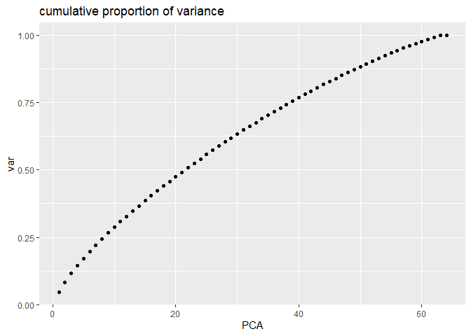
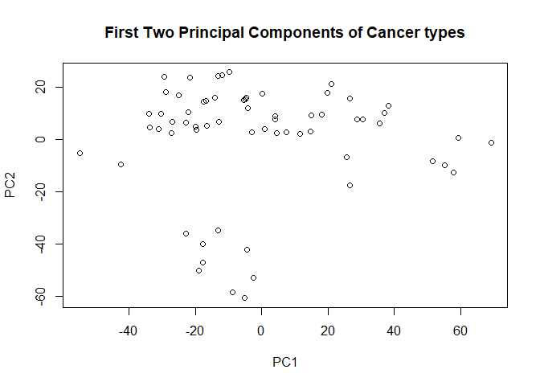
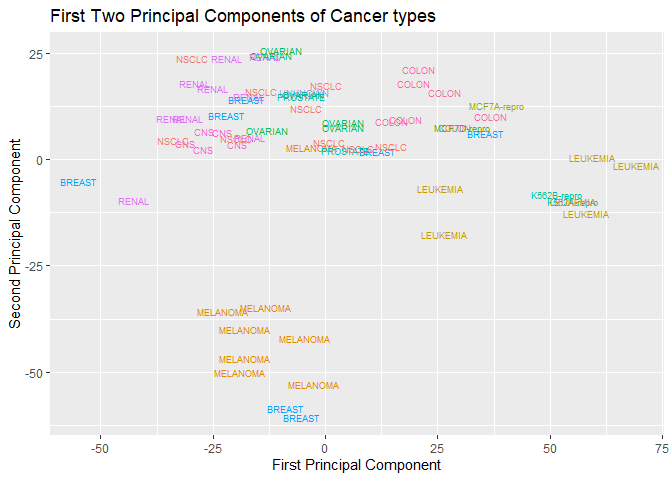
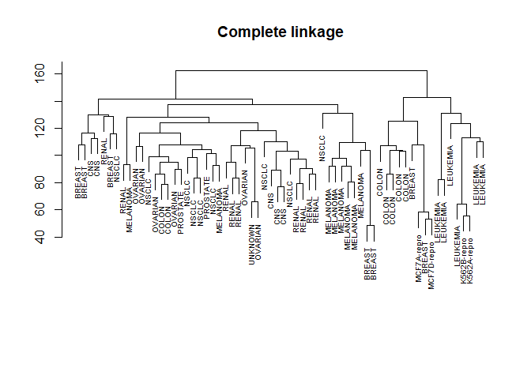
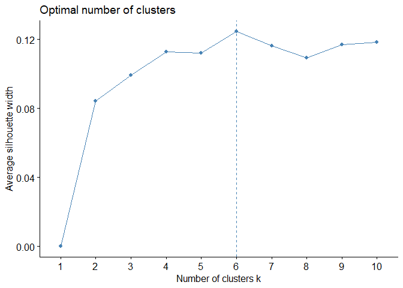
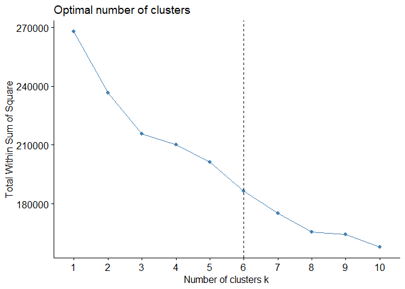
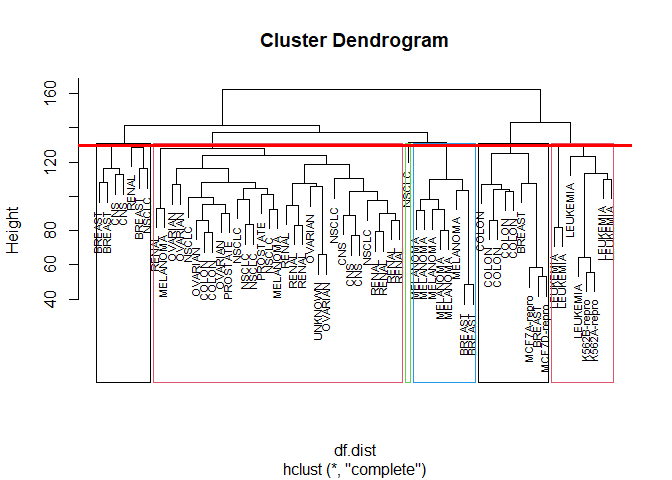
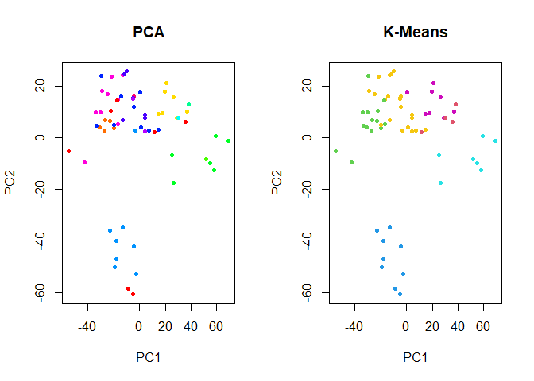

Lab4
================
Yonatan-Lourie\_Nathan-Shapiro
6/21/2021

### 1-3: Preparing the data.

Load the ISLR libraray

``` r
library(ISLR)
library(factoextra)
```

    ## Loading required package: ggplot2

    ## Welcome! Want to learn more? See two factoextra-related books at https://goo.gl/ve3WBa

``` r
set.seed(42)
```

Load the NCI60 data by running: full\_dat &lt;- NCI60

``` r
full_df <- NCI60
```

Run ?NCI60

``` r
?NCI60
```

    ## starting httpd help server ... done

#### 3b.

What is the format of the data?

**Results:** NCI data: The data contains expression levels on 6830 genes
from 64 cancer cell lines. Cancer type is also recorded. The format is a
list containing two elements: data and labs. data is a 64 by 6830 matrix
of the expression values while labs is a vector listing the cancer types
for the 64 cell lines.

#### 3c.

What is the size of the data?

``` r
df <- full_df$data
labs <- full_df$labs
dim(df)
```

    ## [1]   64 6830

#### 3d.

Use the str function in order to take a glimpse at the data

``` r
str(df)
```

    ##  num [1:64, 1:6830] 0.3 0.68 0.94 0.28 0.485 ...
    ##  - attr(*, "dimnames")=List of 2
    ##   ..$ : chr [1:64] "V1" "V2" "V3" "V4" ...
    ##   ..$ : chr [1:6830] "1" "2" "3" "4" ...

``` r
head(data.frame(df))
```

    ##          X1        X2        X3        X4        X5            X6        X7
    ## V1 0.300000  1.180000  0.550000  1.140000 -0.265000 -7.000000e-02  0.350000
    ## V2 0.679961  1.289961  0.169961  0.379961  0.464961  5.799610e-01  0.699961
    ## V3 0.940000 -0.040000 -0.170000 -0.040000 -0.605000  0.000000e+00  0.090000
    ## V4 0.280000 -0.310000  0.680000 -0.810000  0.625000 -1.387779e-17  0.170000
    ## V5 0.485000 -0.465000  0.395000  0.905000  0.200000 -5.000000e-03  0.085000
    ## V6 0.310000 -0.030000 -0.100000 -0.460000 -0.205000 -5.400000e-01 -0.640000
    ##           X8          X9         X10       X11       X12         X13
    ## V1 -0.315000 -0.45000000 -0.65498050 -0.650000 -0.940000  0.31000000
    ## V2  0.724961 -0.04003899 -0.28501950 -0.310039 -0.720039 -0.01003899
    ## V3  0.645000  0.43000000  0.47501950  0.410000  0.130000 -0.35000000
    ## V4  0.245000  0.02000000  0.09501949 -0.010000 -0.120000 -0.21000000
    ## V5  0.110000  0.23500000  1.49001949  0.685000  0.605000  0.35500000
    ## V6 -0.585000 -0.77000000 -0.24498050 -0.120000  0.000000 -0.69000000
    ##            X14       X15   X16       X17       X18          X19         X20
    ## V1  0.01500977 -0.080000 -2.37 -0.540000 -0.615000  0.000000000 -0.51999020
    ## V2  0.00000000 -0.570039  0.00 -0.470039 -0.355039  0.004980507 -0.48002920
    ## V3  0.00000000  0.000000  0.00 -0.800000  0.000000 -0.004980507  0.00000000
    ## V4  0.00000000  0.610000 -1.02 -0.470000  0.000000 -0.764980500  0.00000000
    ## V5  1.22000977  2.425000  0.00 -0.315000  0.310000 -0.519980507 -0.07499023
    ## V6 -0.73499020 -0.670000 -0.05  0.090000 -0.805000  0.595019500 -0.42999020
    ##          X21         X22          X23       X24       X25    X26       X27
    ## V1 -0.370000 -0.29000000 -0.174990300  0.070000 -0.040000  0.025 -0.740000
    ## V2 -0.140039 -0.09003899  0.004970741 -0.220039 -0.370039  0.000 -0.320039
    ## V3 -0.140000  0.05000000 -0.064990270 -0.060000  0.290000  0.715 -0.070000
    ## V4 -0.310000 -0.62000000 -0.284990300 -0.540000 -0.520000 -0.135 -0.890000
    ## V5 -0.865000 -0.45500000 -0.499990273 -0.245000 -0.235000 -0.330  0.000000
    ## V6 -0.850000 -0.09000000 -0.014990270  0.000000  0.150000  0.805 -0.700000
    ##            X28       X29       X30       X31       X32         X33       X34
    ## V1 -0.47999030 -0.450000 -0.930000  0.160000 -0.550000 -0.55000980  0.055000
    ## V2  0.15997070  0.179961 -0.320039 -0.440039  0.349961  0.44995120  0.104961
    ## V3 -0.08999027 -0.310000  0.580000 -0.480000  0.230000 -0.04000977 -0.935000
    ## V4 -0.26999030 -0.840000 -0.230000  0.320000  0.000000  0.10999020  0.455000
    ## V5  0.01500973 -0.105000 -0.225000 -0.105000 -0.275000 -0.57500977 -0.450000
    ## V6  0.36000970 -0.160000  0.040000 -0.170000  0.090000  0.05999023 -0.635000
    ##          X35       X36         X37         X38       X39           X40
    ## V1 -0.370000 -0.165000  0.21000000  0.47000000  0.000000 -2.602085e-18
    ## V2  0.489961  0.204961 -0.05003899 -0.01003899  0.269961  1.996101e-02
    ## V3 -0.750000 -0.385000 -0.34000000  0.12000000 -0.470000  1.700000e-01
    ## V4 -0.340000 -0.895000 -1.08000000 -0.43000000 -0.030000 -1.300000e-01
    ## V5 -0.465000 -0.390000 -0.99500000 -0.35500000  0.000000 -4.750000e-01
    ## V6 -0.510000 -0.585000  0.72000000 -0.17000000 -0.550000  2.100000e-01
    ##            X41       X42       X43         X44       X45       X46       X47
    ## V1  0.13998050 -0.215000 -0.065000 -0.22500000 -0.350000 -1.335000  0.000000
    ## V2  0.04994148 -0.315039 -0.325039 -0.05503899 -0.280039 -0.255039  0.229961
    ## V3 -0.86001950 -0.175000 -0.715000 -0.96500000 -0.540000 -0.005000 -0.060000
    ## V4 -0.54001950 -1.225000 -1.265000 -1.41500000 -0.270000 -0.705000 -0.220000
    ## V5 -0.38501953 -0.770000 -0.960000 -0.97000000 -0.895000 -0.630000 -0.535000
    ## V6 -0.13001950  0.125000 -0.415000 -0.47500000 -0.020000 -0.405000 -0.400000
    ##          X48       X49       X50         X51       X52       X53       X54
    ## V1  0.217500  0.250000  0.130000 -0.48000000 -0.420000 -0.700000 -0.275000
    ## V2 -0.342539 -0.560039 -0.900039 -0.06003899 -0.200039 -0.670039  0.324961
    ## V3 -0.722500 -0.920000  0.470000  0.70000000  0.670000 -0.900000 -0.265000
    ## V4 -0.502500 -0.040000 -0.150000 -0.16000000 -0.290000 -0.180000 -0.665000
    ## V5 -0.887500 -0.945000 -0.535000  0.00500000  0.185000 -0.105000 -0.340000
    ## V6  0.047500  0.220000 -1.400000 -0.65000000 -0.650000 -0.150000 -0.475000
    ##           X55       X56       X57         X58         X59       X60        X61
    ## V1 -0.3449902 -0.160000 -0.350000  0.55500000  0.29000000 -0.270000 -0.3399805
    ## V2  0.1349708  0.539961  0.229961  0.08496101 -0.08003899  0.949961  0.9399805
    ## V3 -0.4249902 -0.240000 -0.030000  0.21500000  0.29000000  0.070000  0.1200195
    ## V4 -0.7749902  0.210000 -0.770000 -0.60500000 -0.19000000  0.170000 -0.2099805
    ## V5 -0.1999902 -0.665000 -0.225000 -0.41000000 -0.21500000 -0.175000 -0.7849805
    ## V6 -0.5149902  0.000000 -0.350000 -0.75500000 -0.54000000 -1.160000 -1.7099810
    ##          X62       X63       X64        X65       X66       X67         X68
    ## V1  0.305000 -0.005000  0.700000  0.4500195  0.210000  0.290000  0.08499023
    ## V2  0.194961  1.904961  0.499961  0.3499805  0.899961  1.219961  0.00000000
    ## V3  0.515000  0.545000 -0.030000  0.1900195 -0.070000  0.400000  0.00000000
    ## V4 -0.615000  0.165000 -0.190000  0.0000000 -0.060000 -0.010000 -0.50500980
    ## V5 -0.330000 -0.390000 -0.075000 -0.2049805 -0.325000 -0.485000 -0.35000977
    ## V6 -0.415000 -1.275000 -0.890000 -0.2699805 -1.180000 -1.890000 -1.93501000
    ##            X69       X70           X71         X72         X73         X74
    ## V1 -0.45500980  0.120000 -6.600000e-01  0.10000000  0.10000000 -0.09996101
    ## V2  0.37495120  0.279961 -3.898621e-05 -0.09003899 -0.05003899  0.00000000
    ## V3 -0.09500977  0.270000  8.000000e-02  0.00000000  0.00000000 -0.31996100
    ## V4 -0.77500980 -0.290000 -7.100000e-01 -0.45000000 -0.61000000 -0.80996100
    ## V5 -0.23000977 -0.155000 -5.750000e-01 -0.61500000 -0.69500000 -0.63496101
    ## V6 -2.56501000 -2.500000 -1.010000e+00 -0.75000000 -0.85000000 -0.58996100
    ##            X75       X76         X77       X78       X79       X80        X81
    ## V1 -0.39998050 -0.195000  0.28000000  2.360000  0.470000  0.180000 -0.6449902
    ## V2  0.90998050  0.274961 -0.04003899  0.869961 -0.100039  1.409961  1.0049710
    ## V3  0.09001953  0.105000 -0.28000000  1.990000  0.000000  0.870000  0.0000000
    ## V4 -1.53998000 -1.035000  0.00000000  3.600000  0.000000  0.850000 -0.1949902
    ## V5 -1.09498047 -1.000000 -0.33500000 -1.385000  0.345000  0.815000  0.5600098
    ## V6  0.00000000 -0.085000  0.18000000  1.370000 -0.150000 -2.840000  0.0000000
    ##          X82       X83       X84       X85         X86       X87       X88
    ## V1  1.300000  0.000000 -0.480000  0.595000 -0.05998047  0.055000  0.097500
    ## V2  0.779961 -0.110039 -0.350039 -0.215039 -0.06001945  0.324961  0.267461
    ## V3  0.740000  0.000000 -1.200000 -0.335000  0.63001950  0.345000  0.697500
    ## V4 -1.210000  1.020000  0.660000  0.775000 -0.27998050 -0.245000 -0.502500
    ## V5 -0.155000  0.000000 -1.195000 -0.160000 -0.10498047  0.000000 -0.007500
    ## V6 -1.740000 -1.380000 -2.620000 -0.715000 -0.81998050 -0.545000 -0.552500
    ##          X89       X90         X91       X92       X93       X94       X95
    ## V1  0.400000  0.280000  0.76000000  1.425000 -0.510000  0.940000  0.940000
    ## V2  0.129961  0.229961  0.07996101  0.514961 -0.420039 -0.350039 -0.790039
    ## V3  0.270000 -0.020000  0.00000000 -0.115000 -0.440000  0.540000  0.490000
    ## V4 -0.800000 -0.750000  0.06000000 -1.075000  0.540000  0.160000  0.000000
    ## V5 -0.945000 -0.965000 -0.22500000 -0.460000  0.045000  0.795000  1.305000
    ## V6 -0.760000 -1.020000 -1.71000000 -0.495000 -0.760000 -0.280000 -0.390000
    ##          X96         X97       X98       X99  X100      X101      X102
    ## V1  0.680000 -0.21000000 -1.190000  0.000000 0.000  0.910000  0.050000
    ## V2 -0.290039 -0.01003899 -1.050039 -2.040039 0.000  1.079961  0.349961
    ## V3  0.640000  0.66000000  0.000000  0.000000 0.000  0.330000 -0.110000
    ## V4  0.230000 -0.74000000  0.000000 -2.500000 0.000 -0.470000 -0.310000
    ## V5  0.705000  0.05500000  0.715000  0.925000 0.585 -0.275000 -0.165000
    ## V6 -0.500000 -0.53000000 -0.850000 -0.380000 0.670  0.800000 -0.010000
    ##         X103      X104      X105      X106      X107        X108     X109
    ## V1 -0.030000 -0.060000 -0.080000 -0.130000  1.332500  0.85001950 1.450000
    ## V2  0.269961  0.319961  0.289961  0.219961  1.422461  1.25998100 1.919961
    ## V3  0.000000 -0.010000 -0.120000  0.370000  0.412500  0.79001950 0.680000
    ## V4 -0.130000  0.000000  0.550000 -0.170000 -0.617500 -0.30998050 0.930000
    ## V5 -0.125000 -0.175000 -0.435000  0.005000 -0.002500  0.38501949 0.715000
    ## V6  0.340000  0.210000  0.740000  0.700000 -0.157500 -0.01998051 0.400000
    ##          X110      X111      X112      X113       X114      X115      X116
    ## V1  1.0249900 -0.920000 -0.225000  0.350000  0.3450098  0.240000  0.030000
    ## V2  2.3149510  1.199961  2.394961  1.929961 -0.2350292  0.179961  0.209961
    ## V3  0.5549902  2.660000  2.645000  4.320000  0.2750098  0.380000  0.300000
    ## V4  0.9849902  1.340000  1.805000  2.170000  0.2750098 -0.180000 -0.150000
    ## V5  0.5899902  2.085000  2.060000  3.705000 -0.1699902 -0.665000 -0.065000
    ## V6 -0.2250098 -0.150000 -1.685000 -1.110000  0.7050098 -0.010000 -0.630000
    ##         X117        X118      X119      X120        X121      X122      X123
    ## V1 -0.997500 -1.18498100  0.200000 -0.550000 -0.60000000 -0.840000 -0.280000
    ## V2 -1.477539  0.01498051 -0.620039 -0.780039  0.01996101 -0.220039  0.299961
    ## V3 -0.377500 -0.36498050  3.110000  0.240000 -0.16000000  0.000000  0.050000
    ## V4 -1.427500 -0.19498050  0.070000  0.000000  0.78000000  0.000000 -0.430000
    ## V5 -0.052500 -0.49998051  1.245000  0.105000 -0.08500000  0.000000 -0.315000
    ## V6 -1.007500 -0.42498050  0.630000 -2.460000  0.18000000  0.410000  0.770000
    ##         X124      X125      X126      X127  X128        X129       X130
    ## V1  0.000000  0.000000 -0.035000 -1.305000 -1.07  0.07500000 -0.5550098
    ## V2 -1.015039 -1.410039 -0.725039 -0.375039  0.00  0.06496101 -0.1250488
    ## V3  0.000000  0.000000  0.000000  0.705000  0.00 -0.11500000  0.0000000
    ## V4  0.000000 -2.310000 -0.005000 -0.685000 -0.68 -0.36500000  1.0549900
    ## V5  0.000000 -0.255000  0.000000 -1.220000  0.00 -0.09000000  0.0000000
    ## V6  0.725000  1.610000  0.000000 -2.445000 -0.21  0.38500000  0.0000000
    ##         X131      X132     X133  X134      X135      X136      X137      X138
    ## V1  0.230000  0.830000  0.00000 -0.33  0.000000  0.330000  0.320000  1.790000
    ## V2 -0.840039  1.049961  0.00000  0.00 -0.700039 -0.250039  0.689961  2.709961
    ## V3  0.000000 -0.630000 -2.32001  0.00  0.000000 -0.550000  0.000000  0.860000
    ## V4  0.260000  0.470000 -3.68001  0.00  0.000000 -0.740000  0.000000  0.060000
    ## V5 -0.575000  0.175000  0.00000  0.00  0.000000 -0.075000  0.000000 -0.715000
    ## V6  0.000000  0.520000 -1.92001  0.00  0.000000 -0.140000 -0.200000 -0.490000
    ##          X139      X140     X141      X142      X143      X144      X145
    ## V1 2.20999000  1.640000 0.650000  2.370000  2.675000  1.360000 -0.820000
    ## V2 3.30995100  2.649961 0.949961  3.329961  3.944961  1.029961 -0.740039
    ## V3 1.29999000  0.000000 0.000000  1.510000  1.815000  0.950000 -2.760000
    ## V4 0.02999023  0.270000 0.330000  0.000000 -0.345000  0.330000  0.370000
    ## V5 0.00000000 -1.545000 0.000000  0.185000 -0.560000 -1.695000 -0.495000
    ## V6 0.42999020  0.070000 0.210000 -0.070000  0.000000  0.620000 -0.010000
    ##         X146      X147      X148      X149      X150      X151      X152
    ## V1  0.795000  0.420000 -0.440000 -0.775000  0.000000 -0.225000  0.110000
    ## V2  0.354961  1.759961 -0.130039 -0.355039 -0.170039 -0.455039 -0.420039
    ## V3 -0.205000 -0.110000  0.000000 -1.165000 -0.040000 -0.375000 -0.310000
    ## V4 -1.035000 -0.670000  0.540000  0.505000 -0.110000 -0.265000 -0.390000
    ## V5  0.140000 -1.155000 -0.555000 -0.300000 -0.405000 -0.770000 -0.685000
    ## V6 -0.635000  0.240000  0.130000  0.115000 -0.470000  0.205000 -0.030000
    ##         X153      X154      X155      X156      X157      X158      X159
    ## V1  1.170000  0.520000 -0.240000 -0.750000 -0.640000 -0.145000 -0.140000
    ## V2 -0.220039 -0.590039 -0.440039 -0.340039 -0.200039 -0.335039 -0.330039
    ## V3  0.460000  0.260000  0.000000  0.000000  0.280000 -0.005000 -0.160000
    ## V4  0.390000 -0.320000 -0.210000  0.460000 -0.020000 -0.455000 -0.880000
    ## V5  0.305000  0.275000 -0.635000 -0.115000 -0.055000  0.170000  0.015000
    ## V6 -0.920000 -0.550000 -0.400000 -1.390000 -0.880000  0.000000  0.000000
    ##         X160      X161      X162      X163      X164      X165        X166
    ## V1 -0.160000 -0.040000  0.145000 -0.310000 -0.062500 -0.030000 -0.14500980
    ## V2 -0.480039 -0.340039 -0.705039 -0.210039 -0.622539 -0.800039 -0.40504880
    ## V3  0.200000 -0.200000  0.025000  0.400000  0.107500 -1.000000 -0.45500980
    ## V4 -0.950000 -0.790000 -1.285000 -2.350000 -1.822500 -1.030000 -0.44500980
    ## V5 -0.475000 -0.455000 -0.230000 -0.295000 -0.017500 -0.715000 -0.16000977
    ## V6 -0.680000 -0.150000 -0.865000 -0.670000 -0.722500  0.400000 -0.02500977
    ##         X167         X168      X169      X170        X171      X172      X173
    ## V1 -0.640000 -0.450000000  0.400000 -1.065000 -0.57000000 -0.420000 -0.220000
    ## V2 -0.810039  0.009961014  0.539961 -0.455039  0.05996101 -0.370039 -0.120039
    ## V3 -1.060000 -0.560000000 -0.060000 -1.395000 -0.46000000 -0.070000  0.270000
    ## V4 -0.730000 -0.630000000 -0.790000 -1.375000 -0.76000000 -1.050000 -0.500000
    ## V5  0.195000 -0.305000000 -0.385000 -0.670000 -0.56500000 -0.895000  0.155000
    ## V6  0.000000 -0.130000000  0.910000  0.645000  0.93000000  0.660000  0.180000
    ##         X174      X175          X176      X177      X178       X179        X180
    ## V1 -0.050000  0.015000 -3.200195e-01  0.390000  0.030000  0.0000000  1.01500000
    ## V2 -0.390039 -0.265039 -5.851746e-05  0.239961  0.309961 -0.5150195  0.04496101
    ## V3  0.060000  0.165000  3.999805e-01  0.000000  0.000000  0.0000000 -0.01500000
    ## V4 -0.780000 -0.375000 -5.900195e-01  0.000000 -1.590000 -1.6749810 -0.36500000
    ## V5  0.325000  0.470000  5.549805e-01 -0.775000  0.000000  0.0000000  0.84000000
    ## V6  0.730000  1.015000  6.399805e-01 -0.540000 -0.850000 -0.1949805  0.00500000
    ##          X181      X182        X183      X184        X185      X186      X187
    ## V1  0.9150098 -0.330000  0.17000000  0.270000 -0.02000000  0.100000  0.370000
    ## V2  1.1049710 -0.260039  0.09996101 -0.380039 -0.09003899  0.429961 -0.260039
    ## V3 -0.4749902 -0.130000  0.48000000  0.150000  0.06000000  0.030000  1.550000
    ## V4 -0.3149902 -0.110000  0.25000000 -0.280000 -0.61000000 -0.190000  1.130000
    ## V5  0.4600098 -0.015000 -0.60500000  0.685000  0.53500000 -0.445000  0.205000
    ## V6 -1.0949900  0.190000  0.85000000  1.030000  1.21000000 -0.070000 -0.750000
    ##    X188      X189        X190      X191      X192      X193      X194
    ## V1 -1.4  0.000000  0.15500000 -0.005000  0.000000  1.332500 -1.047500
    ## V2  0.0 -0.410039  0.07496101 -0.385039 -0.950039 -0.207539 -0.377539
    ## V3  0.0 -0.540000  0.12500000 -0.305000  0.500000 -0.257500 -0.057500
    ## V4  0.7  0.070000  0.71500000  0.295000  0.860000 -0.697500 -0.487500
    ## V5  0.0 -0.995000 -0.35000000  0.120000  0.145000  0.057500  0.037500
    ## V6  0.0  0.170000 -0.01500000 -0.205000  0.070000  0.000000 -0.867500
    ##           X195        X196        X197   X198      X199      X200          X201
    ## V1 -0.23996100 -0.67499030 -0.09498051 -1.080 -0.530000  0.010000  3.400000e-01
    ## V2  0.00000000 -0.08502926  0.02498051  0.000 -0.530039  0.159961  4.799610e-01
    ## V3  0.30003900  0.45500970  0.29501950  0.000  0.000000 -0.690000 -1.140000e+00
    ## V4 -0.40996100 -2.18499000 -1.13498100  0.000  0.220000  0.480000  8.000000e-02
    ## V5  0.08503899 -2.63999027 -0.62998051 -0.355 -1.395000 -0.785000 -1.095000e+00
    ## V6  0.11003900  0.43500970 -0.02498051  0.000 -0.370000 -0.210000  1.734723e-18
    ##         X202      X203      X204       X205      X206      X207        X208
    ## V1 -0.500000 -0.715000  0.250000 -0.1299805  0.337500  0.550000 -1.85001000
    ## V2 -0.330039 -0.715039  0.359961 -0.9700195 -0.372539 -0.380039 -1.25004900
    ## V3 -0.240000  0.205000  0.000000 -0.1499805  0.000000  0.000000 -1.29001000
    ## V4  0.390000 -0.185000  0.000000 -0.5799805  0.000000  0.000000 -0.03000977
    ## V5 -0.145000 -0.490000 -0.515000 -0.1349805 -0.007500  0.000000  1.61499023
    ## V6  0.000000 -0.395000  0.260000 -0.6799805 -0.382500 -0.400000 -0.08000977
    ##         X209      X210        X211     X212       X213      X214      X215
    ## V1 -0.400000 -0.040000 -0.73000000 0.540000 -0.8999902  0.680039 -0.380000
    ## V2 -0.610039 -0.360039  0.07996101 0.899961  0.0000000  0.000000 -0.350039
    ## V3  0.000000 -0.540000  1.94000000 0.000000  0.0000000  0.310039  0.000000
    ## V4 -0.940000 -0.650000  0.00000000 0.120000  0.0000000 -0.179961  0.080000
    ## V5  0.000000 -0.125000  0.37500000 0.000000  0.0000000 -0.614961 -1.165000
    ## V6 -0.300000  0.000000  0.00000000 1.040000 -0.5799902  0.000000 -0.630000
    ##         X216      X217      X218      X219      X220      X221      X222
    ## V1 -0.837500 -0.005000 -0.555000 -0.310000  0.330000  0.170000  0.100000
    ## V2 -0.317539 -0.685039 -1.285039 -0.840039 -0.290039  0.219961 -0.990039
    ## V3 -0.647500 -0.455000 -0.335000 -0.540000 -0.290000  0.050000  0.060000
    ## V4 -1.097500  0.385000  0.035000 -1.350000 -0.410000  0.410000 -0.060000
    ## V5 -0.022500 -0.750000 -0.520000 -0.735000 -1.005000 -0.265000 -0.475000
    ## V6 -0.287500 -0.485000 -1.185000 -0.630000 -0.150000 -0.950000 -0.250000
    ##         X223       X224      X225      X226      X227      X228   X229
    ## V1  1.060000 -1.0900200 -1.620000  0.030000 -0.160000 -0.010000 -0.490
    ## V2  0.269961 -0.8400585 -0.830039 -0.290039 -0.470039 -0.630039  0.000
    ## V3  0.000000  0.3799805  0.000000 -0.120000  0.150000  0.000000  0.000
    ## V4 -0.810000  0.0000000 -0.590000 -0.190000 -0.660000 -0.640000 -0.670
    ## V5  0.000000 -2.0050195 -0.785000 -0.815000 -0.185000 -0.085000 -0.225
    ## V6  0.260000 -1.2300200 -0.830000  0.030000 -1.190000 -0.810000 -0.220
    ##         X230   X231       X232      X233      X234      X235      X236
    ## V1 -0.535000 -0.305 -0.6049902  0.180000  0.890000  0.255000  0.250000
    ## V2 -0.775039  0.000 -0.5650292 -0.130039  0.269961 -0.125039 -0.190039
    ## V3  0.000000  0.000  0.1750098  0.000000 -0.150000 -0.955000  0.000000
    ## V4  0.000000  0.135 -0.5149902 -2.180000 -0.570000 -0.525000 -1.950000
    ## V5  0.000000  0.000 -0.6299902 -0.775000 -1.195000 -0.710000 -0.425000
    ## V6 -0.895000  0.000 -0.4349902 -1.710000 -0.670000 -0.085000  0.000000
    ##         X237      X238      X239      X240      X241      X242      X243
    ## V1  0.010000 -0.800000 -0.180000  0.007500 -0.325000  0.055000 -0.650000
    ## V2 -0.640039  0.279961 -0.430039 -0.242539 -1.505039 -0.875039 -1.500039
    ## V3  0.000000  0.000000  0.000000 -0.952500  0.000000 -0.935000  0.000000
    ## V4  0.000000 -0.460000 -0.600000 -0.322500 -2.295000 -0.915000 -2.210000
    ## V5 -0.935000  0.000000 -0.075000 -0.007500  0.000000 -0.180000  0.805000
    ## V6 -1.710000 -1.170000 -0.120000  0.557500  0.245000 -0.235000 -2.060000
    ##         X244      X245        X246      X247      X248        X249      X250
    ## V1  0.560000 -0.200000  0.65000000 -1.710000  0.580000 -1.00002000 -1.240000
    ## V2 -2.440039 -2.440039 -0.06003899 -2.370039 -1.320039 -0.68005850 -1.790039
    ## V3 -0.770000 -0.950000  0.00000000 -1.290000  0.000000 -0.74001950 -1.230000
    ## V4 -1.850000 -0.680000  0.04000000 -2.680000 -0.390000 -1.33002000 -1.120000
    ## V5 -1.145000 -1.065000 -1.08500000 -1.895000 -0.335000 -0.05501953  0.435000
    ## V6 -1.370000 -1.290000 -1.17000000  1.240000  0.000000 -0.05001953  0.270000
    ##         X251      X252  X253      X254      X255      X256      X257      X258
    ## V1 -1.100000 -1.390000 -1.36 -2.250000  0.000000 -1.910000 -1.030000 -0.610000
    ## V2 -2.080039 -1.780039  0.00 -2.320039 -2.760039 -1.980039 -1.830039 -1.080039
    ## V3 -1.000000 -0.380000  0.00 -0.700000  0.000000 -0.580000 -0.170000 -1.320000
    ## V4 -0.590000 -1.680000 -1.21  0.000000  0.000000 -1.880000 -1.000000 -2.130000
    ## V5 -0.755000 -2.035000  0.00 -2.295000 -3.025000 -1.235000 -1.675000 -3.565000
    ## V6 -0.830000  0.000000 -1.55  0.000000 -0.960000 -3.050000 -1.490000 -1.200000
    ##      X259      X260        X261      X262       X263      X264      X265
    ## V1 -3.470 -0.655000  0.07999023  1.350000  0.0000000 -0.485000  0.100000
    ## V2  0.000 -1.775039 -2.33004900 -0.860039 -1.4200590 -1.005039 -0.860039
    ## V3  0.000 -0.555000 -1.75001000  0.000000  0.0000000  0.000000 -0.710000
    ## V4 -4.290 -0.455000 -1.57001000 -1.380000 -0.6000195 -0.565000 -1.080000
    ## V5 -2.855 -0.920000 -2.17500977 -0.775000  0.0000000  0.000000 -2.705000
    ## V6  0.000 -1.735000 -0.78000980 -0.080000 -0.5300195 -0.315000 -1.440000
    ##         X266   X267      X268      X269        X270       X271      X272
    ## V1 -0.460000 -1.075  0.550000  0.850000 -0.48500000  0.2899805  0.740000
    ## V2 -1.000039  0.000 -0.570039 -1.240039 -0.06503899 -0.8600585 -0.570039
    ## V3 -1.280000  0.000  0.000000  0.000000  0.00000000  0.0000000  0.000000
    ## V4 -1.480000  0.155  0.000000 -0.980000  0.00000000 -1.0000200 -0.910000
    ## V5 -2.695000  0.000  0.245000  0.000000 -1.10000000  0.0000000 -0.025000
    ## V6 -2.240000  0.000  0.000000 -0.450000 -0.62500000  0.0000000 -0.490000
    ##         X273      X274         X275      X276      X277       X278      X279
    ## V1  0.000000  0.590000  0.030019490 -0.740000  0.980000 -1.0000100 -0.240000
    ## V2 -0.490039  0.459961  0.009980507 -1.630039  0.749961 -0.7400488 -0.610039
    ## V3  0.000000  0.000000 -0.609980500  0.000000  0.060000 -2.0300100 -0.870000
    ## V4 -1.390000 -0.750000 -1.099981000 -0.630000  0.430000 -0.1900098  0.120000
    ## V5  0.000000 -1.995000 -0.594980507  0.000000  0.155000 -0.6850098 -0.695000
    ## V6  0.000000 -0.720000 -0.999980500 -1.920000 -0.070000 -0.4500098 -0.950000
    ##         X280      X281        X282      X283       X284       X285      X286
    ## V1 -0.550000 -0.630000 -0.11000000 -0.095000 -0.2699805 -1.4799800  0.610000
    ## V2 -0.360039 -3.050039 -0.02003899  0.684961  0.0000000 -1.4600190 -3.980039
    ## V3 -0.400000 -1.770000 -0.38000000 -0.085000 -0.5399805  0.0000000 -1.580000
    ## V4 -1.380000 -0.950000  0.17000000 -0.995000 -1.9699800 -2.0599800 -4.880000
    ## V5 -0.125000  0.085000 -0.41500000 -0.510000 -1.5849805  0.8150195 -3.235000
    ## V6 -1.220000 -3.120000  0.01000000 -0.005000 -0.2499805  0.1500195 -5.050000
    ##         X287      X288        X289        X290        X291      X292      X293
    ## V1 -1.455000 -0.220000  0.46000000  0.45000000  0.12000000 -0.500000  0.375000
    ## V2 -2.335039 -0.370039  0.09996101 -0.07003899  0.07996101  0.569961  1.194961
    ## V3  1.135000  0.070000  0.69000000  0.37000000  0.00000000 -0.220000 -0.415000
    ## V4  0.575000 -0.300000  0.07000000 -0.17000000  0.00000000 -0.180000 -0.275000
    ## V5 -1.180000 -0.025000 -0.07500000 -0.22500000 -1.18500000 -0.475000 -1.240000
    ## V6 -0.495000  0.260000  0.56000000 -0.19000000 -0.75000000  0.080000  0.825000
    ##         X294     X295      X296      X297      X298     X299      X300     X301
    ## V1  0.410000 1.950000 -0.190000  0.150000 -0.400000 0.075000 -0.190000 0.935000
    ## V2  0.769961 1.649961  0.579961 -0.170039  0.989961 0.524961 -0.380039 1.224961
    ## V3  0.000000 0.130000  0.000000 -0.100000  0.900000 0.545000  0.840000 0.515000
    ## V4 -0.290000 0.500000  0.610000 -0.130000  0.350000 0.415000  0.600000 1.345000
    ## V5 -0.915000 0.000000 -1.225000 -0.365000  0.285000 0.710000  0.195000 0.170000
    ## V6  0.000000 0.000000 -0.840000 -0.950000 -0.760000 0.655000 -0.830000 0.005000
    ##         X302      X303       X304      X305        X306      X307       X308
    ## V1 -0.942500  0.040000 -0.3399805 -0.345000 -0.87500000  0.505000 -1.3499800
    ## V2 -0.232539  0.129961  0.5099805 -0.255039 -0.09503899  0.304961 -0.9800195
    ## V3 -0.482500 -0.040000 -0.2499805  0.525000  1.22500000  0.495000  0.6400195
    ## V4 -0.262500  0.320000  0.7500195  0.225000  0.96500000  0.355000 -0.1999805
    ## V5  0.012500  0.325000 -0.2049805  0.670000  1.12000000 -0.120000  0.6450195
    ## V6  0.307500 -0.740000 -0.1799805 -0.065000  0.00000000  0.145000  0.0000000
    ##         X309      X310      X311      X312        X313      X314        X315
    ## V1 -1.310000 -1.160000 -0.280000 -0.250000 -0.94998050 -0.440000  0.43000000
    ## V2 -2.330039 -0.430039  0.169961 -0.550039 -0.05001945 -0.160039 -0.04003899
    ## V3  0.560000  0.050000 -0.190000 -0.300000 -1.12998000 -0.350000  0.40000000
    ## V4 -0.790000 -0.600000 -0.700000  0.290000 -0.73998050  0.260000 -0.15000000
    ## V5  0.725000  0.855000 -0.015000  0.405000 -1.08498047 -1.065000 -0.31500000
    ## V6  0.440000  0.350000 -0.210000  0.000000  1.15002000  0.300000 -0.13000000
    ##             X316      X317      X318      X319      X320      X321      X322
    ## V1  4.100000e-01  0.140000  0.150000 -0.480000  0.200000  0.560000  0.450000
    ## V2  1.599610e-01  0.769961  0.889961 -0.280039 -0.240039  0.289961  0.329961
    ## V3  1.387779e-17  0.270000  0.260000 -1.450000 -0.680000 -0.240000 -0.520000
    ## V4  1.700000e-01  2.260000  2.290000 -0.030000 -0.370000 -0.570000 -0.820000
    ## V5 -2.950000e-01 -0.615000 -0.995000 -0.085000 -0.805000 -0.285000 -3.785000
    ## V6 -1.387779e-17 -0.610000 -0.390000  0.430000 -0.640000 -0.250000 -1.230000
    ##         X323      X324      X325     X326      X327      X328      X329
    ## V1 -0.160000  0.015000 -1.020000 0.835000  0.982500  0.630000  0.995000
    ## V2  0.499961 -0.345039 -0.430039 0.664961  0.642461  0.929961  0.514961
    ## V3 -0.080000  0.000000 -0.750000 0.605000  0.632500  0.680000  0.075000
    ## V4  0.660000 -1.415000  0.330000 0.415000 -0.687500 -1.290000 -0.525000
    ## V5 -0.905000 -1.700000  0.305000 0.270000  0.487500  0.565000  0.150000
    ## V6 -0.660000  0.000000  0.000000 3.275000  0.000000  1.680000 -1.335000
    ##         X330       X331      X332        X333      X334      X335      X336
    ## V1 -0.345000 -0.3099902  0.000000 -0.28000000  0.050000 -0.100000 -0.035000
    ## V2  0.544961 -0.3300292  0.299961 -0.05003899  0.219961 -0.480039 -1.215039
    ## V3  0.085000 -1.0099900 -0.400000 -0.38000000 -0.240000 -1.090000 -0.135000
    ## V4 -0.445000 -0.7699902 -1.160000 -1.04000000 -0.630000 -0.450000 -1.115000
    ## V5  1.000000 -0.4949902 -0.575000 -0.90500000  0.075000 -0.195000 -0.400000
    ## V6  0.515000  0.0000000  0.070000 -0.26000000 -0.050000  1.280000  1.035000
    ##         X337      X338      X339      X340       X341      X342        X343
    ## V1 -0.810000  0.070000  0.020000  1.460000  0.4549902  0.785000  0.64500980
    ## V2 -1.880039 -0.140039  0.929961  1.129961  0.6749512  1.844961  0.35497080
    ## V3 -0.630000 -0.470000 -0.810000 -0.230000 -0.4150098 -0.015000  0.39500980
    ## V4 -0.970000 -0.290000  0.440000 -0.570000 -0.5250098 -0.555000  0.08500977
    ## V5 -1.265000  0.435000 -0.505000 -0.155000 -0.5800098 -0.070000 -1.00999023
    ## V6  1.320000  0.200000 -1.550000 -0.140000  0.1649902  0.725000  0.25500980
    ##         X344      X345        X346        X347        X348        X349
    ## V1  0.530000  0.395000  0.49500980 -0.19750980 -0.08001953 -0.47999020
    ## V2  0.239961  0.294961  0.18497080  0.42245120  0.44994150 -0.09002922
    ## V3  0.620000  0.015000 -0.16499020  0.08249023  0.12998050 -0.33999020
    ## V4  0.080000  0.065000 -0.19499020 -0.28750980 -0.44001950 -0.62999020
    ## V5 -0.765000 -1.310000 -0.02999023  0.02749023  0.17498047 -0.28499023
    ## V6  0.280000  0.645000  0.31500980  0.08249023 -0.46001950 -0.40999020
    ##         X350      X351       X352      X353        X354        X355      X356
    ## V1 -0.300000  0.140000 -0.3349902  0.055000 -0.22000000 -1.02000000  0.040000
    ## V2 -0.100039  0.279961  0.3849708 -0.495039  0.08996101 -0.05003899  0.259961
    ## V3 -0.360000  0.890000  0.5950098 -0.115000 -0.31000000 -1.10000000 -0.560000
    ## V4 -0.320000  0.040000  0.6850098 -0.065000  0.86000000  0.00000000 -0.560000
    ## V5 -0.405000 -0.005000  0.3900098  0.150000 -0.51500000 -0.64500000 -0.735000
    ## V6  0.000000 -1.230000 -2.7649900 -1.075000 -0.05000000 -0.53000000 -0.110000
    ##           X357      X358        X359        X360      X361      X362
    ## V1  0.27000000 -0.580000 -0.77500000  0.10998050  0.185000  1.002500
    ## V2 -0.05003899 -1.160039  0.05496101 -0.13005850  1.114961  1.252461
    ## V3 -0.52000000  0.110000 -0.00500000  0.07998047 -0.075000  0.462500
    ## V4 -0.77000000 -0.520000 -0.69500000  0.49998050  0.085000  0.462500
    ## V5 -0.17500000 -0.745000  0.01000000  0.56498047 -0.680000 -0.032500
    ## V6 -1.71000000 -0.550000 -0.16500000  0.25998050 -0.755000 -0.567500
    ##           X363      X364      X365      X366        X367        X368      X369
    ## V1 -0.35500000 -0.070000  0.240000 -0.730000 -0.44000980  0.49003900  0.000000
    ## V2  0.05496101  0.659961  0.599961 -0.280039 -0.09004875  0.40000000  0.109961
    ## V3 -0.66500000 -0.270000 -0.280000  1.520000  0.79999020  0.29003900 -0.030000
    ## V4  0.15500000 -0.170000  0.270000 -0.290000 -0.93000980 -0.60996100  0.200000
    ## V5  0.89000000 -0.195000 -0.165000  0.525000  0.32499023 -0.26496101  0.375000
    ## V6 -0.04500000  0.190000 -0.150000  0.820000  0.72999020 -0.08996101  0.850000
    ##           X370        X371      X372      X373      X374      X375   X376
    ## V1 -0.09750000  0.15501950  0.030000  0.175000 -0.105000 -1.035000  0.020
    ## V2 -0.03753899  0.04498051  0.219961  0.144961 -0.305039 -0.945039  0.000
    ## V3 -0.01750000  1.39501900  0.980000  1.375000 -0.075000 -0.565000 -0.120
    ## V4  0.29250000  0.30501950 -0.780000  0.025000  0.000000 -0.895000 -0.180
    ## V5  0.01750000 -0.35998051 -0.435000 -0.060000  0.000000  0.350000 -0.105
    ## V6  0.02250000  0.31501950  0.220000  0.000000 -1.325000 -0.655000 -0.090
    ##           X377          X378      X379      X380   X381      X382      X383
    ## V1 -0.44001950 -1.953125e-05  0.000000  0.000000  0.000 -0.060000  0.202500
    ## V2 -0.15005850  2.399415e-01 -0.250039 -0.280039  0.000  0.239961  0.242461
    ## V3  0.08998047  5.199805e-01  0.000000  0.000000  0.000 -0.200000  0.532500
    ## V4  0.00000000 -7.200195e-01 -0.300000 -1.140000 -1.950  0.280000 -0.897500
    ## V5 -0.08501953 -3.750195e-01  0.045000  0.000000 -2.195  0.235000 -0.002500
    ## V6  0.22998050 -4.800195e-01  0.000000 -0.790000  0.000 -0.180000 -0.147500
    ##         X384        X385      X386      X387      X388        X389      X390
    ## V1  0.170000 -0.03000000  0.295000 -0.320000 -0.410000  0.13500000 -0.870000
    ## V2  0.269961  0.09996101  0.344961 -0.300039 -0.320039 -0.02503899 -1.310039
    ## V3  0.390000  0.34000000  0.235000  0.100000  0.180000  0.34500000  0.000000
    ## V4 -1.320000 -0.45000000 -0.105000  1.010000  0.480000 -0.21500000 -0.130000
    ## V5 -0.055000  0.11500000 -0.320000  0.555000  0.065000  0.00000000  0.000000
    ## V6 -0.670000  0.67000000 -0.075000  0.760000  0.340000 -0.62500000 -0.110000
    ##         X391        X392        X393       X394      X395        X396      X397
    ## V1  0.850000  0.80000000  0.94000000  1.4100190  0.090000  0.73999020  0.180000
    ## V2 -0.370039 -0.03003899  0.04996101 -0.7600195  0.159961  0.00000000 -0.550039
    ## V3  1.250000  0.42000000  0.42000000  0.9000195  0.000000 -0.02000977  0.000000
    ## V4 -0.200000 -0.58000000 -0.69000000 -0.8999805  0.000000  0.08999023  0.820000
    ## V5  0.175000  0.25500000  0.38500000  0.5050195 -1.175000 -0.33500977  0.000000
    ## V6 -0.220000  0.00000000 -0.77000000  0.0000000 -1.210000 -0.19000980 -0.620000
    ##         X398       X399      X400      X401      X402      X403  X404      X405
    ## V1 -0.810000  0.8449902  0.820000  0.495000 -0.025000 -0.080000 -0.48 -0.870000
    ## V2 -1.200039 -0.2650488 -0.640039 -0.185039 -0.295039 -0.720039  0.00  1.019961
    ## V3  0.000000  0.3149902  0.300000 -0.245000 -0.745000  0.000000  0.00  1.730000
    ## V4 -1.570000 -0.8650098 -0.330000 -1.005000 -0.045000  0.090000  1.67  1.100000
    ## V5 -0.045000 -0.3300098 -0.645000 -1.130000 -0.830000  0.000000  0.00  0.000000
    ## V6  0.730000  0.5249902  0.700000  0.325000 -0.045000 -0.820000  0.27 -0.010000
    ##         X406      X407          X408        X409      X410       X411      X412
    ## V1  0.320000 -0.510000 -3.600000e-01 -0.42499020  0.875000 0.00000000  0.010000
    ## V2  1.209961 -0.580039 -3.898621e-05  0.03497078 -0.805039 0.09996101 -1.060039
    ## V3  0.760000  0.410000  0.000000e+00  0.65500980  0.000000 1.14000000  0.000000
    ## V4  1.070000  0.020000  0.000000e+00  0.01500977 -0.155000 0.86000000  0.360000
    ## V5 -0.175000  0.685000  8.500000e-02  0.22000977  1.190000 0.00000000 -0.315000
    ## V6 -0.250000  0.120000  0.000000e+00  0.75500980  0.000000 0.00000000  2.040000
    ##          X413        X414        X415      X416        X417      X418
    ## V1  0.8950098  0.65000000  0.03998047  0.775000  0.54500000  0.470000
    ## V2 -0.3450292  0.02996101 -0.40005850  0.284961 -0.03503899 -0.450039
    ## V3  0.4050098  0.97000000  0.00000000  0.000000  0.27500000  0.400000
    ## V4  0.2550098 -0.15000000  0.00000000 -0.375000  0.02500000 -1.260000
    ## V5  0.6800098  0.40500000  0.30498047 -0.220000  0.08000000 -1.275000
    ## V6 -0.1149902  0.00000000  0.00000000 -0.085000 -0.24500000  0.250000
    ##           X419      X420      X421        X422       X423        X424      X425
    ## V1 -0.44000000 -0.100000  0.130000  0.07998047  0.1600195 -0.19500000  0.780000
    ## V2 -0.02003899  0.189961  0.299961  0.08994148  0.1599805  0.09496101 -0.110039
    ## V3  0.28000000  0.470000  0.280000  0.31998050  0.1800195  0.28500000  0.000000
    ## V4 -0.52000000 -0.880000 -0.840000 -0.79001950 -0.3199805 -0.20500000 -0.480000
    ## V5 -0.03500000 -0.225000  0.035000 -0.16501953 -0.4049805 -0.51000000  0.000000
    ## V6  0.08000000  0.650000  0.770000  0.36998050  0.3600195  0.71500000  0.000000
    ##         X426      X427       X428      X429      X430      X431          X432
    ## V1 -0.380000 -0.015000  1.1049900  0.270000 -1.260000 -0.900000 -3.100000e-01
    ## V2 -0.970039 -0.645039 -0.1950488  0.109961 -0.870039 -0.690039  3.499610e-01
    ## V3  0.390000 -0.085000 -0.3150098  0.030000  0.000000  0.000000  6.938894e-18
    ## V4  0.300000  0.555000 -0.8350098  0.110000  0.000000  0.390000 -5.500000e-01
    ## V5  0.145000  0.210000 -0.1200098 -0.255000 -0.195000 -1.305000  5.500000e-02
    ## V6 -0.060000  0.000000  0.3649902 -0.850000 -0.120000 -0.040000  3.600000e-01
    ##           X433      X434      X435        X436        X437      X438      X439
    ## V1 -0.07996101 -0.075000 -0.015000  0.10999020  0.05500000  0.020000 -0.685000
    ## V2  0.00000000 -0.435039 -0.185039  0.21995120 -0.07503899 -0.680039 -0.485039
    ## V3 -0.26996100  0.265000  0.775000  0.36999020 -0.22500000 -0.050000 -0.605000
    ## V4 -0.88996100 -0.315000 -0.525000  0.08999023  0.19500000 -0.050000  0.145000
    ## V5 -0.85496101 -0.530000 -0.290000 -0.78500977 -0.63000000 -0.465000 -0.470000
    ## V6  0.02003899 -0.565000 -0.285000  0.18999020 -0.27500000 -0.470000 -0.715000
    ##             X440       X441      X442      X443        X444      X445      X446
    ## V1 -3.469447e-18 0.09000000 -0.245000 -0.100000  0.05001953  0.150000  0.290000
    ## V2  1.399610e-01 0.09996101  0.204961  0.159961 -0.02001945 -0.160039 -0.200039
    ## V3  0.000000e+00 0.42000000 -0.235000  0.630000  0.93001950  0.490000  0.630000
    ## V4  0.000000e+00 0.78000000  0.055000  0.380000  1.35002000  0.640000 -0.790000
    ## V5 -9.500000e-02 0.28500000 -0.210000 -0.055000 -0.20498047 -0.085000 -0.255000
    ## V6  0.000000e+00 0.96000000  1.155000  1.600000  0.40001950  0.320000 -0.270000
    ##           X447       X448      X449      X450      X451      X452      X453
    ## V1  0.23500000 -0.1200098  0.210000 -1.150000 -0.115000 -0.355000 -0.565000
    ## V2 -0.07503899 -0.1300488 -0.170039 -0.720039 -0.455039 -0.155039 -0.635039
    ## V3  0.23500000 -0.1100098 -0.040000 -0.030000 -0.175000 -0.125000 -0.195000
    ## V4 -0.57500000  1.0099900  0.900000  0.230000 -0.495000 -0.615000 -0.075000
    ## V5 -0.20000000 -0.5850098 -0.545000  0.625000  0.300000 -0.030000 -0.650000
    ## V6  0.03500000  0.5299902  0.540000  0.000000  0.565000  0.385000  0.615000
    ##           X454      X455      X456      X457       X458        X459      X460
    ## V1 -0.38500980 -0.045000  0.130000 -0.180000 -0.4049902 -0.08500977  0.360000
    ## V2 -0.27504880 -0.275039 -0.170039 -0.230039 -0.4150292 -0.04504875  0.499961
    ## V3 -0.03500977 -0.065000 -0.710000 -0.710000  0.1750098  0.38499020  0.020000
    ## V4 -0.08500977 -0.355000 -0.620000 -1.370000 -0.5849902 -0.46500980  0.490000
    ## V5 -0.32000977  0.770000  0.865000  0.795000 -0.1099902  0.08999023 -0.335000
    ## V6  0.34499020  0.515000  0.480000  1.200000  0.2350098 -0.22500980 -0.410000
    ##         X461      X462        X463        X464      X465        X466      X467
    ## V1 -0.090000 -0.610000 -0.89500980 -0.93500980 -0.110000 -0.23000000 -0.430000
    ## V2 -0.780039 -0.440039 -0.65504880 -1.28504900 -0.630039 -0.08003899 -0.580039
    ## V3 -0.320000 -0.070000 -0.42500980 -0.78500980 -0.440000  0.03000000  0.140000
    ## V4 -0.420000 -0.090000 -0.47500980 -0.76500980 -0.100000 -0.13000000 -0.040000
    ## V5  0.095000  0.615000 -0.58000977 -0.34000977 -0.315000 -0.39500000  0.695000
    ## V6  0.450000 -0.350000 -0.07500977  0.09499023 -0.150000  0.16000000  0.000000
    ##         X468      X469      X470          X471        X472        X473
    ## V1  0.225000 -0.400000 -0.540000 -2.550020e+00 -2.59002000  0.03001953
    ## V2 -0.365039 -0.540039 -0.350039 -1.380059e+00 -1.26005900 -0.25001950
    ## V3  0.245000  0.090000  0.060000 -1.953125e-05  0.02998047  0.00000000
    ## V4  0.935000  0.550000  0.510000  2.499805e-01 -0.11001950  0.27001950
    ## V5 -0.330000 -0.135000 -0.365000 -2.605020e+00 -2.37501953  0.02501953
    ## V6 -0.705000  0.870000  0.790000 -1.510020e+00 -1.38002000  0.38001950
    ##         X474      X475        X476      X477      X478      X479      X480
    ## V1 -0.290000  0.960000  0.85000000  0.550000 -0.220000  0.535000 -0.200000
    ## V2 -0.680039 -0.330039 -0.02003899 -0.310039  0.489961  0.574961  0.409961
    ## V3 -0.500000  0.160000  0.23000000 -0.010000  1.200000  0.465000 -0.150000
    ## V4  0.150000 -0.570000 -0.05000000  0.170000 -0.170000 -0.505000  0.000000
    ## V5  0.325000  0.945000  0.68500000  0.435000  0.615000  0.000000 -0.465000
    ## V6 -0.910000 -1.010000 -0.67000000 -0.840000  0.270000 -0.895000 -0.580000
    ##         X481      X482      X483      X484      X485      X486      X487
    ## V1 -1.470000 -0.840000 -0.720000 -0.750000 -1.170000 -0.505000 -0.210000
    ## V2 -0.430039 -0.340039 -0.530039 -0.530039 -0.290039 -0.205039  0.349961
    ## V3 -1.070000 -0.310000 -0.880000 -0.370000 -0.500000 -0.625000 -0.740000
    ## V4  0.000000 -0.180000 -0.060000  0.020000  0.360000  0.885000  0.190000
    ## V5 -2.545000 -0.055000 -0.775000 -0.715000 -0.245000  0.000000 -0.565000
    ## V6 -1.650000  0.120000 -0.460000 -0.040000  0.380000 -0.565000 -0.520000
    ##         X488   X489      X490      X491      X492      X493      X494
    ## V1 -0.245000 -0.025 -0.430000 -0.035000  0.100000 -0.285000 -0.140000
    ## V2  0.204961  0.000 -0.330039 -0.605039 -0.580039 -0.985039 -0.550039
    ## V3 -0.555000 -0.665  0.230000 -0.775000 -0.850000 -0.665000 -0.860000
    ## V4 -0.095000 -0.725 -0.180000  0.385000 -0.680000 -0.115000 -0.660000
    ## V5 -0.550000 -0.320 -0.195000 -0.150000 -0.755000 -0.720000 -0.355000
    ## V6 -0.595000 -0.485 -0.670000 -0.515000 -0.140000 -0.215000 -0.140000
    ##           X495      X496        X497        X498       X499      X500
    ## V1  0.01999023  0.370000 -0.38000000 -0.37250000 -0.3200195 -0.357500
    ## V2  0.41995120  0.129961 -0.09003899  0.03746101  0.0000000 -0.127539
    ## V3  0.23999020 -1.190000 -0.84000000 -0.51250000 -0.8900195 -0.887500
    ## V4  0.12999020 -0.600000 -0.52000000 -0.32250000 -0.2600195 -0.247500
    ## V5 -1.31500977 -0.975000 -0.81500000 -0.67750000 -1.3450195 -1.402500
    ## V6  0.30999020 -0.060000 -0.57000000 -0.54250000 -0.5500195 -0.607500
    ##           X501      X502      X503       X504       X505      X506      X507
    ## V1 -0.69000000 -0.670000 -0.690000 -0.2150098 -0.7050195 -0.855000 -0.195000
    ## V2 -0.09003899 -0.220039 -0.160039 -0.3450488  0.2549415 -0.965039 -0.495039
    ## V3 -0.75000000 -0.800000 -0.710000 -1.0750100 -0.5550195 -0.575000 -0.165000
    ## V4 -0.37000000 -0.370000 -0.760000 -0.1850098 -0.8050195 -0.695000 -0.605000
    ## V5 -1.37500000 -1.335000 -1.315000 -0.8400098 -0.8600195 -0.110000 -0.050000
    ## V6 -0.49000000 -0.600000 -0.400000 -0.3250098 -0.8450195 -0.085000 -0.335000
    ##           X508        X509        X510      X511      X512       X513      X514
    ## V1  0.09999023 -0.12999020 -0.02001953 -0.290000 -0.435000  1.4500100 -0.030000
    ## V2  0.57995120  0.08997078  0.35994150  0.369961  0.254961  0.5099708 -0.320039
    ## V3 -0.06000977 -0.35999020 -0.11001950 -0.550000 -0.955000  0.0000000 -0.570000
    ## V4 -0.24000980 -0.78999020 -0.74001950 -0.830000 -0.245000  0.0000000  0.080000
    ## V5 -0.44500977 -0.33499023  0.10498047 -0.125000 -0.290000 -0.2749902 -0.425000
    ## V6  0.25999020  0.09000977  0.39998050  0.060000  0.535000 -1.1699900  0.020000
    ##         X515        X516      X517          X518      X519      X520
    ## V1  0.000000 -1.61998100 -0.505000 -0.0899805100 -0.170000 -0.400000
    ## V2 -2.460039  0.01998051 -0.195039 -0.7200195000 -0.800039 -0.690039
    ## V3  0.080000 -0.25998050 -0.835000  0.0000000000  0.000000  0.000000
    ## V4  0.610000  0.80001950  0.535000  0.0000000000  2.550000  2.890000
    ## V5 -0.155000  1.43501949  0.200000 -0.8649805070  0.095000  0.000000
    ## V6  0.320000 -0.59998050  0.235000  0.0000194931  0.590000  0.000000
    ##             X521        X522          X523        X524          X525
    ## V1 -1.600000e-01 -0.07499023  4.200195e-01 -0.54000000 -0.5999805000
    ## V2  3.099610e-01  0.00000000 -1.945496e-05 -0.04003899 -0.0000194931
    ## V3 -7.000000e-02  0.00000000 -4.998047e-02  0.18000000 -0.0999805100
    ## V4 -1.559896e-17 -0.38499020  2.001953e-02  0.24000000  1.1100190000
    ## V5 -2.750000e-01  0.06000977  0.000000e+00  0.05500000 -0.2149805070
    ## V6 -3.500000e-01  0.00000000  5.001953e-02 -0.58000000 -0.8999805000
    ##           X526      X527       X528       X529      X530      X531      X532
    ## V1 -0.72998050  0.835000  0.3550098  0.1499805  0.220000 -0.025000 -0.440000
    ## V2 -0.04001949 -0.105039  0.6249708  1.1099410  0.719961 -0.655039 -0.300039
    ## V3  0.17001950 -0.635000 -0.4249902 -0.5400195 -0.350000  0.295000 -0.370000
    ## V4  0.85001950  0.000000 -0.4449902 -0.4300195  0.200000 -0.095000 -1.100000
    ## V5 -0.10498051 -0.120000  0.4200098  0.1249805  0.175000  0.740000  0.575000
    ## V6 -0.76998050  0.305000  0.8350098  0.9599805  0.700000 -0.465000 -0.870000
    ##         X533        X534       X535      X536      X537        X538
    ## V1 -0.160000  0.16501950 -0.3399805 -0.140000  0.550000  0.19000980
    ## V2 -0.360039  0.01498051 -0.3900195 -0.320039  0.269961 -0.02002922
    ## V3  0.650000  0.50501950  0.2300195  0.140000 -0.200000 -0.17999020
    ## V4  0.150000  0.30501950  0.2200195  0.210000 -0.370000 -0.39999020
    ## V5  0.425000  0.33001949  0.6150195  0.665000  0.565000  0.82500977
    ## V6  0.000000 -0.78498050 -1.7899800 -1.390000 -0.380000 -0.22999020
    ##             X539      X540        X541      X542        X543      X544
    ## V1 -8.673617e-18 -1.160000 -0.38000000 -0.120000 -0.30000000 -0.235000
    ## V2 -4.700390e-01 -0.950039 -0.04003899  0.179961 -0.08003899  0.214961
    ## V3  1.100000e-01  0.540000  0.12000000 -0.030000 -0.44000000  0.105000
    ## V4  1.900000e-01  0.240000  0.08000000 -0.100000 -0.25000000  0.065000
    ## V5  1.085000e+00  0.055000 -0.08500000  0.545000  0.04500000  0.780000
    ## V6 -9.300000e-01 -0.030000  0.00000000  0.270000  0.49000000 -0.105000
    ##         X545      X546       X547        X548     X549      X550      X551
    ## V1 -0.100000 -0.150000  0.4800195  0.14998050 0.120000 -0.120000 -0.625000
    ## V2  0.379961  0.339961  0.7199805  0.80994150 0.379961  0.489961  0.684961
    ## V3 -0.180000  0.140000  0.4800195  0.45998050 0.290000 -0.110000 -0.045000
    ## V4 -0.220000 -0.380000 -0.1599805 -0.08001953 0.200000  0.160000  0.425000
    ## V5  0.415000  0.125000  1.0650195  0.82498047 0.645000 -0.035000  0.050000
    ## V6  0.810000 -0.100000  1.1300200 -0.07001953 0.000000 -0.120000  0.075000
    ##         X552      X553      X554      X555         X556      X557      X558
    ## V1 -0.210000 -0.280000 -0.015000 -0.225000 -0.309990300 -0.485000 -0.450000
    ## V2  0.129961 -0.160039  0.224961  0.314961  0.009970741  0.334961  0.499961
    ## V3  0.930000  1.260000  0.715000  0.005000  0.390009700  0.015000 -0.030000
    ## V4  0.790000  1.130000  0.785000  0.175000  0.050009730 -0.265000 -0.420000
    ## V5  0.305000 -0.055000  0.570000  0.280000  0.000000000  0.540000  0.465000
    ## V6 -0.110000  0.150000  0.195000  0.005000 -0.069990270  0.105000  0.440000
    ##         X559      X560       X561     X562      X563       X564       X565
    ## V1 -0.310000 -0.350000  0.6449902 1.410000  0.130000  0.3399902 -0.9200098
    ## V2  0.219961 -0.160039  0.0000000 0.819961  0.689961  0.1399512 -0.3600488
    ## V3  0.220000 -0.010000  0.0000000 0.130000  0.440000  0.0000000  0.8099902
    ## V4 -0.700000  0.080000 -0.5950098 0.970000  0.860000  0.0000000 -0.2200098
    ## V5  0.755000 -0.405000  0.0000000 0.385000 -0.025000  0.0000000 -0.7650098
    ## V6  0.850000  0.350000  0.6149902 0.250000  0.000000 -0.6000098  0.0000000
    ##         X566      X567      X568      X569      X570      X571      X572
    ## V1 -0.355000 -0.350000 -0.400000 -0.100000 -0.125000 -0.335000 -0.650000
    ## V2 -0.675039 -0.740039 -0.460039 -0.140039 -0.125039 -0.545039  0.419961
    ## V3 -0.665000 -0.860000 -0.430000  0.010000 -0.155000 -0.505000 -0.490000
    ## V4 -0.085000 -0.640000 -0.540000  0.020000  0.085000  0.035000 -0.030000
    ## V5 -1.090000 -0.635000 -0.105000  0.335000  0.260000 -0.140000 -0.685000
    ## V6  0.345000 -1.250000 -0.810000 -0.590000 -0.325000 -0.505000 -0.010000
    ##         X573      X574         X575      X576         X577        X578
    ## V1 -0.989961 -0.640000 -0.160000000 -0.050000 -0.274980500 -0.05000000
    ## V2  0.000000  0.169961  0.009961014 -0.240039 -0.005019493 -0.03003899
    ## V3 -0.539961 -0.330000 -0.560000000 -0.120000  0.000000000  0.29000000
    ## V4  0.240039  0.180000  1.380000000  0.710000  1.405019000  0.93000000
    ## V5 -0.614961 -0.685000  0.325000000 -0.095000  0.000000000  0.52500000
    ## V6  0.130039 -0.480000 -0.090000000 -0.500000  0.000000000 -0.34000000
    ##           X579        X580      X581      X582        X583      X584      X585
    ## V1 -0.10001950 -0.75500000  0.015000 -0.170000 -0.78500000 -0.920000 -0.657500
    ## V2 -0.05005852  0.05496101  0.544961 -0.110039 -0.05503899 -0.220039 -0.177539
    ## V3 -0.19001950  0.09500000 -0.305000 -0.290000 -0.44500000 -0.780000 -0.767500
    ## V4  0.33998050  0.62500000  0.095000  0.290000 -0.48500000 -0.010000 -0.087500
    ## V5  0.25498047 -0.06000000 -0.150000 -0.485000 -0.39000000  0.495000 -0.302500
    ## V6  0.23998050  0.51500000 -0.135000  0.200000  0.13500000  0.070000  0.502500
    ##         X586        X587      X588      X589   X590      X591      X592
    ## V1 -0.510000 -0.37499020 -0.370000  0.410000 -0.075  0.250000  0.100000
    ## V2 -0.230039 -0.08502922 -0.120039 -0.550039  0.000 -0.470039 -0.410039
    ## V3 -0.830000 -0.61499020  0.080000 -0.200000 -0.195  0.000000 -0.640000
    ## V4 -0.210000 -0.18499020  0.280000  0.120000 -0.105 -0.310000  0.270000
    ## V5 -0.205000 -0.29999023 -0.205000  0.225000  0.900  0.835000  0.805000
    ## V6  0.210000  0.35500980  0.650000  0.240000  0.455  0.370000  0.230000
    ##            X593      X594      X595      X596      X597        X598      X599
    ## V1 -0.022480510  0.455000 -0.640000  0.145000 -0.275000  0.07000000 -0.230000
    ## V2 -0.002519493 -0.485039 -0.920039 -0.625039  0.444961 -0.01003899 -0.250039
    ## V3 -0.312480500 -0.315000  0.080000  0.000000  0.525000  0.21000000  0.170000
    ## V4  0.457519500  1.345000  0.780000  0.000000  0.125000  0.90000000  0.870000
    ## V5  0.002519493  0.770000  0.965000  0.680000  0.040000 -0.36500000 -0.335000
    ## V6  0.017519490  0.415000  0.200000 -0.605000 -0.205000  0.35000000  0.380000
    ##         X600        X601       X602      X603      X604      X605       X606
    ## V1 -0.470000 -0.16998050 -0.3300098 -0.480000  0.720000 -0.500000 -0.2150098
    ## V2 -0.330039  0.02998051  0.5099512 -0.300039  1.019961 -0.110039  0.3049512
    ## V3  0.310000 -0.02998051  0.0000000 -0.300000 -0.390000  0.000000 -0.6450098
    ## V4 -0.170000  0.65001950  0.2899902  0.430000  0.730000  0.400000  1.6249900
    ## V5 -0.115000  0.87501949  0.2149902  0.245000  0.915000  0.535000  2.4699902
    ## V6 -0.640000  0.87001950  0.1099902  1.400000 -0.130000  0.430000 -0.2850098
    ##         X607        X608      X609         X610       X611      X612      X613
    ## V1 -0.160000 -0.20000980 -0.740000 -0.005009766 0.09999023 -0.405000 -0.280000
    ## V2  0.109961  0.01995125 -0.280039  0.714951200 0.05995125 -0.475039 -0.540039
    ## V3 -0.430000 -0.05000977 -0.560000 -0.185009800 0.24999020  0.715000  0.890000
    ## V4  1.010000 -0.03000977  0.960000  0.544990200 0.59999020 -0.235000  0.460000
    ## V5  1.915000  0.41499023  0.915000  1.379990234 0.04499023 -0.010000  0.955000
    ## V6 -0.030000  0.18999020  0.390000  0.794990200 0.00000000 -0.625000  0.580000
    ##         X614      X615       X616       X617      X618      X619      X620
    ## V1 -0.395000 -0.340000 -0.4200195 -0.7799707 -0.040000 -0.155000  0.140000
    ## V2 -0.605039 -0.580039 -0.6100585 -0.2800097 -0.220039 -0.335039 -1.060039
    ## V3  0.125000  0.010000 -0.3100195 -0.2999707 -0.170000 -0.165000  0.100000
    ## V4 -0.385000 -0.490000 -0.5300195 -0.2999707 -0.410000 -0.185000 -0.540000
    ## V5  0.510000  0.195000  0.3649805  0.5850293  0.465000  0.350000  0.875000
    ## V6  0.515000  0.020000  0.7699805  0.7200293 -0.020000  0.255000 -0.070000
    ##         X621      X622      X623      X624      X625      X626      X627
    ## V1 -0.830000 -0.710000 -1.150000 -1.152500 -0.800000 -0.705000  0.310000
    ## V2 -0.810039 -0.460039 -0.400039 -0.852539 -1.770039 -0.335039  0.159961
    ## V3 -0.870000 -0.600000 -0.380000 -0.332500  0.000000 -0.455000 -0.030000
    ## V4 -1.470000 -1.210000 -0.190000 -0.092500 -0.010000 -0.845000 -0.240000
    ## V5  0.235000 -0.285000 -0.015000  0.002500  0.325000 -0.020000  0.405000
    ## V6 -0.130000 -1.210000 -0.860000  0.507500  0.400000 -0.405000 -0.190000
    ##         X628         X629      X630      X631       X632      X633      X634
    ## V1 -0.255000 -0.184980500 -0.290000 -0.380000 -0.3999902 -0.370000 -0.200000
    ## V2 -0.105039 -0.145019500  0.189961 -0.140039 -0.1900292 -0.130039 -0.190039
    ## V3 -0.065000  0.025019490  0.120000  0.190000 -0.1399902  0.050000  0.060000
    ## V4  0.105000 -0.494980500 -0.100000 -0.220000 -0.1599902  0.100000 -0.790000
    ## V5  0.000000 -0.009980507  0.575000  0.175000  0.4650098  0.345000  0.175000
    ## V6  1.405000  0.265019500  0.000000  0.380000  0.8800098 -0.070000  0.800000
    ##           X635      X636       X637      X638      X639      X640      X641
    ## V1 -0.50000000 -0.085000 -0.4000098 -0.840000 -0.690000 -0.405000 -1.125000
    ## V2 -0.02003899 -0.435039 -0.6600488 -0.790039 -0.490039 -0.885039 -1.295039
    ## V3 -0.29000000 -0.645000 -0.4100098 -0.480000  0.000000 -0.865000 -0.735000
    ## V4 -0.76000000 -0.165000 -0.3200098 -0.540000 -0.480000 -0.615000  2.065000
    ## V5  0.37500000  0.920000  0.9249902  0.455000  0.945000  0.490000  0.670000
    ## V6  0.31000000  0.365000 -0.5800098 -0.470000  0.120000  0.235000  0.905000
    ##         X642      X643      X644      X645      X646      X647      X648
    ## V1 -1.150000 -1.060000 -1.000000 -0.780000 -0.825000 -1.045000 -1.250000
    ## V2 -1.280039 -1.450039 -1.490039 -0.570039 -0.985039 -1.285039 -0.980039
    ## V3 -0.900000 -0.870000 -1.040000 -0.270000 -0.795000 -0.905000 -0.800000
    ## V4  1.690000 -1.000000 -0.940000 -0.670000 -0.855000 -0.725000 -0.800000
    ## V5  0.525000  0.835000  0.715000  0.215000  0.120000 -0.040000  0.215000
    ## V6  1.070000  1.720000  1.360000  0.720000  0.875000  0.555000 -0.480000
    ##         X649      X650      X651      X652        X653      X654      X655
    ## V1 -0.510000 -0.515000 -0.700000 -0.635000 -0.91500980 -0.770000 -0.945000
    ## V2 -0.520039 -0.405039 -0.770039 -0.835039 -1.28504900 -0.120039 -0.705039
    ## V3 -0.110000 -0.125000 -0.310000 -0.375000  0.00000000 -0.070000 -0.515000
    ## V4 -0.540000 -0.725000  0.150000 -0.335000  0.07499023 -1.110000 -1.385000
    ## V5  0.395000  0.310000  0.435000  0.580000  0.14999023  0.155000  0.420000
    ## V6  0.540000  0.325000 -0.270000 -0.165000  0.22499020  0.090000  1.205000
    ##         X656      X657      X658        X659      X660      X661       X662
    ## V1 -0.425000 -0.640000 -0.415000 -1.21996100  0.000000 -0.730000  0.0000000
    ## V2 -0.155039 -0.410039 -0.425039 -0.92000000 -1.040039 -1.120039 -1.6500190
    ## V3 -0.435000 -0.280000 -0.275000 -0.09996101  0.340000 -0.580000 -0.3599805
    ## V4 -0.005000 -0.760000 -0.245000  0.01003899 -0.940000 -0.290000 -1.0999810
    ## V5  0.190000  0.525000  0.320000  1.09503899  0.635000  0.255000  0.5550195
    ## V6  0.555000 -0.170000  0.045000  1.80003900 -0.340000 -0.420000 -0.2499805
    ##         X663        X664        X665        X666      X667      X668       X669
    ## V1 -0.350000  0.14001950 -0.32499020 -0.38499020 -0.075000 -0.320000 -0.2200195
    ## V2 -1.690039 -0.37001950 -0.62502920 -0.53502920 -0.475039 -0.450039 -0.4300585
    ## V3 -0.170000 -0.05998047 -0.02499023 -0.04499023  0.005000  0.290000 -0.1400195
    ## V4 -0.870000 -0.31998050 -0.56499020 -0.26499020 -0.175000  0.000000 -1.0300200
    ## V5  0.635000  0.51501953  0.77000977  0.84000977  0.660000  0.495000  0.3249805
    ## V6 -1.270000 -0.50998050  0.10500980  0.07500977 -0.365000  0.390000 -0.3200195
    ##           X670      X671         X672          X673      X674      X675
    ## V1 -0.58999020  0.000000 -0.245000000  6.000000e-02 -0.650000 -0.500000
    ## V2 -0.68002920 -0.280039 -0.005038986 -3.800390e-01 -0.910039 -0.320039
    ## V3 -0.33999020 -0.160000  0.005000000  1.387779e-17 -0.300000  0.070000
    ## V4 -0.65999020 -0.840000 -0.365000000  2.400000e-01  0.080000 -0.430000
    ## V5 -0.02499023  0.045000  0.670000000  8.050000e-01  0.015000 -0.085000
    ## V6  0.50000980  0.960000  0.475000000  5.600000e-01 -0.540000  0.260000
    ##          X676      X677      X678      X679        X680      X681        X682
    ## V1 0.14000000 -0.020000  0.030000 -0.360000 -0.09500977 -0.390000 -0.93500980
    ## V2 0.08996101 -0.150039 -0.590039 -0.370039 -0.34504880 -0.410039 -0.48504880
    ## V3 0.48000000  0.740000  0.130000 -0.010000  0.07499023  0.370000 -0.01500977
    ## V4 0.26000000  0.010000 -0.280000 -0.630000 -0.09500977  0.160000 -0.51500980
    ## V5 0.56500000  0.365000  0.275000  0.615000  0.55999023  0.835000  0.66999023
    ## V6 0.07000000  1.070000  0.340000  0.580000  0.71499020  0.670000 -0.11500980
    ##         X683      X684        X685          X686      X687      X688      X689
    ## V1 -0.320000 -0.270000  0.04999023 -3.200000e-01 -0.480000  0.010000 -0.220000
    ## V2 -0.150039 -0.160039 -0.16004880 -3.898621e-05 -0.410039 -0.920039 -0.240039
    ## V3 -0.720000 -0.510000  0.00000000 -5.800000e-01 -0.960000 -0.350000 -0.350000
    ## V4 -0.500000 -1.000000 -0.39000980 -6.000000e-02  0.270000 -0.100000 -0.290000
    ## V5 -0.505000 -0.435000 -0.11500977  4.550000e-01  0.605000  0.495000  0.885000
    ## V6  0.210000  0.060000  0.14999020  5.900000e-01  0.110000  0.020000  0.550000
    ##         X690          X691      X692       X693      X694        X695      X696
    ## V1  0.460000  3.900000e-01  0.200000  0.2799805 -0.280000 -0.05001953 -0.420000
    ## V2 -0.310039  0.000000e+00 -0.650039 -1.0000590 -0.780039 -1.08005900 -0.790039
    ## V3 -0.510000  6.938894e-18  0.270000 -0.7400195  0.000000 -0.03001953  0.000000
    ## V4 -0.900000 -1.700000e-01  0.230000  0.1899805 -0.480000  0.00000000 -0.710000
    ## V5  0.525000  7.250000e-01  0.345000  0.5549805  0.695000  0.45498047  0.165000
    ## V6  0.970000  4.500000e-01  0.740000  1.1399800  1.270000  1.01998000 -0.900000
    ##             X697       X698      X699      X700      X701      X702      X703
    ## V1  7.000000e-02 -0.6499805 -1.467500 -0.210000 -0.050000  0.020000 -0.080000
    ## V2 -6.200390e-01 -0.5800195 -0.917539 -0.940039 -0.610039 -0.780039  0.299961
    ## V3 -2.300000e-01  0.0000000 -0.407500 -0.430000  0.830000 -0.200000 -0.270000
    ## V4 -8.660065e-18  0.0000000 -0.367500  0.230000 -0.600000 -0.360000 -0.420000
    ## V5 -8.500000e-02  0.1950195  0.077500  0.285000 -0.475000  0.475000  0.425000
    ## V6  1.400000e-01  0.7100195 -0.217500 -0.580000 -0.160000 -0.330000 -0.640000
    ##         X704      X705      X706      X707          X708      X709      X710
    ## V1 -0.215000  0.075000  0.000000 -0.010000 -1.953125e-05 -0.590000 -1.320000
    ## V2 -0.415039  0.214961 -0.580039  0.279961  1.994148e-02 -0.190039 -0.800039
    ## V3 -0.005000  0.795000 -0.240000  0.070000  6.799805e-01 -0.560000 -0.440000
    ## V4 -0.125000  0.075000  0.420000 -0.250000  9.980469e-03 -0.260000 -0.450000
    ## V5  0.550000 -0.110000 -0.345000 -0.175000  2.749805e-01 -0.115000 -0.105000
    ## V6 -0.175000  0.025000 -0.930000  0.290000  4.199805e-01  0.440000  1.090000
    ##         X711       X712         X713      X714      X715        X716      X717
    ## V1 -1.165000 -0.8599902 -0.389961000 -0.710000  0.030000 -0.11500000  0.280000
    ## V2 -0.725039 -0.7200292  0.000000000 -1.150039 -0.120039 -0.08503899  0.449961
    ## V3 -0.765000 -0.5999902 -0.069961010 -1.710000 -0.410000  0.16500000  0.030000
    ## V4 -0.315000 -0.2299902 -0.009961014 -0.110000  0.680000  0.52500000  0.910000
    ## V5 -0.560000 -0.5249902 -0.054961014 -0.695000 -0.315000 -0.29000000 -0.305000
    ## V6  0.865000  1.2400100  1.430039000  0.400000 -0.280000 -0.04500000  0.310000
    ##             X718       X719      X720        X721       X722        X723
    ## V1  1.953125e-05 0.15001950  0.200000  0.17000000 -0.1650098 -0.10998050
    ## V2 -1.001945e-02 0.86998050 -0.220039  0.07996101  0.1449512 -0.05001949
    ## V3  3.001953e-02 0.79001950  0.090000 -0.19000000 -1.0350100 -1.22998100
    ## V4  1.700195e-01 0.05001953  0.320000  0.13000000 -0.7750098 -0.35998050
    ## V5  1.095020e+00 0.05501953 -0.345000 -0.30500000 -0.2500098 -0.34498051
    ## V6 -2.699805e-01 0.10001950  0.530000  0.55000000  0.1749902  0.25001950
    ##           X724      X725      X726      X727      X728      X729      X730
    ## V1  0.29001950  0.040000 -0.225000  0.300000  0.095000 -0.340000 -0.350000
    ## V2  0.08998051  0.219961 -0.335039 -0.240039  0.224961  0.229961  0.369961
    ## V3 -0.89998050 -1.400000 -0.605000  0.000000 -0.225000 -0.380000 -0.340000
    ## V4 -0.43998050  0.230000 -0.525000 -0.490000 -0.095000 -0.690000 -0.080000
    ## V5 -0.13498051  0.465000 -0.110000 -0.275000 -0.390000 -0.265000  0.695000
    ## V6 -0.18998050 -0.070000  0.145000 -0.580000  0.000000 -0.100000  0.370000
    ##        X731      X732       X733        X734      X735      X736      X737
    ## V1 0.580000  0.430000 -0.2150098 -0.02998051  0.060000  0.050000 -0.030000
    ## V2 0.539961  1.269961  0.1149512  0.09998051  0.179961  0.869961  0.629961
    ## V3 0.230000  0.000000 -0.3950098 -0.30998050 -0.220000  0.120000  0.620000
    ## V4 0.140000  0.980000 -0.3350098 -0.05998051 -1.000000 -0.960000 -0.850000
    ## V5 0.695000  0.785000  0.2399902  0.19501949  0.065000  0.135000  0.725000
    ## V6 0.000000 -1.030000 -0.5450098 -0.52998050 -0.420000  0.720000  0.870000
    ##         X738          X739        X740      X741     X742        X743
    ## V1  0.435000  7.300000e-01 -0.02250977 -0.215000 0.070000  0.28000000
    ## V2  0.364961 -6.000390e-01  0.15745120  0.584961 0.239961  0.04996101
    ## V3  0.585000  2.200000e-01  0.58749020  0.485000 1.270000  1.50000000
    ## V4 -0.345000 -1.387779e-17 -0.44250980 -0.315000 0.710000  0.96000000
    ## V5 -0.950000 -7.850000e-01  0.18249023  0.000000 0.405000  0.44500000
    ## V6  0.105000 -4.600000e-01 -1.05251000 -0.405000 0.340000 -0.26000000
    ##            X744        X745      X746      X747      X748        X749
    ## V1 -0.057500000  0.07500977  0.090000 -0.040000  0.060000 -0.06000000
    ## V2 -0.007538986 -0.43502920 -0.240039  0.519961  1.039961  0.09996101
    ## V3  0.592500000  0.66500980  1.620000  1.510000  1.780000  0.31000000
    ## V4  0.692500000 -0.83499020  0.040000 -0.070000 -1.430000 -0.43000000
    ## V5 -0.002500000  0.25000977  0.075000 -0.265000 -0.885000 -0.20500000
    ## V6 -0.097500000  0.21500980 -1.440000 -0.940000 -0.430000 -0.09000000
    ##           X750      X751      X752      X753      X754  X755      X756
    ## V1 -0.42000000  0.237500 -0.390000  0.875000  0.600000 -0.62 -0.590000
    ## V2  0.01996101  0.697461 -0.310039 -0.285039 -0.580039  0.00 -0.910039
    ## V3  0.00000000  0.597500 -0.280000  0.000000  4.650000  5.47  4.320000
    ## V4 -0.57000000  0.197500  0.060000  0.065000  0.840000  0.00  0.000000
    ## V5  0.66500000 -0.927500 -0.545000  0.000000  0.000000  0.00 -1.585000
    ## V6  0.17000000 -0.472500 -0.670000 -1.145000  0.000000  0.95  0.720000
    ##           X757        X758          X759         X760        X761      X762
    ## V1  0.22000000 -0.01000000  3.500000e-01  0.389980500  0.94499020  0.000000
    ## V2 -0.02003899 -0.05003899 -3.898621e-05  0.529941500  0.43495120 -0.290039
    ## V3 -0.07000000  0.07000000 -2.700000e-01  0.009980469  0.04499023  0.110000
    ## V4  0.00000000  0.01000000 -1.800000e-01 -0.080019530 -0.42500980  0.320000
    ## V5  0.47500000 -0.29500000 -4.550000e-01  0.024980469  0.29999023  0.315000
    ## V6 -0.21000000 -0.22000000 -1.480000e+00  0.000000000 -0.17500980  0.340000
    ##             X763        X764      X765      X766      X767      X768
    ## V1 -1.387779e-17 -0.27000000 -0.235000 -0.310000 -0.260000  0.025000
    ## V2 -2.100390e-01  0.02996101  0.144961  0.109961  0.749961 -0.185039
    ## V3 -7.700000e-01 -0.53000000  0.015000 -0.600000  0.210000 -0.645000
    ## V4 -5.700000e-01  0.00000000 -0.475000  0.000000  0.000000 -0.515000
    ## V5  2.500000e-02  0.05500000  0.360000  0.045000 -0.565000  0.000000
    ## V6 -1.360000e+00 -0.41000000 -0.495000 -1.080000 -1.330000 -0.965000
    ##           X769        X770        X771         X772      X773      X774
    ## V1 -0.55250000 -0.09499023 -0.05000977 -0.189980500  0.000000 -0.425000
    ## V2 -0.07253899  0.06497078 -0.39004880  0.009980507 -0.180039 -0.425039
    ## V3 -0.47250000 -0.15499020  0.19999020  0.000000000 -0.240000  0.085000
    ## V4 -0.07250000  1.03501000  0.11999020 -0.009980507 -0.280000 -0.715000
    ## V5  0.00250000 -0.01999023  0.31499023 -1.004980507 -0.875000 -0.980000
    ## V6 -0.72250000 -0.23499020 -0.10000980 -0.789980500 -0.660000 -0.115000
    ##           X775        X776     X777      X778      X779      X780      X781
    ## V1 -0.48000000  0.06001949 0.000000 -0.250000 -0.175000  0.730000  0.145000
    ## V2  0.01996101 -0.12001950 0.129961  0.329961  0.184961 -0.270039 -0.185039
    ## V3 -0.09000000 -0.40998050 0.320000  0.510000  0.365000  0.080000  0.365000
    ## V4 -1.22000000 -0.61998050 0.100000  0.230000 -0.565000  0.130000  0.255000
    ## V5 -0.63500000 -1.03498051 0.485000  0.195000  0.340000 -0.025000 -0.030000
    ## V6  0.01000000  0.20001950 0.630000 -0.110000  0.445000  0.000000 -0.075000
    ##         X782      X783        X784      X785      X786        X787      X788
    ## V1  0.220000 -0.030000  0.28750000  0.475000  0.190000 -0.01998047 -0.080000
    ## V2  0.769961 -0.410039  0.03746101  0.324961 -0.110039 -0.12001950  0.169961
    ## V3  0.340000  0.780000  0.22750000 -0.235000  0.100000  0.58001950  0.000000
    ## V4 -0.140000  0.360000  0.25750000  0.115000  0.310000 -0.28998050  0.620000
    ## V5 -0.325000 -0.345000 -0.00750000 -0.110000  0.355000  0.00000000 -0.545000
    ## V6 -0.010000 -0.620000  0.00000000  0.515000  0.230000  0.29001950 -1.350000
    ##           X789        X790      X791      X792      X793      X794        X795
    ## V1  0.40000000  0.37000000 -0.050000  0.170000 -0.240000 -0.520000  0.04000977
    ## V2  0.02996101  0.04996101 -0.530039 -0.120039 -0.780039 -0.210039 -0.60002920
    ## V3  0.61000000  0.00000000  0.000000  0.090000 -0.340000 -0.600000 -0.49999020
    ## V4 -0.12000000  0.26000000  0.920000  0.810000  0.750000  0.270000  0.97000980
    ## V5 -0.19500000  0.40500000 -0.455000 -0.485000  0.485000  0.695000 -0.25499023
    ## V6 -0.04000000 -0.19000000  0.010000  0.000000 -0.350000 -0.910000  0.06000977
    ##         X796         X797      X798        X799        X800      X801
    ## V1  0.270000  0.020019530  0.205000  0.08000000  0.39500000  0.100000
    ## V2 -0.500039  0.009980545  0.214961 -0.06003899  0.08496101 -0.210039
    ## V3  0.000000  0.060019530 -0.225000  0.00000000 -0.63500000  0.000000
    ## V4  1.010000  0.720019500  0.435000  0.63000000  0.58500000  0.660000
    ## V5 -0.465000 -0.364980469 -0.130000 -0.36500000 -0.46000000 -0.355000
    ## V6  0.700000 -0.589980500  0.175000  0.00000000  0.99500000  1.100000
    ##          X802      X803        X804        X805         X806       X807
    ## V1  0.4349902 -0.050000  0.17003900  0.16000000  0.060000000 -0.4199902
    ## V2  0.6849512  0.459961  0.00000000  0.01996101  0.009961014  0.2499708
    ## V3  0.5349902  0.860000 -0.11996100  0.36000000 -1.200000000  0.1600098
    ## V4  1.6349900 -0.210000  0.06003899  0.19000000  0.230000000  0.8800098
    ## V5  1.6399902 -0.045000 -0.75496101 -0.24500000 -2.595000000  0.5150098
    ## V6 -0.2250098  0.280000  0.41003900  0.82000000  1.010000000 -0.1599902
    ##           X808      X809        X810        X811      X812      X813      X814
    ## V1  0.43000980  0.000000 -0.04000000 -0.00500000 -0.242500 -0.030000  0.490000
    ## V2  0.08997078  0.479961 -0.04003899 -0.04503899 -0.222539 -0.570039 -0.270039
    ## V3  0.10000980  0.760000  0.46000000  0.00000000  0.517500  0.320000  0.450000
    ## V4  0.00000000  0.030000 -0.33000000  0.00000000  0.167500 -0.390000 -0.160000
    ## V5 -0.08499023  0.185000  0.22500000 -0.17000000 -0.437500 -0.305000 -0.455000
    ## V6 -1.12999000 -0.070000  0.24000000  0.00000000 -1.682500  0.210000  0.150000
    ##         X815        X816      X817      X818        X819      X820      X821
    ## V1 -0.225000 -0.51000000 -0.057500 -0.150000 -0.66996100 -0.030000 -0.130000
    ## V2  0.154961 -0.01003899 -0.247539  0.419961 -0.01000000  0.329961  0.349961
    ## V3 -0.265000 -0.11000000 -0.197500  0.040000  0.23003900  0.080000  0.300000
    ## V4 -0.005000 -0.80000000 -0.617500 -0.450000 -0.01996101  0.150000 -0.270000
    ## V5 -0.570000  0.02500000 -0.002500 -0.105000  0.42503899 -0.355000  0.000000
    ## V6 -0.185000  0.19000000 -0.287500 -0.150000 -0.05996101  0.210000  0.150000
    ##         X822        X823         X824      X825      X826        X827      X828
    ## V1 -0.040000 -0.39500000  0.180019500 -0.280000  0.232500 -0.82001950  0.160000
    ## V2  0.129961  0.03496101  0.009980507  0.179961  0.252461 -0.08005852 -0.230039
    ## V3  0.500000  0.00500000  0.030019490 -0.010000  0.372500  0.19998050  0.250000
    ## V4  0.060000 -0.16500000 -0.299980500  0.040000 -0.257500  0.16998050  0.260000
    ## V5 -0.045000 -0.42000000 -0.364980507 -0.485000 -0.352500 -0.10501953 -0.105000
    ## V6 -0.700000 -0.19500000 -0.449980500  0.020000 -0.137500 -0.38001950 -0.890000
    ##         X829        X830      X831      X832      X833     X834      X835
    ## V1 -0.660000  0.00000000 -0.350000  0.245000  0.100000 0.205000 -0.035000
    ## V2 -0.150039  0.18998050  0.849961  0.634961  0.429961 0.104961  0.384961
    ## V3  0.330000  0.39001950  0.810000  0.615000  0.620000 0.505000  0.085000
    ## V4  0.670000  0.45001950  0.280000 -0.105000  0.570000 0.465000 -0.265000
    ## V5  0.035000 -0.65498047 -0.025000  0.140000  0.335000 0.500000  0.000000
    ## V6  0.000000  0.08001953 -0.020000 -0.545000 -0.370000 0.115000 -1.115000
    ##           X836      X837      X838      X839      X840      X841      X842
    ## V1 -0.26000000 -0.220000 -0.125000 -0.920000 -0.175000 -0.840000 -0.390000
    ## V2  0.05996101 -0.120039 -0.125039 -0.580039 -0.765039 -0.710039 -0.680039
    ## V3  0.00000000 -0.080000 -0.005000 -0.020000 -0.385000 -0.470000 -0.720000
    ## V4 -0.62000000  0.380000 -0.215000 -0.550000 -0.065000 -0.170000 -0.150000
    ## V5 -0.05500000  0.000000  0.090000 -0.495000 -0.360000  0.000000 -0.315000
    ## V6 -1.29000000  0.590000  0.055000 -1.290000  0.000000 -0.430000 -0.630000
    ##           X843        X844      X845        X846      X847      X848      X849
    ## V1 -0.35000980 -1.12000000 -0.449961 -0.30000000 -0.430000 -0.205000 -0.280000
    ## V2  0.35995120 -0.05003899  0.000000  0.05996101  0.119961  0.514961  0.459961
    ## V3  0.34999020  0.68000000  0.430039  0.25000000  0.450000  0.325000  0.060000
    ## V4 -0.32000980  0.04000000 -0.219961 -0.56000000 -0.280000 -0.245000  0.280000
    ## V5  0.07499023 -0.21500000 -0.214961  0.09500000 -0.095000 -0.430000 -0.585000
    ## V6 -0.48000980 -0.55000000 -1.479961 -0.26000000  0.100000 -0.205000 -0.770000
    ##          X850        X851      X852      X853      X854        X855      X856
    ## V1 -0.7900195 -0.14000000 -0.100000 -0.625000 -0.905000 -0.61000000 -0.630000
    ## V2  0.3399415 -0.03003899  0.119961  0.464961 -0.455039 -0.02003899 -0.130039
    ## V3  0.2599805  0.17000000  0.790000  0.325000  0.295000  0.72000000  0.730000
    ## V4 -0.1800195  0.16000000  0.360000  0.085000  1.045000  0.57000000  0.520000
    ## V5 -0.1250195  0.85500000  0.485000  0.050000  0.730000  0.46500000  0.385000
    ## V6 -0.4100195 -0.26000000  0.720000 -0.645000 -0.115000 -2.01000000 -1.810000
    ##         X857      X858      X859         X860      X861      X862      X863
    ## V1 -0.855000  0.310000  0.000000 -0.160019500 -0.230000  0.350000  1.100000
    ## V2 -0.245039  0.829961 -0.140039  0.059941480  0.249961  0.109961  0.259961
    ## V3  0.595000  0.280000  0.180000 -0.540019500  0.000000  0.340000  0.170000
    ## V4  0.365000  0.590000 -0.270000  0.059980470 -0.180000  0.170000  0.300000
    ## V5  0.270000 -0.145000  0.835000  0.654980469  0.875000  0.685000 -0.095000
    ## V6 -1.415000 -1.150000  0.040000  0.009980469  0.080000 -0.140000 -0.310000
    ##         X864        X865      X866   X867      X868      X869      X870
    ## V1  0.190000  0.03998047  0.150000 -0.360 -0.280000  0.050000 -0.610000
    ## V2 -0.570039 -0.06005852 -0.320039  0.000  0.129961  0.269961 -0.410039
    ## V3  0.430000 -0.03001953  0.150000  0.380  0.000000  0.510000 -0.140000
    ## V4 -0.230000 -0.20001950 -0.960000  0.040 -0.090000 -0.520000 -0.580000
    ## V5 -1.185000 -1.78501953 -0.025000 -0.215 -0.715000 -0.605000 -0.235000
    ## V6 -0.560000 -0.38001950 -0.790000 -0.310 -0.410000 -1.070000 -1.480000
    ##           X871        X872      X873      X874      X875        X876
    ## V1  0.00500000  0.42000000  0.455000 -0.060000  0.310000  0.27000000
    ## V2  0.02496101  0.08996101 -0.415039  0.409961  0.169961 -0.09003899
    ## V3 -0.02500000  0.12000000  0.035000  0.180000 -0.120000  0.25000000
    ## V4 -0.52500000 -0.79000000 -0.605000 -0.390000 -0.010000  1.86000000
    ## V5 -0.16000000 -0.65500000 -0.680000 -0.315000 -0.745000 -0.37500000
    ## V6 -0.77500000 -1.12000000 -1.605000 -0.700000 -0.540000 -0.01000000
    ##           X877      X878       X879        X880      X881       X882      X883
    ## V1 -0.17000980  0.390000 -0.5450098 -0.07000000 -0.040000  0.2499805  0.100000
    ## V2  0.48995120  0.149961 -0.2550488 -0.07003899  0.689961  0.5099415  0.289961
    ## V3 -0.63000980 -0.070000 -0.1250098  0.21000000 -0.350000  0.3399805 -0.450000
    ## V4 -0.21000980  0.280000  0.1649902  0.15000000 -0.010000 -0.4200195 -0.070000
    ## V5  0.01499023 -0.545000  0.2399902 -0.04500000 -0.385000 -0.5050195 -1.305000
    ## V6 -1.11001000 -0.450000  0.6749902  0.04000000 -0.360000 -0.2800195  0.000000
    ##         X884      X885        X886        X887        X888      X889       X890
    ## V1  0.300000 -0.055000  0.27000000  0.17998050 -0.01998047 -0.250000  0.6149902
    ## V2  0.279961  0.484961 -0.09003899  0.45994150 -0.65001950 -0.360039 -0.9650488
    ## V3  0.370000 -0.375000 -0.34000000  0.88998050  0.00000000  0.710000  0.8249902
    ## V4 -0.250000 -0.415000  0.00000000  0.31998050  0.17001950 -0.170000  0.4249902
    ## V5 -0.545000 -1.420000 -0.82500000 -0.79501953 -1.28498047 -0.725000 -0.8100098
    ## V6  0.130000 -1.005000 -0.86000000 -0.02001953 -0.97998050 -0.050000 -0.5150098
    ##         X891       X892       X893      X894      X895      X896      X897
    ## V1  0.825000  0.4799902  0.3949902 -0.375000 -0.470000  0.640000  0.620000
    ## V2 -1.085039 -1.2500490  0.6649512 -0.215039 -0.400039  0.749961  0.449961
    ## V3  0.725000  0.5599902  0.9949902  0.415000 -0.100000  0.000000  0.000000
    ## V4  0.085000 -0.2300098  0.5249902  0.365000  0.050000  0.000000  0.000000
    ## V5 -0.590000 -0.1550098 -1.2400098 -0.150000 -1.345000 -1.395000  0.000000
    ## V6 -0.315000  0.1899902 -1.0150100 -0.675000 -0.180000 -1.200000 -1.780000
    ##           X898      X899      X900      X901      X902      X903      X904
    ## V1 -0.18499020 -0.465000 -0.275000 -0.290000 -0.220000 -0.509961  0.502500
    ## V2  0.15497080 -0.515039  0.294961  0.789961  0.289961  0.000000  0.332461
    ## V3 -0.52499020  0.275000  0.045000 -0.620000 -0.520000 -0.769961 -0.417500
    ## V4  0.49500980  0.925000 -0.415000 -0.640000 -0.380000 -0.319961  0.082500
    ## V5 -0.46999023 -1.560000 -0.640000 -0.485000 -0.845000 -1.194961 -0.002500
    ## V6 -0.08499023 -0.005000 -0.055000 -0.290000  0.060000 -0.449961  0.522500
    ##         X905       X906      X907   X908      X909      X910        X911
    ## V1 -0.030000  2.2300100 -0.080000 -0.250  0.185000  0.450000  0.12999020
    ## V2  0.289961  2.2699710 -0.150039  0.000  0.484961  0.339961  0.08995125
    ## V3  0.000000  1.7100100 -0.060000 -0.590 -0.075000 -0.460000 -0.90000980
    ## V4 -0.160000  0.0000000 -0.190000 -0.320 -0.575000 -0.200000 -0.19000980
    ## V5 -0.625000 -0.4749902 -1.005000 -0.585 -0.720000 -0.685000 -0.55500977
    ## V6 -0.070000 -0.2899902  0.000000 -0.680 -0.315000  0.190000  0.01999023
    ##         X912      X913        X914      X915        X916        X917      X918
    ## V1  0.180000  0.285000  0.10000000  0.070000 -0.15000000  0.41000000 -0.220000
    ## V2 -0.250039 -0.185039  0.04996101 -0.220039 -0.04003899 -0.09003899 -0.320039
    ## V3 -0.520000 -0.565000 -0.19000000 -0.260000  0.33000000  0.04000000 -0.470000
    ## V4 -0.530000 -0.325000  0.44000000 -0.220000  0.10000000  0.79000000 -0.700000
    ## V5 -0.465000 -0.380000 -0.87500000 -0.645000 -0.60500000 -0.08500000 -0.155000
    ## V6  0.270000  0.605000  1.29000000  0.790000  0.27000000  0.08000000  0.430000
    ##           X919      X920        X921      X922      X923        X924
    ## V1  0.07000000 -0.415000 -0.05500977  0.070000  0.370000  0.00000000
    ## V2 -0.04003899 -0.285039  0.09495125  0.349961  0.209961 -0.32000000
    ## V3 -0.19000000 -0.495000  0.10499020 -0.080000 -0.630000 -0.15996100
    ## V4 -0.32000000 -0.505000 -0.56500980 -0.300000 -0.650000 -0.04996101
    ## V5 -0.05500000 -0.550000 -1.10000977 -1.285000 -1.125000 -0.62496101
    ## V6  0.03000000  0.035000  0.55499020  0.210000  0.090000 -0.79996100
    ##           X925      X926      X927        X928      X929      X930        X931
    ## V1  0.22000980  0.110000 -0.015000 -0.35500000 -0.445000 -0.090000  0.08500000
    ## V2 -0.27002920 -0.640039 -0.155039 -0.04503899  0.104961  0.159961  0.07496101
    ## V3 -0.52999020 -0.700000 -0.655000 -0.97500000 -0.865000 -0.540000 -0.55500000
    ## V4  0.37000980 -0.390000 -0.485000 -0.46500000  0.235000 -0.980000 -1.06500000
    ## V5 -1.37499023 -0.935000 -1.070000 -0.55000000 -0.650000 -1.045000 -1.25000000
    ## V6  0.02000977  0.450000  0.965000  0.58500000  0.075000  0.890000  0.49500000
    ##           X932      X933      X934        X935      X936      X937      X938
    ## V1 -0.14001950  0.660000  0.570000  0.05003899  0.240039  0.510000  0.295000
    ## V2 -0.23005850 -0.200039  0.929961 -0.45000000  0.480000  0.889961  0.464961
    ## V3 -0.04001953 -0.030000 -0.470000 -0.26996100 -0.389961 -0.070000 -0.415000
    ## V4  0.09998047  0.690000 -0.160000 -0.50996100  0.510039  1.280000  0.295000
    ## V5 -0.34501953 -0.425000 -0.505000 -0.57496101 -0.844961 -0.885000 -1.590000
    ## V6  0.84998050  0.880000  0.030000  0.45003900  1.270039  1.230000  0.885000
    ##         X939        X940     X941     X942        X943        X944        X945
    ## V1  0.030000  0.15000000 0.640000 0.110000 -0.18500980 -0.27000000 -1.21499000
    ## V2  0.399961 -0.07003899 0.489961 0.369961  0.12495120  0.07996101 -1.33502900
    ## V3  0.090000 -0.08000000 0.000000 0.060000 -0.01500977 -0.16000000  0.53500980
    ## V4  0.310000 -0.36000000 0.600000 0.240000 -0.40500980 -0.98000000  0.01500977
    ## V5 -0.765000 -0.32500000 0.475000 0.115000  0.18999023 -0.05500000  0.86000977
    ## V6  0.760000  0.14000000 0.710000 0.070000 -0.05500977 -0.15000000 -0.10499020
    ##         X946        X947      X948      X949      X950        X951      X952
    ## V1 -1.460000  0.29500000 -1.240000 -0.130000 -0.610000 -0.60499020 -0.445000
    ## V2 -0.640039 -0.05503899 -0.290039  0.189961 -0.340039 -0.41502920 -0.745039
    ## V3  0.030000  0.54500000  0.370000  0.000000 -0.150000 -0.16499020 -0.645000
    ## V4  0.830000  0.24500000 -0.790000  0.000000 -0.760000 -0.69499020 -0.415000
    ## V5 -0.205000 -0.21000000 -0.005000 -0.735000 -0.025000 -0.01999023  0.070000
    ## V6 -0.790000  0.00000000  0.260000 -0.510000  0.310000  0.50500980  0.175000
    ##         X953      X954      X955        X956        X957         X958      X959
    ## V1 -0.500000 -0.180000  0.000000  0.00000000  0.32003900 -0.155000000  0.162500
    ## V2 -0.710039 -1.840039 -0.940039  0.06996101  0.00000000 -0.005038986 -0.147539
    ## V3  0.260000  0.000000 -0.450000  0.24000000  0.44003900  0.725000000  0.512500
    ## V4 -0.490000 -0.190000  0.450000 -0.03000000 -0.14996100 -0.005000000  0.222500
    ## V5  0.035000 -0.915000 -0.395000 -0.78500000  0.02503899 -0.220000000 -0.682500
    ## V6  0.620000 -0.910000 -0.050000  0.47000000  0.46003900 -0.175000000  1.132500
    ##             X960      X961      X962      X963       X964       X965
    ## V1 -1.300000e-01 -0.080000  0.220000  0.025000  0.3750098  0.2299902
    ## V2  4.499610e-01  0.309961  0.679961  0.304961  0.3849708  0.6299512
    ## V3  6.100000e-01  0.230000 -0.190000 -0.105000  0.1750098 -0.3000098
    ## V4 -6.938894e-18 -0.830000 -0.330000  0.255000  0.3050098 -0.6000098
    ## V5 -9.650000e-01 -1.285000 -0.435000 -0.590000 -0.7799902 -0.6750098
    ## V6  9.000000e-02 -0.460000 -0.050000  0.125000  0.2350098  0.1899902
    ##           X966        X967      X968      X969        X970      X971 X972
    ## V1  0.55000000  0.43001950  0.350000  0.740000 -0.23998050  0.350000    0
    ## V2 -0.01003899  0.00000000 -0.240039  0.689961 -0.04001949 -0.660039    0
    ## V3 -0.02000000  0.01001949 -0.080000  0.430000  0.00000000  0.000000    0
    ## V4 -0.63000000 -0.61998050 -0.230000  0.160000  0.79001950 -0.350000    0
    ## V5 -1.04500000 -0.59498051 -0.295000 -0.365000 -0.95498051  0.165000    0
    ## V6 -0.61000000  0.15001950 -0.150000  0.050000  0.36001950  0.000000    0
    ##         X973        X974      X975      X976      X977      X978       X979
    ## V1 -0.580000 -0.07998047 -0.390000 -0.082500 -0.420000 -0.060000  0.5399902
    ## V2 -0.270039 -0.25001950  0.169961  0.617461  0.529961  0.389961 -0.3700488
    ## V3  0.220000  0.59001950  0.070000  0.577500  0.170000  0.350000  0.1699902
    ## V4  0.680000  0.64001950  0.770000  0.737500  0.060000  0.320000 -0.8600098
    ## V5 -0.545000 -0.65498047 -0.445000  0.512500  0.195000  0.455000 -0.8050098
    ## V6 -0.090000  0.70001950  0.330000  0.000000 -0.450000  0.320000  0.7999902
    ##             X980        X981      X982      X983      X984      X985      X986
    ## V1 -2.800000e-01  0.24001950 -0.270000 -0.390000 -0.350000 -0.130000 -0.290000
    ## V2 -3.898621e-05  0.01998051 -0.760039 -0.320039 -0.250039 -0.540039 -0.490039
    ## V3 -2.000000e-02 -0.04998051 -0.280000  0.090000 -0.320000 -0.650000 -0.030000
    ## V4 -5.600000e-01 -0.53998050  0.640000 -0.240000 -0.240000 -0.240000 -0.250000
    ## V5 -4.250000e-01 -0.22498051  1.815000 -0.435000 -0.055000 -0.005000  0.555000
    ## V6  6.800000e-01 -0.26998050 -0.100000 -0.160000 -0.040000 -0.570000 -0.430000
    ##           X987      X988      X989      X990      X991         X992      X993
    ## V1 -0.53000980 -0.130000  0.205000 -0.470000  0.060000 -0.200019500 -0.325000
    ## V2  0.02995125 -0.270039 -0.225039 -0.350039 -0.350039 -0.440058500 -0.505039
    ## V3  0.51999020  0.040000 -0.355000  0.530000  0.170000 -0.090019530 -0.095000
    ## V4 -0.90000980 -0.180000 -0.055000 -0.650000 -0.830000 -0.270019500 -0.835000
    ## V5 -0.78500977 -0.165000 -0.020000 -0.745000  0.075000 -0.005019531 -0.160000
    ## V6 -0.56000980  0.230000  0.005000  0.300000 -0.210000 -0.550019500 -0.075000
    ##         X994      X995      X996       X997      X998      X999     X1000 X1001
    ## V1 -0.410000 -0.495000 -0.100000 -0.3200195 -0.045000  0.337500  1.020000 0.220
    ## V2 -0.270039 -0.485039 -0.720039  0.1999415 -0.905039 -0.142539  1.199961 0.000
    ## V3 -0.240000  0.435000  0.440000 -0.3500195 -0.885000 -0.622500 -0.160000 0.000
    ## V4 -0.650000 -0.655000  0.120000  0.5999805  0.145000 -0.692500  1.540000 0.000
    ## V5  0.215000  0.020000  0.095000 -0.7650195 -0.590000  0.012500  0.055000 1.105
    ## V6 -0.670000 -0.715000 -0.380000 -0.6400195 -0.275000 -0.152500  4.800000 1.980
    ##           X1002        X1003       X1004     X1005     X1006     X1007
    ## V1  0.195019500 -0.170000000  0.08998047 -0.120000  0.170000  0.110000
    ## V2  0.004980507  0.009961014  0.56994150  2.379961  0.939961  0.519961
    ## V3 -0.464980500  0.280000000 -0.77001950 -0.150000 -0.180000 -0.040000
    ## V4 -0.014980510 -0.310000000 -0.09001953  0.800000  0.540000 -0.100000
    ## V5 -0.389980507 -0.075000000 -0.19501953  0.765000  0.225000 -0.095000
    ## V6  0.095019490  0.130000000  1.00998000 -0.090000 -0.360000 -0.790000
    ##        X1008       X1009     X1010      X1011     X1012     X1013       X1014
    ## V1  0.817500  0.46000000 -1.285000 -1.3000200  0.000000 -0.607500 -0.37500000
    ## V2  0.127461 -0.04003899 -1.955039 -1.9600590 -1.870039 -0.607539 -0.05503899
    ## V3  0.000000 -1.20000000 -0.975000  1.2999800  0.000000 -0.597500  0.27500000
    ## V4 -0.462500  1.10000000  0.325000  0.8699805  2.430000  0.832500  0.47500000
    ## V5  0.002500  1.32500000  1.110000  2.3349805  0.925000  0.037500  0.16000000
    ## V6 -0.132500  0.31000000  0.315000  0.9599805  0.700000 -0.267500  0.29500000
    ##        X1015     X1016     X1017       X1018     X1019     X1020       X1021
    ## V1 -0.130000 -0.632500 -0.210000  0.02001953  0.005000  0.010000  1.00500000
    ## V2 -0.180039 -0.102539  0.139961 -0.23001950 -0.445039 -0.140039  0.09496101
    ## V3  0.690000 -0.662500 -0.350000 -0.91998050 -0.935000  0.000000 -0.84500000
    ## V4 -0.240000  0.217500  0.240000  0.01001953 -0.215000 -0.290000  0.00500000
    ## V5  0.395000 -0.147500 -0.255000  0.04501953 -0.050000 -0.705000 -0.53000000
    ## V6 -0.130000  0.287500 -0.070000 -0.24998050 -0.885000  0.000000 -0.67500000
    ##            X1022     X1023     X1024     X1025       X1026     X1027
    ## V1  5.100000e-01  0.640000 -0.070000  0.060000  0.14999020 -0.260000
    ## V2  1.599610e-01  0.349961  0.199961 -0.170039  0.15995120  0.229961
    ## V3 -4.100000e-01  0.200000  0.270000 -0.360000 -0.01000977 -0.160000
    ## V4  4.000000e-02  0.470000  2.660000  0.980000  0.21999020  0.580000
    ## V5 -2.450000e-01  0.075000 -0.525000  0.085000  0.29499023  0.585000
    ## V6 -6.932118e-18 -0.180000 -0.210000  0.450000  1.06999000  0.190000
    ##           X1028       X1029     X1030     X1031      X1032    X1033     X1034
    ## V1  0.030009770  0.15500000 -0.080000  0.005000  0.3600195 0.865000  1.240000
    ## V2  0.109970800  0.09496101  0.289961  0.204961  0.2399805 0.494961  0.739961
    ## V3 -0.009990234 -0.03500000 -0.210000 -0.385000 -0.1799805 0.025000 -0.730000
    ## V4 -0.189990200  0.16500000 -0.440000 -0.455000  0.1100195 0.305000  1.170000
    ## V5  0.755009766  0.68000000  0.145000  0.260000  0.1150195 0.580000  0.095000
    ## V6  0.470009800  0.38500000  0.650000  0.635000  0.5100195 0.815000  0.190000
    ##        X1035     X1036       X1037     X1038     X1039     X1040     X1041
    ## V1  0.115000  0.320000 -0.15000980  0.340039  0.105000 -0.435000 -0.010000
    ## V2 -0.385039 -0.320039 -0.30004880  0.000000 -0.295039 -0.405039 -0.470039
    ## V3 -0.555000 -0.660000 -0.85000980 -1.489961 -0.445000 -0.145000  0.030000
    ## V4  0.465000  0.000000 -0.43000980 -0.329961 -0.245000 -0.345000  0.330000
    ## V5  0.000000 -0.135000 -0.31500977 -2.054961 -0.240000 -0.270000 -0.505000
    ## V6  0.000000  0.000000 -0.05000977 -0.129961  0.095000  0.235000 -0.360000
    ##        X1042     X1043     X1044       X1045       X1046       X1047      X1048
    ## V1 -0.725000 -0.530000 -0.095000  0.08500000  0.01999023  0.05003899  0.1500195
    ## V2 -0.685039 -0.400039 -0.285039 -0.03503899  0.05995125  0.00000000 -0.2300195
    ## V3  0.035000 -0.630000 -0.085000  0.13500000 -0.33000980 -0.39996100  0.2000195
    ## V4  0.275000  0.090000 -0.275000  0.52500000  0.93999020  1.18003900  0.6500195
    ## V5  0.000000  0.035000  0.920000  0.89000000 -0.49500977 -1.01496101 -0.6749805
    ## V6  0.175000  0.320000  0.735000  0.30500000 -0.27000980 -0.44996100 -0.8799805
    ##        X1049      X1050     X1051         X1052    X1053     X1054       X1055
    ## V1  0.220000 -0.4200098 -1.200000  0.0800194900 0.020000  0.500000  0.07000000
    ## V2 -0.670039 -0.2400488 -0.860039 -0.0000194931 0.379961  0.259961 -0.01003899
    ## V3  1.190000  0.0000000 -0.330000 -0.0899805100 0.720000  0.000000 -0.20000000
    ## V4  0.030000  0.1299902  1.090000  0.3500195000 2.120000  3.030000  1.57000000
    ## V5 -0.415000 -0.7650098 -1.685000  0.3350194930 0.055000 -0.995000 -0.16500000
    ## V6  0.420000 -0.3600098 -1.300000 -0.6399805000 0.190000 -1.170000 -0.39000000
    ##          X1056     X1057       X1058    X1059     X1060     X1061     X1062
    ## V1  0.70500000  0.740000  0.13000000 0.065000  1.820000  0.145000  0.230000
    ## V2 -0.06503899  0.149961  0.07996101 0.294961  1.489961  0.844961  0.419961
    ## V3 -0.20500000  0.360000 -0.24000000 0.085000  1.380000  0.115000  0.060000
    ## V4  0.58500000  0.910000  0.49000000 0.125000  0.530000  0.815000  0.300000
    ## V5  0.50000000  0.865000  0.32500000 0.330000 -0.525000 -0.240000  0.325000
    ## V6 -0.11500000 -0.420000  0.23000000 0.635000 -0.370000 -0.385000 -0.400000
    ##        X1063         X1064       X1065     X1066     X1067      X1068     X1069
    ## V1  1.200000 -5.000000e-01  0.31000000  0.300000 -1.055010 -0.1100195 -0.030000
    ## V2  0.689961 -3.898621e-05 -0.01003899 -0.290039 -1.055049  0.3399415 -0.160039
    ## V3 -0.060000  1.300000e-01  0.01000000  0.000000  1.294990 -1.1500200  0.020000
    ## V4  0.860000  2.900000e-01  0.09000000  0.380000  1.414990  0.0000000 -0.080000
    ## V5 -0.195000 -5.450000e-01  0.38500000  0.055000 -1.480010  0.0000000  0.645000
    ## V6  0.860000  6.600000e-01 -0.61000000 -0.590000 -1.425010 -1.5100200 -0.830000
    ##          X1070     X1071     X1072        X1073     X1074     X1075     X1076
    ## V1 -0.01000977 -0.060000 -1.050000 -0.854980500 -0.495000 -0.640000 -0.440000
    ## V2 -0.33004880 -0.150039 -1.210039 -0.005019493 -0.735039 -0.740039 -0.630039
    ## V3 -0.01000977  0.000000 -1.810000 -0.914980500 -0.585000 -0.260000 -0.550000
    ## V4 -0.86000980 -0.800000 -1.580000 -0.774980500 -0.635000 -0.980000 -0.050000
    ## V5 -0.46500977 -1.445000 -1.785000 -1.039980507 -0.700000 -0.845000 -1.285000
    ## V6 -0.19000980 -0.530000 -1.190000 -1.154981000  0.000000 -0.950000 -0.650000
    ##        X1077     X1078     X1079       X1080     X1081     X1082     X1083
    ## V1  0.040000 -0.825000 -0.615000 -0.06000977 -0.150000 -0.300000 -0.690000
    ## V2 -0.470039 -0.565039 -0.745039 -0.55004880 -0.390039 -0.510039 -0.480039
    ## V3 -0.190000 -0.165000 -0.275000 -0.39000980 -0.070000  0.090000  0.070000
    ## V4 -0.720000 -0.465000 -0.225000 -0.11000980 -0.100000 -0.200000 -0.360000
    ## V5 -0.765000 -1.090000 -0.980000 -0.90500977 -1.015000 -0.865000 -1.005000
    ## V6 -0.240000 -0.195000 -0.345000 -0.37000980 -0.220000 -0.280000 -0.280000
    ##        X1084     X1085     X1086     X1087       X1088     X1089     X1090
    ## V1 -0.755000 -0.360000 -0.430000  0.700000  0.32001950 -0.115000  0.765000
    ## V2 -0.685039 -0.950039  0.199961  0.579961  0.06998055  0.564961  1.164961
    ## V3 -0.175000 -0.600000 -0.450000 -0.150000 -1.02998000  0.095000  0.645000
    ## V4  0.095000  0.000000 -0.260000  0.640000 -0.10998050  0.285000  0.715000
    ## V5 -0.880000 -0.865000 -0.125000 -0.505000  0.10501953  0.300000  0.180000
    ## V6 -0.425000 -0.320000 -0.060000 -0.520000  0.00000000 -0.525000 -0.665000
    ##        X1091       X1092     X1093     X1094     X1095  X1096     X1097
    ## V1  0.415000  0.03500000 -0.775000 -0.090000 -0.695000 -0.840 -0.095000
    ## V2  0.894961 -0.09503899 -1.595039 -0.670039 -0.495039  0.000 -0.305039
    ## V3  0.035000  0.00000000  0.000000  0.020000 -0.945000  0.000 -0.245000
    ## V4  0.905000  0.60500000 -0.545000 -0.760000 -0.775000  0.850  0.495000
    ## V5  0.060000 -0.51000000 -0.820000 -0.085000  0.450000 -0.055 -0.150000
    ## V6 -0.455000 -0.81500000 -0.385000 -0.100000  0.265000  0.000  0.595000
    ##          X1098     X1099       X1100     X1101     X1102      X1103     X1104
    ## V1 -0.76000000 -0.465000  0.37999020 -0.090000  0.970000  1.6199800  0.280000
    ## V2 -0.02003899 -0.985039 -0.05004875 -0.260039 -0.470039  0.1399415  0.449961
    ## V3 -0.45000000 -0.775000  0.67999020  0.800000  0.200000  1.5499800 -0.360000
    ## V4 -0.09000000 -0.725000  0.78999020 -0.470000  0.000000  1.3299800  1.030000
    ## V5 -0.26500000 -0.930000 -2.34500977 -1.295000 -0.805000 -2.1350195 -1.525000
    ## V6 -0.53000000 -0.955000 -0.83000980  0.010000 -0.890000 -2.2200200 -0.700000
    ##        X1105     X1106       X1107     X1108       X1109       X1110     X1111
    ## V1  0.430000  0.770000  0.36000000  0.390000 -0.24000000 -0.33498050 -1.225000
    ## V2  0.869961  0.879961 -0.02003899  0.609961  0.01996101 -0.69501950 -1.665039
    ## V3  0.020000 -0.030000  0.18000000  0.330000  0.38000000  0.00000000  0.000000
    ## V4  2.040000  2.670000  0.44000000  0.520000  0.34000000 -0.38498050 -0.375000
    ## V5 -1.415000 -1.765000 -0.64500000 -0.215000 -0.30500000  0.03001949  0.000000
    ## V6 -1.200000 -1.030000 -0.26000000  0.320000 -0.75000000  0.09501949 -0.095000
    ##        X1112     X1113       X1114         X1115     X1116       X1117
    ## V1 -0.350000 -0.290000 -0.55998050 -0.8399805000 -0.870000 -0.08998051
    ## V2 -0.520039  0.329961  0.67998050  0.2299805000 -0.340039  0.29998050
    ## V3 -0.920000 -0.130000  0.06001949  0.0000194931 -0.260000 -0.10998050
    ## V4 -0.150000 -0.850000 -0.90998050 -0.3699805000 -1.070000 -0.92998050
    ## V5  0.415000 -0.045000 -0.47498051 -0.0349805070 -0.165000  0.11501949
    ## V6 -0.380000  0.400000  0.52001950  0.6700195000  0.820000  0.49001950
    ##        X1118      X1119     X1120      X1121     X1122     X1123     X1124
    ## V1 -0.625000 -0.7800098  0.000000 -0.6400098 -0.645000 -0.115000 -0.090000
    ## V2 -0.115039 -0.5300488 -1.865039 -0.9700488 -0.605039  0.454961 -0.660039
    ## V3 -0.035000 -0.2900098 -1.145000  0.0000000 -0.315000 -0.085000  0.320000
    ## V4 -0.415000 -0.5300098 -2.935000 -0.5800098  0.225000 -0.685000 -0.410000
    ## V5 -0.920000 -0.3150098  1.960000  0.4649902  0.820000 -0.410000  0.065000
    ## V6 -0.105000  0.2799902 -0.645000 -0.1700098 -0.395000  0.655000  0.960000
    ##        X1125     X1126     X1127     X1128     X1129       X1130     X1131
    ## V1 -0.075000 -0.260000 -0.215000 -0.270000 -0.210000 -0.95998050 -0.370000
    ## V2 -0.215039  0.699961  0.294961 -0.480039 -1.140039 -0.91001950 -0.980039
    ## V3 -0.105000 -0.390000 -0.335000  0.750000 -0.360000 -0.06998047  0.190000
    ## V4 -0.545000 -0.750000  0.025000  0.190000 -0.020000  0.00000000 -0.940000
    ## V5 -0.130000 -0.415000 -0.250000  0.235000  0.395000  0.48501953  0.515000
    ## V6  0.005000  0.400000  0.575000 -0.010000 -0.620000 -0.51998050  0.490000
    ##          X1132     X1133     X1134     X1135     X1136     X1137      X1138
    ## V1 -0.32998050 -0.895000 -0.250000 -0.260000 -0.550000 -0.375000 -1.0450100
    ## V2 -0.82001950 -1.015039 -0.960039 -0.890039 -0.260039 -0.605039 -0.5350488
    ## V3  0.01001949 -0.085000 -0.260000  0.280000  0.040000  0.135000  0.4449902
    ## V4  0.16001950  0.175000  0.010000  0.140000 -0.300000 -0.275000 -0.2750098
    ## V5 -0.53498051  0.280000  0.755000  1.045000  0.455000  0.120000  0.8499902
    ## V6 -0.60998050  0.025000  0.000000  0.000000 -0.400000 -0.015000  0.2749902
    ##        X1139     X1140     X1141     X1142     X1143     X1144     X1145
    ## V1 -0.720000 -0.877500 -0.870000 -0.390000 -0.895000 -0.215000 -0.630000
    ## V2 -0.980039 -1.367539 -1.570039 -0.920039 -1.185039 -0.995039 -0.760039
    ## V3 -0.560000 -0.047500 -0.160000  0.350000  0.735000 -1.285000 -0.020000
    ## V4 -0.310000 -0.427500 -0.670000 -0.550000  0.025000  0.495000 -0.180000
    ## V5  0.185000  0.357500  0.415000  0.565000  0.290000  0.130000 -0.335000
    ## V6  0.110000 -0.227500 -0.200000 -0.430000 -0.845000 -0.685000 -0.330000
    ##        X1146     X1147     X1148     X1149     X1150     X1151     X1152
    ## V1 -0.395000 -0.540000 -0.850000  0.010000 -0.270000 -0.535000 -0.330000
    ## V2 -0.945039 -0.630039 -0.110039  0.469961 -0.810039 -0.985039 -0.210039
    ## V3  0.000000  0.240000 -0.280000 -0.050000 -0.550000 -1.435000 -0.300000
    ## V4 -0.505000  0.620000  0.190000  0.000000 -1.260000 -1.295000 -0.640000
    ## V5  0.000000  0.765000  0.255000  0.255000 -0.535000 -0.540000 -0.265000
    ## V6  0.505000 -0.040000  0.580000  1.050000  0.970000  1.145000 -0.110000
    ##        X1153         X1154     X1155       X1156     X1157     X1158     X1159
    ## V1 -0.515000 -0.8099805000 -0.497500 -0.14500980 -0.150000 -0.760000 -0.630000
    ## V2 -0.225039 -0.0000194931  0.102461  0.08495125 -0.380039 -0.640039 -1.190039
    ## V3  0.135000  0.8500195000  0.122500  0.62499020  0.190000 -0.310000 -0.730000
    ## V4 -0.605000 -0.4899805000 -0.467500  0.32499020 -0.040000  0.220000  0.750000
    ## V5 -0.570000 -0.3749805070 -0.192500 -0.03000977  0.395000 -0.235000 -0.265000
    ## V6 -0.275000 -0.1599805000  0.032500 -0.06500977 -0.400000 -0.090000 -0.360000
    ##        X1160         X1161      X1162     X1163    X1164     X1165       X1166
    ## V1 -0.120000  1.200000e-01 0.22998050  0.370000 0.890000  0.340000  0.35500000
    ## V2 -1.070039 -5.500390e-01 0.01994148 -0.620039 0.319961  0.169961 -0.05503899
    ## V3  0.000000  2.400000e-01 0.09998047  0.190000 0.900000  1.140000  0.00000000
    ## V4 -0.310000 -2.300000e-01 0.52998050  0.080000 0.440000 -0.410000  0.48500000
    ## V5  0.725000  3.750000e-01 0.02498047 -0.645000 0.355000 -0.515000 -0.15000000
    ## V6  0.500000 -6.938894e-18 0.37998050 -0.540000 0.040000  0.000000  0.09500000
    ##          X1167     X1168     X1169      X1170     X1171       X1172      X1173
    ## V1  0.53001950 -0.190000  0.220000 -0.1099805  0.650000  0.05998047 -1.1949900
    ## V2  0.01998051 -0.600039  0.159961 -0.3700195 -0.520039 -0.50005850  0.0000000
    ## V3  0.65001950  0.000000  0.000000  0.0000000  0.000000  0.00000000  2.0650100
    ## V4  0.68001950  0.390000 -0.250000 -0.8399805  0.000000  0.26998050  0.2450098
    ## V5 -1.02498051 -0.315000 -0.215000  0.5950195 -0.395000  0.00000000 -0.7899902
    ## V6  0.03001949 -0.850000 -0.030000  0.0000000  0.000000  0.00000000  1.9550100
    ##        X1174     X1175       X1176     X1177       X1178       X1179     X1180
    ## V1 -0.225000  0.440000  0.07000000  0.020000 -0.11500000  0.10000000  0.245000
    ## V2  0.214961 -0.170039 -0.08003899 -0.770039 -0.06503899 -0.08003899 -0.605039
    ## V3  0.145000  0.090000 -0.38000000 -1.400000 -0.06500000  0.09000000  0.000000
    ## V4 -0.085000 -0.320000  0.08000000 -0.220000 -0.37500000 -0.84000000 -0.715000
    ## V5  0.670000 -0.285000 -0.11500000 -0.075000 -0.46000000 -0.51500000 -0.080000
    ## V6 -0.365000 -1.040000 -0.24000000  0.000000 -0.03500000 -0.13000000  0.000000
    ##        X1181     X1182       X1183     X1184       X1185     X1186     X1187
    ## V1  0.055000  0.260039 -0.31500000  0.270000  0.13000000  0.130000  0.000000
    ## V2  0.404961  0.000000  0.09496101 -0.160039  0.09996101  0.749961  0.179961
    ## V3 -0.305000 -1.049961  0.05500000  0.120000  0.33000000  0.410000  0.050000
    ## V4 -0.005000 -1.389961  0.11500000  0.000000  0.19000000 -0.120000  0.430000
    ## V5 -0.460000 -0.894961 -0.23000000 -0.225000 -0.55500000  0.635000  0.455000
    ## V6 -0.355000 -1.409961 -0.89500000 -0.810000 -1.20000000 -1.400000 -0.150000
    ##          X1188     X1189         X1190  X1191     X1192       X1193     X1194
    ## V1 -0.06499023 -0.270000 -1.400000e-01 -0.860 -0.185000 -0.10001950 -0.455000
    ## V2  0.18497080  0.279961 -3.898621e-05  0.000  0.334961 -0.03005852 -0.385039
    ## V3 -0.54499020 -0.750000  5.000000e-02 -0.240  0.165000  0.00000000 -0.095000
    ## V4 -0.20499020 -0.340000 -8.800000e-01 -0.470 -0.405000 -0.07001953 -0.285000
    ## V5 -0.08999023 -0.255000  7.500000e-02  0.685  0.300000 -0.43501953 -0.970000
    ## V6 -0.15499020 -0.380000 -9.600000e-01 -0.410 -0.735000 -0.50001950 -0.225000
    ##          X1195     X1196      X1197     X1198     X1199     X1200         X1201
    ## V1 -0.71999020 -0.180000 -0.3600195 -0.085000  0.150000  0.000000 -6.000000e-02
    ## V2 -0.09002922  0.389961  0.2299415 -0.165039  0.409961 -0.130039 -3.898621e-05
    ## V3 -0.23999020  0.060000 -0.1700195  0.165000  0.070000  0.000000  3.469447e-18
    ## V4  0.35000980 -0.350000  0.2599805  0.335000  0.000000  0.000000 -4.500000e-01
    ## V5 -0.67499023 -0.455000 -0.9650195 -0.040000 -1.305000 -0.545000 -6.350000e-01
    ## V6 -0.35999020 -0.470000 -0.1000195 -0.365000 -0.970000 -0.200000 -1.030000e+00
    ##          X1202     X1203       X1204     X1205     X1206     X1207      X1208
    ## V1  0.04499023 -0.080000 -0.74000000 -0.580000  0.130000 -0.210000 -0.5099805
    ## V2 -0.19504880 -0.260039  0.08996101 -0.580039 -0.570039 -0.280039 -0.4000195
    ## V3 -0.20500980 -0.240000 -0.59000000  0.210000  0.010000 -0.310000 -0.6699805
    ## V4  0.20499020 -0.240000 -0.47000000 -0.650000 -0.700000  0.000000  0.1100195
    ## V5 -0.29000977 -0.185000 -0.53500000 -0.075000 -0.495000 -0.305000 -0.5549805
    ## V6 -1.42501000 -0.450000 -0.03000000 -0.290000 -0.800000 -0.940000 -0.9699805
    ##          X1209       X1210      X1211     X1212     X1213      X1214
    ## V1 -0.66001950 -0.28998050 -0.1400195  0.255000 -0.570000 -0.4799805
    ## V2 -0.55005850 -0.55001950 -0.4400585 -0.175039 -0.370039 -0.4600195
    ## V3  0.00000000  0.00000000  0.0000000  0.015000  0.990000 -0.3999805
    ## V4  0.00000000  0.03001953  1.8699800  0.035000 -0.090000 -0.6099805
    ## V5 -0.04501953 -0.80498047 -0.4850195 -0.350000 -0.945000 -0.6249805
    ## V6 -0.78001950 -0.78998050 -0.8300195 -0.895000 -0.880000  0.2200195
    ##          X1215     X1216         X1217     X1218     X1219     X1220
    ## V1  0.22000000  0.060000 -1.721171e-18 -0.180000  0.380000  0.190000
    ## V2  0.03996101  0.329961 -4.500390e-01 -0.570039  0.279961 -0.260039
    ## V3 -0.10000000 -0.580000  0.000000e+00 -0.710000 -0.820000 -0.160000
    ## V4  0.23000000 -0.020000 -7.700000e-01 -0.750000 -0.660000 -0.110000
    ## V5  0.17500000  0.365000 -4.150000e-01 -0.005000 -0.745000  0.105000
    ## V6  0.27000000  0.000000 -4.000000e-02  0.010000 -0.750000  0.010000
    ##          X1221     X1222         X1223     X1224       X1225        X1226
    ## V1  0.14000000  1.130000 -1.559896e-17 -0.385000 -0.68000000 -0.364980500
    ## V2 -0.02003899 -0.260039  1.999610e-01 -0.235039 -0.05003899 -0.005019493
    ## V3 -0.41000000  0.230000 -4.700000e-01 -0.225000 -0.07000000 -0.424980500
    ## V4 -0.01000000 -0.200000 -6.800000e-01 -1.525000 -0.59000000 -0.594980500
    ## V5 -0.06500000 -0.075000 -3.350000e-01 -0.370000 -0.07500000  0.280019493
    ## V6  0.05000000 -0.400000 -5.000000e-02 -0.795000 -0.42000000 -0.914980500
    ##           X1227       X1228     X1229     X1230     X1231     X1232     X1233
    ## V1 -0.895009800 -0.07500000 -0.310000  0.280000  0.075000 -0.180000 -0.040000
    ## V2 -0.475048800  0.07496101 -0.730039  0.379961 -0.125039  0.829961  0.749961
    ## V3 -0.885009800 -0.03500000 -0.350000 -0.610000 -0.025000 -0.430000 -0.300000
    ## V4 -0.375009800  0.37500000  0.100000 -0.370000  0.015000  1.010000  0.810000
    ## V5 -0.230009766 -0.27000000 -0.175000 -0.595000  0.020000 -0.975000 -0.915000
    ## V6 -0.005009766 -0.23500000 -0.370000 -0.410000  0.175000 -0.440000 -0.400000
    ##          X1234     X1235     X1236     X1237     X1238     X1239       X1240
    ## V1  0.02001953 -0.305000  0.140000  0.230000  0.257500  0.670000  0.14998050
    ## V2  0.75998050  0.224961 -0.370039  0.859961  0.547461  0.529961 -0.12005850
    ## V3 -0.31998050 -0.585000 -0.980000 -0.430000  0.007500 -0.020000 -0.07001953
    ## V4  0.71001950 -0.255000 -0.230000 -0.510000  0.000000  0.120000 -0.39001950
    ## V5 -0.68498047 -0.670000 -0.945000 -0.625000 -0.007500  0.115000 -0.72501953
    ## V6 -0.60998050 -0.015000  0.100000 -0.640000  0.287500 -0.870000 -0.16001950
    ##        X1241  X1242       X1243       X1244     X1245       X1246       X1247
    ## V1  0.790000  0.960  0.23000000 -0.38499020  0.040000  0.14500000 -0.75996100
    ## V2  0.299961  0.000 -0.08003899 -0.04502922 -0.310039 -0.07503899 -0.72000000
    ## V3  0.300000  0.000  0.00000000 -0.28499020  0.000000 -0.12500000  0.00000000
    ## V4 -0.100000  0.000 -0.30000000 -0.46499020 -0.900000 -0.80500000  0.00000000
    ## V5 -1.115000 -0.085 -0.14500000 -0.38999023 -0.365000 -0.61000000  0.02503899
    ## V6 -0.250000 -0.210 -1.20000000 -0.35499020 -0.380000 -0.11500000 -0.80996100
    ##        X1248       X1249       X1250       X1251     X1252     X1253     X1254
    ## V1 -0.540000  0.24000000 -0.03500000 -0.22000000 -0.500000 -1.480000 -1.395000
    ## V2 -0.200039  0.09996101  0.03496101 -0.03003899  0.149961 -0.550039 -0.795039
    ## V3  0.640000 -0.53000000  0.00000000 -0.13000000 -0.660000 -0.570000 -0.685000
    ## V4 -0.640000 -0.49000000 -0.34500000 -0.44000000 -0.330000 -1.070000 -0.875000
    ## V5 -0.315000 -0.18500000 -0.25000000 -0.15500000 -0.335000 -0.225000 -0.450000
    ## V6 -0.290000  0.23000000  0.28500000  0.45000000  0.530000 -0.370000  0.045000
    ##          X1255       X1256     X1257     X1258        X1259     X1260     X1261
    ## V1 -0.79000000 -0.76000000 -0.010000  0.160000 -0.150000000 -0.487500 -0.392500
    ## V2  0.01996101 -0.07003899 -0.260039 -0.190039  0.009961014 -0.147539  0.197461
    ## V3 -0.12000000 -0.45000000 -0.680000 -0.380000 -0.460000000 -0.437500 -0.272500
    ## V4 -0.31000000 -0.55000000  0.000000 -1.040000 -0.780000000 -0.947500 -0.782500
    ## V5 -0.09500000 -0.14500000  0.135000 -0.155000 -0.325000000 -0.052500  0.312500
    ## V6  0.23000000  0.38000000  0.000000  0.830000  0.670000000  0.582500  0.087500
    ##          X1262       X1263     X1264       X1265     X1266       X1267
    ## V1 -0.39500980 -0.25498050 -0.545000 -0.82000000 -0.620000 -0.52498050
    ## V2 -0.32504880  0.55498050  0.624961 -0.05003899 -0.370039 -0.40501950
    ## V3 -0.86500980 -0.01498051 -0.105000  0.00000000  0.390000  0.00000000
    ## V4 -0.87500980 -0.38498050 -0.605000  0.02000000  0.160000  0.05501949
    ## V5 -0.12000977  0.46001949  0.260000  0.35500000  0.295000  0.06001949
    ## V6 -0.06500977  0.31501950 -1.015000 -0.63000000 -0.390000  0.13501950
    ##        X1268     X1269      X1270     X1271     X1272     X1273        X1274
    ## V1 -0.160000 -0.310000 -0.5799902 -0.170000 -0.260000  0.490000  0.290019500
    ## V2  0.109961 -0.470039 -0.2300292 -0.200039  0.139961  0.169961 -0.080019450
    ## V3  0.220000  0.000000 -0.2599902 -0.360000  0.180000  0.000000 -0.209980500
    ## V4  0.070000  1.070000  0.2200098  0.080000 -0.310000  0.500000 -0.009980469
    ## V5  0.475000  0.785000  0.4550098 -0.405000 -0.305000 -0.025000 -0.164980469
    ## V6 -0.320000 -0.130000 -0.3299902 -0.280000 -0.290000 -0.730000 -0.619980500
    ##          X1275     X1276       X1277     X1278     X1279       X1280     X1281
    ## V1  0.05001953 -0.345000 -0.47000000 -0.527500 -0.360000 -1.20500000 -0.480000
    ## V2 -0.65001950 -0.325039  0.06996101  0.202461  0.379961  0.01496101 -0.360039
    ## V3 -0.37998050 -0.235000  0.07000000  0.122500  0.540000  0.64500000  0.490000
    ## V4 -0.64998050 -1.285000  0.00000000  0.022500  0.040000  0.63500000  0.330000
    ## V5  0.64501953  0.320000  0.28500000 -0.002500  0.085000 -0.20000000 -0.315000
    ## V6 -0.20998050  0.965000 -0.48000000 -0.487500 -0.250000 -0.21500000 -0.500000
    ##          X1282     X1283     X1284     X1285     X1286     X1287     X1288
    ## V1 -0.68000000 -0.360000  0.285000 -0.060000 -0.130000  0.180000  0.110000
    ## V2  0.04996101 -0.300039 -0.475039 -0.970039  0.259961  0.619961  0.549961
    ## V3  0.01000000  0.110000  0.765000  0.670000  0.120000  0.000000  0.480000
    ## V4 -0.44000000 -1.070000 -0.235000 -1.350000 -0.050000 -1.550000 -0.530000
    ## V5 -0.30500000 -0.715000 -1.050000 -0.655000 -0.055000 -0.655000 -0.505000
    ## V6 -0.65000000  0.310000 -1.005000 -0.260000  0.510000 -0.010000 -0.850000
    ##        X1289       X1290     X1291     X1292       X1293       X1294     X1295
    ## V1  0.275000  0.41999020  0.130000  0.155000  0.28999020 -0.20000000 -0.410000
    ## V2  0.394961  0.64995120  0.129961  0.434961  0.55995120  0.09996101  0.779961
    ## V3  0.135000  0.08999023 -0.180000 -0.275000 -0.05000977  0.06000000 -0.100000
    ## V4 -0.555000 -0.42000980 -0.240000 -0.615000 -0.53000980 -1.37000000 -0.950000
    ## V5 -0.820000 -0.22500977 -0.465000 -0.500000  0.12499023 -0.48500000 -0.305000
    ## V6 -0.145000 -0.43000980 -0.130000  0.225000 -0.35000980  0.18000000  0.860000
    ##        X1296       X1297      X1298     X1299     X1300     X1301     X1302
    ## V1 -0.590000 -0.45500000 -0.3700098 -0.275000  0.190000 -0.210000 -0.300000
    ## V2  0.159961 -0.06503899  0.3899512  0.534961  0.439961  0.659961  0.529961
    ## V3 -0.860000 -0.48500000 -0.1000098  0.015000  0.100000 -0.050000  0.250000
    ## V4 -0.580000  0.00000000 -0.3400098 -0.465000 -0.240000 -0.440000  0.150000
    ## V5 -0.155000 -0.26000000 -0.7350098 -0.450000 -0.545000 -0.865000 -0.575000
    ## V6 -0.230000 -0.97500000 -0.8100098 -0.775000 -0.070000 -0.500000  0.020000
    ##        X1303     X1304     X1305     X1306     X1307     X1308     X1309
    ## V1  0.120000  0.210000  0.135000 -0.255000 -0.025000  0.285000  0.390000
    ## V2  0.469961  0.559961  0.304961  0.154961 -0.105039 -0.115039 -0.300039
    ## V3  0.010000  0.000000 -0.045000  0.175000 -0.015000 -0.015000  0.020000
    ## V4 -0.510000  0.500000 -0.075000 -0.195000 -0.865000 -0.675000 -0.050000
    ## V5 -0.415000 -0.215000 -0.440000 -0.250000 -0.350000 -0.320000 -0.535000
    ## V6  0.290000  0.340000 -0.455000 -0.485000  0.295000 -0.375000 -0.160000
    ##          X1310     X1311     X1312     X1313      X1314    X1315     X1316
    ## V1 -0.14998050 -0.145000 -0.345000  0.050000 1.36001900 0.950000  1.105000
    ## V2  0.48998050 -0.565039 -0.235039 -0.310039 0.02998051 0.649961 -0.685039
    ## V3  0.08001953  0.015000 -0.115000 -0.060000 0.17001950 0.220000  0.255000
    ## V4 -0.03998047 -0.445000 -0.785000 -0.450000 0.04001949 0.020000 -0.605000
    ## V5  0.24501953 -0.080000  1.100000  0.975000 0.65501949 0.415000  0.180000
    ## V6 -0.28998050 -0.335000 -0.375000  0.560000 0.03001949 0.310000  0.705000
    ##        X1317     X1318     X1319     X1320    X1321       X1322       X1323
    ## V1  0.015000  0.160000  0.070000  0.000000 0.320000 -0.15500000  0.02000000
    ## V2 -0.345039 -0.430039 -0.490039  0.409961 0.149961 -0.05503899  0.05996101
    ## V3  0.075000 -0.080000  0.440000  0.240000 0.030000  0.00000000 -0.29000000
    ## V4 -0.175000 -0.010000 -0.110000 -0.110000 0.000000  0.02500000 -0.38000000
    ## V5  0.680000  0.565000  0.465000  0.675000 0.785000  0.67000000  0.38500000
    ## V6  0.845000  0.630000  0.400000  0.530000 1.650000  0.63500000  1.04000000
    ##         X1324    X1325     X1326         X1327     X1328     X1329      X1330
    ## V1  0.3499805 0.115000  0.265000  1.700000e-01 -0.185000 -0.135000 -0.6449902
    ## V2  0.1499415 0.454961  0.424961 -3.898621e-05 -0.725039 -1.105039 -0.5750292
    ## V3  0.5199805 0.655000  0.335000  2.300000e-01 -0.235000  0.095000  0.2450098
    ## V4 -0.6900195 0.025000 -0.145000 -6.300000e-01 -0.365000  0.000000 -0.2849902
    ## V5  0.9349805 0.820000  0.820000  8.550000e-01  0.520000  0.310000  1.3400098
    ## V6  0.7899805 0.915000  0.715000  6.600000e-01  0.035000 -0.885000  0.3850098
    ##          X1331     X1332     X1333     X1334     X1335     X1336       X1337
    ## V1  0.50500980 -0.035000  0.970000  0.700000 -0.070000  0.005000 -0.04500000
    ## V2 -0.32502920 -0.345039 -0.120039  1.049961  0.419961  0.194961 -0.08503899
    ## V3 -0.58499020 -0.265000  0.000000  0.600000 -0.530000 -0.515000  0.01500000
    ## V4 -0.36499020 -0.265000  1.300000  0.590000 -0.010000 -0.165000 -0.04500000
    ## V5 -0.18999023 -0.510000  1.455000  0.305000 -0.765000 -1.030000 -0.18000000
    ## V6  0.06500977  0.025000  0.000000 -0.430000  0.240000  0.435000  0.29500000
    ##          X1338     X1339     X1340       X1341       X1342     X1343     X1344
    ## V1 -0.07999023  0.310000 -0.135000  0.17000000  0.14000000 -0.110000 -0.040000
    ## V2  0.18997080  0.109961  0.124961 -0.08003899 -0.05003899 -0.150039 -0.210039
    ## V3 -0.11999020 -0.280000 -0.045000  0.00000000 -0.29000000 -0.700000 -0.810000
    ## V4 -0.30999020 -0.430000 -0.605000 -0.50000000 -0.47000000  0.430000  0.270000
    ## V5 -0.62499023 -0.695000 -0.410000 -0.30500000 -0.45500000 -0.955000 -1.115000
    ## V6 -0.25999020 -0.920000 -0.495000 -0.27000000 -0.73000000 -1.040000 -0.860000
    ##          X1345     X1346     X1347     X1348     X1349     X1350     X1351
    ## V1 -0.25000000 -0.285000 -0.160000  0.150000  0.135000  0.110000  0.000000
    ## V2  0.05996101  0.164961  0.519961  0.549961  0.344961 -0.670039 -1.020039
    ## V3 -0.52000000 -0.865000 -0.250000 -0.110000 -0.185000 -0.080000  0.000000
    ## V4  0.36000000 -0.425000  0.490000  0.430000  0.295000 -0.120000  0.000000
    ## V5 -0.88500000 -2.000000 -0.995000 -1.225000 -1.240000  0.125000  0.000000
    ## V6 -0.98000000 -0.265000 -0.520000 -0.760000 -0.795000 -1.020000 -0.620000
    ##        X1352     X1353     X1354     X1355     X1356     X1357       X1358
    ## V1  0.190000  0.120000 -0.130000 -0.080000  0.550000 -0.139961  0.34501950
    ## V2 -0.350039  0.239961 -0.120039 -0.300039 -0.240039  0.000000 -0.02501949
    ## V3 -0.240000  0.240000 -0.030000  0.000000 -0.080000 -0.259961 -0.60498050
    ## V4 -0.050000  0.060000  0.410000  0.300000 -0.010000 -0.349961  0.38501950
    ## V5 -0.725000 -0.385000 -0.705000  0.000000 -0.745000 -0.664961 -0.82998051
    ## V6  1.090000 -0.060000 -1.170000 -0.290000 -0.150000  0.000000 -0.18498050
    ##          X1359       X1360       X1361       X1362     X1363        X1364
    ## V1 -0.74500000 -0.51000000 -0.07000000  0.04000000  0.110000 -0.055000000
    ## V2  0.07496101  0.02996101 -0.06003899  0.08996101  0.209961 -0.005038986
    ## V3 -0.20500000 -0.22000000 -0.06000000 -0.20000000 -0.360000 -0.195000000
    ## V4 -0.40500000 -0.01000000 -1.03000000 -0.56000000 -0.180000  0.705000000
    ## V5  0.12000000 -0.17500000 -0.34500000 -0.35500000 -0.325000  0.290000000
    ## V6 -0.75500000 -0.81000000 -1.51000000 -1.02000000 -0.960000  0.035000000
    ##        X1365     X1366     X1367       X1368       X1369     X1370     X1371
    ## V1  0.010000  0.250000  0.095000  0.28000980  0.23998050 -0.130000  0.007500
    ## V2 -0.120039 -0.130039 -0.515039 -0.04002922 -0.24005850 -0.480039 -0.962539
    ## V3  0.100000  0.120000  0.000000 -0.12999020  0.00000000 -0.030000 -0.252500
    ## V4  0.460000  0.480000 -0.015000  0.29000980  0.25998050  0.160000  0.447500
    ## V5  1.325000  0.395000 -0.050000 -0.13499023 -0.05501953  0.295000 -0.007500
    ## V6 -0.010000  0.290000 -0.455000 -0.18999020 -0.34001950 -0.180000  0.000000
    ##        X1372     X1373     X1374      X1375     X1376     X1377      X1378
    ## V1 -0.080000  0.220000  0.030000 -0.4499805 -0.190000  0.560000  0.1849902
    ## V2 -0.770039 -0.560039 -0.430039  0.2199805 -0.630039 -0.350039  0.0000000
    ## V3  0.040000 -0.810000  0.530000  0.1500195 -0.050000 -0.430000  0.0000000
    ## V4  0.040000 -0.620000  0.000000  0.3200195  0.770000  0.800000  0.0000000
    ## V5  1.185000  0.495000  0.385000 -1.2849805 -0.155000 -0.665000 -0.3100098
    ## V6 -0.550000  0.000000 -0.130000 -0.6299805 -0.860000  0.600000  0.0000000
    ##          X1379        X1380     X1381 X1382     X1383     X1384     X1385
    ## V1 -0.24000000  0.659980500 -0.795000  0.27 -0.440000  0.000000  0.030000
    ## V2  0.04996101  0.009941483 -0.355039  0.00 -0.870039 -0.280039 -0.680039
    ## V3  0.00000000  1.749980000  0.000000  0.00  0.000000  0.150000  0.490000
    ## V4  0.44000000  0.219980500 -0.665000  0.00  0.000000  1.680000  0.060000
    ## V5 -1.20500000  0.574980469  0.000000  0.00  0.065000 -0.265000  0.905000
    ## V6 -0.50000000 -0.480019500  0.545000  0.00 -1.750000 -1.000000  1.030000
    ##        X1386     X1387     X1388       X1389     X1390       X1391     X1392
    ## V1 -0.320000  0.000000  0.020000 -1.53000000 -0.560000 -0.60500000 -0.090000
    ## V2 -0.920039 -0.650039 -0.370039 -0.01003899 -0.630039 -0.08503899  0.679961
    ## V3  0.380000  0.300000  0.520000  0.48000000  1.040000  1.57500000  0.000000
    ## V4  0.100000 -0.820000  0.000000 -0.50000000  0.060000  0.01500000 -0.610000
    ## V5 -0.765000  0.000000  0.105000 -0.44500000 -0.475000  0.07000000 -1.085000
    ## V6  0.650000 -0.990000 -0.850000  0.00000000  0.000000  0.84500000 -0.310000
    ##         X1393     X1394     X1395     X1396     X1397     X1398      X1399
    ## V1 0.05003899 -0.110000  0.360000 -0.240000  0.020000  0.430000  0.0000000
    ## V2 0.00000000 -1.060039 -1.220039 -0.820039 -0.400039 -0.800039  0.0000000
    ## V3 0.00000000  0.000000  0.370000  0.450000  1.590000  0.580000  0.0000000
    ## V4 0.00000000  0.360000 -1.120000 -0.720000 -0.480000 -0.400000 -0.9400098
    ## V5 0.00000000 -1.165000 -0.765000 -0.015000 -0.665000 -0.095000  0.0000000
    ## V6 0.00000000  0.090000  0.000000  0.470000 -0.440000  0.000000 -0.2500098
    ##        X1400     X1401     X1402     X1403     X1404     X1405     X1406
    ## V1  0.010000 -0.320000 -1.510000 -0.990000 -1.515000 -0.540000 -0.970000
    ## V2 -0.560039 -0.420039 -1.190039 -1.140039 -1.865039 -0.230039 -0.780039
    ## V3  1.020000  0.620000  1.510000  0.680000  0.895000  0.630000  0.620000
    ## V4 -0.460000 -0.350000  0.780000  0.660000  0.515000 -0.210000 -0.090000
    ## V5 -0.535000 -0.565000 -0.075000 -0.605000  0.000000 -0.835000  0.035000
    ## V6  1.620000 -1.260000 -0.180000  0.000000  0.000000 -0.200000 -1.060000
    ##        X1407      X1408      X1409     X1410      X1411     X1412       X1413
    ## V1 -0.345000 -0.4599902  0.0000000  0.500000  0.1950097 -0.060000  0.37500970
    ## V2 -0.675039  0.2999708  0.0000000  1.129961  0.8749707 -0.130039  0.14497070
    ## V3  0.000000  0.0000000  0.0000000 -0.020000  0.1250097 -0.120000  0.06500973
    ## V4 -0.315000  0.0000000 -0.7050098 -0.040000  0.1250097  0.180000  0.50500970
    ## V5 -0.790000 -0.5949902  0.0000000  1.755000  1.7400097  0.835000 -0.24999027
    ## V6 -0.415000 -0.2399902  0.7349902  0.000000 -0.1849903  0.270000 -1.17499000
    ##          X1414      X1415     X1416     X1417       X1418       X1419     X1420
    ## V1 -0.67250000 -0.6799805 -0.020000 -0.520000 -0.54999020  0.06000977 -0.305000
    ## V2 -0.04253899 -0.8600195 -0.100039 -0.380039 -0.70002920 -0.02002922 -0.165039
    ## V3 -0.64250000 -1.0799800 -0.380000 -0.440000 -0.45999020 -0.01999023  0.085000
    ## V4 -0.08250000 -0.7299805 -0.920000 -1.250000 -0.96999020 -0.74999020 -0.255000
    ## V5 -0.91750000 -0.7349805  0.185000  0.135000 -0.31499023  0.35500977 -0.550000
    ## V6 -0.06250000 -0.2299805 -1.420000 -0.540000 -0.08999023 -0.07999023  0.205000
    ##          X1421       X1422     X1423     X1424     X1425       X1426     X1427
    ## V1 -0.40500980 -0.36000000 -0.570000 -0.935000 -0.050000 -0.21500980  0.197500
    ## V2 -0.13504880 -0.06003899 -0.560039 -1.125039  0.129961 -0.53504880 -0.452539
    ## V3  0.11499020 -0.05000000 -0.190000 -0.195000 -0.490000 -0.54500980  0.077500
    ## V4  0.00000000 -0.37000000 -0.440000  0.275000 -0.290000  0.19499020 -0.502500
    ## V5 -0.51000977 -0.42500000 -0.715000 -0.120000 -0.085000 -0.07000977  0.002500
    ## V6 -0.05500977  0.07000000 -0.340000 -0.495000  0.000000 -0.14500980 -0.672500
    ##        X1428     X1429     X1430     X1431     X1432      X1433      X1434
    ## V1  0.055000 -0.705000 -0.450000 -0.340000 -0.370000 -0.5050098 -0.4500195
    ## V2 -0.615039 -0.445039 -0.600039 -0.430039 -0.410039  0.0000000  0.1199415
    ## V3 -0.625000 -0.795000 -0.290000 -0.560000 -0.650000 -0.1550098 -0.1000195
    ## V4 -0.915000  0.015000 -0.150000 -0.770000 -0.990000 -0.8250098 -1.0300200
    ## V5 -0.840000 -0.450000  0.165000 -0.325000 -0.415000 -0.3600098 -0.2350195
    ## V6 -0.945000 -0.945000 -0.100000 -0.340000  0.080000 -0.5450098 -0.5100195
    ##        X1435         X1436       X1437     X1438         X1439     X1440
    ## V1 -0.245000  0.1800195000 -0.16998050 -0.460000 -3.469447e-18 -0.630000
    ## V2 -0.115039 -0.0000194931  0.08998055  0.409961  3.199610e-01  0.299961
    ## V3 -0.055000 -0.3899805000 -0.04998047 -0.530000 -1.700000e-01 -0.530000
    ## V4 -0.285000 -0.5399805000 -0.68998050 -1.910000 -4.500000e-01 -1.420000
    ## V5 -0.110000 -0.3349805070 -0.77498047 -0.535000 -2.050000e-01 -0.105000
    ## V6 -0.785000 -1.1099810000 -1.20998000  0.200000  2.200000e-01 -0.380000
    ##        X1441       X1442     X1443     X1444     X1445       X1446      X1447
    ## V1 -0.395000 -0.74000000 -0.280000 -0.542500 -0.697500 -0.62499020 -0.7600195
    ## V2 -0.205039 -0.09003899 -0.280039 -0.472539 -0.827539 -0.90502920  0.2499415
    ## V3  0.335000  0.35000000  0.310000  0.207500  0.502500  0.54500980 -0.3200195
    ## V4 -1.025000 -0.68000000 -0.160000 -0.182500  0.202500  0.18500980 -0.7600195
    ## V5 -0.580000 -0.65500000 -0.735000 -0.547500 -0.402500 -0.53999023 -0.6250195
    ## V6 -0.015000 -0.25000000 -0.490000 -0.212500  0.022500  0.02500977 -0.4700195
    ##        X1448     X1449     X1450     X1451     X1452     X1453     X1454
    ## V1 -0.350000  0.550000  0.165000  0.310000  0.150000  0.140000 -0.185000
    ## V2 -0.110039 -0.350039 -0.415039 -0.200039 -0.410039 -0.550039 -0.595039
    ## V3 -0.420000  0.060000 -0.095000 -0.310000 -0.450000 -0.430000 -0.285000
    ## V4 -0.570000 -0.100000 -1.255000 -1.360000 -0.880000 -0.860000 -0.905000
    ## V5 -0.285000 -0.215000 -0.750000 -0.505000 -0.505000 -0.735000 -0.150000
    ## V6 -0.240000 -0.300000  0.165000  0.010000 -0.150000 -0.690000  0.265000
    ##          X1455     X1456       X1457     X1458         X1459      X1460
    ## V1  0.35001950 -0.025000 -0.18000000 -0.390000 -1.100000e-01 -0.5999902
    ## V2 -0.02001949  0.214961  0.02996101 -0.660039  2.899610e-01 -0.1800292
    ## V3  0.02001949 -0.315000 -0.31000000  0.000000  3.496552e-18  0.7600098
    ## V4 -0.66998050 -0.615000  0.08000000  0.490000 -1.030000e+00 -0.7499902
    ## V5 -0.96498051 -0.540000 -0.46500000 -0.875000 -1.750000e-01 -0.8649902
    ## V6 -0.36998050 -0.095000 -0.59000000 -0.390000 -8.700000e-01 -0.3799902
    ##        X1461     X1462     X1463     X1464     X1465     X1466     X1467
    ## V1 -0.550000 -0.335000  0.040000 -0.060000 -0.210000 -0.210000 -0.605000
    ## V2 -0.390039 -0.225039 -0.180039 -0.430039 -0.490039 -0.560039 -0.485039
    ## V3 -0.250000 -0.235000 -0.740000 -0.240000 -0.120000 -0.310000  0.005000
    ## V4 -0.310000 -0.365000 -1.330000 -0.900000 -1.040000 -1.160000 -0.945000
    ## V5 -1.035000 -0.620000 -1.035000 -0.525000 -0.435000  0.155000 -0.330000
    ## V6 -0.350000 -0.635000 -0.060000  0.690000  0.410000  0.110000  0.585000
    ##          X1468     X1469     X1470     X1471  X1472     X1473     X1474
    ## V1 -0.20000000  0.020000  0.280000  0.000000  0.450  0.092500  0.340000
    ## V2 -0.04003899 -0.180039  0.319961 -0.300039  0.000  0.312461 -0.330039
    ## V3 -0.09000000 -0.090000 -0.510000 -0.030000  0.190 -0.307500 -0.290000
    ## V4  0.73000000  0.870000  0.000000 -0.100000  0.290  0.322500  0.080000
    ## V5 -0.01500000  0.265000 -0.225000 -0.515000  0.055 -0.022500 -0.375000
    ## V6 -0.05000000 -0.360000  0.070000 -0.130000 -0.310 -0.497500 -0.930000
    ##        X1475     X1476     X1477       X1478     X1479     X1480     X1481
    ## V1 -0.090000  0.400000 -0.080000  0.72501950  0.005000 -0.080000 -0.690000
    ## V2 -0.200039  0.409961 -0.540039  0.09498051  0.104961 -0.170039 -0.320039
    ## V3  0.870000 -0.270000 -0.900000  0.00000000 -0.435000  0.000000  0.000000
    ## V4  0.220000 -0.080000  0.180000  0.00000000 -0.725000  0.360000  0.010000
    ## V5 -0.985000 -0.115000 -1.195000  0.00000000 -0.620000  0.000000  0.000000
    ## V6 -1.060000 -0.820000 -1.490000 -1.79498100 -0.375000 -0.380000 -0.100000
    ##        X1482       X1483      X1484     X1485     X1486      X1487     X1488
    ## V1  0.300000  0.11999020 -0.5950098 -0.270000 -0.200000 -0.8049902 -0.380000
    ## V2  0.359961  0.04995125 -1.2150490 -0.280039 -0.480039 -0.8250292 -1.170039
    ## V3  0.000000 -0.12000980  0.1349902 -0.620000 -0.290000 -1.0349900 -0.290000
    ## V4 -0.050000 -0.32000980 -1.5250100 -0.970000 -0.270000 -1.0449900 -1.800000
    ## V5  0.000000  0.16499023 -0.3000098 -0.575000 -0.895000 -1.0599902 -0.585000
    ## V6 -1.000000 -0.58000980 -0.2550098  0.140000 -1.540000 -1.0849900 -0.520000
    ##        X1489       X1490     X1491     X1492       X1493     X1494     X1495
    ## V1 -0.339961 -0.77500980 -0.440000 -0.540000 -0.25998050 -0.360000  0.600000
    ## V2 -1.350000 -0.45504880 -0.180039 -0.510039 -0.07001945 -0.460039  0.349961
    ## V3 -0.499961  0.02499023 -0.090000 -0.140000 -0.37998050  0.360000 -0.120000
    ## V4 -1.499961 -1.40501000 -0.700000 -0.650000 -1.37998000 -0.430000 -0.640000
    ## V5 -0.844961 -0.25000977 -0.255000 -0.045000 -0.23498047 -0.275000 -0.435000
    ## V6 -0.629961 -0.68500980 -0.530000 -0.010000 -0.08998047 -0.890000  0.770000
    ##        X1496     X1497     X1498     X1499       X1500     X1501       X1502
    ## V1  0.040000 -0.055000 -0.225000  0.500000 -0.17500980 -0.600000  0.16998050
    ## V2  0.219961  0.434961  0.204961  0.839961 -0.18504880 -0.260039  0.05994148
    ## V3 -0.060000 -0.535000 -0.475000 -0.400000  0.03499023 -0.140000 -0.05001953
    ## V4  0.000000 -0.405000 -0.795000 -0.260000 -0.89500980 -0.880000 -0.50001950
    ## V5 -0.255000  0.260000 -0.590000  0.365000  0.02999023  0.015000  0.00000000
    ## V6 -0.070000 -0.185000 -0.305000 -0.610000 -0.31500980 -0.670000 -0.11001950
    ##           X1503         X1504         X1505     X1506     X1507     X1508
    ## V1 -0.009980507  0.000000e+00 -5.100000e-01 -0.230000 -0.300000  0.205000
    ## V2  0.369980500  2.199610e-01 -3.898621e-05 -0.100039 -0.350039  0.364961
    ## V3  0.090019490  1.387779e-17 -3.100000e-01 -0.370000 -0.100000 -0.225000
    ## V4 -0.839980500 -1.240000e+00 -1.260000e+00 -0.320000 -0.190000  0.125000
    ## V5  0.325019493  2.350000e-01 -3.050000e-01 -0.415000 -0.345000  0.000000
    ## V6 -0.649980500 -6.700000e-01  4.800000e-01  0.700000  0.130000 -0.075000
    ##        X1509     X1510       X1511     X1512     X1513       X1514     X1515
    ## V1  0.085000  0.250000  0.32000000  0.275000 -0.005000 -0.16499020  0.120000
    ## V2  0.254961  0.169961 -0.03003899  0.174961 -0.155039 -0.03502922 -0.440039
    ## V3  0.195000 -0.870000  0.33000000 -0.295000 -0.285000 -0.35499020 -0.320000
    ## V4 -0.175000 -0.490000 -0.30000000 -0.155000 -0.855000 -0.28499020 -1.140000
    ## V5 -0.300000 -0.285000 -0.37500000  0.120000  0.040000 -0.24999023  0.605000
    ## V6 -0.525000 -0.810000  0.23000000 -0.905000 -0.325000 -0.38499020 -0.030000
    ##     X1516     X1517        X1518       X1519     X1520       X1521        X1522
    ## V1  0.125  0.180039  2.00000e-02  0.08000977 -0.770000 -0.98000000 -0.084980510
    ## V2  0.000  0.000000  2.39961e-01 -0.05002922  0.439961  0.01996101  0.004980507
    ## V3 -0.075 -0.499961 -4.50000e-01 -0.73999020 -0.370000 -0.42000000 -0.134980500
    ## V4 -0.835 -1.019961  7.00000e-02 -0.22999020 -0.100000 -0.35000000 -0.144980500
    ## V5 -0.180 -0.444961 -4.35000e-01 -0.43499023  0.355000 -0.12500000 -0.139980507
    ## V6 -0.125 -0.859961 -5.20417e-18 -0.09999023 -0.240000 -0.08000000  0.495019500
    ##          X1523     X1524     X1525     X1526     X1527      X1528     X1529
    ## V1 -0.14998050 -0.395000 -0.390000 -0.520000 -0.180000 -0.1649902 -0.655000
    ## V2 -0.06001945 -0.335039 -0.280039  0.159961 -0.590039 -0.2450292 -0.455039
    ## V3  0.00000000 -0.245000 -0.140000 -0.570000 -0.750000 -0.4449902 -1.315000
    ## V4 -0.38998050 -0.315000  0.000000  0.120000  0.160000 -0.9249902 -0.275000
    ## V5  0.04501953  0.160000  0.165000  0.365000 -0.095000 -0.9799902  0.000000
    ## V6  0.49001950  1.045000  1.320000  0.950000  0.110000  0.6050098  0.005000
    ##        X1530     X1531     X1532     X1533     X1534     X1535     X1536
    ## V1 -0.770000 -0.700000 -0.800000 -0.590000 -0.150000 -0.455000 -0.057500
    ## V2 -0.600039 -0.790039 -0.720039 -0.430039  0.299961  0.474961  0.132461
    ## V3 -0.880000 -0.840000 -0.980000 -0.990000 -0.560000 -0.525000 -0.607500
    ## V4 -0.140000 -1.030000 -0.580000 -0.830000 -0.680000 -0.635000 -0.277500
    ## V5  0.000000 -0.155000 -0.235000 -0.125000 -0.255000 -0.420000  0.007500
    ## V6 -0.270000 -0.310000 -0.970000 -0.900000  0.450000  0.065000 -0.177500
    ##        X1537       X1538     X1539     X1540     X1541       X1542       X1543
    ## V1 -0.145000  0.00000000 -0.050000  0.172500  0.405000 -0.05000000 -0.06000000
    ## V2  0.354961 -0.05003899 -0.540039 -0.687539 -0.525039 -0.05003899  0.05996101
    ## V3 -0.685000 -0.69000000 -0.020000 -0.757500 -0.295000 -0.50000000 -0.09000000
    ## V4 -0.245000 -0.52000000 -0.420000 -1.247500 -0.635000 -0.42000000 -0.54000000
    ## V5 -0.090000  0.08500000 -0.085000 -0.272500 -0.230000 -0.09500000 -0.25500000
    ## V6  0.285000  0.07000000  0.600000  0.612500  0.055000 -0.28000000 -0.47000000
    ##           X1544        X1545     X1546       X1547       X1548       X1549
    ## V1 -0.410019500 -0.560000000 -0.645000 -0.50500000 -0.44498050 -0.81000000
    ## V2  0.009941483  0.009961014  0.174961 -0.01503899  0.02498051 -0.03003899
    ## V3 -0.090019530 -0.200000000 -0.105000  0.00500000 -0.02498051 -0.30000000
    ## V4 -0.530019500 -0.660000000 -0.595000 -0.25500000 -0.46498050 -1.12000000
    ## V5 -0.085019531 -0.305000000 -0.830000 -0.66000000 -0.56998051 -0.10500000
    ## V6 -0.210019500  0.000000000  0.005000 -0.05500000 -0.12498050 -0.50000000
    ##            X1550     X1551     X1552     X1553     X1554       X1555     X1556
    ## V1  0.0000194931  0.090000 -0.160000 -0.440000 -0.910000 -0.26498050 -0.470000
    ## V2  0.2599805000 -0.420039 -0.210039 -0.440039 -0.260039  0.03498051  0.149961
    ## V3  0.3000195000  0.140000 -0.210000  0.040000 -0.730000 -0.44498050 -0.480000
    ## V4 -0.5299805000 -0.320000 -0.440000 -0.760000 -0.100000 -0.03498051 -0.720000
    ## V5 -0.9849805070 -0.415000 -0.135000 -0.175000 -0.225000 -0.21998051 -0.285000
    ## V6  0.2800195000 -0.060000  0.430000 -0.400000 -0.070000  0.17501950  0.130000
    ##        X1557     X1558     X1559       X1560     X1561       X1562       X1563
    ## V1 -0.345000 -0.220000 -0.320000 -0.55000000 -0.560000 -0.37000000 -0.45500000
    ## V2 -0.475039 -0.250039 -0.150039  0.04996101 -0.210039 -0.04003899  0.01496101
    ## V3 -0.335000 -0.360000 -0.430000 -0.37000000 -0.190000  0.10000000  0.09500000
    ## V4 -0.755000 -0.540000 -0.120000 -0.37000000 -1.010000 -0.50000000 -0.51500000
    ## V5 -0.370000 -0.275000 -0.405000 -0.38500000 -0.805000 -0.67500000 -0.92000000
    ## V6  0.435000  0.040000  0.140000  0.01000000  0.710000  0.28000000  0.57500000
    ##        X1564         X1565       X1566     X1567     X1568     X1569     X1570
    ## V1 -0.440000 -2.000000e-01 -0.79000000 -0.380000 -0.305000 -0.195000 -0.350000
    ## V2  0.189961 -3.898621e-05 -0.02003899  0.139961  0.794961 -0.365039 -0.260039
    ## V3 -0.240000  9.000000e-02 -0.14000000  0.010000  0.395000 -0.775000 -0.400000
    ## V4 -0.700000 -1.270000e+00 -1.48000000 -0.620000 -0.405000 -0.795000 -0.490000
    ## V5 -0.895000 -7.550000e-01 -0.77500000 -0.325000 -0.190000 -0.080000  0.515000
    ## V6  0.240000  6.400000e-01  0.12000000  0.260000  0.305000  0.535000 -0.140000
    ##        X1571       X1572     X1573       X1574     X1575     X1576     X1577
    ## V1 -0.410000 -0.23001950 -0.965000 -0.66001950 -0.545000 -0.200000 -0.250000
    ## V2 -0.440039 -0.04005852 -0.665039 -0.48005850 -0.675039  0.619961  0.719961
    ## V3 -0.980000 -0.80001950 -0.875000 -1.13002000 -0.375000 -0.260000 -0.420000
    ## V4 -0.530000 -0.20001950 -1.075000 -1.24002000 -0.575000 -0.760000 -0.570000
    ## V5 -0.075000 -0.08501953 -0.780000 -0.32501953 -0.300000  0.215000  0.225000
    ## V6 -0.260000 -0.11001950 -0.005000 -0.01001953 -0.035000  0.710000  0.050000
    ##        X1578       X1579     X1580     X1581     X1582     X1583       X1584
    ## V1 -0.310000 -0.02000000 -0.640000 -0.570000 -0.400000 -0.730000  0.00000000
    ## V2  0.559961 -0.05003899 -0.190039  0.289961 -0.230039  0.139961  0.05996101
    ## V3 -0.300000 -0.25000000 -0.500000 -0.490000 -0.170000 -0.470000 -0.41000000
    ## V4 -0.260000 -0.49000000 -0.410000 -0.830000 -0.260000 -0.830000 -0.51000000
    ## V5  0.205000  0.03500000 -0.515000  0.125000  0.475000  0.485000 -0.03500000
    ## V6  0.290000  0.14000000  0.240000 -0.310000 -0.150000 -0.020000 -0.17000000
    ##        X1585         X1586       X1587     X1588        X1589       X1590
    ## V1 -0.320000  4.000000e-02 -0.31500980 -0.485000 -0.414980500 -0.50000000
    ## V2  0.239961  2.199610e-01  0.01495125 -0.225039  0.004980507 -0.01003899
    ## V3 -0.310000 -2.600000e-01 -0.25500980 -0.475000 -0.384980500 -0.17000000
    ## V4 -1.460000 -1.387779e-17 -0.62500980 -0.185000 -0.434980500 -0.61000000
    ## V5  0.275000 -1.150000e-01 -0.74000977 -0.670000 -0.759980507 -0.61500000
    ## V6 -0.370000  6.600000e-01  0.04499023  0.245000  0.425019500  0.40000000
    ##           X1591     X1592     X1593     X1594  X1595       X1596     X1597
    ## V1 -0.250000000 -0.292500 -0.170000 -0.285000 -0.245 -0.35000000 -0.370000
    ## V2  0.009961014 -0.102539 -0.210039 -0.205039  0.000  0.08996101 -0.130039
    ## V3 -0.550000000 -0.642500 -0.450000 -0.555000  0.000 -0.18000000 -0.280000
    ## V4 -0.440000000 -0.642500 -0.480000 -0.045000 -0.275 -0.24000000 -0.230000
    ## V5 -0.745000000 -0.807500 -0.515000 -0.640000 -0.590 -0.52500000 -0.425000
    ## V6 -0.170000000  0.497500  0.240000  0.805000  0.575  0.39000000  0.060000
    ##            X1598     X1599      X1600     X1601     X1602     X1603     X1604
    ## V1  1.400000e-01  0.100000 -0.3600098 -0.270000  0.095000 -0.507500 -0.570000
    ## V2 -7.800390e-01 -0.190039 -0.1100488 -0.510039  0.324961 -0.717539 -0.700039
    ## V3  0.000000e+00 -0.600000 -0.4600098 -0.430000 -0.045000 -0.477500 -0.700000
    ## V4 -1.387779e-17 -0.230000 -0.8300098  0.430000 -0.985000 -0.517500 -0.170000
    ## V5 -4.350000e-01 -0.375000 -0.9850098 -0.225000 -0.680000  0.007500  0.245000
    ## V6  2.600000e-01  0.000000  0.3699902  1.330000  0.645000 -0.167500 -0.250000
    ##        X1605     X1606     X1607     X1608     X1609         X1610     X1611
    ## V1 -0.705000 -0.335000 -0.290000 -0.280000 -0.145000 -0.1999805000 -0.150000
    ## V2 -0.135039 -0.245039 -0.210039 -0.610039 -0.615039 -0.0000194931 -0.400039
    ## V3 -0.355000 -0.075000 -0.600000 -0.560000 -0.645000 -0.4799805000 -0.820000
    ## V4 -0.205000 -0.535000 -0.400000 -0.910000 -0.625000 -0.2199805000  0.190000
    ## V5  0.220000  0.090000 -0.965000 -0.565000 -0.630000 -0.6749805070 -0.335000
    ## V6 -0.395000 -0.745000  0.310000  0.330000  0.275000  0.7800195000  0.150000
    ##        X1612     X1613     X1614     X1615     X1616     X1617       X1618
    ## V1 -0.410000 -0.330000 -0.110000 -0.070000 -0.320000 -0.160000  0.05000000
    ## V2 -0.460039 -0.150039 -0.440039 -0.200039 -0.250039 -0.120039 -0.02003899
    ## V3 -0.670000 -0.320000 -0.280000 -0.320000 -0.450000  0.620000 -0.15000000
    ## V4 -0.650000 -0.850000 -0.960000 -0.930000 -0.830000 -0.920000 -1.03000000
    ## V5 -0.285000 -0.295000  0.195000 -0.005000 -0.345000 -0.335000  0.25500000
    ## V6 -0.100000  0.320000  0.410000  0.700000  0.340000  0.280000  0.00000000
    ##        X1619     X1620     X1621      X1622     X1623     X1624     X1625
    ## V1 -0.660000 -0.260000 -0.270000 -0.2500098  0.000000 -0.045000 -0.420000
    ## V2 -0.310039 -0.200039 -0.160039 -0.4000488  0.229961  0.384961  0.249961
    ## V3 -0.370000 -0.190000 -0.530000 -0.6800098 -0.200000  0.115000 -0.170000
    ## V4 -1.110000 -1.740000 -1.520000 -1.5200100 -0.040000 -0.075000 -0.790000
    ## V5 -0.555000 -0.045000  0.135000 -0.1350098 -0.155000  0.140000 -0.565000
    ## V6  0.490000  0.750000  0.650000  1.2399900  0.140000  0.375000  0.330000
    ##        X1626         X1627     X1628     X1629      X1630     X1631     X1632
    ## V1  0.140000 -1.387779e-17 -0.090000 -0.090000  0.0000000 -0.330000 -0.385000
    ## V2  0.469961  3.999610e-01 -0.430039 -0.600039 -0.9900097 -0.710039 -0.205039
    ## V3 -0.050000  1.000000e-01 -0.010000 -0.200000 -0.7299707  0.000000  0.000000
    ## V4 -0.350000 -4.000000e-01 -0.950000 -0.860000 -1.7599710 -1.040000 -0.295000
    ## V5 -0.055000 -1.550000e-01 -0.205000 -0.345000 -0.4649707 -0.535000 -0.410000
    ## V6  0.760000  9.800000e-01 -0.090000 -0.200000 -0.9799707 -0.420000 -0.925000
    ##        X1633     X1634     X1635        X1636     X1637     X1638     X1639
    ## V1 -0.130000  0.050000  0.100000 -0.005009766  0.000000  0.500000  0.000000
    ## V2 -0.200039 -0.180039  0.239961 -0.595048800 -0.350039  0.129961  0.634961
    ## V3  0.070000 -0.700000  0.000000  0.724990200 -0.520000  0.000000 -0.265000
    ## V4 -0.640000  0.000000  0.380000 -0.085009770  0.450000  0.000000 -0.095000
    ## V5 -0.995000 -0.395000 -0.835000 -1.270009766 -0.335000 -0.495000 -0.310000
    ## V6 -0.470000 -0.990000 -1.170000 -0.895009800 -0.580000 -1.440000  0.065000
    ##          X1640     X1641     X1642     X1643     X1644     X1645       X1646
    ## V1 -0.45999020 -0.315000 -0.440000 -0.740000 -0.110000  0.140000  0.18001950
    ## V2  0.65997080  0.614961  0.619961  0.449961 -0.340039 -0.210039 -0.01001949
    ## V3 -0.05999023 -0.235000 -0.100000 -0.050000  0.310000 -0.630000 -0.49998050
    ## V4 -0.30999020 -0.305000 -0.010000  0.020000 -0.260000 -0.900000 -0.53998050
    ## V5 -0.31499023 -0.540000 -0.445000 -0.345000 -0.735000 -1.675000 -1.10498051
    ## V6 -0.15999020 -0.025000  0.280000  0.160000 -0.140000 -0.900000 -0.52998050
    ##        X1647     X1648     X1649     X1650     X1651     X1652     X1653
    ## V1 -0.660000 -0.105000 -1.180000 -0.850000 -1.375000 -0.840000 -0.095000
    ## V2 -0.420039 -0.565039 -0.290039  0.179961 -0.295039 -0.660039 -0.255039
    ## V3  0.000000 -0.615000 -0.530000 -0.760000 -1.115000 -1.850000 -0.515000
    ## V4 -0.060000 -0.005000  0.330000 -0.420000 -0.825000 -0.680000 -0.055000
    ## V5  0.025000 -0.680000 -0.685000 -1.465000 -1.330000 -1.305000 -0.500000
    ## V6 -1.150000 -0.535000 -0.750000 -0.520000 -1.965000 -0.420000 -0.825000
    ##         X1654       X1655     X1656       X1657        X1658     X1659
    ## V1  0.1600195  0.04000000 -0.540000 -0.10500980 -0.094980510 -0.290000
    ## V2 -0.5500195  0.04996101 -0.560039 -0.49504880  0.004980507 -1.150039
    ## V3 -0.5799805  0.00000000 -0.040000  0.05499023 -0.284980500  0.000000
    ## V4 -0.5299805 -0.20000000 -0.190000 -0.53500980 -0.304980500 -0.350000
    ## V5 -0.5949805  0.12500000 -0.365000  0.07999023  0.050019493  0.545000
    ## V6 -1.0499800 -0.87000000 -0.970000 -0.93500980 -0.064980510  0.000000
    ##            X1660       X1661      X1662     X1663     X1664     X1665     X1666
    ## V1 -1.120000e+00  0.08499023 -0.8599902 -0.200000  0.040000  0.220000  0.440000
    ## V2 -1.030039e+00 -0.99504880 -1.4000290 -0.660039 -0.490039  0.219961  0.359961
    ## V3  3.469447e-18 -0.47500980 -0.4599902 -0.820000  0.140000  0.000000 -0.250000
    ## V4 -8.800000e-01 -0.56500980  0.2200098 -0.040000 -0.290000  0.160000  0.650000
    ## V5 -3.500000e-02 -0.74000977 -1.3149902 -0.135000 -0.215000 -0.215000 -0.325000
    ## V6 -4.000000e-02 -0.07500977  0.2600098  0.020000  0.060000  0.060000  0.530000
    ##          X1667     X1668     X1669        X1670     X1671      X1672
    ## V1  0.32500970  0.815000 -0.260000  0.254990200 -0.170000  0.1599902
    ## V2 -0.01502926  0.274961 -0.160039 -0.045048750 -0.140039 -0.2200488
    ## V3 -0.19499030  0.005000 -0.250000 -1.245010000 -1.000000 -0.2700098
    ## V4  0.88500970  0.535000  0.600000 -0.005009766  0.630000  0.4299902
    ## V5 -0.16999027 -0.370000 -1.345000 -1.330009766 -1.085000 -0.2350098
    ## V6  0.23500970 -1.345000 -0.210000 -0.935009800 -0.710000 -0.1800098
    ##          X1673       X1674     X1675       X1676     X1677     X1678     X1679
    ## V1  0.62000000  0.56500000  0.195000 -0.08250000 -0.485000 -0.105000 -0.110000
    ## V2  0.03996101  0.05496101  0.704961 -0.09253899  0.104961  0.294961 -0.190039
    ## V3  0.06000000  0.03500000  0.375000  0.92750000  0.835000  0.355000  0.190000
    ## V4  0.25000000  0.21500000  0.455000 -0.14250000 -0.765000  0.565000  0.580000
    ## V5 -1.24500000 -0.83000000  0.050000 -0.22750000 -0.020000  0.150000 -0.115000
    ## V6  0.05000000 -0.13500000 -0.445000 -0.71250000  0.435000  0.195000  0.290000
    ##        X1680     X1681     X1682      X1683     X1684       X1685     X1686
    ## V1  0.015000  0.195000  0.435000  0.5550195 -0.170000 -0.48750000 -0.080000
    ## V2 -0.575039 -0.415039 -0.295039  1.3349810 -0.460039 -0.09753899 -0.580039
    ## V3  0.335000  0.685000  0.695000  0.0000000 -0.840000 -0.11750000 -0.720000
    ## V4  0.375000  0.285000  0.415000  0.6950195 -0.780000 -0.41750000 -0.840000
    ## V5 -0.360000 -0.110000 -1.200000 -0.4199805  0.315000 -0.27250000 -0.615000
    ## V6  0.105000 -0.055000 -0.185000  0.0000000 -0.200000 -0.43750000 -0.580000
    ##         X1687       X1688       X1689     X1690       X1691     X1692     X1693
    ## V1 -0.5400195  0.13502930 -0.26000000 -0.210000 -0.43000000  0.030000  0.035000
    ## V2  0.1899415  0.43499030  0.01996101 -0.740039 -0.06003899 -0.150039 -0.205039
    ## V3 -0.3700195 -0.51497070 -0.93000000 -1.120000 -0.81000000 -0.860000 -0.875000
    ## V4 -0.3500195 -0.26497070  0.00000000 -0.930000 -0.72000000 -0.820000 -1.005000
    ## V5 -0.1350195  0.04002926 -0.06500000  0.075000 -0.08500000 -0.265000 -0.270000
    ## V6 -0.2700195 -0.60497070  0.44000000  0.100000 -0.36000000 -1.100000 -1.395000
    ##          X1694       X1695     X1696       X1697       X1698       X1699
    ## V1  0.26000000 -0.21000000  0.000000 -2.53500000 -0.65498050 -0.27000000
    ## V2  0.09996101 -0.07003899 -0.240039 -0.09503899 -0.01501949  0.05996101
    ## V3 -0.12000000 -0.34000000 -0.210000 -0.27500000 -0.17498050 -0.47000000
    ## V4 -0.71000000 -0.73000000 -0.340000 -0.48500000 -0.42498050  0.12000000
    ## V5 -0.24500000 -0.51500000 -0.265000 -0.31000000 -0.04998051 -0.23500000
    ## V6 -0.30000000 -0.87000000 -0.780000 -0.65500000 -0.82498050 -0.20000000
    ##           X1700     X1701       X1702     X1703     X1704     X1705       X1706
    ## V1  0.197519500 -0.150000 -0.31998050 -0.160000 -0.555000  0.000000 -0.10000980
    ## V2 -0.002519493 -0.260039  0.11998050 -0.430039 -0.375039  0.229961  0.10995120
    ## V3 -0.362480500  0.080000 -0.05998051 -0.540000  0.215000 -0.180000  0.07999023
    ## V4 -0.252480500 -0.040000 -0.40998050 -0.860000 -0.005000  0.920000  0.69999020
    ## V5  0.002519493 -0.245000 -0.14498051 -0.235000 -0.970000  0.000000 -0.02500977
    ## V6  0.137519500 -0.040000 -0.49998050 -1.030000 -0.745000 -0.500000 -0.46000980
    ##          X1707       X1708       X1709       X1710     X1711     X1712
    ## V1 -0.35000000  0.26000000  0.05001953 -0.26000000 -0.840000 -0.970000
    ## V2 -0.09003899  0.08996101  0.26998050  0.09996101 -0.390039 -0.520039
    ## V3 -0.04000000 -0.23000000 -0.57998050  0.08000000 -0.420000 -0.470000
    ## V4  0.44000000 -0.10000000 -0.57998050 -0.11000000 -0.010000 -0.520000
    ## V5 -0.67500000 -0.31500000 -0.50498047 -0.19500000 -0.025000  0.325000
    ## V6 -0.51000000  0.19000000  0.00000000 -0.35000000 -1.320000 -0.860000
    ##        X1713     X1714     X1715       X1716     X1717       X1718       X1719
    ## V1 -0.730000 -0.090000 -0.540000 -0.25000000 -0.850000  0.09999023 -0.10500980
    ## V2 -0.990039 -0.240039 -0.630039 -0.01003899 -1.330039 -0.59004880 -0.50504880
    ## V3 -0.990000 -0.050000 -0.350000  0.00000000 -1.710000 -0.26000980  0.01499023
    ## V4 -0.370000 -0.020000 -0.140000 -0.01000000 -1.190000 -0.49000980 -0.60500980
    ## V5  0.675000 -0.185000 -0.715000 -0.52500000 -1.445000 -0.41500977 -0.04000977
    ## V6 -0.710000 -0.960000 -0.520000 -0.05000000 -1.020000  0.06999023 -0.40500980
    ##        X1720     X1721       X1722     X1723       X1724     X1725     X1726
    ## V1 -0.070000  0.000000 -0.58498050 -0.510000 -0.06498047  0.000000 -0.370000
    ## V2 -0.490039 -0.810039 -0.38501950 -0.220039 -0.14501950 -0.380039 -0.400039
    ## V3  0.100000 -0.340000  0.00000000 -0.070000 -0.05498047 -0.550000  0.050000
    ## V4 -0.720000 -0.180000 -0.08498051 -0.480000 -0.07498047  0.240000  0.160000
    ## V5 -0.195000 -0.225000 -1.02998051 -0.575000 -0.55998047 -0.725000 -0.415000
    ## V6 -0.440000 -0.160000 -0.67498050 -0.410000 -0.08498047  0.240000 -0.040000
    ##        X1727     X1728       X1729       X1730        X1731     X1732
    ## V1 -0.190000  0.115000 -0.55500000 -0.63001950  0.034990230 -0.460000
    ## V2 -0.190039 -0.285039 -0.02503899 -0.12005850 -0.005048752 -0.360039
    ## V3 -0.390000 -0.275000 -0.82500000 -0.72001950 -0.295009800 -0.160000
    ## V4  0.180000  0.465000  0.25500000 -0.08001953  0.084990230  0.240000
    ## V5 -0.265000 -0.440000 -0.17000000 -0.21501953 -0.840009766 -0.605000
    ## V6 -0.380000 -0.045000 -0.80500000 -0.72001950  0.134990200  0.460000
    ##          X1733     X1734     X1735     X1736     X1737     X1738     X1739
    ## V1 -0.07999023 -0.730000  0.030000 -0.770000 -0.369961 -0.145000 -0.475000
    ## V2 -0.11002920 -0.930039 -0.240039 -0.310039 -1.030000 -0.915039 -0.595039
    ## V3 -0.43999020  0.080000 -0.050000 -0.210000 -0.499961 -0.885000 -0.715000
    ## V4  0.31000980  0.040000 -0.450000 -0.990000 -1.009961 -0.865000 -0.235000
    ## V5 -0.27499023 -0.745000 -0.205000 -0.005000 -0.484961 -0.400000 -0.460000
    ## V6  0.33000980 -0.200000  0.170000 -0.460000 -0.569961 -0.575000 -0.345000
    ##        X1740     X1741      X1742     X1743     X1744     X1745       X1746
    ## V1 -0.450000 -0.165000 -0.2200098  0.270000 -0.385000 -0.585000 -0.73001950
    ## V2  0.739961  1.414961  0.7899512  0.419961  0.544961  0.574961  0.04994148
    ## V3  0.210000  0.465000  0.3999902  0.450000 -0.005000  0.195000 -0.38001950
    ## V4 -0.130000 -0.565000 -0.3200098 -0.400000 -0.375000 -0.365000 -0.14001950
    ## V5 -0.435000 -0.920000 -0.5250098 -0.635000 -1.320000 -1.230000 -0.91501953
    ## V6 -0.550000 -1.305000 -1.1000100 -0.930000 -0.855000 -0.965000 -0.55001950
    ##        X1747     X1748       X1749     X1750     X1751     X1752     X1753
    ## V1  0.450000 -0.360000 -0.22998050 -0.330000  0.140000  0.090000 -0.470000
    ## V2 -0.450039 -0.200039 -0.28001950 -0.920039 -0.550039 -0.210039 -0.570039
    ## V3 -1.200000  0.200000  0.02001953  0.390000  0.100000  0.000000 -0.330000
    ## V4 -0.670000  0.090000  0.28001950  0.200000  0.200000  0.080000  0.180000
    ## V5 -1.195000 -0.275000 -0.92498047 -0.275000 -0.795000 -0.785000 -0.725000
    ## V6 -0.250000  0.380000  0.14001950  0.670000  0.010000  0.230000 -0.380000
    ##        X1754       X1755       X1756     X1757       X1758     X1759
    ## V1 -0.090000 -0.03998047  0.19499020  0.080000  0.05000000  0.370000
    ## V2 -0.900039  0.04998055 -0.23504880  0.189961  0.02996101 -0.330039
    ## V3 -0.260000  0.11001950  0.03499023 -0.020000 -0.39000000  0.020000
    ## V4  0.750000  0.01001953  0.76499020  0.720000  0.08000000 -0.160000
    ## V5 -0.745000 -0.53498047 -0.72000977 -0.925000 -0.27500000 -0.375000
    ## V6  0.940000  1.40002000  0.89499020  0.000000 -0.48000000 -0.290000
    ##            X1760     X1761       X1762       X1763         X1764     X1765
    ## V1 -4.000000e-02 -0.690000  0.07750000  0.06500000  4.200000e-01  0.175000
    ## V2 -2.900390e-01 -0.240039 -0.05253899  0.09496101 -6.100390e-01 -0.425039
    ## V3  6.938894e-18 -0.020000 -0.48250000  0.09500000  2.100000e-01 -0.125000
    ## V4 -6.938894e-18 -0.370000 -0.51250000 -0.20500000 -1.900000e-01 -0.835000
    ## V5 -8.450000e-01 -0.625000 -0.61750000 -0.72000000 -3.050000e-01 -0.430000
    ## V6 -2.600000e-01  0.390000  0.71750000  0.00000000 -6.938894e-18  0.085000
    ##        X1766     X1767      X1768       X1769     X1770     X1771     X1772
    ## V1  0.150000 -0.142500 -0.3499902 -0.14000000 -0.525000 -0.300000 -0.185000
    ## V2 -0.240039 -0.232539 -0.3800292  0.07996101 -0.575039 -0.720039 -0.475039
    ## V3 -0.130000 -0.332500 -0.1299902 -0.30000000 -0.095000  0.020000 -0.245000
    ## V4 -0.250000 -0.952500 -0.7199902 -1.16000000  0.075000 -0.270000  0.005000
    ## V5 -0.575000 -0.507500 -0.5849902 -0.56500000 -0.160000 -0.255000 -0.560000
    ## V6  0.510000  0.697500  0.1100098 -0.01000000 -0.085000  0.300000 -0.325000
    ##        X1773     X1774     X1775     X1776     X1777       X1778     X1779
    ## V1 -0.210000 -0.310000 -0.575000 -0.370000  0.465000 -0.24996100 -0.225000
    ## V2 -0.380039 -0.280039 -0.295039 -0.330039 -0.805039  0.00000000 -0.295039
    ## V3  0.110000  0.030000  0.135000  0.190000  0.115000 -0.06996101 -0.115000
    ## V4 -0.790000 -0.700000 -0.465000 -0.790000 -1.495000 -0.67996100 -0.805000
    ## V5 -0.485000 -0.615000 -0.780000 -0.415000 -0.830000 -0.33496101 -0.380000
    ## V6 -0.390000 -0.280000  0.015000  0.660000 -0.005000 -0.32996100  0.195000
    ##          X1780     X1781     X1782     X1783       X1784     X1785     X1786
    ## V1 -0.35000000 -0.150000 -0.295000  0.070000 -0.35500000 -0.295000 -0.150000
    ## V2 -0.08003899 -0.390039 -0.755039 -0.120039 -0.07503899 -0.285039 -0.200039
    ## V3 -0.11000000 -0.060000 -0.235000  0.150000 -0.01500000  0.145000 -0.070000
    ## V4 -0.88000000 -0.490000 -0.425000 -0.530000 -0.67500000 -0.545000 -0.580000
    ## V5 -0.63500000 -0.115000 -0.630000 -0.555000 -0.76000000 -0.810000 -0.265000
    ## V6  0.12000000 -0.230000  0.165000 -0.240000  0.08500000  0.005000  0.400000
    ##        X1787     X1788       X1789     X1790     X1791      X1792     X1793
    ## V1 -0.360000 -0.110000  0.29001950 -0.910000  0.475000 -0.7749902  0.070000
    ## V2 -0.260039 -0.830039 -1.01001900 -0.520039  0.584961 -0.6850292 -0.570039
    ## V3 -0.010000 -0.330000 -0.29998050 -0.730000  0.455000  0.2650098 -0.140000
    ## V4 -0.940000 -0.980000 -0.39998050 -0.610000 -0.115000 -0.7749902 -0.250000
    ## V5 -0.745000 -0.255000 -0.09498051 -0.345000 -0.570000  0.2300098 -0.345000
    ## V6 -0.010000 -0.230000 -0.67998050 -0.320000 -0.335000  0.3550098  0.220000
    ##          X1794       X1795       X1796       X1797     X1798  X1799     X1800
    ## V1  0.00500000 -0.13000000 -0.20000000 -0.08500000  0.060000  0.030 -0.335000
    ## V2 -0.03503899  0.04996101  0.06996101 -0.09503899 -0.340039  0.000  0.184961
    ## V3 -0.19500000  0.08000000 -0.33000000 -0.37500000 -0.320000 -0.210 -0.185000
    ## V4 -0.01500000 -0.66000000 -0.60000000 -0.74500000 -0.850000 -0.160 -0.505000
    ## V5 -0.72000000 -0.51500000 -0.43500000 -0.23000000 -0.445000 -0.155 -0.370000
    ## V6  0.03500000 -0.21000000 -0.17000000 -0.12500000  0.000000 -0.950 -0.815000
    ##          X1801     X1802       X1803       X1804         X1805       X1806
    ## V1 -0.64000000 -0.880000 -0.77000000 -0.22000000  3.001953e-02 -0.21000000
    ## V2 -0.08003899 -0.370039  0.04996101 -0.07003899  1.699805e-01 -0.01003899
    ## V3  0.25000000 -0.250000 -0.30000000 -0.14000000 -1.599805e-01 -0.26000000
    ## V4  0.14000000 -0.750000 -0.26000000 -0.62000000 -9.099805e-01 -0.41000000
    ## V5 -0.09500000 -0.285000 -0.38500000 -0.73500000 -7.049805e-01 -0.62500000
    ## V6 -0.13000000 -0.370000  0.24000000 -0.15000000  1.953125e-05  0.00000000
    ##          X1807      X1808     X1809     X1810       X1811     X1812      X1813
    ## V1 -0.10000000 -0.2149902 -0.190000  0.167500 -0.25001950 -0.200000  0.4399805
    ## V2 -0.07003899 -0.7150292 -0.290039 -0.602539  0.35994150  0.319961 -0.4400585
    ## V3 -0.29000000 -0.3349902 -0.110000 -0.222500 -0.31001950 -0.440000 -0.1900195
    ## V4 -0.78000000 -0.5549902  0.020000 -0.382500 -0.02001953 -0.050000  0.3199805
    ## V5 -0.24500000 -0.4799902 -0.475000 -0.127500 -0.44501953 -0.715000 -0.5850195
    ## V6 -0.01000000 -0.3249902 -2.020000  0.077500  0.77998050  0.060000 -0.2100195
    ##        X1814     X1815     X1816     X1817     X1818     X1819     X1820
    ## V1  0.290000 -0.530000  0.000000 -0.380000 -0.640000 -0.320000  0.040000
    ## V2 -0.350039 -0.340039 -0.610039 -0.780039 -1.060039 -0.660039 -0.700039
    ## V3 -0.160000 -0.280000  0.150000  0.000000 -0.400000 -0.600000 -0.720000
    ## V4  0.130000 -0.450000 -0.400000 -0.810000 -0.880000  0.090000 -0.400000
    ## V5 -0.955000 -1.165000 -0.815000 -1.065000 -0.925000 -1.545000 -0.595000
    ## V6  0.290000 -0.350000 -0.370000 -0.210000 -0.630000 -0.350000  0.660000
    ##        X1821     X1822     X1823      X1824       X1825     X1826       X1827
    ## V1  0.030000 -0.790000  0.170000  0.1999902 -0.30000980 -0.210000 -0.32498050
    ## V2 -0.250039 -0.480039 -0.630039 -0.9300488 -0.37004880 -0.800039 -0.06501949
    ## V3 -0.520000 -1.460000 -0.700000 -0.4600098 -0.27000980 -0.680000 -0.28498050
    ## V4  0.000000 -0.350000 -0.530000 -0.5100098 -1.02001000 -0.090000 -0.26498050
    ## V5 -0.615000 -1.055000 -0.625000 -0.6350098 -0.72500977 -0.625000 -0.66998051
    ## V6 -0.060000 -0.790000 -0.480000 -0.5500098 -0.02000977 -0.660000 -0.52498050
    ##        X1828       X1829      X1830     X1831     X1832     X1833      X1834
    ## V1 -0.640000 -0.12500000 -0.4800195 -0.575000 -0.030000 -0.250000 -0.2400098
    ## V2 -0.480039 -0.02503899  0.3099415 -0.485039 -0.440039 -1.030039 -0.1900488
    ## V3 -0.100000  0.09500000 -0.3100195  0.000000 -0.210000 -0.390000 -0.4200098
    ## V4  0.000000 -0.08500000 -0.3500195  0.000000 -0.900000 -0.350000 -0.1300098
    ## V5 -0.675000 -0.55000000 -0.3150195 -1.100000 -0.625000 -1.175000 -0.3650098
    ## V6 -0.610000 -1.38500000 -0.7900195 -0.245000 -0.010000  0.420000 -0.3800098
    ##        X1835       X1836       X1837     X1838     X1839     X1840       X1841
    ## V1 -0.360000 -0.24000000 -0.68500000  0.710000 -0.540000  0.120000  0.18000000
    ## V2 -0.430039 -0.02003899  0.07496101 -0.170039  0.119961 -0.990039 -0.03003899
    ## V3 -0.290000 -0.07000000 -0.02500000 -0.410000 -0.380000  0.530000  0.00000000
    ## V4 -0.480000  0.23000000 -1.39500000 -1.230000 -0.560000 -0.510000 -0.49000000
    ## V5 -1.015000 -0.04500000 -0.97000000 -0.645000 -0.775000  0.000000 -0.62500000
    ## V6  0.020000  0.24000000 -0.70500000 -0.170000 -0.100000  0.000000 -0.59000000
    ##        X1842     X1843     X1844      X1845     X1846     X1847     X1848
    ## V1 -0.470000 -0.590000 -0.500000 -0.5000098  0.000000 -0.520000 -0.440000
    ## V2  0.139961 -0.660039 -0.670039 -0.3500488 -0.340039 -0.700039 -1.670039
    ## V3 -0.350000 -0.040000  0.300000 -0.1900098 -0.350000 -0.430000 -0.890000
    ## V4 -0.230000 -0.420000 -0.190000 -0.3500098 -0.460000  0.130000 -1.910000
    ## V5 -0.235000 -0.745000 -0.495000 -0.6250098 -0.835000 -0.985000 -1.015000
    ## V6 -0.680000 -1.270000 -0.480000  0.3299902  0.430000 -1.080000 -0.550000
    ##        X1849       X1850     X1851     X1852     X1853     X1854     X1855
    ## V1 -0.780000 -0.07500977 -0.410000 -0.180000 -0.340000 -0.280000 -0.445000
    ## V2 -1.120039 -1.17504900 -0.370039 -0.260039 -0.550039 -0.540039 -0.245039
    ## V3 -0.510000 -0.50500980 -0.550000 -0.460000 -0.390000 -0.200000 -1.045000
    ## V4 -1.410000 -1.24501000 -1.210000 -0.710000 -0.750000 -1.300000 -1.495000
    ## V5 -1.065000 -0.56000977 -1.025000 -0.855000 -0.595000 -0.755000 -1.440000
    ## V6 -0.450000 -0.67500980 -0.310000 -0.120000 -0.160000 -0.470000  0.065000
    ##        X1856     X1857     X1858       X1859     X1860       X1861     X1862
    ## V1 -0.485000 -0.350000  0.130000 -0.05000000 -0.060000 -0.35000000  0.100000
    ## V2 -0.235039 -0.600039  0.259961 -0.05003899  0.399961  0.09996101 -0.180039
    ## V3  0.135000 -0.320000 -0.100000 -0.21000000  0.420000  0.43000000 -0.040000
    ## V4 -0.545000 -0.910000 -0.640000 -0.50000000 -0.420000 -0.28000000  0.100000
    ## V5 -0.770000 -1.055000 -0.855000 -0.76500000 -0.955000 -0.90500000 -0.785000
    ## V6 -0.815000  0.000000 -0.010000  0.53000000  0.180000 -0.13000000  0.270000
    ##           X1863       X1864     X1865     X1866         X1867  X1868     X1869
    ## V1 -0.294980500 -0.08000000 -0.180000 -0.110000  3.800293e-01  0.185  0.080000
    ## V2 -0.085019490  0.02996101 -0.670039 -0.210039 -9.727478e-06  0.000  0.209961
    ## V3 -0.114980500 -0.05000000 -0.360000 -0.280000 -5.599707e-01 -0.445 -0.610000
    ## V4 -0.394980500  0.26000000 -0.240000 -0.660000 -1.679971e+00 -1.115 -0.940000
    ## V5 -0.779980507 -1.83500000 -0.205000 -0.525000 -8.349707e-01 -0.660 -0.965000
    ## V6 -0.004980507 -0.20000000 -0.160000 -0.130000 -7.999707e-01 -1.015 -0.650000
    ##        X1870     X1871     X1872     X1873       X1874       X1875       X1876
    ## V1  0.390000 -0.030000 -0.120000 -0.445000  0.04500000 -0.61500000 -0.28499020
    ## V2  0.479961  0.459961 -0.410039 -0.205039 -0.09503899 -0.02503899  0.06497078
    ## V3 -0.350000 -0.850000 -0.600000 -0.375000  0.38500000 -0.20500000 -0.06499023
    ## V4 -0.930000 -1.520000 -0.890000 -0.865000 -0.29500000 -0.95500000 -0.51499020
    ## V5 -1.115000 -1.165000 -0.685000 -0.990000 -0.18000000 -0.17000000 -0.35999023
    ## V6  0.410000 -0.080000  0.350000 -0.375000 -0.45500000 -0.14500000 -0.62499020
    ##        X1877       X1878     X1879       X1880     X1881     X1882       X1883
    ## V1 -1.500000 -0.32498050 -0.750000 -0.34498050 -0.050000  0.140000 -0.04996101
    ## V2 -0.190039  0.02498051  0.189961  0.03498051 -0.100039 -0.350039  0.00000000
    ## V3 -0.920000 -0.21498050 -0.230000  0.35501950  0.170000 -0.230000 -0.68996100
    ## V4 -1.320000 -0.77498050 -1.190000 -0.39498050 -0.580000 -0.200000 -0.94996100
    ## V5 -0.555000 -0.79998051 -0.565000 -0.13998051 -0.485000 -0.505000 -1.15496101
    ## V6 -1.090000 -0.92498050 -0.500000 -0.34498050 -0.910000 -0.370000 -0.24996100
    ##        X1884     X1885     X1886       X1887  X1888     X1889     X1890
    ## V1  0.310000  0.090000  0.000000 -1.05000000 -0.160 -0.410000  0.015000
    ## V2  0.439961  0.609961  0.389961 -0.04003899  0.000 -0.230039 -0.315039
    ## V3 -0.630000 -0.510000  0.020000 -1.25000000 -0.300 -0.560000 -0.255000
    ## V4 -0.640000 -0.560000 -0.330000 -0.50000000 -0.150 -0.400000 -0.115000
    ## V5 -0.585000 -0.625000 -0.475000 -0.77500000 -0.575 -0.525000 -0.390000
    ## V6  0.330000  0.470000  0.400000  0.14000000  0.210  0.610000  0.195000
    ##        X1891     X1892     X1893     X1894       X1895       X1896     X1897
    ## V1 -0.230000  0.400000 -0.160000  0.270000  0.23750000 -0.06000000 -0.210000
    ## V2 -0.350039  0.639961  0.149961  1.259961  0.09746101 -0.02003899  0.289961
    ## V3 -0.290000 -0.350000 -0.330000 -0.010000 -0.27250000 -0.19000000 -0.230000
    ## V4  0.200000 -0.700000 -0.580000 -0.160000 -0.16250000 -0.19000000 -0.190000
    ## V5 -0.515000 -0.255000 -0.295000 -1.005000 -0.00750000 -0.09500000 -0.125000
    ## V6  0.160000  0.420000  0.160000 -0.640000 -0.24250000  0.13000000  0.210000
    ##        X1898     X1899       X1900     X1901     X1902     X1903     X1904
    ## V1 -0.340000 -0.442500  0.10001950 -0.670000 -0.050000  0.005000 -0.480000
    ## V2  0.179961 -0.272539  0.02998055  1.769961  1.479961  1.364961  0.999961
    ## V3 -0.170000 -0.402500  0.02001953 -0.250000 -0.310000 -0.305000 -0.410000
    ## V4 -0.120000 -1.342500 -0.35998050 -0.530000 -1.450000 -1.115000 -1.090000
    ## V5 -0.005000 -0.557500 -0.73498047 -0.585000 -0.665000 -0.840000 -0.835000
    ## V6  0.320000 -0.012500 -0.13998050 -1.020000 -0.890000 -0.815000 -0.290000
    ##          X1905       X1906     X1907     X1908       X1909       X1910
    ## V1  0.17000000 -0.13996100 -0.240000 -0.060000  0.25000980 -0.36500000
    ## V2  0.01996101  0.00000000 -0.110039 -0.150039  0.27997080 -0.07503899
    ## V3 -0.41000000 -0.34996100 -0.480000  0.000000  0.01000977 -0.15500000
    ## V4 -0.52000000  0.00000000 -0.820000 -1.200000 -1.42999000 -0.50500000
    ## V5 -0.50500000 -0.51496101 -0.475000 -0.495000 -0.80499023 -0.32000000
    ## V6 -0.46000000  0.06003899  0.150000  0.270000 -0.66999020 -0.54500000
    ##        X1911       X1912     X1913       X1914     X1915     X1916     X1917
    ## V1  0.140000 -0.07999023  0.375000  0.19000000 -0.270000 -0.275000 -0.150000
    ## V2  1.059961  0.98997080  0.984961 -0.02003899 -0.360039 -0.195039 -0.250039
    ## V3 -0.250000 -0.06999023 -0.085000 -0.48000000 -0.190000 -0.485000 -0.210000
    ## V4 -0.510000 -0.27999020 -1.105000 -0.30000000 -0.790000 -1.175000 -0.680000
    ## V5 -0.395000 -0.16499023 -0.170000 -0.56500000 -1.025000 -0.620000 -0.495000
    ## V6  0.300000  0.63000980  0.065000  0.15000000  0.190000  0.355000  0.430000
    ##          X1918       X1919       X1920     X1921     X1922     X1923     X1924
    ## V1 -0.32000000  0.22001950 -0.39500980 -0.400000 -0.290000 -0.315000 -0.230000
    ## V2 -0.05003899  0.34998050 -0.10504880 -0.260039 -0.330039 -0.205039 -0.680039
    ## V3 -0.31000000 -0.05998047 -0.26500980 -0.350000 -0.300000 -0.795000 -1.240000
    ## V4 -0.47000000 -0.31998050  0.01499023 -0.390000 -0.160000 -1.045000 -1.690000
    ## V5 -0.74500000 -0.43498047 -1.02000977 -0.995000 -1.245000 -1.030000 -0.605000
    ## V6  0.12000000  0.33001950  0.30499020  0.570000  0.140000 -0.205000 -0.330000
    ##        X1925     X1926       X1927     X1928       X1929     X1930       X1931
    ## V1 -0.160000 -0.705000 -0.81498050 -0.985000 -0.20998050  0.000000 -0.37000000
    ## V2  0.189961 -1.035039 -0.01501949 -0.355039 -0.07001945  0.309961  0.07996101
    ## V3 -0.970000 -1.325000 -0.75498050 -0.875000 -0.06998047 -0.180000 -0.23000000
    ## V4 -1.490000 -2.005000 -1.10498100 -1.515000 -0.42998050 -0.460000 -0.77000000
    ## V5 -1.435000 -0.950000 -0.69998051 -0.720000 -0.73498047 -0.755000 -0.81500000
    ## V6 -0.680000 -1.155000 -0.18498050 -0.685000 -0.14998050 -0.360000 -0.02000000
    ##          X1932     X1933       X1934       X1935       X1936     X1937
    ## V1 -0.18999020  0.190000 -0.06999023 -0.17498050  0.46000000  0.150000
    ## V2  0.03997078  0.389961  0.46997080 -0.01501949  0.08996101 -0.150039
    ## V3 -0.39999020  0.260000 -0.10999020 -0.73498050 -0.73000000 -0.180000
    ## V4 -0.60999020 -0.560000 -0.91999020 -1.13498100 -0.60000000 -1.080000
    ## V5 -0.62499023 -0.455000 -0.56499023 -0.97998051 -0.40500000 -0.165000
    ## V6 -0.31999020 -0.150000 -0.44999020 -0.16498050  0.84000000  0.730000
    ##        X1938     X1939     X1940     X1941     X1942        X1943       X1944
    ## V1 -0.150000 -0.405000 -0.450000  0.055000 -0.330000 -0.250009800 -0.14500980
    ## V2 -0.460039 -0.135039 -0.740039 -0.285039 -0.360039 -0.460048800 -0.21504880
    ## V3 -0.410000 -0.475000  0.360000  0.375000 -0.160000 -0.190009800 -0.51500980
    ## V4 -1.280000 -1.165000 -0.580000 -0.955000 -0.510000  0.009990234 -0.18500980
    ## V5 -0.425000 -0.510000 -1.335000  0.160000 -0.685000 -0.205009766  0.09999023
    ## V6  0.530000 -0.235000 -0.090000  0.345000 -0.060000  0.129990200  0.19499020
    ##        X1945     X1946     X1947       X1948       X1949     X1950      X1951
    ## V1 -0.330000 -0.355000 -0.789961 -0.00500000 -0.14250000 -0.095000 -0.1249805
    ## V2 -1.200039 -0.615039 -0.670000 -0.03503899 -0.02253899 -0.105039 -0.2550195
    ## V3 -0.850000 -0.705000 -0.879961 -0.88500000 -0.57250000 -0.625000 -0.3449805
    ## V4 -0.830000 -0.495000 -0.969961 -0.66500000 -0.72250000 -1.405000 -1.0249810
    ## V5 -0.155000 -0.530000 -0.454961 -0.77000000 -0.74750000 -0.950000 -0.5099805
    ## V6  0.030000 -0.855000 -0.619961  0.12500000 -0.02250000  0.055000 -0.2949805
    ##        X1952     X1953      X1954      X1955       X1956      X1957     X1958
    ## V1 -0.170000  0.440000 -0.4350098 -0.4399805 -0.10500000  0.1449902 -0.180000
    ## V2 -0.110039  0.199961 -0.2150488 -0.1200195  0.09496101  0.2049512 -0.220039
    ## V3 -0.350000  0.530000  0.1349902  0.0000000 -0.04500000  0.5949902 -0.190000
    ## V4 -0.440000  0.290000  0.3149902 -0.2599805 -0.09500000  0.3049902  0.480000
    ## V5 -0.685000 -0.225000 -0.2000098 -0.2249805 -0.54000000 -0.5600098 -0.735000
    ## V6 -0.400000 -0.660000 -0.7650098 -0.9199805 -0.21500000  0.6349902 -0.120000
    ##          X1959  X1960       X1961     X1962       X1963     X1964     X1965
    ## V1 -0.11999020 -0.180 -0.42001950 -0.215000 -0.17499020  0.070000  0.080000
    ## V2  0.07997078  0.000  0.41994150 -0.285039 -0.02502922 -0.420039 -0.130039
    ## V3 -0.94999020 -0.680 -0.37001950 -0.185000 -0.26499020 -0.680000 -0.210000
    ## V4  0.00000000 -0.020 -0.05001953 -0.345000 -0.12499020 -0.400000 -0.670000
    ## V5 -0.71499023 -0.205 -0.49501953  0.000000 -0.05999023  0.085000 -0.075000
    ## V6 -0.34999020 -0.120 -0.20001950  0.035000  0.38500980  0.750000  0.000000
    ##        X1966     X1967     X1968     X1969     X1970     X1971     X1972
    ## V1  0.200000 -0.340000 -0.890000 -0.110000 -0.365000 -0.550000 -0.460000
    ## V2 -0.380039 -0.800039 -0.610039 -0.100039 -0.415039 -0.320039 -0.810039
    ## V3 -0.450000 -0.670000 -0.660000  0.000000 -0.375000 -0.540000 -1.210000
    ## V4 -0.700000 -1.000000 -1.390000 -1.220000 -0.815000 -0.780000 -1.610000
    ## V5 -0.185000 -0.085000  0.035000  0.095000 -0.370000 -0.275000 -0.995000
    ## V6 -0.680000  0.080000 -0.790000 -0.150000 -0.865000 -1.250000 -1.010000
    ##        X1973     X1974       X1975     X1976       X1977       X1978
    ## V1 -0.120000  0.350000  0.49001950  0.165000  0.26000000  0.23500000
    ## V2  0.539961  0.409961  0.13998050  0.404961  0.05996101 -0.02503899
    ## V3 -0.190000 -0.300000  0.01001953 -0.475000 -0.29000000  0.07500000
    ## V4 -0.270000 -0.430000 -0.16998050 -0.635000 -0.29000000 -0.01500000
    ## V5 -0.315000 -0.215000 -0.37498047 -0.700000 -0.52500000 -0.32000000
    ## V6  0.000000  0.680000  0.75001950  0.725000  0.59000000 -0.00500000
    ##          X1979     X1980     X1981     X1982       X1983     X1984     X1985
    ## V1 -1.45498100 -1.955000 -0.560000 -0.915000 -0.09500977 -0.500000 -0.570000
    ## V2  0.08498051 -1.555039 -1.150039 -0.705039  0.16495120  0.169961 -0.450039
    ## V3  0.00000000  0.095000  0.810000 -0.095000  0.39499020 -0.550000 -0.870000
    ## V4  0.39501950 -0.955000 -0.170000 -0.125000  0.14499020  0.000000  0.150000
    ## V5  0.00000000 -0.450000 -1.035000 -0.890000 -0.06000977 -0.905000 -1.225000
    ## V6 -0.16498050 -0.965000 -1.220000 -0.415000 -0.73500980 -1.310000 -0.870000
    ##          X1986     X1987     X1988      X1989     X1990     X1991     X1992
    ## V1 -0.04996101 -0.020000 -1.380000 -0.4799805 -0.605000 -0.290000 -0.465000
    ## V2 -0.14000000  0.589961  0.209961 -0.4200195 -0.335039 -0.260039 -0.505039
    ## V3 -0.35996100 -0.260000  0.260000 -0.8299805 -0.275000 -0.020000 -0.005000
    ## V4  0.54003900 -0.260000  0.100000 -1.2999810 -1.105000 -0.340000 -0.255000
    ## V5 -0.34496101 -0.915000 -0.345000 -1.7849805 -1.150000 -0.635000 -0.500000
    ## V6 -0.50996100 -0.430000 -0.600000 -1.2099810 -0.655000  0.340000  0.445000
    ##          X1993     X1994     X1995       X1996     X1997     X1998     X1999
    ## V1  0.04500977 -0.230000 -0.087500 -0.05000000 -0.120000 -0.220000 -0.090000
    ## V2 -0.26502920 -0.660039 -0.307539 -0.04003899  0.569961  0.339961  0.259961
    ## V3 -0.18499020  0.130000 -0.007500 -0.26000000 -0.140000 -0.140000  0.020000
    ## V4 -0.31499020  0.250000 -0.077500 -0.24000000 -0.220000 -0.170000 -0.720000
    ## V5 -0.54999023 -0.525000  0.007500 -0.50500000 -0.815000 -0.545000 -0.325000
    ## V6  0.52500980  0.270000  0.722500  0.74000000  0.080000  0.050000  0.350000
    ##        X2000     X2001       X2002       X2003       X2004     X2005
    ## V1 -0.615000 -0.180000 -0.01000977  0.49000000  0.00000000 -0.440000
    ## V2 -0.305039  0.219961  0.21995120  0.02996101  0.07996101 -0.370039
    ## V3 -0.385000 -0.400000 -0.26000980 -0.70000000 -0.01000000 -0.560000
    ## V4 -0.485000 -0.340000 -0.75000980 -0.94000000 -0.51000000 -0.220000
    ## V5 -0.130000 -0.055000 -0.28500977 -0.80500000  0.17500000  0.195000
    ## V6  0.005000 -0.100000  0.19999020  0.95000000 -0.52000000 -0.060000
    ##          X2006     X2007       X2008     X2009     X2010       X2011     X2012
    ## V1 -0.82000000 -0.300000  0.62000000  0.705000  0.010000 -0.22000000  0.115000
    ## V2 -0.08003899  0.519961  0.03996101 -0.515039  0.469961  0.01996101  0.324961
    ## V3 -0.20000000 -1.310000  0.00000000  0.255000  0.010000 -0.03000000  0.055000
    ## V4  0.65000000 -0.170000 -1.90000000 -2.435000 -0.610000 -0.41000000 -0.815000
    ## V5 -0.85500000 -0.725000 -3.43500000  0.000000 -0.155000 -0.62500000 -0.670000
    ## V6 -0.18000000  0.320000 -1.30000000  0.000000  0.310000  0.62000000 -0.075000
    ##        X2013     X2014     X2015       X2016     X2017       X2018       X2019
    ## V1  0.045000 -0.175000  0.025000  0.02000000  0.440000 -0.15499020  0.08000977
    ## V2  0.154961 -0.155039  0.754961 -0.04003899  0.149961  0.65497080  0.08997078
    ## V3  0.105000 -0.275000 -0.385000 -0.36000000 -0.030000  0.03500977 -0.48999020
    ## V4  0.255000 -0.085000 -0.605000 -0.59000000 -0.480000 -0.09499023 -0.26999020
    ## V5 -0.720000 -0.120000 -0.420000 -0.53500000 -0.485000 -0.28999023 -0.23499023
    ## V6  0.445000  0.535000 -0.605000  0.08000000  0.090000 -0.26499020  0.00000000
    ##          X2020     X2021       X2022     X2023       X2024      X2025
    ## V1  0.37499020  0.015000  0.11499020 -0.495000 -0.34998050 -0.2900195
    ## V2  0.40495120  0.404961  0.38495120 -0.105039  0.01998051 -1.2900590
    ## V3  0.10499020  0.125000  0.01499023 -0.785000 -0.94998050 -0.5100195
    ## V4 -0.14500980 -0.305000 -0.10500980 -0.715000 -1.79998100 -2.6000200
    ## V5 -0.67000977 -0.360000 -0.30000977 -1.000000 -0.74498051 -0.4950195
    ## V6 -0.03500977  0.000000  0.67499020 -0.445000 -0.04998051  0.3699805
    ##         X2026     X2027     X2028     X2029     X2030     X2031     X2032
    ## V1 -0.4649805 -1.110000 -1.170000 -1.080000 -1.350000 -1.050000 -0.840000
    ## V2 -0.4250195 -0.350039 -0.560039 -0.910039 -0.300039 -0.780039 -0.690039
    ## V3 -0.6949805 -0.640000 -0.530000 -0.420000 -1.730000 -0.840000 -0.450000
    ## V4 -1.0249810 -1.250000 -1.050000 -0.440000 -0.420000 -0.660000 -0.650000
    ## V5 -0.5199805 -0.845000 -0.725000 -0.235000 -1.135000 -0.695000 -0.345000
    ## V6 -0.5349805 -0.390000  0.370000 -0.300000 -0.360000 -0.460000  0.000000
    ##        X2033       X2034  X2035        X2036     X2037       X2038     X2039
    ## V1 -0.750000 -0.90498050 -0.710 -1.075000000 -1.435000 -0.36000000 -0.650000
    ## V2 -0.120039 -0.56501950  0.000 -0.005038986 -0.495039 -0.03003899 -0.460039
    ## V3 -0.810000 -0.77498050 -0.540 -0.735000000 -1.135000 -0.44000000 -1.010000
    ## V4 -0.740000 -0.43498050 -0.660 -0.555000000 -0.725000 -1.07000000 -1.040000
    ## V5 -1.005000 -0.71998051 -0.565 -0.560000000  0.000000 -0.14500000 -0.625000
    ## V6 -0.600000  0.06501949  0.010  0.195000000 -0.505000 -1.34000000 -0.600000
    ##        X2040     X2041     X2042     X2043     X2044       X2045       X2046
    ## V1 -1.780000 -1.140000 -0.775000 -0.335000 -0.045000  0.01000000 -0.31499020
    ## V2 -0.440039 -0.550039 -0.465039 -0.365039  0.104961 -0.09003899  0.05497078
    ## V3 -1.290000 -0.640000 -0.635000 -0.065000  0.265000 -0.32000000 -0.28499020
    ## V4 -0.780000 -1.140000 -0.695000 -0.815000 -0.525000 -0.83000000 -0.53499020
    ## V5 -0.795000 -0.375000 -0.090000 -1.490000 -0.700000 -0.95500000 -0.45999023
    ## V6 -0.580000  0.060000  0.355000 -0.745000 -0.405000 -0.15000000 -0.45499020
    ##        X2047     X2048     X2049     X2050     X2051       X2052     X2053
    ## V1 -0.115000  0.180000 -0.305000  0.410000  0.095000 -0.06000000 -0.810000
    ## V2 -0.805039 -0.770039 -0.225039 -0.260039 -0.455039 -0.04003899 -0.120039
    ## V3  0.135000  0.000000  0.625000  0.440000 -0.355000  0.45000000  0.750000
    ## V4 -0.775000  0.080000  0.095000 -0.730000 -0.915000 -0.52000000 -0.220000
    ## V5 -1.010000 -1.065000 -0.490000 -0.445000 -0.770000 -0.64500000 -0.145000
    ## V6 -0.745000 -1.000000 -0.315000  0.000000 -0.555000  0.09000000  0.380000
    ##          X2054       X2055        X2056     X2057      X2058     X2059
    ## V1 -0.46000000 -0.69000000 -0.314980500  0.105000 -0.2650195 -0.350000
    ## V2 -0.06003899  0.06996101  0.004980507 -0.865039  0.1849415  0.449961
    ## V3  0.52000000  0.45000000  0.365019500 -2.045000 -0.6350195  0.000000
    ## V4  0.53000000  0.17000000  0.165019500  0.215000 -0.2650195 -0.300000
    ## V5 -0.28500000 -0.18500000 -0.399980507 -0.280000  0.3799805  0.000000
    ## V6 -0.40000000 -0.17000000 -0.624980500 -0.355000  0.4549805 -0.330000
    ##         X2060     X2061     X2062     X2063     X2064     X2065     X2066
    ## V1  0.3399805 -0.285000 -0.390000 -0.187500  0.840000  3.050000  0.675000
    ## V2  0.3299415 -0.225039 -0.190039 -0.507539 -0.110039 -0.590039 -0.875039
    ## V3  1.0399800  0.485000  0.020000  0.172500  1.050000  3.140000  0.000000
    ## V4  0.5599805  0.185000  0.520000  0.412500  2.070000  0.580000  0.000000
    ## V5  1.3749805  0.990000  1.245000 -0.002500  0.135000  2.495000  1.250000
    ## V6 -0.1500195  0.115000  0.210000  0.022500  1.060000 -0.850000  0.275000
    ##        X2067     X2068    X2069     X2070     X2071     X2072     X2073
    ## V1 -1.055000 -0.860000 0.910000  1.740000  0.160000 -0.460000 -0.270000
    ## V2 -0.955039 -1.150039 1.459961  1.159961 -1.950039 -0.750039 -0.400039
    ## V3 -0.665000  0.000000 0.440000  1.330000  1.250000  0.000000  0.000000
    ## V4  0.015000 -0.470000 0.670000  2.230000 -2.000000 -0.730000  0.000000
    ## V5  0.340000  2.275000 1.325000 -0.615000  0.225000 -0.375000  0.025000
    ## V6  0.295000  0.000000 0.920000  1.450000  1.240000  0.300000  0.210000
    ##        X2074       X2075 X2076     X2077     X2078     X2079    X2080  X2081
    ## V1  0.750000  0.23000000 -0.39  0.120000  0.480000 -0.205000 0.880000 -0.080
    ## V2 -1.390039 -0.04003899  0.00 -0.890039 -0.310039 -0.525039 0.219961  0.000
    ## V3  1.180000  1.46000000  0.00  0.000000 -0.370000  0.000000 0.000000  0.000
    ## V4 -0.800000 -0.24000000  0.76  0.000000 -0.510000 -0.745000 0.000000 -0.820
    ## V5  0.255000 -0.21500000  0.00  0.000000  0.245000  0.580000 0.000000 -1.275
    ## V6  0.000000  0.59000000  0.77  0.000000  0.680000  0.000000 0.000000  0.000
    ##        X2082      X2083     X2084     X2085     X2086     X2087     X2088
    ## V1  0.000000  0.0000000 -0.135000  0.520000 -0.240000 -0.235000 -0.310000
    ## V2 -0.110039  0.0000000 -0.595039 -0.660039 -1.040039 -0.975039 -0.500039
    ## V3  0.000000  0.0000000  0.000000  0.000000  0.000000 -0.015000  0.010000
    ## V4  0.000000  0.3299805  0.185000  0.240000  0.000000  0.105000 -0.740000
    ## V5 -1.145000  0.0000000  0.070000  0.000000  0.000000 -0.180000  0.125000
    ## V6 -1.010000 -0.3200195  0.000000 -0.480000  0.000000 -0.615000  0.260000
    ##        X2089     X2090     X2091     X2092       X2093       X2094     X2095
    ## V1 -0.120000 -0.105000  0.040000 -0.200000  0.05500977  0.02499023  0.000000
    ## V2 -0.560039 -0.285039 -0.580039 -0.150039  0.17497080  0.65495120  0.219961
    ## V3  0.190000 -0.105000 -0.260000  0.060000 -0.34499020 -0.21500980  0.000000
    ## V4  0.080000  0.035000 -0.350000 -0.050000 -0.71499020 -0.58500980 -0.290000
    ## V5 -0.075000 -0.570000 -0.215000  0.295000 -0.36999023 -0.24000977 -0.075000
    ## V6 -0.200000 -0.275000 -0.080000 -0.030000 -0.10499020  0.35499020  0.010000
    ##          X2096       X2097     X2098     X2099     X2100      X2101      X2102
    ## V1  0.13500000 -0.02000000  0.005000  0.100000 -0.050000 -0.3450098  0.0000000
    ## V2 -0.03503899  0.07996101  0.184961  0.379961  0.219961  0.5449512 -0.1300488
    ## V3 -0.13500000  0.01000000 -0.445000 -1.390000 -0.340000 -0.1550098  0.0000000
    ## V4 -0.05500000  0.20000000 -0.025000 -0.180000 -0.020000 -0.2250098  1.6599900
    ## V5 -0.14000000 -0.39500000 -0.040000 -0.275000  0.015000 -0.5600098  0.0000000
    ## V6  0.09500000  0.27000000 -0.555000 -1.000000 -0.360000 -0.7050098 -0.4200098
    ##        X2103         X2104     X2105       X2106     X2107     X2108     X2109
    ## V1  0.250000  0.0700194900 -0.230000 -0.17748050  1.530000  0.000000  0.110000
    ## V2  0.199961 -0.0000194931 -0.200039 -0.11751950  0.859961 -0.295039 -0.310039
    ## V3 -0.010000 -0.1999805000  0.120000  0.68251950 -0.070000  0.000000  0.660000
    ## V4  0.570000  0.7800195000 -0.290000 -0.81748050 -0.390000 -1.245000 -0.360000
    ## V5 -0.615000 -0.4949805070  0.215000  0.03751949 -0.585000  0.000000  1.085000
    ## V6 -0.180000 -0.2299805000 -0.320000 -0.21748050  0.170000  1.405000  0.470000
    ##        X2110       X2111     X2112     X2113       X2114     X2115     X2116
    ## V1  0.025000  0.05499023 -0.370000 -0.500000  0.52003900  0.410000 -0.440000
    ## V2 -0.225039 -0.17504880 -0.220039 -0.340039  0.00000000 -0.500039 -0.620039
    ## V3  0.575000  0.00000000 -1.330000  0.300000  0.12003900  0.410000  0.000000
    ## V4 -0.725000  0.42499020  0.710000  0.000000  0.97003900  0.790000  0.000000
    ## V5  0.530000  0.09999023  0.505000  0.000000 -0.07496101 -0.035000 -0.255000
    ## V6 -1.355000 -0.23500980 -0.030000  0.490000  0.01003899  0.630000  0.590000
    ##        X2117     X2118     X2119       X2120       X2121     X2122       X2123
    ## V1 -0.220000 -0.240000  0.275000  0.10000980  0.25998050 -0.195000  0.17499020
    ## V2 -0.680039 -0.540039 -0.555039 -0.19002920 -0.39005850 -0.335039 -0.31504880
    ## V3 -0.820000 -0.400000 -0.225000 -0.08999023  0.09998047 -0.445000 -0.31500980
    ## V4 -0.150000 -0.520000  0.205000  0.13000980  0.23998050  0.275000 -0.09500977
    ## V5  0.345000 -0.155000  0.090000  0.18500977  0.16498047  0.250000  0.11999023
    ## V6  0.210000  0.460000  0.555000 -0.16999020  0.90998050  0.305000  0.36499020
    ##        X2124     X2125     X2126     X2127         X2128     X2129     X2130
    ## V1  0.325000  0.000000  0.005000  0.435000  0.6000195000  0.680000  0.555000
    ## V2 -0.525039 -0.620039 -0.365039 -0.295039 -0.0000194931  0.419961  0.214961
    ## V3 -0.365000 -0.220000 -0.205000 -0.395000 -0.3399805000 -0.470000 -0.495000
    ## V4  0.265000  0.000000 -0.155000 -0.315000  0.4000195000  0.000000 -0.005000
    ## V5  0.050000  0.685000  0.330000 -0.040000 -0.2749805070 -0.435000 -0.370000
    ## V6  0.225000  0.630000 -0.115000 -0.065000  0.3800195000  0.290000 -0.345000
    ##        X2131       X2132        X2133      X2134     X2135     X2136
    ## V1  0.270000  0.54001950  0.000000000  0.4450098  0.755000  0.540000
    ## V2  0.139961  0.20998050  0.009961014  0.1049708 -0.265039 -0.370039
    ## V3 -0.320000 -0.49998050 -0.330000000 -0.3349902  0.085000 -0.560000
    ## V4  0.920000  0.38001950 -0.170000000  0.3050098  0.215000  0.460000
    ## V5  0.185000 -0.39498047  0.005000000  0.4500098  0.430000 -0.355000
    ## V6  0.650000  0.02001953  0.570000000  0.8350098  0.445000  0.540000
    ##          X2137     X2138     X2139     X2140     X2141       X2142       X2143
    ## V1  0.09998047  0.660000  0.740000  0.200000  0.690000  0.33501950  0.14499020
    ## V2 -0.33005850 -0.130039  0.329961  0.119961  0.319961  0.10498050 -0.29504880
    ## V3 -0.56001950 -0.490000 -0.170000 -0.540000 -0.130000 -0.08498051 -0.38500980
    ## V4 -0.52001950 -0.590000 -0.320000 -0.410000  0.200000 -0.37498050 -0.37500980
    ## V5  0.03498047 -0.175000  0.265000  0.455000 -0.015000 -0.06998051 -0.02000977
    ## V6  0.68998050  0.970000  1.060000  1.300000  1.670000  0.69501950  0.09499023
    ##          X2144      X2145     X2146     X2147     X2148     X2149     X2150
    ## V1  0.31000000  0.1549902  0.360000  0.170000  0.170000  0.530039  0.760000
    ## V2  0.05996101 -0.6450488 -0.360039 -0.740039 -0.700039 -0.650000 -0.240039
    ## V3 -0.15000000 -0.7150098 -0.470000 -0.820000 -0.790000 -0.669961 -0.250000
    ## V4 -0.24000000 -0.5050098 -0.240000 -0.080000 -0.250000 -0.799961 -0.590000
    ## V5  0.12500000 -0.2400098  0.205000 -0.115000  0.195000  0.275039  0.205000
    ## V6 -0.26000000  0.3249902  0.120000  0.180000 -0.330000  0.140039 -0.080000
    ##         X2151     X2152     X2153       X2154       X2155     X2156     X2157
    ## V1 -0.1700195  0.520000  0.020000  0.33000000  0.26000000  0.540000  0.660000
    ## V2 -0.9100585 -0.400039 -0.140039 -0.05003899  0.06996101 -0.190039  0.269961
    ## V3 -0.8800195  0.260000 -0.010000 -0.21000000 -0.29000000 -0.250000  0.160000
    ## V4 -0.2300195  0.630000  0.540000  0.29000000  0.17000000  0.570000  0.250000
    ## V5  0.1849805  0.605000  0.055000  0.01500000  0.00000000 -0.305000 -0.145000
    ## V6  0.6399805  0.460000  0.060000 -0.17000000  0.19000000  0.000000  0.410000
    ##          X2158      X2159    X2160       X2161       X2162     X2163
    ## V1  0.86998050 0.72000000 0.670000  0.00000000  0.13000980 -0.640000
    ## V2  0.05994148 0.08996101 0.109961 -0.08003899  0.23997080  0.179961
    ## V3 -0.25001950 0.00000000 0.980000  0.09000000 -0.04999023 -0.400000
    ## V4  0.11998050 0.94000000 0.890000  0.00000000 -0.29999020 -0.490000
    ## V5  0.14498047 1.49500000 1.515000  0.50500000 -0.20499023 -0.325000
    ## V6  0.56998050 1.91000000 1.290000  0.01000000 -0.46999020 -0.750000
    ##          X2164       X2165        X2166     X2167     X2168       X2169
    ## V1 -0.23000980 -0.13998050 -0.260000000 -0.290000 -0.210000  0.07001953
    ## V2  0.35995120  0.08998055  0.009961014  0.369961  0.709961  0.12998050
    ## V3 -0.04000977 -0.11998050  0.000000000 -0.030000 -0.290000 -0.18998050
    ## V4 -0.49000980 -0.61998050 -1.340000000 -0.420000  0.170000  0.09001953
    ## V5  0.26499023 -0.25498047 -0.225000000  0.095000  0.205000  0.47501953
    ## V6 -0.76000980  0.45001950 -0.490000000 -0.570000 -0.470000 -0.74998050
    ##         X2170      X2171     X2172       X2173         X2174       X2175
    ## V1 -0.6199902  0.1250098 -0.190000  0.00000000  1.100000e-01  0.21501950
    ## V2  0.4199708  0.1949708  0.309961  0.01996101  4.899610e-01  0.62498050
    ## V3 -0.6799902 -0.1649902 -0.290000 -0.08000000  0.000000e+00 -0.09498051
    ## V4 -1.0299900 -0.2749902 -0.160000 -0.20000000 -5.400000e-01 -0.43498050
    ## V5 -0.2949902 -0.3599902 -0.195000 -0.11500000  3.050000e-01  0.24001949
    ## V6 -0.5199902  0.5150098  0.230000  0.16000000 -6.938894e-18  0.16501950
    ##          X2176     X2177     X2178       X2179     X2180     X2181     X2182
    ## V1  0.04501949 -0.060000 -0.055000 -0.11000000 -0.300000 -0.280000 -0.580000
    ## V2  0.51498050  0.169961  0.214961 -0.09003899 -0.340039 -1.870039 -1.050039
    ## V3  0.07501949 -0.050000  0.225000  0.46000000  0.570000  0.000000 -0.210000
    ## V4 -0.69498050 -0.640000 -0.725000 -0.45000000  0.320000 -0.070000  0.120000
    ## V5  0.48001949  0.505000 -0.400000 -0.54500000 -0.325000  0.000000 -0.335000
    ## V6  0.00000000 -0.090000 -0.275000  0.37000000 -0.060000  0.000000  0.000000
    ##        X2183     X2184     X2185     X2186     X2187     X2188      X2189
    ## V1  0.000000 -1.160000 -0.010000 -0.015000 -0.752500 -0.012500 -0.4099902
    ## V2  0.129961 -1.480039 -0.620039 -0.185039 -0.862539 -0.642539  0.0000000
    ## V3 -0.600000 -1.150000 -0.180000 -0.145000 -0.982500 -0.242500  0.2300098
    ## V4 -0.410000 -1.380000 -0.960000 -0.565000  0.777500  0.017500 -0.8499902
    ## V5 -0.155000 -0.125000 -0.945000 -2.150000 -0.527500 -0.257500 -0.1049902
    ## V6 -0.390000 -0.450000 -0.280000 -0.815000 -1.592500 -0.422500 -0.7399902
    ##         X2190     X2191       X2192     X2193     X2194        X2195     X2196
    ## V1 -0.6850098 -0.770000 -0.05001953 -0.355000  0.300000  0.360009800 -0.130000
    ## V2 -0.2450488 -0.690039 -0.29005850 -0.125039  0.279961  0.009970779 -0.290039
    ## V3 -0.2150098 -0.720000  0.39998050  0.000000 -0.320000 -0.329990200 -0.810000
    ## V4 -1.4950100 -1.130000 -0.43001950 -0.135000 -0.890000 -0.469990200 -0.440000
    ## V5 -0.1600098 -0.295000 -0.93501953 -0.540000  0.385000  0.025009766  0.065000
    ## V6 -0.6850098  0.340000 -0.16001950 -0.085000 -1.160000 -0.829990200 -0.770000
    ##          X2197     X2198     X2199     X2200     X2201     X2202     X2203
    ## V1 -0.38000000 -0.200000 -0.410000 -0.005000 -0.220000  0.040000 -0.240000
    ## V2 -0.01003899  0.159961  0.209961  0.194961 -0.110039 -0.110039 -0.110039
    ## V3 -0.83000000 -0.730000 -0.640000 -0.705000 -0.880000 -0.680000 -0.110000
    ## V4 -1.01000000 -1.180000 -0.790000 -0.855000 -1.210000 -0.430000 -0.620000
    ## V5 -0.34500000  0.045000  0.045000 -0.360000 -0.185000 -0.025000 -0.225000
    ## V6  0.69000000  0.450000  0.270000  0.625000  0.590000  0.560000  0.800000
    ##        X2204     X2205     X2206     X2207       X2208     X2209     X2210
    ## V1 -0.280000 -0.265000 -0.032500  0.000000 -0.05000977 -0.010000 -0.010000
    ## V2 -0.520039 -0.205039 -0.292539 -0.280039 -0.13004880 -0.300039  0.279961
    ## V3 -0.410000  0.115000 -0.202500 -0.400000 -0.05000977 -0.510000 -0.350000
    ## V4 -0.830000 -0.565000 -0.602500 -0.470000 -0.27000980 -0.610000  0.150000
    ## V5 -0.255000 -0.410000  0.002500 -0.245000 -0.07500977 -0.605000 -0.335000
    ## V6  0.360000  0.165000  0.627500  0.310000  0.29999020  0.700000 -0.220000
    ##          X2211     X2212     X2213     X2214     X2215     X2216       X2217
    ## V1  0.18999020 -0.255000 -0.400000 -0.335000 -0.300000 -0.430000  0.01999023
    ## V2 -0.45004880 -0.825039 -0.760039 -0.215039 -0.380039 -0.290039  0.16995120
    ## V3 -0.41000980  0.000000 -0.540000  0.000000 -0.430000 -0.420000 -0.36000980
    ## V4 -0.62000980 -0.275000 -0.100000 -0.505000  0.000000 -0.300000 -0.52000980
    ## V5  0.02499023  0.420000  0.105000  0.300000  0.205000  0.375000 -0.15500977
    ## V6  0.76999020  0.075000 -0.100000  0.315000  0.020000 -0.280000 -0.60000980
    ##        X2218     X2219     X2220     X2221     X2222     X2223       X2224
    ## V1 -0.360000 -0.210000 -0.065000 -0.425000 -0.205000  0.090000 -0.20000000
    ## V2  0.439961  0.299961 -0.155039 -1.025039 -1.255039 -1.430039  0.08996101
    ## V3 -0.610000 -0.300000 -0.055000 -0.925000 -0.985000  0.000000 -0.27000000
    ## V4 -0.310000 -0.530000 -1.165000 -1.115000 -1.315000 -1.520000 -0.63000000
    ## V5 -0.035000  0.045000  0.000000 -0.470000 -0.310000 -0.925000 -0.71500000
    ## V6  0.300000  0.140000  0.365000 -0.095000  0.045000 -0.410000  0.53000000
    ##        X2225     X2226     X2227     X2228     X2229     X2230     X2231
    ## V1  0.065000 -0.100000  0.260000 -0.340000 -0.185000 -0.765000 -0.170000
    ## V2  0.214961 -0.250039 -0.450039 -1.040039 -0.785039 -0.735039 -0.730039
    ## V3 -0.395000 -0.370000 -0.510000 -0.370000  0.125000 -0.415000 -0.360000
    ## V4 -0.415000 -0.400000 -0.060000 -1.290000 -0.285000 -0.585000 -0.340000
    ## V5 -0.460000  0.225000 -0.015000 -0.355000  0.280000  0.110000 -0.225000
    ## V6  0.145000  0.000000  0.000000 -0.030000 -0.385000  0.175000 -0.120000
    ##        X2232     X2233     X2234       X2235     X2236      X2237       X2238
    ## V1 -0.560000 -0.170000 -0.440000  0.00000000  0.005000 -0.2999805 -0.11498050
    ## V2 -0.870039 -1.030039 -0.990039 -0.74005850  0.424961 -0.3800195 -0.07501949
    ## V3 -0.860000 -0.440000 -0.650000 -0.48001950 -0.155000 -0.6899805 -0.16498050
    ## V4 -0.400000 -0.530000 -1.060000  0.09998047 -0.375000 -0.5199805 -0.77498050
    ## V5  0.395000 -0.185000 -0.135000 -0.21501953 -0.080000 -0.5949805  0.33001949
    ## V6 -0.640000  0.040000  0.240000 -0.08001953 -0.655000 -0.8799805 -1.41498100
    ##        X2239       X2240       X2241     X2242     X2243     X2244     X2245
    ## V1 -0.160000 -0.29996100 -0.18000980 -0.035000  0.675000  0.270000  0.410000
    ## V2  0.109961 -0.64000000 -0.70004880 -1.075039 -0.125039 -0.310039  0.489961
    ## V3 -0.220000 -0.18996100 -0.62000980 -0.565000  0.115000  0.290000 -0.150000
    ## V4 -0.220000  0.05003899  0.02999023 -0.185000 -0.075000 -0.860000 -1.250000
    ## V5 -0.005000 -0.76496101 -1.14500977 -0.620000 -0.290000 -2.675000 -1.025000
    ## V6 -0.730000  0.76003900 -0.19000980  0.245000 -0.615000 -0.220000  0.000000
    ##          X2246        X2247     X2248      X2249       X2250       X2251
    ## V1  0.39500000  0.320019500 -0.300000  0.3099902  0.08000000  0.21000000
    ## V2 -0.06503899  0.009980507  0.409961  0.2299512  0.06996101  0.01996101
    ## V3 -0.36500000 -0.559980500 -0.780000 -0.4000098 -0.27000000  0.00000000
    ## V4 -1.00500000 -1.229981000 -1.440000 -1.0500100 -0.81000000 -0.53000000
    ## V5 -0.47000000 -0.314980507 -0.285000 -0.8450098 -0.90500000 -0.87500000
    ## V6  0.52500000  0.240019500 -0.440000 -0.6900098  0.10000000 -0.29000000
    ##          X2252     X2253     X2254     X2255     X2256     X2257     X2258
    ## V1  0.76500000  0.370000  0.245000 -0.020000  0.540000 -0.425000  0.050000
    ## V2 -0.03503899  0.169961 -0.275039  0.199961 -0.550039 -0.785039  0.469961
    ## V3 -0.70500000 -0.260000 -0.075000 -0.280000 -0.600000  0.045000  0.000000
    ## V4 -0.68500000 -0.820000 -1.605000 -0.400000 -0.100000  0.245000 -0.080000
    ## V5 -1.18000000 -1.055000 -0.450000 -0.655000 -0.815000 -0.220000  0.695000
    ## V6 -1.33500000  0.130000  0.445000  0.090000  0.000000  0.000000  0.370000
    ##        X2259       X2260     X2261     X2262       X2263       X2264     X2265
    ## V1  0.110000 -0.04498051 -0.200000  0.210000  0.75000000  0.03003899  0.765000
    ## V2  0.269961  0.27498050 -0.460039 -0.360039 -0.06003899  0.00000000 -0.215039
    ## V3 -0.170000 -0.36498050 -0.110000 -0.200000 -0.09000000 -0.32996100 -0.455000
    ## V4  0.350000 -0.30498050 -0.080000  0.150000 -0.22000000 -0.17996100 -0.675000
    ## V5  0.235000 -0.45998051 -0.435000 -0.695000 -0.68500000 -0.52496101 -1.300000
    ## V6 -0.560000 -0.50498050 -0.270000 -0.350000 -0.21000000 -0.04996101  0.265000
    ##        X2266       X2267       X2268  X2269      X2270     X2271     X2272
    ## V1 -0.065000 -0.22500980 -0.27000000 -0.695 -0.7499805 -0.490000 -0.712500
    ## V2 -0.435039  0.03495125  0.05996101  0.000 -1.1500190 -0.340039  0.177461
    ## V3 -0.115000 -0.18500980  0.08000000 -0.535 -0.8999805 -0.630000 -0.732500
    ## V4 -0.135000 -0.38500980  0.32000000  0.305 -0.3599805  0.060000  0.367500
    ## V5 -0.780000 -0.12000977 -0.05500000 -0.200 -0.1849805 -0.035000 -0.337500
    ## V6 -0.565000 -0.09500977 -0.66000000  0.295 -0.3799805  0.000000 -0.292500
    ##        X2273       X2274     X2275     X2276        X2277      X2278     X2279
    ## V1 -0.480000 -0.81998050 -0.497500 -0.555000 -0.304980500 -0.6799805 -0.460000
    ## V2  0.229961 -0.02001945  0.182461 -0.305039  0.004980507 -0.1500195 -0.230039
    ## V3 -0.670000 -0.76998050 -0.407500 -0.805000 -0.574980500 -0.6299805 -0.630000
    ## V4  0.290000  0.15001950  0.002500  0.205000 -0.194980500 -1.1299810 -0.340000
    ## V5 -0.115000 -0.21498047 -0.002500 -0.100000  0.130019493 -0.5349805 -0.375000
    ## V6 -0.050000  0.11001950 -0.667500  0.165000 -0.664980500 -0.1099805  0.000000
    ##          X2280     X2281     X2282     X2283     X2284      X2285     X2286
    ## V1 -0.46000000 -0.120000 -0.455000 -0.410000 -0.170000  0.2049902 -0.010000
    ## V2 -0.02003899 -0.420039 -0.385039 -0.350039 -0.240039 -0.3150488 -0.220039
    ## V3 -0.63000000 -0.380000 -0.415000 -0.450000 -0.540000 -0.4150098 -0.170000
    ## V4 -0.46000000  0.070000 -0.445000 -0.530000 -0.900000 -0.1250098 -0.200000
    ## V5 -0.21500000 -0.345000 -0.230000 -0.075000 -0.585000 -0.3000098 -0.165000
    ## V6 -0.50000000 -0.880000 -0.925000 -0.840000 -0.440000 -0.5050098 -0.310000
    ##        X2287     X2288     X2289     X2290     X2291     X2292     X2293
    ## V1  0.405000  0.000000  0.280000  0.025000 -0.410000 -0.030000 -0.350000
    ## V2  0.144961 -0.135039  0.199961 -0.645039 -0.240039 -0.370039 -0.620039
    ## V3 -0.245000 -0.365000 -0.260000 -0.915000 -0.480000 -0.040000  0.350000
    ## V4 -0.555000  0.135000 -0.610000  0.365000  0.050000  0.020000 -0.680000
    ## V5 -0.020000 -0.220000 -0.475000 -0.450000 -0.095000  0.415000 -0.815000
    ## V6 -1.435000 -0.245000 -0.370000 -0.155000 -0.550000 -0.530000 -0.380000
    ##        X2294     X2295     X2296     X2297     X2298     X2299     X2300
    ## V1 -0.430000 -0.732500 -0.030000 -0.640000  0.430000 -0.425000 -0.060000
    ## V2 -0.450039 -1.042539 -0.410039 -0.560039 -0.310039 -0.225039 -0.120039
    ## V3 -0.150000 -0.542500  0.000000  0.000000 -0.480000 -0.255000 -0.290000
    ## V4 -0.100000 -0.872500 -0.720000 -0.490000 -0.910000 -0.505000 -0.290000
    ## V5  0.285000  0.002500 -0.925000 -1.045000 -0.475000 -0.410000 -0.395000
    ## V6 -1.180000 -0.122500 -1.150000 -0.200000 -0.110000  0.135000  0.550000
    ##          X2301       X2302     X2303       X2304     X2305     X2306     X2307
    ## V1  0.38000000  0.11999020  0.185000  0.02501949  0.135000 -0.170000 -0.170000
    ## V2  0.07996101  0.06995125 -0.205039  0.20498050  0.824961  0.319961 -0.230039
    ## V3  0.03000000 -0.42000980 -1.195000  0.08501949 -0.215000  0.000000  0.200000
    ## V4  0.02000000  0.30999020 -0.675000 -0.88498050 -0.765000 -0.850000 -1.030000
    ## V5 -0.40500000 -1.07500977 -0.840000 -0.55998051 -0.500000 -0.515000 -0.485000
    ## V6  0.13000000  0.07999023 -0.895000 -0.70498050 -0.745000  0.260000  0.760000
    ##        X2308     X2309     X2310     X2311     X2312     X2313       X2314
    ## V1 -0.040000  0.000000 -0.125000 -0.030000 -0.120000 -0.160000 -0.14000000
    ## V2 -0.400039 -0.420039 -0.545039 -0.730039 -0.220039 -0.430039 -0.02003899
    ## V3  0.300000 -0.340000 -0.345000  0.000000 -0.230000 -0.310000  0.00000000
    ## V4 -1.480000 -1.130000 -1.285000 -1.120000 -0.330000 -0.540000 -0.77000000
    ## V5 -0.255000 -0.755000  0.000000  0.115000 -0.255000 -0.215000 -0.10500000
    ## V6  0.610000  0.410000  0.525000  0.300000  0.320000 -0.130000 -0.21000000
    ##          X2315     X2316       X2317     X2318       X2319     X2320
    ## V1 -0.01000000 -0.085000 -0.53000000 -0.520000 -0.29999020 -0.435000
    ## V2 -0.08003899 -0.335039  0.07996101 -0.720039 -0.35002920  0.204961
    ## V3  0.00000000  0.000000 -1.37000000  0.000000 -2.22999000  0.000000
    ## V4 -0.39000000  0.065000  0.00000000  0.480000 -0.43999020 -2.305000
    ## V5 -0.23500000  0.090000 -0.15500000 -0.505000 -0.06499023  0.000000
    ## V6 -0.69000000  0.005000  0.11000000 -0.680000  0.26000980 -1.035000
    ##          X2321     X2322      X2323     X2324     X2325       X2326     X2327
    ## V1 -0.08000977 -0.550000  0.1100098 -0.245000 -0.090000  0.02499023  0.225000
    ## V2 -0.45004880 -0.430039 -0.4400292 -0.595039 -0.160039 -0.58504880 -0.275039
    ## V3 -0.01000977 -0.610000  0.5300098  0.105000 -0.150000 -0.56500980 -0.525000
    ## V4 -0.38000980 -0.290000  0.2500098 -0.325000 -0.300000  0.14499020  0.425000
    ## V5 -1.12500977 -1.885000 -1.8649902 -0.520000 -0.435000 -0.66000977 -0.860000
    ## V6  0.58999020  0.840000  0.4400098  0.165000  0.020000  0.41499020 -0.425000
    ##        X2328       X2329     X2330     X2331     X2332     X2333     X2334
    ## V1  0.215000 -0.16500000 -0.375000  0.140000  0.340000  0.030000  0.235000
    ## V2  0.594961  0.08496101 -0.875039 -0.360039  0.139961  0.219961  0.454961
    ## V3  0.085000 -0.20500000 -0.365000  0.060000 -0.080000 -0.110000  0.115000
    ## V4 -0.775000 -0.11500000 -1.215000 -0.740000 -0.710000 -0.610000 -0.775000
    ## V5 -0.650000 -0.44000000 -1.260000 -0.125000 -0.995000  0.115000  0.220000
    ## V6 -0.365000 -0.89500000 -0.465000 -0.160000 -0.320000  0.540000  0.595000
    ##        X2335     X2336     X2337       X2338     X2339       X2340     X2341
    ## V1  0.410000  0.385000  0.110000  0.40998050  0.465000 -0.55001950 -0.420000
    ## V2 -0.150039 -0.395039 -0.240039 -0.28005850 -0.635039  0.25994150  0.119961
    ## V3 -0.060000 -0.115000  0.000000 -0.47001950 -0.275000 -0.01001953 -0.350000
    ## V4 -0.320000 -0.915000 -0.760000 -0.05001953 -0.185000 -0.77001950 -1.040000
    ## V5 -0.495000 -0.750000 -0.735000 -0.86501953 -0.670000 -0.39501953 -0.095000
    ## V6 -0.270000 -0.355000  0.000000  0.65998050  0.835000 -0.58001950 -0.120000
    ##          X2342     X2343     X2344      X2345     X2346       X2347     X2348
    ## V1 -0.32000000 -1.190000  0.525000 -0.6900195  0.000000 -0.12999020 -0.340000
    ## V2 -0.01003899 -0.450039 -0.265039 -0.9200585 -1.270039 -1.37002900 -1.590039
    ## V3 -0.57000000 -1.100000 -0.025000 -0.1500195 -0.220000  0.02000977 -0.030000
    ## V4 -0.95000000 -0.220000  0.325000 -0.5700195  0.000000  0.31000980  0.210000
    ## V5 -0.74500000 -1.575000 -0.350000 -0.6850195 -0.915000 -0.74499023 -0.835000
    ## V6  0.36000000 -0.330000 -0.355000 -0.6600195 -0.280000 -0.11999020  0.090000
    ##        X2349      X2350     X2351     X2352     X2353     X2354       X2355
    ## V1 -0.010000 -0.8150098  0.270000 -0.295000  0.300000 -0.260000 -0.18000000
    ## V2 -0.170039 -0.5050488  0.279961 -0.105039 -0.590039 -0.500039  0.09996101
    ## V3 -0.110000  0.3149902  0.190000  0.065000 -0.260000 -0.540000 -0.54000000
    ## V4  0.680000 -0.2350098 -0.310000  0.255000  0.050000 -0.020000 -1.15000000
    ## V5 -0.465000 -0.1500098 -0.075000 -0.360000 -0.145000 -0.325000  0.13500000
    ## V6 -0.320000 -0.4450098 -0.170000 -0.265000 -0.320000 -0.780000 -1.28000000
    ##        X2356     X2357     X2358     X2359     X2360     X2361       X2362
    ## V1  0.350000  0.070000  0.410000 -0.830000 -0.245000 -0.290000 -0.08001953
    ## V2  0.619961  0.639961  0.489961 -0.150039 -0.265039 -0.680039 -1.11005900
    ## V3 -1.090000 -0.940000 -0.890000  0.120000  0.635000  0.300000 -0.01001953
    ## V4 -0.820000 -0.450000 -0.090000 -0.050000 -0.645000  0.220000 -0.28001950
    ## V5  0.595000  0.635000  0.395000 -0.155000 -0.090000  0.045000 -0.77501953
    ## V6 -1.560000 -1.660000 -0.880000 -0.360000  0.745000 -0.040000  0.18998050
    ##          X2363     X2364     X2365     X2366     X2367     X2368     X2369
    ## V1 -0.25000000 -0.165000 -0.365000 -0.410000  0.610000  0.870000  0.025000
    ## V2 -0.02003899 -0.115039 -0.345039 -0.140039  0.649961  0.499961 -0.675039
    ## V3  0.44000000  0.365000  0.535000  0.250000  0.570000  0.000000 -0.335000
    ## V4  0.10000000  0.315000  0.095000 -0.200000  0.970000  1.520000 -0.145000
    ## V5 -0.19500000 -0.190000 -0.220000 -0.775000  0.365000  0.395000  0.470000
    ## V6 -0.22000000 -0.255000 -0.365000 -0.190000 -1.200000 -1.630000  0.485000
    ##        X2370     X2371     X2372       X2373     X2374       X2375     X2376
    ## V1 -0.030000 -0.270000 -0.470000  0.11001950  0.100000 -0.00500000 -0.320000
    ## V2 -0.850039 -0.470039 -0.540039  0.13998050 -0.260039  0.05496101 -1.130039
    ## V3 -0.050000 -0.130000 -0.360000  0.05001953 -0.090000  0.07500000 -0.330000
    ## V4 -0.150000 -0.070000  0.560000 -0.84998050  0.040000  0.56500000  0.100000
    ## V5  0.085000 -0.375000 -0.595000 -0.08498047 -0.285000 -0.19000000  0.325000
    ## V6 -0.060000 -0.180000  0.210000 -0.03998047 -0.670000 -0.99500000 -0.180000
    ##        X2377     X2378     X2379      X2380      X2381     X2382     X2383
    ## V1 -0.295000 -0.035000 -0.570000  0.4649902  0.5450098  0.420000 -0.040000
    ## V2 -0.585039 -0.345039 -0.200039 -0.4950488 -0.3250292 -0.600039 -0.590039
    ## V3 -0.345000  0.015000 -0.020000 -0.2750098  0.4150098 -0.060000 -0.390000
    ## V4 -0.155000 -0.285000  0.170000 -0.4150098 -0.7949902  0.070000 -0.050000
    ## V5 -1.110000 -0.230000  0.475000  0.2399902  1.1500098  0.155000 -0.295000
    ## V6 -0.295000 -0.005000 -0.900000 -0.3550098 -0.4749902  0.010000  0.450000
    ##        X2384       X2385     X2386     X2387       X2388     X2389     X2390
    ## V1  0.000000  0.64499020  0.605000  0.125000  0.46000000  1.060000  0.240000
    ## V2 -0.630039 -0.38504880 -0.655039 -0.655039  0.08996101  0.349961  0.769961
    ## V3 -0.590000 -0.19500980 -0.185000 -0.395000  0.54000000  0.000000  0.820000
    ## V4 -0.390000  0.09499023 -0.005000  0.155000 -0.31000000  0.190000  0.000000
    ## V5  0.025000  0.52999023  0.990000 -0.340000 -0.30500000 -0.395000 -0.705000
    ## V6  0.560000 -0.50500980  0.000000 -1.325000 -0.03000000 -0.800000  0.000000
    ##        X2391       X2392        X2393       X2394       X2395     X2396
    ## V1  0.190000 -0.04000000  0.305019500 -0.30499020  0.45250000  0.070000
    ## V2  0.319961  0.06996101  0.004980507  0.05497078 -0.07753899  0.749961
    ## V3  0.130000 -0.05000000 -0.164980500 -0.15499020 -0.43750000 -0.070000
    ## V4 -0.190000 -0.14000000 -0.464980500 -0.74499020 -0.79750000 -0.260000
    ## V5 -0.195000 -0.03500000  0.120019493 -0.13999023 -0.02250000  0.175000
    ## V6 -0.570000 -0.18000000 -0.284980500 -0.24499020 -0.43750000 -1.550000
    ##        X2397     X2398        X2399       X2400     X2401     X2402     X2403
    ## V1  0.720000  0.070000  0.620000000 -0.04000000  0.120000  0.250000  0.000000
    ## V2  0.789961  0.519961  0.009961014 -0.06003899 -0.240039  0.129961  0.189961
    ## V3  0.590000  0.720000 -0.190000000  0.16000000  0.350000  0.300000  0.280000
    ## V4  0.000000  0.230000  0.130000000 -0.08000000 -0.090000  1.080000  0.160000
    ## V5 -0.125000 -0.455000 -0.415000000 -0.35500000 -0.765000 -0.095000  0.105000
    ## V6 -0.150000  0.000000  0.330000000 -0.23000000 -1.270000 -0.820000 -0.530000
    ##        X2404     X2405     X2406      X2407     X2408     X2409       X2410
    ## V1 -0.060000 -0.150000 -0.285000  0.6900098 -0.030000  0.150000 -0.39000000
    ## V2  0.249961 -1.120039 -0.735039 -0.5300292  0.269961 -0.410039 -0.07003899
    ## V3  0.430000  0.580000  0.815000  1.2600100  0.020000  0.080000  0.66000000
    ## V4  0.180000 -0.720000 -0.705000  0.2900098  0.510000 -0.510000  0.12000000
    ## V5 -0.565000 -0.735000 -1.670000 -1.2049902 -0.375000 -0.935000 -0.74500000
    ## V6 -0.490000 -1.460000 -1.215000 -0.3899902 -0.090000  0.000000  0.29000000
    ##        X2411     X2412     X2413      X2414     X2415     X2416     X2417
    ## V1 -0.190000 -0.080000 -0.115000 -0.2050098 -0.355000 -0.220000 -0.315000
    ## V2  0.289961  0.339961  0.164961 -0.1950488  0.114961  0.369961  0.104961
    ## V3  0.170000 -0.090000  0.315000  0.3449902  0.695000  0.600000  0.245000
    ## V4  0.320000  0.360000  0.665000 -0.9050098 -0.455000 -0.660000 -0.515000
    ## V5 -0.055000 -0.635000 -0.610000 -0.3600098 -0.760000 -0.655000 -0.370000
    ## V6  0.270000 -0.010000 -0.365000 -0.3650098  0.195000 -0.030000  0.365000
    ##        X2418       X2419     X2420       X2421     X2422       X2423     X2424
    ## V1 -0.185000  0.18500000 -0.210000 -0.01500977 -1.167500  0.19000000 -0.210000
    ## V2  0.134961  0.07496101  0.299961  0.20495120 -0.687539 -0.05003899  0.209961
    ## V3  0.135000  0.31500000  0.530000  0.47499020 -0.297500  0.00000000  0.790000
    ## V4 -0.445000  0.07500000 -0.070000 -0.13500980  0.082500 -0.64000000 -0.140000
    ## V5 -0.580000 -0.14000000 -0.505000 -0.93000977 -0.992500 -1.28500000 -0.395000
    ## V6  0.005000  0.00500000 -0.450000  0.20499020 -0.717500 -0.70000000 -0.680000
    ##            X2425      X2426       X2427     X2428     X2429      X2430
    ## V1  1.900000e-01  0.6499805 -0.28000000 -0.005000  0.365000  0.2499805
    ## V2 -3.898621e-05 -1.2900590 -0.08003899 -0.535039 -0.285039 -0.1400585
    ## V3 -3.500000e-01 -1.3400200  0.66000000  0.875000  0.535000  0.1099805
    ## V4  4.300000e-01 -1.0000200 -0.21000000 -0.435000  0.325000 -0.4500195
    ## V5 -3.050000e-01 -2.0250195  0.00500000  0.000000 -0.200000 -0.5650195
    ## V6 -9.100000e-01 -1.4900200 -0.46000000 -0.135000  0.000000 -0.7000195
    ##          X2431       X2432     X2433     X2434       X2435       X2436
    ## V1 -0.20999020 -0.49500000  0.340000 -0.080000  0.28003900  0.07998047
    ## V2  0.21997080  0.03496101 -0.380039  0.179961  0.03000000  0.21994150
    ## V3  0.60000980  0.47500000  0.640000  0.800000  0.30003900  0.56998050
    ## V4 -0.06999023  0.01500000 -0.180000  0.370000 -0.18996100  0.28998050
    ## V5 -1.00499023 -0.85000000 -0.135000 -0.065000 -0.08496101 -0.42501953
    ## V6  0.00000000 -0.21500000 -0.270000  0.230000 -0.08996101 -0.05001953
    ##          X2437       X2438     X2439     X2440     X2441  X2442     X2443
    ## V1 -0.26000000 -0.14500000 -0.190000  0.050000 -0.355000 -0.545 -0.390000
    ## V2 -0.05003899 -0.05503899 -0.160039  0.209961 -0.475039  0.000  0.129961
    ## V3 -0.10000000 -0.26500000 -0.090000  0.130000  0.000000  0.015 -0.350000
    ## V4 -0.74000000 -1.16500000 -0.460000 -0.280000 -1.275000 -1.035 -1.110000
    ## V5 -0.44500000 -1.05000000 -1.125000 -0.805000 -0.770000 -0.880 -0.635000
    ## V6 -0.25000000  0.00500000  0.090000 -0.260000  0.935000  0.665  0.140000
    ##          X2444         X2445     X2446     X2447     X2448      X2449
    ## V1 -0.34000000 -6.100000e-01  0.040000 -0.620000 -0.340000 -0.4800195
    ## V2 -0.07003899 -3.898621e-05  0.939961  0.239961 -0.110039 -0.1000585
    ## V3 -0.27000000  2.000000e-02  0.560000  0.160000  0.400000  0.2699805
    ## V4 -1.35000000 -5.200000e-01 -0.570000 -0.910000 -0.570000 -0.4700195
    ## V5 -0.72500000 -7.550000e-01 -0.535000 -0.725000 -0.595000 -0.3750195
    ## V6  0.00000000  5.400000e-01 -0.530000  0.030000  0.270000  0.2899805
    ##            X2450     X2451     X2452     X2453     X2454       X2455     X2456
    ## V1 -6.938814e-18  0.135000  0.500000  0.305000  0.590000  0.06499023 -0.020000
    ## V2 -2.800390e-01  0.734961  0.849961  0.324961  0.189961  0.80495120  0.779961
    ## V3  7.000000e-02  0.525000  0.470000  0.395000  0.520000  0.13499020  0.230000
    ## V4 -2.300000e-01  1.225000 -0.380000 -0.585000 -0.450000 -0.32500980 -0.070000
    ## V5 -7.550000e-01 -0.700000 -0.285000 -0.620000 -0.395000 -0.90000977 -0.865000
    ## V6  7.600000e-01  0.095000  0.360000  0.055000 -0.130000 -0.21500980 -0.120000
    ##        X2457     X2458     X2459     X2460     X2461     X2462       X2463
    ## V1  0.300000 -0.260000  0.110000 -0.055000 -0.325000 -0.555000 -0.15000000
    ## V2  0.579961  0.199961  0.129961  0.524961  0.414961  0.154961 -0.05003899
    ## V3 -0.690000  0.320000  0.300000  0.685000  0.085000  0.815000  0.29000000
    ## V4  0.140000 -0.230000 -0.610000 -0.845000 -0.665000 -0.735000 -1.03000000
    ## V5 -0.705000 -0.545000 -0.215000 -0.100000 -0.340000 -0.930000 -0.90500000
    ## V6  0.410000 -0.230000 -0.050000  0.000000 -0.085000 -0.385000 -0.43000000
    ##          X2464       X2465     X2466       X2467     X2468     X2469     X2470
    ## V1  0.19500000  0.44000000 -0.280000  0.25499020  0.720000  0.250000  0.210000
    ## V2  0.07496101 -0.02003899 -0.450039  1.28495100  1.159961  0.149961 -0.180039
    ## V3  0.53500000  0.07000000  0.170000  0.37499020  0.740000  0.180000 -0.230000
    ## V4 -0.00500000 -0.81000000 -0.910000  0.02499023 -0.240000 -0.840000 -0.440000
    ## V5 -0.59000000  0.09500000 -0.625000 -0.99000977 -1.345000 -0.155000  0.005000
    ## V6 -0.54500000  0.00000000  0.120000  0.57499020 -0.490000 -0.510000  0.000000
    ##        X2471     X2472       X2473     X2474     X2475       X2476       X2477
    ## V1  0.230000  0.045000  0.16000000 -0.330000 -0.010000 -0.32998050  0.11000000
    ## V2  0.429961  0.124961  0.07996101 -0.120039 -0.270039  0.01998051  0.04996101
    ## V3  0.280000 -0.265000 -0.28000000  0.030000  0.070000  0.05001949  0.26000000
    ## V4 -1.030000 -0.065000 -0.08000000  0.110000 -0.370000 -0.96998050 -0.37000000
    ## V5 -0.655000 -0.190000 -0.02500000 -0.165000 -0.565000 -0.71498051  0.30500000
    ## V6  0.140000  0.000000  0.14000000 -0.470000 -0.240000 -0.21998050  0.00000000
    ##          X2478       X2479       X2480     X2481         X2482     X2483
    ## V1  0.27000000  0.29000000  0.19000000  0.500000 -1.400000e-01 -0.140000
    ## V2 -0.05003899  0.03996101 -0.09003899  0.119961  2.699610e-01  0.629961
    ## V3  0.71000000  0.63000000  0.92000000  0.200000 -8.000000e-02 -0.130000
    ## V4 -0.03000000 -1.05000000 -0.62000000 -0.700000 -6.938894e-18 -0.420000
    ## V5 -0.12500000 -0.50500000 -0.15500000 -0.585000 -5.000000e-03 -0.585000
    ## V6 -0.20000000 -0.98000000 -0.91000000 -0.530000  1.500000e-01  0.430000
    ##        X2484      X2485     X2486     X2487     X2488     X2489       X2490
    ## V1 -0.360000  0.1000098  0.255000 -0.360000  0.020000  0.080000 -0.04000977
    ## V2  0.259961  0.6099708  0.364961  0.939961  0.389961  0.339961  0.31995120
    ## V3 -0.250000 -0.2899902 -0.375000 -0.280000 -0.360000 -0.380000 -0.43000980
    ## V4 -0.570000 -0.4099902 -0.155000  0.560000 -0.690000 -0.300000 -0.18000980
    ## V5 -0.145000 -0.4449902  0.220000  0.485000 -0.185000 -0.345000 -0.22500977
    ## V6  0.500000  0.4700098  0.655000  0.600000  0.530000  0.570000  0.18999020
    ##        X2491     X2492         X2493       X2494       X2495     X2496
    ## V1 -0.100000 -0.105000 -1.000000e-01  0.07998047  0.32499020 -0.185000
    ## V2  0.729961  0.194961  5.299610e-01  0.25994150  0.38495120  0.334961
    ## V3 -0.160000 -0.275000  3.469447e-18 -0.08001953 -0.43500980 -0.075000
    ## V4 -0.180000  0.015000 -2.400000e-01  0.69998050  0.05499023  0.635000
    ## V5 -0.165000 -0.120000  0.000000e+00 -0.29501953 -0.49000977 -0.780000
    ## V6  0.900000 -0.215000  7.500000e-01 -0.14001950  0.13499020  0.105000
    ##        X2497       X2498     X2499     X2500     X2501        X2502     X2503
    ## V1  0.280000  0.20998050  0.305000  0.220000  0.250000  0.292509800  0.715000
    ## V2  0.369961  0.24994150  0.464961  0.559961  0.469961 -0.017529220  1.084961
    ## V3 -0.460000 -0.47001950 -0.175000 -0.330000 -0.280000 -0.217490200 -0.525000
    ## V4  0.210000  0.15998050 -0.135000 -0.480000 -0.160000  0.262509800 -0.125000
    ## V5 -0.635000 -0.60501953 -0.450000 -0.405000  0.165000  0.007509766  0.070000
    ## V6  0.130000  0.06998047  0.185000  0.130000 -0.040000  0.252509800  0.785000
    ##          X2504     X2505     X2506       X2507     X2508     X2509     X2510
    ## V1  0.13000000  0.195000 -0.310000  0.67000000  0.410000  0.530000  0.090000
    ## V2  0.05996101  0.314961  0.189961 -0.02003899  0.509961  0.929961  0.389961
    ## V3 -0.26000000 -0.285000 -0.170000 -0.60000000 -0.080000 -0.030000  0.040000
    ## V4  0.14000000 -0.215000  0.080000 -0.19000000  0.250000 -0.550000 -0.520000
    ## V5  0.07500000 -0.340000  0.005000 -0.20500000 -0.535000 -0.545000 -0.005000
    ## V6  0.71000000  0.275000  0.910000  0.66000000  0.690000  0.150000  0.220000
    ##        X2511     X2512     X2513     X2514     X2515     X2516     X2517
    ## V1  0.010000  0.000000  0.440000  0.800039  1.250000  1.400000  0.920000
    ## V2  0.979961  0.709961  0.639961  1.280000  0.639961  0.319961  0.589961
    ## V3  0.580000  0.260000 -0.460000 -0.719961 -0.300000 -0.480000  0.470000
    ## V4  0.080000  0.840000  0.000000  0.230039 -0.850000 -0.290000  0.340000
    ## V5 -0.325000 -0.995000 -0.405000 -0.364961 -0.095000 -0.305000 -0.195000
    ## V6 -0.410000  0.510000  1.220000  1.370039  1.000000  0.330000  0.240000
    ##        X2518     X2519        X2520     X2521      X2522     X2523      X2524
    ## V1  0.190000 -0.200000  0.445019500  0.195000 -0.1699805  0.510000  0.4400098
    ## V2  0.559961  0.109961  0.004980507  0.424961  0.3099805  0.719961  0.7799708
    ## V3 -0.260000  0.020000  0.025019490  0.385000 -0.6399805 -0.110000  0.2000098
    ## V4 -0.260000  0.090000 -0.274980500 -0.395000 -0.5599805 -0.750000 -0.3299902
    ## V5 -0.335000 -0.405000 -0.359980507 -0.360000  0.4050195 -0.305000 -0.4449902
    ## V6  1.060000  0.730000  0.000000000  0.895000  0.9700195  0.470000  0.7300098
    ##        X2525       X2526       X2527      X2528     X2529     X2530       X2531
    ## V1  0.307500  0.07500977  0.00000000 -0.5999902 -0.305000 -0.465000 -0.24000000
    ## V2  0.617461  0.89497080  0.06996101  0.2499708  0.554961  0.344961 -0.06003899
    ## V3  0.377500  0.00000000 -0.59000000 -0.3499902 -0.535000 -0.975000 -0.04000000
    ## V4 -0.382500 -0.15499020  0.02000000 -0.2199902 -0.365000 -0.245000  0.15000000
    ## V5  0.002500  0.04000977 -0.43500000 -0.3849902 -1.040000 -1.360000  0.09500000
    ## V6  1.067500  0.63500980  0.28000000  0.8400098  0.055000 -0.035000 -0.15000000
    ##          X2532        X2533      X2534       X2535     X2536     X2537
    ## V1 -0.04000000  0.157490200 -0.3150098 -0.27500980 -0.290000  0.135000
    ## V2 -0.07003899  0.387451200  0.4349512  0.12495120 -0.420039  0.184961
    ## V3 -0.02000000 -0.342509800 -0.2350098 -0.07500977 -0.040000 -0.095000
    ## V4  0.12000000 -0.382509800 -0.5450098 -0.56500980 -0.510000 -0.625000
    ## V5 -0.37500000 -0.007509766 -0.2800098 -0.16000977  0.035000 -0.280000
    ## V6 -0.67000000  0.887490200 -0.4050098 -0.30500980  0.550000  0.415000
    ##          X2538       X2539       X2540       X2541     X2542     X2543
    ## V1 -0.12000000 -0.02000977  0.03000000  0.23000000 -0.110000 -0.410000
    ## V2  0.07996101 -0.07004875  0.09996101  0.08996101 -0.210039  0.139961
    ## V3 -0.37000000 -0.02000977 -0.29000000  0.48000000 -0.150000  0.110000
    ## V4 -0.30000000 -0.60000980  0.12000000 -1.08000000 -0.150000 -1.500000
    ## V5 -0.38500000 -0.03500977 -0.15500000 -0.17500000  0.075000 -0.525000
    ## V6  0.57000000  0.44999020  0.34000000  0.13000000 -0.020000  0.040000
    ##          X2544     X2545    X2546      X2547       X2548      X2549     X2550
    ## V1 -0.36001950 -0.115000 0.195000 -0.1850098 -0.10000000 -0.1849805 -0.010000
    ## V2  0.57994150  0.214961 0.374961  0.2449512  0.04996101  1.1049810  1.259961
    ## V3  0.18998050  0.000000 0.305000  0.2249902 -0.32000000  0.0000000 -0.020000
    ## V4 -1.02002000 -0.415000 0.145000  0.2949902 -0.40000000  0.5650195 -0.440000
    ## V5  0.13498047 -0.110000 0.380000 -0.2900098 -0.13500000  0.0000000  0.705000
    ## V6  0.07998047  0.735000 0.305000  0.4949902 -0.43000000 -0.5749805  0.760000
    ##            X2551     X2552       X2553       X2554       X2555      X2556
    ## V1  2.998047e-02 -0.670000 -0.79996100 -0.04500977 -0.15001950  0.1100195
    ## V2  5.994148e-02  0.299961  0.29000000  0.29495120  0.05994148 -0.2900195
    ## V3  9.980469e-03  0.100000  0.29003900 -0.06500977 -0.25001950 -0.4299805
    ## V4 -1.953125e-05 -0.640000 -0.01996101 -0.86500980 -1.59002000 -0.7899805
    ## V5  9.498047e-02 -0.105000  0.15503899 -1.09000977 -1.36501953 -0.7849805
    ## V6 -2.001953e-02  0.000000 -0.01996101 -0.47500980 -0.28001950 -0.5399805
    ##        X2557     X2558     X2559     X2560     X2561     X2562     X2563
    ## V1 -0.190000  0.135000  0.290000  0.495000  0.000000  1.275000  0.760000
    ## V2  0.789961  0.334961 -0.460039 -0.215039 -0.175039 -0.725039 -0.570039
    ## V3 -0.590000  0.065000 -0.570000 -0.375000  0.005000 -0.065000 -0.610000
    ## V4 -0.030000  0.045000  0.050000  0.145000  0.005000  0.085000 -0.090000
    ## V5 -0.645000 -0.520000 -0.425000 -0.230000  0.000000 -0.720000 -1.275000
    ## V6 -0.030000  0.745000  0.000000 -0.185000 -0.845000 -0.415000 -0.230000
    ##        X2564     X2565     X2566     X2567     X2568     X2569     X2570
    ## V1  1.165000  0.335000 -0.180000 -0.460000 -0.090000  0.105000 -0.167500
    ## V2 -0.845039 -0.245039 -0.140039 -0.150039 -0.280039 -0.595039 -0.487539
    ## V3 -0.115000  0.000000 -0.150000 -0.300000 -0.210000 -0.415000 -0.817500
    ## V4 -0.145000  0.045000 -0.600000 -0.490000 -0.270000  0.015000 -0.407500
    ## V5 -1.020000 -0.650000  0.125000 -0.245000 -0.315000 -0.440000 -0.002500
    ## V6  0.375000 -0.425000 -0.110000 -0.600000  0.320000  0.915000  0.242500
    ##        X2571     X2572       X2573     X2574     X2575     X2576       X2577
    ## V1  0.000000 -0.310000 -0.12001950 -0.490000 -0.480000 -0.925000 -0.45998050
    ## V2 -0.370039 -0.340039 -0.01005852 -0.310039 -0.760039  0.164961  0.01998051
    ## V3 -0.070000  0.270000 -0.34001950  0.310000  0.000000  0.215000  0.37001950
    ## V4  0.030000 -0.390000 -0.32001950 -0.250000  0.040000 -0.075000  0.22001950
    ## V5 -0.085000  0.185000 -0.39501953 -0.805000  0.000000  0.000000 -0.52498051
    ## V6  0.110000 -0.560000 -0.32001950 -0.110000 -0.410000 -0.225000  1.10001900
    ##          X2578     X2579       X2580     X2581     X2582     X2583     X2584
    ## V1 -0.77000000 -0.460000 -1.29500000 -0.600000 -0.455000 -0.092500 -0.540000
    ## V2  0.02996101 -0.910039 -0.09503899  0.869961  0.384961  0.677461  0.459961
    ## V3  0.32000000 -0.640000  0.00500000  0.510000  0.235000  0.477500  0.020000
    ## V4 -0.63000000  0.090000 -0.11500000 -0.720000  0.065000 -0.482500 -0.180000
    ## V5 -0.73500000 -1.035000 -1.05000000 -0.405000 -0.310000 -0.237500 -1.045000
    ## V6  1.19000000  0.640000  0.13500000  0.000000  0.395000  0.197500 -0.290000
    ##        X2585        X2586       X2587       X2588       X2589       X2590
    ## V1 -0.045000  0.085019490  0.47000000 -0.00500000 -0.19000000 -0.14000000
    ## V2  0.234961 -0.005019493  0.09996101  0.06496101  0.06996101  0.03996101
    ## V3  0.285000  0.505019500  0.06000000 -0.26500000  0.13000000  0.04000000
    ## V4 -0.345000  0.075019490  0.00000000 -0.13500000 -0.02000000 -0.97000000
    ## V5 -1.410000 -1.299980507 -0.52500000 -0.14000000  0.04500000 -0.41500000
    ## V6 -0.145000 -0.434980500  0.00000000 -1.00500000 -0.75000000 -1.32000000
    ##         X2591     X2592     X2593     X2594     X2595     X2596       X2597
    ## V1 -0.1700098 -0.385000  0.225000  0.370000 -0.040000  0.335000  0.42500000
    ## V2  0.4499512 -0.275039 -1.085039  0.559961  0.299961  0.324961 -0.04503899
    ## V3  0.3199902  0.285000  0.000000  1.220000 -0.110000 -0.045000  0.57500000
    ## V4 -0.4700098 -0.935000 -0.055000 -0.330000  0.690000  0.225000 -0.04500000
    ## V5 -0.1250098  0.640000 -0.300000  0.295000  0.055000  0.350000  0.09000000
    ## V6 -0.5800098 -0.485000  0.615000  0.440000  0.310000  0.485000  1.06500000
    ##          X2598       X2599       X2600       X2601         X2602     X2603
    ## V1  0.07500000  0.18000000  0.25000000 -0.05000000 -0.0599805100  0.150000
    ## V2 -0.05503899 -0.05003899 -0.06003899  0.04996101 -0.0000194931 -0.250039
    ## V3 -0.21500000 -0.34000000 -0.21000000 -0.24000000  0.0700194900 -0.090000
    ## V4  0.35500000  0.53000000  0.35000000  0.28000000  0.2900195000  0.130000
    ## V5 -0.17000000 -0.38500000 -0.42500000 -0.41500000  0.0000000000  0.705000
    ## V6  0.03500000 -0.18000000  0.17000000  0.28000000  0.1700195000  0.100000
    ##        X2604     X2605     X2606     X2607     X2608     X2609       X2610
    ## V1 -0.130000 -0.340000 -0.060000 -0.510000 -0.535000 -1.020000 -0.74500000
    ## V2 -1.090039 -0.920039 -0.510039 -0.450039 -0.765039 -0.520039  0.01496101
    ## V3 -0.250000 -0.190000 -0.050000  0.000000 -0.275000 -0.140000 -0.33500000
    ## V4 -0.220000 -0.540000  0.050000 -0.140000 -0.055000 -0.070000 -0.21500000
    ## V5  0.365000  0.085000  0.065000 -0.405000 -0.370000 -0.135000  0.37000000
    ## V6  1.880000  0.160000  0.220000  0.000000 -0.285000  0.120000  0.16500000
    ##        X2611     X2612     X2613     X2614       X2615     X2616     X2617
    ## V1 -0.749961 -0.155000 -0.205000 -0.220000  0.49000000  0.350000 -0.360000
    ## V2 -0.010000 -0.435039 -0.575039  0.269961 -0.07003899  0.299961 -0.220039
    ## V3 -0.439961 -0.065000 -0.035000 -0.040000  0.29000000  0.420000 -0.620000
    ## V4 -0.939961 -0.005000  0.065000  0.000000 -0.26000000 -0.130000 -0.410000
    ## V5  0.135039 -0.020000 -0.440000 -0.065000 -0.34500000 -0.465000 -0.355000
    ## V6  0.320039  0.465000  0.335000  0.900000  0.85000000  0.240000  0.140000
    ##         X2618       X2619       X2620     X2621     X2622     X2623     X2624
    ## V1 -0.3149902 -0.34998050  0.05003899 -0.110000 -0.310000 -0.370000 -0.780000
    ## V2 -0.5450292 -0.12001950 -0.05000000  0.429961  0.289961 -0.190039 -0.190039
    ## V3 -0.3849902  0.40001950  0.24003900  0.100000  0.140000 -0.070000 -0.330000
    ## V4 -0.2149902 -0.44998050  0.49003900  0.110000  0.300000 -0.090000 -0.520000
    ## V5 -0.7399902  0.03501949 -0.06496101 -0.035000  0.795000  0.905000  0.145000
    ## V6  0.2950098  0.70001950  0.12003900  0.050000 -0.760000  0.580000 -0.090000
    ##        X2625        X2626     X2627     X2628       X2629        X2630
    ## V1 -0.410000 -0.639961000  0.550000  0.630000  0.13000000  0.410019500
    ## V2  0.249961  0.000000000  0.129961  0.309961 -0.04003899  0.009980507
    ## V3 -0.150000 -0.059961010  0.650000 -0.410000 -1.04000000 -0.369980500
    ## V4 -0.330000 -0.009961014 -0.020000 -0.120000  0.18000000 -0.059980510
    ## V5  0.795000  0.625038986  0.355000  0.115000 -0.08500000 -0.384980507
    ## V6  0.550000 -1.019961000 -0.170000  1.000000  0.27000000 -1.239981000
    ##        X2631     X2632     X2633       X2634     X2635       X2636     X2637
    ## V1  0.000000 -0.620000 -1.140000 -0.34498050 -1.220000 -0.29998050 -0.407500
    ## V2 -0.730039 -0.360039 -0.250039 -0.37501950 -0.570039  0.03998051  0.562461
    ## V3 -0.300000  0.000000 -0.470000  0.06501949  0.060000  0.19001950 -0.427500
    ## V4 -0.160000 -0.150000 -0.740000 -0.85498050 -0.780000  0.10001950 -0.197500
    ## V5 -0.215000  0.105000  0.155000  0.29001949  0.095000  0.15501949 -0.332500
    ## V6 -0.760000 -1.180000 -0.670000  0.00000000  0.140000 -0.19998050 -0.127500
    ##        X2638     X2639     X2640       X2641         X2642     X2643
    ## V1  0.012500 -0.085000 -0.735000 -0.37000000 -1.734723e-18 0.1200098
    ## V2  0.802461  0.684961  0.174961  0.08996101  5.299610e-01 0.7899708
    ## V3  0.302500  0.525000 -0.245000 -0.28000000  3.600000e-01 0.3400098
    ## V4  0.012500 -0.455000 -0.135000 -0.20000000  2.300000e-01 0.2600098
    ## V5 -0.012500  0.000000  0.640000  0.53500000  7.650000e-01 0.1450098
    ## V6  0.622500  0.745000  0.075000  0.20000000 -3.600000e-01 0.3700098
    ##          X2644       X2645         X2646     X2647       X2648     X2649
    ## V1 -0.09999023  0.19500000 -0.1799805000  0.090000 -0.23500980  0.110000
    ## V2 -0.09002922 -0.08503899 -0.0000194931  0.459961 -0.06504875  0.759961
    ## V3 -0.22999020 -0.43500000  0.3000195000 -0.210000  0.04499023 -0.160000
    ## V4 -0.20999020  0.02500000  0.1200195000 -0.410000 -1.39501000  0.340000
    ## V5  0.09500977  0.11000000 -0.7149805070 -0.715000 -1.19000977 -0.455000
    ## V6  0.47000980 -0.34500000 -0.3099805000 -0.320000  0.41499020  0.390000
    ##        X2650     X2651     X2652     X2653       X2654     X2655     X2656
    ## V1 -0.210000 -0.330000 -0.400000  0.150000 -0.09000000  0.710000  0.480000
    ## V2  0.659961  0.419961  0.419961  0.749961  0.04996101  0.399961  0.359961
    ## V3 -0.150000  0.280000  0.160000 -0.440000 -0.60000000  0.410000  0.200000
    ## V4  0.150000 -0.270000 -0.410000 -0.190000  0.13000000  0.420000  0.550000
    ## V5  0.025000  0.265000  0.000000 -1.105000  0.07500000 -0.745000 -0.425000
    ## V6 -0.540000  0.360000  0.520000  0.880000  0.28000000  0.260000 -0.150000
    ##        X2657     X2658     X2659     X2660     X2661     X2662     X2663
    ## V1  0.345000  0.000000  0.090000  0.000000 -0.090000  0.050000 -0.217500
    ## V2  0.224961  0.424961  0.769961  0.259961  0.259961  0.289961 -0.437539
    ## V3 -0.545000 -0.005000 -0.140000  0.070000  0.280000  0.390000  0.000000
    ## V4  0.075000 -0.325000 -0.550000 -0.350000  0.240000 -0.090000  0.752500
    ## V5  0.080000 -0.290000 -0.215000 -0.155000  0.055000  0.645000 -0.002500
    ## V6 -0.035000  0.215000  0.060000 -0.670000 -0.560000 -0.560000  0.000000
    ##          X2664     X2665       X2666     X2667     X2668       X2669     X2670
    ## V1 -0.05000977 -0.695000  0.01502926 -0.180000  0.190000  0.10500980 -0.170000
    ## V2  0.19995120 -0.875039 -0.50500970 -0.490039 -0.290039 -0.06502922 -0.480039
    ## V3 -0.56000980 -0.765000 -0.13497070  0.220000  0.110000  0.27500980  0.280000
    ## V4  0.76999020 -0.855000 -0.40497070  0.150000  0.000000 -0.18499020  0.170000
    ## V5 -0.06500977  0.100000  0.33002926  0.015000  0.665000  0.42000977  0.335000
    ## V6 -0.10000980 -1.085000 -0.38497070  0.000000 -0.530000 -1.26499000 -1.250000
    ##         X2671       X2672     X2673     X2674       X2675     X2676
    ## V1  0.1400098 -0.16000000 -0.155000 -0.485000 -0.27498050 -0.195000
    ## V2  0.1999708  0.06996101  0.274961  0.154961 -1.02501900 -0.515039
    ## V3 -0.1499902 -0.17000000 -0.205000  0.125000 -0.78498050 -0.365000
    ## V4  0.2000098 -0.06000000  0.245000 -0.215000  0.03501949 -0.165000
    ## V5  0.5350098  1.00500000  0.690000  0.310000 -0.05998051 -0.540000
    ## V6 -1.0099900 -0.51000000 -0.805000 -0.935000 -0.98498050 -0.085000
    ##            X2677     X2678     X2679     X2680  X2681       X2682       X2683
    ## V1 -1.900000e-01  0.150000  0.195000 -0.040000  0.010  0.03000000  0.12499020
    ## V2 -1.100390e-01 -0.420039 -0.335039  0.139961  0.000 -0.06003899 -0.84504880
    ## V3  6.938934e-18  0.300000 -0.705000  0.040000 -1.120 -0.99000000 -0.76500980
    ## V4  4.000000e-02  0.340000 -0.475000 -0.330000 -0.770  0.86000000 -0.08500977
    ## V5 -5.050000e-01 -0.465000  0.450000  0.535000 -1.305 -0.74500000 -0.67000977
    ## V6  5.600000e-01  0.480000  0.855000  0.570000 -0.370  0.00000000 -0.13500980
    ##        X2684     X2685     X2686        X2687     X2688         X2689     X2690
    ## V1 -0.335000 -0.169961 -0.475000 -0.020000000 -0.085000  0.0900194900  0.485000
    ## V2  0.294961  0.460000  0.224961  0.009961014  0.204961 -0.0000194931  0.104961
    ## V3 -0.715000 -0.379961 -0.595000 -0.190000000  0.105000  0.1300195000  0.055000
    ## V4 -0.215000 -0.459961  0.005000  0.000000000  0.265000  0.4100195000 -0.115000
    ## V5 -0.590000 -0.364961 -0.330000 -0.635000000 -0.270000 -0.4849805070 -0.210000
    ## V6 -0.635000 -0.339961 -0.005000 -0.540000000 -0.725000 -1.1399810000 -0.155000
    ##         X2691     X2692       X2693     X2694     X2695       X2696     X2697
    ## V1  0.2900098  0.300000  0.22000000  0.177500 -0.210000 -0.42998050 -0.200000
    ## V2 -0.1000292 -0.210039  0.02996101  0.617461  0.559961 -0.02001949 -0.110039
    ## V3 -0.6999902  0.360000 -0.07000000 -0.332500  0.000000  0.00000000  0.070000
    ## V4  0.6600098  0.600000  0.34000000  0.187500  1.740000  0.73001950  1.000000
    ## V5 -0.5049902  0.355000  0.15500000 -0.007500 -0.225000  0.61501949  0.325000
    ## V6 -0.6899902 -0.780000 -0.48000000 -0.022500  0.100000 -0.54998050  0.000000
    ##        X2698     X2699     X2700     X2701       X2702     X2703       X2704
    ## V1 -0.275000 -0.175000  0.300000  0.270000  0.24000980  0.100000 -0.05499023
    ## V2  0.274961 -0.115039 -0.300039 -0.190039 -0.20002920 -0.460039 -0.12502920
    ## V3  0.545000  0.525000  0.250000  0.440000  0.37000980  0.540000  0.50500980
    ## V4 -0.375000  0.255000  0.940000  0.540000  0.83000980  0.550000  0.60500980
    ## V5  0.220000  0.120000  0.515000  0.025000  0.04500977  0.715000 -0.29999023
    ## V6  0.135000  0.805000  0.500000 -0.380000 -0.56999020 -0.120000 -0.07499023
    ##        X2705     X2706     X2707       X2708     X2709       X2710     X2711
    ## V1  0.460000  0.030000 -0.420000  0.02499023  0.000000  0.00250000  0.000000
    ## V2 -0.190039 -0.270039 -0.620039 -0.62504880 -0.270039  0.03246101 -0.360039
    ## V3  0.400000  0.570000  0.570000  1.09499000  0.150000  0.40250000  0.600000
    ## V4  0.470000  0.420000  0.700000 -0.20500980  0.230000  0.68250000  0.560000
    ## V5  0.005000 -0.085000 -0.015000  0.14999023 -0.245000 -0.51250000  0.045000
    ## V6  0.260000 -0.030000 -0.070000  0.15499020 -0.160000 -0.27750000  0.000000
    ##        X2712     X2713       X2714      X2715       X2716     X2717     X2718
    ## V1  0.050000 -0.380000 -0.61000000 -0.7549903  0.39500000 -0.120000 -0.290000
    ## V2 -0.290039 -0.280039 -0.07003899 -0.3250293 -0.03503899 -0.560039 -0.360039
    ## V3 -0.040000  0.240000  0.01000000 -0.1449903 -0.69500000 -0.720000 -0.230000
    ## V4  0.970000  0.010000 -0.34000000  0.9950097 -0.05500000  0.960000  0.260000
    ## V5  0.075000 -0.185000 -0.22500000 -0.5999903 -0.56000000 -0.035000 -0.415000
    ## V6  0.590000 -0.650000 -0.41000000 -0.4349903 -0.15500000 -0.130000 -0.540000
    ##          X2719    X2720     X2721     X2722     X2723       X2724     X2725
    ## V1  0.54999020 0.760000 -0.020000 -0.070000  0.000000 -0.08000000  0.480000
    ## V2 -0.05004875 0.249961 -0.180039 -0.120039 -0.330039  0.03996101  0.329961
    ## V3  0.46999020 0.030000 -0.220000 -0.310000 -0.450000 -0.36000000  0.150000
    ## V4 -0.06000977 0.080000 -0.470000 -0.620000 -0.260000 -0.53000000 -0.840000
    ## V5  0.50499023 0.615000 -0.535000 -0.485000 -0.735000 -0.98500000 -0.465000
    ## V6  0.00000000 0.560000 -0.050000  0.190000  1.300000  1.03000000  0.190000
    ##          X2726     X2727       X2728       X2729     X2730    X2731      X2732
    ## V1  0.36003900  0.030000  0.40000000  0.35000000  0.010000 0.780000 -0.4599902
    ## V2  0.20000000  0.309961  0.04996101  0.09996101  0.619961 0.149961  0.1499708
    ## V3 -0.48996100 -0.010000 -0.42000000  0.96000000 -0.770000 0.540000 -0.3299902
    ## V4 -0.42996100 -0.430000 -0.51000000 -0.08000000  0.380000 0.670000 -0.3899902
    ## V5  0.04503899  0.155000  0.36500000  0.11500000  0.515000 0.475000  0.8050098
    ## V6  0.34003900 -0.060000  0.00000000  2.07000000  0.360000 1.130000  0.8400098
    ##          X2733     X2734       X2735     X2736     X2737     X2738       X2739
    ## V1 -0.45998050  1.010000  0.43000000  0.620000  0.920000  0.265000  0.49000000
    ## V2 -0.01001949  0.819961  0.05996101  0.309961  0.189961  0.624961  0.07996101
    ## V3 -0.44998050 -0.050000 -0.15000000 -0.120000  0.060000  0.055000 -0.30000000
    ## V4 -0.12998050  1.920000  0.24000000  0.780000 -0.220000  0.015000  0.34000000
    ## V5  0.80501949  1.875000  0.30500000  0.185000  0.785000  0.440000  0.37500000
    ## V6  0.72001950 -0.470000  0.88000000  0.090000  0.460000 -0.265000 -0.22000000
    ##        X2740    X2741     X2742     X2743     X2744     X2745       X2746
    ## V1  0.100000 0.170000  0.740000  0.230000  0.050000 -0.010000 -0.18000000
    ## V2  0.499961 0.479961  0.229961  0.199961  0.969961  0.769961  0.02996101
    ## V3  0.060000 0.120000  0.330000 -0.130000  0.110000  0.380000 -0.12000000
    ## V4  0.490000 0.660000  0.910000  0.620000  0.680000  0.370000  0.43000000
    ## V5  0.245000 0.365000  0.575000  0.205000  0.675000  0.535000  0.15500000
    ## V6 -0.020000 0.600000 -0.100000  0.500000 -0.300000 -0.140000 -0.09000000
    ##          X2747      X2748     X2749       X2750     X2751     X2752     X2753
    ## V1 -0.02500000 -0.1499805 -0.622500 -0.20000000 -0.735000 -0.275000 -0.025000
    ## V2 -0.07503899 -0.7800195 -0.542539 -0.02003899 -0.335039 -0.385039 -0.455039
    ## V3 -0.35500000  0.1200195  1.677500 -0.64000000  0.000000  0.145000  0.145000
    ## V4 -0.50500000  0.1400195  2.237500  1.38000000  0.575000  0.055000 -0.465000
    ## V5  0.00000000  1.4150195  3.142500  1.39500000  1.340000  0.520000  0.220000
    ## V6  0.68500000  0.1700195  0.687500  0.00000000 -0.035000 -0.365000 -0.535000
    ##        X2754     X2755     X2756      X2757     X2758     X2759      X2760
    ## V1  0.000000  0.035000  0.430000 -0.1300195  0.710000  0.405000 0.63500000
    ## V2 -1.010039 -0.695039 -0.210039  0.0000000  1.409961  0.464961 0.06496101
    ## V3  0.140000 -0.165000  0.050000 -0.7700195  1.740000  0.325000 0.11500000
    ## V4  0.830000  0.155000 -0.610000 -0.7300195  1.050000  0.595000 0.32500000
    ## V5  0.885000  0.270000  0.595000  0.7549805 -0.855000 -0.010000 0.65000000
    ## V6  0.070000 -0.505000 -0.840000 -0.2300195  0.560000 -0.505000 0.00000000
    ##        X2761    X2762       X2763    X2764     X2765     X2766     X2767
    ## V1  0.170000 0.465000  0.06001949 0.435000  0.825000  0.170000  1.310000
    ## V2  0.639961 0.344961 -0.01001949 0.264961  0.384961 -0.250039  0.229961
    ## V3  0.010000 0.005000  0.15001950 0.235000 -0.235000  0.150000 -0.120000
    ## V4  0.020000 0.045000  0.35001950 0.135000  0.415000 -0.350000  0.510000
    ## V5 -0.025000 0.190000 -0.12498051 0.280000  0.690000  0.125000  0.145000
    ## V6  0.520000 1.505000  0.50001950 0.285000  0.035000  0.830000 -0.120000
    ##        X2768     X2769       X2770     X2771        X2772     X2773     X2774
    ## V1 -0.220000  0.140000 -0.31000000  0.290000 -0.290000000 -0.072500 -0.665000
    ## V2  0.409961 -0.210039 -0.02003899  0.519961  0.009961014  0.287461 -0.505039
    ## V3 -0.370000 -0.430000 -0.81000000 -0.240000  0.160000000  0.397500 -0.545000
    ## V4  0.830000 -0.150000 -0.35000000 -0.330000  0.070000000  0.197500  0.055000
    ## V5  0.945000  1.725000  2.73500000  2.455000  1.625000000  0.302500  0.720000
    ## V6 -0.350000 -0.510000 -0.16000000  0.400000  0.050000000 -0.172500 -0.095000
    ##        X2775         X2776     X2777         X2778     X2779     X2780
    ## V1  0.250000 -0.0299805100 -0.010000 -1.600000e-01 -0.130000  0.240000
    ## V2  0.199961 -0.0600194900  0.369961 -8.600390e-01 -0.180039  0.189961
    ## V3  0.230000  0.0100194900 -0.500000 -1.800000e-01 -0.510000 -0.210000
    ## V4  0.090000  0.0000194931 -0.180000 -1.500000e-01 -0.330000  0.190000
    ## V5  0.275000  0.5350194930  0.395000  1.850000e-01  0.195000 -0.165000
    ## V6 -0.270000 -0.1299805000  0.270000  3.469447e-18 -0.430000 -0.320000
    ##          X2781     X2782     X2783         X2784       X2785     X2786
    ## V1  0.12999020  0.060000  0.127500 -9.765625e-06 -0.03000000 -0.065000
    ## V2  0.27995120  0.359961  0.287461  3.499512e-01 -0.03003899 -0.135039
    ## V3  0.06999023  0.300000  0.307500  1.199902e-01  0.30000000  0.155000
    ## V4 -0.27000980 -0.160000 -0.112500 -5.300098e-01  0.15000000  0.455000
    ## V5 -0.08500977 -0.245000 -0.317500 -2.750098e-01 -0.33500000  0.110000
    ## V6  0.37999020 -0.020000  0.167500  4.399902e-01 -0.03000000  0.000000
    ##        X2787     X2788     X2789  X2790       X2791     X2792        X2793
    ## V1 -0.540000 -0.065000 -0.320000  0.050 -0.18500000  0.040000 -0.265000000
    ## V2  0.219961  0.104961 -0.390039  0.000 -0.06503899  0.449961 -0.005038986
    ## V3 -0.950000 -0.225000  0.050000 -0.040 -0.09500000 -0.600000 -0.355000000
    ## V4 -0.010000 -0.095000  0.450000 -0.730 -0.50500000 -0.810000 -0.605000000
    ## V5  0.175000  0.230000  0.985000  1.275  0.67000000  0.115000  0.510000000
    ## V6  0.040000 -0.205000  0.750000  0.170  0.33500000  0.920000  0.645000000
    ##        X2794         X2795       X2796     X2797       X2798  X2799     X2800
    ## V1 -0.250000 -3.300000e-01 -1.43000000 -0.425000 -0.22996100 -0.385 -0.780000
    ## V2  0.239961 -4.003899e-02  0.02996101 -0.325039 -0.42000000  0.000 -0.340039
    ## V3 -0.400000  3.400000e-01 -0.09000000 -0.395000  0.00000000 -0.265  0.000000
    ## V4 -0.230000 -8.605855e-19 -0.65000000 -0.615000  0.04003899 -0.155 -0.110000
    ## V5  0.295000  3.050000e-01  0.84500000  1.080000 -0.04496101  0.790  0.055000
    ## V6  0.710000  7.200000e-01  1.22000000  0.805000  0.84003900  0.885  0.880000
    ##          X2801     X2802     X2803     X2804       X2805     X2806     X2807
    ## V1 -0.86001950 -0.575000 -0.210000 -0.160000 -0.27000000 -0.290000  0.055000
    ## V2 -0.08005852  0.104961  0.309961  0.319961 -0.02003899 -0.450039 -0.695039
    ## V3 -0.27001950 -0.395000 -0.780000 -0.320000 -0.35000000 -0.120000 -0.405000
    ## V4 -0.20001950 -1.655000 -1.560000 -1.110000  0.12000000 -0.310000 -0.615000
    ## V5  0.59498047 -0.150000 -0.215000 -0.035000 -0.41500000  0.155000 -0.140000
    ## V6 -0.06001953 -0.435000  0.020000  0.250000  0.17000000  0.000000 -0.315000
    ##        X2808      X2809     X2810     X2811     X2812     X2813       X2814
    ## V1  0.040000 -0.4999805 -0.640000 -0.640000 -0.310000 -0.179961  0.05000000
    ## V2 -0.410039 -0.2300195  0.169961  0.129961 -0.280039  0.000000  0.01996101
    ## V3 -0.610000 -0.6799805 -0.420000 -0.310000 -0.550000 -0.489961 -0.40000000
    ## V4  0.000000 -1.1299800 -0.690000 -1.100000 -0.920000 -0.749961 -0.19000000
    ## V5 -0.695000 -0.2749805  0.215000  0.065000  0.055000  0.635039  0.46500000
    ## V6 -0.040000  0.3900195  0.120000  0.180000 -0.190000  1.250039  0.57000000
    ##         X2815     X2816       X2817     X2818    X2819     X2820     X2821
    ## V1 -0.8499805 -0.330000 -0.28000000  0.020000 0.595000  0.000000  0.045000
    ## V2  0.1399805  0.369961  0.04996101 -0.270039 0.204961  0.179961 -0.275039
    ## V3 -0.4899805 -0.440000 -0.46000000 -0.440000 0.000000 -0.370000 -0.365000
    ## V4 -1.0399810 -1.030000 -0.27000000  0.000000 0.005000  0.160000 -0.655000
    ## V5  0.4150195  0.385000  0.21500000  0.205000 0.920000  0.475000  0.250000
    ## V6  0.5500195 -0.420000  0.05000000 -0.060000 0.825000  0.580000 -0.665000
    ##        X2822  X2823       X2824     X2825     X2826     X2827     X2828
    ## V1 -0.060000 -0.660 -0.33000000 -0.225000 -0.010000 -1.025000  0.280000
    ## V2 -0.230039  0.000  0.05996101 -0.265039 -0.160039 -0.205039 -0.240039
    ## V3 -0.470000 -0.220 -0.06000000 -0.825000  0.000000 -0.625000 -0.010000
    ## V4 -0.180000 -0.750 -0.28000000 -0.925000 -0.930000 -1.025000 -0.250000
    ## V5 -0.335000  0.285  0.58500000  0.120000 -0.245000 -0.510000 -0.255000
    ## V6 -0.580000 -0.120 -0.84000000 -0.095000  0.430000  0.805000  0.010000
    ##        X2829         X2830     X2831    X2832       X2833     X2834     X2835
    ## V1  0.125000 -1.040000e+00 -0.450000 0.095000 -0.12000000 -0.345000 -0.415000
    ## V2  0.124961  0.000000e+00  0.279961 0.334961  0.01996101 -1.115039 -0.365039
    ## V3 -0.065000  1.748276e-18  0.310000 0.795000 -0.62000000  0.000000 -0.175000
    ## V4  0.465000  1.500000e-01 -0.280000 0.725000 -0.50000000  0.335000  0.135000
    ## V5  0.050000  1.215000e+00  1.175000 0.960000  0.50500000  0.810000  0.600000
    ## V6  0.345000 -2.000000e-02  0.110000 0.615000 -1.09000000  0.000000 -0.295000
    ##        X2836     X2837       X2838       X2839       X2840     X2841
    ## V1 -0.015000 -0.540000 -0.11996100  0.36000000  0.62500980  0.020000
    ## V2  0.724961  0.239961  0.41000000 -0.07003899  1.17497100  0.449961
    ## V3  0.000000  0.510000  0.27003900  0.00000000 -0.85499020 -0.730000
    ## V4 -0.455000 -0.920000 -0.01996101  0.81000000 -0.04499023  0.410000
    ## V5 -0.860000 -0.325000  0.29503899  0.25500000 -0.06999023 -0.355000
    ## V6 -0.765000  0.430000  0.13003900  0.55000000  0.51500980  0.390000
    ##            X2842       X2843     X2844     X2845      X2846    X2847     X2848
    ## V1  1.400000e-01  0.31998050  0.300000  0.060000  0.1050195 0.010000  0.420000
    ## V2  4.999610e-01  0.52994150  0.479961  1.259961  0.7449805 0.659961  0.629961
    ## V3 -6.700000e-01 -0.39001950 -0.260000  0.180000  0.2050195 0.240000 -0.060000
    ## V4 -1.040834e-17 -0.08001953 -0.910000 -0.020000 -0.1349805 0.520000  0.430000
    ## V5 -2.050000e-01  0.04498047 -0.155000  0.465000  0.6400195 0.585000  0.955000
    ## V6  3.300000e-01  0.34998050 -0.100000  1.000000  1.6150190 1.680000  1.090000
    ##          X2849       X2850     X2851     X2852     X2853     X2854       X2855
    ## V1  0.09000000 -0.18000000 -0.125000  0.327500 -0.250000 -0.260000 -0.09999023
    ## V2  0.08996101  0.04996101  0.194961  0.367461  0.189961  0.299961 -0.15002920
    ## V3 -0.24000000  0.14000000 -0.205000 -0.232500  0.000000 -0.380000  0.21000980
    ## V4  0.04000000 -0.15000000 -0.265000 -0.442500 -0.320000 -0.800000  0.20000980
    ## V5  0.61500000  0.74500000  0.730000  0.912500  0.865000  0.035000  1.08500977
    ## V6  0.47000000 -0.02000000  0.365000 -0.112500 -0.190000  0.190000  0.00000000
    ##        X2856    X2857      X2858  X2859     X2860     X2861       X2862
    ## V1 -0.355000 0.000000 -0.4250098 -0.185  0.445000  0.710000  0.25500980
    ## V2  0.924961 0.649961  0.8249512  0.000  0.504961  0.299961  0.08497078
    ## V3 -0.315000 0.040000  0.1349902  0.315  0.355000  0.450000  0.20500980
    ## V4  0.675000 0.660000 -0.6450098 -0.665 -0.175000 -0.140000 -0.37499020
    ## V5  0.970000 1.175000  0.6699902  1.140  1.020000  1.075000  1.01000977
    ## V6 -0.205000 0.790000  0.7349902  1.465  1.185000  0.730000  0.44500980
    ##        X2863     X2864      X2865     X2866       X2867       X2868       X2869
    ## V1 -0.030000 -0.125000 -0.1100098 -0.110000  0.13000000  0.68999020 -0.23000000
    ## V2  0.639961  0.504961  0.4799512  0.529961  0.03996101  0.35995120 -0.06003899
    ## V3  0.670000  0.455000  0.3099902  0.220000 -0.36000000 -0.26000980 -0.37000000
    ## V4 -0.020000 -0.035000 -0.4200098  0.040000 -0.19000000  0.19999020 -0.10000000
    ## V5  1.295000  1.020000  0.9649902  1.185000  0.59500000  0.74499023  0.03500000
    ## V6  1.280000  1.255000  1.3399900  1.450000  0.16000000 -0.01000977 -0.15000000
    ##          X2870     X2871     X2872     X2873     X2874  X2875       X2876
    ## V1 -0.20000000 -0.630000 -0.430000 -0.517500 -0.335000 -0.320  0.05500000
    ## V2 -0.09003899 -0.720039 -0.140039 -0.107539 -0.575039  0.000 -0.09503899
    ## V3 -0.58000000 -0.690000 -0.520000 -0.917500 -0.585000 -0.680  0.26500000
    ## V4 -1.04000000 -0.930000 -0.730000 -0.297500 -0.255000 -1.530 -0.57500000
    ## V5 -0.17500000 -0.635000 -0.265000 -0.242500 -0.740000 -0.375  0.27000000
    ## V6 -0.37000000 -0.060000 -0.090000  0.352500  0.185000  0.020  0.14500000
    ##          X2877     X2878      X2879     X2880     X2881       X2882     X2883
    ## V1 -0.13998050 -1.610000 -1.4749900  0.460000  0.030000  0.04000000 -0.415000
    ## V2 -0.15001950 -1.110039 -0.8650292 -0.120039 -0.210039  0.01996101  0.354961
    ## V3 -0.01998047 -1.170000 -1.1049900 -0.210000 -0.090000 -0.09000000  0.395000
    ## V4 -0.21998050 -2.190000 -2.4049900 -1.300000 -0.710000 -0.72000000 -0.115000
    ## V5 -0.10498047 -0.405000 -0.4899902  0.595000  0.085000 -0.20500000  0.340000
    ## V6 -0.30998050 -1.020000 -0.9049902  0.000000  0.110000  0.46000000 -0.215000
    ##        X2884     X2885       X2886     X2887     X2888       X2889     X2890
    ## V1 -0.030000  1.240000 -0.21000000 -0.230000  0.000000  0.12000000 -0.270000
    ## V2  1.389961  1.649961 -0.06003899  0.249961  0.339961 -0.08003899  0.369961
    ## V3  0.230000 -0.200000 -0.75000000 -0.390000 -0.520000 -0.17000000 -0.180000
    ## V4  0.340000  1.530000 -0.07000000  0.650000  0.600000  0.15000000 -0.080000
    ## V5  0.395000  0.435000 -0.25500000  0.785000  0.865000  0.41500000  0.285000
    ## V6 -0.280000  0.030000 -0.18000000  0.290000  0.230000  0.36000000  0.050000
    ##          X2891       X2892     X2893     X2894        X2895     X2896     X2897
    ## V1 -0.04000000 -0.22000000  0.000000 -0.125000  0.249990200 -1.262500 -0.420000
    ## V2 -0.08003899  0.02996101  0.219961  0.144961  0.009951248 -0.682539  0.109961
    ## V3 -0.52000000 -0.35000000 -0.110000 -0.065000 -0.070009770 -0.202500 -0.050000
    ## V4 -0.46000000 -0.58000000 -0.070000  0.185000 -0.160009800 -1.232500  0.120000
    ## V5 -0.03500000 -0.62500000 -0.295000 -0.570000 -0.295009766 -0.037500  0.395000
    ## V6  0.17000000 -0.66000000 -0.380000 -0.435000 -0.470009800 -0.882500  0.000000
    ##            X2898     X2899      X2900     X2901     X2902 X2903       X2904
    ## V1  2.400000e-01  0.170000  0.7250195  0.235000  0.050000 0.450  0.24998050
    ## V2  2.099610e-01 -0.480039 -0.2950195  0.294961 -0.100039 0.000 -0.08005852
    ## V3  4.336809e-18 -0.160000 -0.3049805 -0.055000  0.200000 0.000  0.22998050
    ## V4 -8.900000e-01  0.360000  0.5550195  0.000000 -0.450000 0.000  0.18998050
    ## V5  3.450000e-01  1.135000  1.1100195  0.180000  0.005000 0.295  0.55498047
    ## V6  7.600000e-01  1.720000  1.5350190  1.225000  1.000000 0.000  1.57998000
    ##       X2905     X2906     X2907      X2908     X2909       X2910        X2911
    ## V1 0.490000 -0.065000  0.080000 0.86500000  0.400000  0.54000000  0.230000000
    ## V2 0.179961 -0.175039 -0.150039 0.05496101  0.469961  0.09996101  0.009961014
    ## V3 0.000000 -0.555000 -0.090000 0.00000000  0.090000  0.29000000 -0.110000000
    ## V4 0.000000 -0.755000 -0.300000 0.00000000 -0.540000 -0.27000000 -0.540000000
    ## V5 0.825000  0.050000  0.435000 0.24000000  0.105000  0.14500000 -0.305000000
    ## V6 0.000000  0.735000  0.000000 0.00000000  0.280000  0.62000000  0.830000000
    ##        X2912     X2913      X2914     X2915     X2916       X2917       X2918
    ## V1  0.405000  0.030000  0.2100098  0.035000  0.090000  0.16000000 -0.27250000
    ## V2  0.374961  0.189961 -0.1000292  0.314961  0.219961  0.06996101 -0.08253899
    ## V3  0.335000  0.320000  0.1200098  0.465000  0.690000  0.43000000  0.14750000
    ## V4 -0.135000 -0.670000 -0.9399902 -0.345000 -0.060000 -0.61000000 -0.24250000
    ## V5  0.100000  0.165000  0.1450098  0.260000  0.055000 -0.04500000  0.02250000
    ## V6  1.005000  1.120000  0.3500098  0.655000  0.520000  0.42000000  0.31750000
    ##            X2919     X2920     X2921     X2922     X2923     X2924     X2925
    ## V1 -1.200195e-01 -0.440000  0.345000 -0.310000 -0.340000 -0.300000 -0.050000
    ## V2  1.899415e-01 -0.250039  0.594961  0.489961  0.399961  0.519961  0.229961
    ## V3  1.599805e-01  0.040000 -0.075000  0.140000 -0.130000  0.040000 -0.260000
    ## V4 -5.500195e-01 -0.780000  0.035000 -0.520000 -0.360000 -0.170000  0.420000
    ## V5  2.449805e-01 -0.495000 -0.180000  0.215000  0.115000  0.095000  0.005000
    ## V6 -1.953125e-05 -0.150000 -0.175000  0.440000 -0.480000 -0.630000 -0.160000
    ##        X2926     X2927      X2928     X2929     X2930     X2931     X2932
    ## V1 -0.305000 -0.475000 -0.1000098  0.070000  0.020000 -0.260000 -0.175000
    ## V2  0.634961 -0.525039 -0.3100488 -0.210039  0.289961  0.579961  0.984961
    ## V3 -0.375000  0.075000  0.1599902  0.140000  0.080000 -0.130000  0.045000
    ## V4 -0.325000 -0.365000 -0.4600098 -0.240000 -0.210000 -0.020000  0.475000
    ## V5  0.000000  0.090000  0.1049902 -0.105000 -0.015000  1.045000  0.570000
    ## V6 -0.095000  0.435000  0.7199902  0.740000 -0.210000  0.000000  0.000000
    ##        X2933     X2934       X2935       X2936     X2937       X2938     X2939
    ## V1 -0.300000 -0.155000 -0.56499030  0.16000000 -0.010000 -0.30998050  0.500000
    ## V2  0.389961 -0.135039  0.01497074 -0.01003899  0.109961  0.17998050  0.239961
    ## V3 -0.470000  0.125000  0.37500970  0.36000000 -0.090000 -0.36998050 -0.300000
    ## V4  0.640000 -0.665000 -0.63499030 -0.24000000 -0.460000  0.05001953  0.080000
    ## V5  0.315000  0.180000  0.90000973  0.10500000  0.315000  0.24501953 -0.345000
    ## V6  0.420000 -0.565000 -1.68499000 -1.26000000 -1.570000  0.00000000  0.040000
    ##        X2940       X2941         X2942         X2943     X2944     X2945
    ## V1  0.010000  0.05500000  3.003899e-02  0.0000194931 -1.730000 -0.270000
    ## V2  0.189961 -0.09503899 -1.400000e-01 -0.2500195000 -1.680039 -0.100039
    ## V3  0.260000  0.04500000  3.898621e-05 -0.0099805070  0.000000 -0.450000
    ## V4  0.030000 -0.87500000 -3.999610e-01 -0.8499805000  0.000000 -0.020000
    ## V5 -0.385000 -0.10000000  1.950390e-01  0.1550194930  0.125000 -0.505000
    ## V6 -0.880000  0.09500000 -1.899610e-01 -0.2199805000 -0.180000 -0.380000
    ##          X2946      X2947     X2948     X2949       X2950     X2951     X2952
    ## V1  0.30500980  0.7950098  0.290000  0.695000  0.24000000  0.210000  0.170000
    ## V2  0.10497080  0.4049708 -0.310039 -0.385039 -0.05003899  0.119961 -0.390039
    ## V3 -0.07499023  0.3450098 -0.450000  0.005000 -0.16000000  0.020000  0.000000
    ## V4 -0.14499020  0.3650098  0.110000 -1.025000 -0.22000000  0.690000  0.100000
    ## V5 -0.30999023 -0.5299902 -0.465000  0.460000  0.45500000 -0.175000 -0.245000
    ## V6 -0.31499020 -0.4749902 -0.360000  0.000000 -1.04000000 -0.410000 -0.640000
    ##          X2953     X2954     X2955        X2956     X2957     X2958       X2959
    ## V1 -0.17998050 -0.210000 -0.110000 -0.102480500  0.590000  0.275000  0.25000000
    ## V2  0.09998051 -0.150039 -0.360039 -0.422519500 -0.520039  0.104961  0.04996101
    ## V3  0.79001950 -0.070000 -0.200000 -0.142480500 -0.020000  0.505000  0.49000000
    ## V4  0.11001950 -0.240000  0.080000  0.407519500  0.000000  0.685000  0.67000000
    ## V5 -0.14498051  0.165000  0.385000 -0.007480507  0.375000  0.310000  0.41500000
    ## V6 -0.39998050 -0.580000 -0.540000 -0.762480500 -1.100000 -0.515000 -0.32000000
    ##          X2960      X2961      X2962     X2963     X2964     X2965     X2966
    ## V1  0.56998050  0.6150195 -0.1149902 -0.010000  0.540000 -0.430000  0.455000
    ## V2  0.05994148  0.3549805 -0.3550292 -0.350039  0.229961  0.489961  1.814961
    ## V3  0.13998050 -0.2649805  0.4050098  0.000000 -0.210000 -0.190000 -0.815000
    ## V4  0.52998050  0.6250195  0.1550098 -0.980000 -0.270000  0.710000  0.595000
    ## V5 -0.14501953 -0.6899805 -0.3999902  0.045000 -0.235000 -0.285000  0.560000
    ## V6 -0.02001953  0.4350195 -0.4449902 -1.110000  0.500000  1.100000 -0.095000
    ##         X2967     X2968     X2969       X2970     X2971     X2972     X2973
    ## V1 -0.4700195  0.410000  0.190000  0.58000000  0.530000 -0.280000 -0.025000
    ## V2  0.4699415 -0.330039  0.149961  0.09996101 -0.300039  0.519961  0.324961
    ## V3 -0.3100195 -0.690000 -0.200000 -0.15000000 -0.930000 -0.210000 -0.405000
    ## V4  0.1399805  0.190000  0.090000 -0.43000000 -0.320000 -0.050000  0.145000
    ## V5  0.5149805  0.525000 -0.165000  0.01500000 -1.525000 -0.945000 -1.140000
    ## V6  0.6499805  0.870000  0.440000 -0.28000000  0.000000 -0.190000 -0.215000
    ##        X2974     X2975       X2976     X2977     X2978       X2979     X2980
    ## V1  0.850000 -0.200000  0.16500000  0.290000  0.795000 -0.52500000 -0.490000
    ## V2 -0.190039  0.749961  0.04496101  0.179961 -0.625039  0.05496101  0.479961
    ## V3 -0.140000  0.000000 -1.77500000  0.460000 -0.175000 -0.40500000  0.000000
    ## V4 -0.050000  0.000000  0.48500000  0.680000  0.125000  0.16500000  0.680000
    ## V5  0.005000  0.245000  0.03000000 -0.065000 -0.880000 -0.29000000  0.075000
    ## V6  0.030000 -0.520000 -0.26500000 -0.440000 -0.825000 -0.34500000  0.000000
    ##          X2981     X2982     X2983       X2984    X2985     X2986       X2987
    ## V1  0.68998050  0.610000  0.330000  0.51500980 0.235000  0.260000 -0.03500000
    ## V2  0.30994150  0.419961  0.359961  0.63497080 0.494961  0.909961  0.04496101
    ## V3 -0.23001950 -0.260000  0.000000 -0.39499020 0.395000  0.000000  0.41500000
    ## V4  0.06998047 -0.490000 -0.210000  0.03500977 0.895000  0.000000  0.16500000
    ## V5  0.06498047 -0.015000 -0.775000  0.02000977 0.240000 -0.645000 -0.14000000
    ## V6 -0.60001950 -0.310000 -0.890000  0.00000000 0.045000 -0.710000 -0.28500000
    ##        X2988       X2989     X2990     X2991     X2992      X2993         X2994
    ## V1  0.625000  0.06000000 -0.110000 -0.180000 -0.245000 -0.2949805 -6.400000e-01
    ## V2  0.214961 -0.03003899  0.429961  0.699961 -0.335039 -0.3650195 -1.000390e-01
    ## V3 -0.185000 -0.53000000 -0.040000 -0.190000 -0.535000 -0.1449805  4.500000e-01
    ## V4 -0.625000  0.18000000  0.130000 -0.310000 -0.675000 -0.3249805 -6.100000e-01
    ## V5 -0.990000 -0.58500000  0.135000 -0.035000 -0.070000  0.7000195  5.350000e-01
    ## V6  0.025000  0.12000000 -0.340000 -0.110000 -1.335000 -0.7449805  1.355253e-20
    ##        X2995     X2996     X2997     X2998       X2999       X3000       X3001
    ## V1 -0.330000  0.200000  0.670000  0.725000  0.30000000  0.15000000  0.13001950
    ## V2  0.509961 -0.630039  0.139961 -0.115039  0.02996101 -0.05003899 -0.01001949
    ## V3  0.210000 -0.190000 -0.490000 -0.375000 -0.63000000 -0.14000000 -0.31998050
    ## V4  0.020000  0.290000 -0.060000 -0.165000 -0.35000000 -0.24000000 -0.26998050
    ## V5  0.145000 -0.045000 -0.025000 -1.210000 -0.42500000 -0.22500000 -0.21498051
    ## V6  0.080000 -0.150000  0.000000  0.165000  0.57000000 -0.18000000  0.13001950
    ##          X3002     X3003     X3004     X3005     X3006       X3007     X3008
    ## V1  0.14500980  0.165000  0.270000  0.450000  0.440000  0.35000000  0.580000
    ## V2  0.19497080  0.394961  0.169961 -0.130039 -0.480039 -0.06003899 -0.130039
    ## V3  0.00000000 -0.095000 -0.020000  0.090000  0.000000  0.11000000  0.050000
    ## V4 -0.89499020 -0.115000  0.450000 -0.920000 -1.030000 -0.59000000 -0.180000
    ## V5  0.01000977  0.220000  0.495000 -0.455000 -0.365000 -0.19500000  0.000000
    ## V6  0.19500980  0.845000  0.580000  0.670000  0.610000  0.72000000  0.580000
    ##           X3009     X3010     X3011         X3012     X3013       X3014
    ## V1  0.384990200  0.105000  0.120000  1.200000e-01  0.270000  0.35000000
    ## V2 -0.285048800  0.284961  0.259961 -6.100390e-01  0.199961 -0.08003899
    ## V3  0.004990234 -0.365000  0.270000  4.336809e-18  0.000000  0.15000000
    ## V4  0.000000000  0.075000 -0.530000  2.500000e-01 -0.320000  0.58000000
    ## V5 -0.280009766 -0.470000 -0.385000  3.850000e-01  0.105000  0.49500000
    ## V6  0.994990200  0.735000  0.100000  1.090000e+00  0.330000  0.46000000
    ##         X3015         X3016     X3017     X3018     X3019        X3020
    ## V1  0.1599805  1.387779e-17  0.370000  0.285000 -0.115000  0.115009800
    ## V2  0.4199415  9.996101e-02  0.259961 -0.695039 -0.185039  1.124971000
    ## V3 -0.6000195  1.100000e-01  0.050000 -0.875000 -0.155000 -0.004990234
    ## V4  0.3099805 -2.300000e-01  0.520000  0.025000  0.065000  0.055009770
    ## V5  0.3049805 -5.500000e-02 -0.065000 -0.720000 -0.170000  0.220009766
    ## V6  0.0000000  2.200000e-01  0.310000  0.185000 -0.375000  0.245009800
    ##        X3021    X3022      X3023      X3024       X3025    X3026    X3027
    ## V1  0.082500 0.290000  0.4699805  0.4200195  0.03000000 0.570000 0.520000
    ## V2  1.122461 0.129961  0.6799415 -0.3500195  0.09996101 0.389961 0.399961
    ## V3  0.132500 0.880000  0.0000000  0.5800195  0.00000000 0.000000 0.130000
    ## V4  0.262500 0.840000 -0.4200195 -0.3899805  0.19000000 1.010000 0.930000
    ## V5 -0.002500 1.075000  0.3249805 -0.6449805 -0.26500000 0.635000 0.415000
    ## V6  0.372500 0.430000 -0.1200195 -1.2399810  0.00000000 0.290000 0.480000
    ##         X3028     X3029      X3030     X3031     X3032      X3033     X3034
    ## V1 0.47001950 -0.390000 -0.2199805 -0.260000 -0.670000 -0.1350098  0.000000
    ## V2 0.08998055 -0.200039 -0.6300195 -0.210039 -0.230039 -0.2450488 -3.050039
    ## V3 0.07001953 -0.260000  0.0000000 -0.080000 -0.150000 -0.4450098 -1.970000
    ## V4 0.52001950  0.010000 -1.2999800 -0.120000 -0.840000 -0.5250098 -1.850000
    ## V5 0.19501953  0.065000 -1.8149805 -0.385000 -0.605000 -0.1900098  0.005000
    ## V6 0.27001950 -0.590000  0.0000000 -0.430000 -0.250000 -0.8250098 -0.470000
    ##        X3035     X3036     X3037     X3038     X3039     X3040     X3041
    ## V1  0.060000 -0.320000 -0.565000  0.175000 -0.180000 -0.340000 -0.235000
    ## V2 -0.310039  0.979961 -1.005039 -0.555039 -0.170039  0.149961 -0.435039
    ## V3 -0.890000 -0.410000  0.005000 -0.015000 -0.670000 -0.370000  0.000000
    ## V4 -0.310000 -0.080000 -0.285000  0.035000 -0.540000  0.220000  0.625000
    ## V5 -0.085000  0.095000  0.220000 -0.290000  0.265000  0.245000  0.000000
    ## V6  0.000000 -0.700000 -1.345000 -1.215000 -0.040000 -0.180000 -0.875000
    ##          X3042       X3043       X3044     X3045     X3046         X3047
    ## V1  0.00000000 -1.28998000 -0.18500000 -1.230000 -0.530000 -0.3899805000
    ## V2 -0.07003899 -0.56001950  0.07496101  0.359961 -0.130039 -0.0000194931
    ## V3 -0.83000000 -0.90998050 -0.22500000 -0.050000 -0.440000 -0.6699805000
    ## V4  0.15000000 -0.02998047  0.37500000  0.400000  0.000000  0.2400195000
    ## V5 -0.23500000  1.16501953  0.06000000  0.345000  0.505000  0.0250194930
    ## V6 -0.23000000 -0.42998050 -0.24500000 -0.330000 -0.500000 -0.8399805000
    ##        X3048     X3049     X3050       X3051     X3052     X3053       X3054
    ## V1 -0.160000 -0.020000  0.310000  0.19499020 -0.010000 -0.350000 -0.08000000
    ## V2 -0.380039  0.789961  0.949961  0.52495120  0.189961  0.239961 -0.06003899
    ## V3 -0.660000 -0.880000 -0.530000 -0.38500980 -0.590000 -0.720000 -0.28000000
    ## V4  0.360000 -0.370000  0.070000 -0.05500977 -0.670000  0.150000 -0.52000000
    ## V5  0.315000  0.225000 -0.065000 -0.15000977 -0.115000 -0.325000 -0.05500000
    ## V6 -1.330000 -0.620000 -0.710000 -0.88500980 -0.550000 -0.350000  0.32000000
    ##        X3055     X3056       X3057     X3058     X3059     X3060     X3061
    ## V1 -0.200000 -0.155000  0.01499023 -0.800000  0.075000  0.120000 -0.275000
    ## V2  0.309961  0.404961  0.48495120 -0.270039  0.514961  0.139961  0.964961
    ## V3 -0.580000 -0.565000 -0.59500980  0.000000  0.305000  0.130000  0.015000
    ## V4 -0.340000 -0.095000  0.24499020 -0.180000 -0.055000  0.000000 -0.065000
    ## V5  0.215000  0.120000  0.01999023  0.875000  0.320000  0.035000  0.000000
    ## V6  0.220000 -0.195000 -0.35500980  0.000000  0.315000 -0.270000  0.045000
    ##       X3062       X3063        X3064     X3065     X3066     X3067     X3068
    ## V1 0.570000  0.34500970 -0.199980500 -0.100000 -0.970000 -0.700000 -0.585000
    ## V2 0.749961 -0.03502926  0.009980507  0.509961 -1.420039 -0.200039 -1.795039
    ## V3 0.590000 -0.74499030 -0.649980500 -0.290000 -0.640000 -0.050000 -1.555000
    ## V4 0.190000 -0.34499030 -0.349980500 -0.240000 -0.860000  0.140000 -1.015000
    ## V5 0.195000 -0.69999027  0.525019493  0.405000  0.505000 -0.075000  1.080000
    ## V6 0.090000 -0.81499030 -0.549980500 -1.480000 -1.680000 -0.990000 -1.405000
    ##        X3069     X3070     X3071      X3072     X3073     X3074     X3075
    ## V1  0.030000 -0.350000 -0.032500 -0.3750098  0.280000 -0.010000 -0.820000
    ## V2 -0.750039  0.539961 -0.702539 -0.7150488 -0.100039 -0.160039 -0.390039
    ## V3 -0.750000 -0.100000 -0.162500 -0.5450098 -0.880000 -0.310000 -0.120000
    ## V4 -0.070000 -0.150000  0.057500 -0.1450098  0.180000  0.200000 -0.790000
    ## V5  0.115000  0.255000  0.002500 -0.4900098 -0.755000 -0.145000  0.525000
    ## V6 -0.490000 -0.320000  0.167500 -0.6850098 -0.030000  0.730000  0.540000
    ##        X3076       X3077     X3078     X3079       X3080     X3081     X3082
    ## V1  0.130000 -0.01000000 -0.359961  0.210000  0.13500000 -0.250000  0.040000
    ## V2 -0.380039  0.07996101  0.000000  0.479961 -0.05503899 -0.100039 -0.840039
    ## V3 -0.070000  0.46000000  0.000000  0.160000 -0.12500000 -0.510000  0.210000
    ## V4 -0.840000  0.25000000  0.310039  0.560000  0.00500000  0.000000 -0.100000
    ## V5 -0.115000  0.11500000 -0.414961 -0.045000  0.00000000 -0.135000  0.115000
    ## V6  0.780000 -0.18000000  0.000000 -0.450000 -1.06500000 -0.480000 -0.300000
    ##         X3083     X3084     X3085     X3086     X3087       X3088        X3089
    ## V1 -0.4350098 -0.160000 -0.850000 -1.160000 -0.150000  0.00000000 -0.274980500
    ## V2 -0.5750488 -0.400039 -0.760039 -1.700039 -0.680039  0.07996101  0.004980507
    ## V3  0.4449902  0.090000 -0.820000 -1.440000 -0.390000 -0.08000000 -0.404980500
    ## V4 -0.5050098 -0.210000 -0.890000  0.200000 -0.450000 -0.82000000 -0.544980500
    ## V5  0.0000000  0.005000 -0.335000  0.615000 -0.045000 -0.13500000 -0.369980507
    ## V6 -1.1050100  0.080000  0.000000  0.000000 -0.210000 -0.20000000  0.545019500
    ##          X3090     X3091     X3092        X3093     X3094     X3095     X3096
    ## V1 -0.16500980 -0.190000 -0.080000  0.249990200  0.200000 -0.050000  0.270000
    ## V2  0.06495125 -0.180039  0.389961  0.509951200  0.199961  0.119961  0.129961
    ## V3 -0.22500980  0.000000  0.100000 -0.350009800 -0.620000 -0.100000 -0.080000
    ## V4 -0.08500977 -0.300000  0.180000  0.009990234  0.290000 -0.300000 -0.370000
    ## V5 -0.45000977 -0.485000 -0.655000 -1.385009766 -1.205000  0.155000 -0.345000
    ## V6  0.47499020 -1.370000  0.100000 -0.140009800  0.210000 -0.010000 -0.520000
    ##          X3097       X3098     X3099     X3100       X3101     X3102
    ## V1 -0.45000000  0.25999020  0.180000  0.430000  0.34998050  0.180000
    ## V2  0.04996101  0.57995120  0.729961  0.339961  0.31994150  0.119961
    ## V3 -0.44000000  0.18999020  0.150000 -0.270000  0.02998047 -0.130000
    ## V4 -0.61000000  0.02999023  0.230000 -0.640000 -0.48001950  0.630000
    ## V5  0.24500000 -0.28500977 -0.315000 -1.115000 -1.19501953 -0.275000
    ## V6 -1.37000000 -0.43000980 -0.140000 -0.340000 -0.78001950 -0.230000
    ##          X3103        X3104       X3105       X3106     X3107     X3108
    ## V1 -0.07250000  0.115019500  0.53500000  0.31000000 -0.330000  0.530000
    ## V2 -0.06253899  0.004980507 -0.07503899  0.06996101 -0.420039 -0.270039
    ## V3 -0.03250000  0.095019490  0.00000000 -0.26000000 -0.240000 -0.080000
    ## V4  0.49750000  0.395019500  0.00000000 -0.24000000 -0.120000 -0.190000
    ## V5 -0.22750000 -0.419980507 -0.54000000 -0.07500000  0.000000 -0.625000
    ## V6 -0.86250000  0.515019500 -0.37500000 -0.16000000 -0.120000 -0.990000
    ##        X3109     X3110     X3111     X3112     X3113     X3114     X3115
    ## V1 -1.500000 -0.380000  0.070000 -0.115000 -0.150000  0.220000  0.725000
    ## V2 -1.090039 -0.370039  0.489961 -0.885039 -0.370039 -0.280039 -0.455039
    ## V3  0.000000  0.090000  0.450000  0.000000 -0.950000 -0.650000 -0.215000
    ## V4 -0.330000 -0.090000  0.660000  0.385000 -0.220000 -0.410000  0.575000
    ## V5 -0.855000 -0.525000 -0.365000  0.620000 -0.275000 -0.265000 -0.230000
    ## V6 -1.160000 -0.450000  0.410000 -0.215000 -0.010000 -0.320000  0.000000
    ##        X3116     X3117     X3118     X3119     X3120         X3121     X3122
    ## V1 -0.410000 -0.225000 -0.540000 -0.930000 -0.380000 -2.300098e-01  0.460000
    ## V2 -0.840039 -0.735039 -0.630039 -0.720039 -0.670039 -6.004875e-02 -0.710039
    ## V3  0.000000 -1.255000 -1.210000 -0.520000  0.130000 -9.765625e-06  0.020000
    ## V4  0.000000 -0.025000 -0.100000  0.740000  0.550000  3.599902e-01  0.070000
    ## V5 -0.845000 -0.560000 -0.615000 -0.625000 -0.665000  1.499023e-02 -0.555000
    ## V6 -1.540000 -0.365000 -0.630000 -0.600000 -0.320000 -2.300098e-01 -1.120000
    ##        X3123     X3124     X3125     X3126     X3127     X3128     X3129
    ## V1 -0.490000 -0.355000  0.000000  0.320000 -0.270000 -0.200000 -0.280000
    ## V2 -0.440039 -0.135039  0.159961 -0.260039 -0.230039 -1.090039 -0.920039
    ## V3 -0.610000 -0.475000 -0.570000  0.090000 -0.370000 -0.820000 -0.770000
    ## V4  0.410000 -0.275000 -0.420000 -0.390000 -0.220000  0.110000 -0.200000
    ## V5 -0.945000 -0.750000 -0.085000 -0.215000 -0.035000  0.045000  0.145000
    ## V6 -0.490000 -1.025000  0.590000 -1.070000 -0.220000  0.100000  0.190000
    ##        X3130     X3131     X3132       X3133     X3134       X3135     X3136
    ## V1 -0.480000 -0.185000 -0.355000 -0.03000000  0.280000 -0.42500980 -0.370000
    ## V2 -0.490039 -0.345039 -0.345039 -0.04003899 -0.200039  0.26495120 -1.680039
    ## V3 -0.180000 -0.045000 -0.245000  0.00000000  0.120000 -0.09500977 -0.460000
    ## V4  0.510000 -0.095000  0.585000  0.10000000  0.180000 -0.35500980  0.450000
    ## V5 -0.445000  0.200000  0.050000  0.13500000 -0.195000 -0.21000977 -0.765000
    ## V6 -0.230000 -0.865000  0.175000  0.27000000 -0.480000  0.52499020  0.000000
    ##        X3137     X3138       X3139       X3140       X3141       X3142
    ## V1 -0.555000 -0.660000 -0.31000000  0.14000000  0.02000000  0.40000000
    ## V2 -0.695039 -0.240039 -0.09003899 -0.04003899  0.08996101  0.05996101
    ## V3 -0.755000 -0.790000 -0.88000000 -0.33000000 -0.16000000  0.12000000
    ## V4 -0.485000 -0.510000 -0.49000000  0.32000000 -0.25000000 -0.26000000
    ## V5 -0.020000 -0.005000 -0.36500000  0.28500000 -0.09500000 -1.09500000
    ## V6 -0.275000  0.120000  0.10000000  0.00000000 -0.22000000  0.70000000
    ##        X3143     X3144        X3145     X3146     X3147     X3148     X3149
    ## V1 -0.070000  0.080000  0.015009770 -0.015000 -0.320000 -0.400000 -0.350000
    ## V2 -0.270039 -0.350039 -0.605029200 -0.305039 -0.580039 -0.450039 -0.250039
    ## V3  0.000000  0.150000 -0.494990200  0.005000 -0.120000 -0.120000 -0.390000
    ## V4 -0.180000 -0.070000  0.055009770 -0.145000 -0.260000 -0.760000 -0.190000
    ## V5 -0.585000 -0.195000 -0.609990234 -0.420000 -0.735000 -0.465000 -0.645000
    ## V6 -0.140000  0.240000 -0.004990234  0.035000 -0.910000 -0.670000 -0.390000
    ##         X3150         X3151     X3152     X3153     X3154     X3155     X3156
    ## V1 -0.1099902 -2.000000e-01 -0.185000 -0.285000 -0.230000 -0.140000 -0.445000
    ## V2 -0.2500292 -2.200390e-01 -0.345039 -0.485039 -0.450039 -0.480039 -0.795039
    ## V3 -0.4099902 -4.900000e-01 -0.695000 -0.485000 -0.920000  0.000000 -1.195000
    ## V4 -0.2599902 -1.734723e-18  0.125000  0.045000  0.030000  0.940000 -0.465000
    ## V5 -0.5649902 -9.850000e-01 -1.050000 -0.800000 -0.385000 -0.175000  0.070000
    ## V6 -0.2999902 -1.000000e-02 -0.515000  0.025000 -0.170000  0.230000  0.515000
    ##        X3157       X3158     X3159     X3160     X3161      X3162     X3163
    ## V1  0.000000 -0.01498051 -0.080000 -0.220000 -0.060000 -0.3350098 -0.070000
    ## V2 -0.810039 -0.36501950 -0.480039  0.189961 -0.140039 -0.1050488 -0.180039
    ## V3 -0.930000 -0.76498050 -0.540000 -0.510000 -0.600000 -0.2050098 -0.130000
    ## V4 -0.170000 -0.27498050 -0.600000 -0.650000  0.120000 -0.3050098  0.120000
    ## V5 -0.655000 -0.31998051 -0.385000 -0.455000 -0.415000 -0.8600098 -0.745000
    ## V6  0.400000 -0.49498050  0.390000  0.450000  0.280000 -0.2950098  0.020000
    ##            X3164     X3165     X3166         X3167     X3168     X3169
    ## V1 -2.500000e-01 -0.150000  0.020000 -2.800000e-01 -0.220000 -0.145000
    ## V2  1.899610e-01 -0.870039 -0.290039 -1.080039e+00 -0.950039 -0.365039
    ## V3 -9.400000e-01 -0.850000  0.060000 -4.800000e-01 -0.590000 -1.115000
    ## V4 -3.469447e-18  0.550000  0.210000 -6.938894e-18 -0.780000 -0.765000
    ## V5 -9.250000e-01 -0.965000 -0.165000 -5.550000e-01 -0.625000 -0.750000
    ## V6  1.900000e-01 -0.610000 -0.210000  6.800000e-01  0.410000 -0.065000
    ##        X3170     X3171     X3172        X3173     X3174     X3175     X3176
    ## V1 -0.215000  0.015000 -0.182500 -0.024980510 -1.190000  0.245000  0.000000
    ## V2 -0.655039 -0.755039 -1.052539  0.004980507 -1.020039 -0.345039 -0.380039
    ## V3 -1.225000 -0.815000 -0.702500 -0.744980500 -1.130000 -0.995000 -0.720000
    ## V4 -0.595000 -0.715000 -0.812500  0.495019500  0.390000 -0.105000  0.000000
    ## V5 -0.880000 -0.550000 -0.487500 -0.249980507 -0.745000 -0.750000 -0.665000
    ## V6 -0.035000 -0.265000  0.467500  0.075019490 -0.850000 -1.605000 -0.100000
    ##        X3177     X3178     X3179     X3180     X3181     X3182     X3183
    ## V1  0.355000  0.160000  0.120000 -0.510000 -0.265000  0.000000  0.085000
    ## V2 -0.435039 -0.150039 -0.340039 -0.860039 -0.685039 -0.950039  0.184961
    ## V3 -0.295000 -0.400000 -0.490000 -0.100000 -0.275000 -0.480000 -0.245000
    ## V4  0.395000 -0.830000 -0.240000 -0.170000  0.155000 -0.960000 -0.495000
    ## V5 -0.140000  0.035000 -0.305000 -0.395000 -0.580000 -1.435000 -1.010000
    ## V6 -0.005000  0.030000 -0.110000 -0.700000  0.365000 -0.600000  0.605000
    ##        X3184     X3185      X3186     X3187      X3188       X3189       X3190
    ## V1 -0.225000  0.510000  0.4400195  0.020000  0.5950195  0.43000000  0.16501950
    ## V2 -0.235039  0.319961 -0.3100195 -0.650039 -0.5950195  0.04996101 -0.04501945
    ## V3 -0.395000 -0.180000 -1.7099800 -0.270000 -0.1049805 -1.03000000 -0.87498050
    ## V4 -0.585000 -0.590000  0.4900195 -0.200000  0.6250195 -0.40000000 -0.24498050
    ## V5 -0.450000 -0.715000 -1.2849805 -0.415000 -0.4699805 -0.52500000 -0.59998047
    ## V6  1.185000 -0.900000 -1.2899800  0.030000 -0.1449805 -0.63000000 -0.78498050
    ##          X3191     X3192       X3193       X3194  X3195       X3196     X3197
    ## V1  0.23501950 -0.950000 -0.12000000 -0.46500000 -0.530  0.11000000  0.190000
    ## V2 -0.03501949 -0.760039  0.06996101  0.04496101  0.000  0.03996101  0.549961
    ## V3 -0.52498050 -0.310000 -0.29000000 -0.38500000 -1.160 -0.24000000 -0.360000
    ## V4 -0.14498050  0.020000 -0.04000000 -0.03500000 -0.200  0.20000000 -0.120000
    ## V5 -0.27998051 -0.505000 -0.30500000 -0.43000000 -0.745 -0.44500000 -0.065000
    ## V6 -0.46498050 -0.420000 -0.26000000 -0.53500000 -0.720  0.24000000  0.230000
    ##        X3198  X3199       X3200        X3201     X3202     X3203    X3204
    ## V1 -0.005000  0.450 -0.23499020 -0.224990300 -0.230000 -0.385000 0.010000
    ## V2  0.484961  0.000 -0.54502920  0.004970741  0.429961  0.514961 0.529961
    ## V3 -0.585000 -0.050 -0.08499023 -0.004990273 -0.290000 -0.535000 0.130000
    ## V4 -0.465000  0.000  0.23500980 -0.304990300  0.040000 -0.635000 0.040000
    ## V5 -0.150000 -0.085  0.29000977  0.320009727 -0.015000  0.200000 0.255000
    ## V6 -0.295000 -0.080  0.12500980  0.305009700  0.550000  0.815000 0.010000
    ##        X3205     X3206     X3207         X3208       X3209     X3210     X3211
    ## V1  0.130000 -0.240000 -0.315000 -2.200000e-01 -0.49500000  0.550000  0.710000
    ## V2  0.439961  0.489961  0.174961 -3.898621e-05  0.07496101  0.479961  0.889961
    ## V3 -0.040000 -0.310000  0.325000  1.300000e-01 -0.23500000 -0.600000  0.000000
    ## V4  0.060000  0.420000 -0.505000 -1.900000e-01  0.81500000  0.470000  0.000000
    ## V5  0.205000  0.000000  0.220000  3.950000e-01  0.23000000 -0.595000 -1.465000
    ## V6 -0.050000  0.240000  0.485000  1.500000e-01 -0.02500000 -0.270000 -0.130000
    ##     X3212     X3213     X3214     X3215     X3216     X3217       X3218
    ## V1 -0.020 -0.195000 -0.215000  0.220000  0.070000  0.330000  0.36000000
    ## V2  0.000 -0.225039 -0.135039 -0.280039  0.349961  0.119961  0.09996101
    ## V3  0.060 -0.865000 -1.265000  0.650000 -0.290000 -0.540000  0.20000000
    ## V4  0.310 -0.095000 -0.205000  0.690000 -0.120000 -0.720000 -0.12000000
    ## V5 -0.885 -0.650000 -0.360000  0.005000 -0.925000 -0.565000 -0.01500000
    ## V6  0.240  0.115000 -0.545000 -0.370000 -0.790000 -0.170000 -0.24000000
    ##          X3219     X3220     X3221     X3222     X3223     X3224     X3225
    ## V1 -0.13000000  0.070000  0.240000 -0.615000 -0.100000 -0.670000 -0.375000
    ## V2 -0.08003899 -0.500039 -0.750039 -0.705039 -0.870039 -0.890039 -0.855039
    ## V3 -0.27000000 -0.040000 -1.020000  0.515000  0.000000 -0.360000  0.545000
    ## V4  0.64000000  0.460000 -0.420000  0.495000 -0.020000 -0.010000  0.035000
    ## V5 -0.19500000 -0.325000 -0.595000  0.000000  0.325000  0.645000  0.460000
    ## V6  0.61000000  0.000000  0.040000 -0.675000 -1.280000  0.000000  0.145000
    ##        X3226      X3227       X3228     X3229     X3230     X3231     X3232
    ## V1 -0.990000  0.8299902  0.08000000 -0.060000 -0.040000 -0.200000 -0.007500
    ## V2 -1.230039  0.9399512 -0.09003899 -0.450039 -0.310039 -0.530039 -0.377539
    ## V3  0.110000  0.2999902 -0.26000000 -0.270000  0.020000 -0.290000  0.162500
    ## V4 -0.170000  0.4899902  0.73000000  0.760000 -0.200000 -0.190000 -0.527500
    ## V5 -0.285000  0.6849902 -0.05500000  0.215000 -0.365000 -0.435000 -0.002500
    ## V6 -1.270000 -0.1200098 -0.68000000  1.300000  0.430000  0.680000  0.212500
    ##          X3233     X3234       X3235     X3236       X3237       X3238
    ## V1 -0.11000000  0.085000 -0.04000000  0.370000 0.005000000 -0.32998050
    ## V2  0.06996101  0.394961  0.01996101 -0.110039 0.004961014  0.12998050
    ## V3  0.00000000 -0.195000  0.03000000 -1.000000 0.515000000  0.26001950
    ## V4 -0.08000000  0.225000 -0.45000000  0.010000 0.015000000  0.13001950
    ## V5 -0.35500000 -0.200000 -0.53500000 -0.015000 0.000000000 -0.03498047
    ## V6  0.76000000  0.415000  0.38000000 -1.150000 0.000000000 -0.54998050
    ##          X3239         X3240     X3241       X3242     X3243     X3244
    ## V1 -0.23498050 -4.200000e-01 -0.265000 -0.52998050  0.410000 -0.190000
    ## V2  0.01498051 -3.898621e-05 -0.455039 -0.02001945 -0.230039  0.549961
    ## V3  0.11501950  4.800000e-01 -0.005000 -0.49998050  0.360000 -0.120000
    ## V4  0.73501950  4.400000e-01 -0.835000 -0.27998050 -0.620000 -0.260000
    ## V5 -0.46998051 -2.150000e-01  0.130000 -0.19498047  0.115000  0.185000
    ## V6 -0.38498050 -5.400000e-01 -0.125000 -0.45998050 -0.390000 -1.170000
    ##        X3245    X3246    X3247     X3248     X3249     X3250       X3251
    ## V1  0.740000 0.880000 0.000000  2.020000  1.350000  1.030000  0.35003900
    ## V2  0.119961 0.469961 0.159961 -3.440039  0.449961  0.699961  0.56000000
    ## V3 -0.060000 0.450000 0.460000 -0.630000  0.000000  0.270000 -0.04996101
    ## V4 -0.610000 0.000000 0.610000 -2.400000  1.290000  0.000000 -0.07996101
    ## V5  0.685000 0.735000 1.395000 -2.125000 -0.005000 -0.045000  0.22503899
    ## V6  0.170000 1.490000 0.710000  1.820000  0.590000 -0.680000 -0.11996100
    ##        X3252    X3253     X3254      X3255       X3256     X3257     X3258
    ## V1  0.700000 2.430000  0.080000 -0.3549902  0.07500000  0.020000  0.340000
    ## V2  0.879961 1.209961 -1.650039 -0.7950292 -0.05503899 -0.590039  0.449961
    ## V3  0.050000 0.000000  0.000000  1.5250100  0.00000000  0.060000  1.160000
    ## V4 -0.020000 0.000000  1.650000  1.4650100  0.00000000  0.840000  1.110000
    ## V5  0.875000 0.385000  3.825000  1.9400098  4.25000000  1.235000 -0.225000
    ## V6  0.000000 0.000000  0.300000  0.3550098  0.17500000  0.000000  0.520000
    ##        X3259    X3260    X3261    X3262      X3263     X3264  X3265     X3266
    ## V1  0.500000 1.080000 0.720000 3.980000 2.26500000 1.1299900  0.830  0.280000
    ## V2  0.339961 0.889961 0.339961 0.549961 0.06496101 0.1599512  0.000 -0.280039
    ## V3  1.580000 2.250000 1.250000 0.000000 0.24500000 0.1099902 -0.650 -0.060000
    ## V4  2.890000 2.470000 2.410000 0.000000 0.63500000 0.8399902 -0.410 -0.620000
    ## V5  0.015000 0.685000 0.375000 2.935000 0.27000000 0.5149902  0.535  0.295000
    ## V6 -0.430000 1.120000 1.070000 0.560000 0.00000000 1.5299900  1.780  1.200000
    ##        X3267     X3268        X3269        X3270      X3271     X3272     X3273
    ## V1  0.005000  0.380000  0.194990200 -0.009980507 0.00000000 -0.885000 -1.015000
    ## V2 -0.225039 -0.380039 -0.475048800  0.009980507 0.01996101 -1.535039 -1.055039
    ## V3 -0.005000  0.090000  0.014990230  0.420019500 0.51000000  1.045000  0.835000
    ## V4 -0.335000  0.060000 -0.175009800  0.450019500 0.53000000  0.935000  0.865000
    ## V5  0.540000  0.605000  0.239990234  1.235019493 1.24500000  0.980000  1.360000
    ## V6  1.005000  0.820000 -0.005009766  1.130019000 0.82000000  1.205000  0.605000
    ##    X3274        X3275    X3276     X3277     X3278      X3279     X3280
    ## V1 0.060  0.175009800 0.570000  0.775000  0.380000  0.1100098  0.090000
    ## V2 0.000  0.424970800 0.529961  0.314961  0.209961 -0.1100292 -0.250039
    ## V3 0.030 -0.264990200 0.160000  0.185000 -0.130000  0.2000098  0.210000
    ## V4 1.280  1.355010000 0.540000  0.625000  0.030000  0.7100098  1.640000
    ## V5 1.595  1.120009766 1.255000  0.760000  0.955000  0.1950098 -0.005000
    ## V6 0.070  0.005009766 0.400000 -0.485000  0.000000  0.9000098  0.930000
    ##          X3281     X3282     X3283       X3284       X3285     X3286      X3287
    ## V1  0.62000000  0.185000  0.110000  0.07499023 -0.16001950 -0.060000 0.09003899
    ## V2 -0.02003899 -0.105039 -0.110039  0.15495120 -0.13005850 -0.760039 0.17000000
    ## V3  0.01000000 -0.105000 -0.100000 -0.06500977 -0.16001950  0.080000 0.28003900
    ## V4 -0.08000000  0.005000 -0.730000  0.11499020 -0.22001950 -0.710000 0.56003900
    ## V5 -0.35500000  0.340000  0.235000  0.43999023  0.76498047  0.815000 0.97503899
    ## V6  0.11000000 -0.085000  1.030000  0.95499020  0.05998047  1.840000 1.85003900
    ##          X3288       X3289     X3290     X3291       X3292       X3293
    ## V1  0.18000000  0.00000000  0.300000  0.080000  0.32000000  0.40500000
    ## V2  0.06996101 -0.06003899  0.279961  0.249961  0.04996101 -0.06503899
    ## V3 -0.23000000  0.02000000 -0.360000 -0.410000 -0.26000000  0.00500000
    ## V4 -0.08000000  0.04000000  0.350000 -0.270000  0.48000000  0.21500000
    ## V5  0.65500000  0.21500000  0.915000  0.115000  0.68500000  0.65000000
    ## V6  1.07000000  1.12000000  1.110000  0.410000  0.70000000  0.72500000
    ##          X3294       X3295     X3296     X3297      X3298      X3299     X3300
    ## V1  0.17500000  0.21500000  0.050000  0.360000  1.0999800  1.6300100  0.830000
    ## V2  0.05496101 -0.03503899  0.299961  0.159961  1.8099410  2.2199710  0.639961
    ## V3 -0.37500000 -0.20500000 -0.740000  0.000000 -0.1600195 -0.3599902 -0.110000
    ## V4 -0.20500000  0.03500000  0.430000  0.050000  1.5599800  2.0200100  0.690000
    ## V5 -0.13000000 -0.40000000  0.295000 -0.165000 -0.4650195 -0.1349902  0.065000
    ## V6  0.19500000  0.55500000  0.000000  0.300000  0.4599805  0.5700098  0.040000
    ##       X3301     X3302       X3303     X3304       X3305     X3306     X3307
    ## V1 0.870000  0.930000  0.93001950  1.910000  0.59998050  0.860000  0.490000
    ## V2 0.179961  0.449961  0.22998050  1.849961  0.50994150  0.299961  0.129961
    ## V3 0.000000  0.200000  0.01001953 -0.330000  0.54998050  0.000000 -0.080000
    ## V4 0.650000  0.320000  0.27001950  1.810000  0.54998050  0.730000  0.250000
    ## V5 0.085000  0.075000  0.04501953  0.495000  0.49498047 -0.465000  0.755000
    ## V6 0.030000 -0.720000 -0.33998050 -0.830000 -0.04001953 -0.760000  0.000000
    ##          X3308       X3309     X3310     X3311         X3312     X3313
    ## V1  0.18500980  1.17499000  0.410000  0.400000  0.4700195000  0.840000
    ## V2  0.02497078  0.28495120 -0.170039  0.179961 -0.0000194931  0.249961
    ## V3  0.19500980 -0.33500980 -0.650000 -0.240000  0.1400195000  0.140000
    ## V4  0.53500980  0.36499020  0.000000  0.300000  0.2500195000  0.180000
    ## V5 -0.09999023  0.01999023 -0.595000  0.615000  0.7550194930  0.705000
    ## V6  0.41500980  0.12499020  0.710000  0.530000 -0.0099805070 -0.680000
    ##        X3314     X3315     X3316       X3317     X3318       X3319     X3320
    ## V1  0.465000  0.190000 -0.130000  0.62000000 -0.349961  0.07000000  0.160000
    ## V2 -0.715039 -0.420039 -0.310039  0.03996101  0.000000  0.02996101 -0.220039
    ## V3  0.255000 -0.120000 -0.420000 -0.07000000 -0.199961 -0.01000000 -0.060000
    ## V4  0.895000  0.180000 -0.320000  0.57000000  0.260039  0.63000000  0.310000
    ## V5 -0.090000  0.395000 -0.395000  0.02500000 -0.694961 -0.42500000  0.365000
    ## V6  0.545000  0.850000  0.730000  0.05000000  0.700039  0.64000000  0.550000
    ##         X3321        X3322     X3323    X3324    X3325     X3326        X3327
    ## V1 0.02998047 9.000000e-02  0.320000 0.210000 0.330000 -0.390000 -0.029990230
    ## V2 0.10994150 1.099610e-01  0.369961 0.109961 0.259961  0.329961 -0.350029200
    ## V3 0.21998050 6.938894e-18  0.580000 0.590000 0.110000 -0.070000 -0.059990230
    ## V4 0.76998050 4.800000e-01  0.830000 1.490000 0.150000  0.580000 -0.009990234
    ## V5 0.64498047 7.250000e-01 -0.195000 0.715000 0.505000  1.285000  0.825009766
    ## V6 0.85998050 6.100000e-01  0.560000 0.820000 0.660000  0.630000  0.660009800
    ##        X3328     X3329      X3330    X3331      X3332         X3333 X3334
    ## V1 -0.080000  0.080000 0.36001950 0.140000 0.18000980 -3.469447e-18 0.175
    ## V2 -0.470039  0.199961 0.35998050 0.259961 0.28997080 -1.900390e-01 0.000
    ## V3 -0.160000  0.240000 0.56001950 0.330000 0.06000977  4.000000e-01 0.415
    ## V4  0.000000 -0.090000 0.29001950 0.230000 0.37000980  1.800000e-01 0.005
    ## V5 -0.675000  0.535000 1.08501953 0.865000 0.94500977  1.515000e+00 1.540
    ## V6  0.000000 -0.180000 0.07001953 0.190000 0.32000980  3.900000e-01 0.535
    ##          X3335     X3336       X3337     X3338      X3339     X3340     X3341
    ## V1  0.26998050 -0.030000  0.02000977 -0.265000  0.1599805  0.365000  0.210000
    ## V2  0.61994150  0.199961 -0.08002922 -0.295039  0.1999415  0.144961  0.499961
    ## V3  0.72998050  0.290000  0.14000980 -0.305000 -0.1400195  0.025000  0.040000
    ## V4 -0.46001950 -0.690000  0.21000980  0.775000 -0.2700195  0.215000 -0.180000
    ## V5  0.09498047  0.285000  0.21500977  0.430000  0.5149805 -0.440000  0.545000
    ## V6 -0.29001950 -0.370000  1.01001000  0.955000  0.7099805  0.515000 -0.430000
    ##          X3342      X3343    X3344        X3345     X3346     X3347     X3348
    ## V1  0.22500000 -0.2300098 0.545000  0.240000000  0.185000  0.410000 0.4699805
    ## V2 -0.09503899  0.1999512 0.174961  0.009961014 -0.175039 -0.120039 0.1199415
    ## V3 -0.64500000 -0.1300098 0.005000  1.050000000  1.005000  1.110000 0.8799805
    ## V4 -0.29500000 -0.7500098 0.155000 -0.010000000  0.125000  0.140000 0.2899805
    ## V5  0.35000000  0.1049902 0.510000  0.175000000  0.340000  0.545000 0.4549805
    ## V6  0.02500000  0.3499902 0.655000  1.260000000  0.965000  0.960000 0.8799805
    ##        X3349     X3350      X3351    X3352     X3353    X3354     X3355
    ## V1 -0.040000 -0.240000 0.23999020 0.330000  0.460000 0.050000 0.3200195
    ## V2  0.459961  0.209961 0.08995125 0.209961  0.709961 0.129961 0.9099805
    ## V3  0.000000  0.000000 0.91999020 1.170000 -0.320000 0.590000 1.7800200
    ## V4  0.830000  1.000000 0.64999020 1.060000  0.410000 0.570000 3.2100200
    ## V5  0.095000 -0.185000 0.44499023 0.935000 -0.055000 1.935000 2.5450195
    ## V6  0.700000  0.840000 0.74999020 0.830000  0.390000 1.920000 2.4300200
    ##          X3356      X3357     X3358       X3359     X3360    X3361    X3362
    ## V1  0.15000980 -0.1150098 -0.419961  0.76000000 0.1050098 0.290000 0.240000
    ## V2  0.09997078  0.5149512  0.000000  0.06996101 1.0949710 1.359961 0.669961
    ## V3 -0.45999020  0.0000000  0.000000  0.69000000 0.7250098 0.240000 0.300000
    ## V4  0.72000980  2.3749900  1.960039  0.80000000 0.9650098 1.260000 0.330000
    ## V5  0.44500977  1.0499902 -1.064961  0.23500000 0.5000098 0.675000 0.475000
    ## V6  0.27000980  1.1549900  0.520039 -0.30000000 0.7050098 1.200000 0.610000
    ##       X3363    X3364       X3365     X3366     X3367     X3368     X3369
    ## V1 0.105000 0.120000  0.14000000  0.585000  1.380000  0.000000  0.690000
    ## V2 0.224961 0.429961 -0.05003899  1.014961  1.269961  1.209951  0.689961
    ## V3 0.795000 0.620000  0.50000000  0.935000  0.930000  0.000000  0.000000
    ## V4 0.685000 0.730000 -0.20000000  1.065000  1.380000  0.000000 -0.390000
    ## V5 0.130000 1.065000  0.57500000  0.300000  0.585000  0.000000 -0.185000
    ## V6 0.885000 0.710000  0.00000000 -0.045000 -0.480000 -1.040010  0.000000
    ##          X3370 X3371    X3372    X3373       X3374     X3375     X3376
    ## V1  0.28001950 0.610 0.690000 1.100000 -0.04499023 -0.030000  0.112500
    ## V2  1.09998100 0.000 2.029961 2.019961 -0.48502920 -0.970039 -0.927539
    ## V3  0.23001950 0.000 1.780000 1.880000 -0.99499020 -0.070000  0.292500
    ## V4 -0.29998050 0.000 1.550000 1.550000 -1.38499000 -0.290000 -0.627500
    ## V5  0.65501953 1.815 2.795000 2.785000 -0.76999023 -0.075000  0.067500
    ## V6  0.04001953 0.020 1.820000 1.650000 -0.22499020 -0.610000 -0.757500
    ##        X3377     X3378       X3379     X3380     X3381       X3382      X3383
    ## V1 -0.460000 -0.290000 -0.45000000 -0.090000 -0.100000 -0.57250000 -0.5400195
    ## V2 -0.590039 -0.450039 -0.09003899 -0.140039 -0.580039  0.05746101  0.4799415
    ## V3  0.040000  0.290000 -0.10000000 -0.260000 -0.870000 -0.17250000  0.3199805
    ## V4 -0.610000  0.360000  0.19000000  0.280000  0.540000 -0.74250000  0.1399805
    ## V5 -0.355000  0.165000 -0.08500000  0.175000 -0.445000 -0.01750000  0.4449805
    ## V6 -1.090000 -0.430000 -0.55000000 -0.380000  0.040000 -0.98250000 -1.5400200
    ##        X3384      X3385     X3386       X3387     X3388     X3389     X3390
    ## V1  0.450000  0.5799902  0.505000  0.32003900  0.140000  1.140000  1.010000
    ## V2  0.639961 -0.1400488  0.824961 -0.43000000  0.799961  0.999961  0.329961
    ## V3  0.270000 -0.5600098  0.265000 -0.43996100 -0.050000  1.020000  0.300000
    ## V4  1.550000  1.0399900 -0.315000  0.08003899 -0.220000  0.060000  0.540000
    ## V5  0.565000  0.4249902  0.170000  0.72503899  0.485000 -0.055000 -0.425000
    ## V6 -0.430000 -1.3800100  0.145000 -0.54996100 -1.100000  0.000000 -0.620000
    ##         X3391      X3392     X3393     X3394     X3395       X3396       X3397
    ## V1  0.5849902 0.66000000  0.120000  0.140039  0.660000  0.05500000 -1.01000000
    ## V2  0.6549512 0.02996101  0.179961 -0.020000  0.579961  0.04496101  0.01996101
    ## V3  0.2149902 0.61000000  0.910000  0.290039 -0.040000 -0.25500000 -0.14000000
    ## V4  0.8949902 0.89000000  0.290000  0.500039  0.820000  0.05500000  0.60000000
    ## V5 -0.8600098 0.32500000  0.235000  0.315039 -0.565000  1.13000000  0.69500000
    ## V6 -0.4950098 0.07000000 -0.570000 -0.419961 -0.790000 -0.48500000 -0.10000000
    ##          X3398     X3399     X3400         X3401     X3402       X3403
    ## V1  0.37999020  0.110000 -0.007500  2.200000e-01  0.140000  0.03003899
    ## V2  0.02995125 -0.190039 -0.707539 -3.898621e-05 -0.350039  0.09000000
    ## V3 -0.09000977 -0.510000  0.052500 -8.400000e-01 -1.610000  0.04003899
    ## V4  0.97999020  0.720000 -0.127500  2.100000e-01  0.870000  0.45003900
    ## V5  0.67499023 -0.125000 -0.002500 -2.550000e-01 -0.365000  0.24503899
    ## V6 -0.29000980  0.000000  0.322500  0.000000e+00 -0.980000 -0.43996100
    ##        X3404     X3405       X3406     X3407     X3408     X3409       X3410
    ## V1 -0.280000 -1.120000 -0.07001953 -0.200000  1.545000 -0.030000 -0.01000000
    ## V2 -0.450039 -1.190039  0.12994150  0.239961 -0.255039  0.429961 -0.09003899
    ## V3 -0.450000 -0.290000  0.24998050 -0.910000 -0.055000  0.170000 -0.23000000
    ## V4  0.510000  2.020000  0.60998050  0.920000  0.195000  0.170000  0.31000000
    ## V5 -0.315000  0.000000 -0.04501953 -0.025000  0.070000  0.495000  0.09500000
    ## V6  0.100000  0.000000  0.33998050  0.970000  0.645000 -0.550000 -0.85000000
    ##        X3411        X3412    X3413     X3414       X3415        X3416
    ## V1 -0.280000  0.065019490 0.620000 -0.135000 -0.16998050  0.064990230
    ## V2 -0.670039 -0.005019493 0.169961 -0.135039 -0.31001950 -0.255048800
    ## V3 -0.520000  0.275019500 0.920000  0.055000 -0.61998050  0.094990230
    ## V4 -0.250000  0.715019500 1.140000  1.675000  1.10002000  0.854990200
    ## V5 -0.135000  0.350019493 0.855000  2.280000  0.08501953  0.319990234
    ## V6 -1.020000  0.975019500 0.050000  1.125000 -0.30998050  0.004990234
    ##          X3417       X3418         X3419      X3420     X3421       X3422
    ## V1 -0.06500000 -0.34000000  9.765625e-06 -0.2749903  0.010000 -0.11998050
    ## V2  0.07496101  0.02996101 -7.800292e-01 -0.8350293 -0.450039 -0.70001950
    ## V3  0.14500000  0.27000000  0.000000e+00 -0.6149903  0.630000  0.48001950
    ## V4 -0.05500000 -0.48000000  7.900098e-01 -0.3149903  0.660000 -0.05998047
    ## V5  0.67000000  1.47500000 -3.499023e-02  0.6800097  0.195000 -0.24498047
    ## V6  0.04500000  0.18000000  1.960010e+00  0.7050097  0.000000 -0.27998050
    ##         X3423       X3424     X3425     X3426     X3427     X3428  X3429
    ## V1 -0.6900098  0.01500000 -0.390000 -0.550000 -0.065000 -0.320000 -0.540
    ## V2 -0.4300488  0.04496101 -1.460039 -0.510039  0.394961 -0.980039  0.000
    ## V3  0.5099902  0.12500000  0.330000 -0.160000 -0.175000  0.140000  0.070
    ## V4  0.0000000 -0.09500000  0.980000  0.850000  0.255000 -0.620000  0.350
    ## V5 -0.6350098 -0.31000000 -0.145000 -0.415000 -0.260000  0.335000 -0.135
    ## V6 -0.6800098  0.08500000 -0.560000 -0.460000 -0.445000 -0.250000  0.630
    ##          X3430     X3431       X3432     X3433       X3434         X3435
    ## V1  0.40500000  0.470000 -0.04999023  0.120000  0.10001950 -6.911789e-18
    ## V2 -0.02503899 -0.160039 -0.24002920  0.979961 -0.41001950 -2.000390e-01
    ## V3  0.20500000  0.360000  0.52000980  0.210000  0.18001950  3.500000e-01
    ## V4 -0.37500000  0.140000  0.32000980 -0.080000 -0.02998051 -1.140000e+00
    ## V5  0.85000000  0.635000  0.36500977  0.305000  0.18501949 -7.350000e-01
    ## V6  0.34500000  1.030000 -0.69999020 -0.390000 -0.53998050  2.300000e-01
    ##        X3436     X3437     X3438     X3439     X3440     X3441     X3442
    ## V1 -0.080000  0.160000  0.635000  0.905000  0.325000  0.530000  0.580000
    ## V2 -0.390039  0.539961  0.654961  1.024961 -0.655039 -0.430039 -0.100039
    ## V3  0.100000 -0.870000 -0.925000 -0.285000 -0.105000  0.070000  0.380000
    ## V4  0.310000  1.110000  0.595000  0.375000 -0.055000  0.310000  0.940000
    ## V5 -0.405000 -0.125000 -4.680000 -1.720000  0.430000  0.205000  0.325000
    ## V6  0.450000  0.130000  0.515000  0.385000  0.565000 -0.110000  0.580000
    ##          X3443       X3444     X3445     X3446      X3447     X3448     X3449
    ## V1  0.06998047 -0.14000000 -0.315000  0.560000  0.3799902  3.120000  1.740000
    ## V2 -1.11005900  0.04996101 -0.195039  0.489961  1.3399510  3.259961  1.409961
    ## V3  0.00000000  0.06000000 -1.275000  0.410000  1.1799900  2.270000  1.110000
    ## V4 -0.05001953 -0.13000000 -0.915000  0.000000  1.8699900  1.280000  0.190000
    ## V5  1.56498047  0.47500000  0.550000 -0.175000  0.2949902 -0.765000 -0.085000
    ## V6 -0.22001950 -0.59000000 -0.105000 -0.160000 -0.7000098  0.010000  0.020000
    ##        X3450     X3451     X3452     X3453     X3454     X3455       X3456
    ## V1  1.010000  0.835000  0.000000 -0.360000 -0.135000 -0.060000 -0.72999020
    ## V2 -0.710039  1.274961  1.249961  1.599961  0.724961 -0.270039 -0.38002920
    ## V3 -0.110000  0.585000  0.980000  1.040000  0.000000  0.000000  0.09000977
    ## V4 -0.460000  1.165000  0.940000  1.380000  0.025000  0.580000  0.26000980
    ## V5 -0.535000 -0.280000 -0.035000  0.435000  0.000000  0.495000  0.99500977
    ## V6 -0.150000 -0.415000  0.150000  0.370000  0.000000  0.180000 -0.77999020
    ##        X3457     X3458     X3459     X3460     X3461     X3462     X3463
    ## V1 -0.960000  0.000000 -0.170000  0.480000 0.6349902  0.060000  3.230000
    ## V2 -0.690039 -0.640039  0.309961  0.259961 0.2249512 -0.600039  2.159961
    ## V3  0.180000  1.640000  2.150000  1.820000 1.1249900 -0.480000  0.000000
    ## V4  0.850000  1.660000  1.530000 -0.240000 0.8649902  0.790000  0.000000
    ## V5  1.095000  1.285000 -0.165000  0.485000 0.4399902 -0.005000 -1.005000
    ## V6 -0.640000  0.380000  0.680000  2.270000 1.6249900  0.300000 -0.750000
    ##          X3464     X3465       X3466     X3467       X3468     X3469     X3470
    ## V1  2.45000000  0.230000  0.21000000  0.290000  0.06001949  0.320000  0.005000
    ## V2 -0.09003899 -0.340039 -0.05003899 -0.390039 -0.01001949  0.639961  0.694961
    ## V3  1.53000000 -0.820000 -0.78000000 -0.980000 -0.51998050  0.000000  0.555000
    ## V4  0.54000000  0.670000  0.25000000  0.340000  0.00000000 -0.680000  0.105000
    ## V5 -0.35500000  0.305000  0.63500000  0.675000  0.63501949  0.625000  1.050000
    ## V6  0.90000000  0.760000  0.79000000  1.040000  0.00000000  0.950000 -0.255000
    ##          X3471     X3472     X3473     X3474     X3475      X3476     X3477
    ## V1  1.29000000 -0.155000  0.115000  0.480000  0.555000  0.1850098  0.620000
    ## V2  0.04996101 -0.985039 -0.725039 -0.400039 -0.965039 -0.6950292 -0.880039
    ## V3  0.19000000 -0.305000 -0.425000 -0.360000  0.205000 -0.1749902 -0.220000
    ## V4 -0.53000000 -1.325000 -0.005000 -0.060000 -0.145000  0.1350098 -0.410000
    ## V5  0.00000000  1.090000  1.510000  1.205000  0.920000  1.3900098  1.225000
    ## V6 -0.17000000  0.035000 -0.545000  1.780000  0.695000  1.3450100 -0.150000
    ##        X3478     X3479     X3480     X3481       X3482      X3483     X3484
    ## V1  0.320000  0.450000  0.430000 -0.170000 -0.63998050 -0.4799805  1.380000
    ## V2 -1.250039 -0.960039 -0.740039 -1.150039 -1.36001900 -0.2000195  0.759961
    ## V3 -0.250000 -0.130000  0.000000  0.000000  1.37002000  0.2700195  0.000000
    ## V4 -0.740000 -0.720000  0.140000  0.000000 -0.05998047 -0.2399805 -0.290000
    ## V5  0.695000  0.295000  1.035000  1.065000  0.65501953  0.1150195 -0.205000
    ## V6  0.570000 -0.140000  0.650000  0.000000  0.00000000  0.2100195  0.000000
    ##        X3485     X3486       X3487     X3488     X3489     X3490 X3491
    ## V1 -1.280000  0.247500  0.70000000  0.872500  0.592500 -0.450000  0.00
    ## V2 -0.550039  0.327461 -0.06003899 -1.047539 -0.647539 -0.810039  0.00
    ## V3  0.510000  0.277500  0.09000000 -0.257500 -0.527500  0.530000  0.00
    ## V4  0.830000 -0.092500 -0.43000000  0.112500 -0.847500 -1.180000 -0.91
    ## V5  0.635000  0.002500  0.47500000 -0.002500  0.007500  0.000000  0.00
    ## V6  0.820000 -0.352500  0.19000000 -0.207500  0.012500  0.000000  0.61
    ##        X3492     X3493      X3494       X3495     X3496     X3497     X3498
    ## V1 -0.530000 -0.275000 -0.9850098 -0.59001950 -0.520000 -1.420000 -0.470000
    ## V2 -1.130039 -0.595039 -0.6850488 -0.69005850 -0.590039 -0.450039 -1.510039
    ## V3  0.470000 -1.265000 -1.7350100  0.00000000 -0.320000  0.000000 -0.110000
    ## V4 -0.300000  0.475000  0.1249902  0.25998050 -0.950000 -0.230000  0.240000
    ## V5  0.025000  1.400000  1.2399902  1.17498047  0.415000  0.995000  0.705000
    ## V6 -0.470000  0.495000  0.0000000 -0.09001953 -0.310000 -0.960000 -0.110000
    ##          X3499      X3500      X3501     X3502       X3503     X3504     X3505
    ## V1 -0.21000000 -0.3499902 -1.5249900 -2.345000  0.47000000  0.320000  0.505000
    ## V2 -0.09003899 -0.7300292 -0.9250292 -3.555039 -0.07003899 -0.430039 -0.565039
    ## V3 -0.05000000  0.0000000 -0.5349902 -2.275000 -0.23000000  0.160000 -0.155000
    ## V4 -0.57000000  0.0000000 -0.4349902 -2.255000 -1.10000000 -0.780000 -0.815000
    ## V5  0.11500000 -0.2849902  0.4500098 -0.330000  0.30500000  0.355000  0.230000
    ## V6 -0.27000000 -1.0599900 -1.3649900 -1.425000  0.12000000 -0.450000 -0.675000
    ##        X3506      X3507       X3508     X3509       X3510       X3511     X3512
    ## V1 -0.270000 -0.5700195 -0.32499020 -0.245000  0.21500000  0.35000980  0.255000
    ## V2 -0.530039 -0.3400585  0.04497078  0.334961 -0.01503899  0.06997078 -0.675039
    ## V3 -0.240000 -1.0400200 -0.91499020 -0.175000 -0.39500000 -0.93999020 -0.335000
    ## V4  0.000000 -0.1600195 -1.16499000 -1.235000 -0.05500000  0.38000980  0.255000
    ## V5 -0.395000 -0.3750195 -1.07999023 -0.860000 -0.64000000 -0.61499023  0.940000
    ## V6 -0.620000 -0.4800195 -0.06499023 -0.355000  0.02500000 -0.57999020 -0.475000
    ##        X3513       X3514       X3515     X3516     X3517     X3518     X3519
    ## V1  0.065000 -0.43000000 -0.25500000  0.360000 -0.085000 -0.635000 -0.015000
    ## V2 -0.225039  0.06996101 -0.01503899 -0.270039 -0.235039 -0.975039 -0.355039
    ## V3 -0.385000 -0.17000000 -0.61500000  0.000000  0.635000  1.745000  0.495000
    ## V4  0.345000  0.11000000 -0.67500000  0.080000  0.325000 -0.025000 -0.345000
    ## V5  0.600000  0.44500000  0.54000000  0.365000  0.180000  4.840000  2.160000
    ## V6 -0.095000  0.95000000  1.93500000  1.370000 -0.015000  2.275000  0.075000
    ##        X3520     X3521        X3522     X3523      X3524     X3525      X3526
    ## V1 -0.090000  0.110000 -0.344980500 -0.285000  0.7799805 -1.455000 -0.4500098
    ## V2 -0.130039  0.329961 -0.005019493  0.594961 -0.2800585 -2.495039  0.1099512
    ## V3  0.220000 -0.140000  0.045019490  0.685000 -0.3700195  0.000000  0.6899902
    ## V4  0.000000  0.340000  0.225019500  0.365000 -0.8100195  0.000000  0.5499902
    ## V5 -0.215000  0.885000 -0.239980507  0.910000  2.4049805  0.710000  0.9149902
    ## V6 -1.020000  0.220000  0.685019500  0.995000  0.1499805  0.000000 -0.2700098
    ##        X3527     X3528       X3529     X3530     X3531    X3532    X3533
    ## V1 -0.475000 -0.075000 -0.35999020 -0.267500 -0.160000 0.130000 0.385000
    ## V2 -0.235039 -0.575039 -0.65002920 -0.637539 -0.480039 1.319961 1.544961
    ## V3  0.205000  0.325000  0.52000980  0.352500  0.180000 0.300000 0.535000
    ## V4  0.075000  0.085000 -0.02999023 -0.017500 -0.570000 0.060000 0.215000
    ## V5  1.400000  0.870000  1.09500977  0.897500  0.855000 0.805000 1.210000
    ## V6 -0.455000  0.215000  0.34000980  0.552500  0.440000 0.440000 0.175000
    ##       X3534    X3535     X3536    X3537     X3538     X3539     X3540     X3541
    ## V1 0.130000 0.355000 0.3050195 0.500000  0.527500  0.280000 -0.550000 -0.790000
    ## V2 1.859961 1.724961 1.2049810 1.889961  0.407461 -0.400039 -0.260039 -0.260039
    ## V3 0.560000 0.695000 0.3950195 0.580000  0.247500  0.550000  0.580000  0.920000
    ## V4 0.490000 0.905000 0.3550195 0.320000 -0.162500 -1.470000 -0.950000 -0.320000
    ## V5 1.175000 1.140000 0.8200195 1.185000 -0.357500 -1.085000  0.175000  0.165000
    ## V6 0.520000 0.665000 0.4950195 0.550000  0.667500  0.110000  0.000000 -0.330000
    ##        X3542     X3543     X3544       X3545     X3546       X3547
    ## V1 -0.645000  0.450039  0.210000  0.04003899  0.640000  0.40998050
    ## V2  0.414961  0.880000  0.429961  0.00000000  0.919961  0.05994148
    ## V3  0.305000  0.170039 -0.510000  0.01003899 -0.210000 -0.34001950
    ## V4  0.135000  0.720039  0.070000  0.20003900  0.580000  0.51998050
    ## V5 -0.440000 -0.174961  0.165000 -0.30496101  0.135000 -0.31501953
    ## V6  0.625000  1.070039 -0.310000 -0.31996100 -0.780000  0.59998050
    ##            X3548       X3549         X3550       X3551     X3552       X3553
    ## V1  2.300000e-01 -0.19000000  1.800000e-01  0.28501950  0.375000  0.30001950
    ## V2 -3.898621e-05  0.02996101 -3.898621e-05  0.01498051  0.284961  0.66998050
    ## V3 -1.000000e-01  0.03000000 -4.400000e-01 -0.57498050  0.005000  0.03001953
    ## V4  6.000000e-01 -0.16000000  1.000000e-02  0.21501950 -0.105000 -1.10998000
    ## V5 -3.350000e-01 -0.07500000  1.950000e-01 -0.51998051 -0.170000  0.95501953
    ## V6  1.000000e-02 -0.09000000  5.900000e-01  0.77501950  0.945000  0.72001950
    ##        X3554       X3555       X3556      X3557     X3558     X3559     X3560
    ## V1 -0.110000  0.64500000  0.44001950  1.1949900 -0.027500 -0.630000 -0.040000
    ## V2  0.419961  0.08496101 -0.56001950 -0.2050488 -0.157539 -0.510039 -0.280039
    ## V3  0.000000 -0.22500000  0.41001950  0.4349902  0.052500  0.000000 -1.200000
    ## V4 -1.420000 -0.46500000  0.09001949 -0.2650098 -1.297500 -0.060000 -0.910000
    ## V5  0.485000  0.00000000 -0.19498051 -0.6300098 -0.902500  0.000000  0.335000
    ## V6  0.460000  0.45500000  0.48001950  0.2349902 -0.787500 -1.350000 -1.780000
    ##       X3561     X3562       X3563     X3564       X3565        X3566
    ## V1 0.000000  0.097500  0.76000000  0.010000  0.56000000  0.447509800
    ## V2 0.149961 -0.412539 -0.05003899  0.249961 -0.06003899 -0.322529200
    ## V3 0.030000 -0.782500  0.41000000 -0.580000  0.12000000  0.007509766
    ## V4 0.080000  0.937500  1.67000000 -0.310000  0.13000000  0.087509770
    ## V5 1.765000  1.342500  0.35500000  0.305000  0.57500000  0.002509766
    ## V6 0.530000  0.087500  0.29000000  0.610000  0.69000000  0.517509800
    ##          X3567     X3568     X3569     X3570      X3571     X3572     X3573
    ## V1  0.41500000 -0.110000 -0.720000  0.235000 0.84000000  0.090000  0.100000
    ## V2 -0.09503899 -0.150039 -0.190039 -0.215039 0.07996101 -1.070039 -0.730039
    ## V3 -0.18500000 -0.750000  0.780000  0.545000 0.43000000 -0.380000 -0.140000
    ## V4  0.00500000  0.060000 -0.180000  0.315000 0.30000000 -0.570000 -1.380000
    ## V5 -0.14000000 -0.275000 -0.925000 -0.960000 0.35500000 -0.365000  0.045000
    ## V6  0.27500000  1.090000 -0.420000 -0.625000 0.00000000  0.770000  0.350000
    ##        X3574     X3575     X3576       X3577        X3578     X3579     X3580
    ## V1 -0.260000  0.155000  0.340000  0.51499020  0.744990200  0.520000  0.330000
    ## V2 -0.280039 -0.435039 -0.230039 -0.19504880  0.734951200  0.379961  0.779961
    ## V3 -0.200000 -0.785000 -0.270000 -0.50500980 -2.195010000 -0.410000 -0.200000
    ## V4 -0.870000 -0.615000  0.000000 -0.20500980  0.000000000 -0.180000  0.060000
    ## V5 -0.055000 -0.150000 -0.195000  0.52999023  0.199990234  0.215000 -0.545000
    ## V6  0.750000  0.365000  1.260000 -0.09500977 -0.005009766  0.000000  0.190000
    ##        X3581     X3582     X3583       X3584     X3585     X3586     X3587
    ## V1  0.410000  0.875000  0.490000 -0.70500980  0.610000  0.620000  0.190000
    ## V2  0.669961  0.554961  0.449961 -0.16504880  0.329961  1.169961  0.729961
    ## V3 -0.370000 -0.235000  0.090000 -0.01500977  0.430000  0.240000 -0.320000
    ## V4  0.500000 -0.605000 -0.110000 -0.03500977  0.490000  0.410000  0.150000
    ## V5 -0.935000 -0.480000 -0.355000 -0.86000977 -0.475000 -0.675000 -0.075000
    ## V6  0.200000  0.025000 -0.660000  0.31499020  0.070000  0.570000  0.250000
    ##        X3588     X3589     X3590       X3591     X3592      X3593     X3594
    ## V1  0.290000  1.270000  0.765000  0.60998050  0.870000  0.4150195  0.800000
    ## V2  0.379961  0.829961  1.094961  0.37994150  0.239961 -0.1750195 -0.200039
    ## V3  0.360000 -0.650000  0.135000 -0.31001950 -0.440000 -0.4349805 -0.160000
    ## V4  0.470000  0.880000  0.085000  0.03998047 -0.090000 -0.6249805 -0.570000
    ## V5 -0.235000 -0.255000 -0.250000 -0.27501953 -0.385000 -0.2699805 -0.775000
    ## V6 -0.050000  0.450000  0.985000  0.50998050  0.820000 -0.3849805  0.330000
    ##        X3595      X3596     X3597     X3598     X3599     X3600     X3601
    ## V1  0.630000  0.6249902  1.095000  0.575000  0.960000  0.720000  0.515000
    ## V2  0.429961  0.1549512  0.574961  0.174961 -0.280039 -0.140039 -0.235039
    ## V3 -0.450000 -0.6950098  0.065000  0.115000  0.000000  0.160000 -0.495000
    ## V4 -0.110000  0.1849902 -0.045000  0.075000  0.000000  0.090000  0.405000
    ## V5 -0.515000 -0.7100098 -1.110000 -0.870000  0.000000 -0.845000  0.080000
    ## V6  0.740000  0.2049902  0.875000  0.055000  0.140000  0.000000 -0.015000
    ##           X3602       X3603     X3604     X3605        X3606       X3607
    ## V1 -0.009990234  0.66999020  1.330000  0.870000  1.025010000  0.96500000
    ## V2 -0.060029220 -0.54004880  0.259961  0.479961 -0.365029200 -0.03503899
    ## V3  0.000000000 -0.66000980 -0.020000  0.100000 -0.474990200 -0.45500000
    ## V4  0.510009800  0.01999023  0.030000 -0.600000 -0.474990200 -0.92500000
    ## V5 -0.094990234 -0.84500977 -0.125000 -0.965000 -1.189990234 -1.02000000
    ## V6  0.280009800  0.78999020  0.000000  0.460000 -0.004990234 -0.01500000
    ##          X3608     X3609     X3610     X3611     X3612     X3613     X3614
    ## V1  0.66999020  0.940000  0.925000  0.970000  0.700000  0.180000  0.040000
    ## V2  0.05995125  0.279961  0.644961  0.399961  0.629961 -0.190039 -0.190039
    ## V3 -0.15000980 -0.620000 -0.005000 -0.210000 -0.510000  0.000000 -0.220000
    ## V4 -1.35001000 -1.300000 -1.255000 -0.880000  0.890000  0.210000  0.230000
    ## V5 -1.09500977 -0.045000  0.050000  0.225000 -0.245000  0.235000  0.125000
    ## V6 -0.03000977  0.190000  0.355000  0.440000  0.280000  0.750000  0.220000
    ##        X3615       X3616       X3617     X3618     X3619       X3620     X3621
    ## V1 -0.292500 -0.35996100  0.05501949 -0.060000  0.270000 -0.04001953  0.450000
    ## V2 -0.702539  0.00000000 -0.21501950 -0.840039  0.139961 -0.32005850  0.119961
    ## V3 -0.062500 -0.07996101 -0.33498050 -0.980000  0.020000 -0.12001950 -1.030000
    ## V4 -0.172500 -0.05996101 -0.48498050 -0.080000 -0.660000 -0.49001950 -0.680000
    ## V5  0.002500 -0.14496101  0.14001949  0.000000 -0.165000  0.14498047 -0.125000
    ## V6  0.057500 -0.14996100  0.56501950  0.770000  0.090000  0.71998050  0.080000
    ##            X3622     X3623     X3624     X3625  X3626     X3627       X3628
    ## V1  4.400000e-01  0.320000  0.225000  0.560000  0.650  0.590000  0.21001950
    ## V2 -1.800390e-01  0.499961  0.164961  0.119961  0.000  0.279961 -0.10001950
    ## V3  1.040834e-17 -1.380000 -0.195000 -0.140000  0.000 -0.300000 -0.63998050
    ## V4 -1.030000e+00 -1.610000 -0.385000 -0.220000 -0.200 -0.130000 -0.27998050
    ## V5 -3.750000e-01 -0.955000 -0.040000 -0.145000 -0.825 -0.425000 -0.17498047
    ## V6  6.200000e-01 -0.150000  0.125000  0.250000 -0.660 -0.230000  0.04001953
    ##          X3629     X3630     X3631     X3632       X3633       X3634     X3635
    ## V1 -0.80498050  0.000000  0.290000  0.260000 -0.03998047  0.66000000 -0.050000
    ## V2  0.05498051  0.239961  0.249961  0.149961  0.10998050 -0.03003899  0.709961
    ## V3 -0.79498050 -0.230000 -0.110000  0.030000 -0.10998050 -0.30000000  0.300000
    ## V4 -0.70498050 -0.730000 -0.500000 -0.800000 -0.08998047  0.18000000  0.510000
    ## V5 -0.10998051 -0.065000 -0.365000 -0.235000  0.04501953 -0.39500000  0.465000
    ## V6 -0.64498050  0.060000  0.620000  1.180000  0.69001950  0.48000000  0.420000
    ##        X3636    X3637     X3638     X3639     X3640     X3641      X3642
    ## V1  0.240000 0.480000  0.675000  0.750000  0.840000 -0.065000  0.2100195
    ## V2  0.719961 0.229961  0.454961 -0.100039  0.169961  0.324961 -0.2500195
    ## V3 -0.160000 0.030000  0.075000  0.030000 -0.080000 -0.375000  0.2900195
    ## V4 -0.170000 0.710000  0.745000 -0.410000 -0.500000  0.165000 -0.8199805
    ## V5  0.185000 0.225000  0.010000  0.325000  0.025000  0.470000 -0.7649805
    ## V6  0.750000 0.370000 -0.115000  0.280000  0.110000  0.275000 -0.1299805
    ##          X3643     X3644     X3645     X3646      X3647       X3648     X3649
    ## V1  0.24000980 -0.100000  0.125000  0.020000  0.2774902 -0.33000000  0.415000
    ## V2 -0.11002920 -0.200039 -0.225039  0.209961 -0.1525488 -0.04003899  0.354961
    ## V3 -0.19999020 -0.260000  0.005000 -0.610000 -0.1425098 -1.25000000 -0.335000
    ## V4 -0.84999020 -0.860000 -0.135000  0.320000  0.1174902 -0.08000000  0.535000
    ## V5 -0.58499023 -0.295000 -0.840000 -0.695000 -0.1775098 -0.24500000 -0.070000
    ## V6 -0.09999023  0.370000 -0.305000 -0.010000 -0.5525098 -0.03000000  0.685000
    ##          X3650     X3651     X3652      X3653       X3654     X3655       X3656
    ## V1  0.10000000  0.280000  0.530000 0.18000000  0.46000000  0.265000  0.42750000
    ## V2  0.05996101  0.379961 -0.200039 0.04996101  0.02996101 -0.495039 -0.03253899
    ## V3 -0.14000000 -0.130000 -0.040000 0.13000000  0.32000000  0.075000 -0.16250000
    ## V4  0.20000000 -0.110000  0.240000 0.12000000  1.11000000  0.625000  0.28750000
    ## V5  0.11500000  0.375000 -0.285000 0.15500000  0.51500000 -0.030000 -0.47750000
    ## V6  0.21000000  0.030000  0.990000 0.13000000 -0.03000000  0.575000  0.40750000
    ##        X3657      X3658     X3659     X3660     X3661     X3662     X3663
    ## V1  0.480000  1.6799800  1.650000  1.320000  1.535000  0.690039  0.040000
    ## V2  0.139961  1.2299410  1.499961  1.019961  1.404961  0.210000  0.179961
    ## V3 -0.230000  0.5999805  0.510000  0.380000  0.495000  0.230039 -0.150000
    ## V4 -0.050000  0.6199805  0.470000  0.240000  0.355000  0.240039  0.540000
    ## V5 -0.015000 -0.7550195 -0.675000 -0.435000 -0.570000 -0.174961 -0.265000
    ## V6 -0.070000 -0.5800195 -0.630000 -0.890000 -0.385000  0.990039  0.450000
    ##        X3664     X3665       X3666      X3667       X3668    X3669    X3670
    ## V1 -0.025000  0.000000 -0.05498051 -0.5249902  0.26000000 0.965000 0.495000
    ## V2 -0.415039 -0.230039 -0.65501950  0.0000000  0.07996101 1.394961 0.824961
    ## V3  0.155000 -0.230000 -0.33498050 -0.4149902 -0.32000000 0.005000 0.435000
    ## V4  0.845000  0.270000  0.00000000  0.3750098  0.08000000 0.745000 0.885000
    ## V5 -0.200000 -0.085000 -0.06998051 -0.4599902 -0.21500000 0.420000 0.480000
    ## V6 -0.455000 -0.120000 -0.67498050 -1.2149900 -0.61000000 0.265000 0.985000
    ##         X3671       X3672     X3673     X3674     X3675     X3676     X3677
    ## V1  0.3149902  0.20500980  0.420000  0.340000  0.335000  0.440000  0.205000
    ## V2  0.7549512  0.62497080 -0.160039 -0.200039  0.764961  0.129961 -0.225039
    ## V3  0.0000000  0.31500980 -0.160000 -0.060000 -0.515000 -0.260000  0.000000
    ## V4 -0.5050098  0.03500977 -0.090000  0.310000 -0.175000  0.140000  1.095000
    ## V5  0.4399902 -0.11999023  0.385000  0.445000 -0.590000  0.245000  0.000000
    ## V6  1.1349900  0.87500980  0.500000  0.870000  0.425000  0.960000  0.145000
    ##            X3678       X3679     X3680     X3681         X3682         X3683
    ## V1 -1.099805e-01  0.49001950  0.550000  0.310000 -0.0699805100  3.898621e-05
    ## V2 -1.945496e-05 -0.04001945  0.599961  0.419961  0.3299805000  6.300000e-01
    ## V3  1.400195e-01 -0.67998050 -1.190000  0.000000 -0.3699805000  1.600390e-01
    ## V4  0.000000e+00  0.46001950  0.600000  0.340000  0.0000194931  5.003899e-02
    ## V5  5.150195e-01  1.44501953  1.545000  1.495000  0.2550194930 -2.349610e-01
    ## V6  3.500195e-01 -0.33998050 -1.810000 -2.360000  0.7900195000  1.200390e-01
    ##          X3684     X3685     X3686     X3687        X3688     X3689      X3690
    ## V1  0.29499020  0.030000  0.215000  0.795000  0.245019500  0.070000 0.19000000
    ## V2  0.48495120  0.219961 -0.315039 -0.105039  0.004980507  0.179961 0.09996101
    ## V3  0.33499020  0.770000  0.745000  0.745000  0.685019500  0.830000 0.00000000
    ## V4  0.50499020 -0.240000  0.775000  0.345000  0.025019490 -0.690000 0.00000000
    ## V5 -0.25000977 -0.415000 -0.730000 -0.720000 -0.269980507 -0.005000 0.31500000
    ## V6 -0.09500977 -0.310000 -0.755000  0.025000  0.065019490  0.220000 0.00000000
    ##        X3691       X3692     X3693       X3694         X3695     X3696
    ## V1 -0.170000 -0.22000000  0.380000  0.60000000  5.399805e-01  0.110000
    ## V2  0.719961  0.09996101 -0.350039 -0.01003899  2.994148e-02  0.499961
    ## V3  0.400000 -0.33000000  0.000000 -0.36000000  0.000000e+00  0.040000
    ## V4 -0.060000  0.37000000 -0.620000 -1.27000000 -8.000195e-01  0.800000
    ## V5 -0.195000 -0.72500000 -1.005000 -1.28500000 -3.850195e-01  0.315000
    ## V6 -0.230000  0.37000000 -0.850000 -0.55000000 -1.953125e-05 -0.300000
    ##        X3697     X3698     X3699       X3700     X3701      X3702     X3703
    ## V1 -0.160000  0.105000 -0.160000 -0.13000000  0.180000 -0.3899902 -0.370000
    ## V2  0.189961 -0.175039  0.139961 -0.01003899 -0.310039 -0.2500292  0.599961
    ## V3  0.210000  0.145000 -0.160000 -0.37000000 -0.770000 -0.4499902  0.070000
    ## V4  1.120000  0.315000  0.060000 -0.30000000 -0.320000 -0.3299902  0.540000
    ## V5 -0.335000 -0.980000 -1.085000 -0.94500000 -1.455000 -1.2249902 -0.625000
    ## V6 -0.690000 -0.495000 -0.640000 -0.36000000 -1.550000 -0.6399902 -0.090000
    ##        X3704     X3705      X3706       X3707     X3708     X3709     X3710
    ## V1  0.110000  0.070000  0.1049902  0.13000000  0.000000  0.145000  0.625000
    ## V2  0.329961 -0.670039 -0.3150488  0.02996101  0.699961  0.814961  0.704961
    ## V3  0.000000 -0.100000  0.5449902  0.11000000  0.000000  0.075000  0.365000
    ## V4  0.790000  0.560000  0.1749902 -0.86000000 -0.540000 -0.495000  0.095000
    ## V5  0.000000  0.095000  1.3699902 -0.34500000  0.215000 -0.540000 -0.580000
    ## V6 -1.040000  0.130000  1.7949900 -0.03000000  0.830000 -0.035000 -0.055000
    ##        X3711     X3712     X3713     X3714       X3715     X3716     X3717
    ## V1  0.510000  0.295000  0.180000  0.080000  0.20499020  0.060000  0.660000
    ## V2  0.869961  0.564961 -0.100039  0.649961  0.42495120  0.219961  0.629961
    ## V3  1.030000  0.875000  0.270000 -0.740000 -0.64500980 -0.440000 -0.200000
    ## V4  1.290000  0.865000  0.260000 -0.570000 -0.02500977  0.210000  0.700000
    ## V5 -1.125000 -0.820000 -0.345000 -0.515000 -0.48000977 -0.265000 -1.355000
    ## V6 -0.010000  0.475000  0.380000 -0.070000 -0.16500980 -0.390000  0.950000
    ##        X3718     X3719       X3720       X3721       X3722       X3723
    ## V1  1.820000 -0.462500  0.21500000 -0.62000000  0.60000000  0.58000000
    ## V2  1.289961  0.527461  0.05496101 -0.04003899  0.08996101 -0.09003899
    ## V3  0.470000  0.187500  0.00000000  0.00000000  0.00000000 -0.06000000
    ## V4  0.880000 -0.252500 -0.19500000  0.15000000  0.56000000  0.00000000
    ## V5  1.195000 -0.017500  0.45000000  0.00000000 -0.70500000 -0.34500000
    ## V6 -0.090000  0.217500  0.42500000 -0.78000000 -0.51000000 -0.45000000
    ##        X3724     X3725     X3726     X3727     X3728     X3729     X3730
    ## V1 -0.090000 -0.010000 -1.120000  0.330000 -0.520000 -1.230000  0.240000
    ## V2 -0.860039 -0.560039 -0.840039 -0.380039 -0.420039  0.409961 -0.730039
    ## V3  0.000000  2.480000  1.480000 -0.800000 -0.660000  0.000000  0.000000
    ## V4  0.340000  0.000000  0.000000 -0.320000  0.520000  1.080000 -0.560000
    ## V5  0.000000  0.205000  0.885000  0.145000  0.675000  0.000000  0.000000
    ## V6  0.200000  0.420000 -0.180000  0.150000 -0.900000 -0.370000  0.620000
    ##        X3731       X3732     X3733       X3734     X3735       X3736     X3737
    ## V1 -0.080000  0.05001949 -1.310000 -1.24000000  0.240000 -0.58000000 -0.255000
    ## V2 -0.420039 -1.06001900 -0.790039 -0.03003899 -0.670039  0.05996101  0.384961
    ## V3  0.000000  0.00000000  0.290000  0.77000000 -0.190000  0.57000000  0.000000
    ## V4  0.000000  3.74001900  1.040000  0.37000000  5.790000  0.49000000  0.445000
    ## V5  3.055000  2.32501949 -0.635000 -0.64500000 -0.455000  0.45500000  0.410000
    ## V6  0.000000  1.53001900 -0.130000  0.40000000 -0.530000 -0.77000000 -0.095000
    ##        X3738     X3739      X3740     X3741     X3742       X3743     X3744
    ## V1 -0.450000 -0.150000  0.1200195  0.070000  0.590000 -0.28000000  0.960000
    ## V2 -0.400039 -0.230039  0.5299805  0.409961  0.239961 -0.04003899  0.359961
    ## V3  0.680000  0.290000  0.2800195  0.060000  0.050000 -0.17000000 -0.240000
    ## V4  0.740000  0.720000 -0.3899805 -0.440000 -0.680000 -0.15000000 -0.220000
    ## V5  0.905000  0.595000 -1.7249805 -1.555000 -0.345000 -0.63500000 -0.365000
    ## V6 -0.270000  0.000000 -3.0099800 -1.080000  0.120000  0.20000000 -0.340000
    ##     X3745       X3746     X3747     X3748     X3749    X3750     X3751
    ## V1 -0.280 -0.07000000 -0.450000 -0.010000 -0.300000 0.280000 -0.010000
    ## V2  0.000  0.01996101  0.389961 -0.280039 -1.070039 0.669961  0.719961
    ## V3  0.000  0.25000000  0.000000 -0.310000  0.920000 1.330000  1.430000
    ## V4  0.320  0.22000000  2.180000  0.980000  0.000000 0.510000  0.280000
    ## V5  0.315 -0.09500000  0.000000  0.000000  0.000000 0.585000  0.485000
    ## V6 -0.620  0.00000000 -0.170000 -0.700000  0.000000 0.180000 -0.280000
    ##        X3752        X3753     X3754     X3755     X3756    X3757     X3758
    ## V1 -0.110000 -0.004980507  1.310000 -0.030000  0.300000 0.020000 -0.615000
    ## V2  0.379961  0.254980500  1.059961  0.959961  0.519961 0.759961 -0.805039
    ## V3  0.410000  0.485019500  0.920000  0.660000  0.530000 0.580000  0.155000
    ## V4  0.430000  0.575019500  0.330000  0.310000  0.680000 0.320000  0.815000
    ## V5 -0.185000  0.170019493  0.685000  0.405000 -0.145000 0.145000  1.780000
    ## V6  0.000000 -0.054980510 -0.020000 -0.220000  0.620000 0.180000  0.000000
    ##        X3759       X3760       X3761     X3762     X3763     X3764       X3765
    ## V1 -0.110000  0.63001950 -0.12996100 -0.600000 -0.120000 -0.140000 -0.15000000
    ## V2 -0.170039  0.06998055  0.34000000 -0.240039 -0.170039 -0.550039 -0.02003899
    ## V3  0.210000  0.00000000 -0.04996101 -0.330000 -0.220000  0.150000  0.00000000
    ## V4  0.670000  0.00000000  0.36003900  1.140000  0.320000  0.220000  0.00000000
    ## V5 -0.125000 -0.66498047 -0.53496101 -0.205000 -0.455000 -0.635000  0.39500000
    ## V6  0.000000  0.05001953  0.04003899  0.050000  0.470000 -0.120000 -0.42000000
    ##        X3766       X3767     X3768     X3769     X3770     X3771     X3772
    ## V1  0.770000 -0.53500980  0.580000  0.625000  0.550000 -0.470000  0.000000
    ## V2  1.939961  0.34495120  0.549961  0.684961  0.329961  0.299961 -0.170039
    ## V3  0.000000  0.04499023  0.000000 -0.145000  0.340000  0.000000 -0.490000
    ## V4  0.710000  0.60499020  1.140000  2.125000  0.510000 -0.050000 -0.280000
    ## V5 -0.015000  0.97999023 -1.525000 -1.820000 -0.335000 -1.025000 -0.075000
    ## V6  0.150000  0.36499020  0.010000 -1.045000 -0.520000 -0.030000  0.870000
    ##        X3773     X3774     X3775      X3776     X3777     X3778     X3779
    ## V1  0.760000  1.355000  0.420000 -0.1449902  0.010000 -0.277500 -0.120000
    ## V2  0.799961 -0.235039  0.159961 -0.2450292  1.089961  0.332461  0.639961
    ## V3  0.510000  0.000000 -0.030000 -0.5649902  0.000000  0.142500 -0.600000
    ## V4  0.690000  0.095000 -0.030000  0.6750098  1.470000 -0.107500  0.140000
    ## V5  0.035000  0.630000  0.155000 -0.6399902 -0.065000  0.007500  0.035000
    ## V6 -0.270000 -0.005000  0.200000  0.3850098  0.530000 -0.257500 -0.620000
    ##        X3780       X3781         X3782     X3783     X3784     X3785     X3786
    ## V1 -0.100000 -0.37000000 -0.1999805000  0.240000  0.590000 -1.770000 -1.290000
    ## V2  0.529961 -0.03003899 -0.0700194900  0.239961  0.229961 -1.970039 -0.950039
    ## V3  0.120000  0.00000000  0.0000194931 -0.210000 -0.310000 -0.240000 -0.110000
    ## V4 -0.160000  1.13000000 -0.8099805000 -0.520000  0.090000  0.650000  0.000000
    ## V5 -0.345000  1.10500000 -0.2249805070 -0.355000 -0.655000 -3.105000 -2.715000
    ## V6 -0.270000 -0.19000000  0.5800195000  0.250000 -0.610000  0.320000  0.640000
    ##        X3787     X3788     X3789     X3790     X3791      X3792      X3793
    ## V1 -1.035000 -0.820000  0.035000 -0.490000 -0.460000 -0.9600098 -1.0749900
    ## V2 -1.145039 -1.220039 -0.315039 -0.120039 -0.130039 -0.6000488 -0.8350292
    ## V3 -0.105000  0.000000  0.055000  0.310000  0.530000 -0.3500098 -0.3349902
    ## V4  0.185000 -0.790000 -0.345000  0.000000 -0.520000 -0.7600098 -0.2449902
    ## V5 -1.380000 -0.905000 -0.400000 -0.205000 -1.305000 -1.3350098 -1.0299902
    ## V6  0.785000 -0.430000 -0.615000 -0.500000 -0.200000 -0.2200098 -0.6949902
    ##        X3794     X3795     X3796      X3797       X3798     X3799     X3800
    ## V1 -0.840000 -0.445000 -0.670000 -1.3650100 -0.13500980 -0.955000 -1.055000
    ## V2 -0.430039 -0.835039 -0.490039 -0.2050488  0.10495120 -1.025039 -0.835039
    ## V3 -0.230000  0.165000 -0.440000 -0.2050098 -0.41500980 -0.015000 -0.015000
    ## V4 -0.910000 -0.325000 -0.020000  0.1449902  0.04499023  0.015000 -0.165000
    ## V5 -0.305000 -0.540000 -0.905000 -0.6900098 -1.54000977 -1.360000 -1.440000
    ## V6 -0.020000  0.065000 -0.050000 -0.8550098 -0.99500980  0.315000 -0.015000
    ##          X3801     X3802     X3803     X3804      X3805     X3806     X3807
    ## V1 -0.82000000 -0.830000 -0.897500 -1.070000 -1.2100200 -0.705000 -0.902500
    ## V2  0.04996101 -0.150039 -0.227539 -0.560039 -0.4100585 -0.685039 -0.832539
    ## V3 -0.53000000 -0.180000 -0.487500 -0.030000 -0.5400195  0.005000 -0.172500
    ## V4 -0.36000000 -0.190000  0.102500 -0.070000 -0.2800195 -0.235000 -0.092500
    ## V5 -0.88500000 -0.785000 -0.722500 -1.035000 -1.0050195 -1.270000 -1.527500
    ## V6 -0.92000000 -0.450000 -0.497500 -0.260000 -0.4400195 -0.125000 -0.352500
    ##        X3808     X3809     X3810     X3811       X3812     X3813     X3814
    ## V1 -0.990000 -0.810000 -0.880000 -0.690000 -0.91499020 -0.927500 -1.020000
    ## V2 -0.850039 -0.330039 -0.670039 -0.960039 -0.73502920 -0.767539 -0.700039
    ## V3 -0.190000 -0.180000 -0.080000  0.060000 -0.01499023  0.102500  0.100000
    ## V4  0.090000 -0.070000 -0.070000  0.070000 -0.08499023 -0.437500  0.000000
    ## V5 -1.585000 -0.505000 -0.845000 -0.665000 -0.58999023 -0.812500 -0.805000
    ## V6 -0.120000  0.080000 -0.300000 -0.800000 -0.46499020 -0.517500 -0.400000
    ##        X3815     X3816      X3817     X3818     X3819     X3820      X3821
    ## V1 -1.065000 -1.055000 -0.7000195 -0.810000 -0.670000 -1.840000 -1.3299800
    ## V2 -0.545039 -0.435039 -0.3300585 -0.360039 -0.210039 -0.150039 -0.2400195
    ## V3 -0.045000 -0.055000 -0.3400195 -0.070000 -0.250000 -0.650000 -0.5599805
    ## V4  0.205000 -0.355000 -0.2700195 -0.470000 -0.190000 -1.040000 -0.5299805
    ## V5 -0.720000 -0.670000 -0.3850195 -0.775000 -0.465000 -0.845000 -0.7849805
    ## V6 -0.455000 -0.725000 -0.5500195 -0.970000 -1.490000 -1.290000  0.0000000
    ##          X3822     X3823     X3824       X3825      X3826     X3827     X3828
    ## V1 -0.97499020 -1.240000 -1.330000 -0.34996100 -3.2250100 -3.170000 -3.680000
    ## V2 -0.33502920 -0.440039 -0.550039  0.00000000 -0.7450488 -0.880039 -0.670039
    ## V3 -0.56499020 -0.680000 -0.140000 -0.29996100  0.2449902  0.060000  0.250000
    ## V4 -0.84499020 -0.730000  0.000000  0.07003899 -0.9550098 -0.730000 -1.720000
    ## V5 -0.01999023 -0.495000 -0.925000 -0.24496101 -1.9600098 -2.085000 -2.415000
    ## V6  0.28500980  0.720000 -0.090000 -0.06996101  0.3849902  0.550000  0.550000
    ##          X3829       X3830     X3831     X3832       X3833       X3834
    ## V1 -3.19001000 -0.38500000 -1.220000 -0.115000 -0.14000000 -0.16499020
    ## V2 -0.51004880  0.02496101 -0.260039 -0.345039 -0.09003899 -0.04502922
    ## V3  0.20999020  0.15500000 -0.010000 -0.375000  0.09000000  0.00000000
    ## V4 -1.37001000 -0.01500000  0.000000  0.365000 -0.69000000 -0.72499020
    ## V5 -1.96500977  0.24000000 -0.625000 -0.710000 -0.66500000 -0.56999023
    ## V6  0.04999023 -0.41500000 -0.060000 -0.655000 -0.62000000 -1.03499000
    ##            X3835       X3836     X3837     X3838     X3839       X3840
    ## V1 -3.469407e-18  0.37500000 -0.090000  0.480000 -0.270000  0.12000980
    ## V2  2.299610e-01  0.04496101 -0.250039  0.789961  0.849961 -0.02002922
    ## V3  0.000000e+00 -0.04500000  0.000000  1.150000  0.580000  0.00000000
    ## V4 -5.800000e-01 -0.26500000  0.000000  0.000000 -0.510000  0.23000980
    ## V5 -9.150000e-01 -1.68000000 -0.705000 -0.095000  0.325000 -0.91499023
    ## V6 -6.500000e-01  0.17500000 -0.100000  0.870000  0.060000 -1.27999000
    ##        X3841       X3842       X3843      X3844     X3845         X3846
    ## V1 -0.070000 -0.12001950 -0.06000000 0.52001950 -0.395000 -3.500000e-01
    ## V2  0.489961 -0.25005850  0.09996101 0.07998051 -0.915039 -3.898621e-05
    ## V3  0.000000 -0.17001950  1.26000000 1.40001900 -0.045000  4.300000e-01
    ## V4  0.260000  0.36998050 -0.34000000 0.29001950 -0.645000  2.700000e-01
    ## V5 -0.095000 -0.01501953 -0.46500000 0.66501949 -0.120000  5.750000e-01
    ## V6  0.490000 -0.16001950  0.00000000 0.00000000 -0.645000 -3.400000e-01
    ##        X3847     X3848     X3849     X3850  X3851     X3852       X3853
    ## V1 -0.215000 -0.200000 -0.310000  0.620000  0.830  0.380000 -0.38000000
    ## V2  0.534961  0.129961 -1.380039 -0.110039  0.000 -0.240039 -0.06003899
    ## V3  0.365000  1.130000  0.760000 -0.190000 -0.200  0.200000  0.51000000
    ## V4  0.285000  0.230000  0.080000  1.100000  1.790 -0.490000 -0.50000000
    ## V5  0.090000  0.445000  0.515000 -0.475000 -0.845 -0.325000 -0.42500000
    ## V6  0.225000  1.200000  0.630000  0.450000 -0.140  0.830000 -0.79000000
    ##        X3854     X3855     X3856     X3857      X3858         X3859       X3860
    ## V1 -0.410000 -0.220000  0.570000 -0.425000  0.1950097 -1.700000e-01 -0.07500977
    ## V2 -0.270039 -0.820039  0.599961 -0.765039 -0.3150293  5.699610e-01  0.17495120
    ## V3  0.000000  0.160000 -0.060000  0.565000 -0.1049903 -5.424399e-18 -0.13500980
    ## V4  0.160000 -0.130000  0.340000  0.245000  0.6050097  2.400000e-01  0.57499020
    ## V5 -0.015000  0.075000 -0.145000 -1.290000  1.3500097  1.650000e-01  0.24999023
    ## V6 -0.160000 -1.230000 -0.950000 -0.235000 -0.9649903 -3.600000e-01  0.21499020
    ##        X3861     X3862        X3863     X3864       X3865    X3866     X3867
    ## V1 -0.830000 -0.120000  0.270019500  0.240000  0.51500000 0.615000  0.390000
    ## V2 -0.630039  0.399961  0.009980507  0.159961 -0.08503899 0.334961  0.549961
    ## V3  0.330000  0.930000  0.060019490  0.120000  0.21500000 0.565000  0.200000
    ## V4  0.430000  0.710000  0.050019490  0.210000  0.49500000 0.675000  0.610000
    ## V5 -0.275000 -0.235000 -0.794980507 -0.945000 -0.29000000 0.080000 -0.095000
    ## V6  0.500000  0.990000  1.410019000  1.060000  1.37500000 0.945000  0.000000
    ##        X3868       X3869       X3870     X3871       X3872       X3873
    ## V1  1.600000  1.19001000 -0.22499020  0.500000 -0.48998050 -0.85000000
    ## V2 -0.700039  0.88997080  0.70497080 -0.640039 -0.22001950  0.04996101
    ## V3 -0.350000  0.31000980  0.00000000  0.240000  0.43001950  0.92000000
    ## V4 -1.760000  0.51000980  0.08500977  0.720000  0.22001950  0.16000000
    ## V5 -1.705000 -0.66499023 -2.03999023 -0.205000 -0.01498047  0.48500000
    ## V6  1.370000 -0.05999023 -1.44499000 -1.000000  0.14001950  0.21000000
    ##          X3874       X3875     X3876     X3877     X3878       X3879
    ## V1 -0.69998050 -0.47000000  1.290000 -0.885000 -0.175000 -0.35500980
    ## V2 -0.02001949  0.05996101  0.919961 -0.425039 -0.335039 -0.06504875
    ## V3  0.98001950  0.76000000  0.260000 -0.475000 -0.235000 -0.17500980
    ## V4  0.52001950 -0.99000000 -0.640000  0.255000  1.205000  0.63499020
    ## V5  0.43501949  0.08500000  0.165000  0.590000  0.290000  0.17999023
    ## V6 -0.26998050  0.34000000 -0.920000  1.675000  1.605000  0.70499020
    ##          X3880     X3881     X3882         X3883       X3884     X3885
    ## V1 -0.52001950 -0.270000 -0.575000 -2.300195e-01  0.36000000  1.010000
    ## V2 -0.29005850 -0.930039 -0.825039 -2.800585e-01  0.04996101  0.899961
    ## V3 -0.13001950  0.000000  0.985000 -1.953125e-05 -0.08000000  0.260000
    ## V4 -0.05001953  0.010000  0.855000 -3.600195e-01  0.12000000  1.010000
    ## V5  0.09498047  0.435000  0.890000  1.014980e+00  0.00000000 -0.135000
    ## V6  0.45998050 -0.220000  1.575000  1.109980e+00 -0.53000000 -0.020000
    ##            X3886     X3887     X3888     X3889      X3890     X3891     X3892
    ## V1  8.600000e-01 -0.140000 -0.170000  0.770000 -1.0300200 -0.665000 -1.235000
    ## V2  8.699610e-01  0.269961 -0.550039  0.189961 -1.1800590 -0.125039 -0.265039
    ## V3  6.938894e-18  0.000000  0.720000  0.470000  0.5799805 -1.035000 -0.965000
    ## V4  1.550000e+00 -0.250000 -0.040000  1.180000 -0.6600195 -0.385000  0.045000
    ## V5  5.500000e-02 -0.095000  0.535000  0.805000  1.9849805  0.240000  0.530000
    ## V6 -8.000000e-02 -0.210000 -0.020000 -1.780000  0.0000000  0.015000 -0.585000
    ##           X3893     X3894     X3895     X3896     X3897     X3898       X3899
    ## V1  0.005009766  2.435000  1.880000  0.380000 -0.247500  0.570000 -0.42998050
    ## V2  0.144970800  1.894961  0.409961 -1.950039 -0.557539  0.129961  0.31998050
    ## V3 -0.114990200 -0.965000 -0.100000  0.000000 -0.927500 -0.400000 -0.16998050
    ## V4  0.245009800  0.725000  0.350000  0.970000 -0.057500 -1.530000 -0.26998050
    ## V5  0.000000000  0.260000 -0.145000  0.315000  0.007500  0.045000 -0.28498047
    ## V6 -0.664990200  1.905000  0.800000 -0.050000  0.322500  0.000000 -0.08998047
    ##        X3900      X3901     X3902     X3903     X3904     X3905     X3906
    ## V1 -0.430000 -0.4900195 -0.510000  0.130000 -0.140000 -0.320000 -0.130000
    ## V2  0.259961  0.5899415  0.509961 -0.310039  0.349961 -0.240039  0.809961
    ## V3  0.870000 -0.1000195 -0.100000  0.240000 -0.150000  0.000000 -0.520000
    ## V4 -0.090000 -0.3800195 -0.250000 -0.740000 -0.930000 -0.060000  0.080000
    ## V5  0.055000 -0.1750195  0.195000 -0.375000 -1.215000 -0.095000  0.235000
    ## V6 -0.310000  0.3899805  0.160000 -0.440000 -0.540000  0.290000 -0.480000
    ##        X3907       X3908     X3909        X3910     X3911     X3912  X3913
    ## V1 -0.040000 -0.07500977 -0.800000 -0.015000000 -0.660000 -0.220000 -0.190
    ## V2  0.359961  0.29495120  0.379961 -0.005038986 -0.240039  0.359961  0.000
    ## V3 -0.080000 -0.63500980 -0.240000 -0.415000000 -0.030000 -0.260000 -0.740
    ## V4  1.030000 -0.14500980 -0.040000 -0.205000000 -0.320000 -0.090000 -0.360
    ## V5  0.665000  0.74999023  0.605000  0.510000000  0.365000  0.345000  0.395
    ## V6  0.780000  0.00000000  0.500000  0.625000000  1.070000  0.400000  0.320
    ##          X3914       X3915      X3916     X3917     X3918         X3919
    ## V1 -0.24498050 -0.57500980 -0.7899805  0.900000 -1.330000  4.400000e-01
    ## V2 -0.31501950 -0.09504875 -0.1800195  0.999961  0.309961  9.961014e-03
    ## V3 -0.80498050 -0.65500980 -0.6899805 -1.960000  0.000000  2.000000e-01
    ## V4  0.01501949  0.07499023  0.5400195 -0.180000 -0.360000 -1.800000e-01
    ## V5 -0.25998051 -0.30000977 -0.2049805  0.625000  1.525000  9.450000e-01
    ## V6  0.41501950 -0.60500980 -0.4199805 -0.770000  0.000000 -5.551115e-17
    ##          X3920     X3921     X3922     X3923        X3924  X3925        X3926
    ## V1 -0.57001950 -0.335000 -0.030000  0.570000  1.317490000 -0.920  0.067490230
    ## V2 -1.50005900 -0.585039 -0.760039 -0.150039  0.147451200  0.000 -0.792548800
    ## V3 -3.04002000  0.145000 -0.810000 -0.200000 -0.262509800  0.000  0.000000000
    ## V4 -0.70001950  0.065000 -0.290000 -1.440000  0.967490200  0.000 -0.722509800
    ## V5 -0.06501953 -0.060000 -1.565000 -0.465000 -0.007509766 -1.165 -0.007509766
    ## V6  0.34998050 -0.345000 -0.670000 -0.290000 -1.012510000 -1.250 -0.012509770
    ##        X3927     X3928     X3929     X3930         X3931     X3932     X3933
    ## V1 -2.640000 -1.080000 -0.285000  0.040000 -9.765625e-06  0.015000 -0.520000
    ## V2 -2.080039 -2.110039 -0.555039 -0.450039 -3.900488e-01 -0.845039 -0.930039
    ## V3  0.000000  0.000000  0.145000  0.000000  4.899902e-01  0.445000 -0.540000
    ## V4 -0.140000  0.310000 -0.035000  0.100000 -1.400098e-01 -0.455000  0.590000
    ## V5  1.375000  0.945000  0.250000 -0.445000  1.149902e-01  0.120000 -0.445000
    ## V6  0.150000  0.000000  0.655000 -0.010000  9.499902e-01 -0.015000 -0.490000
    ##        X3934     X3935    X3936     X3937     X3938     X3939     X3940
    ## V1 -0.275000  0.290000 3.155000 -0.440000 -0.530000 -0.620000 -0.690000
    ## V2 -0.425039 -0.230039 1.924961 -0.310039 -0.520039 -0.340039 -0.250039
    ## V3 -0.405000 -0.260000 1.895000  0.030000  0.710000  0.260000  0.110000
    ## V4  0.705000  1.120000 0.145000 -0.030000  0.000000  0.200000  0.680000
    ## V5  0.360000  0.705000 1.050000  0.175000  0.000000 -0.395000 -0.305000
    ## V6 -0.575000 -0.010000 1.215000 -0.070000  0.660000  0.000000  0.590000
    ##          X3941     X3942     X3943     X3944      X3945     X3946      X3947
    ## V1 -1.12998100 -0.100000  0.120000  0.180000  0.1400098  0.540000  0.9699902
    ## V2 -0.07001949  0.219961  0.299961  0.319961  0.2599708 -0.130039  1.6699510
    ## V3  0.31001950  0.460000  0.480000  0.820000  0.7300098  0.240000 -0.1200098
    ## V4  0.53001950 -0.460000  0.040000  0.500000  0.4000098  0.180000  0.8199902
    ## V5  0.00000000  0.205000  0.215000 -0.405000 -0.1949902  0.905000  0.3549902
    ## V6  0.25001950  0.140000 -0.130000  0.720000  1.1100100  0.000000 -0.1500098
    ##         X3948     X3949     X3950       X3951     X3952     X3953       X3954
    ## V1 -0.2200195 -0.220000 -0.155000  0.40999020 -0.855000  0.145000 -0.72000000
    ## V2 -0.1300585  0.109961 -0.255039 -0.08004875 -0.465039 -0.185039 -0.08003899
    ## V3 -0.4400195 -0.150000 -0.235000  0.17999020 -0.205000 -0.275000  0.07000000
    ## V4 -0.2500195 -0.410000  0.575000  1.35999000  1.675000  0.035000  0.49000000
    ## V5 -0.4850195 -0.055000  0.140000  0.00000000 -0.880000 -0.580000  0.14500000
    ## V6 -1.3400200 -1.170000  0.135000 -0.86000980 -0.815000 -0.725000  0.77000000
    ##        X3955     X3956     X3957     X3958     X3959     X3960       X3961
    ## V1 -0.140000 -0.965000 -0.560000 -0.610000 -0.709961 -0.350000 -1.96997100
    ## V2 -0.400039 -1.765039 -0.340039 -0.420039  0.000000 -0.240039 -2.09001000
    ## V3 -0.160000  0.000000  0.000000  0.280000  0.250039  0.930000  0.00000000
    ## V4  0.340000  1.825000  2.590000  0.660000  0.410039  1.040000 -2.49997100
    ## V5 -0.195000 -1.610000 -1.085000  1.015000  1.005039  0.885000 -0.07497074
    ## V6  0.090000 -0.885000 -1.310000 -1.200000 -0.849961 -0.870000 -0.52997070
    ##        X3962     X3963     X3964     X3965     X3966     X3967     X3968
    ## V1  0.430000  0.295000  0.290000 -0.160000  0.015000 -0.110000 -0.350000
    ## V2  0.219961 -1.085039  0.269961  0.489961  0.574961 -0.440039 -0.370039
    ## V3 -0.010000  0.115000  0.240000  0.000000  0.445000 -0.410000 -0.310000
    ## V4 -0.310000 -0.675000  0.400000  0.100000 -0.035000  0.230000  0.120000
    ## V5  1.135000  0.000000  1.305000  1.235000  0.800000  0.645000  0.425000
    ## V6 -0.080000  0.625000 -0.350000 -0.260000  0.285000  0.460000 -0.050000
    ##        X3969     X3970       X3971     X3972     X3973     X3974     X3975
    ## V1  0.060000 -0.300000 -0.50498050 -0.260000  0.520000 -0.295000  1.460000
    ## V2  0.299961  0.459961 -0.01501949 -0.690039  0.199961 -0.125039  1.399961
    ## V3  0.100000  2.680000  1.32501900  0.790000 -0.540000  0.000000  0.100000
    ## V4 -0.090000  1.260000 -0.45498050 -1.050000 -0.860000 -0.005000  0.050000
    ## V5 -0.035000 -1.575000 -2.10998051 -2.405000 -1.285000 -0.570000 -0.095000
    ## V6 -0.140000 -0.550000 -1.17498100 -1.690000 -1.630000 -0.815000 -0.060000
    ##        X3976     X3977     X3978     X3979     X3980       X3981     X3982
    ## V1  1.190000  0.800000  0.375000  0.055000  0.440000  0.17000000  0.515000
    ## V2  0.939961 -0.280039 -0.735039 -0.105039  0.259961 -0.08003899  0.134961
    ## V3  0.580000  0.000000  0.555000 -0.265000 -0.140000  0.26000000  0.675000
    ## V4  0.460000  0.260000 -0.065000 -0.225000  0.040000  0.33000000  0.315000
    ## V5 -0.745000 -0.385000 -1.010000 -0.570000 -0.165000  0.38500000  0.770000
    ## V6 -0.410000 -0.320000  0.115000 -0.595000  0.050000 -0.61000000 -0.355000
    ##        X3983     X3984     X3985       X3986     X3987       X3988    X3989
    ## V1  0.440000  1.350000  0.970000  0.20000000  0.680000  0.65501950 0.820000
    ## V2  0.829961  0.489961  0.459961 -0.09003899  0.249961  0.33498050 0.969961
    ## V3  0.000000  0.290000  0.620000  0.10000000 -0.300000  0.05501949 0.000000
    ## V4  0.000000  1.010000  0.890000 -0.64000000 -0.310000  0.25501950 0.270000
    ## V5 -0.105000 -0.245000 -0.095000 -0.56500000 -0.335000 -0.83998051 0.215000
    ## V6  0.300000  1.400000  2.190000  0.76000000  1.190000  0.83501950 0.770000
    ##        X3990     X3991    X3992       X3993       X3994     X3995       X3996
    ## V1  0.085000  0.830000 0.635000 -0.25000000 -0.17000000 -0.280000 0.440000000
    ## V2  0.484961  0.389961 0.654961  0.07996101  0.02996101  0.229961 0.009961014
    ## V3 -0.185000  0.230000 0.325000  0.51000000 -0.03000000  0.520000 0.840000000
    ## V4 -0.105000 -0.160000 0.005000  0.73000000  0.83000000  0.830000 0.050000000
    ## V5  0.270000  0.175000 0.160000  0.45500000 -0.33500000 -0.215000 0.155000000
    ## V6  1.055000  0.880000 0.535000 -0.43000000  0.29000000  0.110000 0.910000000
    ##          X3997      X3998     X3999     X4000     X4001     X4002    X4003
    ## V1  0.15000000 -0.1100098 -0.065000 -0.015000 -0.340000  0.900000 0.050000
    ## V2  0.07996101  0.6699512  0.574961  0.604961  0.169961  1.059961 0.359961
    ## V3  0.61000000  0.9199902  0.915000  0.465000  0.320000  0.900000 0.520000
    ## V4  0.40000000  0.5299902  0.545000  0.605000  0.220000  1.250000 0.770000
    ## V5  0.43500000  0.7549902  0.730000  0.690000  0.645000  0.435000 0.605000
    ## V6 -0.10000000 -0.6200098 -0.625000 -0.265000 -0.370000 -0.050000 0.710000
    ##        X4004       X4005     X4006     X4007     X4008     X4009     X4010
    ## V1  0.030000 -0.27000000 -0.305000 -0.435000 -0.070000  0.135000 -1.950000
    ## V2  0.289961 -0.04003899  0.124961 -0.715039 -0.190039  0.144961 -1.540039
    ## V3  0.030000  0.95000000  0.295000  0.655000  0.390000  0.645000  0.000000
    ## V4  0.510000 -0.03000000  0.705000  1.125000  0.500000  0.055000  0.000000
    ## V5  0.755000  0.95500000  0.620000  1.030000  0.345000  0.290000  0.000000
    ## V6 -0.480000 -1.15000000  0.000000  0.745000  0.440000 -0.195000 -0.770000
    ##        X4011     X4012     X4013     X4014     X4015     X4016     X4017
    ## V1 -0.700000  0.700000 -0.735000 -0.335000  0.162500  0.010000 -0.220000
    ## V2 -0.530039  0.779961 -0.165039 -0.385039  0.142461 -0.360039 -0.250039
    ## V3  0.170000  1.310000  0.000000  0.305000  0.532500 -0.020000  0.660000
    ## V4  0.440000  0.510000  0.145000 -0.385000 -0.237500 -0.390000 -0.520000
    ## V5 -0.955000 -0.765000  0.710000  1.070000  0.677500  0.035000 -0.525000
    ## V6  0.860000 -0.150000  0.000000 -0.315000 -0.617500  0.650000 -0.770000
    ##          X4018       X4019     X4020     X4021       X4022         X4023
    ## V1 -0.39000000  0.20000000  0.500000  0.000000 -0.05000977  5.700000e-01
    ## V2 -0.06003899  0.09996101  0.169961  0.244961  0.38995120 -3.898621e-05
    ## V3  0.21000000  0.12000000  0.360000  0.585000  0.64999020  8.200000e-01
    ## V4 -0.77000000 -0.68000000 -0.820000 -0.385000 -0.39000980  2.200000e-01
    ## V5 -0.56500000 -0.60500000 -0.615000 -0.120000 -0.35500977 -1.150000e-01
    ## V6 -0.09000000  0.93000000  1.260000  0.395000  0.33999020  3.900000e-01
    ##        X4024     X4025       X4026      X4027       X4028       X4029     X4030
    ## V1 -0.700000 -0.155000 -0.16000980 -0.1849902 -0.06000000 -0.54999020 -0.245000
    ## V2 -0.630039 -0.605039  0.09995125 -0.2750292 -0.06003899 -0.02002922 -0.195039
    ## V3  0.000000 -2.185000 -0.36000980  0.0000000  0.00000000 -0.22999020 -0.145000
    ## V4  0.000000 -2.855000 -0.03000977 -1.1049900  1.49000000 -0.78999020  0.000000
    ## V5  0.575000 -3.500000 -0.55500977  0.0000000  0.00000000 -0.57499023 -0.390000
    ## V6 -0.710000 -2.725000 -0.91000980 -0.8949902 -1.61000000  0.00000000 -0.715000
    ##          X4031     X4032     X4033     X4034       X4035       X4036
    ## V1 -0.01998051  0.000000 -0.065000  0.235000  0.16998050  0.13000000
    ## V2 -0.01001949 -0.390039 -0.325039  0.374961  0.31994150  0.08996101
    ## V3  0.00000000  0.440000  0.000000 -0.275000 -0.05001953 -1.27000000
    ## V4 -0.04998051  0.880000 -0.435000 -0.135000  0.12998050  0.59000000
    ## V5 -0.54498051  0.335000  0.890000  0.030000 -0.56501953 -0.06500000
    ## V6 -1.10998100 -0.870000 -0.965000 -0.335000  0.08998047 -1.05000000
    ##          X4037     X4038     X4039     X4040     X4041     X4042     X4043
    ## V1 -0.38000980 -0.020000 -0.570000  0.285000 -0.305000  1.570000 -0.200000
    ## V2 -0.25004880 -0.110039 -1.100039  0.394961  0.794961  0.729961  0.289961
    ## V3 -0.01000977  0.030000 -2.250000  0.785000  0.015000 -0.130000  0.830000
    ## V4  0.78999020 -0.900000 -0.520000  0.075000 -0.095000  0.720000  0.560000
    ## V5 -0.11500977 -0.615000 -2.115000  1.360000  0.780000  1.535000  2.275000
    ## V6 -0.13000980 -0.120000 -0.760000 -1.195000  0.215000  0.250000  0.860000
    ##          X4044     X4045     X4046     X4047     X4048       X4049     X4050
    ## V1 -0.34000000 -0.455000 -0.870000 -0.920000 -0.730000  0.07999023  0.560000
    ## V2  0.01996101 -0.245039 -0.190039 -0.570039 -0.430039  0.05995125 -0.180039
    ## V3 -0.40000000 -0.375000 -0.590000 -0.890000 -0.580000 -0.13000980  0.670000
    ## V4 -0.47000000 -0.985000 -0.500000 -1.200000 -0.340000  0.82999020  0.450000
    ## V5  0.26500000  0.350000  0.675000  0.465000  0.245000  0.14499023  1.355000
    ## V6  0.10000000 -0.065000 -0.450000 -0.440000 -0.130000 -0.59000980 -0.130000
    ##        X4051     X4052     X4053     X4054     X4055       X4056     X4057
    ## V1  0.750000  0.095000 -0.270000 -0.185000  0.460000  0.72003900 -0.680000
    ## V2  0.619961  0.494961 -0.120039 -0.255039 -0.280039  0.00000000 -0.340039
    ## V3 -0.410000  0.000000 -0.570000 -0.305000  0.740000  0.21003900  0.140000
    ## V4  0.730000 -0.275000 -0.720000 -0.265000 -0.510000  1.27003900  1.800000
    ## V5  0.585000  0.390000 -0.215000  0.830000 -0.565000 -0.09496101 -2.995000
    ## V6 -0.900000 -0.645000 -0.280000 -0.685000 -0.480000  0.00000000 -1.710000
    ##        X4058     X4059     X4060     X4061     X4062     X4063     X4064
    ## V1  0.870000 -0.630000 -0.980000  0.670000 -0.825000  0.190000  0.350000
    ## V2  0.189961 -1.280039 -1.240039  0.409961 -1.345039  0.409961  0.599961
    ## V3  0.920000  0.560000  0.310000  0.000000 -1.675000 -0.520000 -1.060000
    ## V4  1.250000 -0.360000 -0.080000  0.030000 -1.575000  0.640000  0.480000
    ## V5 -0.125000  0.175000 -1.085000  0.155000 -0.810000  0.085000 -0.115000
    ## V6 -0.710000 -1.530000 -1.980000 -0.050000 -1.605000 -0.370000 -0.860000
    ##        X4065        X4066      X4067       X4068     X4069    X4070     X4071
    ## V1  0.185000 -0.524980500 -0.3049805 -0.64998050 -1.020000 0.790000  1.630000
    ## V2 -0.235039 -0.005019493  0.6349805  0.43998050  0.479961 0.579961  2.199961
    ## V3 -0.945000 -1.244981000 -0.1049805 -0.20998050 -0.180000 0.030000 -0.420000
    ## V4  0.035000  0.185019500  0.2850195 -0.08998047  0.320000 0.110000  1.120000
    ## V5  0.000000 -0.409980507  0.2100195  0.36501953  0.705000 0.715000  2.545000
    ## V6  0.295000 -0.844980500  0.5350195  0.19001950  0.000000 0.280000  0.840000
    ##        X4072     X4073     X4074      X4075    X4076     X4077     X4078
    ## V1  1.155000 0.8649902  3.125000  3.5599900 2.435000  2.220000  0.265000
    ## V2  2.264961 2.4649510  3.554961  2.5099510 3.244961  3.229961  0.314961
    ## V3 -0.285000 0.0000000  0.000000  0.0000000 0.000000 -0.480000  0.125000
    ## V4  1.375000 1.0449900  1.975000  2.5299900 2.635000  2.790000 -0.175000
    ## V5  2.840000 2.8599902 -0.850000 -0.1350098 0.590000  0.655000 -0.740000
    ## V6  0.865000 0.8349902  0.575000  0.0000000 0.285000 -0.590000 -0.305000
    ##        X4079     X4080     X4081       X4082     X4083      X4084     X4085
    ## V1  0.455000 -0.465000  0.440039 -0.23000980  0.335000 0.40000000 -0.745000
    ## V2  0.184961  0.234961  0.610000  0.76995120 -0.145039 0.04996101 -1.035039
    ## V3  0.615000  0.000000  0.920039 -0.10000980 -0.145000 0.59000000  0.265000
    ## V4  0.235000  0.000000  1.040039  0.05999023  0.615000 0.86000000  6.995000
    ## V5 -0.400000 -0.250000  0.135039  0.21499023  0.390000 0.63500000  6.320000
    ## V6 -0.235000 -0.595000 -0.389961  0.31999020  1.335000 1.31000000  5.655000
    ##        X4086     X4087     X4088     X4089     X4090      X4091     X4092
    ## V1 -0.475000 -0.140000  0.040000 -0.600000 -0.120000 0.56501950  1.350000
    ## V2 -0.215039 -0.140039 -0.180039 -1.060039 -0.120039 0.01498051 -0.230039
    ## V3 -1.835000 -0.100000  0.680000  3.970000  0.290000 0.39501950  0.070000
    ## V4  0.705000  1.600000  2.230000  3.500000  0.180000 0.01501949  1.300000
    ## V5  1.930000  2.355000  2.615000  4.295000  1.515000 0.60001949  1.115000
    ## V6  0.985000  0.880000  0.700000  3.960000  0.000000 0.00000000  1.470000
    ##        X4093     X4094     X4095     X4096     X4097     X4098     X4099
    ## V1  2.165000  2.060000 -2.260000 -1.410000 -0.040000  0.320000  0.627500
    ## V2 -0.145039 -0.540039 -1.710039 -0.700039  0.929961  0.999961  1.137461
    ## V3  0.005000  0.470000  0.200000  0.000000  0.180000 -0.500000 -0.232500
    ## V4  1.725000  1.490000 -0.720000  0.370000  0.870000  0.830000  0.000000
    ## V5  1.150000  1.415000  1.225000  1.745000  0.935000  1.405000 -0.147500
    ## V6  1.815000  1.490000  0.410000  0.000000  0.620000 -0.650000  0.227500
    ##        X4100     X4101     X4102      X4103     X4104     X4105     X4106
    ## V1  0.535000  0.480000 -0.505000 0.07000000 -0.160000  0.270000 -0.030000
    ## V2  0.274961  0.609961 -0.415039 0.08996101 -0.240039  0.139961 -0.120039
    ## V3 -0.005000 -0.030000  0.755000 0.51000000  0.700000  0.630000  0.250000
    ## V4  0.705000  0.600000 -0.285000 1.62000000  1.230000  0.010000  0.770000
    ## V5  0.790000  0.995000  0.550000 1.21500000  1.375000  0.725000  1.075000
    ## V6  0.515000  1.050000  0.085000 0.00000000 -0.160000 -0.290000  1.640000
    ##        X4107       X4108     X4109     X4110     X4111     X4112     X4113
    ## V1 -0.020000  0.05500000 -0.319961 -0.995000 -0.225000 -0.025000 -0.390000
    ## V2 -0.350039  0.02496101  0.000000 -1.305039 -0.835039 -0.985039  0.119961
    ## V3 -0.070000 -0.01500000  0.580039  0.000000  0.000000 -0.075000  0.000000
    ## V4  1.090000 -0.51500000 -0.149961  1.995000  2.585000  2.185000  1.300000
    ## V5 -0.395000 -0.12000000  0.845039  1.940000  1.720000  1.810000  0.745000
    ## V6  0.560000 -0.15500000  0.220039 -0.165000 -0.365000  0.000000 -0.760000
    ##        X4114     X4115     X4116     X4117     X4118       X4119     X4120
    ## V1 -0.470000 -0.300000 -0.050000  0.115000 -0.370000 -0.03500977 -0.100000
    ## V2 -0.100039 -0.170039  0.219961 -0.215039 -0.530039 -0.43504880 -0.500039
    ## V3 -0.770000 -0.420000  0.430000  0.025000  0.250000 -0.10500980 -0.050000
    ## V4  0.530000  0.290000  0.260000  1.055000  0.650000  0.39499020  0.190000
    ## V5  0.785000 -0.145000  0.455000  0.000000  0.955000  0.58999023  1.115000
    ## V6 -0.670000 -0.110000 -0.170000 -0.515000 -0.390000  0.01499023  0.180000
    ##        X4121       X4122     X4123     X4124 X4125     X4126     X4127
    ## V1 -0.380000 -0.14250000  0.040000  0.135000 -0.54 -0.320000 -1.060000
    ## V2 -0.920039  0.09746101  0.129961 -0.255039  0.00 -0.300039 -0.450039
    ## V3 -0.390000  0.16750000 -0.310000  0.185000  0.00  0.740000  0.000000
    ## V4  1.560000  0.22750000  0.790000  1.355000  0.51  0.370000  0.000000
    ## V5  0.885000  0.00250000 -0.385000 -0.120000  0.00  0.345000  0.095000
    ## V6  0.030000  0.29750000  0.170000  0.565000  0.00  0.740000 -0.910000
    ##        X4128     X4129     X4130     X4131     X4132     X4133     X4134
    ## V1 -0.822500 -0.275000 -0.530000 -0.510000 -0.060000 -0.650000 -0.480000
    ## V2 -0.152539  0.604961  0.229961 -0.250039  0.649961 -0.260039 -0.340039
    ## V3  0.047500 -0.035000  0.250000 -0.460000 -0.230000 -0.180000 -0.130000
    ## V4 -0.022500  0.495000  0.620000  0.140000 -0.260000 -0.400000  0.260000
    ## V5  0.002500  0.030000 -0.765000  0.235000 -0.005000  0.205000  0.295000
    ## V6 -0.542500  0.305000  0.790000  0.370000  0.710000  0.620000  0.350000
    ##          X4135     X4136     X4137     X4138       X4139     X4140     X4141
    ## V1 -0.73000000 -0.370000 -0.510000 -0.230000 -0.17000000 -0.425000  0.180000
    ## V2 -0.03003899 -0.190039 -0.490039 -0.660039 -0.04003899 -0.225039 -0.120039
    ## V3 -0.29000000 -0.260000 -0.310000 -0.250000 -0.12000000 -0.415000 -0.060000
    ## V4 -0.32000000 -0.310000  0.030000  0.220000  0.47000000  0.375000  0.610000
    ## V5  0.26500000  0.000000  0.385000  0.595000  0.80500000  0.070000  0.245000
    ## V6  0.37000000  0.230000  0.730000  0.640000  0.59000000  0.665000  0.730000
    ##          X4142      X4143     X4144    X4145    X4146     X4147     X4148
    ## V1 -0.46000000  1.1850190  1.000000 0.830000 0.540000  0.290000  0.050000
    ## V2 -0.07003899  1.0249810  1.129961 0.149961 0.129961  0.669961  0.689961
    ## V3 -0.62000000  1.5850190 -0.620000 1.060000 0.700000  0.130000 -0.230000
    ## V4 -0.12000000  0.8250195  2.410000 0.990000 0.760000  0.770000  0.500000
    ## V5  0.61500000  0.4400195  2.185000 0.565000 0.135000 -0.075000 -0.625000
    ## V6  0.83000000 -0.4849805  1.590000 0.260000 0.090000  0.440000  0.670000
    ##        X4149     X4150      X4151     X4152     X4153     X4154       X4155
    ## V1  1.360000  1.325000  1.5100100  1.005000  2.720000  3.980000  0.18998050
    ## V2  0.679961  0.834961  0.7199708  0.504961  3.199961  3.859961  0.02994148
    ## V3 -0.100000 -0.185000 -0.4999902 -0.165000  0.000000  0.000000 -0.22001950
    ## V4  0.770000  0.315000  0.4900098  0.075000  3.170000  3.770000  0.64998050
    ## V5  0.225000 -0.110000 -0.1749902  0.010000 -0.555000 -0.235000  0.47498047
    ## V6  1.580000  0.805000  1.0100100  0.695000  2.340000  2.540000  0.56998050
    ##        X4156        X4157         X4158    X4159     X4160     X4161     X4162
    ## V1 -0.280000  0.280019500  8.100000e-01 1.400000  0.015000 -0.655000 -0.690000
    ## V2  0.359961  0.099980510  6.399610e-01 1.009961 -0.145039  0.454961 -0.450039
    ## V3  0.320000  0.460019500  4.000000e-01 1.850000  0.495000  0.655000  0.540000
    ## V4  0.210000 -0.009980507 -1.387779e-17 0.000000  0.425000 -0.065000 -0.170000
    ## V5  0.155000  0.165019493  5.000000e-03 0.845000  0.530000  0.000000  0.395000
    ## V6  0.670000 -0.199980500 -1.900000e-01 0.000000 -0.375000 -1.355000 -0.100000
    ##        X4163         X4164       X4165     X4166       X4167     X4168
    ## V1 -0.580000  4.000000e-02  0.15998050 -0.150000  0.14000000  0.110000
    ## V2 -0.430039 -2.000390e-01 -0.07005852  0.299961 -0.01003899 -0.250039
    ## V3 -0.150000  1.355253e-20 -0.22001950  0.540000  0.41000000 -0.090000
    ## V4  0.300000  6.900000e-01  0.19998050  0.520000  0.52000000  1.290000
    ## V5  0.895000  7.550000e-01 -0.49501953 -0.075000  0.14500000 -0.955000
    ## V6 -1.010000 -1.400000e-01  0.30998050 -0.150000  0.00000000  0.380000
    ##        X4169       X4170     X4171       X4172     X4173     X4174     X4175
    ## V1 -1.030000 -1.61500000 -2.180000  0.04000000 -0.380000  0.120000 -0.045000
    ## V2 -0.180039 -0.04503899 -1.620039 -0.09003899 -1.060039 -0.110039 -0.765039
    ## V3 -0.320000  0.00000000  0.000000 -0.90000000 -1.110000 -0.020000  0.035000
    ## V4  0.220000 -0.67500000  0.900000 -0.31000000 -0.330000 -0.180000 -0.095000
    ## V5 -1.675000 -0.77000000 -0.565000  0.42500000 -0.795000 -0.345000 -0.560000
    ## V6 -0.530000 -1.84500000  0.000000 -0.99000000 -0.770000 -0.860000  0.000000
    ##        X4176       X4177     X4178       X4179     X4180     X4181     X4182
    ## V1 -0.110000 -0.35000000  0.500000 -0.11499020 -0.120000  0.370000 -0.280000
    ## V2  0.179961  0.03996101  0.279961  0.08497078  0.129961 -0.160039  0.229961
    ## V3  0.400000 -0.77000000 -1.180000 -0.17499020 -0.090000  0.000000  1.270000
    ## V4 -0.100000  0.00000000  0.410000 -0.04499023  0.090000  1.160000  1.250000
    ## V5  0.595000  1.28500000  0.565000  2.08000977  0.755000  0.095000  1.095000
    ## V6  0.350000  0.48000000  0.140000  0.50500980  1.010000  0.000000  0.460000
    ##            X4183    X4184       X4185     X4186     X4187     X4188     X4189
    ## V1 -4.336809e-18 3.150000 -0.52500980 -0.485000  0.000000  1.015000  0.685000
    ## V2  2.996101e-02 2.959961  0.13495120 -0.905039 -0.720039  0.804961  0.634961
    ## V3  8.800000e-01 2.770000 -0.46500980 -0.705000  0.390000 -0.465000 -0.055000
    ## V4  0.000000e+00 3.460000 -0.02500977  0.415000  1.090000  1.035000  0.295000
    ## V5  4.250000e-01 0.035000 -0.10000977 -0.100000  1.255000  0.450000  0.320000
    ## V6  2.300000e-01 0.000000  0.48499020 -1.565000  0.100000 -0.275000 -0.475000
    ##        X4190     X4191     X4192       X4193     X4194     X4195         X4196
    ## V1 -0.312500 -0.040000 -0.320000 -0.09000000  0.220000 -0.170000 -3.500000e-01
    ## V2 -0.532539 -0.290039 -0.530039 -0.03003899  0.149961 -0.140039 -3.000390e-01
    ## V3  0.117500  0.250000  0.070000  0.48000000  0.390000  0.170000  1.387779e-17
    ## V4 -0.402500 -0.310000  0.040000  0.48000000  0.710000 -0.290000  6.400000e-01
    ## V5 -0.007500  0.145000  0.015000  0.51500000  0.775000  0.125000 -2.250000e-01
    ## V6 -0.382500 -0.390000  0.000000 -0.39000000 -1.010000 -0.150000  7.000000e-02
    ##        X4197     X4198     X4199     X4200     X4201     X4202       X4203
    ## V1 -0.070000  0.030000 -0.030000  0.270000  0.000000  0.020000 -0.17500000
    ## V2 -0.200039 -0.320039 -0.600039 -0.200039 -0.680039 -0.260039  0.09496101
    ## V3  0.000000 -0.100000  0.070000  0.570000  0.470000  0.290000  0.12500000
    ## V4  0.970000  0.220000 -0.100000  0.280000  0.600000  0.250000  0.02500000
    ## V5 -0.375000 -0.335000  0.325000  0.345000  0.235000  0.095000 -0.05000000
    ## V6 -0.300000 -0.440000 -0.990000  0.000000 -0.380000 -0.380000 -0.31500000
    ##          X4204     X4205     X4206       X4207     X4208     X4209       X4210
    ## V1  0.04998047  0.005000  0.125000  0.06499023  0.260000  0.305000  0.31500000
    ## V2 -0.08005852 -0.175039 -0.275039 -0.15504880  0.399961  0.364961 -0.01503899
    ## V3 -0.24001950  0.035000 -0.095000 -0.22500980  0.060000 -0.285000 -0.02500000
    ## V4  0.37998050 -0.215000 -0.205000  0.07499023 -0.670000 -0.335000  0.16500000
    ## V5 -0.48501953 -0.380000  0.150000  0.59999023  0.145000  0.090000  0.51000000
    ## V6 -0.53001950 -0.075000 -0.245000 -1.53501000  0.000000 -0.645000 -1.03500000
    ##        X4211         X4212       X4213       X4214     X4215     X4216
    ## V1 -0.120000  1.800000e-01 -0.72000980 -0.58000980 -0.175000 -0.420000
    ## V2 -0.670039  0.000000e+00 -0.05004875  0.16995120  0.264961  0.259961
    ## V3  0.300000  3.469447e-18 -1.53001000 -1.37001000 -0.655000 -1.150000
    ## V4  1.420000  3.200000e-01 -0.24000980 -0.11000980 -0.245000 -1.070000
    ## V5  0.055000 -9.950000e-01 -1.37500977  0.04499023 -0.770000 -0.845000
    ## V6 -1.350000 -1.000000e+00 -1.56001000 -0.93000980 -0.625000 -0.460000
    ##        X4217       X4218     X4219     X4220     X4221      X4222     X4223
    ## V1 -0.440000  0.02500000 -0.505000 -0.130000 -0.100000 -0.2800195 -0.020000
    ## V2 -0.400039 -0.06503899 -1.225039 -0.280039 -0.330039 -0.3900585 -0.390039
    ## V3  0.170000  0.47500000  0.000000 -0.730000 -0.830000 -0.7200195 -0.660000
    ## V4 -0.090000  0.65500000 -0.145000 -0.400000  0.010000  0.3599805  0.570000
    ## V5 -0.955000 -1.78000000 -1.040000 -0.465000 -0.505000 -0.4850195 -0.775000
    ## V6  0.000000 -0.65500000 -0.915000 -0.120000 -0.460000 -0.2700195 -0.430000
    ##        X4224       X4225     X4226      X4227     X4228       X4229       X4230
    ## V1 -0.230000  0.04000000 -0.430000 -0.8500098  0.710000 -0.48000000 -0.39500000
    ## V2 -0.430039 -0.01003899 -0.280039 -0.7200488  0.619961  0.02996101  0.02496101
    ## V3 -0.210000  0.00000000 -0.250000  0.0000000  0.810000 -0.54000000 -0.13500000
    ## V4 -0.080000  0.21000000  0.240000  0.0000000 -0.550000 -0.83000000 -0.11500000
    ## V5 -0.245000 -1.41500000 -0.155000 -0.8650098 -0.065000 -0.27500000 -0.40000000
    ## V6 -0.460000  0.05000000  0.640000 -1.1800100  0.090000 -0.81000000  0.34500000
    ##          X4231     X4232     X4233     X4234       X4235     X4236       X4237
    ## V1 -0.11000000 -0.602500 -0.570000 -0.497500 -0.51000000 -0.070000  0.23001950
    ## V2 -0.08003899 -0.672539 -0.470039 -0.357539 -0.04003899 -0.190039  0.34998050
    ## V3 -0.27000000 -0.322500 -0.390000 -0.367500 -0.37000000 -1.110000 -0.15998050
    ## V4 -0.96000000 -0.472500 -0.350000 -0.617500 -1.02000000 -0.300000  0.13001950
    ## V5 -0.43500000 -0.457500 -0.735000 -0.062500 -0.42500000  0.465000 -0.09498051
    ## V6  0.10000000 -0.722500  0.120000  0.392500  0.23000000  0.700000 -0.58998050
    ##        X4238     X4239     X4240     X4241     X4242      X4243       X4244
    ## V1 -0.050000  0.010000 -0.050000 -0.800000  0.590000 -0.6049805 -0.79498050
    ## V2 -0.140039 -0.170039 -0.340039 -0.610039  0.499961 -1.0150190 -0.91501950
    ## V3 -0.460000 -0.750000 -0.500000 -0.630000 -0.330000 -0.3449805 -0.09498051
    ## V4  0.000000  0.090000  0.150000  1.480000  1.120000  0.4950195  0.13501950
    ## V5  0.025000 -0.235000 -0.795000 -2.455000  0.545000 -0.6699805 -0.42998051
    ## V6 -0.280000 -0.010000 -0.830000 -0.090000 -0.620000 -1.0849810 -0.82498050
    ##          X4245     X4246     X4247     X4248      X4249       X4250     X4251
    ## V1  0.94500000  1.200000  1.050000  0.890000  0.6849902  0.95000000  1.275000
    ## V2 -0.08503899  1.249961  0.469961  0.319961 -0.3550488 -0.05003899  1.004961
    ## V3  0.39500000  0.920000  1.370000  1.270000  0.3449902  0.38000000  0.905000
    ## V4  1.74500000 -0.290000  0.470000  0.140000  0.2649902  1.24000000 -0.485000
    ## V5  1.39000000  0.785000 -0.295000 -0.515000 -0.1200098 -0.93500000 -1.270000
    ## V6 -0.01500000 -0.090000  0.580000  0.900000 -0.5750098 -0.09000000 -2.385000
    ##          X4252     X4253     X4254     X4255     X4256     X4257      X4258
    ## V1  0.59000000 -0.020000 -0.510000  0.085000  0.320000  0.370000 0.44001950
    ## V2  0.08996101  0.329961 -0.250039  0.194961  0.189961  0.399961 0.85998050
    ## V3 -0.30000000 -0.120000 -0.220000  0.045000 -0.170000  1.200000 0.68001950
    ## V4  0.16000000  1.390000  1.070000  0.755000  0.890000  1.860000 1.10001900
    ## V5 -0.12500000  0.155000  0.185000 -0.210000 -0.095000  0.395000 1.40501949
    ## V6 -0.49000000 -0.880000  0.080000 -1.605000 -0.820000 -0.130000 0.04001949
    ##        X4259       X4260    X4261    X4262    X4263    X4264    X4265    X4266
    ## V1  0.285000 -0.01000000 0.800000 0.610000 1.010000 2.185000 0.490000 0.450000
    ## V2 -0.135039 -0.03003899 0.159961 0.759961 1.129961 1.604961 0.549961 0.489961
    ## V3  0.855000  0.11000000 1.030000 0.780000 1.030000 1.715000 0.260000 0.370000
    ## V4  1.125000  0.29000000 0.930000 1.520000 2.860000 4.185000 0.670000 1.190000
    ## V5  0.460000  0.34500000 1.115000 1.645000 2.225000 3.520000 0.565000 1.305000
    ## V6 -0.505000 -0.37000000 0.640000 1.740000 1.950000 0.000000 0.340000 0.860000
    ##       X4267     X4268     X4269     X4270     X4271     X4272     X4273
    ## V1 1.210000 -0.215000  0.010000 -0.160000  0.345000  0.000000 -0.240000
    ## V2 0.549961  0.344961  0.519961  0.639961 -0.395039 -0.210039 -0.320039
    ## V3 1.090000  0.055000 -0.150000  0.000000  0.295000  0.280000  0.100000
    ## V4 2.280000  0.535000  0.310000  0.240000  0.515000  0.890000  0.250000
    ## V5 2.385000  0.980000  0.785000  0.955000  0.450000  0.355000  0.235000
    ## V6 1.040000  0.565000  1.100000  0.820000  1.105000  0.690000  0.170000
    ##        X4274        X4275     X4276     X4277     X4278     X4279     X4280
    ## V1  0.250000  0.000000000 -0.720000 -0.380000  0.410000 -1.220000  0.700039
    ## V2 -0.450039  0.009961014 -0.600039 -0.840039 -0.920039 -0.790039  0.000000
    ## V3  0.370000 -0.560000000  0.520000  0.000000 -0.280000 -0.520000  0.000000
    ## V4  0.400000  0.400000000  0.120000  0.160000  0.410000 -0.620000 -1.469961
    ## V5  0.405000  0.925000000  0.685000  2.165000  1.445000  0.645000  0.365039
    ## V6  0.650000 -0.020000000 -0.400000  1.460000  0.840000 -0.190000 -0.279961
    ##        X4281        X4282     X4283     X4284     X4285     X4286     X4287
    ## V1  0.000000 -0.005009766 -0.015000 -0.350000 -0.360000 -0.530000 -0.460000
    ## V2  0.409961 -0.235048800 -0.345039 -0.840039 -0.950039 -0.600039 -0.460039
    ## V3 -0.170000  0.004990234 -0.075000  0.240000  0.280000  0.190000  0.300000
    ## V4  0.190000  2.164990000  0.285000  0.890000  0.960000  1.210000  0.940000
    ## V5  0.385000 -0.190009766  0.570000  0.745000  0.945000  0.865000  0.745000
    ## V6 -0.780000  0.584990200 -0.235000  0.430000  0.190000 -0.750000 -0.750000
    ##         X4288       X4289     X4290        X4291     X4292    X4293       X4294
    ## V1  0.2800195  0.21002930 -1.185000  0.000000000  0.380000 0.100000  0.02998047
    ## V2 -0.5700195 -0.04000973  0.484961  0.009961014  0.449961 0.419961  0.81994150
    ## V3  0.0000000  1.02002900  0.485000  0.420000000  0.010000 1.070000  0.65998050
    ## V4  1.6300200  0.39002930  0.695000 -0.100000000  0.830000 0.610000 -0.17001950
    ## V5  1.3850195  1.48502926  1.490000  0.345000000  0.185000 0.625000  0.91498047
    ## V6  0.3400195  0.49002930 -1.065000  1.080000000 -0.240000 0.770000  1.73998000
    ##        X4295     X4296     X4297     X4298    X4299     X4300    X4301
    ## V1  0.405000  1.380000  1.285000 -0.465000 0.452500  1.145000 0.370000
    ## V2  0.604961  2.079961  1.664961  0.254961 0.952461  0.324961 0.259961
    ## V3  1.295000 -0.530000  0.045000 -0.175000 0.152500  0.000000 0.000000
    ## V4  1.145000  2.620000  2.555000  1.485000 1.282500  1.775000 1.800000
    ## V5 -0.290000  1.585000  1.030000  0.560000 1.017500  0.430000 0.000000
    ## V6  0.075000  0.180000 -0.055000  0.000000 0.082500 -1.335000 0.000000
    ##        X4302     X4303      X4304     X4305      X4306     X4307     X4308
    ## V1  0.250000  3.320000  3.0749800  2.640000  3.3099900  2.950000 -1.490000
    ## V2  0.369961  4.159961  5.0349410  4.339961  5.1699510  3.639961 -1.420039
    ## V3 -0.260000  0.360000  0.0000000  0.000000  0.0000000  0.000000  0.480000
    ## V4  1.780000  2.790000  4.4849800  4.120000  4.7599900  0.800000  0.000000
    ## V5  0.805000 -0.685000 -1.9700195 -1.305000 -0.8050098  0.000000  0.000000
    ## V6 -0.320000  0.600000 -0.1450195 -0.080000 -0.5200098 -0.370000  0.560000
    ##          X4309     X4310     X4311     X4312     X4313       X4314     X4315
    ## V1  0.57000000  0.660000  0.310000 -1.040000 -0.932500  0.19000000 -0.530000
    ## V2 -0.08003899 -0.140039 -0.340039 -0.420039 -0.322539 -0.06003899 -0.290039
    ## V3 -0.03000000  0.080000  0.000000 -2.000000  0.000000 -1.21000000  0.030000
    ## V4  0.19000000 -0.170000  0.240000  0.200000  0.327500  0.61000000  0.530000
    ## V5  0.89500000  0.805000  0.555000 -0.315000 -0.057500  0.02500000  0.275000
    ## V6  0.00000000  0.150000  0.450000 -1.150000 -0.542500 -0.49000000  0.940000
    ##          X4316     X4317     X4318 X4319     X4320     X4321     X4322
    ## V1 -0.22998050  0.820000  0.610000   0.0 -0.350000 -0.065000 -0.460000
    ## V2 -0.25001950  0.999961  0.969961   0.0  0.579961 -0.275039 -0.430039
    ## V3  0.01001949 -0.350000  0.060000   0.0  0.000000  0.565000 -0.120000
    ## V4  0.46001950  0.490000  0.360000   0.0  3.470000  0.275000 -0.060000
    ## V5  0.95501949 -0.635000 -0.725000   0.0  0.185000  0.080000  0.305000
    ## V6  1.21001900 -0.520000 -0.250000  -0.2 -1.000000 -1.395000  0.000000
    ##        X4323     X4324       X4325     X4326     X4327     X4328     X4329
    ## V1 -0.400000 -0.560000 -0.01000000 -0.240000 -0.660000 -0.080000 -0.235000
    ## V2 -0.260039 -0.360039  0.08996101 -0.410039 -0.380039 -0.630039 -0.475039
    ## V3  0.640000 -0.390000 -0.32000000 -1.500000 -0.590000 -0.230000  0.025000
    ## V4 -0.160000 -0.350000  0.32000000 -0.220000  0.650000 -0.080000  0.235000
    ## V5  0.325000  0.725000  1.39500000 -0.185000  0.545000  0.485000 -0.170000
    ## V6 -0.330000 -0.040000  0.76000000 -0.190000 -0.260000 -0.200000 -0.665000
    ##        X4330     X4331       X4332       X4333     X4334     X4335       X4336
    ## V1 -0.055000  0.280000  0.11001950  0.03000000 -0.180000 -0.400000 -0.26001950
    ## V2  0.424961  0.229961  0.02998051 -0.07003899 -0.380039 -0.120039 -0.02005852
    ## V3  0.000000  0.030000 -0.54998050 -0.28000000  0.360000  0.240000  0.10998050
    ## V4  0.000000  0.310000  0.80001950  0.09000000  0.500000  0.440000 -0.02001953
    ## V5  0.120000 -0.225000  0.46501949  0.14500000  0.435000  0.925000  0.60498047
    ## V6  0.000000 -0.660000 -0.09998051 -0.85000000 -0.980000  0.200000  0.67998050
    ##        X4337     X4338     X4339     X4340     X4341     X4342    X4343
    ## V1 -0.625000 -0.800000  0.660000  1.370000  2.175000 1.9799900 2.075000
    ## V2 -0.865039  0.569961  0.939961  1.009961  1.664961 2.5099510 2.144961
    ## V3  0.275000  0.350000 -0.350000  0.420000  0.815000 0.9499902 0.805000
    ## V4 -0.325000  1.550000  0.180000  0.050000  1.135000 1.3299900 2.615000
    ## V5  0.200000  0.595000  1.555000  0.865000  1.440000 0.1149902 0.590000
    ## V6  0.065000  0.370000 -0.140000 -1.290000 -1.435000 1.2799900 1.375000
    ##       X4344        X4345    X4346    X4347    X4348    X4349    X4350    X4351
    ## V1 3.190000 -0.210000000 0.445000 1.760000 2.215000 0.552500 1.200000 0.180000
    ## V2 3.439961  0.009961014 0.454961 1.359961 2.364961 1.332461 1.739961 0.149961
    ## V3 1.810000  0.910000000 0.775000 0.910000 1.395000 0.872500 1.240000 0.280000
    ## V4 4.110000  1.420000000 2.205000 2.730000 1.465000 0.252500 0.000000 0.920000
    ## V5 2.145000  1.625000000 2.030000 0.585000 0.000000 0.007500 0.205000 0.925000
    ## V6 2.910000  0.990000000 0.885000 0.000000 2.025000 1.322500 1.550000 1.300000
    ##           X4352    X4353    X4354     X4355       X4356    X4357         X4358
    ## V1  0.005009766 0.675000 1.830000  0.090000 -0.11500000 0.180000 -8.673617e-19
    ## V2 -0.065029220 0.514961 0.999961 -0.460039  0.06496101 0.309961  3.399610e-01
    ## V3  1.105010000 2.505000 3.130000  0.000000  0.00000000 0.190000  9.000000e-02
    ## V4  0.385009800 3.215000 3.850000  1.630000  0.90500000 1.230000  1.280000e+00
    ## V5  1.740009766 1.910000 2.535000 -1.695000  0.78000000 0.845000  1.015000e+00
    ## V6  1.905010000 0.145000 0.240000 -0.360000  0.00000000 0.070000  1.100000e-01
    ##        X4359    X4360     X4361     X4362     X4363    X4364    X4365     X4366
    ## V1 -0.010000 0.000000 -0.270000  0.090000  1.290000 1.050000 0.850000  0.005000
    ## V2  1.089961 0.639961 -0.180039 -0.810039  1.459961 1.849961 0.119961 -0.165039
    ## V3  0.000000 0.040000  1.050000  0.000000  0.070000 0.000000 0.920000  0.725000
    ## V4  2.590000 0.840000  0.810000  2.050000  1.030000 2.410000 0.660000  0.325000
    ## V5  1.725000 1.015000  0.505000  0.845000  0.335000 0.335000 0.215000  0.690000
    ## V6  1.540000 0.920000  0.550000 -0.100000 -0.030000 0.180000 0.000000  0.495000
    ##        X4367     X4368       X4369     X4370     X4371    X4372     X4373
    ## V1  0.140000 -0.230000  0.01500000  0.830000  0.135000 0.195000 -0.370000
    ## V2  0.469961  0.569961  0.04496101  0.609961  0.894961 0.844961  0.449961
    ## V3  0.580000  0.930000  0.58500000  0.150000  0.735000 0.635000  0.670000
    ## V4  0.360000  0.720000  0.63500000  0.320000  0.075000 0.555000  0.950000
    ## V5 -0.325000  0.615000  0.03000000 -0.105000 -0.300000 0.000000  1.025000
    ## V6  0.440000  0.150000 -0.01500000  0.120000  0.995000 0.755000  0.450000
    ##        X4374     X4375     X4376     X4377     X4378     X4379     X4380
    ## V1  1.490000  1.890000  1.500000  1.670000  0.495000 -1.070000  1.610000
    ## V2  0.529961  0.649961  0.389961  0.769961  0.574961 -0.870039  1.129961
    ## V3  0.180000 -1.070000 -0.880000 -0.350000  0.615000 -0.910000  0.070000
    ## V4  0.060000 -3.240000  0.000000 -0.610000  0.615000 -0.230000  1.090000
    ## V5 -0.275000  0.000000  0.000000 -0.815000  0.930000  0.615000 -0.245000
    ## V6 -0.810000 -1.760000 -1.340000 -0.760000 -2.135000 -0.220000  0.390000
    ##       X4381      X4382      X4383 X4384       X4385       X4386       X4387
    ## V1 0.975000 0.53000980  0.0000000 0.650  0.57001950 -0.06000000 -0.33000980
    ## V2 0.834961 0.66997080  0.0000000 0.000  0.05998051 -0.05003899 -0.08004875
    ## V3 0.515000 0.24000980  2.9699800 0.790 -0.75998050  0.00000000  3.32999000
    ## V4 1.085000 0.17000980  2.8499800 3.290 -0.49998050  0.00000000  1.93999000
    ## V5 0.220000 0.07500977 -0.7350195 0.995  0.21501949  0.15500000  5.69499023
    ## V6 0.425000 0.48000980  1.6799800 2.710  2.18001900  0.00000000  1.60999000
    ##          X4388     X4389     X4390     X4391     X4392    X4393      X4394
    ## V1 -0.80500000 -0.815000 -0.255000 -0.315000 -0.715000 0.230000  0.1349902
    ## V2 -0.09503899  0.174961  0.264961  0.744961  0.734961 0.429961 -0.5650488
    ## V3  3.68500000  2.205000  0.195000 -0.095000 -0.225000 0.000000 -0.6650098
    ## V4  2.48500000  0.925000 -0.065000 -0.015000 -0.045000 1.340000  0.7249902
    ## V5  6.18000000  3.580000  1.250000  1.800000  2.040000 1.485000  1.7099902
    ## V6  2.10500000  0.605000  1.585000  0.355000  0.955000 0.880000  0.6749902
    ##        X4395  X4396     X4397     X4398     X4399     X4400     X4401     X4402
    ## V1  0.065000  0.490  0.310000 -0.090000  0.580000 -0.530000 -0.170000  0.565000
    ## V2 -0.315039  0.000 -0.830039 -0.630039 -0.510039 -0.790039 -1.070039  0.174961
    ## V3 -0.305000  0.280  0.060000  0.090000 -0.050000 -0.160000  0.000000 -0.325000
    ## V4  0.515000  0.730  0.540000 -0.160000 -0.070000  0.000000  0.190000  0.595000
    ## V5  0.940000  0.595 -0.275000 -0.065000  0.675000  0.605000 -0.915000 -0.530000
    ## V6  0.255000 -0.680  1.610000  2.220000 -0.120000  0.160000 -1.690000 -0.545000
    ##        X4403       X4404     X4405     X4406     X4407     X4408     X4409
    ## V1  0.000000 -0.52500000 -0.162500  0.090000  0.320000  0.370000  0.570000
    ## V2  0.414961 -0.07503899 -0.322539  0.219961  0.719961 -0.420039  0.119961
    ## V3 -0.175000 -0.01500000  0.357500  0.430000  0.200000  0.160000  0.240000
    ## V4  0.775000  1.35500000 -0.092500  0.420000  1.640000  0.150000 -0.080000
    ## V5 -1.020000 -0.73000000 -0.787500 -0.205000  0.435000 -0.595000 -0.565000
    ## V6  0.245000 -0.98500000 -0.632500 -0.520000 -0.910000 -1.120000 -0.430000
    ##        X4410       X4411       X4412     X4413  X4414     X4415       X4416
    ## V1  0.000000 -0.09000000  0.05000000  0.070000  0.190  0.040000 -0.29000000
    ## V2 -0.220039  0.04996101 -0.05003899 -0.190039  0.000 -0.270039 -0.07003899
    ## V3 -0.530000  0.00000000  0.00000000 -0.030000 -0.060 -0.310000  0.00000000
    ## V4 -0.240000  0.15000000  0.02000000 -0.200000  0.090  0.050000  0.35000000
    ## V5 -0.815000 -0.93500000 -0.87500000 -1.245000 -0.625 -0.795000 -0.43500000
    ## V6 -1.190000 -1.28000000 -0.85000000 -0.980000 -0.310 -0.890000 -1.90000000
    ##         X4417     X4418     X4419     X4420     X4421    X4422     X4423
    ## V1  0.2249902  0.715000  1.500000  0.180000 -0.530000 0.355000  1.150000
    ## V2  0.1649512 -0.195039 -0.230039 -0.130039  0.199961 0.234961  0.819961
    ## V3  0.2149902 -0.275000  0.000000 -0.240000  0.560000 0.000000 -0.260000
    ## V4  0.6049902  0.315000  0.000000  0.110000  0.230000 2.305000  0.700000
    ## V5 -0.6700098  0.040000  1.315000  0.205000 -0.215000 1.220000  0.635000
    ## V6 -0.5850098 -2.075000  0.000000 -0.470000  0.100000 0.175000 -0.130000
    ##        X4424     X4425  X4426         X4427       X4428     X4429       X4430
    ## V1  3.060000  3.360000  0.000 -1.000000e-01 -0.13500000  0.235000  0.41000000
    ## V2  1.749961  2.719961  0.000 -6.400390e-01 -0.01503899 -0.195039 -0.06003899
    ## V3  2.150000  1.010000  0.000 -4.800000e-01  0.30500000 -0.355000 -0.60000000
    ## V4  2.250000  3.810000  0.090 -1.387779e-17  0.23500000  0.215000  0.70000000
    ## V5 -0.145000 -1.705000 -0.855 -3.250000e-01  0.27000000  0.030000 -0.33500000
    ## V6 -0.610000 -1.040000 -0.810 -4.200000e-01 -0.78500000 -0.895000  0.03000000
    ##        X4431     X4432     X4433      X4434     X4435       X4436     X4437
    ## V1 -0.130000  0.220000  1.075000 -0.2849805  0.350000 -0.38000000  0.760000
    ## V2 -0.240039 -0.450039 -0.345039 -0.3550195  0.269961 -0.04003899 -0.980039
    ## V3  2.100000  0.480000  1.785000  0.4850195  0.730000  0.20000000 -0.420000
    ## V4  0.770000  0.590000  1.095000  0.7150195  0.380000  0.70000000  1.420000
    ## V5  1.325000  1.365000  0.920000  1.1400195  1.975000  1.26500000  3.325000
    ## V6 -1.110000 -0.820000  0.000000 -0.1549805 -0.300000  0.00000000  0.000000
    ##        X4438    X4439     X4440     X4441     X4442     X4443      X4444
    ## V1  0.795000 1.630000  0.060000  0.420000  0.070000 -0.790000 -0.7899902
    ## V2  0.214961 0.499961  0.169961  1.189961  0.249961 -0.220039 -0.9100292
    ## V3 -0.175000 0.140000 -0.070000  0.670000  0.170000  0.390000  0.1900098
    ## V4  0.465000 0.880000 -0.030000  0.480000  0.120000 -0.390000 -0.5999902
    ## V5  1.290000 0.755000  0.605000 -0.175000 -0.125000  0.615000 -0.2349902
    ## V6 -0.375000 1.150000  0.700000  1.070000  0.150000  0.440000  0.8000098
    ##          X4445     X4446     X4447      X4448     X4449       X4450     X4451
    ## V1 -3.04501000 -0.410000 -1.610000  1.1049900  0.405000  0.16000000 -0.230000
    ## V2 -3.53504900 -1.400039 -2.130039 -3.2250490 -0.115039 -0.04003899  0.309961
    ## V3  0.33499020 -0.380000 -0.420000 -2.7650100 -1.025000  0.09000000  1.030000
    ## V4 -0.77500980 -0.920000 -1.350000 -2.6350100 -0.195000  0.07000000  0.510000
    ## V5 -0.04000977  0.505000  0.815000  2.5799902  0.210000 -0.20500000  0.205000
    ## V6  0.55499020 -0.930000 -1.080000 -0.8550098 -1.305000 -0.70000000 -1.000000
    ##        X4452     X4453    X4454     X4455    X4456       X4457     X4458
    ## V1 -0.115000  0.040000 1.100000 1.1650100 0.600000  0.12000000 -0.839961
    ## V2  0.174961  0.449961 1.489961 2.1549710 0.299961 -0.06003899 -1.270000
    ## V3  0.755000  0.580000 0.000000 0.4650098 0.750000  0.86000000  1.160039
    ## V4 -0.135000 -0.100000 1.440000 1.4750100 0.850000  1.25000000  1.330039
    ## V5  0.330000  0.075000 1.115000 1.2500098 1.165000 -0.24500000 -1.434961
    ## V6 -0.745000 -0.610000 0.000000 0.1350098 0.190000 -0.12000000 -0.909961
    ##          X4459     X4460      X4461     X4462         X4463     X4464     X4465
    ## V1 -0.04001953  0.000000 -0.7250098  0.100000  1.900098e-01 -0.425000 -0.520000
    ## V2  0.00000000  0.104961 -0.2850488 -0.780039 -1.700292e-01  0.324961  0.489961
    ## V3  0.00000000  2.405000  0.0000000  1.090000 -1.999023e-02  0.575000  0.450000
    ## V4  4.92998000  2.095000  2.5049900  0.790000  3.600098e-01  0.695000  0.000000
    ## V5  0.00000000  0.000000  0.0000000 -0.225000  9.500977e-02 -0.060000 -0.095000
    ## V6  0.00000000 -0.215000 -0.5150098 -1.140000  9.765625e-06  0.485000  1.030000
    ##        X4466     X4467     X4468     X4469     X4470       X4471     X4472
    ## V1  0.020000 -0.340000  0.770000  0.250000 -0.615000 -0.58000000 -0.110000
    ## V2  0.259961 -0.190039 -0.150039 -0.230039 -0.555039 -0.07003899 -0.350039
    ## V3  0.260000  0.400000  0.180000  0.000000  0.095000 -0.19000000 -0.160000
    ## V4  0.450000  0.180000  0.160000  0.680000  0.835000  0.36000000  0.560000
    ## V5 -0.285000  0.435000  1.425000  0.175000  0.900000  0.12500000 -0.435000
    ## V6  0.700000 -0.590000 -0.110000  0.410000 -0.235000  0.56000000 -0.010000
    ##          X4473         X4474       X4475     X4476       X4477     X4478
    ## V1  0.03999023  7.000000e-02  0.22000000  0.300000  0.06001949 -0.090000
    ## V2 -0.36004880 -3.898621e-05 -0.07003899  0.619961  0.05998051  0.369961
    ## V3  0.00000000  6.200000e-01  0.21000000 -0.630000 -0.38998050  2.240000
    ## V4  2.44999000  1.860000e+00  1.50000000  2.180000  0.77001950  0.000000
    ## V5 -0.14500977  1.550000e-01  1.19500000  1.585000  0.55501949 -0.985000
    ## V6 -0.41000980  4.400000e-01  0.74000000  0.410000 -0.04998051 -0.080000
    ##        X4479     X4480     X4481     X4482     X4483     X4484     X4485
    ## V1 -0.700000  0.870000 -0.230000  0.000000  0.070000 -0.740000 -0.765000
    ## V2 -1.630039  0.359961  0.259961 -1.520039 -0.600039  0.339961 -0.245039
    ## V3  0.000000 -0.140000  0.590000  0.000000  0.010000 -1.290000  0.305000
    ## V4 -1.590000 -0.140000 -0.680000  0.750000  0.070000  0.400000  0.355000
    ## V5  0.055000 -0.075000 -1.005000 -0.745000 -0.425000 -0.605000  0.000000
    ## V6 -2.070000 -0.370000 -0.120000 -0.570000 -0.930000  0.140000 -0.245000
    ##          X4486     X4487     X4488     X4489     X4490       X4491     X4492
    ## V1  0.00000000 -0.760000  0.260000  0.275000 -0.100000  0.47500000 -0.430000
    ## V2 -0.36001950 -0.320039 -1.050039 -0.415039 -0.210039 -0.02503899 -1.450039
    ## V3 -0.09998051  0.120000  0.440000  0.055000  0.000000  0.48500000 -0.460000
    ## V4 -0.23998050 -0.400000  0.420000  0.755000  0.540000  0.24500000  0.020000
    ## V5  0.38501949  0.715000  0.255000  0.070000 -0.125000  0.11000000  0.245000
    ## V6 -0.52998050 -0.770000 -0.460000 -0.485000 -0.080000 -0.58500000 -0.320000
    ##        X4493       X4494     X4495     X4496     X4497       X4498       X4499
    ## V1 -0.720000 -1.23002000 -0.205000 -0.060000  0.000000 -0.17000000  0.08000977
    ## V2 -1.050039  0.03994148 -0.635039 -0.300039 -0.680039 -0.09003899 -0.05002922
    ## V3  0.240000 -0.32001950 -0.465000  0.000000  0.960000  0.44000000  0.83000980
    ## V4 -0.370000  0.21998050 -0.845000  0.080000 -0.630000 -0.24000000 -0.30999020
    ## V5  0.175000 -0.13501953 -0.090000 -0.985000 -0.505000 -0.33500000 -0.66499023
    ## V6 -0.700000  0.28998050 -1.095000 -1.970000  0.160000 -0.01000000 -0.40999020
    ##         X4500     X4501     X4502      X4503     X4504        X4505       X4506
    ## V1 -0.1950098 -0.150000  0.340000 -0.8900195  0.230000  0.360019500  0.04499023
    ## V2 -0.1850488 -0.290039 -0.520039 -2.1300590 -0.460039  0.000000000  0.85495120
    ## V3  0.7949902 -0.220000  1.450000 -1.4300200 -0.990000 -0.839980500 -0.27500980
    ## V4 -0.5950098  0.060000  1.010000  0.0000000  0.010000 -0.139980500  0.30499020
    ## V5 -1.2500098  0.305000 -0.835000 -1.3950195 -0.735000 -0.524980507  0.86999023
    ## V6 -0.7650098 -0.590000 -0.490000  0.0000000 -0.300000 -0.009980507  0.75499020
    ##          X4507       X4508     X4509     X4510     X4511     X4512     X4513
    ## V1  0.13750000 -0.28000000 -0.430000  0.010000  0.000000  0.155000  0.200000
    ## V2  0.06746101 -0.09003899 -0.400039  0.399961 -0.100039 -0.455039  0.129961
    ## V3  0.00000000 -0.58000000 -0.550000 -0.360000  0.340000 -0.295000 -0.140000
    ## V4  0.18750000 -0.03000000  0.080000 -1.100000  0.060000 -0.445000 -0.300000
    ## V5 -0.00750000 -0.37500000  0.115000 -0.985000 -0.135000 -0.050000  0.155000
    ## V6  0.71750000  0.69000000  0.840000  0.190000  0.530000 -0.315000 -0.130000
    ##        X4514     X4515     X4516     X4517     X4518      X4519     X4520
    ## V1 -0.110000  0.300000 -0.080000 -0.210000 -0.510000 -0.4699902 -0.745000
    ## V2 -0.370039 -0.350039 -0.450039 -0.550039 -0.480039 -0.7200292 -1.105039
    ## V3 -0.460000 -0.120000 -0.040000 -0.270000 -0.340000 -0.1599902 -0.945000
    ## V4 -0.400000 -0.350000 -0.300000 -0.340000 -0.670000 -0.1199902 -0.405000
    ## V5  0.305000 -0.625000 -0.355000 -0.285000 -0.615000 -0.3349902 -0.870000
    ## V6 -0.030000 -0.310000 -0.340000 -0.400000  0.030000  0.1700098  0.135000
    ##        X4521     X4522     X4523     X4524     X4525       X4526     X4527
    ## V1 -0.150000 -0.420000 -0.300000 -0.080000 -0.360000  0.09500000 -0.630000
    ## V2  0.519961 -0.140039  0.299961 -0.200039  0.239961  0.03496101 -0.470039
    ## V3 -0.240000 -0.340000 -0.180000 -0.190000 -0.420000 -0.39500000 -0.430000
    ## V4  0.280000 -0.520000 -0.470000 -0.820000 -1.500000 -0.98500000 -0.740000
    ## V5  0.015000 -0.005000  0.015000  0.035000 -0.215000 -0.53000000  0.000000
    ## V6 -0.440000 -0.620000 -0.300000  0.300000  0.380000 -0.16500000 -0.560000
    ##        X4528     X4529      X4530      X4531     X4532     X4533     X4534
    ## V1 -0.939961 -0.060000 -0.2050098 -0.2899902  0.190039 -0.050000 -0.405000
    ## V2  0.000000 -0.490039 -0.4750488 -0.3500292 -0.010000 -0.190039  0.184961
    ## V3 -0.409961 -1.130000 -0.5150098 -0.9999902 -0.969961 -0.310000 -0.445000
    ## V4 -0.259961 -0.220000 -0.5150098 -0.7599902 -0.609961 -1.450000 -0.395000
    ## V5 -0.234961 -0.475000 -0.2400098 -0.2449902 -1.054961 -0.885000 -0.360000
    ## V6 -0.889961 -0.050000 -1.3450100 -0.9099902 -0.969961 -0.730000 -0.005000
    ##          X4535      X4536       X4537     X4538     X4539     X4540     X4541
    ## V1 -0.47000000 -0.8749805  0.10000000  0.540000 -0.145000  0.025000 -0.277500
    ## V2  0.09996101 -0.9450195 -0.09003899 -0.130039 -0.485039 -0.795039  0.192461
    ## V3  0.33000000 -0.5749805  0.00000000 -0.070000  0.145000  0.255000  0.232500
    ## V4 -0.71000000 -1.4549810 -0.87000000 -0.760000 -0.675000 -0.425000 -0.107500
    ## V5 -0.55500000 -0.6699805 -0.79500000 -0.685000 -0.320000  0.120000  0.187500
    ## V6 -0.14000000 -1.4149810  0.00000000 -0.910000 -1.205000 -1.645000 -0.487500
    ##          X4542       X4543       X4544       X4545       X4546     X4547
    ## V1  0.09998047  0.14000000  0.10000000  0.02500000 -0.11998050  0.070000
    ## V2  0.11994150  0.06996101  0.04996101 -0.06503899 -0.16001950 -0.400039
    ## V3 -0.03001953 -0.06000000  0.15000000  0.34500000  0.04001953 -0.310000
    ## V4 -0.50001950 -0.12000000 -0.12000000 -0.90500000 -0.83998050 -0.940000
    ## V5  0.00000000 -0.34500000 -0.15500000  0.54000000 -0.12498047  0.565000
    ## V6 -0.54001950 -0.81000000  0.00000000 -0.12500000 -0.22998050 -0.070000
    ##           X4548     X4549     X4550     X4551     X4552       X4553     X4554
    ## V1  0.309990200 -0.670000 -0.250000 -0.495000 -0.635000  0.34500980  0.035000
    ## V2  0.209951200 -0.120039  0.109961  0.794961  0.824961  0.05497078 -0.195039
    ## V3 -0.170009800  0.180000 -0.210000  0.345000 -0.495000 -0.20499020  0.195000
    ## V4 -1.280010000 -2.170000 -2.330000 -0.355000  0.045000 -0.75499020 -0.645000
    ## V5 -0.685009766 -2.245000  0.000000 -0.450000 -0.880000 -0.85999023 -0.780000
    ## V6  0.009990234 -0.810000 -0.640000 -0.425000 -0.605000 -0.71499020 -0.465000
    ##        X4555     X4556       X4557     X4558     X4559     X4560     X4561
    ## V1  0.200000  0.000000  0.11500980 -0.215000  0.082500  0.150000  0.315000
    ## V2 -0.100039 -0.310039 -0.24502920  0.344961 -0.217539 -0.440039 -0.395039
    ## V3 -0.200000 -0.050000  0.19500980 -0.765000 -0.757500 -0.610000  0.155000
    ## V4 -0.940000 -0.200000 -0.77499020 -0.785000 -1.337500 -0.970000 -1.105000
    ## V5 -0.605000 -0.045000 -0.35999023 -0.810000 -0.002500 -0.035000 -0.510000
    ## V6 -0.460000 -0.770000 -0.01499023 -0.155000 -0.547500 -0.020000  0.015000
    ##          X4562       X4563     X4564     X4565     X4566       X4567     X4568
    ## V1  0.99000000  0.68499020 -0.540000 -0.660000 -0.130000 -0.70000000 -0.660000
    ## V2 -0.02003899 -0.09504875 -0.310039 -0.390039 -0.570039  0.08996101 -0.870039
    ## V3 -0.10000000 -0.37500980 -0.750000 -1.290000 -0.140000  0.00000000 -0.310000
    ## V4 -0.84000000 -0.45500980 -0.940000 -0.900000 -0.290000  0.10000000 -0.170000
    ## V5 -0.81500000 -1.36000977  0.215000  0.675000 -0.725000  0.33500000 -0.595000
    ## V6  0.24000000  0.51499020  0.040000 -1.670000 -0.500000 -0.59000000 -0.420000
    ##        X4569     X4570     X4571      X4572     X4573     X4574     X4575
    ## V1 -0.530000 -0.205000 -0.875000 -0.8949902 -0.040000 -1.635000 -0.545000
    ## V2 -0.490039 -0.275039 -0.415039 -0.6450292 -0.270039 -1.775039 -0.875039
    ## V3  0.000000  0.395000 -0.395000 -0.8849902  0.010000 -1.425000 -0.535000
    ## V4 -0.440000 -0.195000 -0.505000 -1.2849900  0.000000 -1.065000 -0.335000
    ## V5 -0.905000  0.090000 -1.290000 -0.3299902 -0.035000 -2.690000 -0.440000
    ## V6 -1.080000 -0.845000 -0.955000 -1.3149900 -1.520000 -2.075000 -1.155000
    ##         X4576     X4577     X4578       X4579     X4580      X4581     X4582
    ## V1 -0.2100098 -0.190000 -0.030000  0.06000000  0.270000  0.4250098  0.960000
    ## V2 -0.7200488 -0.420039 -0.270039 -0.03003899 -0.790039 -0.3650292  0.139961
    ## V3 -0.4000098 -0.910000 -0.800000 -0.71000000 -0.420000  0.0000000 -0.280000
    ## V4 -0.6200098 -0.770000 -0.920000 -1.07000000 -0.760000 -0.2449902 -0.450000
    ## V5 -0.2850098 -0.055000 -0.315000 -0.20500000 -0.565000 -0.9299902 -0.395000
    ## V6 -1.0100100 -0.300000 -0.070000 -0.15000000 -0.130000 -0.5549902 -0.150000
    ##        X4583       X4584        X4585     X4586     X4587       X4588     X4589
    ## V1  0.980000  1.15002000  1.109980000 -0.230000 -0.280000 -0.52500000 -0.010000
    ## V2 -0.160039  0.20998050 -0.050058520 -0.270039 -0.160039  0.01496101  0.549961
    ## V3 -0.380000 -0.40998050 -0.490019500 -0.650000 -0.630000 -0.66500000 -0.010000
    ## V4 -1.340000 -0.92998050 -1.330020000  0.270000 -0.160000  0.00500000 -0.020000
    ## V5 -0.825000  0.05501953  0.374980469 -0.275000 -0.225000 -0.27000000 -0.545000
    ## V6 -0.180000 -0.05998047  0.009980469 -0.370000 -0.180000 -0.13500000  0.220000
    ##        X4590    X4591     X4592     X4593     X4594     X4595     X4596
    ## V1  0.055000 0.880000  1.060000  0.620000  0.485000  0.335000  1.005000
    ## V2  0.554961 0.759961  0.349961  0.269961  0.564961  0.154961  0.154961
    ## V3 -0.765000 0.490000 -0.380000  0.020000 -0.105000  0.035000 -0.105000
    ## V4 -0.165000 0.510000  0.730000  0.020000  0.005000 -0.155000 -0.285000
    ## V5 -0.940000 0.000000 -0.525000 -0.615000  0.000000  0.000000  0.560000
    ## V6 -0.005000 0.030000 -0.550000 -0.270000  0.955000  1.005000  1.065000
    ##        X4597     X4598     X4599     X4600     X4601      X4602     X4603
    ## V1  1.640000  1.530000  1.370000  0.680000  0.550000  0.5949902  0.300000
    ## V2  0.369961  0.189961  0.419961  0.129961  0.809961  0.6749512  0.589961
    ## V3 -0.710000 -0.660000 -0.530000  0.260000  0.040000  0.2549902 -0.100000
    ## V4 -0.320000 -0.330000 -0.710000  0.260000 -0.270000 -0.8150098 -0.610000
    ## V5 -0.145000 -0.435000 -0.805000 -0.425000 -0.615000 -0.4800098 -0.435000
    ## V6  0.920000  0.150000 -0.400000  0.220000  0.020000  0.4549902  0.640000
    ##        X4604       X4605       X4606       X4607     X4608     X4609      X4610
    ## V1 -0.110000  0.00000000  0.37499020 -0.03996101 -0.540000 -0.540000 -0.4399805
    ## V2 -0.410039 -0.04003899 -0.31504880 -0.12000000 -0.750039 -0.260039 -0.9200195
    ## V3 -0.200000 -0.27000000  0.08499023 -0.39996100 -0.610000 -0.450000 -0.2899805
    ## V4 -0.870000 -0.88000000 -0.16500980 -0.31996100 -0.230000 -0.140000 -0.6699805
    ## V5  0.155000  0.15500000 -0.24000977 -1.26496101 -0.705000 -0.395000 -0.7849805
    ## V6  0.630000  0.56000000 -0.61500980  0.18003900  0.170000  0.560000 -0.5199805
    ##        X4611     X4612     X4613     X4614     X4615         X4616     X4617
    ## V1 -0.090000 -0.180000 -0.010000 -0.100000  0.180000 -4.336809e-18 -0.305000
    ## V2 -0.410039 -0.110039 -0.410039 -0.470039 -0.930039 -6.500390e-01 -0.295039
    ## V3  0.390000  0.260000  0.150000 -0.380000 -0.270000 -1.300000e-01 -0.375000
    ## V4 -0.120000 -0.190000 -0.200000 -1.370000 -1.230000 -3.300000e-01 -0.675000
    ## V5 -0.565000 -0.295000 -0.735000 -0.675000 -0.525000 -2.450000e-01 -0.510000
    ## V6 -0.370000  0.100000 -0.280000 -0.430000  0.060000  5.600000e-01  0.305000
    ##        X4618     X4619       X4620     X4621     X4622     X4623     X4624
    ## V1 -0.290000 -0.690000 -0.36998050 -0.375000  0.150000  0.490000  0.590000
    ## V2 -0.220039 -0.640039 -1.07001900 -0.175039 -0.470039  0.239961  0.199961
    ## V3 -0.310000 -0.260000 -0.05998051  0.355000  0.000000 -0.010000  0.080000
    ## V4 -1.260000 -1.230000 -0.51998050 -0.015000  0.150000 -0.170000 -0.630000
    ## V5 -0.595000 -0.195000 -0.81498051  0.160000 -0.225000  0.165000  0.165000
    ## V6 -0.220000 -0.200000  0.23001950  0.000000 -0.860000 -0.480000 -0.700000
    ##          X4625     X4626       X4627     X4628     X4629     X4630     X4631
    ## V1  0.69500980  0.200000 -0.11000980  0.255000 -0.760000 -0.130000 -0.230000
    ## V2  0.19497080 -0.480039 -0.38004880 -0.235039 -0.680039 -0.310039 -0.210039
    ## V3  0.11500980 -0.130000 -0.02000977  0.265000  0.260000  0.100000  0.070000
    ## V4  0.40500980 -0.500000 -0.28000980  0.275000  0.550000 -0.190000  0.050000
    ## V5 -0.08999023 -0.405000  0.20499023  0.000000  0.235000  0.095000 -0.355000
    ## V6 -0.43499020  0.310000  0.13999020  0.000000 -0.520000  0.770000  0.350000
    ##        X4632     X4633     X4634     X4635         X4636     X4637     X4638
    ## V1 -0.330000 -0.170000 -0.430000 -0.855000 -3.100000e-01  0.110000  0.535000
    ## V2 -0.530039 -0.170039 -0.290039 -0.425039 -3.898621e-05  0.199961  0.194961
    ## V3  0.180000 -0.480000 -0.010000 -0.095000  1.300000e-01  0.410000 -0.135000
    ## V4  0.230000  0.210000  0.000000 -0.325000 -3.700000e-01 -0.700000  0.425000
    ## V5 -0.765000 -0.365000 -0.365000 -0.230000  1.150000e-01 -0.425000  0.050000
    ## V6 -0.210000  0.150000 -0.080000 -0.225000  2.100000e-01  0.010000 -0.455000
    ##          X4639       X4640     X4641     X4642     X4643         X4644
    ## V1  0.41000000  0.09499023  0.110000 -0.360000 -0.010000  0.000000e+00
    ## V2 -0.02003899 -0.03504875 -0.410039 -0.200039 -0.450039 -3.898621e-05
    ## V3 -0.01000000  0.29499020  0.500000  0.060000 -0.590000 -1.200000e-01
    ## V4  0.29000000 -0.79500980 -0.280000 -0.070000  0.390000 -2.700000e-01
    ## V5  0.19500000  0.58999023  0.865000 -0.205000 -0.185000  3.500000e-02
    ## V6  0.08000000  0.00000000 -0.500000 -0.270000  0.140000 -3.600000e-01
    ##        X4645     X4646     X4647        X4648  X4649     X4650     X4651
    ## V1 -0.230000 -0.475000 -0.935000 -0.630019500  0.000 -0.105000 -0.390000
    ## V2  0.159961  0.114961  0.194961 -0.740058500  0.000 -0.285039 -0.320039
    ## V3 -0.060000 -0.185000  0.000000  0.000000000  0.360 -0.205000  0.390000
    ## V4 -0.020000 -0.515000 -0.345000  0.009980469 -0.580 -0.765000  0.320000
    ## V5 -0.215000 -0.490000 -1.020000 -1.205019531  0.175  0.660000 -0.205000
    ## V6 -0.260000 -0.435000 -1.075000 -0.980019500 -0.670 -0.805000 -0.550000
    ##        X4652       X4653     X4654    X4655      X4656     X4657     X4658
    ## V1  0.020000  0.31500980  0.000000 0.920000 0.64000000  0.360000 -0.235000
    ## V2  0.489961  0.47497080 -0.340039 1.779961 0.06996101 -0.150039 -0.695039
    ## V3  0.410000  0.37500980  0.000000 1.000000 0.29000000  0.050000 -1.745000
    ## V4  0.090000 -0.05499023  0.000000 2.280000 0.46000000  0.260000  0.885000
    ## V5  0.205000  0.33000977  0.000000 1.885000 0.77500000  0.765000 -0.020000
    ## V6 -0.020000  0.00000000  0.230000 1.130000 0.06000000  0.080000  0.495000
    ##         X4659     X4660     X4661     X4662       X4663     X4664     X4665
    ## V1 -0.3750098 -0.450000 -0.130000  0.030000  0.00000000 -0.355000  0.965000
    ## V2 -0.3950488 -0.670039  0.359961 -0.260039 -0.08753899  0.284961  0.664961
    ## V3 -1.4150100 -1.060000  0.000000 -0.270000 -0.42750000  0.275000  0.235000
    ## V4  0.1049902  0.540000 -0.300000 -0.050000  0.00000000 -0.355000  0.215000
    ## V5  0.1399902  0.865000  0.785000  0.635000  0.01750000 -0.010000 -0.360000
    ## V6 -0.8450098 -0.800000 -0.470000 -0.820000  0.00000000  0.005000  0.005000
    ##        X4666     X4667       X4668     X4669      X4670      X4671       X4672
    ## V1  0.000000  0.000000  0.17499020  1.270000  1.5400200  1.3699900  0.97499020
    ## V2  0.789961 -0.290039 -0.11504880  0.809961  0.3199805  0.6399512  1.28495100
    ## V3  0.010000  0.020000  0.01499023  0.000000 -0.5799805 -0.2900098  0.54499020
    ## V4 -0.650000  0.620000  0.12499020  0.700000 -0.8799805 -0.5400098  1.10499000
    ## V5 -0.105000 -0.685000 -0.31000977 -0.245000  0.8050195  1.2149902  1.22999023
    ## V6 -1.070000 -0.080000  0.00000000 -1.170000 -2.9599800 -1.1400100 -0.02500977
    ##        X4673     X4674     X4675     X4676     X4677     X4678     X4679
    ## V1  0.670000  0.500000  0.410000  0.520000  0.312500  0.695000  0.740000
    ## V2  0.409961  0.139961  0.359961  0.189961  0.392461  0.584961  0.319961
    ## V3  0.170000  0.360000  0.170000  0.210000  0.382500  0.165000 -0.320000
    ## V4  0.310000  0.580000  0.190000  0.060000  0.502500  0.055000  0.090000
    ## V5  0.675000 -0.045000 -0.045000  0.025000 -0.362500  0.350000 -0.025000
    ## V6 -0.570000 -0.510000 -0.670000 -0.660000 -1.097500 -0.445000 -1.080000
    ##        X4680     X4681     X4682     X4683       X4684     X4685       X4686
    ## V1  0.905000  0.820000  0.480000  0.385000 -0.20998050  0.382500 -0.16000000
    ## V2  0.424961  0.409961  0.289961 -0.295039  0.41998050 -0.167539 -0.01003899
    ## V3 -0.095000 -0.300000 -0.410000  0.245000  0.06001949 -0.167500  0.21000000
    ## V4  0.045000  0.080000 -0.120000  0.875000  0.16001950 -0.067500  0.03000000
    ## V5 -0.180000 -0.145000 -0.355000  0.000000 -0.35498051 -0.512500 -0.39500000
    ## V6 -0.585000 -0.500000  0.000000  0.415000 -1.09998100 -0.677500 -0.08000000
    ##          X4687     X4688     X4689         X4690     X4691     X4692
    ## V1  0.57501950  0.620000 -0.050000  1.060000e+00  0.965000  0.000000
    ## V2  0.20498050  0.579961  0.179961  5.299610e-01  1.304961 -0.380039
    ## V3 -0.03498051  0.000000 -0.410000  0.000000e+00  0.555000  0.010000
    ## V4  0.84501950  0.190000 -0.230000  1.210000e+00  1.795000  0.530000
    ## V5 -0.55998051 -0.935000 -0.585000  1.350000e-01  0.790000  0.095000
    ## V6 -1.05498100 -1.160000 -0.490000 -1.559896e-17 -0.285000 -1.190000
    ##          X4693     X4694     X4695     X4696     X4697     X4698     X4699
    ## V1 -0.05000000  0.930000  0.400000  0.000000  1.085000  2.370000  4.760000
    ## V2 -0.06003899  0.729961 -0.550039 -0.360039  0.474961  2.069961  4.779961
    ## V3  0.35000000  0.240000  0.520000 -0.330000  0.145000 -0.220000  0.000000
    ## V4  1.06000000  0.240000 -1.830000 -0.010000 -0.135000 -0.130000 -2.590000
    ## V5  0.60500000  0.305000 -0.915000  0.235000 -0.190000 -0.945000 -2.535000
    ## V6 -0.82000000 -0.770000 -1.710000 -0.400000 -0.125000 -0.540000 -1.170000
    ##        X4700     X4701         X4702     X4703     X4704       X4705     X4706
    ## V1  5.820000  5.770000  4.600195e-01  5.690000  4.629990  4.25998000  5.535000
    ## V2  5.069961  5.039961  2.699805e-01  7.219961  6.999951  2.86994100  3.884961
    ## V3 -1.030000 -1.440000 -4.599805e-01  3.470000  3.089990  2.65998000  4.095000
    ## V4 -2.420000 -2.420000  1.953125e-05  0.080000 -1.270010 -0.07001953 -0.425000
    ## V5 -2.955000 -2.955000 -8.449805e-01 -1.275000  0.000000 -1.24501953 -0.690000
    ## V6 -3.180000  0.000000 -7.099805e-01  0.000000  1.079990  0.36998050  1.195000
    ##        X4707     X4708     X4709      X4710     X4711     X4712       X4713
    ## V1  1.120000  0.810039  0.720000  1.5600200  0.590000 -0.250000  0.17500000
    ## V2 -0.250039  0.000000  0.799961  1.4099810  0.269961  0.239961  0.03496101
    ## V3  0.360000  0.000000  0.080000  0.5000195 -0.180000 -0.200000  1.98500000
    ## V4  0.000000 -1.829961 -0.510000 -0.7899805  0.020000  0.380000 -0.08500000
    ## V5 -0.935000  0.000000 -0.125000 -1.2649805 -0.505000 -0.535000 -0.81000000
    ## V6  0.320000  0.350039  0.680000  2.1200200  0.310000 -0.510000 -0.32500000
    ##        X4714     X4715     X4716    X4717     X4718     X4719     X4720
    ## V1  0.555000  0.000000  1.835010 0.045000  0.475000  0.730000  1.210000
    ## V2 -0.165039 -1.075039  3.054971 2.024961  0.374961  0.239961  0.899961
    ## V3  0.305000  0.255000  0.000000 0.000000 -0.005000 -1.340000  0.000000
    ## V4 -0.585000 -1.585000  1.475010 0.895000  0.000000 -0.210000 -0.500000
    ## V5 -0.310000 -0.660000 -2.279990 0.000000 -0.770000 -1.155000  0.000000
    ## V6  0.000000  0.265000 -1.654990 0.000000  0.545000  0.060000 -1.170000
    ##        X4721       X4722     X4723     X4724       X4725     X4726     X4727
    ## V1  1.305000  0.28000000  0.270000  0.290000 -0.10998050 -0.570000  0.040000
    ## V2  2.244961  0.05996101  0.409961 -0.270039 -0.41001950 -0.490039 -0.340039
    ## V3 -0.205000  0.59000000  0.000000 -0.940000 -0.61998050 -0.230000  0.190000
    ## V4 -0.225000  0.18000000 -0.190000 -0.350000 -0.33998050 -0.400000 -1.030000
    ## V5  0.100000 -0.87500000 -0.435000 -0.545000 -0.81498051  0.575000  0.175000
    ## V6 -0.275000  0.16000000 -0.770000 -0.200000 -0.09998051 -0.590000  0.150000
    ##          X4728      X4729       X4730       X4731     X4732     X4733
    ## V1 -0.06000977 -0.7449902 -0.06000000 -0.17000980 -0.549961  0.945000
    ## V2 -0.39004880 -0.1250292  0.03996101  0.07995125 -0.330000  0.744961
    ## V3 -0.05000977 -0.3749902 -0.52000000 -0.44000980 -0.539961  0.685000
    ## V4 -0.34000980 -0.4849902 -0.29000000 -0.54000980 -1.719961 -0.365000
    ## V5  0.51499023 -0.4499902 -0.41500000 -0.39500977 -0.494961  1.400000
    ## V6 -0.15000980 -0.5249902 -0.39000000  0.00000000 -1.739961 -0.175000
    ##         X4734      X4735      X4736       X4737     X4738     X4739     X4740
    ## V1 -0.6950098 -0.2299805 -0.2500195 -0.20000000 -0.345000 -0.870000  0.070000
    ## V2  0.6449512 -0.1500195  0.2199415 -0.05003899  0.114961 -0.200039 -0.140039
    ## V3  0.2249902 -0.3099805 -0.1000195  0.00000000  0.015000  0.080000 -0.060000
    ## V4 -0.5450098 -0.1699805  0.1099805 -0.15000000 -0.445000 -0.420000 -0.630000
    ## V5  0.3299902  0.4750195  0.2549805  0.28500000 -0.650000 -0.035000  0.695000
    ## V6 -0.1350098  0.0000000 -0.6500195 -0.77000000 -0.955000 -0.170000 -0.370000
    ##          X4741       X4742     X4743        X4744         X4745       X4746
    ## V1 -0.40500000 -0.98499020 -0.770000 -0.540009800  4.899805e-01 -0.07000000
    ## V2  0.08496101 -0.04502922 -0.240039 -0.190048800 -6.005852e-02  0.03996101
    ## V3 -0.28500000  0.06500977  0.040000  0.009990234  2.099805e-01 -0.31000000
    ## V4 -1.01500000 -0.66499020 -0.190000  0.039990230 -1.953125e-05 -0.22000000
    ## V5  0.27000000 -0.07999023 -0.075000  0.034990234  0.000000e+00 -0.14500000
    ## V6 -0.21500000  0.30500980  0.190000 -0.230009800 -9.400195e-01 -0.82000000
    ##            X4747       X4748     X4749     X4750     X4751     X4752
    ## V1 -4.099902e-01  0.27000000 -0.240000 -0.147500 -0.220000 -0.145000
    ## V2  2.099708e-01 -0.08003899  0.519961  0.282461  0.469961  0.204961
    ## V3  9.765625e-06  0.00000000  0.210000  0.102500 -0.130000 -0.365000
    ## V4  1.500098e-01 -0.20000000 -0.160000  0.102500 -0.440000  0.145000
    ## V5  2.850098e-01  0.04500000  0.295000  0.867500  0.685000  0.700000
    ## V6  1.700098e-01  0.26000000  0.110000 -0.307500  0.030000 -0.145000
    ##          X4753     X4754       X4755       X4756       X4757     X4758
    ## V1  0.05998047  0.030000  0.20000000  0.06999023 -0.21000000  0.350000
    ## V2  0.40994150  0.559961  0.07996101  0.29995120  0.09996101 -0.130039
    ## V3 -0.01001953 -0.230000 -0.12000000 -0.30000980 -0.01000000  0.020000
    ## V4 -0.01001953 -0.420000 -0.18000000 -0.32000980 -0.09000000 -0.010000
    ## V5  0.74498047  0.665000  0.58500000 -0.17500977 -0.25500000  0.065000
    ## V6  0.05998047 -0.720000 -0.03000000  0.26999020 -0.35000000  0.000000
    ##          X4759     X4760       X4761     X4762     X4763  X4764     X4765
    ## V1  0.12500980  0.630000  0.80000980  0.245000 -0.435000 -0.270 -0.120000
    ## V2  0.23497080  0.179961  0.11997080 -0.335039  0.264961  0.000  0.909961
    ## V3  0.07500977 -0.220000 -0.01999023 -0.705000  0.435000  0.000  0.000000
    ## V4  0.60500980 -0.390000 -0.32999020  0.085000 -0.305000 -0.680 -0.350000
    ## V5 -2.15999023  0.125000  0.11500977  0.000000  0.050000  0.235 -0.335000
    ## V6  0.03500977  0.940000  0.75000980  0.045000  0.525000  0.000  0.000000
    ##        X4766     X4767     X4768     X4769     X4770       X4771     X4772
    ## V1 -0.095000  0.170039  0.710000  0.920000 -0.215000 -0.05999023 -0.145000
    ## V2  0.274961  0.000000  0.219961  1.229961 -0.415039 -0.35002920 -0.135039
    ## V3 -0.195000 -0.429961  0.030000 -0.060000 -1.525000  0.30000980  0.015000
    ## V4 -1.195000 -0.469961 -0.090000 -0.450000 -1.595000  0.02000977 -0.455000
    ## V5 -0.330000  0.115039 -0.115000 -0.325000 -0.110000  0.37500977  0.130000
    ## V6  0.355000 -0.319961  0.160000 -0.110000 -0.385000 -0.43999020 -1.265000
    ##          X4773        X4774         X4775     X4776     X4777     X4778
    ## V1 -1.80500000 -0.589980500 -1.039479e-17 -0.140000 -0.235000  0.635000
    ## V2  0.03496101  0.059980550  1.799610e-01 -0.120039  0.114961  0.494961
    ## V3  1.10500000  0.660019500 -1.900000e-01 -0.250000 -0.265000  0.215000
    ## V4  0.04500000 -0.469980500  8.000000e-02  0.190000 -0.115000 -0.005000
    ## V5 -0.24000000  0.505019531 -5.750000e-01 -0.035000  1.030000 -0.500000
    ## V6  0.00000000 -0.009980469  3.600000e-01  0.620000 -0.175000  0.455000
    ##          X4779     X4780     X4781     X4782     X4783      X4784      X4785
    ## V1 -0.16996100 -0.500000  0.080000  0.880000  0.655000 0.36000980  0.1999902
    ## V2  0.36000000 -0.100039  0.489961  0.729961  0.394961 1.17997100  0.7399512
    ## V3 -0.06996101  0.000000 -0.040000  0.240000  0.355000 0.03000977  0.4699902
    ## V4 -0.37996100  0.160000  0.130000 -0.260000 -0.275000 0.02000977 -0.2200098
    ## V5 -0.83496101 -0.075000  0.695000  0.545000  0.520000 0.41500977  0.5349902
    ## V6  1.06003900 -1.470000  0.000000  1.080000 -0.085000 0.12000980  0.1399902
    ##          X4786     X4787       X4788     X4789     X4790     X4791     X4792
    ## V1 -0.39998050 -0.110000 -1.45998100 -0.510000 -0.080000 -0.690000  0.275000
    ## V2  0.60998050 -0.160039 -0.04001949  0.219961 -0.260039 -0.520039 -0.105039
    ## V3 -0.13998050 -0.580000 -0.05998051  0.320000 -0.180000 -0.160000  0.000000
    ## V4 -0.02998047 -0.180000 -0.19998050  0.120000 -0.830000 -1.010000 -1.435000
    ## V5 -0.08498047 -0.525000 -0.12498051 -0.335000  0.485000  0.605000  1.200000
    ## V6 -0.47998050 -0.370000 -0.86998050 -0.470000 -0.060000 -0.560000  0.075000
    ##           X4793     X4794     X4795     X4796     X4797       X4798     X4799
    ## V1  0.014990230 -0.170000 -1.730000 -0.140000 -0.695000  0.16000000 -0.285000
    ## V2 -0.335048800 -0.400039 -0.480039  0.239961  0.454961 -0.04003899 -0.445039
    ## V3 -0.225009800  0.570000  0.700000  0.230000  0.285000 -0.34000000 -0.255000
    ## V4  0.004990234  1.030000  0.820000  0.450000  0.795000  0.77000000  0.775000
    ## V5  0.219990234  0.655000  0.555000 -0.035000  0.260000 -0.23500000 -0.780000
    ## V6 -0.165009800 -0.120000  0.550000 -0.430000 -0.485000 -0.47000000 -1.925000
    ##        X4800     X4801       X4802     X4803      X4804     X4805     X4806
    ## V1 -0.150000  0.105000 -0.18000000 -0.030000  1.3600200  0.060000 -0.037500
    ## V2 -0.310039 -0.285039 -0.08003899 -0.310039  2.0499810  0.549961  0.132461
    ## V3 -0.410000 -0.175000  0.42000000  0.000000  2.2000200  0.470000  0.422500
    ## V4  0.600000  0.235000  0.39000000  0.600000  2.7700200  1.110000  0.652500
    ## V5 -0.125000  0.020000 -0.11500000  0.185000  2.0050195 -0.105000 -0.002500
    ## V6 -2.220000 -0.385000  0.51000000  0.000000 -0.1799805 -0.160000  0.042500
    ##          X4807     X4808     X4809     X4810     X4811     X4812     X4813
    ## V1 -0.21000000  0.510000  0.330000  0.640000  0.420000  0.080000 -0.270000
    ## V2 -0.05003899  1.299961  0.339961  0.379961  0.699961  0.319961  1.219961
    ## V3  0.34000000 -0.460000  0.240000  0.070000  0.070000  0.110000  0.000000
    ## V4  0.59000000  0.520000  0.300000  0.780000  0.980000  0.400000  1.060000
    ## V5  0.28500000 -0.405000 -1.115000 -0.815000 -0.585000 -0.625000 -0.715000
    ## V6 -0.56000000 -0.260000 -0.010000  0.540000 -0.470000 -0.350000 -1.210000
    ##        X4814     X4815      X4816     X4817     X4818       X4819       X4820
    ## V1 -0.230000  0.510000 0.09000977  0.255000 -0.200000  0.24000000  0.12500000
    ## V2  0.469961  0.159961 0.06997078  0.494961  0.159961  0.04996101  0.05496101
    ## V3  0.580000  0.170000 0.23000980 -0.145000  0.310000  0.07000000  0.49500000
    ## V4 -0.270000  0.310000 0.04000977  0.285000  0.660000  1.20000000  1.46500000
    ## V5 -0.095000 -0.225000 0.05500977 -0.590000 -0.365000 -0.49500000 -0.79000000
    ## V6  0.790000  0.090000 0.81000980 -0.185000  0.000000 -0.35000000 -0.22500000
    ##          X4821       X4822       X4823     X4824      X4825     X4826
    ## V1  0.67000000  0.07000000 -0.15000000 -1.510000  0.0000000 -0.030000
    ## V2 -0.06003899 -0.05003899 -0.03003899 -0.700039 -0.1600097 -0.630039
    ## V3 -0.14000000 -0.38000000  0.00000000  0.000000  0.0000000  0.630000
    ## V4  0.21000000 -0.31000000  0.54000000  0.470000  0.1400293  0.090000
    ## V5 -0.36500000 -0.64500000  0.24500000 -0.135000  0.2650293  0.225000
    ## V6  0.90000000 -0.49000000 -0.10000000 -0.410000 -0.3799707 -0.470000
    ##            X4827     X4828     X4829     X4830     X4831        X4832     X4833
    ## V1 -7.400000e-01  0.220000  0.250000  0.265000 -0.040000  0.245019500  0.145000
    ## V2 -8.900390e-01  0.859961 -0.270039  0.424961  0.239961  0.714980500  0.474961
    ## V3 -2.600000e-01  0.770000  0.000000 -0.225000  0.080000 -0.244980500  0.205000
    ## V4  1.200000e-01  0.570000  0.250000 -0.535000  0.110000 -0.294980500  0.385000
    ## V5  2.150000e-01 -0.305000  0.425000  0.920000  0.415000  0.920019493  0.830000
    ## V6  3.469447e-18 -0.180000  0.000000  1.065000  0.290000  0.005019493 -1.005000
    ##        X4834     X4835      X4836     X4837      X4838     X4839     X4840
    ## V1  0.370000 -0.075000 -0.2925098  0.015000  0.1750195  0.150000  0.610039
    ## V2 -0.200039 -0.745039 -0.2325488  0.134961  0.2949805 -0.250039  0.000000
    ## V3  0.260000  0.000000  0.1874902  0.805000  0.2650195  0.000000 -0.649961
    ## V4  0.270000  0.335000 -0.2025098  0.325000 -0.2849805 -0.560000  0.970039
    ## V5  0.395000  0.000000  0.7524902  0.430000  0.4900195  0.895000  0.385039
    ## V6 -0.030000 -1.065000 -0.5325098 -0.995000 -0.8649805 -0.980000 -0.529961
    ##        X4841     X4842     X4843     X4844       X4845    X4846     X4847
    ## V1  0.190000  0.520000 -0.100000 -0.360000  0.00000000 0.000000 0.4600195
    ## V2 -0.210039 -0.660039 -0.170039 -0.750039  0.23498050 0.139961 0.1399805
    ## V3  1.050000 -0.120000  0.000000 -0.820000 -0.06498051 0.540000 0.8900195
    ## V4 -0.350000 -0.190000 -0.020000 -0.060000  0.39501950 0.540000 0.7400195
    ## V5  0.485000  0.305000 -1.005000 -0.745000 -0.64998051 0.895000 0.4050195
    ## V6  0.580000  0.090000 -1.210000 -0.910000  1.44501900 0.610000 0.7400195
    ##          X4848      X4849     X4850     X4851  X4852       X4853       X4854
    ## V1  0.16501950  0.3999805  0.170000  0.235000  0.560 -0.02996101 -0.23500000
    ## V2  0.22498050  0.3099415 -0.520039 -0.215039  0.000  0.00000000 -0.05503899
    ## V3 -0.08498051 -0.1200195 -0.280000  0.175000  0.260 -0.77996100  0.01500000
    ## V4  1.39501900  1.0199800  0.040000 -0.065000 -0.300  0.00000000  0.18500000
    ## V5  0.05001949  0.5749805  0.035000 -0.680000 -0.505  0.00000000  0.09000000
    ## V6 -0.22498050  0.0000000  0.000000  0.725000  0.390  0.00000000 -0.57500000
    ##         X4855     X4856     X4857     X4858     X4859     X4860     X4861
    ## V1  0.1100195  0.130000  0.140000  0.000000 -0.075000  0.335000  0.000000
    ## V2  0.1499805  0.309961  0.389961  0.469961  0.484961  0.434961 -1.130039
    ## V3 -0.1299805 -1.070000 -0.490000 -0.500000 -0.735000  0.115000  0.000000
    ## V4  0.3900195  0.390000  0.400000  0.570000  0.835000  0.445000  0.340000
    ## V5 -0.6049805 -0.775000 -1.615000 -1.555000 -1.700000  0.110000 -0.355000
    ## V6 -0.4199805  0.590000  0.030000  0.490000  0.035000 -0.825000 -0.080000
    ##          X4862       X4863     X4864       X4865     X4866       X4867
    ## V1  0.14501950  0.36499020  0.435000 -0.29498050 -0.125000 -0.51000000
    ## V2 -0.15501950  0.02495125  0.184961  0.30498050 -0.265039  0.05996101
    ## V3 -0.16498050  0.19499020  0.615000 -0.06498051 -0.075000  0.34000000
    ## V4  0.01501949  0.13499020  0.005000  0.02501949  0.595000  0.38000000
    ## V5 -0.45998051  0.29999023 -0.050000  0.10001949  0.870000  0.55500000
    ## V6 -0.31498050 -0.08500977 -0.845000  0.00000000  0.000000 -0.56000000
    ##          X4868       X4869     X4870      X4871       X4872  X4873      X4874
    ## V1 -0.45000000  0.02000000  0.295000  0.1650195 -0.44000000 -0.445 0.05000000
    ## V2 -0.07003899  0.03996101  0.454961  0.3049805 -0.02003899  0.000 0.02996101
    ## V3  0.00000000 -0.41000000 -0.245000 -0.3149805  0.52000000 -0.005 0.23000000
    ## V4  0.13000000  0.14000000  0.605000 -0.2749805  0.37000000  0.785 0.76000000
    ## V5  0.23500000 -0.32500000 -0.420000 -0.5499805 -0.46500000  0.680 0.64500000
    ## V6 -0.79000000 -1.56000000 -0.965000 -0.9549805 -0.56000000  0.265 0.31000000
    ##        X4875    X4876     X4877       X4878     X4879     X4880     X4881
    ## V1  0.170000 0.275000 -0.330000  0.07998047  0.050000  0.460000 -0.590000
    ## V2  0.579961 0.654961 -0.840039 -0.27005850 -0.310039 -0.100039  0.139961
    ## V3 -0.270000 0.305000 -0.060000  0.40998050  0.000000  0.100000  0.400000
    ## V4  1.270000 0.905000  0.520000  0.75998050  0.970000  0.780000  0.150000
    ## V5  0.815000 1.210000  0.355000  0.14498047  0.115000 -0.285000 -1.155000
    ## V6  0.400000 0.445000  0.430000  0.00000000 -1.240000 -0.280000 -1.270000
    ##           X4882     X4883     X4884      X4885         X4886       X4887
    ## V1 -0.500000000  0.000000  0.255000 -0.6599902 -2.299902e-01 -0.55000000
    ## V2  0.009961014 -0.710039 -0.715039  0.3799708 -9.002922e-02  0.08996101
    ## V3  0.240000000 -0.650000  0.000000 -0.8499902 -6.099902e-01 -0.40000000
    ## V4  0.220000000 -0.500000 -0.325000 -0.5799902 -4.499902e-01  0.02000000
    ## V5 -1.125000000 -0.085000  0.840000 -0.2949902  8.500977e-02  0.06500000
    ## V6 -1.240000000 -0.890000  0.000000  1.0600100  9.765625e-06 -0.04000000
    ##        X4888     X4889    X4890     X4891       X4892       X4893       X4894
    ## V1 -0.400000 -0.760000 0.290000  0.252500 -0.44000000 -0.38000000 -0.39000000
    ## V2  0.269961 -1.180039 0.319961 -0.397539 -0.09003899  0.06996101 -0.03003899
    ## V3 -0.550000 -0.110000 0.380000 -0.217500  0.08000000  0.30000000  0.45000000
    ## V4 -0.040000  0.430000 0.460000 -0.207500  0.25000000 -0.25000000  0.21000000
    ## V5  0.605000  1.395000 0.965000 -0.002500 -0.11500000  0.04500000 -0.14500000
    ## V6  0.340000  0.450000 0.000000  0.000000 -0.25000000 -0.15000000 -0.04000000
    ##            X4895     X4896     X4897      X4898  X4899     X4900       X4901
    ## V1 -2.700000e-01 -0.505000 -0.910000 -0.3700098  0.000 -0.160000 -0.17996100
    ## V2 -5.100390e-01 -0.645039 -0.690039 -0.6600488  0.000 -0.450039 -0.36000000
    ## V3 -3.800000e-01 -0.175000 -0.190000  0.0000000  0.005  0.120000  0.60003900
    ## V4  6.400000e-01  0.495000  0.060000  0.0000000  0.085  0.270000  0.26003900
    ## V5 -6.750000e-01 -0.730000 -0.635000 -1.0950098  0.190 -0.085000  0.69503899
    ## V6  1.734723e-18 -0.445000 -0.520000  0.2299902 -0.295 -0.560000  0.06003899
    ##          X4902     X4903     X4904       X4905     X4906       X4907     X4908
    ## V1  0.03499023 -0.489961  0.320000 -0.05500000  0.425000  0.06001953 -0.420000
    ## V2 -0.37504880 -0.540000 -0.230039 -0.09503899  0.434961 -0.20001950  0.649961
    ## V3  0.05499023  0.250039 -0.570000 -0.28500000 -0.155000 -0.30998050 -0.470000
    ## V4  0.68499020  0.280039  0.560000  0.00500000  0.115000 -0.25998050 -0.110000
    ## V5  0.17999023  0.205039  0.105000  0.08000000  0.230000  0.07501953  0.005000
    ## V6 -0.66500980  0.000000  0.150000 -0.46500000  0.425000  0.76001950 -0.010000
    ##        X4909       X4910         X4911     X4912       X4913         X4914
    ## V1 -0.510000 -0.51998050 -1.210000e+00 -0.630000  0.39499020 -0.3899805000
    ## V2  0.789961 -0.01001949 -1.500390e-01  0.509961  0.58495120 -0.0000194931
    ## V3 -0.300000  0.69001950  6.938894e-18  1.060000  0.03499023  0.0900194900
    ## V4 -0.300000  0.77001950 -5.000000e-02  0.820000  0.23499020 -0.5699805000
    ## V5  0.365000  0.73501949 -2.500000e-02  1.165000  0.07999023 -1.1249805070
    ## V6 -0.200000 -0.56998050  3.000000e-02 -0.090000 -0.18500980 -0.2499805000
    ##         X4915     X4916     X4917       X4918     X4919     X4920     X4921
    ## V1 -0.6549805  0.120000  0.325000  0.00000000 -0.400000 -0.740000  0.000000
    ## V2  0.4549805  0.239961 -0.145039 -0.47002920 -0.470039  0.169961  0.219961
    ## V3 -0.1449805 -0.130000  0.075000  0.49000980  0.240000 -0.430000 -0.230000
    ## V4 -0.2349805 -0.290000 -0.695000 -0.83999020  0.570000  0.780000 -0.130000
    ## V5  0.9700195  0.605000  0.320000  0.00000000  0.465000 -0.035000  0.265000
    ## V6  0.0000000  0.000000  0.515000  0.06000977 -0.350000 -0.790000  0.000000
    ##        X4922        X4923     X4924      X4925       X4926     X4927     X4928
    ## V1  0.200000  1.10000e-01  0.275000 0.52500000  0.39499020  0.175000 -0.440000
    ## V2 -0.240039  5.19961e-01  0.564961 0.07496101 -0.53504880 -0.235039 -0.570039
    ## V3  0.710000  1.28000e+00  0.785000 0.03500000  0.06499023  0.515000 -0.250000
    ## V4  0.420000 -5.20417e-18  0.055000 0.31500000  0.47499020 -0.325000  0.290000
    ## V5  0.605000  6.75000e-01  0.600000 0.62000000  0.45999023  0.540000  0.915000
    ## V6 -0.640000  2.40000e-01 -1.275000 0.15500000 -0.67500980  0.000000 -0.980000
    ##        X4929     X4930     X4931      X4932     X4933         X4934
    ## V1  0.170000  0.000000 -1.010000 -1.0649900  0.860039  5.000000e-02
    ## V2 -0.360039  0.359961  0.109961  0.2649708  0.000000  7.199610e-01
    ## V3  0.320000  1.240000 -1.660000  0.0000000  0.390039  1.040834e-17
    ## V4  0.210000  1.960000  0.660000  0.4850098  0.460039  5.100000e-01
    ## V5  0.475000  0.715000 -0.985000 -1.5699902 -1.064961 -1.500000e-02
    ## V6 -0.980000 -0.310000  0.000000 -0.3649902 -0.819961 -2.000000e-02
    ##           X4935     X4936     X4937         X4938     X4939     X4940     X4941
    ## V1 -0.694980500 -0.160000 -0.220000 -0.1299805000 -0.200000 -0.249961  0.020000
    ## V2  0.004980507 -0.420039  0.399961 -0.0000194931  0.149961  0.000000 -0.260039
    ## V3 -0.954980500 -0.580000  0.000000  0.2800195000 -0.650000  0.480039 -0.590000
    ## V4  0.185019500  0.230000  0.160000  0.0700194900  0.660000  0.100039 -0.650000
    ## V5 -0.229980507 -0.875000 -0.465000  0.4750194930  0.945000  0.445039  1.095000
    ## V6 -1.004981000 -1.530000  0.010000  0.2200195000  0.360000  0.590039 -0.310000
    ##          X4942     X4943     X4944     X4945     X4946      X4947     X4948
    ## V1  0.00000000  0.565000  1.200000  0.645000  0.915000  0.7300195 -0.100000
    ## V2 -0.04502922  0.844961 -0.170039  0.214961  0.964961  1.2299810  0.559961
    ## V3 -0.76499020 -0.035000  0.000000  0.615000  0.455000  0.0000000  0.590000
    ## V4 -0.19499020  1.275000  0.000000  0.945000  0.000000 -0.4199805  0.150000
    ## V5  0.09000977 -0.310000 -0.445000 -0.390000 -0.160000 -1.1449805 -0.205000
    ## V6  0.00000000  0.825000 -0.480000 -0.575000 -1.165000  0.1800195  0.310000
    ##          X4949         X4950     X4951      X4952     X4953     X4954     X4955
    ## V1  0.63003900  5.500000e-01 -0.440000 -0.7000195  0.020000 -0.220000 -0.040000
    ## V2 -0.06000000 -3.003899e-02  0.159961  0.3899415  0.539961  0.599961  0.419961
    ## V3  0.35003900  1.387779e-17 -0.310000  0.0000000  1.260000 -0.090000  0.550000
    ## V4 -0.45996100 -8.500000e-01 -0.580000  0.4299805  0.310000  0.280000  0.000000
    ## V5  0.13503899  2.650000e-01 -0.235000 -0.5750195 -0.375000 -0.785000 -0.385000
    ## V6  0.04003899  4.700000e-01 -0.430000 -0.1200195 -0.250000 -0.690000  0.270000
    ##        X4956      X4957     X4958       X4959     X4960     X4961       X4962
    ## V1  0.930000  0.4400195  0.310000  0.12000980  0.040000  0.320000  0.74999020
    ## V2  0.549961  0.8499805  0.999961  0.34997080  0.339961  0.149961  0.09995125
    ## V3 -0.160000  0.7200195  0.560000 -0.09999023  0.490000  0.110000  0.00000000
    ## V4 -0.750000 -0.2999805 -0.410000  0.63000980 -0.140000 -1.100000 -0.65000980
    ## V5 -1.665000 -2.1049805 -0.185000 -0.11499023 -0.165000  0.585000 -0.78500977
    ## V6  0.010000 -0.5599805 -0.500000 -0.62999020  0.190000 -1.030000 -0.63000980
    ##        X4963     X4964     X4965      X4966     X4967     X4968        X4969
    ## V1  0.475000  0.400000 -0.040000  0.1100098  0.030000  0.050000  0.009980469
    ## V2 -1.275039 -0.200039  1.249961  0.6599708  0.829961  0.789961  1.049941000
    ## V3  0.965000  0.000000  0.410000 -0.3799902 -0.420000 -0.230000 -0.420019500
    ## V4  1.145000  1.310000  0.680000  1.1400100  0.650000  0.210000  0.529980500
    ## V5 -0.320000 -0.015000  1.175000  0.8550098  0.985000  1.275000  1.314980469
    ## V6  0.000000  0.000000  0.110000  0.1500098 -0.230000 -0.750000 -0.680019500
    ##        X4970     X4971         X4972         X4973       X4974       X4975
    ## V1  0.255000 -1.230000 -1.399805e-01 -1.387779e-17 -0.16499020 -0.03499027
    ## V2  0.874961  0.329961 -1.945496e-05  9.961014e-03 -0.49502920 -0.01502926
    ## V3 -0.075000 -0.200000 -3.899805e-01 -6.200000e-01 -0.08499023  0.08500973
    ## V4 -0.275000  0.290000  7.500195e-01  5.200000e-01  0.08500977  0.08500973
    ## V5  0.560000  0.405000  5.450195e-01  4.500000e-02  0.91000977  0.07000973
    ## V6 -0.195000  0.420000 -1.998047e-02  0.000000e+00  2.36501000  0.50500970
    ##       X4976     X4977    X4978    X4979     X4980    X4981       X4982    X4983
    ## V1 0.655000  1.020000 0.535000 0.460000 -0.095000 0.005000  0.05003899 0.550000
    ## V2 0.654961  0.979961 0.814961 0.389961  0.224961 0.284961  0.00000000 0.469961
    ## V3 0.635000  0.210000 0.805000 0.910000 -0.165000 0.125000 -0.78996100 0.350000
    ## V4 0.155000  0.370000 0.585000 1.110000  0.225000 0.545000  0.83003900 0.500000
    ## V5 0.960000  0.255000 0.540000 0.575000  1.480000 1.420000  1.95503899 1.345000
    ## V6 0.000000 -0.060000 1.155000 1.290000  0.915000 1.515000  0.83003900 0.790000
    ##       X4984    X4985     X4986     X4987    X4988     X4989     X4990     X4991
    ## V1 0.170000 0.535000  0.785000  0.500000 0.905000  0.775000  0.075000  1.260000
    ## V2 1.229961 0.444961  0.564961  0.609961 1.324961  0.874961  0.314961  0.519961
    ## V3 0.230000 0.245000  0.000000  0.510000 0.155000  0.125000 -0.195000  0.010000
    ## V4 0.440000 0.045000 -0.115000  0.340000 0.595000 -0.115000  0.125000 -0.390000
    ## V5 1.805000 0.500000  0.130000  0.375000 0.690000  0.520000  0.430000 -0.035000
    ## V6 1.120000 0.535000 -0.145000 -0.250000 0.000000 -0.785000 -0.435000 -0.210000
    ##        X4992     X4993       X4994       X4995     X4996       X4997
    ## V1  0.470000  0.305000  0.18500000  0.37000980  0.207500  0.34000000
    ## V2 -0.270039  0.344961  0.09496101  0.12997080 -0.232539  0.01996101
    ## V3  0.000000 -0.085000 -0.26500000  0.31000980  0.057500 -0.10000000
    ## V4 -0.750000 -1.015000 -0.52500000 -0.82999020 -0.702500 -0.60000000
    ## V5  0.165000 -0.150000  0.21000000 -0.05499023 -0.007500  0.17500000
    ## V6  0.290000  0.185000  0.05500000  0.22000980  1.017500  0.00000000
    ##          X4998       X4999     X5000       X5001     X5002     X5003     X5004
    ## V1  0.16500000  0.66001950  0.510000  0.15000000  0.570000  0.575000  0.140000
    ## V2 -0.08503899  0.22998050 -0.140039 -0.02003899 -0.330039 -0.215039 -0.120039
    ## V3  0.16500000  0.07001949 -0.550000  0.17000000  0.370000  0.395000  0.220000
    ## V4 -0.02500000 -0.67998050 -0.240000 -0.74000000 -0.730000 -0.725000 -0.180000
    ## V5  0.20000000  0.39501949  0.335000  0.49500000  0.805000  0.640000  0.000000
    ## V6  0.33500000 -0.03998051  0.210000 -0.35000000 -0.400000 -0.255000 -0.360000
    ##        X5005        X5006    X5007     X5008     X5009     X5010     X5011
    ## V1  0.405000  0.270000000 0.540000  0.570000  0.715000  0.585000  0.680000
    ## V2 -0.155039  0.009961014 0.409961  0.389961  0.604961  0.754961  0.269961
    ## V3  0.305000  0.190000000 0.630000  0.280000 -0.145000  0.005000  0.290000
    ## V4 -0.265000 -0.380000000 0.080000  0.100000  0.325000 -0.005000  0.140000
    ## V5  0.610000  0.135000000 0.295000 -0.465000  0.480000  0.360000  0.665000
    ## V6 -0.615000 -0.150000000 0.330000  0.480000 -0.425000 -0.385000 -0.940000
    ##        X5012     X5013     X5014       X5015       X5016       X5017     X5018
    ## V1  1.025000  0.775000  0.780000  0.52499020  1.08998000  0.23000000  0.440000
    ## V2  0.454961  0.454961  0.889961  0.24495120  0.40994150  0.05996101  0.809961
    ## V3  0.875000  0.515000  0.160000  0.32499020  0.25998050  0.08000000 -0.350000
    ## V4 -0.195000 -0.605000 -0.210000 -0.74500980 -0.66001950 -0.47000000 -0.560000
    ## V5  0.610000  0.540000 -0.095000 -0.20000977  0.45498047  0.06500000  0.295000
    ## V6  0.000000 -0.325000 -1.350000  0.07499023  0.01998047 -0.55000000 -0.140000
    ##        X5019       X5020     X5021     X5022    X5023     X5024       X5025
    ## V1  0.380000  0.58500000  1.265000  0.837500 0.930000  0.600000  0.11000980
    ## V2  0.699961  0.04496101  0.204961  0.517461 0.929961 -0.230039  0.16997080
    ## V3  0.180000 -0.03500000  0.085000  0.237500 0.140000 -0.320000  0.12000980
    ## V4 -0.420000  0.03500000 -0.135000  0.277500 0.100000 -0.330000 -0.48999020
    ## V5  0.585000  0.43000000  0.720000 -0.017500 0.305000  0.025000  0.48500977
    ## V6  1.090000  0.35500000 -0.265000 -0.352500 0.850000 -0.310000  0.04000977
    ##        X5026        X5027      X5028     X5029     X5030     X5031     X5032
    ## V1 -0.020000  0.047490230 -0.3500195 -0.040000  0.000000  0.050000  0.280000
    ## V2  0.489961 -0.782548800  0.0000000  0.599961 -0.190039 -0.140039 -0.880039
    ## V3  0.470000 -0.222509800 -0.3000195 -0.340000 -0.310000  0.000000 -0.540000
    ## V4  0.890000 -0.552509800 -0.8400195  0.000000  0.120000 -0.240000 -0.030000
    ## V5 -0.195000  0.002490234  0.5449805  0.255000 -0.975000 -0.245000 -0.295000
    ## V6 -0.280000  0.187490200 -0.6600195 -0.870000 -0.090000  0.020000 -0.110000
    ##         X5033      X5034     X5035       X5036       X5037     X5038
    ## V1  0.2449902 -0.5899902  0.050000  0.27000980 -0.08996101  0.110000
    ## V2 -0.7150488 -0.7800292 -0.430039 -0.02002922  0.00000000  0.119961
    ## V3 -0.7650098 -0.5999902  0.000000 -0.17999020 -0.07996101 -0.120000
    ## V4 -0.4950098 -0.6599902 -0.180000  0.34000980  0.19003900 -0.600000
    ## V5 -0.1000098  0.4250098  0.355000  0.31500977 -0.18496101 -0.305000
    ## V6  0.1749902  0.4700098  0.200000  0.04000977 -0.37996100 -0.520000
    ##          X5039     X5040     X5041     X5042     X5043       X5044       X5045
    ## V1 -0.40000000 -0.260000 -0.230000 -0.267500 -0.200000 -0.43500000 -0.47498050
    ## V2 -0.01003899  0.229961 -0.140039 -0.277539 -0.410039  0.09496101 -0.01501949
    ## V3 -0.43000000 -0.510000  0.060000  0.022500  0.380000  0.07500000  0.04501949
    ## V4  0.67000000 -1.740000 -0.670000 -0.467500 -0.470000 -0.57500000  0.09501949
    ## V5  0.86500000 -0.595000 -0.085000 -0.022500  0.155000  0.31000000  0.15001949
    ## V6 -0.60000000 -0.230000 -0.550000 -0.547500 -1.190000 -0.83500000 -0.59498050
    ##        X5046     X5047    X5048       X5049       X5050     X5051     X5052
    ## V1 -0.495000  0.000000 0.040000  0.46500000 -0.09748051  0.590000 -0.375000
    ## V2 -0.455039  0.579961 0.289961  0.01496101 -0.25751950  0.529961  0.114961
    ## V3 -0.075000 -0.300000 0.730000  0.74500000  0.11251950 -0.170000  1.045000
    ## V4 -0.385000 -0.160000 0.150000 -0.24500000 -0.43748050 -1.130000  0.085000
    ## V5  0.660000  0.865000 0.645000  1.64000000 -0.01248051 -0.945000  0.840000
    ## V6 -0.165000 -0.010000 0.460000  0.68500000 -0.26748050 -0.220000  0.000000
    ##        X5053       X5054         X5055       X5056    X5057     X5058     X5059
    ## V1  0.180000  0.16000000 -2.700000e-01  0.06999023 0.555000 -0.070000 -1.240000
    ## V2 -0.120039 -0.02003899 -3.898621e-05 -0.32004880 0.524961  0.319961 -0.530039
    ## V3  0.640000 -0.43000000  4.800000e-01  0.14999020 0.385000  0.230000 -0.590000
    ## V4 -0.040000 -0.23000000  4.100000e-01  0.40999020 0.935000  0.000000 -0.130000
    ## V5 -0.365000 -0.22500000  1.205000e+00  0.63499023 0.000000  0.695000  0.335000
    ## V6 -0.770000 -0.77000000  0.000000e+00  0.49999020 0.000000  0.000000 -0.220000
    ##        X5060       X5061     X5062         X5063       X5064     X5065
    ## V1 -1.640000 -0.27000000 -0.445000 -7.589415e-18  0.01000000 -0.150000
    ## V2 -2.060039 -0.03003899  0.254961 -6.300390e-01 -0.07003899  0.299961
    ## V3 -0.770000 -0.30000000  0.185000  4.000000e-02  0.14000000  0.140000
    ## V4 -0.340000 -0.74000000 -0.895000 -9.000000e-01 -0.36000000  0.010000
    ## V5  0.205000  0.40500000  0.120000  3.550000e-01 -0.17500000  0.315000
    ## V6 -0.470000  0.00000000  0.435000  5.400000e-01  0.73000000  0.430000
    ##        X5066       X5067         X5068     X5069     X5070     X5071
    ## V1 -0.480000 -0.50000980 -2.700000e-01  0.115000  0.625000  0.745000
    ## V2 -0.160039 -0.18004880  9.961014e-03 -0.225039  0.304961  0.354961
    ## V3 -0.220000 -0.18000980 -2.300000e-01  0.000000  0.015000 -0.005000
    ## V4  0.560000  0.04999023 -3.469447e-18 -0.095000 -0.385000  0.115000
    ## V5 -0.235000 -0.35500977 -1.650000e-01  1.060000  0.420000  0.330000
    ## V6  0.430000  0.38999020  6.900000e-01  0.000000 -0.105000  0.795000
    ##            X5072       X5073      X5074       X5075         X5076       X5077
    ## V1  1.800000e-01 -0.03998047 -0.4300098  0.26000000 -6.938894e-18  0.56998050
    ## V2 -1.800390e-01 -0.75001950 -0.4800488 -0.04003899 -1.200390e-01 -0.28005850
    ## V3  3.469447e-18 -0.18998050 -0.3100098 -0.20000000  6.500000e-01  0.09998047
    ## V4 -3.700000e-01 -0.02998047  0.3399902  0.35000000 -2.800000e-01 -0.81001950
    ## V5  1.675000e+00  0.85501953  0.6949902  0.87500000  5.150000e-01  0.42498047
    ## V6 -3.469447e-18  0.06001953 -0.3400098 -0.33000000 -1.200000e-01  0.00000000
    ##        X5078      X5079     X5080    X5081     X5082     X5083     X5084
    ## V1  0.045000 0.07498047  0.520000 0.240000  0.100000  0.490039  0.595000
    ## V2 -0.285039 0.25494150  0.399961 0.369961  0.479961  0.000000  0.164961
    ## V3 -0.855000 0.46498050  0.860000 0.140000  0.320000  0.500039  0.625000
    ## V4 -0.555000 0.04498047 -0.310000 0.010000 -0.490000 -0.429961  0.225000
    ## V5  0.520000 1.14998047  0.615000 0.115000  0.255000  0.725039  0.490000
    ## V6  0.035000 0.91498050  0.510000 0.110000  0.470000  0.000000 -0.225000
    ##         X5085     X5086      X5087  X5088     X5089     X5090       X5091
    ## V1 2.50999000  1.190000  0.5500098  0.500  0.705000  0.180000 -0.02000000
    ## V2 2.48995100  0.899961  0.7699708  0.000 -0.345039 -0.500039 -0.09003899
    ## V3 1.49999000  0.740000 -0.5899902  0.000 -0.015000  0.240000  0.31000000
    ## V4 0.03999023 -0.370000  0.0000000 -0.620  0.005000  0.030000 -0.24000000
    ## V5 1.00499023  0.825000  0.3450098  0.145  0.480000  0.185000  0.04500000
    ## V6 1.41999000  0.450000 -0.1999902  0.670  0.025000  0.000000  0.04000000
    ##        X5092      X5093       X5094       X5095     X5096     X5097       X5098
    ## V1 1.2275100  0.6900098  0.40500000  0.27000000  0.285000  0.205000  0.28500000
    ## V2 0.7274708  0.4999708  0.03496101  0.07996101  0.174961  0.314961  0.03496101
    ## V3 1.1075100  0.4700098 -0.08500000 -0.01000000  0.135000  0.085000 -0.13500000
    ## V4 0.1975098 -0.8999902 -0.60500000  0.17000000  0.345000  0.335000 -0.29500000
    ## V5 0.6425098 -0.4049902  0.46000000 -0.20500000 -0.140000 -0.140000 -0.06000000
    ## V6 2.5075100  1.1700100 -0.21500000  0.39000000  0.815000  0.485000  0.56500000
    ##          X5099         X5100       X5101     X5102     X5103         X5104
    ## V1  0.18501950  2.300000e-01  0.36001950  0.020000  0.310000  2.400000e-01
    ## V2  0.17498050 -3.898621e-05 -0.03001945  0.549961  0.509961 -3.898621e-05
    ## V3 -0.36498050 -5.800000e-01 -0.38998050 -0.300000 -0.130000 -6.000000e-02
    ## V4 -0.18498050  3.000000e-02  0.01001953 -0.580000  0.000000  4.500000e-01
    ## V5 -0.04998051 -5.250000e-01 -0.46498047 -0.295000  0.205000 -7.650000e-01
    ## V6  0.71501950  5.700000e-01  0.45001950  0.070000  0.300000  9.600000e-01
    ##        X5105    X5106       X5107         X5108       X5109     X5110     X5111
    ## V1 -0.112500 0.565000  0.50501950 -6.938894e-18 -0.03498051 -0.380000  0.140000
    ## V2  0.467461 0.494961  0.49498050  2.599610e-01  0.19498050  0.319961 -0.100039
    ## V3 -0.192500 0.415000  0.01501949  5.000000e-02 -0.14498050  0.080000  0.020000
    ## V4  0.157500 0.545000 -0.30498050 -2.900000e-01  0.25501950 -1.110000  0.510000
    ## V5 -0.567500 0.450000 -0.26998051  5.850000e-01  0.78001949  0.425000 -0.115000
    ## V6  0.537500 0.425000  0.00000000  1.020000e+00  0.80501950  0.400000  0.080000
    ##        X5112       X5113      X5114      X5115     X5116    X5117       X5118
    ## V1  0.160000 -0.24998050 0.06001953 0.08000000  0.080000 0.360000 -0.25000000
    ## V2 -0.250039  0.29998050 0.00000000 0.03996101  0.309961 0.409961  0.07996101
    ## V3 -0.030000  0.20001950 0.27001950 0.36000000  0.210000 0.250000  0.32000000
    ## V4  0.320000  0.04001953 0.00000000 0.08000000 -0.770000 0.070000 -0.49000000
    ## V5  0.000000  0.00000000 0.14501953 0.43500000  0.225000 0.045000 -0.16500000
    ## V6 -0.150000  0.33001950 0.42001950 0.57000000  0.800000 1.920000  0.60000000
    ##        X5119         X5120     X5121        X5122     X5123     X5124     X5125
    ## V1  0.030000 -0.0499805100 0.3600098 0.1700195000 -0.015000 -0.145000 -0.160000
    ## V2  0.489961 -0.0000194931 0.2199708 0.2699805000  0.514961  0.464961  0.429961
    ## V3  0.940000  0.5600195000 0.8800098 1.0400190000  0.275000  0.125000  0.650000
    ## V4 -0.080000 -0.7699805000 0.5600098 0.1500195000 -0.615000 -0.435000  0.050000
    ## V5  0.305000  0.2650194930 1.3450098 0.5050194930 -0.220000  0.000000  0.075000
    ## V6  1.490000  0.8400195000 0.8600098 0.0000194931  0.675000  0.445000 -0.040000
    ##          X5126       X5127     X5128       X5129     X5130     X5131
    ## V1 -0.36499020 -0.20000000  0.050000  0.15250000  0.240000 -0.295000
    ## V2  0.36497080 -0.06003899  0.229961 -0.02753899  0.579961  0.134961
    ## V3 -0.01499023  0.83000000 -0.080000  0.36250000  0.350000 -0.005000
    ## V4 -0.65499020 -0.24000000 -0.050000  0.29250000  0.680000  0.655000
    ## V5 -0.41999023 -0.19500000 -0.135000 -0.00250000 -0.115000  0.510000
    ## V6  0.11500980 -0.05000000 -0.030000  0.41250000 -0.150000  0.145000
    ##          X5132     X5133       X5134     X5135  X5136     X5137     X5138
    ## V1  0.22501950  0.080000 -0.07499023  0.520000 -0.355  0.130000  0.270000
    ## V2  0.68498050  0.549961  0.32497080  0.469961  0.000  0.269961  0.589961
    ## V3  0.50501950  0.650000  0.98500980 -0.060000  0.015 -0.130000 -0.220000
    ## V4 -0.01498051 -0.020000 -0.14499020  0.740000  0.195  0.230000  0.100000
    ## V5 -0.12998051 -0.185000 -0.17999023  0.495000 -0.590 -0.325000  0.015000
    ## V6  0.39501950  0.230000  0.42500980  0.120000  0.445 -0.320000  0.370000
    ##        X5139     X5140     X5141     X5142     X5143     X5144     X5145
    ## V1  0.140000  0.570000  0.400000  1.950000  0.300000  0.480000  0.270000
    ## V2  0.579961  1.249961  1.829961  4.699961  0.479961  0.159961  0.979961
    ## V3  0.320000 -0.110000  0.710000  2.460000  0.000000  0.000000 -0.380000
    ## V4 -0.160000 -0.040000 -0.550000 -0.290000 -0.060000 -0.880000 -0.910000
    ## V5 -0.215000  0.195000 -0.255000  0.625000 -0.245000 -0.655000 -1.035000
    ## V6  0.450000 -0.680000 -0.170000  0.000000 -0.550000  1.000000  0.000000
    ##        X5146     X5147       X5148     X5149     X5150         X5151     X5152
    ## V1  0.070000  0.010000 -0.17999030  0.400000  0.720000  9.200000e-01  0.000000
    ## V2  0.879961  0.549961  0.03997074  0.429961  0.919961  5.099610e-01 -0.290039
    ## V3 -0.540000 -0.560000 -0.11999030  0.000000  0.420000  2.710505e-20 -0.020000
    ## V4 -0.770000 -0.350000 -0.27999030  0.160000  0.240000 -2.600000e-01 -0.290000
    ## V5 -1.125000 -1.045000 -0.19499027 -0.425000 -0.635000 -6.500000e-02  0.035000
    ## V6  0.550000  0.410000  0.07000973  0.230000 -0.110000  3.000000e-01 -0.230000
    ##         X5153     X5154     X5155     X5156     X5157     X5158     X5159
    ## V1 -0.2200098 -0.045000  0.180000 -0.070000 -0.425000  0.560000  0.580000
    ## V2  0.1899512  0.584961  0.659961  0.429961  0.334961  0.379961  1.029961
    ## V3 -1.1600100 -0.155000 -0.040000 -0.350000 -0.885000  0.260000  0.350000
    ## V4  0.2199902 -1.235000 -0.140000 -0.330000 -0.055000 -0.040000 -0.040000
    ## V5  0.2549902 -0.050000 -0.325000 -0.045000 -0.340000 -0.065000  0.105000
    ## V6  0.6699902  1.615000  1.130000  0.150000 -0.245000  0.350000 -0.360000
    ##        X5160     X5161       X5162     X5163     X5164     X5165         X5166
    ## V1 -0.400000  0.510000  0.59000000  0.280000  0.190000  0.580000  6.100098e-01
    ## V2 -0.430039  0.359961  0.04996101 -0.500039  0.159961  0.799961  7.999708e-01
    ## V3  0.020000 -0.280000 -0.89000000 -0.370000 -0.420000  0.000000  2.500098e-01
    ## V4 -0.640000  0.100000  0.37000000 -0.330000  0.300000 -0.210000  9.765625e-06
    ## V5  0.385000 -0.175000 -0.48500000 -0.815000 -0.175000 -0.095000 -1.949902e-01
    ## V6 -0.460000 -0.080000  1.08000000  0.200000  0.110000  0.780000  6.000098e-01
    ##        X5167      X5168     X5169      X5170    X5171     X5172       X5173
    ## V1  0.815000  0.6800098  0.610000  0.4099902 1.090000 0.9250195  1.26500000
    ## V2  0.464961  0.6399708  0.469961  0.3899512 0.869961 0.5749805 -0.06503899
    ## V3 -0.195000  0.2800098  0.150000  0.3799902 0.700000 0.4550195 -0.00500000
    ## V4  0.865000  0.3300098  1.030000  0.3999902 0.540000 0.6050195  0.30500000
    ## V5 -0.030000 -0.4049902 -0.395000 -0.1950098 0.395000 0.2400195 -0.05000000
    ## V6  0.615000  0.5500098  0.520000 -0.1200098 0.000000 0.1550195  0.59500000
    ##        X5174       X5175     X5176     X5177       X5178     X5179     X5180
    ## V1  0.105000  0.34499020  0.000000  0.250000  0.30999020 -0.315000 -0.355000
    ## V2 -0.935039 -0.05504875 -0.470039 -0.240039 -0.29004880 -0.555039 -0.135039
    ## V3  0.405000 -0.02500977  0.040000  0.050000  0.52999020  0.000000  0.895000
    ## V4  0.525000  1.02499000  0.870000  0.900000  0.59999020  1.655000  0.505000
    ## V5 -0.420000 -0.02000977  0.025000 -0.115000  0.02499023  0.110000 -0.250000
    ## V6  0.375000  0.31499020  0.340000 -0.040000  0.09999023  1.055000  0.835000
    ##        X5181     X5182     X5183     X5184       X5185     X5186     X5187
    ## V1 -0.220000  0.190000 -0.450000 -0.365000  0.17001950 -0.030000 -0.545000
    ## V2 -0.400039 -0.440039  0.369961  0.314961  0.57998050 -0.350039 -0.595039
    ## V3  0.000000  0.000000  0.570000  0.375000 -0.44998050 -0.120000  0.000000
    ## V4  0.330000  0.550000  0.080000 -0.365000  1.32002000  0.660000  0.665000
    ## V5 -0.745000 -0.515000  0.265000  0.600000 -0.40498047 -0.435000 -1.060000
    ## V6  0.190000  0.230000 -0.070000  0.155000  0.01001953  0.070000  0.000000
    ##          X5188     X5189     X5190        X5191        X5192       X5193
    ## V1 -0.20999020  0.390000 -0.110000  0.400019500 -0.005000000  0.15500000
    ## V2  0.07997078 -0.200039 -0.610039  0.009980507 -0.005038986 -0.05503899
    ## V3  0.03000977  0.000000 -0.030000  0.160019500 -0.405000000 -0.28500000
    ## V4  0.94000980  0.000000  0.010000  0.210019500  0.065000000 -0.50500000
    ## V5 -0.59499023  0.715000  0.445000 -0.344980507 -0.850000000 -0.82000000
    ## V6 -0.21999020  0.000000  0.080000  0.180019500  0.695000000  0.53500000
    ##        X5194       X5195     X5196       X5197     X5198       X5199      X5200
    ## V1 -1.730000 -0.33999020  0.175000  0.10001950  0.390000  0.08500000 -0.3200195
    ## V2 -2.710039 -0.23002920 -0.605039 -0.01001949 -0.730039 -0.06503899 -2.4200590
    ## V3  0.280000  0.00000000  0.000000  1.45001900  0.150000  0.74500000 -1.2300200
    ## V4 -1.150000  0.04000977 -0.165000 -0.73998050 -0.260000  1.10500000  0.7999805
    ## V5  0.465000  0.47500977  0.040000 -0.83498051  0.065000  1.02000000  1.3249805
    ## V6  0.980000 -0.04999023 -1.025000 -1.26998100 -0.340000  0.01500000 -0.3500195
    ##          X5201     X5202     X5203       X5204      X5205     X5206     X5207
    ## V1 -0.22001950 -0.540000 -0.700000 -0.46500000 -0.2199805 -0.320000 -0.010000
    ## V2 -0.98005850  0.279961 -0.180039 -0.02503899  0.1999805  0.169961  0.249961
    ## V3 -0.44001950 -0.200000 -0.300000 -0.09500000  0.1300195 -0.130000  0.270000
    ## V4 -0.64001950  0.650000 -0.520000 -0.47500000  0.2600195  0.110000  0.020000
    ## V5  0.49498047 -0.495000 -0.715000 -1.00000000 -0.1049805  0.045000 -0.215000
    ## V6  0.05998047 -0.030000  0.070000  0.28500000 -0.4299805 -0.370000  0.110000
    ##        X5208       X5209      X5210     X5211     X5212     X5213       X5214
    ## V1  0.205000 -0.07000000 -0.5249805 -0.540000 -0.140000  0.230000 -0.27000000
    ## V2 -0.335039  0.05996101  0.2749805  0.209961  1.379961  0.379961  0.06996101
    ## V3 -0.525000  0.22000000  0.5550195  0.360000  1.350000 -0.730000  0.11000000
    ## V4  0.095000  0.43000000  0.1850195 -0.460000 -0.110000 -0.170000 -0.27000000
    ## V5  0.670000 -0.15500000  0.2900195  0.665000  0.025000 -0.535000  0.87500000
    ## V6  0.595000 -1.63000000 -0.7949805 -0.220000 -0.510000 -0.940000  0.76000000
    ##        X5215     X5216       X5217     X5218       X5219       X5220
    ## V1  0.460000  0.280000  0.41998050  0.245000  0.14500000  1.17501000
    ## V2  0.269961  0.159961  0.06994148  0.294961 -0.06503899 -0.09502922
    ## V3 -0.230000 -0.230000 -0.35001950  0.455000  0.55500000  0.00000000
    ## V4 -0.950000 -0.310000 -0.41001950 -0.415000 -0.44500000 -0.34499020
    ## V5 -0.165000  0.015000  0.30498047  1.370000  1.55000000  0.46000977
    ## V6  0.000000 -0.670000 -0.12001950 -0.525000 -0.45500000  0.00000000
    ##          X5221       X5222     X5223       X5224     X5225      X5226     X5227
    ## V1  0.86000000 -0.02001953  0.250000  0.00000000  0.170000 -0.3449902 -0.575000
    ## V2 -0.02003899 -1.23005900  0.179961 -0.15000000 -0.490039 -0.4950292 -0.325039
    ## V3  0.14000000  0.00000000  0.250000  0.00000000 -0.130000  0.7450098  0.835000
    ## V4  0.04000000 -0.91001950 -0.350000  0.13003900 -0.210000  0.4850098  1.135000
    ## V5 -0.86500000  0.00000000 -0.055000  0.06503899  0.805000  0.7000098  2.450000
    ## V6 -0.94000000 -1.13002000 -0.280000 -0.28996100 -0.490000 -0.6549902 -0.775000
    ##         X5228     X5229     X5230     X5231     X5232     X5233      X5234
    ## V1 -0.1200195 -1.120000 -3.470000 -1.640000 -5.535000 -4.400000 -3.2599900
    ## V2 -0.9400585 -0.760039 -2.000039 -1.400039 -5.605039 -4.790039 -4.1800290
    ## V3 -0.3300195  0.260000  1.230000  0.000000 -0.435000 -0.830000 -0.7799902
    ## V4  0.3899805 -0.280000  2.710000 -0.130000  0.505000  0.240000  0.5000098
    ## V5  2.6849805 -0.115000  0.975000  0.355000  0.670000  0.645000  0.6550098
    ## V6 -0.2400195  0.000000  0.710000  1.240000  0.905000  0.520000  0.9400098
    ##        X5235     X5236     X5237     X5238     X5239      X5240       X5241
    ## V1 -0.255000  0.140000  0.040000  0.080000  0.020000 -1.1750100 0.275019500
    ## V2 -0.235039 -0.100039 -0.120039 -0.820039 -0.200039 -0.4250488 0.004980507
    ## V3 -0.165000  0.100000 -0.030000  0.470000 -0.100000 -0.2550098 0.015019490
    ## V4  0.315000  0.040000 -0.120000  0.500000  0.560000  0.4149902 0.475019500
    ## V5  1.290000  0.865000  0.695000  1.175000  0.215000  1.1599902 0.630019493
    ## V6  0.795000 -0.740000 -0.210000  1.460000 -0.820000  0.1849902 0.605019500
    ##        X5242     X5243     X5244     X5245  X5246     X5247       X5248  X5249
    ## V1 -0.520000 -0.535000  0.525000  0.030000  0.360  0.500039  0.09499023  0.070
    ## V2 -1.180039 -0.265039 -0.425039  0.339961  0.000  0.000000 -0.01504875  0.000
    ## V3  0.000000  1.005000  0.155000  0.450000 -0.520 -0.129961 -0.45500980  0.000
    ## V4  0.500000  0.065000  0.000000  0.100000  0.630  0.710039 -0.25500980  0.000
    ## V5  2.765000  1.610000  0.610000  0.495000  0.475  0.715039  0.26999023  0.195
    ## V6  0.830000 -1.025000 -0.945000 -0.430000 -0.870  0.000000 -0.26500980 -0.720
    ##        X5250     X5251     X5252     X5253         X5254     X5255     X5256
    ## V1  0.000000  0.040000  0.220000 -0.290000 -4.300000e-01  0.220000 -0.050000
    ## V2 -0.595039 -0.570039 -0.780039 -1.330039 -7.900390e-01 -0.220039 -0.470039
    ## V3  0.215000  0.200000 -0.150000  0.150000  1.000000e-01  0.160000  0.150000
    ## V4  0.105000  0.000000 -0.680000 -1.020000  1.700000e-01 -0.290000 -0.110000
    ## V5  0.540000  0.635000  0.555000  0.505000  5.750000e-01  0.395000  0.485000
    ## V6 -0.025000 -2.030000 -1.000000 -0.910000 -1.387779e-17  0.020000  0.230000
    ##        X5257       X5258     X5259      X5260     X5261     X5262     X5263
    ## V1 -0.790000  0.31500000  0.490000 -0.1050098 -0.070000  0.875000  0.995000
    ## V2  0.159961  0.05496101 -0.140039  0.6849512  0.449961  0.314961  0.514961
    ## V3  0.370000  0.28500000  0.140000  0.0000000  1.180000  1.015000  1.165000
    ## V4 -0.100000  0.21500000  0.310000  0.0000000  0.000000 -0.685000 -0.065000
    ## V5  0.165000 -0.61000000  0.455000  1.7399902  1.135000 -0.250000 -0.020000
    ## V6  0.310000  0.55500000  0.000000  0.1849902 -0.830000 -0.045000  0.095000
    ##        X5264       X5265     X5266     X5267     X5268  X5269     X5270
    ## V1 -1.180000 -0.15000000 -0.420000  0.480000 -0.015000  0.540 -0.700000
    ## V2  0.809961  0.05996101  0.639961  0.309961 -0.845039  0.000 -1.030039
    ## V3  2.220000  0.00000000  0.130000  1.380000  0.495000  0.000  4.890000
    ## V4  1.630000 -0.19000000 -0.330000  0.570000  1.095000  0.620 -0.320000
    ## V5 -0.885000  0.24500000 -0.045000 -0.715000  0.000000  1.185 -1.195000
    ## V6  0.590000  0.95000000  0.770000  0.000000 -0.665000 -0.100  0.000000
    ##         X5271     X5272    X5273     X5274     X5275     X5276     X5277
    ## V1  1.2199900  0.380000 1.005000  1.055000  2.372500  2.025000  1.420000
    ## V2 -0.1300488 -1.150039 1.054961  0.294961  0.602461  0.524961 -0.160039
    ## V3  3.2899900  2.310000 1.865000  2.475000  3.762500  3.585000  0.950000
    ## V4  0.9899902  1.770000 0.535000 -1.465000  0.012500 -0.015000  0.710000
    ## V5  3.1249902 -0.215000 0.170000 -0.410000 -0.012500  0.310000  0.125000
    ## V6  1.7599900  1.140000 0.405000  0.185000  0.062500  0.955000  0.580000
    ##       X5278     X5279      X5280     X5281       X5282     X5283     X5284
    ## V1 0.710000 -0.410000 -0.2349805 -0.250000 -0.08000977 -0.995000  0.000000
    ## V2 0.229961 -0.420039 -0.2550195 -0.420039  0.05995125 -0.825039 -0.140039
    ## V3 0.990000  0.390000  0.3250195  0.080000  0.13999020  0.285000 -0.300000
    ## V4 0.120000  0.370000  0.5650195  0.420000  0.28999020  0.625000  0.120000
    ## V5 0.235000 -0.355000 -0.4399805 -0.415000 -0.55500977 -0.360000  0.125000
    ## V6 0.510000  0.590000  0.5750195  0.500000  0.46999020 -0.295000  1.020000
    ##        X5285     X5286       X5287     X5288     X5289     X5290     X5291
    ## V1 -0.415000 -0.150000 -0.07000000 -0.350000 -0.215000 -0.040000  0.100000
    ## V2 -0.145039 -0.170039 -0.07003899 -0.510039 -0.645039  0.179961 -0.620039
    ## V3 -0.195000  0.940000  0.60000000  0.790000  0.585000  0.550000  0.010000
    ## V4  0.115000  0.000000  0.37000000  0.270000  0.665000  0.400000  0.650000
    ## V5  0.380000 -0.005000  0.27500000  0.305000  0.960000  0.615000  1.025000
    ## V6  0.845000  0.270000  0.04000000 -0.290000 -0.085000  0.620000 -0.450000
    ##        X5292     X5293     X5294       X5295     X5296       X5297     X5298
    ## V1  0.250000  0.270000  0.295000  0.29999020  0.380000  0.93500000 -0.030000
    ## V2  0.339961  0.669961  0.484961  0.03995125 -0.350039  0.02496101  0.199961
    ## V3 -0.350000  1.420000  1.465000  0.81999020  0.270000  0.54500000  0.000000
    ## V4  0.080000  0.620000  0.915000  0.13999020  0.180000  0.71500000  0.550000
    ## V5  0.365000  0.835000  0.610000  0.55499023 -0.565000  0.36000000  0.555000
    ## V6  0.000000 -0.700000 -1.195000 -0.42000980 -0.300000 -0.36500000 -0.200000
    ##        X5299     X5300     X5301     X5302     X5303     X5304     X5305
    ## V1 -0.450000 -0.010000 -0.440000 -0.090000  0.620000  0.530000  0.885000
    ## V2  0.469961  1.209961  0.599961  0.599961  1.119961  0.549961  1.014961
    ## V3 -0.360000  0.000000  0.160000 -0.120000 -0.030000  0.710000  1.705000
    ## V4 -0.120000  0.000000 -1.300000 -0.710000 -0.410000 -0.200000  0.475000
    ## V5  0.335000 -0.655000 -0.715000 -0.655000 -0.855000  0.085000 -0.280000
    ## V6  0.320000 -0.480000 -1.700000 -1.440000  0.730000 -0.270000 -0.315000
    ##        X5306     X5307    X5308     X5309       X5310       X5311     X5312
    ## V1  0.835000  0.710000 0.575000 -0.125000  0.31500000  0.12000000  0.230000
    ## V2  1.394961  1.649961 1.154961  0.104961  0.07496101 -0.06003899  0.119961
    ## V3  1.845000  2.050000 0.335000  0.265000  0.23500000  0.56000000  0.550000
    ## V4  1.215000  0.970000 0.495000  0.755000  0.58500000  0.59000000  0.530000
    ## V5  0.220000  0.105000 0.770000  0.070000  0.40000000  0.83500000  0.655000
    ## V6 -0.235000 -0.270000 1.065000 -0.525000 -0.35500000  0.25000000 -1.430000
    ##        X5313     X5314     X5315     X5316     X5317    X5318     X5319
    ## V1 -0.220000 -0.710000 -0.077500 -0.215000  0.490000 0.285000 -0.830000
    ## V2  1.059961  0.689961  0.842461  0.704961 -0.170039 0.614961 -1.320039
    ## V3  1.220000  0.530000  1.042500  0.795000  0.390000 0.000000  0.420000
    ## V4  0.780000  1.020000  1.322500  1.085000  1.160000 0.635000  0.960000
    ## V5  0.005000  0.455000  0.437500  0.290000  0.235000 1.520000  1.635000
    ## V6 -0.570000 -0.830000 -1.427500 -1.465000 -0.840000 0.000000  0.590000
    ##            X5320       X5321     X5322       X5323     X5324     X5325
    ## V1 -5.200098e-01  0.03500977 -0.500000 -0.79250000 -1.130000 -1.060000
    ## V2 -1.140049e+00 -0.06502922  0.249961  0.02746101 -1.680039 -1.590039
    ## V3  9.799902e-01 -0.28499020 -0.260000 -0.21250000  0.320000  0.580000
    ## V4 -7.800098e-01 -0.29499020 -0.090000 -0.42250000  0.480000  0.780000
    ## V5  3.849902e-01 -0.01999023  0.025000  0.00250000  0.355000  0.595000
    ## V6 -9.765625e-06  0.16500980  0.330000  0.17750000  0.800000  0.050000
    ##        X5326     X5327     X5328       X5329     X5330     X5331     X5332
    ## V1 -0.880000 -0.790000 -0.560000 -1.58000000  0.000000 -1.460000 -2.250000
    ## V2 -0.760039 -0.840039 -0.300039 -0.08003899 -2.240039 -1.920039 -1.360039
    ## V3 -0.340000  0.130000 -0.240000  0.22000000 -0.780000 -0.020000  0.000000
    ## V4  0.660000  0.490000  0.610000  0.94000000 -1.050000 -0.480000  0.000000
    ## V5  0.000000 -1.065000 -0.675000  0.32500000  2.955000  2.855000  2.915000
    ## V6  0.140000  0.000000  0.480000 -3.83000000  0.000000  0.300000  0.000000
    ##        X5333     X5334       X5335     X5336      X5337     X5338     X5339
    ## V1 -0.340000 -0.410000  0.24000000 -0.890000 -0.6149902  0.000000  0.110000
    ## V2  0.169961  0.319961 -0.01003899 -1.060039 -0.9150292 -0.995039 -0.410039
    ## V3  0.310000 -0.250000  0.46000000  0.000000  0.5050098  0.000000  1.260000
    ## V4 -0.350000 -0.180000  1.59000000  1.060000  0.3450098 -0.965000  0.000000
    ## V5  1.695000  1.965000 -0.14500000  0.000000  0.0000000  0.000000  0.195000
    ## V6 -0.400000 -0.400000 -0.35000000  0.000000 -0.2149902  0.375000 -1.400000
    ##         X5340       X5341     X5342     X5343      X5344      X5345     X5346
    ## V1 -0.3300098  0.52751950  0.295000 -0.005000 -0.8650098 -1.3449810 -0.130000
    ## V2  0.5999512 -0.07251949  0.154961 -0.535039 -1.0850490 -2.8650190 -0.440039
    ## V3  0.1799902  0.53751950  0.525000  2.395000  2.7549900  0.2850195 -1.300000
    ## V4 -0.1800098  0.29751950 -0.035000  0.505000  0.1649902 -1.3149810 -0.680000
    ## V5 -0.2050098  0.03251949  0.060000  1.340000  2.0799902  1.8200195  0.545000
    ## V6  0.2599902 -2.21248100 -1.165000 -1.075000 -0.6750098 -0.6149805 -1.040000
    ##        X5347 X5348     X5349     X5350     X5351       X5352  X5353       X5354
    ## V1 -0.570000  0.00 -0.280000 -0.305000  0.130000 -0.10000000 -2.385 -0.32498050
    ## V2 -0.590039  0.00 -1.000039  0.344961 -1.360039  0.07996101  0.000  0.05498051
    ## V3 -0.720000  0.00  0.000000  0.185000  0.000000  0.01000000  0.000  0.82501950
    ## V4 -1.750000  0.00  0.110000  0.765000  0.000000  0.45000000 -2.575  2.58501900
    ## V5 -0.185000  0.00  1.225000 -0.440000  0.000000 -0.38500000  1.740  0.97001949
    ## V6 -0.970000 -1.65 -0.250000 -0.375000 -1.540000 -0.01000000 -0.095  1.18501900
    ##        X5355     X5356     X5357      X5358       X5359       X5360    X5361
    ## V1  0.555000 -0.205000  0.000000 -0.1300098  0.01000000  0.08500000 0.495000
    ## V2 -0.505039 -0.195039 -1.105039 -0.4300488 -0.01003899 -0.01503899 0.434961
    ## V3  0.105000  0.505000  0.575000  0.3099902  0.83000000  0.60500000 1.675000
    ## V4 -0.185000  0.305000  1.605000  0.9599902  1.83000000  0.53500000 1.125000
    ## V5  0.040000  0.600000  1.090000  1.0449902  1.43500000  0.63000000 0.730000
    ## V6 -0.095000 -0.125000  3.435000  0.7199902  0.83000000  0.38500000 0.895000
    ##       X5362      X5363       X5364      X5365     X5366     X5367    X5368
    ## V1 0.100000 -1.0000200 -0.16996100 -0.5500098  0.610000  0.870000 0.940000
    ## V2 1.049961 -0.4800585  0.00000000  0.7499512 -0.210039 -1.230039 0.899961
    ## V3 0.000000  1.1199800  0.43003900  1.6499900  2.040000  2.300000 0.640000
    ## V4 0.000000 -0.8200195 -0.66996100  1.7399900  0.000000  2.810000 1.370000
    ## V5 0.000000  0.2849805 -0.08496101  2.6449902  1.275000  2.415000 0.295000
    ## V6 0.310000  0.6899805  0.52003900  2.8399900  0.000000  2.180000 1.900000
    ##        X5369     X5370     X5371     X5372     X5373       X5374     X5375
    ## V1 0.7899902 -0.010000 -0.015000 -0.940000 -0.005000 -0.37000000 -0.135000
    ## V2 0.5499512 -1.290039 -0.145039 -0.880039 -0.395039  0.05996101  0.824961
    ## V3 0.6299902  1.710000 -0.565000  1.230000  1.055000  0.40000000  1.075000
    ## V4 1.0899900  1.270000  0.275000  1.200000  0.975000  1.16000000  1.945000
    ## V5 0.1949902  0.995000  0.610000  1.185000  0.000000  0.15500000  0.970000
    ## V6 1.8599900  0.860000  0.745000  0.220000  0.000000  2.41000000  1.885000
    ##        X5376       X5377     X5378     X5379     X5380      X5381       X5382
    ## V1 -0.420000 -0.89000000 -1.230000 -0.440000  0.190000 -0.4999902 -0.46001950
    ## V2 -0.280039 -0.09003899 -0.150039 -0.300039 -0.880039 -0.8900292 -0.75005850
    ## V3  1.620000  1.57000000  1.290000  1.370000  1.200000  0.2900098  0.10998050
    ## V4  2.220000  2.18000000  2.030000  1.810000  1.360000  0.5500098  0.18998050
    ## V5  0.000000  1.01500000  1.045000  0.455000  0.705000  0.7350098 -0.07501953
    ## V6  1.680000  2.27000000  0.940000  1.000000  1.590000  0.7300098 -0.41001950
    ##        X5383     X5384     X5385     X5386     X5387     X5388     X5389
    ## V1 -0.800000 -0.822500 -0.865000  0.205000  2.520000 -0.190000  0.000000
    ## V2 -0.470039 -0.472539 -0.335039 -0.725039  0.819961 -0.790039 -0.430039
    ## V3  0.350000  0.487500  0.465000  1.205000  1.930000  0.000000  1.160000
    ## V4 -0.140000 -0.162500 -0.395000  0.005000  2.450000  0.460000 -0.560000
    ## V5  1.105000  1.172500  1.020000  0.460000 -1.425000 -1.105000 -1.345000
    ## V6  0.990000  1.107500  1.075000  0.565000  1.630000 -1.780000  0.810000
    ##        X5390     X5391  X5392     X5393     X5394     X5395     X5396
    ## V1 -0.462500  0.000000  0.455  0.240000 -0.455000 -0.325000  0.090000
    ## V2  0.537461 -0.630039  0.000  0.229961 -1.055039 -0.365039 -0.150039
    ## V3  0.007500  0.000000 -0.025 -0.200000 -0.395000  0.065000  0.790000
    ## V4  0.117500 -1.140000  0.225 -0.260000  0.165000 -0.045000  0.860000
    ## V5 -0.007500  0.000000 -1.110 -0.835000  0.000000  0.860000  0.795000
    ## V6  1.527500  2.560000  2.235  0.540000  0.185000  0.305000  0.650000
    ##         X5397     X5398     X5399     X5400    X5401     X5402     X5403
    ## V1 0.31000000  0.420000 -1.015000 -0.060000 0.000000 -0.239961 -0.180000
    ## V2 0.02996101 -0.130039 -0.635039  0.309961 0.489961 -0.250000  0.539961
    ## V3 0.84000000  0.420000 -0.175000  0.190000 0.660000  0.330039  0.930000
    ## V4 0.67000000  1.050000  0.495000 -0.200000 0.750000  0.160039  0.420000
    ## V5 0.91500000  0.655000  1.610000  0.925000 0.945000 -0.324961  0.135000
    ## V6 0.00000000  1.130000  0.555000  0.000000 0.000000 -0.159961 -0.250000
    ##          X5404     X5405     X5406       X5407     X5408     X5409 X5410
    ## V1 -0.04000000  0.260000 -0.555000  0.03000000  0.090000 -0.080000 1.400
    ## V2  0.01996101 -0.230039 -0.655039 -0.05003899 -0.290039 -0.140039 0.000
    ## V3  0.51000000 -0.150000  0.165000  0.20000000  0.000000  0.680000 0.000
    ## V4  0.79000000  0.490000 -0.595000  0.10000000  0.750000  0.010000 0.000
    ## V5  0.01500000 -0.155000 -1.310000  0.20500000 -0.165000  0.425000 0.435
    ## V6 -0.37000000  0.320000  0.000000  0.17000000  0.200000 -1.610000 0.000
    ##        X5411     X5412     X5413    X5414    X5415    X5416    X5417     X5418
    ## V1 -0.425000 -0.210000  0.910000 1.900000 1.740000 1.085000 0.620000  0.340000
    ## V2  0.504961  0.879961  0.879961 2.569961 2.109961 1.824961 0.479961 -0.480039
    ## V3  1.175000  0.000000  0.280000 0.850000 0.480000 0.175000 0.320000  0.000000
    ## V4  2.785000  4.260000 -0.440000 1.750000 1.720000 0.685000 1.470000  0.000000
    ## V5  1.790000  3.165000  0.515000 1.745000 1.645000 0.980000 1.145000  0.135000
    ## V6  1.925000  2.680000  1.820000 0.940000 0.900000 0.955000 1.200000 -0.620000
    ##         X5419     X5420       X5421     X5422     X5423       X5424    X5425
    ## V1 1.03002000  0.910000 -0.38998050 -0.515000  0.650000 -0.62000000 2.840000
    ## V2 0.06998055  0.149961 -0.11001950  0.214961  0.979961 -0.06003899 0.749961
    ## V3 0.59001950  0.190000 -0.16998050 -0.005000  0.670000  1.23000000 0.770000
    ## V4 1.08002000  0.370000  0.37001950  0.285000  0.000000  0.28000000 0.210000
    ## V5 0.25501953  0.305000 -0.29498051 -0.130000 -0.105000  0.85500000 1.365000
    ## V6 0.47001950 -0.050000  0.01001949  0.105000  0.290000  0.26000000 2.560000
    ##         X5426     X5427     X5428    X5429    X5430    X5431     X5432    X5433
    ## V1  0.9449902  0.505000 -0.070000 1.380000 1.305000 1.130000 0.2499805 0.940000
    ## V2  0.1849512  0.644961  0.829961 2.009961 2.344961 1.749961 0.4099415 1.179961
    ## V3  0.5549902  0.415000  0.360000 2.550000 0.465000 2.760000 0.1899805 0.080000
    ## V4  0.4649902  0.585000  0.660000 1.990000 0.875000 2.100000 0.7699805 1.350000
    ## V5  1.7099902  0.690000  0.335000 2.225000 0.480000 1.325000 1.1749805 1.495000
    ## V6 -0.6050098 -0.355000  0.050000 0.890000 0.000000 0.740000 0.5599805 1.150000
    ##       X5434    X5435      X5436     X5437    X5438       X5439     X5440
    ## V1 1.400000 2.230000 0.69001950 -0.050000 0.080000 -0.03498051 -0.060000
    ## V2 2.139961 3.619961 1.07998100  0.349961 0.379961 -0.21501950 -0.260039
    ## V3 0.780000 2.130000 0.01001953  0.450000 0.370000  0.50501950  0.390000
    ## V4 0.870000 1.250000 0.64001950  0.220000 1.300000  0.69501950  1.040000
    ## V5 1.945000 3.225000 0.32501953  0.115000 0.535000  1.41001949  1.745000
    ## V6 1.850000 0.000000 0.19001950  0.610000 0.610000 -0.43498050 -0.810000
    ##        X5441     X5442     X5443     X5444     X5445     X5446     X5447
    ## V1 -0.110000  0.560000 -0.360000 0.9049902  0.425000 -0.622500  0.620000
    ## V2  0.259961  0.709961  0.239961 0.5949512  0.414961 -0.162539  0.839961
    ## V3  0.000000  0.420000  0.000000 0.1849902  0.215000  0.317500  0.110000
    ## V4  0.000000  0.630000  0.010000 0.7549902  1.025000  0.427500  0.320000
    ## V5  0.335000 -0.355000 -0.065000 0.4599902  0.950000  0.122500 -0.245000
    ## V6 -0.670000 -0.120000  1.200000 0.8849902 -0.495000 -0.682500 -0.470000
    ##        X5448     X5449      X5450         X5451     X5452     X5453     X5454
    ## V1  0.695000  0.700000  0.9899902  7.500000e-01  0.835000  0.820000  0.735000
    ## V2  1.084961  1.289961  1.5799510  1.139961e+00  1.084961  1.449961  1.194961
    ## V3  0.245000  0.260000  0.4599902  1.387779e-17  0.255000  0.330000  0.205000
    ## V4  0.105000  0.060000  0.5599902  5.800000e-01  0.735000  0.440000  0.665000
    ## V5 -0.310000 -0.185000 -0.1350098 -3.950000e-01 -0.500000 -0.355000 -0.110000
    ## V6 -0.475000 -0.390000 -0.5500098 -4.200000e-01 -0.275000 -0.580000  0.005000
    ##        X5455     X5456     X5457     X5458      X5459      X5460     X5461
    ## V1  0.000000  0.695000  0.945000  0.850000  0.9849902  0.3499902  0.790000
    ## V2 -0.205039  0.844961  0.904961  0.539961  0.8849512 -0.1500488  0.309961
    ## V3  0.355000 -0.115000 -0.465000 -0.340000  0.1149902  1.1499900  1.690000
    ## V4 -0.005000  0.115000  1.055000  0.660000  0.4149902  0.9199902  0.920000
    ## V5  0.720000  1.170000  1.030000  1.295000  0.5599902 -0.3450098 -0.395000
    ## V6  0.035000 -0.445000 -0.495000 -0.610000 -0.3150098  0.8799902  0.530000
    ##        X5462     X5463    X5464     X5465     X5466       X5467    X5468
    ## V1  0.280000  0.000000 1.000000  1.780000  1.075000  2.37001900 2.280000
    ## V2 -0.300039 -0.155039 0.329961  0.509961  0.584961  3.07998100 1.529961
    ## V3  0.670000  0.615000 2.090000  0.690000  0.305000  0.02001949 1.170000
    ## V4  0.190000  0.225000 1.530000  1.450000  0.795000  1.68001900 1.120000
    ## V5 -0.075000  0.120000 1.185000 -0.535000 -0.030000  0.25501949 0.000000
    ## V6  0.000000  0.000000 1.500000  0.940000  0.915000 -0.17998050 0.070000
    ##        X5469    X5470    X5471     X5472      X5473    X5474     X5475    X5476
    ## V1  2.255000 1.685000 1.480000  3.360000 0.70000980 0.840000  1.180000 3.920000
    ## V2  1.374961 1.304961 1.359961  3.779961 1.07997100 1.299961  1.759961 4.899961
    ## V3  0.895000 0.845000 0.830000  3.460000 0.38000980 0.410000  2.160000 0.000000
    ## V4  0.875000 1.635000 1.180000 -1.440000 0.37000980 0.650000 -0.280000 0.660000
    ## V5  0.700000 0.780000 0.475000  0.000000 0.05500977 0.285000  0.325000 0.925000
    ## V6 -0.135000 0.555000 0.360000  2.390000 0.21000980 0.000000  0.520000 0.000000
    ##        X5477    X5478    X5479    X5480    X5481     X5482    X5483    X5484
    ## V1 1.8150100 1.525000 0.660000 0.720000 3.459980  1.260000 0.000000 0.210000
    ## V2 2.0649710 1.164961 1.129961 0.919961 3.459941  1.299961 0.639961 0.539961
    ## V3 2.2350100 0.925000 0.300000 0.530000 3.199980  1.330000 0.650000 0.390000
    ## V4 1.6050100 1.895000 0.400000 0.040000 3.379980  1.360000 0.830000 0.500000
    ## V5 3.8700098 1.410000 0.915000 1.035000 0.000000 -0.405000 0.425000 0.545000
    ## V6 0.6450098 0.405000 0.050000 0.550000 3.369980  1.650000 0.370000 0.000000
    ##        X5485     X5486      X5487     X5488     X5489     X5490      X5491
    ## V1  0.200000  0.050000 -0.3549902  0.590000  1.990000  1.685000  0.4850195
    ## V2 -0.370039 -0.560039  0.2349708  0.159961  2.609961  2.014961  0.4049805
    ## V3  0.070000  0.340000  0.5650098  0.620000  0.200000 -0.145000 -0.7949805
    ## V4  0.220000  0.660000  0.6450098  0.610000  1.080000  0.475000  0.8350195
    ## V5  0.875000  1.005000  0.3000098 -1.145000 -1.155000 -1.290000 -0.6499805
    ## V6  0.000000  0.260000  0.2850098 -0.210000 -0.970000 -2.455000 -1.2749810
    ##        X5492     X5493     X5494     X5495     X5496    X5497         X5498
    ## V1 -0.050000  0.630000  0.000000 -0.140000 -1.410000 0.615000  6.500000e-01
    ## V2  0.529961  0.119961 -0.805039 -0.570039 -2.480039 0.114961  2.996101e-02
    ## V3 -0.840000 -0.480000  0.735000  0.000000  0.280000 0.805000  1.060000e+00
    ## V4  0.170000 -0.250000 -1.185000 -0.820000  0.050000 0.125000 -6.911789e-18
    ## V5 -0.485000  1.615000  1.860000  1.945000  0.805000 0.360000  5.450000e-01
    ## V6 -0.850000  0.000000  1.445000  0.540000 -3.870000 0.275000  4.200000e-01
    ##         X5499     X5500      X5501    X5502    X5503     X5504     X5505
    ## V1 0.14000000 0.7499805 0.60500000 0.250000 1.070000 0.8350098 -0.520000
    ## V2 0.03996101 0.2199415 0.06496101 0.479961 1.069961 0.5049708  0.269961
    ## V3 0.43000000 0.8899805 1.03500000 1.170000 0.540000 0.7350098  0.480000
    ## V4 0.56000000 0.2499805 0.11500000 0.410000 0.220000 0.3150098  0.240000
    ## V5 0.51500000 1.5049805 1.29000000 0.555000 1.575000 1.1100098  1.825000
    ## V6 0.13000000 0.7399805 0.76500000 0.710000 1.420000 1.2950100  1.120000
    ##        X5506      X5507     X5508     X5509     X5510    X5511      X5512
    ## V1 -1.080000 -1.5499900 1.3400100  0.790000  2.060000 0.570000 -0.1350098
    ## V2 -0.390039 -2.4800290 0.2899708  0.139961  2.349961 1.959961 -0.3150488
    ## V3  0.000000  0.5200098 0.8700098  0.000000  1.040000 0.000000 -0.5950098
    ## V4  1.940000  1.0800100 1.0100100  0.060000 -0.450000 1.770000  0.5649902
    ## V5  4.325000  1.4850098 0.0000000  0.625000  0.000000 1.785000  0.6799902
    ## V6  1.980000  0.5500098 0.8900098 -1.250000 -1.580000 0.000000  0.1749902
    ##        X5513     X5514        X5515     X5516     X5517    X5518     X5519
    ## V1 -0.345000 -0.220000 -0.434990200 -0.145000  0.150000 0.550000  0.220000
    ## V2 -0.935039 -0.350039 -0.355029200 -0.445039 -0.380039 0.999961  0.829961
    ## V3 -0.375000  0.000000  0.005009766 -0.015000  0.270000 0.600000  0.440000
    ## V4  0.065000  0.230000  0.285009800  0.125000  0.420000 0.220000 -0.280000
    ## V5  1.280000  1.285000  1.450009766  1.450000  1.535000 0.625000  0.545000
    ## V6  0.645000  0.580000  1.255010000  1.255000  0.940000 0.640000  1.110000
    ##          X5520      X5521    X5522    X5523       X5524     X5525    X5526
    ## V1 -0.03000000  0.6699805 0.510000 0.665000  0.08000000  0.380000 0.030000
    ## V2  0.09996101  0.4999415 0.389961 0.434961 -0.03003899  0.309961 0.339961
    ## V3  0.45000000  0.6199805 1.540000 1.565000  0.83000000  0.900000 0.590000
    ## V4 -0.06000000 -0.2700195 0.550000 0.525000  1.00000000  0.890000 0.910000
    ## V5  1.04500000  0.7649805 0.835000 0.700000  2.28500000  1.375000 1.105000
    ## V6  0.45000000  0.4099805 2.260000 1.855000  0.56000000 -0.470000 0.610000
    ##          X5527     X5528     X5529     X5530     X5531        X5532     X5533
    ## V1 -0.31000000 -3.330000  0.000000 -0.065000 -0.490000 -0.284990200 1.0499800
    ## V2  0.01996101 -2.100039 -2.675039 -0.485039  0.579961  0.744970800 0.3599415
    ## V3  0.16000000  1.410000  1.385000  0.955000  0.070000  0.155009800 0.8399805
    ## V4  0.64000000  0.210000 -0.175000  0.215000 -0.240000  0.005009766 2.0799800
    ## V5  0.67500000  2.065000  2.090000  1.730000  1.115000  0.990009766 1.8149805
    ## V6 -0.12000000  0.000000  0.455000  0.425000  0.000000  0.005009766 2.9299800
    ##        X5534     X5535     X5536       X5537     X5538     X5539     X5540
    ## V1 -0.060000  0.490000 0.2999902  0.96501950  1.495000  1.375000  2.240000
    ## V2  0.559961  0.209961 0.4799512 -0.01501949 -0.415039  1.784961  2.739961
    ## V3 -0.010000 -2.220000 0.6599902  0.75501950 -0.155000  0.000000 -0.040000
    ## V4  0.340000  0.220000 2.2799900  1.87501900  0.845000  0.975000  1.210000
    ## V5 -0.635000  0.255000 1.1049902  1.38001949  2.590000 -0.060000  0.165000
    ## V6  1.290000  0.240000 1.8499900  0.00000000 -0.355000  0.795000  1.170000
    ##        X5541    X5542     X5543    X5544    X5545     X5546    X5547    X5548
    ## V1 0.6699805 0.160000  0.580000 0.670000 1.135000  0.880000 0.870000 1.160000
    ## V2 0.7599415 0.329961  1.019961 1.219961 1.284961  1.539961 1.579961 1.369961
    ## V3 0.0000000 0.370000  1.730000 0.870000 1.095000  1.060000 0.630000 0.880000
    ## V4 0.2199805 0.630000  0.810000 0.460000 0.465000  0.530000 0.020000 0.250000
    ## V5 0.0000000 0.955000  0.845000 0.105000 0.170000  0.165000 0.175000 0.445000
    ## V6 0.7699805 0.070000 -0.390000 0.000000 0.205000 -0.050000 0.370000 0.710000
    ##        X5549    X5550    X5551    X5552    X5553       X5554     X5555
    ## V1 -0.510000 0.970000 0.370000 0.400000 0.440000  0.09001949  2.220000
    ## V2  1.129961 2.389961 1.489961 0.479961 0.769961  0.05998051  1.279961
    ## V3  1.080000 1.500000 0.730000 0.000000 0.190000  1.11001900  3.410000
    ## V4  0.610000 2.010000 1.470000 0.540000 0.850000  0.59001950  1.490000
    ## V5  0.185000 1.745000 0.825000 0.455000 0.405000  1.53501949  4.345000
    ## V6 -0.860000 0.380000 0.890000 0.000000 0.610000 -1.28998100 -0.290000
    ##        X5556     X5557     X5558     X5559    X5560     X5561     X5562
    ## V1  2.337500  2.440000  0.400000  0.330000 2.090000  2.840000  0.610000
    ## V2  1.397461  1.469961  0.309961  0.129961 2.649961  2.999961  0.659961
    ## V3  3.537500  3.560000 -0.710000 -1.380000 0.590000  0.790000  0.160000
    ## V4  1.287500  1.630000  0.180000 -0.380000 1.140000  0.420000 -0.640000
    ## V5  4.232500  4.545000  2.065000  2.425000 1.115000  1.295000  0.205000
    ## V6 -0.502500 -0.600000  0.700000 -0.810000 0.080000 -1.360000  0.000000
    ##        X5563     X5564     X5565     X5566      X5567     X5568     X5569
    ## V1  2.150000  2.590000  2.675000 -0.090000 0.36000000  0.030000  0.380000
    ## V2  1.949961  3.269961  2.834961  0.469961 0.03996101 -0.280039  0.119961
    ## V3  0.860000  1.200000  1.275000  0.390000 0.00000000  0.000000 -0.480000
    ## V4 -0.410000  0.980000  0.295000  0.680000 0.44000000  0.000000  1.090000
    ## V5  0.975000  1.325000  1.080000  2.835000 2.38500000  0.785000  0.275000
    ## V6  0.990000 -0.120000 -1.315000  2.560000 0.38000000  0.910000  0.050000
    ##        X5570       X5571      X5572    X5573     X5574     X5575     X5576
    ## V1  0.350000  0.09001953 -0.1350098 0.120000 -0.050000  0.795000  0.275000
    ## V2  0.209961 -0.10001950  0.1449512 0.379961  0.339961  0.874961  0.864961
    ## V3 -0.540000  0.15001950  0.8649902 1.060000  0.000000  1.805000  1.695000
    ## V4  1.350000  1.22002000  0.8249902 1.330000 -0.020000  0.575000  0.315000
    ## V5  0.585000  0.05501953  1.7699902 2.315000  1.565000  0.790000  0.340000
    ## V6 -0.270000  0.42001950  0.9749902 1.460000  0.970000 -0.945000 -0.945000
    ##       X5577     X5578     X5579     X5580      X5581    X5582     X5583
    ## V1 2.280000  0.885000  0.475000 -0.220000 -0.2350098 2.880000  0.155000
    ## V2 1.279961  0.554961  0.434961  0.389961  0.2649512 0.149961 -0.205039
    ## V3 1.150000  0.415000  0.225000  0.860000  0.6949902 2.790000  0.825000
    ## V4 2.670000  0.615000 -0.205000  0.110000 -0.2550098 0.000000 -0.685000
    ## V5 0.875000 -0.410000 -0.700000  1.055000  0.8899902 3.045000 -0.310000
    ## V6 1.650000  1.525000  1.845000  1.180000 -0.5650098 0.000000 -1.395000
    ##        X5584       X5585    X5586     X5587     X5588    X5589      X5590
    ## V1 -0.110000  0.83003900 3.065000 -1.790000 -0.640000 1.045000  1.9799900
    ## V2 -0.160039  0.12000000 0.684961 -2.000039 -0.100039 0.524961  0.9499512
    ## V3  0.310000  0.00000000 3.325000  0.000000  1.610000 0.945000  0.0000000
    ## V4 -0.220000  0.44003900 0.355000 -1.260000 -1.390000 0.625000  1.0399900
    ## V5  0.055000 -0.02496101 1.770000 -0.545000  1.605000 0.040000 -0.2750098
    ## V6 -0.490000 -0.44996100 4.765000  0.000000 -0.220000 0.895000  1.2999900
    ##        X5591     X5592     X5593       X5594     X5595      X5596     X5597
    ## V1 -0.005000  0.260000 -0.455000 -0.03000977 -0.020000  0.2799902  0.170000
    ## V2 -0.165039  0.959961  0.274961  0.43995120  1.059961  0.9599512  0.909961
    ## V3 -0.105000 -0.760000 -0.175000 -0.20000980 -0.130000 -0.3000098 -0.050000
    ## V4  0.585000  0.000000  1.105000  0.64999020  0.100000  0.4499902  0.550000
    ## V5  0.000000  0.925000  1.840000  0.60499023  0.575000  0.6449902  0.615000
    ## V6 -0.545000 -0.230000  0.405000  0.37999020  0.020000 -0.2100098  0.350000
    ##           X5598       X5599     X5600      X5601       X5602    X5603     X5604
    ## V1  5.00000e-02 -0.56000000  0.080000  0.3450195  0.39998050 0.050000  0.295000
    ## V2  1.59961e-01 -0.04003899  0.349961  0.8149805  0.96994150 0.889961  0.684961
    ## V3  4.87891e-18  0.15000000  0.350000 -0.1949805 -0.04001953 0.100000 -0.155000
    ## V4  6.00000e-02  1.35000000  0.010000  0.5750195  0.26998050 0.450000 -0.285000
    ## V5  8.50000e-02  0.18500000  0.045000  0.2300195  0.44498047 0.445000  0.370000
    ## V6 -4.30000e-01 -0.02000000 -0.610000  1.1850190  0.86998050 0.780000  0.795000
    ##        X5605     X5606     X5607     X5608     X5609     X5610     X5611
    ## V1  0.095000 -0.015000 -0.355000  0.580000  0.630000  0.570000  0.565000
    ## V2  0.674961  0.554961  0.844961  0.589961  0.609961  0.829961  0.544961
    ## V3  0.035000 -0.075000  0.085000 -0.020000 -0.190000 -0.150000 -0.025000
    ## V4 -0.475000 -0.465000  0.065000  0.860000  0.930000  0.650000  0.705000
    ## V5  0.240000  0.150000  0.140000  0.925000  0.935000  0.865000  1.070000
    ## V6  0.885000  0.555000 -0.545000 -0.010000  0.180000  0.340000  0.785000
    ##        X5612     X5613    X5614    X5615     X5616     X5617     X5618
    ## V1  0.440000 1.1900100 0.775000 0.300000 -0.300000  0.140000  0.190000
    ## V2  0.379961 0.3299708 0.874961 0.539961  0.679961  1.009961  0.679961
    ## V3 -0.210000 1.3900100 1.015000 0.050000 -0.070000  0.040000  0.150000
    ## V4  1.120000 1.1600100 1.415000 0.400000  0.370000  0.160000  0.420000
    ## V5  0.725000 1.5150098 1.400000 1.025000  0.165000 -0.005000 -0.005000
    ## V6  0.090000 1.1800100 0.000000 0.550000  0.890000  1.000000  1.110000
    ##        X5619     X5620     X5621      X5622      X5623     X5624     X5625
    ## V1  1.315000  0.600000  0.065000  0.6599902  1.0099900  0.342500  0.100000
    ## V2  1.604961  0.629961  0.664961  0.9099512  0.9199512  0.832461  0.549961
    ## V3  0.555000 -1.770000 -0.685000 -0.6700098 -0.4000098 -0.127500 -0.310000
    ## V4  1.105000  1.480000 -0.165000 -0.3700098 -0.2000098 -0.317500 -0.450000
    ## V5 -0.050000  0.435000  0.030000  0.2949902  0.4949902  0.237500  0.055000
    ## V6  1.065000  0.850000  0.215000  0.7199902  0.2999902  0.512500  0.430000
    ##          X5626    X5627     X5628     X5629     X5630    X5631      X5632
    ## V1  0.04000977 1.360000  1.030000 -0.125000  1.160000 2.280000 -1.2749900
    ## V2  0.21997080 0.839961  0.959961  0.554961  0.319961 1.059961 -1.4950290
    ## V3 -0.05999023 2.140000 -0.260000  0.185000 -0.260000 0.260000  1.7650100
    ## V4 -0.95999020 1.680000  0.590000 -0.015000  0.380000 1.330000  1.2250100
    ## V5  1.20500977 1.505000  0.725000  0.350000  1.735000 0.000000  3.0000097
    ## V6 -0.03999023 0.680000  0.300000  0.485000  0.920000 0.280000 -0.2449903
    ##        X5633       X5634     X5635     X5636     X5637     X5638     X5639
    ## V1  0.100000  0.00000000  0.250000 -0.305000 -0.230000 -0.610000 0.7900195
    ## V2  0.599961 -0.09503899  0.319961  0.484961  0.359961  0.189961 1.2299810
    ## V3  0.270000 -0.00500000  0.540000  0.065000  0.010000  0.460000 0.3900195
    ## V4  0.270000 -0.17500000  0.420000  0.835000  0.450000  0.340000 0.3700195
    ## V5  0.165000  0.38000000 -0.105000  0.140000  0.025000  1.035000 0.9550195
    ## V6 -0.060000  0.70500000 -0.400000  0.275000 -0.270000 -0.680000 0.8700195
    ##          X5640    X5641     X5642     X5643    X5644     X5645    X5646
    ## V1 -0.20000000 0.035000  0.420000  0.295000 1.045000 -0.195000 1.060000
    ## V2  0.03996101 0.474961  0.849961  1.084961 0.854961  0.704961 2.219961
    ## V3  0.33000000 1.235000 -0.120000  0.105000 0.345000  0.845000 0.930000
    ## V4  0.41000000 1.205000 -0.280000  0.275000 0.025000  0.965000 2.330000
    ## V5  1.76500000 0.380000 -0.305000 -0.220000 0.720000  2.220000 1.355000
    ## V6  0.09000000 0.805000  0.300000  0.095000 1.475000  0.685000 1.100000
    ##        X5647    X5648     X5649    X5650    X5651    X5652       X5653
    ## V1 -0.090000 0.920000 1.1299900 0.270000 1.115000 0.665000 0.330000000
    ## V2  0.399961 1.349961 0.8999512 1.459961 1.444961 1.134961 0.009961014
    ## V3  0.120000 1.930000 2.5599900 1.170000 0.005000 0.085000 0.980000000
    ## V4  1.140000 1.870000 1.6499900 0.690000 0.985000 0.275000 0.280000000
    ## V5  0.715000 1.805000 1.8249902 0.385000 0.130000 0.180000 1.535000000
    ## V6  0.020000 1.130000 0.5699902 0.190000 0.395000 1.355000 0.080000000
    ##           X5654     X5655       X5656       X5657     X5658     X5659     X5660
    ## V1 -0.199980500 -0.440000  0.09501949 -0.09000000  0.000000 -1.110000 -0.260000
    ## V2  0.009980507 -0.370039  0.02498051 -0.05003899 -0.190039 -1.180039 -0.860039
    ## V3  0.020019490 -0.200000  0.08501949  0.19000000 -0.110000  0.000000  0.000000
    ## V4 -0.229980500 -0.050000 -0.20498050 -0.85000000  0.270000  0.790000  0.000000
    ## V5  0.295019493  0.375000  1.05001949  1.04500000  0.475000  2.865000  2.835000
    ## V6  0.010019490 -0.210000  0.12501950  0.18000000  0.170000  0.000000  0.000000
    ##        X5661      X5662       X5663     X5664       X5665    X5666    X5667
    ## V1 -0.330000 0.25000000  0.29998050 -0.115000  0.70999020 0.750000 0.290000
    ## V2 -0.160039 0.09996101 -0.05005852 -0.645039  1.21995100 1.529961 1.149961
    ## V3  0.600000 0.46000000  0.52998050  0.135000  0.31999020 0.320000 1.200000
    ## V4  1.550000 0.03000000  0.18998050 -0.445000 -0.07000977 0.090000 0.210000
    ## V5  3.455000 0.46500000  1.01498047  1.700000  0.59499023 0.415000 0.575000
    ## V6  1.050000 0.68000000  0.56998050  2.285000  1.14999000 1.120000 0.560000
    ##          X5668     X5669     X5670      X5671       X5672     X5673     X5674
    ## V1  0.00000000 -0.360000 -0.360000 -0.1800195 -0.55000000 -0.400000 -0.080000
    ## V2 -0.01003899 -0.340039  0.789961  0.1599415 -0.04003899 -0.280039  0.339961
    ## V3  0.36000000 -0.090000  0.340000 -0.1000195  0.07000000  0.060000  0.070000
    ## V4  0.93000000 -0.410000  0.600000  0.2399805  0.51000000  0.060000  1.070000
    ## V5 -0.19500000  0.785000 -0.445000  0.9549805  1.51500000  0.835000  0.895000
    ## V6  0.93000000  0.330000  0.090000  0.4199805  0.29000000  0.090000 -0.300000
    ##       X5675      X5676    X5677    X5678    X5679        X5680     X5681
    ## V1 0.840000  1.7649900 0.780000 0.640000 0.700000  0.119980500  0.040000
    ## V2 1.099961  4.0849510 0.809961 1.129961 0.299961  0.009941483 -0.120039
    ## V3 0.000000 -0.1050098 0.250000 0.160000 0.160000  0.169980500 -0.010000
    ## V4 1.110000  3.1549900 1.100000 0.760000 0.150000  0.229980500  0.690000
    ## V5 0.315000  3.7299902 0.865000 1.145000 0.555000  0.004980469  1.345000
    ## V6 0.110000  1.7349900 0.490000 0.000000 0.310000 -0.340019500  0.610000
    ##       X5682     X5683     X5684     X5685      X5686      X5687    X5688
    ## V1 0.305000  0.660000 -0.580000 -0.819961 -0.4900195 -0.4700195 1.350000
    ## V2 0.334961 -0.800039  0.569961 -0.330000  1.1599410  2.1799410 1.239961
    ## V3 0.115000  0.010000  0.670000  0.850039 -0.1900195  0.1099805 2.100000
    ## V4 0.245000  0.050000  1.130000  1.400039  0.6799805  0.5999805 3.000000
    ## V5 0.790000  2.075000  1.075000  1.435039  1.5649805  1.2149805 2.185000
    ## V6 0.965000  1.240000  0.430000  2.420039  2.4099800  1.1699800 1.220000
    ##       X5689      X5690    X5691    X5692    X5693    X5694    X5695    X5696
    ## V1 1.200020  1.7049900 3.555000 4.430000 2.590000 2.540000 2.019990 5.010000
    ## V2 1.319981  2.0949510 4.484961 4.969961 3.239961 3.669961 3.579951 4.229961
    ## V3 1.750020  2.5949900 4.355000 5.090000 3.190000 3.080000 3.539990 0.000000
    ## V4 3.200020  2.1149900 4.185000 4.980000 2.850000 2.570000 1.749990 4.890000
    ## V5 1.895020  2.8299902 5.690000 6.445000 4.205000 2.925000 2.694990 3.225000
    ## V6 1.560020 -0.9150098 1.555000 0.000000 1.520000 2.460000 1.479990 4.200000
    ##       X5697      X5698    X5699     X5700    X5701     X5702  X5703       X5704
    ## V1 2.169990 0.38000000 0.725000  0.305000 2.215000  1.300000 -0.040 -0.16998050
    ## V2 2.849951 0.02996101 1.124961  0.474961 0.274961 -0.210039  0.000  0.05998051
    ## V3 2.709990 1.31000000 0.185000 -0.075000 1.685000  2.520000  0.000 -0.82998050
    ## V4 2.859990 2.53000000 0.485000  1.595000 3.005000  4.200000  3.960  3.85001900
    ## V5 2.594990 3.46500000 4.080000  4.140000 3.000000  1.905000  3.505  3.14501949
    ## V6 2.189990 2.19000000 1.315000  1.695000 2.545000  0.940000  0.000  3.70001900
    ##        X5705     X5706      X5707       X5708     X5709      X5710    X5711
    ## V1 -0.905000 -0.580000 -1.3300200 -0.27000000  0.650000  0.4300195 0.690000
    ## V2 -0.565039 -0.970039 -0.6700585 -0.02003899 -0.470039 -0.4100195 0.209961
    ## V3  0.325000  0.920000  0.6799805 -0.13000000  0.820000  0.8200195 1.280000
    ## V4  7.565000  6.900000  6.5999800  2.20000000  3.710000  1.3500200 2.290000
    ## V5  7.320000  6.505000  6.6349805  2.18500000  4.665000  2.1950195 3.205000
    ## V6  7.715000  7.700000  7.5399800  2.39000000  5.600000  2.1300200 2.510000
    ##        X5712    X5713    X5714    X5715    X5716 X5717     X5718  X5719
    ## V1  2.355000 2.430000 1.475000 0.710000 3.000000 0.560 -0.210000 -0.140
    ## V2 -0.105039 0.219961 0.924961 0.769961 2.929961 0.000  0.239961  0.000
    ## V3  2.485000 2.930000 1.995000 1.600000 2.280000 1.640  1.500000  0.860
    ## V4  5.365000 4.550000 3.485000 2.520000 2.820000 0.760  1.900000  0.320
    ## V5  5.880000 5.585000 3.950000 2.875000 3.365000 2.295  3.265000  1.925
    ## V6  4.105000 4.220000 3.005000 2.490000 4.070000 3.000  3.230000  2.570
    ##       X5720    X5721     X5722     X5723     X5724    X5725    X5726    X5727
    ## V1 1.095000 2.790000 0.1749902 -0.480000  0.030000 1.724990 1.170020 2.000000
    ## V2 0.324961 1.629961 0.5849512 -0.550039 -0.260039 1.214951 1.839981 1.039961
    ## V3 0.005000 1.920000 1.4949900  2.900000  2.310000 2.394990 1.380020 1.100000
    ## V4 1.765000 3.200000 2.4549900  4.610000  3.780000 4.174990 3.340020 0.960000
    ## V5 1.660000 2.865000 1.3099902  3.305000  2.785000 3.819990 2.955020 2.435000
    ## V6 3.015000 2.860000 0.0000000  3.550000  1.990000 1.494990 0.000000 0.000000
    ##        X5728    X5729    X5730     X5731    X5732    X5733    X5734    X5735
    ## V1  0.795000 1.780000 2.010000  0.570000 3.179980 2.004990 1.710000 0.995000
    ## V2 -0.375039 0.239961 1.049961 -0.130039 3.239941 1.824951 1.379961 2.074961
    ## V3  1.505000 3.140000 3.440000  1.470000 3.739980 2.734990 2.920000 1.255000
    ## V4  1.005000 3.270000 3.360000  1.050000 5.759980 2.534990 1.950000 1.495000
    ## V5  2.380000 4.455000 4.625000  2.475000 5.514980 2.089990 1.685000 3.400000
    ## V6  2.085000 3.230000 2.990000  0.920000 6.579980 1.164990 0.700000 0.000000
    ##        X5736    X5737     X5738     X5739         X5740    X5741    X5742
    ## V1 -0.010000 1.440000  0.800000  1.150000  1.200000e+00 1.040000 1.120000
    ## V2  0.649961 0.699961  0.489961  0.609961 -8.003899e-02 0.619961 0.649961
    ## V3  0.000000 1.710000  0.440000  0.490000  5.204170e-18 0.730000 1.030000
    ## V4  1.500000 1.980000 -0.540000 -0.470000  1.100000e-01 0.620000 0.700000
    ## V5  1.615000 3.155000  0.195000  0.585000  5.950000e-01 1.185000 0.355000
    ## V6  2.240000 2.360000  1.370000  0.000000  1.890000e+00 1.280000 0.950000
    ##       X5743     X5744    X5745    X5746     X5747     X5748     X5749     X5750
    ## V1 0.860000 0.9399902 1.240000 1.220000  1.110000  0.830000  1.130000  1.680000
    ## V2 0.509961 0.5899512 0.779961 0.909961  0.349961  0.409961  0.389961  0.559961
    ## V3 1.390000 1.0899900 0.000000 1.010000  0.220000  0.490000  0.490000  0.410000
    ## V4 1.260000 1.2499900 0.940000 0.790000 -0.270000 -0.570000  0.210000  0.350000
    ## V5 1.085000 0.9649902 1.135000 0.865000  0.435000  0.000000 -0.395000 -0.365000
    ## V6 0.680000 1.5899900 1.450000 1.820000  1.430000  0.840000  1.180000  0.800000
    ##        X5751     X5752 X5753      X5754       X5755     X5756    X5757    X5758
    ## V1  1.560000  1.010000 0.005 -0.2349902 -0.50000000  0.000000 0.070000 3.810000
    ## V2  0.559961  0.329961 0.000 -0.4950292  0.05996101  0.339961 0.539961 2.919961
    ## V3  0.440000  0.360000 0.395  0.1250098  0.16000000  0.020000 0.460000 2.630000
    ## V4 -0.020000  0.960000 0.055 -0.2549902 -0.45000000 -0.690000 0.000000 2.580000
    ## V5 -0.225000 -0.005000 0.710  0.9700098  1.08500000  0.785000 0.935000 0.635000
    ## V6  1.110000  1.410000 0.905  0.2450098  1.15000000  0.380000 0.000000 2.340000
    ##       X5759     X5760       X5761       X5762     X5763     X5764     X5765
    ## V1 3.600000 3.0000200  1.17000000  1.32501900  1.465000  1.330000  1.340000
    ## V2 2.969961 0.8799805 -0.08003899 -0.01501949 -0.395039 -0.380039 -0.190039
    ## V3 2.190000 5.0100200  1.14000000  1.36501900  1.225000  1.390000  1.270000
    ## V4 2.380000 4.9200200  1.28000000  1.23501900  0.745000  1.410000  1.590000
    ## V5 0.475000 5.0550195  1.97500000  2.28001949  2.250000  2.505000  2.525000
    ## V6 2.000000 0.7000195  0.00000000 -0.84498050 -0.685000 -0.090000  0.990000
    ##       X5766       X5767       X5768     X5769     X5770       X5771     X5772
    ## V1 0.510000  0.13000000  0.36000000  0.485000 -0.080000 0.000000000 -0.115000
    ## V2 0.589961  0.06996101 -0.02003899 -0.485039 -0.410039 0.009961014 -0.345039
    ## V3 0.270000 -0.46000000 -0.53000000 -0.025000  0.610000 1.020000000  0.985000
    ## V4 0.880000  1.16000000  1.34000000 -0.025000  1.430000 1.680000000  1.135000
    ## V5 1.445000  0.99500000  1.01500000  0.780000  1.625000 1.385000000  2.450000
    ## V6 1.520000  1.17000000  1.53000000  1.255000  1.670000 0.930000000  1.655000
    ##          X5773       X5774     X5775     X5776    X5777    X5778     X5779
    ## V1 -0.08000000  0.14000000  0.000000 -1.230000 0.240000 0.675000  0.130000
    ## V2 -0.04003899 -0.05003899 -0.110039  1.589961 0.699961 0.954961  0.809961
    ## V3  1.25000000  0.03000000 -0.060000 -0.250000 0.270000 1.045000  0.860000
    ## V4  1.42000000 -0.21000000  0.070000  0.780000 0.550000 0.375000  0.610000
    ## V5  2.75500000  1.57500000  1.335000  0.655000 0.545000 1.070000  1.255000
    ## V6  1.36000000  1.02000000  0.550000 -1.240000 0.500000 0.115000 -0.510000
    ##        X5780       X5781       X5782     X5783     X5784     X5785     X5786
    ## V1 -0.520000 -0.65998050  0.06999023  0.115000 -0.025000 -0.110000  0.430000
    ## V2 -0.640039 -0.89001950  0.02995125  0.344961  0.624961  0.389961  1.349961
    ## V3  0.080000  0.20001950  0.42999020  1.055000  0.345000  0.070000  0.930000
    ## V4 -0.490000 -0.09998051  0.00000000  0.685000  0.715000  1.320000  1.240000
    ## V5  0.785000  1.14501949  1.04499023  1.300000  0.470000  0.365000  0.725000
    ## V6  0.200000  0.72001950 -0.17000980 -0.345000  0.105000  0.190000 -0.050000
    ##       X5787       X5788     X5789     X5790      X5791       X5792       X5793
    ## V1 0.205000  0.34500980 -0.415000  0.290000  0.4200195 -0.22498050 -0.06499023
    ## V2 1.654961  0.82497080  0.284961 -0.480039  0.6199805  0.01498051 -0.19502920
    ## V3 1.425000  0.53500980  0.105000  1.610000  0.5600195 -0.02498051 -0.10499020
    ## V4 2.065000  1.42501000  0.145000  1.300000 -0.4399805 -0.39498050 -0.59499020
    ## V5 1.180000  0.79000977  0.590000  1.025000  1.9950195  0.43001949  1.12000977
    ## V6 0.665000 -0.06499023  0.185000 -0.570000 -0.4699805  0.35501950  0.66500980
    ##         X5794     X5795      X5796       X5797       X5798      X5799     X5800
    ## V1 -0.1300098 -0.250000 -0.6150098  0.08501949 -0.01998051 -0.5499805  0.010000
    ## V2 -0.1200488 -0.190039 -1.0250490 -0.03501949 -1.05001900 -0.9200195 -0.250039
    ## V3  0.1899902  0.050000  0.6849902  0.66501950  0.39001950  0.3500195  0.500000
    ## V4 -0.1800098  0.000000 -0.1550098  0.44501950 -0.14998050  0.1500195  0.240000
    ## V5  0.9149902  0.885000  3.5799902  2.02001949  1.19501949  1.4050195  1.775000
    ## V6  0.3599902  0.160000 -0.1250098  1.39501900  0.54001950  0.6200195 -0.590000
    ##        X5801     X5802    X5803    X5804    X5805     X5806       X5807
    ## V1  0.000000  0.160000 1.409990 2.530000 2.164990  0.755000  0.36000980
    ## V2 -0.290039  0.969961 2.069951 3.329961 2.484951 -0.255039 -0.04002922
    ## V3  0.680000  0.930000 3.789990 3.940000 4.874990  1.065000  0.87000980
    ## V4  0.240000  0.500000 3.819990 4.700000 3.664990  2.075000  1.99001000
    ## V5  1.805000  1.115000 5.104990 5.025000 4.429990  1.180000  1.72500977
    ## V6 -0.270000 -0.020000 3.489990 3.970000 4.344990  1.055000  0.00000000
    ##          X5808     X5809      X5810    X5811    X5812        X5813    X5814
    ## V1  0.83000000 -0.345000 -0.1499902 0.780000 0.710000  0.099980470 1.030000
    ## V2 -0.02003899 -1.045039 -0.6700292 0.329961 0.729961  0.909941500 0.549961
    ## V3  1.31000000  0.395000  0.5800098 0.810000 0.540000  0.009980469 0.110000
    ## V4  2.82000000  0.765000  0.0000000 1.990000 0.410000  1.049980000 2.610000
    ## V5 -0.08500000  1.460000  1.3950098 0.885000 1.245000  1.524980469 1.745000
    ## V6  1.68000000  2.265000  2.1300100 1.320000 1.030000 -0.400019500 1.230000
    ##         X5815     X5816     X5817        X5818     X5819     X5820     X5821
    ## V1 0.30000980 -0.135000  0.320000  0.100000000  0.397500  0.035000 -0.065000
    ## V2 0.42997080 -0.185039  0.219961  0.009961014  0.467461 -0.505039 -0.375039
    ## V3 0.20000980  0.095000 -0.060000  0.320000000  0.597500 -0.245000 -0.055000
    ## V4 0.01000977 -0.445000  0.200000  0.030000000  0.017500  0.105000  0.515000
    ## V5 0.56500977  0.290000  1.935000  1.905000000 -0.087500  1.500000  1.640000
    ## V6 0.19000980  0.795000 -0.660000 -0.450000000 -0.392500  1.035000  1.495000
    ##          X5822       X5823     X5824     X5825     X5826     X5827    X5828
    ## V1 -0.50500980 -0.14001950  0.085000  0.600000  0.200000  0.500000 1.890000
    ## V2 -0.42504880 -0.25005850 -0.445039 -0.400039  0.109961  0.209961 1.429961
    ## V3  0.02499023  0.06998047 -0.025000  0.710000  0.650000  0.880000 1.070000
    ## V4  0.33499020  0.81998050  0.025000  0.000000 -0.430000 -0.560000 1.370000
    ## V5  1.99999023  2.20498047  1.970000  1.785000  1.695000  1.965000 3.695000
    ## V6  2.03499000  2.31998000  1.985000  1.060000 -0.030000  0.010000 0.520000
    ##       X5829     X5830    X5831      X5832    X5833     X5834    X5835    X5836
    ## V1 0.620000 -1.265000 0.565000  1.4099900 1.000000 2.7849900 2.720000 2.320000
    ## V2 0.329961 -2.425039 0.464961  1.6199510 2.139961 1.6549510 2.309961 3.219961
    ## V3 1.630000  0.275000 0.665000  0.5499902 0.000000 1.4349900 1.830000 2.070000
    ## V4 2.230000  1.335000 0.065000  0.2299902 0.150000 0.6949902 1.460000 1.300000
    ## V5 4.495000  3.390000 0.510000  1.2849902 1.495000 1.7599902 2.455000 2.855000
    ## V6 3.210000  3.605000 0.425000 -0.2400098 0.190000 0.7249902 1.010000 0.880000
    ##       X5837    X5838    X5839    X5840      X5841       X5842     X5843
    ## V1 2.234980 2.430000 3.000000 0.765000 -0.3450098 -0.06999023 -1.520000
    ## V2 2.814941 3.389961 3.799961 0.544961  1.7449510  0.65997080 -1.120039
    ## V3 2.004980 2.630000 3.210000 0.985000  1.4049900  1.77001000  0.800000
    ## V4 1.514980 2.580000 3.630000 0.705000  0.8349902 -0.16999020 -1.570000
    ## V5 2.389980 2.645000 3.205000 1.750000  3.1599902  3.63500977  3.815000
    ## V6 1.594980 3.470000 3.470000 0.000000  0.0000000  1.73001000  1.720000
    ##        X5844    X5845     X5846     X5847 X5848     X5849     X5850       X5851
    ## V1  1.560000 3.360000  2.120000 1.4550190 1.030 1.1499900 0.4449902  0.31500000
    ## V2  1.109961 2.659961  1.679961 1.0049810 0.000 1.8499510 1.1949510  0.04496101
    ## V3  1.340000 2.830000  1.460000 0.9850195 2.130 2.4399900 1.8649900  0.23500000
    ## V4 -1.190000 0.250000 -1.520000 0.6650195 1.340 1.0599900 0.5249902 -0.07500000
    ## V5  3.395000 5.565000  3.815000 1.6600195 2.515 2.9649902 2.2199902  1.20000000
    ## V6  1.460000 3.030000  1.560000 0.9750195 0.480 0.5799902 0.8749902  0.72500000
    ##          X5852       X5853      X5854     X5855     X5856    X5857     X5858
    ## V1  0.38500000 -0.07000000 0.09000000 -0.275000 -0.230000 0.600000  0.370000
    ## V2 -0.01503899 -0.03003899 0.05996101 -0.225039  0.109961 1.079961 -0.130039
    ## V3 -0.10500000 -0.20000000 0.00000000 -0.155000 -0.030000 0.790000  0.290000
    ## V4  0.17500000  1.18000000 0.92000000  0.545000  0.620000 0.240000  0.840000
    ## V5  1.51000000  1.36500000 1.60500000  0.860000  1.575000 0.285000  1.065000
    ## V6  0.65500000  0.85000000 0.87000000  0.625000  0.900000 1.130000  1.190000
    ##       X5859      X5860     X5861      X5862        X5863     X5864     X5865
    ## V1 0.285000 0.00000000  0.200000 0.11501950 -0.005009766 -0.025000  0.035000
    ## V2 0.174961 0.07996101  0.219961 0.02498051 -0.385048800 -0.495039  0.814961
    ## V3 0.405000 0.57000000  0.640000 0.42501950 -0.055009770 -0.075000  0.605000
    ## V4 0.545000 0.80000000  1.050000 0.95501950  0.124990200  0.435000 -0.355000
    ## V5 1.060000 1.07500000  1.335000 1.05001949  1.559990234  2.120000  2.770000
    ## V6 0.025000 0.67000000 -0.060000 0.06501949 -0.215009800  0.000000 -0.265000
    ##       X5866    X5867    X5868    X5869    X5870    X5871    X5872     X5873
    ## V1 1.415000 1.664990 0.780000 0.660000 0.240000 0.460000 0.045000  0.910000
    ## V2 2.134961 2.404951 0.449961 0.389961 0.309961 0.569961 0.874961  0.439961
    ## V3 0.925000 1.514990 1.480000 1.370000 1.160000 1.150000 1.445000  1.920000
    ## V4 1.395000 1.484990 2.890000 2.230000 1.860000 1.830000 2.365000  1.920000
    ## V5 1.020000 1.479990 3.485000 3.275000 3.245000 3.385000 3.320000  1.905000
    ## V6 2.245000 2.094990 1.270000 1.060000 1.140000 2.150000 1.615000 -0.340000
    ##       X5874      X5875       X5876       X5877     X5878        X5879     X5880
    ## V1 0.410000 0.04999023 -0.12499020  0.10000000  0.195000  0.129980500 1.0700200
    ## V2 0.729961 0.66995120  0.20497080  0.07996101 -0.665039  0.009941483 0.7099805
    ## V3 1.600000 1.14999000  0.61500980  0.29000000  1.925000  0.349980500 0.5300195
    ## V4 1.510000 2.34999000  0.30500980  0.19000000  1.655000 -0.380019500 0.5500195
    ## V5 2.115000 2.51499023  0.20000977  0.46500000  1.550000  0.054980469 1.1950195
    ## V6 0.920000 1.36999000  0.08500977 -0.55000000 -0.425000 -0.150019500 1.0200200
    ##         X5881     X5882     X5883     X5884     X5885    X5886       X5887
    ## V1 1.00998000 -1.140000  0.190000  1.040000 -0.010000 0.060000 -0.34500980
    ## V2 0.68994150 -0.400039  0.279961  1.269961  0.469961 0.249961  0.22495120
    ## V3 0.07998047  0.710000 -1.250000 -0.240000  0.430000 0.230000  0.07499023
    ## V4 0.63998050 -1.270000  0.030000  1.020000 -0.010000 0.710000  0.38499020
    ## V5 0.91498047  0.965000  0.565000  0.465000  0.645000 1.545000  1.56999023
    ## V6 1.03998000 -0.170000  0.000000 -0.610000  0.700000 0.140000  0.05499023
    ##         X5888       X5889     X5890     X5891      X5892       X5893     X5894
    ## V1 -0.1899805 -0.27998050  0.250000  0.350000  0.3900098 -0.37000000 -0.810000
    ## V2 -0.1400195 -0.02001949 -0.200039 -0.270039 -0.2100292 -0.08003899 -1.650039
    ## V3  0.2200195  0.11001950  0.720000  0.870000  0.6900098  0.50000000  0.200000
    ## V4  0.8100195  0.50001950 -0.550000 -0.520000 -0.3699902 -0.90000000  0.050000
    ## V5  1.4350195  1.37501949  2.415000  2.475000  2.3050098  0.40500000  0.845000
    ## V6 -0.1399805  0.26001950 -0.160000 -0.610000 -0.1699902  0.19000000  0.230000
    ##          X5895     X5896     X5897    X5898    X5899     X5900       X5901
    ## V1  0.11501950 -0.010000  0.805000 0.655000 1.255000  0.200000 -0.42001950
    ## V2 -0.06501949 -0.370039  1.444961 0.814961 1.604961  0.909961 -0.65005850
    ## V3 -0.09498051 -0.310000 -0.315000 1.835000 3.365000  0.910000  0.06998047
    ## V4  0.15501950 -0.040000  0.125000 1.905000 3.725000 -0.180000  0.61998050
    ## V5  1.84001949  1.845000  1.030000 0.940000 2.530000  3.185000  1.29498047
    ## V6  1.36501900  1.080000  0.735000 1.595000 3.365000  0.750000  0.34998050
    ##         X5902     X5903      X5904      X5905     X5906      X5907    X5908
    ## V1 -1.5999900 -1.035000 -0.7499805 -0.5250098 -0.340000 -1.4799800 0.760000
    ## V2 -1.7400290  0.674961  0.2099805  0.6149512  1.219961 -0.3300195 0.809961
    ## V3  0.2800098  1.085000  0.9800195  1.6049900  0.850000  0.4600195 0.680000
    ## V4  0.8500098 -0.685000 -0.2299805 -0.6350098 -0.490000  0.0000000 1.900000
    ## V5  2.7550098  0.940000  0.7450195  0.4899902  0.825000  0.3650195 1.375000
    ## V6  1.0700100  0.045000  0.1800195  0.4749902  1.180000  0.0000000 1.390000
    ##       X5909    X5910    X5911    X5912     X5913    X5914    X5915    X5916
    ## V1 0.950000 1.340020 0.080000 0.950000  0.245000 1.600000 1.525000 1.540000
    ## V2 1.189961 1.689981 0.719961 0.239961  0.514961 2.359961 1.564961 1.529961
    ## V3 1.490000 1.920020 0.630000 0.480000  0.015000 0.710000 0.035000 0.280000
    ## V4 1.870000 3.100020 1.920000 1.530000 -0.405000 1.000000 0.285000 0.600000
    ## V5 1.445000 2.585020 1.275000 1.725000  3.640000 5.165000 0.980000 0.725000
    ## V6 1.090000 0.000000 1.540000 1.260000  2.935000 1.740000 1.175000 2.340000
    ##        X5917     X5918    X5919     X5920      X5921       X5922    X5923
    ## V1 1.5400190 1.2800190 0.885000 -0.680000  1.0650190  0.00000000 0.000000
    ## V2 1.3099810 1.2699810 0.784961 -0.690039  1.4249810  0.04996101 0.189961
    ## V3 0.3800195 0.1000195 0.945000  0.300000  2.0750190  1.22000000 0.000000
    ## V4 1.2100190 0.5200195 0.815000 -0.530000  0.3050195  0.52000000 0.580000
    ## V5 0.8250195 0.4050195 1.390000  0.465000  0.1100195  0.92500000 0.665000
    ## V6 1.8900190 1.3800190 1.005000 -0.590000 -0.9349805 -0.77000000 0.440000
    ##        X5924     X5925     X5926     X5927       X5928     X5929     X5930
    ## V1  0.745000  1.350000  0.750000  0.325039 -0.03000000  0.760000  0.670000
    ## V2  0.554961  1.019961  0.709961  0.035000 -0.04003899  0.299961  0.919961
    ## V3  1.095000 -0.450000  0.280000  0.185039 -1.14000000 -0.020000  0.780000
    ## V4  0.405000  0.170000  0.110000 -0.314961  0.66000000  0.030000 -0.930000
    ## V5  1.630000  0.355000 -0.175000  0.400039 -0.10500000  0.095000  0.685000
    ## V6 -0.195000  1.230000  0.140000 -0.374961  0.06000000  0.600000  0.060000
    ##        X5931     X5932     X5933     X5934    X5935    X5936     X5937    X5938
    ## V1  0.300000  0.905000 -1.050000 -0.520000 0.420000 0.630000  1.115000 0.680000
    ## V2  0.149961  0.954961 -0.260039 -0.200039 1.079961 1.379961  2.444961 2.119961
    ## V3 -0.990000  0.265000  1.190000  0.720000 0.990000 1.610000  3.265000 2.730000
    ## V4 -1.260000 -1.395000  1.520000  0.800000 1.550000 1.460000  1.925000 1.230000
    ## V5  0.475000  1.550000  1.685000  1.225000 0.695000 1.365000  2.320000 1.975000
    ## V6  0.600000  0.035000  1.230000  1.000000 0.030000 0.040000 -0.385000 0.260000
    ##       X5939     X5940     X5941     X5942    X5943       X5944    X5945
    ## V1 0.775000  0.180000 1.4899800 -0.475000 1.150000 0.840019500 0.640000
    ## V2 2.024961  1.829961 1.1999410  1.424961 0.489961 0.009980507 0.109961
    ## V3 2.415000  0.600000 0.7399805  1.035000 3.420000 0.000000000 1.780000
    ## V4 1.605000 -1.170000 0.3999805  4.255000 4.960000 1.200019000 1.060000
    ## V5 1.690000  2.065000 0.6449805  3.810000 5.865000 2.895019493 2.795000
    ## V6 0.275000  0.000000 1.4099800  2.525000 4.520000 2.640019000 2.800000
    ##       X5946    X5947    X5948    X5949    X5950    X5951      X5952    X5953
    ## V1 1.260000 0.900000 1.460000 0.055000 0.310000 0.290000  0.0000000 0.432500
    ## V2 1.649961 1.239961 1.139961 0.184961 2.399961 0.969961 -0.3050292 0.652461
    ## V3 1.680000 1.240000 1.610000 0.305000 3.840000 0.500000  0.1850098 0.232500
    ## V4 3.330000 1.640000 3.750000 1.935000 4.290000 1.100000 -0.2249902 0.312500
    ## V5 3.845000 3.385000 4.765000 2.310000 2.735000 1.775000  1.7400098 0.547500
    ## V6 3.840000 2.840000 4.830000 2.595000 2.790000 1.850000  0.7450098 0.202500
    ##          X5954     X5955     X5956    X5957     X5958     X5959    X5960
    ## V1  0.65000000  0.195000  0.230000 0.830000  0.310000  0.225000 1.470000
    ## V2 -0.08003899 -0.305039  0.859961 1.429961  0.459961 -0.155039 0.259961
    ## V3  0.48000000 -0.105000  0.620000 0.150000 -0.160000  1.035000 1.710000
    ## V4  0.70000000  1.235000  0.510000 1.510000  0.240000  0.335000 1.060000
    ## V5  1.34500000  2.210000  1.275000 1.315000  0.775000  1.630000 1.025000
    ## V6  0.52000000  0.405000 -0.090000 1.600000  1.400000  1.675000 0.870000
    ##         X5961     X5962     X5963     X5964     X5965     X5966    X5967
    ## V1 0.88001950 -0.025000  0.670000  0.515000  0.490000  0.440000 0.460000
    ## V2 0.05998051  0.274961 -0.390039  0.154961  0.339961  0.429961 0.339961
    ## V3 1.31001900  1.015000  0.000000 -1.295000 -0.510000  0.100000 0.220000
    ## V4 0.66001950  0.105000 -0.030000  0.405000  0.090000  0.640000 0.640000
    ## V5 0.59501949  0.530000  1.075000  1.040000  0.725000 -0.095000 0.025000
    ## V6 0.47001950 -0.015000  0.210000 -0.015000  1.020000  0.980000 0.690000
    ##        X5968     X5969    X5970    X5971     X5972    X5973    X5974    X5975
    ## V1  0.180000  0.130000 1.690000 2.020000  2.145000 1.720000 1.205000 1.560000
    ## V2  0.299961  0.409961 1.569961 1.699961  1.794961 1.659961 1.064961 0.689961
    ## V3  0.030000 -0.920000 0.550000 0.270000  0.615000 0.560000 0.765000 0.880000
    ## V4  0.260000  0.940000 0.000000 0.130000 -0.025000 0.000000 1.015000 1.150000
    ## V5 -0.165000 -0.235000 2.665000 2.605000  2.750000 2.625000 1.220000 1.235000
    ## V6  0.940000 -0.040000 1.010000 1.500000  1.295000 0.890000 0.365000 1.190000
    ##       X5976    X5977    X5978    X5979    X5980    X5981    X5982     X5983
    ## V1 0.630000 0.650000 0.400000 1.070000 1.185000 0.870000 0.310000 -0.620000
    ## V2 1.399961 0.629961 0.909961 2.899961 3.274961 2.709961 0.219961 -0.170039
    ## V3 1.920000 0.600000 0.520000 2.680000 3.075000 2.390000 0.000000  0.150000
    ## V4 3.650000 0.880000 0.890000 3.770000 4.315000 3.490000 0.810000  0.350000
    ## V5 3.405000 1.225000 1.655000 4.285000 4.620000 3.815000 1.365000  0.165000
    ## V6 2.460000 0.930000 0.860000 2.080000 2.415000 2.070000 0.810000 -0.470000
    ##          X5984     X5985       X5986       X5987    X5988     X5989     X5990
    ## V1 -0.42499020  0.255000 -0.31000000  0.06000000 0.170000  0.350000 -0.045000
    ## V2  0.38497080  1.044961  0.08996101 -0.07003899 1.069961  0.929961  0.334961
    ## V3 -0.18499020  0.235000  0.22000000  0.36000000 0.830000  0.850000  0.845000
    ## V4  1.30501000 -0.185000  0.78000000 -0.55000000 0.270000  0.740000  0.305000
    ## V5  1.20000977  0.910000 -0.05500000 -0.56500000 0.685000  0.635000  0.240000
    ## V6 -0.06499023  0.665000  1.12000000  0.57000000 0.000000 -0.270000 -0.205000
    ##        X5991       X5992     X5993       X5994       X5995       X5996
    ## V1  0.440000 -0.32000000  0.150000 -0.32500000 -0.37000000 -0.03998047
    ## V2 -0.160039  0.06996101 -0.160039 -0.07503899 -0.06003899 -0.06001945
    ## V3  0.070000  0.95000000  1.320000  1.01500000  0.71000000  0.51001950
    ## V4  0.160000 -0.97000000 -0.930000  0.79500000  1.02000000  1.40002000
    ## V5 -0.075000  1.04500000  0.185000  0.25000000  0.00000000  0.89501953
    ## V6  0.010000 -0.02000000 -0.020000  1.00500000  1.08000000  0.77001950
    ##          X5997       X5998     X5999     X6000      X6001     X6002     X6003
    ## V1 -0.01500000 -0.57000000 -0.152500 -0.120000 0.02000000  0.770000  0.190000
    ## V2 -0.08503899  0.04996101 -0.212539  0.199961 0.04996101  0.259961 -0.200039
    ## V3  0.46500000 -0.33000000 -0.002500  0.150000 0.25000000  0.280000  0.890000
    ## V4  0.89500000  0.63000000  0.497500  1.090000 1.21000000 -0.160000 -0.620000
    ## V5  1.70000000  1.20500000  0.632500  0.745000 0.96500000  1.255000 -0.405000
    ## V6  0.00000000  0.78000000 -0.882500  0.200000 0.35000000  1.290000  0.380000
    ##           X6004     X6005     X6006     X6007     X6008     X6009       X6010
    ## V1  0.520029300 -0.145000 -0.090000 0.1050098 -0.160000 -0.280000 -0.00500000
    ## V2  0.009990273  0.124961 -0.320039 0.5849708  0.289961 -0.160039 -0.07503899
    ## V3  0.800029300  0.775000  0.390000 0.8550098  0.330000  0.450000  1.12500000
    ## V4  0.310029300  0.215000  0.350000 1.1350100  0.900000  0.780000  1.27500000
    ## V5 -0.274970741  0.000000  0.715000 0.4100098  1.055000  1.835000  2.44000000
    ## V6  0.920029300  0.695000  0.200000 0.8650098  0.960000  1.080000  0.78500000
    ##       X6011       X6012    X6013    X6014     X6015     X6016    X6017
    ## V1 0.690000  0.23001950 0.175000 0.530000  1.260000 -0.570000 1.420000
    ## V2 0.529961  0.65998050 1.114961 1.209961  0.839961 -0.530039 0.919961
    ## V3 0.530000 -0.02998047 0.035000 0.100000  1.020000 -0.370000 0.540000
    ## V4 0.490000  0.66001950 1.495000 1.540000  1.430000 -0.100000 1.080000
    ## V5 0.165000  0.78501953 0.780000 1.075000  1.465000 -0.265000 0.715000
    ## V6 0.510000 -0.49998050 0.125000 0.040000 -0.920000 -0.540000 1.820000
    ##        X6018     X6019      X6020    X6021     X6022     X6023     X6024
    ## V1  0.430000 -0.010000 -0.1499902 0.210000  0.090000 -0.030000 -0.950000
    ## V2  0.329961 -0.110039  0.6399708 0.629961 -1.080039 -1.140039 -0.850039
    ## V3  0.430000 -0.980000  0.5000098 0.000000  0.930000  0.830000  0.210000
    ## V4 -0.210000  0.000000  0.4500098 0.140000  1.710000  0.190000 -1.830000
    ## V5  0.725000  0.465000  0.2950098 0.585000  1.785000  0.895000 -0.085000
    ## V6  0.350000  0.130000  0.7500098 0.850000  0.210000  0.210000 -0.760000
    ##         X6025       X6026     X6027     X6028     X6029       X6030       X6031
    ## V1  0.7349902  0.63999020  0.780000 -0.110000 -0.530000  0.00250000 -0.02000000
    ## V2 -0.2650488  0.42995120  0.369961  0.959961  0.569961  0.03246101  0.07996101
    ## V3 -0.4850098  0.33999020  0.310000  0.580000  0.400000  0.12250000 -0.46000000
    ## V4 -0.4750098  0.01999023  0.340000  0.490000  0.370000  0.59250000  0.88000000
    ## V5  0.6099902 -0.19500977 -0.005000  0.925000  0.385000 -0.00250000 -0.30500000
    ## V6 -1.3450100 -0.37000980 -0.540000 -0.030000 -0.230000  0.96250000  0.21000000
    ##          X6032     X6033     X6034     X6035       X6036     X6037     X6038
    ## V1 -0.05498051 -0.230000  0.115000 -0.590000 -0.49000000 -0.360000 -0.790000
    ## V2  0.01498051  0.199961  0.344961 -0.810039  0.03996101  0.559961 -0.510039
    ## V3 -0.38498050  0.070000 -0.375000 -0.130000 -0.72000000 -0.210000 -0.540000
    ## V4  1.27501900  0.460000  0.775000 -0.290000  0.19000000  0.580000 -0.260000
    ## V5  0.41001949  0.315000  0.790000  0.025000  0.11500000  0.435000  0.135000
    ## V6 -0.70498050  0.040000  0.000000  0.580000  0.12000000  0.130000 -0.630000
    ##        X6039     X6040        X6041      X6042     X6043       X6044
    ## V1  1.535000 -0.570000  0.025019490  0.2699805 -0.520000  0.01000000
    ## V2 -0.305039 -0.620039 -0.005019493 -0.2100585 -0.150039 -0.09003899
    ## V3  0.475000 -0.770000  0.515019500  0.9799805 -0.420000 -0.09000000
    ## V4 -0.705000 -0.540000  0.355019500 -0.4100195 -0.220000  0.63000000
    ## V5  0.160000  0.855000  1.020019493  0.7649805 -0.325000  0.96500000
    ## V6  0.145000  0.370000 -0.924980500  0.7799805 -0.790000  0.10000000
    ##          X6045     X6046    X6047     X6048       X6049       X6050
    ## V1 -0.57500980  2.060000 0.390000  0.720000  0.30999020 -0.45000000
    ## V2 -0.17504880  1.999961 0.489961  0.179961  0.04995125  0.08996101
    ## V3 -0.06500977  1.450000 0.000000  0.520000 -0.01000977  0.81000000
    ## V4  0.83499020  0.270000 0.870000  0.800000  0.29999020  0.31000000
    ## V5  0.73999023 -0.105000 0.985000  1.385000  0.53499023  1.38500000
    ## V6  0.00000000 -0.140000 0.660000 -0.070000 -0.64000980  0.31000000
    ##            X6051    X6052    X6053    X6054     X6055         X6056     X6057
    ## V1 -2.999903e-01 0.020000 0.520000 0.430000 0.3350195 -6.938894e-18  1.190000
    ## V2 -2.925873e-05 0.149961 0.719961 0.899961 0.7249805  2.996101e-02  0.579961
    ## V3  1.300097e-01 0.470000 1.040000 1.100000 1.1850190 -3.600000e-01  0.000000
    ## V4  5.800097e-01 0.090000 0.870000 1.470000 1.4150190  1.400000e+00 -0.210000
    ## V5  1.345010e+00 1.055000 2.135000 2.155000 2.3700195  1.655000e+00  0.215000
    ## V6  4.200097e-01 0.380000 1.320000 0.740000 0.9250195  4.100000e-01  0.000000
    ##        X6058     X6059      X6060       X6061      X6062    X6063    X6064
    ## V1  1.020000  1.510000 0.80999020 -0.05999023  0.3200098 1.280000 1.330000
    ## V2  0.579961  0.939961 0.91995120 -0.21002920 -0.3700292 0.699961 0.709961
    ## V3  0.530000  0.750000 0.89999020  0.32000980  1.1600100 0.960000 0.680000
    ## V4  0.880000  1.650000 1.21999000  1.07001000  1.4600100 1.280000 1.840000
    ## V5  0.685000  0.985000 0.67499023  0.72500977  0.8150098 1.025000 1.015000
    ## V6 -0.400000 -0.640000 0.02999023  0.27000980  1.1000100 1.400000 1.460000
    ##       X6065     X6066     X6067     X6068       X6069     X6070     X6071
    ## V1 0.715000  0.520000  1.020000  0.590000  0.26000000 -0.210000 -0.120000
    ## V2 0.934961 -0.240039  0.409961  0.279961 -0.05003899  0.499961  0.539961
    ## V3 0.915000 -0.680000 -0.050000  0.430000  0.04000000 -0.320000 -0.080000
    ## V4 0.635000  0.950000  1.110000  1.220000  0.76000000  1.070000  0.780000
    ## V5 0.900000  1.195000  0.625000 -0.065000  0.28500000 -0.155000  0.185000
    ## V6 1.225000 -0.700000  1.740000  2.360000  1.85000000  0.270000  0.390000
    ##         X6072     X6073     X6074     X6075     X6076     X6077     X6078
    ## V1 -0.7899902 -0.860000  0.140000 -0.010000 -0.035000 -0.310000 -0.690000
    ## V2 -0.7800292 -0.780039  0.139961  1.539961  1.354961 -0.520039 -0.210039
    ## V3  0.2600098  0.450000  0.030000  0.200000  0.355000  0.610000 -0.600000
    ## V4  0.6800098  0.430000 -0.240000  0.470000  0.215000 -0.440000 -0.530000
    ## V5  0.9550098  1.155000  0.385000  1.015000  0.640000  0.025000  0.265000
    ## V6  0.8500098  1.140000 -0.020000 -0.730000 -0.705000 -1.080000 -0.670000
    ##         X6079     X6080      X6081      X6082     X6083       X6084     X6085
    ## V1 -0.4899903 -0.760000 -0.7099805 -1.0899800 -0.240000  0.21000980 -1.580000
    ## V2 -0.2900293 -1.000039 -0.6200195 -0.3800195 -0.900039 -2.00002900 -1.820039
    ## V3 -0.4799903  0.250000  0.4600195 -1.2999800  0.340000 -0.06999023  0.000000
    ## V4 -1.1899900 -0.060000 -0.2199805 -0.3599805  0.520000  2.46001000  0.540000
    ## V5  0.5850097  0.005000  0.1050195 -0.3049805  0.665000 -0.25499023  0.155000
    ## V6 -1.0899900 -0.180000 -0.2099805  0.9600195  0.110000  0.47000980 -0.150000
    ##        X6086     X6087  X6088     X6089  X6090     X6091       X6092     X6093
    ## V1 -1.060000 -1.910000 -0.910  0.420000 -0.915  0.470000  0.31499020  0.355000
    ## V2 -2.270039 -2.230039  0.000 -0.340039  0.000  1.069961  0.77495120  0.834961
    ## V3  0.000000 -0.560000  0.000 -0.010000  0.000  0.580000  0.53499020  0.185000
    ## V4 -0.320000 -1.220000 -0.740 -0.160000  1.875  0.860000  0.05499023 -0.295000
    ## V5 -0.045000  0.175000 -0.275 -0.065000  1.800  1.225000  0.61999023  0.510000
    ## V6  0.040000 -0.540000 -0.440 -0.200000  0.215 -0.680000 -0.09500977  0.465000
    ##       X6094     X6095    X6096       X6097     X6098     X6099     X6100
    ## V1 0.340000  0.170000 0.400000  0.01500000 -0.290000 -0.170000 -0.130000
    ## V2 0.719961  0.789961 0.609961 -0.05503899  0.419961 -1.210039 -0.260039
    ## V3 0.200000  0.100000 0.000000 -0.41500000  0.030000 -0.180000 -0.260000
    ## V4 0.060000  0.070000 0.580000  0.37500000 -0.320000  1.000000  0.520000
    ## V5 0.155000  0.305000 0.000000 -0.08000000  1.115000  1.225000  1.525000
    ## V6 0.030000 -0.010000 0.000000  0.14500000  0.010000  1.310000  0.760000
    ##        X6101    X6102       X6103     X6104       X6105    X6106    X6107
    ## V1  1.010000 0.280000 -0.21500000  1.025000  0.38999020 0.000000 0.205000
    ## V2  0.569961 1.309961  0.08496101  1.964961  0.10995120 0.349961 1.034961
    ## V3  0.440000 1.370000  0.13500000  1.125000 -0.16000980 0.120000 0.265000
    ## V4 -0.280000 0.970000 -0.00500000 -0.535000  0.05999023 0.840000 0.485000
    ## V5  2.395000 2.885000  1.13000000  1.910000  1.46499023 0.985000 0.340000
    ## V6  0.000000 1.550000  0.12500000 -0.175000  1.26999000 0.120000 0.345000
    ##       X6108    X6109    X6110    X6111    X6112    X6113     X6114      X6115
    ## V1 0.325000 0.385000 0.420000 0.635000 0.710000 0.260000  0.520000  0.2349902
    ## V2 0.744961 0.794961 0.819961 0.754961 1.019961 0.499961  1.299961  0.7749512
    ## V3 0.645000 0.625000 0.390000 0.555000 0.580000 0.320000  0.670000  0.4349902
    ## V4 0.245000 0.205000 0.160000 0.385000 0.200000 0.150000 -0.650000 -0.1150098
    ## V5 1.000000 1.140000 1.145000 1.370000 1.465000 1.215000  1.305000  2.5699902
    ## V6 1.295000 1.055000 1.160000 2.035000 1.560000 1.470000  1.710000  1.1549900
    ##       X6116     X6117    X6118     X6119      X6120       X6121    X6122
    ## V1 0.330000  0.485000 0.320000  0.170000 -0.1800098 -0.02498051 0.905000
    ## V2 0.859961  1.164961 0.919961  0.949961  0.7899512  0.78498050 1.694961
    ## V3 0.510000  0.585000 0.280000  0.700000  0.7399902  0.66501950 0.295000
    ## V4 0.430000 -0.015000 0.380000 -0.450000 -0.2600098 -0.22498050 0.915000
    ## V5 1.945000  1.610000 1.215000  1.065000  0.7349902  0.64001949 1.790000
    ## V6 0.570000  1.155000 1.370000  0.890000  0.3699902  0.56501950 0.425000
    ##        X6123       X6124      X6125       X6126         X6127      X6128
    ## V1 0.7699805  0.82000000 -0.4699805 -0.03998047  7.800195e-01 -2.6749900
    ## V2 1.5599410 -0.03003899 -0.4200195 -0.30001950 -1.945496e-05 -0.6150292
    ## V3 0.1699805  0.73000000 -0.5199805 -0.38998050  1.030020e+00  0.9250098
    ## V4 0.4199805  1.09000000 -0.5199805  0.01001953 -7.399805e-01  1.0350100
    ## V5 1.7349805  1.19500000  0.7850195  1.02501953 -1.149805e-01  2.6100098
    ## V6 0.7399805  2.61000000  0.7600195  0.42001950 -2.499805e-01  1.5350100
    ##        X6129    X6130      X6131     X6132     X6133      X6134     X6135
    ## V1 -0.219961 0.700000 1.01001900  0.250000 -0.220000 -0.3599805 -0.635000
    ## V2  0.000000 0.629961 0.67998050  0.559961 -1.400039 -1.3800190 -1.225039
    ## V3  0.810039 0.560000 0.37001950  0.410000 -1.500000 -0.7499805 -0.975000
    ## V4  0.340039 0.480000 1.01001900 -0.260000  2.250000  1.9600190  1.615000
    ## V5  0.135039 0.245000 0.08501949  0.505000  3.025000  2.6250195  1.920000
    ## V6  0.330039 0.000000 0.65001950  0.240000  2.280000  2.3600190  1.465000
    ##        X6136     X6137     X6138     X6139     X6140       X6141    X6142
    ## V1  0.015000 -0.235000 -0.020000 0.8750195  1.070000  1.05001000 1.110000
    ## V2 -0.125039 -0.205039  0.439961 0.6849805  1.179961  1.35997100 1.379961
    ## V3 -0.315000  0.015000  0.240000 0.7350195  0.590000  0.44000980 0.900000
    ## V4  0.845000  1.395000  0.420000 0.9050195  0.530000  1.28001000 1.260000
    ## V5  1.450000  2.180000  0.935000 1.1200195 -0.175000  0.02500977 0.095000
    ## V6  0.055000  0.435000  0.050000 0.2250195  0.000000 -0.46999020 0.070000
    ##        X6143     X6144 X6145     X6146      X6147     X6148     X6149     X6150
    ## V1  1.250000 -0.400000  0.00 -0.270000 0.77001950 -0.275000  0.000000  0.000000
    ## V2  1.189961 -1.040039  0.00 -0.690039 0.02998051 -0.175039 -0.480039 -0.650039
    ## V3  0.740000  0.390000  0.00  0.710000 1.55001900  0.905000  2.060000  1.890000
    ## V4  1.860000  0.450000  0.97  2.600000 2.50001900  3.925000  5.190000  4.860000
    ## V5 -0.025000  1.195000  0.00  4.305000 4.27501949  5.570000  7.425000  7.125000
    ## V6 -0.460000  0.200000  0.00  2.530000 2.47001900  2.655000  4.230000  3.440000
    ##        X6151      X6152     X6153     X6154     X6155     X6156     X6157
    ## V1  0.145000 -0.2650098 -0.400000 -0.120000 -0.220000  0.240000 -0.185000
    ## V2 -0.655039 -0.3350488 -0.360039 -0.280039 -0.750039 -1.420039 -0.575039
    ## V3  1.695000  1.7949900  1.110000  1.020000  0.690000  1.590000  1.005000
    ## V4  4.765000  4.2449900  4.140000  3.170000  3.220000  4.450000  3.835000
    ## V5  6.980000  6.8199902  5.995000  5.805000  4.975000  6.775000  5.840000
    ## V6  3.635000  3.5949900  2.820000  2.910000  2.320000  2.910000  2.655000
    ##        X6158     X6159        X6160       X6161     X6162     X6163     X6164
    ## V1 -1.470000 -1.065000 -0.924980500 -0.68001950 -0.580000 -0.465000 -0.220000
    ## V2 -0.610039 -1.225039 -0.715019500 -1.18005900  0.319961 -0.465039  0.219961
    ## V3  0.330000  0.105000  0.005019493 -0.07001953  0.270000  0.000000 -0.130000
    ## V4  2.630000  2.425000  1.645019000  2.33998000  0.670000  1.915000  0.520000
    ## V5  4.665000  4.180000  3.360019493  3.62498047  2.545000  0.000000  1.365000
    ## V6  1.450000  1.525000  1.135019000  0.00000000  1.290000  0.000000  0.710000
    ##        X6165       X6166       X6167    X6168     X6169      X6170     X6171
    ## V1 -0.242500  0.04750000 -0.39998050 0.090000 -0.445000  0.7250098  0.410000
    ## V2 -0.292539  0.02746101 -0.02001949 0.109961 -1.515039 -0.1550292  1.079961
    ## V3 -0.172500 -0.05250000  0.41001950 0.010000  0.000000  1.1750100  0.400000
    ## V4  0.000000  0.60750000  0.24001950 0.300000  1.585000  0.9850098  0.190000
    ## V5  0.000000 -0.00750000  0.83501949 0.285000  2.930000 -0.1799902  0.245000
    ## V6  0.627500  0.25750000  0.02001949 1.170000  1.615000  1.2450100 -0.890000
    ##         X6172    X6173       X6174    X6175     X6176    X6177     X6178
    ## V1  0.5799805 0.095000 -0.13000000 0.240000 -0.145000 1.360000  0.440000
    ## V2  1.6599410 0.494961  0.07996101 0.739961  0.564961 0.969961  0.129961
    ## V3  0.9399805 0.395000 -0.41000000 0.530000  0.215000 0.350000  0.140000
    ## V4  0.6399805 0.735000  0.18000000 0.190000  0.065000 0.180000  0.830000
    ## V5  0.6249805 0.780000  1.16500000 1.265000  1.130000 1.485000 -0.195000
    ## V6 -0.8100195 0.765000  0.09000000 0.000000 -0.485000 0.940000 -0.200000
    ##        X6179       X6180     X6181     X6182     X6183     X6184     X6185
    ## V1  0.845000  0.42003900 -0.105000 -0.545000 -0.590000 -0.360000  0.385000
    ## V2  1.134961  1.34000000 -0.885039 -0.375039 -0.920039 -0.150039  1.024961
    ## V3  0.555000  0.04003899 -0.125000 -0.455000 -1.160000  0.880000  0.015000
    ## V4  0.785000 -0.57996100 -0.395000  0.705000  0.400000  1.060000 -0.175000
    ## V5 -0.040000  0.21503899  1.260000  0.800000  0.205000  0.795000  0.430000
    ## V6  0.775000 -0.02996101  0.205000 -0.295000  0.740000 -0.830000  0.815000
    ##        X6186       X6187     X6188       X6189     X6190       X6191     X6192
    ## V1 -0.270000  0.08250000 -0.230000  0.01500000  0.100000  0.26501950 -1.200000
    ## V2 -0.210039  0.07246101 -0.330039 -0.01503899  0.399961  0.17498050 -0.870039
    ## V3 -0.400000  0.65250000  0.300000 -0.61500000 -0.910000  0.03501949  0.330000
    ## V4 -0.670000 -0.27750000  0.680000  0.47500000  0.240000 -0.25498050 -0.010000
    ## V5 -0.115000 -0.06250000 -0.775000 -0.97000000 -0.835000  1.79001949  0.195000
    ## V6  0.330000 -0.32750000 -3.190000 -0.32500000 -0.070000  0.05501949 -0.050000
    ##          X6193       X6194       X6195     X6196     X6197     X6198     X6199
    ## V1 -0.83499020  0.25500000  0.28501950 -0.010000  0.020000  0.450000  0.070000
    ## V2 -1.45502900 -0.06503899 -0.19501950 -0.110039  0.149961 -0.420039 -0.190039
    ## V3  0.61500980  0.82500000 -0.04498051  0.480000 -0.060000 -0.580000 -0.160000
    ## V4  0.65500980 -0.04500000 -0.13498050  0.330000  0.020000 -1.030000 -0.670000
    ## V5  0.04000977 -0.54000000 -0.12998051  0.505000  0.000000  0.315000 -0.025000
    ## V6 -0.27499020 -0.86500000 -0.82498050  0.570000 -0.010000 -0.980000  0.310000
    ##        X6200         X6201     X6202     X6203     X6204     X6205     X6206
    ## V1  0.490000  0.4300195000  0.355000  0.085000 -0.375000 -0.310000 -0.550000
    ## V2 -0.260039 -0.0000194931  0.134961  0.164961  0.514961  0.829961  0.159961
    ## V3 -0.130000 -0.2299805000 -0.595000  0.745000  0.000000  0.510000  0.550000
    ## V4  0.860000  0.3800195000  0.785000  0.825000  1.445000  1.350000  1.320000
    ## V5  0.115000  0.2450194930 -0.100000 -0.340000  0.570000  0.585000  1.775000
    ## V6 -0.090000  0.1800195000  0.335000 -0.545000  0.345000  0.000000  1.100000
    ##          X6207     X6208       X6209     X6210       X6211       X6212
    ## V1 -0.44000000 -0.760000 -0.09500977  0.040000 -0.16000000  0.02003899
    ## V2  0.02996101 -0.530039  0.51495120  0.379961  0.03996101  0.00000000
    ## V3 -0.01000000  0.250000 -0.01500977 -0.290000  0.44000000 -0.03996101
    ## V4  0.70000000  0.030000 -0.03500977  0.070000  0.33000000  0.01003899
    ## V5  0.29500000  1.075000  0.31999023  0.845000  1.64500000  1.08503899
    ## V6  0.55000000  0.390000  0.46499020  0.660000  0.98000000  1.02003900
    ##        X6213     X6214     X6215     X6216     X6217     X6218      X6219
    ## V1  0.660000  0.050000 -0.140000 -0.220000  0.000000 -0.310000 -0.1100098
    ## V2  0.369961  0.299961  0.259961  0.229961 -0.230039  0.109961  0.1499512
    ## V3 -0.070000 -0.030000  0.080000  0.010000  0.060000  0.450000  0.7099902
    ## V4 -0.090000 -0.370000 -0.690000 -0.510000 -0.060000  0.470000  0.5799902
    ## V5  0.295000  0.595000  0.545000  0.455000  1.785000  0.825000  1.1049902
    ## V6  0.380000  0.330000  0.500000  0.380000  1.390000  0.360000 -0.1300098
    ##        X6220     X6221      X6222     X6223    X6224    X6225    X6226
    ## V1 -0.030000 -0.280000 0.03000977 -0.310000 0.220000 0.810000 0.570000
    ## V2 -0.370039 -0.170039 0.42997080 -0.110039 0.169961 0.739961 0.609961
    ## V3  0.010000  0.580000 0.65000980  0.550000 0.230000 0.670000 0.230000
    ## V4  0.380000  0.850000 1.09001000  0.710000 1.110000 0.990000 0.630000
    ## V5  1.405000  0.875000 0.93500977  0.885000 0.675000 1.215000 0.885000
    ## V6  0.900000  0.850000 0.20000980  1.680000 0.860000 1.840000 0.970000
    ##         X6227      X6228     X6229     X6230    X6231    X6232     X6233
    ## V1 0.00000000 -0.2099805 -0.340000 -0.460000 0.210000 0.245000 0.6999902
    ## V2 0.04996101  0.1699805  0.209961  0.119961 0.109961 0.134961 0.1499512
    ## V3 0.03000000  0.3900195  0.060000 -0.060000 0.600000 0.625000 0.7099902
    ## V4 0.32000000  0.5000195  0.080000  0.030000 0.850000 0.185000 0.7799902
    ## V5 0.72500000  0.8350195  0.815000  0.915000 2.125000 1.600000 0.6549902
    ## V6 0.67000000  0.6000195  0.750000  0.780000 2.200000 1.535000 1.0299900
    ##       X6234     X6235      X6236      X6237     X6238     X6239     X6240
    ## V1 0.285000 -0.215000 -0.3750098 -1.1300100 -0.615000 -2.360000 -1.780000
    ## V2 0.634961  0.524961  0.5849512  0.0000000 -2.215039 -3.580039 -2.510039
    ## V3 0.545000  0.895000  1.6049900  0.0000000  0.000000  1.170000  1.480000
    ## V4 1.145000  1.305000  2.8849900  3.5399900  3.105000  0.670000  0.150000
    ## V5 0.510000  0.570000  0.9799902  2.7249902  2.710000  2.045000  1.655000
    ## V6 1.015000  0.645000  0.4549902  0.8999902  1.075000 -0.570000 -1.100000
    ##        X6241       X6242 X6243     X6244       X6245      X6246     X6247
    ## V1  0.020000  0.27500000 -2.14 -1.219961  0.05003899 -0.5099902 -0.380000
    ## V2 -0.430039 -0.05503899  0.00 -1.610000  0.02000000  1.3499710 -0.690039
    ## V3  0.030000 -0.14500000  1.08  0.000000 -0.31996100 -0.4399902 -0.320000
    ## V4  0.260000 -0.13500000  0.00  0.000000  1.13003900  0.8700098  0.340000
    ## V5  0.365000  0.44000000  0.00  1.015039  0.02503899  1.6050098  0.705000
    ## V6  0.890000  0.68500000  0.00  0.970039 -0.71996100 -0.1899902  0.420000
    ##        X6248         X6249    X6250    X6251     X6252    X6253    X6254
    ## V1 -0.895000  1.300000e-01 1.250000 1.210000 0.8449902 0.420000 0.330000
    ## V2 -1.635039 -2.150039e+00 0.739961 1.109961 1.2049510 0.739961 0.669961
    ## V3 -0.905000  1.387779e-17 0.740000 0.730000 0.7149902 0.150000 0.500000
    ## V4  0.155000  2.400000e-01 1.660000 2.540000 2.3249900 1.200000 0.340000
    ## V5  1.170000 -1.650000e-01 2.485000 2.785000 2.7299902 1.685000 1.085000
    ## V6  0.015000 -1.500000e-01 0.240000 0.790000 2.0849900 1.310000 0.260000
    ##       X6255     X6256     X6257     X6258       X6259      X6260     X6261
    ## V1 0.820000 -0.050000  1.440000  1.140000 -0.01500000  0.2149805  0.100000
    ## V2 1.949961  0.579961  0.839961  0.479961 -0.03503899 -0.4450585 -0.190039
    ## V3 0.000000  0.000000 -0.360000 -0.720000 -0.08500000  0.7749805 -0.320000
    ## V4 2.360000  1.770000  1.360000  0.500000  0.91500000  0.5749805  1.150000
    ## V5 0.000000  3.175000  0.535000  0.095000  0.58000000  2.0999805  1.445000
    ## V6 0.000000  1.860000  1.810000  1.530000  0.98500000  2.0149800  1.200000
    ##         X6262     X6263     X6264     X6265      X6266       X6267     X6268
    ## V1 1.79501900 -1.140000 -0.505000 -0.790000 -0.4849805 -0.83501950  0.000000
    ## V2 0.04498051 -1.530039 -1.165039 -0.120039 -0.7050195  0.00000000 -2.280039
    ## V3 1.71501900  0.000000  2.165000  1.080000  0.4550195  0.00000000  0.890000
    ## V4 1.34501900  0.820000  0.000000 -0.560000  0.0000000 -0.05501953 -2.180000
    ## V5 1.74001949 -0.565000  5.500000  3.275000  3.1200195  2.51998047  2.825000
    ## V6 2.98501900  2.160000  3.125000  2.410000  0.6750195  1.91498000  2.190000
    ##     X6269      X6270     X6271     X6272    X6273    X6274     X6275     X6276
    ## V1 -1.310  0.1199805  0.365000 1.3199900 3.500000 3.794990 1.2400190  0.855000
    ## V2  0.000 -0.2700585 -0.305039 1.0299510 2.919961 3.334951 0.2499805  0.204961
    ## V3  0.000  0.0000000  0.875000 2.1599900 3.720000 4.564990 1.6000190  1.335000
    ## V4 -0.180  0.0000000  0.075000 3.2199900 1.680000 2.514990 0.4300195 -0.105000
    ## V5  2.345  2.0749805  3.790000 0.5749902 2.735000 3.429990 0.9950195  0.820000
    ## V6  0.920 -0.2000195 -1.565000 0.0000000 1.510000 2.324990 0.3700195  0.035000
    ##        X6277     X6278     X6279     X6280      X6281      X6282        X6283
    ## V1 -0.860000  0.000000 -2.070000 -1.625000 -0.2249902 -0.2499805 -1.090010000
    ## V2 -1.800039 -2.115039 -2.410039 -0.705039 -0.5550292  0.1799805  0.049951250
    ## V3  1.120000  0.865000  0.520000 -0.015000 -0.5849902 -0.6699805  0.009990234
    ## V4 -0.590000 -0.795000  0.070000 -0.655000 -0.1149902 -0.1099805 -1.030010000
    ## V5 -1.065000 -1.740000  0.000000  0.900000 -0.4699902 -0.2349805  0.414990234
    ## V6 -2.140000 -1.185000 -0.800000 -0.145000 -0.5549902 -0.5499805  0.169990200
    ##        X6284     X6285     X6286     X6287      X6288     X6289       X6290
    ## V1 -0.434961  0.147500  0.090000 -0.065000 -2.1850100 -2.300000 -0.34000000
    ## V2  0.005000 -0.222539  0.109961  0.234961 -3.4050490 -3.620039 -0.02003899
    ## V3 -0.574961  0.000000  0.330000  0.295000 -0.6850098 -1.020000  0.62000000
    ## V4  0.000000  0.427500 -0.390000 -1.495000 -4.4750100 -3.520000 -0.17000000
    ## V5  0.580039  0.012500  0.255000  0.410000 -3.8300098 -4.145000 -0.44500000
    ## V6 -0.594961 -0.052500 -0.050000 -1.175000 -2.2550100 -2.050000  0.00000000
    ##        X6291     X6292     X6293     X6294     X6295     X6296       X6297
    ## V1 -0.645000 -0.540000  0.070000  1.250000  0.630000  0.280000  0.08998047
    ## V2 -0.465039 -0.250039  0.429961  0.959961  0.459961  0.229961  0.48994150
    ## V3  0.525000  0.920000 -1.060000 -0.820000 -0.560000 -0.170000  0.49998050
    ## V4 -0.225000 -0.270000 -0.950000 -0.670000 -1.250000 -0.470000  0.20998050
    ## V5 -0.290000 -0.045000 -0.485000 -0.795000 -0.545000 -0.605000  0.70498047
    ## V6 -0.015000  0.000000 -0.760000 -0.640000  0.000000 -0.280000 -0.66001950
    ##        X6298     X6299     X6300     X6301     X6302       X6303     X6304
    ## V1  0.450000  0.325000 -1.180000 -0.637500 -0.135000  0.03000000 -0.945000
    ## V2 -0.490039 -0.185039 -0.100039 -0.447539  0.924961  0.06996101 -0.405039
    ## V3 -1.370000 -1.315000 -0.450000 -0.267500  0.745000  0.28000000 -0.685000
    ## V4 -0.730000 -0.415000 -0.760000  0.000000  0.525000 -0.05000000  0.305000
    ## V5  0.035000  0.110000  0.145000 -0.032500  1.280000  0.75500000  0.870000
    ## V6  0.300000  0.745000 -0.230000 -0.147500 -0.175000  0.11000000 -0.275000
    ##        X6305     X6306     X6307     X6308     X6309       X6310     X6311
    ## V1  0.000000 -0.850000 -0.815000  0.000000  0.110000 -0.22499020 -0.320000
    ## V2 -0.190039 -1.370039 -1.125039 -1.270039 -0.260039  0.08497078 -0.140039
    ## V3  0.000000  0.590000  0.215000  0.000000  1.200000 -0.39499020  0.010000
    ## V4  2.000000  0.270000 -0.665000  0.410000  0.240000  0.07500977  0.560000
    ## V5  0.965000  0.555000  0.560000  1.365000  0.675000  1.35000977  1.485000
    ## V6  0.710000  0.640000  1.155000 -0.010000  0.000000 -0.09499023  0.030000
    ##        X6312     X6313  X6314     X6315     X6316        X6317    X6318
    ## V1 -0.365000 -0.490000  0.690 -0.720000 -0.050000  0.280000000 1.220000
    ## V2 -0.225039 -0.220039  0.000 -1.790039  0.199961  0.009961014 0.959961
    ## V3  0.205000  0.020000  0.000  1.380000  1.130000  0.940000000 0.740000
    ## V4  0.165000  0.570000 -0.230  3.160000  1.660000  0.470000000 0.190000
    ## V5  2.010000  2.045000  1.785  2.585000  1.605000  0.925000000 1.375000
    ## V6 -0.315000 -0.970000  0.310  0.350000 -0.450000 -0.370000000 0.380000
    ##       X6319      X6320       X6321      X6322       X6323     X6324      X6325
    ## V1 1.210000  1.0399800  1.41998000  1.9599800  0.05998047 0.8599805  0.1200195
    ## V2 1.369961  0.2399415  0.61994150  1.4399410 -0.16005850 0.5599415 -0.9500195
    ## V3 0.270000  0.2299805  0.00000000 -0.1000195 -0.23001950 0.0000000 -0.8699805
    ## V4 0.000000  1.0399800 -0.36001950  0.0000000  1.16998000 1.3699800  0.3100195
    ## V5 1.705000  0.9049805  3.91498047  4.5849805  2.61498047 3.8549805  3.9650195
    ## V6 0.390000 -0.3000195  0.05998047  0.8999805  0.37998050 0.0000000  0.0000000
    ##          X6326     X6327     X6328     X6329         X6330     X6331
    ## V1 -0.83500980 -0.330000 -0.975000 -0.610000 -3.469447e-18 -0.125000
    ## V2 -1.20504900 -0.570039 -1.045039 -0.540039 -1.300390e-01  0.464961
    ## V3  0.03499023  0.080000 -0.375000 -0.390000  2.800000e-01  0.455000
    ## V4  0.68499020  0.890000  2.965000  2.400000 -2.600000e-01 -0.025000
    ## V5  4.08999023  3.375000  6.130000  3.155000  6.650000e-01  1.740000
    ## V6  0.58499020  0.650000  0.695000  0.000000  4.600000e-01  0.015000
    ##            X6332     X6333       X6334    X6335     X6336     X6337     X6338
    ## V1  1.000000e-01  0.035000  0.47499020 0.940000  1.250000  0.545000  0.745000
    ## V2  1.329961e+00  1.224961  1.28495100 0.699961  1.009961  1.324961 -0.595039
    ## V3  6.200000e-01  0.535000  0.00000000 0.000000 -0.280000 -0.095000  0.000000
    ## V4 -1.400000e-01 -0.125000  1.32499000 1.350000  1.920000  0.225000  2.905000
    ## V5  8.550000e-01  0.830000  0.56999023 0.325000  1.675000  0.380000  4.510000
    ## V6 -6.911789e-18  0.000000 -0.02500977 0.140000  0.860000 -0.375000  2.495000
    ##       X6339     X6340    X6341       X6342       X6343     X6344     X6345
    ## V1 0.130000  0.060000 0.315000 -1.04000000 -0.12000000  0.460000  0.810000
    ## V2 0.519961 -0.130039 1.064961 -0.03003899 -0.06003899  0.739961  0.679961
    ## V3 1.210000  0.510000 1.225000  0.30000000  0.59000000  0.330000  0.000000
    ## V4 1.060000  0.260000 0.345000  0.93000000  0.20000000 -0.360000 -0.510000
    ## V5 1.305000  1.435000 3.870000  1.36500000  1.05500000  0.265000  0.095000
    ## V6 1.960000  0.740000 1.655000  0.75000000  0.04000000 -0.530000 -0.170000
    ##        X6346     X6347      X6348       X6349     X6350     X6351     X6352
    ## V1  0.980000  1.030000 -0.3799902  0.94501950  0.855000  0.750000 -0.060000
    ## V2  1.059961  1.109961  0.4799708  0.00000000  1.794961  1.019961  0.529961
    ## V3 -0.020000 -0.120000 -0.8399902  0.05501949  0.395000 -0.500000  0.000000
    ## V4  0.290000 -0.670000  1.1300100 -0.70498050 -0.155000 -0.840000 -0.150000
    ## V5 -0.615000 -0.535000 -0.1149902 -1.56998051 -0.540000 -0.825000 -0.435000
    ## V6  0.250000  0.110000  0.8100098 -0.93498050  0.395000  0.370000  0.380000
    ##        X6353     X6354     X6355     X6356     X6357     X6358       X6359
    ## V1  0.970000  1.235000  0.760000  1.010000  1.175000  0.800000 -0.05500000
    ## V2  1.209961  1.774961  1.399961  1.899961  1.414961  1.309961 -0.04503899
    ## V3  0.320000  0.465000  0.480000  0.730000  0.505000  0.470000  0.04500000
    ## V4 -1.230000 -1.575000 -0.960000 -1.340000 -1.045000 -0.720000 -0.40500000
    ## V5  0.305000  0.990000  0.745000  0.815000  0.780000  0.575000 -0.06000000
    ## V6  0.290000  0.515000  0.080000  0.460000  0.195000  0.190000  0.13500000
    ##        X6360        X6361     X6362     X6363     X6364       X6365       X6366
    ## V1  0.010000  0.180019500  0.535000  0.800000 -0.195000  0.77499020 -0.08000000
    ## V2 -0.120039  0.009980507  0.834961  0.859961  0.734961 -0.95504880 -0.07003899
    ## V3 -0.010000 -0.159980500 -0.205000 -0.290000 -0.405000  0.00000000  0.01000000
    ## V4 -0.540000 -1.109981000 -0.705000  0.000000 -0.245000 -0.39500980 -0.67000000
    ## V5  0.095000  0.095019493 -0.270000 -0.105000  0.220000 -0.09000977  0.51500000
    ## V6  0.620000 -0.079980510  0.395000  0.090000 -0.625000  0.00000000  0.00000000
    ##          X6367     X6368     X6369       X6370       X6371       X6372
    ## V1 -0.05250000  0.000000 -0.050000  0.25501950  0.04501949 -0.14000000
    ## V2 -0.09253899  0.109961  0.239961  0.03498051  0.01498051 -0.05003899
    ## V3 -0.53250000  0.200000 -0.340000 -0.30498050 -0.21498050 -0.55000000
    ## V4 -0.68250000 -0.060000 -1.400000 -0.88498050 -0.32498050 -0.22000000
    ## V5  0.02250000  0.000000  0.595000  0.62001949  0.65001949  0.41500000
    ## V6 -0.70250000  0.180000 -0.440000 -0.45498050  0.10501950  0.14000000
    ##        X6373     X6374     X6375      X6376     X6377     X6378       X6379
    ## V1  0.410000  0.630000  0.910000  0.2999902  0.292500  0.420000  0.20999020
    ## V2  0.509961  0.439961  0.499961  0.5899512  0.302461  0.749961  0.43995120
    ## V3 -0.020000 -0.140000  0.000000 -0.1400098  0.312500  0.210000  0.21999020
    ## V4 -0.870000 -0.900000 -0.330000 -0.1700098 -0.457500 -1.000000 -0.96000980
    ## V5  0.215000  0.295000  0.495000  1.0249902  0.017500  0.215000  0.01499023
    ## V6 -0.290000  0.140000  0.690000  0.1399902 -0.207500  1.090000  0.41999020
    ##        X6380     X6381     X6382     X6383       X6384     X6385     X6386
    ## V1 -0.660000 -0.375000  0.725000  0.860000  0.94001950  0.650000  0.772500
    ## V2 -0.880039 -0.195039  0.214961 -0.250039  1.03998100  1.719961  1.262461
    ## V3 -0.200000 -0.365000  0.000000 -1.100000 -0.04998047  0.000000  0.762500
    ## V4 -0.030000 -0.425000  0.625000 -0.100000 -0.48998050 -0.720000  0.062500
    ## V5 -0.615000 -0.300000 -1.470000 -1.335000  0.25501953  0.795000  0.017500
    ## V6 -0.700000 -0.955000  0.625000  0.870000 -0.05998047 -0.590000 -0.277500
    ##            X6387      X6388     X6389     X6390     X6391      X6392      X6393
    ## V1  1.029980e+00  0.6949902  1.700039  1.080000  4.970000  4.5300190  5.4799900
    ## V2  1.049941e+00  0.5849512  0.000000  0.959961  5.289961  4.6199810  5.7299510
    ## V3  8.499805e-01  0.2649902  0.000000 -1.480000  3.770000  3.5800190  4.6299900
    ## V4 -1.953125e-05 -0.5750098 -0.809961 -1.780000  0.030000  1.0300190  1.2999900
    ## V5  1.498047e-02  0.2799902  0.000000 -1.245000 -1.645000 -1.9649805 -1.0550098
    ## V6 -7.001953e-02  0.8449902  0.000000 -0.950000  0.000000  0.1300195  0.5899902
    ##        X6394     X6395       X6396     X6397     X6398     X6399     X6400
    ## V1  2.620000  0.925000  1.51000000  0.520000  0.520000 -0.185000 -0.560000
    ## V2  2.579961 -0.565039  0.09996101  0.759961  0.379961  0.154961  0.709961
    ## V3  1.780000  0.095000 -0.14000000  0.000000  0.620000 -0.175000 -0.960000
    ## V4 -0.410000 -0.345000  0.79000000  0.800000  1.680000  1.185000  0.640000
    ## V5 -0.725000  0.200000  0.00000000  0.165000 -0.795000 -0.070000 -0.295000
    ## V6  0.080000  0.000000 -0.29000000 -0.060000 -0.710000 -0.755000  0.390000
    ##          X6401       X6402     X6403      X6404     X6405      X6406     X6407
    ## V1 -0.02000977  0.02001949 -0.429961 -1.6400200 -0.725000  2.3249800  0.870000
    ## V2  0.70995120  0.54998050  1.110000 -1.9800590 -0.455039  1.2049410  0.409961
    ## V3 -0.19000980 -1.03998100 -0.169961  0.6499805 -0.425000  0.6249805  1.010000
    ## V4  0.03999023  0.07001949  1.050039  2.3599800  0.295000  0.4349805  0.680000
    ## V5  0.26499023 -0.15498051  0.965039  0.2649805 -0.280000 -0.5600195  1.105000
    ## V6 -0.34000980 -0.26998050 -0.299961  0.0000000  0.575000  0.7449805 -0.040000
    ##         X6408       X6409     X6410     X6411    X6412     X6413     X6414
    ## V1 1.12003900  0.88999020  2.969980  0.000000 4.810000  4.430000  3.910000
    ## V2 0.00000000  0.01995125  1.919941 -0.100039 0.719961  2.739961  4.119961
    ## V3 0.50003900  0.81999020  1.869980  2.130000 4.510000  3.050000 -0.330000
    ## V4 1.07003900  1.13999000  0.000000  0.920000 3.270000  5.250000  5.250000
    ## V5 1.17503899  0.90499023 -1.275020  0.935000 0.695000 -1.065000  3.205000
    ## V6 0.06003899 -0.08000977  0.000000 -0.830000 1.940000  0.900000 -0.400000
    ##        X6415     X6416     X6417     X6418     X6419     X6420     X6421
    ## V1  5.230000  4.670000  1.995000  0.000000  2.285000  1.690000  1.755000
    ## V2  5.329961  5.159961  2.124961  0.679961  2.424961  1.079961  0.684961
    ## V3  0.000000 -0.080000 -0.525000  0.410000  0.355000 -0.160000  1.225000
    ## V4  7.020000  6.150000  2.955000  0.630000  1.395000  0.790000  1.075000
    ## V5  4.395000  3.995000  1.660000  0.000000  0.330000  0.765000  1.150000
    ## V6 -0.220000  0.000000 -1.025000 -0.330000 -0.065000  0.260000 -0.055000
    ##       X6422     X6423       X6424       X6425     X6426     X6427      X6428
    ## V1 0.430000  1.177500 -0.17999020  0.61000000  1.540000  1.210000 -0.8799805
    ## V2 0.389961 -0.412539  0.39997080 -0.05003899  1.059961  0.609961 -0.1700195
    ## V3 0.000000  0.487500 -0.09999023 -0.16000000 -0.560000 -0.420000 -0.6599805
    ## V4 0.710000 -0.522500  0.15000980  0.55000000  1.430000  0.770000  1.2600200
    ## V5 0.935000 -0.047500  0.89500977  0.63500000  0.795000  0.485000 -0.2949805
    ## V6 0.000000  0.377500  0.36000980 -0.75000000 -0.110000  0.140000  0.0000000
    ##        X6429     X6430     X6431         X6432     X6433     X6434     X6435
    ## V1  0.000000 -0.800000  0.020000  3.100000e-01 0.5399805 -0.160000  1.100000
    ## V2  0.734961  0.349961  0.339961 -1.500390e-01 0.2499415 -0.140039  0.459961
    ## V3  0.685000  0.000000  0.160000  6.938894e-18 0.5399805  0.440000  0.000000
    ## V4  6.855000  6.700000  1.050000  4.400000e-01 1.2199800  2.560000  0.000000
    ## V5 -0.820000  0.000000  0.000000  6.950000e-01 2.2349805  0.000000  1.585000
    ## V6  1.395000  1.210000 -0.110000  2.800000e-01 0.5699805  2.180000 -0.350000
    ##         X6436     X6437      X6438      X6439    X6440     X6441       X6442
    ## V1  0.6699805 -0.140000 0.02001949 0.57500000 0.060000  0.075000  0.14500000
    ## V2  0.7399415  0.929961 0.13998050 0.03496101 0.659961  0.454961 -0.03503899
    ## V3  0.1399805  0.370000 0.79001950 0.31500000 0.000000 -0.035000  1.03500000
    ## V4  0.0000000 -0.120000 0.69001950 0.34500000 1.230000  0.885000  1.01500000
    ## V5  0.4749805 -0.365000 1.21501949 0.54000000 1.305000  1.150000  1.04000000
    ## V6 -0.1200195  0.100000 0.16001950 1.26500000 0.350000  0.345000  1.37500000
    ##           X6443     X6444    X6445     X6446     X6447    X6448     X6449
    ## V1 -0.194980500 0.1399805 0.560000  0.440000  0.637500 0.000000  1.297500
    ## V2  0.004980507 0.3999415 0.279961  0.669961  2.787461 0.509961  1.787461
    ## V3 -0.084980510 0.6099805 0.160000  0.190000 -0.182500 0.000000  1.427500
    ## V4  0.675019500 0.9199805 0.830000 -0.180000  2.507500 1.280000  1.047500
    ## V5  1.020019493 1.1649805 0.745000  1.105000 -0.007500 0.000000  0.542500
    ## V6  1.035019000 1.1099800 0.240000 -0.370000 -0.702500 0.000000 -0.612500
    ##       X6450    X6451    X6452     X6453        X6454     X6455    X6456
    ## V1 2.360000 2.735000 2.640000 -0.160000 -0.925009800 -0.415000 1.510000
    ## V2 3.139961 3.744961 3.319961  3.249961  2.834951000  3.094961 1.829961
    ## V3 0.610000 0.000000 0.000000  0.650000 -0.005009766  0.705000 0.000000
    ## V4 1.940000 2.965000 3.180000  2.790000  2.114990000  1.505000 0.000000
    ## V5 3.835000 4.700000 3.995000  4.655000  4.829990234  4.290000 2.085000
    ## V6 0.750000 0.865000 0.080000  0.450000 -0.065009770 -0.065000 1.320000
    ##       X6457     X6458    X6459    X6460     X6461     X6462     X6463     X6464
    ## V1 1.630000  1.730000 0.830000 0.705000  0.000000 -1.715000 -1.755000 -0.490000
    ## V2 1.639961  1.229961 1.269961 0.954961 -0.810039 -0.445039 -0.385039 -0.370039
    ## V3 4.060000  2.860000 2.360000 0.015000  0.000000  0.000000 -0.815000 -1.110000
    ## V4 2.590000  2.230000 1.960000 0.575000  0.030000  0.815000  0.345000  0.550000
    ## V5 4.485000  0.945000 0.895000 0.690000  1.665000  2.730000  3.690000  1.365000
    ## V6 1.470000 -0.250000 0.720000 0.355000 -0.220000 -1.175000 -1.125000 -0.520000
    ##          X6465     X6466     X6467     X6468       X6469     X6470     X6471
    ## V1  0.24251950 -0.300000  0.970000 -0.410000 -0.06500977 -0.225000 -0.015000
    ## V2  0.41248050  0.449961  0.639961 -0.210039 -0.59504880 -0.475039 -0.185039
    ## V3 -0.29748050  0.400000  0.140000 -1.020000 -0.83500980 -0.115000  0.165000
    ## V4 -0.29748050 -0.110000 -0.220000 -0.160000 -0.24500980 -0.785000 -0.255000
    ## V5  0.02751949  0.635000  0.645000  0.725000  0.25999023 -0.280000  0.160000
    ## V6 -0.87748050 -0.530000  0.000000 -0.600000  0.00000000  0.055000  0.625000
    ##         X6472       X6473       X6474     X6475       X6476        X6477
    ## V1  0.3800195  0.52750000 -0.92998050 -0.340000 -0.61000000 -0.005009766
    ## V2 -0.2000195  0.02746101 -0.62001950  0.189961  0.06996101 -0.225048800
    ## V3  0.0000000 -0.13250000  0.16001950  0.260000  0.81000000  0.004990234
    ## V4 -0.1799805 -0.14250000 -0.70998050  0.160000 -0.43000000 -0.215009800
    ## V5  0.2850195  0.80250000  0.05501949  0.765000  0.10500000 -0.130009766
    ## V6 -0.1699805  0.31750000 -0.34998050 -0.450000 -0.39000000 -0.185009800
    ##        X6478     X6479       X6480     X6481       X6482       X6483     X6484
    ## V1  1.030000  0.825000  0.36000000  0.450000  0.50500000  1.80999000  0.140000
    ## V2 -0.480039 -0.585039 -0.06003899 -0.190039 -0.09503899  1.63995100  0.399961
    ## V3 -0.280000 -0.075000  0.37000000  0.200000  0.15500000  0.80999020 -0.050000
    ## V4 -0.030000 -0.115000 -0.05000000 -0.080000 -0.46500000 -0.02000977 -2.120000
    ## V5  0.135000  0.320000 -1.16500000 -1.325000 -1.43000000 -0.16500977  2.195000
    ## V6 -0.410000 -0.355000  0.37000000  0.110000  0.05500000 -0.37000980  0.100000
    ##        X6485    X6486     X6487       X6488    X6489       X6490     X6491
    ## V1 -1.465000 0.275000 -0.485000  0.16001950 0.175000  0.24500000 -0.150000
    ## V2  0.844961 0.934961  1.274961  0.04998051 0.574961 -0.03503899 -0.400039
    ## V3  1.655000 1.205000  2.695000  0.62001950 0.475000 -0.12500000  0.080000
    ## V4  0.775000 0.000000  0.585000  0.54001950 0.255000  0.34500000 -0.460000
    ## V5  1.300000 0.680000  0.000000 -0.21498051 0.310000  0.46000000  0.515000
    ## V6 -0.115000 0.000000 -0.795000 -0.19998050 0.355000  0.69500000  0.930000
    ##        X6492     X6493     X6494     X6495     X6496     X6497     X6498
    ## V1 -0.390000  0.025000  0.420000  0.285000  0.160000  0.000000  0.350000
    ## V2 -0.660039 -0.525039  0.969961  0.834961  0.629961  0.499961  0.399961
    ## V3  0.000000 -0.255000  0.000000  0.000000 -0.210000  0.120000  0.130000
    ## V4 -0.640000 -0.775000  0.070000 -1.045000 -0.240000 -0.270000 -0.100000
    ## V5 -0.185000  0.460000  0.055000 -1.080000  0.335000 -0.235000  0.405000
    ## V6  0.480000 -1.015000 -0.060000 -0.355000 -0.080000  0.440000  0.590000
    ##         X6499      X6500     X6501     X6502     X6503     X6504     X6505
    ## V1 0.49500000  1.0199900  1.215000  0.120000 -0.520000 -0.235000  0.370000
    ## V2 0.04496101  0.9299512  0.974961 -0.260039 -0.880039 -0.805039  0.169961
    ## V3 1.38500000  0.6199902  0.455000  0.000000 -0.420000 -0.165000 -0.460000
    ## V4 1.60500000 -0.7200098 -0.815000  0.280000 -0.220000 -0.205000  0.310000
    ## V5 1.26000000 -0.5850098 -0.660000 -0.975000 -0.595000 -0.400000  0.715000
    ## V6 0.34500000  1.6699900  1.315000 -0.360000 -0.260000  0.135000 -0.020000
    ##        X6506       X6507     X6508     X6509       X6510     X6511     X6512
    ## V1  0.100000 -0.14000980 -0.300000  0.015000 -0.53500000 -0.300000 -0.470000
    ## V2 -0.260039  0.27995120 -0.120039  0.574961 -0.03503899  0.149961 -0.610039
    ## V3 -0.690000  0.31999020 -0.040000  0.095000  0.51500000 -0.210000 -0.340000
    ## V4 -0.470000 -0.04000977  0.000000 -0.245000 -0.46500000 -0.190000  0.540000
    ## V5 -0.105000 -0.21500977 -0.055000 -0.190000  0.13000000  0.215000 -0.215000
    ## V6  0.000000 -0.28000980  0.320000 -0.415000 -0.58500000  0.240000  0.110000
    ##        X6513     X6514      X6515        X6516       X6517     X6518      X6519
    ## V1 -0.465000 -0.630000 -0.7750098 -0.570000000 -0.35000980  0.170000 -0.3700195
    ## V2  0.434961 -0.180039  0.2149512  0.009961014  0.27995120 -0.400039  0.1499415
    ## V3 -1.555000 -0.650000 -0.5250098 -0.660000000 -0.03000977 -0.100000  0.1499805
    ## V4 -0.835000 -0.920000 -0.5250098 -0.120000000 -0.48000980 -0.520000 -0.1400195
    ## V5  0.150000  0.275000  0.4599902  0.515000000  1.06499023  1.125000  0.6749805
    ## V6 -0.235000 -0.550000 -0.2050098 -0.570000000 -0.55000980  0.140000 -1.3200200
    ##        X6520     X6521     X6522       X6523       X6524     X6525
    ## V1  0.210000  0.915000 -0.420000  0.14500000 -0.16000000  0.010000
    ## V2  0.299961 -0.435039 -0.140039  0.08496101  0.06996101 -0.500039
    ## V3  0.170000  0.000000 -0.390000 -0.20500000  0.22000000  0.130000
    ## V4 -0.320000  0.000000 -0.970000 -0.89500000  0.00000000  0.540000
    ## V5  0.345000  1.350000  0.015000  0.02000000 -0.99500000  0.155000
    ## V6 -0.600000 -0.145000 -0.620000 -0.22500000 -1.59000000  0.230000
    ##            X6526     X6527      X6528    X6529     X6530     X6531      X6532
    ## V1  2.600000e-01  0.360000 0.37000000 0.610000  0.080000 -0.625000 -0.7350098
    ## V2 -3.898621e-05  0.589961 0.07996101 0.469961 -0.160039 -1.075039 -1.0750490
    ## V3  5.200000e-01  0.660000 0.82000000 0.560000 -0.230000 -1.315000 -0.4650098
    ## V4  3.340000e+00  0.370000 1.17000000 0.690000 -0.020000 -0.215000  0.6049902
    ## V5  8.150000e-01 -0.145000 0.29500000 0.125000  0.325000 -1.510000 -0.7800098
    ## V6 -1.734723e-18  0.130000 0.30000000 0.660000 -0.230000 -0.805000 -1.1450100
    ##        X6533     X6534  X6535     X6536     X6537     X6538       X6539
    ## V1 -0.520000 -0.950000 -0.250 -0.430000 -0.260000 -1.250000  0.00000000
    ## V2 -0.210039 -1.700039  0.000 -1.020039 -0.780039  0.459961 -0.03003899
    ## V3  0.640000  0.700000  0.000 -0.640000  0.010000  0.520000  0.69000000
    ## V4  0.850000  1.890000  3.100  1.680000  1.320000 -0.270000  0.05000000
    ## V5  0.365000  1.185000 -0.295  0.415000 -0.625000  0.835000  1.10500000
    ## V6 -0.070000  1.400000  0.000  0.520000 -0.310000  1.380000  0.79000000
    ##       X6540       X6541      X6542     X6543     X6544     X6545     X6546
    ## V1 0.380000  0.37998050  0.1999902 -0.040000 -0.825000 -0.620000 -0.660000
    ## V2 0.389961  0.18994150 -0.9600488  0.309961  0.404961  0.259961  0.209961
    ## V3 0.860000  0.04998047  0.0000000 -0.350000 -0.385000 -0.050000 -0.300000
    ## V4 0.520000 -0.54001950  1.0499900  0.040000  0.385000  1.140000  0.000000
    ## V5 0.825000 -1.09501953 -1.4850098  0.505000  0.000000 -0.285000 -0.245000
    ## V6 1.100000  0.14998050  1.1399900 -0.670000 -0.245000 -1.400000 -0.770000
    ##        X6547     X6548     X6549     X6550     X6551     X6552     X6553
    ## V1 0.7949902  0.262500 -0.050000 -0.340000  0.545000  0.115000 -0.390000
    ## V2 0.4049512 -0.807539 -0.660039 -0.340039  0.864961  0.564961 -0.650039
    ## V3 0.0000000  0.192500  0.060000 -0.330000  0.665000  0.425000  0.380000
    ## V4 0.0000000  0.042500  0.030000 -0.170000 -0.245000  0.635000  0.930000
    ## V5 1.0799902 -0.042500  0.425000  0.000000  1.000000  0.880000  0.465000
    ## V6 1.0149900  1.442500  0.470000 -0.870000 -0.205000 -0.045000 -0.190000
    ##        X6554     X6555     X6556     X6557    X6558     X6559     X6560
    ## V1  0.585000  0.060000  0.410000 -0.235000 1.480000  0.150000  0.020000
    ## V2 -1.065039  0.329961  0.629961  0.144961 2.549961 -0.500039 -0.460039
    ## V3 -0.095000  0.160000  0.000000  0.255000 0.280000  0.000000  0.000000
    ## V4 -0.185000 -0.090000  1.890000  0.465000 1.060000  0.000000  0.000000
    ## V5  2.970000 -0.315000  0.000000 -1.810000 0.255000 -0.145000 -0.895000
    ## V6  1.055000  0.240000 -0.200000  0.075000 1.610000 -0.720000  0.000000
    ##        X6561     X6562      X6563      X6564 X6565 X6566      X6567     X6568
    ## V1  0.000000 -0.865000 -0.5000195 -1.3049900 -0.30  0.00 0.53000000 -0.275000
    ## V2 -0.130039 -1.345039 -1.0900590 -0.3750292  0.00  0.00 0.03996101  0.424961
    ## V3  1.180000  0.035000  0.0000000  1.0250100  0.00  0.00 0.44000000  0.005000
    ## V4  0.000000  0.465000  0.6499805  1.3150100  0.00 -0.09 0.04000000 -0.045000
    ## V5  0.000000 -0.190000 -0.6850195 -0.6299902  0.00  0.00 2.48500000  1.890000
    ## V6  0.880000  0.845000  0.3599805 -0.8549902 -0.59 -0.22 0.00000000 -0.555000
    ##        X6569     X6570     X6571      X6572     X6573     X6574    X6575
    ## V1  0.250000  0.510000 -0.260000  0.3099805 -0.050000 0.3299805 0.357500
    ## V2 -0.260039  0.869961  0.429961 -0.5400585  0.269961 0.4599415 0.487461
    ## V3 -0.050000  0.000000  0.270000  0.0000000  0.110000 0.3499805 0.097500
    ## V4  0.020000  0.360000 -1.360000  0.4199805  0.590000 0.9499805 0.877500
    ## V5  1.505000  0.000000  0.435000  2.8049805  0.065000 0.3049805 0.002500
    ## V6  0.140000 -0.080000 -0.160000  2.5899800  1.270000 1.7499800 1.707500
    ##        X6576    X6577    X6578    X6579     X6580     X6581     X6582
    ## V1  0.200000 0.120000 0.120000 0.310000 -0.035000  0.610000 -0.020000
    ## V2  0.549961 0.519961 0.629961 0.489961  0.664961  0.289961 -0.600039
    ## V3  0.400000 0.220000 0.140000 0.040000  0.265000 -0.360000  0.020000
    ## V4  0.820000 0.550000 0.530000 0.700000  0.335000 -0.640000  0.270000
    ## V5 -0.015000 0.245000 0.195000 0.155000  0.350000  0.125000  0.575000
    ## V6  1.620000 1.750000 1.470000 1.540000  0.925000  0.190000  0.030000
    ##          X6583     X6584     X6585     X6586     X6587     X6588     X6589
    ## V1  0.83999020 0.1100195 -0.275000  0.010000 -0.430000 -0.600000 -0.540000
    ## V2  0.49995120 0.2999805  0.504961  0.529961  0.119961 -0.900039 -0.470039
    ## V3  0.00000000 0.0000000  0.585000  0.670000 -0.150000 -1.480000 -1.100000
    ## V4 -0.08000977 0.0000000 -0.325000 -0.730000 -0.440000  0.880000  0.350000
    ## V5  0.73499023 1.9850195  0.990000  0.000000  0.995000  1.695000  0.015000
    ## V6  0.81999020 0.0000000  0.985000  0.070000  0.560000  0.000000  0.000000
    ##         X6590     X6591       X6592     X6593     X6594     X6595     X6596
    ## V1 -1.5400200  0.035000 -0.10000000 -0.495000  0.230000 -0.145000  0.050000
    ## V2 -0.1500585  0.544961  0.06996101 -0.825039  0.229961  0.544961 -0.230039
    ## V3 -0.5300195  0.635000  0.20000000  0.000000 -0.240000  0.000000  0.000000
    ## V4  0.2699805  0.455000  0.28000000  0.000000  0.820000  0.895000  0.420000
    ## V5  0.8249805 -0.510000  0.06500000  0.000000  0.725000 -0.660000  0.175000
    ## V6 -0.6400195 -1.075000 -1.39000000 -1.205000 -0.450000  0.000000  0.540000
    ##        X6597    X6598       X6599     X6600     X6601       X6602     X6603
    ## V1  0.080000 0.350000 -0.03999023 -0.360000 -0.370000  0.36000000  0.690000
    ## V2 -0.290039 0.199961  0.64997080  0.579961 -1.220039  0.02996101  0.349961
    ## V3 -0.020000 0.470000  0.30000980  0.330000  0.000000 -0.62000000 -0.080000
    ## V4  1.580000 1.190000  0.40000980  1.250000  0.410000  0.77000000  0.350000
    ## V5  0.175000 0.915000  0.73500977  1.185000 -0.035000  0.64500000  0.905000
    ## V6  0.650000 1.020000  0.12000980  0.040000  0.000000 -0.09000000  0.400000
    ##        X6604       X6605     X6606     X6607     X6608    X6609    X6610
    ## V1  0.810000  0.57000000 -0.555000  0.820000  1.250000 0.410000 1.795000
    ## V2  0.819961 -0.06003899 -0.535039 -0.570039  1.759961 0.439961 1.094961
    ## V3 -0.060000 -0.10000000 -0.595000  0.200000 -0.220000 0.350000 0.000000
    ## V4 -1.450000 -0.45000000 -1.065000  0.720000  1.470000 0.620000 2.575000
    ## V5  1.745000  0.31500000  0.820000  1.645000  2.215000 1.265000 0.330000
    ## V6  1.330000  0.00000000  0.875000 -0.110000 -0.030000 0.170000 0.905000
    ##        X6611     X6612    X6613 X6614 X6615     X6616      X6617    X6618
    ## V1  1.020000 3.6249900 2.550000 0.940 1.450  1.565000  0.1800098 1.900039
    ## V2 -1.080039 0.5849512 0.229961 0.000 0.000 -0.685039  0.1099708 0.350000
    ## V3  1.840000 6.3749900 5.440000 1.140 1.380  1.335000 -0.6999902 1.580039
    ## V4  0.990000 4.8849900 3.200000 4.090 4.020  3.935000  0.4000098 2.750039
    ## V5  3.375000 3.8999902 2.765000 3.695 5.635  5.570000  0.6650098 5.005039
    ## V6  2.010000 0.2549902 1.510000 3.970 0.000  4.135000  0.8600098 0.880039
    ##         X6619     X6620    X6621     X6622    X6623     X6624     X6625
    ## V1 0.09003899 0.4750195 0.640000  1.210000 0.740000 -0.485000  0.085000
    ## V2 0.00000000 0.2449805 0.379961  1.599961 0.319961  0.644961  0.444961
    ## V3 0.72003900 0.5350195 0.910000 -0.260000 0.020000  0.355000  0.265000
    ## V4 0.89003900 0.2350195 1.010000  1.110000 0.280000  1.315000 -0.065000
    ## V5 1.51503899 0.3900195 0.935000  1.245000 0.265000  0.970000  0.920000
    ## V6 0.00000000 0.4250195 0.560000  1.360000 1.050000 -0.825000 -0.015000
    ##           X6626       X6627     X6628     X6629     X6630     X6631     X6632
    ## V1  0.622519500  0.85000000  1.435000  0.870000  1.450000  1.820000  1.460000
    ## V2  0.002480507 -0.02003899  1.404961  1.359961  1.069961  1.079961  2.589961
    ## V3 -0.287480500  0.27000000 -0.155000  0.510000  1.080000  0.620000  0.000000
    ## V4  1.222519000  0.00000000  0.695000  0.840000  1.460000  1.180000 -0.360000
    ## V5  0.457519493  0.76500000  0.570000  0.645000  0.665000  0.405000 -0.105000
    ## V6 -0.037480510  0.00000000 -1.155000 -0.440000 -0.590000 -0.480000  0.000000
    ##         X6633    X6634    X6635    X6636    X6637     X6638     X6639
    ## V1  2.4899900 3.030010 6.175000 2.790000 1.200000  0.820000  2.670000
    ## V2  2.6499510 2.419971 4.894961 3.689961 2.079961  0.489961  2.629961
    ## V3  0.0000000 0.000000 1.625000 1.550000 0.000000 -0.040000 -0.500000
    ## V4  1.5799900 1.820010 6.945000 2.380000 0.920000 -0.820000  0.520000
    ## V5 -0.3150098 0.000000 0.000000 0.000000 0.000000 -0.355000  1.675000
    ## V6 -1.0300100 0.000000 0.000000 0.010000 0.000000  0.000000 -0.200000
    ##         X6640      X6641    X6642    X6643      X6644    X6645        X6646
    ## V1  3.1949900  3.1899800 1.930000 0.485000  1.2399900 0.590000  1.337510000
    ## V2  2.5249510  1.6899410 2.939961 0.444961  0.9099512 0.449961  1.467471000
    ## V3 -0.1150098 -1.7900200 0.000000 0.465000  0.3799902 0.000000  1.007510000
    ## V4  0.4549902 -0.2600195 2.810000 4.005000  5.6399900 3.730000  1.297510000
    ## V5  1.8999902  2.3949805 0.605000 1.070000  1.4949902 1.265000 -0.007490234
    ## V6 -0.1850098 -0.1900195 0.000000 0.000000 -0.6900098 0.000000 -2.442490000
    ##        X6647    X6648     X6649     X6650     X6651    X6652    X6653     X6654
    ## V1  0.550000 1.100000 -0.030000  0.465000  0.300000 0.155000 0.170000  0.300000
    ## V2  0.479961 0.309961  0.289961 -0.105039  0.159961 0.404961 0.389961  0.659961
    ## V3 -0.490000 0.000000  0.760000  0.155000  0.660000 0.465000 0.410000  0.350000
    ## V4  1.260000 0.000000  0.670000  0.435000  0.290000 0.355000 0.460000 -0.230000
    ## V5  0.525000 0.955000  1.045000  0.120000  0.465000 0.100000 0.255000  1.115000
    ## V6  0.000000 0.000000  0.620000  0.015000 -0.150000 0.255000 0.200000 -0.950000
    ##          X6655     X6656    X6657     X6658     X6659     X6660     X6661
    ## V1  1.04501900  1.790000 2.480000  0.800000  1.270000  0.145000  0.815000
    ## V2  1.12498100  2.459961 2.939961  0.399961  1.109961  0.124961 -0.425039
    ## V3  0.75501950  2.200000 3.130000 -0.150000  0.750000  0.000000  0.685000
    ## V4 -0.09498051 -0.750000 0.000000  0.160000  0.780000  1.675000  0.665000
    ## V5 -0.09998051  1.575000 2.025000  0.645000  1.475000  0.260000  0.940000
    ## V6 -0.48498050  1.150000 1.550000 -0.760000 -0.990000 -1.435000 -0.025000
    ##        X6662     X6663    X6664     X6665    X6666    X6667     X6668
    ## V1 -0.377500 -0.040000 0.060000 -0.010000 0.300000 0.100000  0.980000
    ## V2 -0.307539  0.429961 0.669961  1.289961 0.439961 0.389961  0.349961
    ## V3  0.062500 -0.300000 1.360000  1.960000 0.670000 0.670000  0.000000
    ## V4 -0.367500  0.030000 0.050000  1.000000 0.520000 0.570000  2.180000
    ## V5 -0.012500 -0.105000 0.285000 -0.565000 0.635000 0.275000  2.205000
    ## V6  0.972500 -0.210000 0.600000 -0.320000 0.120000 0.350000 -0.060000
    ##            X6669     X6670     X6671     X6672     X6673     X6674     X6675
    ## V1  1.600000e-01  0.335000  0.500000  1.970000  3.340000 2.5199800  0.650000
    ## V2  5.799610e-01  0.524961  0.129961  2.169961  3.049961 2.2599410  0.259961
    ## V3 -3.364415e-18 -0.295000  0.350000  0.370000  0.270000 0.1199805  0.560000
    ## V4 -2.500000e-01 -1.305000 -0.350000  0.760000 -2.010000 0.0000000  0.920000
    ## V5  5.250000e-01  0.230000 -0.295000 -0.355000 -1.375000 0.5049805 -0.115000
    ## V6  5.000000e-01  0.285000  0.450000  0.000000  0.700000 0.1499805 -0.220000
    ##        X6676     X6677     X6678     X6679     X6680       X6681     X6682
    ## V1  0.750000  0.345000  0.535000  0.125000  1.000000  0.37000000  0.777500
    ## V2  0.169961  0.184961 -0.165039  0.134961  0.629961 -0.06003899  0.527461
    ## V3  0.830000  0.275000  0.395000 -0.155000  0.000000  0.00000000  1.347500
    ## V4  1.240000  1.155000  0.495000  0.535000  0.280000  0.08000000 -0.282500
    ## V5 -0.675000 -0.780000 -0.730000 -0.350000  0.435000  0.32500000  0.002500
    ## V6 -0.900000 -1.475000 -0.315000 -0.015000 -0.110000 -0.62000000 -1.702500
    ##        X6683     X6684    X6685    X6686    X6687    X6688    X6689       X6690
    ## V1  0.350000  0.445000 1.430000 1.580000 0.875000 1.500000 1.400000  0.43000000
    ## V2  0.549961  0.604961 1.409961 1.829961 1.714961 2.029961 1.809961  0.09996101
    ## V3  0.770000  0.455000 0.000000 1.810000 1.635000 2.110000 1.700000 -0.31000000
    ## V4  0.590000 -0.125000 1.690000 1.350000 0.945000 1.600000 0.800000  0.08000000
    ## V5  0.455000  0.990000 0.285000 0.745000 0.570000 0.235000 0.485000 -0.24500000
    ## V6 -0.640000  0.235000 1.230000 1.380000 1.925000 1.740000 1.800000  0.53000000
    ##        X6691     X6692    X6693    X6694     X6695         X6696     X6697
    ## V1 -0.190000  0.540000 0.520000 0.650000  0.570000  0.0000194931  0.250000
    ## V2 -0.890039  0.289961 0.459961 0.249961  0.279961  0.1799805000  0.109961
    ## V3 -0.030000 -0.020000 0.500000 0.010000 -0.320000  0.0700194900  0.360000
    ## V4 -0.130000 -0.230000 0.610000 0.480000  0.330000 -0.4899805000  0.210000
    ## V5  0.045000 -0.175000 0.000000 0.005000  0.185000 -0.4149805070 -0.215000
    ## V6  0.250000  0.190000 0.680000 0.620000  0.070000  0.6800195000  0.570000
    ##          X6698     X6699     X6700       X6701     X6702     X6703     X6704
    ## V1  0.06999023 -0.027500  0.385000  0.23998050  1.000000  0.145000 -0.830000
    ## V2  0.67995120  0.412461  0.114961  0.01994148  1.299961 -0.105039 -0.950039
    ## V3  0.43999020  0.532500 -0.375000  0.33998050  0.150000  0.365000  0.000000
    ## V4  0.16999020 -0.017500  0.975000  0.38998050  0.950000 -0.005000  0.000000
    ## V5 -0.17500977 -0.282500 -0.090000  0.17498047  1.075000  0.080000 -0.315000
    ## V6  1.19999000  0.362500  0.205000 -0.16001950 -0.270000 -0.125000 -0.880000
    ##        X6705     X6706     X6707       X6708     X6709     X6710     X6711
    ## V1  1.190000  0.100000  0.025000 -0.02000000  2.610000  0.000000  0.370000
    ## V2 -0.850039  0.469961  0.144961 -0.04003899  0.329961 -0.675039 -0.700039
    ## V3 -1.820000  0.400000  1.455000  0.99000000  1.400000  0.995000  1.900000
    ## V4 -0.410000 -0.340000 -0.245000 -0.09000000  0.000000 -1.155000 -0.600000
    ## V5 -0.015000 -0.075000 -0.210000  0.02500000  1.565000  3.390000  1.915000
    ## V6  0.850000  0.090000  0.095000  0.00000000 -0.850000  0.000000  0.000000
    ##          X6712 X6713  X6714     X6715      X6716       X6717     X6718
    ## V1 -0.22998050 -0.59  0.000 -0.585000 -0.1399805  0.52000000 -0.250000
    ## V2 -0.34001950  0.00  0.000 -0.185039  0.1899805  0.01996101 -1.220039
    ## V3  0.00000000  0.00  0.000  0.000000 -0.3199805  1.97000000  0.080000
    ## V4 -0.40998050  0.15  0.330  0.415000  0.3800195  0.94000000 -1.030000
    ## V5 -0.52498047  0.00  0.835  0.000000  0.3450195  3.36500000 -0.655000
    ## V6 -0.06998047  0.00 -0.130 -0.225000 -0.2999805 -2.43000000 -2.390000
    ##        X6719      X6720     X6721     X6722    X6723         X6724       X6725
    ## V1 -0.280000  0.6600098 -2.210000 -0.209961 0.500000  6.938894e-18 -0.06996101
    ## V2 -1.140039  0.1499708 -1.620039  0.000000 0.279961 -7.003899e-02 -0.49000000
    ## V3  0.020000 -0.8199902  0.190000  0.380039 0.190000  0.000000e+00  0.00000000
    ## V4 -1.120000 -0.3299902  1.050000  0.580039 2.620000  1.580000e+00  2.51003900
    ## V5 -0.515000 -0.8949902  1.705000  0.985039 3.885000  2.565000e+00  1.09503899
    ## V6 -1.380000 -1.0399900 -0.130000  0.000000 0.000000  2.000000e-02 -0.08996101
    ##        X6726       X6727       X6728       X6729     X6730 X6731     X6732
    ## V1  2.260000  0.04499023 -0.12000000  0.14000000 -0.790000 0.450 -0.390000
    ## V2  0.549961 -0.87504880 -0.09003899 -0.04003899 -0.180039 0.000 -1.270039
    ## V3 -0.040000  0.85499020 -0.16000000 -0.33000000  1.600000 3.170  0.270000
    ## V4  0.440000  0.59499020 -0.41000000 -0.18000000  0.660000 0.920  0.550000
    ## V5 -0.275000  0.56999023 -0.08500000 -0.07500000  1.355000 3.655  0.625000
    ## V6 -0.020000  0.35499020  0.42000000 -0.07000000 -0.890000 1.340 -0.570000
    ##        X6733      X6734       X6735      X6736     X6737     X6738     X6739
    ## V1 -1.145000 -3.6800200 -0.35998050 -0.9549805 -1.015000  0.167500  0.190000
    ## V2 -2.285039 -3.3400590 -0.25001950 -2.5650190 -2.005039 -1.162539 -0.340039
    ## V3 -0.405000 -0.2800195  0.05001953 -0.4549805 -0.225000 -1.302500  0.000000
    ## V4 -0.265000 -0.3100195  0.35001950  1.1850190  2.215000  1.417500  0.670000
    ## V5  0.570000  1.2049805 -0.77498047  0.2900195  0.850000 -0.007500  0.255000
    ## V6  0.645000  0.8699805  0.64001950  1.6050190  1.365000  0.517500  0.000000
    ##        X6740     X6741     X6742      X6743      X6744       X6745      X6746
    ## V1  0.180000 -0.240000 -1.155000 -0.5200098  0.8149902 -0.12500980 -0.3399805
    ## V2 -2.700039 -0.790039 -0.365039 -0.5900488 -1.0250490 -0.06504875  0.1399805
    ## V3  0.000000 -0.870000 -0.265000 -0.7300098  0.0000000  1.05499000  1.1400190
    ## V4  0.260000  0.600000 -0.225000  0.7399902  1.2049900  0.29499020  0.2600195
    ## V5  1.085000  1.435000 -0.620000 -0.2750098  1.0899902 -1.08000977 -0.7849805
    ## V6  0.000000 -0.210000 -1.295000 -1.0000100  0.0000000  0.68499020 -0.3999805
    ##       X6747       X6748     X6749      X6750       X6751     X6752      X6753
    ## V1 2.450000  0.21000000  0.500039  0.1400195  0.42750000 -0.250000 -0.1000098
    ## V2 1.349961 -0.05003899  0.000000  0.1199805 -0.09253899 -0.500039 -0.2800488
    ## V3 0.810000 -0.11000000  0.190039 -0.7299805 -0.53250000 -0.450000 -0.4500098
    ## V4 1.690000 -0.05000000 -0.229961 -0.5099805 -0.12250000 -0.310000  0.5699902
    ## V5 2.705000  0.55500000 -0.454961 -1.2549805 -1.29750000 -0.685000 -0.6450098
    ## V6 1.620000  0.32000000  0.340039  0.4600195  0.77750000  0.520000  0.1499902
    ##        X6754         X6755      X6756     X6757       X6758     X6759
    ## V1  0.250000 -3.469447e-18  0.3550195  0.415000  0.58999020  0.335000
    ## V2 -0.400039  3.199610e-01  0.8849805  0.684961  0.98995120  0.484961
    ## V3 -0.390000 -2.700000e-01 -0.3449805 -0.455000 -0.22000980  0.425000
    ## V4  0.640000  7.500000e-01 -0.4349805 -0.985000 -0.35000980 -0.225000
    ## V5 -0.205000 -5.000000e-03 -0.9799805 -1.090000 -0.92500977 -0.500000
    ## V6 -0.240000  2.000000e-01 -0.1449805 -0.185000  0.04999023  0.855000
    ##           X6760     X6761     X6762       X6763     X6764     X6765       X6766
    ## V1 -0.070019530  0.822500  0.380000 -0.30500980 -0.080000 -0.045000 -0.30998050
    ## V2  0.099941480  0.502461  0.229961  0.05495125 -0.520039  0.534961  0.02998051
    ## V3  0.219980500 -0.217500  0.200000  0.38499020  0.030000 -0.115000 -0.02998051
    ## V4 -0.920019500 -0.307500  0.070000 -0.27500980 -0.920000 -0.415000 -0.52998050
    ## V5  0.004980469  0.017500  0.000000  0.29999023 -0.225000  0.020000 -0.19498051
    ## V6  0.349980500  0.272500 -0.080000  0.12499020  0.520000  1.445000  0.91001950
    ##        X6767     X6768     X6769     X6770     X6771     X6772     X6773
    ## V1  0.090000  0.065000  0.160000  0.060000  0.205000  0.125000  0.495000
    ## V2  0.129961  0.434961  0.129961  0.189961  0.424961  0.354961  0.484961
    ## V3  0.030000  0.215000 -0.030000  0.530000  0.375000  0.215000  0.225000
    ## V4  0.130000 -0.245000 -0.390000  0.130000 -0.235000 -0.125000 -0.475000
    ## V5 -0.185000 -0.190000 -0.165000 -0.745000 -0.550000 -0.500000 -0.740000
    ## V6  0.610000  1.595000  1.450000  1.070000  0.695000  0.455000  0.895000
    ##        X6774     X6775     X6776       X6777     X6778       X6779     X6780
    ## V1  0.540000  0.240000  0.720000  0.83998050  0.855000  0.70000000  1.030000
    ## V2  0.519961  0.229961 -0.140039 -0.10005850 -0.325039  0.04996101 -0.110039
    ## V3 -0.160000  0.430000  0.000000 -0.01001953  0.065000  0.05000000  0.000000
    ## V4 -0.070000 -0.420000 -0.480000 -0.68001950 -0.155000 -0.15000000 -0.900000
    ## V5 -0.375000 -0.515000 -0.395000 -0.20501953 -0.430000 -0.41500000 -0.155000
    ## V6 -0.220000 -0.170000  0.090000 -0.05001953  0.715000  0.72000000 -0.130000
    ##        X6781    X6782     X6783     X6784       X6785     X6786     X6787
    ## V1  0.195000 1.022500  0.880000  1.100000  1.10500000  0.880000  1.495000
    ## V2  0.194961 0.452461  0.789961  0.289961 -0.09503899  0.569961  0.284961
    ## V3  0.115000 0.402500  0.490000 -0.330000 -0.03500000 -0.730000  0.075000
    ## V4 -0.185000 0.102500  0.000000 -0.890000 -0.29500000 -0.330000  0.635000
    ## V5  0.390000 0.007500 -0.045000 -0.455000 -0.21000000 -0.275000 -0.470000
    ## V6  0.175000 1.072500  0.750000  0.870000  0.24500000 -0.170000  0.295000
    ##        X6788      X6789      X6790     X6791     X6792    X6793     X6794
    ## V1  1.525000  0.5299902  0.1049902  0.240000  0.420000 0.100000  0.015000
    ## V2  0.564961  0.4099512  0.3349512  0.799961  0.269961 0.479961 -0.245039
    ## V3  0.305000 -0.2200098 -0.1050098  0.010000 -0.190000 0.420000  0.145000
    ## V4  0.565000 -0.4100098 -0.4450098 -0.400000 -0.470000 0.220000 -0.495000
    ## V5 -0.450000 -0.9550098 -0.3600098 -0.175000  0.015000 1.465000 -0.060000
    ## V6  0.105000  0.9099902  1.5649900  1.000000  0.360000 1.190000  0.135000
    ##        X6795       X6796       X6797     X6798       X6799         X6800
    ## V1  0.000000 -0.20498050  0.18501950  0.460000 0.009980469 -2.000000e-02
    ## V2  0.279961  0.01498051 -0.07501949  0.609961 0.099941480  6.299610e-01
    ## V3  0.000000  0.06501949 -0.64498050 -0.070000 0.000000000  3.700000e-01
    ## V4 -0.370000 -0.47498050 -0.83498050 -0.370000 0.289980500 -2.100000e-01
    ## V5 -0.805000 -0.71998051 -2.06998051 -0.695000 1.464980469 -5.500000e-02
    ## V6  0.050000  0.03501949 -1.29498100 -0.450000 0.000000000 -2.602085e-18
    ##        X6801       X6802     X6803       X6804     X6805      X6806     X6807
    ## V1 -0.095000  0.21001950  0.030000  0.19000000 -0.130000  0.1249902  0.150000
    ## V2  0.474961  0.41998050 -0.170039 -0.09003899 -0.170039  0.4949512 -0.120039
    ## V3  0.565000  0.46001950  0.320000  0.10000000  0.060000  0.1249902  0.270000
    ## V4 -0.785000 -0.19998050  0.060000  0.40000000 -0.160000  0.1249902  0.380000
    ## V5  0.120000  0.09501953 -0.635000 -0.19500000 -0.115000 -0.1900098  0.045000
    ## V6  0.205000  0.17001950 -0.270000 -0.79000000  0.250000  0.7449902  0.960000
    ##        X6808      X6809     X6810     X6811      X6812    X6813         X6814
    ## V1  0.000000  0.3750293  0.475000  0.120000 0.59000000 0.335000  7.800000e-01
    ## V2  0.679961 -0.2150097  0.484961 -0.130039 0.02996101 0.154961  4.399610e-01
    ## V3  0.480000  0.8950293  0.225000  0.300000 0.68000000 0.715000  5.300000e-01
    ## V4  0.750000  1.5250290  0.695000  0.570000 0.20000000 0.185000 -6.938894e-18
    ## V5 -0.365000  0.1500293 -0.030000  0.085000 0.16500000 0.190000  1.500000e-02
    ## V6 -0.770000 -0.7949707 -0.715000  0.370000 0.17000000 0.025000  0.000000e+00
    ##        X6815        X6816     X6817     X6818     X6819      X6820      X6821
    ## V1  0.410000 -0.630000000  1.215000  0.192500  0.000000 -0.8200098 -0.9900195
    ## V2 -0.320039  0.009961014  0.684961  0.572461  0.629961 -0.4000488 -0.2700585
    ## V3  0.000000  0.120000000  0.295000  0.752500  0.380000  0.0000000  0.3199805
    ## V4  0.000000 -0.080000000 -0.875000 -0.587500 -0.570000  0.4399902 -1.2400200
    ## V5  0.375000  0.265000000  0.000000  0.007500 -0.165000  1.5249902  0.5549805
    ## V6  0.000000 -0.030000000  0.000000 -0.427500  0.440000 -0.1400098 -0.5900195
    ##        X6822     X6823     X6824      X6825     X6826      X6827     X6828
    ## V1  0.000000  0.030000 -0.175000  0.6299805 -0.030000  0.0000000  0.280000
    ## V2 -0.300039 -0.250039 -0.535039  0.1099415 -0.860039 -1.2500490 -0.770039
    ## V3  0.120000 -0.740000 -0.595000 -0.2700195 -0.150000  0.0000000 -0.120000
    ## V4 -0.110000 -0.160000  0.095000 -0.3500195 -0.300000 -1.1500100  1.090000
    ## V5 -0.775000 -0.515000 -0.320000  0.6349805  0.605000  0.0000000  0.745000
    ## V6  0.000000 -0.740000 -2.095000 -1.3900200 -0.400000  0.6999902  0.290000
    ##        X6829     X6830
    ## V1 -0.340000 -1.930000
    ## V2 -0.390039 -2.000039
    ## V3 -0.410000  0.000000
    ## V4 -0.260000 -1.100000
    ## V5  0.425000  0.145000
    ## V6  0.550000  0.000000

**Results:** We can see that the type of our data is floats. We have 64
vectors that contain 6830 observations.

#### 3e.

How many different labels are there? Use table to learn about the
different labels you have

``` r
unique(labs)
```

    ##  [1] "CNS"         "RENAL"       "BREAST"      "NSCLC"       "UNKNOWN"    
    ##  [6] "OVARIAN"     "MELANOMA"    "PROSTATE"    "LEUKEMIA"    "K562B-repro"
    ## [11] "K562A-repro" "COLON"       "MCF7A-repro" "MCF7D-repro"

``` r
table(labs)
```

    ## labs
    ##      BREAST         CNS       COLON K562A-repro K562B-repro    LEUKEMIA 
    ##           7           5           7           1           1           6 
    ## MCF7A-repro MCF7D-repro    MELANOMA       NSCLC     OVARIAN    PROSTATE 
    ##           1           1           8           9           6           2 
    ##       RENAL     UNKNOWN 
    ##           9           1

**Results:** We can see that we have 14 unique cancer types.

### 4. PCA

#### a.

Run PCA using the prcomp function.

``` r
#we need to also scale the data before running the pca
pca.model <- prcomp(df, scale=TRUE)
```

#### b.

Explore the PCA object

``` r
names(pca.model)
```

    ## [1] "sdev"     "rotation" "center"   "scale"    "x"

``` r
length(pca.model$center)
```

    ## [1] 6830

**Results:** The pca model output is 5 tables: *sdev* - is the standard
deviation of each cancer cell. we calculate it by using the eigenvalues
of the covariance matrix.

*rotation* - The rotation is a matrix with the resulting principal
component vectors. Each column is a principal component, and the columns
are ordered by decreasing variance explained. Each principal component
has dimension p = 6830, and there will be min(n-1, p) = 64 informative
principal components. So pca.model$rotation is a 6830 x 64 matrix.

*center* - variable to have mean equals to zero. When we scaled the
data, we actually normalize the variables to have standard deviation
equals to 1.

*scale* - indicates wether or not a scale was made to the data.

*x* - the matrix x has the principal component score vectors.

#### c.

Extract the standard deviation of each of the PCs.

``` r
proportion_var <- round(pca.model$sdev/sum(pca.model$sdev),3)
```

How much of the variance is explained by each of the PCs?

``` r
knitr::kable(cbind(1:64,proportion_var))
```

|     | proportion\_var |
|----:|----------------:|
|   1 |           0.047 |
|   2 |           0.036 |
|   3 |           0.033 |
|   4 |           0.028 |
|   5 |           0.027 |
|   6 |           0.026 |
|   7 |           0.024 |
|   8 |           0.023 |
|   9 |           0.022 |
|  10 |           0.021 |
|  11 |           0.021 |
|  12 |           0.020 |
|  13 |           0.020 |
|  14 |           0.019 |
|  15 |           0.019 |
|  16 |           0.018 |
|  17 |           0.018 |
|  18 |           0.018 |
|  19 |           0.017 |
|  20 |           0.017 |
|  21 |           0.017 |
|  22 |           0.017 |
|  23 |           0.017 |
|  24 |           0.016 |
|  25 |           0.016 |
|  26 |           0.016 |
|  27 |           0.016 |
|  28 |           0.015 |
|  29 |           0.015 |
|  30 |           0.015 |
|  31 |           0.014 |
|  32 |           0.014 |
|  33 |           0.014 |
|  34 |           0.014 |
|  35 |           0.014 |
|  36 |           0.013 |
|  37 |           0.013 |
|  38 |           0.013 |
|  39 |           0.013 |
|  40 |           0.013 |
|  41 |           0.012 |
|  42 |           0.012 |
|  43 |           0.012 |
|  44 |           0.012 |
|  45 |           0.012 |
|  46 |           0.011 |
|  47 |           0.011 |
|  48 |           0.011 |
|  49 |           0.011 |
|  50 |           0.011 |
|  51 |           0.010 |
|  52 |           0.010 |
|  53 |           0.010 |
|  54 |           0.010 |
|  55 |           0.010 |
|  56 |           0.010 |
|  57 |           0.009 |
|  58 |           0.009 |
|  59 |           0.008 |
|  60 |           0.008 |
|  61 |           0.007 |
|  62 |           0.007 |
|  63 |           0.007 |
|  64 |           0.000 |

#### d.

Calculate the cumulative proportion of variance explained by the PCs.
How many PCs are needed to explain 50%/75%/100% of the variance in the
data?

``` r
results <- data.frame(PCA =NA, var=NA)
for (i in c(1:64)) {
  ans <- sum(proportion_var[1:i])
  results <- rbind(results, c(i, ans))
}
results <- na.omit(results)
rownames(results) <- results$PCA

results.5 <- subset(results, var>0.5)
a <- results.5[which.min(results.5$var),]

results.75 <- subset(results, var>0.75)
b <- results.75[which.min(results.75$var),]

c <- results[64,]
final.results <- data.frame(rbind(a,b,c))
final.results
```

    ##    PCA   var
    ## 22  22 0.508
    ## 39  39 0.756
    ## 64  64 0.999

#### e.

Plot the cumulative proportion of variance explained by the PCs as a
function of the number of PCs

``` r
temp_df <- data.frame(cbind(PCA=results$PCA, var=results$var))
ggplot(temp_df, aes(x=PCA, y=var)) +
  geom_point() +ggtitle("cumulative proportion of variance")
```

<!-- -->

#### f.

Let’s see how the data looks in the PC space. Plot the PC scores each
observation got on the first two PCs.

``` r
plot(pca.model$x[,1], pca.model$x[,2], xlab="PC1", ylab="PC2",main="First Two Principal Components of Cancer types")
```

<!-- -->

#### g.

So far we have not used the labels. It would be interesting to see the
distribution of the labels when looking at the first two PCs.

``` r
cols <- rainbow(length(unique(labs)))
obs_cols <- cols[as.numeric(as.factor(labs))]


plot(pca.model$x[,1], pca.model$x[,2], xlab="PC1", ylab="PC2",main="First Two Principal Components of Cancer types", col=obs_cols, pch=20)
```

<!-- -->

**Results:**

When adding color to each of the components we can start to see the
clustering more clearly. The dots colored the same color, belong to the
same clustering group.

Projections of the NCI60 cancer cell lines onto the first two principal
components -PC1, PC2. In other words, the scores for the first two
principal components. On the whole, observations belonging to a single
cancer type tend to lie near each other in this low-dimensional space.
It would not have been possible to visualize the data without using a
dimension reduction method such as PCA.

We also added labels to the plot for additional information

``` r
PCS <- data.frame(pca.model$x[,1], pca.model$x[,2])
names(PCS) <- c("PC1", "PC2")
PCS$labels <- labs

ggplot(PCS, aes(PC1, PC2)) + 
  geom_text(aes(label = labels,col=obs_cols), size = 2.5) +
  theme(legend.position="none") +
  xlab("First Principal Component") + 
  ylab("Second Principal Component") + 
  ggtitle("First Two Principal Components of Cancer types") 
```

<!-- -->

### 5. Hierarchical Clustering:

#### a.

Scale the data in order for all the variables to have the same scale

``` r
sd_df <- scale(df)
```

#### b.

Use the dist function in order to calculate the distances between every
two observations.

``` r
df.dist <- dist(sd_df)
```

#### c.

Run hierarchical clustering using complete linkage

``` r
hc_model <- hclust(df.dist, method = "complete",)
hc_model$labels = labs
```

#### d.

Plot the dendrogram of the model

``` r
plot(hc_model, main="Complete linkage", xlab="", sub="", ylab="",cex=0.6)
```

<!-- -->

#### e.

Recall that hierarchical clustering offers many options of clustering,
depending on the desired number of clusters. Choose a number and find
how the model divides the observations into these clusters.

``` r
fviz_nbclust(df, FUN=hcut, method="silhouette")
```

<!-- -->

``` r
fviz_nbclust(df, kmeans, method = "wss") +
geom_vline(xintercept = 6, linetype = 2)
```

<!-- -->

**Results:** For determening the ideal number of k clusters we used to
common methods: Elbow and Silhouette method. In this case, we can see
that both methods recommend a k=6 clustering.

#### f.

how the model divides the observations into these clusters.

``` r
hc_cutted <- cutree(hc_model, 2)
plot(hc_model, cex=0.7)
rect.hclust(hc_model , k = 6, border = 1:4)

abline(h = 130, col = 'red',lwd=3)
```

<!-- -->

**Results:** We can see that our Dendogram is divided into 6 clusters.
These clusters are grouping the variables by closeness. Meaning, each of
the 6 groups are the variables that are most related to the other
variables within the same group. For example, if we look at the left
division- we have breast, cns, renal and nsclc. Because the algorithm
chose to group them together, we can assume that they have a high
similarity among them (more than any other cancer type). We can further
divide of Dendogram into smaller sections- however, using the methods
from before, we can infere that we won’t gain much knowledge and might
create overfitting to the model.

### 6. K-Means

#### a.

Run kmeans on the scaled data from 5a. and set the k it should use.

``` r
km.out <- kmeans(sd_df, 6, nstart = 20)
```

#### b.

Explore the resulting kmeans object – What did the function return? What
does each of its values?

``` r
summary(km.out)
```

    ##              Length Class  Mode   
    ## cluster         64  -none- numeric
    ## centers      40980  -none- numeric
    ## totss            1  -none- numeric
    ## withinss         6  -none- numeric
    ## tot.withinss     1  -none- numeric
    ## betweenss        1  -none- numeric
    ## size             6  -none- numeric
    ## iter             1  -none- numeric
    ## ifault           1  -none- numeric

**Results:**

cluster -  
A vector of integers (from 1:k) indicating the cluster to which each
point is allocated.

centers - A matrix of cluster centres.

totss - The total sum of squares.

withinss -  
Vector of within-cluster sum of squares, one component per cluster.

tot.withinss -  
Total within-cluster sum of squares, i.e. sum(withinss).

betweenss - The between-cluster sum of squares, i.e. totss-tot.withinss.

size - The number of points in each cluster.

iter - The number of (outer) iterations.

ifault -  
integer: indicator of a possible algorithm problem – for experts.

#### c. 

How much are the clusters diverse? \#\#\#\#\# 1. Within cluster sum of
squares by cluster:

``` r
km.out$withinss
```

    ## [1]  10326.09  83780.93  37149.60  44070.83  33889.00 105403.97

##### 2.

between-cluster sum of squares:

``` r
km.out$betweenss
```

    ## [1] 115669.6

#### d.

Extract the clusters of each observation

``` r
data.frame(cluster=km.out$cluster)
```

    ##     cluster
    ## V1        2
    ## V2        2
    ## V3        2
    ## V4        2
    ## V5        2
    ## V6        2
    ## V7        2
    ## V8        2
    ## V9        6
    ## V10       2
    ## V11       2
    ## V12       2
    ## V13       6
    ## V14       6
    ## V15       6
    ## V16       6
    ## V17       6
    ## V18       2
    ## V19       2
    ## V20       2
    ## V21       6
    ## V22       6
    ## V23       6
    ## V24       6
    ## V25       6
    ## V26       6
    ## V27       6
    ## V28       6
    ## V29       6
    ## V30       6
    ## V31       6
    ## V32       6
    ## V33       6
    ## V34       4
    ## V35       4
    ## V36       4
    ## V37       4
    ## V38       4
    ## V39       4
    ## V40       4
    ## V41       4
    ## V42       5
    ## V43       5
    ## V44       5
    ## V45       5
    ## V46       5
    ## V47       5
    ## V48       5
    ## V49       1
    ## V50       1
    ## V51       1
    ## V52       1
    ## V53       5
    ## V54       6
    ## V55       6
    ## V56       3
    ## V57       3
    ## V58       3
    ## V59       3
    ## V60       3
    ## V61       3
    ## V62       3
    ## V63       3
    ## V64       3

#### e.

Return to the plot from 4f. Color the observations using the k-means
clusters.

``` r
par(mfrow=c(1,2))
cols <- rainbow(length(unique(labs)))
obs_cols <- cols[as.numeric(as.factor(labs))]

plot(pca.model$x[,1], pca.model$x[,2], xlab="PC1", ylab="PC2",main="PCA", col=obs_cols, pch=20)

plot(pca.model$x[,1], pca.model$x[,2], xlab="PC1", ylab="PC2",main="K-Means", col=km.out$cluster+1, pch=20)
```

<!-- -->

**Results:** We can see that the clustering of each method are not
perfectly alike. Each algorithm performs the clustering in a different
matter, thus resulting a different result. Depending on our data, we
need to decide which clustering method will work better.
