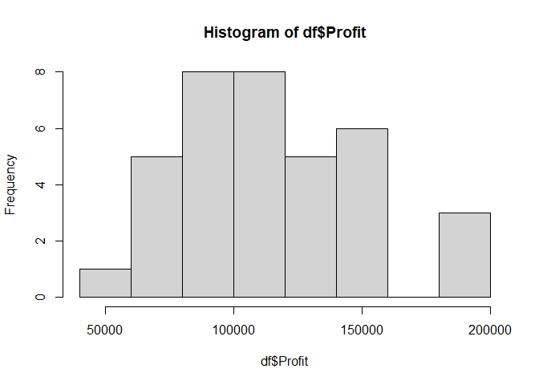
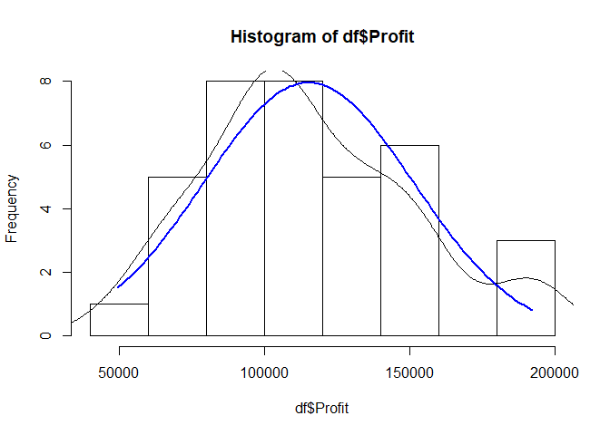
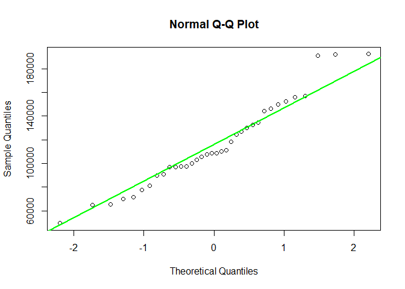

Quiz 1 - Regression
================
Yonatan-Lourie, Idan-ben-yitschak
5/6/2021

## 4

``` r
setwd(dirname(rstudioapi::getActiveDocumentContext()$path))
```

### a

``` r
My_lm <- function(X,Y){
  #' @param X is matrix with n rows and p+1 columns
  #' @param Y is vector with length n 
  
  
  X <- as.matrix(X)
  X <- cbind(1,X)
  Y <- as.matrix(Y)
  n <- nrow(X)
  p <- ncol(X)
  dof <-  n-(p-1)-1
  
  beta_hat <- solve(t(X)%*%X)%*%t(X)%*%Y
  Y_hat <- X%*%beta_hat
  residuals <- Y-(Y_hat)
  sigma2_hat <- (t(residuals)%*%residuals/(n-p))[1,1]
  
  beta_cov <- sigma2_hat*solve(t(X)%*%X)
  
  T_stat <- beta_hat/sqrt(diag(beta_cov))

  
  P_Values <- 2*(1-pt(abs(T_stat),n-p))
  
  SSR <- sum((Y_hat - Y) ^ 2)  ## residual sum of squares
  SST <- sum((Y - mean(Y)) ^ 2)  ## total sum of squares
  R_squared <- 1- SSR/SST
  
  
  
    
  # TODO: Complete the code.
  #       Don't use any external libaries or functions for computing linear models.
  
  return(list(beta_hat, beta_cov, T_stat, P_Values, sigma2_hat, R_squared, dof, residuals, X, Y, Y_hat))


}
```

``` r
df <- read.csv("Startups.csv")
```

#### i

``` r
head(df)
```

    ##   R.D.Spend Administration Marketing.Spend      State   Profit
    ## 1  165349.2      136897.80        471784.1   New York 192261.8
    ## 2  162597.7      151377.59        443898.5 California 191792.1
    ## 3  153441.5      101145.55        407934.5    Florida 191050.4
    ## 4  131876.9       99814.71        362861.4   New York 156991.1
    ## 5  130298.1      145530.06        323876.7    Florida 155752.6
    ## 6  120542.5      148718.95        311613.3   New York 152211.8

``` r
str(df)
```

    ## 'data.frame':    36 obs. of  5 variables:
    ##  $ R.D.Spend      : num  165349 162598 153442 131877 130298 ...
    ##  $ Administration : num  136898 151378 101146 99815 145530 ...
    ##  $ Marketing.Spend: num  471784 443899 407935 362861 323877 ...
    ##  $ State          : chr  "New York" "California" "Florida" "New York" ...
    ##  $ Profit         : num  192262 191792 191050 156991 155753 ...

``` r
cat("--------------------------------")
```

    ## --------------------------------

``` r
summary(df)
```

    ##    R.D.Spend      Administration   Marketing.Spend     State          
    ##  Min.   :  1000   Min.   : 51283   Min.   :  1904   Length:36         
    ##  1st Qu.: 45837   1st Qu.:105078   1st Qu.:139922   Class :character  
    ##  Median : 74662   Median :122700   Median :239453   Mode  :character  
    ##  Mean   : 76578   Mean   :123041   Mean   :224241                     
    ##  3rd Qu.:105066   3rd Qu.:144485   3rd Qu.:300633                     
    ##  Max.   :165349   Max.   :182646   Max.   :471784                     
    ##      Profit      
    ##  Min.   : 49491  
    ##  1st Qu.: 95212  
    ##  Median :108643  
    ##  Mean   :115300  
    ##  3rd Qu.:136795  
    ##  Max.   :192262

#### ii

``` r
myhist <- hist(df$Profit)
```

<!-- -->

``` r
multiplier <- myhist$counts / myhist$density
mydensity <- density(df$Profit)
mydensity$y <- mydensity$y * multiplier[1]

plot(myhist)
lines(mydensity)

myx <- seq(min(df$Profit), max(df$Profit), length.out= 100)
mymean <- mean(df$Profit)
mysd <- sd(df$Profit)

normal <- dnorm(x = myx, mean = mymean, sd = mysd)
lines(myx, normal * multiplier[1], col = "blue", lwd = 2)
```

<!-- -->

``` r
sd_x <- seq(mymean - 3 * mysd, mymean + 3 * mysd, by = mysd)
sd_y <- dnorm(x = sd_x, mean = mymean, sd = mysd) * multiplier[1]

# segments(x0 = sd_x, y0= 0, x1 = sd_x, y1 = sd_y, col = "firebrick4", lwd = 2)
```

We can see that we dont have a perfect correlation with the normal
(blue) dist - but there is similiarity.

Lets look at the QQPlot to identify normality:

``` r
qqnorm(df$Profit)
qqline(df$Profit, col = "green", lwd = 2)
```

<!-- -->

It looks like a normal distribution but with long right tail. we also
can see that we have a “gap” in the data.

``` r
pairs(df[c(-4)], upper.panel = NULL)
```

<!-- -->

``` r
cor(df[c(-4)])
```

    ##                 R.D.Spend Administration Marketing.Spend    Profit
    ## R.D.Spend       1.0000000     0.16054446      0.75826916 0.9782919
    ## Administration  0.1605445     1.00000000     -0.05504912 0.1196753
    ## Marketing.Spend 0.7582692    -0.05504912      1.00000000 0.7770678
    ## Profit          0.9782919     0.11967533      0.77706784 1.0000000

#### iv

``` r
unique(df$State)
```

    ## [1] "New York"   "California" "Florida"

``` r
df$NY <- ifelse(df$State == "New York", 1,0)
df$FL <- ifelse(df$State == "Florida", 1,0)
#making 2 dummy variables due to 3 categorical variables.
df <- df[c(-4)]

model <- My_lm(df[c(-4)], df["Profit"])
print('betas_hat: ')
```

    ## [1] "betas_hat: "

``` r
betas_hat <- model[[1]]
rownames(betas_hat)[1] = "intercept"
betas_hat
```

    ##                        Profit
    ## intercept        5.633027e+04
    ## R.D.Spend        7.660746e-01
    ## Administration  -2.616449e-02
    ## Marketing.Spend  2.384049e-02
    ## NY              -2.939637e+03
    ## FL              -2.792330e+03

#### v

``` r
T_stat <- model[[3]]
T_stat
```

    ##                     Profit
    ##                  8.1873071
    ## R.D.Spend       15.8224079
    ## Administration  -0.5077559
    ## Marketing.Spend  1.3142079
    ## NY              -0.8746709
    ## FL              -0.9405045

#### vi

``` r
CI <- function(alpha, beta, v, deg){
  CI.low <-(beta - qt(1-alpha/2,deg)*sqrt(v))
  CI.high <-(beta + qt(1-alpha/2,deg)*sqrt(v))
  return(c(CI.low, CI.high))
}

CI_df <- data.frame(beta =NA, lower=NA, upper=NA)
deg <- nrow(df)-ncol(df)
betas_var <- diag(model[[2]])
for (i in c(1:length(betas_hat))) {
  beta <- rownames(betas_hat)[i]
  lower <- CI(0.05,betas_hat[i], betas_var[i], deg)[1]
  upper <- CI(0.05,betas_hat[i], betas_var[i], deg)[2]
  CI_df <- rbind(CI_df, c(beta,lower, upper))
}

na.omit(CI_df)
```

    ##              beta               lower              upper
    ## 2       intercept     42279.037676838   70381.5040675557
    ## 3       R.D.Spend   0.667193797647681  0.864955498705348
    ## 4  Administration  -0.131402078859794 0.0790731063466653
    ## 5 Marketing.Spend -0.0132075109226804  0.060888492906907
    ## 6              NY    -9803.4083213011   3924.13344461858
    ## 7              FL   -8855.77633934312   3271.11644734578

#### vii

``` r
abs(T_stat)>qt(1-(0.05/2), deg-1)
```

    ##                 Profit
    ##                   TRUE
    ## R.D.Spend         TRUE
    ## Administration   FALSE
    ## Marketing.Spend  FALSE
    ## NY               FALSE
    ## FL               FALSE

We wil reject the null hypothesis for the intercept and for R.D spend.

### c

``` r
df_test <- read.csv("Startups_test.csv")
df_test
```

    ##    R.D.Spend Administration Marketing.Spend      State    Profit
    ## 1   46014.02       85047.44        205517.6   New York  96479.51
    ## 2  134615.46      147198.87        127716.8 California 156122.51
    ## 3   72107.60      127864.55        353183.8   New York 105008.31
    ## 4   94657.16      145077.58        282574.3   New York 125370.37
    ## 5   20229.59       65947.93        185265.1   New York  81229.06
    ## 6  144372.41      118671.85        383199.6   New York 182901.99
    ## 7   28754.33      118546.05        172795.7 California  78239.91
    ## 8   65605.48      153032.06        107138.4   New York 101004.64
    ## 9  142107.34       91391.77        366168.4    Florida 166187.94
    ## 10  93863.75      127320.38        249839.4    Florida 141585.52

#### i

``` r
df_test$NY <- ifelse(df_test$State == "New York", 1,0)
df_test$FL <- ifelse(df_test$State == "Florida", 1,0)
#making 2 dummy variables due to 3 categorical variables.

X <- df_test[c(1,2,3,6,7)]
X <- cbind(1, X)
Y_star <- df_test[c(5)]
Y_star_hat <- t(betas_hat)%*%t(X)

t(Y_star_hat)
```

    ##          Profit
    ##  [1,]  91315.23
    ##  [2,] 158649.21
    ##  [3,] 113705.00
    ##  [4,] 128845.91
    ##  [5,]  71579.33
    ##  [6,] 170021.36
    ##  [7,]  79376.07
    ##  [8,] 102199.55
    ##  [9,] 168741.19
    ## [10,] 128069.60

#### ii

``` r
RMSE <- sqrt((sum((Y_star-Y_star_hat)^2))/nrow(Y_star))
RMSE
```

    ## [1] 7561.162
