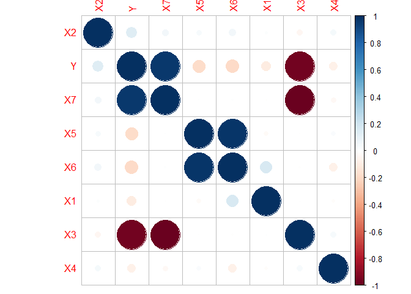
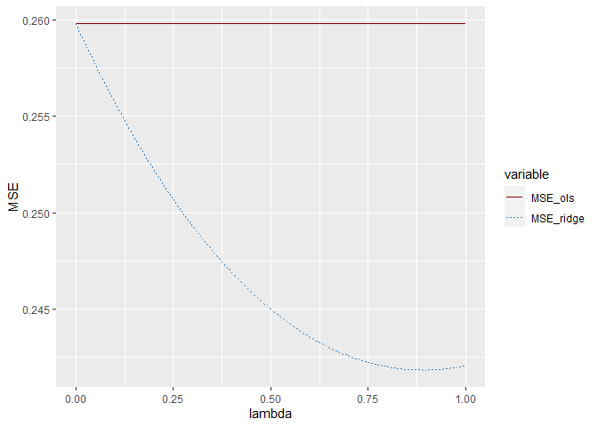
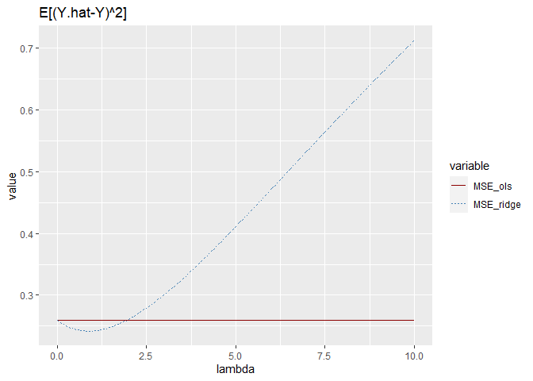
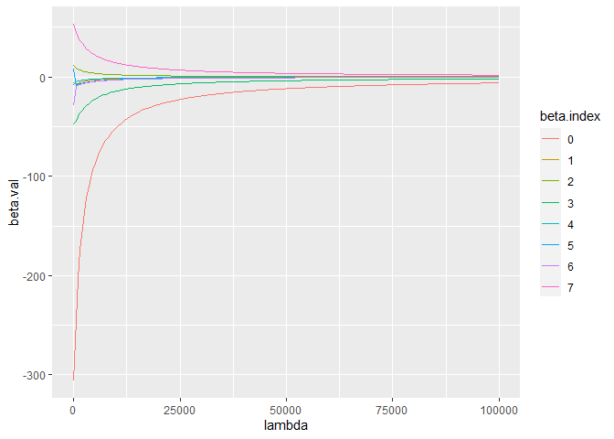
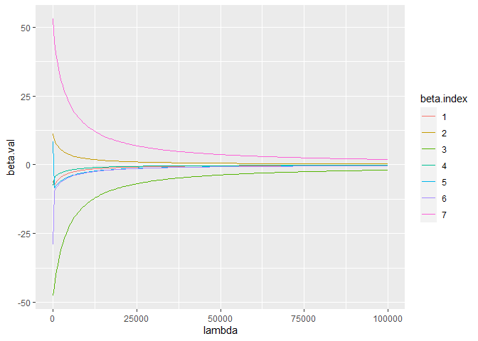
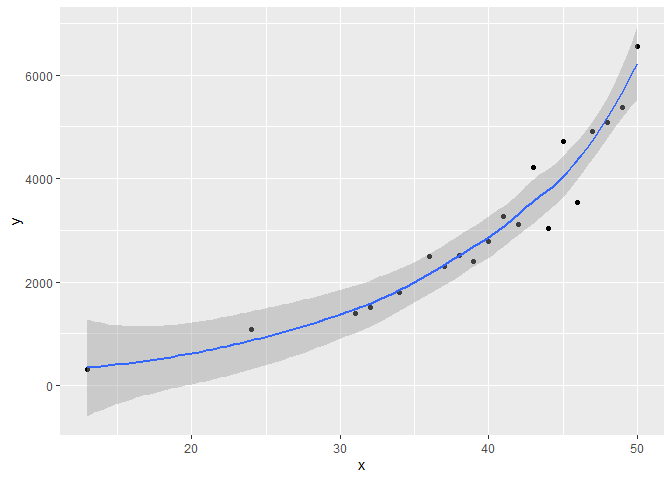
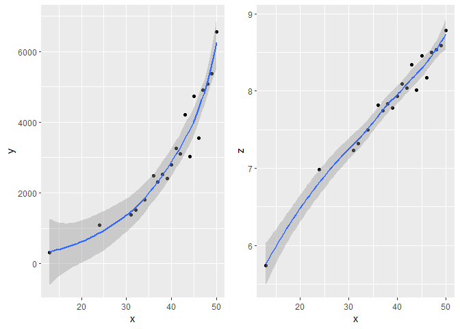
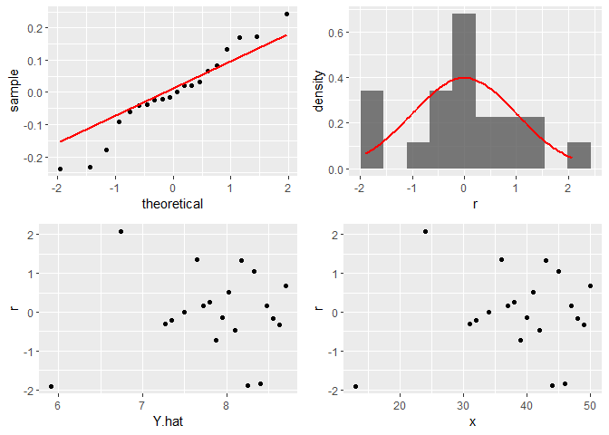
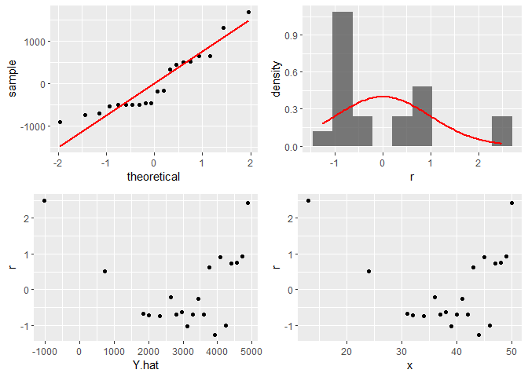

quiz2
================
YonatanLourie-MatanPolke
6/3/2021

``` r
library(tidyverse)
library(corrplot)
library(olsrr)
library(ggpubr)
```

## 1

``` r
df <- read.csv("quiz2_df.csv")
df[,c(-1,-2)] <- lapply(df[,c(-1,-2)], scale)
head(df)
```

    ##           Y X0         X1         X2         X3         X4         X5
    ## 1 -530.6376  1  1.6744819 -1.0151718  1.7173984 -0.6565808  1.6474486
    ## 2 -475.1651  1 -0.7379820  0.7165602  1.7222298 -0.4738682 -0.1639851
    ## 3 -213.1832  1 -0.3047325  0.6122595 -0.3046269 -0.8766172 -1.2709723
    ## 4 -201.1812  1 -0.1466900  1.3919298 -0.7481165  0.1570530 -1.7741483
    ## 5 -352.3821  1 -0.1509936 -1.4707457  0.5249123 -0.4693774 -0.9690667
    ## 6 -456.9877  1  0.2404243  0.8561063  1.2677742 -0.1960400  0.6410965
    ##           X6         X7
    ## 1  2.0234595 -1.5654119
    ## 2 -0.1316439 -1.9748487
    ## 3 -1.3419837  0.6123723
    ## 4 -1.7297266  0.4243716
    ## 5 -1.0109475 -0.5453656
    ## 6  0.8792190 -1.5217574

``` r
sapply(df, var)
```

    ##        Y       X0       X1       X2       X3       X4       X5       X6 
    ## 10771.44     0.00     1.00     1.00     1.00     1.00     1.00     1.00 
    ##       X7 
    ##     1.00

``` r
round(sapply(df, mean),5)
```

    ##         Y        X0        X1        X2        X3        X4        X5        X6 
    ## -305.7142    1.0000    0.0000    0.0000    0.0000    0.0000    0.0000    0.0000 
    ##        X7 
    ##    0.0000

### 9

#### a. Pearson correlation

First, we can check in the most naive way, with the correlation matrix.

``` r
corrplot(cor(df[,-2]), order = "hclust")
```

<!-- --> We can see
clearly what we have a negative correlation of (Y, X3), (X3, X7). Also
we can see a positive correlation of (Y, X7), (X5, X6).

#### b. *R*<sub>*j*</sub><sup>2</sup> method

But correlation matrix is good just for pairs of variables, when we deal
with multiple variables we need to think about a multicolliniety between
a few variables at once. Lets implement the VIF method.
$VIF = \\frac{1}{1 - {R}^{2}\_{k}} = \\frac{1}{Tolerance}$ We will
regress the kth predictor on rest of the predictors in the model, and
then we will compute the *R*<sup>2</sup> of each one of the regressor.
By that we can indicate how much correlation each regressor have with
all the other *X*′*s*. Recall that we wish to get higher Tolerance
(1 − *R*<sup>2</sup>) because high *R*<sup>2</sup> means that we can
explain pretty the outcome with the regressor, and because the outcome
is one of the regressors, it indicate on high correlation. (Of course
that we wish to get smaller VIF becasue its the inverse).

``` r
model <- lm(Y~., data=df)
arrange(ols_vif_tol(model), -VIF)
```

    ##   Variables   Tolerance        VIF
    ## 1        X6 0.009906343 100.945426
    ## 2        X5 0.010271640  97.355438
    ## 3        X7 0.038089224  26.254145
    ## 4        X3 0.038112746  26.237941
    ## 5        X1 0.210070282   4.760312
    ## 6        X4 0.485947088   2.057837
    ## 7        X0 0.500008652   1.999965
    ## 8        X2 0.944254733   1.059036

We can see that most “problematic” variables are X6, X5, X7, X3. But we
have a problem in this method also as well. The *R*<sup>2</sup>
indicator is good for linear correlations, and recall that this
insicator gets better with the number of regressors (for that we can use
the Adjusted *R*<sup>2</sup> method).

#### c. Condition indices & Condition number

In this method we wish to calculate the square root of the ratio of the
maximum eigenvalue to each eigenvalue from the correlation matrix of
standardized explanatory variables (is referred to as the condition
index (The condition index). The condition number is the maximum
condition index. The condition index that fits to the eigenvector
*u*<sub>*k*</sub> of *X*<sup>*T*</sup>*X* is:
$\\alpha\_{k}:=\\left(\\frac{\\lambda\_{\\max }\\left(\\boldsymbol{X}^{\\top} \\boldsymbol{X}\\right)}{\\lambda\_{k}\\left(\\boldsymbol{X}^{\\top} \\boldsymbol{X}\\right)}\\right)^{1 / 2}$

``` r
model <- lm(Y~.-X0, data=df)

round(ols_eigen_cindex(model),3)
```

    ##   Eigenvalue Condition Index intercept    X1    X2    X3    X4    X5    X6
    ## 1      2.002           1.000         0 0.001 0.004 0.005 0.001 0.001 0.001
    ## 2      1.973           1.007         0 0.001 0.000 0.005 0.000 0.001 0.001
    ## 3      1.049           1.382         0 0.017 0.322 0.000 0.256 0.000 0.000
    ## 4      1.011           1.407         0 0.167 0.153 0.000 0.001 0.000 0.000
    ## 5      1.000           1.415         1 0.000 0.000 0.000 0.000 0.000 0.000
    ## 6      0.942           1.458         0 0.019 0.471 0.000 0.226 0.000 0.000
    ## 7      0.019          10.199         0 0.000 0.002 0.990 0.000 0.000 0.000
    ## 8      0.005          20.144         0 0.796 0.048 0.001 0.517 0.997 0.997
    ##      X7
    ## 1 0.005
    ## 2 0.005
    ## 3 0.000
    ## 4 0.000
    ## 5 0.000
    ## 6 0.000
    ## 7 0.990
    ## 8 0.001

We can see that where the condition index is high (and the eigenvalue is
low), we have an indication for a high correlation. When we look at the
eigenvectors (the rows of X1-X7) at the highest condition index
(20.144), We can see that (X5, X6) have a high correlation like we found
when we did the pearson correlation. But now we can see that X1 and X4
also have some (small) impact on the correlation. For condition index
10.19 we have high correlation of (X3, X7). Recall that every column
will sum to 1 and that the column is showing the porportional variance
of *β*<sub>*j*</sub>.

### 10

``` r
sigma_sq <- 2 # true sigma squared
beta <- c(3.155678, -2.967792, 5.6823762, -9.4346238, -3.7229186, 0.8544212, -1.4265823, 10.4009092) # true beta vector
lambda_seq <- seq(10^{-4},1,length.out = 200) # lambda sequence to try
# lambda_seq <- seq(10^{-4},1,length.out = 200) # lambda sequence to try
lambda_seq_mod <- seq(10^{-4},10^5,length.out = 200)

ridge_aux_functions <- function(X, Y, lambda, sigma_sq, beta_true){
  #' @param X is the X data frame/matrix
  #' @param Y is the Y variable
  #' @param lambda is the ridge penalty parameter
  #' @param sigma_sq is the true model sigma squared
  #' @param beta_true is the true model beta vector
  X <- as.matrix(X)
  Y <- as.matrix(Y)
  beta_true <- as.matrix(beta)
  lambda_diag <- lambda*diag(dim(X)[2])
  beta_ridge <- solve(t(X)%*%X+lambda_diag) %*%t(X)%*%Y
  A <- solve(t(X) %*% X+lambda_diag) %*% t(X) %*% X
  bias_ridge <- (A %*% beta_true - beta_true)
  var_ridge <- sigma_sq %*% sum(diag(A %*% solve(t(X)%*%X) %*% t(A)))
  mse_ridge <- var_ridge + t(bias_ridge)%*%bias_ridge # from q 8.
  
  beta_ols <- solve(t(X) %*% X) %*% t(X)%*%Y
  A <- solve(t(X) %*% X) %*% t(X) %*% X
  bias_ols <- (A %*% beta_true - beta_true)
  var_ols <- sigma_sq %*% sum(diag(A %*% solve(t(X)%*%X) %*% t(A)))
  mse_ols <- var_ols + t(bias_ols)%*%bias_ols # from q 8.
  return(list(lambda = lambda, mse_ridge = mse_ridge, mse_ols = mse_ols))
}

X <- as.matrix(df[,-1])
Y <- df["Y"]
```

### 11

``` r
res.est <- data.frame(lambda=NA, MSE_ridge=NA, MSE_ols=NA)
for (lambda in lambda_seq) {
  tmp <- c(ridge_aux_functions(X,Y, lambda,sigma_sq, beta))
  tmp <- unlist(tmp)
  
  res.est <- rbind(res.est, tmp)
}
res.est <- arrange(na.omit(res.est), lambda)

resPlot <- res.est %>%
  select(lambda, MSE_ridge, MSE_ols) %>%
  gather(key = "variable", value = "value", -lambda)
ggplot(resPlot, aes(x = lambda, y = value)) + 
  geom_line(aes(color = variable, linetype = variable)) + 
  scale_color_manual(values = c("darkred", "steelblue")) +ylab("MSE")
```

<!-- -->

We can observed that the MSE of *E*\[(*Ŷ* − *Y*)<sup>2</sup>\] is
getting lower when the lambda is getting higher, which means the model
prediction is improved (less error) to a certain point. When $= 0 $ then
the ridge \|\|*b*\|\|<sup>2</sup> have no imapct to their MSE’s are
alike. but!

``` r
lambda_seq <- seq(10^{-4},10,length.out = 200) # lambda sequence to try

res.est <- data.frame(lambda=NA, MSE_ridge=NA, MSE_ols=NA)
for (lambda in lambda_seq) {
  tmp <- c(ridge_aux_functions(X,Y, lambda,sigma_sq, beta))
  tmp <- unlist(tmp)
  
  res.est <- rbind(res.est, tmp)
}
res.est <- arrange(na.omit(res.est), lambda)

resPlot <- res.est %>%
  select(lambda, MSE_ridge, MSE_ols) %>%
  gather(key = "variable", value = "value", -lambda)
ggplot(resPlot, aes(x = lambda, y = value)) + 
  geom_line(aes(color = variable, linetype = variable)) + 
  scale_color_manual(values = c("darkred", "steelblue")) +ggtitle("E[(Y.hat-Y)^2]")
```

<!-- --> When we will
try to implement a larger set of lambdas, we cab see that their is a
minimum value of MSE and from that poing the MSE is only getting bigger.
As *λ* increases, the flexibility of the ridge regression fit decreases,
leading to decreased variance but increased bias. So in any ridge
regression, we need to find the best lambda the minize the error (when
the bias-variance tradeoff is for the best). after that lambda, the bias
is increasing. In our case, the best lambda is:

``` r
min(res.est$MSE_ridge)
```

    ## [1] 0.2418345

### 12

``` r
ridge_aux_functions2 <- function(X, Y, lambda){
  X <- as.matrix(X)
  Y <- as.matrix(Y)
  xtx <- solve(t(X) %*% X)
  lambda.diag <-  lambda *diag(dim(X)[2])
  betas.ridge <- solve(t(X) %*% X + lambda.diag) %*% t(X) %*% Y
  ans <- data.frame(lambda = rep(lambda, length(betas.ridge)),betas_index = c(1:length(betas.ridge)), betas_value = betas.ridge)
  
  return(ans)
}


res2 <- data.frame(lambda=NA, beta.index=NA, beta.val=NA)
for (lambda in lambda_seq_mod) {
  tmp <- c(ridge_aux_functions2(X,Y, lambda))
  names(tmp) <- c("lambda", "beta.index", "beta.val")
  res2 <- rbind(res2, tmp)
}
res2 <- na.omit(res2)
res2$beta.index <- as.factor(res2$beta.index-1)
res2
```

    ##           lambda beta.index     beta.val
    ## 2         0.0001          0 -305.7142346
    ## 3         0.0001          1   -5.9969823
    ## 4         0.0001          2   11.2950964
    ## 5         0.0001          3  -47.4943508
    ## 6         0.0001          4   -7.5242002
    ## 7         0.0001          5    8.4155746
    ## 8         0.0001          6  -29.0250430
    ## 9         0.0001          7   52.9409814
    ## 10      502.5127          0 -244.3258366
    ## 11      502.5127          1   -7.7303501
    ## 12      502.5127          2    9.0195751
    ## 13      502.5127          3  -44.3802073
    ## 14      502.5127          4   -4.7025619
    ## 15      502.5127          5   -8.2905868
    ## 16      502.5127          6   -9.6681043
    ## 17      502.5127          7   44.8486641
    ## 18     1005.0252          0 -203.4686746
    ## 19     1005.0252          1   -6.5567286
    ## 20     1005.0252          2    7.7127493
    ## 21     1005.0252          3  -40.0001591
    ## 22     1005.0252          4   -4.0300933
    ## 23     1005.0252          5   -7.6007281
    ## 24     1005.0252          6   -8.5058322
    ## 25     1005.0252          7   40.2625638
    ## 26     1507.5378          0 -174.3184356
    ## 27     1507.5378          1   -5.6915663
    ## 28     1507.5378          2    6.7521412
    ## 29     1507.5378          3  -36.3709059
    ## 30     1507.5378          4   -3.5417433
    ## 31     1507.5378          5   -6.9497671
    ## 32     1507.5378          6   -7.6507087
    ## 33     1507.5378          7   36.5577560
    ## 34     2010.0503          0 -152.4740206
    ## 35     2010.0503          1   -5.0304933
    ## 36     2010.0503          2    6.0125157
    ## 37     2010.0503          3  -33.3366383
    ## 38     2010.0503          4   -3.1658735
    ## 39     2010.0503          5   -6.3866945
    ## 40     2010.0503          6   -6.9647434
    ## 41     2010.0503          7   33.4833348
    ## 42     2512.5629          0 -135.4947314
    ## 43     2512.5629          1   -4.5088497
    ## 44     2512.5629          2    5.4236957
    ## 45     2512.5629          3  -30.7662944
    ## 46     2512.5629          4   -2.8658643
    ## 47     2512.5629          5   -5.9026317
    ## 48     2512.5629          6   -6.3962562
    ## 49     2512.5629          7   30.8877386
    ## 50     3015.0755          0 -121.9181053
    ## 51     3015.0755          1   -4.0864837
    ## 52     3015.0755          2    4.9428537
    ## 53     3015.0755          3  -28.5623446
    ## 54     3015.0755          4   -2.6200019
    ## 55     3015.0755          5   -5.4842965
    ## 56     3015.0755          6   -5.9156166
    ## 57     3015.0755          7   28.6662961
    ## 58     3517.5880          0 -110.8144529
    ## 59     3517.5880          1   -3.7373228
    ## 60     3517.5880          2    4.5422193
    ## 61     3517.5880          3  -26.6521898
    ## 62     3517.5880          4   -2.4143758
    ## 63     3517.5880          5   -5.1200246
    ## 64     3517.5880          6   -5.5032107
    ## 65     3517.5880          7   26.7432392
    ## 66     4020.1006          0 -101.5644988
    ## 67     4020.1006          1   -3.4437193
    ## 68     4020.1006          2    4.2029256
    ## 69     4020.1006          3  -24.9810055
    ## 70     4020.1006          4   -2.2395839
    ## 71     4020.1006          5   -4.8003708
    ## 72     4020.1006          6   -5.1451486
    ## 73     4020.1006          7   25.0621103
    ## 74     4522.6132          0  -93.7398071
    ## 75     4522.6132          1   -3.1933001
    ## 76     4522.6132          2    3.9116696
    ## 77     4522.6132          3  -23.5067188
    ## 78     4522.6132          4   -2.0890069
    ## 79     4522.6132          5   -4.5178154
    ## 80     4522.6132          6   -4.8311898
    ## 81     4522.6132          7   23.5799043
    ## 82     5025.1257          0  -87.0345278
    ## 83     5025.1257          1   -2.9771287
    ## 84     5025.1257          2    3.6587818
    ## 85     5025.1257          3  -22.1965425
    ## 86     5025.1257          4   -1.9578318
    ## 87     5025.1257          5   -4.2663684
    ## 88     5025.1257          6   -4.5535691
    ## 89     5025.1257          7   22.2632609
    ## 90     5527.6383          0  -81.2244793
    ## 91     5527.6383          1   -2.7885865
    ## 92     5527.6383          2    3.4370535
    ## 93     5527.6383          3  -21.0245640
    ## 94     5527.6383          4   -1.8424647
    ## 95     5527.6383          5   -4.0412281
    ## 96     5527.6383          6   -4.3062708
    ## 97     5527.6383          7   21.0858946
    ## 98     6030.1508          0  -76.1415958
    ## 99     6030.1508          1   -2.6226647
    ## 100    6030.1508          2    3.2409939
    ## 101    6030.1508          3  -19.9700414
    ## 102    6030.1508          4   -1.7401623
    ## 103    6030.1508          5   -3.8385136
    ## 104    6030.1508          6   -4.0845526
    ## 105    6030.1508          7   20.0268093
    ## 106    6532.6634          0  -71.6574029
    ## 107    6532.6634          1   -2.4755013
    ## 108    6532.6634          2    3.0663430
    ## 109    6532.6634          3  -19.0161782
    ## 110    6532.6634          4   -1.6487906
    ## 111    6532.6634          5   -3.6550605
    ## 112    6532.6634          6   -3.8846202
    ## 113    6532.6634          7   19.0690296
    ## 114    7035.1760          0  -67.6720079
    ## 115    7035.1760          1   -2.3440698
    ## 116    7035.1760          2    2.9097423
    ## 117    7035.1760          3  -18.1492309
    ## 118    7035.1760          4   -1.5666629
    ## 119    7035.1760          5   -3.4882665
    ## 120    7035.1760          6   -3.7033998
    ## 121    7035.1760          7   18.1986817
    ## 122    7537.6885          0  -64.1065702
    ## 123    7537.6885          1   -2.2259639
    ## 124    7537.6885          2    2.7685065
    ## 125    7537.6885          3  -17.3578459
    ## 126    7537.6885          4   -1.4924265
    ## 127    7537.6885          5   -3.3359736
    ## 128    7537.6885          6   -3.5383725
    ## 129    7537.6885          7   17.4043150
    ## 130    8040.2011          0  -60.8980332
    ## 131    8040.2011          1   -2.1192462
    ## 132    8040.2011          2    2.6404619
    ## 133    8040.2011          3  -16.6325631
    ## 134    8040.2011          4   -1.4249834
    ## 135    8040.2011          5   -3.1963784
    ## 136    8040.2011          6   -3.3874546
    ## 137    8040.2011          7   16.6763954
    ## 138    8542.7137          0  -57.9953624
    ## 139    8542.7137          1   -2.0223388
    ## 140    8542.7137          2    2.5238292
    ## 141    8542.7137          3  -15.9654367
    ## 142    8542.7137          4   -1.3634325
    ## 143    8542.7137          5   -3.0679629
    ## 144    8542.7137          6   -3.2489062
    ## 145    8542.7137          7   16.0069199
    ## 146    9045.2262          0  -55.3568109
    ## 147    9045.2262          1   -1.9339432
    ## 148    9045.2262          2    2.4171373
    ## 149    9045.2262          3  -15.3497449
    ## 150    9045.2262          4   -1.3070267
    ## 151    9045.2262          5   -2.9494406
    ## 152    9045.2262          6   -3.1212631
    ## 153    9045.2262          7   15.3891214
    ## 154    9547.7388          0  -52.9478984
    ## 155    9547.7388          1   -1.8529814
    ## 156    9547.7388          2    2.3191592
    ## 157    9547.7388          3  -14.7797625
    ## 158    9547.7388          4   -1.2551412
    ## 159    9547.7388          5   -2.8397141
    ## 160    9547.7388          6   -3.0032841
    ## 161    9547.7388          7   14.8172387
    ## 162   10050.2513          0  -50.7398960
    ## 163   10050.2513          1   -1.7785502
    ## 164   10050.2513          2    2.2288630
    ## 165   10050.2513          3  -14.2505833
    ## 166   10050.2513          4   -1.2072493
    ## 167   10050.2513          5   -2.7378420
    ## 168   10050.2513          6   -2.8939099
    ## 169   10050.2513          7   14.2863363
    ## 170   10552.7639          0  -48.7086752
    ## 171   10552.7639          1   -1.7098878
    ## 172   10552.7639          2    2.1453744
    ## 173   10552.7639          3  -13.7579786
    ## 174   10552.7639          4   -1.1629036
    ## 175   10552.7639          5   -2.6430121
    ## 176   10552.7639          6   -2.7922309
    ## 177   10552.7639          7   13.7921618
    ## 178   11055.2765          0  -46.8338224
    ## 179   11055.2765          1   -1.6463466
    ## 180   11055.2765          2    2.0679474
    ## 181   11055.2765          3  -13.2982845
    ## 182   11055.2765          4   -1.1217217
    ## 183   11055.2765          5   -2.5545204
    ## 184   11055.2765          6   -2.6974615
    ## 185   11055.2765          7   13.3310312
    ## 186   11557.7890          0  -45.0979506
    ## 187   11557.7890          1   -1.5873726
    ## 188   11557.7890          2    1.9959419
    ## 189   11557.7890          3  -12.8683102
    ## 190   11557.7890          4   -1.0833744
    ## 191   11557.7890          5   -2.4717530
    ## 192   11557.7890          6   -2.6089196
    ## 193   11557.7890          7   12.8997375
    ## 194   12060.3016          0  -43.4861582
    ## 195   12060.3016          1   -1.5324893
    ## 196   12060.3016          2    1.9288051
    ## 197   12060.3016          3  -12.4652646
    ## 198   12060.3016          4   -1.0475771
    ## 199   12060.3016          5   -2.3941730
    ## 200   12060.3016          6   -2.5260104
    ## 201   12060.3016          7   12.4954757
    ## 202   12562.8142          0  -41.9856007
    ## 203   12562.8142          1   -1.4812842
    ## 204   12562.8142          2    1.8660573
    ## 205   12562.8142          3  -12.0866954
    ## 206   12562.8142          4   -1.0140824
    ## 207   12562.8142          5   -2.3213083
    ## 208   12562.8142          6   -2.4482123
    ## 209   12562.8142          7   12.1157816
    ## 210   13065.3267          0  -40.5851470
    ## 211   13065.3267          1   -1.4333988
    ## 212   13065.3267          2    1.8072801
    ## 213   13065.3267          3  -11.7304389
    ## 214   13065.3267          4   -0.9826737
    ## 215   13065.3267          5   -2.2527424
    ## 216   13065.3267          6   -2.3750665
    ## 217   13065.3267          7   11.7584817
    ## 218   13567.8393          0  -39.2751035
    ## 219   13567.8393          1   -1.3885196
    ## 220   13567.8393          2    1.7521066
    ## 221   13567.8393          3  -11.3945794
    ## 222   13567.8393          4   -0.9531612
    ## 223   13567.8393          5   -2.1881062
    ## 224   13567.8393          6   -2.3061675
    ## 225   13567.8393          7   11.4216517
    ## 226   14070.3518          0  -38.0469890
    ## 227   14070.3518          1   -1.3463716
    ## 228   14070.3518          2    1.7002142
    ## 229   14070.3518          3  -11.0774142
    ## 230   14070.3518          4   -0.9253774
    ## 231   14070.3518          5   -2.1270718
    ## 232   14070.3518          6   -2.2411555
    ## 233   14070.3518          7   11.1035814
    ## 234   14572.8644          0  -36.8933508
    ## 235   14572.8644          1   -1.3067123
    ## 236   14572.8644          2    1.6513176
    ## 237   14572.8644          3  -10.7774250
    ## 238   14572.8644          4   -0.8991741
    ## 239   14572.8644          5   -2.0693466
    ## 240   14572.8644          6   -2.1797105
    ## 241   14572.8644          7   10.8027460
    ## 242   15075.3770          0  -35.8076135
    ## 243   15075.3770          1   -1.2693272
    ## 244   15075.3770          2    1.6051638
    ## 245   15075.3770          3  -10.4932536
    ## 246   15075.3770          4   -0.8744197
    ## 247   15075.3770          5   -2.0146689
    ## 248   15075.3770          6   -2.1215465
    ## 249   15075.3770          7   10.5177817
    ## 250   15577.8895          0  -34.7839539
    ## 251   15577.8895          1   -1.2340258
    ## 252   15577.8895          2    1.5615277
    ## 253   15577.8895          3  -10.2236811
    ## 254   15577.8895          4   -0.8509966
    ## 255   15577.8895          5   -1.9628038
    ## 256   15577.8895          6   -2.0664074
    ## 257   15577.8895          7   10.2474649
    ## 258   16080.4021          0  -33.8171959
    ## 259   16080.4021          1   -1.2006384
    ## 260   16080.4021          2    1.5202082
    ## 261   16080.4021          3   -9.9676110
    ## 262   16080.4021          4   -0.8288001
    ## 263   16080.4021          5   -1.9135399
    ## 264   16080.4021          6   -2.0140631
    ## 265   16080.4021          7    9.9906945
    ## 266   16582.9147          0  -32.9027233
    ## 267   16582.9147          1   -1.1690130
    ## 268   16582.9147          2    1.4810249
    ## 269   16582.9147          3   -9.7240536
    ## 270   16582.9147          4   -0.8077358
    ## 271   16582.9147          5   -1.8666866
    ## 272   16582.9147          6   -1.9643062
    ## 273   16582.9147          7    9.7464771
    ## 274   17085.4272          0  -32.0364062
    ## 275   17085.4272          1   -1.1390137
    ## 276   17085.4272          2    1.4438161
    ## 277   17085.4272          3   -9.4921138
    ## 278   17085.4272          4   -0.7877190
    ## 279   17085.4272          5   -1.8220711
    ## 280   17085.4272          6   -1.9169495
    ## 281   17085.4272          7    9.5139142
    ## 282   17587.9398          0  -31.2145385
    ## 283   17587.9398          1   -1.1105179
    ## 284   17587.9398          2    1.4084358
    ## 285   17587.9398          3   -9.2709798
    ## 286   17587.9398          4   -0.7686732
    ## 287   17587.9398          5   -1.7795372
    ## 288   17587.9398          6   -1.8718233
    ## 289   17587.9398          7    9.2921910
    ## 290   18090.4523          0  -30.4337846
    ## 291   18090.4523          1   -1.0834153
    ## 292   18090.4523          2    1.3747521
    ## 293   18090.4523          3   -9.0599137
    ## 294   18090.4523          4   -0.7505293
    ## 295   18090.4523          5   -1.7389425
    ## 296   18090.4523          6   -1.8287735
    ## 297   18090.4523          7    9.0805668
    ## 298   18592.9649          0  -29.6911349
    ## 299   18592.9649          1   -1.0576059
    ## 300   18592.9649          2    1.3426455
    ## 301   18592.9649          3   -8.8582433
    ## 302   18592.9649          4   -0.7332244
    ## 303   18592.9649          5   -1.7001574
    ## 304   18592.9649          6   -1.7876600
    ## 305   18592.9649          7    8.8783671
    ## 306   19095.4775          0  -28.9838664
    ## 307   19095.4775          1   -1.0329992
    ## 308   19095.4775          2    1.3120076
    ## 309   19095.4775          3   -8.6653550
    ## 310   19095.4775          4   -0.7167016
    ## 311   19095.4775          5   -1.6630638
    ## 312   19095.4775          6   -1.7483551
    ## 313   19095.4775          7    8.6849761
    ## 314   19597.9900          0  -28.3095093
    ## 315   19597.9900          1   -1.0095130
    ## 316   19597.9900          2    1.2827396
    ## 317   19597.9900          3   -8.4806873
    ## 318   19597.9900          4   -0.7009088
    ## 319   19597.9900          5   -1.6275533
    ## 320   19597.9900          6   -1.7107418
    ## 321   19597.9900          7    8.4998303
    ## 322   20100.5026          0  -27.6658188
    ## 323   20100.5026          1   -0.9870724
    ## 324   20100.5026          2    1.2547516
    ## 325   20100.5026          3   -8.3037259
    ## 326   20100.5026          4   -0.6857987
    ## 327   20100.5026          5   -1.5935267
    ## 328   20100.5026          6   -1.6747133
    ## 329   20100.5026          7    8.3224135
    ## 330   20603.0152          0  -27.0507494
    ## 331   20603.0152          1   -0.9656089
    ## 332   20603.0152          2    1.2279611
    ## 333   20603.0152          3   -8.1339980
    ## 334   20603.0152          4   -0.6713277
    ## 335   20603.0152          5   -1.5608931
    ## 336   20603.0152          6   -1.6401714
    ## 337   20603.0152          7    8.1522516
    ## 338   21105.5277          0  -26.4624339
    ## 339   21105.5277          1   -0.9450601
    ## 340   21105.5277          2    1.2022928
    ## 341   21105.5277          3   -7.9710693
    ## 342   21105.5277          4   -0.6574562
    ## 343   21105.5277          5   -1.5295687
    ## 344   21105.5277          6   -1.6070260
    ## 345   21105.5277          7    7.9889085
    ## 346   21608.0403          0  -25.8991637
    ## 347   21608.0403          1   -0.9253686
    ## 348   21608.0403          2    1.1776775
    ## 349   21608.0403          3   -7.8145391
    ## 350   21608.0403          4   -0.6441474
    ## 351   21608.0403          5   -1.4994762
    ## 352   21608.0403          6   -1.5751940
    ## 353   21608.0403          7    7.8319825
    ## 354   22110.5528          0  -25.3593729
    ## 355   22110.5528          1   -0.9064818
    ## 356   22110.5528          2    1.1540516
    ## 357   22110.5528          3   -7.6640378
    ## 358   22110.5528          4   -0.6313678
    ## 359   22110.5528          5   -1.4705444
    ## 360   22110.5528          6   -1.5445988
    ## 361   22110.5528          7    7.6811027
    ## 362   22613.0654          0  -24.8416233
    ## 363   22613.0654          1   -0.8883513
    ## 364   22613.0654          2    1.1313565
    ## 365   22613.0654          3   -7.5192237
    ## 366   22613.0654          4   -0.6190864
    ## 367   22613.0654          5   -1.4427075
    ## 368   22613.0654          6   -1.5151698
    ## 369   22613.0654          7    7.5359261
    ## 370   23115.5780          0  -24.3445921
    ## 371   23115.5780          1   -0.8709326
    ## 372   23115.5780          2    1.1095382
    ## 373   23115.5780          3   -7.3797805
    ## 374   23115.5780          4   -0.6072745
    ## 375   23115.5780          5   -1.4159045
    ## 376   23115.5780          6   -1.4868414
    ## 377   23115.5780          7    7.3961356
    ## 378   23618.0905          0  -23.8670598
    ## 379   23618.0905          1   -0.8541845
    ## 380   23618.0905          2    1.0885468
    ## 381   23618.0905          3   -7.2454148
    ## 382   23618.0905          4   -0.5959057
    ## 383   23618.0905          5   -1.3900788
    ## 384   23618.0905          6   -1.4595531
    ## 385   23618.0905          7    7.2614367
    ## 386   24120.6031          0  -23.4079013
    ## 387   24120.6031          1   -0.8380689
    ## 388   24120.6031          2    1.0683361
    ## 389   24120.6031          3   -7.1158542
    ## 390   24120.6031          4   -0.5849555
    ## 391   24120.6031          5   -1.3651781
    ## 392   24120.6031          6   -1.4332486
    ## 393   24120.6031          7    7.1315563
    ## 394   24623.1157          0  -22.9660761
    ## 395   24623.1157          1   -0.8225507
    ## 396   24623.1157          2    1.0488632
    ## 397   24623.1157          3   -6.9908455
    ## 398   24623.1157          4   -0.5744010
    ## 399   24623.1157          5   -1.3411534
    ## 400   24623.1157          6   -1.4078756
    ## 401   24623.1157          7    7.0062404
    ## 402   25125.6282          0  -22.5406208
    ## 403   25125.6282          1   -0.8075973
    ## 404   25125.6282          2    1.0300884
    ## 405   25125.6282          3   -6.8701530
    ## 406   25125.6282          4   -0.5642213
    ## 407   25125.6282          5   -1.3179594
    ## 408   25125.6282          6   -1.3833854
    ## 409   25125.6282          7    6.8852525
    ## 410   25628.1408          0  -22.1306423
    ## 411   25628.1408          1   -0.7931783
    ## 412   25628.1408          2    1.0119748
    ## 413   25628.1408          3   -6.7535570
    ## 414   25628.1408          4   -0.5543967
    ## 415   25628.1408          5   -1.2955538
    ## 416   25628.1408          6   -1.3597329
    ## 417   25628.1408          7    6.7683723
    ## 418   26130.6533          0  -21.7353110
    ## 419   26130.6533          1   -0.7792655
    ## 420   26130.6533          2    0.9944881
    ## 421   26130.6533          3   -6.6408524
    ## 422   26130.6533          4   -0.5449088
    ## 423   26130.6533          5   -1.2738970
    ## 424   26130.6533          6   -1.3368757
    ## 425   26130.6533          7    6.6553939
    ## 426   26633.1659          0  -21.3538559
    ## 427   26633.1659          1   -0.7658328
    ## 428   26633.1659          2    0.9775961
    ## 429   26633.1659          3   -6.5318476
    ## 430   26633.1659          4   -0.5357407
    ## 431   26633.1659          5   -1.2529521
    ## 432   26633.1659          6   -1.3147744
    ## 433   26633.1659          7    6.5461253
    ## 434   27135.6785          0  -20.9855590
    ## 435   27135.6785          1   -0.7528557
    ## 436   27135.6785          2    0.9612691
    ## 437   27135.6785          3   -6.4263633
    ## 438   27135.6785          4   -0.5268764
    ## 439   27135.6785          5   -1.2326846
    ## 440   27135.6785          6   -1.2933921
    ## 441   27135.6785          7    6.4403867
    ## 442   27638.1910          0  -20.6297510
    ## 443   27638.1910          1   -0.7403114
    ## 444   27638.1910          2    0.9454791
    ## 445   27638.1910          3   -6.3242317
    ## 446   27638.1910          4   -0.5183011
    ## 447   27638.1910          5   -1.2130622
    ## 448   27638.1910          6   -1.2726942
    ## 449   27638.1910          7    6.3380097
    ## 450   28140.7036          0  -20.2858071
    ## 451   28140.7036          1   -0.7281785
    ## 452   28140.7036          2    0.9302000
    ## 453   28140.7036          3   -6.2252955
    ## 454   28140.7036          4   -0.5100007
    ## 455   28140.7036          5   -1.1940545
    ## 456   28140.7036          6   -1.2526484
    ## 457   28140.7036          7    6.2388365
    ## 458   28643.2162          0  -19.9531438
    ## 459   28643.2162          1   -0.7164372
    ## 460   28643.2162          2    0.9154074
    ## 461   28643.2162          3   -6.1294071
    ## 462   28643.2162          4   -0.5019624
    ## 463   28643.2162          5   -1.1756332
    ## 464   28643.2162          6   -1.2332244
    ## 465   28643.2162          7    6.1427191
    ## 466   29145.7287          0  -19.6312151
    ## 467   29145.7287          1   -0.7050688
    ## 468   29145.7287          2    0.9010784
    ## 469   29145.7287          3   -6.0364277
    ## 470   29145.7287          4   -0.4941738
    ## 471   29145.7287          5   -1.1577715
    ## 472   29145.7287          6   -1.2143937
    ## 473   29145.7287          7    6.0495184
    ## 474   29648.2413          0  -19.3195096
    ## 475   29648.2413          1   -0.6940557
    ## 476   29648.2413          2    0.8871915
    ## 477   29648.2413          3   -5.9462269
    ## 478   29648.2413          4   -0.4866235
    ## 479   29648.2413          5   -1.1404443
    ## 480   29648.2413          6   -1.1961294
    ## 481   29648.2413          7    5.9591035
    ## 482   30150.7538          0  -19.0175479
    ## 483   30150.7538          1   -0.6833816
    ## 484   30150.7538          2    0.8737266
    ## 485   30150.7538          3   -5.8586820
    ## 486   30150.7538          4   -0.4793006
    ## 487   30150.7538          5   -1.1236279
    ## 488   30150.7538          6   -1.1784065
    ## 489   30150.7538          7    5.8713515
    ## 490   30653.2664          0  -18.7248801
    ## 491   30653.2664          1   -0.6730311
    ## 492   30653.2664          2    0.8606647
    ## 493   30653.2664          3   -5.7736775
    ## 494   30653.2664          4   -0.4721952
    ## 495   30653.2664          5   -1.1073002
    ## 496   30653.2664          6   -1.1612011
    ## 497   30653.2664          7    5.7861464
    ## 498   31155.7790          0  -18.4410838
    ## 499   31155.7790          1   -0.6629896
    ## 500   31155.7790          2    0.8479879
    ## 501   31155.7790          3   -5.6911043
    ## 502   31155.7790          4   -0.4652975
    ## 503   31155.7790          5   -1.0914401
    ## 504   31155.7790          6   -1.1444910
    ## 505   31155.7790          7    5.7033789
    ## 506   31658.2915          0  -18.1657616
    ## 507   31658.2915          1   -0.6532435
    ## 508   31658.2915          2    0.8356795
    ## 509   31658.2915          3   -5.6108596
    ## 510   31658.2915          4   -0.4585987
    ## 511   31658.2915          5   -1.0760278
    ## 512   31658.2915          6   -1.1282550
    ## 513   31658.2915          7    5.6229459
    ## 514   32160.8041          0  -17.8985395
    ## 515   32160.8041          1   -0.6437800
    ## 516   32160.8041          2    0.8237235
    ## 517   32160.8041          3   -5.5328463
    ## 518   32160.8041          4   -0.4520902
    ## 519   32160.8041          5   -1.0610447
    ## 520   32160.8041          6   -1.1124733
    ## 521   32160.8041          7    5.5447500
    ## 522   32663.3167          0  -17.6390651
    ## 523   32663.3167          1   -0.6345869
    ## 524   32663.3167          2    0.8121051
    ## 525   32663.3167          3   -5.4569726
    ## 526   32663.3167          4   -0.4457641
    ## 527   32663.3167          5   -1.0464730
    ## 528   32663.3167          6   -1.0971271
    ## 529   32663.3167          7    5.4686991
    ## 530   33165.8292          0  -17.3870065
    ## 531   33165.8292          1   -0.6256528
    ## 532   33165.8292          2    0.8008102
    ## 533   33165.8292          3   -5.3831517
    ## 534   33165.8292          4   -0.4396127
    ## 535   33165.8292          5   -1.0322960
    ## 536   33165.8292          6   -1.0821985
    ## 537   33165.8292          7    5.3947061
    ## 538   33668.3418          0  -17.1420500
    ## 539   33668.3418          1   -0.6169668
    ## 540   33668.3418          2    0.7898254
    ## 541   33668.3418          3   -5.3113013
    ## 542   33668.3418          4   -0.4336289
    ## 543   33668.3418          5   -1.0184979
    ## 544   33668.3418          6   -1.0676708
    ## 545   33668.3418          7    5.3226887
    ## 546   34170.8543          0  -16.9038999
    ## 547   34170.8543          1   -0.6085189
    ## 548   34170.8543          2    0.7791381
    ## 549   34170.8543          3   -5.2413436
    ## 550   34170.8543          4   -0.4278060
    ## 551   34170.8543          5   -1.0050638
    ## 552   34170.8543          6   -1.0535280
    ## 553   34170.8543          7    5.2525688
    ## 554   34673.3669          0  -16.6722761
    ## 555   34673.3669          1   -0.6002993
    ## 556   34673.3669          2    0.7687364
    ## 557   34673.3669          3   -5.1732048
    ## 558   34673.3669          4   -0.4221375
    ## 559   34673.3669          5   -0.9919794
    ## 560   34673.3669          6   -1.0397550
    ## 561   34673.3669          7    5.1842723
    ## 562   35175.8795          0  -16.4469142
    ## 563   35175.8795          1   -0.5922989
    ## 564   35175.8795          2    0.7586090
    ## 565   35175.8795          3   -5.1068149
    ## 566   35175.8795          4   -0.4166174
    ## 567   35175.8795          5   -0.9792313
    ## 568   35175.8795          6   -1.0263375
    ## 569   35175.8795          7    5.1177291
    ## 570   35678.3920          0  -16.2275635
    ## 571   35678.3920          1   -0.5845091
    ## 572   35678.3920          2    0.7487451
    ## 573   35678.3920          3   -5.0421074
    ## 574   35678.3920          4   -0.4112399
    ## 575   35678.3920          5   -0.9668066
    ## 576   35678.3920          6   -1.0132619
    ## 577   35678.3920          7    5.0528725
    ## 578   36180.9046          0  -16.0139867
    ## 579   36180.9046          1   -0.5769215
    ## 580   36180.9046          2    0.7391347
    ## 581   36180.9046          3   -4.9790191
    ## 582   36180.9046          4   -0.4059996
    ## 583   36180.9046          5   -0.9546931
    ## 584   36180.9046          6   -1.0005153
    ## 585   36180.9046          7    4.9896391
    ## 586   36683.4171          0  -15.8059589
    ## 587   36683.4171          1   -0.5695286
    ## 588   36683.4171          2    0.7297679
    ## 589   36683.4171          3   -4.9174900
    ## 590   36683.4171          4   -0.4008913
    ## 591   36683.4171          5   -0.9428795
    ## 592   36683.4171          6   -0.9880855
    ## 593   36683.4171          7    4.9279688
    ## 594   37185.9297          0  -15.6032664
    ## 595   37185.9297          1   -0.5623228
    ## 596   37185.9297          2    0.7206358
    ## 597   37185.9297          3   -4.8574630
    ## 598   37185.9297          4   -0.3959100
    ## 599   37185.9297          5   -0.9313545
    ## 600   37185.9297          6   -0.9759607
    ## 601   37185.9297          7    4.8678044
    ## 602   37688.4423          0  -15.4057067
    ## 603   37688.4423          1   -0.5552971
    ## 604   37688.4423          2    0.7117296
    ## 605   37688.4423          3   -4.7988839
    ## 606   37688.4423          4   -0.3910510
    ## 607   37688.4423          5   -0.9201079
    ## 608   37688.4423          6   -0.9641300
    ## 609   37688.4423          7    4.8090912
    ## 610   38190.9548          0  -15.2130872
    ## 611   38190.9548          1   -0.5484449
    ## 612   38190.9548          2    0.7030409
    ## 613   38190.9548          3   -4.7417007
    ## 614   38190.9548          4   -0.3863100
    ## 615   38190.9548          5   -0.9091296
    ## 616   38190.9548          6   -0.9525826
    ## 617   38190.9548          7    4.7517776
    ## 618   38693.4674          0  -15.0252249
    ## 619   38693.4674          1   -0.5417598
    ## 620   38693.4674          2    0.6945619
    ## 621   38693.4674          3   -4.6858643
    ## 622   38693.4674          4   -0.3816826
    ## 623   38693.4674          5   -0.8984102
    ## 624   38693.4674          6   -0.9413086
    ## 625   38693.4674          7    4.6958139
    ## 626   39195.9800          0  -14.8419458
    ## 627   39195.9800          1   -0.5352358
    ## 628   39195.9800          2    0.6862852
    ## 629   39195.9800          3   -4.6313275
    ## 630   39195.9800          4   -0.3771648
    ## 631   39195.9800          5   -0.8879406
    ## 632   39195.9800          6   -0.9302983
    ## 633   39195.9800          7    4.6411531
    ## 634   39698.4925          0  -14.6630840
    ## 635   39698.4925          1   -0.5288671
    ## 636   39698.4925          2    0.6782035
    ## 637   39698.4925          3   -4.5780456
    ## 638   39698.4925          4   -0.3727529
    ## 639   39698.4925          5   -0.8777121
    ## 640   39698.4925          6   -0.9195427
    ## 641   39698.4925          7    4.5877502
    ## 642   40201.0051          0  -14.4884819
    ## 643   40201.0051          1   -0.5226482
    ## 644   40201.0051          2    0.6703100
    ## 645   40201.0051          3   -4.5259757
    ## 646   40201.0051          4   -0.3684430
    ## 647   40201.0051          5   -0.8677166
    ## 648   40201.0051          6   -0.9090329
    ## 649   40201.0051          7    4.5355623
    ## 650   40703.5176          0  -14.3179891
    ## 651   40703.5176          1   -0.5165739
    ## 652   40703.5176          2    0.6625983
    ## 653   40703.5176          3   -4.4750769
    ## 654   40703.5176          4   -0.3642317
    ## 655   40703.5176          5   -0.8579461
    ## 656   40703.5176          6   -0.8987607
    ## 657   40703.5176          7    4.4845483
    ## 658   41206.0302          0  -14.1514621
    ## 659   41206.0302          1   -0.5106393
    ## 660   41206.0302          2    0.6550621
    ## 661   41206.0302          3   -4.4253102
    ## 662   41206.0302          4   -0.3601156
    ## 663   41206.0302          5   -0.8483932
    ## 664   41206.0302          6   -0.8887180
    ## 665   41206.0302          7    4.4346692
    ## 666   41708.5428          0  -13.9887642
    ## 667   41708.5428          1   -0.5048395
    ## 668   41708.5428          2    0.6476954
    ## 669   41708.5428          3   -4.3766382
    ## 670   41708.5428          4   -0.3560916
    ## 671   41708.5428          5   -0.8390507
    ## 672   41708.5428          6   -0.8788973
    ## 673   41708.5428          7    4.3858873
    ## 674   42211.0553          0  -13.8297649
    ## 675   42211.0553          1   -0.4991700
    ## 676   42211.0553          2    0.6404927
    ## 677   42211.0553          3   -4.3290252
    ## 678   42211.0553          4   -0.3521565
    ## 679   42211.0553          5   -0.8299116
    ## 680   42211.0553          6   -0.8692913
    ## 681   42211.0553          7    4.3381671
    ## 682   42713.5679          0  -13.6743393
    ## 683   42713.5679          1   -0.4936265
    ## 684   42713.5679          2    0.6334486
    ## 685   42713.5679          3   -4.2824369
    ## 686   42713.5679          4   -0.3483076
    ## 687   42713.5679          5   -0.8209695
    ## 688   42713.5679          6   -0.8598930
    ## 689   42713.5679          7    4.2914740
    ## 690   43216.0805          0  -13.5223684
    ## 691   43216.0805          1   -0.4882048
    ## 692   43216.0805          2    0.6265577
    ## 693   43216.0805          3   -4.2368407
    ## 694   43216.0805          4   -0.3445419
    ## 695   43216.0805          5   -0.8122180
    ## 696   43216.0805          6   -0.8506958
    ## 697   43216.0805          7    4.2457754
    ## 698   43718.5930          0  -13.3737383
    ## 699   43718.5930          1   -0.4829010
    ## 700   43718.5930          2    0.6198153
    ## 701   43718.5930          3   -4.1922053
    ## 702   43718.5930          4   -0.3408568
    ## 703   43718.5930          5   -0.8036511
    ## 704   43718.5930          6   -0.8416932
    ## 705   43718.5930          7    4.2010398
    ## 706   44221.1056          0  -13.2283400
    ## 707   44221.1056          1   -0.4777112
    ## 708   44221.1056          2    0.6132164
    ## 709   44221.1056          3   -4.1485005
    ## 710   44221.1056          4   -0.3372498
    ## 711   44221.1056          5   -0.7952630
    ## 712   44221.1056          6   -0.8328792
    ## 713   44221.1056          7    4.1572371
    ## 714   44723.6181          0  -13.0860692
    ## 715   44723.6181          1   -0.4726317
    ## 716   44723.6181          2    0.6067567
    ## 717   44723.6181          3   -4.1056975
    ## 718   44723.6181          4   -0.3337183
    ## 719   44723.6181          5   -0.7870482
    ## 720   44723.6181          6   -0.8242479
    ## 721   44723.6181          7    4.1143384
    ## 722   45226.1307          0  -12.9468261
    ## 723   45226.1307          1   -0.4676592
    ## 724   45226.1307          2    0.6004317
    ## 725   45226.1307          3   -4.0637687
    ## 726   45226.1307          4   -0.3302600
    ## 727   45226.1307          5   -0.7790013
    ## 728   45226.1307          6   -0.8157937
    ## 729   45226.1307          7    4.0723160
    ## 730   45728.6433          0  -12.8105150
    ## 731   45728.6433          1   -0.4627903
    ## 732   45728.6433          2    0.5942373
    ## 733   45728.6433          3   -4.0226877
    ## 734   45728.6433          4   -0.3268728
    ## 735   45728.6433          5   -0.7711173
    ## 736   45728.6433          6   -0.8075111
    ## 737   45728.6433          7    4.0311433
    ## 738   46231.1558          0  -12.6770443
    ## 739   46231.1558          1   -0.4580218
    ## 740   46231.1558          2    0.5881694
    ## 741   46231.1558          3   -3.9824290
    ## 742   46231.1558          4   -0.3235543
    ## 743   46231.1558          5   -0.7633913
    ## 744   46231.1558          6   -0.7993950
    ## 745   46231.1558          7    3.9907948
    ## 746   46733.6684          0  -12.5463262
    ## 747   46733.6684          1   -0.4533505
    ## 748   46733.6684          2    0.5822243
    ## 749   46733.6684          3   -3.9429680
    ## 750   46733.6684          4   -0.3203026
    ## 751   46733.6684          5   -0.7558185
    ## 752   46733.6684          6   -0.7914405
    ## 753   46733.6684          7    3.9512460
    ## 754   47236.1810          0  -12.4182763
    ## 755   47236.1810          1   -0.4487736
    ## 756   47236.1810          2    0.5763982
    ## 757   47236.1810          3   -3.9042814
    ## 758   47236.1810          4   -0.3171156
    ## 759   47236.1810          5   -0.7483945
    ## 760   47236.1810          6   -0.7836427
    ## 761   47236.1810          7    3.9124734
    ## 762   47738.6935          0  -12.2928138
    ## 763   47738.6935          1   -0.4442882
    ## 764   47738.6935          2    0.5706876
    ## 765   47738.6935          3   -3.8663465
    ## 766   47738.6935          4   -0.3139915
    ## 767   47738.6935          5   -0.7411149
    ## 768   47738.6935          6   -0.7759971
    ## 769   47738.6935          7    3.8744543
    ## 770   48241.2061          0  -12.1698611
    ## 771   48241.2061          1   -0.4398916
    ## 772   48241.2061          2    0.5650890
    ## 773   48241.2061          3   -3.8291418
    ## 774   48241.2061          4   -0.3109283
    ## 775   48241.2061          5   -0.7339756
    ## 776   48241.2061          6   -0.7684993
    ## 777   48241.2061          7    3.8371670
    ## 778   48743.7186          0  -12.0493436
    ## 779   48743.7186          1   -0.4355812
    ## 780   48743.7186          2    0.5595993
    ## 781   48743.7186          3   -3.7926462
    ## 782   48743.7186          4   -0.3079243
    ## 783   48743.7186          5   -0.7269724
    ## 784   48743.7186          6   -0.7611449
    ## 785   48743.7186          7    3.8005906
    ## 786   49246.2312          0  -11.9311896
    ## 787   49246.2312          1   -0.4313544
    ## 788   49246.2312          2    0.5542153
    ## 789   49246.2312          3   -3.7568397
    ## 790   49246.2312          4   -0.3049779
    ## 791   49246.2312          5   -0.7201017
    ## 792   49246.2312          6   -0.7539300
    ## 793   49246.2312          7    3.7647048
    ## 794   49748.7438          0  -11.8153303
    ## 795   49748.7438          1   -0.4272089
    ## 796   49748.7438          2    0.5489339
    ## 797   49748.7438          3   -3.7217030
    ## 798   49748.7438          4   -0.3020873
    ## 799   49748.7438          5   -0.7133596
    ## 800   49748.7438          6   -0.7468506
    ## 801   49748.7438          7    3.7294904
    ## 802   50251.2563          0  -11.7016995
    ## 803   50251.2563          1   -0.4231424
    ## 804   50251.2563          2    0.5437523
    ## 805   50251.2563          3   -3.6872174
    ## 806   50251.2563          4   -0.2992511
    ## 807   50251.2563          5   -0.7067425
    ## 808   50251.2563          6   -0.7399029
    ## 809   50251.2563          7    3.6949287
    ## 810   50753.7689          0  -11.5902335
    ## 811   50753.7689          1   -0.4191526
    ## 812   50753.7689          2    0.5386676
    ## 813   50753.7689          3   -3.6533651
    ## 814   50753.7689          4   -0.2964676
    ## 815   50753.7689          5   -0.7002471
    ## 816   50753.7689          6   -0.7330833
    ## 817   50753.7689          7    3.6610017
    ## 818   51256.2815          0  -11.4808710
    ## 819   51256.2815          1   -0.4152373
    ## 820   51256.2815          2    0.5336772
    ## 821   51256.2815          3   -3.6201286
    ## 822   51256.2815          4   -0.2937354
    ## 823   51256.2815          5   -0.6938699
    ## 824   51256.2815          6   -0.7263882
    ## 825   51256.2815          7    3.6276920
    ## 826   51758.7940          0  -11.3735531
    ## 827   51758.7940          1   -0.4113945
    ## 828   51758.7940          2    0.5287784
    ## 829   51758.7940          3   -3.5874915
    ## 830   51758.7940          4   -0.2910532
    ## 831   51758.7940          5   -0.6876079
    ## 832   51758.7940          6   -0.7198143
    ## 833   51758.7940          7    3.5949830
    ## 834   52261.3066          0  -11.2682229
    ## 835   52261.3066          1   -0.4076222
    ## 836   52261.3066          2    0.5239688
    ## 837   52261.3066          3   -3.5554376
    ## 838   52261.3066          4   -0.2884195
    ## 839   52261.3066          5   -0.6814579
    ## 840   52261.3066          6   -0.7133584
    ## 841   52261.3066          7    3.5628586
    ## 842   52763.8191          0  -11.1648258
    ## 843   52763.8191          1   -0.4039185
    ## 844   52763.8191          2    0.5192459
    ## 845   52763.8191          3   -3.5239514
    ## 846   52763.8191          4   -0.2858331
    ## 847   52763.8191          5   -0.6754169
    ## 848   52763.8191          6   -0.7070173
    ## 849   52763.8191          7    3.5313032
    ## 850   53266.3317          0  -11.0633089
    ## 851   53266.3317          1   -0.4002814
    ## 852   53266.3317          2    0.5146074
    ## 853   53266.3317          3   -3.4930179
    ## 854   53266.3317          4   -0.2832927
    ## 855   53266.3317          5   -0.6694820
    ## 856   53266.3317          6   -0.7007878
    ## 857   53266.3317          7    3.5003019
    ## 858   53768.8443          0  -10.9636215
    ## 859   53768.8443          1   -0.3967093
    ## 860   53768.8443          2    0.5100510
    ## 861   53768.8443          3   -3.4626229
    ## 862   53768.8443          4   -0.2807970
    ## 863   53768.8443          5   -0.6636505
    ## 864   53768.8443          6   -0.6946672
    ## 865   53768.8443          7    3.4698401
    ## 866   54271.3568          0  -10.8657145
    ## 867   54271.3568          1   -0.3932005
    ## 868   54271.3568          2    0.5055747
    ## 869   54271.3568          3   -3.4327522
    ## 870   54271.3568          4   -0.2783450
    ## 871   54271.3568          5   -0.6579198
    ## 872   54271.3568          6   -0.6886526
    ## 873   54271.3568          7    3.4399040
    ## 874   54773.8694          0  -10.7695407
    ## 875   54773.8694          1   -0.3897531
    ## 876   54773.8694          2    0.5011763
    ## 877   54773.8694          3   -3.4033924
    ## 878   54773.8694          4   -0.2759354
    ## 879   54773.8694          5   -0.6522871
    ## 880   54773.8694          6   -0.6827413
    ## 881   54773.8694          7    3.4104800
    ## 882   55276.3820          0  -10.6750545
    ## 883   55276.3820          1   -0.3863657
    ## 884   55276.3820          2    0.4968538
    ## 885   55276.3820          3   -3.3745307
    ## 886   55276.3820          4   -0.2735672
    ## 887   55276.3820          5   -0.6467501
    ## 888   55276.3820          6   -0.6769306
    ## 889   55276.3820          7    3.3815551
    ## 890   55778.8945          0  -10.5822118
    ## 891   55778.8945          1   -0.3830367
    ## 892   55778.8945          2    0.4926052
    ## 893   55778.8945          3   -3.3461543
    ## 894   55778.8945          4   -0.2712393
    ## 895   55778.8945          5   -0.6413063
    ## 896   55778.8945          6   -0.6712179
    ## 897   55778.8945          7    3.3531167
    ## 898   56281.4071          0  -10.4909701
    ## 899   56281.4071          1   -0.3797645
    ## 900   56281.4071          2    0.4884287
    ## 901   56281.4071          3   -3.3182511
    ## 902   56281.4071          4   -0.2689507
    ## 903   56281.4071          5   -0.6359534
    ## 904   56281.4071          6   -0.6656009
    ## 905   56281.4071          7    3.3251526
    ## 906   56783.9196          0  -10.4012884
    ## 907   56783.9196          1   -0.3765478
    ## 908   56783.9196          2    0.4843225
    ## 909   56783.9196          3   -3.2908095
    ## 910   56783.9196          4   -0.2667005
    ## 911   56783.9196          5   -0.6306890
    ## 912   56783.9196          6   -0.6600771
    ## 913   56783.9196          7    3.2976511
    ## 914   57286.4322          0  -10.3131269
    ## 915   57286.4322          1   -0.3733852
    ## 916   57286.4322          2    0.4802847
    ## 917   57286.4322          3   -3.2638180
    ## 918   57286.4322          4   -0.2644875
    ## 919   57286.4322          5   -0.6255111
    ## 920   57286.4322          6   -0.6546443
    ## 921   57286.4322          7    3.2706008
    ## 922   57788.9448          0  -10.2264474
    ## 923   57788.9448          1   -0.3702752
    ## 924   57788.9448          2    0.4763137
    ## 925   57788.9448          3   -3.2372657
    ## 926   57788.9448          4   -0.2623110
    ## 927   57788.9448          5   -0.6204176
    ## 928   57788.9448          6   -0.6493001
    ## 929   57788.9448          7    3.2439907
    ## 930   58291.4573          0  -10.1412128
    ## 931   58291.4573          1   -0.3672167
    ## 932   58291.4573          2    0.4724079
    ## 933   58291.4573          3   -3.2111420
    ## 934   58291.4573          4   -0.2601701
    ## 935   58291.4573          5   -0.6154063
    ## 936   58291.4573          6   -0.6440425
    ## 937   58291.4573          7    3.2178101
    ## 938   58793.9699          0  -10.0573873
    ## 939   58793.9699          1   -0.3642082
    ## 940   58793.9699          2    0.4685656
    ## 941   58793.9699          3   -3.1854364
    ## 942   58793.9699          4   -0.2580638
    ## 943   58793.9699          5   -0.6104753
    ## 944   58793.9699          6   -0.6388694
    ## 945   58793.9699          7    3.1920486
    ## 946   59296.4825          0   -9.9749362
    ## 947   59296.4825          1   -0.3612487
    ## 948   59296.4825          2    0.4647853
    ## 949   59296.4825          3   -3.1601392
    ## 950   59296.4825          4   -0.2559914
    ## 951   59296.4825          5   -0.6056227
    ## 952   59296.4825          6   -0.6337787
    ## 953   59296.4825          7    3.1666964
    ## 954   59798.9950          0   -9.8938259
    ## 955   59798.9950          1   -0.3583369
    ## 956   59798.9950          2    0.4610656
    ## 957   59798.9950          3   -3.1352406
    ## 958   59798.9950          4   -0.2539520
    ## 959   59798.9950          5   -0.6008466
    ## 960   59798.9950          6   -0.6287685
    ## 961   59798.9950          7    3.1417437
    ## 962   60301.5076          0   -9.8140241
    ## 963   60301.5076          1   -0.3554716
    ## 964   60301.5076          2    0.4574049
    ## 965   60301.5076          3   -3.1107312
    ## 966   60301.5076          4   -0.2519448
    ## 967   60301.5076          5   -0.5961453
    ## 968   60301.5076          6   -0.6238369
    ## 969   60301.5076          7    3.1171812
    ## 970   60804.0201          0   -9.7354994
    ## 971   60804.0201          1   -0.3526518
    ## 972   60804.0201          2    0.4538019
    ## 973   60804.0201          3   -3.0866021
    ## 974   60804.0201          4   -0.2499692
    ## 975   60804.0201          5   -0.5915169
    ## 976   60804.0201          6   -0.6189820
    ## 977   60804.0201          7    3.0929998
    ## 978   61306.5327          0   -9.6582213
    ## 979   61306.5327          1   -0.3498764
    ## 980   61306.5327          2    0.4502553
    ## 981   61306.5327          3   -3.0628444
    ## 982   61306.5327          4   -0.2480242
    ## 983   61306.5327          5   -0.5869599
    ## 984   61306.5327          6   -0.6142021
    ## 985   61306.5327          7    3.0691906
    ## 986   61809.0453          0   -9.5821603
    ## 987   61809.0453          1   -0.3471444
    ## 988   61809.0453          2    0.4467637
    ## 989   61809.0453          3   -3.0394497
    ## 990   61809.0453          4   -0.2461094
    ## 991   61809.0453          5   -0.5824725
    ## 992   61809.0453          6   -0.6094955
    ## 993   61809.0453          7    3.0457452
    ## 994   62311.5578          0   -9.5072880
    ## 995   62311.5578          1   -0.3444547
    ## 996   62311.5578          2    0.4433258
    ## 997   62311.5578          3   -3.0164096
    ## 998   62311.5578          4   -0.2442238
    ## 999   62311.5578          5   -0.5780533
    ## 1000  62311.5578          6   -0.6048605
    ## 1001  62311.5578          7    3.0226553
    ## 1002  62814.0704          0   -9.4335766
    ## 1003  62814.0704          1   -0.3418064
    ## 1004  62814.0704          2    0.4399404
    ## 1005  62814.0704          3   -2.9937162
    ## 1006  62814.0704          4   -0.2423670
    ## 1007  62814.0704          5   -0.5737005
    ## 1008  62814.0704          6   -0.6002954
    ## 1009  62814.0704          7    2.9999128
    ## 1010  63316.5830          0   -9.3609995
    ## 1011  63316.5830          1   -0.3391985
    ## 1012  63316.5830          2    0.4366064
    ## 1013  63316.5830          3   -2.9713617
    ## 1014  63316.5830          4   -0.2405382
    ## 1015  63316.5830          5   -0.5694129
    ## 1016  63316.5830          6   -0.5957988
    ## 1017  63316.5830          7    2.9775100
    ## 1018  63819.0955          0   -9.2895306
    ## 1019  63819.0955          1   -0.3366301
    ## 1020  63819.0955          2    0.4333225
    ## 1021  63819.0955          3   -2.9493386
    ## 1022  63819.0955          4   -0.2387368
    ## 1023  63819.0955          5   -0.5651888
    ## 1024  63819.0955          6   -0.5913690
    ## 1025  63819.0955          7    2.9554394
    ## 1026  64321.6081          0   -9.2191447
    ## 1027  64321.6081          1   -0.3341003
    ## 1028  64321.6081          2    0.4300877
    ## 1029  64321.6081          3   -2.9276396
    ## 1030  64321.6081          4   -0.2369621
    ## 1031  64321.6081          5   -0.5610270
    ## 1032  64321.6081          6   -0.5870046
    ## 1033  64321.6081          7    2.9336935
    ## 1034  64824.1206          0   -9.1498174
    ## 1035  64824.1206          1   -0.3316082
    ## 1036  64824.1206          2    0.4269008
    ## 1037  64824.1206          3   -2.9062575
    ## 1038  64824.1206          4   -0.2352137
    ## 1039  64824.1206          5   -0.5569260
    ## 1040  64824.1206          6   -0.5827041
    ## 1041  64824.1206          7    2.9122653
    ## 1042  65326.6332          0   -9.0815250
    ## 1043  65326.6332          1   -0.3291531
    ## 1044  65326.6332          2    0.4237608
    ## 1045  65326.6332          3   -2.8851854
    ## 1046  65326.6332          4   -0.2334909
    ## 1047  65326.6332          5   -0.5528845
    ## 1048  65326.6332          6   -0.5784662
    ## 1049  65326.6332          7    2.8911478
    ## 1050  65829.1458          0   -9.0142444
    ## 1051  65829.1458          1   -0.3267340
    ## 1052  65829.1458          2    0.4206667
    ## 1053  65829.1458          3   -2.8644167
    ## 1054  65829.1458          4   -0.2317931
    ## 1055  65829.1458          5   -0.5489012
    ## 1056  65829.1458          6   -0.5742895
    ## 1057  65829.1458          7    2.8703344
    ## 1058  66331.6583          0   -8.9479535
    ## 1059  66331.6583          1   -0.3243502
    ## 1060  66331.6583          2    0.4176175
    ## 1061  66331.6583          3   -2.8439449
    ## 1062  66331.6583          4   -0.2301199
    ## 1063  66331.6583          5   -0.5449750
    ## 1064  66331.6583          6   -0.5701727
    ## 1065  66331.6583          7    2.8498186
    ## 1066  66834.1709          0   -8.8826304
    ## 1067  66834.1709          1   -0.3220010
    ## 1068  66834.1709          2    0.4146121
    ## 1069  66834.1709          3   -2.8237637
    ## 1070  66834.1709          4   -0.2284707
    ## 1071  66834.1709          5   -0.5411045
    ## 1072  66834.1709          6   -0.5661144
    ## 1073  66834.1709          7    2.8295939
    ## 1074  67336.6834          0   -8.8182542
    ## 1075  67336.6834          1   -0.3196856
    ## 1076  67336.6834          2    0.4116497
    ## 1077  67336.6834          3   -2.8038668
    ## 1078  67336.6834          4   -0.2268449
    ## 1079  67336.6834          5   -0.5372885
    ## 1080  67336.6834          6   -0.5621136
    ## 1081  67336.6834          7    2.8096542
    ## 1082  67839.1960          0   -8.7548044
    ## 1083  67839.1960          1   -0.3174032
    ## 1084  67839.1960          2    0.4087294
    ## 1085  67839.1960          3   -2.7842484
    ## 1086  67839.1960          4   -0.2252421
    ## 1087  67839.1960          5   -0.5335261
    ## 1088  67839.1960          6   -0.5581689
    ## 1089  67839.1960          7    2.7899937
    ## 1090  68341.7086          0   -8.6922611
    ## 1091  68341.7086          1   -0.3151532
    ## 1092  68341.7086          2    0.4058502
    ## 1093  68341.7086          3   -2.7649026
    ## 1094  68341.7086          4   -0.2236618
    ## 1095  68341.7086          5   -0.5298159
    ## 1096  68341.7086          6   -0.5542792
    ## 1097  68341.7086          7    2.7706063
    ## 1098  68844.2211          0   -8.6306051
    ## 1099  68844.2211          1   -0.3129349
    ## 1100  68844.2211          2    0.4030112
    ## 1101  68844.2211          3   -2.7458238
    ## 1102  68844.2211          4   -0.2221035
    ## 1103  68844.2211          5   -0.5261570
    ## 1104  68844.2211          6   -0.5504433
    ## 1105  68844.2211          7    2.7514866
    ## 1106  69346.7337          0   -8.5698177
    ## 1107  69346.7337          1   -0.3107476
    ## 1108  69346.7337          2    0.4002118
    ## 1109  69346.7337          3   -2.7270064
    ## 1110  69346.7337          4   -0.2205668
    ## 1111  69346.7337          5   -0.5225483
    ## 1112  69346.7337          6   -0.5466601
    ## 1113  69346.7337          7    2.7326289
    ## 1114  69849.2463          0   -8.5098805
    ## 1115  69849.2463          1   -0.3085907
    ## 1116  69849.2463          2    0.3974509
    ## 1117  69849.2463          3   -2.7084453
    ## 1118  69849.2463          4   -0.2190513
    ## 1119  69849.2463          5   -0.5189887
    ## 1120  69849.2463          6   -0.5429286
    ## 1121  69849.2463          7    2.7140279
    ## 1122  70351.7588          0   -8.4507759
    ## 1123  70351.7588          1   -0.3064635
    ## 1124  70351.7588          2    0.3947279
    ## 1125  70351.7588          3   -2.6901351
    ## 1126  70351.7588          4   -0.2175564
    ## 1127  70351.7588          5   -0.5154773
    ## 1128  70351.7588          6   -0.5392477
    ## 1129  70351.7588          7    2.6956785
    ## 1130  70854.2714          0   -8.3924866
    ## 1131  70854.2714          1   -0.3043654
    ## 1132  70854.2714          2    0.3920420
    ## 1133  70854.2714          3   -2.6720708
    ## 1134  70854.2714          4   -0.2160817
    ## 1135  70854.2714          5   -0.5120131
    ## 1136  70854.2714          6   -0.5356164
    ## 1137  70854.2714          7    2.6775755
    ## 1138  71356.7839          0   -8.3349960
    ## 1139  71356.7839          1   -0.3022959
    ## 1140  71356.7839          2    0.3893924
    ## 1141  71356.7839          3   -2.6542474
    ## 1142  71356.7839          4   -0.2146270
    ## 1143  71356.7839          5   -0.5085952
    ## 1144  71356.7839          6   -0.5320336
    ## 1145  71356.7839          7    2.6597140
    ## 1146  71859.2965          0   -8.2782876
    ## 1147  71859.2965          1   -0.3002543
    ## 1148  71859.2965          2    0.3867783
    ## 1149  71859.2965          3   -2.6366603
    ## 1150  71859.2965          4   -0.2131917
    ## 1151  71859.2965          5   -0.5052226
    ## 1152  71859.2965          6   -0.5284985
    ## 1153  71859.2965          7    2.6420893
    ## 1154  72361.8091          0   -8.2223457
    ## 1155  72361.8091          1   -0.2982401
    ## 1156  72361.8091          2    0.3841992
    ## 1157  72361.8091          3   -2.6193047
    ## 1158  72361.8091          4   -0.2117755
    ## 1159  72361.8091          5   -0.5018944
    ## 1160  72361.8091          6   -0.5250100
    ## 1161  72361.8091          7    2.6246966
    ## 1162  72864.3216          0   -8.1671547
    ## 1163  72864.3216          1   -0.2962528
    ## 1164  72864.3216          2    0.3816542
    ## 1165  72864.3216          3   -2.6021761
    ## 1166  72864.3216          4   -0.2103779
    ## 1167  72864.3216          5   -0.4986097
    ## 1168  72864.3216          6   -0.5215673
    ## 1169  72864.3216          7    2.6075314
    ## 1170  73366.8342          0   -8.1126998
    ## 1171  73366.8342          1   -0.2942918
    ## 1172  73366.8342          2    0.3791427
    ## 1173  73366.8342          3   -2.5852701
    ## 1174  73366.8342          4   -0.2089987
    ## 1175  73366.8342          5   -0.4953678
    ## 1176  73366.8342          6   -0.5181694
    ## 1177  73366.8342          7    2.5905892
    ## 1178  73869.3468          0   -8.0589662
    ## 1179  73869.3468          1   -0.2923566
    ## 1180  73869.3468          2    0.3766640
    ## 1181  73869.3468          3   -2.5685823
    ## 1182  73869.3468          4   -0.2076375
    ## 1183  73869.3468          5   -0.4921678
    ## 1184  73869.3468          6   -0.5148156
    ## 1185  73869.3468          7    2.5738658
    ## 1186  74371.8593          0   -8.0059397
    ## 1187  74371.8593          1   -0.2904466
    ## 1188  74371.8593          2    0.3742176
    ## 1189  74371.8593          3   -2.5521086
    ## 1190  74371.8593          4   -0.2062939
    ## 1191  74371.8593          5   -0.4890088
    ## 1192  74371.8593          6   -0.5115048
    ## 1193  74371.8593          7    2.5573569
    ## 1194  74874.3719          0   -7.9536064
    ## 1195  74874.3719          1   -0.2885615
    ## 1196  74874.3719          2    0.3718027
    ## 1197  74874.3719          3   -2.5358448
    ## 1198  74874.3719          4   -0.2049676
    ## 1199  74874.3719          5   -0.4858902
    ## 1200  74874.3719          6   -0.5082364
    ## 1201  74874.3719          7    2.5410585
    ## 1202  75376.8844          0   -7.9019529
    ## 1203  75376.8844          1   -0.2867007
    ## 1204  75376.8844          2    0.3694188
    ## 1205  75376.8844          3   -2.5197870
    ## 1206  75376.8844          4   -0.2036582
    ## 1207  75376.8844          5   -0.4828110
    ## 1208  75376.8844          6   -0.5050095
    ## 1209  75376.8844          7    2.5249665
    ## 1210  75879.3970          0   -7.8509660
    ## 1211  75879.3970          1   -0.2848637
    ## 1212  75879.3970          2    0.3670653
    ## 1213  75879.3970          3   -2.5039313
    ## 1214  75879.3970          4   -0.2023654
    ## 1215  75879.3970          5   -0.4797707
    ## 1216  75879.3970          6   -0.5018233
    ## 1217  75879.3970          7    2.5090770
    ## 1218  76381.9096          0   -7.8006329
    ## 1219  76381.9096          1   -0.2830501
    ## 1220  76381.9096          2    0.3647416
    ## 1221  76381.9096          3   -2.4882739
    ## 1222  76381.9096          4   -0.2010890
    ## 1223  76381.9096          5   -0.4767683
    ## 1224  76381.9096          6   -0.4986770
    ## 1225  76381.9096          7    2.4933862
    ## 1226  76884.4221          0   -7.7509410
    ## 1227  76884.4221          1   -0.2812595
    ## 1228  76884.4221          2    0.3624471
    ## 1229  76884.4221          3   -2.4728111
    ## 1230  76884.4221          4   -0.1998286
    ## 1231  76884.4221          5   -0.4738034
    ## 1232  76884.4221          6   -0.4955700
    ## 1233  76884.4221          7    2.4778905
    ## 1234  77386.9347          0   -7.7018782
    ## 1235  77386.9347          1   -0.2794913
    ## 1236  77386.9347          2    0.3601813
    ## 1237  77386.9347          3   -2.4575392
    ## 1238  77386.9347          4   -0.1985838
    ## 1239  77386.9347          5   -0.4708750
    ## 1240  77386.9347          6   -0.4925014
    ## 1241  77386.9347          7    2.4625862
    ## 1242  77889.4473          0   -7.6534326
    ## 1243  77889.4473          1   -0.2777453
    ## 1244  77889.4473          2    0.3579437
    ## 1245  77889.4473          3   -2.4424549
    ## 1246  77889.4473          4   -0.1973545
    ## 1247  77889.4473          5   -0.4679827
    ## 1248  77889.4473          6   -0.4894706
    ## 1249  77889.4473          7    2.4474697
    ## 1250  78391.9598          0   -7.6055927
    ## 1251  78391.9598          1   -0.2760210
    ## 1252  78391.9598          2    0.3557337
    ## 1253  78391.9598          3   -2.4275546
    ## 1254  78391.9598          4   -0.1961403
    ## 1255  78391.9598          5   -0.4651257
    ## 1256  78391.9598          6   -0.4864769
    ## 1257  78391.9598          7    2.4325378
    ## 1258  78894.4724          0   -7.5583471
    ## 1259  78894.4724          1   -0.2743179
    ## 1260  78894.4724          2    0.3535509
    ## 1261  78894.4724          3   -2.4128350
    ## 1262  78894.4724          4   -0.1949410
    ## 1263  78894.4724          5   -0.4623033
    ## 1264  78894.4724          6   -0.4835196
    ## 1265  78894.4724          7    2.4177869
    ## 1266  79396.9849          0   -7.5116849
    ## 1267  79396.9849          1   -0.2726357
    ## 1268  79396.9849          2    0.3513946
    ## 1269  79396.9849          3   -2.3982928
    ## 1270  79396.9849          4   -0.1937562
    ## 1271  79396.9849          5   -0.4595150
    ## 1272  79396.9849          6   -0.4805980
    ## 1273  79396.9849          7    2.4032138
    ## 1274  79899.4975          0   -7.4655953
    ## 1275  79899.4975          1   -0.2709741
    ## 1276  79899.4975          2    0.3492646
    ## 1277  79899.4975          3   -2.3839249
    ## 1278  79899.4975          4   -0.1925858
    ## 1279  79899.4975          5   -0.4567601
    ## 1280  79899.4975          6   -0.4777115
    ## 1281  79899.4975          7    2.3888154
    ## 1282  80402.0101          0   -7.4200678
    ## 1283  80402.0101          1   -0.2693325
    ## 1284  80402.0101          2    0.3471602
    ## 1285  80402.0101          3   -2.3697281
    ## 1286  80402.0101          4   -0.1914294
    ## 1287  80402.0101          5   -0.4540380
    ## 1288  80402.0101          6   -0.4748595
    ## 1289  80402.0101          7    2.3745884
    ## 1290  80904.5226          0   -7.3750922
    ## 1291  80904.5226          1   -0.2677108
    ## 1292  80904.5226          2    0.3450810
    ## 1293  80904.5226          3   -2.3556994
    ## 1294  80904.5226          4   -0.1902868
    ## 1295  80904.5226          5   -0.4513482
    ## 1296  80904.5226          6   -0.4720413
    ## 1297  80904.5226          7    2.3605299
    ## 1298  81407.0352          0   -7.3306586
    ## 1299  81407.0352          1   -0.2661084
    ## 1300  81407.0352          2    0.3430265
    ## 1301  81407.0352          3   -2.3418358
    ## 1302  81407.0352          4   -0.1891578
    ## 1303  81407.0352          5   -0.4486901
    ## 1304  81407.0352          6   -0.4692564
    ## 1305  81407.0352          7    2.3466370
    ## 1306  81909.5478          0   -7.2867572
    ## 1307  81909.5478          1   -0.2645252
    ## 1308  81909.5478          2    0.3409964
    ## 1309  81909.5478          3   -2.3281344
    ## 1310  81909.5478          4   -0.1880421
    ## 1311  81909.5478          5   -0.4460631
    ## 1312  81909.5478          6   -0.4665042
    ## 1313  81909.5478          7    2.3329065
    ## 1314  82412.0603          0   -7.2433785
    ## 1315  82412.0603          1   -0.2629606
    ## 1316  82412.0603          2    0.3389902
    ## 1317  82412.0603          3   -2.3145924
    ## 1318  82412.0603          4   -0.1869395
    ## 1319  82412.0603          5   -0.4434667
    ## 1320  82412.0603          6   -0.4637840
    ## 1321  82412.0603          7    2.3193359
    ## 1322  82914.5729          0   -7.2005132
    ## 1323  82914.5729          1   -0.2614145
    ## 1324  82914.5729          2    0.3370074
    ## 1325  82914.5729          3   -2.3012070
    ## 1326  82914.5729          4   -0.1858497
    ## 1327  82914.5729          5   -0.4409003
    ## 1328  82914.5729          6   -0.4610954
    ## 1329  82914.5729          7    2.3059222
    ## 1330  83417.0854          0   -7.1581522
    ## 1331  83417.0854          1   -0.2598864
    ## 1332  83417.0854          2    0.3350477
    ## 1333  83417.0854          3   -2.2879756
    ## 1334  83417.0854          4   -0.1847726
    ## 1335  83417.0854          5   -0.4383635
    ## 1336  83417.0854          6   -0.4584378
    ## 1337  83417.0854          7    2.2926627
    ## 1338  83919.5980          0   -7.1162868
    ## 1339  83919.5980          1   -0.2583761
    ## 1340  83919.5980          2    0.3331107
    ## 1341  83919.5980          3   -2.2748955
    ## 1342  83919.5980          4   -0.1837079
    ## 1343  83919.5980          5   -0.4358557
    ## 1344  83919.5980          6   -0.4558106
    ## 1345  83919.5980          7    2.2795549
    ## 1346  84422.1106          0   -7.0749082
    ## 1347  84422.1106          1   -0.2568833
    ## 1348  84422.1106          2    0.3311959
    ## 1349  84422.1106          3   -2.2619640
    ## 1350  84422.1106          4   -0.1826554
    ## 1351  84422.1106          5   -0.4333764
    ## 1352  84422.1106          6   -0.4532134
    ## 1353  84422.1106          7    2.2665961
    ## 1354  84924.6231          0   -7.0340081
    ## 1355  84924.6231          1   -0.2554076
    ## 1356  84924.6231          2    0.3293031
    ## 1357  84924.6231          3   -2.2491788
    ## 1358  84924.6231          4   -0.1816149
    ## 1359  84924.6231          5   -0.4309252
    ## 1360  84924.6231          6   -0.4506456
    ## 1361  84924.6231          7    2.2537838
    ## 1362  85427.1357          0   -6.9935781
    ## 1363  85427.1357          1   -0.2539487
    ## 1364  85427.1357          2    0.3274317
    ## 1365  85427.1357          3   -2.2365372
    ## 1366  85427.1357          4   -0.1805862
    ## 1367  85427.1357          5   -0.4285015
    ## 1368  85427.1357          6   -0.4481068
    ## 1369  85427.1357          7    2.2411155
    ## 1370  85929.6483          0   -6.9536102
    ## 1371  85929.6483          1   -0.2525065
    ## 1372  85929.6483          2    0.3255815
    ## 1373  85929.6483          3   -2.2240370
    ## 1374  85929.6483          4   -0.1795691
    ## 1375  85929.6483          5   -0.4261050
    ## 1376  85929.6483          6   -0.4455964
    ## 1377  85929.6483          7    2.2285889
    ## 1378  86432.1608          0   -6.9140966
    ## 1379  86432.1608          1   -0.2510805
    ## 1380  86432.1608          2    0.3237521
    ## 1381  86432.1608          3   -2.2116757
    ## 1382  86432.1608          4   -0.1785633
    ## 1383  86432.1608          5   -0.4237351
    ## 1384  86432.1608          6   -0.4431139
    ## 1385  86432.1608          7    2.2162015
    ## 1386  86934.6734          0   -6.8750295
    ## 1387  86934.6734          1   -0.2496705
    ## 1388  86934.6734          2    0.3219431
    ## 1389  86934.6734          3   -2.1994511
    ## 1390  86934.6734          4   -0.1775688
    ## 1391  86934.6734          5   -0.4213914
    ## 1392  86934.6734          6   -0.4406590
    ## 1393  86934.6734          7    2.2039511
    ## 1394  87437.1859          0   -6.8364014
    ## 1395  87437.1859          1   -0.2482763
    ## 1396  87437.1859          2    0.3201543
    ## 1397  87437.1859          3   -2.1873609
    ## 1398  87437.1859          4   -0.1765853
    ## 1399  87437.1859          5   -0.4190735
    ## 1400  87437.1859          6   -0.4382311
    ## 1401  87437.1859          7    2.1918353
    ## 1402  87939.6985          0   -6.7982049
    ## 1403  87939.6985          1   -0.2468976
    ## 1404  87939.6985          2    0.3183852
    ## 1405  87939.6985          3   -2.1754028
    ## 1406  87939.6985          4   -0.1756126
    ## 1407  87939.6985          5   -0.4167809
    ## 1408  87939.6985          6   -0.4358299
    ## 1409  87939.6985          7    2.1798520
    ## 1410  88442.2111          0   -6.7604329
    ## 1411  88442.2111          1   -0.2455341
    ## 1412  88442.2111          2    0.3166356
    ## 1413  88442.2111          3   -2.1635748
    ## 1414  88442.2111          4   -0.1746506
    ## 1415  88442.2111          5   -0.4145134
    ## 1416  88442.2111          6   -0.4334548
    ## 1417  88442.2111          7    2.1679991
    ## 1418  88944.7236          0   -6.7230783
    ## 1419  88944.7236          1   -0.2441856
    ## 1420  88944.7236          2    0.3149051
    ## 1421  88944.7236          3   -2.1518747
    ## 1422  88944.7236          4   -0.1736991
    ## 1423  88944.7236          5   -0.4122703
    ## 1424  88944.7236          6   -0.4311054
    ## 1425  88944.7236          7    2.1562743
    ## 1426  89447.2362          0   -6.6861343
    ## 1427  89447.2362          1   -0.2428518
    ## 1428  89447.2362          2    0.3131934
    ## 1429  89447.2362          3   -2.1403005
    ## 1430  89447.2362          4   -0.1727578
    ## 1431  89447.2362          5   -0.4100514
    ## 1432  89447.2362          6   -0.4287814
    ## 1433  89447.2362          7    2.1446757
    ## 1434  89949.7488          0   -6.6495940
    ## 1435  89949.7488          1   -0.2415325
    ## 1436  89949.7488          2    0.3115002
    ## 1437  89949.7488          3   -2.1288501
    ## 1438  89949.7488          4   -0.1718268
    ## 1439  89949.7488          5   -0.4078562
    ## 1440  89949.7488          6   -0.4264823
    ## 1441  89949.7488          7    2.1332012
    ## 1442  90452.2613          0   -6.6134510
    ## 1443  90452.2613          1   -0.2402275
    ## 1444  90452.2613          2    0.3098252
    ## 1445  90452.2613          3   -2.1175216
    ## 1446  90452.2613          4   -0.1709057
    ## 1447  90452.2613          5   -0.4056845
    ## 1448  90452.2613          6   -0.4242077
    ## 1449  90452.2613          7    2.1218488
    ## 1450  90954.7739          0   -6.5776987
    ## 1451  90954.7739          1   -0.2389365
    ## 1452  90954.7739          2    0.3081682
    ## 1453  90954.7739          3   -2.1063130
    ## 1454  90954.7739          4   -0.1699944
    ## 1455  90954.7739          5   -0.4035357
    ## 1456  90954.7739          6   -0.4219573
    ## 1457  90954.7739          7    2.1106166
    ## 1458  91457.2864          0   -6.5423310
    ## 1459  91457.2864          1   -0.2376593
    ## 1460  91457.2864          2    0.3065287
    ## 1461  91457.2864          3   -2.0952225
    ## 1462  91457.2864          4   -0.1690928
    ## 1463  91457.2864          5   -0.4014096
    ## 1464  91457.2864          6   -0.4197306
    ## 1465  91457.2864          7    2.0995027
    ## 1466  91959.7990          0   -6.5073415
    ## 1467  91959.7990          1   -0.2363956
    ## 1468  91959.7990          2    0.3049067
    ## 1469  91959.7990          3   -2.0842481
    ## 1470  91959.7990          4   -0.1682007
    ## 1471  91959.7990          5   -0.3993057
    ## 1472  91959.7990          6   -0.4175273
    ## 1473  91959.7990          7    2.0885053
    ## 1474  92462.3116          0   -6.4727243
    ## 1475  92462.3116          1   -0.2351454
    ## 1476  92462.3116          2    0.3033017
    ## 1477  92462.3116          3   -2.0733881
    ## 1478  92462.3116          4   -0.1673180
    ## 1479  92462.3116          5   -0.3972238
    ## 1480  92462.3116          6   -0.4153470
    ## 1481  92462.3116          7    2.0776224
    ## 1482  92964.8241          0   -6.4384735
    ## 1483  92964.8241          1   -0.2339083
    ## 1484  92964.8241          2    0.3017135
    ## 1485  92964.8241          3   -2.0626407
    ## 1486  92964.8241          4   -0.1664445
    ## 1487  92964.8241          5   -0.3951635
    ## 1488  92964.8241          6   -0.4131893
    ## 1489  92964.8241          7    2.0668524
    ## 1490  93467.3367          0   -6.4045832
    ## 1491  93467.3367          1   -0.2326841
    ## 1492  93467.3367          2    0.3001419
    ## 1493  93467.3367          3   -2.0520041
    ## 1494  93467.3367          4   -0.1655801
    ## 1495  93467.3367          5   -0.3931245
    ## 1496  93467.3367          6   -0.4110540
    ## 1497  93467.3367          7    2.0561935
    ## 1498  93969.8493          0   -6.3710478
    ## 1499  93969.8493          1   -0.2314727
    ## 1500  93969.8493          2    0.2985865
    ## 1501  93969.8493          3   -2.0414767
    ## 1502  93969.8493          4   -0.1647246
    ## 1503  93969.8493          5   -0.3911064
    ## 1504  93969.8493          6   -0.4089406
    ## 1505  93969.8493          7    2.0456439
    ## 1506  94472.3618          0   -6.3378618
    ## 1507  94472.3618          1   -0.2302739
    ## 1508  94472.3618          2    0.2970472
    ## 1509  94472.3618          3   -2.0310567
    ## 1510  94472.3618          4   -0.1638779
    ## 1511  94472.3618          5   -0.3891089
    ## 1512  94472.3618          6   -0.4068488
    ## 1513  94472.3618          7    2.0352020
    ## 1514  94974.8744          0   -6.3050198
    ## 1515  94974.8744          1   -0.2290874
    ## 1516  94974.8744          2    0.2955237
    ## 1517  94974.8744          3   -2.0207426
    ## 1518  94974.8744          4   -0.1630399
    ## 1519  94974.8744          5   -0.3871317
    ## 1520  94974.8744          6   -0.4047783
    ## 1521  94974.8744          7    2.0248662
    ## 1522  95477.3869          0   -6.2725163
    ## 1523  95477.3869          1   -0.2279131
    ## 1524  95477.3869          2    0.2940158
    ## 1525  95477.3869          3   -2.0105326
    ## 1526  95477.3869          4   -0.1622104
    ## 1527  95477.3869          5   -0.3851745
    ## 1528  95477.3869          6   -0.4027288
    ## 1529  95477.3869          7    2.0146349
    ## 1530  95979.8995          0   -6.2403463
    ## 1531  95979.8995          1   -0.2267507
    ## 1532  95979.8995          2    0.2925231
    ## 1533  95979.8995          3   -2.0004254
    ## 1534  95979.8995          4   -0.1613893
    ## 1535  95979.8995          5   -0.3832369
    ## 1536  95979.8995          6   -0.4007000
    ## 1537  95979.8995          7    2.0045064
    ## 1538  96482.4121          0   -6.2085045
    ## 1539  96482.4121          1   -0.2256002
    ## 1540  96482.4121          2    0.2910455
    ## 1541  96482.4121          3   -1.9904192
    ## 1542  96482.4121          4   -0.1605764
    ## 1543  96482.4121          5   -0.3813188
    ## 1544  96482.4121          6   -0.3986915
    ## 1545  96482.4121          7    1.9944792
    ## 1546  96984.9246          0   -6.1769861
    ## 1547  96984.9246          1   -0.2244612
    ## 1548  96984.9246          2    0.2895828
    ## 1549  96984.9246          3   -1.9805127
    ## 1550  96984.9246          4   -0.1597717
    ## 1551  96984.9246          5   -0.3794198
    ## 1552  96984.9246          6   -0.3967030
    ## 1553  96984.9246          7    1.9845519
    ## 1554  97487.4372          0   -6.1457860
    ## 1555  97487.4372          1   -0.2233337
    ## 1556  97487.4372          2    0.2881347
    ## 1557  97487.4372          3   -1.9707042
    ## 1558  97487.4372          4   -0.1589751
    ## 1559  97487.4372          5   -0.3775396
    ## 1560  97487.4372          6   -0.3947342
    ## 1561  97487.4372          7    1.9747229
    ## 1562  97989.9498          0   -6.1148996
    ## 1563  97989.9498          1   -0.2222175
    ## 1564  97989.9498          2    0.2867011
    ## 1565  97989.9498          3   -1.9609925
    ## 1566  97989.9498          4   -0.1581863
    ## 1567  97989.9498          5   -0.3756780
    ## 1568  97989.9498          6   -0.3927849
    ## 1569  97989.9498          7    1.9649908
    ## 1570  98492.4623          0   -6.0843220
    ## 1571  98492.4623          1   -0.2211124
    ## 1572  98492.4623          2    0.2852816
    ## 1573  98492.4623          3   -1.9513760
    ## 1574  98492.4623          4   -0.1574053
    ## 1575  98492.4623          5   -0.3738346
    ## 1576  98492.4623          6   -0.3908548
    ## 1577  98492.4623          7    1.9553541
    ## 1578  98994.9749          0   -6.0540487
    ## 1579  98994.9749          1   -0.2200182
    ## 1580  98994.9749          2    0.2838761
    ## 1581  98994.9749          3   -1.9418533
    ## 1582  98994.9749          4   -0.1566320
    ## 1583  98994.9749          5   -0.3720092
    ## 1584  98994.9749          6   -0.3889435
    ## 1585  98994.9749          7    1.9458115
    ## 1586  99497.4874          0   -6.0240752
    ## 1587  99497.4874          1   -0.2189348
    ## 1588  99497.4874          2    0.2824844
    ## 1589  99497.4874          3   -1.9324232
    ## 1590  99497.4874          4   -0.1558663
    ## 1591  99497.4874          5   -0.3702015
    ## 1592  99497.4874          6   -0.3870508
    ## 1593  99497.4874          7    1.9363616
    ## 1594 100000.0000          0   -5.9943971
    ## 1595 100000.0000          1   -0.2178620
    ## 1596 100000.0000          2    0.2811063
    ## 1597 100000.0000          3   -1.9230842
    ## 1598 100000.0000          4   -0.1551080
    ## 1599 100000.0000          5   -0.3684114
    ## 1600 100000.0000          6   -0.3851765
    ## 1601 100000.0000          7    1.9270030

``` r
ggplot(res2, aes(x=lambda, y=beta.val, col=beta.index)) + geom_line()
```

<!-- -->

``` r
#and plot without the intercept
ggplot(subset(res2, beta.index != 0), aes(x=lambda, y=beta.val, col=beta.index)) + geom_line()
```

<!-- --> We can see
that when the lambda is bigger, our betas is converge to zero (almost to
zero). The ridge regression will penalize our coefficients, such that
those that are the least effective in our estimation will “shrink” the
fastest. Our best betas is those that converge to zero “the slowlest”.
Which means that our best predictors should be *β*<sub>3, 7, 2</sub>.

## 2

``` r
df <- read.csv("eagles_sim.csv")
head(df)
```

    ##    x    y
    ## 1 13  310
    ## 2 24 1082
    ## 3 31 1388
    ## 4 32 1514
    ## 5 34 1806
    ## 6 36 2494

### 1

``` r
ggplot(df, aes(x, y))  + geom_point()+
  geom_smooth()
```

    ## `geom_smooth()` using method = 'loess' and formula 'y ~ x'

<!-- --> Because of
the exponential hint, we can try to do a *l**n*(*y*) transformation on
*Y*:

``` r
df_ <- df
df_$z <- log(df$y)
before <- ggplot(df, aes(x, y))  + geom_point()+
  geom_smooth()
after <- ggplot(df_, aes(x, z))  + geom_point()+
  geom_smooth()

figure <- ggarrange(before, after, ncol = 2, nrow = 1, lables=c("Before", "After"))
```

    ## `geom_smooth()` using method = 'loess' and formula 'y ~ x'
    ## `geom_smooth()` using method = 'loess' and formula 'y ~ x'

    ## Warning in as_grob.default(plot): Cannot convert object of class character into
    ## a grob.

``` r
figure[1]
```

    ## $`1`

<!-- --> Looks pretty
fine, but to be sure - let’s check a few indicators of the linear model:

### 2

``` r
PlotLm <- function(x,y) {
  fm <- lm(y~x)
  sig.hat <- sigma(fm)
  Y.hat <- fitted(fm)
  X.mat <- model.matrix(fm)
  P <- X.mat %*% solve( t(X.mat) %*% X.mat ) %*% t(X.mat)
  e <- fm$residuals
  r <- e/(sig.hat * sqrt(1-diag(P)) )
  
  qq <- ggplot(data.frame(e), aes(sample = e)) + stat_qq() + geom_qq_line(col = "red", lwd = 1)
  histo <- ggplot(data.frame(r),aes(x=r)) + geom_histogram(aes(y=..density..), alpha = 0.8, bins = 10) +
  stat_function(fun = dnorm, args = list(mean = 0, sd = 1), col="red", lwd = 1)
  yHatR <- ggplot(data.frame(Y.hat,r), aes(x=Y.hat, y= r)) + geom_point()
  X_R <- ggplot(data.frame(x,r), aes(x=x, y= r)) + geom_point()
  figure <- ggarrange(qq, histo, yHatR, X_R,
                      ncol = 2, nrow = 2)
  figure
}

PlotLm(df_$x,df_$z)
```

<!-- -->

We can see that we havnt got the best linear model, but is better from
before. We can see in the scatter plot we have pretty random scatter
with a few outliers. the qqplot is better with heavy tails. The main
problem here that we dont have alot of data.

The older model indicators:

``` r
PlotLm(df$x,df$y)
```

<!-- -->

### 3

For x=27:

``` r
model2 <- lm(z~x, df_)
summary(model2)
```

    ## 
    ## Call:
    ## lm(formula = z ~ x, data = df_)
    ## 
    ## Residuals:
    ##       Min        1Q    Median        3Q       Max 
    ## -0.236532 -0.045039 -0.008212  0.069699  0.242135 
    ## 
    ## Coefficients:
    ##             Estimate Std. Error t value Pr(>|t|)    
    ## (Intercept) 4.934330   0.131657   37.48  < 2e-16 ***
    ## x           0.075421   0.003297   22.88 9.34e-15 ***
    ## ---
    ## Signif. codes:  0 '***' 0.001 '**' 0.01 '*' 0.05 '.' 0.1 ' ' 1
    ## 
    ## Residual standard error: 0.1302 on 18 degrees of freedom
    ## Multiple R-squared:  0.9668, Adjusted R-squared:  0.9649 
    ## F-statistic: 523.4 on 1 and 18 DF,  p-value: 9.34e-15

``` r
coeff <- round(model2$coefficients,3)
```

So we wish to calculate: *l**n*(*y*) = 4.934 + 27 \* (0.075) The
predict.lm calculates predicted values, with the prediction interval
\[predicted\_values, lower, upper\]. Recall that: *Z* = *l**n*(*y*) For
convinience: $\\hat{Y^{\*}}=Z=\\hat{\\beta}X^{(\*)}$ We showed in class
that: $E(Y^\*)=E(\\hat{Y^\*})$, and that:
$Var(Y^\*)= \\sigma^2,\\ Var(\\hat{Y^\*})=\\sigma^2X^{\*T}(X^tX)^{-1}X^{\*}$(The
cov is 0). Thus, we concluded that:
$Y^\*-\\hat{Y^\*}\\sim N(0, \\sigma^2(1+X^{(\*)T}(X^tX)^{-1}X^{(\*)})$

Because our transformation is linear, and by our linear model
assumptions, our results should be the inverse of our function:
*l**n*(*y*) → *e**x**p*(*x*) so our PI will be
\[*e*<sup>*l**o**w**e**r*</sup>, *e*<sup>*u**p**p**e**r*</sup>\]

``` r
prediction <- exp(predict.lm(model2, list(x=(27)), interval="prediction", level = 0.9))
prediction
```

    ##        fit     lwr      upr
    ## 1 1064.962 836.762 1355.396

Our predicted value for x=27 is pairs of eagles, and the PI is \[,\]
with 90 % confidence.
